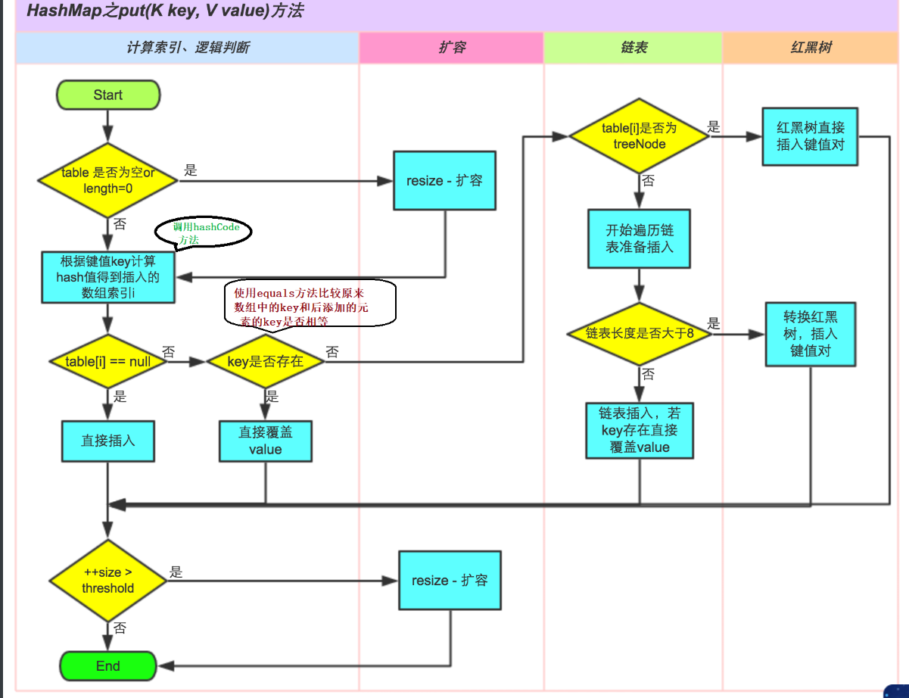
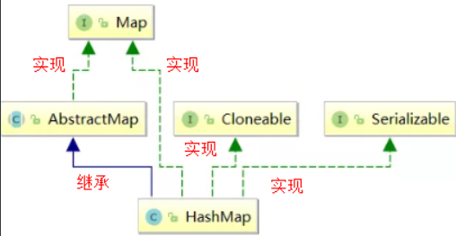
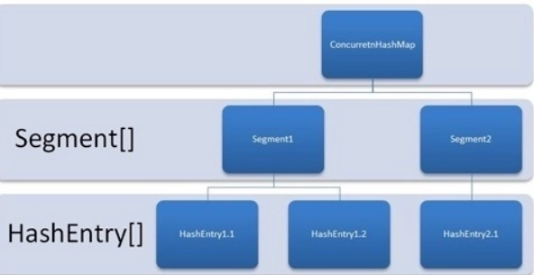

# 二叉树
二叉树是指由一个根节点和两个子节点组成的树形的数据结构，任意的节点最多有两个子节点。

**满二叉树：** 满二叉树要求所有非叶子节点一定有两个子节点，叶子节点一定没有子节点
**完美二叉树：** 满二叉树的软要求，从左到右一定是满，但是最后一层可能不满，所有的结点集中在左侧
**二叉搜索树：** 要求左节点的值一定小于根节点的值，右节点一定大于根节点的值
**平衡二叉树：** 要求左右子树的高度不超过1

**红黑树：** 是一种自平衡的二叉搜索树（平衡+搜索结合特性），所以有二叉搜索树和平衡二叉树的特性，另外还保证：
1. 节点要么是红色，要么是黑色
2. 根节点是黑色
3. 叶子节点都是黑色的空节点
4. 红黑树的红色节点的子节点都是黑色
5. 从任一节点到叶子节点的所有路径都包含相同数目的黑色节点
红黑树的查找、插入、删除的复杂度都是O(logn)，对比正常查找的O(n)效率更高

# 散列表
散列表指通过哈希函数得到的值可以快速得到内存地址的数据结构。
哈希函数是将数据转为下标所使用的一种函数，但是存在的问题是哈希函数可能将多个key转换得到同一种下标。
解决这种哈希冲突的方法是使用拉链法
拉链法的查找效率是O(n)，可以使用红黑树优化查找效率到O(logn)

# HashMap

HashMap的基本特点
1. 存取无序
2. 键位和值位都可以为null，但是键位只能有一个
3. 键位置是唯一的，底层的数据结构哈希表控制的
4. jdk1.8之前底层存储结构是数组+链表，jdk1.8之后是数组+链表+红黑树
5. 链表大小>8并且数组大小>64，才会将链表转为红黑树，变成红黑树的目的就是为了高效的查询，效率升级为O(logn)


HashMap的底层数据结构：
**jdk1.8之前底层存储结构是数组+链表，jdk1.8之后是数组+链表+红黑树**
**HashMap中hash函数是怎么实现的？还有哪些hash函数的实现方式？**
```text
对于key的hashCode做hash操作，无符号右移16位然后做异或运算。
还有平方取中法，伪随机数法和取余数法。这三种效率都比较低。而无符号右移16位异或运算效率是最高的。至于底层是如何计算的我们下面看源码时给大家讲解。
```
**当两个对象的hashCode相等时会怎么样？**
```text
只要两个元素的key计算的哈希码值相同就会发生哈希碰撞。jdk8前使用链表解决哈希碰撞。jdk8之后使用链表+红黑树解决哈希碰撞。
```
**当两个对象的hashCode相等时会怎么样？**
```text
如果两个对象的key相等，那么就使用新的value值替换旧的value，不然就插入到链表的后面，如果达到了边界值（8）那么就需要进行红黑树化
```
**如果两个键的hashcode相同，如何存储键值对？**
```text
hashcode相同，通过equals比较内容是否相同。
相同：则新的value覆盖之前的value
不相同：则将新的键值对添加到哈希表中
```

**默认的扩容方式：扩容为原来容量的2倍，并将原有的数据复制过来。**

**对比传统的HashMap，为什么1.8要引入红黑树？**
对比遍历效率O(n)，使用红黑树可以轻松达到O(logn)的效率，更快

HashMap的存储流程：
通过key的hashcode得到数组的下标索引，位置没有数据就直接插入，有数据就是哈希冲突，根据key的equals比较链表或者红黑树中元素是否相等，相等覆盖，不相等插入到链表或者红黑树中


HashMap的继承关系：实现Map接口、实现Clonable接口支持克隆，实现Serializable支持序列化

- Cloneable 空接口，表示可以克隆。 创建并返回HashMap对象的一个副本。
- Serializable 序列化接口。属于标记性接口。HashMap对象可以被序列化和反序列化。
- AbstractMap 父类提供了Map实现接口。以最大限度地减少实现此接口所需的工作

通过上述继承关系我们发现一个很奇怪的现象， 就是HashMap已经继承了AbstractMap而AbstractMap类实现了Map接口，那为什么HashMap还要在实现Map接口呢？同样在ArrayList中LinkedList中都是这种结构。
据 java 集合框架的创始人Josh Bloch描述，这样的写法是一个失误。在java集合框架中，类似这样的写法很多，最开始写java集合框架的时候，他认为这样写，在某些地方可能是有价值的，直到他意识到错了。显然的，JDK的维护者，后来不认为这个小小的失误值得去修改，所以就这样存在下来了。

集合的成员变量：
初始容量16
```java
//默认的初始容量是16 -- 1<<4相当于1*2的4次方---1*16
static final int DEFAULT_INITIAL_CAPACITY = 1 << 4;   
```
**为什么容量必须是2的n次幂？如果输入值不是2的幂比如10会怎么样？**
当向HashMap中添加一个元素的时候，需要根据key的hash值，去确定其在数组中的具体位置。 HashMap为了存取高效，要尽量较少碰撞，就是要尽量把数据分配均匀，每个链表长度大致相同，这个实现就在把数据存到哪个链表中的算法。
这个算法实际就是取模，hash%length，计算机中直接求余效率不如位移运算(这点上述已经讲解)。所以源码中做了优化,使用 hash&(length-1)，**而实际上hash%length等于hash&(length-1)的前提是length是2的n次幂。所以容量为2的n次幂就是为了查找索引位置更方便**
**如果创建HashMap对象时，输入的数组长度是10，不是2的幂，HashMap通过一通位移运算和或运算得到的肯定是2的幂次数，并且是离那个数最近的数字。**

默认的负载因子0.75：
```java
static final float DEFAULT_LOAD_FACTOR = 0.75f;
```
**loadFactor太大导致查找元素效率低，太小导致数组的利用率低，存放的数据会很分散。loadFactor的默认值为0.75f是官方给出的一个比较好的临界值**。
**当HashMap里面容纳的元素已经达到HashMap数组长度的75%时，表示HashMap太挤了，需要扩容，而扩容这个过程涉及到 rehash、复制数据等操作，非常消耗性能。，所以开发中尽量减少扩容的次数，可以通过创建HashMap集合对象时指定初始容量来尽量避免。**
**为什么加载因子设置为0.75,初始化临界值是12？**
loadFactor越趋近于1，那么 数组中存放的数据(entry)也就越多，也就越密，也就是会让链表的长度增加，loadFactor越小，也就是趋近于0，数组中存放的数据(entry)也就越少，也就越稀疏。所以既兼顾数组利用率又考虑链表不要太多，经过大量测试0.75是最佳方案。

集合的最大容量2^30：
```java
//集合最大容量的上限是：2的30次幂
static final int MAXIMUM_CAPACITY = 1 << 30;
```

**为什么HashMap中节点数超过8才去转为红黑树？**
因为TreeNodes树节点占用空间是普通Nodes的两倍，所以只有当桶包含足够多的节点时才会转成TreeNodes，而是否足够多就是由TREEIFY_THRESHOLD（边界值8）的值决定的。当桶中节点数变少时，又会转成普通的桶。
并且我们查看源码的时候发现，**链表长度达到8就转成红黑树，当长度降到6就转成普通bin**。理想情况下随机hashCode算法下所有bin中节点的分布频率会遵循泊松分布，我们可以看到，一个桶中链表长度达到8个元素的概率为0.00000006，几乎是不可能事件。所以为什么会超过8才会去转为红黑树，这是一种利用空间转时间的做法。

底层存储数据的数组：
```java
//存储元素的数组 
transient Node<K,V>[] table;
```
之前是Entry<K,V>类型，现在改为Node<K,V>

加载因子：
```java
// 加载因子
final float loadFactor;
```


HashMap的扩容机制
1. 什么时候进行扩容
当HashMap中的元素个数超过数组大小(数组长度) * loadFactor(负载因子)时，就会进行数组扩容
**当HashMap中的其中一个链表的对象个数如果达到了8个，此时如果数组长度没有达到64，那么HashMap会先扩容解决，如果已经达到了64，那么这个链表会变成红黑树，节点类型由Node变成TreeNode类型。当然，如果映射关系被移除后，下次执行resize方法时判断树的节点个数低于6，也会再把树转换为链表。**
2. 扩容是什么？
HashMap在进行扩容时，使用的rehash方式非常巧妙，因为每次扩容都是2倍，与原来计算的 (n-1)&hash的结果相比，只是多了一个bit位，所以节点要么就在原来的位置，要么就被分配到"**原位置+旧容量**"这个位置。


遍历HashMap的几种方式
1. 分别遍历Key和value
```java
for (String key : map.getKeySet()) {

}
for (String value : map.values()) {

}
```
2.  使用Iterator迭代器遍历
```java
Iterator<Map.Entry<String, Object>> iterator = map.entrySet().iterator();
while (iterator.hasNext()) {
	Map.Entry<String, Object> mapEntry = iterator.next();
	sout(mapEntry.getKey() + " " + mapEntry.getValue());
}
```
3. 通过get方式（不建议使用）
```java
Set<String> keySet = map.keySet();
for(String str : keySet) {
	sout(map.get(str));
}
```
4. map接口的默认foreach
```java
	HashMap<String,String> m1 = new HashMap();
	m1.put("001", "zhangsan");
	m1.put("002", "lisi");
	m1.forEach((key,value)->{
		System.out.println(key+"---"+value);
	});
```


如何设计Map的初始化容量？
在HashMap中，在HashMap中，threshold = loadFactor * capacity，到达threshold后去扩容是很费时间的。所以我尽可能的不要去resize进行扩容。所以应该一次性的赋值容量的大小，关于这个值可以借用这个公式：$初始化数量 = (需要存储的元素个数 / 负载因子)  + 1$，负载因子默认是0.75。这个公式确保了初始化数量是2的次幂。
为了最大程度的避免扩容带来的性能消耗，我们建议可以把默认容量的数字设置成$initialCapacity/ 0.75F + 1.0F$。


HashMap不是线程安全的，可以以下方法解决：
- 使用Collections.synchronizedMap包装
- 使用ConcurrentHashMap，推荐
- 手动加锁

# HashTable
Hashtable 是 Java 中 java.util 包下的一个遗留集合类，实现了 Map 接口，用于存储键值对，基于哈希表实现。它与 HashMap 类似，但具有线程安全特性，是 Java 1.0 引入的早期类。

底层：底层基于哈希表，使用数组（Entry[] table）存储键值对，每个桶存储链表（处理哈希冲突）。

默认初始化容量11，负载因子0.75，扩容计算：原大小 * 2 + 1

线程安全：所有方法使用 synchronized 关键字，适合多线程环境。


# TreeMap
TreeMap 是 Java 中 java.util 包下的一个集合类，实现了 NavigableMap 接口（继承自 SortedMap 和 Map），基于红黑树实现，用于存储键值对。它保证键的有序性，**适合需要自定义排序的场景**。

底层实现基于红黑树机制，通过旋转和重新着色保持平衡

非线程安全

# ConcurrentHashMap
ConcurrentHashMap线程安全的哈希表实现，专为高并发场景设计，JDK7基于分段锁，JDK8及之后使用CAS+Synchronized同步
Java 7 版本的 ConcurrentHashMap 是基于分段锁的，就是将内部分成不同的 Segment（段），每个段里面是 HashEntry 数组。

Segment 继承自 ReentrantLock，所以不会像 Hashtable 那样不管是 put 还是 get 都需要 synchronized，锁的力度变小了，每个线程只锁一个 Segment，对其他线程访问的 Segment 没有影响。
Java 8 和之后的版本在此基础上做了很大的改进，不再采用分段锁的机制了，而是利用 CAS（Compare and Swap，即比较并替换，实现并发算法时常用到的一种技术）和 synchronized 来保证并发，虽然内部仍然定义了 Segment，但仅仅是为了保证序列化时的兼容性
底层数据结构也接近于HashMap（数组+链表+红黑树）


# HashMap、Hashtable、ConcurrentHashMap的区别？

参考资料：[HashMap和ConcurrentHashMap的区别？](https://www.itwanger.com/java/2020/09/01/java-concurrentHashMap.html)

Hashtable是早期Java提供，底层使用线程安全的哈希表，所有的方法通过`synchronized`关键字实现同步，效率很低

HashMap基于非线程安全的数组+链表实现，JDK8 后引入红黑树优化链表过长问题，允许key一个null键和value多个null值，适用于单线程环境。

ConcurrentHashMap线程安全的哈希表实现，专为高并发场景设计

**比较：**
1. 线程安全性：
	1. HashMap 不保证线程安全，多线程下会导致数据不一致或者死循环
	2. Hashtable对所有的方法加`Synchronized`锁，锁粒度大，性能差，效率低
	3. ConcurrentHashMap才有更细粒度的锁：
		1. JDK7使用分段锁，将数据分为多个段，每个段独立加锁
		2. JDK8使用CAS+Synchronized关键字，结合红黑树+volatile关键字优化性能
		3. 适合高并发场景，读无锁，写只锁部分数据
2. 性能：
	1. HashMap单线程下性能最优
	2. Hashtable性能最低
	3. ConcurrentHashMap在多线程下性能远高于Hashtable，接近HashMap性能
3. 迭代行为：
	1. HashMap迭代过程中修改数据，会抛出异常，快速失败fast-fail
	2. Hashtable同样是快速失败
	3. ConcurrentHashMap迭代过程中修改数据，不会抛出异常，结果是迭代开始的数据，安全失败safe-fail
4. 扩容行为：
	1. HashMap默认容量16，负载因子0.75，扩容容量翻倍
	2. Hashtable默认容量11，负载因子0.75，扩容容量2n+1
	3. ConcurrentHashMap默认容量16，负载因子0.75，扩容机制类似HashMap
5. 使用场景：
	1. HashMap适合单线程或外部已保证线程安全的场景，如局部变量或同步块内。
	2. Hashtable几乎被淘汰
	3. ConcurrentHashMap适合多线程高并发场景，如缓存、共享数据结构等。
