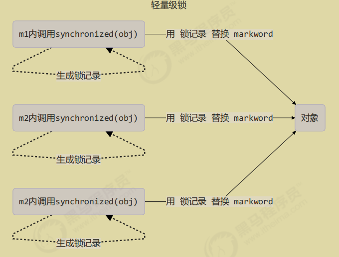
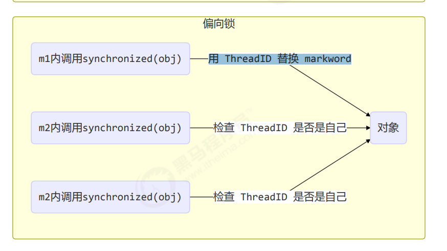
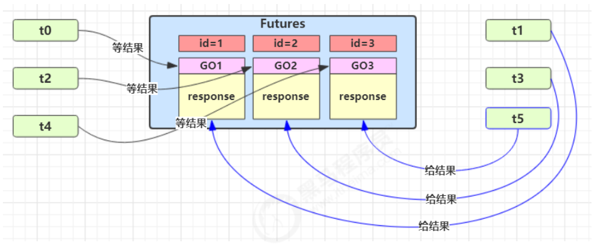
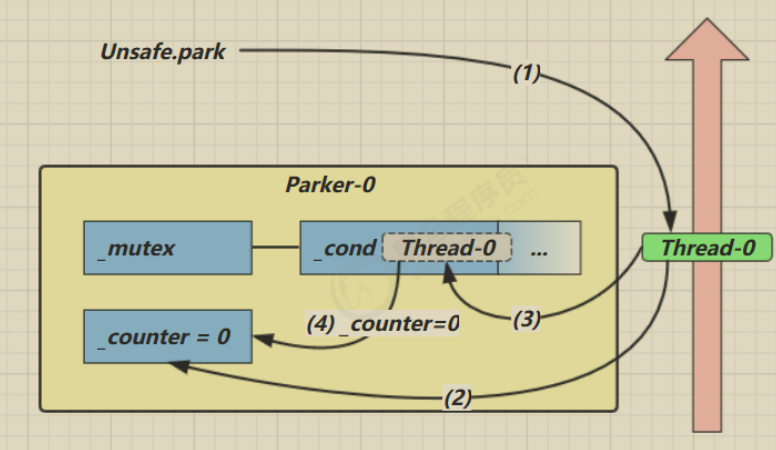

# JUC

# 进程和线程
## 进程和线程的概念
 进程：是计算机分配资源的基本单位
+ **程序由指令和数据组成**，但这些指令要运行，数据要读写，就必须将指令加载至 CPU，数据加载至内存。在 指令运行过程中还需要用到磁盘、网络等设备。进程就是用来加载指令、管理内存、管理 IO 的 
+ 当一个程序被运行，从磁盘加载这个程序的代码至内存，这时就开启了一个进程。 进程就可以视为程序的一个实例。
+ 大部分程序可以同时运行多个实例进程（例如记事本、画图、浏览器 等），也有的程序只能启动一个实例进程（例如网易云音乐、360 安全卫士等）  

线程：是计算机执行指令的基本单位
+ 一个进程之内可以分为一到多个线程。 
+ 一个线程就是一个指令流，将指令流中的一条条指令以一定的顺序交给 CPU 执行 Java 中，线程作为最小调度单位，
+ 进程作为资源分配的最小单位。 在 windows 中进程是不活动的，只是作为线程的容器  

**两者的对比**
+ 进程基本上相互独立的，而线程存在于进程内，是进程的一个子集 
+ 进程拥有共享的资源，如内存空间等，供其内部的线程共享 进程间通信较为复杂 同一台计算机的进程通信称为 IPC（Inter-process communication） 
+ 不同计算机之间的进程通信，需要通过网络，并遵守共同的协议，例如 HTTP 线程通信相对简单，因为它们共享进程内的内存，一个例子是多个线程可以访问同一个共享变量 线程更轻量，线程上下文切换成本一般上要比进程上下文切换低  

## 并行和并发
 单核 cpu 下，线程实际还是 串行执行 的。操作系统中有一个组件叫做任务调度器，将 cpu 的时间片（windows 下时间片最小约为 15 毫秒）分给不同的程序使用，只是由于 cpu 在线程间（时间片很短）的切换非常快，人类感 觉是 同时运行的 。总结为一句话就是： 微观串行，宏观并行 ， 一般会将这种 线程轮流使用 CPU 的做法称为并发（concurrent）  
多核CPU下，每个核core都可以调度运行线程，此时线程的执行是并行的。
引用Rob Pike（golang创始人）的一段描述：
+ 并发：指同一时间内应对多件事情的能力
+ 并行：指同一时间内动手做多件事情的能力


## 应用
### 应用之异步调用
以调用方角度来讲，如果 
+ **需要等待结果返回，才能继续运行就是同步**
+ **不需要等待结果返回，就能继续运行就是异步**
### 应用之提高效率（使用多核CPU的特点）
 充分利用多核 cpu 的优势，提高运行效率。  比如有三个计算，每个计算都耗时不同：第一个计算耗时10ms，第二个计算耗时5ms，第三个计算耗时15ms，相加还需要耗时1ms，如果是单核cpu，那么总共就是10+5+15+1=31ms，如果是4核cpu，那么总共的耗时就是15+1ms（相加不能并行，因为还是等结果都出来才能相加），因为多核cpu可以并行处理。

设计：
**实战：使用多线程充分利用CPU：**
环境搭建：
+ 基准测试工具选择，使用了比较靠谱的 JMH（JDK自带的一种测试工具，忽略原本的优化，然每一次测试结果都一样），它会执行程序预热，执行多次测试并平均  
+  cpu 核数限制，有两种思路  ：
第一种是使用虚拟机，分配合适的核
第二种是使用msconfig，分配合适的核，需要重启比较麻烦

+ 并行计算方式的选择：
第一种是使用parallel stream
第二种是自己手动控制thread，实现简单的并行计算。程序使用的是第二种。


pom文件如下：引入jmh的jar包，使用build在打包的时候生成jar包。

```xml
<?xml version="1.0" encoding="UTF-8"?>
<project xmlns="http://maven.apache.org/POM/4.0.0"
  xmlns:xsi="http://www.w3.org/2001/XMLSchema-instance"
  xsi:schemaLocation="http://maven.apache.org/POM/4.0.0 http://maven.apache.org/xsd/maven-4.0.0.xsd">
  <modelVersion>4.0.0</modelVersion>

  <groupId>com.yang</groupId>
  <artifactId>JUC</artifactId>
  <version>1.0-SNAPSHOT</version>

  <properties>
    <maven.compiler.source>8</maven.compiler.source>
    <maven.compiler.target>8</maven.compiler.target>
    <project.build.sourceEncoding>UTF-8</project.build.sourceEncoding>
    <uberjar.name>benchmarks</uberjar.name>
    <jmh.version>1.0</jmh.version>
    <java.target>1.8</java.target>
  </properties>

  <dependencies>
    <dependency>
      <groupId>org.projectlombok</groupId>
      <artifactId>lombok</artifactId>
      <version>1.18.34</version>
    </dependency>
    <dependency>
      <groupId>ch.qos.logback</groupId>
      <artifactId>logback-classic</artifactId>
      <version>1.5.6</version>
    </dependency>
    <dependency>
      <groupId>org.openjdk.jmh</groupId>
      <artifactId>jmh-core</artifactId>
      <version>${jmh.version}</version>
    </dependency>
    <dependency>
      <groupId>org.openjdk.jmh</groupId>
      <artifactId>jmh-generator-annprocess</artifactId>
      <version>${jmh.version}</version>
      <scope>provided</scope>
    </dependency>
  </dependencies>

  <build>
    <plugins>
      <plugin>
        <groupId>org.apache.maven.plugins</groupId>
        <artifactId>maven-compiler-plugin</artifactId>
        <version>3.1</version>
        <configuration>
          <compilerVersion>${javac.target}</compilerVersion>
          <source>${javac.target}</source>
          <target>${javac.target}</target>
        </configuration>
      </plugin>
      <plugin>
        <groupId>org.apache.maven.plugins</groupId>
        <artifactId>maven-shade-plugin</artifactId>
        <version>2.2</version>
        <executions>
          <execution>
            <phase>package</phase>
            <goals>
              <goal>shade</goal>
            </goals>
            <configuration>
              <finalName>${uberjar.name}</finalName>
              <transformers>
                <transformer
                  implementation="org.apache.maven.plugins.shade.resource.ManifestResourceTransformer">
                  <mainClass>org.openjdk.jmh.Main</mainClass>
                </transformer>
              </transformers>
              <filters>
                                <filter>
                                    <!--
                                        Shading signed JARs will fail without this.
                                        http://stackoverflow.com/questions/999489/invalid-signature-file-when-attempting-to-run-a-jar
                                    -->
                                    <artifact>*:*</artifact>
                                    <excludes>
                                        <exclude>META-INF/*.SF</exclude>
                                        <exclude>META-INF/*.DSA</exclude>
                                        <exclude>META-INF/*.RSA</exclude>
                                    </excludes>
                                </filter>
                            </filters>
                        </configuration>
                    </execution>
                </executions>
            </plugin>
        </plugins>
        <pluginManagement>
            <plugins>
                <plugin>
                    <artifactId>maven-clean-plugin</artifactId>
                    <version>2.5</version>
                </plugin>
                <plugin>
                    <artifactId>maven-deploy-plugin</artifactId>
                    <version>2.8.1</version>
                </plugin>
                <plugin>
                    <artifactId>maven-install-plugin</artifactId>
                    <version>2.5.1</version>
                </plugin>
                <plugin>
                    <artifactId>maven-jar-plugin</artifactId>
                    <version>2.4</version>
                </plugin>
                <plugin>
                    <artifactId>maven-javadoc-plugin</artifactId>
                    <version>2.9.1</version>
                </plugin>
                <plugin>
                    <artifactId>maven-resources-plugin</artifactId>
                    <version>2.6</version>
                </plugin>
                <plugin>
                    <artifactId>maven-site-plugin</artifactId>
                    <version>3.3</version>
                </plugin>
                <plugin>
                    <artifactId>maven-source-plugin</artifactId>
                    <version>2.2.1</version>
                </plugin>
                <plugin>
                    <artifactId>maven-surefire-plugin</artifactId>
                    <version>2.17</version>
                </plugin>
            </plugins>
        </pluginManagement>
    </build>

</project>
```
测试代码：
```java
package com.yang;

import org.openjdk.jmh.annotations.*;

import java.util.Arrays;
import java.util.concurrent.FutureTask;

@Fork(1)        //指定基准测试将会被 fork（即在单独的 JVM 实例中运行）的次数。
// Forking 可以隔离 JIT 编译和其他 JVM 层面的影响，使基准测试更加准确。
@BenchmarkMode(Mode.AverageTime)  //指定基准模式，这里表示测量方法执行的平均时间
//JMH 提供了多种测量模式，如吞吐量（Mode.Throughput）、采样时间（Mode.SampleTime）、单次调用时间（Mode.SingleShotTime）等。
@Warmup(iterations=3)
//这个注解指定基准测试的预热阶段的设置。iterations=3 表示在实际测量之前，JMH 会先运行 3 次，以便 JVM 执行一些优化（如 JIT 编译）。
// 预热阶段的目的是让 JVM 达到“稳定状态”，以便更准确地测量性能。
@Measurement(iterations=5) //这个注解指定实际基准测试的测量阶段的设置。
//iterations=5 表示基准测试将在测量阶段运行 5 次，并记录每次的结果。这样可以获得更准确的性能数据。
public class MyBenchmark {
    static int[] ARRAY = new int[1000_000_00];
    //1000_000_00 是一种书写大数字的方式，相当于 100000000，这种方式可以增加数字的可读性。
    static {
        Arrays.fill(ARRAY, 1);
    }
    @Benchmark //告诉 JMH 框架哪个方法是需要进行性能测试的
    //被 @Benchmark 注解的方法将会被 JMH 多次调用，根据基准测试的配置（如预热、测量次数、模式等）进行性能测量。
    public int c() throws Exception {
        int[] array = ARRAY;
        //FutureTask 是一种封装异步计算的对象，它可以用于表示和管理一个计算任务的结果，特别是在需要使用多线程进行并行计算时非常有用。
        FutureTask<Integer> t1 = new FutureTask<>(()->{
            int sum = 0;
            for(int i = 0; i < 250_000_00;i++) {
                sum += array[0+i];
            }
            return sum;
        });
        FutureTask<Integer> t2 = new FutureTask<>(()->{
            int sum = 0;
            for(int i = 0; i < 250_000_00;i++) {
                sum += array[250_000_00+i];
            }
            return sum;
        });
        FutureTask<Integer> t3 = new FutureTask<>(()->{
            int sum = 0;
            for(int i = 0; i < 250_000_00;i++) {
                sum += array[500_000_00+i];
            }
            return sum;
        });
        FutureTask<Integer> t4 = new FutureTask<>(()->{
            int sum = 0;
            for(int i = 0; i < 250_000_00;i++) {
                sum += array[750_000_00+i];
            }
            return sum;
        });
        new Thread(t1).start();
        new Thread(t2).start();
        new Thread(t3).start();
        new Thread(t4).start();
        return t1.get() + t2.get() + t3.get()+ t4.get();
    }
    @Benchmark
    public int d() throws Exception {
        int[] array = ARRAY;
        FutureTask<Integer> t1 = new FutureTask<>(()->{
            int sum = 0;
            for(int i = 0; i < 1000_000_00;i++) {
                sum += array[0+i];
            }
            return sum;
        });
        new Thread(t1).start();
        return t1.get();
    }

}

```

执行结果分析：
```powershell
E:\javacode\juc\JUC\target>java -jar benchmarks.jar
# VM invoker: D:\DevTools\jdk17\bin\java.exe
# VM options: <none>
# Warmup: 3 iterations, 1 s each	  预热次数
# Measurement: 5 iterations, 1 s each     正式测量次数
# Threads: 1 thread, will synchronize iterations     使用单个线程	
# Benchmark mode: Average time, time/op				基准模式，使用平均时间模式，测试每次操作的平均时间
# Benchmark: com.yang.MyBenchmark.c						测试基准的方法

# Run progress: 0.00% complete, ETA 00:00:16
# Fork: 1 of 1
# Warmup Iteration   1: 0.017 s/op		预热迭代
# Warmup Iteration   2: 0.017 s/op
# Warmup Iteration   3: 0.017 s/op
Iteration   1: 0.017 s/op							正式测量迭代
Iteration   2: 0.017 s/op
Iteration   3: 0.017 s/op
Iteration   4: 0.017 s/op
Iteration   5: 0.017 s/op


Result: 0.017 ±(99.9%) 0.000 s/op [Average]   平均时间  标准误差
  Statistics: (min, avg, max) = (0.017, 0.017, 0.017), stdev = 0.000
  Confidence interval (99.9%): [0.017, 0.017]   置信空间


# VM invoker: D:\DevTools\jdk17\bin\java.exe
# VM options: <none>
# Warmup: 3 iterations, 1 s each
# Measurement: 5 iterations, 1 s each
# Threads: 1 thread, will synchronize iterations
# Benchmark mode: Average time, time/op
# Benchmark: com.yang.MyBenchmark.d

# Run progress: 50.00% complete, ETA 00:00:10
# Fork: 1 of 1
# Warmup Iteration   1: 0.023 s/op
# Warmup Iteration   2: 0.022 s/op
# Warmup Iteration   3: 0.022 s/op
Iteration   1: 0.022 s/op
Iteration   2: 0.022 s/op
Iteration   3: 0.022 s/op
Iteration   4: 0.023 s/op
Iteration   5: 0.023 s/op


Result: 0.022 ±(99.9%) 0.002 s/op [Average]
  Statistics: (min, avg, max) = (0.022, 0.022, 0.023), stdev = 0.000
  Confidence interval (99.9%): [0.021, 0.024]


# Run complete. Total time: 00:00:20

Benchmark            Mode  Samples  Score  Score error  Units
c.y.MyBenchmark.c    avgt        5  0.017        0.000   s/op
c.y.MyBenchmark.d    avgt        5  0.022        0.002   s/op
```


结论：
+  单核 cpu 下，多线程不能实际提高程序运行效率，只是为了能够在不同的任务之间切换，不同线程轮流使用 cpu ，不至于一个线程总占用 cpu，别的线程没法干活  
+  多核 cpu 可以并行跑多个线程，但能否提高程序运行效率还是要分情况的  
    -  有些任务，经过精心设计，将任务拆分，并行执行，当然可以提高程序的运行效率。但不是所有计算任 务都能拆分（参考后文的【阿姆达尔定律】）  
    -  也不是所有任务都需要拆分，任务的目的如果不同，谈拆分和效率没啥意义  
+  IO 操作不占用 cpu，只是我们一般拷贝文件使用的是【阻塞 IO】，这时相当于线程，虽然不用 cpu，但需要一 直等待 IO 结束，没能充分利用线程。所以才有后面的【非阻塞 IO】和【异步 IO】优化  


# 线程
## 创建和运行线程
1. 直接使用Thread对象
```java
Thread t1 = new Thread("t1") {
    @Override
    public void run() {
        System.out.println(Thread.currentThread() + Thread.currentThread().getName() + "hello");
    }
};
t1.start();
```
2. 使用Runnable接口创建线程，这种方式将任务和创建线程分开
```java
Runnable r1 = new Runnable() {
            @Override
            public void run() {
                System.out.println(Thread.currentThread().getName() + " hello");
            }
        };
        Thread t1 = new Thread(r1, "t1");
        t1.start();
```

Thread和Runnable的区别：
+ **Thread创建是把线程和任务合并在了一起，Runnable是把线程和任务分开了**
+ 用 Runnable 更容易与线程池等高级 API 配合 
+ 用 Runnable 让任务类脱离了 Thread 继承体系，更灵活  
3. FutureTask配合Thread

`FutureTask` 是一个可以执行异步任务的类，用来执行一个耗时的操作，并在未来获取结果。它非常适合用于多线程环境中，尤其是在并发计算中，任务需要异步执行并返回结果的场景。  
FutureTask 封装了一个任务（通过 Callable 或 Runnable 定义），可以在单独的线程中运行。
```java
@Test  
public void test01() throws ExecutionException, InterruptedException {  
    Runnable rn = new Runnable() {  
        @Override  
        public void run() {  
            System.out.println("线程1.....");  
        }  
    };  
    FutureTask<Object> f1 = new FutureTask<>(rn, null);  
    new Thread(f1).start();  
    Callable<String> ca = new Callable<String>() {  
        @Override  
        public String call() throws Exception {  
            System.out.println("线程2...");  
            return "返回值1";  
        }  
    };  
    FutureTask<String> f2 = new FutureTask<>(ca);  
    new Thread(f2).start();  
    Object o = f1.get();  
    System.out.println("futuretask1x执行结果：" + o);  
    String result = f2.get();  
    System.out.println("futuretask2执行结果：" + result);  
    //通过线程池执行  
	ExecutorService executor = Executors.newFixedThreadPool(1);  
	FutureTask<String> futureTask = new FutureTask<>(() -> {  
	    System.out.println("线程池执行....");  
	}, "返回值2");  
	executor.submit(futureTask); // 提交任务  
	executor.shutdown();  
	System.out.println("futuretask执行结果：" + futureTask.get());
}

```

## 线程运行原理
**栈与栈帧**
 我们都知道 JVM 中由程序计数器、堆、栈、方法区、直接内存、类加载器所组成，其中栈
 内存是给谁用的呢？
其实就是线程，每个线程启动后，虚拟机就会为其分配一块栈内存。 每个栈由多个栈帧（Frame）组成，对应着每次方法调用时所占用的内存 
每个线程只能有一个活动栈帧，对应着当前正在执行的那个方法  

**线程的上下文切换（Thread Context Switch）：**
 因为以下一些原因导致 cpu 不再执行当前的线程，转而执行另一个线程的代码 
+ 线程的 cpu 时间片用完 
+ 垃圾回收 
+ 有更高优先级的线程需要运行
+ 线程自己调用了 sleep、yield、wait、join、park、synchronized、lock 等方法 
当 Context Switch 发生时，需要由操作系统保存当前线程的状态，并恢复另一个线程的状态，Java 中对应的概念 就是程序计数器（Program Counter Register），它的作用是记住下一条 jvm 指令的执行地址，是线程私有的 
+ 状态包括程序计数器、虚拟机栈中每个栈帧的信息，如局部变量、操作数栈、返回地址等 
+ Context Switch 频繁发生会影响性能  
## 常见方法
|         方法名          | static | 功能说明                                 |                                                          注意                                                           |
| :------------------: | :----: | ------------------------------------ | :-------------------------------------------------------------------------------------------------------------------: |
|       start()        |        | 开启线程执行，运行run()方法                     |    **start 方法只是让线程进入就绪**，里面代码不一定立刻 运行（CPU 的时间片还没分给它）。每个线程对象的 start方法只能调用一次，如果调用了多次会出现 IllegalThreadStateException     |
|        run()         |        | 线程启动后会调用的方法                          |        如果在构造 Thread 对象时传递了 Runnable 参数，则 线程启动后会调用 Runnable 中的 run 方法，否则默 认不执行任何操作。但可以创建 Thread 的子类对象， 来覆盖默认行为         |
|        join()        |        | 等待线程运行结果                             |                                                                                                                       |
|     join(long n)     |        | 等待线程运行，最多等待n毫秒                       |                                                                                                                       |
|       getId()        |        | 获取线程长整形的id                           |                                                         id唯一                                                          |
|      getName()       |        | 获取线程名                                |                                                                                                                       |
| setName(String name) |        | 修改线程名                                |                                                                                                                       |
|    getPriority()     |        | 获取线程优先级                              |                                                                                                                       |
|   setPriority(int)   |        | 设置线程优先级                              |                                    java中规定线程优先级是1~10 的整数，较大的优先级 能提高该线程被 CPU 调度的机率                                     |
|      getState()      |        | 获取线程状态                               |               Java 中线程状态是用 6 个 enum 表示，分别为： NEW, RUNNABLE, BLOCKED, WAITING, TIMED_WAITING, TERMINATED                |
|   isInterrupted()    |        | 判断是否被打断                              |                                                       不会清除打断标记                                                        |
|      isAlive()       |        | 线程是否存活（还没有运行完）                       |                                                                                                                       |
|     interrupt()      |        | 打断线程                                 | 如果被打断线程正在 sleep，wait，join 会导致被打断 的线程抛出 InterruptedException，并清除 打断标 记 ；如果打断的正在运行的线程，则会设置 打断标 记 ；park 的线程被打断，也会设置 打断标记 |
|    interrupted()     | static | 判断当前线程是否被打断                          |                                                        会清除打断标记                                                        |
|   currentThread()    | static | 获取当前正在执行的线程                          |                                                                                                                       |
|       sleep()        | static | 让当前执行的线 程休眠n毫秒， 休眠时让出 cpu 的时间片给其它 线程 |                                                                                                                       |
|       yield()        | static | 提示线程调度器 让出当前线程对 CPU的使用               |                                                      主要是为了调试和测试                                                       |


## start和run
调用run方法
```java
Thread t1 = new Thread("t1") {
	@Override
	public void run() {
		System.out.println(Thread.currentThread().getName() + " hello");
	}
};
t1.run();
System.out.println("over!!!!!!!");
```

上面的程序还在main线程运行，并且run()方法的执行是同步的。
将run()方法改为start()方法，重新执行。
程序在t1线程执行，方法run执行是异步的。
总结：
+ 直接调用run方法是在主线程中执行run()方法，相当于同步的调用方法
+ 通过start()调用run()，是启动新线程，间接的执行run中的代码

## sleep和yield
sleep: 
1. **调用 sleep 会让当前线程从 Running 进入 Timed Waiting 状态（阻塞），睡眠时间结束，变为Runnable状态，等待线程调度**
2. 其它线程可以使用 interrupt 方法打断正在睡眠的线程，这时 sleep 方法会抛出 InterruptedException（被打断异常）
3. 睡眠结束后的线程未必会立刻得到执行 
4. 建议用 TimeUnit 的 sleep 代替 Thread 的 sleep 来获得更好的可读性  
sleep的过程不允许被打断，被打断必须要进行异常捕获
```java
@Test  
public void test02() {  
    Thread sleepThread = new Thread(() -> {  
        System.out.println("线程状态：" + Thread.currentThread().getState());  
        try {  
            TimeUnit.SECONDS.sleep(10);  
        } catch (InterruptedException e) {  
            System.out.println("被打断：" + e.getMessage());  
            throw new RuntimeException(e);  
        }  
        System.out.println("睡醒，重新竞选CPU...");  
    }, "sleepThread");  
    Thread interruptThread = new Thread(() -> {  
        System.out.println("线程状态：" + Thread.currentThread().getState());  
        //打断睡觉线程  
        sleepThread.interrupt();  
        System.out.println("结束线程...");  
    }, "interruptThread");  
    sleepThread.start();  
    interruptThread.start();  
}
```

yield:
1. **调用 yield 会让当前线程从 Running 进入 Runnable 就绪状态**，是否真正让出 CPU 以及让给哪个线程，取决于 JVM 实现和操作系统的调度策略。
2.  具体的实现依赖于操作系统的任务调度器  

线程优先级：
+ 线程优先级会提示（hint）调度器优先调度该线程，但是它仅仅是一个提示，调度器可以忽略它
+ 如果cpu比较忙，那么优先级高的线程会获得更多的时间片，如果cpu闲，优先级几乎没有作用
```java
public class YieldDemo {
    public static void main(String[] args) {
        // 创建两个线程
        Thread thread1 = new Thread(new Task("Thread-1", true), "Thread-1");
        Thread thread2 = new Thread(new Task("Thread-2", false), "Thread-2");

        // 设置相同优先级，确保调度竞争
        thread1.setPriority(Thread.NORM_PRIORITY);
        thread2.setPriority(Thread.NORM_PRIORITY);

        // 启动线程
        thread1.start();
        thread2.start();
    }

    static class Task implements Runnable {
        private final String name;
        private final boolean useYield;

        Task(String name, boolean useYield) {
            this.name = name;
            this.useYield = useYield;
        }

        @Override
        public void run() {
            for (int i = 0; i < 5; i++) {
                System.out.println(name + " executing, count: " + i);
                if (useYield) {
                    System.out.println(name + " yielding...");
                    Thread.yield(); // Thread-1 调用 yield，尝试让出 CPU
                }
            }
            System.out.println(name + " finished.");
        }
    }
}
```

## join方法
join的作用是让当前线程等待调用了join方法的线程先执行。
join的三种形式：
```java
//1. 无限期等待
thread.join();
//2. 等待多少millis毫秒
thread.join(long millis)
//3. void join(long millis, int nanos)：类似 join(long millis)，但支持更精确的纳秒级超时
thread.join(1000, 500000); // 等待 1 秒 + 500000 纳秒
```
示例代码：主线程调用join等待worker1、 Worker2先执行：
```java
public class JoinDemo {
    public static void main(String[] args) {
        // 创建两个子线程
        Thread worker1 = new Thread(() -> {
            System.out.println("Worker1 started");
            try {
                Thread.sleep(2000); // 模拟耗时任务
            } catch (InterruptedException e) {
                System.out.println("Worker1 interrupted");
            }
            System.out.println("Worker1 finished");
        }, "Worker1");

        Thread worker2 = new Thread(() -> {
            System.out.println("Worker2 started");
            try {
                Thread.sleep(1000); // 模拟较短的任务
            } catch (InterruptedException e) {
                System.out.println("Worker2 interrupted");
            }
            System.out.println("Worker2 finished");
        }, "Worker2");

        // 主线程逻辑
        System.out.println("Main thread starting workers...");
        worker1.start();
        worker2.start();

        try {
            // 主线程等待 Worker1 完成（无超时）
            System.out.println("Main thread waiting for Worker1 to finish...");
            worker1.join();
            System.out.println("Worker1 has finished, main thread continues");

            // 主线程等待 Worker2 最多 500ms
            System.out.println("Main thread waiting for Worker2 (max 500ms)...");
            worker2.join(500);
            System.out.println("Main thread done waiting for Worker2");

        } catch (InterruptedException e) {
            System.out.println("Main thread interrupted while waiting");
        }

        // 检查线程状态
        System.out.println("Worker1 is alive: " + worker1.isAlive());
        System.out.println("Worker2 is alive: " + worker2.isAlive());
        System.out.println("Main thread finished");
    }
}
```
### 应用之同步案例
以调用方来看：
+ 需要等待结果返回，才能继续运行就是同步
+ 不需要结果返回，就能运行就是异步

**等待多个结果：**
```java
static int r1;
static int r2;
public staic void main(String[] args) throws InterruptedException{
    test2();
}
public static void test2() throws InterruptedException {
    Thread t1 = new Thread(() -> {
        try {
            sleep(1000);
        } catch (InterruptedException e) {
            throw new RuntimeException(e);
        }
        r1 = 10;
    });
    Thread t2 = new Thread(() -> {
        try {
            sleep(2000);
        } catch (InterruptedException e) {
            throw new RuntimeException(e);
        }
        r2 = 20;
    });
    long start = System.currentTimeMillis();
    t1.start();
    t2.start();
    t1.join();
    t2.join();
    // t1.join();
    long end = System.currentTimeMillis();
    System.out.println("执行时间：" + (end - start));
    System.out.println("赋值：" + r1 + " " + r2); 
}
```

分析：在等待t1的时候，t2也会执行，所以在t1执行完，t2也执行了1s，然后t2接着执行，t2也执行1s，所以总共的执行时间在2s。

颠倒两个join也是一样的执行时间。


## interrupt方法
**打断sleep、wait、join的线程：**

这三个方法都会使线程进入阻塞状态。
1. **打断sleep进程**，会清空打断状态：
```java
public static void test1() throws InterruptedException {
    Thread t1 = new Thread(() -> {
        try {
            sleep(1000);
        } catch (InterruptedException e) {
            throw new RuntimeException(e);
        }
    }, "t1");
    t1.start();
    System.out.println("打断状态：" + t1.isInterrupted());
    sleep(500);
    t1.interrupt();
    System.out.println("打断状态：" + t1.isInterrupted());
	System.out.println("打断状态：" + t1.isInterrupted());
}
```

输出结果：
```java
打断状态：false
打断状态：true   //这里获取打断状态并且清空
打断状态：false  //所以这一次获取为false
Exception in thread "t1" java.lang.RuntimeException: java.lang.InterruptedException: sleep interrupted
	at com.yang.test.thread.Interrupt.lambda$test1$0(Interrupt.java:15)
	at java.lang.Thread.run(Thread.java:750)
Caused by: java.lang.InterruptedException: sleep interrupted
	at java.lang.Thread.sleep(Native Method)
	at com.yang.test.thread.Interrupt.lambda$test1$0(Interrupt.java:13)
	... 1 more
```

2. **打断正常运行的线程：**
打断正常运行的线程，不会清除打断标记。
```java
public static void test2() throws InterruptedException {
    Thread t1 = new Thread(() -> {
        while (true) {
            Thread thread = Thread.currentThread();
            boolean interrupted = thread.isInterrupted();
            System.out.println("打断状态：" + interrupted);
            if (interrupted) {
                break;
            }
        }
    });
    t1.start();
    sleep(2000);
    t1.interrupt();
}
```

运行结果：2s后，打断正常运行的线程，打断的标记为true

### 模式之两阶段终止

在一个线程 T1 中如何“优雅”终止线程 T2？这里的【优雅】指的是给 T2 一个料理后事的机会。

错误思想：
使用线程对象的 stop() 方法停止线程 
+ stop 方法会真正杀死线程，如果这时线程锁住了共享资源，那么当它被杀死后就再也没有机会释放锁， 
其它线程将永远无法获取锁 
+ 使用 System.exit(int) 方法停止线程 
+ 目的仅是停止一个线程，但这种做法会让整个程序都停止
**最佳实现：**


1. 利用interrupted
```java
class TPTInterrupt {
     private Thread thread;
     public void start(){
         thread = new Thread(() -> {
             while(true) {
                 Thread current = Thread.currentThread();
                 if(current.isInterrupted()) {
                 log.debug("料理后事");
                 break;
			 }
             try {
                 Thread.sleep(1000);
                 log.debug("将结果保存");
             } catch (InterruptedException e) {
	            //有异常进行打断
                 current.interrupt();
             }
                 // 执行监控操作 
             }
         },"监控线程");
         thread.start();
     }
     public void stop() {
         thread.interrupt();
     }
}

//调用
TPTInterrupt t = new TPTInterrupt();
t.start();
Thread.sleep(3500);
log.debug("stop");
t.stop();

//输出
11:49:42.915 c.TwoPhaseTermination [监控线程] - 将结果保存
11:49:43.919 c.TwoPhaseTermination [监控线程] - 将结果保存
11:49:44.919 c.TwoPhaseTermination [监控线程] - 将结果保存
11:49:45.413 c.TestTwoPhaseTermination [main] - stop 
11:49:45.413 c.TwoPhaseTermination [监控线程] - 料理后事
```

2. 利用停止标记volatile，调用stop把volatile变量设置为true，然后检测到true直接准备料理后事
```java
// 停止标记用 volatile 是为了保证该变量在多个线程之间的可见性
// 我们的例子中，即主线程把它修改为 true 对 t1 线程可见
class TPTVolatile {
     private Thread thread;
     private volatile boolean stop = false;
     public void start(){
         thread = new Thread(() -> {
             while(true) {
                 Thread current = Thread.currentThread();
                 if(stop) {
                     log.debug("料理后事");
                     break;
                 }
                 try {
                     Thread.sleep(1000);
                     log.debug("将结果保存");
                 } catch (InterruptedException e) {
                 }
                 // 执行监控操作
             }
         },"监控线程");
         thread.start();
     }
     public void stop() {
         stop = true;
         thread.interrupt();
     }
}

//调用
TPTVolatile t = new TPTVolatile();
t.start();
Thread.sleep(3500);
log.debug("stop");
t.stop();

//结果
11:54:52.003 c.TPTVolatile [监控线程] - 将结果保存
11:54:53.006 c.TPTVolatile [监控线程] - 将结果保存
11:54:54.007 c.TPTVolatile [监控线程] - 将结果保存
11:54:54.502 c.TestTwoPhaseTermination [main] - stop 
11:54:54.502 c.TPTVolatile [监控线程] - 料理后事
```


3. **打断park进程，不会清除打断标记（标记一下：这个和模式之两阶段分开）**
在 Java 中，LockSupport.park() 是 java.util.concurrent.locks.LockSupport 类提供的一个静态方法，用于暂停（阻塞）当前线程，使其进入 WAITING 或 TIMED_WAITING 状态，直到被唤醒或满足特定条件。
```java
    public static void test3() throws InterruptedException {
        Thread t1 = new Thread(() -> {
            LockSupport.park();         //阻塞线程
            System.out.println("打断状态：" + Thread.currentThread().isInterrupted());
        }, "t1");
        t1.start();
        sleep(1000);
        t1.interrupt();
    }
```
输出结果：打断状态：true
如果打断标记为true，不重置的话，那么park就失效了。
```java
public static void test3() throws InterruptedException {
        Thread t1 = new Thread(() -> {
            for (int i = 0; i < 5; i++) {
                LockSupport.park();         //阻塞线程
                System.out.println("打断状态：" + Thread.currentThread().isInterrupted());
                // Thread.interrupted();       //判断是否打断，并清除打断标记
            }
        }, "t1");
        t1.start();
        sleep(1000);
        t1.interrupt();
    }
```

可以使用Thread.interrupted()方法重置打断标记。

****

## 不推荐的方法
 还有一些不推荐使用的方法，这些方法已过时，容易破坏同步代码块，造成线程死锁  

| 方法名       | static | 说明         |
| --------- | ------ | ---------- |
| suspend() |        | 挂起（暂停）线程运行 |
| resume()  |        | 恢复线程运行     |
| stop()    |        | 停止线程运行     |


## 主线程和守护线程
默认情况下，Java 进程需要等待所有线程都运行结束，才会结束。有一种特殊的线程叫做守护线程，只要其它非守护线程运行结束了，即使守护线程的代码没有执行完，也会强制结束。
**守护线程不需要等待其他线程执行完才结束，如果一个进程里面的非守护线程都执行完毕了，那么这个守护线程会强制结束。**
```java
public static void main(String[] args) throws InterruptedException {
    Thread t1 = new Thread(() -> {
        System.out.println("开始运行");
        try {
            sleep(1000);
        } catch (InterruptedException e) {
            throw new RuntimeException(e);
        }
        System.out.println("1111111111111");
        try {
            sleep(2000);
        } catch (InterruptedException e) {
            throw new RuntimeException(e);
        }
        System.out.println("结束运行");
    });
    t1.setDaemon(true);
    t1.start();


    sleep(1000);
    System.out.println("结束运行");
}
```

运行结果：
```java
开始运行
结束运行（这个是main里面的结束运行）
1111111111111
```
分析：因为t1是守护进程，main线程在休眠1000ms之后就结束了，t1只有1000ms左右的运行时间，所以t1的其他部分没有执行就被强制结束了。非守护线程都执行完了，守护线程强制结束。

注意：
+ 垃圾回收器线程就是一种守护线程 
+ Tomcat 中的 Acceptor 和 Poller 线程都是守护线程，所以 Tomcat 接收到 shutdown 命令后，不会等待它们处理完当前请求  

## 五种状态
从操作系统的层面上来看：

+ 初始状态：语言上面创建了线程对象，但是还没有和操作系统关联
+ 可运行状态（就绪状态）：表示线程已经与操作系统关联，可以由CPU调度运行了
+ 运行状态：获取了CPU时间片开始运行，如果时间片用完了，那么又变成可运行状态，会导致线程的上下文切换
+ 阻塞状态：
    -  如果调用了阻塞 API，如 BIO（阻塞IO） 读写文件，这时该线程实际不会用到 CPU，会导致线程上下文切换，进入 【阻塞状态】  
    -  等 BIO 操作完毕，会由操作系统唤醒阻塞的线程，转换至【可运行状态】  
    -  与【可运行状态】的区别是，对【阻塞状态】的线程来说只要它们一直不唤醒，调度器就一直不会考虑 调度它们  
+ 终止状态：表示线程已经执行完毕，不会再进行其他的状态转换


## 六种状态
JavaAPI层面来看，根据Thead.state枚举：


+ new状态表示线程刚刚被创建出来，但是还没有调用start()
+  RUNNABLE 当调用了 start() 方法之后，注意，Java API 层面的 RUNNABLE 状态涵盖了 操作系统 层面的 【可运行状态】、【运行状态】和【阻塞状态】（由于 BIO 导致的线程阻塞，在 Java 里无法区分，仍然认为 是可运行）  
+  BLOCKED ， WAITING ， TIMED_WAITING 都是 Java API 层面对【阻塞状态】的细分  ，状态转换章节中会详述
+ TERMINATED当线程运行结束进入终止状态


## 应用之统筹（烧水泡茶）
比如，想泡壶茶喝。当时的情况是：开水没有；水壶要洗，茶壶、茶杯要洗；火已生了，茶叶也有了。怎么办？
1. **使用join()实现：**
思路是烧开水之前要烧水壶，烧水壶的同时可以去洗茶壶、洗茶叶、拿茶叶
```java
public static void main(String[] args) {
        Thread t1 = new Thread(() -> {
            try {
                System.out.println("洗水壶");
                sleep(1000);
                System.out.println("烧开水");
                sleep(15000);
            } catch (InterruptedException e) {
                throw new RuntimeException(e);
            }
        }, "老王");
        Thread t2 = new Thread(() -> {
            try {
                System.out.println("洗茶壶");
                sleep(1000);
                System.out.println("洗茶杯");
                sleep(2000);
                System.out.println("拿茶叶");
                sleep(1000);
                t1.join();
                System.out.println("泡茶");
            } catch (InterruptedException e) {
                throw new RuntimeException(e);
            }
        }, "小王");
        t1.start();
        t2.start();
    }
```

最后耗时16s

方法缺陷：
+ 上面模拟的是小王等老王的水烧开了，小王泡茶，如果反过来要实现老王等小王的茶叶拿来了，老王泡茶 呢？代码最好能适应两种情况 
+ 上面的两个线程其实是各执行各的，如果要模拟老王把水壶交给小王泡茶，或模拟小王把茶叶交给老王泡茶 呢  

2. wait/notify解法：
```java
class S2 {
     static String kettle = "冷水";
     static String tea = null;
     static final Object lock = new Object();
     static boolean maked = false;
     public static void makeTea() {
         new Thread(() -> {
                 log.debug("洗水壶");
                 sleep(1);
                 log.debug("烧开水");
                 sleep(5);
                 synchronized (lock) {
                     kettle = "开水";
                     lock.notifyAll();		//重新争夺资源，这里就是随机了
                     while (tea == null) {
                         try {
                             lock.wait();	//会使当前线程进入等待状态
                         } catch (InterruptedException e) {
                             e.printStackTrace();
                         }
                     }
                     if (!maked) {
                         log.debug("拿({})泡({})", kettle, tea);
                         maked = true;
                     }
             }
         }, "老王").start();
         new Thread(() -> {
             log.debug("洗茶壶");
             sleep(1);
             log.debug("洗茶杯");
             sleep(2);
             log.debug("拿茶叶");
             sleep(1);
             synchronized (lock) {
                 tea = "花茶";
                 lock.notifyAll();		//通知所有在 lock 对象上等待的线程，唤醒它们，让它们重新争夺锁
                 while (kettle.equals("冷水")) {
                     try {
                         lock.wait();	
                     } catch (InterruptedException e) {
                         e.printStackTrace();
                     }
                 }
                 if (!maked) {
                     log.debug("拿({})泡({})", kettle, tea);
                     maked = true;
                 }
             }
         }, "小王").start();
     }
}

解法2 解决了解法1 的问题，不过老王和小王需要相互等待，但是不如他们只负责各自的任务，泡茶交给第三人来做
```

3. 第三者协调
```java
class S3 {
     static String kettle = "冷水";
     static String tea = null;
     static final Object lock = new Object();
     public static void makeTea() {
         new Thread(() -> {
             log.debug("洗水壶");
             sleep(1);
             log.debug("烧开水");
             sleep(5);
             synchronized (lock) {
                 kettle = "开水";
                 lock.notifyAll();
             }
         }, "老王").start();
         new Thread(() -> {
             log.debug("洗茶壶");
             sleep(1);
             log.debug("洗茶杯");
             sleep(2);
             log.debug("拿茶叶");
             sleep(1);
             synchronized (lock) {
                 tea = "花茶";
                 lock.notifyAll();
             }
         }, "小王").start();
         new Thread(() -> {
             synchronized (lock) {
                 while (kettle.equals("冷水") || tea == null) {
                     try {
                         lock.wait();
                     } catch (InterruptedException e) {
                         e.printStackTrace();
                     }
                 }
                 log.debug("拿({})泡({})", kettle, tea);
             }
         }, "王夫人").start();
     }
}
```

# 共享模型之管程
## 共享带来的问题
问题：当一个线程还没有对资源操作完，另外一个线程获得CPU，操作资源之后，第一个线程重新获得CPU，又接着之前的操作，那么可能造成整个资源都错了。

**Java代码的体现：**
 两个线程对初始值为 0 的静态变量一个做自增，一个做自减，各做 5000 次，结果是 0 吗  ?
```java
static int count = 0;
public static void main(String[] args) throws InterruptedException {
	Thread t1 = new Thread(() -> {
	   for (int i = 0; i < 5000; i++) {
		   count++;
	   }
	}, "t1");

	Thread t2 = new Thread(() -> {
		for (int i = 0; i < 5000; i++) {
			count--;
		}
	}, "t2");
	t1.start();
	t2.start();
	t1.join();
	t2.join();
	System.out.println("count：" + count);
}
```

问题分析：以上输出的结果是0或者正数或者负数，原因是Java对静态变量的自增、自减操作不是一个原子操作，所以在执行的时候，可能还没有执行完就会轮到其他线程进行执行。

看i++的字节码操作：
```java
getstatic i // 获取静态变量i的值
iconst_1 // 准备常量1
iadd // 自增
putstatic i // 将修改后的值存入静态变量i
```

看i--的字节码：
```java
getstatic i // 获取静态变量i的值
iconst_1 // 准备常量1
isub // 自减
putstatic i // 将修改后的值存入静态变量i
```

在单线程下没问题：


在多线程下：

1. 负数的情况：在i--做完要赋值的时候发生了上下文切换


2. 正数的情况：在i++做完要赋值给i的时候发生了上下文切换


**临界区（Critical Section）：**
+ 一个进程里面运行多个线程是没有问题的
+ 问题出在多个线程访问共享资源
    - 多个线程读取共享资源也是没有问题的
    - 但是多个线程对共享资源读写操作时发生指令交错就会出现问题
+ 一段代码如果出现多个线程进行读写操作，那么我们将这段代码成为**临界区**

**例如：**
```java
static int counter = 0;
static void increment() 
// 临界区
{ 
 counter++;
}
static void decrement() 
// 临界区
{ 
 counter--;
}
```

**竞态条件（Race Condition）：**
多个线程在临界区内执行，由于代码的执行序列不同而导致结果无法预测，那么就称发生了**竞态条件**。


## Synchronized解决临界区问题

### 使用Synchronized(对象锁)
 为了避免临界区的竞态条件发生，有多种手段可以达到目的。
+ 阻塞式的解决方案：synchronized，Lock
+ 非阻塞式的解决方案：原子变量

这节使用阻塞式的解决方案：synchronized，来解决上述问题，即俗称**对象锁**，它采用互斥的方式让同一时刻至多只有一个线程能持有【对象锁】，其它线程再想获取这个【对象锁】时就会阻塞住。这样就能保证拥有锁 的线程可以安全的执行临界区内的代码，不用担心线程上下文切换 

**注意：虽然互斥和同步都可以用synchronized关键字完成，但是两者不同，互斥是指保证临界区的竞态条件发生，同一时刻只有一个线程进入临界区；同步是线程的执行顺序，某个时间一个线程等待另一个线程的执行。**

****

**synchronized的语法：使用对象作为锁，只有获得该对象锁才能进入临界区操作资源，没有获取对象锁的阻塞**
```java
synchronized(对象) // 线程1， 线程2(blocked)
{
 临界区
}
```


**使用synchronized关键字解决5000次自增5000自减数据统一：**

```java
static int counter = 0;
static final Object room = new Object();
public static void main(String[] args) throws InterruptedException {
        Thread t1 = new Thread(() -> {
            for (int i = 0; i < 5000; i++) {
                synchronized (room) {	//防止临界区中的代码指令混乱
                     count++;
                }
            }
        }, "t1");

        Thread t2 = new Thread(() -> {
            for (int i = 0; i < 5000; i++) {
                synchronized (room) {
                    count--;
                }
            }
        }, "t2");
        t1.start();
        t2.start();
        t1.join();
        t2.join();
        System.out.println("count：" + count);
    }
```

输出结果一直是0。

 **synchronized 实际是用对象锁保证了临界区内代码的原子性**，临界区内的代码对外是不可分割的，不会被其他线程切换所打断。  

思考下面问题：
+ 如果把对象锁放到for循环的外面，会发生什么？
    - 会锁住这个循环，获得对象锁的线程优先执行完循环
+ 如果t1和t2的锁对象不是同一个对象呢？锁不住了
    - 那么还是出现结果不一致，因为两个线程都会拿到锁对象，都会执行
+ 如果t1加锁，t2不加锁会怎么样？
    - 那么还是出现结果不一致，那么t1就一直执行，t2也一直执行，因为t2不需要获取锁

## 方法上的synchronized
```java
class Test {
    public synchronized void test() {
    
    }
}
等价于
class Test {
    public void test() {
        synchronized(this) {
            
        }
    }
}

class Test{
    public  synchronized static void test()  {

    }
}
等价于
class Test{
    public static void test() {
        synchronized(Test.class){
            
        }
    }
}
```


**线程“八锁”：考察锁住的是哪个对象？**

情况一：12或者21：锁的Number对象
```java
public class Number {
    public synchronized void a() {
        System.out.println("1");
    }

    public synchronized void b() {
        System.out.println("2");
    }
}

public static void main(String[] args) {
    Number number = new Number();
    new Thread(() -> {
        number.a();
    }).start();
    new Thread(() -> {
        number.b();
    }).start();
}
```

情况二：1s后12或者是2，1s后1：锁住的是Number对象，看哪个线程先获取锁
```java
public class Number {
    public synchronized void a() throws InterruptedException {
        sleep(1000);
        System.out.println("1");
    }

    public synchronized void b() {
        System.out.println("2");
    }

    public static void main(String[] args) {
        Number number = new Number();
        new Thread(() -> {
            number.a();
        }).start();
        new Thread(() -> {
            number.b();
        }).start();
    }
}
```

情况三：3,1ms后12、23,1s后1、32,1s后1。锁住Numbe对象，主要看哪个先获取锁。

```java
class Number{
     public synchronized void a() {
         sleep(1);
         log.debug("1");
     }
     public synchronized void b() {
         log.debug("2");
     }
     public void c() {
         log.debug("3");
     }
}
public static void main(String[] args) {
     Number n1 = new Number();
     new Thread(()->{ n1.a(); }).start();
     new Thread(()->{ n1.b(); }).start();
     new Thread(()->{ n1.c(); }).start();
}

```

情况四：2,1s后1，不同锁，锁不住
```java
class Number{
 public synchronized void a() {
     sleep(1);
     log.debug("1");
 }
 public synchronized void b() {
     log.debug("2");
 }
}
public static void main(String[] args) {
     Number n1 = new Number();
     Number n2 = new Number();
     new Thread(()->{ n1.a(); }).start();
     new Thread(()->{ n2.b(); }).start();
}
```

情况五：2,1s后1，不同锁，一个对象锁，一个锁的class类
```java
class Number{
 public synchronized static void a() {
     sleep(1);
     log.debug("1");
 }
 public synchronized void b() {
     log.debug("2");
 }
}
public static void main(String[] args) {
     Number n1 = new Number();
     new Thread(()->{ n1.a(); }).start();
     new Thread(()->{ n1.b(); }).start();
}
```

情况六：1s后12、2,1s后1。看谁获取class锁

```java
class Number{
 public synchronized static void a() {
     sleep(1);
     log.debug("1");
 }
 public synchronized static void b() {
     log.debug("2");
 }
}
public static void main(String[] args) {
     Number n1 = new Number();
     new Thread(()->{ n1.a(); }).start();
     new Thread(()->{ n1.b(); }).start();
}
```

情况七：2,1s后1。t1获取class类锁，t2获取对象锁，不是同一把锁
```java
class Number{
 public synchronized static void a() {
     sleep(1);
     log.debug("1");
 }
 public synchronized void b() {
     log.debug("2");
 }
}
public static void main(String[] args) {
     Number n1 = new Number();
    Nubmer n2 = new Number();
     new Thread(()->{ n1.a(); }).start();
     new Thread(()->{ n2.b(); }).start();
}
```

情况八：1s后12、2,1s后1。同一把Class锁，看谁先竞争到锁。
```java
class Number{
 public synchronized static void a() {
     sleep(1);
     log.debug("1");
 }
 public synchronized static void b() {
     log.debug("2");
 }
}
public static void main(String[] args) {
     Number n1 = new Number();
    Nubmer n2 = new Number();
     new Thread(()->{ n1.a(); }).start();
     new Thread(()->{ n2.b(); }).start();
}
```


## 变量的线程安全分析
**成员变量和静态变量是否线程安全：**
+ 如果它们没有共享，则线程安全
+ 如果共享，根据状态是否改变分为
    - 如果是只读则线程安全
    - 如果有读写操作，则这段代码是临界区，需要考虑线程安全

**局部变量是否线程安全：**
+ 局部变量是线程安全
+ 但是局部引用的变量未必
    - 如果对象没有逃离方法的作用访问，则线程安全
    - 如果逃离了方法的作用访问，需要考虑线程安全

成员变量例子：
```java
public class ThreadUnSafe {
    ArrayList<String> list = new ArrayList<String>();

    public void m1(int loop) {
        for (int i = 0; i < loop; i++) {
            m2();
            m3();
        }
    }

    public void m2() {
        list.add("1");
    }

    public void m3() {
        list.remove(0);
    }
}


static final int THREAD_NUMBER = 2;
static final int LOOP_NUMBER = 200;
public static void main(String[] args) {
     //“ThreadUnsafe”（线程不安全）通常用来描述一个类、方法或数据结构在多线程环境下操作时，可能会导致数据不一致、并发错误或其他未定义行为。
     ThreadUnsafe test = new ThreadUnsafe();
     for (int i = 0; i < THREAD_NUMBER; i++) {
         new Thread(() -> {
	         test.m1(LOOP_NUMBER);
         }, "Thread" + i).start();
     }
}
```

问题分析：启动两个线程，分别循环调用m1方法后，会出现还没有add()进入就remove()报错。因为两个线程引用的都是同一个list对象，需要考虑线程安全问题。
解决方法：将list的定义放入m1方法的内部，这样每一个线程都有一份list。

修改：
```java
public class ThreadUnSafe {
    

    public void m1(int loop) {
        ArrayList<String> list = new ArrayList<String>();
        for (int i = 0; i < loop; i++) {
            m2(list);
            m3(list);
        }
    }

    private void m2(ArrayList<String> list) {
        list.add("1");
    }

    private void m3(ArrayList<String> list) {
        list.remove(0);
    }
}


static final int THREAD_NUMBER = 2;
static final int LOOP_NUMBER = 200;
public static void main(String[] args) {
     ThreadUnsafe test = new ThreadUnsafe();
     for (int i = 0; i < THREAD_NUMBER; i++) {
         new Thread(() -> {
         test.m1(LOOP_NUMBER);
         }, "Thread" + i).start();
     }
}
```

这里注意m2和m3方法的private修饰符所在的意义：
+ 防止子类重写m2、m3
+ 其他线程去调用m2、m3破坏线程的调用


**常见的线程安全类：**
+ String 
+ Integer
+ StringBuffer
+ Random
+ Vector
+ Hashtable
+ java.util.concurrent包下的类
 这里说它们是线程安全的是指，多个线程调用它们同一个实例的某个方法（add()、remove()、put()等等）时，是线程安全的。也可以理解为  
```java
Hashtable table = new Hashtable();
new Thread(()->{
 table.put("key", "value1");
}).start();
new Thread(()->{
 table.put("key", "value2");
}).start();

```
+ 它们的每个方法都是原子的
+ 但是注意它们方法的组合就不一定是原子的。

比如下面的方法组合就不是原子的：
```java
Hashtable table = new Hashtable();
// 线程1，线程2
if( table.get("key") == null) {
     table.put("key", value);
}
```
问题分析：get是原子的，put是原子的，但是如果一个线程在get判断通过后，还没执行put，就被其他线程抢先执行了，那么其他线程会put进一个值，接着线程一又put进一个值，那么覆盖了线程二的值。


## 习题（解决多线程售票和多线程转账问题）
**卖票问题：**
```java
public class ExerciseSell {
    public static void main(String[] args) {
        TicketWindow ticketWindow = new TicketWindow(2000);
        List<Thread> list = new ArrayList<>();
        // 用来存储买出去多少张票
//        List<Integer> sellCount = new Vector<>();
        List<Integer> sellCount = new ArrayList<>();
        for (int i = 0; i < 2000; i++) {
            Thread t = new Thread(() -> {
                // 分析这里的竞态条件
                //这里的线程都会去买票，买票的行为不是一个原子操作
                int count = ticketWindow.sell(randomAmount());
                sellCount.add(count);
            });
            list.add(t);
            t.start();
        }
        list.forEach((t) -> {
            try {
                t.join();
            } catch (InterruptedException e) {
                e.printStackTrace();
            }
        });
        // 买出去的票求和
        System.out.println("selled count:{}" + sellCount.stream().mapToInt(c -> c).sum());
        // 剩余票数
        System.out.println("remainder count:{}" + ticketWindow.getCount());
    }

    // Random 为线程安全
    static Random random = new Random();

    // 随机 1~5d
    public static int randomAmount() {
        return random.nextInt(5) + 1;
    }
}

/*
售票窗口
*/
class TicketWindow {
     private int count;
     public TicketWindow(int count) {
		 this.count = count;
	 }
	public int getCount() {
		 return count;
	 }
	 //卖票
     public int sell(int amount) {
         if (this.count >= amount) {
             this.count -= amount;
             return amount;
         } else {
             return 0;
         }
     }	
}
```

这里的集合需要使用Vector，而不是ArrayList.
问题分析：
+ **ArrayList** 不是线程安全的。这意味着如果多个线程同时访问一个 `ArrayList`，并且至少有一个线程对其进行结构性修改（例如，添加或删除元素），那么就必须进行外部同步来防止并发问题。在你的代码中，多个线程会同时调用 `sellCount.add(count)`，这会导致数据竞争或 `NullPointerException`。这种情况发生是因为一个线程可能正在扩容 `ArrayList` 或修改内部结构，而另一个线程试图访问或修改该列表，从而导致不可预测的行为。  
+ **Vector** 是线程安全的，因为它的所有方法都是同步的（使用 `synchronized` 关键字进行修饰）。因此，当多个线程并发访问 `Vector` 时，所有对 `Vector` 的方法调用都会自动进行同步，确保每次只有一个线程能够修改或读取 `Vector` 的状态。这就避免了多个线程同时对 `Vector` 进行修改时可能产生的竞态条件（Race Condition）问题。  


**转账问题：**
```java
public class ExerciseTransfer {
    public static void main(String[] args) throws InterruptedException {
        Account a = new Account(1000);
        Account b = new Account(1000);
        Thread t1 = new Thread(() -> {
            for (int i = 0; i < 1000; i++) {
                a.transfer(b, randomAmount());
            }
        }, "t1");
        Thread t2 = new Thread(() -> {
            for (int i = 0; i < 1000; i++) {
                b.transfer(a, randomAmount());
            }
        }, "t2");
        t1.start();
        t2.start();
        t1.join();
        t2.join();
// 查看转账2000次后的总金额
        System.out.println("total:{}" + (a.getMoney() + b.getMoney()));
    }

    // Random 为线程安全
    static Random random = new Random();

    // 随机 1~100
    public static int randomAmount() {
        return random.nextInt(100) + 1;
    }
}

class Account {
     private int money;
     public Account(int money) {
         this.money = money;
     }
     public int getMoney() {
         return money;
     }
     public void setMoney(int money) {
         this.money = money;
     }
     public void transfer(Account target, int amount) {
         if (this.money > amount) {
             this.setMoney(this.getMoney() - amount);
             target.setMoney(target.getMoney() + amount);
         }
     }
}
```
问题分析：在transfer方法中，在转账的期间，会存在a给b转账1000，a减了1000，但是b还没有加上1000，线程执行权就交给了b，那么这1000就少了。解决方法，给方法的执行加上synchronized类锁，不是对象锁，因为t1、t2分别有不同的对象锁，锁不住。
```java
public void transfer(Account target, int amount) {
    synchronized (Account.class) {
        if (this.money > amount) {
            this.setMoney(this.getMoney() - amount);
            target.setMoney(target.getMoney() + amount);
        }
    }
}
```

## Monitor

### 原理之Monitor
**Monitor翻译为监视器或者管程。**
 每个 Java 对象都可以关联一个 Monitor 对象，如果使用 synchronized 给对象上锁（重量级锁）之后，该对象头的 Mark Word 中就被设置指向 Monitor 对象的指针  


Monitor对象结构如下：里面包含WaitSet等待集合、EntryList阻塞的集合，Owner持有锁的线程

执行流程：
+ 刚开始 Monitor 中 Owner 为 null 
+ 当 Thread-2 执行 synchronized(obj) 就会将 Monitor 的所有者 Owner 置为 Thread-2，Monitor中只能有一 个 Owner 
+ 在 Thread-2 上锁的过程中，如果 Thread-3，Thread-4，Thread-5 也来执行 synchronized(obj)，就会进入 EntryList BLOCKED 
+ Thread-2 执行完同步代码块的内容，然后唤醒 EntryList 中等待的线程来竞争锁，竞争的时候是非公平的，它们三个中进行竞争
+ 图中 WaitSet 中的 Thread-0，Thread-1 是之前获得过锁，但条件不满足了进入 WAITING 状态的线程，后面讲 wait-notify 时会分析  

注意：
+ synchronized必须是进入同一个对象的monitor才有上述的效果
+ 不加synchronized的对象不会关联监视器，不遵从上面的规则

### 原理之Synchronized
```java
//main线程获取到lock对象锁
static final Object lock = new Object();
static int counter = 0;
public static void main(String[] args) {
     synchronized (lock) {		//给对象加上锁，这个时候就触发了上面的管程
         counter++;
     }
}
```

对应的字节码：
```java
public static void main(java.lang.String[]);
 descriptor: ([Ljava/lang/String;)V
 flags: ACC_PUBLIC, ACC_STATIC
Code:
 stack=2, locals=3, args_size=1
 0: getstatic #2 // <- lock引用 （synchronized开始）
 3: dup
 4: astore_1 // lock引用 -> slot 1
 5: monitorenter // 将 lock对象 MarkWord 置为 Monitor 指针
 6: getstatic #3 // <- i
 9: iconst_1 // 准备常数 1
 10: iadd // +1
 11: putstatic #3 // -> i
 14: aload_1 // <- lock引用
 15: monitorexit // 将 lock对象 MarkWord 重置, 唤醒 EntryList
 16: goto 24
 19: astore_2 // e -> slot 2 
 20: aload_1 // <- lock引用
 21: monitorexit // 将 lock对象 MarkWord 重置, 唤醒 EntryList
 22: aload_2 // <- slot 2 (e)
 23: athrow // throw e
 24: return
 Exception table:
 from to target type
 6 16 19 any
 19 22 19 any
 LineNumberTable:
 line 8: 0
 line 9: 6
 line 10: 14
 line 11: 24
 LocalVariableTable:
 Start Length Slot Name Signature
 0 25 0 args [Ljava/lang/String;
 StackMapTable: number_of_entries = 2
 frame_type = 255 /* full_frame */
 offset_delta = 19
 locals = [ class "[Ljava/lang/String;", class java/lang/Object ]
 stack = [ class java/lang/Throwable ]
 frame_type = 250 /* chop */
 offset_delta = 4
```

注意：方法级别的synchronized不会在字节码中体现。

### Synchronized原理进阶
#### 轻量级锁
使用场景：**一个对象虽然有多线程需要加锁，但是加锁的时间是错开的（没有竞争），那么可以使用轻量级锁进行优化。**

轻量级锁是 JVM 对 synchronized 的优化，使用 CAS 和 Lock Record 管理锁，减少内核态锁的开销。
 轻量级锁对使用者是透明的，即语法仍然是 synchronized  
现在假设有两个同步的代码块，用同一个对象锁：
```java
static final Object obj = new Object();
public static void method1() {
     synchronized( obj ) {
         // 同步块 A
         method2();
     }
}
public static void method2() {
     synchronized( obj ) {
         // 同步块 B
     }
}
```
+ 创建锁记录（Lock Record）对象，每个线程的栈帧都会包含一个锁记录的结构，内部可以存储锁定对象头的 Mark Word （管程地址）

+  让锁记录中 Object reference 指向锁对象，并尝试用 cas（比较和交换） 替换 Object 的 Mark Word，将 Mark Word 的值存入锁记录  

+  如果 cas 替换成功，对象头中存储了 锁记录地址和状态 00 ，表示由该线程给对象加锁，这时图示如下  

+  如果 cas 失败，有两种情况  
    -  如果是其它线程已经持有了该 Object 的轻量级锁，这时表明有竞争，进入锁膨胀过程  
    -  如果是自己执行了 synchronized 锁重入，那么再添加一条 Lock Record 作为重入的计数  

+  当退出 synchronized 代码块（解锁时）如果有取值为 null 的锁记录，表示有重入，这时重置锁记录，表示重入计数减一  

+  当退出 synchronized 代码块（解锁时）锁记录的值不为 null，这时使用 cas 将 Mark Word 的值恢复给对象头  
    - 成功 解锁成功
    -  失败，说明轻量级锁进行了锁膨胀或已经升级为重量级锁，进入重量级锁解锁流程  

#### 锁膨胀
 如果在尝试加轻量级锁的过程中，CAS 操作无法成功，这时一种情况就是有其它线程为此对象加上了轻量级锁（有竞争），这时需要进行锁膨胀，将轻量级锁变为重量级锁  

+  当 Thread-1 进行轻量级加锁时，Thread-0 已经对该对象加了轻量级锁  


+  这时 Thread-1 加轻量级锁失败，进入锁膨胀流程  
    -  即为 Object 对象申请 Monitor 锁，让 Object 指向重量级锁地址  
    -  然后自己进入 Monitor 的 EntryList BLOCKED  	


+  当 Thread-0 退出同步块解锁时，使用 cas 将 Mark Word 的值恢复给对象头，失败。这时会进入重量级解锁 流程，即按照 Monitor 地址找到 Monitor 对象，设置 Owner 为 null，唤醒 EntryList 中 BLOCKED 线程  


#### 自旋优化
 重量级锁竞争的时候，还可以使用自旋来进行优化，如果当前线程自旋成功（即这时候持锁线程已经退出了同步 块，释放了锁），这时当前线程就可以避免阻塞。  

+ 自旋会占用 CPU 时间，单核 CPU 自旋就是浪费，多核 CPU 自旋才能发挥优势。 
+ 在 Java 6 之后自旋锁是自适应的，比如对象刚刚的一次自旋操作成功过，那么认为这次自旋成功的可能性会 高，就多自旋几次；反之，就少自旋甚至不自旋，总之，比较智能。 
+ Java 7 之后不能控制是否开启自旋功能  


#### 偏向锁
 轻量级锁在没有竞争时（就自己这个线程），每次重入仍然需要执行 CAS 操作。  

 Java 6 中引入了偏向锁来做进一步优化：**只有第一次使用 CAS 将线程 ID 设置到对象的 Mark Word 头，之后发现 这个线程 ID 是自己的就表示没有竞争，不用重新 CAS。以后只要不发生竞争，这个对象就归该线程所有**  	


例如：
```java
static final Object obj = new Object();
public static void m1() {
 synchronized( obj ) {
     // 同步块 A
     m2();
 }
}
public static void m2() {
 synchronized( obj ) {
     // 同步块 B
     m3();
 }
}
public static void m3() {
 synchronized( obj ) {
 }
}
```






**偏向状态：**


一个对象创建时：

+ 如果开启了偏向锁（默认开启），那么对象创建后，markword 值为 0x05 即最后 3 位为 101，这时它的 thread、epoch、age 都为 0 
+ 偏向锁是默认是延迟的，不会在程序启动时立即生效，如果想避免延迟，可以加 VM 参数 - XX:BiasedLockingStartupDelay=0 来禁用延迟 
+ 如果没有开启偏向锁，那么对象创建后，markword 值为 0x01 即最后 3 位为 001，这时它的 hashcode、 age 都为 0，第一次用到 hashcode 时才会赋值  

**撤销：调用对象hashCode**

如果调用 hashCode 会导致偏向锁被撤销 

+ 轻量级锁会在锁记录中记录 hashCode 
+ 重量级锁会在 Monitor 中记录 hashCode 

在调用 hashCode 后使用偏向锁，记得去掉 -XX:-UseBiasedLocking

**撤销：其他线程使用对象**

其他线程使用偏向锁对象，会升级为轻量锁

**撤销：调用wait/notify**

****

**批量重定向：**

如果对象虽然被多个线程访问，但没有竞争，这时偏向了线程 T1 的对象仍有机会重新偏向 T2，重偏向会重置对象的 Thread ID 

当撤销偏向锁阈值超过 20 次后，jvm 会这样觉得，我是不是偏向错了呢，于是会在给这些对象加锁时重新偏向至加锁线程


**批量撤销：**当撤销偏向锁阈值超过 40 次后，jvm 会这样觉得，自己确实偏向错了，根本就不该偏向。于是整个类的所有对象都会变为不可偏向的，新建的对象也是不可偏向的


### 小故事
故事角色 

+ 老王 - JVM 
+ 小南 - 线程 
+ 小女 - 线程 
+ 房间 - 对象 
+ 房间门上 - 防盗锁 - Monitor 
+ 房间门上 - 小南书包 - 轻量级锁 
+ 房间门上 - 刻上小南大名 - 偏向锁 
+ 批量重刻名 - 一个类的偏向锁撤销到达 20 阈值 
+ 不能刻名字 - 批量撤销该类对象的偏向锁，设置该类不可偏向 

小南要使用房间保证计算不被其它人干扰（原子性），最初，他用的是防盗锁，当上下文切换时，锁住门。这样，即使他离开了，别人也进不了门，他的工作就是安全的。 

但是，很多情况下没人跟他来竞争房间的使用权。小女是要用房间，但使用的时间上是错开的，小南白天用，小女晚上用。每次上锁太麻烦了，有没有更简单的办法呢？ 

小南和小女商量了一下，约定不锁门了，而是谁用房间，谁把自己的书包挂在门口，但他们的书包样式都一样，因此每次进门前得翻翻书包，看课本是谁的，如果是自己的，那么就可以进门，这样省的上锁解锁了。万一书包不是自己的，那么就在门外等，并通知对方下次用锁门的方式。 

后来，小女回老家了，很长一段时间都不会用这个房间。小南每次还是挂书包，翻书包，虽然比锁门省事了，但仍然觉得麻烦。 

于是，小南干脆在门上刻上了自己的名字：【小南专属房间，其它人勿用】，下次来用房间时，只要名字还在，那么说明没人打扰，还是可以安全地使用房间。如果这期间有其它人要用这个房间，那么由使用者将小南刻的名字擦掉，升级为挂书包的方式。 

同学们都放假回老家了，小南就膨胀了，在 20 个房间刻上了自己的名字，想进哪个进哪个。后来他自己放假回老家了，这时小女回来了（她也要用这些房间），结果就是得一个个地擦掉小南刻的名字，升级为挂书包的方式。老王觉得这成本有点高，提出了一种批量重刻名的方法，他让小女不用挂书包了，可以直接在门上刻上自己的名字 

后来，刻名的现象越来越频繁，老王受不了了：算了，这些房间都不能刻名了，只能挂书包


## wait和notify


### 原理之wait和notify

执行流程：
+ Owner 线程发现条件不满足，调用 wait 方法，即把Owner线程放入 WaitSet 变为 WAITING 状态 ，重新竞争
+ BLOCKED 和 WAITING 的线程都处于阻塞状态，不占用 CPU 时间片 
+ **BLOCKED 线程会在 Owner 线程释放锁时唤醒，重新竞争**
+ **WAITING 线程会在 Owner 线程调用 notify 或 notifyAll 时唤醒，但唤醒后并不意味者立刻获得锁，仍需进入 EntryList 重新竞争**

所以就是Owner调用wait进入waitingSet，不调用notify和notifyAll永远都不醒。

**API介绍：**
+ obj.wait() 让进入 object 监视器的线程到 waitSet 等待 （waitSet会无限的等待的，被唤醒了也是进入EntryList中等待获取CPU执行）
+ obj.notify() 在 object 上正在 waitSet 等待的线程中挑一个唤醒 ，唤醒之后进入EntryList等待
+ obj.notifyAll() 让 object 上正在 waitSet 等待的线程全部唤醒  

 它们都是线程之间进行协作的手段，都属于 Object 对象的方法。必须先获得此对象的锁，才能调用这几个方法 ，因为这是管程，管程为了协调对象锁的竞争而存在的。
 
+ wait() 方法会释放对象的锁，进入 WaitSet 等待区，从而让其他线程就机会获取对象的锁。无限制等待，直到 notify 为止 
+ wait(long n) 有时限的等待, 到 n 毫秒后结束等待，或是被 notify  
```java
final static Object obj = new Object();
public static void main(String[] args) {
     new Thread(() -> {
         synchronized (obj) {
             log.debug("执行....");
             try {
                 obj.wait(); // 让线程在一直等待下去
             } catch (InterruptedException e) {
                 e.printStackTrace();
             }
             log.debug("其它代码....");
         }
     }).start();
     new Thread(() -> {
         synchronized (obj) {
         log.debug("执行....");
         try {
             obj.wait(); // 让线程在obj上一直等待下去
         } catch (InterruptedException e) {
             e.printStackTrace();
         }
             log.debug("其它代码....");
         }
     }).start();
     // 主线程两秒后执行
     sleep(2);
     log.debug("唤醒 obj 上其它线程");
     synchronized (obj) {
         obj.notify(); // 唤醒obj上一个线程
         // obj.notifyAll(); // 唤醒obj上所有等待线程
     }
}


notify()的结果是只有一个“其它代码....”输出
notifyAll()的结果是都输出

所以输出：
执行...
执行...
唤醒obj上的其他线程
其他代码...
```


## wait、notify的正确姿势
**sleep(long n)和wait(long n)的区别？**
+ sleep是Thread的方法，wait是object的方法
+ sleep不需要强制和synchronized关键字联合使用，wait需要，因为wait需要Monitor管程对象，管程对象只有在对象加上了synchronized锁才会创建出来
+ sleep在睡眠的时候，不会释放对象锁，但是wait在等待的时候会释放对象锁
+ 它们状态   TIMED_WAITING

1. 思考解决方案
```java
static final Object room = new Object();
static boolean hasCigarette = false;
static boolean hasTakeout = false;

new Thread(() -> {
 synchronized (room) {
     log.debug("有烟没？[{}]", hasCigarette);
     if (!hasCigarette) {
         log.debug("没烟，先歇会！");
         sleep(2);
     }
     log.debug("有烟没？[{}]", hasCigarette);
     if (hasCigarette) {
         log.debug("可以开始干活了");
     }
 }
}, "小南").start();
for (int i = 0; i < 5; i++) {
     new Thread(() -> {
         synchronized (room) {
             log.debug("可以开始干活了");
         }
     }, "其它人").start();
}
sleep(1);
new Thread(() -> {
     // 这里能不能加 synchronized (room)？
     hasCigarette = true;
     log.debug("烟到了噢！");
}, "送烟的").start();
```
存在问题：
+ 其它干活的线程，都要一直阻塞，效率太低 
+ 小南线程必须睡足 2s 后才能醒来，就算烟提前送到，也无法立刻醒来 
+ 加了 synchronized (room) 后，就好比小南在里面反锁了门睡觉，烟根本没法送进门，main 没加synchronized 就好像 main 线程是翻窗户进来的解决方法，使用 wait - notify 机制

2. 思考下面的解决实现：
```java
new Thread(() -> {
     synchronized (room) {
         log.debug("有烟没？[{}]", hasCigarette);
         if (!hasCigarette) {
             log.debug("没烟，先歇会！");
             try {
                 room.wait(2000);		//wait等待2000ms，过时自动唤醒
             } catch (InterruptedException e) {
                 e.printStackTrace();
             }
         }
         log.debug("有烟没？[{}]", hasCigarette);
         if (hasCigarette) {
             log.debug("可以开始干活了");
         }
     }
}, "小南").start();
for (int i = 0; i < 5; i++) {
     new Thread(() -> {
         synchronized (room) {
             log.debug("可以开始干活了");
         }
     }, "其它人").start();
}
sleep(1);
new Thread(() -> {
     synchronized (room) {
         hasCigarette = true;
         log.debug("烟到了噢！");
         room.notify();
     }
}, "送烟的").start();
```
+ 解决了其它干活的线程阻塞的问题 
+ 但如果有其它线程也在等待条件呢？

3. 思考下面对2的实现方案：
```java
new Thread(() -> {
     synchronized (room) {
         log.debug("有烟没？[{}]", hasCigarette);
         if (!hasCigarette) {
             log.debug("没烟，先歇会！");
             try {
                 room.wait();
             } catch (InterruptedException e) {
                 e.printStackTrace();
             }
         }
         log.debug("有烟没？[{}]", hasCigarette);
         if (hasCigarette) {
             log.debug("可以开始干活了");
         } else {
             log.debug("没干成活...");
         }
     }
}, "小南").start();
new Thread(() -> {
 synchronized (room) {
     Thread thread = Thread.currentThread();
     log.debug("外卖送到没？[{}]", hasTakeout);
     if (!hasTakeout) {
         log.debug("没外卖，先歇会！");
         try {
             room.wait();
         } catch (InterruptedException e) {
             e.printStackTrace();
         }
     }
     log.debug("外卖送到没？[{}]", hasTakeout);
     if (hasTakeout) {
         log.debug("可以开始干活了");
     } else {
         log.debug("没干成活...");
     }
 }
}, "小女").start();
sleep(1);
new Thread(() -> {
 synchronized (room) {
     hasTakeout = true;
     log.debug("外卖到了噢！");
     room.notify();
 }
}, "送外卖的").start();
```
 notify 只能随机唤醒一个 WaitSet 中的线程，这时如果有其它线程也在等待，那么就可能唤醒不了正确的线程，称之为【虚假唤醒】  （这里是本来想着唤醒外卖线程，但是唤醒了烟线程）

解决方法：使用notifyAll()

4. 解决3中的问题：
```java
new Thread(() -> {
 synchronized (room) {
 hasTakeout = true;
 log.debug("外卖到了噢！");
 room.notifyAll();
 }
}, "送外卖的").start();```

用 notifyAll 仅解决某个线程的唤醒问题，但使用 if + wait 判断仅有一次机会，一旦条件不成立，就没有重新判断的机会了 
解决方法，用 while + wait，当条件不成立，再次 wait

5. 解决4中的问题：
```java
改动：
while (!hasCigarette) {
     log.debug("没烟，先歇会！");
     try {
         room.wait();
     } catch (InterruptedException e) {
         e.printStackTrace();
     }
}
```


### 模式之保护性暂停
**定义： Guarded Suspension，用在一个线程等待另一个线程的执行结果**

要点：
+  有一个结果需要从一个线程传递到另一个线程，让他们关联同一个 GuardedObject  
+  如果有结果不断从一个线程到另一个线程那么可以使用消息队列（见生产者/消费者）  
+  JDK 中，join 的实现、Future 的实现，采用的就是此模式  
+  因为要等待另一方的结果，因此归类到同步模式  


**实现：GuardedObject对象**
```java
public class GuardedObject {

    private Object response;
    private final Object lock = new Object();
    
    public Object get() {
        synchronized (lock) {
            // 条件不满足则等待
            while (response == null) {
                try {
                    lock.wait();
                } catch (InterruptedException e) {
                    e.printStackTrace();
                }
            }
            return response;
        }
    }
    public void complete(Object response) {
        synchronized (lock) {
            // 条件满足，通知等待线程
            this.response = response;
            lock.notifyAll();
        }
    }
}
```

**应用：一个线程等待另一个线程的结果**
```java
public class Test04 {
    public static void main(String[] args) {
        GuardedObject guardedObject = new GuardedObject();
        new Thread(() -> {
            try {
                // 子线程执行下载
                List<String> response = download();
                System.out.println("download complete...");
                guardedObject.complete(response);
            } catch (IOException e) {
                e.printStackTrace();
            }
        }).start();
        System.out.println("waiting...");
        // 主线程阻塞等待，等待上面赋值完成
        Object response = guardedObject.get();
        System.out.println("get response: [{}] lines" + ((List<String>) response).size());
    }

    private static List<String> download() throws IOException{
        List<String> list = new ArrayList<>();
        list.add("张三");
        list.add("李四");
        list.add("王五");
        return list;
    }
}
```

输出结果：

```java
waiting...
download complete...
get response: [{}] lines3
```

**带超时版的GuardedObject：**
设置等待的时间，让获得资源的时间变得可控，然后可以调用complete方法唤醒
```java
public class GuardedObjectV2 {

    private Object response;
    private final Object lock = new Object();

    public Object get(long millis) {
        synchronized (lock) {
            // 1) 记录最初时间
            long begin = System.currentTimeMillis();
            // 2) 已经经历的时间
            long timePassed = 0;
            while (response == null) {
                // 4) 假设 millis 是 1000，结果在 400 时唤醒了，那么还有 600 要等
                long waitTime = millis - timePassed;
                System.out.println("waitTime: {}" + waitTime);
                if (waitTime <= 0) {
                    System.out.println("break...");
                    break;
                }
                try {
                    lock.wait(waitTime);
                } catch (InterruptedException e) {
                    e.printStackTrace();
                }
                // 3) 如果提前被唤醒，这时已经经历的时间假设为 400
                timePassed = System.currentTimeMillis() - begin;
                System.out.println("timePassed: {}, object is null {}" + timePassed + "" + (response == null));
            }
            return response;
        }
    }
    public void complete(Object response) {
        synchronized (lock) {
            // 条件满足，通知等待线程
            this.response = response;
            System.out.println("notify...");
            lock.notifyAll();
        }
    }

}
```

这里main线程调用get方法，进入内部的wait(2500)等待。

```java
    public static void main(String[] args) {
        GuardedObjectV2 v2 = new GuardedObjectV2();
        new Thread(() -> {
            try {
                sleep(1000);
                v2.complete(null);
                sleep(1000);
                v2.complete(Arrays.asList("a", "b", "c"));
            } catch (InterruptedException e) {
                throw new RuntimeException(e);
            }
        }).start();
        Object response = v2.get(2500);     //等待2500ms
        if (response != null) {
            System.out.println("get response: [{}] lines" + ((List<String>) response).size());
        } else {
            System.out.println("can't get response");
        }
    }
```

```java
输出结果：
waitTime: {}2500
notify...
timePassed: {}, object is null {}1015true
waitTime: {}1485
notify...
timePassed: {}, object is null {}2024false
get response: [{}] lines3
```

**原理之join：**

 是调用者轮询检查线程 alive 状态
```java
t1.join()
等价于下面的代码：
synchronized(t1) {
    //调用者线程进入t1的waitSet等待，直到t1运行结束
    while(t1.isAlive()) {
        t1.wait(0);
    }
}
join 体现的是【保护性暂停】模式
```

**多任务版的GuardedObject：**

 图中 Futures 就好比居民楼一层的信箱（每个信箱有房间编号），左侧的 t0，t2，t4 就好比等待邮件的居民，右 侧的 t1，t3，t5 就好比邮递员 

如果需要在多个类之间使用 GuardedObject 对象，作为参数传递不是很方便，因此设计一个用来解耦的中间类， 这样不仅能够解耦【结果等待者】和【结果生产者】，还能够同时支持多个任务的管理  	



GuardedObject中保存唯一的id：

```java
public class GuardedObjectV3 {
    // 标识 Guarded Object
    private int id;
    public GuardedObjectV3(int id) {
        this.id = id;
    }
    public int getId() {
        return id;
    }
    // 结果
    private Object response;
    // 获取结果
    // timeout 表示要等待多久 2000
    public Object get(long timeout) {
        synchronized (this) {
            // 开始时间 15:00:00
            long begin = System.currentTimeMillis();
            // 经历的时间
            long passedTime = 0;
            while (response == null) {
                // 这一轮循环应该等待的时间
                long waitTime = timeout - passedTime;
                // 经历的时间超过了最大等待时间时，退出循环
                if (timeout - passedTime <= 0) {
                    break;
                }
                try {
                    this.wait(waitTime); // 虚假唤醒 15:00:01
                } catch (InterruptedException e) {
                    e.printStackTrace();

                }
            }
            // 求得经历时间
            passedTime = System.currentTimeMillis() - begin; // 15:00:02 1s
        }
        return response;
    }
    // 产生结果
    public void complete(Object response) {
        synchronized (this) {
            // 给结果成员变量赋值
            this.response = response;
            this.notifyAll();
        }
    }

}
```

中间解耦类负责管理id和GuardedObject的关系：

```java
class Mailboxes {
    private static Map<Integer, GuardedObjectV3> boxes = new Hashtable<>();
    private static int id = 1;

    // 产生唯一 id
    private static synchronized int generateId() {
        return id++;
    }

    public static GuardedObjectV3 getGuardedObject(int id) {
        return boxes.remove(id);
    }

    public static GuardedObjectV3 createGuardedObject() {
        GuardedObjectV3 go = new GuardedObjectV3(generateId());
        boxes.put(go.getId(), go);
        return go;
    }

    public static Set<Integer> getIds() {
        return boxes.keySet();
    }
}
```

收件人：创建GuardedObject对象，会得到一个唯一的id，然后线程等待

```java
class People extends Thread {
    @Override
    public void run() {
        // 收信
        GuardedObjectV3 guardedObject = Mailboxes.createGuardedObject();
        System.out.println("开始收信 id:{}" + guardedObject.getId());
        Object mail = guardedObject.get(5000);
        System.out.println("收到信 id:{}, 内容:{}" + guardedObject.getId() + " " + mail);
    }
}
```

发件人：根据id获取GuardedObject对象，唤醒所有等待线程

```java
class Postman extends Thread {
    private int id;
    private String mail;

    public Postman(int id, String mail) {
        this.id = id;
        this.mail = mail;
    }

    @Override
    public void run() {
     GuardedObjectV3 guardedObject = Mailboxes.getGuardedObject(id);
        System.out.println("送信 id:{}, 内容:{}" + id + " " + mail);
        guardedObject.complete(mail);
    }
}
```

测试

```java
public class Test06 {
    public static void main(String[] args) throws InterruptedException {
        for (int i = 0; i < 3; i++) {
            new People().start();
        }
        sleep(1000);
        for (Integer id : Mailboxes.getIds()) {
            new Postman(id, "内容" + id).start();
        }
    }
}
```

输出结果：

```java
开始收信 id:{}1
开始收信 id:{}3
开始收信 id:{}2
送信 id:{}, 内容:{}3 内容3
送信 id:{}, 内容:{}1 内容1
送信 id:{}, 内容:{}2 内容2
收到信 id:{}, 内容:{}1 内容1
收到信 id:{}, 内容:{}3 内容3
收到信 id:{}, 内容:{}2 内容2
```


### 异步模式之生产者消费者
**定义：**
+  与前面的保护性暂停中的 GuardObject 不同，不需要产生结果和消费结果的线程一 一对应  
+  消费队列可以用来平衡生产和消费的线程资源  
+  生产者仅负责产生结果数据，不关心数据该如何处理，而消费者专心处理结果数据  
+  消息队列是有容量限制的，满时不会再加入数据，空时不会再消耗数据  
+  JDK 中各种阻塞队列，采用的就是这种模式  


**实现：**

message对象放入标识和内容

```java
public class Message {	
    private int id;
    private Object message;
    public Message(int id, Object message) {
        this.id = id;
        this.message = message;
    }
    public int getId() {
        return id;
    }
    public Object getMessage() {
        return message;
    }
}
```

消息队列存储message，定义存取方法：

```java
class MessageQueue {
    private LinkedList<Message> queue;
    private int capacity;

    public MessageQueue(int capacity) {
        this.capacity = capacity;
        queue = new LinkedList<>();
    }

    public Message take() {
        synchronized (queue) {
            while (queue.isEmpty()) {
                System.out.println("没货了, wait");
                try {
                    queue.wait();
                } catch (InterruptedException e) {
                    e.printStackTrace();
                }
            }
            Message message = queue.removeFirst();
            queue.notifyAll();
            return message;
        }
    }

    public void put(Message message) {
        synchronized (queue) {
            while (queue.size() == capacity) {
                System.out.println("库存已达上限, wait");
                try {
                    queue.wait();
                } catch (InterruptedException e) {
                    e.printStackTrace();
                }
            }
            queue.addLast(message);
            queue.notifyAll();
        }
    }
}
```

测试：开启四个生产进程，一个消费进程

```java
public class Test07 {
    public static void main(String[] args) {
        MessageQueue messageQueue = new MessageQueue(2);
        // 4 个生产者线程, 下载任务
        for (int i = 0; i < 4; i++) {
            int id = i;
            new Thread(() -> {
                try {
                    System.out.println("download...");
                    List<String> response = download();
                    System.out.println("try put message({})" + id);
                    messageQueue.put(new Message(id, response));
                } catch (IOException e) {
                    e.printStackTrace();
                }
            }, "生产者" + i).start();
           }
        // 1 个消费者线程, 处理结果
        new Thread(() -> {
            while (true) {
                Message message = messageQueue.take();
                List<String> response = (List<String>) message.getMessage();
                System.out.println("take message({}): [{}] lines" + message.getId() + " " + response.size());
            }
        }, "消费者").start();
    }

    public static List<String> download() throws IOException{
        List<String> list = new ArrayList<>();
        list.add("张三");
        list.add("李四");
        list.add("王五");
        return list;
    }
}
```

测试结果：

```java
download...
download...
try put message({})3
download...
try put message({})2
download...
try put message({})0
try put message({})1
没货了, wait
库存已达上限, wait
库存已达上限, wait
take message({}): [{}] lines3 3
take message({}): [{}] lines1 3
take message({}): [{}] lines0 3
take message({}): [{}] lines2 3
没货了, wait
```


## park和unpark
**park和unpark是LockSupport中的方法**
在 Java 中，LockSupport.park() 是 java.util.concurrent.locks.LockSupport 类提供的一个静态方法，用于暂停（阻塞）当前线程，使其进入 WAITING 或 TIMED_WAITING 状态，直到被唤醒或满足特定条件。
使用方法：
```java
LockSupport.park()   暂停当前线程
LockSupport.unpark(线程)	恢复当前线程
```
与wait notify进行对比：
+  wait，notify 和 notifyAll 必须配合 Object Monitor 一起使用，而 park，unpark 不必  
+  park & unpark 是以线程为单位来【阻塞】和【唤醒】线程，而 notify 只能随机唤醒一个等待线程，notifyAll 是唤醒所有等待线程，就不那么【精确】  
+  park & unpark 可以先 unpark，而 wait & notify 不能先 notify


### 原理之park、unpark
 每个线程都有自己的一个 Parker 对象，由三部分组成 _counter ， _cond 和 _mutex  

打个比喻：

+  线程就像一个旅人，Parker 就像他随身携带的背包，条件变量就好比背包中的帐篷。_counter 就好比背包中的备用干粮（0 为耗尽，1 为充足）  
+  调用 park 就是要看需不需要停下来歇息  
    - 如果备用干粮耗尽，就需要钻进帐篷歇息
    - 如果没有耗尽，就继续前进
+  调用 unpark，就好比令干粮充足  
    -  如果这时线程还在帐篷，就唤醒让他继续前进  
    -  如果这时线程还在运行，那么下次他调用 park 时，仅是消耗掉备用干粮，不需停留继续前进  
        *  因为背包空间有限，多次调用 unpark 仅会补充一份备用干粮  

当前线程调用Unsafe.park()方法：



1. 当前线程调用 Unsafe.park() 方法 
2. 检查 _counter ，本情况为 0，这时，获得 _mutex 互斥锁 
3. 线程进入 _cond 条件变量阻塞 
4. 设置 _counter = 0


1. 调用 Unsafe.unpark(Thread_0) 方法，设置 _counter 为 1
2. 唤醒 _cond 条件变量中的 Thread_0
3. Thread_0 恢复运行
4. 设置 _counter 为 0


1. 调用 Unsafe.unpark(Thread_0) 方法，设置 _counter 为 1
2. 当前线程调用 Unsafe.park() 方法
3. 检查 _counter ，本情况为 1，这时线程无需阻塞，继续运行
4. 设置 _counter 为 0


## 重新理解线程状态转换


1. 情况一：NEW---->RUNNABLE
当调用了t.start()方法后，线程状态改变，从就绪到可运行

2. 情况二：RUNNABLE<---->WAITING

t线程用synchronized(obj)获取了对象锁后：

+ 当调用了obj.wait()方法时，t线程状态改变
+ 调用notify，notifyAll，intercept时
    - 竞争锁成功，t线程从WAITING--->RUNNABLE
    - 竞争锁失败，t线程从WAITING---->BLOCKED
3. 情况三：RUNNABLE<---->WAITING

当前线程调用了join时，当前线程从RUNNABLE---->WAITING

+ 注意当前线程应该是在t线程的监视器上等待

t线程运行结束或者调用了当前线程的interrupt()，当前线程从WAITING---->RUNNABLE

4. 情况四：RUNNABLE<---->WAITING

 当前线程调用 LockSupport.park() 方法会让当前线程从 RUNNABLE --> WAITING  

 调用 LockSupport.unpark(目标线程) 或调用了线程 的 interrupt() ，会让目标线程从 WAITING --> RUNNABLE  

5. 情况五：RUNNABLE<----->TIME_WAITING

 t 线程用 synchronized(obj) 获取了对象锁后  

    - 调用 obj.wait(long n) 方法时，t 线程从 RUNNABLE --> TIMED_WAITING  
    -  t 线程等待时间超过了 n 毫秒，或调用 obj.notify() ， obj.notifyAll() ， t.interrupt() 时  
        *  竞争锁成功，t 线程从 TIMED_WAITING --> RUNNABLE  
        *  竞争锁失败，t 线程从 TIMED_WAITING --> BLOCKED  
6. 情况六：RUNNABLE<----->TIME_WAITING

 	当前线程调用 t.join(long n) 方法时，当前线程从 RUNNABLE --> TIMED_WAITING  

+  注意是当前线程在t 线程对象的监视器上等待  

当前线程等待时间超过了 n 毫秒，或t 线程运行结束，或调用了当前线程的 interrupt() 时，当前线程从 TIMED_WAITING --> RUNNABLE  

7. 情况七：RUNNABLE<----->TIME_WAITING

 当前线程调用 Thread.sleep(long n) ，当前线程从 RUNNABLE --> TIMED_WAITING 

当前线程等待时间超过了 n 毫秒，当前线程从 TIMED_WAITING --> RUNNABLE  

8. 情况八：RUNNABLE<----->TIME_WAITING

 当前线程调用 LockSupport.parkNanos(long nanos) 或 LockSupport.parkUntil(long millis) 时，当前线程从 RUNNABLE --> TIMED_WAITING  

 调用 LockSupport.unpark(目标线程) 或调用了线程 的 interrupt() ，或是等待超时，会让目标线程从 TIMED_WAITING--> RUNNABLE  

9. 情况九：RUNNABLE<----->BLOCKED

 线程用 synchronized(obj) 获取了对象锁时如果竞争失败，从 RUNNABLE --> BLOCKED  

 持 obj 锁线程的同步代码块执行完毕，会唤醒该对象上所有 BLOCKED 的线程重新竞争，如果其中 t 线程竞争 成功，从 BLOCKED --> RUNNABLE ，其它失败的线程仍然 BLOCKED  

10. 情况十：RUNNABLE----->TERMINATED

 当前线程所有代码运行完毕，进入 TERMINATED  


## 多把锁
如果是不想干的锁，可以创建不同的对象，区别不同的锁。

例如：

 一间大屋子有两个功能：睡觉、学习，互不相干。  

 现在小南要学习，小女要睡觉，但如果只用一间屋子（一个对象锁）的话，那么并发度很低  

解决方法就是准备多个房间（多个对象锁）

```java
class BigRoom {
     public void sleep() {
         synchronized (this) {
             log.debug("sleeping 2 小时");
             Sleeper.sleep(2);
         }
     }
     public void study() {
         synchronized (this) {
             log.debug("study 1 小时");
             Sleeper.sleep(1);
         }
     }
}

BigRoom bigRoom = new BigRoom();
new Thread(() -> {
 bigRoom.study();
},"小南").start();
new Thread(() -> {
 bigRoom.sleep();
},"小女").start();


改进：
class BigRoom {
    private final Object studyRoom = new Object();
     private final Object bedRoom = new Object();
    
     public void sleep() {
         synchronized (bedRoom) {
             log.debug("sleeping 2 小时");
             Sleeper.sleep(2);
         }
     }
     public void study() {
         synchronized (studyRoom) {
             log.debug("study 1 小时");
             Sleeper.sleep(1);
         }
     }
}
```

 将锁的粒度细分 

+ 好处，是可以增强并发度 
+ 坏处，如果一个线程需要同时获得多把锁，就容易发生死锁  


## 活跃性
**死锁：一个线程想同时获取多个锁，就容易发生死锁**

t1 线程 获得 A对象 锁，接下来想获取 B对象 的锁，t2 线程 获得 B对象 锁，接下来想获取 A对象 的锁 例：

```java
Object A = new Object();
Object B = new Object();
Thread t1 = new Thread(() -> {
     synchronized (A) {
         log.debug("lock A");
         sleep(1);
         synchronized (B) {
             log.debug("lock B");
             log.debug("操作...");
         }
     }
}, "t1");
Thread t2 = new Thread(() -> {
     synchronized (B) {
         log.debug("lock B");
         sleep(0.5);
         synchronized (A) {
             log.debug("lock A");log.debug("操作...");
         }
     }
}, "t2");
t1.start();
t2.start();
```

**定位死锁：可以使用jps查看进程id，再通过jstack定位死锁，JVM中写了**

**哲学家问题：**

五位哲学家，围在圆桌旁：

+  他们只做两件事，思考和吃饭，思考一会吃口饭，吃完饭后接着思考。  
+  吃饭时要用两根筷子吃，桌上共有 5 根筷子，每位哲学家左右手边各有一根筷子。  
+  如果筷子被身边的人拿着，自己就得等待  

```java
//筷子类
class Chopstick {
     String name;
     public Chopstick(String name) {
         this.name = name;
     }
     @Override
     public String toString() {
         return "筷子{" + name + '}';
     }
}
//哲学家类
class Philosopher extends Thread {
     Chopstick left;
     Chopstick right;	
     public Philosopher(String name, Chopstick left, Chopstick right) {
         super(name);
         this.left = left;
         this.right = right;
     }
     private void eat() {
         log.debug("eating...");
         Sleeper.sleep(1);
     }
     
     @Override
     public void run() {
         while (true) {
             // 获得左手筷子
             synchronized (left) {
                 // 获得右手筷子
                 synchronized (right) {
                     // 吃饭
                     eat();
                 }
                 // 放下右手筷子
             }
             // 放下左手筷子
         }
     }
}

Chopstick c1 = new Chopstick("1");
Chopstick c2 = new Chopstick("2");
Chopstick c3 = new Chopstick("3");
Chopstick c4 = new Chopstick("4");
Chopstick c5 = new Chopstick("5");
new Philosopher("苏格拉底", c1, c2).start();
new Philosopher("柏拉图", c2, c3).start();
new Philosopher("亚里士多德", c3, c4).start();
new Philosopher("赫拉克利特", c4, c5).start();
new Philosopher("阿基米德", c5, c1).start();

执行一会儿就崩溃了
```

这种线程没有按预期结束，执行不下去的情况，归类为【活跃性】问题，除了死锁以外，还有活锁和饥饿者两种情况

**活锁： 活锁出现在两个线程互相改变对方的结束条件，最后谁也无法结束  **

例如：下面线程同时共享一个结束条件，执行相反的操作，所有谁都无法结束

```java
public class Test10 {
    static volatile int count = 10;
    static final Object lock = new Object();

    public static void main(String[] args) {
        new Thread(() -> {
            // 期望减到 0 退出循环
            while (count > 0) {
                try {
                    sleep(200);
                } catch (InterruptedException e) {
                    throw new RuntimeException(e);
                }
                count--;
                System.out.println("count: {}" + count);
            }
        }, "t1").start();
        new Thread(() -> {
            // 期望超过 20 退出循环
            while (count < 20) {
                try {
                    sleep(200);
                } catch (InterruptedException e) {
                    throw new RuntimeException(e);
                }
                count++;
                System.out.println("count: {}" + count);
            }
        }, "t2").start();
    }
}
```

**饥饿： 一个线程由于优先级太低，始终得不到 CPU 调度执行，也不能够结束成为饥饿**


## ReentrantLock
与synchronized对比有如下特点：
+ 可中断
+ 可以设置超时时间
+ 可以设置为公平锁
+ 支持多个条件变量
+ 都支持可重入


```java
基本语法：
// 获取锁
reentrantLock.lock();
try {
 // 临界区
} finally {
 // 释放锁
 reentrantLock.unlock();
}

```
**可重入： 同一个线程如果首次获得了这把锁，那么因为它是这把锁的拥有者，因此有权利再次获取这把锁 。**
**如果是不可重入锁，那么第二次获得锁时，自己也会被锁挡住**
示例代码：
```java
static ReentrantLock lock = new ReentrantLock();
public static void main(String[] args) {
    method1();
}
public static void method1() {
    lock.lock();
    try {
        log.debug("execute method1");
        method2();
    } finally {
        lock.unlock();
    }
}
public static void method2() {
    lock.lock();
    try {
        log.debug("execute method2");
        method3();
    } finally {
        lock.unlock();
    }
}
public static void method3() {
    lock.lock();
    try {
        log.debug("execute method3");
    } finally {
        lock.unlock();
    }
}

```
**可打断： lock.lockInterruptibly();  设置是否可以打断，如果不设置这个，就算执行interrupt()也不会被打断**
```java
ReentrantLock lock = new ReentrantLock();
Thread t1 = new Thread(() -> {
    log.debug("启动...");
     try {
         lock.lockInterruptibly();			//设置是否可以打断
     } catch (InterruptedException e) {
         e.printStackTrace();
         log.debug("等锁的过程中被打断");
         return;
     }
     try {
         log.debug("获得了锁");
     } finally {
         lock.unlock();
     }
}, "t1");
lock.lock();
log.debug("获得了锁");
t1.start();
try {
     sleep(1);
     t1.interrupt();
     log.debug("执行打断");
} finally {
     lock.unlock();
}
```
**设置获取锁超时： lock.tryLock(1, TimeUnit.SECONDS)  设置获取锁的时长，超时失败；lock.tryLock()立即获取锁，立即失败。**
立刻失败：
```java
ReentrantLock lock = new ReentrantLock();
Thread t1 = new Thread(() -> {
     log.debug("启动...");
     if (!lock.tryLock()) {
         log.debug("获取立刻失败，返回");
         return;
     }
     try {
         log.debug("获得了锁");
     } finally {
         lock.unlock();
     }
}, "t1");
lock.lock();
log.debug("获得了锁");
t1.start();
try {
     sleep(2);
} finally {
     lock.unlock();
}

//输出
获得了锁
启动...
获得立刻失败，返回

//改进上面尝试获取锁：lock.tryLock(1, TimeUnit.SECONDS)
//超时失败了
获得了锁
启动...
获得立刻失败，返回
```

使用tryLock解决哲学家就餐问题：
```java
class Chopstick extends ReentrantLock {
     String name;
     public Chopstick(String name) {
         this.name = name;
     }
     @Override
     public String toString() {
         return "筷子{" + name + '}';
     }
}

class Philosopher extends Thread {
     Chopstick left;
     Chopstick right;
     public Philosopher(String name, Chopstick left, Chopstick right) {
         super(name);
         this.left = left;
         this.right = right;
     }
     @Override
     public void run() {
         while (true) {
             // 尝试获得左手筷子
             if (left.tryLock()) {
                 try {
                     // 尝试获得右手筷子
                     if (right.tryLock()) {
                         try {
                             eat();
                         } finally {
                             right.unlock();
                         }
                     }
                 } finally {
                     left.unlock();
                 }
             }
         }
     }
     private void eat() {
         log.debug("eating...");
         Sleeper.sleep(1);
     }
}
```


**公平锁： ReentrantLock默认是不公平的。ReentrantLock lock = new ReentrantLock(false);  设置不公平锁，其他线程可以抢占锁； new ReentrantLock(true); 设置公平锁。**
公平锁保证线程按照请求锁的顺序（通常是 FIFO，先来先得）获取锁。
不公平锁不保证线程按请求顺序获取锁，而是允许新请求锁的线程直接尝试抢占锁（barging）。
```java
ReentrantLock lock = new ReentrantLock(false);
lock.lock();
for (int i = 0; i < 500; i++) {
     new Thread(() -> {
         lock.lock();
         try {
             System.out.println(Thread.currentThread().getName() + " running...");
         } finally {
             lock.unlock();
         }
     }, "t" + i).start();
}
// 1s 之后去争抢锁
Thread.sleep(1000);
new Thread(() -> {
     System.out.println(Thread.currentThread().getName() + " start...");
     lock.lock();
     try {
         System.out.println(Thread.currentThread().getName() + " running...");
     } finally {
         lock.unlock();
     }
}, "强行插入").start();
lock.unlock();


//不一定抢占成功，但是会发生抢占
t39 running... 
t40 running... 
t41 running... 
t42 running... 
t43 running... 
强行插入 start... 
强行插入 running... 
t44 running... 
t45 running... 
t46 running... 
t47 running... 
t49 running...
```


**条件变量：**
**ReentrantLock 的条件变量比 synchronized 强大之处在于，它是支持多个条件变量的，这就好比**
+  synchronized 是那些不满足条件的线程都在一间休息室等消息  
+ 而ReentrantLock支持多间休息室，有专门等烟的休息室、专门等早餐的休息室、唤醒时也是按休息室来唤醒  

使用要点：
+  await 前需要获得锁  
+  await 执行后，会释放锁，进入 condition Object 等待  
+  await 的线程被唤醒（或打断、或超时）去重新竞争 lock 锁  
+  竞争 lock 锁成功后，从 await 后继续执行  

```java
static Condition waitCigaretteQueue = lock.newCondition(); 创建锁条件
waitCigaretteQueue.await();		//让出锁，等待
waitCigaretteQueue.signal();		//唤醒
```

```java
    static ReentrantLock lock = new ReentrantLock();
    static Condition waitCigaretteQueue = lock.newCondition();   //创建锁条件
    static Condition waitbreakfastQueue = lock.newCondition();	
    static volatile boolean hasCigrette = false;
    static volatile boolean hasBreakfast = false;

    public static void main(String[] args) throws InterruptedException {
        new Thread(() -> {
            try {
                lock.lock();

                while (!hasCigrette) {
                    try {
                        waitCigaretteQueue.await();		//让出锁，等待
                    } catch (InterruptedException e) {
                        throw new RuntimeException(e);
                    }
                    System.out.println("有烟了");
                }
            } finally {
                lock.unlock();
            }
        }).start();
        new Thread(() -> {
            try {
                lock.lock();
                while (!hasBreakfast) {
                    try {
                        waitbreakfastQueue.await();		////让出锁，等待
                    } catch (InterruptedException e) {
                        throw new RuntimeException(e);
                    }
                    System.out.println("有饭了");
                }
            } finally {
                lock.unlock();
            }
        }).start();
        Thread.sleep(1000);
        sendBreakfast();
        Thread.sleep(1000);
        sendCigarette();
    }

    private static void sendCigarette() {
        try {
            lock.lock();
            System.out.println("送烟来了");
            hasCigrette = true;
            waitCigaretteQueue.signal();		//唤醒
        } finally {
            lock.unlock();
        }

    }

    private static void sendBreakfast() {
        try {
            lock.lock();
            System.out.println("送饭来了");
            hasBreakfast = true;
            waitbreakfastQueue.signal();
        } finally {
            lock.unlock();
        }
    }


//输出
18:52:27.680 [main] c.TestCondition - 送饭来了
18:52:27.682 [Thread-1] c.TestCondition - 有饭了
18:52:28.683 [main] c.TestCondition - 送烟来了
18:52:28.683 [Thread-0] c.TestCondition - 有烟了
```


### 同步模式之顺序控制
固定输出：先2后1

1. wait、notify版本：
```java
// 用来同步的对象
static Object obj = new Object();
// t2 运行标记， 代表 t2 是否执行过
static boolean t2runed = false;
public static void main(String[] args) {
     Thread t1 = new Thread(() -> {
         synchronized (obj) {
             // 如果 t2 没有执行过
             while (!t2runed) { 
                 try {
                     // t1 先等一会
                     obj.wait(); 
                 } catch (InterruptedException e) {
                     e.printStackTrace();
                 }
             }
         }
         System.out.println(1);
     });
     Thread t2 = new Thread(() -> {
         System.out.println(2);
         synchronized (obj) {
             // 修改运行标记
             t2runed = true;
             // 通知 obj 上等待的线程（可能有多个，因此需要用 notifyAll）
             obj.notifyAll();
         }
     });
     t1.start();
     t2.start();
}
```

2. park、unpark版本

上面使用wait、notify的缺点：
1. 需要保证先 wait 再 notify，否则 wait 线程永远得不到唤醒。因此使用了『运行标记』来判断该不该wait
2. 如果有些干扰线程错误地 notify 了 wait 线程，条件不满足时还要重新等待，使用了 while 循环来解决此问题
3. 唤醒对象上的 wait 线程需要使用 notifyAll，因为『同步对象』上的等待线程可能不止一个

```java
Thread t1 = new Thread(() -> {
     try { Thread.sleep(1000); } catch (InterruptedException e) { }
     // 当没有『许可』时，当前线程暂停运行；有『许可』时，用掉这个『许可』，当前线程恢复运行
     LockSupport.park();
     System.out.println("1");
});
Thread t2 = new Thread(() -> {
     System.out.println("2");
     // 给线程 t1 发放『许可』（多次连续调用 unpark 只会发放一个『许可』）
     LockSupport.unpark(t1);
});
t1.start();
t2.start();
```

交替输出、三个线程t1、t2、t3,输出abcabcabcabcabc：

1. wait、notify版本：

```java
class SyncWaitNotify {
     private int flag;
     private int loopNumber;
     public SyncWaitNotify(int flag, int loopNumber) {
         this.flag = flag;
         this.loopNumber = loopNumber;
     }
     public void print(int waitFlag, int nextFlag, String str) {
         for (int i = 0; i < loopNumber; i++) {
             synchronized (this) {
                 while (this.flag != waitFlag) {
                     try {
                         this.wait();
                     } catch (InterruptedException e) {
                         e.printStackTrace();
                     }
                 }
                 System.out.print(str);
                 flag = nextFlag;
                 this.notifyAll();
             }
         }
     }
}
SyncWaitNotify syncWaitNotify = new SyncWaitNotify(1, 5);
new Thread(() -> {
     syncWaitNotify.print(1, 2, "a");
}).start();
new Thread(() -> {
     syncWaitNotify.print(2, 3, "b");
}).start();
new Thread(() -> {
     syncWaitNotify.print(3, 1, "c");
}).start();
```

2. Lock条件变量版本：

```java
class AwaitSignal extends ReentrantLock {
 public void start(Condition first) {
     this.lock();
     try {
             log.debug("start");
             first.signal();
         } finally {
             this.unlock();
         }
     }
     public void print(String str, Condition current, Condition next) {
         for (int i = 0; i < loopNumber; i++) {
             this.lock();
             try {
                 current.await();
                 log.debug(str);
                 next.signal();
             } catch (InterruptedException e) {
                 e.printStackTrace();
             } finally {
                 this.unlock();
             }
         }
     }
     // 循环次数
     private int loopNumber;
     public AwaitSignal(int loopNumber) {
     this.loopNumber = loopNumber;
 }
}

AwaitSignal as = new AwaitSignal(5);
Condition aWaitSet = as.newCondition();
Condition bWaitSet = as.newCondition();
Condition cWaitSet = as.newCondition();
new Thread(() -> {
     as.print("a", aWaitSet, bWaitSet);
}).start();
new Thread(() -> {
     as.print("b", bWaitSet, cWaitSet);
}).start();
new Thread(() -> {
     as.print("c", cWaitSet, aWaitSet);
}).start();
as.start(aWaitSet);
```

3. Park、UnPark版本：

```java
class SyncPark {
     private int loopNumber;
     private Thread[] threads;
     public SyncPark(int loopNumber) {
         this.loopNumber = loopNumber;
     }
     public void setThreads(Thread... threads) {
         this.threads = threads;
     }
     public void print(String str) {
         for (int i = 0; i < loopNumber; i++) {
             LockSupport.park();
             System.out.print(str);
             LockSupport.unpark(nextThread());
         }
     }
     private Thread nextThread() {
         Thread current = Thread.currentThread();
         int index = 0;
         for (int i = 0; i < threads.length; i++) {
             if(threads[i] == current) {
                 index = i;
                 break;
             }
         }
         if(index < threads.length - 1) {
             return threads[index+1];
         } else {
             return threads[0];
         }
     }
     public void start() {
         for (Thread thread : threads) {
             thread.start();
         }
         LockSupport.unpark(threads[0]);
     }
}

SyncPark syncPark = new SyncPark(5);
Thread t1 = new Thread(() -> {
 syncPark.print("a");
});
Thread t2 = new Thread(() -> {
 syncPark.print("b");
});
Thread t3 = new Thread(() -> {
 syncPark.print("c\n");
});
syncPark.setThreads(t1, t2, t3);
syncPark.start();
```


# 共享模型之内存
深入学习共享变量在多线程间的【可见性】问题与多条指令执行时的【有序性】问题

## Java内存模型
 JMM 即 Java Memory Model，它定义了主存、工作内存抽象概念，底层对应着 CPU 寄存器、缓存、硬件内存、 CPU 指令优化等  

 JMM 体现在以下几个方面  
+  原子性 - 保证指令不会受到线程上下文切换的影响  
+  可见性 - 保证指令不会受 cpu 缓存的影响  
+  有序性 - 保证指令不会受 cpu 指令并行优化的影响  


## 可见性
**退不出去的循环：**
```java
public class Test01 {
    static boolean run = true;
    public static void main(String[] args) throws InterruptedException {
        Thread t = new Thread(()->{
            while(run){
                // System.out.println("111111111");
            }
        });
        t.start();
        Thread.sleep(1000);
        run = false; // 线程t不会如预想的停下来
    }

}
```

分析：
+ 初始状态下，t线程会从主内存读取run的值到工作内存中
+  因为 t 线程要频繁从主内存中读取 run 的值，**JIT 编译器会将 run 的值缓存至自己工作内存中的高速缓存中，提高效率**
+  1 秒之后，main 线程修改了 run 的值，并同步至主存，而 t 是从自己工作内存中的高速缓存中读取这个变量 ，t读到的永远都是旧值

解决方法：使用volatile关键字修饰run
+ volatile它可以用来修饰成员变量和静态成员变量，他可以避免线程从自己的工作缓存中查找变量的值，必须到主存中获取它的值，线程操作 volatile 变量都是直接操作主存  


**可见性VS原子性：**


 **注意：** 
synchronized 语句块既可以保证代码块的原子性，也同时保证代码块内变量的可见性。

但缺点是 synchronized 是属于重量级操作，性能相对更低 

如果在上面示例的死循环中加入 System.out.println() 会发现即使不加 volatile 修饰符，线程 t 也能正确看到 对 run 变量的修改了，想一想为什么？  
**因为：**
+ `System.out.println("111111111");`语句会引发 I/O 操作，这是一种相对较重的操作。I/O 操作会导致线程的工作内存与主存进行同步，从而在某些情况下迫使线程 **`t`** 获取最新的 **`run`** 变量的值。
+ **当 `System.out.println`** 被注释掉后，这种强制刷新缓存的行为不存在了，所以线程 **`t`** 可能会一直看到 **`run`** 为 **`true`**，导致无法正常退出循环。**


### 原理之CPU缓存结构


cpu 拿到的内存地址格式是这样的：[高位组标记][低位索引][偏移量]

  
**CPU缓存读：**

读取数据流程如下 
+ 根据低位，计算在缓存中的索引 
+ 判断是否有效 
    - 0 去内存读取新数据更新缓存行 
    - 1 再对比高位组标记是否一致
        * 一致，根据偏移量返回缓存数据 
        * 不一致，去内存读取新数据更新缓存行

**CPU缓存一致性**

MESI协议：
1. E、S、M 状态的缓存行都可以满足 CPU 的读请求
2. E 状态的缓存行，有写请求，会将状态改为 M，这时并不触发向主存的写
3. E 状态的缓存行，必须监听该缓存行的读操作，如果有，要变为 S 状态
4. M 状态的缓存行，必须监听该缓存行的读操作，如果有，先将其它缓存（S 状态）中该缓存行变成 I 状态（即6.的流程），写入主存，自己变为 S 状态
5. S 状态的缓存行，有写请求，走 4. 的流程
6. S 状态的缓存行，必须监听该缓存行的失效操作，如果有，自己变为 I 状态
7. I 状态的缓存行，有读请求，必须从主存读取

****

**Memory Barrier（Memory Fence）内存屏障  ：**
+ 可见性
    -  写屏障（sfence）保证在该屏障之前的，对共享变量的改动，都同步到主存当中  
    -  读屏障（lfence）保证在该屏障之后，对共享变量的读取，加载的是主存中最新数据  
+ 有序性
    -  写屏障会确保指令重排序时，不会将写屏障之前的代码排在写屏障之后  
    -  读屏障会确保指令重排序时，不会将读屏障之后的代码排在读屏障之前  


### 终止模式之两阶段终止
 Two Phase Termination 

是指在一个线程 T1 中如何“优雅”终止线程 T2？这里的【优雅】指的是给 T2 一个料理后事的机会。  
**错误思路：**
+  使用线程对象的 stop() 方法停止线程  
    -  stop 方法会真正杀死线程，如果这时线程锁住了共享资源，那么当它被杀死后就再也没有机会释放锁， 其它线程将永远无法获取锁  
+  使用 System.exit(int) 方法停止线程  
    -  目的仅是停止一个线程，但这种做法会让整个程序都停止  

**两阶段终止模式：**


1. **使用isInterrupted()**
 interrupt 可以打断正在执行的线程，无论这个线程是在 sleep，wait，还是正常运行 ，使用isInterrupted()判断是否打断，是的话“料理后事”

2. 使用停止标记
 停止标记用 volatile 是为了保证该变量在多个线程之间的可见性  
**具体实现在上面的interrupt章节提到。**


### 同步模式之Balking
 Balking （犹豫）模式用在一个线程发现另一个线程或本线程已经做了某一件相同的事，那么本线程就无需再做 了，直接结束返回  

实现：
```java
public class MonitorService {
    // 用来表示是否已经有线程已经在执行启动了
    private volatile boolean starting;
    public void start() {
        log.info("尝试启动监控线程...");
        synchronized (this) {
            if (starting) {
                return;
            }
            starting = true;
        }

        // 真正启动监控线程...
    }
}

//输出
[http-nio-8080-exec-1] cn.itcast.monitor.service.MonitorService - 该监控线程已启动?(false)
[http-nio-8080-exec-1] cn.itcast.monitor.service.MonitorService - 监控线程已启动...
[http-nio-8080-exec-2] cn.itcast.monitor.service.MonitorService - 该监控线程已启动?(true)
[http-nio-8080-exec-3] cn.itcast.monitor.service.MonitorService - 该监控线程已启动?(true)
[http-nio-8080-exec-4] cn.itcast.monitor.service.MonitorService - 该监控线程已启动?(true)
```

经常用来实现线程安全的实例：

```java
public final class Singleton {
     private Singleton() {
     }
     private static Singleton INSTANCE = null;
     public static synchronized Singleton getInstance() {
         if (INSTANCE != null) {
             return INSTANCE;
         }
         
         INSTANCE = new Singleton();
         return INSTANCE;
     }
}
```

## 有序性
 JVM 会在不影响正确性的前提下，可以调整语句的执行顺序，这种特性称之为『指令重排』，多线程下『指令重排』会影响正确性。  

```java
static int i;
static int j;
// 在某个线程内执行如下赋值操作
i = ...; 
j = ...;
```

上面这段代码不管是先赋值i还是先赋值j都没有影响，所以可以对指令进行重排序来优化。

### 原理之指令级并行
**名词：**

1. Clock Cycle Time时钟周期
 	CPU 的 Clock Cycle Time（时钟周期时间），等于主频的倒数，意思是 CPU 能 够识别的最小时间单位 ，比如说 4G 主频的 CPU 的 Clock Cycle Time 就是 0.25 ns，作为对比，我们墙上挂钟的Cycle Time 是 1s

2. CPI 指令的平均时钟周期
 	有的指令需要更多的时钟周期时间，所以引出了 CPI （Cycles Per Instruction）指令平均时钟周期数  

3. IPC 
 IPC（Instruction Per Clock Cycle） 即 CPI 的倒数，表示每个时钟周期能够运行的指令数

4. CPU的执行时间
 	程序 CPU 执行时间 = 指令数 * CPI * Clock Cycle Time  

**指令重排序优化：**

 事实上，现代处理器会设计为一个时钟周期完成一条执行时间最长的 CPU 指令。为什么这么做呢？可以想到指令 还可以再划分成一个个更小的阶段，例如，每条指令都可以分为： 取指令 - 指令译码 - 执行指令 - 内存访问 - 数据写回 这 5 个阶段  。

 在不改变程序结果的前提下，这些指令的各个阶段可以通过重排序和组合来实现指令级并行，这一技术在 80's 中叶到 90's 中叶占据了计算架构的重要地位  。

 指令重排的前提是，**重排指令不能影响结果**  

**支持流水线的处理器：**

 现代 CPU 支持多级指令流水线，例如支持同时执行 取指令 - 指令译码 - 执行指令 - 内存访问 - 数据写回 的处理 器，就可以称之为五级指令流水线。这时 CPU 可以在一个时钟周期内，同时运行五条指令的不同阶段（相当于一 条执行时间最长的复杂指令），IPC = 1，本质上，流水线技术并不能缩短单条指令的执行时间，但它变相地提高了 指令地吞吐率。  


**诡异的结果：**
```java
int num = 0;
boolean ready = false;
// 线程1 执行此方法
public void actor1(I_Result r) {
     if(ready) {
         r.r1 = num + num;
     } else {
         r.r1 = 1;
     }
}
// 线程2 执行此方法
public void actor2(I_Result r) { 
     num = 2;
     ready = true; 
}

情况1：线程1 先执行，这时 ready = false，所以进入 else 分支结果为 1
情况2：线程2 先执行 num = 2，但没来得及执行 ready = true，线程1 执行，还是进入 else 分支，结果为1
情况3：线程2 执行到 ready = true，线程1 执行，这回进入 if 分支，结果为 4（因为 num 已经执行过了）
但我告诉你，结果还有可能是 0 😁😁😁，信不信吧！
这种情况下是：线程2 执行 ready = true，切换到线程1，进入 if 分支，相加为 0，再切回线程2 执行 num = 2
相信很多人已经晕了 😵😵

这种现象叫做指令重排，是 JIT 编译器在运行时的一些优化，这个现象需要通过大量测试才能复现
```

解决方法：有volatile修饰ready禁止指令重排


### 原理之volatile
 volatile 的底层实现原理是内存屏障，Memory Barrier（Memory Fence）  
+  对 volatile 变量的写指令后会加入写屏障  
+  对 volatile 变量的读指令前会加入读屏障  

**如何保证可见性：**
+ 写屏障（sfence）保证在该屏障之前的，对共享变量的改动，都同步到主存当中 
```java
public void actor2(I_Result r) {
 num = 2;
 ready = true; // ready 是 volatile 赋值带写屏障
 // 写屏障
}
```

+  而读屏障（lfence）保证在该屏障之后，对共享变量的读取，加载的是主存中最新数据
```java
public void actor1(I_Result r) {
     // 读屏障
     // ready 是 volatile 读取值带读屏障
     if(ready) {
         r.r1 = num + num;
     } else {
         r.r1 = 1;
     }
}
```

  

**如何保证有序性：**

+  写屏障会确保指令重排序时，不会将写屏障之前的代码排在写屏障之后  
```java
public void actor2(I_Result r) {
 num = 2;
 ready = true; // ready 是 volatile 赋值带写屏障
 // 写屏障
}
```

+  读屏障会确保指令重排序时，不会将读屏障之后的代码排在读屏障之前  
```java
public void actor1(I_Result r) {
     // 读屏障
     // ready 是 volatile 读取值带读屏障
     if(ready) {
         r.r1 = num + num;
     } else {
         r.r1 = 1;
     }
}
```

但是，还是不能解决指令交错
+  写屏障仅仅是保证之后的读能够读到最新的结果，但不能保证读跑到它前面去 
+ 而有序性的保证也只是保证了本线程内相关代码不被重排序  


**Double-checked lock问题：**
```java
public final clas Singleton {
     private Singleton() { }
     private static Singleton INSTANCE = null;
     public static Singleton getInstance() { 
         if(INSTANCE == null) { // t2
             // 首次访问会同步，而之后的使用没有 synchronized
             synchronized(Singleton.class) {
                 if (INSTANCE == null) { // t1
                     INSTANCE = new Singleton();
                 } 
             }
         }
         return INSTANCE;
     }
}
```

以上实现特点：
+ 懒惰实例化 
+ 首次使用 getInstance() 才使用 synchronized 加锁，后续使用时无需加锁 
+ 有隐含的，但很关键的一点：第一个 if 使用了 INSTANCE 变量，是在同步块之外
但在多线程环境下，上面的代码是有问题的


关键在于 0: getstatic 这行代码在 monitor 控制之外，它就像之前举例中不守规则的人，可以越过 monitor 读取INSTANCE 变量的值 

这时 t1 还未完全将构造方法执行完毕，如果在构造方法中要执行很多初始化操作，那么 t2 拿到的是将是一个未初始化完毕的单例 

对 INSTANCE 使用 volatile 修饰即可，可以禁用指令重排，但要注意在 JDK 5 以上的版本的 volatile 才会真正有效

**解决Double-checked Lock问题**

对  private static Singleton INSTANCE = null;添加volatile关键字修饰。

读写 volatile 变量时会加入内存屏障（Memory Barrier（Memory Fence）），保证下面两点： 

+ 可见性 
    - 写屏障（sfence）保证在该屏障之前的 t1 对共享变量的改动，都同步到主存当中 
    - 而读屏障（lfence）保证在该屏障之后 t2 对共享变量的读取，加载的是主存中最新数据 
+ 有序性 
    - 写屏障会确保指令重排序时，不会将写屏障之前的代码排在写屏障之后 
    - 读屏障会确保指令重排序时，不会将读屏障之后的代码排在读屏障之前 

更底层是读写变量时使用 lock 指令来多核 CPU 之间的可见性与有序性


**happen-before**

 happens-before 规定了对共享变量的写操作对其它线程的读操作可见，它是可见性与有序性的一套规则总结，抛 开以下 happens-before 规则，JMM 并不能保证一个线程对共享变量的写，对于其它线程对该共享变量的读可见 :

+  线程解锁 m 之前对变量的写，对于接下来对 m 加锁的其它线程对该变量的读可见  

```java
static int x;
static Object m = new Object();
new Thread(()->{
    synchronized(m) {
        x = 10;
    }
},"t1").start();
new Thread(()->{
    synchronized(m) {
        System.out.println(x);
    }
},"t2").start();
```

+  线程对 volatile 变量的写，对接下来其它线程对该变量的读可见  

```java
volatile static int x;
new Thread(()->{
    x = 10;
},"t1").start();
new Thread(()->{
    System.out.println(x);
},"t2").start();
```

+  线程 start 前对变量的写，对该线程开始后对该变量的读可见  

```java
static int x;
x = 10;
new Thread(()->{
 System.out.println(x);
},"t2").start();
```

+  线程结束前对变量的写，对其它线程得知它结束后的读可见（比如其它线程调用 t1.isAlive() 或 t1.join()等待它结束）  

```java
static int x;
Thread t1 = new Thread(()->{
    x = 10;
},"t1");
t1.start();
t1.join();
System.out.println(x);
```

+  线程 t1 打断 t2（interrupt）前对变量的写，对于其他线程得知 t2 被打断后对变量的读可见（通过 t2.interrupted 或 t2.isInterrupted）  

```java
tatic int x;
public static void main(String[] args) {
    Thread t2 = new Thread(()->{
        while(true) {
            if(Thread.currentThread().isInterrupted()) {
                System.out.println(x);
                break;
            }
        }
    },"t2");
    t2.start();
    new Thread(()->{
        sleep(1);
        x = 10;
        t2.interrupt();
    },"t1").start();
```

+  对变量默认值（0，false，null）的写，对其它线程对该变量的读可见  
+  具有传递性，如果 x hb-> y 并且 y hb-> z 那么有 x hb-> z ，配合 volatile 的防指令重排，有下面的例子  

```java
volatile static int x;
static int y;
new Thread(()->{ 
    y = 10;
    x = 20;
},"t1").start();
new Thread(()->{
    // x=20 对 t2 可见, 同时 y=10 也对 t2 可见
    System.out.println(x); 
},"t2").start();

```


### 习题
Balking模式习题：

希望 doInit() 方法仅被调用一次，下面的实现是否有问题，为什么？

```java
public class TestVolatile {
     volatile boolean initialized = false;
     void init() {
         if (initialized) { 
             return;
         } 
         doInit();
         initialized = true;
     }
     private void doInit() {
     }
}
```

**可能会导致doInit()被调用多次，加入有两个线程都进入了init()方法中，判断if都为false，那么都会去调用doInit()方法。volatile只保证了重排序和可见性，不保证操作的原子性。**

**解决方法：加锁确保只有一个对象去执行doInit()和赋值**

```java
public class TestVolatile {
     volatile boolean initialized = false;
     void init() {
         if (initialized) { 
             return;
         } 
         synchronize(this) {
             doInit();
             initialized = true;
         }
     }
     private void doInit() {
     }
}
```

****

**线程单例安全：**

单例模式有很多实现方法，饿汉、懒汉、静态内部类、枚举类，试分析每种实现下获取单例对象（即调用 

getInstance）时的线程安全，并思考注释中的问题 

+ 饿汉式：类加载就会导致该单实例对象被创建 
+ 懒汉式：类加载不会导致该单实例对象被创建，而是首次使用该对象时才会创建

**实现1：**

```java
// 问题1：为什么加 final
//加上final修饰，防止子类重写这个类，保证了单例模式的完整性
// 问题2：如果实现了序列化接口, 还要做什么来防止反序列化破坏单例
//可序列化对象实现readResolve，以确保返回的都是同一个对象
// 默认情况下，序列化会将对象状态保存为字节流，反序列化时会根据字节流重新创建一个新对象。
public final class Singleton implements Serializable {
 // 问题3：为什么设置为私有? 是否能防止反射创建新的实例?
    //确保外部无法通过构造器创建对象。
    //不能防止反射创建新的对象实例，反射可以通过调用 setAccessible(true) 绕过私有构造器的限制，从而创建多个实例
    //可以在构造方法中添加防护逻辑，如果已经存在实例，则抛出异常
 private Singleton() {}
 // 问题4：这样初始化是否能保证单例对象创建时的线程安全?
    //静态成员变量 INSTANCE 是类加载时初始化的，类加载机制本身是线程安全的，因此可以保证单例对象在多线程环境中只被创建一次。
     //饿汉式优点是保证线程安全  缺点是创建的代价高，可能造成没有使用那么资源浪费
    private static final Singleton INSTANCE = new Singleton();
 // 问题5：为什么提供静态方法而不是直接将 INSTANCE 设置为 public, 说出你知道的理由
    //通过 getInstance() 方法，可以灵活修改返回实例的逻辑，例如延迟加载或其他优化，而直接暴露 INSTANCE 则失去了这种灵活性。
 public static Singleton getInstance() {
     return INSTANCE;
 }
 public Object readResolve() {
     return INSTANCE;
 }
}
```

**实现2：**

```java
// 问题1：枚举单例是如何限制实例个数的
Java枚举类型由JVM来保证实例的唯一性
// 问题2：枚举单例在创建时是否有并发问题
枚举的实例是在类加载阶段初始化的，类加载本身是线程安全的（JVM 保证类加载的线程安全性）。
// 问题3：枚举单例能否被反射破坏单例
枚举类的构造方法默认是私有的，并且 JVM 明确禁止通过反射调用枚举类的构造方法。
// 问题4：枚举单例能否被反序列化破坏单例
在反序列化时，JVM 不会创建新的实例，而是直接返回已经存在的枚举实例。因为不会破坏
// 问题5：枚举单例属于懒汉式还是饿汉式
饿汉式。
// 问题6：枚举单例如果希望加入一些单例创建时的初始化逻辑该如何做
可以通过枚举的构造方法添加初始化逻辑。
enum Singleton { 
 INSTANCE; 
}
```

**实现3：**

```java
public final class Singleton {
     private Singleton() { }
     private static Singleton INSTANCE = null;
     // 分析这里的线程安全, 并说明有什么缺点
    性能问题：每次调用getInstance都需要获取锁，就算已经有了INSTANCE，也要加锁
    为了解决性能问题，可以采用 双重检查锁定（Double-Checked Locking） 的方式，加上volatile防止指令重排
     public static synchronized Singleton getInstance() {
         if( INSTANCE != null ){
             return INSTANCE;
         } 
         INSTANCE = new Singleton();
         return INSTANCE;
     }
}


public final class Singleton {
    private Singleton() { }
    private static volatile Singleton INSTANCE = null; // 使用 volatile 保证可见性

    public static Singleton getInstance() {
        if (INSTANCE == null) { // 第一次检查
            synchronized (Singleton.class) {
                if (INSTANCE == null) { // 第二次检查
                    INSTANCE = new Singleton();
                }
            }
        }
        return INSTANCE;
    }
}

```

**实现4：**

```java
public final class Singleton {
     private Singleton() { }
     // 问题1：解释为什么要加 volatile ?
    // INSTANCE = new Singleton() 实际上是一个非原子操作，可能会被编译器优化为以下伪代码：
    // 分配内存；
    // 将内存地址赋给 INSTANCE（此时 INSTANCE 非 null，但尚未完成初始化）；
    // 调用构造方法完成初始化。
    // 如果没有 volatile，其他线程可能会读取到一个 非 null 的但未完全初始化的对象，导致潜在的错误行为。
     private static volatile Singleton INSTANCE = null;
     
     // 问题2：对比实现3, 说出这样做的意义 
    //实现3每次调用都会产生锁竞争。当前实现只在第一次初始化时加锁，后续调用时直接返回 INSTANCE，避免了不必要的同步性能开销。
     public static Singleton getInstance() {
         //第一个判断 if (INSTANCE != null) 是为了避免未初始化时每次都进入同步块，提高性能。
         if (INSTANCE != null) { 
             return INSTANCE;
         }
         synchronized (Singleton.class) { 
             // 问题3：为什么还要在这里加为空判断, 之前不是判断过了吗
             //第二个判断是为了确保在多线程竞争中，只有第一个线程创建实例，其他线程复用该实例。
             if (INSTANCE != null) { // t2 
                 return INSTANCE;
             }
             INSTANCE = new Singleton(); 
             return INSTANCE;
         } 
     }
}
```

**实现5：**

```java
public final class Singleton {
     private Singleton() { }
     // 问题1：属于懒汉式还是饿汉式
    //懒汉式，在该实现中，Singleton 类被加载时，LazyHolder 类并不会立即加载。
    //只有当第一次调用 getInstance() 方法时，LazyHolder 类才会被加载，从而创建 INSTANCE。
     private static class LazyHolder {
         static final Singleton INSTANCE = new Singleton();
     }

     // 问题2：在创建时是否有并发问题
    //依赖 JVM 的类加载机制，避免了显式同步操作，既线程安全又高效。
    public static Singleton getInstance() {
         return LazyHolder.INSTANCE;
     }
}
```


# 共享模型之无锁
## 问题提出
如何 保证 account.withdraw 取款方法的线程安全  

```java
import java.util.ArrayList;
import java.util.List;
interface Account {
    // 获取余额
    Integer getBalance();
    // 取款
    void withdraw(Integer amount);
    /**
 * 方法内会启动 1000 个线程，每个线程做 -10 元 的操作
 * 如果初始余额为 10000 那么正确的结果应当是 0
 */
    static void demo(Account account) {
        List<Thread> ts = new ArrayList<>();
        long start = System.nanoTime();
        for (int i = 0; i < 1000; i++) {
            ts.add(new Thread(() -> {
                account.withdraw(10);
            }));
        }
        ts.forEach(Thread::start);
        ts.forEach(t -> {
            try {
                t.join();
            } catch (InterruptedException e) {
                e.printStackTrace();
            }
        });
        long end = System.nanoTime();
        System.out.println(account.getBalance() 
                           + " cost: " + (end-start)/1000_000 + " ms");
    }
}

```

```java
class AccountUnsafe implements Account {
     private Integer balance;
     public AccountUnsafe(Integer balance) {
         this.balance = balance;
     }
    @Override
     public Integer getBalance() {
         return balance;
     }
     @Override
     public void withdraw(Integer amount) {
         balance -= amount;
     }
}

public static void main(String[] args) {
 Account.demo(new AccountUnsafe(10000));
}

//执行结果：
330 cost: 306 ms
```

不安全的原因是：指令的交错

```java
public void withdraw(Integer amount) {
     balance -= amount;
}
```

**解决思路：使用锁：** 首先想到的是给 Account 对象加锁

```java
class AccountUnsafe implements Account {
    private Integer balance;
    public AccountUnsafe(Integer balance) {
        this.balance = balance;
    }
    @Override
    public synchronized Integer getBalance() {
        return balance;
    }
    @Override
    public synchronized void withdraw(Integer amount) {
        balance -= amount;
    }
}
```

**无锁：**

```java
class AccountSafe implements Account {
    private AtomicInteger balance;
    public AccountSafe(Integer balance) {
        this.balance = new AtomicInteger(balance);
    }
    @Override
    public Integer getBalance() {
        return balance.get();
    }
    @Override
    public void withdraw(Integer amount) {
        while (true) {
            int prev = balance.get();
            int next = prev - amount;
            if (balance.compareAndSet(prev, next)) {
                break;
            }
        }
        // 可以简化为下面的方法
        // balance.addAndGet(-1 * amount);
    }
}

```


## CAS和volatile
解释前面的代码：

```java
// 比如拿到了旧值 1000
 int prev = balance.get();
 // 在这个基础上 1000-10 = 990
 int next = prev - amount;
 /*
 compareAndSet 正是做这个检查，在 set 前，先比较 prev 与当前值
 - 不一致了，next 作废，返回 false 表示失败
 比如，别的线程已经做了减法，当前值已经被减成了 990
 那么本线程的这次 990 就作废了，进入 while 下次循环重试
 - 一致，以 next 设置为新值，返回 true 表示成功
 */
if (balance.compareAndSet(prev, next)) {
     break;
 }
```

 关键是 compareAndSet，它的简称就是 CAS （也有 Compare And Swap 的说法），它必须是原子操作。  


**注意：**

+ 其实 CAS 的底层是 lock cmpxchg 指令（X86 架构），在单核 CPU 和多核 CPU 下都能够保证【比较-交 换】的原子性。  
+ 在多核状态下，某个核执行到带 lock 的指令时，CPU 会让总线锁住，当这个核把此指令执行完毕，再 开启总线。这个过程中不会被线程的调度机制所打断，保证了多个线程对内存操作的准确性，是原子的。  


**慢动作分析：**

```java
@Slf4j
public class SlowMotion {
     public static void main(String[] args) {
         AtomicInteger balance = new AtomicInteger(10000);
         int mainPrev = balance.get();
         log.debug("try get {}", mainPrev);
         new Thread(() -> {
             sleep(1000);
             int prev = balance.get();
             balance.compareAndSet(prev, 9000);
             log.debug(balance.toString());
         }, "t1").start();
         sleep(2000);
         log.debug("try set 8000...");
         boolean isSuccess = balance.compareAndSet(mainPrev, 8000);
         log.debug("is success ? {}", isSuccess);
         if(!isSuccess){
             mainPrev = balance.get();		//更新了主线程的balance值，很关键	
             log.debug("try set 8000...");
             isSuccess = balance.compareAndSet(mainPrev, 8000);
             log.debug("is success ? {}", isSuccess);
         }
     }
     private static void sleep(int millis) {
         try {
             Thread.sleep(millis);
         } catch (InterruptedException e) {
             e.printStackTrace();
         }
     }
}

//输出
2019-10-13 11:28:37.134 [main] try get 10000 
2019-10-13 11:28:38.154 [t1] 9000 
2019-10-13 11:28:39.154 [main] try set 8000... 
2019-10-13 11:28:39.154 [main] is success ? false 
2019-10-13 11:28:39.154 [main] try set 8000... 
2019-10-13 11:28:39.154 [main] is success ? true
```


**volatile**

获取共享变量时，为了保证该变量的可见性，需要使用 volatile 修饰。 

它可以用来修饰成员变量和静态成员变量，他可以避免线程从自己的工作缓存中查找变量的值，必须到主存中获取它的值，线程操作 volatile 变量都是直接操作主存。即一个线程对 volatile 变量的修改，对另一个线程可见。 

**注意 **

volatile 仅仅保证了共享变量的可见性，让其它线程能够看到最新值，但不能解决指令交错问题（不能保证原子性） 

CAS 必须借助 volatile 才能读取到共享变量的最新值来实现【比较并交换】的效果

****

****

**为什么无锁的效率高？**

+  无锁情况下，即使重试失败，线程始终在高速运行，没有停歇，而 synchronized 会让线程在没有获得锁的时候，发生上下文切换，进入阻塞。打个比喻  
+  线程就好像高速跑道上的赛车，高速运行时，速度超快，一旦发生上下文切换，就好比赛车要减速、熄火， 等被唤醒又得重新打火、启动、加速... 恢复到高速运行，代价比较大  
+  但无锁情况下，因为线程要保持运行，需要额外 CPU 的支持，CPU 在这里就好比高速跑道，没有额外的跑 道，线程想高速运行也无从谈起，虽然不会进入阻塞，但由于没有分到时间片，仍然会进入可运行状态，还 是会导致上下文切换  

**CAS特点：**

 结合 CAS 和 volatile 可以实现无锁并发，适用于线程数少、多核 CPU 的场景下。  

+  CAS 是基于乐观锁的思想：最乐观的设计，不怕别的线程来修改共享变量，就算改了也没关系，我吃亏点再 重试呗。  
+  synchronized 是基于悲观锁的思想：最悲观的设计，得防着其它线程来修改共享变量，我上了锁你们都别想改，我改完了解开锁，你们才有机会。  
+  CAS 体现的是无锁并发、无阻塞并发，请仔细体会这两句话的意思  	
    -  因为没有使用 synchronized，所以线程不会陷入阻塞，这是效率提升的因素之一
    -  但如果竞争激烈，可以想到重试必然频繁发生，反而效率会受影响  

## 原子整数
JUC并发包下面提供了

+ AtomicBoolean
+ AtomicInteger
+ AtomicLong

以AtomicInteger为例：

```java
AtomicInteger i = new AtomicInteger(0);
// 获取并自增（i = 0, 结果 i = 1, 返回 0），类似于 i++
System.out.println(i.getAndIncrement());
// 自增并获取（i = 1, 结果 i = 2, 返回 2），类似于 ++i
System.out.println(i.incrementAndGet());
// 自减并获取（i = 2, 结果 i = 1, 返回 1），类似于 --i
System.out.println(i.decrementAndGet());
// 获取并自减（i = 1, 结果 i = 0, 返回 1），类似于 i--
System.out.println(i.getAndDecrement());
// 获取并加值（i = 0, 结果 i = 5, 返回 0）
System.out.println(i.getAndAdd(5));
// 加值并获取（i = 5, 结果 i = 0, 返回 0）
System.out.println(i.addAndGet(-5));
// 获取并更新（i = 0, p 为 i 的当前值, 结果 i = -2, 返回 0）
// 其中函数中的操作能保证原子，但函数需要无副作用
System.out.println(i.getAndUpdate(p -> p - 2));
// 更新并获取（i = -2, p 为 i 的当前值, 结果 i = 0, 返回 0）
// 其中函数中的操作能保证原子，但函数需要无副作用
System.out.println(i.updateAndGet(p -> p + 2));
// 获取并计算（i = 0, p 为 i 的当前值, x 为参数1, 结果 i = 10, 返回 0）
// 其中函数中的操作能保证原子，但函数需要无副作用
// getAndUpdate 如果在 lambda 中引用了外部的局部变量，要保证该局部变量是 final 的
// getAndAccumulate 可以通过 参数1 来引用外部的局部变量，但因为其不在 lambda 中因此不必是 final
System.out.println(i.getAndAccumulate(10, (p, x) -> p + x));
// 计算并获取（i = 10, p 为 i 的当前值, x 为参数1, 结果 i = 0, 返回 0）
// 其中函数中的操作能保证原子，但函数需要无副作用
System.out.println(i.accumulateAndGet(-10, (p, x) -> p + x));
```

## 原子引用
+ AtomicReference
+ AtomicMarkableReference
+ AtomicStampedReference

解决银行取款的问题（每次取10元，1000个线程同时取，应该是0元）

```java
public interface DecimalAccount {
     // 获取余额
     BigDecimal getBalance();
     // 取款
     void withdraw(BigDecimal amount);
     /**
     * 方法内会启动 1000 个线程，每个线程做 -10 元 的操作
     * 如果初始余额为 10000 那么正确的结果应当是 0
     */
     static void demo(DecimalAccount account) {
         List<Thread> ts = new ArrayList<>();
         for (int i = 0; i < 1000; i++) {
             ts.add(new Thread(() -> {
                 account.withdraw(BigDecimal.TEN);
             }));
         }
         ts.forEach(Thread::start);
         ts.forEach(t -> {
             try {
                 t.join();
             } catch (InterruptedException e) {
                 e.printStackTrace();
             }
         });
         System.out.println(account.getBalance());
     }
}
```

第一种安全实现：使用锁：

```java
class DecimalAccountSafeLock implements DecimalAccount {
    private final Object lock = new Object();
    BigDecimal balance;

    public DecimalAccountSafeLock(BigDecimal balance) {
        this.balance = balance;
    }

    @Override
    public BigDecimal getBalance() {
        return balance;
    }

    @Override
    public void withdraw(BigDecimal amount) {
        synchronized (lock) {
            BigDecimal balance = this.getBalance();
            this.balance = balance.subtract(amount);
        }
    }
}
```

第二种使用CAS：

```java
public class ReferenceAccountSafeLock implements DecimalAccount{
    AtomicReference<BigDecimal> ref;

    public ReferenceAccountSafeLock(BigDecimal amount) {
        this.ref = new AtomicReference<>(amount);
    }

    @Override
    public BigDecimal getBalance() {
        return ref.get();
    }

    @Override
    public void withdraw(BigDecimal amount) {
        while (true) {
            BigDecimal prev = ref.get();
            BigDecimal next = prev.subtract(amount);
            if (ref.compareAndSet(prev, next)) {
                break;
            }
        }
    }
}
```

**ABA问题： 主线程仅能判断出共享变量的值与最初值 A 是否相同，不能感知到这种从 A 改为 B 又 改回 A 的情况  **

```java
static AtomicReference<String> ref = new AtomicReference<>("A");

public static void main(String[] args) throws InterruptedException {
    System.out.println("main start...");
    // 获取值 A
    // 这个共享变量被它线程修改过？中间被修改为B，又修改回A
    String prev = ref.get();
    other();
    Thread.sleep(1000);
    // 尝试改为 C
    System.out.println("change A->C {}" + ref.compareAndSet(prev, "C"));
}

private static void other() throws InterruptedException {
    new Thread(() -> {
        System.out.println("change A->B {}" + ref.compareAndSet(ref.get(), "B"));
    }, "t1").start();
    Thread.sleep(500);
    
    new Thread(() -> {
        System.out.println("change B->A {}" + ref.compareAndSet(ref.get(), "A"));
    }, "t2").start();
}
```

输出情况：

```java
main start...
change A->B {}true
change B->A {}true
change A->C {}true
```

如果希望： 只要有其它线程【动过了】共享变量，那么自己的 cas 就算失败，这时，仅比较值是不够的，需要再加一个版本号  

```java
static AtomicStampedReference<String> ref = new AtomicStampedReference<>("A", 0);
    public static void main(String[] args) throws InterruptedException {
        System.out.println("main start...");
        // 获取值 A
        String prev = ref.getReference();
        // 获取版本号
        int stamp = ref.getStamp();
        System.out.println("版本 {}" +  stamp);
        // 如果中间有其它线程干扰，发生了 ABA 现象
        other();
        Thread.sleep(1000);
        // 尝试改为 C
        System.out.println("change A->C {}" + ref.compareAndSet(prev, "C", stamp, stamp + 1));
    }
    private static void other() throws InterruptedException {
        new Thread(() -> {
            System.out.println("change A->B {}" + ref.compareAndSet(ref.getReference(), "B",
                    ref.getStamp(), ref.getStamp() + 1));
            System.out.println("更新版本为 {}" + ref.getStamp());
        }, "t1").start();
        Thread.sleep(500);
        new Thread(() -> {
            System.out.println("change B->A {}" + ref.compareAndSet(ref.getReference(), "A",
                    ref.getStamp(), ref.getStamp() + 1));
            System.out.println("更新版本为 {}" + ref.getStamp());
        }, "t2").start();
    }
```

 AtomicStampedReference 可以给原子引用加上版本号，追踪原子引用整个的变化过程，如： A -> B -> A -> C ，通过AtomicStampedReference，我们可以知道，引用变量中途被更改了几次。  

 但是有时候，并不关心引用变量更改了几次，只是单纯的关心是否更改过，所以就有了 **AtomicMarkableReference  **

```java
class GarbageBag {
     String desc;
     public GarbageBag(String desc) {
         this.desc = desc;
     }
     public void setDesc(String desc) {
         this.desc = desc;
     }
     @Override
     public String toString() {
         return super.toString() + " " + desc;
     }
}


public static void main(String[] args) throws InterruptedException {
    GarbageBag bag = new GarbageBag("装满了垃圾");
    // 参数2 mark 可以看作一个标记，表示垃圾袋满了
    AtomicMarkableReference<GarbageBag> ref = new AtomicMarkableReference<>(bag, true);
    System.out.println("主线程 start...");
    GarbageBag prev = ref.getReference();
    System.out.println(prev.toString());
    new Thread(() -> {
        System.out.println("打扫卫生的线程 start...");
        bag.setDesc("空垃圾袋");
        while (!ref.compareAndSet(bag, bag, true, false)) {

        }
        System.out.println(bag.toString());
    }).start();
    Thread.sleep(1000);
    System.out.println("主线程想换一只新垃圾袋？");
    boolean success = ref.compareAndSet(prev, new GarbageBag("空垃圾袋"), true, false);
    System.out.println("换了么？" + success);
    System.out.println(ref.getReference().toString());
}

//输出
2019-10-13 15:30:09.264 [main] 主线程 start... 
2019-10-13 15:30:09.270 [main] cn.itcast.GarbageBag@5f0fd5a0 装满了垃圾
2019-10-13 15:30:09.293 [Thread-1] 打扫卫生的线程 start... 
2019-10-13 15:30:09.294 [Thread-1] cn.itcast.GarbageBag@5f0fd5a0 空垃圾袋
2019-10-13 15:30:10.294 [main] 主线程想换一只新垃圾袋？
2019-10-13 15:30:10.294 [main] 换了么？false 
2019-10-13 15:30:10.294 [main] cn.itcast.GarbageBag@5f0fd5a0 空垃圾袋
```

可以看到新开的线程启动后，就完成了值的替换。


## 原子数组
+  AtomicIntegerArray  
+ AtomicLongArray
+ AtomicReferenceArray

例子：

```java
package com.yang.test.memory;

import java.util.ArrayList;
import java.util.Arrays;
import java.util.List;
import java.util.concurrent.atomic.AtomicIntegerArray;
import java.util.function.BiConsumer;
import java.util.function.Consumer;
import java.util.function.Function;
import java.util.function.Supplier;

public class Test05 {
    public static void main(String[] args) {
        //不安全的数组
        //输出：[9870, 9862, 9774, 9697, 9683, 9678, 9679, 9668, 9680, 9698]
        demo(
            ()->new int[10],
            (array)->array.length,
            (array, index) -> array[index]++,
            array-> System.out.println(Arrays.toString(array))
        );

        //安全的数组
        //输出：[10000, 10000, 10000, 10000, 10000, 10000, 10000, 10000, 10000, 10000]
        demo(
            ()-> new AtomicIntegerArray(10),
            (array) -> array.length(),
            (array, index) -> array.getAndIncrement(index),
            array -> System.out.println(array)
        );
    }
    /**
     参数1，提供数组、可以是线程不安全数组或线程安全数组
     参数2，获取数组长度的方法
     参数3，自增方法，回传 array, index
     参数4，打印数组的方法
     */
    // supplier 提供者 无中生有 ()->结果
    // function 函数 一个参数一个结果 (参数)->结果 , BiFunction (参数1,参数2)->结果
    // consumer 消费者 一个参数没结果 (参数)->void, BiConsumer (参数1,参数2)->
    private static <T> void demo(
        Supplier<T> arraySupplier,
        Function<T, Integer> lengthFun,
        BiConsumer<T, Integer> putConsumer,
        Consumer<T> printConsumer ) {
        List<Thread> ts = new ArrayList<>();
        T array = arraySupplier.get();
        int length = lengthFun.apply(array);
        for (int i = 0; i < length; i++) {
            // 每个线程对数组作 10000 次操作
            ts.add(new Thread(() -> {
                for (int j = 0; j < 10000; j++) {
                    putConsumer.accept(array, j%length);
                }
            }));
        }
        ts.forEach(t -> t.start()); // 启动所有线程
        ts.forEach(t -> {
            try {
                t.join();
            } catch (InterruptedException e) {
                e.printStackTrace();
            }
        }); // 等所有线程结束
        printConsumer.accept(array);
    }

}

```

## 字段更新器
+  AtomicReferenceFieldUpdater // 域 字段  
+  AtomicIntegerFieldUpdater  
+  AtomicLongFieldUpdater  

 利用字段更新器，可以针对对象的某个域（Field）进行原子操作，只能配合 volatile 修饰的字段使用，否则会出现异常  

```java
public class Test5 {
 private volatile int field;
 public static void main(String[] args) {
     AtomicIntegerFieldUpdater fieldUpdater = AtomicIntegerFieldUpdater.newUpdater(Test5.class, "field");
     Test5 test5 = new Test5();
     fieldUpdater.compareAndSet(test5, 0, 10);
     // 修改成功 field = 10
     System.out.println(test5.field);
     // 修改成功 field = 20
     fieldUpdater.compareAndSet(test5, 10, 20);
     System.out.println(test5.field);
     // 修改失败 field = 20
     fieldUpdater.compareAndSet(test5, 10, 30);
     System.out.println(test5.field);
 }
}

//输出
10 
20 
20
```

## 原子累加器
```java
public class Test07 {
    public static void main(String[] args) {
        for (int i = 0; i < 5; i++) {
            demo(() -> new LongAdder(), adder -> adder.increment());
        }
        for (int i = 0; i < 5; i++) {
            demo(() -> new AtomicLong(), adder -> adder.getAndIncrement());
        }

    }

    private static <T> void demo(Supplier<T> adderSupplier, Consumer<T> action) {
        T adder = adderSupplier.get();
        long start = System.nanoTime();
        List<Thread> ts = new ArrayList<>();
        // 4 个线程，每人累加 50 万
        for (int i = 0; i < 40; i++) {
            ts.add(new Thread(() -> {
                for (int j = 0; j < 500000; j++) {
                    action.accept(adder);
                }
            }));
        }
        ts.forEach(t -> t.start());
        ts.forEach(t -> {
            try {
                t.join();
            } catch (InterruptedException e) {
                e.printStackTrace();

            }
        });
        long end = System.nanoTime();
        System.out.println(adder + " cost:" + (end - start) / 1000_000);
    }
}

//输出：
1000000 cost:43 
1000000 cost:9 
1000000 cost:7 
1000000 cost:7 
1000000 cost:7 

1000000 cost:31 
1000000 cost:27 
1000000 cost:28 
1000000 cost:24 
1000000 cost:22	
```

 性能提升的原因很简单，就是在有竞争时，设置多个累加单元，Therad-0 累加 Cell[0]，而 Thread-1 累加 Cell[1]... 最后将结果汇总。这样它们在累加时操作的不同的 Cell 变量，因此减少了 CAS 重试失败，从而提高性 能。  


LongAdder 是并发大师 @author Doug Lea （大哥李）的作品，设计的非常精巧 

LongAdder 类有几个关键域：

```java
// 累加单元数组, 懒惰初始化
transient volatile Cell[] cells;
// 基础值, 如果没有竞争, 则用 cas 累加这个域
transient volatile long base;
// 在 cells 创建或扩容时, 置为 1, 表示加锁
transient volatile int cellsBusy;
```


## Unsafe
 Unsafe 对象提供了非常底层的，操作内存、线程的方法，Unsafe 对象不能直接调用，只能通过反射获得  

```java
public class UnsafeAccessor {
     static Unsafe unsafe;
     static {
         try { 
             Field theUnsafe = Unsafe.class.getDeclaredField("theUnsafe");
             theUnsafe.setAccessible(true);
             unsafe = (Unsafe) theUnsafe.get(null);
         } catch (NoSuchFieldException | IllegalAccessException e) {
             throw new Error(e);
         }
     }
     static Unsafe getUnsafe() {
         return unsafe;
     }
}
```

**Unsafe的CAS操作：**

```java
@Data
class Student {
 volatile int id;
 volatile String name;
}

public class Test08 {
    public static void main(String[] args) throws NoSuchFieldException {
        Unsafe unsafe = null;
        try {
            Field theUnsafe = Unsafe.class.getDeclaredField("theUnsafe");
            theUnsafe.setAccessible(true);
            unsafe = (Unsafe) theUnsafe.get(null);
        } catch (NoSuchFieldException e) {
            throw new RuntimeException(e);
        } catch (IllegalAccessException e) {
            throw new RuntimeException(e);
        }
        Field id = Student.class.getDeclaredField("id");
        Field name = Student.class.getDeclaredField("name");
        // 获得成员变量的偏移量
        long idOffset = unsafe.objectFieldOffset(id);
        long nameOffset = unsafe.objectFieldOffset(name);
        Student student = new Student();
        // 使用 cas 方法替换成员变量的值
        unsafe.compareAndSwapInt(student, idOffset, 0, 20); // 返回 true
        unsafe.compareAndSwapObject(student, nameOffset, null, "张三"); // 返回 true
        System.out.println(student);

    }
}

//输出
Student(id=20, name=张三)
```


# 共享模型之不可变
## 日期转换的问题
由于SimpleDateFormat是线程不安全的，下面的程序很大概率出现异常：
```java
SimpleDateFormat sdf = new SimpleDateFormat("yyyy-MM-dd");
        for (int i = 0; i < 10; i++) {
            new Thread(() -> {
                try {
                    System.out.println("{}" + sdf.parse("1951-04-21"));
                } catch (Exception e) {
                    System.out.println("{}" +  e);
                }
            }).start();
        }

有很大几率出现 java.lang.NumberFormatException 或者出现不正确的日期解析结果，例如：
java.lang.NumberFormatException: For input string: ""
java.lang.NumberFormatException: empty String
19:10:40.857 [Thread-8] c.TestDateParse - Sat Apr 21 00:00:00 CST 1951 
19:10:40.857 [Thread-9] c.TestDateParse - Sat Apr 21 00:00:00 CST 1951 
19:10:40.857 [Thread-6] c.TestDateParse - Sat Apr 21 00:00:00 CST 1951 
19:10:40.857 [Thread-4] c.TestDateParse - Sat Apr 21 00:00:00 CST 1951 
19:10:40.857 [Thread-5] c.TestDateParse - Mon Apr 21 00:00:00 CST 178960645 
19:10:40.857 [Thread-0] c.TestDateParse - Sat Apr 21 00:00:00 CST 1951 
19:10:40.857 [Thread-7] c.TestDateParse - Sat Apr 21 00:00:00 CST 1951 
19:10:40.857 [Thread-3] c.TestDateParse - Sat Apr 21 00:00:00 CST 1951
```

**思路一：使用同步锁，可以实现线程安全，但是影响性能**

```java
SimpleDateFormat sdf = new SimpleDateFormat("yyyy-MM-dd");
for (int i = 0; i < 10; i++) {
    new Thread(() -> {
        synchronized (sdf) {
            try {
                System.out.println("{}" + sdf.parse("1951-04-21"));
            } catch (Exception e) {
                System.out.println("{}" +  e);
            }
        }
    }).start();
}
```

**思路二：** 如果一个对象在不能够修改其内部状态（属性），那么它就是线程安全的，因为不存在并发修改啊！这样的对象在 Java 中有很多，例如在 Java 8 后，提供了一个新的日期格式化类：

```java
DateTimeFormatter dtf = DateTimeFormatter.ofPattern("yyyy-MM-dd");
for (int i = 0; i < 10; i++) {
    new Thread(() -> {
        LocalDate date = dtf.parse("2018-10-01", LocalDate::from);
        System.out.println("{}" + date);
    }).start();
}
```

## 不可变设计
String类为例，内部使用final修饰类（让类不能继承）和存储数据的数组。

```java
public final class String
 implements java.io.Serializable, Comparable<String>, CharSequence {
 /** The value is used for character storage. */
 private final char value[];
 /** Cache the hash code for the string */
 private int hash; // Default to 0
 
 // ...
 
}
```

**final的作用：**

+  属性用 final 修饰保证了该属性是只读的，不能修改  
+  类用 final 修饰保证了该类中的方法不能被覆盖，防止子类无意间破坏不可变性  

**保护性拷贝：**

String内部的一些修改相关的方法，比如subString等，其内部都是调构造方法创建一个新的字符串对象，会有新的数组存储字符，对内容进行复制。这种通过创建副本对象来避免共享的手段称之为【保护性拷贝（defensive copy）】


### 模式之享元
英文名称：Flyweight pattern. 当需要重用数量有限的同一类对象时  

在包装类（ 例如 Long 的 valueOf 会缓存 -128~127 之间的 Long 对象，在这个范围之间会重用对象，大于这个范围，才会新建Long 对 象  ）、String串池、BigDecimal BigInteger


**DIY实现：**

 例如：一个线上商城应用，QPS 达到数千，如果每次都重新创建和关闭数据库连接，性能会受到极大影响。 这时 预先创建好一批连接，放入连接池。一次请求到达后，从连接池获取连接，使用完毕后再还回连接池，这样既节约 了连接的创建和关闭时间，也实现了连接的重用，不至于让庞大的连接数压垮数据库。  

线程池：

```java
public  class Pool {
    //池大小
    private final int poolSize;
    //连接对象
    private Connection[] connections;
    //连接状态数组，0空闲，1连接
    private AtomicIntegerArray states;

    public Pool(int poolSize) {
        this.poolSize = poolSize;
        this.connections = new Connection[poolSize];
        this.states = new AtomicIntegerArray(new int[poolSize]);
        for (int i = 0; i < poolSize; i++) {
            connections[i] = new MockConnection();
        }
    }

    public Connection borrow() {
        while(true) {
            for (int i = 0; i < poolSize; i++) {
                // 获取空闲连接
                if (states.get(i) == 0) {
                    if (states.compareAndSet(i, 0, 1)) {
                        System.out.println("borrow {}" + connections[i]);
                        return connections[i];
                    }
                }
            }
            // 如果没有空闲连接，当前线程进入等待
            synchronized (this) {
                try {
                    System.out.println("wait...");
                    this.wait();
                } catch (InterruptedException e) {
                    e.printStackTrace();
                }
            }
        }
    }

    // 6. 归还连接
    public void free(Connection conn) {
        for (int i = 0; i < poolSize; i++) {
            if (connections[i] == conn) {
                states.set(i, 0);
                synchronized (this) {
                    System.out.println("free {}" + conn);
                    this.notifyAll();
                }
                break;
            }
        }
    }
}

class MockConnection implements Connection {
 // 实现略
}
```

测试：

```java
public static void main(String[] args) {
    Pool pool = new Pool(2);
    for (int i = 0; i < 5; i++) {
        new Thread(() -> {
            Connection conn = pool.borrow();
            try {
                Thread.sleep(new Random().nextInt(1000));
            } catch (InterruptedException e) {
                e.printStackTrace();
            }
            pool.free(conn);
        }).start();
    }
}
```

以上实现没有考虑： 

+ 连接的动态增长与收缩 
+ 连接保活（可用性检测） 
+ 等待超时处理 
+ 分布式 hash 

对于关系型数据库，有比较成熟的连接池实现，例如c3p0, druid等对于更通用的对象池，可以考虑使用apache commons pool，例如redis连接池可以参考jedis中关于连接池的实现


### 原理之final
**设置final变量的原理：**

```java
public class Test {
    final int a = 20;
}
```

对应的字节码：

```java
0: aload_0
1: invokespecial #1 // Method java/lang/Object."<init>":()V
4: aload_0
5: bipush 20
7: putfield #2 // Field a:I
 <-- 写屏障
10: return
```

 发现 final 变量的赋值也会通过 putfield 指令来完成，同样在这条指令之后也会加入写屏障，保证在其它线程读到它的值时不会出现为 0 的情况  


## 无状态
 在 web 阶段学习时，设计 Servlet 时为了保证其线程安全，都会有这样的建议，不要为 Servlet 设置成员变量，**这种没有任何成员变量的类是线程安全的 **

因为成员变量保存的数据也可以称为状态信息，因此没有成员变量就称之为【无状态】  


# 共享模型之工具
## 线程池
### 自定义线程池


1. 拒绝策略实现：

```java
@FunctionalInterface // 拒绝策略
interface RejectPolicy<T> {
    void reject(BlockingQueue<T> queue, T task);
}
```

2. 自定义阻塞队列

```java
package com.yang.test.tool;

import java.util.ArrayDeque;
import java.util.Deque;
import java.util.concurrent.TimeUnit;
import java.util.concurrent.locks.Condition;
import java.util.concurrent.locks.ReentrantLock;

class BlockingQueue<T> {
    // 1. 任务队列
    private Deque<T> queue = new ArrayDeque<>();
    // 2. 锁
    private ReentrantLock lock = new ReentrantLock();
    // 3. 生产者条件变量
    private Condition fullWaitSet = lock.newCondition();
    // 4. 消费者条件变量
    private Condition emptyWaitSet = lock.newCondition();
    // 5. 容量
    private int capcity;

    public BlockingQueue(int capcity) {
        this.capcity = capcity;
    }

    // 带超时阻塞获取
    public T poll(long timeout, TimeUnit unit) {
        lock.lock();
        try {
            // 将 timeout 统一转换为 纳秒
            long nanos = unit.toNanos(timeout);
            while (queue.isEmpty()) {
                try {
                    // 返回值是剩余时间
                    if (nanos <= 0) {
                        return null;
                    }
                    nanos = emptyWaitSet.awaitNanos(nanos);
                } catch (InterruptedException e) {
                    e.printStackTrace();
                }
            }
            T t = queue.removeFirst();
            fullWaitSet.signal();
            return t;
        } finally {
            lock.unlock();
        }
    }

    // 阻塞获取
    public T take() {
        lock.lock();
        try {
            while (queue.isEmpty()) {
                try {
                    emptyWaitSet.await();
                } catch (InterruptedException e) {
                    e.printStackTrace();
                }
            }
            T t = queue.removeFirst();
            fullWaitSet.signal();
            return t;
        } finally {
            lock.unlock();
        }
    }

    // 阻塞添加
    public void put(T task) {
        lock.lock();
        try {
            while (queue.size() == capcity) {
                try {
                    System.out.println("等待加入任务队列 {} ..." + task);
                    fullWaitSet.await();
                } catch (InterruptedException e) {
                    e.printStackTrace();
                }
            }
            System.out.println("加入任务队列 {}" + task);
            queue.addLast(task);
            emptyWaitSet.signal();
        } finally {
            lock.unlock();
        }
    }

    // 带超时时间阻塞添加
    public boolean offer(T task, long timeout, TimeUnit timeUnit) {
        lock.lock();
        try {
            long nanos = timeUnit.toNanos(timeout);
            while (queue.size() == capcity) {
                try {
                    if (nanos <= 0) {
                        return false;
                    }
                    System.out.println("等待加入任务队列 {} ..." + task);
                    nanos = fullWaitSet.awaitNanos(nanos);
                } catch (InterruptedException e) {
                    e.printStackTrace();
                }
            }
            System.out.println("加入任务队列 {}" + task);
            queue.addLast(task);
            emptyWaitSet.signal();
            return true;
        } finally {
            lock.unlock();
        }
    }

    public int size() {
        lock.lock();
        try {
            return queue.size();
        } finally {
            lock.unlock();
        }
    }

    public void tryPut(RejectPolicy<T> rejectPolicy, T task) {
        lock.lock();
        try {
            // 判断队列是否满
            if (queue.size() == capcity) {
                rejectPolicy.reject(this, task);
            } else { // 有空闲
                System.out.println("加入任务队列 {}" + task);
                queue.addLast(task);
                emptyWaitSet.signal();
            }
        } finally {
            lock.unlock();
        }
    }
}
```

3. 自定义线程池

```java
package com.yang.test.tool;

import javafx.concurrent.Worker;

import java.util.HashSet;
import java.util.concurrent.TimeUnit;

class ThreadPool {
    // 任务队列
    private BlockingQueue<Runnable> taskQueue;
    // 线程集合
    private HashSet<Worker> workers = new HashSet<>();
    // 核心线程数
    private int coreSize;
    // 获取任务时的超时时间
    private long timeout;
    private TimeUnit timeUnit;
    private RejectPolicy<Runnable> rejectPolicy;

    // 执行任务
    public void execute(Runnable task) {
        // 当任务数没有超过 coreSize 时，直接交给 worker 对象执行
        // 如果任务数超过 coreSize 时，加入任务队列暂存
        synchronized (workers) {
            if (workers.size() < coreSize) {
                Worker worker = new Worker(task);
                System.out.println("新增 worker{}, {}" + worker + " " + task);
                workers.add(worker);
                worker.start();
            } else {
                // taskQueue.put(task);
                // 1) 死等
                // 2) 带超时等待
                // 3) 让调用者放弃任务执行
                // 4) 让调用者抛出异常
                // 5) 让调用者自己执行任务
                taskQueue.tryPut(rejectPolicy, task);
            }
        }
    }

    public ThreadPool(int coreSize, long timeout, TimeUnit timeUnit, int queueCapcity,
                      RejectPolicy<Runnable> rejectPolicy) {
        this.coreSize = coreSize;
        this.timeout = timeout;
        this.timeUnit = timeUnit;
        this.taskQueue = new BlockingQueue<>(queueCapcity);
        this.rejectPolicy = rejectPolicy;
    }

    class Worker extends Thread {
        private Runnable task;

        public Worker(Runnable task) {
            this.task = task;
        }

        @Override
        public void run() {
            // 执行任务
            // 1) 当 task 不为空，执行任务
            // 2) 当 task 执行完毕，再接着从任务队列获取任务并执行
// while(task != null || (task = taskQueue.take()) != null) {
            while (task != null || (task = taskQueue.poll(timeout, timeUnit)) != null) {
                try {
                    System.out.println("正在执行...{}" + task);
                    task.run();
                } catch (Exception e) {
                    e.printStackTrace();
                } finally {
                    task = null;
                }
            }
            synchronized (workers) {
                System.out.println("worker 被移除{}" + this);
                workers.remove(this);
            }
        }
    }
}

```

4. 测试：

```java
public class Test01 {
    public static void main(String[] args) {
        ThreadPool threadPool = new ThreadPool(1,
                1000, TimeUnit.MILLISECONDS, 1, (queue, task)->{
            // 1. 死等
            // queue.put(task);
                        // 2) 带超时等待
            // queue.offer(task, 1500, TimeUnit.MILLISECONDS);
                        // 3) 让调用者放弃任务执行
            // System.out.println("放弃{}", task);
                        // 4) 让调用者抛出异常
            // throw new RuntimeException("任务执行失败 " + task);
                        // 5) 让调用者自己执行任务
            task.run();
        });
        for (int i = 0; i < 4; i++) {
            int j = i;
            threadPool.execute(() -> {
                try {
                    Thread.sleep(1000L);
                } catch (InterruptedException e) {
                    e.printStackTrace();
                }
                System.out.println("{}" + j);
            });
        }
    }
}
```


### ThreadPoolExecutor


#### 线程池状态：
ThreadPoolExecutor使用高3位表示线程状态，低29位表示线程数量：


 这些信息存储在一个原子变量 ctl 中，目的是将线程池状态与线程个数合二为一，这样就可以用一次 cas 原子操作进行赋值  

```java
// c 为旧值， ctlOf 返回结果为新值
ctl.compareAndSet(c, ctlOf(targetState, workerCountOf(c))));
// rs 为高 3 位代表线程池状态， wc 为低 29 位代表线程个数，ctl 是合并它们
private static int ctlOf(int rs, int wc) { return rs | wc; }
```

#### 构造方法：
```java
public ThreadPoolExecutor(int corePoolSize,
                          int maximumPoolSize,
                          long keepAliveTime,
                          TimeUnit unit,
                          BlockingQueue<Runnable> workQueue,
                          ThreadFactory threadFactory,
                          RejectedExecutionHandler handler)
corePoolSize 核心线程数目 (最多保留的线程数)
maximumPoolSize 最大线程数目
keepAliveTime 生存时间 - 针对救急线程
unit 时间单位 - 针对救急线程
workQueue 阻塞队列
threadFactory 线程工厂 - 可以为线程创建时起个好名字
handler 拒绝策略
```

                     

工作方式：

+  线程池中刚开始没有线程，当一个任务提交给线程池后，线程池会创建一个新线程来执行任务。  
+  当线程数达到 corePoolSize 并没有线程空闲，这时再加入任务，新加的任务会被加入workQueue 队列排 队，直到有空闲的线程。  
+  如果阻塞队列选择了有界队列，那么任务超过了队列大小时，会创建 maximumPoolSize - corePoolSize 数目的线程来救急。  
+  如果线程到达 maximumPoolSize 仍然有新任务这时会执行拒绝策略。拒绝策略 jdk 提供了 4 种实现，其它 著名框架也提供了实现  
    -  AbortPolicy 让调用者抛出 RejectedExecutionException 异常，这是默认策略  
    -  CallerRunsPolicy 让调用者运行任务  
    -  DiscardPolicy 放弃本次任务  
    -  DiscardOldestPolicy 放弃队列中最早的任务，本任务取而代之  
    -  Dubbo 的实现，在抛出 RejectedExecutionException 异常之前会记录日志，并 dump 线程栈信息，方便定位问题  
    -  Netty 的实现，是创建一个新线程来执行任务  
    -  ActiveMQ 的实现，带超时等待（60s）尝试放入队列，类似我们之前自定义的拒绝策略  
    -  PinPoint 的实现，它使用了一个拒绝策略链，会逐一尝试策略链中每种拒绝策略  
+  当高峰过去后，超过corePoolSize 的救急线程如果一段时间没有任务做，需要结束节省资源，这个时间由 keepAliveTime 和 unit 来控制。  


 根据这个构造方法，JDK Executors 类中提供了众多工厂方法来创建各种用途的线程池  

#### newFixedThreadPool
```java
public static ExecutorService newFixedThreadPool(int nThreads) {
return new ThreadPoolExecutor(nThreads, nThreads,
                              0L, TimeUnit.MILLISECONDS,
                              new LinkedBlockingQueue<Runnable>());
}
```

特点：

+  核心线程数 == 最大线程数（没有救急线程被创建），因此也无需超时时间  
+  阻塞队列是无界的，可以放任意数量的任务  

适用于任务量已知，相对耗时的任务


#### newCachedThreadPool  
```java
    public static ExecutorService newCachedThreadPool() {
        return new ThreadPoolExecutor(0, Integer.MAX_VALUE,
                                      60L, TimeUnit.SECONDS,
                                      new SynchronousQueue<Runnable>());
    }
```

特点：

+  核心线程数是 0， 最大线程数是 Integer.MAX_VALUE，救急线程的空闲生存时间是 60s，意味着  
    - 全部都是救急线程（60s后可以回收）
    - 救急线程可以无限被创建
+  队列采用了 SynchronousQueue 实现特点是，它没有容量，没有线程来取是放不进去的（一手交钱、一手交 货）  

 整个线程池表现为线程数会根据任务量不断增长，没有上限，当任务执行完毕，空闲 1分钟后释放线程。 适合任务数比较密集，但每个任务执行时间较短的情况  


####  newSingleThreadExecutor  
```java
public static ExecutorService newSingleThreadExecutor() {
    return new FinalizableDelegatedExecutorService
    (new ThreadPoolExecutor(1, 1,
                            0L, TimeUnit.MILLISECONDS,
                            new LinkedBlockingQueue<Runnable>()));
}
```

使用场景：

 	希望多个任务排队执行。线程数固定为 1，任务数多于 1 时，会放入无界队列排队。任务执行完毕，这唯一的线程也不会被释放。  

特点：

+  自己创建一个单线程串行执行任务，如果任务执行失败而终止那么没有任何补救措施，而线程池还会新建一 个线程，保证池的正常工作  
+  Executors.newSingleThreadExecutor() 线程个数始终为1，不能修改  
    -  FinalizableDelegatedExecutorService 应用的是装饰器模式，只对外暴露了 ExecutorService 接口，因 此不能调用 ThreadPoolExecutor 中特有的方法  
+  Executors.newFixedThreadPool(1) 初始时为1，以后还可以修改  
    -  对外暴露的是 ThreadPoolExecutor 对象，可以强转后调用 setCorePoolSize 等方法进行修改  


#### 提交任务：
```java
// 执行任务
void execute(Runnable command);
// 提交任务 task，用返回值 Future 获得任务执行结果
<T> Future<T> submit(Callable<T> task);
// 提交 tasks 中所有任务
<T> List<Future<T>> invokeAll(Collection<? extends Callable<T>> tasks)
 throws InterruptedException;
// 提交 tasks 中所有任务，带超时时间
<T> List<Future<T>> invokeAll(Collection<? extends Callable<T>> tasks,
 long timeout, TimeUnit unit)
 throws InterruptedException;
// 提交 tasks 中所有任务，哪个任务先成功执行完毕，返回此任务执行结果，其它任务取消
<T> T invokeAny(Collection<? extends Callable<T>> tasks)
 throws InterruptedException, ExecutionException;
// 提交 tasks 中所有任务，哪个任务先成功执行完毕，返回此任务执行结果，其它任务取消，带超时时间
<T> T invokeAny(Collection<? extends Callable<T>> tasks,
 long timeout, TimeUnit unit)
 throws InterruptedException, ExecutionException, TimeoutException;
```

#### 关闭线程池：
```java
/*
线程池状态变为 SHUTDOWN
- 不会接收新任务
- 但已提交任务会执行完
- 此方法不会阻塞调用线程的执行
*/
void shutdown();


public void shutdown() {
     final ReentrantLock mainLock = this.mainLock;
     mainLock.lock();
     try {
         checkShutdownAccess();
         // 修改线程池状态
         advanceRunState(SHUTDOWN);
         // 仅会打断空闲线程
         interruptIdleWorkers();
         onShutdown(); // 扩展点 ScheduledThreadPoolExecutor
     } finally {
         mainLock.unlock();
     }
     // 尝试终结(没有运行的线程可以立刻终结，如果还有运行的线程也不会等)
     tryTerminate();
}
/*
线程池状态变为 STOP
- 不会接收新任务
- 会将队列中的任务返回
- 并用 interrupt 的方式中断正在执行的任务
*/
List<Runnable> shutdownNow();

public List<Runnable> shutdownNow() {
    List<Runnable> tasks;
     final ReentrantLock mainLock = this.mainLock;
     mainLock.lock();
     try {
         checkShutdownAccess();
         // 修改线程池状态
         advanceRunState(STOP);
         // 打断所有线程
         interruptWorkers();
         // 获取队列中剩余任务
         tasks = drainQueue();
     } finally {
         mainLock.unlock();
     }
     // 尝试终结
     tryTerminate();
     return tasks;
}
```

**其他方法:**

```java
// 不在 RUNNING 状态的线程池，此方法就返回 true
boolean isShutdown();
// 线程池状态是否是 TERMINATED
boolean isTerminated();
// 调用 shutdown 后，由于调用线程并不会等待所有任务运行结束，因此如果它想在线程池 TERMINATED 后做些事
情，可以利用此方法等待
boolean awaitTermination(long timeout, TimeUnit unit) throws InterruptedException;
```


#### 异步模式之工作线程
让有限的工作线程（Worker Thread）来轮流异步处理无限多的任务。也可以将其归类为分工模式，它的典型实现就是线程池，也体现了经典设计模式中的享元模式。

例如，海底捞的服务员（线程），轮流处理每位客人的点餐（任务），如果为每位客人都配一名专属的服务员，那么成本就太高了（对比另一种多线程设计模式：Thread-Per-Message） 

注意，**不同任务类型应该使用不同的线程池，这样能够避免饥饿，并能提升效率 **

例如，如果一个餐馆的工人既要招呼客人（任务类型A），又要到后厨做菜（任务类型B）显然效率不咋地，分成服务员（线程池A）与厨师（线程池B）更为合理，当然你能想到更细致的分工

**饥饿：**

固定大小线程池会有饥饿现象 

两个工人是同一个线程池中的两个线程 

他们要做的事情是：为客人点餐和到后厨做菜，这是两个阶段的工作 

客人点餐：必须先点完餐，等菜做好，上菜，在此期间处理点餐的工人必须等待 

后厨做菜：没啥说的，做就是了 

比如工人A 处理了点餐任务，接下来它要等着 工人B 把菜做好，然后上菜，他俩也配合的蛮好 

但现在同时来了两个客人，这个时候工人A 和工人B 都去处理点餐了，这时没人做饭了，饥饿

```java
public class TestDeadLock {
 static final List<String> MENU = Arrays.asList("地三鲜", "宫保鸡丁", "辣子鸡丁", "烤鸡翅");
 static Random RANDOM = new Random();
 static String cooking() {
     return MENU.get(RANDOM.nextInt(MENU.size()));
 }
 public static void main(String[] args) {
     ExecutorService executorService = Executors.newFixedThreadPool(2);
     executorService.execute(() -> {
         log.debug("处理点餐...");
         Future<String> f = executorService.submit(() -> {
             log.debug("做菜");
             return cooking();
         });
         try {
             log.debug("上菜: {}", f.get());
         } catch (InterruptedException | ExecutionException e) {
             e.printStackTrace();
         }
     });
     // executorService.execute(() -> {
     //     log.debug("处理点餐...");
     //     Future<String> f = executorService.submit(() -> {
     //         log.debug("做菜");
     //         return cooking();
     //     });
     //     try {
     //         log.debug("上菜: {}", f.get());
     //     } catch (InterruptedException | ExecutionException e) {
     //         e.printStackTrace();
     //     }
     // });
 }
}
//输出：
17:21:27.883 c.TestDeadLock [pool-1-thread-1] - 处理点餐...
17:21:27.891 c.TestDeadLock [pool-1-thread-2] - 做菜
17:21:27.891 c.TestDeadLock [pool-1-thread-1] - 上菜: 烤鸡翅
//注释放开：
17:08:41.339 c.TestDeadLock [pool-1-thread-2] - 处理点餐... 
17:08:41.339 c.TestDeadLock [pool-1-thread-1] - 处理点餐...
```

解决方法可以增加线程池的大小，不过不是根本解决方案，还是前面提到的，不同的任务类型，采用不同的线程池，例如：

```java
public class TestDeadLock {
 static final List<String> MENU = Arrays.asList("地三鲜", "宫保鸡丁", "辣子鸡丁", "烤鸡翅");
 static Random RANDOM = new Random();
 static String cooking() {
     return MENU.get(RANDOM.nextInt(MENU.size()));
 }
 public static void main(String[] args) {
     ExecutorService waiterPool = Executors.newFixedThreadPool(1);
     ExecutorService cookPool = Executors.newFixedThreadPool(1);
     waiterPool.execute(() -> {
         log.debug("处理点餐...");
         Future<String> f = cookPool.submit(() -> {
             log.debug("做菜");
             return cooking();
         });
         try {
             log.debug("上菜: {}", f.get());
         } catch (InterruptedException | ExecutionException e) {
             e.printStackTrace();
         }
     });
     waiterPool.execute(() -> {
         log.debug("处理点餐...");
         Future<String> f = cookPool.submit(() -> {
             log.debug("做菜");
             return cooking();
         });
         try {
            log.debug("上菜: {}", f.get());
         } catch (InterruptedException | ExecutionException e) {
             e.printStackTrace();
         }
     });
 }
}
```

**创建多少线程比较合适？**

+ 过小会导致程序不能充分地利用系统资源、容易导致饥饿 
+ 过大会导致更多的线程上下文切换，占用更多内存
1. CPU密集型运算：

通常采用 cpu 核数 + 1 能够实现最优的 CPU 利用率，+1 是保证当线程由于页缺失故障（操作系统）或其它原因导致暂停时，额外的这个线程就能顶上去，保证 CPU 时钟周期不被浪费

2. IO密集型运算：

CPU 不总是处于繁忙状态，例如，当你执行业务计算时，这时候会使用 CPU 资源，但当你执行 I/O 操作时、远程RPC 调用时，包括进行数据库操作时，这时候 CPU 就闲下来了，你可以利用多线程提高它的利用率。 

经验公式如下 

线程数 = 核数 * 期望 CPU 利用率 * 总时间(CPU计算时间+等待时间) / CPU 计算时间 

例如 4 核 CPU 计算时间是 50% ，其它等待时间是 50%，期望 cpu 被 100% 利用，套用公式 

4 * 100% * 100% / 50% = 8 

例如 4 核 CPU 计算时间是 10% ，其它等待时间是 90%，期望 cpu 被 100% 利用，套用公式 

4 * 100% * 100% / 10% = 40


#### 任务调度的线程池
 在『任务调度线程池』功能加入之前，可以使用 java.util.Timer 来实现定时功能，Timer 的优点在于简单易用，但 由于所有任务都是由同一个线程来调度，因此所有任务都是串行执行的，同一时间只能有一个任务在执行，前一个 任务的延迟或异常都将会影响到之后的任务。 

```java
public static void main(String[] args) {
    Timer timer = new Timer();
    TimerTask task1 = new TimerTask() {
        @Override
        public void run() {
            log.debug("task 1");
            sleep(2);
        }
    };
    TimerTask task2 = new TimerTask() {
        @Override
        public void run() {
            log.debug("task 2");
        }
    };
    // 使用 timer 添加两个任务，希望它们都在 1s 后执行
    // 但由于 timer 内只有一个线程来顺序执行队列中的任务，因此『任务1』的延时，影响了『任务2』的执行
    timer.schedule(task1, 1000);
    timer.schedule(task2, 1000);
}

//输出
20:46:09.444 c.TestTimer [main] - start... 
20:46:10.447 c.TestTimer [Timer-0] - task 1 
20:46:12.448 c.TestTimer [Timer-0] - task 2
```

  使用 **ScheduledExecutorService** 改写：  

```java
ScheduledExecutorService executor = Executors.newScheduledThreadPool(2);
// 添加两个任务，希望它们都在 1s 后执行
executor.schedule(() -> {
     System.out.println("任务1，执行时间：" + new Date());
     try { Thread.sleep(2000); } catch (InterruptedException e) { }
}, 1000, TimeUnit.MILLISECONDS);
executor.schedule(() -> {
     System.out.println("任务2，执行时间：" + new Date());
}, 1000, TimeUnit.MILLISECONDS);
任务1，执行时间：Thu Jan 03 12:45:17 CST 2019 
任务2，执行时间：Thu Jan 03 12:45:17 CST 2019
```

 scheduleAtFixedRate 例子：  

```java
ScheduledExecutorService pool = Executors.newScheduledThreadPool(1);
log.debug("start...");
pool.scheduleAtFixedRate(() -> {
     log.debug("running...");
}, 1, 1, TimeUnit.SECONDS);

//输出
21:45:43.167 c.TestTimer [main] - start... 
21:45:44.215 c.TestTimer [pool-1-thread-1] - running... 
21:45:45.215 c.TestTimer [pool-1-thread-1] - running... 
21:45:46.215 c.TestTimer [pool-1-thread-1] - running... 
21:45:47.215 c.TestTimer [pool-1-thread-1] - running...
```

 scheduleAtFixedRate 例子：  （任务执行时间超过了间隔时间）

```java
ScheduledExecutorService pool = Executors.newScheduledThreadPool(1);
log.debug("start...");
pool.scheduleAtFixedRate(() -> {
     log.debug("running...");
     sleep(2);
}, 1, 1, TimeUnit.SECONDS);
//输出
21:44:30.311 c.TestTimer [main] - start... 
21:44:31.360 c.TestTimer [pool-1-thread-1] - running... 
21:44:33.361 c.TestTimer [pool-1-thread-1] - running... 
21:44:35.362 c.TestTimer [pool-1-thread-1] - running... 
21:44:37.362 c.TestTimer [pool-1-thread-1] - running...
```

 输出分析：一开始，延时 1s，，接下来，由于任务执行时间 > 间隔时间，间隔被『撑』到了 2s

scheduleWithFixedDelay例子：

```java
ScheduledExecutorService pool = Executors.newScheduledThreadPool(1);
log.debug("start...");
pool.scheduleWithFixedDelay(()-> {
 log.debug("running...");
 sleep(2);
}, 1, 1, TimeUnit.SECONDS);

//输出：
21:40:55.078 c.TestTimer [main] - start... 
21:40:56.140 c.TestTimer [pool-1-thread-1] - running... 
21:40:59.143 c.TestTimer [pool-1-thread-1] - running... 
21:41:02.145 c.TestTimer [pool-1-thread-1] - running... 
21:41:05.147 c.TestTimer [pool-1-thread-1] - running...
```

输出分析：一开始，延时 1s，scheduleWithFixedDelay 的间隔是 上一个任务结束 <-> 延时 <-> 下一个任务开始 所以间隔都是 3s

评价： 整个线程池表现为：线程数固定，任务数多于线程数时，会放入无界队列排队。任务执行完毕，这些线程也不会被释放。用来执行延迟或反复执行的任务  


#### 正确处理执行任务异常：
1. 主动捕获异常

```java
public static void main01(String[] args) {
    ExecutorService pool = Executors.newFixedThreadPool(1);
    pool.submit(() -> {
        try {
            System.out.println("1111");
            int i = 1 / 0;
        } catch (Exception e) {
            System.out.println("2222222222222");
            System.out.println(e);
            throw new RuntimeException(e);
        }
    });
}

//输出
21:59:04.558 c.TestTimer [pool-1-thread-1] - task1 
21:59:04.562 c.TestTimer [pool-1-thread-1] - error: 
java.lang.ArithmeticException: / by zero 
 at cn.itcast.n8.TestTimer.lambda$main$0(TestTimer.java:28) 
 at java.util.concurrent.Executors$RunnableAdapter.call(Executors.java:511) 
 at java.util.concurrent.FutureTask.run(FutureTask.java:266) 
 at java.util.concurrent.ThreadPoolExecutor.runWorker(ThreadPoolExecutor.java:1149) 
 at java.util.concurrent.ThreadPoolExecutor$Worker.run(ThreadPoolExecutor.java:624) 
 at java.lang.Thread.run(Thread.java:748)
```

2. 使用Future

```java
public static void main(String[] args) throws ExecutionException, InterruptedException {
    ExecutorService pool = Executors.newFixedThreadPool(1);
    Future<Boolean> f = pool.submit(() -> {
        try {
            System.out.println("111");
            int i = 1 / 0;
            return true;
        } catch (Exception e) {
            throw new RuntimeException(e);
        }
    });
    System.out.println(f.get());
}

//输出
21:59:04.558 c.TestTimer [pool-1-thread-1] - task1 
21:59:04.562 c.TestTimer [pool-1-thread-1] - error: 
java.lang.ArithmeticException: / by zero 
 at cn.itcast.n8.TestTimer.lambda$main$0(TestTimer.java:28) 
 at java.util.concurrent.Executors$RunnableAdapter.call(Executors.java:511) 
 at java.util.concurrent.FutureTask.run(FutureTask.java:266) 
 at java.util.concurrent.ThreadPoolExecutor.runWorker(ThreadPoolExecutor.java:1149) 
 at java.util.concurrent.ThreadPoolExecutor$Worker.run(ThreadPoolExecutor.java:624) 
 at java.lang.Thread.run(Thread.java:748)
```


#### 应用之定时任务
计划每周四18:00:00:000执任务：

```java
public static void main(String[] args) {
    // 获得当前时间
    LocalDateTime now = LocalDateTime.now();
    // 获取本周四 18:00:00.000   
    LocalDateTime thursday =
            now.with(DayOfWeek.THURSDAY).withHour(18).withMinute(0).withSecond(0).withNano(0);
    // 如果当前时间已经超过 本周四 18:00:00.000， 那么找下周四 18:00:00.000
    if (now.compareTo(thursday) >= 0) {
        thursday = thursday.plusWeeks(1);
    }
    // 计算时间差，即延时执行时间
    long initialDelay = Duration.between(now, thursday).toMillis();
    // 计算间隔时间，即 1 周的毫秒值
    long oneWeek = 7 * 24 * 3600 * 1000;
    ScheduledExecutorService executor = Executors.newScheduledThreadPool(2);
    System.out.println("开始时间：" + new Date());
    executor.scheduleAtFixedRate(() -> {
        System.out.println("执行时间：" + new Date());
    }, initialDelay, oneWeek, TimeUnit.MILLISECONDS);
}
```


### Fork/Join
 Fork/Join 是 JDK 1.7 加入的新的线程池实现，它体现的是一种分治思想，适用于能够进行任务拆分的 cpu 密集型运算 

所谓的任务拆分，是将一个大任务拆分为算法上相同的小任务，直至不能拆分可以直接求解。跟递归相关的一些计算，如归并排序、斐波那契数列、都可以用分治思想进行求解 

Fork/Join 在分治的基础上加入了多线程，可以把每个任务的分解和合并交给不同的线程来完成，进一步提升了运算效率 Fork/Join 默认会创建与 cpu 核心数大小相同的线程池  

**使用：**

 提交给 Fork/Join 线程池的任务需要继承 RecursiveTask（有返回值）或 RecursiveAction（没有返回值），例如下面定义了一个对 1~n 之间的整数求和的任务  

```java
class AddTask1 extends RecursiveTask<Integer> {
    int n;

    public AddTask1(int n) {
        this.n = n;
    }

    @Override
    public String toString() {
        return "{" + n + '}';
    }

    @Override
    protected Integer compute() {
        // 如果 n 已经为 1，可以求得结果了
        if (n == 1) {
            System.out.println("join() {}"  + n);
            return n;
        }

        // 将任务进行拆分(fork)
        AddTask1 t1 = new AddTask1(n - 1);
        t1.fork();
        System.out.println("fork() {} + {}" + n + " " + t1);

        // 合并(join)结果
        int result = n + t1.join();
        System.out.println("join() {} + {} = {}" +  n + " " +  t1 + " " + result);
        return result;
    }
}
```

```java
public class Test04 {
    public static void main(String[] args) {
        ForkJoinPool forkJoinPool = new ForkJoinPool(4);
        System.out.println(forkJoinPool.invoke(new AddTask1(5)));
    }
}

//输出：
[ForkJoinPool-1-worker-0] - fork() 2 + {1} 
[ForkJoinPool-1-worker-1] - fork() 5 + {4} 
[ForkJoinPool-1-worker-0] - join() 1 
[ForkJoinPool-1-worker-0] - join() 2 + {1} = 3 
[ForkJoinPool-1-worker-2] - fork() 4 + {3} 
[ForkJoinPool-1-worker-3] - fork() 3 + {2} 
[ForkJoinPool-1-worker-3] - join() 3 + {2} = 6 
[ForkJoinPool-1-worker-2] - join() 4 + {3} = 10 
[ForkJoinPool-1-worker-1] - join() 5 + {4} = 15 
15
```


****

****

## JUC包
### 原理之AQS
 全称是 AbstractQueuedSynchronizer，中文名称是抽象队列同步器，**是阻塞式锁和相关的同步器工具的框架**  
```java
public abstract class AbstractQueuedSynchronizer extends AbstractOwnableSynchronizer implements java.io.Serializable {
}
```
AQS 为构建锁和同步器提供了一些通用功能的实现。因此，使用 AQS 能简单且高效地构造出应用广泛的大量的同步器，比如我们提到的 `ReentrantLock`，`Semaphore`，其他的诸如 `ReentrantReadWriteLock`，`SynchronousQueue`等等皆是基于 AQS 的

**AQS的作用：** 提供实现同步器的通用框架，通过封装底层线程同步机制，AQS将复杂的线程管理逻辑隐藏起来，使开发者只需要专注于具体的同步逻辑。
**AQS使用CLH锁队列变体**。CLH锁是自旋锁的优化实现，自旋锁的问题是如果多线程竞争一个原子变量，会不断的失败，导致某些线程永远不会获取锁。CLH锁通过引入一个队列来优化自旋锁，解决自旋锁问题。AQS在CLH锁基础上进一步优化，主要有两方面：自旋+阻塞（自旋获取失败一定次数会进行阻塞再重试）、单向队列改为双向队列
**AQS性能好的原因就是内部大量使用CAS操作**
**AQS中使用waitStatus表明不同Node节点的含义：**
- 状态0：新节点加入队列状态为0
- SIGNAL：新的结点加入队列，将前继结点状态由0改为SIGNAL
- CANCELLED：表明取消获取锁，表示获取锁的过程中因为某种原因失败了

**AQS核心思想：** 如果被请求的共享资源空闲，则将当前请求资源的线程设置为有效的工作线程，并且将共享资源设置为锁定状态。如果被请求的共享资源被占用，那么就需要一套线程阻塞等待以及被唤醒时锁分配的机制，这个机制 AQS 是基于 **CLH 锁** （Craig, Landin, and Hagersten locks） 进一步优化实现的
AQS核心原理图：

AQS 使用 **int 成员变量 `state` 表示同步状态**，通过内置的 **FIFO 线程等待/等待队列** 来完成获取资源线程的排队工作。state通过volatile修饰，`state` 可以通过 `protected` 类型的`getState()`、`setState()`和`compareAndSetState()` 进行操作。并且，这几个方法都是 `final` 修饰的，在子类中无法被重写。

**自定义同步器：** 
1. 继承AbstractQueuedSynchronizer
2. 重写暴露的模板方法
```java
//独占方式。尝试获取资源，成功则返回true，失败则返回false。
protected boolean tryAcquire(int)
//独占方式。尝试释放资源，成功则返回true，失败则返回false。
protected boolean tryRelease(int)
//共享方式。尝试获取资源。负数表示失败；0表示成功，但没有剩余可用资源；正数表示成功，且有剩余资源。
protected int tryAcquireShared(int)
//共享方式。尝试释放资源，成功则返回true，失败则返回false。
protected boolean tryReleaseShared(int)
//该线程是否正在独占资源。只有用到condition才需要去实现它。
protected boolean isHeldExclusively()
```

**AQS资源共享方式：** AQS 定义两种资源共享方式：`Exclusive`（独占，只有一个线程能执行，如`ReentrantLock`）和`Share`（共享，多个线程可同时执行，如`Semaphore`/`CountDownLatch`）。
一般来说，自定义同步器的共享方式要么是独占，要么是共享，他们也只需实现`tryAcquire-tryRelease`、`tryAcquireShared-tryReleaseShared`中的一种即可。但 AQS 也支持自定义同步器同时实现独占和共享两种方式，如`ReentrantReadWriteLock`


**几个基于AQS实现的常见同步工具类：**
1. Semaphore用来控制特定访问资源的线程数量
实现：semaphore.acquire()成功的才能执行
```java
public class SemaphoreExample {
  // 请求的数量
  private static final int threadCount = 550;

  public static void main(String[] args) throws InterruptedException {
    // 创建一个具有固定线程数量的线程池对象（如果这里线程池的线程数量给太少的话你会发现执行的很慢）
    ExecutorService threadPool = Executors.newFixedThreadPool(300);
    // 初始许可证数量
    final Semaphore semaphore = new Semaphore(20);

    for (int i = 0; i < threadCount; i++) {
      final int threadnum = i;
      threadPool.execute(() -> {// Lambda 表达式的运用
        try {
          semaphore.acquire();// 获取一个许可，所以可运行线程数量为20/1=20
          test(threadnum);
          semaphore.release();// 释放一个许可
        } catch (InterruptedException e) {
          // TODO Auto-generated catch block
          e.printStackTrace();
        }

      });
    }
    threadPool.shutdown();
    System.out.println("finish");
  }

  public static void test(int threadnum) throws InterruptedException {
    Thread.sleep(1000);// 模拟请求的耗时操作
    System.out.println("threadnum:" + threadnum);
    Thread.sleep(1000);// 模拟请求的耗时操作
  }
}
```
2. CountDownLatch（倒计时器）：`CountDownLatch` 允许 `count` 个线程阻塞在一个地方，直至所有线程的任务都执行完毕。`CountDownLatch` 是一次性的，计数器的值只能在构造方法中初始化一次，之后没有任何机制再次对其设置值，当 `CountDownLatch` 使用完毕后，它不能再次被使用
CountDownLatch两种典型用法：
- 某一线程在开始运行前等待 n 个线程执行完毕 : 将 `CountDownLatch` 的计数器初始化为 n （`new CountDownLatch(n)`），每当一个任务线程执行完毕，就将计数器减 1 （`countdownlatch.countDown()`），当计数器的值变为 0 时，在 `CountDownLatch 上 await()` 的线程就会被唤醒。一个典型应用场景就是启动一个服务时，主线程需要等待多个组件加载完毕，之后再继续执行。
- 实现多个线程开始执行任务的最大并行性：注意是并行性，不是并发，强调的是多个线程在某一时刻同时开始执行。类似于赛跑，将多个线程放到起点，等待发令枪响，然后同时开跑。做法是初始化一个共享的 `CountDownLatch` 对象，将其计数器初始化为 1 （`new CountDownLatch(1)`），多个线程在开始执行任务前首先 `coundownlatch.await()`，当主线程调用 `countDown()` 时，计数器变为 0，多个线程同时被唤醒。
CountDownLatch使用示例：利用CountDownLatch等待for循环中所有线程执行完
```java
public class CountDownLatchExample {
  // 请求的数量
  private static final int THREAD_COUNT = 550;

  public static void main(String[] args) throws InterruptedException {
    // 创建一个具有固定线程数量的线程池对象（如果这里线程池的线程数量给太少的话你会发现执行的很慢）
    // 只是测试使用，实际场景请手动赋值线程池参数
    ExecutorService threadPool = Executors.newFixedThreadPool(300);
    final CountDownLatch countDownLatch = new CountDownLatch(THREAD_COUNT);
    for (int i = 0; i < THREAD_COUNT; i++) {
      final int threadNum = i;
      threadPool.execute(() -> {
        try {
          test(threadNum);
        } catch (InterruptedException e) {
          e.printStackTrace();
        } finally {
          // 表示一个请求已经被完成
          countDownLatch.countDown();
        }

      });
    }
    countDownLatch.await();
    threadPool.shutdown();
    System.out.println("finish");
  }

  public static void test(int threadnum) throws InterruptedException {
    Thread.sleep(1000);
    System.out.println("threadNum:" + threadnum);
    Thread.sleep(1000);
  }
}
```
3. CyclicBarrier（循环栅栏）：`CyclicBarrier` 和 `CountDownLatch` 非常类似，它也可以实现线程间的技术等待，但是它的功能比 `CountDownLatch` 更加复杂和强大。主要应用场景和 `CountDownLatch` 类似。
`CyclicBarrier` 的字面意思是可循环使用（Cyclic）的屏障（Barrier）。它要做的事情是：让一组线程到达一个屏障（也可以叫同步点）时被阻塞，直到最后一个线程到达屏障时，屏障才会开门，所有被屏障拦截的线程才会继续干活


参考：[javaguide-aqs](https://javaguide.cn/java/concurrent/aqs.html)

### 原理之ReentrantLock

ReentrantLock实现了Lock接口，是一个可重入且独占式的锁，ReentrantLock内部有一个Sync类，Sync类实现了AQS抽象类，获取锁释放锁等操作都是在Sync中定义的，所以可以说ReentrantLock是基于AQS实现的。Sync中实现了公平锁FairSync和非公平锁NonFairSync两种，默认就是非公平锁。

公平锁：按照排序来获取锁，排序的时间控制会造成性能损耗，所以性能不如非公平锁
非公平锁：任何线程都有机会获取锁，但是会造成某些锁长期得不到调用

**Synchronized和ReentrantLock的区别？**
1. 两者都是可重入锁：可重入锁表示如果获取锁的线程继续获取相同的锁，不会造成死锁
2. synchronized的实现依赖于JVM的实现，ReentrantLock的实现依赖于API实现
3. ReentrantLock提供了一些高级功能：等待可中断（提供能够中断等待锁的机制）、可实现公平锁、可实现选择性通知（锁绑定多个条件，使用Condition实现）、支持超时（tryLock(timeout)）
4. ReentrantLock获取锁的过程中可以被中断，属于可中断锁，synchronized只要申请锁，只能等待获取锁成功才能继续操作


### 读写锁
**ReentrantReadWriteLock ：**

当读操作远远高于写操作时，这时候使用 读写锁 让 读-读 可以并发，提高性能。 类似于数据库中的 select ... from ... lock in share mode 

提供一个 数据容器类 内部分别使用读锁保护数据的 read() 方法，写锁保护数据的 write() 方法  

```java
class DataContainer {
     private Object data;
     private ReentrantReadWriteLock rw = new ReentrantReadWriteLock();
     private ReentrantReadWriteLock.ReadLock r = rw.readLock();
     private ReentrantReadWriteLock.WriteLock w = rw.writeLock();
     public Object read() {
         log.debug("获取读锁...");
         r.lock();
         try {
             log.debug("读取");
             sleep(1);
             return data;
         } finally {
             log.debug("释放读锁...");
             r.unlock();
         }
     }
     public void write() {
         log.debug("获取写锁...");
         w.lock();
         try {
             log.debug("写入");
             sleep(1);
         } finally {
             log.debug("释放写锁...");
             w.unlock();
         }
     }
}

//测试读读不堵塞、读写、写写堵塞
```

**StampedLock：**

** **该类自 JDK 8 加入，是为了进一步优化读性能，它的特点是在使用读锁、写锁时都必须配合【戳】使用  

```java
long stamp = lock.readLock();
lock.unlockRead(stamp);

long stamp = lock.writeLock();
lock.unlockWrite(stamp);
```


#### 原理之读写锁
读写锁用的是同一个 Sycn 同步器，因此等待队列、state 等也是同一个


#### 应用之缓存
**缓存更新策略：**更新时，是先清缓存还是先更新数据库

1. 先清理缓存：


2. 先更新数据库：


补充一种情况，假设查询线程 A 查询数据时恰好缓存数据由于时间到期失效，或是第一次查询


#### StampedLock
该类自 JDK 8 加入，是为了进一步优化读性能，它的特点是在使用读锁、写锁时都必须配合【戳】使用

```java
加解读锁
long stamp = lock.readLock();
lock.unlockRead(stamp);
加解写锁

```


###  Semaphore  
 [ˈsɛməˌfɔr] 信号量，用来限制能同时访问共享资源的线程上限。  

```java
public static void main(String[] args) {
     // 1. 创建 semaphore 对象
     Semaphore semaphore = new Semaphore(3);
     // 2. 10个线程同时运行
     for (int i = 0; i < 10; i++) {
         new Thread(() -> {
             // 3. 获取许可
             try {
                 semaphore.acquire();
             } catch (InterruptedException e) {
                 e.printStackTrace();
             }
             try {
                 log.debug("running...");
                 sleep(1);
                 log.debug("end...");
             } finally {
             // 4. 释放许可
                 semaphore.release();
             }
         }).start();
     }
 }

//输出
07:35:15.485 c.TestSemaphore [Thread-2] - running... 
07:35:15.485 c.TestSemaphore [Thread-1] - running... 
07:35:15.485 c.TestSemaphore [Thread-0] - running... 
07:35:16.490 c.TestSemaphore [Thread-2] - end... 
07:35:16.490 c.TestSemaphore [Thread-0] - end... 
07:35:16.490 c.TestSemaphore [Thread-1] - end... 
07:35:16.490 c.TestSemaphore [Thread-3] - running... 
07:35:16.490 c.TestSemaphore [Thread-5] - running... 
07:35:16.490 c.TestSemaphore [Thread-4] - running... 
07:35:17.490 c.TestSemaphore [Thread-5] - end... 
07:35:17.490 c.TestSemaphore [Thread-4] - end... 
07:35:17.490 c.TestSemaphore [Thread-3] - end... 
07:35:17.490 c.TestSemaphore [Thread-6] - running... 
07:35:17.490 c.TestSemaphore [Thread-7] - running... 
07:35:17.490 c.TestSemaphore [Thread-9] - running... 
07:35:18.491 c.TestSemaphore [Thread-6] - end... 
07:35:18.491 c.TestSemaphore [Thread-7] - end... 
07:35:18.491 c.TestSemaphore [Thread-9] - end... 
07:35:18.491 c.TestSemaphore [Thread-8] - running... 
07:35:19.492 c.TestSemaphore [Thread-8] - end...

```


#### 原理之Semaphore


#### 应用之Semaphore


###  CountdownLatch  
 用来进行线程同步协作，等待所有线程完成倒计时。    
其中构造参数用来初始化等待计数值，await() 用来等待计数归零，countDown() 用来让计数减一

```java
public static void main(String[] args) throws InterruptedException {
     CountDownLatch latch = new CountDownLatch(3);
     new Thread(() -> {
         log.debug("begin...");
         sleep(1);
         latch.countDown();
         log.debug("end...{}", latch.getCount());
     }).start();
     new Thread(() -> {
         log.debug("begin...");
         sleep(2);
         latch.countDown();
         log.debug("end...{}", latch.getCount());
     }).start();
     new Thread(() -> {
         log.debug("begin...");
         sleep(1.5);
         latch.countDown();
         log.debug("end...{}", latch.getCount());
     }).start();
     log.debug("waiting...");
     latch.await();
     log.debug("wait end...");
}

18:44:00.778 c.TestCountDownLatch [main] - waiting... 
18:44:00.778 c.TestCountDownLatch [Thread-2] - begin... 
18:44:00.778 c.TestCountDownLatch [Thread-0] - begin... 
18:44:00.778 c.TestCountDownLatch [Thread-1] - begin... 
18:44:01.782 c.TestCountDownLatch [Thread-0] - end...2 
18:44:02.283 c.TestCountDownLatch [Thread-2] - end...1 
18:44:02.782 c.TestCountDownLatch [Thread-1] - end...0 
18:44:02.782 c.TestCountDownLatch [main] - wait end...
```

配合线程池等待：

```java
public static void main(String[] args) throws InterruptedException {
     CountDownLatch latch = new CountDownLatch(3);
     ExecutorService service = Executors.newFixedThreadPool(4);
     service.submit(() -> {
         log.debug("begin...");
         sleep(1);
         latch.countDown();
         log.debug("end...{}", latch.getCount());
     });
     service.submit(() -> {
         log.debug("begin...");
         sleep(1.5);
         latch.countDown();
         log.debug("end...{}", latch.getCount());
     });
     service.submit(() -> {
         log.debug("begin...");
         sleep(2);
         latch.countDown();
         log.debug("end...{}", latch.getCount());
     });
     service.submit(()->{
         try {
             log.debug("waiting...");
             latch.await();
             log.debug("wait end...");
         } catch (InterruptedException e) {
             e.printStackTrace();
         }
     });
}


18:52:25.831 c.TestCountDownLatch [pool-1-thread-3] - begin... 
18:52:25.831 c.TestCountDownLatch [pool-1-thread-1] - begin... 
18:52:25.831 c.TestCountDownLatch [pool-1-thread-2] - begin... 
18:52:25.831 c.TestCountDownLatch [pool-1-thread-4] - waiting... 
18:52:26.835 c.TestCountDownLatch [pool-1-thread-1] - end...2 
18:52:27.335 c.TestCountDownLatch [pool-1-thread-2] - end...1 
18:52:27.835 c.TestCountDownLatch [pool-1-thread-3] - end...0 
18:52:27.835 c.TestCountDownLatch [pool-1-thread-4] - wait end...
```


###  CyclicBarrier  
 [ˈsaɪklɪk ˈbæriɚ] 循环栅栏，用来进行线程协作，等待线程满足某个计数。构造时设置『计数个数』，每个线程执行到某个需要“同步”的时刻调用 await() 方法进行等待，当等待的线程数满足『计数个数』时，继续执行  

 注意 CyclicBarrier 与 CountDownLatch 的主要区别在于 CyclicBarrier 是可以重用的 CyclicBarrier 可以被比喻为『人满发车』  

```java
CyclicBarrier cb = new CyclicBarrier(2); // 个数为2时才会继续执行
new Thread(()->{
     System.out.println("线程1开始.."+new Date());
     try {
         cb.await(); // 当个数不足时，等待
     } catch (InterruptedException | BrokenBarrierException e) {
         e.printStackTrace();
     }
     System.out.println("线程1继续向下运行..."+new Date());
}).start();
new Thread(()->{
     System.out.println("线程2开始.."+new Date());
     try { Thread.sleep(2000); } catch (InterruptedException e) { }
     try {
         cb.await(); // 2 秒后，线程个数够2，继续运行
     } catch (InterruptedException | BrokenBarrierException e) {
         e.printStackTrace();
     }
     System.out.println("线程2继续向下运行..."+new Date());
}).start();
```


### 线程安全集合类概述


**三大类：**

+  遗留的线程安全集合如 Hashtable ， Vector  
+  使用 Collections 装饰的线程安全集合  
    - Collections.synchronizedCollection 
    - Collections.synchronizedList 
    - Collections.synchronizedMap 
    - Collections.synchronizedSet 
    - Collections.synchronizedNavigableMap 
    - Collections.synchronizedNavigableSet
    - Collections.synchronizedSortedMap 
    - Collections.synchronizedSortedSet
+  java.util.concurrent.*  

** **重点介绍 java.util.concurrent.* 下的线程安全集合类，可以发现它们有规律，里面包含三类关键词： Blocking、CopyOnWrite、Concurrent  

    -  Blocking 大部分实现基于锁，并提供用来阻塞的方法  	
    -  CopyOnWrite 之类容器修改开销相对较重  
    -  Concurrent 类型的容器
        * 内部很多操作使用 cas 优化，一般可以提供较高吞吐量 
        * 弱一致性 
            + 遍历时弱一致性，例如，当利用迭代器遍历时，如果容器发生修改，迭代器仍然可以继续进行遍历，这时内容是旧的
            + 求大小弱一致性，size 操作未必是 100% 准确 
            + 读取弱一致性

遍历时如果发生了修改，对于非安全容器来讲，使用 **fail-fast **机制也就是让遍历立刻失败，抛出 

ConcurrentModificationException，不再继续遍历  

****

****

****

****

****

****

****

****

****

****

****

****

### CurrentHashMap
练习：单词计数：

```java
生成测试数据

static final String ALPHA = "abcedfghijklmnopqrstuvwxyz";
public static void main(String[] args) {
     int length = ALPHA.length();
     int count = 200;
     List<String> list = new ArrayList<>(length * count);
     for (int i = 0; i < length; i++) {
         char ch = ALPHA.charAt(i);
         for (int j = 0; j < count; j++) {
             list.add(String.valueOf(ch));
         }
     }
     Collections.shuffle(list);
     for (int i = 0; i < 26; i++) {
         try (PrintWriter out = new PrintWriter(new OutputStreamWriter(new FileOutputStream("tmp/" + (i+1) + ".txt")))) {
             String collect = list.subList(i * count, (i + 1) * count).stream().collect(Collectors.joining("\n"));
             out.print(collect);
         } catch (IOException e) {
         }
     }
}
```

模版代码，模版代码中封装了多线程读取文件的代码

```java
private static <V> void demo(Supplier<Map<String,V>> supplier, 
BiConsumer<Map<String,V>,List<String>> consumer) {
     Map<String, V> counterMap = supplier.get();
     List<Thread> ts = new ArrayList<>();
     for (int i = 1; i <= 26; i++) {
         int idx = i;
         Thread thread = new Thread(() -> {
             List<String> words = readFromFile(idx);
             consumer.accept(counterMap, words);
         });
         ts.add(thread);
     }
     ts.forEach(t->t.start());
     ts.forEach(t-> {
         try {
             t.join();
         } catch (InterruptedException e) {
             e.printStackTrace();
        }
     });
     System.out.println(counterMap);
}
public static List<String> readFromFile(int i) {
     ArrayList<String> words = new ArrayList<>();
     try (BufferedReader in = new BufferedReader(new InputStreamReader(new FileInputStream("tmp/"+ i +".txt")))) {
         while(true) {
             String word = in.readLine();
             if(word == null) {
                 break;
             }	
             words.add(word);
         }
         return words;
     } catch (IOException e) {
         throw new RuntimeException(e);
     }
}
```


一是提供一个 map 集合，用来存放每个单词的计数结果，key 为单词，value 为计数 

二是提供一组操作，保证计数的安全性，会传递 map 集合以及 单词 List

正确的输出：

```java
{a=200, b=200, c=200, d=200, e=200, f=200, g=200, h=200, i=200, j=200, k=200, l=200, m=200, 
n=200, o=200, p=200, q=200, r=200, s=200, t=200, u=200, v=200, w=200, x=200, y=200, z=200}
```

实现：

```java
demo(
     // 创建 map 集合
     // 创建 ConcurrentHashMap 对不对？
     () -> new HashMap<String, Integer>(),
     // 进行计数
     (map, words) -> {
         for (String word : words) {
             Integer counter = map.get(word);
             int newValue = counter == null ? 1 : counter + 1;
             map.put(word, newValue);
         }
     }
);
```

答案1:

```java
demo(
     () -> new ConcurrentHashMap<String, LongAdder>(),
     (map, words) -> {
         for (String word : words) {
             // 注意不能使用 putIfAbsent，此方法返回的是上一次的 value，首次调用返回 null
             map.computeIfAbsent(word, (key) -> new LongAdder()).increment();
         }
     }
);
```

答案2：

```java
demo(
 () -> new ConcurrentHashMap<String, Integer>(),
 (map, words) -> {
     for (String word : words) {
         // 函数式编程，无需原子变量
         map.merge(word, 1, Integer::sum);
     }
 }
);
```

#### 原理之CurrentHashMap


### BlockingQueue
#### 原理之BlockingQueue


###  ConcurrentLinkedQueue  
 ConcurrentLinkedQueue 的设计与 LinkedBlockingQueue 非常像，也是  

+  两把【锁】，同一时刻，可以允许两个线程同时（一个生产者与一个消费者）执行  
+  dummy 节点的引入让两把【锁】将来锁住的是不同对象，避免竞争  
+  只是这【锁】使用了 cas 来实现  

 事实上，ConcurrentLinkedQueue 应用还是非常广泛的 例如之前讲的 Tomcat 的 Connector 结构时，Acceptor 作为生产者向 Poller 消费者传递事件信息时，正是采用了 ConcurrentLinkedQueue 将 SocketChannel 给 Poller 使用  


###  CopyOnWriteArrayList 
 CopyOnWriteArraySet 是它的马甲 底层实现采用了 写入时拷贝 的思想，增删改操作会将底层数组拷贝一份，更改操作在新数组上执行，这时不影响其它线程的并发读，读写分离。  

```java
public boolean add(E e) {
     synchronized (lock) {
         // 获取旧的数组
         Object[] es = getArray();
         int len = es.length;
         // 拷贝新的数组（这里是比较耗时的操作，但不影响其它读线程）
         es = Arrays.copyOf(es, len + 1);
         // 添加新元素
         es[len] = e;
         // 替换旧的数组
         setArray(es);
         return true;
     }
}
```


# 黑马JUC面试题
[黑马JUC面试题](https://heuqqdmbyk.feishu.cn/wiki/MUL1wejrviNhsxklCwKcGk01nzh)

## 线程基础知识
### 线程与进程的区别？

进程是正在运行程序的实例，进程中包含线程，每个线程来执行不同的任务
不同的进程使用独立的空间，但是其中进程的所有线程都使用统一内存空间
线程更轻量，线程上下文切换的时间比进程切换更小。


### 并行与并发区别
并发是在同一时间内应对多件事情的能力
并行在同一时刻应对多件事情的能力
多核CPU下，CPU拥有多有并行的能力，应该尽可以利用CPU的特性发挥运行效率


### 创建线程的四种方式
1. 直接使用Thread，重写run()方法，调用start()启动线程
优点：简单直接，使用简单的线程任务
缺点：Java不支持多继承，限制类的扩展性；线程与任务逻辑耦合，不支持复用
```java
public class ThreadExample extends Thread {
    @Override
    public void run() {
        System.out.println("Thread running: " + Thread.currentThread().getName());
    }

    public static void main(String[] args) {
        ThreadExample thread = new ThreadExample();
        thread.start(); // 启动线程
    }
}
```
2. 实现Runnable接口，重写 run() 方法。然后将该类的实例传递给 Thread 构造器，调用 Thread 的 start() 方法启动线程。
优点：更灵活，支持多接口实现，任务逻辑与线程分离，便于复用；适合资源共享（多个线程可以共享同一个 Runnable 实例）。
缺点：代码稍复杂，不能有返回值
```java
public class RunnableExample implements Runnable {
    @Override
    public void run() {
        System.out.println("Thread running: " + Thread.currentThread().getName());
    }

    public static void main(String[] args) {
        RunnableExample runnable = new RunnableExample();
        Thread thread = new Thread(runnable);
        thread.start(); // 启动线程
    }
}
```
3. 实现Callable接口，重写 call() 方法（可返回值，抛出异常）。将 Callable 实例包装为 FutureTask，再传递给 Thread 或线程池执行。
优点：支持返回值；支持异常处理；可结合线程池使用，灵活性高
缺点：依赖FutureTask或线程池，代码稍复杂
```java
import java.util.concurrent.Callable;
import java.util.concurrent.FutureTask;

public class CallableExample implements Callable<String> {
    @Override
    public String call() throws Exception {
        return "Task completed by " + Thread.currentThread().getName();
    }

    public static void main(String[] args) throws Exception {
        CallableExample callable = new CallableExample();
        FutureTask<String> futureTask = new FutureTask<>(callable);
        Thread thread = new Thread(futureTask);
        thread.start(); // 启动线程
        System.out.println("Result: " + futureTask.get()); // 获取结果
    }
}
```

4. 使用ExecutorService线程池，通过提交任务（Runnable 或 Callable）来管理线程。常用实现包括 Executors.newFixedThreadPool 或 Executors.newCachedThreadPool。
`ExecutorService threadPool = Executors.newFixedThreadPool(3);`
优点：高效管理线程，避免频繁创建/销毁线程的开销；支持任务队列、线程复用、线程数量控制；适合高并发和大规模任务。
缺点：配置线程池需谨慎（如核心线程数、最大线程数），否则可能影响性能。
```java
import java.util.concurrent.ExecutorService;
import java.util.concurrent.Executors;

public class ThreadPoolExample {
    public static void main(String[] args) {
        ExecutorService executor = Executors.newFixedThreadPool(2); // 创建固定大小的线程池
        Runnable task = () -> {
            System.out.println("Task running in: " + Thread.currentThread().getName());
        };

        // 提交任务
        for (int i = 0; i < 5; i++) {
            executor.submit(task);
        }

        executor.shutdown(); // 关闭线程池
    }
}
```

### Rannable和Callable的区别
1. Runnable没有返回值，callable有返回值，是个泛型，但是Callable需要配合Future和FutureTask获取返回结果
2. Callable允许抛出异常，Runnable的异常只能在内部捕获处理


### Start和run区别？

1. Start是启动线程的方法，底层是调用run，执行线程时候调用一次
2. Run是普通方法，可以单独多次调用，但是单独调用不代表启用线程

### 线程包含哪些状态，状态之间是如何变化的？
JDK中Thread类的枚举State中定义了六种状态，分别是：新建New、可运行Runnable、终结Terminated、阻塞Blocked、无限期等待Waitting、超时等待timed_waitting
1. 新创建的线程对象，此时还没有调用start启动线程，没有和操作系统进行关联，就是New状态。
2. 调用Start，线程启动，由新建进入可执行状态，线程和操作系统关联
3. 线程内代码执行完，由可运行进入终结，此时取消线程和操作系统关联
4. 可运行状态下的线程如果获取锁失败，会进入Monitor的阻塞队列中阻塞，等待锁释放
5. 当获取锁成功后，但由于条件不满足，调用了 wait() 方法，此时从**可运行**状态释放锁进入 Monitor 等待集合**等待**，同样不占用 cpu 时间
6. 当获取锁成功后，但由于条件不满足，调用了 wait(long) 方法，此时从**可运行**状态释放锁进入 Monitor 等待集合进行**有时限等待**，同样不占用 cpu 时间


### 有T1、T2、T3三个线程，如何保持顺序一致？
可以这么做，在多线程中有多种方法让线程按特定顺序执行，可以用线程类的**join**()方法在一个线程中启动另一个线程，等待启动的线程先执行完毕。
为了确保顺序保持一致，可以在t3中调用t2.join()让t2先执行，在t2中调用t1.join()让t1先执行来保持顺序
```java
Thread t1 = new Thread(() -> {  
    System.out.println("t1");  
});  
  
Thread t2 = new Thread(() -> {  
    try {  
        t1.join();  
        System.out.println("t2");  
    } catch (InterruptedException e) {  
        throw new RuntimeException(e);  
    }  
});  
  
Thread t3 = new Thread(() -> {  
    try {  
        t2.join();  
        System.out.println("t3");  
    } catch (InterruptedException e) {  
        throw new RuntimeException(e);  
    }  
});  
//顺序无所谓
t2.start();  
t1.start();  
t3.start();
```

join()方法表示需要等待线程调用join()方法的线程执行完，主线程或者其他线程才能结束。

还可以使用CountDownLatch倒计时器分别等待线程释放。

还可以使用LockSupport的park()和unpark()方法
### notify()和notifyAll()的区别？

notify 随机唤醒其中一个wait的线程，随机唤醒哪个线程取决于调度器
notifyAll 唤醒全部waiting的线程，线程都会争夺CPU，没争夺到的还是继续等待

notify的效率比notifyAll更高，因为只有一个线程执行，其他被唤醒的线程是无用的

### 为什么wait()一定要放在循环中？

永远在 **while循环**里，而不是 **if语句**下使用 **wait()**。这样，循环会在**线程睡眠前后**都检查 **wait的条件**，并在**条件并未改变**的情况下，处理唤醒通知。
```java
synchronized (monitor) {
    //  判断条件谓词是否得到满足
    while(!locked) {
        //  等待唤醒
        monitor.wait();
    }
    //  处理其他的业务逻辑
}
```
用 if 判断的话，唤醒后线程会从 wait 之后的代码开始运行，但是**不会重新判断 if条件**，直接继续运行 if 代码块之后的代码；

而如果使用 while 的话，也会从 wait 之后的代码运行，但是**唤醒后会重新判断循环条件（重点）**，如果不成立再执行 while 代码块之后的代码块，成立的话继续 **wait**！

还要一个原因是线程在不该醒过来的时候醒过来，那么if的条件是不成立的，但是还是会继续执行wait()后面代码，这不正确。

### wait()和sleep()区别

共同点
- sleep 方法和 wait 方法都是用来将线程进入休眠状态（Time_waitting）的，并且 sleep 和 wait 方法都可以响应 interrupt 中断，也就是线程在休眠的过程中，如果收到中断信号，都可以进行响应，并抛出 InterruptedException 异常

不同点
- 方法归属不同
    - sleep() 是 Thread 的方法
    - 而 wait()，wait(long) 都是 Object类 的方法，每个对象都有
- 醒来时机不同
	- sleep必须传入一个超时时间的参数，wait可以传入也可以不传入一个超时时间的参数
	- 如果wait不传入超时时间的参数，就代表超时等待，只能等待调用notify()或者notifyAll()被唤醒
- 释放锁资源不同
	- 调用wait方法会主动释放锁，调用sleep()方法不会释放锁，只能等待sleep结束
```java
public static void main(String[] args) throws InterruptedException {
    Object lock = new Object();
    new Thread(() -> {
        synchronized (lock) {
            System.out.println("新线程获取到锁：" + LocalDateTime.now());
            try {
                // 休眠 2s
                //Thread.sleep(2000);
                lock.wait(2000);
                System.out.println("新线程获释放锁：" + LocalDateTime.now());
            } catch (InterruptedException e) {
                e.printStackTrace();
            }
        }
    }).start();
    // 等新线程先获得锁
    Thread.sleep(200);
    System.out.println("主线程尝试获取锁：" + LocalDateTime.now());
    // 在新线程休眠之后，尝试获取锁
    synchronized (lock) {
        System.out.println("主线程获取到锁：" + LocalDateTime.now());
    }
}
```
- 语法不同：wait必须配合Synchronized一起使用，不然在运行时候会抛出IllegalMonitorStateException 的异常
示例代码：去掉synchronized关键字直接报错
```java
Object o = new Object();  
  
new Thread(() -> {  
    System.out.println("线程1执行....");  
    try {  
        synchronized (o) {  
            o.wait(1000 * 3);  
        }  
    } catch (InterruptedException e) {  
        throw new RuntimeException(e);  
    }  
    System.out.println("线程1执行完毕");  
}).start();  
  
try {  
    Thread.sleep(1000 * 3);  
  
} catch (InterruptedException e) {  
    throw new RuntimeException(e);  
}
```
- 线程进入状态不同。调用sleep方法会进入time_waiting有时等待状态，调用wait方法会进入无限期的waiting状态

### 如何停止一个正在运行的线程？

1. 使用一个停止标志，这个标志一定是volatile修饰的变量
2. 使用stop强制停止，但是不推荐，因为已经被弃用
3. 使用interrupt打断，然后根据打断标志判断停止

示例代码：
```java
        Thread thread = new Thread(() -> {  
            int count = 0;  
            for (int i = 0; i < 100_0000; i++) {  
                if (Thread.currentThread().isInterrupted()) {  
                    break;  
                }  
                System.out.println(count++);  
            }  
        });  
        thread.start();  
        //2s后，停止正在运行的线程  
        try {  
            Thread.sleep(1000);  
//            thread.stop();  
//            flag = true;  
            thread.interrupt();  
        } catch (InterruptedException e) {  
            throw new RuntimeException(e);  
        }
```

### 如何理解阻塞、非阻塞和同步、异步？

同步异步关注的是消息通信机制
同步：发生调用，没有得到结果就是不会返回，一直等待消息结果返回
异步：发生调用立即返回，调用的结果可以通过状态、通知、回调三种途径通知调用者

阻塞和非阻塞关注的是程序执行机制
阻塞是指，在没有得到结果之前会一直阻塞，等到结果返回
非阻塞是指，没有得到结果会返回，可以隔一段时间再来获取结果


### 虚拟线程

虚拟线程是JDK19引入的一个新特性，通过线程可以创建上千个虚拟线程来执行，虚拟线程占用空间更小，并发速度就更快

### LockSupport的park()和unpark()

**park和unpark是LockSupport中的方法**
在 Java 中，LockSupport.park() 是 java.util.concurrent.locks.LockSupport 类提供的一个静态方法，用于暂停（阻塞）当前线程，使其进入 WAITING 或 TIMED_WAITING 状态，直到被唤醒或满足特定条件。

### 守护线程
线程分为用户线程和守护线程，守护线程是JVM的后台线程，比如垃圾回收线程就是一个守护线程，守护线程需要等待普通线程都停止运行之后自动关闭。
通过设置thread.setDaemon(true)来把一个线程设置为守护线程。

## 线程中并发锁

### 讲一下关于Synchronized关键字底层原理

synchronized 底层使用的JVM级别中的**Monitor** 来决定当前线程是否获得了锁，如果某一个线程获得了锁，在没有释放锁之前，其他线程是不能或得到锁的。
Synchronized内部使用计数器判断是否有线程获取了锁，另外一个线程获取了锁还可以继续获取锁，计数器+1，只有当计数器为0才表示当前没有线程获取对象锁。
synchronized 属于悲观锁。synchronized 因为需要依赖于JVM级别的Monitor ，相对性能也比较低。
每个对象都关联一个Monitor对象，如果要获取锁，必须获得Monitor对象关联的Lock锁。
monitor内部维护了三个变量
- WaitSet：保存处于等待Waiting状态的线程集合
- EntryList：保存处于阻塞Blocked状态的线程集合
- Owner：持有锁的线程，正在运行的线程
只能有一个线程获取锁执行，有其他线程也来抢锁，则进入EntryList阻塞队列 等待，当获得锁的线程执行完了，释放了锁，就会唤醒EntryList 中等待的线程来竞争锁，竞争的时候是非公平的。
wait和notify关键字的实现也是依托于monitor实现的，有线程执行wait之后，自己会加入monitor对象的一个waitset中等待唤醒获取锁，notifyall操作会从monitor的waitset中唤醒所有的线程，让他们竞争获取锁 。

参考：[https://blog.csdn.net/zsh2050/article/details/127153900](https://blog.csdn.net/zsh2050/article/details/127153900)
### Synchronize底层原理-进阶（Synchronized优化）
Java中的synchronized有偏向锁、轻量级锁、重量级锁三种形式，分别对应了锁只被一个线程持有、不同线程交替持有锁、多线程竞争锁三种情况。

重量级锁：Synchronized默认就是重量级锁，底层使用的Monitor实现，里面涉及到了用户态和内核态的切换、进程的上下文切换，成本较高，性能比较低。

轻量级锁：线程加锁的时间是错开的（也就是没有竞争），可以使用轻量级锁来优化。轻量级在线程中使用Lock Record，修改了对象头的锁标志，相对重量级锁性能提升很多。通过CAS完成锁的释放和获取，每次修改都是CAS操作，保证原子性，如果CAS失败，表示有锁竞争，进入锁膨胀阶段，如果是自己执行了Synchronized锁重入，那么再添加一条LockRecord作为重入的计数。解锁过程：退出Synchronized代码块如果有取值为null的锁记录，表示有重入，重入数量减一；如果没有取值为null的锁记录，使用cas将Mark Word的值恢复给对象头，成功则解锁成功，失败说明轻量级锁已经升级为了重量锁，进入重量锁阶段。

**锁膨胀：** 如果尝试添加轻量级锁的过程中，CAS失败，这是就是有其他线程已经给对象加上了轻量级锁，这时要进行锁膨胀，将轻量级锁变成重量级锁
示例说明锁膨胀的过程：看出如果锁膨胀，会申请Monitor锁，线程进入阻塞队列EntryList进行等待，


**自旋优化：** 当多线程竞争锁时，竞争失败的线程并不会马上进入阻塞队列，而是重试一定次数，若获取到锁则执行临界区代码，避免了上下文的切换，若是没有获取到则进入阻塞队列

偏向锁：偏向锁是个很鸡肋的东西，只有确定只有一个线程会使用该锁的情况下，才会使用偏向锁，但凡有其他线程使用，就算没有造成竞争，也会造成偏向锁的撤销或者重偏向，造成性能的浪费，JDK15后废弃了
只有第一次使用 CAS 将线程 ID 设置到对象的 Mark Word 头，之后发现这个线程 ID 是自己的就表示没有竞争，不用重新 CAS。以后只要不发生竞争，这个对象就归该线程所有。  
但是一旦其它线程使用该锁，哪怕没有构成竞态，也会涉及偏向锁的撤销


- **重量级锁**：起源于 Java 早期，依赖操作系统互斥量，适合竞争激烈的场景，但开销大。
- **轻量级锁**：Java 6 引入，通过 CAS 在用户态实现，优化了无竞争或低竞争场景。
- **偏向锁**：Java 6 进一步优化，针对无竞争的单线程场景，消除 CAS 开销。
参考：[https://blog.csdn.net/qq_42861526/article/details/127622564](https://blog.csdn.net/qq_42861526/article/details/127622564)
### 你谈谈JMM
Java内存模型是Java虚拟机规范中定义的一种非常重要的内存模型。定义了Java程序中变量、线程如何和主存以及工作内存进行交互的规则。它主要涉及到多线程环境下的共享变量可见性、指令重排等问题，是理解并发编程中的关键概念。

并发编程中的两个问题：
- 线程间如何通信？即如何控制线程之间交换信息
- 线程间如何同步？即如何控制线程的发生的顺序
两种模型可以解决上面的问题：
- 消息传递并发模型
- 共享内存并发模型
Java使用的就是共享内存并发模型

观察Java运行时数据区，有方法区、堆、虚拟机栈、本地方法栈、程序计数器，对于线程来说，栈是私有的，堆是线程共有的，也就是说，在栈上的变量（局部变量、方法定义的参数、异常处理的参数）都是私有的，堆上定义的变量是共享的，一般称之为共享变量。内存可见性针对的就是共享变量
**线程的共享变量都存在于主存中，但线程自己都有一个私有的本地内存，用来缓存共享变量**，JMM规定，线程对共享变量的所有操作都必须要本地内存中进行，不能直接在主存中读取，所以线程优先读取本地内存。主存作为线程间传递变量的中介。
JMM通过控制主存与每个线程的本地内存之间的交互，来保证内存可见性，volatile关键字和synchronized都可以保证可见性，volatile还保证禁止指令重排序，Synchronized还保证原子性。
保证多线程的正常运行的指标：
- 可见性：当一个线程修改了共享变量的值，这个新值对于其他线程来说可以立即知道。
- 原子性：一个或多个操作在整个过程中，不会被其他的线程或者操作所打断，这些操作是一个整体，要么都执行，要么都不执行。
- 有序性：程序执行的顺序按照代码的先后顺序执行的

JMM使用指令重排提高CPU性能，但是可能会导致一些问题，比如多线程下内存可见性问题。只要遵从happens-before规则，那么就可以保证JMM中具有很强的可见性，
happens-before 关系的定义如下：
- 如果一个操作 happens-before 另一个操作，那么第一个操作的执行结果将对第二个操作可见，而且第一个操作的执行顺序排在第二个操作之前。
- **两个操作之间存在 happens-before 关系，并不意味着 Java 平台的具体实现必须要按照 happens-before 关系指定的顺序来执行。如果重排序之后的执行结果，与按 happens-before 关系来执行的结果一致，那么 JMM 也允许这样的重排序。**


参考：[https://javabetter.cn/thread/jmm.html](https://javabetter.cn/thread/jmm.html)
### CAS你知道吗？
CAS的全称是： Compare And Swap(比较并交换)，它体现的一种乐观锁的思想，在无锁状态下保证线程操作数据的原子性。
CAS需要三个操作数：内存地址V，旧的预期值A，要更新的值B，CAS指令执行，仅当内存地址V与预期值A相等时候，将内存地址V的值修改为B，整个比较并替换是个原子操作
- CAS使用到的地方很多：AQS框架、AtomicXXX原子类
- 在操作共享变量的时候使用的自旋锁，效率上更高一些
- CAS的底层是调用的Unsafe类中的方法，都是操作系统提供的，其他语言实现

CAS虽然高效的解决了原子操作问题，但是仍然有三大问题：
1. 循环时间长 开销很大
CAS通常配合无限循环使用，如果CAS失败，会一直重试
2. 只能保证一个变量的原子操作，如果涉及到多个变量的原子性，可以使用两种办法解决：使用互斥锁保证；将多个变量包装成对象，使用AtomicReference保证原子性
3. ABA问题：一个线程读取了共享变量的值A，准备进行CAS操作，但在执行之前，另一个线程将变量值从A改为B，再改回A。第一个线程看到值仍然是A，误以为变量未被修改，从而成功执行CAS操作，但实际上变量的状态可能已经发生了变化，导致逻辑错误
解决方法：为共享变量附加一个版本号或时间戳，每次修改值时递增版本号。每次比较再加上版本号
参考：[CAS](https://cloud.tencent.com/developer/article/1825805)

### 乐观锁和悲观锁
CAS是基于乐观锁的思想，就算有其他线程来修改共享变量也不怕，就算修改了值也没有关系，大不了重试，乐观锁是假定线程之间访问并一定不会出现并发问题
Synchronized是基于悲观锁的思想，悲观锁是觉得线程访问共享变量一定会发生问题，只要我加了锁，就不允许其他的线程修改共享变量，必须等我释放锁。


### volatile的理解？

volatile 是一个关键字，可以修饰类的成员变量、类的静态成员变量，保证数据可见性和禁止指令重排序，不保证原子性。主要有两个功能
第一：保证了不同线程对这个变量进行操作时的可见性（其他线程能立即看到修改成功的的最新值），即一个线程修改了某个变量的值，这新值对其他线程来说是立即可见的，volatile关键字会强制将修改的值立即写入主存。
第二： 禁止进行指令重排序，可以保证代码执行有序性。底层实现原理是，添加了一个**内存屏障**，通过插入内存屏障禁止在内存屏障**前后**的指令执行重排序优化


### 什么是AQS?
AQS的话，其实就一个jdk提供的类AbstractQueuedSynchronizer，中文名是抽象队列同步器，是实现自定义同步器的框架。
内部使用一个属性 state 属性来表示资源的状态，state被`volatile`修饰，默认state等于0，表示没有获取锁，state等于1的时候才标明获取到了锁。

AQS使用CLH锁变体，CLH是自旋锁的优化，自旋锁的问题是如果长时间获取不到锁，那么就一直失败，CLH通过引入队列的方式解决一直自旋的问题，但是AQS是使用优化后的CLH，使用阻塞+自旋方式优化获取不到锁的情况，如果获取不到锁，先阻塞一会儿再获取，队列改造使用了双向队列

AQS的常用实现工具类有：
1. Semaphore信号量，通过state控制资源被同时访问的线程数量
2. CountDownLatch倒计时器，可以用来阻塞线程的执行，除非倒计时器到0才开始执行
3. CyclicBarrier循环栅栏，类似CountDownLatch，通过屏障堵塞其他线程


### ReentrantLock实现原理

ReentrantLock内部有个实现类是Sync，Sync类实现了AQS抽象类，Sync实现了获取锁释放锁等等逻辑，包括提供公平锁和非公平锁。所以ReentrantLock是基于AQS实现的

我会从这几个方面来回答。
- 什么是ReentrantLock
- ReentrantLock的特性
- ReentrantLock的实现原理
首先，ReentrantLock是一种可重入的排它锁，主要用来解决多线程对共享资源竞争的问题。
它的核心特性有几个：
1. 它支持可重入，也就是获得锁的线程在释放锁之前再次去竞争同一把锁的时候，不需要加锁就可以直接访问。
2. 它支持公平和非公平特性
3. 它提供了阻塞竞争锁和非阻塞竞争锁的两种方法，分别是lock()和tryLock()。


然后，ReentrantLock的底层实现有几个非常关键的技术。
1. 锁的竞争，ReentrantLock是通过互斥变量，使用CAS机制来实现锁的获取和释放
2. 没有竞争到锁的线程，使用了AbstractQueuedSynchronizer这样一个队列同步器来存储，底层是通过双向链表来实现的。当锁被释放之后，会从AQS队列里面的头部唤醒下一个等待锁的线程。
3. 公平和非公平的特性，主要是体现在竞争锁的时候，是否需要判断AQS队列存在等待中的线程。
4. 最后，关于锁的重入特性，在AQS里面有一个成员变量来保存当前获得锁的线程，当同一个线程下次再来竞争锁的时候，就不会去走锁竞争的逻辑，而是直接增加重入次数。

内部图：内部有一个AbstractQueuedSynchronizer抽象队列同步器，内部有State表示是否有线程获取锁，ownerThread变量表示获取锁的线程，还有一个双向链表表示等待的队列，如果锁被释放，那么就从链表中唤醒一个等待锁的线程。


[说说ReentrantLock实现原理](https://www.cnblogs.com/mic112/p/16365413.html)

### ReentrantLock中的公平锁和非公平锁的底层实现

底层实现是使用AQS进行排队，区别在于，线程使用lock()方法加锁，如果是公平锁，先检查AQS队列存在线程在排队，如果有线程排队，那么当前线程也进行排队，如果是非公平锁，则不会检查是否有线程排队，而是直接竞争锁。

### ReentrantLock中的tryLock()和lock()方法的区别？
tryLock()表示尝试加锁，可能加到，也可能加不到，该方法不会阻塞线程，如果加到锁返回ture，没有加到则返回false

lock()表示阻塞加锁，线程会阻塞直到加到锁，方法没有返回值


### Synchronized和Lock之间的区别？
第一，语法层面
- synchronized 是关键字，由JVM提供
- Lock 是接口，由JavaAPI提供
第二，功能层面
- 二者均属于悲观锁、都具备基本的互斥、同步、锁重入功能
- Lock 提供了许多 synchronized 不具备的功能，例如获取等待状态、公平锁、可打断、可超时、多条件变量，同时Lock 可以实现不同的场景，如 ReentrantLock， ReentrantReadWriteLock
第三，性能层面
- 在没有竞争时，synchronized 做了很多优化，如偏向锁、轻量级锁，性能不错
- 在竞争激烈时，Lock 的实现通常会提供更好的性能
统合来看，需要根据不同的场景来选择不同的锁的使用。

参考：[Synchronized和Lock之间的区别？](https://juejin.cn/post/7116454769534697485)
### 死锁产生的条件是什么？预防死锁？处理死锁？避免死锁？

死锁是指两个或多个线程互相等待对方的资源，无限期的等待下去造成程序卡死
死锁的产生依赖四个条件，同时满足四个条件就会产生死锁：
1. 互斥条件：如果线程获取到锁，其他线程也想要获取，只能等待，所以获取锁的线程是互斥的
2. 持有并等待条件：进程拥有的资源，在进程访问其他进程的时候，也不会放弃自己的资源
3. 不可剥夺条件：进程所获得的资源不能被其他线程强行夺走，只能自己释放
4. 环路等待条件：进程所获得资源正在被其他进程所请求，形成了一个环形

预防死锁的方式就是破坏四个条件中的一个：
1. 破坏互斥条件：允许多个线程获取锁
2. 破坏持有并等待条件：开始执行前获取所有的资源
3. 破坏不可剥夺条件：允许抢占
4. 破坏环路等待：给资源编号，只能按照顺序获取资源

我觉得处理死锁、避免死锁也可以使用上面的方法

参考：[死锁：产生条件、预防死锁、处理死锁、避免死锁](https://blog.csdn.net/rabbit_qi/article/details/139472754)


### 怎样进行诊断死锁？
我们可以先通过jdk提供的命令jps来查看当前java程序运行的进程id

然后通过jstack命令来查看线程运行的情况，就能展示出来死锁的问题，并且，可以定位代码的具体行号范围，我们再去找到对应的代码进行排查就行了。

还有jconsole和visualVM工具也可以分析JVM状况

### ConcurrentHashMap
ConcurrentHashMap 是一种线程安全的高效Map集合，jdk1.7和1.8也做了很多调整。
- JDK1.7的底层采用是**分段的数组**+**链表** 实现
- JDK1.8 采用的数据结构跟HashMap1.8的结构一样，数组+链表/红黑二叉树。

在jdk1.7中 ConcurrentHashMap 里包含一个 Segment 数组。Segment 的结构和HashMap类似，是一 种数组和链表结构，一个 Segment 包含一个 HashEntry 数组，每个 HashEntry 是一个链表结构 的元素，每个 Segment 守护着一个HashEntry数组里的元素，当对 HashEntry 数组的数据进行修 改时，必须首先获得对应的 Segment的锁。
Segment 是一种可重入的锁 ReentrantLock，每个 Segment 守护一个HashEntry 数组里的元 素，当对 HashEntry 数组的数据进行修改时，必须首先获得对应的 Segment 锁

在jdk1.8中的ConcurrentHashMap 做了较大的优化，性能提升了不少。首先是它的数据结构与jdk1.8的hashMap数据结构完全一致。其次是放弃了Segment臃肿的设计，取而代之的是采用**Node + CAS + Synchronized来保 证并发安全**进行实现，**synchronized只锁定当前链表或红黑二叉树的首节点，这样只要hash不冲 突，就不会产生并发 , 效率得到提升**


### 导致并发程序出现问题的根本原因？
Java并发编程有三大核心特性，分别是原子性、可见性和有序性。

首先，原子性指的是一个线程在CPU中的操作是不可暂停也不可中断的，要么执行完成，要么不执行。比如，一些简单的操作如赋值可能是原子的，但复合操作如自增就不是原子的。为了保证原子性，我们可以使用synchronized关键字或JUC里面的Lock来进行加锁。
`多个线程同时对共享资源执行非原子操作（如读-改-写操作），导致竞争条件。例如，i++ 不是原子操作，可能被分解为读取 i、i+1、写回 i，期间其他线程可能干扰。`


其次，可见性是指让一个线程对共享变量的修改对另一个线程可见。由于线程可能在自己的工作内存中缓存共享变量的副本，因此一个线程对共享变量的修改可能不会立即反映在其他线程的工作内存中。为了解决这个问题，我们可以使用synchronized关键字、volatile关键字或Lock来确保可见性。
`由于CPU缓存、线程本地内存或编译器优化，一个线程的修改可能未及时同步到主内存，导致其他线程读取到旧值。`


最后，有序性是指处理器为了提高程序运行效率，可能会对输入代码进行优化，导致程序中各个语句的执行先后顺序与代码中的顺序不一致。虽然处理器会保证程序最终执行结果与代码顺序执行的结果一致，但在某些情况下我们可能需要确保特定的执行顺序。为了解决这个问题，我们可以使用volatile关键字来禁止指令重排。
`编译器或处理器为了优化性能，可能对指令进行重排序，导致线程执行顺序不符合预期。例如，一个线程初始化对象未完成，另一个线程可能已经看到对象引用。`


## 线程池

### 线程池的核心参数说一下
```java
public ThreadPoolExecutor(int corePoolSize,
                          int maximumPoolSize,
                          long keepAliveTime,
                          TimeUnit unit,
                          BlockingQueue<Runnable> workQueue,
                          ThreadFactory threadFactory,
                          RejectedExecutionHandler handler) {
    //...
}
```
在线程池中一共有7个核心参数：
1. corePoolSize 核心线程数目 - 线程池中长期存活的线程数
2. maximumPoolSize 最大线程数目 - 线程池允许创建的最大线程数量
maximumPoolSize不能小于corePoolSize，否则会报IllegalArgumentException 非法参数异常
3. keepAliveTime 生存时间 - 空闲线程的存活时间，当线程池中没有任务，会销毁一些线程，销毁的线程数量等于 最大线程数 - 核心线程数
4. TimeUnit 时间单位 - 空闲线程的生存时间单位，如秒、毫秒等，配合参数3使用。
5. BlockingQueue阻塞队列 - 线程池中存放任务的队列，用来存储线程池中所有待执行任务
可以设置的值：
- ArrayBlockingQueue：一个由数组结构组成的有界阻塞队列。
- LinkedBlockingQueue：一个由链表结构组成的无界阻塞队列。
- SynchronousQueue：一个不存储元素的阻塞队列，即直接提交给线程不保持它们。
- PriorityBlockingQueue：一个支持优先级排序的无界阻塞队列。
- DelayQueue：一个使用优先级队列实现的无界阻塞队列，只有在延迟期满时才能从中提取元素。
- LinkedTransferQueue：一个由链表结构组成的无界阻塞队列。与SynchronousQueue类似，还含有非阻塞方法。
- LinkedBlockingDeque：一个由链表结构组成的双向阻塞队列
比较常用的是LinkedBlockingDeque，线程池的排队策略和使用的阻塞队列相关。


6. ThreadFactory 线程工厂 - 线程池创建线程时调用的工厂方法，通过此方法可以设置线程的优先级、线程命名规则以及线程类型（用户线程还是守护线程）等。
线程工厂的使用：看出线程池的名称、优先级等信息都可以在线程工厂中设置
```java
public static void main(String[] args) { 
	// 创建线程工厂 
	ThreadFactory threadFactory = new ThreadFactory() { 
		@Override 
		public Thread newThread(Runnable r) { 
		// 创建线程池中的线程 
		Thread thread = new Thread(r); 
		// 设置线程名称 
		thread.setName("Thread-" + r.hashCode()); 
		// 设置线程优先级（最大值：10） 
		thread.setPriority(Thread.MAX_PRIORITY); 
		//...... 
		return thread; 
	} 
}; 
// 创建线程池 
ThreadPoolExecutor threadPoolExecutor = new ThreadPoolExecutor(10, 10, 0, TimeUnit.SECONDS, new LinkedBlockingQueue<>(), threadFactory); 
// 使用自定义的线程工厂 
threadPoolExecutor.submit(new Runnable() { 
	@Override 
	public void run() { 
		Thread thread = Thread.currentThread(); 
		System.out.println(String.format("线程：%s，线程优先级：%d", thread.getName(), thread.getPriority()));
		}
	});
}
```
7. RejectedExecutionHandler拒绝策略 - 当线程池的任务超出线程池队列可以存储的最大值之后，执行的策略
拒绝策略有4种：
- AbortPolicy：拒绝并抛出异常。
- CallerRunsPolicy：使用当前调用的线程来执行此任务。
- DiscardOldestPolicy：抛弃队列头部（最旧）的一个任务，并执行当前任务。
- DiscardPolicy：忽略并抛弃当前任务。
  线程池的默认策略是 AbortPolicy 拒绝并抛出异常。
### 线程池中有哪些常见的阻塞队列？
Jdk中提供了很多阻塞队列，开发中常见的有两个：`ArrayBlockingQueue`和`LinkedBlockingQueue`

`ArrayBlockingQueue`和`LinkedBlockingQueue`是Java中两种常见的阻塞队列，它们在实现和使用上有一些关键的区别。从容量大小、内部数据结构、锁机制区分。

首先，`ArrayBlockingQueue`是一个有界队列，它在创建时必须指定容量，并且这个容量不能改变。而`LinkedBlockingQueue`默认是无界的，但也可以在创建时可以指定最大容量，使其变为有界队列。

其次，它们在内部数据结构上也有所不同。`ArrayBlockingQueue`是基于数组实现的，而`LinkedBlockingQueue`则是基于链表实现的。这意味着`ArrayBlockingQueue`在访问元素时可能会更快，因为它可以直接通过索引访问数组中的元素。而`LinkedBlockingQueue`则在添加和删除元素时可能更快，因为它不需要移动其他元素来填充空间。

另外，它们在加锁机制上也有所不同。`ArrayBlockingQueue`使用一把锁来控制对队列的访问，这意味着读写操作都是互斥的。而`LinkedBlockingQueue`则使用两把锁，一把用于控制读操作，另一把用于控制写操作，这样可以提高并发性能。

### 如何确定核心线程数和最大核心线程数量？

1. 高并发、任务执行时间短 -->（ CPU核数+1 ），减少线程上下文的切换
2.  并发不高、任务执行时间长
	- IO密集型的任务 --> (CPU核数 * 2 + 1)
	- CPU密集型任务 --> （ CPU核数+1 ）
3. 高并发、业务执行时间长，解决这种类型任务的关键不在于线程池而在于整体架构的设计，看看这些业务里面某些数据是否能做缓存是第一步，增加服务器是第二步


### 线程池类型（创建线程池的方式）
在jdk中默认提供了4种方式创建线程池
通过ExecutorService线程池创建：
第一个是：newCachedThreadPool创建一个可缓存线程池，根据任务数量动态创建线程，线程池的大小会根据任务的多少自动调整

第二个是：newFixedThreadPool 创建一个定长线程池，输入参数即是核心线程数也是最大线程数，任务提交后立即执行，如果不够，在队列中等待

第三个是：newScheduledThreadPool 创建一个定时线程池，支持按照固定的时间间隔或者延迟执行任务

第四个是：newSingleThreadExecutor 创建一个单线程化的线程池，它只会用唯一的工作线程来执行任务，保证所有任务按照指定顺序(FIFO, LIFO, 优先级)执行。

新增：
**newWorkStealingPool(工作窃取线程池)：JDK 8引入，内部构建一个ForkJoinPool，创建持有足够线程来支持给定的并行度的线程池。该线程池使用多个队列，每个线程维护一个自己的队列。当一个线程完成自己队列中的任务后，会从其他线程的队列中窃取任务执行，因此构造方法中把CPU数量设置为默认的并行度。**

参考：[Java线程池类型](https://www.163.com/dy/article/I65GGUUI05563OTT.html)
### 为什么不推荐使用Executors创建线程池？
Executors.newCachedThreadPool和Executors.newScheduledThreadPool没有指定线程数量，两个方法最大线程数为Integer.MAX_VALUE，如果达到上限，没有任务服务器可以继续工作，肯定会抛出OOM异常。  
Executors.newSingleThreadExecutor和Executors.newFixedThreadPool两个方法的workQueue参数为new LinkedBlockingQueue\<Runnable\>()，容量为Integer.MAX_VALUE，如果瞬间请求非常大，会有OOM风险。

所以，我们一般推荐使用ThreadPoolExecutor来创建线程池，这样可以明确规定线程池的参数，避免资源的耗尽。

### 判断线程池任务执行完成的方式
五种方式：
- `isTerminated()`方法，在执行`shutdown()`，关闭线程池后，判断是否所有任务已经完成。
- `ThreadPoolExecutor`的`getCompletedTaskCount()`方法，判断完成任务数量和全部任务数量是否相等
- `CountDownLatch`计数器，使用闭锁计数来判断是否全部完成。
- 手动维护一个公共计数，原理和闭锁类似，就是更加灵活
- 使用`submit`想线程池提交任务，`Future`判断任务执行状态

### 线程池提交一个任务的流程

1. 使用`execute()`方法提交一个Runnable对象
2. 先判断当前线程数量是否小于`corePoolSize`
3. 小于，创建新线程执行Runnable
4. 大于等于，将Runnable加入到workQueue工作队列中
5. 如果WorkQueue没满，那么正常入队，等待线程调度
6. 如果WorkQueue满了，入队失败，下面尝试增加线程
7. 如果线程数量小于maximumPoolSize最大线程数量，创建新线程执行任务
8. 大于等于，则执行拒绝策略，针对Runnable


## 线程使用场景

### CountDownLatch详解
1. `CountDownLatch`一般用作多线程倒计时计数器，强制它们等待其他一组（`CountDownLatch`的初始化决定）任务执行完成。
2. 有一点要说明的是`CountDownLatch`初始化后计数器值递减到0的时候，不能再复原的，这一点区别于`Semaphore`，`Semaphore`是可以通过`release`操作恢复信号量的。

常用方法：
- `public void await() throws InterruptedException`：调用`await()`方法的线程会被挂起，等待直到`count`值为`0`再继续执行。
- `public boolean await(long timeout, TimeUnit unit) throws InterruptedException`：同`await()`，若等待`timeout`时长后，`count`值还是没有变为0，不再等待，继续执行。时间单位如下常用的毫秒、天、小时、微秒、分钟、纳秒、秒。

使用场景：一个程序中有N个任务在执行，我们可以创建值为N的CountDownLatch，当每个任务完成后，调用一下`countDown()`方法进行递减`count值`，再在主线程中使用`await()`方法等待任务执行完成，主线程继续执行。


参考：[CountDownLatch详解](https://www.cnblogs.com/Andya/p/12925634.html)

### 线程提交方法submit和execute的区别？
submit支持Runnable和Callable接口，而execute只支持Runnable接口；submit返回Future对象，而execute没有返回值；submit的异常信息封装在Future中，可以通过get获取，execute只是将异常抛出，可能导致线程终止

submit适合需要跟踪任务状态或获取结果的任务，execute适合不需要返回结果的简单任务

### Future和FutureTask的区别？


### 线程池使用场景CountDownLatch、Future（你们项目哪里用到了多线程）
参考场景一：
es数据批量导入
在我们项目上线之前，我们需要把数据量的数据一次性的同步到es索引库中，但是当时的数据好像是1000万左右，一次性读取数据肯定不行（oom异常），如果分批执行的话，耗时也太久了。所以，当时我就想到可以使用线程池的方式导入，利用`CountDownLatch+Future`来控制，就能大大提升导入的时间。

参考场景二：
在我做那个xx电商网站的时候，里面有一个数据汇总的功能，在用户下单之后需要查询订单信息，也需要获得订单中的商品详细信息（可能是多个），还需要查看物流发货信息。因为它们三个对应的分别三个微服务，如果一个一个的操作的话，互相等待的时间比较长。所以，我当时就想到可以使用线程池，让多个线程同时处理，最终再汇总结果就可以了，当然里面需要用到Future来获取每个线程执行之后的结果才行

参考场景三：
《黑马头条》项目中使用的
我当时做了一个文章搜索的功能，用户输入关键字要搜索文章，同时需要保存用户的搜索记录（搜索历史），这块我设计的时候，为了不影响用户的正常搜索，我们采用的异步的方式进行保存的，为了提升性能，我们加入了线程池，也就说在调用异步方法的时候，直接从线程池中获取线程使用

### 如何控制某个方法运行访问的线程数量
在jdk中提供了一个Semaphore类（信号量），基于AQS实现
它提供了两个方法，semaphore.acquire() 请求信号量，可以限制线程的个数，是一个正数，如果信号量是-1,就代表已经用完了信号量，其他线程需要阻塞了
第二个方法是semaphore.release()，代表是释放一个信号量，此时信号量的个数+1


## 其他
### 谈谈对ThreadLocal的理解？
ThreadLocal 主要功能有两个，第一个是可以实现资源对象的线程隔离，让每个线程各用各的资源对象，避免争用引发的线程安全问题，第二个是实现了线程内的资源共享

**ThreadLocal底层实现原理：**
在ThreadLocal内部维护了一个一个 ThreadLocalMap 类型的成员变量，用来存储资源对象
当我们调用 set 方法，就是以 ThreadLocal 自己作为 key，资源对象作为 value，放入当前线程的 ThreadLocalMap 集合中
当调用 get 方法，就是以 ThreadLocal 自己作为 key，到当前线程中查找关联的资源值
当调用 remove 方法，就是以 ThreadLocal 自己作为 key，移除当前线程关联的资源值

**TheadLocal为什么会导致内存溢出：**
是因为ThreadLocalMap 中的 key 被设计为弱引用，它是被动的被GC调用释放key，不过关键的是**只有key可以得到内存释放，而value不会，因为value是一个强引用。**
在使用ThreadLocal 时都把它作为静态变量（即强引用），因此无法被动依靠 GC 回收，所以建议主动的remove 释放 key，这样就能避免内存溢出。


参考：[ThreadLocal使用场景](https://zhuanlan.zhihu.com/p/570912718)


