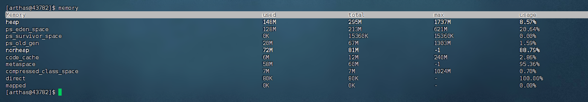
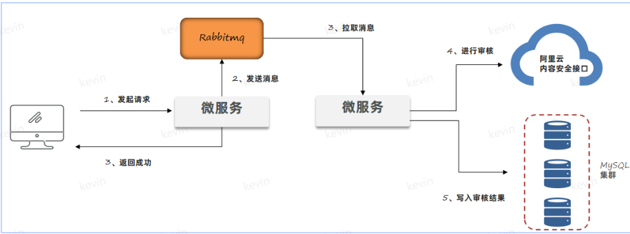
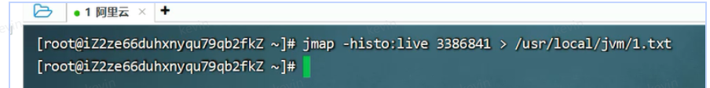
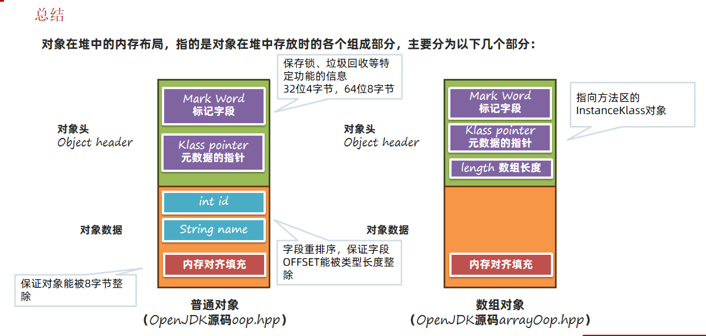

# JVM

# 基础
**宏观上看JVM的功能，JVM是指Java虚拟机，其功能是将Java编译后生成的字节码翻译为机器码执行。**

JVM的主要功能：

1. **解释和运行**（解释编译后的class字节码为机器码，运行机器码）
2. **内存管理**（自动的为对象、方法等分配内存，自动的回收对象，有自动的垃圾回收机制）
3. **即时编译JIT**（Java性能低的主要原因是因为需要将字节码实时的解释成机器码，这个过程反复执行，效率很低。但是这种方式实现了一次编写在多个平台执行的跨平台性。即时编译就是优化这个解释机器码的过程，如果发现某一段代码是热点代码，这会将解释后的机器码保存到内存中，后续直接调用）

## Java虚拟机的组成
Java虚拟机分为以下几个部分：


+ **类加载器：**核心组件类加载器，负责将字节码文件中的内容加载到内存中。
+ **运行时数据区：**JVM管理的内存，创建出来的对象、类的信息等等内容都会放在这块区域中。
+ **执行引擎：**包含了即时编译器、解释器、垃圾回收器，执行引擎使用解释器将字节码指令解释成机器码，使用即时编译器优化性能，使用垃圾回收器回收不再使用的对象。
+ **本地接口：**调用本地使用C/C++编译好的方法，本地方法在Java中声明时，都会带上native关键字。

## 字节码文件的组成
通过JClassLib软件可以查看字节码的详细信息，官网地址：[ingokegel/jclasslib: jclasslib bytecode editor is a tool that visualizes all aspects of compiled Java class files and the contained bytecode. (github.com)](https://github.com/ingokegel/jclasslib)

打开字节码文件后软件界面如下图：


字节码文件总共可以分为以下几个部分：

+ **基础信息**：魔数、字节码文件对应的Java版本号、访问标识(public final等等)、父类和接口信息
+ **常量池****： **保存了字符串常量、类或接口名、字段名，主要在字节码指令中使用
+ **字段：** 当前类或接口声明的字段信息
+ **方法： **当前类或接口声明的方法信息，核心内容为方法的字节码指令
+ **属性： **类的属性，比如源码的文件名、内部类的列表等

**基础信息：**

1. Magic魔数：因为每个文件的文件类型是通过文件头的前几个字节决定的，所以class文件也有自己的文件头标识，使用四个字节，用16进制表示为0xcafebabe，JVM会通过校验文件头来检测是不是class文件。
2. 主副版本号：指编译字节码文件时使用的JDK版本号。1.2之后的版本计算：主版本-44就是jdk的版本。版本号的作用就是判断当前字节码的版本和运行时的jdk是否兼容。
3. 访问标识：大小两个字节，标识类、接口、注解、枚举模块的访问权限
4. 类、父类、接口索引：大小两个字节，存储指向常量池的内容，通过这些索引可以找到类、父类、接口的信息

**常量池：**保存常量值和常量的引用。常量池的数据都有编号，从1开始。字节码指令中通过编号引用到常量池的过程称之为符号引用。例如：cp_info #22

**字段：**存放类或者接口中的字段信息。包含字段名字、标识符、访问标识。

**方法：**字节码的方法区域是存放字节码指令的核心位置，指令的内容存放在Code属性中。

分析下面Java代码的字节码：

```java
int i = 0;
int j = i + 1;
```

编译的字节码：

```java
0 iconst_0
1 istore_1
2 iload_1
3 iconst_1
4 iadd
5 istore_2
6 return
```

要理解这段字节码指令是如何执行的，我们需要先理解两块内存区域：**操作数栈和局部变量表。**

**操作数栈**是用来存放临时数据的内容，是一个栈式的结构，先进后出。

**局部变量表**是存放方法中的局部变量，包含方法的参数、方法中定义的局部变量，在编译期就已经可以确定方法有多少个局部变量。

1. iconst_0：存放0进入操作数栈中，此时栈只有一个0元素
2. istore_1：将操作数栈中的值取出存放在局部变量表下标为1的位置中的变量（这个位置的变量是i）中
3. iload_1：将局部变量表下标为1的变量值（上面i的变量值0）取出放到操作数栈中
4. iconst_1：存放1进入操作数栈中，此时栈的元素有1, 0
5. iadd：取出两个数相加，正好是1
6. istore_2：将操作数的值1存入局部变量表下标为2的位置（变量j）中
7. return：结束，方法返回

例如：

分析下面Java代码：

```java
int i = 0;
i = i++:
```

对应的指令：

```java
0 iconst_0  将0放入操作数栈
1 istore_1  将0存入局部变量表中下标为1位置的变量（变量i）
2 iload_1   将局部变量表中下标1位置的值放入操作数栈（0放入操作站）
3 iinc 1 by 1 将局部变量i加1
6 istore_1  将0存入局部变量下标1的变量中
7 return    结束

所以结果i等于0
```

Java代码：

```java
int i = 0;
i = ++i;
```

对应的指令：

```java
0 iconst_0 将0放入操作数栈
1 istore_1 将0存入局部变量i
2 iinc 1 by 1 将局部变量i加1
5 iload_1 将局部变量i的值放入操作数栈
6 istore_1 将1存入局部变量
7 return 结束
```

题目：int i = 0; i = i++; 最终i的值是多少？

解答：i最终为0，因为通过字节码发现，会先将i放到操作数栈中，然后自增局部变量后，又通过将栈中的数据重新赋值给局部变量，所以局部变量中的1被覆盖掉了，所以得到0。

1. 将0放入操作数栈
2. 将操作数栈0弹出存入局部变量表i
3. 将局部变量i的值0存入操作数栈
4. 将局部变量i自增1
5. 将操作数栈的值0赋值给局部变量表i

此时i的值还是0

**属性：这里是指类的属性，比如源码的文件名、内部类的列表等。**


查看字节码的方法：

1. 使用javap，反编译文件
2. IDEA中使用JClassLib插件
3. 使用jclasslib工具
4. [https://arthas.aliyun.com/](https://arthas.aliyun.com/)

## 类的生命周期
类的生命周期包含**加载、使用、卸载的过程，又分为：加载、连接（又分为验证、准备、解析）、初始化、使用、卸载**

### 加载阶段（Loading）
第一步通过**类加载器根据类的全限定名通过不同的渠道以二进制的方式获取字节码的信息**，可以通过Java代码扩展不同的渠道：

+ 从本地磁盘上面获取文件
+ 运行时通过动态代理生成，比如Spring框架
+ Applet技术通过网络获取字节码文件

类加载器在加载完类之后，Java虚拟机会将字节码中的信息保存到方法区中，方法区中生成一个**InstanceKlass**对象，保存类的所有信息，里边还包含实现特定功能比如多态的信息。

Java虚拟机同时会在堆上生成与方法区中数据类似的java.lang.Class对象，作用是在Java代码中去获取类的信息以及存储静态字段的数据（JDK8及之后）。生成这个对象的目的是为了安全，堆中只存放程序员需要的数据。

### 连接阶段
三个子阶段：

+ 验证，验证内容是否满足《Java虚拟机规范》。
+ 准备，给静态变量赋初值。
+ 解析，将常量池中的符号引用替换成指向内存的直接引用。

验证阶段包括：

1. 文件格式验证，比如文件是否以0xCAFEBABE开头，主次版本号是否满足当前Java虚拟机版本要求。
2. 元信息验证，例如类必须有父类（super不能为空）。
3. 验证程序执行指令的语义，比如方法内的指令执行中跳转到不正确的位置。
4. 符号引用验证，例如是否访问了其他类中private的方法等。

准备阶段：**准备阶段为静态变量（static）分配内存并设置初值，这个初值是这个数据类型的默认值**，每一种基本数据类型和引用数据类型都有其初值。

如果是final修饰的基本数据类型进行赋值，那么在准备阶段就直接赋值了，初始化不用赋值。如果是没有带final的，那么就是准备阶段设置初值，比如0，初始化阶段才赋值。

解析阶段：**解析阶段主要是将常量池中的符号引用替换为****直接引用**，符号引用就是在字节码文件中使用编号来访问常量池中的内容。

### 初始化阶段
初始化阶段会执行字节码文件中clinit（class init 类的初始化）方法的字节码指令，**包含了静态代码块中的代码，并为静态变量赋值。**

例子：

```java
public class Demo1 {

    public static int value = 1;
    static {
        value = 2;
    }
   
    public static void main(String[] args) {

    }
}
```

生成字节码文件后，这个文件会有三个方法：init（对象初始化时候执行）、main（主方法）、clinit（类的初始化阶段执行）

上面clinit()方法的字节码：

```java
//这里初始化阶段会执行静态变量赋值、静态代码块中代码
iconst_1		将1放入操作数栈
putstatic #2 <init/Demo1.value : I>		操作数栈弹出一个元素放入堆中静态变量的位置，#2就是符号引用，对应的就是value
iconst_2		将2放入操作数栈
putstatic #2 <init/Demo1.value : I> 类似
return			方法结束
```

如果将代码互换：

```java
public class Demo1 {

    static {
        value = 2;
    }

    public static int value = 1;
    
   
    public static void main(String[] args) {

    }
}
```

对应的字节码就是：

```java
iconst_2		将2放入操作数栈
putstatic #2 <init/Demo1.value : I>		操作数栈弹出一个元素放入堆中静态变量的位置，#2就是符号引用，对应的就是value
iconst_1		将1放入操作数栈
putstatic #2 <init/Demo1.value : I> 类似
return			方法结束
```

最后的value结果就是1，不是2了。

上面的代码都是在初始化阶段给静态变量赋值。静态变量赋初值是在连接阶段中的准备步骤。初始化是给静态变量赋值。


以下的方式都会导致类的初始化：

1. 访问一个类的静态变量或者静态方法，注意变量是final修饰的并且等号右边是常量不会触发初始化。
2. 调用Class.forName(String className)获取类
3. new对象，创建对象
4. 执行Main方法的当前类

添加-XX:+TraceClassLoading 参数可以打印出加载并初始化的类


面试题：分析输出结果：

```java
public class Test {
	public static void main(String[] args) {
		System.out.println("A");
        new Test();
        new Test();
	}

	public Test(){
        System.out.println("B");
    }

    {
        System.out.println("C");
    }

    static {
        System.out.println("D");
    }
}
```

对应的字节码有三个方法: init()、main()、clinit()

1. 执行main方法，访问类的静态方法所以触发clinit()执行类加载器，对应的字节码：

```java
0 getstatic #1 <java/lang/System.out : Ljava/io/PrintStream;>
3 ldc #28 <D>
5 invokevirtual #9 <java/io/PrintStream.println : (Ljava/lang/String;)V>
8 return
```

输出：D

2. 执行main 方法：

```java
 0 getstatic #1 <java/lang/System.out : Ljava/io/PrintStream;>
 3 ldc #7 <A>
 5 invokevirtual #9 <java/io/PrintStream.println : (Ljava/lang/String;)V>
 8 new #15 <Test>
11 dup
12 invokespecial #17 <Test.<init> : ()V>
15 pop
16 new #15 <Test>
19 dup
20 invokespecial #17 <Test.<init> : ()V>
23 pop
24 return
```

输出A

3. 创建对象，执行init()方法：先执行代码块，再执行构造函数init

```java
0 aload_0
 1 invokespecial #21 <java/lang/Object.<init> : ()V>
 4 getstatic #1 <java/lang/System.out : Ljava/io/PrintStream;>
 7 ldc #24 <C>
 9 invokevirtual #9 <java/io/PrintStream.println : (Ljava/lang/String;)V>
12 getstatic #1 <java/lang/System.out : Ljava/io/PrintStream;>
15 ldc #26 <B>
17 invokevirtual #9 <java/io/PrintStream.println : (Ljava/lang/String;)V>
20 return
```

输出CB

最终结果DACBCB


**clinit()不会执行的情况：**

1. 没有静态变量赋值语句和静态代码块
2. 有静态变量声明的语句，但是没有赋值，例如：public static int a;
3. 静态变量使用final修饰，clinit()不会执行，因为会直接在准备阶段赋值给静态变量


面试题：下面结果：

```java
public class Test {
	public static void main(String[] args) {
		new B02();
		System.out.println(B02.a);
	}

	
}

class A02{
	static int a = 0;
	static {
		a = 1;
	}
}	

class B02 extends A02{
	static {
		a = 2;
	}
}
```

1. 进入子类的clint()初始化之前，会先进入父类的clinit()初始化，所以先进入A02的clinit()方法
2. 执行完A的初始化，a=1
3. 执行B的初始化，a=2


如果注释掉new B02()，直接访问父类的静态变量？  
会执行父类的clinit()方法初始化，不会执行子类的clinit()方法。


补充：

```java
public class Test2 {
    public static void main(String[] args) {
        Test2_A[] arr = new Test2_A[10];

    }
}

class Test2_A {
    static {
        System.out.println("Test2 A的静态代码块运行");
    }
}
```

这里的创建数组，不会让数组中的元素进行初始化。不会进入类的clinit()方法

```java
public class Test4 {
    public static void main(String[] args) {
        System.out.println(Test4_A.a);
    }
}

class Test4_A {
    public static final int a = Integer.valueOf(1);

    static {
        System.out.println("Test3 A的静态代码块运行");
    }
}
```

如果final修饰的静态变量赋值需要执行指令，那么就需要进行初始化了。

## 类加载器
类加载器（ClassLoader）是Java虚拟机提供给应用程序去实现获取类和接口字节码数据的技术，类加载器只参与加载过程中的字节码获取并加载到内存这一部分。**所以其主要功能就是获取字节码内容并且加载到内存中。**


类加载器会通过二进制流的方式获取到字节码文件的内容，接下来将获取到的数据交给Java虚拟机，**虚拟机会在方法区和堆上生成对应的对象保存字节码信息。**

类加载器分为两类，一类是Java代码中实现的，一类是Java虚拟机底层源码实现的。

+ 虚拟机底层实现：源代码位于Java虚拟机的源码中，实现语言与虚拟机底层语言一致，比如Hotspot使用C++。主要目的是保证Java程序运行中基础类被正确地加载，比如java.lang.String，Java虚拟机需要确保其可靠性。
+ JDK中默认提供或者自定义：JDK中默认提供了多种处理不同渠道的类加载器，程序员也可以自己根据需求定制，使用Java语言。所有Java中实现的类加载器都需要继承**ClassLoader这个抽象类**

类加载器的设计JDK8和8之后的版本差别较大，首先来看JDK8及之前的版本，这些版本中默认的类加载器有如下几种：

+ BootstrapClassLoader是启动类加载器
+ ExtClassLoader是扩展类加载器
+ AppClassLoader是应用程序类加载器

启动类加载器：

由HotSpot虚拟机提供，使用C++编写的类加载器。默认加载Java安装目录/jre/lib下的类文件，比如rt.jar，tools.jar，resources.jar等。

如果想扩展一些基础的jar包，让启动类加载器加载，有两种方法：

1. 放入jre/lib下进行扩展。不推荐，尽可能不要去更改JDK安装目录中的内容，会出现即时放进去由于文件名不匹配的问题也不会正常地被加载。
2. 通过参数进行扩展。推荐，使用**-Xbootclasspath/a:jar包目录/jar包名 进行扩展**，参数中的/a代表新增

扩展类加载器和应用程序类加载器：

+ 扩展类加载器和应用程序类加载器都是JDK中提供的、使用Java编写的类加载器。
+ 它们的源码都位于sun.misc.Launcher中，是一个静态内部类。继承自URLClassLoader。具备通过目录或者指定jar包将字节码文件加载到内存中。

关系图：


+ **ClassLoader类定义了具体的行为模式，简单来说就是先从本地或者网络获得字节码信息**，然后调用虚拟机底层的方法创建方法区和堆上的对象。这样的好处就是让子类只需要去实现如何获取字节码信息这部分代码。
+ SecureClassLoader提供了证书机制，提升了安全性。
+ URLClassLoader提供了根据URL获取目录下或者指定jar包进行加载，获取字节码的数据。
+ 扩展类加载器和应用程序类加载器继承自URLClassLoader，获得了上述的三种能力。

扩展类加载器默认加载Java安装目录/jre/lib/ext下面的文件。

如果想加载用户jar包，有两种方式：

1. 放入jre/lib/ext下进行扩展。不推荐，尽可能不要去更改JDK安装目录中的内容
2. 使用参数。推荐，**使用-Djava.ext.dirs=jar包目录** 进行扩展,这种方式会覆盖掉原始目录，可以用;(windows):(macos/linux)追加上原始目录。注意要用引号包括，包含jre/lib/ext的具体位置和jar包的位置。

**应用程序类加载器默认加载classpath下面的类文件**，**默认就是项目中的类和maven引入的第三方jar包中的类**。


**既然已经有了三种类加载器，如果项目中的一个类来了，怎么去判断这个类加没加载？由谁加载？这时候就有了类加载器的双亲委派机制：**

当一个类加载器接收到加载类的任务时，会自底向上查找是否加载过，如果没有加载过再由顶向下进行加载**。**


每一个类都有父类加载器，启动类加载器是没有父类的。

**在类加载的过程中，每个类加载器都会先检查是否已经加载了该类，如果已经加载则直接返回，否则会将加载请求委派给父类加载器。**

例如：

A类在启动类的加载目录里面，现在应用程序类加载器接到了一个加载A的任务，会先找父类扩展类是否加载过A，扩展类没有，则到启动类加载器中找是否加载过A，启动类加载过，直接就返回了，应用程序加载类就不用加载了。

 例如：

B类在扩展类的加载路径中，此时应用程序接到了一个加载B类的任务，向上找是否加载过，都没加载过，那么就尝试加载B类，启动类因为B类不在自己的加载路径中，所以失败，扩展类因为在自己的路径中，加载成功，直接返回。如果都没有加载成功，那么报ClassNotFoundException异常。

双亲委派机制的作用：

1. **保证类加载的安全性**。通过双亲委派机制避免恶意代码替换JDK中的核心类库，比如java.lang.String，确保核心类库的完整性和安全性。
2. **避免重复加载。**双亲委派机制可以避免同一个类被多次加载。

**如何指定加载类的加载器，主动加载类？**

1. 使用Class.forName()方法，使用当前类的类加载器加载指定类。
2. 获取到某个类的类加载器，然后通过类加载器的loadClass()方法指定加载某个类。

```java
//获取方法或者的类加载器，应用程序类加载器
ClassLoader classLoader = Demo.class.getClassLoader();
//使用应用程序加载器加载某一个类
Class<?> clazz = classLoader.loadClass("com.yang.demo.A");
```

面试题：

1. 如果一个类加载位置出现在三个类加载器的加载目录里面，那么谁会加载？

答：启动类加载器，谁优先级最高最加载

2. String类能覆盖吗？如果自己创建一个java.lang.String类，能加载成功吗？

答：不能，启动类加载器在rt.jar包中已经加载过String类了

3. 类的双亲委派机制是什么？

答：

+ 当一个类加载器去加载某个类的时候，会自底向上查找是否加载过，如果加载过就直接返回，如果一直到最顶层的类加载器都没有加载，再由顶向下进行加载。
+ 应用程序类加载器的父类加载器是扩展类加载器，扩展类加载器的父类加载器是启动类加载器。
+ 双亲委派机制的好处有两点：第一是避免恶意代码替换JDK中的核心类库，比如java.lang.String，确保核心类库的完整性和安全性。第二是避免一个类重复地被加载。


**如何打破双亲委派机制：**

+ 自定义类加载器并且重写loadClass方法。Tomcat通过这种方式实现应用之间类隔离，《面试篇》中分享它的做法。
+ 线程上下文类加载器。利用上下文类加载器加载类，比如JDBC和JNDI等。
+ Osgi框架的类加载器。历史上Osgi框架实现了一套新的类加载器机制，允许同级之间委托进行类的加载，目前很少使用。

自定义类加载器：

一个Tomcat程序中是可以运行多个Web应用的，如果这两个应用中出现了相同限定名的类，比如Servlet类，Tomcat要保证这两个类都能加载并且它们应该是不同的类。如果不打破双亲委派机制，当应用类加载器加载Web应用1中的MyServlet之后，Web应用2中相同限定名的MyServlet类就无法被加载了。


Tomcat使用了自定义类加载器来实现应用之间类的隔离。 **每一个应用会有一个独立的类加载器加载对应的类**

**需要使用自定义类加载器**，那么就需要知道双亲委派机制是怎么实现的？

ClassLoader中包含了4个核心方法，双亲委派机制的核心代码就位于loadClass方法中。

```java
public Class<?> loadClass(String name)
类加载的入口，提供了双亲委派机制。内部会调用findClass   重要

protected Class<?> findClass(String name)
由类加载器子类实现,获取二进制数据调用defineClass ，比如URLClassLoader会根据文件路径去获取类文件中的二进制数据。重要

protected final Class<?> defineClass(String name, byte[] b, int off, int len)
做一些类名的校验，然后调用虚拟机底层的方法将字节码信息加载到虚拟机内存中

protected final void resolveClass(Class<?> c)
执行类生命周期中的连接阶段（验证、准备、解析）
```

如果父类都没有加载，那么就会去底层回到子类加载器的代码，向下传递给自定义加载器。

自定义类加载器打破双亲委派机制实现：

```java
/**
 * 打破双亲委派机制 - 自定义类加载器
 */

public class BreakClassLoader1 extends ClassLoader {

    private String basePath;
    private final static String FILE_EXT = ".class";

    //设置加载目录
    public void setBasePath(String basePath) {
        this.basePath = basePath;
    }

    //使用commons io 从指定目录下加载文件
    private byte[] loadClassData(String name)  {
        try {
            String tempName = name.replaceAll("\\.", Matcher.quoteReplacement(File.separator));
            FileInputStream fis = new FileInputStream(basePath + tempName + FILE_EXT);
            try {
                return IOUtils.toByteArray(fis);
            } finally {
                IOUtils.closeQuietly(fis);
            }

        } catch (Exception e) {
            System.out.println("自定义类加载器加载失败，错误原因：" + e.getMessage());
            return null;
        }
    }

    //重写loadClass方法
    @Override
    public Class<?> loadClass(String name) throws ClassNotFoundException {
        //如果是java包下，还是走双亲委派机制
        if(name.startsWith("java.")){
            return super.loadClass(name);
        }
        //从磁盘中指定目录下加载
        byte[] data = loadClassData(name);
        //调用虚拟机底层方法，方法区和堆区创建对象
        return defineClass(name, data, 0, data.length);
    }

    public static void main(String[] args) throws ClassNotFoundException, InstantiationException, IllegalAccessException, IOException {
        //第一个自定义类加载器对象
        BreakClassLoader1 classLoader1 = new BreakClassLoader1();
        classLoader1.setBasePath("D:\\lib\\");

        Class<?> clazz1 = classLoader1.loadClass("com.itheima.my.A");
         //第二个自定义类加载器对象
        BreakClassLoader1 classLoader2 = new BreakClassLoader1();
        classLoader2.setBasePath("D:\\lib\\");

        Class<?> clazz2 = classLoader2.loadClass("com.itheima.my.A");

        System.out.println(clazz1 == clazz2);

        Thread.currentThread().setContextClassLoader(classLoader1);

        System.out.println(Thread.currentThread().getContextClassLoader());

        System.in.read();
     }
}
```

自定义类加载器父类是AppClassLoader，因为构造器中已经默认指定了。

**重点：使用两个自定义加载器加载同一个限定名的类，不会冲突，只有相同类加载器+相同的限定名才会被认为是同一个类。**


第二种打破双亲委派机制方法：使用线程上下文类加载器：

利用上下文类加载器加载类，比如JDBC和JNDI等。

看JDBC的例子：

1. JDBC中使用了DriverManager来管理项目中引入的不同数据库的驱动，比如mysql驱动、oracle驱动。
2. DriverManager类位于rt.jar包中，由启动类加载器加载。
3. 依赖中的mysql驱动对应的类，由应用程序类加载器来加载
4. DriverManager属于rt.jar是启动类加载器加载的。而用户jar包中的驱动需要由应用类加载器加载，对应的语句：DriverManager.registerDriver(new Driver());
5. DriverManager是通过SPI机制知道Driver的位置，会加载所有jar包中实现了Driver接口的实现类
6. SPI（服务提供接口，提供一个通用接口供实现）中利用了线程上下文类加载器（应用程序类加载器）去加载类并创建对象。

Thread.getCurrentThread().getContextClassLoader();		//获取当前线程的类加载器


Osgi框架的类加载器：

历史上，OSGi模块化框架。它存在同级之间的类加载器的委托加载。OSGi还使用类加载器实现了热部署的功能。热部署指的是在服务不停止的情况下，动态地更新字节码文件到内存中。


**实战：会使用arthas不停机的解决线上问题**

**Arthas**是一款线上监控诊断产品，通过全局视角实时查看应用 load、内存、gc、线程的状态信息，并能在不修改应用代码的情况下，对业务问题进行诊断，包括查看方法调用的出入参、异常，监测方法执行耗时，类加载信息等，大大提升线上问题排查效率。[https://arthas.aliyun.com/doc/](https://arthas.aliyun.com/doc/)

背景：小李的团队将代码上线之后，发现存在一个小bug，但是用户急着使用，如果重新打包再发布需要一个多小时的时间，所以希望能使用arthas尽快的将这个问题修复。

思路：

1. 在出问题的服务器上部署一个 arthas，并启动。

```java
curl -O https://arthas.aliyun.com/arthas-boot.jar	//下载
java -jar arthas-boot.jar		//启动
```

2. sc命令查看已经加载的类信息

```java
// -d查看详情，这里查看BasicController这个类是由哪个类加载器加载的
sc -d *web/BasicController
```

3. jad --source 类全限定名 > 目录/文件名.java ，jad 命令反编译，然后可以用其它编译器，比如 vim 来修改源码

```java
jad --source com.example.demo.demos.web.BasicController > /tmp/BasicController.java
//这里反编译代码，文件放到tmp目录下面
```

4. 编辑java文件，修改问题
5. mc –c 类加载器的hashcode（这个根据sc可以看到之前这个类是由哪个加载器加载的） 目录/文件名.java -d 输出目录

```java
mc -c 21b8d17c /tmp/BasicController.java -d  /tmp
//通过类加载器重新编译加载生成字节码文件
```

 mc 命令用来编译修改过的代码

6.  retransform class文件所在目录/xxx.class 或者 redefine /tmp/com/example/demo/demos/web/BasicController.class

```java
redefine /tmp/com/example/demo/demos/web/BasicController.class
重新加载，替换原项目中的字节码文件，不用重启整个项目了
```

注意：

```java
redefine 特别说明
redefine 命令和 jad/watch/trace/monitor/tt 等命令会冲突。

执行完 redefine 之后，如果再执行上面提到的命令，则会把 redefine 的字节码重置。

原因是 jdk 本身 redefine 和 Retransform 是不同的机制，同时使用两种机制来更新字节码，只有最后修改的会生效。
```

条件限制：

```java
使用热更新功能有一些条件限制，我们只能用它来修改方法内部的一些业务代码，如果我们出现了以下任意一种情况，那么热更新就会执行失败：

增加类属性（类字段）；
增加或删除方法；
替换正在运行的方法。
```

Arthas是根据jps来查找当前进程的，如果Linux中没有jps，如下解决：

```java
# sudo yum install java-1.8.0-openjdk-devel.x86_64
```


**JDK9之后的类加载器：**

由于JDK9引入了module的概念，类加载器在设计上发生了很多变化。

1. 启动类加载器使用Java编写，不再是底层源码实现，位于jdk.internal.loader.ClassLoaders类中。

 Java中的BootClassLoader继承自BuiltinClassLoader实现从模块中找到要加载的字节码资源文件。

 启动类加载器依然无法通过java代码获取到，返回的仍然是null，保持了统一。

2. 扩展类加载器被替换成了平台类加载器（Platform Class Loader）。

 平台类加载器遵循模块化方式加载字节码文件，所以继承关系从URLClassLoader变成了BuiltinClassLoader，BuiltinClassLoader实现了从模块中加载字节码文件。平台类加载器的存在更多的是为了与老版本的设计方案兼容，自身没有特殊的逻辑


## 运行时数据区
Java虚拟机把运行时Java程序过程中**管理的内存区称为运行时数据区**。按照线程是否共享分为：

线程共享：**方法区、堆**

线程不共享：**程序计数器、Java虚拟机栈、本地方法栈**


### 程序计数器
程序计数器（Program Counter Register）也叫PC寄存器，每个线程会通过程序计数器**记录要执行的的字节码指令的地址。**

案例：

在加载阶段，虚拟机将字节码文件中的指令读取到内存之后，会将原文件中的偏移量转换成内存地址。每一条字节码指令都会拥有一个内存地址。

在代码执行过程中，程序计数器会记录下一行字节码指令的地址。执行完当前指令之后，虚拟机的执行引擎根据程序计数器执行下一行指令。这里为了简单起见，使用偏移量代替，真实内存中执行时保存的应该是地址。

在多线程执行情况下，Java虚拟机需要通过程序计数器记录CPU切换前解释执行到那一句指令并继续解释运行。

_程序计数器会内存溢出吗？_

内存溢出指的是程序在使用某一块内存区域时，存放的数据需要占用的内存大小超过了虚拟机能提供的内存上限。由于每个线程的内存地址是固定长度的，程序计数器只是指向当前要执行的字节码地址，程序计数器是不会发生内存溢出的。程序员无需对程序计数器做任何处理

### Java虚拟机栈
Java虚拟机栈**采用栈的数据结构来管理方法调用中的基本数据**，每一个方法的调用使用一个栈帧（Stack Frame）来保存。

每一个线程都有自己的虚拟机栈。**Java虚拟机栈随着线程的创建而创建，而回收则会在线程的销毁时进行。**

Java虚拟机栈的栈帧中主要包含三方面的内容：

+ 局部变量表，局部变量表的作用是在运行过程中存放所有的局部变量
+ 操作数栈，操作数栈是栈帧中虚拟机在执行指令过程中用来存放临时数据的一块区域
+ 帧数据，帧数据主要包含动态链接、方法出口、异常表的引用

局部变量表：局部变量表的作用是在方法执行过程中存放所有的局部变量。局部变量表分为两种，一种是字节码文件中的，另外一种是栈帧中的，也就是保存在内存中。栈帧中的局部变量表是根据字节码文件中的内容生成的。  
	栈帧中的局部变量表是一个数组，数组中每一个位置称之为槽(slot) ，long和double类型占用两个槽，其他类型占用一个槽。

方法参数也会保存在局部变量表中，其顺序与方法中参数定义的顺序一致。局部变量表保存的内容有：实例方法的this对象，方法的参数，方法体中声明的局部变量。  
操作数栈：操作数栈是栈帧中虚拟机在执行指令过程中用来**存放中间数据**的一块区域。他是一种栈式的数据结构，如果一条指令将一个值压入操作数栈，则后面的指令可以弹出并使用该值。

在编译期就可以确定操作数栈的最大深度，从而在执行时正确的分配内存大小。

帧数据：帧数据主要包含动态链接、方法出口、异常表的引用。

a. 动态链接就保存了地址编号到运行时常量池的内存地址的映射关系。

b. 方法出口指的是方法在正确或者异常结束时，当前栈帧会被弹出，同时程序计数器应该指向上一个栈帧中的下一条指令的地址。所以在当前栈帧中，需要存储此方法出口的地址。

c. 异常表存放的是代码中异常的处理信息，包含了异常捕获的生效范围以及异常发生后跳转到的字节码指令位置。

栈内存的溢出：如果栈帧过多，超过栈内存能分配的最大大小，会造成栈内存的溢出，会出stackOverflowError错误。

解决方法：使用**虚拟机参数-Xss**，单位：字节（默认，必须是 1024 的倍数）、k或者K(KB)、m或者M(MB)、g或者G(GB)。也可以使用-XX:ThreadStackSize 调整标志来配置堆栈大小。注意虚拟机对栈大小的最小值最大值要求。局部变量过多、操作数栈深度过大也会影响栈内存的大小。

一般情况下，工作中即便使用了递归进行操作，栈的深度最多也只能到几百,不会出现栈的溢出。所以此参数可以手动指定为-Xss256k节省内存。

### 本地方法栈
存储native本地方法的栈，用于管理 Java 程序中调用本地方法时的运行状态。存储本地方法调用的栈帧，包括参数、局部变量、返回地址等信息。

### 堆内存
一般Java程序中堆内存是空间最大的一块内存区域。**创建出来的对象都存在于堆上。**栈上的局部变量表中，可以存放堆上对象的引用。静态变量也可以存放堆对象的引用，通过静态变量就可以实现对象在线程之间共享。

堆内存是有最大限制的，如果一直创建对象，就会造成堆内存溢出。

**堆空间有三个需要关注的值，used、total、max**。used指的是当前已使用的堆内存，total是java虚拟机已经分配的可用堆内存，max是java虚拟机可以分配的最大堆内存。如果不设置任何的虚拟机参数，max默认是系统内存的1/4，total默认是系统内存的1/64。在实际应用中一般都需要设置total和max的值。

设置堆的大小：可以**使用虚拟机参数 –Xmx（max最大值）和-Xms (初始的total)**。Xmx必须大于 2 MB，Xms必须大于1MB

建议：Java服务端程序开发时，建议将-Xmx和-Xms设置为相同的值，这样在程序启动之后可使用的总内存就是最大内存，而无需向java虚拟机再次申请，减少了申请并分配内存时间上的开销，同时也不会出现内存过剩之后堆收缩的情况。-Xmx具体设置的值与实际的应用程序运行环境有关，在《实战篇》中会给出设置方案。

### 方法区
**方法区是存放基础信息的位置，线程共享**，主要包含三部分内容：

+ **类的元信息，保存了所有类的基本信息**
+ **运行时常量池，保存了字节码文件中的常量池内容**
+ **字符串常量池，保存了字符串常量**

类的元信息：方法区是用来存储每个类的基本信息（元信息），一般称之为InstanceKlass对象。在类的加载阶段完成。其中就包含了类的字段、方法等字节码文件中的内容，同时还保存了运行过程中需要使用的虚方法表（实现多态的基础）等信息。

运行时常量池：常量池中存放的是字节码中的常量池内容。字节码文件中通过编号查表的方式找到常量，这种常量池称为静态常量池。当常量池加载到内存中之后，可以通过内存地址快速的定位到常量池中的内容，这种常量池称为运行时常量池。


JDK7及之前的版本将方法区存放在堆区域中的永久代空间，堆的大小由虚拟机参数-XX:MaxPermSize=值来控制。

JDK8及之后的版本将方法区存放在元空间中，元空间位于操作系统维护的直接内存中，默认情况下只要不超过操作系统承受的上限，可以一直分配。

**永久代和元空间的不同：**

+ 存储位置不同，永久代是存放在堆内存中，元空间是存放在直接内存中
+ 存储内容不同，永久代存储类的元信息、常量池、静态变量，元空间存储的是类的源信息，常量池静态变量存放在堆中。


**为什么要废除永久代：**

1. 在原来的永久代划分中，永久代需要存放类的元数据、静态变量和常量等。它的大小不容易确定，因为这其中有很多影响因素，比如类的总数，常量池的大小和方法数量等，-XX:MaxPermSize 指定太小很容易造成永久代内存溢出。
2. 移除永久代是为融合HotSpot VM与 JRockit VM而做出的努力，因为JRockit没有永久代，不需要配置永久代。
3. 永久代会为GC带来不必要的复杂度，并且回收效率偏低。
4. 由于类的元数据分配在本地内存中，元空间的最大可分配空间就是系统可用内存空间。不会遇到永久代存在时的内存溢出错误。
5. 将运行时常量池从PermGen分离出来，与类的元数据分开，提升类元数据的独立性。
6. 将元数据从PermGen剥离出来到Metaspace，可以提升对元数据的管理同时提升GC效率。

**MetaSpaceSize元空间大小：**

+ >-XX:MetaspaceSize，初始空间大小，达到该值就会触发垃圾收集进行类型卸载，同时GC会对该值进行调整
+ >-XX:MaxMetaspaceSize，最大空间，默认是没有限制的。如果没有使用该参数来设置类的元数据的大小，**>其最大可利用空间是整个系统内存的可用空间。**
+ >-XX:MinMetaspaceFreeRatio，在GC之后，最小的Metaspace剩余空间容量的百分比，减少为分配空间所导致的垃圾收集。
+ >-XX:MaxMetaspaceFreeRatio，在GC之后，最大的Metaspace剩余空间容量的百分比，减少为释放空间所导致的垃圾收集。


字符串常量池：存放代码中定义的字符串常量内容。比如："123"

分析下面的代码会发生什么？

```java
String s1 = new String("abc");   
堆上创建String对象，局部变量s1保存堆上String对象的引用，String对象里面有abc字面量，另外字符串常量池创建abc
String s2 = "abc";
局部变量s2指向常量池abc
```

字符串常量池和运行时常量池的关系：

早期，字符串常量池是运行时常量池的一部分，后续，将字符串常量池和运行时常量池做了拆分。

```java
练习题；
String a = "1";		将局部引用直接指向字符串常量池"1"
String b = "2";		将局部引用直接指向字符串常量池"2"
String c = "12";	将局部引用直接指向字符串常量池"12"
String d = a + b;	使用StringBuilder构建字符串"12"，堆上创建一个对象指向字符串常量池"12"，将局部变量d引用指向堆上对象
System.out.println(c == d); 输出false
```

```java
如果上面的d是这样的：
String d = "1" + "2";  
在编译阶段将右边表达式算出12，让d指向字符串常量池"12"
最终输出true
```


String的intern()方法可以手动的将字符串放入字符串常量池中。

JDK6的intern()方法将常量池中字符串的引用返回，局部变量指向引用。

JDK7的intern()方法会将首次遇到的字符串引用放入常量池，常量池中存储字符串的引用。

```java
String S1 = new StringBuilder().append("think").append("123").toString();
System.out.println(s1.intern() == s1);		//JDK6是false，JDK7是true
//JDK6s1直接创建字符串引用"think123",返回字符串的引用，而s1指向堆上对象的引用
//JDK7引用是首次遇到think123，所以会将think123的引用放到字符串常量池中，所以s1.intern()返回的是s1的引用
String S2 = new StringBuilder().append("ja").append("va").toString();
//JDK6和上面一样
//JDK7因为堆上会默认的创建java的字符串引用，不是首次遇见，所以s2.inter()就会在常量池中创建然后返回常量池的引用
System.out.println(s2.intern() == s2);     //JDK6是false，JDK7是true
```


静态变量存储在哪儿？

+  在 JDK 7 及之前版本中，静态变量被存储在 **PermGen** 区域（方法区的一部分）。PermGen 用来存储类信息、方法区数据、静态变量等。  
+ **JDK 8** 及之后引入了 **Metaspace** 替代了 PermGen 区域，静态变量现在被存储在 Metaspace 中的类元数据部分。  


### 直接内存
直接内存（Direct Memory）并不在《Java虚拟机规范》中存在，所以并不属于Java运行时的内存区域。

在 JDK 1.4 中引入了 NIO（异步输入输出）机制，使用了直接内存，主要为了解决以下两个问题:

1、Java堆中的对象如果不再使用要回收，回收时会影响对象的创建和使用。

2、IO操作比如读文件，需要先把文件读入直接内存（缓冲区）再把数据复制到Java堆中。

现在直接放入直接内存即可，同时Java堆上维护直接内存的引用，减少了数据复制的开销。写文件也是类似的思路。

**使用堆创建对象：读取到直接内存中，再赋值一份到Java堆中。**

**使用直接内存创建对象：读取到直接内存中，Java堆直接存储直接内存中对象的引用。**


## 什么是垃圾回收（GC Garbage Collection）
在C/C++这类没有自动垃圾回收机制的语言中，一个对象如果不再使用，需要手动释放，否则就会出现内存泄漏。

**内存泄漏指的是不再使用的对象在系统中未被回收，内存泄漏的积累可能会导致内存溢出（内存溢出是程序的内存超过了已经分配的内存）**。在C/C++这类没有自动垃圾回收机制的语言中，一个对象如果不再使用，需要手动释放，否则就会出现内存泄漏。

内存泄漏指的是不再使用的对象在系统中未被回收，内存泄漏的积累可能会导致内存溢出。

Java中为了简化对象的释放，引入了自动的垃圾回收（Garbage Collection简称GC）机制。通过垃圾回收器来对不再使用的对象完成自动的回收，垃圾回收器主要负责对堆上的内存进行回收。其他很多现代语言比如C#、Python、Go都拥有自己的垃圾回收器。

那么垃圾回收器需要负责对哪些部分的内存进行回收呢？主要就是堆上的内容。

首先是线程不共享的部分（上面讲的有虚拟机栈、本地方法栈、程序计数器），都是伴随着线程的创建而创建，线程的销毁而销毁。而方法的栈帧在执行完方法之后就会自动弹出栈并释放掉对应的内存。所以这一部分不需要垃圾回收器负责回收。

## 什么情况下会回收？
判断一个类可以被回收，需要同时满足三个条件：

1. 类的所有的实例对象被回收，堆上没有该类的任何实例对象和子类
2. 加载该类的类加载器被回收
3. 该类对应的 java.lang.Class 对象没有在任何地方被引用。

如果需要手动触发垃圾回收，可以调用System.gc()方法。

语法： `System.gc()`

注意事项：

** 调用System.gc()方法并不一定会立即回收垃圾，仅仅是向Java虚拟机发送一个垃圾回收的请求，具体是否需要执行垃圾回收Java虚拟机会自行判断。**

那么类卸载主要用在什么场景下呢？

开发中此类场景一般很少出现，主要在如 OSGi、JSP 的热部署等应用场景中。

每个jsp文件对应一个唯一的类加载器，当一个jsp文件修改了，就直接卸载这个jsp类加载器。重新创建类加载器，重新加载jsp文件

## 如何判断对象可以被回收？
判断对象是否被回收是看对象是否被引用？

有两种方式判断对象是否可以被回收：

1. **引用计数法**
2. **可达性分析法**

引用计数法：

如果一个对象被引用就+1，内部维护一个计数器，如果计数器=0就代表可以被垃圾回收了。但是这个方法存在问题，如果两个堆中对象相互引用，那么也会存储一个计数器，但是由于没有局部变量引用它们，所以它们理应被回收。

所以Java中并没有使用引用计数法。

可达性分析法：

可达性分析将对象分为了两类：垃圾回收的根对象（GC Root）和普通对象，使用引用链表示对象之间的关系。如果从某个GC Root到普通对象是可达的，那么就不允许被垃圾回收。

哪些对象可以被作为垃圾回收的根对象：

1. 线程Thread对象，引用线程栈帧中的方法参数、局部变量等。
2. 系统类加载器加载的java.lang.Class对象，引用类中的静态变量。
3. 监视器对象，用来保存同步锁synchronized关键字持有的对象。
4. 本地方法调用时使用的全局对象。

## 垃圾回收中常见的引用对象
可达性算法中描述的对象引用，一般指的是强引用，即是GC Root对象对普通对象有引用关系，只要这层关系存在，普通对象就不会被回收。除了强引用之外，Java中还设计了几种其他引用方式：

+ 软引用
+ 弱引用
+ 虚引用
+ 终结器引用

软引用：

**软引用相对于强引用是一种比较弱的引用关系，如果一个对象只有软引用关联到它，当程序内存不足时，就会将软引用中的数据进行回收。**在JDK 1.2版之后提供了SoftReference类来实现软引用，软引用常用于缓存中。软引用对象本身，也需要被强引用，否则软引用对象也会被回收掉。	

软引用的使用方法：

软引用的执行过程如下：

1.将对象使用软引用包装起来，new SoftReference<对象类型>(对象)。

2.内存不足时，虚拟机尝试进行垃圾回收。

3.如果垃圾回收仍不能解决内存不足的问题，回收软引用中的对象。

4.如果依然内存不足，抛出OutOfMemory异常。

软引用对象怎么被回收：

如果软引用对象里边包含的数据已经被回收了，那么软引用对象本身其实也可以被回收了。

SoftReference提供了一套队列机制：

1. 软引用创建时，通过构造器传入引用队列	
2. 在软引用中包含的对象被回收时，该软引用对象会被放入引用队列
3. 通过代码遍历引用队列，将SoftReference的强引用删除

软引用缓存实例：

通过软引用缓存学生信息实例：

```java
package chapter04.soft;

import java.lang.ref.ReferenceQueue;
import java.lang.ref.SoftReference;
import java.util.HashMap;
import java.util.Map;
/**
 * 软引用案例4 - 学生信息的缓存
 */
public class StudentCache {

    private static StudentCache cache = new StudentCache();

    public static void main(String[] args) {
        for (int i = 0; ; i++) {
            StudentCache.getInstance().cacheStudent(new Student(i, String.valueOf(i)));
        }
    }

    private Map<Integer, StudentRef> StudentRefs;// 用于Cache内容的存储
    private ReferenceQueue<Student> q;// 垃圾Reference的队列

    // 继承SoftReference，使得每一个实例都具有可识别的标识。
    // 并且该标识与其在HashMap内的key相同。
    private class StudentRef extends SoftReference<Student> {
        private Integer _key = null;

        public StudentRef(Student em, ReferenceQueue<Student> q) {
            super(em, q);
            _key = em.getId();
        }
    }

    // 构建一个缓存器实例
    private StudentCache() {
        StudentRefs = new HashMap<Integer, StudentRef>();
        q = new ReferenceQueue<Student>();
    }

    // 取得缓存器实例
    public static StudentCache getInstance() {
        return cache;
    }

    // 以软引用的方式对一个Student对象的实例进行引用并保存该引用
    private void cacheStudent(Student em) {
        cleanCache();// 清除垃圾引用
        StudentRef ref = new StudentRef(em, q);
        StudentRefs.put(em.getId(), ref);
        System.out.println(StudentRefs.size());
    }

    // 依据所指定的ID号，重新获取相应Student对象的实例
    public Student getStudent(Integer id) {
        Student em = null;
// 缓存中是否有该Student实例的软引用，如果有，从软引用中取得。
        if (StudentRefs.containsKey(id)) {
            StudentRef ref = StudentRefs.get(id);
            em = ref.get();
        }
// 如果没有软引用，或者从软引用中得到的实例是null，重新构建一个实例，
// 并保存对这个新建实例的软引用
        if (em == null) {
            em = new Student(id, String.valueOf(id));
            System.out.println("Retrieve From StudentInfoCenter. ID=" + id);
            this.cacheStudent(em);
        }
        return em;
    }

    // 清除那些所软引用的Student对象已经被回收的StudentRef对象
    private void cleanCache() {
        StudentRef ref = null;
        while ((ref = (StudentRef) q.poll()) != null) {
            StudentRefs.remove(ref._key);
        }
    }

//    // 清除Cache内的全部内容
//    public void clearCache() {
//        cleanCache();
//        StudentRefs.clear();
//        //System.gc();
//        //System.runFinalization();
//    }
}

class Student {
    int id;
    String name;

    public Student(int id, String name) {
        this.id = id;
        this.name = name;
    }

    public int getId() {
        return id;
    }

    public void setId(int id) {
        this.id = id;
    }

    public String getName() {
        return name;
    }

    public void setName(String name) {
        this.name = name;
    }
}
```


弱引用：

弱引用的整体机制和软引用基本一致，**区别在于弱引用包含的对象在垃圾回收时，不管内存够不够都会直接被回收**。在JDK 1.2版之后提供了WeakReference类来实现弱引用，弱引用主要在ThreadLocal中使用。

弱引用对象本身也可以使用引用队列进行回收。


虚引用和终结器引用：

这两种引用在常规开发中是不会使用的。

+ 虚引用也叫幽灵引用/幻影引用，不能通过虚引用对象获取到包含的对象。虚引用唯一的用途是**当对象被垃圾回收器回收时可以接收到对应的通知**。Java中使用PhantomReference实现了虚引用，直接内存中为了及时知道直接内存对象不再使用，从而回收内存，使用了虚引用来实现。
+ 终结器引用指的是在对象需要被回收时，终结器引用会关联对象并放置在Finalizer类中的引用队列中，在稍后由一条由FinalizerThread线程从队列中获取对象，然后执行对象的finalize方法，在对象第二次被回收时，该对象才真正的被回收。在这个过程中可以在finalize方法中再将自身对象使用强引用关联上，但是不建议这样做。

## 垃圾回收算法
Java是如何实现垃圾回收的呢？简单来说，垃圾回收要做的有两件事：

1、找到内存中存活的对象

2、释放不再存活对象的内存，使得程序能再次利用这部分空间 

垃圾回收算法：**标记-清除算法、复制算法、标记-整理算法、分代算法**

垃圾回收算法的评价标准：

Java垃圾回收过程会通过单独的GC线程来完成，但是**不管使用哪一种GC算法，都会有部分阶段需要停止所有的用户线程。这个过程被称之为Stop The World简称STW**，如果STW时间过长则会影响用户的使用。

评判一种垃圾回收算法的效率：

1. 吞吐量：CPU 用于执行用户代码的时间与 CPU 总执行时间的比值，即吞吐量 = 执行用户代码时间 /（执行用户代码时间 + GC时间）。吞吐量数值越高，垃圾回收的效率就越高。
2. 最大暂停时间：STW，最大暂停时间指的是所有在垃圾回收过程中的STW时间最大值。最大暂停时间越短，用户使用系统时受到的影响就越短。
3. 堆使用效率：不同垃圾回收算法，对堆内存的使用方式是不同的。比如标记清除算法，可以使用完整的堆内存。而复制算法会将堆内存一分为二，每次只能使用一半内存。从堆使用效率上来说，标记清除算法要优于复制算法。

上述三种评价标准：堆使用效率、吞吐量，以及最大暂停时间不可兼得。

一般来说，堆内存越大，最大暂停时间就越长。想要减少最大暂停时间，就会降低吞吐量。


### 标记-清除回收算法
**标记存活对象，清楚非存活对象**

1. 标记阶段，将所有存活的对象进行标记。Java中使用可达性分析算法，从GC Root开始通过引用链遍历出所有存活对象。
2. 清除阶段，从内存中删除没有被标记也就是非存活对象。

优点：实现简单，只需要在第一阶段给每个对象维护标志位，第二阶段删除对象即可。

缺点：

1. 碎片化问题

由于内存是连续的，所以在对象被删除之后，内存中会出现很多细小的可用内存单元。如果我们需要的是一个比较大的空间，很有可能这些内存单元的大小过小无法进行分配。

2. 分配速度慢。由于内存碎片的存在，需要维护一个空闲链表，空闲链表指向每个空闲空间，极有可能发生每次需要遍历到链表的最后才能获得合适的内存空间。


### 复制算法
复制算法的核心思想：

1. 准备两块空间From空间和To空间，每次在对象分配阶段，只能使用其中一块空间（From空间）
2. 在垃圾回收GC阶段，将From中存活对象复制到To空间。
3. 将From空间的对象进行回收
4. 将两块空间的From和To名字互换。

优点：

+ 吞吐量高，复制算法只需要遍历一次存活对象，然后复制到To空间即可，比标记-整理算法少了一次遍历的过程，因而性能较好，但是不如标记-清除算法，因为标记清除算法不需要进行对象的移动
+ 不会发生碎片化，复制算法在复制之后就会将对象按顺序放入To空间中，所以对象以外的区域都是可用空间，不存在碎片化内存空间。

缺点：

堆内存使用效率低，每次只能让一半的内存空间来为创建对象使用。


### 标记-整理算法
也叫标记压缩算法，是对标记-清理算法中产生的内存碎片的一种解决方案。

核心思想分为两个阶段：

1. 标记阶段，将所有存活的对象进行标记。Java中使用可达性分析算法，从GC Root开始通过引用链遍历出所有存活对象。
2. 整理阶段，将存活对象移动到堆的一端。清理掉存活对象的内存空间。

优点：

+ 内存使用效率高，整个堆内存都可以使用，不会像复制算法只能使用半个堆内存
+ 不会发生碎片化，在整理阶段可以将对象往内存的一侧进行移动，剩下的空间都是可以分配对象的有效空间

缺点：

整理阶段的效率不高，整理算法有很多种，比如Lisp2整理算法需要对整个堆中的对象搜索3次，整体性能不佳。可以通过Two-Finger、表格算法、ImmixGC等高效的整理算法优化此阶段的性能。


### 分代垃圾回收算法
现代优秀的垃圾回收算法，会将上述描述的垃圾回收算法组合进行使用，其中应用最广的就是分代垃圾回收算法(Generational GC)。

**GC将整个内存区域都分为年轻代和老年代，年轻代可以存放存活时间比较短的对象，老年代反之**。

在JDK8中，添加**-XX:+UseSerialGC**参数使用分代回收的垃圾回收器，运行程序。

在arthas中使用memory命令查看内存，显示出三个区域的内存情况：

Eden + survivor 这两块区域组成了年轻代。

tenured_gen指的是晋升区域，其实就是老年代。



1. 分代回收时，创建出来的对象，首先会被放入Eden伊甸园区。


2. 随着对象在Eden区越来越多，如果Eden区满，新创建的对象已经无法放入，就会触发年轻代的GC，称为Minor GC或者Young GC。

Minor GC会把需要eden中和From需要回收的对象回收，把没有回收的对象放入To区。

3. 接下来，S0会变成To区，S1变成From区。当eden区满时再往里放入对象，依然会发生Minor GC。

注意：每次Minor GC中都会为对象记录他的年龄，初始值为0，每次GC完加1。

4. 如果Minor GC后对象的年龄达到阈值（最大15，默认值和垃圾回收器有关），对象就会被晋升至老年代。放入老年代区中。
5. 当老年代中空间不足，无法放入新的对象时，先尝试minor gc，如果还是不足，就会触发Full GC（全局垃圾回收），Full GC会对整个堆进行垃圾回收。

如果Full GC依然无法回收掉老年代的对象，那么当对象继续放入老年代时，就会抛出Out Of Memory异常。

## 垃圾回收器
**为什么分代GC算法要把堆分成年轻代和老年代？**首先我们要知道堆内存中对象的特性：

+ 系统中的大部分对象，都是创建出来之后很快就不再使用可以被回收，比如用户获取订单数据，订单数据返回给用户之后就可以释放了。
+ 老年代中会存放长期存活的对象，比如Spring的大部分bean对象，在程序启动之后就不会被回收了。
+ 在虚拟机的默认设置中，新生代大小要远小于老年代的大小。

分代GC算法将堆分成年轻代和老年代主要原因有：

1. 可以通过调整年轻代和老年代的比例来适应不同类型的应用程序，提高内存的利用率和性能。
2. 新生代和老年代使用不同的垃圾回收算法，新生代一般选择复制算法，老年代可以选择标记-清除和标记-整理算法，由程序员来选择灵活度较高。
3. 分代的设计中允许只回收新生代（minor gc），如果能满足对象分配的要求就不需要对整个堆进行回收(full gc),STW时间就会减少。

垃圾回收器是垃圾回收算法的具体实现。

由于垃圾回收器分为年轻代和老年代，除了G1之外其他垃圾回收器必须成对组合进行使用。

具体的关系图如下：


### Serial垃圾回收器
Serial是是一种单线程串行回收年轻代的垃圾回收器。

回收年代和算法：**年轻代、复制算法**

优点：单CPU处理器下吞吐量非常出色

缺点：多CPU下吞吐量不如其他垃圾回收器，堆如果偏大会让用户线程处于长时间的等待

适用场景：Java编写的客户端程序或者硬件配置有限的场景


### 老年代Serial-Old垃圾回收器
SerialOld是Serial垃圾回收器的老年代版本，采用单线程串行回收

-XX:+UseSerialGC 新生代、老年代都使用串行回收器。

回收年代和算法：**老年代、标记-整理算法**

优点：单CPU处理器下吞吐量非常出色

缺点：多CPU下吞吐量不如其他垃圾回收器，堆如果偏大会让用户线程处于长时间的等待

适用场景：与Serial垃圾回收器搭配使用，或者在CMS特殊情况下使用


### 年轻代-ParNew垃圾回收器
ParNew垃圾回收器本质上是对Serial在多CPU下的优化，使用多线程进行垃圾回收

-XX:+UseParNewGC 新生代使用ParNew回收器， 老年代使用串行回收器

回收年代和算法：**年轻代、复制算法**

优点：多CPU处理器下停顿时间较短

缺点：吞吐量和停顿时间不如G1，所以在JDK9之后不建议使用

适用场景：JDK8及之前的版本中，与CMS老年代垃圾回收器搭配使用


### 老年代-CMS（Concurrent Mark Sweep）垃圾回收器
CMS垃圾回收器关注的是系统的暂停时间，允许用户线程和垃圾回收线程在某些步骤中同时执行，减少了用户线程的等待时间。

参数：XX:+UseConcMarkSweepGC

回收年代和算法：**老年代、标记清除算法**

优点：系统由于垃圾回收出现的停顿时间较短，用户体验好

缺点：内存碎片问题、退化问题、浮动垃圾问题

适用场景：大型的互联网系统中用户请求数据量大、频率高的场景，比如订单接口、商品接口等


### 年轻代-Parallel Scavenge垃圾回收器
Parallel Scavenge是JDK8默认的年轻代垃圾回收器，多线程并行回收，关注的是系统的吞吐量。具备自动调整堆内存大小的特点。

回收年代和算法：**年轻代、复制算法**

优点：吞吐量高，而且手动可控。为了提高吞吐量，虚拟机会动态调整堆的参数

缺点：不能保证单次的停顿时间

适用场景：后台任务，不需要与用户交互，并且容易产生大量的对象。比如：大数据的处理，大文件导出


### 老年代-Parallel Old垃圾回收器
Parallel Old是为Parallel Scavenge收集器设计的老年代版本，利用多线程并发收集。

参数： -XX:+UseParallelGC 或

 -XX:+UseParallelOldGC可以使用Parallel Scavenge + Parallel Old这种组合。

回收年代和算法：**老年代、标记-整理算法**

优点：并发收集，在多核CPU下效率较高

缺点：暂停时间比较长

适用场景：与Parallel Scavenge配合使用


### G1垃圾回收器
JDK9之后默认的垃圾回收器是G1（Garbage First）垃圾回收器。Parallel Scavenge关注吞吐量，允许用户设置最大暂停时间 ，但是会减少年轻代可用空间的大小。CMS关注暂停时间，但是吞吐量方面会下降。

而G1设计目标就是将上述两种垃圾回收器的优点融合：

1.支持巨大的堆空间回收，并有较高的吞吐量。

2.支持多CPU并行垃圾回收。

3.允许用户设置最大暂停时间。

JDK9之后强烈建议使用G1垃圾回收器。

**G1的整个堆会被划分成多个大小相等的区域，称之为区Region，区域不要求是连续的。分为Eden、Survivor、Old区。Region的大小通过堆空间大小/2048计算得到，也可以通过参数-XX:G1HeapRegionSize=32m指定**(其中32m指定region大小为32M)，Region size必须是2的指数幂，取值范围从1M到32M。

G1垃圾回收方式有两种：年轻代回收（Young GC）和混合回收（Mixed GC）

1. **年轻代回收**： 会回收Eden区和Survivor区中不用的对象。会导致STW（停止用户线程），G1中可以通过参数-XX:MaxGCPauseMillis=n（默认200） 设置每次垃圾回收时的最大暂停时间毫秒数，G1垃圾回收器会尽可能地保证暂停时间。

新创建的对象会存放在Eden区。当G1判断年轻代区不足（max默认60%），无法分配对象时需要回收时会执行Young GC。

标记出Eden和Survivor区域中的存活对象，根据配置的最大暂停时间选择某些区域将存活对象复制到一个新的Survivor区中（年龄+1），清空这些区域。

G1在进行Young GC的过程中会去记录每次垃圾回收时每个Eden区和Survivor区的平均耗时，以作为下次回收时的参考依据。这样就可以根据配置的最大暂停时间计算出本次回收时最多能回收多少个Region区域了。

比如 -XX:MaxGCPauseMillis=n（默认200），每个Region回收耗时40ms，那么这次回收最多只能回收4个Region

后续Young GC时与之前相同，只不过Survivor区中存活对象会被搬运到另一个Survivor区

当某个存活对象的年龄到达阈值（默认15），将被放入老年代。

部分对象如果大小超过Region的一半，会直接放入老年代，这类老年代被称为Humongous区。比如堆内存是4G，每个Region是2M，只要一个大对象超过了1M就被放入Humongous区，如果对象过大会横跨多个Region。

多次回收之后，会出现很多Old老年代区，此时总堆占有率达到阈值时（-XX:InitiatingHeapOccupancyPercent默认45%）会触发混合回收MixedGC。回收所有年轻代和部分老年代的对象以及大对象区。采用复制算法来完成。


2. 混合回收：混合回收分为：初始标记（initial mark）、并发标记（concurrent mark）、最终标记（remark或者Finalize Marking）、并发清理（cleanup）

G1对老年代的清理会选择存活度最低的区域来进行回收，这样可以保证回收效率最高，这也是G1（Garbage first）名称的由来。


最后清理阶段使用复制算法，不会产生内存碎片。

注意：如果清理过程中发现没有足够的空Region存放转移的对象，会出现Full GC。单线程执行标记-整理算法，此时会导致用户线程的暂停。所以尽量保证应该用的堆内存有一定多余的空间。


参数1： `-XX:+UseG1GC` 打开G1的开关，JDK9之后默认不需要打开

参数2：`-XX:MaxGCPauseMillis=毫秒值` 最大暂停的时间

G1回收年代和算法：**年轻代+老年代、复制算法**

优点：对比较大的堆如超过6G的堆回收时，延迟可控、不会产生内存碎片、并发标记的SATB算法效率高

缺点：JDK8之前还不够成熟

适用场景：JDK8最新版本、JDK9之后建议默认使用


总结：垃圾回收器的组合关系虽然很多，但是针对几个特定的版本，比较好的组合选择如下：

JDK8及之前：

ParNew + CMS（关注暂停时间）、Parallel Scavenge + Parallel Old (关注吞吐量)、 G1（JDK8之前不建议，较大堆并且关注暂停时间）

JDK9之后:

G1（默认）

从JDK9之后，由于G1日趋成熟，JDK默认的垃圾回收器已经修改为G1，所以强烈建议在生产环境上使用G1。


# 实战
## 内存调优
### 内存溢出和内存泄露
内存泄漏（memory leak）：在Java中如果不再使用一个对象，但是该对象依然在GC ROOT的引用链上，这个对象就不会被垃圾回收器回收，这种情况就称之为内存泄漏。

**内存泄漏绝大多数情况都是由堆内存泄漏引起的**，所以后续没有特别说明则讨论的都是堆内存泄漏。

少量的内存泄漏可以容忍，但是如果发生持续的内存泄漏，就像滚雪球雪球越滚越大，不管有多大的内存迟早会被消耗完，最终导致的结果就是内存溢出（OOM，程序所需的内存比已经分配的内存要大）。但是产生内存溢出并不是只有内存泄漏这一种原因。 

内存泄露的场景：

1. 内存泄漏导致溢出的常见场景是大型的Java后端应用中，在处理用户的请求之后，没有及时将用户的数据删除。随着用户请求数量越来越多，内存泄漏的对象占满了堆内存最终导致内存溢出。

这种产生的内存溢出会直接导致用户请求无法处理，影响用户的正常使用。重启可以恢复应用使用，但是在运行一段时间之后依然会出现内存溢出。

```java
//设置虚拟机参数，将最大堆内存设置为1g:Xmx1g Xms1g
@RestController
@RequestMapping("/leak2")
public class LeakController2 {
    private static Map<Long,Object> userCache = new HashMap<>();

    /**
     * 登录接口 放入hashmap中
     */
    @PostMapping("/login")
    public void login(String name,Long id){
        userCache.put(id,new byte[1024 * 1024 * 300]);
    }


    /**
     * 登出接口，删除缓存的用户信息
     */

    @GetMapping("/logout")
    public void logout(Long id){
        userCache.remove(id);
    }

}
```

使用APIFox连续调用login接口后，会出现堆内存溢出的情况。


2. 第二种常见场景是分布式任务调度系统如Elastic-job、Quartz等进行任务调度时，被调度的Java应用在调度任务结束中出现了内存泄漏，最终导致多次调度之后内存溢出。

这种产生的内存溢出会导致应用执行下次的调度任务出现错误。同样重启可以恢复应用使用，但是在调度执行一段时间之后依然会出现内存溢出。

### 解决内存溢出问题


**常见的监控工具：**

1. TOP命令：linux下用来查看系统信息的一个命令，它提供给我们去实时地去查看系统的资源，比如执行时的进程、线程和系统参数等信息。进程使用的内存为RES（常驻内存）- SHR（共享内存）

优点：操作简单，无需任何的软件

缺点：只能查看最基础的进程信息，无法查看到每个部分的内存占用（堆、方法区、堆外） 

2. Visual VM：多功能合一的Java故障排除工具并且他是一款可视化工具，整合了命令行 JDK 工具和轻量级分析功能，功能非常强大。这款软件在Oracle JDK 6~8 中发布，但是在 Oracle JDK 9 之后不在JDK安装目录下需要单独下载。下载地址：https://visualvm.github.io/

优点：

+ 功能丰富，实时监控CPU、内存、线程等详细信息
+ 支持Idea插件，开发过程中也可以使用

缺点：

+ 对大量集群化部署的Java进程需要手动进行管理
3. Arthas：Arthas 是一款线上监控诊断产品，通过全局视角实时查看应用 load、内存、gc、线程的状态信息，并能在不修改应用代码的情况下，对业务问题进行诊断，包括查看方法调用的出入参、异常，监测方法执行耗时，类加载信息等，大大提升线上问题排查效率。

优点：

+ 支持应用的集群管理
+ 功能强大，不止于监控基础的信息，还能监控单个方法的执行耗时等细节内容。

缺点：

+ 部分高级功能使用门槛较高

**案例：使用阿里的Arthas tuunel管理所有的需要监控的程序：**

小李的团队已经普及了arthas的使用，但是由于使用了微服务架构，生产环境上的应用数量非常多，使用arthas还得登录到每一台服务器上再去操作非常不方便。他看到官方文档上可以使用tunnel来管理所有需要监控的程序。

1. 服务器上面部署Arthas server

```java
java -jar -Darthas.enable-detail-pages=true arthas-tunnel-server-4.0.4-fatjar.jar 
```

2. 应用注册上Arthas Server

```java
<dependency>
    <groupId>com.taobao.arthas</groupId>
    <artifactId>arthas-spring-boot-starter</artifactId>
    <version>4.0.4</version>
</dependency>

# 应用服务 WEB 访问端口
server:
  port: 9090
arthas:
  #tunnel地址，目前是部署在同一台服务器，正式环境需要拆分
  tunnel-server: ws://192.168.101.65:7777/ws
  #tunnel显示的应用名称，直接使用应用名
  app-name: ${spring.application.name}
  #arthas http访问的端口和远程连接的端口
  http-port: 0
  telnet-port: 0
spring:
  application:  
    name: 'test system'
```


4. Prometheus+Grafana

Prometheus+Grafana是企业中运维常用的监控方案，其中Prometheus用来采集系统或者应用的相关数据，同时具备告警功能。Grafana可以将Prometheus采集到的数据以可视化的方式进行展示。

Java程序员要学会如何读懂Grafana展示的Java虚拟机相关的参数。

优点：

+ 支持系统级别和应用级别的监控，比如linux操作系统、Redis、MySQL、Java进程。
+ 支持告警并允许自定义告警指标，通过邮件、短信等方式尽早通知相关人员进行处理

缺点：

+ 环境搭建较为复杂，一般由运维人员完成

  


**堆内存状况的对比：**

正常情况下：

+ 处理业务时会出现上下起伏，业务对象频繁创建内存会升高，触发MinorGC之后内存会降下来。
+ 手动执行FULL GC之后，内存大小会骤降，而且每次降完之后的大小是接近的。
+ 长时间观察内存曲线应该是在一个范围内。


出现内存泄漏：

+ 处于持续增长的情况，即使进行Minor GC也不能把大部分对象回收
+ 手动FULL GC之后的内存量每一次都在增长
+ 长时间观察内存曲线持续增长


**产生内存溢出的情况：**

总结了6种产生内存泄漏的原因，均来自于java代码的不当处理：

+ equals()和hashCode()重写不正确，不正确的equals()和hashCode()实现导致内存泄漏
+ ThreadLocal的使用，由于线程池中的线程不被回收导致的ThreadLocal内存泄漏
+ 内部类引用外部类，非静态的内部类和匿名内部类的错误使用导致内存泄漏
+ String的intern方法，由于JDK6中的字符串常量池位于永久代，intern被大量调用并保存产生的内存泄漏
+ 通过静态字段保存对象，大量的数据在静态变量中被引用，但是不再使用，成为了内存泄漏
+ 资源没有正常关闭，由于资源没有调用close方法正常关闭，导致的内存溢出

下面详细说明：

1. 在定义新类时没有重写正确的equals()和hashCode()方法。在使用HashMap的场景下，如果使用这个类对象作为key，HashMap在判断key是否已经存在时会使用这些方法，如果重写方式不正确，会导致相同的数据被保存多份。

解决方法：

+ 在定义新实体时，始终重写equals()和hashCode()方法，Lombok提供@Data注解自动生成。
+ 重写时一定要确定使用了唯一标识去区分不同的对象，比如用户的id等。
+ hashmap使用时尽量使用编号id等数据作为key，不要将整个实体类对象作为key存放。
2. 内部类引用外部类
+ 非静态的内部类默认会持有外部类，尽管代码上不再使用外部类，所以如果有地方引用了这个非静态内部类，会导致外部类也被引用，垃圾回收时无法回收这个外部类。
+ 匿名内部类对象如果在非静态方法中被创建，会持有调用者对象，垃圾回收时无法回收调用者。

解决方案：

1、这个案例中，使用内部类的原因是可以直接获取到外部类中的成员变量值，简化开发。如果不想持有外部类对象，应该使用静态内部类。

2、使用静态方法，可以避免匿名内部类持有调用者对象。

3. ThreadLocal泄漏内存的情况：如果仅仅使用手动创建的线程，就算没有调用ThreadLocal的remove方法清理数据，也不会产生内存泄漏。因为当线程被回收时，ThreadLocal也同样被回收。但是如果使用线程池就不一定了。

解决方法：线程方法执行完，一定要调用ThreadLocal中的remove方法清理对象。

4. intern()问题：JDK6中字符串常量池位于堆内存中的Perm Gen永久代中，如果不同字符串的intern方法被大量调用，字符串常量池会不停的变大超过永久代内存上限之后就会产生内存溢出问题。

解决方案：

1、注意代码中的逻辑，尽量不要将随机生成的字符串加入字符串常量池

2、增大永久代空间的大小，根据实际的测试/估算结果进行设置-XX:MaxPermSize=256M

5. 如果大量的数据在静态变量中被长期引用，数据就不会被释放，如果这些数据不再使用，就成为了内存泄漏。

解决方案：

1、尽量减少将对象长时间的保存在静态变量中，如果不再使用，必须将对象删除（比如在集合中）或者将静态变量设置为null。

2、使用单例模式时，尽量使用懒加载，而不是立即加载。

3、Spring的Bean中不要长期存放大对象，如果是缓存用于提升性能，尽量设置过期时间定期失效

6. 连接和流这些资源会占用内存，如果使用完之后没有关闭，这部分内存不一定会出现内存泄漏，但是会导致close方法不被执行。

解决方案：

1、为了防止出现这类的资源对象泄漏问题，必须在finally块中关闭不再使用的资源。

2、从 Java 7 开始，使用try-with-resources语法可以用于自动关闭资源。


第二种产生内存溢出的情况（并发请求问题）：

**并发请求问题指的是由于用户的并发请求量有可能很大，同时处理数据的时间很长，导致大量的数据存在于内存中，最终超过了内存的上限，导致内存溢出。**这类问题的处理思路和内存泄漏类似，首先要定位到对象产生的根源。


**推荐工具：**

使用Apache Jmeter软件可以进行并发请求测试。Apache Jmeter是一款开源的测试软件，使用Java语言编写，最初是为了测试Web程序，目前已经发展成支持数据库、消息队列、邮件协议等不同类型内容的测试工具。


**诊断：**

内存快照：当堆内存溢出时，需要在堆内存溢出时将整个堆内存保存下来，生成内存快照(Heap Profile )文件。

使用MAT（Memory Analyzer Tool）打开hprof文件，并选择内存泄漏检测功能，MAT会自行根据内存快照中保存的数据分析内存泄漏的根源。

生成内存快照的Java虚拟机参数：

`-XX:+HeapDumpOnOutOfMemoryError`：发生OutOfMemoryError错误时，自动生成hprof内存快照文件。

`-XX:HeapDumpPath=<path>`：指定hprof文件的输出路径。

例如：

```java
-Xmx256m -Xms256m -XX:+HeapDumpOnOutOfMemoryError -XX:HeapDumpPath=D:\jvm\dump\test1.hprof
```

使用MAT打开hprof文件，并选择内存泄漏检测功能，MAT会自行根据内存快照中保存的数据分析内存泄漏的根源。


**MAT内存泄露检测原理：**MAT就是根据支配树，从叶子节点向根节点遍历，如果发现深堆的大小超过整个堆内存的一定比例阈值，就会将其标记成内存泄漏的“嫌疑对象”。

**服务器上面的内存快照导出分析：**

案例：小李的团队通过监控系统发现有一个服务内存在持续增长，希望尽快通过内存快照分析增长的原因，由于并未产生内存溢出所以不能通过HeapDumpOnOutOfMemoryError参数生成内存快照。

导出运行中系统的内存快照，比较简单的方式有两种，注意只需要导出标记为存活的对象：

通过JDK自带的jmap命令导出，格式为：jmap -dump:live,format=b,file=文件路径和文件名 进程ID

通过arthas的heapdump命令导出，格式为： heapdump --live 文件路径和文件名 

然后下载到本地进行分析。

**案例：分页查询文章接口的内存溢出**

小李负责的新闻资讯类项目采用了微服务架构，其中有一个文章微服务，这个微服务在业务高峰期出现了内存溢出的现象。

解决思路：

1、服务出现OOM内存溢出时，生成内存快照。

2、使用MAT分析内存快照，找到内存溢出的对象。

3、尝试在开发环境中重现问题，Jmeter重现业务高峰期，分析代码中问题产生的原因。

4、修改代码。

5、测试并验证结果。

问题根源：文章微服务中的分页接口没有限制最大单次访问条数，并且单个文章对象占用的内存量较大，在业务高峰期并发量较大时这部分从数据库获取到内存之后会占用大量的内存空间。

解决方法：

+ 与产品设计人员沟通，限制最大的单次访问条数。
+ 分页接口如果只是为了展示文章列表，不需要获取文章内容，可以大大减少对象的大小。
+ 在高峰期对微服务进行限流保护。

**案例：小李负责的文章微服务进行了升级，新增加了一个判断id是否存在的接口，第二天业务高峰期再次出现了内存溢出，小李觉得应该和新增加的接口有关系。**

解决思路：

1、服务出现OOM内存溢出时，生成内存快照。

2、使用MAT分析内存快照，找到内存溢出的对象。

3、尝试在开发环境中重现问题，分析代码中问题产生的原因。

4、修改代码。

5、测试并验证结果。

问题根源：Mybatis在使用foreach进行sql拼接时，会在内存中创建对象，如果foreach处理的数组或者集合元素个数过多，会占用大量的内存空间。

解决方法：

1、限制参数中最大的id个数。

2、将id缓存到redis或者内存缓存中，通过缓存进行校验。

**案例：导出大文件内存溢出**

问题根源：Excel文件导出如果使用POI的XSSFWorkbook，在大数据量（几十万）的情况下会占用大量的内存。

代码：`com.itheima.jvmoptimize.practice.oom.controller.Demo2ExcelController`

解决方法：

1、使用poi的SXSSFWorkbook。

2、hutool提供的BigExcelWriter减少内存开销

3、使用easy excel，对内存进行了大量的优化。

**案例：ThreadLocal占用了大量内存**

小李负责了一个微服务，但是他发现系统在没有任何用户使用时，也占用了大量的内存。导致可以使用的内存大大减少。

解决方法：很多微服务会选择在拦截器preHandle方法中去解析请求头中的数据，并放入一些数据到ThreadLocal中方便后续使用。在拦截器的afterCompletion方法中，必须要将ThreadLocal中的数据清理掉。

**案例：文章内容审核接口的内存问题：**

文章微服务中提供了文章审核接口，会调用阿里云的内容安全接口进行文章中文字和图片的审核，在自测过程中出现内存占用较大的问题。

1. 使用SpringBoot的@Async注解进行异步的审核


存在问题：

1、线程池参数设置不当，会导致大量线程的创建或者队列中保存大量的数据。

2、任务没有持久化，一旦走线程池的拒绝策略或者服务宕机、服务器掉电等情况很有可能会丢失任务。

2. 使用生产者和消费者模式进行处理，队列数据可以实现持久化到数据库。


存在问题：

1、队列参数设置不正确，会保存大量的数据。

2、实现复杂，需要自行实现持久化的机制，否则数据会丢失。

3. 使用mq消息队列进行处理，由mq来保存文章的数据。发送消息的服务和拉取消息的服务可以是同一个，也可以不是同一个。



问题根源和解决思路：

在项目中如果要使用异步进行业务处理，或者实现生产者 – 消费者的模型，如果在Java代码中实现，会占用大量的内存去保存中间数据。

尽量使用Mq消息队列，可以很好地将中间数据单独进行保存，不会占用Java的内存。同时也可以将生产者和消费者拆分成不同的微服务。


诊断问题有两种方法，上面我们介绍的是第一种：

+ 生成堆内存快照并分析。

优点：

 通过完整的内存快照准确地判断出问题产生的原因

缺点：

  内存较大时，生成内存快照较慢，这个过程中会影响用户的使用

  通过MAT分析内存快照，至少要准备1.5 – 2倍大小的内存空间

+ 在线定位问题

优点：

 无需生成内存快照，整个过程对用户的影响较小

缺点：

  无法查看到详细的内存信息

  需要通过arthas或者btrace工具调测发现问题产生的原因，需要具备一定的经验


**Arthas Stack命令在线定位的步骤：**

1. 使用jmap -histo:live 进程ID > 文件名 命令将内存中存活对象以直方图的形式保存到文件中，这个过程会影响用户的时间，但是时间比较短暂。



2. 分析内存占用最多的对象，一般这些对象就是造成内存泄露


3. 使用arthas的stack命令，追踪对象创建的方法被调用的调用路径，找到对象创建的根源。也可以使用btrace工具编写脚本追踪方法执行的过程。下面命令加上 `-n 1 ` 参数，限制只查看一笔调用更美观。


## GC调优
GC调优指的是对垃圾回收（Garbage Collection）进行调优。**GC调优的主要目标是避免由垃圾回收引起程序性能下降。**

GC调优的核心分成三部分：

1、通用Jvm参数的设置。

2、特定垃圾回收器的Jvm参数的设置。

3、解决由频繁的FULLGC引起的程序性能问题。

GC调优没有没有唯一的标准答案，如何调优与硬件、程序本身、使用情况均有关系，重点学习调优的工具和方法。

### GC调优的性能指标
所以判断GC是否需要调优，需要从三方面来考虑，与GC算法的评判标准类似：

1. 吞吐量(Throughput) 吞吐量分为业务吞吐量和垃圾回收吞吐量

**业务吞吐量指的在一段时间内，程序需要完成的业务数量。**比如企业中对于吞吐量的要求可能会是这样的：

支持用户每天生成10000笔订单

在晚上8点到10点，支持用户查询50000条商品信息

保证高吞吐量的常规手段有两条：

1、优化业务执行性能，减少单次业务的执行时间

2、优化垃圾回收吞吐量

垃圾回收吞吐量：

**垃圾回收吞吐量指的是 CPU 用于执行用户代码的时间与 CPU 总执行时间的比值**，即吞吐量 = 执行用户代码时间 /（执行用户代码时间 + GC时间）。吞吐量数值越高，垃圾回收的效率就越高，允许更多的CPU时间去处理用户的业务，相应的业务吞吐量也就越高。

2. 延迟（Latency）

**延迟指的是从用户发起一个请求到收到响应这其中经历的时间。**比如企业中对于延迟的要求可能会是这样的：

所有的请求必须在5秒内返回给用户结果

延迟 = GC延迟 + 业务执行时间，所以如果GC时间过长，会影响到用户的使用。

3. 内存使用量

**内存使用量指的是Java应用占用系统内存的最大值，一般通过Jvm参数调整**，在满足上述两个指标的前提下，这个值越小越好

### GC调优步骤


**常见发现问题的工具：**

1. jstat工具

Jstat工具是JDK自带的一款监控工具，可以提供各种垃圾回收、类加载、编译信息等不同的数据。使用方法为：`jstat -gc 进程ID 每次统计的间隔（毫秒） 统计次数 `


C代表Capacity容量，U代表Used使用量

S – 幸存者区，E – 伊甸园区，O – 老年代，M – 元空间

YGC、YGT：年轻代GC次数和GC耗时（单位：秒）

FGC、FGCT：Full GC次数和Full GC耗时

GCT：GC总耗时

优点：

  操作简单

  无额外的软件安装

缺点：

  无法精确到GC产生的时间，只能用于判断GC是否存在问题 

2. VisualVM

VisualVm中提供了一款Visual GC插件，实时监控Java进程的堆内存结构、堆内存变化趋势以及垃圾回收时间的变化趋势。同时还可以监控对象晋升的直方图。  
	优点：

  适合开发使用，能直观的看到堆内存和GC的变化趋势

缺点：

  对程序运行性能有一定影响

  生产环境程序员一般没有权限进行操作

3. Prometheus+Grafana

Prometheus+Grafana是企业中运维常用的监控方案，其中Prometheus用来采系统或者应用的相关数据，同时具备告警功能。Grafana可以将Prometheus采集到的数据以可视化的方式进行展示。

优点：

  支持系统级别和应用级别的监控，比如linux操作系统、Redis、MySQL、Java进程。

  支持告警并允许自定义告警指标，通过邮件、短信等方式尽早通知相关人员进行处理

缺点：

  环境搭建较为复杂，一般由运维人员完成


4. **GC日志：**

通过GC日志，可以更好的看到垃圾回收细节上的数据，同时也可以根据每款垃圾回收器的不同特点更好地发现存在的问题。

**使用方法（JDK 8及以下）：-XX:+PrintGCDetails -Xloggc:文件名**

**使用方法（JDK 9+）：-Xlog:gc*:file=文件名**

分析GC日志的工具：

1. GCViewer是一个将GC日志转换成可视化图表的小工具，github地址： https://github.com/chewiebug/GCViewer 使用方法：java -jar gcviewer_1.3.4.jar 日志文件.log
2. **GCeasy**是业界首款使用AI机器学习技术在线进行GC分析和诊断的工具。定位内存泄漏、GC延迟高的问题，提供JVM参数优化建议，支持在线的可视化工具图表展示。 官方网站：https://gceasy.io/ 


**常见的GC模式：**

根据内存的趋势图，可以将GC的情况分为下面几种模式：

1. 正常情况

特点：呈现锯齿状，对象创建之后内存上升，一旦发生垃圾回收之后下降到底部，并且每次下降之后的内存大小接近，存留的对象较少。


2. 缓存对象过多

特点：呈现锯齿状，对象创建之后内存上升，一旦发生垃圾回收之后下降到底部，并且每次下降之后的内存大小接近，处于比较高的位置。

问题产生原因： 程序中保存了大量的缓存对象，导致GC之后无法释放，可以使用MAT或者HeapHero等工具进行分析内存占用的原因


3. 内存泄露

特点：呈现锯齿状，每次垃圾回收之后下降到的内存位置越来越高，最后由于垃圾回收无法释放空间导致对象无法分配产生OutOfMemory的错误。

问题产生原因： 程序中保存了大量的内存泄漏对象，导致GC之后无法释放，可以使用MAT或者HeapHero等工具进行分析是哪些对象产生了内存泄漏。


4. 持续的FullGC

特点：在某个时间点产生多次Full GC，CPU使用率同时飙高，用户请求基本无法处理。一段时间之后恢复正常。

问题产生原因： 在该时间范围请求量激增，程序开始生成更多对象，同时垃圾收集无法跟上对象创建速率，导致持续地在进行FULL GC。


5. 元空间不足导致的FullGC

特点：堆内存的大小并不是特别大，但是持续发生FULLGC。

问题产生原因： 元空间大小不足，导致持续FULLGC回收元空间的数据。


**解决GC问题的手段：**

解决GC问题的手段中，前三种是比较推荐的手段，第四种仅在前三种无法解决时选用：

+ 优化基础JVM参数，基础JVM参数的设置不当，会导致频繁FULLGC的产生
+ 减少对象产生，大多数场景下的FULLGC是由于对象产生速度过快导致的，减少对象产生可以有效的缓解FULLGC的发生
+ 更换垃圾回收器，选择适合当前业务场景的垃圾回收器，减少延迟、提高吞吐量
+ 优化垃圾回收器参数，优化垃圾回收器的参数，能在一定程度上提升GC效率
1. 优化基础的JVM参数：

-**Xms 和 -Xmx**

-Xmx参数设置的是最大堆内存，但是由于程序是运行在服务器或者容器上，计算可用内存时，要将元空间、操作系统、其它软件占用的内存排除掉。

-Xms用来设置初始堆大小，建议将-Xms设置的和-Xmx一样大，有以下几点好处：

+ 运行时性能更好，堆的扩容是需要向操作系统申请内存的，这样会导致程序性能短期下降。
+ 可用性问题，如果在扩容时其他程序正在使用大量内存，很容易因为操作系统内存不足分配失败。
+ 启动速度更快，Oracle官方文档的原话：如果初始堆太小，Java 应用程序启动会变得很慢，因为 JVM 被迫频繁执行垃圾收集，直到堆增长到更合理的大小。为了获得最佳启动性能，请将初始堆大小设置为与最大堆大小相同。

**-XX:MaxMetaspaceSize 和 -XX:MetaspaceSize**

-XX:MaxMetaspaceSize=值 参数指的是最大元空间大小，默认值比较大，如果出现元空间内存泄漏会让操作系统可用内存不可控，建议根据测试情况设置最大值，一般设置为256m。

-XX:MetaspaceSize=值 参数指的是到达这个值之后会触发FULLGC（网上很多文章的初始元空间大小是错误的），后续什么时候再触发JVM会自行计算。如果设置为和MaxMetaspaceSize一样大，就不会FULLGC，但是对象也无法回收。

**-XX虚拟机栈大小：**

如果我们不指定栈的大小，JVM 将创建一个具有默认大小的栈。大小取决于操作系统和计算机的体系结构。

比如Linux x86 64位 ： 1MB，如果不需要用到这么大的栈内存，完全可以将此值调小节省内存空间，合理值为256k – 1m之间。

使用：-Xss256k

**不建议手动设置的参数：**

由于JVM底层设计极为复杂，一个参数的调整也许让某个接口得益，但同样有可能影响其他更多接口。

**-Xmn 年轻代的大小，**默认值为整个堆的1/3，可以根据峰值流量计算最大的年轻代大小，尽量让对象只存放在年轻代，不进入老年代。但是实际的场景中，接口的响应时间、创建对象的大小、程序内部还会有一些定时任务等不确定因素都会导致这个值的大小并不能仅凭计算得出，如果设置该值要进行大量的测试。G1垃圾回收器尽量不要设置该值，G1会动态调整年轻代的大小。

**‐XX:SurvivorRatio 伊甸园区和幸存者区的大小比例，默认值为8。**

**‐XX:MaxTenuringThreshold 最大晋升阈值**，年龄大于此值之后，会进入老年代。另外JVM有动态年龄判断机制：将年龄从小到大的对象占据的空间加起来，如果大于survivor区域的50%，然后把等于或大于该年龄的对象，放入到老年代。


其他的参数：

```java
 -XX:+DisableExplicitGC
禁止在代码中使用System.gc()， System.gc()可能会引起FULLGC，在代码中尽量不要使用。使用DisableExplicitGC参数可以禁止使用System.gc()方法调用。

-XX:+HeapDumpOnOutOfMemoryError：发生OutOfMemoryError错误时，自动生成hprof内存快照文件。
  -XX:HeapDumpPath=<path>：指定hprof文件的输出路径。

打印GC日志
JDK8及之前 ： -XX:+PrintGCDetails -XX:+PrintGCDateStamps -Xloggc:文件路径
JDK9及之后 ： -Xlog:gc*:file=文件路径
```


JVM参数模板：

```java
-Xms1g
-Xmx1g
-Xss256k
-XX:MaxMetaspaceSize=512m 
-XX:+DisableExplicitGC-XX:+HeapDumpOnOutOfMemoryError
-XX:HeapDumpPath=/opt/logs/my-service.hprof-XX:+PrintGCDetails 
-XX:+PrintGCDateStamps 
-Xloggc:文件路径

注意：
JDK9及之后gc日志输出修改为 -Xlog:gc*:file=文件名
堆内存大小和栈内存大小根据实际情况灵活调整。
```

****

**垃圾回收器的选择(选择一个适合的垃圾回收器也是解决GC问题的手段)：**

小李负责的程序在高峰期遇到了性能瓶颈，团队从业务代码入手优化了多次也取得了不错的效果，这次他希望能采用更合理的垃圾回收器优化性能

思路解决：

编写Jmeter脚本对程序进行压测，同时添加RT响应时间、每秒钟的事务数等指标进行监控。

选择不同的垃圾回收器进行测试，并发量分别设置50、100、200，观察数据的变化情况。

JDK8 下 ParNew + CMS 组合 ： -XX:+UseParNewGC -XX:+UseConcMarkSweepGC

 默认组合 ： PS + PO

 JDK8使用g1 : -XX:+UseG1GC   JDK11 默认 g1


**优化垃圾回收器参数（使用合适的参数也是解决GC问题的手段）**


**案例实战：**

背景：小李负责的程序在高峰期经常会出现接口调用时间特别长的现象，他希望能优化程序的性能。

思路：

生成GC报告，通过Gceasy工具进行分析，判断是否存在GC问题或者内存问题。

存在内存问题，通过jmap或者arthas将堆内存快照保存下来。

通过MAT或者在线的heaphero工具分析内存问题的原因。

修复问题，并发布上线进行测试。

添加JVM参数：

```plain
-Xms1g -Xmx1g -Xss256k    -XX:MaxMetaspaceSize=256m  -XX:+UseParNewGC -XX:+UseConcMarkSweepGC -XX:+PrintGCDateStamps  -XX:+PrintGCDetails -XX:+DisableExplicitGC -Xloggc:D:/test.log
```


解决步骤：

1. 打开测试脚本Jmeter进行测试：


2. 发现几笔特别长的请求，怀疑是GC引起的


3. 把GC日志上传到GCEasy之后发现内存占用情况很严重：


问题1：发生了连续的FULL GC,堆内存1g如果没有请求的情况下，内存大小在200-300mb之间。

分析：

没有请求的情况下，内存大小并没有处于很低的情况，满足缓存对象过多的情况，怀疑内存种缓存了很多数据。需要将堆内存快照保存下来进行分析。


4. 在MAT中分析，选择不可达对象直方图：


5. 大量的对象都是字节数组对象，那么这些对象是如何产生的呢？继续往下来，捕捉到有大量的线程对象，如果没有发现这个点，只能去查代码看看哪里创建了大量的字节数组了：


6. 由于这些对象已经不在引用链上，无法通过支配树等手段分析创建的位置，在不可达对象列表中，除了发现大量的byte[]还发现了大量的线程，可以考虑跟踪线程的栈信息来判断对象在哪里创建。在VisualVM中使用采样功能，对内存采样，观察到这个线程一直在发生变化，说明有线程频繁创建销毁，选择线程功能，保存线程栈，抓到了一个线程，线程后边的ID很大，说明已经创建过很多线程了：


7. 问题原因：在定时任务中通过线程创建了大量的对象，导致堆内存一直处于比较高的位置。解决方案：暂时先将这段代码注释掉，测试效果，由于这个服务本身的内存压力比较大，将这段定时任务移动到别的服务中。
8. 修复之后内存基本上处于100m左右，但是当请求发生时，依然有频繁FULL GC的发生。分析：请求产生的内存大小比当前最大堆内存大，尝试选择配置更高的服务器，将-Xmx和-Xms参数调大一些。当前的堆内存大小无法支撑请求量，所以要不就将请求量降下来，比如限制tomcat线程数、限流，或者提升服务器配置，增大堆内存。调整为4G之后的效果，FULLGC数量很少


总结：

1、压力比较大的服务中，尽量不要存放大量的缓存或者定时任务，会影响到服务的内存使用。

2、内存分析发现有大量线程创建时，可以使用导出线程栈来查看线程的运行情况。

3、如果请求确实创建了大量的内存超过了内存上限，只能考虑减少请求时创建的对象，或者使用更大的内存。

4、推荐使用g1垃圾回收器，并且使用较新的JDK可以获得更好的性能。


## 性能调优
### 性能调优解决的问题
应用程序在运行过程中经常会出现性能问题，比较常见的性能问题现象是：

1、通过top命令查看CPU占用率高，接近100甚至多核CPU下超过100都是有可能的。


2、请求单个服务处理时间特别长，多服务使用skywalking等监控系统来判断是哪一个环节性能低下。

3、程序启动之后运行正常，但是在运行一段时间之后无法处理任何的请求（内存和GC正常）。

### 线程调优的方法
线程转储（Thread Dump）提供了对所有运行中的线程当前状态的快照。线程转储可以通过jstack、visualvm等工具获取。其中包含了线程名、优先级、线程ID、线程状态、线程栈信息等等内容，可以用来解决CPU占用率高、死锁等问题。

1. 通过jps查看进程id
2. 通过jstack 进程id 查看线程栈信息
3. 通过`jstack 进程ID > 文件名`导出线程栈文件
4. 线程转储的可视化在线分析平台： 1、 https://jstack.review/ 2、 https://fastthread.io/   


**解决CPU占用率高的问题：**

问题：监控人员通过prometheus的告警发现CPU占用率一直处于很高的情况，通过top命令看到是由于Java程序引起的，希望能快速定位到是哪一部分代码导致了性能问题。

解决思路：

1、通过top –c 命令找到CPU占用率高的进程，获取它的进程ID。


2、使用top -p 进程ID单独监控某个进程，按H可以查看到所有的线程以及线程对应的CPU使用率，找到CPU使用率特别高的线程


3、使用 jstack 进程ID 命令可以查看到所有线程正在执行的栈信息。使用 jstack 进程ID > 文件名 保存到文件中方便查看

4、找到nid线程ID相同的栈信息，需要将之前记录下的十进制线程号转换成16进制。通过 printf ‘%x\n’ 线程ID 命令直接获得16进制下的线程ID。


5、找到栈信息对应的源代码，并分析问题产生原因。

在定位CPU占用率高的问题时，比较需要关注的是状态为RUNNABLE的线程。但实际上，有一些线程执行本地方法时并不会消耗CPU，而只是在等待。但 JVM 仍然会将它们标识成“RUNNABLE”状态。


**接口时间很长的问题：**

问题：在程序运行过程中，发现有几个接口的响应时间特别长，需要快速定位到是哪一个方法的代码执行过程中出现了性能问题。

思路：已经确定是某个接口性能出现了问题，但是由于方法嵌套比较深，需要借助于arthas定位到具体的方法。

比如调用链是A方法 -> B方法 -> C方法 -> D方法，整体耗时较长。我们需要定位出来是C方法慢导致的问题。


使用arthas的trace命令，可以展示出整个方法的调用路径以及每一个方法的执行耗时。

命令： `trace 类名 方法名`

添加 `--skipJDKMethod false` 参数可以输出JDK核心包中的方法及耗时。

添加 ‘#cost > 毫秒值’ 参数，只会显示耗时超过该毫秒值的调用。

添加 `–n 数值` 参数，最多显示该数值条数的数据。

所有监控都结束之后，输入`stop`结束监控，重置arthas增强的对象。


1. 使用trace命令，监控方法的执行：


2. 发起一次调用
3. 展示方法耗时占比：


4. 添加 `--skipJDKMethod false` 参数可以输出JDK核心包中的方法及耗时：


5. 添加 ‘#cost > 1000’ 参数，只显示耗时超过1秒的调用。


6. 添加 `–n 1` 参数，最多显示1条数据，避免数据太多看起来不清晰。


7. 所有监控都结束之后，输入`stop`结束监控，重置arthas增强的对象。避免对性能产生影响。


在使用trace定位到性能较低的方法之后，使用watch命令监控该方法，可以获得更为详细的方法信息。

命令： 

`watch 类名 方法名 ‘{params, returnObj}’ ‘#cost>毫秒值' -x 2`

`‘{params, returnObj}‘` 代表打印参数和返回值。

`-x` 代表打印的结果中如果有嵌套（比如对象里有属性），最多只展开2层。允许设置的最大值为4。


1. 执行命令，然后发起一笔接口调用：


2. cost = 1565ms代表方法执行时间是1.56秒，result = 后边是参数的内容，首先是一个集合（既可以获取返回值，也可以获取参数），第一个数组就是参数，里边只有一个元素是一个整数值为1。


**定位偏底层的问题：**

问题：有一个接口中使用了for循环向ArrayList中添加数据，但是最终发现执行时间比较长，需要定位是由于什么原因导致的性能低下。

思路：Arthas提供了性能火焰图的功能，可以非常直观地显示所有方法中哪些方法执行时间比较长。


使用arthas的profile命令，生成性能监控的火焰图。

命令1： profiler start 开始监控方法执行性能

命令2： profiler stop --format html 以HTML的方式生成火焰图

火焰图中一般找绿色部分Java中栈顶上比较平的部分，很可能就是性能的瓶颈。


1. profiler start 开始监控
2. 发送请求
3. profiler stop --format html 结束，并生成火焰图的HTML
4. 观察火焰图：火焰图中重点关注左边部分，是我们自己编写的代码的执行性能，右边是Java虚拟机底层方法的性能。火焰图中会展示出Java虚拟机自身方法执行的时间。火焰图中越宽的部分代表执行时间越长


总结：

偏底层的性能问题，特别是由于JDK中某些方法被大量调用导致的性能低下，可以使用火焰图非常直观的找到原因。


**线程被耗尽问题：**

问题：程序在启动运行一段时间之后，就无法接受任何请求了。将程序重启之后继续运行，依然会出现相同的情况。

解决方法：

线程耗尽问题，一般是由于执行时间过长，分析方法分成两步：

1、检测是否有死锁产生，无法自动解除的死锁会将线程永远阻塞。

2、如果没有死锁，再使用案例1的打印线程栈的方法检测线程正在执行哪个方法，一般这些大量出现的方法就是慢方法。

死锁：两个或以上的线程因为争夺资源而造成互相等待的现象。

线程死锁可以通过三种方法定位问题：

1. jstack -l 进程ID > 文件名 将线程栈保存到本地

在文件中搜索deadlock即可找到死锁位置：


2. 开发环境中使用visual vm或者Jconsole工具，都可以检测出死锁。使用线程快照生成工具就可以看到死锁的根源。生产环境的服务一般不会允许使用这两种工具连接。


3. 使用fastthread自动检测线程问题。 https://fastthread.io/ Fastthread和Gceasy类似，是一款在线的AI自动线程问题检测工具，可以提供线程分析报告。通过报告查看是否存在死锁问题。


**JMH基准测试框架**

面试中容易问到性能测试问题：


Java程序在运行过程中，JIT即时编译器会实时对代码进行性能优化，所以仅凭少量的测试是无法真实反应运行系统最终给用户提供的性能。如下图，随着执行次数的增加，程序性能会逐渐优化。

所以简单地打印时间是不准确的，JIT有可能还没有对程序进行性能优化，我们拿到的测试数据和最终用户使用的数据是不一致的。

OpenJDK中提供了一款叫JMH（Java Microbenchmark Harness）的工具，可以准确地对Java代码进行基准测试，量化方法的执行性能。 官网地址：https://github.com/openjdk/jmhc 

JMH会首先执行预热过程，确保JIT对代码进行优化之后再进行真正的迭代测试，最后输出测试的结果。

1. 搭建JMH项目：

```java
<project xmlns="http://maven.apache.org/POM/4.0.0"
         xmlns:xsi="http://www.w3.org/2001/XMLSchema-instance"
         xsi:schemaLocation="http://maven.apache.org/POM/4.0.0 http://maven.apache.org/xsd/maven-4.0.0.xsd">
    <modelVersion>4.0.0</modelVersion>

    <groupId>org.sample</groupId>
    <artifactId>test</artifactId>
    <version>1.0</version>
    <packaging>jar</packaging>

    <dependencies>
        <dependency>
            <groupId>org.openjdk.jmh</groupId>
            <artifactId>jmh-core</artifactId>
            <version>1.35</version>  <!-- 根据 JMH 的最新版本 -->
        </dependency>
        <dependency>
            <groupId>org.openjdk.jmh</groupId>
            <artifactId>jmh-generator-annprocess</artifactId>
            <version>1.35</version>  <!-- 根据 JMH 的最新版本 -->
        </dependency>
    </dependencies>

    <build>
        <plugins>
            <plugin>
                <groupId>org.apache.maven.plugins</groupId>
                <artifactId>maven-compiler-plugin</artifactId>
                <version>3.8.1</version>
                <configuration>
                    <source>11</source>  <!-- Java 版本 -->
                    <target>11</target>
                </configuration>
            </plugin>
            <plugin>
                <groupId>org.openjdk.jmh</groupId>
                <artifactId>jmh-maven-plugin</artifactId>
                <version>1.35</version> <!-- 根据 JMH 的最新版本 -->
                <executions>
                    <execution>
                        <goals>
                            <goal>compile</goal>
                            <goal>report</goal>
                        </goals>
                    </execution>
                </executions>
            </plugin>
        </plugins>
    </build>
</project>
```

2. 测试：

```java
package org.sample;

import org.openjdk.jmh.annotations.*;
import org.openjdk.jmh.results.format.ResultFormatType;
import org.openjdk.jmh.runner.Runner;
import org.openjdk.jmh.runner.RunnerException;
import org.openjdk.jmh.runner.options.Options;
import org.openjdk.jmh.runner.options.OptionsBuilder;

import java.text.SimpleDateFormat;
import java.time.LocalDateTime;
import java.time.format.DateTimeFormatter;
import java.util.Date;
import java.util.concurrent.TimeUnit;

//执行5轮预热，每次持续1秒
@Warmup(iterations = 5, time = 1, timeUnit = TimeUnit.SECONDS)
//执行一次测试
@Fork(value = 1, jvmArgsAppend = {"-Xms1g", "-Xmx1g"})
//显示平均时间，单位纳秒
@BenchmarkMode(Mode.AverageTime)
@OutputTimeUnit(TimeUnit.NANOSECONDS)
@State(Scope.Benchmark)
public class HelloWorldBench {

    @Benchmark
    public int test1() {
        int i = 0;
        i++;
        return i;
    }

    public static void main(String[] args) throws RunnerException {
        Options opt = new OptionsBuilder()
                .include(HelloWorldBench.class.getSimpleName())
                .resultFormat(ResultFormatType.JSON)
                .forks(1)
                .build();

        new Runner(opt).run();
    }
}
```

3. 死代码问题：如果不将i返回，JIT会直接将这段代码去掉，因为它认为你不会使用_i那么我们对i进行的任何处理都是没有意义的，这种代码无法执行的现象称之为死代码_
4. _我们可以将i返回，或者添加黑洞来消费这些变量，让JIT无法消除这些代码:_


5. 通过maven的verify命令，检测代码问题并打包成jar包。通过 java -jar target/benchmarks.jar 命令执行基准测试。


**案例：日期格式化方法的性能测试：**

需求：在JDK8中，可以使用Date进行日期的格式化，也可以使用LocalDateTime进行格式化，使用JMH对比这两种格式化的性能。

```java
package org.sample;

import org.openjdk.jmh.annotations.*;
import org.openjdk.jmh.results.format.ResultFormatType;
import org.openjdk.jmh.runner.Runner;
import org.openjdk.jmh.runner.RunnerException;
import org.openjdk.jmh.runner.options.Options;
import org.openjdk.jmh.runner.options.OptionsBuilder;

import java.text.SimpleDateFormat;
import java.time.LocalDateTime;
import java.time.format.DateTimeFormatter;
import java.util.Date;
import java.util.concurrent.TimeUnit;

//执行5轮预热，每次持续1秒
@Warmup(iterations = 5, time = 1, timeUnit = TimeUnit.SECONDS)
//执行一次测试
@Fork(value = 1, jvmArgsAppend = {"-Xms1g", "-Xmx1g"})
//显示平均时间，单位纳秒
@BenchmarkMode(Mode.AverageTime)
@OutputTimeUnit(TimeUnit.NANOSECONDS)
@State(Scope.Thread)
public class DateBench {


    private static String sDateFormatString = "yyyy-MM-dd HH:mm:ss";
    private Date date = new Date();
    private LocalDateTime localDateTime = LocalDateTime.now();
    private static ThreadLocal<SimpleDateFormat> simpleDateFormatThreadLocal = new ThreadLocal();
    private static final DateTimeFormatter formatter = DateTimeFormatter.ofPattern("yyyy-MM-dd HH:mm:ss");

    @Setup
    public void setUp() {

        SimpleDateFormat sdf = new SimpleDateFormat(sDateFormatString);
        simpleDateFormatThreadLocal.set(sdf);

    }

    @Benchmark
    public String date() {
        SimpleDateFormat simpleDateFormat = new SimpleDateFormat(sDateFormatString);
        return simpleDateFormat.format(date);
    }

    @Benchmark
    public String localDateTime() {
        return localDateTime.format(formatter);
    }
    @Benchmark
    public String localDateTimeNotSave() {
        return localDateTime.format(DateTimeFormatter.ofPattern("yyyy-MM-dd HH:mm:ss"));
    }

    @Benchmark
    public String dateThreadLocal() {
        return simpleDateFormatThreadLocal.get().format(date);
    }


    public static void main(String[] args) throws RunnerException {
        Options opt = new OptionsBuilder()
                .include(DateBench.class.getSimpleName())
                .resultFormat(ResultFormatType.JSON)
                .forks(1)
                .build();

        new Runner(opt).run();
    }
}
```


**性能优化的综合案例：**

问题：小李的项目中有一个获取用户信息的接口性能比较差，他希望能对这个接口在代码中进行彻底的优化，提升性能。

解决方法：

解决思路：

1、使用trace分析性能瓶颈。

2、优化代码，反复使用trace测试性能提升的情况。

3、使用JMH在SpringBoot环境中进行测试。

4、比对测试结果。


1. 引入依赖：

```java
<properties>
    <java.version>8</java.version>
    <jmh.version>1.37</jmh.version>
</properties>
<dependency>
    <groupId>org.openjdk.jmh</groupId>
    <artifactId>jmh-core</artifactId>
    <version>${jmh.version}</version>
    <scope>test</scope>
</dependency>
<dependency>
    <groupId>org.openjdk.jmh</groupId>
    <artifactId>jmh-generator-annprocess</artifactId>
    <version>${jmh.version}</version>
    <scope>test</scope>
</dependency>
```

2. 测试中调用业务方法来测试调用时间：

```java
package com.itheima.jvmoptimize;

import com.itheima.jvmoptimize.performance.practice.controller.UserController;
import org.junit.jupiter.api.Test;
import org.openjdk.jmh.annotations.*;
import org.openjdk.jmh.infra.Blackhole;
import org.openjdk.jmh.results.format.ResultFormatType;
import org.openjdk.jmh.runner.Runner;
import org.openjdk.jmh.runner.RunnerException;
import org.openjdk.jmh.runner.options.OptionsBuilder;
import org.springframework.boot.SpringApplication;
import org.springframework.context.ApplicationContext;

import java.io.IOException;
import java.util.concurrent.TimeUnit;

//执行5轮预热，每次持续1秒
@Warmup(iterations = 5, time = 1, timeUnit = TimeUnit.SECONDS)
//执行一次测试
@Fork(value = 1, jvmArgsAppend = {"-Xms1g", "-Xmx1g"})
//显示平均时间，单位纳秒
@BenchmarkMode(Mode.AverageTime)
@OutputTimeUnit(TimeUnit.MILLISECONDS)
@State(Scope.Benchmark)
public class PracticeBenchmarkTest {

    private UserController userController;
    private ApplicationContext context;

    //初始化将springboot容器启动 端口号随机
    @Setup
    public void setup() {
        this.context = new SpringApplication(JvmOptimizeApplication.class).run();
        userController = this.context.getBean(UserController.class);
    }

    //启动这个测试用例进行测试
    @Test
    public void executeJmhRunner() throws RunnerException, IOException {

        new Runner(new OptionsBuilder()
                .shouldDoGC(true)
                .forks(0)
                .resultFormat(ResultFormatType.JSON)
                .shouldFailOnError(true)
                .build()).run();
    }

    //用黑洞消费数据，避免JIT消除代码
    @Benchmark
    public void test1(final Blackhole bh) {

        bh.consume(userController.user1());
    }

    @Benchmark
    public void test2(final Blackhole bh) {

        bh.consume(userController.user2());
    }

    @Benchmark
    public void test3(final Blackhole bh) {

        bh.consume(userController.user3());
    }

    @Benchmark
    public void test4(final Blackhole bh) {

        bh.consume(userController.user4());
    }

    @Benchmark
    public void test5(final Blackhole bh) {

        bh.consume(userController.user5());
    }
}
```


# 高级
## GraalVM
GraalVM是Oracle官方推出的一款高性能JDK，使用它享受比OpenJDK或者OracleJDK更好的性能。 GraalVM的官方网址：https://www.graalvm.org/ 

官方标语：Build faster, smaller, leaner applications。 更低的CPU、内存使用率

GraalVM的两种模式：

+ JIT（ Just-In-Time ）模式 ，即时编译模式
+ AOT（Ahead-Of-Time）模式 ，提前编译模式

JIT模式的处理方式与Oracle JDK类似，满足两个特点：

Write Once,Run Anywhere -> 一次编写，到处运行。

预热之后，通过内置的Graal即时编译器优化热点代码，生成比Hotspot JIT更高性能的机器码。

AOT（Ahead-Of-Time）模式 ，提前编译模式

AOT 编译器通过源代码，为特定平台创建可执行文件。比如，在Windows下编译完成之后，会生成exe文件。通过这种方式，达到启动之后获得最高性能的目的。但是不具备跨平台特性，不同平台使用需要单独编译。

这种模式生成的文件称之为Native Image本地镜像。

应用场景：GraalVM的AOT模式虽然在启动速度、内存和CPU开销上非常有优势，但是使用这种技术会带来几个问题

1. 跨平台问题，在不同平台下运行需要编译多次。编译平台的依赖库等环境要与运行平台保持一致
2. 使用框架之后，编译本地镜像的时间比较长，同时也需要消耗大量的CPU和内存
3. AOT 编译器在编译时，需要知道运行时所有可访问的所有类。但是Java中有一些技术可以在运行时创建类，例如反射、动态代理等。这些技术在很多框架比如Spring中大量使用，所以框架需要对AOT编译器进行适配解决类似的问题。

解决方法：

1. 使用公有云的Docker等容器化平台进行在线编译，确保编译环境和运行环境是一致的，同时解决了编译资源问题。
2. 使用SpringBoot3等整合了GraalVM AOT模式的框架版本。

**AOT应用场景：**

1. **SpringBoot搭建GraalVM应用：**SpringBoot3对GraalVM进行了完整的适配，所以编写GraalVM服务推荐使用SpringBoot3。
2. **函数计算：**

传统的系统架构中，服务器等基础设施的运维、安全、高可用等工作都需要企业自行完成，存在两个主要问题：

1、开销大，包括了人力的开销、机房建设的开销。

2、资源浪费，面对一些突发的流量冲击，比如秒杀等活动，必须提前规划好容量准备好大量的服务器，这些服务器在其他时候会处于闲置的状态，造成大量的浪费。

随着虚拟化技术、云原生技术的愈发成熟，云服务商提供了一套称为**Serverless无服务器化的架构**。企业无需进行服务器的任何配置和部署，完全由云服务商提供。比较典型的有亚马逊AWS、阿里云等。

Serverless架构中第一种常见的服务是函数计算（Function as a Service），将一个应用拆分成多个函数，每个函数会以事件驱动的方式触发。典型代表有AWS的Lambda、阿里云的FC。

**函数计算主要应用场景有如下几种：**

小程序、API服务中的接口，此类接口的调用频率不高，使用常规的服务器架构容易产生资源浪费，使用Serverless就可以实现按需付费降低成本，同时支持自动伸缩能应对流量的突发情况。

大规模任务的处理，比如音视频文件转码、审核等，可以利用事件机制当文件上传之后，自动触发对应的任务。

函数计算的计费标准中包含CPU和内存使用量，所以使用GraalVM AOT模式编译出来的本地镜像可以节省更多的成本。

3. **serverless应用：**

函数计算的服务资源比较受限，比如AWS的Lambda服务一般无法支持超过15分钟的函数执行，所以云服务商提供了另外一套方案：基于容器的Serverless应用，无需手动配置K8s中的Pod、Service等内容，只需选择镜像就可自动生成应用服务。

同样，Serverless应用的计费标准中包含CPU和内存使用量，所以使用GraalVM AOT模式编译出来的本地镜像可以节省更多的成本。


**参数优化和故障诊断：**

由于GraalVM是一款独立的JDK，所以大部分HotSpot中的虚拟机参数都不适用。常用的参数参考：官方手册。

+ 社区版只能使用串行垃圾回收器（Serial GC），使用串行垃圾回收器的默认最大 Java 堆大小会设置为物理内存大小的 80%，调整方式为使用 -Xmx最大堆大小。如果希望在编译期就指定该大小，可以在编译时添加参数-R:MaxHeapSize=最大堆大小。
+ G1垃圾回收器只能在企业版中使用，开启方式为添加--gc=G1参数，有效降低垃圾回收的延迟。
+ 另外提供一个Epsilon GC，开启方式：--gc=epsilon ，它不会产生任何的垃圾回收行为所以没有额外的内存、CPU开销。如果在公有云上运行的程序生命周期短暂不产生大量的对象，可以使用该垃圾回收器，以节省最大的资源。

-XX:+PrintGC -XX:+VerboseGC 参数打印垃圾回收详细信息。


## 新一代的GC
GC的技术演变：


Shenandoah GC：

Shenandoah 是由Red Hat开发的一款低延迟的垃圾收集器，Shenandoah 并发执行大部分 GC 工作，包括并发的整理，堆大小对STW的时间基本没有影响。下载地址：https://builds.shipilev.net/openjdk-jdk-shenandoah/


ZGC：

ZGC 是一种可扩展的低延迟垃圾回收器。ZGC 在垃圾回收过程中，STW的时间不会超过一毫秒，适合需要低延迟的应用。支持几百兆到16TB 的堆大小，堆大小对STW的时间基本没有影响。

ZGC降低了停顿时间，能降低接口的最大耗时，提升用户体验。但是吞吐量不佳，所以如果Java服务比较关注QPS（每秒的查询次数）那么G1是比较不错的选择。


## 揭秘Java工具
在Java的世界中，除了Java编写的业务系统之外，还有一类程序也需要Java程序员参与编写，这类程序就是Java工具。

常见的Java工具有以下几类：

1、诊断类工具，如Arthas、VisualVM等。

2、开发类工具，如Idea、Eclipse。

3、APM应用性能监测工具，如Skywalking、Zipkin等。

4、热部署工具，如Jrebel等。


Java工具的核心：Java Agent技术

Java Agent技术是JDK提供的用来编写Java工具的技术，使用这种技术生成一种特殊的jar包，这种jar包可以让Java程序运行其中的代码。

Java Agent技术实现了让Java程序执行独立的Java Agent程序中的代码，执行方式有两种：

**静态加载模式**可以在程序启动的一开始就执行我们需要执行的代码，适合用APM等性能监测系统从一开始就监控程序的执行性能。静态加载模式需要在Java Agent的项目中编写一个premain的方法，并打包成jar包。

接下来使用以下命令启动Java程序，此时Java虚拟机将会加载agent中的代码并执行：

permain方法会在main线程中执行：


**动态加载模式**可以随时让java agent代码执行，适用于Arthas等诊断系统。动态加载模式需要在Java Agent的项目中编写一个agentmain的方法，并打包成jar包。

接下来使用以下代码就可以让java agent代码在指定的java进程中执行了。


agentment方法会在独立线程中执行：


# 原理
## 栈上的数据结构
下面八大基本数据类型的内存占用指的是堆上或者数组中内存分配的空间大小：


这里的内存占用，指的是堆上或者数组中内存分配的

操作数栈每个元素的大小和局部变量表中每个slot大小相同：32位虚拟机占用4个字节，64位虚拟机占用8个字节。


long 和 Double会占用两个slot（槽）

在虚拟机中的实现：


**boolean、char、byte、short是不是存在浪费空间：**

是的，Java虚拟机采用的是空间换时间方案，在栈上不存储具体的类型，只根据slot槽进行数据的处理，浪费了一些内存空间但是避免不同数据类型不同处理方式带来的时间开销。

同时，像long型在64位系统中占用2个slot，使用了16字节空间，但实际上在Hotspot虚拟机中，它的高8个字节没有使用，这样就满足了long型使用8个字节的需要。


**boolean类型的存储方式：**

```java
boolean a = true;
实际上是将常量1放入局部变量表中，然后赋值给变量a，所以底层存储实际上就是整数
```

在使用boolean类型进行if判断的时候，实际上也是使用常量进行判断，false对应的就是0，true对应的就是1。

还有byte, short, char类型在栈上也使用int类型来保存和处理，在栈中都占一个slot槽


**栈中的数据保存到堆上或者将堆上的数据加载到栈上是怎么处理的？**

1. 堆中的数据加载到栈上，由于栈上的空间大于或者等于堆上的空间，所以直接处理，但是需要注意下符号位。

boolean、char为无符号，低位复制，高位补0


byte、short为有符号，低位复制，高位非负则补0，负则补1


2. 栈中的数据要保存到堆上，byte、char、short由于堆上存储空间较小，需要将高位去掉。boolean比较特殊，只取低位的最后一位保存。

## 对象在堆上是如何存储的？
对象在堆中的内存布局，指的是对象在堆中存放时的各个组成部分，主要分为以下几个部分：


1. **标记字段**

标记字段相对比较复杂。在不同的对象状态（有无锁、是否处于垃圾回收的标记中）下存放的内容是不同的，同时在64位（又分为是否开启指针压缩）、32位虚拟机中的布局都不同。以64位开启指针压缩为例：


怎么确认标记字段的内容呢？我们可以使用JOL，JOL是用于分析 JVM 中对象布局的一款专业工具。工具中使用 Unsafe、JVMTI 和 Serviceability Agent (SA)等虚拟机技术来打印实际的对象内存布局。

2. 元数据的指针

Klass pointer元数据的指针指向方法区中保存的InstanceKlass对象：


3. 指针压缩：在64位的Java虚拟机中，Klass Pointer以及对象数据中的对象引用都需要占用8个字节，为了减少这部分的内存使用量，64 位 Java 虚拟机使用指针压缩技术，将堆中原本 8个字节的 指针压缩成 4个字节 ，此功能默认开启，可以使用-XX:-UseCompressedOops关闭。
4. 内存对齐

对象中还有一部分内容就是对齐。内存对齐指的是对象中会空出来几个字节，不做任何数据存储。内存对齐主要目的是为了解决并发情况下CPU缓存失效的问题。	

内存对齐要求每个对象字节数是8的倍数，除了添加字节填充之外，还有字段的要求。

在Hotspot中，要求每个属性的偏移量Offset（字段地址 – 起始地址）必须是字段长度的N倍。


总结：




## 方法调用的原理
方法调用的本质是通过字节码指令的执行，能在栈上创建栈帧，并执行调用方法中的字节码执行。以invoke开头的字节码指令的作用是执行方法的调用。

比如：调用study方法，会执行invokestatic指令，Java虚拟机找到#2对应的方法，也就是study方法，创建栈帧


在JVM中，一共有五个字节码指令可以方法调用：

1. invokestatic：调用静态方法
2. invokespecial: 调用对象的private方法、构造方法，以及使用 super 关键字调用父类实例的方法、构造方法，以及所实现接口的默认方法
3. invokevirtual：调用对象的非private方法。
4. invokeinterface：调用接口对象的方法。
5. invokedynamic：用于调用动态方法，主要应用于lambda表达式中，机制极为复杂了解即可。


**Invoke的核心就是找到方法对应的字节码并执行。**

Invoke指令执行时，需要找到方法区中instanceKlass中保存的方法相关的字节码信息。但是方法区中有很多类，每一个类又包含很多个方法，怎么精确地定位到方法的位置呢？

1. **静态绑定**
+ 编译期间，invoke指令会携带一个参数符号引用，引用到常量池中的方法定义。方法定义中包含了类名 + 方法名 + 返回值 + 参数。
+ 在方法第一次调用时，这些符号引用就会被替换成内存地址的直接引用，这种方式称之为静态绑定。

静态绑定适用于处理静态方法、私有方法、或者使用final修饰的方法，因为这些方法不能被继承之后重写。

invokestatic

invokespecial

final修饰的invokevirtual

2. 动态绑定

对于非static、非private、非final的方法，有可能存在子类重写方法，那么就需要通过动态绑定来完成方法地址绑定的工作。比如在这段代码中，调用的其实是Cat类对象的eat方法，但是编译完之后虚拟机指令中调用的是Animal类的eat方法，这就需要在运行过程中通过动态绑定找到Cat类的eat方法，这样就实现了多态。


**动态绑定是基于方法表来完成的，**invokevirtual使用了虚方法表（vtable），invokeinterface使用了接口方法表(itable)，整体思路类似。所以接下来使用invokevirtual和虚方法表来解释整个过程。

每个类中都有一个虚方法表，本质上它是一个数组，记录了方法的地址。子类方法表中包含父类方法表中的所有方法；子类如果重写了父类方法，则使用自己类中方法的地址进行替换。

产生invokevirtual调用时，先根据对象头中的类型指针找到方法区中InstanceClass对象，获得虚方法表。再根据虚方法表找到对应的对方，获得方法的地址，最后调用方法。


## 异常捕获的原理
在Java中，程序遇到异常时会向外抛出，此时可以使用try-catch捕获异常的方式将异常捕获并继续让程序按程序员设计好的方式运行。比如如下代码：在try代码块中如果抛出了Exception对象或者子类对象，则会进入catch分支。

异常捕获机制的实现，需要借助于编译时生成的异常表。

异常表在编译期生成，存放的是代码中异常的处理信息，包含了异常捕获的生效范围以及异常发生后跳转到的字节码指令位置。

程序运行中触发异常时，Java 虚拟机会从上至下遍历异常表中的所有条目。当触发异常的字节码的索引值在某个异常表条目的监控范围内，Java 虚拟机会判断所抛出的异常和该条目想要捕获的异常是否匹配。

**1、如果匹配，跳转到“跳转PC”对应的字节码位置。**

**2、如果遍历完都不能匹配，说明异常无法在当前方法执行时被捕获，此方法栈帧直接弹出，在上一层的栈帧中进行异常捕获的查询**

  
多个catch分支情况下，异常表会从上往下遍历，先捕获RuntimeException，如果捕获不了，再捕获Exception。


finally的处理方式就相对比较复杂一点了，分为以下几个步骤：

1、finally中的字节码指令会插入到try 和 catch代码块中,保证在try和catch执行之后一定会执行finally中的代码。

如下，在`i=1`和`i=2`两段字节码指令之后，都加入了finally下的字节码指令。


2、如果抛出的异常范围超过了Exception，比如Error或者Throwable，此时也要执行finally，所以异常表中增加了两个条目。覆盖了try和catch两段字节码指令的范围，any代表可以捕获所有种类的异常。


## JIT即时编译器
在Java中，JIT即时编译器是一项用来提升应用程序代码执行效率的技术。字节码指令被 Java 虚拟机解释执行，如果有一些指令执行频率高，称之为热点代码，这些字节码指令则被JIT即时编译器编译成机器码同时进行一些优化，最后保存在内存中，将来执行时直接读取就可以运行在计算机硬件上了。

在HotSpot中，有三款即时编译器，**C1、C2和Graal**，其中Graal在GraalVM章节中已经介绍过。

C1编译效率比C2快，但是优化效果不如C2。所以C1适合优化一些执行时间较短的代码，C2适合优化服务端程序中长期执行的代码。

C1即时编译器和C2即时编译器都有独立的线程去进行处理，内部会保存一个队列，队列中存放需要编译的任务。一般即时编译器是针对方法级别来进行优化的，当然也有对循环进行优化的设计。


JIT编译器主要优化手段是方法内联和逃逸分析。

方法内联（Method Inline）：

方法体中的字节码指令直接复制到调用方的字节码指令中，节省了创建栈帧的开销。

 JIT Watch工具，下载源码：https://github.com/AdoptOpenJDK/jitwatch/tree/1.4.2 查看JIT优化。

并不是所有的方法都可以内联，内联有一定的限制：

1、方法编译之后的字节码指令总大小 < 35字节，可以直接内联。（通过-XX:MaxInlineSize=值 控制）

2、方法编译之后的字节码指令总大小 < 325字节，并且是一个热方法。（通过-XX:FreqInlineSize=值 控制）

3、方法编译生成的机器码不能大于1000字节。（通过-XX:InlineSmallCode=值 控制）

4、一个接口的实现必须小于3个，如果大于三个就不会发生内联


逃逸分析：

逃逸分析指的是如果JIT发现在方法内创建的对象不会被外部引用，那么就可以采用锁消除、标量替换等方式进行优化。

这段代码可以使用逃逸分析进行优化，因为test对象不会被外部引用，只会在方法中使用。


锁消除：逃逸分析中的**锁消除**指的是如果对象被判断不会逃逸出去，那么在对象就不存在并发访问问题，对象上的锁处理都不会执行，从而提高性能。比如如下写法：


锁消除优化在真正的工作代码中并不常见，一般加锁的对象都是支持多线程去访问的。

标量替换：

逃逸分析真正对性能优化比较大的方式是标量替换，在Java虚拟机中，对象中的基本数据类型称为标量，引用的其他对象称为聚合量。标量替换指的是如果方法中的对象不会逃逸，那么其中的标量就可以直接在栈上分配。

如下图中，point对象不存在逃逸，那么就可以将test方法中的字节码指令直接挪到循环中，减少方法调用的开销。


总结：

根据JIT即时编器优化代码的特性，在编写代码时注意以下几个事项，可以让代码执行时拥有更好的性能：

1、尽量编写比较小的方法，让方法内联可以生效。

2、高频使用的代码，特别是第三方依赖库甚至是JDK中的，如果内容过度复杂是无法内联的，可以自行实现一个特定的优化版本。

3、注意下接口的实现数量，尽量不要超过2个，否则会影响内联的处理。

4、高频调用的方法中创建对象临时使用，尽量不要让对象逃逸。


## 垃圾回收器
### G1
G1垃圾回收的两种方式：**年轻代回收（Young GC）、混合回收（Mixed GC）**

1. 年轻代回收

年轻代回收只扫描年轻代对象（Eden + Survivor），所以从GC Root到年轻代的对象或者年轻代对象引用了其他年轻代的对象都很容易扫描出来。


这里就存在一个问题，年轻代回收只扫描年轻代对象（Eden + Survivor），如果有老年代中的对象引用了年轻代中的对象，我们又如何知道呢？


比如上图中，E对象被对象引用了，那么显然在垃圾回收时E对象是不应该被回收的。

方案一：从GC ROOT开始，扫描所有的对象，如果年轻代对象在引用链上，就标记为存活。

重新扫描一遍GC Root关联的所有对象，包括老年代的。这个方案显然不可行，需要遍历引用链上所有对象，效率太低。

方案二：维护一个详细的表，记录哪个对象被哪个老年代引用了。在年轻代中被引用的对象，不进行回收。


如上图中，通过引用详情表记录F和E对象分别被A和B对象引用了。问题：如果对象太多这张表会占用很大的内存空间。存在错标的情况

方案2的第一次优化：只记录Region被哪些对象引用了。这种引用详情表称为记忆集 RememberedSet（简称RS或RSet）：是一种记录了从非收集区域对象引用收集区域对象的这些关系的数据结构。扫描时将记忆集中的对象也加入到GC Root中，就可以根据引用链判断哪些对象需要回收了。

问题：如果区域中引用对象很多，还是占用很多内存。


方案2的第二次优化：将所有区域中的内存按一定大小划分成很多个块，每个块进行编号。记忆集中只记录对块的引用关系。如果一个块中有多个对象，只需要引用一次，减少了内存开销。

每一个Region都拥有一个自己的卡表，如果产生了跨代引用（老年代引用年轻代），此时这个Region对应的卡表上就会将字节内容进行修改,JDK8源码中0代表被引用了称为脏卡。这样就可以标记出当前Region被老年代中的哪些部分引用了。那么要生成记忆集就比较简单了，只需要遍历整个卡表，找到所有脏卡。


那么怎么样去维护这个卡表呢？或者说怎么知道A对F引用了？

JVM使用写屏障（Write Barrier）技术，在执行引用关系建立的代码时，可以在代码前和代码后插入一段指令，从而维护卡表。

记忆集中不会记录新生代到新生代的引用，同一个Region中的引用也不会记录。


记忆集的生成流程分为以下几个步骤：

1、通过写屏障获得引用变更的信息。

2、将引用关系记录到卡表中，并记录到一个脏卡队列中。

3、JVM中会由Refinement 线程定期从脏卡队列中获取数据，生成记忆集。不直接写入记忆集的原因是避免过多线程并发访问记忆集。


**G1年轻代回收核心技术**

**1、卡表 Card Table**

每一个Region都拥有一个自己的卡表，卡表是一个字节数组，如果产生了跨代引用（老年代引用年轻代），G1会将卡表上引用对象所在的位置字节内容进行修改为0, 称为脏卡。卡表的主要作用是生成记忆集。

卡表会占用一定的内存空间，堆大小是1G时，卡表大小为1G = 1024 MB / 512 = 2MB

**2、记忆集 RememberedSet（简称RS或RSet）**

每一个Region都拥有一个自己的记忆集，如果产生了跨代引用，记忆集中会记录引用对象所在的卡表位置。标记阶段将记忆集中的对象加入GC ROOT集合中一起扫描，就可以将被引用的对象标记为存活。

**3、写屏障 Write Barrier**

G1使用写屏障技术，在执行引用关系建立的代码执行后插入一段指令，完成卡表的维护工作。

会损失一部分的性能，大约在5%~10%之间。


**混合回收：**

多次回收之后，会出现很多Old老年代区，此时总堆占有率达到阈值（默认45%）时会触发混合回收MixedGC。

混合回收会由年轻代回收之后或者大对象分配之后触发，混合回收会回收 整个年轻代 + 部分老年代。

老年代很多时候会有大量对象，要标记出所有存活对象耗时较长，所以整个标记过程要尽量能做到和用户线程并行执行。

**混合回收的步骤：**

1、初始标记，STW，采用三色标记法标记从GC Root可直达的对象。

2、并发标记，并发执行，对存活对象进行标记。

3、最终标记，STW，处理SATB相关的对象标记。

4、清理，STW，如果区域中没有任何存活对象就直接清理。

5、转移，将存活对象复制到别的区域。


### ZGC垃圾回收器
ZGC 是一种可扩展的低延迟垃圾回收器。ZGC 在垃圾回收过程中，STW的时间不会超过一毫秒，适合需要低延迟的应用。支持几百兆到16TB 的堆大小，堆大小对STW的时间基本没有影响。 


### ShenandoahGC原理
ShenandoahGC和ZGC不同， ShenandoahGC很多是使用了G1源代码改造而成，所以在很多算法、数据结构的定义上，与G1十分相像，而ZGC是完全重新开发的一套内容。

1、ShenandoahGC的区域定义与G1是一样的。

2、没有着色指针，通过修改对象头的设计来完成并发转移过程的实现。

3、ShenandoahGC有两个版本，1.0版本存在于JDK8和JDK11中，后续的JDK版本中均使用2.0版本。


# 面试
## 什么是JVM？
从JVM的定义、作用、功能、组成来讲。

**定义：** JVM指的是Java虚拟机，本质上是一个运行在计算机上的程序，他的职责是运行Java字节码文件，Java虚拟机可以运行Java、Kotlin等语言。
可以通过jdk自带的jps命令查看当前正在运行java进程。

**作用：** 为了实现编写一次，到处运行的跨平台特性。
只要将源代码编译成字节码后，交由各个平台的JVM，就可以直接解释运行。对于C/C++这类编程语言，不适用于跨平台特性，Java编译之后生成的字节码只需要交给JVM，就可以运行

**功能：**
+ **解释和运行**，对字节码文件中的指令，实时的解释成机器码，让计算机执行。
+ **内存管理**，自动为对象、方法等分配内存，自动的垃圾回收机制，回收不再使用的对象。
+ **即时编译**，对热点代码进行优化，提升执行效率。

**组成：**

+ **类加载器**， 加载字节码文件内容到内存中，解析字节码内容
+ **运行时数据区**，JVM所用到的内存区域，包含：堆、虚拟机栈（栈）、本地方法栈、方法区、程序计数器
+ **执行引擎：** 分为解释器，解释字节码为机器码，然后执行；即时编译器，优化代码执行；垃圾回收器，将不再使用的对象进行回收。
+ **本地接口：** 存放本地已经编译好的方法，是由C/C++编译的方法。

**常见的JVM：HotSpot、GrallVM、OpenVM**


**总结：**
1、JVM 指的是Java虚拟机，本质上是一个运行在计算机上的程序，他的职责是运行Java字节码文件，作用是为了支持跨平台特性。
2、JVM的功能有三项：第一是解释执行字节码指令；第二是管理内存中对象的分配，完成自动的垃圾回收；第三是优化热点代码提升执行效率。
3、JVM组成分为类加载器、运行时数据区、执行引擎、本地接口这四部分。运行时数据区作为JVM的核心内存区域，分为：程序计数器、虚拟机栈、本地方法栈、堆、方法区
4、常用的JVM有Oracle提供的Hotspot虚拟机，也可以选择GraalVM、龙井、OpenJ9等虚拟机。

## 了解过字节码的组成吗？
+ 回答路径
    - 查看字节码文件常用工具
    - 字节码文件的组成
    - 应用场景：工作中一般不直接查看字节码文件，深入学习JVM的基础

字节码文件本质上是一个二进制的文件，无法直接用记事本等工具打开阅读其内容。需要通过专业的工具打开。
**基本信息：包括魔数、字节码对应的Java版本号、访问标识（public、final等等）、父类接口**
魔数前四个字节是固定的内容0xcafebabe，表示这是一个字节码文件

**常量池：常量池是一个数组，保存了字符串常量、类名、接口名、字段名，主要是在字节码文件中使用。**

**字段：当前类或者接口声明的字段信息，其中包括名称、字段类型、访问标识。其中名字和字段类型都指向常量池。**

**方法：当前类或者接口中定义的方法信息。包括方法名、标识符（返回值和参数）、访问标识。还有异常表和字节码指令。**

**类的属性：类的属性，比如源码的文件名、内部类的列表等。**


## 说一下运行时数据区
+ 回答路径
    - 程序计数器
    - 栈：虚拟机栈和本地方法栈
    - 堆
    - 方法区
+   直接内存（可选）

  运行时数据区指的是JVM所管理的内存区域，按照线程是否共享分成两大类：
**线程共享 – 方法区、堆**                 **线程不共享 – 本地方法栈、虚拟机栈、程序计数器**
直接内存由操作系统直接管理，不属于JVM内存。

**程序计数器：每一个线程都需要通过程序计数器记录下一条要执行的指令的地址。程序计数器可以控制程序的指令执行，包括分支、跳转、异常等逻辑。在多线程环境下，程序计数器可以记录CPU切换前解释执行到哪一条指令，然后继续执行。**

**栈-Java虚拟机栈，管理方法调用中的基本数据，每一个方法都用一个栈帧来进行存储，每一个线程都有自己独立的虚拟机栈，虚拟机栈的生命周期与线程的周期相同。**
栈帧中包含三个部分：
1. 局部变量表，存储方法执行中所用到的所有的局部变量
2. 操作数栈，执行指令时临时使用的存储数据的地方。里面存储的都是具体的值或者是对象的引用。
3. 帧数据，包括动态链接、方法出口、异常表等等。
`动态链接：如果方法中要引用到其他类的属性或者方法，都是以编号的方式保存，在运行的过程中就需要转换为内存地址，这种编号到内存地址的映射就是保存在动态链接中。
`方法出口：方法出口就是保存上一个方法的地址，为了让正常结束的方法返回之后，回到上一个方法接着执行。
`异常表：存放代码中异常的基本信息，包括异常捕获的范围和异常发生后跳转的字节码地址。

**本地方法栈：存储本地方法的栈帧。**

**堆：存放所有创建的对象**
+ 一般Java程序中堆内存是空间最大的一块内存区域。创建出来的对象都存在于堆上。
+ 栈上的局部变量表中，可以存放堆上对象的引用。静态变量也可以存放堆对象的引用，通过静态变量就可以实现对象在线程之间共享。
+ 堆是垃圾回收最主要的部分，堆结构更详细的划分与垃圾回收器有关。

**方法区：Java虚拟机规范中提出来的一个虚拟机概念，在HotSpot不同版本中会用永久代或者元空间来实现。方法区存放的是基础信息。包含**
1. 每一个加载的类的元信息（基础信息）。
2. 运行时常量池，保存了字节码文件中的常量池内容，避免常量内容重复创建减少内存开销。
3. 字符串常量池，存储字符串的常量。

**直接内存：** 直接内存并不在《Java虚拟机规范》中存在，所以并不属于Java运行时的内存区域。在 JDK 1.4 中引入了 NIO 机制，由操作系统直接管理这部分内容，主要为了提升读写数据的性能。在网络编程框架如Netty中被大量使用。
**要创建直接内存上的数据，可以使用ByteBuffer。**
**语法： ByteBuffer directBuffer = ByteBuffer.allocateDirect(size);**


**总结：**
运行时数据区指的是JVM所管理的内存区域，其中按照线程是否可以共享分成两大类：
+ **线程共享 方法区、堆**
**方法区：存放每一个加载的类的元信息、运行时常量池、字符串常量池。**
**堆：存放创建出来的对象。**
+ **线程不共享 – 本地方法栈、虚拟机栈、程序计数器**
**本地方法栈和虚拟机栈都存放了线程中执行方法时需要使用的基础数据。每个数据都是用栈帧进行存储**
**程序计数器存放了当前线程执行的字节码指令在内存中的地址。**
**直接内存主要是NIO（异步输入输出机制）使用，由操作系统直接管理，不属于JVM内存。**


## 哪些区域会出现内存溢出？会出现什么情况？
内存溢出指的是内存中某一块区域的使用量超过了允许使用的最大值，从而继续使用内存时因为空间不足而失败，虚拟机一般会抛出指定的错误。

在Java虚拟机中，只有程序计数器不会出现内存溢出的情况，因为每个线程的程序计数器保存一个固定长度的地址。
1. 堆内存的溢出：堆上分配的对象空间超过了堆的最大大小，从而导致的内存溢出。堆的最大大小使用 **-Xmx参数**进行设置，如-Xmx10m代表最大堆内存大小为10m。溢出之后抛出OutOfMemoryError（OOM异常），并提示Java Heap Space。
2. 栈内存的溢出：所有栈帧空间的占用内存超过了最大值，最大值使用 **-Xss**进行设置，比如-Xss256k代表所有栈帧占用内存大小加起来不能超过256k。溢出之后抛出**StackOverflowError**
3. 方法区溢出：方法区中存放的内容比如类的元信息超过了方法区内存的最大值，JDK7及之前版本方法区使用永久代（-XX:MaxPermSize=值）来实现，JDK8及之后使用元空间（-XX:MaxMetaspaceSize=值）来实现。溢出之后报OutOfMemoryError：Metaspace或者OutOfMemoryError：PermGen space
4. 直接内存溢出：申请的直接内存空间大小超过了最大值，使用 -XX:MaxDirectMemorySize=值 设置最大值。溢出之后报：OutOfMemoryError：direct buffer memory


## JVM在JDK6-8之间在内存区域有什么不同？


**方法区的实现上面的不同：**
方法区是《Java虚拟机规范》中设计的虚拟概念，每款Java虚拟机在实现上都各不相同。Hotspot设计如下：
+ J**DK7及之前的版本将方法区存放在堆区域中的永久代空间，堆的大小由虚拟机参数来控制。**
+ **JDK8及之后的版本将方法区存放在元空间中，元空间位于操作系统维护的直接内存中，默认情况下只要不超过操作系统承受的上限，可以一直分配。也可以手动设置最大大小。**
使用元空间替换永久代的原因：
1、**提高内存上限**：元空间使用的是操作系统内存，而不是JVM内存。如果不设置上限，只要不超过操作系统内存上限，就可以持续分配。而永久代在堆中，可使用的内存上限是有限的。所以使用元空间可以有效减少OOM情况的出现。
2、**优化垃圾回收的策略**：永久代在堆上，垃圾回收机制一般使用老年代的垃圾回收方式，不够灵活。使用元空间之后单独设计了一套适合方法区的垃圾回收机制。

**字符串常量池的位置发生变化：** JDK7之前，运行时常量池还包含字符串常量池，JDK7之后字符串常量池从方法区移到了堆中。


字符串常量池从方法区移动到堆的原因：
1、**垃圾回收优化**：字符串常量池的回收逻辑和对象的回收逻辑类似，内存不足的情况下，如果字符串常量池中的常量不被使用就可以被回收；方法区中的类的元信息回收逻辑更复杂一些。移动到堆之后，就可以利用对象的垃圾回收器，对字符串常量池进行回收。
2、**让方法区大小更可控**：一般在项目中，类的元信息不会占用特别大的空间，所以会给方法区设置一个比较小的上限。如果字符串常量池在方法区中，会让方法区的空间大小变得不可控。
3、**intern方法的优化**：JDK6版本中intern () 方法会把第一次遇到的字符串实例复制到永久代的字符串常量池中。JDK7及之后版本中由于字符串常量池在堆上，就可以进行优化：字符串保存在堆上，把字符串的引用放入字符串常量池，减少了复制的操作。


总结
观察不同JDK版本之间运行时数据区域的区别：
1. 方法区的实现不同了：JDK7之前方法区都是通过永久代的方法进行实现的，JDK8之后方法区都是通过元空间实现的，元空间存放在直接内存中
2. 方法区的位置也不同了：JDK7之前方法区都是存放在堆上的，JDK8之后方法区都是存放在直接内存上的
3. 字符串常量池的位置不同：JDK6及之前字符串常量池是放在方法区中的，JDK7及之后字符串常量池都是放在堆上的


## 类的生命周期
+ 回答路径
    - 加载
    - 连接（验证、准备、解析）
    - 初始化
    - 使用
    - 卸载

类的声明周期包括：加载、连接、初始化、使用、卸载

**加载阶段：**
1. **根据类的全限定名通过不同的渠道以二进制流的方式获取字节码信息。**
2. 类加载完后，将字节码的信息保存到内存中。在方法区（上面说了方法区保存元信息）生成一个InstanceKlass对象，保存类的所有信息。
3. 在堆中生成一份与方法区类似的Class数据对象，作用是获取类的信息。

**连接阶段：分验证、准备、解析**
1. 验证：目的是检测Java字节码文件是否遵守了《Java虚拟机规范》中的约束。这个阶段一般不需要程序员参与。
主要包含如下四部分，具体详见《Java虚拟机规范》：
1.文件格式验证，比如文件是否以0xCAFEBABE开头，主次版本号是否满足当前Java虚拟机版本要求。
2.元信息验证，例如类必须有父类（super不能为空）。
3.验证程序执行指令的语义，比如方法内的指令执行到一半强行跳转到其他方法中去。
4.符号引用验证，例如是否访问了其他类中private的方法等。
2. 准备：为静态变量分配内存并赋初值，如果是final修饰的静态变量则直接赋值，如果这 个阶段已经赋全值后就不需要在初始化后赋值了
3. 解析：将常量池中的符号引用替换为直接引用。符号引用是使用符号来访问常量池中的内容，直接引用是指通过内存地址访问常量池中的内容。

**初始化阶段：**
初始化阶段为静态变量赋值，还执行静态代码块中的代码。静态变量和静态代码块谁先执行取决于它们的位置。
初始化阶段会执行字节码文件中clinit部分的字节码指令。

**使用**：从入口方法开始执行用户的程序代码
- 如果初始化一个类的时候，其父类尚未初始化，则优先初始化其父类。
- 如果同时包含多个静态变量和静态代码块，则按照自上而下的顺序依次执行。


**卸载：**
判断一个类是否可以被卸载，需要满足三个条件：
1. 此类的所有的实例对象已经被回收，堆中不存在任何该类的实例对象和对象引用
2. 加载该类的类加载器已经被回收
3. 该类对应的Class对象没有在任何地方引用


**总结：**


## 什么是类加载器
+ 回答路径
    - 类加载器的作用
    - 启动类加载器
    - 扩展/平台类加载器
    - 应用程序类加载器
    - 自定义类加载器（加分项）

**类加载器是指在类的加载过程中将字节码信息以二进制流的信息方式获取并加载到内存中。**

JDK8及之前如下：类加载器分为启动类加载器、扩展类加载器、应用程序类加载器、自定义类加载器


JDK9之后均由Java实现：类加载器分为启动类加载器、平台类加载器、应用程序类加载器、自定义类加载器


1. 启动类加载器
**启动类加载器（Bootstrap ClassLoader）是由Hotspot虚拟机提供的类加载器，JDK9之前使用C++编写的、JDK9之后使用Java编写。**
默认加载Java安装目录/jre/lib下的类文件，比如rt.jar，tools.jar，resources.jar等。
Java代码中是无法获取启动类加载器的：
```java
System.out.println(java.lang.String.class.getClassLoader());
//打印为null
```

2. 扩展类加载器
**扩展类加载器（Extension Class Loader）是JDK中提供的、使用Java编写的类加载器。JDK9之后由于采用了模块化，改名为Platform平台类加载器。**
默认加载Java安装目录/jre/lib/ext下的类文件。

3. **应用程序类加载器（Application Class Loader）是JDK中提供的、使用Java编写的类加载器。默认加载为应用程序classpath下的类。**

4. **自定义类加载器。** 自定义类加载器允许用户自行实现类加载的逻辑，可以从网络、数据库等来源加载类信息。自定义类加载器需要继承自ClassLoader抽象类，重写findClass方法。


## 什么是双亲委派机制？
+ 回答路径
    - 类加载器和父类加载器
    - 什么是双亲委派机制
    - 双亲委派机制的作用

双亲委派机制是类加载器采用的一种类加载的设计原则。

类加载器有层级关系，上一级加载器是下一级加载器的父类。按照先后顺序就是：启动类加载器、扩展类加载器、应用程序类加载器、自定义类加载器


双亲委派机制：一个加载器接到一个加载的任务时，会先从下往上找是否加载过，再从上往下查看谁能加载，然后加载。

双亲委派机制的作用：
1. **保证类加载的安全性**，通过双亲委派机制避免恶意代码替换JDK中的核心类库，比如java.lang.String，确保核心类库的完整性和安全性。
2. 避免重复加载，双亲委派机制可以避免同一个类被多次加载。

## 如何打破双亲委派机制？
有一些特殊场景是需要打破双亲委派机制的。

双亲委派机制的原理是基于下面ClassLoader四个核心方法的：


调用关系：
ClassLoader中包含了4个核心方法，对Java程序员来说，**打破双亲委派机制的唯一方法就是实现自定义类加载器重写loadClass方法，将其中的双亲委派机制代码去掉**。	

双亲委派机制指的是：当一个类加载器接收到加载类的任务时，会自底向上交给父类加载器查找是否加载过，再由顶向下进行加载。

双亲委派机制的作用：保证类加载的安全性和避免重复加载。

打破双亲委派机制的方法：**实现自定义类加载器，重写loadClass方法，将双亲委派机制的代码去除。**

## Tomcat的自定义类加载器
Tomcat中，实现了一套自定义的类加载器。这一小节使用目前应用比较广泛的Tomcat9（9.0.84）源码进行分析。

Tomcat类加载器整体结构图如下：其中自定义加载器最为关键，是打破双亲委派机制的关键

1. common加载器
common类加载器主要加载tomcat自身使用以及应用使用的jar包，默认配置在catalina.properties文件中。

common.loader="\${catalina.base}/lib","${catalina.base}/lib/.jar"

2. catalina加载器
catalina类加载器主要加载tomcat自身使用的jar包，不让应用使用，默认配置在catalina.properties文件中。

server.loader= 默认配置为空，为空时catalina加载器和common加载器是同一个。

配置参数之前，catalina加载器其实就是common加载器。
3. shared类加载器
shared类加载器主要加载应用使用的jar包，不让tomcat使用，默认配置在catalina.properties文件中。

shared.loader= 默认配置为空，为空时shared加载器和common加载器是同一个。
4. ParallelWebappClassLoader加载器
ParallelWebappClassLoader类加载器可以多线程并行加载应用中使用到的类，每个应用都拥有一个自己的该类加载器。

**为什么每一个应用都有一个ParallelWebappClassLoader?**
同一个类加载器，只能加载一个同名的类。两个应用中相同名称的类都必须要加载。所以tomcat的做法是为每个应用创建一个web应用类加载器：


**ParallelWebappClassLoader**执行流程：
默认这里打破了双亲委派机制，应用中的类如果没有加载过。会先从当前类加载器加载，然后再交给父类加载器通过双亲委派机制加载。

5. JasperLoader类加载器
JasperLoader类加载器负责加载JSP文件编译出来的class字节码文件，为了实现热部署（不重启让修改的jsp生效），每一个jsp文件都由一个独立的JasperLoader负责加载。
每当你修改某个jsp文件，那么该jsp文件对应的JasperLoader就会被弃用掉，然后重新创建一个新的JasperLoader来加载修改后的jsp文件，这样就实现了热部署。


总结：

每一个应用有自己独有的类加载器ParallerWebappClassLoader，不同应用之间可以加载同名的类，另外还有JasperLoader，用于加载JSP文件实现热部署。


## 如何判断堆上的对象没有被引用？
+ 回答路径
    - 引用计数法
    - 可达性分析法
    - 使用可达性分析法原因

可以使用引用计数法和可达性分析法判断堆上的对象没有被引用。

**引用计数法：每个对象维护一个引用计数器，当对象被引用时加1，取消引用时减1。**
引用计数法的优点是实现简单，缺点有两点：
1. 每次引用和取消引用都需要维护计数器，对系统性能会有一定的影响
2. 存在循环引用问题，所谓循环引用就是当A引用B，B同时引用A时会出现对象无法回收的问题。


**可达性分析法：Java使用的是可达性分析算法来判断对象是否可以被回收。**
可达性分析将对象分为两类：垃圾回收的根对象（GC Root）和普通对象，对象与对象之间存在引用关系。如果某个对象到GC Root是可达的，对象就不可被回收。

哪些对象被称之为GC Root对象呢？
+ 线程Thread对象，引用线程栈帧中的方法参数、局部变量等。
+ 系统类加载器加载的java.lang.Class对象，引用类中的静态变量。
+ 监视器对象，用来保存同步锁synchronized关键字持有的对象。
+ 本地方法调用时使用的全局对象。


## JVM中都有哪些引用类型？
+ 回答路径
    - 强引用
    - 软引用
    - 弱引用
    - 虚引用
    - 终结器引用

引用指的是对象之间的引用。

1. 强引用，JVM中默认引用关系就是强引用，即是对象被局部变量、静态变量等GC Root（垃圾回收的根对象）关联的对象引用，只要这层关系存在，普通对象就不会被回收。

2. 软引用，软引用相对于强引用是一种比较弱的引用关系，**如果一个对象只有软引用关联到它，当程序内存不足时，就会将软引用中的数据进行回收。** 软引用主要在缓存框架中使用。

3.   弱引用，弱引用的整体机制和软引用基本一致，区别在于弱引用包含的对象在垃圾回收时，**不管内存够不够都会直接被回收，** 弱引用主要在ThreadLocal中使用。

4. 虚引用（幽灵引用/幻影引用），不能通过虚引用对象获取到包含的对象。**虚引用唯一的用途是当对象被垃圾回收器回收时可以接收到对应的通知。** 直接内存中为了及时知道直接内存对象不再使用，从而回收内存，使用了虚引用来实现。

5. 终结器引用，终结器引用指的是在对象需要被回收时，**终结器引用会关联对象并放置在Finalizer类中的引用队列中，在稍后由一条由FinalizerThread线程从队列中获取对象，然后执行对象的finalize方法，在对象第二次被回收时，该对象才真正的被回收。**


## ThreadLocal为什么要使用弱引用？


ThreadLocal可以在线程中存放线程的本地变量，保证数据的线程安全。

ThreadLocal保存对象的流程：
1. 在每个线程中，存放了一个ThreadLocalMap对象，本质上就是一个数组实现的哈希表，里边存放多个Entry对象。
2. 每个Entry对象继承自弱引用，内部存放ThreadLocal对象。同时用强引用，引用保存的ThreadLocal对应的value值。
3. Entry对象的key是ThreadLocal对象，value是该ThreadLocal对象对应的值（我们想放入ThreadLocal数据）。
4. ThreadLocalMap属于线程，其中保存的是一个个Entry对象，我们想要放入ThreadLocal的数据是作为Entry对象的value值，并不是保存在对应的ThreadLocal对象本身。
5. **Entry对象继承自弱引用，它本身是弱引用对象，它对ThreadLocal对象是弱引用，而对value值是强引用。** ThreadLocalMap对Entry对象是强引用。所以GC时只会回收ThreadLocal对象而不会回收Entry对象和Value值。


回收ThreadLocal对象后，**此时还有Entry对象和value对象没有能被回收**，所以在ThreadLocal类的set、get、remove方法中，在某些特定条件满足的情况下，会主动删除这两个对象。

如果一直不调用set、get、remove方法或者调用了没有满足条件，这部分对象就会出现内存泄漏。强烈建议在ThreadLocal不再使用时，调用remove方法回收将Entry对象的引用关系去掉，这样就可以回收这两个对象了。


## 为什么要垃圾回收？
如果因为算法的不合理，导致应该被释放的对象内存资源一直没有释放，同样也可能会导致内存溢出的。
Java提供自动垃圾回收，帮助我们自动管理对象回收，我们只需要配置选用合适的垃圾回收器和垃圾回收算法。


## 有哪些垃圾回收算法？
+ 回答路径
    - 垃圾回收算法的机制、优缺点
    - 标记清除
    - 标记整理
    - 复制
    - 分代GC

**标记-清除算法：**
标记清除算法的核心思想分为两个阶段：
1. 标记阶段，将所有存活的对象进行标记。Java中使用可达性分析算法，从GC Root开始通过引用链遍历出所有存活对象。
2. 清除阶段，从内存中删除没有被标记也就是非存活对象。

优点：实现简单，只需要在第一阶段给每个对象维护标志位，第二阶段删除对象即可。
缺点：
1. 碎片化问题。由于内存是连续的，所以在对象被删除之后，内存中会出现很多细小的可用内存单元。如果我们需要的是一个比较大的空间，很有可能这些内存单元的大小过小无法进行分配。
2. 分配速度慢。由于内存碎片的存在，需要维护一个空闲链表，极有可能发生每次需要遍历到链表的最后才能获得合适的内存空间。

---- 
**复制算法：**
复制算法的核心：
1. 准备两块空间From空间和To空间，每次在对象分配阶段，只能使用其中一块空间（From空间）。
2. 在垃圾回收GC阶段，将From中存活对象复制到To空间。
3. 将两块空间的From和To名字互换。

优点：
+ 吞吐量高，复制算法只需要遍历一次存活对象复制到To空间即可，比标记-整理算法少了一次遍历的过程，因而性能较好，但是不如标记-清除算法，因为标记清除算法不需要进行对象的移动
+ 不会发生碎片化，复制算法在复制之后就会将对象按顺序放入To空间中，所以对象以外的区域都是可用空间，不存在碎片化内存空间。
缺点：
+ 内存使用效率低，每次只能让一半的内存空间来为创建对象使用


---- 
**标记-整理算法：**
标记整理算法也叫标记压缩算法，是对标记清理算法中容易产生内存碎片问题的一种解决方案。
核心思想分为两个阶段：
1. 标记阶段，将所有存活的对象进行标记。Java中使用可达性分析算法，从GC Root开始通过引用链遍历出所有存活对象。
2. 整理阶段，将存活对象移动到堆的一端。清理掉存活对象的内存空间。
优点：
+ 内存使用效率高，整个堆内存都可以使用，不会像复制算法只能使用半个堆内存
+ 不会发生碎片化，在整理阶段可以将对象往内存的一侧进行移动，剩下的空间都是可以分配对象的有效空间
缺点：
+ 整理阶段的效率不高，整理算法有很多种，比如Lisp2整理算法需要对整个堆中的对象搜索3次，整体性能不佳。可以通过Two-Finger、表格算法、ImmixGC等高效的整理算法优化此阶段的性能

----
**分代垃圾回收算法：**
会将上述描述的垃圾回收算法组合进行使用，其中应用最广的就是分代垃圾回收算法(Generational GC)。
分代垃圾回收将整个内存区域按照对象存活时间划分为年轻代和老年代。老年代存放存活时间比较久了的对象

分代回收时，创建出来的对象，首先会被放入Eden伊甸园区。
随着对象在Eden区越来越多，如果Eden区满，新创建的对象已经无法放入，就会触发年轻代的GC，称为Minor GC或者Young GC。
Minor GC会把需要eden中和From需要回收的对象回收，把没有回收的对象放入To区。

然后S0变成TO区，S1变成From区。
注意：每次Minor GC中都会为对象记录他的年龄，初始值为0，每次GC完加1。
如果Minor GC后对象的年龄达到阈值（最大15，默认值和垃圾回收器有关），对象就会被晋升至老年代。

**当老年代中空间不足，无法放入新的对象时，先尝试minor gc如果还是不足，就会触发Full GC，Full GC会对整个堆进行垃圾回收。**
如果Full GC依然无法回收掉老年代的对象，那么当对象继续放入老年代时，就会抛出Out Of Memory异常。

程序中大部分对象都是朝生夕死，在年轻代创建并且回收，只有少量对象会长期存活进入老年代。分代垃圾回收的优点有：
1. 可以通过调整年轻代和老年代的比例来适应不同类型的应用程序，提高内存的利用率和性能。
2. 新生代和老年代使用不同的垃圾回收算法，新生代一般选择复制算法效率高、不会产生内存碎片，老年代可以选择标记-清除和标记-整理算法，由程序员来选择灵活度较高。
3. 分代的设计中允许只回收新生代（minor gc），如果能满足对象分配的要求就不需要对整个堆进行回收垃圾回收(full gc),STW（Stop The World）由垃圾回收引起的停顿时间就会减少。


**总结：**


## 有哪些常用的垃圾回收器？
+ 回答路径
    - Serial垃圾回收器 + SerialOld垃圾回收器
    - ParNew + CMS
    - PS + PO
    - G1
    - Shenandoah 和 ZGC

**垃圾回收器是垃圾回收算法的具体实现。**

由于垃圾回收器分为年轻代和老年代，除了G1之外其他垃圾回收器必须成对组合进行使用。
具体关系如下：


**Serial垃圾回收器+SerialOld垃圾回收器：**
Serial是一种单线程串行回收年轻代的垃圾回收器。
**-XX:+UseSerialGC 新生代、老年代都使用串行回收器。

年轻代使用复制算法，老年代使用标记-整理算法。
优点：单CPU处理器下吞吐量非常出色。
缺点：多CPU下吞吐量不如其他垃圾回收器，堆如果偏大会让用户线程处于长时间的等待


---- 
**Parallel Scavenge垃圾回收器+Parallel Old垃圾回收器：**

PS+PO是JDK8默认的垃圾回收器，多线程并行回收，关注的是系统的吞吐量。具备自动调整堆内存大小的特点。
年轻代使用复制算法，老年代使用标记-整理算法。
优点：吞吐量高，而且手动可控。为了提高吞吐量，虚拟机会动态调整堆的参数
缺点：不能保证单次的停顿时间


---- 
**ParNew垃圾回收器：**
ParNew垃圾回收器本质上是对Serial在多CPU下的优化，使用多线程进行垃圾回收
-XX:+UseParNewGC 新生代使用ParNew回收器，老年代使用串行回收器
年代：年轻代；算法：复制算法。
优点：多CPU下停顿时间较短
缺点：吞吐量和停顿时间不如G1，所以在JDK9之后不建议使用


**CMS（Concurrent Mark Sweep）垃圾回收器：**
CMS垃圾回收器关注的是系统的暂停时间，允许用户线程和垃圾回收线程在某些步骤中同时执行，减少了用户线程的等待时间。

参数：-XX:+UseConcMarkSweepGC
年代：老年代；算法：标记-清除算法
优点：系统由于垃圾回收出现的停顿时间较短，用户体验好
缺点：
1. 内存碎片问题
2. 退化问题
3. 浮动垃圾问题

CMS存在的问题：
1. CMS使用了标记-清除算法，在垃圾收集结束之后会出现大量的内存碎片，CMS会在Full GC时进行碎片的整理。这样会导致用户线程暂停，可以使用-XX:CMSFullGCsBeforeCompaction=N 参数（默认0）调整N次Full GC之后再整理。
2. 无法处理在并发清理过程中产生的“浮动垃圾”，不能做到完全的垃圾回收。
3. 如果老年代内存不足无法分配对象，CMS就会退化成Serial Old单线程回收老年代。
4. 并发阶段会影响用户线程执行的性能


---- 
**G1：Garbage First垃圾回收器**
参数1： -XX:+UseG1GC 打开G1的开关，JDK9之后默认打开
参数2：-XX:MaxGCPauseMillis=毫秒值 ，最大暂停时间

有年轻代和老年代。使用算法：复制算法。
优点：
对比较大的堆如超过6G的堆回收时，延迟可控
不会产生内存碎
并发标记的SATB算法效率高

缺点：
JDK8之前还不够成熟


---- 
**Shenandoah（最新）：**
Shenandoah 是由Red Hat开发的一款低延迟的垃圾收集器，Shenandoah 并发执行大部分 GC 工作，包括并发的整理，堆大小对STW的时间基本没有影响。

---- 
**ZGC（最新）：**
ZGC 是一种可扩展的低延迟垃圾回收器。ZGC 在垃圾回收过程中，STW的时间不会超过一毫秒，适合需要低延迟的应用。支持几百兆到16TB 的堆大小，堆大小对STW的时间基本没有影响。 


**总结：**

垃圾回收器的组合关系虽然很多，但是针对几个特定的版本，比较好的组合选择如下：

JDK8及之前：
ParNew + CMS（关注暂停时间）、Parallel Scavenge + Parallel Old (关注吞吐量，JDK8默认)、 G1（JDK8之前不建议，较大堆并且关注暂停时间）

JDK9之后:
G1（默认）
从JDK9之后，由于G1日趋成熟，JDK默认的垃圾回收器已经修改为G1，所以强烈建议在生产环境上使用G1。

如果对低延迟有较高的要求，可以使用Shenandoah或者ZGC。


## 如何解决内存泄露问题？
+ 回答路径
    - 内存泄漏和内存溢出
    - 解决内存泄漏问题的思路
    - 常用的工具

内存泄漏（memory leak）：在Java中如果不再使用一个对象，但是该对象依然在GC ROOT的引用链上，这个对象就不会被垃圾回收器回收，这种情况就称之为内存泄漏。
少量的内存泄漏可以容忍，但是如果发生持续的内存泄漏，就像滚雪球雪球越滚越大，不管有多大的内存迟早会被消耗完，最终导致的问题就是**内存溢出**。

解决内存泄漏问题总共分为四个步骤，其中前两个步骤是最核心的：


1. **发现问题-堆内存状态的对比：**
生产环境一般通过运维提供的**Prometheus + Grafana**等监控平台查看
开发、测试环境通过**visualvm**查看

2. **诊断-生成内存快照：**
当堆内存溢出时，需要在堆内存溢出时将整个堆内存保存下来，生成内存快照(Heap Profile)文件。
生成方式有两种
1、内存溢出时自动生成，添加生成内存快照的Java虚拟机参数：
 **-XX:+HeapDumpOnOutOfMemoryError**：发生OutOfMemoryError错误时，自动生成hprof内存快照文件。
 **-XX:HeapDumpPath=\<path\>：** 指定hprof文件的输出路径。
2、导出运行中系统的内存快照，比较简单的方式有两种，注意只需要导出标记为存活的对象：
通过JDK自带的jmap命令导出，格式为：
 **jmap -dump:live,format=b,file=文件路径和文件名 进程ID**
通过arthas的heapdump命令导出，格式为：
 heapdump --live 文件路径和文件名 
 
**诊断-MAT定位问题：**
使用MAT打开hprof文件，并选择内存泄漏检测功能，MAT会自行根据内存快照中保存的数据分析内存泄漏的根源。

**修复问题：**
修复内存溢出问题的要具体问题具体分析，问题总共可以分成三类：
+ 代码中的内存泄漏，由于代码的不合理写法存在隐患，导致内存泄漏
+ 并发引起内存溢出 - 参数不当,由于参数设置不当，比如堆内存设置过小，导致并发量增加之后超过堆内存的上限。解决方案：设置合理参数
+ 并发引起内存溢出 – 设计不当，系统的方案设计不当，比如：
    - 从数据库获取超大数据量的数据
    - 线程池设计不当
    - 生产者-消费者模型，消费者消费性能问题

 解决方案：优化设计方案

**常用的JVM工具：**
JDK自带的命令行工具：
- jps 查看java进程，打印main方法所在类名和进程id
- jmap 
	- 1、生成堆内存快照
	- 2、打印类的直方图 

第三方工具：
- VisualVM 监控
- Arthas 综合性工具
- MAT 堆内存分析工具

监控工具：
- Prometheus + grafana 


## 常见的JVM参数
**-Xms和-Xmx**
>-Xmx参数设置的是最大堆内存，但是由于程序是运行在服务器或者容器上，计算可用内存时，要将元空间、操作系统、其它软件占用的内存排除掉。
>-Xms参数设置的是最小堆内存

建议将-Xms设置的和-Xmx一样大,运行过程中不再产生扩容的开销。

**-XX:MaxMetaspaceSize 和 -Xss**
>-XX:MaxMetaspaceSize=值 参数指的是最大元空间大小，默认值比较大，如果出现元空间内存泄漏会让操作系统可用内存不可控，建议根据测试情况设置最大值，一般设置为256m。
>
  -Xss256k 栈内存大小，如果我们不指定栈的大小，JVM 将创建一个具有默认大小的栈。大小取决于操作系统和计算机的体系结构。比如Linux x86 64位 ： 1MB，如果不需要用到这么大的栈内存，完全可以将此值调小节省内存空间，合理值为256k – 1m之间。

**-Xmn年轻代的大小**
>默认值为整个堆的1/3，可以根据峰值流量计算最大的年轻代大小，尽量让对象只存放在年轻代，不进入老年代。但是实际的场景中，接口的响应时间、创建对象的大小、程序内部还会有一些定时任务等不确定因素都会导致这个值的大小并不能仅凭计算得出，如果设置该值要进行大量的测试。G1垃圾回收器尽量不要设置该值，G1会动态调整年轻代的大小。

**打印GC日志：**
JDK8及之前 ： -XX:+PrintGCDetails    -XX:+PrintGCDateStamps -Xloggc:文件路径
JDK9及之后 ： -Xlog:gc*:file=文件路径

 **-XX:+DisableExplicitGC**
禁止在代码中使用System.gc()， System.gc()可能会引起FULLGC，在代码中尽量不要使用。使用DisableExplicitGC参数可以禁止使用System.gc()方法调用。

**-XX:+HeapDumpOnOutOfMemoryError：发生OutOfMemoryError错误时，自动生成hprof内存快照文件。**
 **-XX:HeapDumpPath=\<path\>**：指定hprof文件的输出路径。

**JVM参数模板：**
```java
//设置堆内存最小值、最大值和栈内存大小
-Xms1g-Xmx1g-Xss256k
//设置元空间大小
-XX:MaxMetaspaceSize=512m
//设置禁止使用手动垃圾回收
-XX:+DisableExplicitGC
//设置oom时候输出hprof内存快照文件以及位置
-XX:+HeapDumpOnOutOfMemoryError
-XX:HeapDumpPath=/opt/dumps/my-service.hprof
//设置打印GC日志
-XX:+PrintGCDetails 
-XX:+PrintGCDateStamps 
-Xloggc:文件路径
```


## 黑马JVM面试题


[黑马JVM面试题](https://heuqqdmbyk.feishu.cn/wiki/KjT8wE2HtiKkc7kjHUFczNULn4c)


### 详细聊G1垃圾回收器
- 应用于新生代和老年代，**在JDK9之后默认使用G1**
- 划分成多个区域，每个区域都可以充当 eden（伊甸区），survivor（幸存区），old（老年区）， humongous（大数据区），其中 humongous 专为大对象准备
- 采用复制算法
- 响应时间与吞吐量兼顾
- 分成三个阶段：新生代回收、并发标记、混合收集
- 如果并发失败（即回收速度赶不上创建新对象速度），会触发 Full GC


