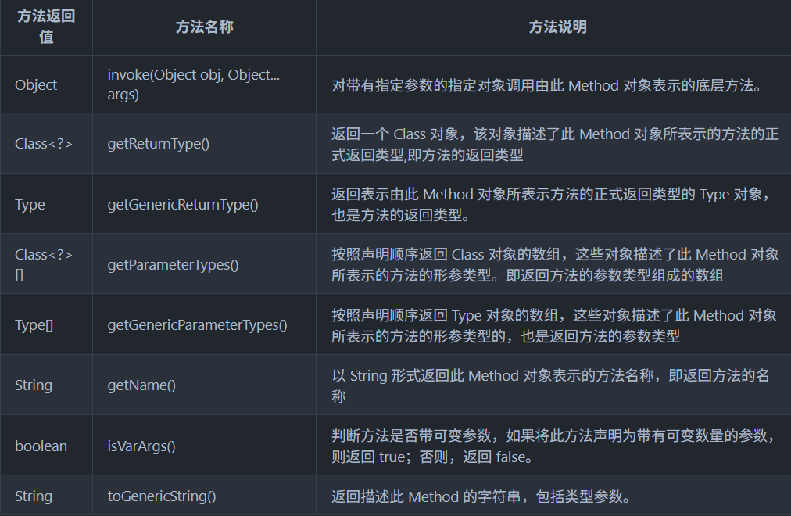

# JavaSE

## 基础数据类型

### 八种基本数据类型
Java提供八种基本类型：
- 数值型：byte、short、int、long
- 浮点型：float、double
- 字符型：char
- 布尔型：boolean
对应的包装类分别是：Byte、Short、Integer、Long、Float、Double、Boolean、Character

### 自动装箱和拆箱
装箱：基本类型转为包装类型
拆箱：包装类型转基本类型

### 自动类型转换和强制类型转换
基本类型存在自动类型转换和强制类型转换：
- 自动类型转换：从小范围类型到大范围类型（如 byte -> int -> long -> double）。
- 强制类型转换：从大范围到小范围，可能丢失精度

### 包装类的缓存机制
包装类的缓存机制：利用对象池缓存常用的包装对象，避免重复创建，直接返回对象，适用Integer、Long、Short、Byte、Character、Boolean，自动装箱或者特定方法（valueOf）返回缓存对象。
Integer、Long、Short、Byte缓存范围：-128~127
Character缓存范围0-127
Boolean缓存True和False两个对象


## String
String 是 Java 中 java.lang 包下的核心类，用于表示不可变的字符序列。
String 对象创建后内容不可更改，任何修改操作（如拼接）都会创建新对象。

String底层使用char[]存储字符，JDK9以后使用bate[]存储， 数组为final修饰，不可变，修改会创建新的String对象

String创建的字符串存放在字符串常量池中，相同的字面量使用同一个对象。

String不可变，线程安全

String对象使用+拼接会生成新的String对象和StringBuilder对象，增加堆内存开销

String转Integer的方法：
- Integer.parseInt(String s)
- Integer.valueOf(String s)

### String、StringBuilder、StringBuffer

可变性上：String是不可变的，每次修改字符串都会创建一个新的String对象，StringBuilder和StringBuffer都是可变的，可以动态的在字符串基础上修改。

线程安全性上：String是线程安全的，StringBuilder不是线程安全的，StringBuffer是线程安全的

线程：如果单线程，字符串不可变用String，字符串可变用StringBuilder，如果多线程推荐使用StringBuffer

### 直接赋值String字符串和new String()的区别？

直接赋值：String s = "yang"
new String方式：String s = new String("yang");

直接赋值String字符串会创建String字面量，然后直接指向字面量对象，new String()会在堆在分配一个对象，然后指向的是堆上的对象。
再就是判断的时候，如果是直接赋值，那么多个对象的引用指向的都是字符串池中的字面量，引用地址相同，如果是new String()指向的是堆上的不同对象，地址不同。


## 接口和抽象类
接口是方法的集合，通常只声明方法签名（无实现），由实现类提供具体实现。
接口中不允许有变量，常量默认 public static final，必须初始化。抽象方法默认public abstract，无方法体。JDK8后使用 default 关键字，提供默认实现。JDK8后提供静态方法，使用 static 关键字，属于接口本身。JDK9后提供私有方法，使用 private 关键字，仅接口内部使用。
类可实现多个接口，弥补 Java 单继承限制。

抽象类是使用 abstract 关键字声明的类，不能实例化，包含抽象方法（无实现）和具体方法（有实现）。
包含变量和静态变量，有抽象方法、具体方法、构造器
方法和字段都支持四种访问修饰符


抽象方法和接口在语法层面上的不同：
1. 抽象类可以有方法体的方法，接口Java8之前不能有，Java8之后也有
2. 接口中只支持常量，隐式为public static final类型，但是抽象类可有实例字段、静态字段
3. 接口中不能含有静态代码块，抽象类中可以有
4. 一个类只能继承一个抽象类，但是可以实现多个接口

抽象方法和接口在设计层面上（使用场景）的不同：
1. 抽象类强调类的抽象，对整个类进行抽象，包含属性、行为，但是接口强调对类的局部进行抽象，也就是对行为进行抽象
2. 抽象类更像是一个模板式设计，共享代码，接口更像是一种行为规范，规定接口功能

## 对象


### Java对象创建过程
Java 对象创建主要包括以下步骤：
1. **类加载**：确保类元信息加载到 JVM。
2. **内存分配**：为对象分配堆内存。
3. **初始化零值**：将对象内存初始化为默认值。
4. **设置对象头**：配置对象头信息（如类元数据、哈希码）。
5. **执行构造器**：调用 \<init\> 方法，完成对象初始化。


### 创建对象的几种方式
1. 使用new关键字
2. 使用反射
3. 使用newInstance()方法
4. 使用clone()方法
5. 使用对象的反序列化


### Object对象方法

- getClass()：获取类元数据类
- hashCode()：获取对象的哈希码
- equals()：比较对象是否相等
- clone()：创建对象的副本
- toString()：返回对象信息
- wait()：暂停当前线程
- notify()：唤醒
- notifyAll()：唤醒所有
- finalize()：垃圾回收
### 深克隆、浅克隆
- 浅克隆：复制对象本身及其基本类型字段，但对于引用类型字段，仅复制引用地址（指向相同的对象），不复制引用对象的内容。
- 深克隆：复制对象及其所有字段，包括引用类型字段的完整副本（递归复制整个对象图）。

### 四种引用：引用类型决定了对象在垃圾回收（GC）中的存活行为
1. 强引用：最常见的引用类型，只要有强引用，就不会被回收
2. 软引用：通过 java.lang.ref.SoftReference 类创建，对象在内存不足时可能被回收。适用于内存敏感的缓存（如图片缓存），对象可重建但希望尽量保留。
3. 弱引用：通过 java.lang.ref.WeakReference 类创建，对象在下次 GC 时可能被回收。适用于短期存活对象、避免内存泄漏（如 WeakHashMap、事件监听器）。
4. 虚引用：通过 java.lang.ref.PhantomReference 类创建，最弱的引用，对象几乎等同于不可达，依赖队列处理，适用对象回收后的清理工作（如释放非堆资源、日志记录）。
## 关键字
### &和&&的区别
单个&用于位运算和逻辑运算，逻辑运算会判断两个表达式
&&用于逻辑运算，当第一个表达式不成立不会去判断第二个表达式

### == 和 equals的区别
== 用于比较基本数据类型的值或者引用类型的引用地址

equals是Object类的方法，默认实现是比较地址，子类可重写父类的方法修改比较逻辑


### hashcode()和equals()的区别
hashcode是Object类的方法，返回对象的哈希码，哈希码基于内存地址生成
equals是Object类的方法， 用于比较对象

为什么重写hashcode还要重写equals?
在HashMap等场景中，使用key的hashcode查找桶位置，使用key的equals比较插入位置是否是重复，解决哈希冲突，新值取代旧值


### this、final、finally、finalize
this引用当前对象实例，常用于区分参数和局部变量的名称歧义

final表示不可变， 用于类上表示不能继承，用于方法上表示不能重写，用于变量上表示不能被赋值。

finally是try-catch中的关键字，异常捕获不管执行结果如何都会执行finally中的代码块

finalize，Object方法，对象在GC前会调用


### 访问修饰符
访问修饰符有public、protected、默认、private
范围分别是：全局、同包+不同包子类、同包、同类

## 方法

### 面向对象三大特征：封装、继承、多态

封装：将对象的属性（数据）和行为（方法）隐藏在类中，通过访问控制限制外部直接访问，仅提供公共接口（如 getter/setter）操作。

继承：子类通过 extends 关键字继承父类的属性和方法，实现代码复用和层次化设计。

多态：同一接口或父类引用在运行时指向不同子类对象，表现出不同行为。
- **运行时多态**：通过方法重写实现（动态绑定）。
- **编译时多态**：通过方法重载（不同参数）实现。

### 重载和重写的区别？

重写发生在类的继承关系中，子类重写父类的方法要保持完全相同的返回值和参数个数、参数类型
总结重写的特点：
1. 重写的参数列表完全一致
2. 重写后的返回类型可以不相同，但是必须是重写方法返回类型的子类
3. 重写后的方法访问权限不能更低
4. 声明为final的不能被重写
5. 声明为static不能被重写，但是可以被再次声明
6. 子类和父类在同一个包中，那么子类可以重写父类所有方法，除了声明为 private 和 final 的方法；不在一个包中，只能重写父类声明的public 和protected方法
7. 重写的方法抛出的异常不能比重写方法大
8. 构造方法不能被重写

重载发生在一个类的内部，方法名称必须相同，返回值和参数列表可以不同。重载的好处是可以根据传入的参数来判断使用哪个具体的方法。
重载特点：
1. 重载的方法必须改变参数列表，参数个数或者参数类型不同。以为重载不能通过返回类型来决定方法，只能通过参数来决定使用的方法。
2. 可以改变返回类型
3. 可以改变访问修饰符
4. 被重载的方法可以声明新的或更广的检查异常；

重载和重写的区别：
1. 重载和重写使用的场景不同，重写是发生在类的继承关系中的，用于对父类方法重写，重载是发生在类的内部的，用于对同名成员方法重写
2. 重写的参数必须一致，重载的参数类型、个数都可以不同
3. 重写的返回类型不能超出父类，重载的返回类型可以是任意
4. 重写的访问修饰符不能超出父类，重载可以是任意
5. 重写的异常不能超出父类，重载可以是任意
6. 构造方法不允许父子类之间重写，但是可以在类中重载

### 序列化和反序列化
- **序列化**：将 Java 对象转换为字节流（如文件、网络传输）。
- **反序列化**：将字节流还原为 Java 对象。
用途：对象持久化（如保存到文件）、网络传输（如 RMI、RPC）。
## 泛型
允许类、接口、方法在定义时使用类型参数，具体类型延迟到使用时指定，提高类型安全和代码复用。
<>：类型参数占位符，指定具体类型。
有泛型类、泛型方法、泛型接口：
```java
public class Box<T> {
    private T value;
    public void set(T value) { this.value = value; }
    public T get() { return value; }
}

public <T> void print(T item) {
    System.out.println(item);
}

public interface Container<T> {
    void add(T item);
}
```


可以使用的通配符：? 表示未知类型，解决泛型类型不完全匹配问题。
- ？无界通配符，任意类型
- ? extends T 上界通配符，表示 T 或其子类，适合只读场景。
- ? super T 下界通配符，表示 T 或其父类，适合只写场景。

泛型擦除：Java 编译器在编译时移除泛型信息，将类型参数替换为 Object 或上界类型（如 ? extends T 替换为 T），运行时无泛型信息。

## 反射机制  

Java反射是指在运行期间，对于任意一个类，都能知道它的所有属性和方法，对于任意一个对象，都能够调用它的任意一个方法和属性。


### 详解反射

#### Class类
Class类，Class类也是一个实实在在的类，存在于JDK的java.lang包中。Class类的实例表示java应用运行时的类(class ans enum)或接口(interface and annotation)（每个java类运行时都在JVM里表现为一个class对象，可通过类名.class、类型.getClass()、Class.forName("类名")等方法获取class对象）。数组同样也被映射为class 对象的一个类，所有具有相同元素类型和维数的数组都共享该 Class 对象。基本类型boolean，byte，char，short，int，long，float，double和关键字void同样表现为 class 对象。
注意几点：
1. Class类也是类的一种，和class定义类的关键字是不一样的
2. 手动编写的类编译后都会产生一个Class对象，表示创建类的类型信息，这个Class对象都保存在同名的.class文件中
3. 每一个通过class标识的类，在内存中都有个与之对应的Class对象描述其类型信息，无论创建多少个这样的类实例对象，都只有一个Class对象
4. Class对象只存私有的构造函数，所有Class对象只能由JVM创建和加载
5. Class对象的作用就是在运行时候提供或者获得对象的类型信息

#### 类加载
类加载流程（JVM加载类的过程）：


#### Class类对象的获取

Class对象是整个反射过程中最重要的，对应着类的基本信息，有三种获取方式：
1. 类名.class
2. 对象.getClass()
3. 根据全限定类名：Class.forName(全限定类名)
Class对象的方法：


```java
public class TestLeetCode {
	private String name;  
	private Integer age;  
	private LocalDateTime birth;  
	  
	public String getName() {  
	    return name;  
	}  
	  
	public void setName(String name) {  
	    this.name = name;  
	}  
	  
	public Integer getAge() {  
	    return age;  
	}  
	  
	public void setAge(Integer age) {  
	    this.age = age;  
	}  
	  
	public LocalDateTime getBirth() {  
	    return birth;  
	}  
	  
	public void setBirth(LocalDateTime birth) {  
	    this.birth = birth;  
	}  
	  
	public String nickName;  
	  
	@Override  
	public String toString() {  
	    return "TestLeetCode{" +  
	            "name='" + name + '\'' +  
	            ", age=" + age +  
	            ", birth=" + birth +  
	            '}';  
	}  
	  
	@Test  
	public void test05() throws ClassNotFoundException, InstantiationException, IllegalAccessException {  
	    TestLeetCode code = new TestLeetCode();  
	    System.out.println("1获取Class类：" + TestLeetCode.class);  
	    System.out.println("2获取Class类：" + code.getClass());  
	    System.out.println("3获取Class类：" + Class.forName("org.jeecg.TestLeetCode"));  
	  
	  
	    Class<?> aClass = Class.forName("org.jeecg.TestLeetCode");  
	    System.out.println("类的全限定名：" + aClass.getName());  
	  
	    TestLeetCode object = (TestLeetCode) aClass.newInstance();  
	    System.out.println("通过Class对象创建对象：" + object);  
	  
	    //获取声明的public字段，包含父类的  
	    Field[] fields = aClass.getFields();  
	    for (Field field : fields) {  
	        System.out.println("字段：" + field);  
	    }  
	    System.out.println("-------------------");  
	    //获取声明的所有字段，不包含父类的  
	    Field[] declaredFields = aClass.getDeclaredFields();  
	    for (Field declaredField : declaredFields) {  
	        System.out.println("字段：" + declaredField);  
	    }  
	}
}


输出结果表明；通过getFields()和getDeclaredFields()的不同
1获取Class类：class org.jeecg.TestLeetCode
2获取Class类：class org.jeecg.TestLeetCode
3获取Class类：class org.jeecg.TestLeetCode
类的全限定名：org.jeecg.TestLeetCode
通过Class对象创建对象：TestLeetCode{name='null', age=null, birth=null}
字段：public java.lang.String org.jeecg.TestLeetCode.nickName
-------------------
字段：java.util.Random org.jeecg.TestLeetCode.random
字段：int org.jeecg.TestLeetCode.count
字段：private java.lang.String org.jeecg.TestLeetCode.name
字段：private java.lang.Integer org.jeecg.TestLeetCode.age
字段：private java.time.LocalDateTime org.jeecg.TestLeetCode.birth
字段：public java.lang.String org.jeecg.TestLeetCode.nickName
```

#### Constructor类及其用法
Constructor类存在于反射包(java.lang.reflect)中，反映的是Class 对象所表示的类的构造方法。
Class类针对于Constructor类所用的方法：

```java
Class<?> aClass = Class.forName("org.jeecg.TestLeetCode");
System.out.println("------所有public构造方法-------------");  
Constructor<?>[] declaredConstructors = aClass.getDeclaredConstructors();  
for (Constructor<?> declaredConstructor : declaredConstructors) {  
    System.out.println("构造方法：" + declaredConstructor);  
}  
System.out.println("------所有构造方法-------------");  
Constructor<?>[] constructors = aClass.getConstructors();  
for (Constructor<?> constructor : constructors) {  
    System.out.println("构造方法：" + constructor);  
}
TestLeetCode o = (TestLeetCode)constructors[0].newInstance();  
o.setName("利用构造函数创建对象");  
System.out.println("创建对象：" + o);

输出：
------所有public构造方法-------------
构造方法：public org.jeecg.TestLeetCode()
------所有构造方法-------------
构造方法：public org.jeecg.TestLeetCode()
创建对象：TestLeetCode{name='利用构造函数创建对象', age=null, birth=null}

带有参数的构造函数获取和采用参数的构造函数创建对象
//获取带String参数的public构造函数 
Constructor cs1 =clazz.getConstructor(String.class); 
//创建User 
User user1= (User) cs1.newInstance("hiway"); 
user1.setAge(22); 
System.out.println("user1:"+user1.toString());

//取得指定带int和String参数构造函数,该方法是私有构造
private Constructor cs2=clazz.getDeclaredConstructor(int.class,String.class); 
//由于是private必须设置可访问 
cs2.setAccessible(true); 
//创建user对象 
User user2= (User) cs2.newInstance(25,"hiway2"); System.out.println("user2:"+user2.toString());
```

Constructor本身的一些方法：

```java
Constructor cs3 = clazz.getDeclaredConstructor(int.class,String.class); System.out.println("-----getDeclaringClass-----"); 
Class uclazz=cs3.getDeclaringClass(); 
//Constructor对象表示的构造方法的类 
System.out.println("构造方法的类:"+uclazz.getName()); 
System.out.println("-----getGenericParameterTypes-----"); 
//对象表示此 Constructor 对象所表示的方法的形参类型 
Type[] tps=cs3.getGenericParameterTypes(); 
for (Type tp:tps) { System.out.println("参数名称tp:"+tp); } System.out.println("-----getParameterTypes-----"); 
//获取构造函数参数类型 
Class<?> clazzs[] = cs3.getParameterTypes(); 
for (Class claz:clazzs) { System.out.println("参数名称:"+claz.getName()); } System.out.println("-----getName-----"); 
// 以字符串形式返回此构造方法的名称 
System.out.println("getName:"+cs3.getName()); 
System.out.println("-----getoGenericString-----"); 
//返回描述此 Constructor 的字符串，其中包括类型参数。 
System.out.println("getoGenericString():"+cs3.toGenericString());


输出：
-----getDeclaringClass----- 
构造方法的类:com.example.javabase.User 
-----getGenericParameterTypes----- 
参数名称tp:int 参数名称tp:class java.lang.String 
-----getParameterTypes----- 
参数名称:int 参数名称:java.lang.String 
-----getName----- 
getName:com.example.javabase.User 
-----getoGenericString----- 
getoGenericString():private com.example.javabase.User(int,java.lang.String)

```

#### field类及其使用
Field 提供有关类或接口的单个字段的信息，以及对它的动态访问权限。反射的字段可能是一个类（静态）字段或实例字段。
Class对象针对Field对象获取：

Field对象自带的常用方法：


#### Method类及其用法
Method 提供关于类或接口上单独某个方法（以及如何访问该方法）的信息，所反映的方法可能是类方法或实例方法（包括抽象方法）。
Class对象针对method类常用方法：

Method类的常用方法：

### 深入反射，反射执行的流程
[反射执行的流程](https://pdai.tech/md/java/basic/java-basic-x-reflection.html#%E5%8F%8D%E5%B0%84%E6%9C%BA%E5%88%B6%E6%89%A7%E8%A1%8C%E7%9A%84%E6%B5%81%E7%A8%8B)


### JDK动态代理和CGLIB的区别？

Java的两种常见的代理技术。
JDK动态代理适用于基于接口的代理需求，CGLIB代理适用于基于代理普通类。


## JavaIO

### 五种Java文件拷贝方式：

1. 传统字节流（FileInputStream + FileOutputStream）
2. 缓冲包装字节流（BufferedInputStream + BufferedOutputStream）
3. Files.copy()
4. FileChannel通道拷贝
5. 内存映射拷贝MappedByteBuffer

### Java的IO模型（BIO、NIO、AIO）

BIO是阻塞IO模型，线程会一直阻塞等待线程完成，BIO使用传统的字节流和字符流，需要为输入输出分别创建缓冲区。BIO使用一个线程处理一个请求方式，高并发线程数量剧增会导致系统崩溃。
NIO是非阻塞IO模型，线程可以去做其他任务，IO操作完成会得到通知。NIO引入基于通道和缓冲区的IO方式，一个缓冲区就可以完成读写操作。NIO采用多路复用器监听多个客户端请求，使用一个线程处理，提高系统性能。
AIO是非阻塞IO模型，不需要用户线程关注IO事件，由操作系统通过回调机制处理。AIO不需要缓冲区，通过异步回调操作。AIO依靠操作系统完成IO操作，不需要额外的线程池和多路复用器。


## 过滤器和拦截器

过滤器是针对配置的路径进行过滤
实现：
通过Servlet提供的@WebFilter注解，配置过滤的URL规则，实现Filter接口，重写接口中的doFilter方法


拦截器是定义拦截业务，针对业务方法前后进行代码增强
实现：
实现HandlerInterceptor接口并重写其中的方法。


过滤器和拦截器的区别：
1. 过滤器来之Servlet，拦截器来自Spring
2. 请求的执行顺序：请求进入-->进入拦截器-->进入Servlet-->进入拦截器-->进入控制器
3. 拦截器一般用来做业务判断的，比如：登录判断、权限判断等，过滤器一般用来实现通用功能过滤，比如：敏感词过滤等


## Comparator和Comparable的区别

Comparable接口是在对象内定义比较逻辑，使用compareTo()方法比较当前对象和其他对象的关系，一般这个类实现了comparable接口，就提供默认的自然排序。

Comparator是一个独立的比较器，可以定义不同类对象之间的比较，属于外部排序，独立定义排序规则。


## Lambda

Java8的新特性，简洁的方式编写匿名类和函数式接口的实现。

Lambda表达式语法包括三部分：
- 参数列表
- 箭头符号 ->
- 函数体


## 内部类

内部类定义在类的内部

内部类分类：
1. 成员内部类：成员内部类可以访问外部类的成员，包括私有变量，创建内部类对象，需要先创建外部类，再创建成员内部类对象
2. 静态内部类：静态内部类只能访问外部类的静态成员，在创建静态内部类的时候，可以直接通过外部类的类名进行创建
3. 局部内部类：方法或者代码块中定义的类，只能访问外部方法或者 作用域中的final变量和参数。
4. 匿名内部类：没有定义名称的类，通常用于创建实现某个接口或者继承某个类的对象。