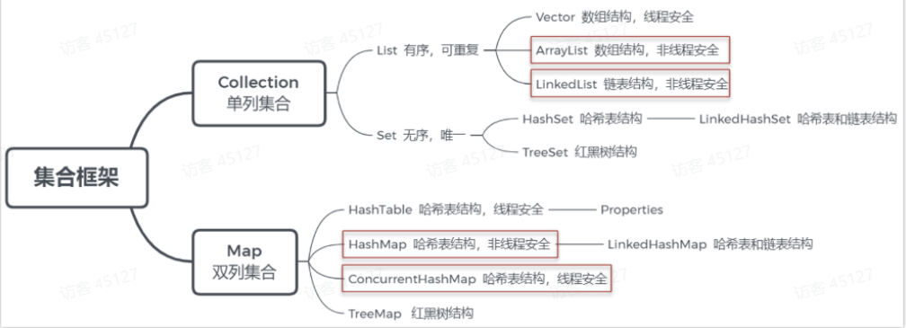

# 集合专题
参考黑马集合专题：[https://heuqqdmbyk.feishu.cn/wiki/RymLwLLWfieibHkjf17cKhY4nlf](https://heuqqdmbyk.feishu.cn/wiki/RymLwLLWfieibHkjf17cKhY4nlf)

集合大框架：分为Collection单列集合和Map双列集合两大类


## 算法复杂度分析
时间复杂度分析：简单来说就是评估代码的执行耗时时间，有O(1)、O(logn)、O(n)、O(n^2)、O(2^n)
空间复杂度：代码占用/消耗空间的大小

## 数组
数组使用一块连续的内存空间存储数据。
数组因为连续内存空间的特点根据下标可以快速定位到查找的元素（通过寻址公式）。
但是插入和删除的效率比较慢，是O(n)

## 链表

链表是用于连接内存地址不连续的数据，通过指针连接起来，并可以进行顺序访问。
**单向链表：** 一个节点是使用一个指针连接后一个节点。单向链表的查询效率是O(n)，插入和删除的效率是O(1)
**双向链表：** 节点使用两个指针分别连接前后两个节点。查询效率是O(n)，插入和删除效率是O(n)


## List

### ArrayList

ArrayList底层使用动态数组实现。
ArrayList默认初始容量为0，第一次添加后初始化容量为10
ArrayList扩容是原来容量的1.5

初始化和添加方法：
1. ArrayList(int capacity)传入一个初始值，会创建指定容量的数组
2. public ArrayList(Collection\<? extends E\> c) 会使用 c 的大小作为数组容量
3. add(Object c)方法添加元素首次扩容10，再次扩容为容量的1.5倍
4. addAll(Collection c) 没有元素时，扩容为两者的最大值 Math.max(10, 实际元素个数)，有元素时为 Math.max(原容量 1.5 倍, 实际元素个数)

ArrayList list = new ArrayList(10)中的list扩容几次？
该语句只是声明和实例了一个 ArrayList，指定了容量为 10，进行初始化，未进行扩容

ArrayList的扩容机制：当数组满了扩容原数组大小的1.5倍

如何实现List和数组之间的转换？
- 数组转List ，使用JDK中java.util.Arrays工具类的asList方法。Arrays.asList(new int[]{1, 2})
- List转数组，使用List的toArray方法。无参toArray方法返回 Object数组，传入初始化长度的数组对象，返回该对象数组。List.toArrasy()
1，用Arrays.asList转List后，如果修改了数组内容，list受影响吗
Arrays.asList转换list之后，如果修改了数组的内容，list会受影响，因为它的底层使用的Arrays类中的一个内部类ArrayList来构造的集合，在这个集合的构造器中，把我们传入的这个集合进行了包装而已，最终指向的都是同一个内存地址
2，List用toArray转数组后，如果修改了List内容，数组受影响吗
list用了toArray转数组后，如果修改了list内容，数组不会影响，当调用了toArray以后，在底层是它是进行了数组的拷贝，跟原来的元素就没啥关系了，所以即使list修改了以后，数组也不受影响

线程安全方面：ArrayList 非线程安全，多线程操作可能导致数据不一致或异常
解决方法：
- 使用 Collections.synchronizedList(new ArrayList<>()) 包装，添加同步锁。
- 使用 CopyOnWriteArrayList（适合读多写少场景）。
- 手动加锁（synchronized 或 Lock）。


### LinkedList
LinkedList底层使用双向链表。
LinkedList每个节点还需要存在两个指针的空间，相比ArrayList单独存储空间大一点
LinkedList没有容量，分配就创建节点


### Vector
Vector集合底层基于动态数组实现
所有的方法通过Synchronized关键字实现同步，多线程安全
Vector是Java1.0的遗留类，部分方法已经不兼容，已经被弃用

### ArrayList、LinkedList、Vector的区别
在底层数据结构方面
- ArrayList 的底层数据结构使用的是动态数组，动态数组可以自动扩容，适合顺序访问和随机访问
- LinkedList的底层数据结构使用的是双向链表，支持高效的头尾插入与删除
- Vector的底层数据结构使用动态数组，但是加了同步机制

在操作数据效率性能：
- ArrayList随机访问O(1)，尾部插入O(1)，中间插入删除O(n)，因为需要移动数据，适用于读多写少的场景
- LinkedList随机访问O(n)，头尾操作O(1)，中间插入删除O(n)，适用于频繁插入删除场景
- Vector的性能类似ArrayList，但是由于同步机制，操作速度较慢

容量与扩容：
- ArrayList默认初始容量10，扩容增加1.5倍
- LinkedList默认没有容量，按需分配，占用较大，因为多了两个指针
- Vector默认初始容量10，扩容增加翻倍


线程安全方面：
 - ArrayList和LinkedList都不是线程安全的，多线程环境下需要外部同步，Vector是线程安全的，所有方法都加了锁，粒度大效率低
- 如果需要保证线程安全，有下面方案：
    - 使用CopyOnWriteArrayList
    - 使用**Collections.synchronizedList**（通过 Collections.synchronizedList 包装 ArrayList 或 LinkedList，返回一个线程安全的列表。所有操作（如 add、remove、get）都被同步，防止并发修改。）
    - 使用Vector（由于缺点性能低，所有的方法都加锁，已经弃用）
	    - 手动使用锁
```java
List list = Collections.synchronizedList(new ArrayList<>()); 
```  

迭代行为：
- **ArrayList**: 快速失败（fail-fast），迭代过程中若结构数据修改（增删），抛出 ConcurrentModificationException。
- **LinkedList**: 快速失败，行为同 ArrayList。
- **Vector**: 快速失败，但因线程安全，迭代时受同步保护，修改需通过 Vector 方法。

### Fail-Fast和Fail-Safe
- **Fail-Fast**（快速失败）：在遍历集合（如使用迭代器或增强型 for 循环）时，如果集合的结构被修改（比如添加、删除元素），迭代器会立即抛出 ConcurrentModificationException，以“快速失败”的方式提示开发者集合被非法修改。这种机制优先检测并发修改问题，防止不可预测的行为。
- **Fail-Safe**（安全失败）：在遍历集合时，即使集合的结构被修改，迭代器也不会抛出异常，而是继续基于遍历开始时的集合状态（如快照）进行操作。这种机制允许遍历和修改同时进行，通常通过读写分离实现。

ArrayList是fail-fast的典型代表，在使用迭代器遍历ArrayList集合的时候，如果对集合进行了修改操作，比如add或者remove，迭代器会立马检测出并抛出`ConcurrentModificationException`。因为ArrayList迭代器内部维护了一个修改计数器，记录修改的次数，迭代结束后会判断和开始迭代的计数器数字是否一致。

CopyOnWriteArrayList 使用 Fail-Safe 机制。在遍历时，迭代器基于遍历开始时集合的快照（snapshot）工作，因此即使在遍历过程中对集合进行修改（添加、删除等），迭代器也不会抛出异常，遍历结果仍然基于快照。


测试代码：测试发现ArrayList在迭代得过程中如果修改元素，那么就会报异常，如果使用CopyOnWriteArrayList修改元素，并不会出现问题
```java
// 测试 ArrayList 的 Fail-Fast 机制  
System.out.println("Testing ArrayList (Fail-Fast):");  
List<String> arrayList = new ArrayList<>();  
arrayList.add("A");  
arrayList.add("B");  
arrayList.add("C");  
  
try {  
    Iterator<String> iterator = arrayList.iterator();  
    while (iterator.hasNext()) {  
        String element = iterator.next();  
        System.out.println("Element: " + element);  
        // 在迭代过程中添加元素  
        arrayList.add("D");  
    }  
} catch (Exception e) {  
    System.out.println("Exception caught: " + e);  
}  
  
// 测试 CopyOnWriteArrayList 的 Fail-Safe 机制  
System.out.println("\nTesting CopyOnWriteArrayList (Fail-Safe):");  
List<String> copyOnWriteList = new CopyOnWriteArrayList<>();  
copyOnWriteList.add("X");  
copyOnWriteList.add("Y");  
copyOnWriteList.add("Z");  
  
Iterator<String> cowIterator = copyOnWriteList.iterator();  
while (cowIterator.hasNext()) {  
    String element = cowIterator.next();  
    System.out.println("Element: " + element);  
    // 在迭代过程中添加元素  
    copyOnWriteList.add("W");  
}  
  
// 打印最终的 CopyOnWriteArrayList 内容  
System.out.println("Final CopyOnWriteArrayList: " + copyOnWriteList);


输出结果：
Testing ArrayList (Fail-Fast):
Element: A
Exception caught: java.util.ConcurrentModificationException

Testing CopyOnWriteArrayList (Fail-Safe):
Element: X
Element: Y
Element: Z
Final CopyOnWriteArrayList: [X, Y, Z, W, W, W]
```

### 用过哪些集合？使用的原因？
主要使用过ArrayList、HashMap，使用ArrayList存储顺序结构的数据，使用HashMap存储键值对的数据

### CopyOnWriteArrayList
CopyOnWriteArrayList 是 Java 中一个线程安全的 List 实现，位于 java.util.concurrent 包，专为**读多写少的高并发场景设计**。
它通过“写时复制”机制确保线程安全，适合需要频繁读取但很少修改的场景。

底层使用Object数组，使用volatile修饰，读操作无锁，写操作通过ReentrantLock加锁

通过写时复制机制保证线程安全，写操作获取Reentrant锁，复制数据到新数组中，使数组引用指向新数组，最后释放锁。
读操作直接访问底层数组

默认初始化空数组。
扩容复制新数组，新数组容量+1
缩容复制新数组，新数组容量-1

使用示例：
```java
public class CopyOnWriteArrayListDemo {
    public static void main(String[] args) {
        // 初始化
        List<String> list = new CopyOnWriteArrayList<>();
        // 添加元素
        list.add("Apple");
        list.add("Banana");
        list.add(1, "Orange");
        // 批量添加
        list.addAll(List.of("Grape", "Mango"));
        // 访问与修改
        System.out.println("Element at index 1: " + list.get(1)); // Orange
        list.set(1, "Lemon");
        // 删除
        list.remove("Banana");
        list.remove(0); // 删除 Apple
        // 并发读
        new Thread(() -> {
            for (String fruit : list) {
                System.out.println("Reading: " + fruit);
                try {
                    Thread.sleep(100); // 模拟耗时
                } catch (InterruptedException e) {
                    e.printStackTrace();
                }
            }
        }).start();
        // 并发写
        new Thread(() -> {
            list.add("Peach"); // 不影响正在遍历的线程
            System.out.println("Added Peach");
        }).start();
        // 大小与检查
        System.out.println("Size: " + list.size());
        System.out.println("Contains Mango: " + list.contains("Mango"));
    }
}
```

### Collections.SynchronizedList

Collections.synchronizedList 是 Java java.util.Collections 提供的一个工具方法，用于将非线程安全的 List（如 ArrayList）包装为线程安全的 List。**它通过在每个方法上添加 synchronized 同步锁实现线程安全，适合需要简单同步的多线程场景**

输入：任意List实现，比如ArrayList、LinkedList
输出：包装后的线程安全List

代码示例：
```java
public class SynchronizedListDemo {
    public static void main(String[] args) {
        // 创建 ArrayList 并包装为线程安全
        List<String> list = Collections.synchronizedList(new ArrayList<>());
        
        // 添加元素
        list.add("Apple");
        list.add("Banana");
        list.add(1, "Orange");
        
        // 多线程操作
        new Thread(() -> {
            synchronized (list) { // 手动同步迭代
                for (String fruit : list) {
                    System.out.println("Reading: " + fruit);
                    try {
                        Thread.sleep(100);
                    } catch (InterruptedException e) {
                        e.printStackTrace();
                    }
                }
            }
        }).start();
        
        new Thread(() -> {
            list.add("Grape"); // 线程安全
            System.out.println("Added Grape");
        }).start();
        
        // 访问与检查
        System.out.println("Size: " + list.size());
        System.out.println("Contains Banana: " + list.contains("Banana"));
    }
}
```

## Set

### HashSet
HashSet 是 Java 中 java.util 包下的一个集合类，实现了 Set 接口，用于存储无序、唯一的元素。它基于哈希表实现，提供高效的添加、删除和查询操作。

底层结构：
HashSet 底层基于 HashMap 实现，元素存储在 HashMap 的键（key）中，值固定为 PRESENT（一个常量 Object）
使用哈希表，包含数组+链表/红黑树

判定元素位置：
哈希表机制：元素的存储位置是通过哈希表机制判断的，元素通过hashcode()计算哈希值，映射到数组的索引上，如果发生哈希冲突，使用链表/红黑树存储冲突的元素

容量、扩容机制：
默认初始化容量为16，负载因子是0.75，容量超过容量 * 负载因子的大小，容量扩容至两倍，重新计算所有元素的哈希位置

线程安全方面：
HashSet 未同步，多线程操作可能导致数据不一致或异常（如 ConcurrentModificationException）。
解决方法：高并发场景使用 ConcurrentHashMap.newKeySet()，性能优于 Collections.synchronizedSet
1. 使用Collections.synchronizedSet
2. ConcurrentHashMap.newKeySet()
3. 手动加锁

### LinkedHashSet
LinkedHashSet 是 Java 中 java.util 包下的一个集合类，继承自 HashSet，实现了 Set 接口。它基于哈希表和双向链表实现，在 HashSet 的基础上增加了插入顺序的维护。

底层数据结构：LinkedHashSet 底层基于 LinkedHashMap 实现，LinkedHashMap 是 HashMap 的子类，增加了双向链表维护插入顺序。
元素存储在 LinkedHashMap 的键（key）中，值固定为 PRESENT（HashSet 中的常量 Object）。
底层实现哈希表+双向链表/红黑树

容量、扩容机制：和HashSet一样
默认初始化容量为16，负载因子是0.75，容量超过容量 * 负载因子的大小，容量扩容至两倍，重新计算所有元素的哈希位置

非线程安全，解决方法和HashSet一致

### TreeSet
TreeSet 是 Java 中 java.util 包下的一个集合类，实现了 NavigableSet 接口（继承自 SortedSet 和 Set），基于红黑树实现，用于存储有序、唯一的元素。适合自动排序的场景。

底层实现：TreeSet 底层基于 TreeMap 实现，元素存储在 TreeMap 的键（key）中，值固定为 PRESENT（一个常量 Object）。
TreeMap 使用**红黑树**（自平衡二叉搜索树），保证元素有序。

排序机制：
1. 自然排序：元素实现 Comparable 接口，使用 compareTo 方法比较（如 Integer、String）
2. 自定义排序：通过构造函数传入 Comparator 定义排序规则。

非线程安全，解决方法和HashSet一样

### HashSet、LinkedHashSet、TreeSet区别
应用场景不同：
HashSet实现了Set接口，底层使用哈希表，**不保证元素顺序**
LinkedHashSet是HashSet的子类，底层也是使用哈希表，**保证元素顺序和插入顺序一致**
TreeSet实现了SortedSet接口，底层使用红黑树（一种自平衡二叉查找树），**保证元素顺序**

相同点：
1. 都是集合类，用于存储不重复的元素
2. 都实现了Set接口
3. HashSet和LinkedHashSet都可以存储Null元素，但是TreeSet不允许
4. HashSet、LinkedHashSet 和 TreeSet 都是线程不安全的，如果在多线程环境中使用，需要进行外部同步

不同点：
1. 底层数据结构方面：
	1. HashSet底层基于HashMap，使用哈希表，具有较快的插入和查询速度，不维护元素顺序
	2. LinkedHashSet底层基于LinkedHashMap，也使用哈希表，但是通过链表维护插入顺序
	3. TreeSet底层基于HashMap，使用红黑树，可以对元素进行排序，并且支持有序集合操作，如获取子集、范围查找等。
2. 元素顺序方面：
	1. HashSet不保证顺序
	2. LinkedHashSet保证和插入顺序一致
	3. TreeSet默认使用元素的自然排序，实现Comparable接口，也可以通过传入自定义的Comparator定制排序
3. 性能方面：
	1. HashSet查找、插入、删除都是$O(1)$
	2. LinkedHashSet引入了链表，需要维护关系，略逊于HashSet
	3. TreeSet查找、插入、删除都是$O(logN)$
4. 使用场景：
	1. HashSet适用于一些不要求顺序，对操作数据速度要求高的场景
	2. LinkedHashSet适用于要求按照插入顺序一致，对操作速度要求一般的场景
	3. TreeSet适用于一些需要特殊定制排序的场景

### ConcurrentHashMap.newKeySet()
ConcurrentHashMap.newKeySet() 是 Java 8 引入的一个方法，位于 java.util.concurrent.ConcurrentHashMap 类中，用于创建线程安全的 Set 集合，底层基于 ConcurrentHashMap 实现。它适合高并发场景，提供高效的线程安全操作。

返回类型：KeySetView，一个实现 Set 接口的线程安全集合。
用途：创建一个空的、线程安全的 Set，元素存储在 ConcurrentHashMap 的键中，值固定为 Boolean.TRUE

底层结构：
- newKeySet() 创建的 KeySetView 是一个视图，底层基于 ConcurrentHashMap<K, Boolean>，键存储元素，值固定为 Boolean.TRUE.
- ConcurrentHashMap 使用哈希表，包含数组（桶）和链表/红黑树（处理哈希冲突）

并发机制：
- **分段锁**：ConcurrentHashMap 将哈希表分成多个段（segment），每个段独立加锁，允许并发读写。
- **CAS 操作**：无锁更新（如 putIfAbsent）使用 CAS，减少锁开销。
- **读无锁**：读操作（如 contains）不加锁，利用 volatile 保证可见性

## HashMap

见此文档详解HashMap[HashMap专题](HashMap专题)


