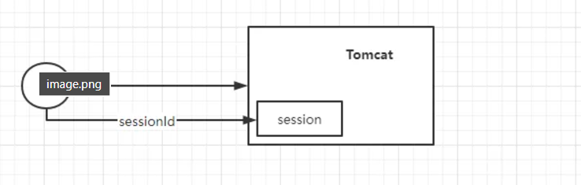

---
tags:
  - SpringSecurity
  - OAuth
  - JWT
  - RBAC
  - TOKEN
  - 联合登录
  - 单点登录
date: 2025-04-08
---
# SpringSecurity+OAuth2.0

# 认证授权
## 联合登录和单点登录
$\qquad$联合登录，就是通过开放认证平台由第三方应用做身份担保，使用户可以获得本系统的相关权限，最常见的身份担保平台就是微信、QQ，当然阿里系的一些应用，支付宝，淘宝也可以为用户做身份担保。
$\qquad$单点登录，英文名叫做：Single Sign On，所以也被称为SSO。日常，我们登录了淘宝，再去访问天猫的网站，我们就会发现我们没有登录但是也会保持已登录的状态，这就是所谓的单点登录。单点登录一般都是集中存储登录状态，我们在访问淘宝需要权限的资源时，会去访问SSO服务，发现没有登录会跳转登录页，当我们登录后访问天猫，天猫会到SSO服务确认我们有没有登录，如果登录了，直接返回天猫，并带上令牌。

$\qquad$联合登录与单点登录区别主要就是： 联合登录是第三方提供身份担保，单点登录是通过统一认证中心确认登录状态。

$\qquad$联合登陆通过向第三方平台（QQ、微信、github等）申请登录凭证，第三方平台会返回一个访问令牌或者授权码，并且通过特定的协议（OAuth2.0或者OpenID Connect）传递给目标系统。

- 凭证存放的位置：
	-  短期凭证，通过目标系统临时保存（内存、会话存储或者数据库），用于后续与第三方平台交互
    - 长期凭证，核心的身份数据和长期凭证仍然由第三方平台拥有，目标系统只获得有限的权限访问

$\qquad$在单点登录中，所有的系统都依赖一个统一的SSO服务（认证中心）。用户在A系统登录成功后，SSO服务会生成一个会话令牌（Session Token）或票据（Ticket），并将其与用户的登录状态绑定。

+ 凭证存放的位置：
    - 会话令牌通常存储在SSO服务端（如数据库或缓存中），并与用户的身份关联。
    - 客户端（浏览器）会收到一个较轻量的标识（如Cookie中的Session ID），用于与SSO服务通信。
    - 各系统（如A系统、B系统）不直接存储用户的完整凭证，而是通过SSO服务验证令牌有效性


## Session、Cookie
**为什么需要Session、Cookie？都是为了保存登录状态所出现的**

+ web程序是使用HTTP协议传输的，而HTTP协议是无状态的协议，对于事务处理没有记忆能力。缺少状态意味着如果后续处理需要前面的信息，则它必须重传，这样可能导致每次连接传送的数据量增大。另一方面，在服务器不需要先前信息时它的应答就较快。
Cookie的作用：
+ 用户第一次发送请求之后，服务器返回一个cookie给客户端，客户端之后的请求携带这个cookie，服务端就知道当前用户的身份了。但是cookie的数量和空间是有限的。
Cookie有两种保存方式，一种是浏览器会将Cookie保存在内存中，还有一种是保存在客户端的硬盘中`

Cookie的生命周期：	

+ Cookie在生成时就会被指定一个Expire值，这就是Cookie的生存周期，在这个周期内Cookie有效，超出周期Cookie就会被清除。有些页面将Cookie的生存周期设置为“0”或负值，这样在关闭浏览器时，就马上清除Cookie，不会记录用户信息，更加安全。

Cookie的缺陷：

+ 数量收到限制，有大小限制，时间限制
+ 安全性无法保障，可能通过脚本注入的方式获取到cookie
+ 浏览器可能会禁用cookie

Session会话：用户打开一个浏览器，打开了很多个超链接web资源，然后关闭浏览器，就是关闭了会话，所以一次会话就是一次浏览器的打开关闭过程。

Session：**也叫会话控制，记录一次会话中所需的属性和配置信息。**

Cookie和Session的配合使用过程：

1. 会话第一次访问到web网站，服务端返回一个唯一SessionId给客户端
2. 客户端将SessionId存储到Cookie中
3. 第二次访问携带Cookie给服务端
4. 服务端从中获取SessionId，解析出来上次访问的信息

Session的生命周期：

+ 根据Web应用程序设置的参数规定。

**所以Cookie是保存在客户端，Session是保存在服务端中的。**

$\qquad$可以把Session和Cookie想象成银行取钱，Session是银行，Cookie是银行卡，Cookie上面有唯一的表示SessionId银行卡号，拿着Cookie就可以去Session获取当前自己的余额了。

## Token
$\qquad$由于Session天然不支持分布式，因为是需要存储在服务端的，需要考虑很多问题，比如服务器的同步，我在一个服务器上登录成功了，保存了Session，但是我另外一个服务器接收请求，会找session，发现没有对应登录信息。

$\qquad$token是不需要服务端多余存储的，所以Token成为了主流的登录校验的手段。因为token将用户的唯一标识放到token中，服务端解析token获得唯一的标识，如果没有这个所谓的唯一标识，那么就是没有登录，如果有，表示登录用户属于该系统。

**token的术语是令牌**

token使用的流程：

1. 用户第一次访问（登录），服务端生成token返回给客户端
2. 客户端存储token，放到cookie或者Local storage（本地存储）中
3. 客户端之后的每次请求携带这个token
4. 服务端校验token

前端token的四个存储位置：

1. localStorage：localStorage 生命周期是**永久**。优点：持久化存储，关闭浏览器后依然保留，除非手动清除。缺点：容易被XSS（跨站脚本攻击）读取，安全性较低。示例：localStorage.setItem('token', 'your-token-here');
2. sessionStorage：sessionStorage生 命周期为当前窗口或标签页。优点：比localStorage更短暂，适合临时会话。缺点：同样有XSS风险。示例：sessionStorage.setItem('token', 'your-token-here');
3. 存储在Cookie中：将token存放在cookie中可以指定httponly，来防止被javascript读取，也可以指定secure ，来保证token只在HTTPS下传输。缺点是不符合Restful 最佳实践，容易受到CSRF攻击。示例：服务端在响应头中设置Set-Cookie: token=your-token-here; HttpOnly; Secure

**XSS****是攻击者注入脚本，危害在于客户端执行恶意代码，防御重点是过滤和转义。**

**CSRF跨站点请求伪造(Cross-Site Request Forgery)，跟XSS攻击一样，存在巨大的危害性。简单来说就是恶意攻击者盗用已经认证过的用户信息，以用户信息名义进行一些操作（如发邮件、转账、购买商品等等）。由于身份已经认证过，所以目标网站会认为操作都是真正的用户操作的。CSRF并不能拿到用户信息，它只是盗用的用户凭证去进行操作。**

4. 内存（JavaScript变量）：将Token存储在前端的内存中（如Vuex、Redux状态管理中）。优点：不持久化，刷新页面后丢失，适合高安全性场景。缺点：页面刷新后需要重新登录或通过刷新Token机制获取新Token

选择：

+ **安全性优先**：推荐使用HttpOnly Cookie，结合Secure（仅HTTPS传输）和SameSite属性，防止XSS和CSRF。
+ **便利性优先**：LocalStorage或SessionStorage更常见，尤其在单页应用（SPA）中。
+ **混合方式**：有些应用会结合使用，比如将访问Token（Access Token）存在内存或LocalStorage，刷新Token（Refresh Token）存在HttpOnly Cookie中。

Token通常放在HTTP请求的Authorization头部，原因如下：

1. **标准化**：HTTP协议定义了Authorization头部用于传递认证信息，Token放在这里符合规范（如RFC 7235）。
2. **安全性**：相比URL参数（如?token=xxx）或请求体，头部不易被记录到日志中或泄露到浏览器历史记录中。
3. **灵活性**：头部可以与各种HTTP方法（GET、POST等）无缝配合，而URL参数在某些场景下（如POST请求）不适用。

为什么通常以Bearer 开头：

+ “Bearer”是一种HTTP认证方案（Bearer Authentication），定义在RFC 6750中。
+ 它表示Token是一个“持有者令牌”（Bearer Token），即任何持有此Token的人都被视为合法用户（前提是Token未过期且签名有效）。
+ 这种方案与OAuth 2.0协议密切相关，广泛用于API认证。
+ Authorization头部支持多种认证方式（如Basic、Digest），以Bearer开头明确表示使用的是Bearer Token，而不是其他认证机制。
+ 示例对比： 
    - Authorization: Basic dXNlcjpwYXNz（Basic认证，用户名:密码的Base64编码）
    - Authorization: Bearer your-token-here（Bearer Token认证）

## JWT
参考资料：

[深入理解JWT：结构、优势与Java实现-CSDN博客](https://java-dream.blog.csdn.net/article/details/135880226)

JWT全称JSON Web Token（Json web令牌）

$\qquad$它定义了一种紧凑且自包含的方式，用于将信息作为 JSON 对象在各方之间安全地传输。此信息是经过数字签名的，因此可以验证和信任。可以使用密钥（使用 HMAC 算法）或使用 RSA 或 ECDSA 的公钥/私钥对对 JWT 进行签名。JWT是一个标准。

**何时使用JWT：**
以下是 JSON Web 令牌有用的一些情况：

+ 授权：这是使用 JWT 的最常见场景。用户登录后，每个后续请求都将包含 JWT，允许用户访问该令牌允许的路由、服务和资源。单点登录是当今广泛使用 JWT 的一项功能，因为它的开销小，并且能够轻松地跨不同域使用。
+ 信息交换：JSON Web 令牌是在各方之间安全地传输信息的好方法。由于 JWT 可以签名（例如，使用公钥/私钥对），因此您可以确保发件人是他们所声称的身份。此外，由于签名是使用标头和有效负载计算的，因此您还可以验证内容是否未被篡改。

JWT是由三部分组成：header、payload、signare

1. header页眉：令牌的类型（JWT）和正在使用的签名算法，例如 HMAC SHA256 或 RSA。

例如：

```java
{
  "alg": "HS256",
  "typ": "JWT"
}
```

会通过Base64Url编码成为JWT的一部分

2. payload（有效载荷）：令牌的第二部分是有效负载，其中包含声明。声明是关于实体（通常是用户）和其他数据的声明。 有三种类型的声明：_已注册_、_公共_和_私有_声明。
    1. 已注册的声明：这些是一组预定义的声明，不是强制性的，但建议使用，以提供一组有用的、可互操作的声明。其中一些是：**iss**（颁发者）、**exp**（过期时间）、**sub**（主题）、**aud**（受众[）等](https://tools.ietf.org/html/rfc7519#section-4.1)
    2. 公共声明：这些声明可以由使用 JWT 的用户随意定义。但为避免冲突，应在 IANA JSON Web 令牌注册表中定义它们，或将其定义为包含抗冲突命名空间的 URI。
    3. 私有声明：这些是自定义声明，用于在同意使用它们的各方之间共享信息，既不是_注册_声明，也不是_公开_声明

例如：

```java
{
  "sub": "1234567890",
  "name": "John Doe",
  "admin": true
}
```

会通过Base64Url编码成为JWT的一部分

**请注意，对于签名令牌，此信息虽然可以防止篡改，但任何人都可以读取。除非 JWT 已加密，否则不要将机密信息放在 JWT 的 payload 或 header 元素中。**

3. 签名：要创建签名部分，您必须获取编码的标头、编码的有效负载、密钥、标头中指定的算法，并对其进行签名。

**例如：下面使用HMACSHA256算法创建签名**

```java
HMACSHA256(
  base64UrlEncode(header) + "." +
  base64UrlEncode(payload),
  secret)
```

签名用于验证消息在整个过程中没有被更改，并且在使用私钥签名的令牌的情况下，它还可以验证 JWT 的发件人是否是它所声称的身份


由于缺乏安全性，不应该将数据存在本地浏览器中，每当用户想要访问受保护的路由或资源时，用户代理都应该发送 JWT，通常在 Authorization 标头中使用 Bearer 架构。标头的内容应如下所示

```java
Authorization: Bearer <token>
```


JWT工具类：用于生成JWT和用于验证是否过期使用，可以直接使用，不过这里是只是提供了两种签名算法SHA2256和RSA，如果想要使用别的，还需要自己扩展。

```java
package com.cheng.ebbingauthservice.testjwt;

import io.jsonwebtoken.Jwts;
import io.jsonwebtoken.SignatureAlgorithm;
import lombok.extern.slf4j.Slf4j;
import java.security.KeyPair;
import java.security.KeyPairGenerator;
import java.security.PrivateKey;
import java.security.PublicKey;
import java.util.Date;
import java.util.HashMap;
import java.util.Map;


/**
 * @author pcc
 * @version 1.0.0
 * @description JWT工具类
 */
@Slf4j
public class JWTUtil {

    public static final String TOKEN_SECRET = "ebbing_auth_service_token_secret_key_363272470";

    public static PrivateKey privateKeyRSA;
    public static PublicKey publicKeyRSA;

    /**
     * 验证JWTtoken
     * @param args
     * @throws Exception
     */
    public static void main(String[] args) throws Exception{
        initKey();
        Map<String,Object> map = new HashMap<String,Object>();
        map.put("name","cheng");

        // 使用SHA256生成一个JWT
        String tokenBySHA256 = getTokenBySHA256(map);
        // 验证SHA256的Token
        System.out.println("SHA256Toekn: "+verifyToken(tokenBySHA256, "SHA256"));

        // 使用RSA生成一个JWT
        String tokenByRSA = getTokenByRSA(map);
        // 验证RSA的Token
        System.out.println("RSAToken: "+verifyToken(tokenByRSA, "RSA"));

    }

    /**
     * 生成一个公钥和私钥
     * 该公钥/私钥用于RSA
     */
    public static void initKey() throws Exception{
        KeyPairGenerator keyPairGenerator = KeyPairGenerator.getInstance("RSA");
        keyPairGenerator.initialize(2048); // 设置密钥长度
        KeyPair keyPair = keyPairGenerator.generateKeyPair();
        // 初始化公钥私钥
        publicKeyRSA = keyPair.getPublic();
        privateKeyRSA = keyPair.getPrivate();

    }


    /**
     * 使用SHA256进行加密
     * claims：传入载荷信息
     * @return
     */
    public static String getTokenBySHA256(Map<String, Object> claims){
        // 设置1小时到期
        long expirationTime = System.currentTimeMillis() + 3600_000;
        return Jwts.builder()
                .setClaims(claims)
                .setExpiration(new Date(expirationTime))
                .signWith(io.jsonwebtoken.SignatureAlgorithm.HS256, TOKEN_SECRET)
                .compact();
    }


    /**
     * 使用RSA对称加密
     * privateKey： 私钥
     * @return
     */
    public static String getTokenByRSA(Map<String, Object> claims){
        // 设置过期时间为一小时后
        long expirationTime = System.currentTimeMillis() + 3600_000;

        return Jwts.builder()
                .setClaims(claims)
                .setExpiration(new Date(expirationTime))
                // 使用 RSA 签名算法，并提供私钥进行签名
                .signWith(SignatureAlgorithm.RS256,privateKeyRSA)
                .compact();
    }

    /**
     * 根据签名类型对token进行验证
     * @param token
     * @param signType SHA256，RSA
     * @return
     */
    public static boolean verifyToken(String token,String signType){

        boolean verifyFlag=false;

        try{
            switch (signType) {
                case "SHA256":
                    verifyFlag = Jwts.parser().
                            setSigningKey(TOKEN_SECRET).
                            parseClaimsJws(token).
                            getBody().
                            getExpiration().after(new Date());
                    break;
                case "RSA":
                    verifyFlag= Jwts.parser().
                            setSigningKey(publicKeyRSA).
                            parseClaimsJws(token).
                            getBody().
                            getExpiration()
                            .after(new Date());
                    break;
                default:
                    log.error("签名类型错误");
                    verifyFlag = false;
                    break;
            }
        }
        catch (Exception e){
            log.info("Token验证失败，原因：{}",e.getMessage());
            return false;
        }finally{
            return verifyFlag;
        }

    }

}
```


## RBAC
论是基于角色的权限访问控制还是基于资源的权限访问控制，都是需要角色的

基于角色的权限访问控制（旧）

**基于角色的权限访问控制RBAC（role-based access control）是以角色为中心进行的访问控制**，基于角色的权限访问控制的角色与权限往往是多对多的关系，比如管理员具有增删改查权限，游客只具有查询权限，在做权限访问控制时，是通过判断用户是否有管理员角色，如果新增一个老板的角色，也具备增删改的权限时，就需要将原来的代码修改为是否有管理员或者老板的角色。

缺点：粒度过大，不利于扩展。

基于资源的权限访问控制（新）

**基于资源的权限访问控制RBAC（resource-based access control）是以资源为中心进行的访问控制**，基于资源的权限访问控制，资源和权限一对一关系比较常见，比如说用户是管理员，用户有增删改查的权限，而不是说管理员这个角色具有增删改查的权限。都是需要通过角色来分配权限，但是在做权限访问控制时只关心用户是否具备查权限，或者新增修改删除删除权限。


## 认证授权方案的迭代
1. 单体项目前后端不分离的时代，一般是通过session和cookie完成：



2. Nginx负载，前后端分离。后端通过Nginx进行负载均衡，这时候Session的弊端逐渐显现，分布式Session，JWT新的替代方案也走上历史的舞台，一般的前后端分离项目都会使用Token做用户身份认证，当然很多都是结合Redis做有状态的权限认证，这样能够很好的完成登录注销操作，也能提升获取用户信息的速度。
3. 微服务：大型分布式微服务项目一般采取OAuth2.0做认证授权中心，结合网关处理认证，对应服务管理各自资源的授权。

## 实现1：JWT+拦截器实现简单的认证（使用简单的web配置）
1. 创建SpringBoot应用，引用web依赖和jwt依赖

```xml
<parent>
  <groupId>org.springframework.boot</groupId>
  <artifactId>spring-boot-starter-parent</artifactId>
  <version>2.2.3.RELEASE</version>
</parent>


<groupId>org.example</groupId>
<artifactId>jwt-demo</artifactId>
<version>1.0-SNAPSHOT</version>

<properties>
  <maven.compiler.source>8</maven.compiler.source>
  <maven.compiler.target>8</maven.compiler.target>
  <project.build.sourceEncoding>UTF-8</project.build.sourceEncoding>
</properties>

<dependencies>
  <!--引入jwt-->
  <dependency>
    <groupId>com.auth0</groupId>
    <artifactId>java-jwt</artifactId>
    <version>3.9.0</version>
  </dependency>
  <dependency>
    <groupId>org.springframework.boot</groupId>
    <artifactId>spring-boot-starter-web</artifactId>
  </dependency>
</dependencies>
```

2. jwt工具类，主要是生成jwt和解析jwt

```java
@Component
public class TokenUtil {

    private static final long EXPIRE_TIME= 15*60*1000;
    private static final String TOKEN_SECRET="token123";  //密钥盐

    /**
     * 签名生成
     * @return
     */
    public static String sign(String name,String userId){

        String token = null;
        try {
            Date expiresAt = new Date(System.currentTimeMillis() + EXPIRE_TIME);
            token = JWT.create()
            .withIssuer("auth0").withClaim("id","id")
            .withClaim("username", name)
            .withClaim("userId",userId)
            .withExpiresAt(expiresAt)
            // 使用了HMAC256加密算法。
            .sign(Algorithm.HMAC256(TOKEN_SECRET));
        } catch (Exception e){
            e.printStackTrace();
        }
        return token;

    }
    /**
     * 签名验证
     * @param token
     * @return
     */
    public static boolean verify(String token){

        try {
            JWTVerifier verifier = JWT.require(Algorithm.HMAC256(TOKEN_SECRET)).withIssuer("auth0").build();
            DecodedJWT jwt = verifier.verify(token);
            System.out.println("认证通过：");
            System.out.println("issuer: " + jwt.getIssuer());
            System.out.println("username: " + jwt.getClaim("username").asString());
            System.out.println("userId: " + jwt.getClaim("userId").asString());
            System.out.println("id"+jwt.getClaim("id").asString());
            System.out.println("过期时间：      " + jwt.getExpiresAt());
            return true;
        } catch (Exception e){
            return false;
        }
    }

    public static String getId(String token){


        JWTVerifier verifier = JWT.require(Algorithm.HMAC256(TOKEN_SECRET)).withIssuer("auth0").build();
        DecodedJWT jwt = verifier.verify(token);
        String id = jwt.getClaim("userId").asString();
        return id;

    }
}
```

3. 创建一个Controller，这里我定义了一个访问资源和一个登陆资源

```java
@RestController
public class UserController {
    @GetMapping(value = "/userLogin")
    public String userLogin(@RequestParam("username") String username, @RequestParam("password") String password) {
        String res = TokenUtil.sign(username, "12345678");
        return res;
    }

    @GetMapping(value = "/userInfo")
    public String userInfo(@RequestParam("username") String username) {
        return username;
    }
}
```

4. 实现Filter接口定义过滤器：登陆接口放行，其他接口校验jwt

```java
public class TokenFilter implements Filter {

//    @Override
//    public void init(FilterConfig filterConfig) throws ServletException {
//         初始化逻辑（如果有）
//    }

    @Override
    public void init(javax.servlet.FilterConfig filterConfig) throws ServletException {

    }

    @Override
    public void doFilter(ServletRequest request, ServletResponse response, FilterChain chain)
            throws IOException, ServletException {
        
        HttpServletRequest httpRequest = (HttpServletRequest) request;
        HttpServletResponse httpResponse = (HttpServletResponse) response;

        System.out.println(httpRequest.getRequestURI());
        // 获取请求头中的 token
        String token = httpRequest.getHeader("token");

        if (httpRequest.getRequestURI().equals("/userLogin")) {
            chain.doFilter(request, response);
            return;
        }
        // 验证 token
        if (token == null || !TokenUtil.verify(token)) {
            // 如果 token 验证失败，返回 401 未授权
            httpResponse.setStatus(HttpServletResponse.SC_UNAUTHORIZED);
            httpResponse.getWriter().write("{\"message\": \"Unauthorized request\"}");
            return;  // 直接返回，不继续执行后续的过滤器和请求处理
        }

        // 如果验证成功，继续请求链的后续处理
        chain.doFilter(request, response);
    }

    @Override
    public void destroy() {
        // 销毁逻辑（如果有）
    }
}
```

5. 注册过滤器到过滤器配置中，定义配置类：

```java
@Configuration
public class FilterConfig {

    @Bean
    public FilterRegistrationBean<TokenFilter> tokenFilter() {
        FilterRegistrationBean registrationBean = new FilterRegistrationBean<TokenFilter>();
        registrationBean.setFilter(new TokenFilter());
        registrationBean.addUrlPatterns("/*");  // 配置需要过滤的请求路径
        return registrationBean;
    }
}
```


## 实现2：实际使用JWT+拦截器实现认证(web复杂配置)
jwt工具类：

```java
package com.art.artworks.utils;

import io.jsonwebtoken.Jwts;
import io.jsonwebtoken.SignatureAlgorithm;
import lombok.extern.slf4j.Slf4j;
import java.security.KeyPair;
import java.security.KeyPairGenerator;
import java.security.PrivateKey;
import java.security.PublicKey;
import java.util.Date;
import java.util.HashMap;
import java.util.Map;


/**
 * @author pcc
 * @version 1.0.0
 * @description JWT工具类
 */
@Slf4j
public class JWTUtil {

    /**
     * 私人的salt
     */
    public static final String TOKEN_SECRET = "ebbing_auth_service_token_secret_key_363272470";

    public static PrivateKey privateKeyRSA;
    public static PublicKey publicKeyRSA;

    /**
     * 验证JWTtoken
     * @param args
     * @throws Exception
     */
    public static void main(String[] args) throws Exception{
        initKey();
        Map<String,Object> map = new HashMap<String,Object>();
        map.put("name","cheng");

        // 使用SHA256生成一个JWT
        String tokenBySHA256 = getTokenBySHA256(map);
        // 验证SHA256的Token
        System.out.println("SHA256Toekn: "+verifyToken(tokenBySHA256, "SHA256"));

        // 使用RSA生成一个JWT
        String tokenByRSA = getTokenByRSA(map);
        // 验证RSA的Token
        System.out.println("RSAToken: "+verifyToken(tokenByRSA, "RSA"));

    }

    /**
     * 生成一个公钥和私钥
     * 该公钥/私钥用于RSA
     */
    public static void initKey() throws Exception{
        KeyPairGenerator keyPairGenerator = KeyPairGenerator.getInstance("RSA");
        keyPairGenerator.initialize(2048); // 设置密钥长度
        KeyPair keyPair = keyPairGenerator.generateKeyPair();
        // 初始化公钥私钥
        publicKeyRSA = keyPair.getPublic();
        privateKeyRSA = keyPair.getPrivate();

    }


    /**
     * 使用SHA256进行加密
     * claims：传入载荷信息
     * @return
     */
    public static String getTokenBySHA256(Map<String, Object> claims){
        // 设置1小时到期
        long expirationTime = System.currentTimeMillis() + 3600_000;
        return Jwts.builder()
                .setClaims(claims)
                .setExpiration(new Date(expirationTime))
                .signWith(io.jsonwebtoken.SignatureAlgorithm.HS256, TOKEN_SECRET)
                .compact();
    }


    /**
     * 使用RSA对称加密
     * privateKey： 私钥
     * @return
     */
    public static String getTokenByRSA(Map<String, Object> claims){
        // 设置过期时间为一小时后
        long expirationTime = System.currentTimeMillis() + 3600_000;

        return Jwts.builder()
                .setClaims(claims)
                .setExpiration(new Date(expirationTime))
                // 使用 RSA 签名算法，并提供私钥进行签名
                .signWith(SignatureAlgorithm.RS256,privateKeyRSA)
                .compact();
    }

    /**
     * 根据签名类型对token进行验证
     * @param token
     * @param signType SHA256，RSA
     * @return
     */
    public static boolean verifyToken(String token,String signType){

        boolean verifyFlag=false;

        try{
            switch (signType) {
                case "SHA256":
                    verifyFlag = Jwts.parser().
                            setSigningKey(TOKEN_SECRET).
                            parseClaimsJws(token).
                            getBody().
                            getExpiration().after(new Date());
                    break;
                case "RSA":
                    verifyFlag= Jwts.parser().
                            setSigningKey(publicKeyRSA).
                            parseClaimsJws(token).
                            getBody().
                            getExpiration()
                            .after(new Date());
                    break;
                default:
                    log.error("签名类型错误");
                    verifyFlag = false;
                    break;
            }
        }
        catch (Exception e){
            log.info("Token验证失败，原因：{}",e.getMessage());
            return false;
        }finally{
            return verifyFlag;
        }

    }

    /**
     * 获取jwt中的负载信息
     */
    public static Map<String,Object> getClaims(String token){
        return Jwts.parser().
                setSigningKey(TOKEN_SECRET).
                parseClaimsJws(token).
                getBody();
    }

}
```

ThreadLocal线程类：

```java
public class ThreadLocalUtil {

    private static final ThreadLocal<Map<String, Object>> threadLocal = ThreadLocal.withInitial(() -> new HashMap<>(10));

    public static Map<String, Object> getThreadLocal() {
        return threadLocal.get();
    }

    public static Object get(String key) {
        Map<String, Object> map = threadLocal.get();
        return map.get(key);
    }

    public static void set(String key, Object value) {
        Map<String, Object> map = threadLocal.get();
        map.put(key, value);
    }

    public static void set(Map<String, Object> keyValueMap) {
        Map<String, Object> map = threadLocal.get();
        map.putAll(keyValueMap);
    }

    public static void remove() {
        threadLocal.remove();
    }

    public static <T> T remove(String key) {
        Map<String, Object> map = threadLocal.get();
        return (T) map.remove(key);
    }

}

```

拦截器：取出jwt，校验，获取用户数据，存入线程：

```java
@Component
public class LoginInterceptor implements HandlerInterceptor {
    @Resource
    private StringRedisTemplate stringRedisTemplate;

    @Autowired
    private IUserService userService;

    @Override
    public boolean preHandle(HttpServletRequest request, HttpServletResponse response, Object handler) throws Exception {
        String token = request.getHeader("Authorization");
        if (token == null) {
            return false;
        }
        String jwt = token.substring(7);
        //校验jwt
        if (!JWTUtil.verifyToken(jwt, "SHA256")) {
            return false;
        }
        Map<String, Object> map = JWTUtil.getClaims(jwt);
        String userId = (String) map.get("userId");
        String redisJWT = stringRedisTemplate.opsForValue().get(Constants.LOGIN_USER + userId);
        if (redisJWT == null || !redisJWT.equals(jwt)) {
            return false;
        }
        //查询用户信息，将用户信息存入Localhost(不实现)
        User user = userService.getById(userId);
        if (user == null) {
            return false;
        }
        ThreadLocalUtil.set("user", user);
        return true;
    }
}
```

web配置类：整合配置，定义规则

```java
@Configuration
public class WebConfig implements WebMvcConfigurer {
    

    @Bean
    public CorsFilter corsFilter() {
        CorsConfiguration corsConfiguration = new CorsConfiguration();
        corsConfiguration.addAllowedOrigin("http://localhost:8080");  // 前端地址
        corsConfiguration.addAllowedOrigin("http://localhost:8081");  // 前端地址
        corsConfiguration.addAllowedOrigin("http://47.105.115.37");  // 前端地址
        corsConfiguration.addAllowedOrigin("http://47.105.115.37:80");  // 前端地址
        corsConfiguration.addAllowedOrigin("http://47.105.115.37:8080");  // 前端地址
        corsConfiguration.addAllowedMethod("*");
        corsConfiguration.addAllowedHeader("*");
        corsConfiguration.setAllowCredentials(true);

        UrlBasedCorsConfigurationSource corsConfigurationSource = new UrlBasedCorsConfigurationSource();
        corsConfigurationSource.registerCorsConfiguration("/**", corsConfiguration);
        return new CorsFilter(corsConfigurationSource);
    }

    @Resource
    private LoginInterceptor loginInterceptor;

    /**
     * 注册拦截器
     * @param registry
     */
    @Override
    public void addInterceptors(InterceptorRegistry registry) {
        registry.addInterceptor(loginInterceptor)
                .addPathPatterns("/**") // 指定需要拦截的URL
                .excludePathPatterns("/artworks/user/login", "/artworks/user/captcha", "/artworks/user/register", "/artworks/user/upload", "/artworks/user/uploadTest", "/artworks/user/getImage");
    }
}
```

登录接口：登录成功后响应jwt，将jwt存入redis中：

```java
//生成jwt字符串，并存入字符串
Map<String, Object> map = new HashMap<>();
String userId = user.getId();
map.put("userId", userId);
String token = JWTUtil.getTokenBySHA256(map);
stringRedisTemplate.opsForValue().set(Constants.LOGIN_USER + userId, token, 1, TimeUnit.HOURS);

Map<String, Object>  resultMap = new HashMap<>();
resultMap.put("token", token);
resultMap.put("role", user.getRole());
return Result.ok(resultMap);
```

$\qquad$这里是将jwt还存入到redis中了，我感觉是可以不用的，判断登录过期的话就利用jwt的时间限制机制来规定就可以了。

## 使用认证授权框架：SpringSecurity
可参考博客：
[SpringSecurity + OAuth2 详解 - 江南大才子 - 博客园](https://www.cnblogs.com/wffzk/p/18347392)
[尼恩的SpringSecurity+OAuth2.0圣经](https://mp.weixin.qq.com/s?__biz=MzkxNzIyMTM1NQ==&mid=2247503034&idx=1&sn=74eae3dd1966c2dba3d261bdd5e484d0&chksm=c141763ef636ff280b78bac03ea240b0828d3ddfb3b1f8a4b950998f1e42b430b69b9b3da280&scene=21#wechat_redirect)
###  SpringSecurity核心组件
1. **Authentication** 接口用来表示凭证或者令牌，可以理解为用户的用户名、密码、权限等信息。内置的一些实现类：
	1. UsernamePasswordAuthenticationToken： 用户名、密码认证的场景中作为验证的凭证    
	2. RememberMeAuthenticationToken： “记住我”的身份认证场景
	3. AnonymousAuthenticationToken： 匿名访问的用户
	4. 可以通过实现Authentication接口来实现自己的令牌
2. 认证提供者：**AuthenticationProvider**，包含两个函数 authenticate 和 supports， 用于完成对凭证进行身份认证操作。
	1. AbstractUserDetailsAuthenticationProvider 对 UsernamePasswordAuthenticationToken 类型的凭证/令牌进行验证的认证提供者类，用于“用户名+密码”验证的场景。
	2. RememberMeAuthenticationProvider： 对 RememberMeAuthenticationToken 类型的凭证/令牌进行验证的认证提供者类，用于“记住我”的身份认证场景。
	3. AnonymousAuthenticationProvider： 这是一个对 AnonymousAuthenticationToken 类型的凭证/令牌进行验证的认证提供者类，用于匿名身份认证场景。
3. 认证管理者**AuthenticationManager**：是一个接口，其唯一的 authenticate 验证方法是认证流程的入口，接收一个 Authentication 令牌对象作为参数。AuthenticationManager 的一个实现类名为 ProviderManager，该类有一个 providers 成员变量，负责管理一个提供者清单列表


### 实现：实现简单认证

参考地址：[尼恩的SpringSecurity+OAuth2.0圣经](https://mp.weixin.qq.com/s?__biz=MzkxNzIyMTM1NQ==&mid=2247503034&idx=1&sn=74eae3dd1966c2dba3d261bdd5e484d0&chksm=c141763ef636ff280b78bac03ea240b0828d3ddfb3b1f8a4b950998f1e42b430b69b9b3da280&scene=21#wechat_redirect)
实现简单的认证流程：功能如下。当系统资源被访问时，过滤器从 HTTP 的 token 请求头获取用户名和密码，然后与系统中的用户信息进行匹配，如果匹配成功， 就可以访问系统资源，否则返回 403 响应码，表示未授权。
**注意**：下面是通过Header中的信息来获取用户信息的，也就是用户名和密码都在Header中。


实现代码：
[基本认证实现的代码](./file/sc-auth-test.zip)
代码流程：
发送请求，携带请求头**Authorization**，进入**DemoAuthFilter**过滤器，解析Authorization头，根据参数创建**DemoToken**（该类实现Authentication接口代表令牌，在代码中继承AbstractAuthenticationToken，这个抽象了实现了接口，那么也就实现了实现Authentication接口）对象。DemoAuthFilter代码中（自定义过滤器，继承OncePerRequestFilter，实现了Filter接口） 将 DemoToken 提交给 AuthenticationManager的实现类或者默认的，**AuthenticationManager**（认证管理器） 调用 **DemoAuthProvider**（认证管理者，实现AuthenticationProvider接口） 进行认证，验证用户名和密码。成功：将认证结果存入 **SecurityContextHolder**（存储上下文对象），继续执行过滤器链；失败：调用 **AuthFailureHandler**，返回错误响应。
**DemoWebSecurityConfig**（web配置类的入口，继承WebSecurityConfigurerAdapter，开启注解 @EnableWebSecurity，配置安全策略，应用DemoAuthConfigurer自定义的配置，配置默认的AuthenticationManager，绑定管理者和认证提供者的关系） 和 **DemoAuthConfigurer**（配置过滤器的执行顺序和注入认证管理者） 确保 DemoAuthFilter 和 DemoAuthProvider 正确集成到 Spring Security 中。


**为什么多了DemoAuthConfigurer？**
DemoAuthConfigurer 提供了一种模块化的方式，将自定义的 DemoAuthFilter 和 DemoAuthProvider 集成到 Spring Security 中，符合 Spring Security 的扩展机制


### 实现：基于数据源认证
参考地址：[尼恩的SpringSecurity+OAuth2.0圣经](https://mp.weixin.qq.com/s?__biz=MzkxNzIyMTM1NQ==&mid=2247503034&idx=1&sn=74eae3dd1966c2dba3d261bdd5e484d0&chksm=c141763ef636ff280b78bac03ea240b0828d3ddfb3b1f8a4b950998f1e42b430b69b9b3da280&scene=21#wechat_redirect)
生产场景中，用户信息都存储在某个数据源（如数据库） 中，认证过程中涉及从数据源加载用户信息的环节。 Spring Security 为这种场景内置了一套解决方案，主要涉及以下几个内置类。

1. UsernamePasswordAuthenticationToken（令牌类）
	实现了 Authentication 接口，主要封装用户输入的用户名和密码信息，提供给支持的认证提供者进行认证。
2. AbstractUserDetailsAuthenticationProvider（提供认证）
	与UsernamePasswordAuthenticationToken 凭证/令牌类配套，但这是一个抽象类，具体的验证逻辑需要由子类完成。 常用子类为 DaoAuthenticationProvider 类， 该类依赖一个 UserDetailsService用户服务数据源，用于获取 UserDetails 用户信息，其中包括用户名、密码和所拥有的权限等。此认证提供者子类从数据源 UserDetailsService 中加载用户信息后，将待认证的令牌中的“用户名+密码”信息和所加载的数据源用户信息进行匹配和验证。

3. UserDetailsService（查询用户信息的接口，通过实现更改里面的默认实现）
	UserDetailsService 有一个 loadUserByUsername 方法，其作用是根据用户名从数据源中查询用户实体（用户名，密码，角色）。一般情况下，需要实现一个自定义的 UserDetailsService 接口的实现类来从特定的数据源获取用户信息。

4. UserDetails（令牌类，更符合用户认证，实现它自定义自己的yonghu数据）
	UserDetails 是一个接口，主要封装用户名、密码、是否过期、是否可用等信息
	UserDetails 接口的密码属性和 UsernamePasswordAuthenticationToken 的密码属性的区别在于：前者的密码来自数据源，是密文；后者的密码来自用户请求，是明文。明文和密文的匹配工作由PasswordEncoder 加密器完成。

5. PasswordEncoder（编码解码器，对UserDetail中的密码进行加密）
	PasswordEncoder 是一个负责明文加密、 判断明文和密文匹配的接口。PasswordEncoder 的内置实现类有多个，推荐BCryptPasswordEncoder，其采用 SHA-256 +密钥+盐的组合方式对密码明文进行 Hash编码处理。


实现流程：  


1. 请求被**DemoAuthFilter**(实现)拦截，还是通过获取Authorization中用户名和密码（应该修改为获取jwt然后解析出用户信息），构建UserDetails（默认的接口，也可以自定义），然后构建UsernamePasswordAuthenticationToken
2. 调用AuthenticationManager.authenticate对UsernamePasswordAuthenticationToken进行验证，会使用DemoAuthUserService（自定义的UserDetailsService）验证用户，返回一个UserDetails
3. AuthFailureHandler为验证失败处理器，DemoAuthConfigurer中配置了过滤器，配置了AuthenticationProvider，使用DaoAuthenticationProvider，DemoWebSecurityConfig应用配置器，密码编码器

组件说明：
+ **DemoAuthFilter**：自定义过滤器，拦截请求，提取认证信息，构造认证令牌。
+ **UsernamePasswordAuthenticationToken**：Spring Security 内置的认证令牌类，用于封装用户名和密码。
+ **AuthenticationManager**：认证管理器，协调认证过程。
+ **DaoAuthenticationProvider**：Spring Security 内置的认证提供者，负责具体的认证逻辑。
+ **DemoAuthUserService**：自定义的 UserDetailsService 实现，用于从数据源加载用户数据。
+ **PasswordEncoder**：密码编码器，用于验证密码。
+ **DemoAuthConfigurer**：自定义配置器，配置 DemoAuthFilter 和 DaoAuthenticationProvider。
+ **WebSecurityConfigurerAdapter**：Spring Security 配置类，应用 DemoAuthConfigurer。

**SecurityContextHolder.getContext().setAuthentication(returnToken) 的主要作用是：**
+ **存储认证信息**：将认证成功后的 Authentication 对象（在你的代码中是 returnToken）存储到 SecurityContextHolder 中。
+ **标记用户已认证**：通过存储 Authentication 对象，Spring Security 知道当前请求的用户已经通过认证，后续的请求处理（例如权限检查）可以基于此信息进行。
+ **支持后续访问控制**：Spring Security 的授权机制（例如 @PreAuthorize 注解、URL 权限配置）会从 SecurityContextHolder 中获取 Authentication 对象，判断用户是否有权限访问资源。
**SecurityContextHolder.getContext().getAuthentication()** 获取当前用户的认证信息。

**配置了.antMatchers("/api/ ").permitAll()为什么还是会进入过滤器：DemoAuthFilter**
DemoAuthFilter 是过滤器链中的一部分，所有请求都会经过它，而.antMatchers("/api/").permitAll() 只影响 FilterSecurityInterceptor，不会阻止 DemoAuthFilter 的执行。也就是说DemoAuthFilter不在阻止的范围内。

解决：
+ 在 DemoAuthFilter 中跳过 /api/** 的请求（使用 doFilterInternal 或 shouldNotFilter）。
+ 调整 DemoAuthConfigurer，限制 DemoAuthFilter 的作用范围。


**真实详细流程：**
1. 用户提交手机号和密码到接口/user/login。接口构建UsernamePasswordAuthenticationToken，调用authenticationManager进行验证，这里authenticationManager会调用认证提供者，认证提供者使用的是默认的daoAuthenticationProvider，这个类默认会使用UserDetailsService进行验证，我们自定义了UserDetailsService，所以会进入我写的逻辑中进行认证。我的逻辑中根据手机号查询用户，然后构建UserDetail对象进行返回。UserDetail对象我也自定义了，存放我自定义的字段，方便根据我的字段进行认证。回到控制器类，通过MyUserDetail principal = (MyUserDetail) authenticate.getPrincipal();获取认证返回的对象，生成jwt，存入redis中，key使用唯一传过来的唯一值。返回jwt。
```java
/**
* 控制器代码
*/
@RestController  
@RequestMapping("/user")  
public class LoginController {  
  
    @Autowired  
    private AuthenticationManager authenticationManager;  
  
    @Autowired  
    private StringRedisTemplate stringRedisTemplate;  
  
    /**  
     * 手机号登录认证  
     * @param user  
     * @return  
     */  
    @PostMapping("/login")  
    public String login(@RequestBody User user) {  
        //构建用户信息，然后调用认证服务,两个参数分别是主体和凭证  
        UsernamePasswordAuthenticationToken userPasswordAuthenticationToken =  
                new UsernamePasswordAuthenticationToken(user.getPhone(), user.getPassword());  
  
        try {  
            // 进行认证  
            Authentication authenticate = authenticationManager.authenticate(userPasswordAuthenticationToken);  
            MyUserDetail principal = (MyUserDetail) authenticate.getPrincipal();  
  
            // 认证成功，生成 JWT            Map<String, Object> claims = new HashMap<>();  
            claims.put("phone", principal.getPhone()); // 可选，添加更多信息  
            claims.put("auth", principal.getAuth());  
            String jwt = JWTUtil.getTokenBySHA256(claims);  
            stringRedisTemplate.opsForValue().set(principal.getPhone(), jwt, 3600, TimeUnit.SECONDS);  
            return jwt;  
        } catch (AuthenticationException e) {  
            // 认证失败（密码错误或用户不存在）  
            return "login failed: " + e.getMessage();  
        }  
    }  
  
    @GetMapping("/hello")  
    @PreAuthorize("hasAuthority('quanxian1')")  
    public String hello() {  
        return "hello";  
    }  
}
```
```java
@Service  
public class DemoAuthUserService implements UserDetailsService {  
  
  
    @Autowired  
    private IUserService userService;  
  
    /**  
     *装载系统配置的加密器，将用户信息返回出去，这里会自动进行密码比对  
     */  
    @Resource  
    private PasswordEncoder passwordEncoder;  
    @Override  
    public UserDetails loadUserByUsername(String phone) throws UsernameNotFoundException {  
  
        //查询用户  
        User user = userService.getOne(new QueryWrapper<User>().eq("phone", phone));  
        // 检查用户是否存在  
        if (user == null) {  
            throw new UsernameNotFoundException("没有用户！");  
        }  
        return new MyUserDetail(user);  
    }  
}
```
```java
@Data  
@Builder  
@AllArgsConstructor  
public class MyUserDetail implements UserDetails, Serializable {  
  
    private String phone;  
    private String password;  
    private String auth;  
    private Integer enabled;  
    private Collection<? extends GrantedAuthority> authorities; // 权限列表  
  
    public MyUserDetail(User user) {  
        this.phone = user.getPhone();  
        this.password = user.getPassword();  
        this.auth = user.getAuth();  
        this.enabled = user.getEnabled();  
    }  
  
    public MyUserDetail() {  
        this.authorities = Collections.emptyList();  
    }  
  
    // 从 auth 字符串构建权限列表  
    public void buildAuthoritiesFromAuth() {  
        if (auth != null && !auth.trim().isEmpty()) {  
            this.authorities = Arrays.stream(auth.split(","))  
                    .map(String::trim) // 去除多余空格  
                    .map(SimpleGrantedAuthority::new) // 转换为 GrantedAuthority                    .collect(Collectors.toList());  
        } else {  
            this.authorities = Collections.emptyList();  
        }  
    }  
  
    @Override  
    public Collection<? extends GrantedAuthority> getAuthorities() {  
        return authorities;  
    }  
  
    @Override  
    public String getPassword() {  
        return password;  
    }  
  
    @Override  
    public String getUsername() {  
        return "";  
    }  
  
    @Override  
    public boolean isAccountNonExpired() {  
        return true;  
    }  
  
    @Override  
    public boolean isAccountNonLocked() {  
        return true;  
    }  
  
    @Override  
    public boolean isCredentialsNonExpired() {  
        return true;  
    }  
  
    @Override  
    public boolean isEnabled() {  
        return this.enabled == 1;  
    }  
}
```
2. 拦截器DemoAuthFilter继承OncePerRequestFilter，放行/user/login，其他请求拦截。拦截获取其中的header，规定header中的数据形式是：Bearer jwt。获取jwt，解析jwt中的数据获取phone和auth，再从redis中获取对应的jwt根据phone，如果没有，那么说明是**未认证的用户**。jwt相同，构建自定义的UserDetails对象MyUserDetail，存入到SpringSecurity的上下文中，SecurityContextHolder.getContext().setAuthentication(authToken);只存在于当前请求的生命周期内。
```java
/**  
 * 过滤器  
 */  
public class DemoAuthFilter extends OncePerRequestFilter {  
  
    private AuthenticationManager authenticationManager;  
  
    private final ObjectMapper objectMapper = new ObjectMapper();  
  
    @Autowired  
    private StringRedisTemplate stringRedisTemplate;  
  
    public void setAuthenticationManager(AuthenticationManager authenticationManager) {  
        this.authenticationManager = authenticationManager;  
    }  
  
    @Override  
    protected void doFilterInternal(HttpServletRequest request, HttpServletResponse response, FilterChain filterChain) throws ServletException, IOException {  
        if(request.getRequestURI().equals("/user/login")) {  
            filterChain.doFilter(request, response);  
            return;  
        }  
        //获取header中的jwt，然后解析jwt获取用户信息，构建用户数据MyUserDetail,令牌类判断  
        String header = request.getHeader("Authorization");  
        if (header == null || !header.startsWith("Bearer ")) {  
            sendErrorResponse(response, 401, "Authorization header missing or invalid");  
            return;  
        }  
        String jwt = header.substring(7);  
        String phone = (String) JWTUtil.getClaims(jwt).get("phone");  
        String auth = (String) JWTUtil.getClaims(jwt).get("auth");  
        String redisJwt = stringRedisTemplate.opsForValue().get(phone);  
        if (!jwt.equals(redisJwt)) {  
            sendErrorResponse(response, 401, "Invalid or expired token");  
            return;  
        }  
        //构建会话对象，只存在于当前请求的生命周期内。  
        MyUserDetail userDetail = MyUserDetail.builder()  
                .phone(phone)  
                .auth(auth)  
                .enabled(1) // 默认启用  
                .build();  
        userDetail.buildAuthoritiesFromAuth(); // 解析 auth 为权限列表  
        UsernamePasswordAuthenticationToken authToken =  
                new UsernamePasswordAuthenticationToken(userDetail, null, userDetail.getAuthorities());  
        SecurityContextHolder.getContext().setAuthentication(authToken);  
        filterChain.doFilter(request, response);  
    }  
  
    private void sendErrorResponse(HttpServletResponse response, int code, String msg) throws IOException {  
        response.setStatus(code);  
        response.setContentType("application/json");  
        response.setCharacterEncoding("UTF-8");  
        Result<Object> result = new Result<>(code, msg, null);  
        response.getWriter().write(objectMapper.writeValueAsString(result));  
    }  
}
```
3. 全局配置类，开启授权配置，开启web配置，定义加入自己的配置类DemoAuthConfiguration，定义拦截请求和放行请求，注入认证管理器，注入密码加密器。局部的配置类DemoAuthConfiguration，注入daoAuthenticationProvider类，绑定自定义的UserDetailsService，绑定passwordEncoder，配置过滤器DemoAuthFilter
```java
/**  
 * 全局配置，配置的入口  
 */  
@EnableWebSecurity  
@EnableGlobalMethodSecurity(prePostEnabled = true) // 启用 @PreAuthorizepublic class DemoWebSecurityConfig extends WebSecurityConfigurerAdapter {  
    //配置 HTTP 请求的安全策略，应用 DemoAuthConfigurer 配置类实例,/login接口放行  
    protected void configure(HttpSecurity http) throws Exception  
    {  
        http.csrf().disable()//禁用 CSRF 防护  
                //应用 DemoAuthConfigurer 配置类  
                .apply(new DemoAuthConfiguration<>())  
                .and()  
                .authorizeRequests()  
                .antMatchers("/user/login").permitAll()  
                .anyRequest().authenticated()  
                .and()  
                .sessionManagement().disable(); //session  
    }  
  
    /**  
     * 配置认证管理器、密码加密器  
     * 如果你的应用中需要在其他地方（比如自定义过滤器、服务类等）通过 @Autowired 注入 AuthenticationManager，则需要保留 @Bean 注解。  
     * @return  
     * @throws Exception  
     */    @Override  
    @Bean    public AuthenticationManager authenticationManagerBean() throws Exception {  
        return super.authenticationManagerBean();  
    }  
  
    /**  
     * 密码编码器  
     * @return  
     */  
    @Bean  
    public PasswordEncoder passwordEncoder() {  
        return new BCryptPasswordEncoder();  
    }  
  
  
  
}
```
```java
/**  
 * 配置类  
 */  
public class DemoAuthConfiguration <T extends DemoAuthConfiguration<T, B>, B extends HttpSecurityBuilder<B>> extends AbstractHttpConfigurer<T,B> {  
  
    //创建认证过滤器  
    private DemoAuthFilter authFilter = new DemoAuthFilter();  
    //注入全局 BCryptPasswordEncoder 加密器容器实例  
    @Autowired  
    private PasswordEncoder passwordEncoder;  
    //注入数据源服务容器实例  
    @Autowired  
    private DemoAuthUserService demoUserAuthService;  
  
    /**  
     * 注入默认的提供者，由框架提供的daoAuthenticationProvider  
     * @return  
     * @throws Exception  
     */    @Bean("daoAuthenticationProvider")  
    protected AuthenticationProvider daoAuthenticationProvider() throws Exception  
    {  
        //创建一个数据源提供者  
        DaoAuthenticationProvider daoProvider = new DaoAuthenticationProvider();  
        //设置加密器  
        daoProvider.setPasswordEncoder(passwordEncoder);  
        //设置自定义的用户数据源服务，要用这个认证的哦  
        daoProvider.setUserDetailsService(demoUserAuthService);  
        return daoProvider;  
    }  
  
    @Override  
    public void configure(B http) throws Exception {  
        //获取 Spring Security 共享的 AuthenticationManager 认证管理者实例  
        //将其设置到认证过滤器  
        authFilter.setAuthenticationManager(http.getSharedObject(AuthenticationManager.class));  
        DemoAuthFilter filter = postProcess(authFilter);  
        //将过滤器加入 http 过滤处理责任链  
        //LogoutFilter 处理 /logout 请求，默认会清除 SecurityContextHolder。  
        //将 DemoAuthFilter 放在它之前，确保所有请求（包括登出）都经过 JWT 验证。  
        http.addFilterBefore(filter, LogoutFilter.class);  
    }  
}
```
代码实现：代码的完整实现上面流程
**代码文件地址：**[基于数据源认证的代码](./file/sc-test3.zip)

### 实现授权
1. 开启配置
```java
@EnableGlobalMethodSecurity(prePostEnabled = true)
```
2. 使用示例：
```markdown
判断是否有这个权限
@PreAuthorize("hasAuthority('test')")
判断是否是这个角色
@PreAuthorize("hasRole('roleOne')")
- @PostAuthorize
- @PreFilter
- @PostFilter
	其中前两者可以用来在方法调用前或者调用后进行权限检查，后两者可以用来对集合类型的参数或者返回值进行过滤。在需要控制权限的方法上，我们可以添加@PreAuthorize注解，用于方法执行前进行权限检查，校验用户当前角色是否能访问该方法。
解释命令：
1. hasAuthority，直接判断是否有这个权限
2. hasAnyAuthority('admin','test','system:dept:list')，判断是否有其中一个权限
3. hasRole('system:dept:list')，它内部会把我们传入的参数拼接上 **ROLE_** 后再去比较。所以这种情况下要用用户对应的权限也要有 **ROLE_** 这个前缀才可以。
4. hasAnyRole 有任意的角色就可以访问，也会拼接ROLE_
```
3. 修改自定义UserDetails中的逻辑，将菜单权限和角色权限用于从数据库中获取，可以看到添加两个属性，这里属性可以分别通过set赋值，然后默认通过getAuthorities拿到用户权限。下面实现中getAuthorities会返回菜单权限和角色权限的集合，其中角色权限就是ROLE_开头的
```java
/**
 * 自定义实现一个UserDetail
 */
@Data
public class UserDetailItem implements UserDetails {

    private User user;

    //菜单权限
    private List<String> permissions;

    //角色权限
    private List<String> roles;


    @Override
    public Collection<? extends GrantedAuthority> getAuthorities() {
        List<SimpleGrantedAuthority> collect = permissions.stream()
                .map(SimpleGrantedAuthority::new).collect(Collectors.toList());
        //系统默认会拼接ROLE_，所以这里先把前缀添加了
        roles.stream().map(item -> new SimpleGrantedAuthority("ROLE_" + item)).forEach(collect::add);
        return collect;
    }

    @Override
    public String getPassword() {
        return user.getPassword();
    }

    @Override
    public String getUsername() {
        return user.getUsername();
    }

    @Override
    public boolean isAccountNonExpired() {
        return true;
    }

    @Override
    public boolean isAccountNonLocked() {
        return true;
    }

    @Override
    public boolean isCredentialsNonExpired() {
        return true;
    }

    @Override
    public boolean isEnabled() {
        return true;
    }
}
```

4. 自定义UserDetailService中设置权限

```java
/**
 * 自定义UserDetailsService来替代默认的，默认的会从数据库中查询用户信息，这里我们直接返回一个UserDetailItem对象，
 */
@Component
public class UserDetailServiceImpl implements UserDetailsService {
    @Override
    public UserDetails loadUserByUsername(String username) throws UsernameNotFoundException {
        //模拟数据库查询，这里就不用数据库了
        // 假如这里是通过数据库获取到的用户信息，为了方便直接写死了
        if(username.equals("admin")){
            UserDetailItem userDetailItem = new UserDetailItem();
            User userDTO = new User();
            userDTO.setUsername("admin").setPassword("$2a$10$FWHmOGJVs/GNVqA.bPvnbu1au.oxKAJ7wK8bfbD6NpE5XbwdZtCpu");
            userDetailItem.setUser(userDTO);
            //TODO 这里写死权限，实际从数据库中查询
            userDetailItem.setPermissions(Arrays.asList("menuOne", "menuTwo", "menuThree"));
            userDetailItem.setRoles(Arrays.asList("roleOne", "roleTwo"));
            return userDetailItem;
        }
        throw new UsernameNotFoundException("用户名或密码错误");
    }
}
```
### 说说SpringSecurity的原理
$\qquad$Spring Security是一个基于Spring框架的安全性认证和授权框架，它提供了全面的安全性解决方案，可以保护Web应用程序中的所有关键部分。
$\qquad$Spring Security的核心原理是拦截器（Filter）。
$\qquad$Spring Security会在Web应用程序的过滤器链中添加一组自定义的过滤器，这些过滤器可以实现身份验证和授权功能。
当用户请求资源时，Spring Security会拦截请求，并使用配置的身份验证机制来验证用户身份。如果身份验证成功，Spring Security会授权用户访问所请求的资源。
**Spring Security的具体工作原理如下：**
1. 用户请求Web应用程序的受保护资源。
2. Spring Security拦截请求，并尝试获取用户的身份验证信息。
3. 如果用户没有经过身份验证，Spring Security将向用户显示一个登录页面，并要求用户提供有效的凭据（用户名和密码）。
4. 一旦用户提供了有效的凭据，Spring Security将验证这些凭据，并创建一个已认证的安全上下文（SecurityContext）对象。
5. 安全上下文对象包含已认证的用户信息，包括用户名、角色和授权信息。
6. 在接下来的请求中，Spring Security将使用已经认证的安全上下文对象来判断用户是否有权访问受保护的资源。
7. 如果用户有权访问资源，Spring Security将允许用户访问资源，否则将返回一个错误信息。

### 自定义配置（可选）
1. **自定义权限认证方法**
$\qquad$一般项目都会自己定义权限校验的方法，而不是使用默认的hasAthority，当然了使用默认的也基本是够用的，其实无需自己写的，不过若是有定制化的需求，是可以自己写的，SpringSecurity比Shiro强的地方就在于，大部分场景都是支持自己定义的，自己定义时需要关注以下问题：
1.自定义的类需要交给Spring管理  
2.自定义的认证方法需要通过Spring-EL表示式放入到注解中
2. **一些钩子函数**
$\qquad$大部分框架都会有一些流程的钩子函数，流程执行到了某些场景就会触发，SpringSecurity同样提供了登录成功、登录失败、登出成功等的钩子函数，我们也是需要通过WebSecurityConfigurerAdapter来进行配置，很简单这里就不展示写法了，只需要实现对应的函数式接口，然后把实现类传进去即可，这里列举下传入的位置（位置详见注释）：

```java
@Configuration
public class SecurityConfig extends WebSecurityConfigurerAdapter {

    @Bean
    public BCryptPasswordEncoder getPasswordEncoder() {
        return new BCryptPasswordEncoder();
    }

    @Bean
    @Override
    protected AuthenticationManager authenticationManager() throws Exception {
        return super.authenticationManager();
    }

    @Override
    protected void configure(HttpSecurity http) throws Exception {
        // 这里配置SpringSecurity的信息
        http
                .csrf().disable()// 禁用csrf
                .sessionManagement().sessionCreationPolicy(SessionCreationPolicy.STATELESS);//不使用session

        // 配置认证相关处理
        http
                .authorizeRequests() // 配置接口的拦截
                .antMatchers("/auth/login").anonymous()// 配置放行接口
                .anyRequest().authenticated()//  其余接口都需要认证
                .and()
                .formLogin()// form表单登录，默认就是这种，写出来是为了设置成功失败处理器
//                .successHandler() // 登录成功处理器，函数式接口提供实现即可
//                .failureHandler() // 登录失败处理器，函数式接口提供实现即可
                .and()
                .logout()
//                .logoutSuccessHandler() // 登出成功处理器，函数式接口提供实现接口
                .and()
                .exceptionHandling()
                .authenticationEntryPoint(new AuthenticationExceptionEntryPoint()) // 自定义认证异常处理
                .accessDeniedHandler(new AccessDeniedExceptionHandler());// 自定义授权异常处理


        // 添加JWT过滤器-将其放在认证之前即可
        http
                .addFilterBefore(new JWTTokenAuthFilter(), UsernamePasswordAuthenticationFilter.class);


    }
}
```

### 跨域问题
先配置SpringBoot的跨域：

```java
@Configuration
public class CorsConfig implements WebMvcConfigurer {

    @Override
    public void addCorsMappings(CorsRegistry registry) {
      // 设置允许跨域的路径
        registry.addMapping("/**")
                // 设置允许跨域请求的域名
                .allowedOrigins("*")
                // 是否允许cookie
                .allowCredentials(true)
                // 设置允许的请求方式
                .allowedMethods("GET", "POST", "DELETE", "PUT")
                // 设置允许的header属性
                .allowedHeaders("*")
                // 跨域允许时间
                .maxAge(3600);
    }
}

```

开启SpringSecurity的跨域：

```java
//允许跨域
http.cors();
```


## OAuth2
OAuth2资料学习：
[OAuth 2.0 的一个简单解释 - 阮一峰的网络日志](https://www.ruanyifeng.com/blog/2019/04/oauth_design.html)
[登录校验组件 Spring Security OAuth2 详解_spring-security-oauth2-CSDN博客](https://blog.csdn.net/m0_48038376/article/details/141555423)
[尼恩](https://mp.weixin.qq.com/s?__biz=MzkxNzIyMTM1NQ==&mid=2247503034&idx=1&sn=74eae3dd1966c2dba3d261bdd5e484d0&chksm=c141763ef636ff280b78bac03ea240b0828d3ddfb3b1f8a4b950998f1e42b430b69b9b3da280&scene=21#wechat_redirect)
$\qquad$OAuth简单说就是一种授权的**协议**，只要授权方和被授权方遵守这个协议去写代码提供服务，那双方就是实现了OAuth模式。
例如京东中使用QQ进行登录：
![[京东使用QQ登录.png]]
**OAuth2.0的角色：**
- 客户端 Client：第三方应用，比如上面的 京东
- 资源所有者 Resource Owner：资源所有者，即用户
- 授权服务器 Authorization Server：授权服务器，即提供第三方登录服务的服务器，如QQ
- 资源服务器 Resource Server：拥有资源信息的服务器，通常和授权服务器属于同一应用，如QQ


oauth2实现了的步骤（以github为例）：

1. github设置客户端id和密码
2. 前端提供一个跳转到github的授权页面：

```java
<body>
        <a id="login">Login with GitHub</a>

<script>
  // fill in your cliend_id
  const client_id = 'Ov23liUVQzW9wRJtTJrV';

  const authorize_uri = 'https://github.com/login/oauth/authorize';
  const redirect_uri = 'http://localhost:8080/oauth/callback';

  const link = document.getElementById('login');
  link.href = `${authorize_uri}?client_id=${client_id}&state=STATE&redirect_uri=${redirect_uri}`;
</script>
```

3. 后端提供回调地址的接收

```java
@RestController
@RequestMapping("/oauth")
public class AuthController {


    @GetMapping("/callback")
    public String callback(String code) throws Exception {
```

4. 配置方面：放行回调地址

```java
@Override
protected void configure(HttpSecurity http) throws Exception {
    http
            .csrf().disable()
            .sessionManagement().sessionCreationPolicy(SessionCreationPolicy.STATELESS)
            .and()
            .authorizeRequests()
            .antMatchers("/login", "/oauth/callback").permitAll()
            .anyRequest().authenticated()
            .and()
            .oauth2Login();
    http.addFilterBefore(new JWTTokenAuthFilter(), UsernamePasswordAuthenticationFilter.class);
    http.exceptionHandling()
            .accessDeniedHandler(new AccessDeniedExceptionHandler())
            .authenticationEntryPoint(new AuthenticationExceptionEntryPoint());
}
```

5. 依赖：oauth2的两个依赖autoconfigure和

```java
    <dependency>
        <groupId>org.springframework.security.oauth.boot</groupId>
        <artifactId>spring-security-oauth2-autoconfigure</artifactId>
        <version>2.1.3.RELEASE</version>
    </dependency>
    <dependency>
        <groupId>org.springframework.security</groupId>
        <artifactId>spring-security-oauth2-client</artifactId>
    </dependency>
```


