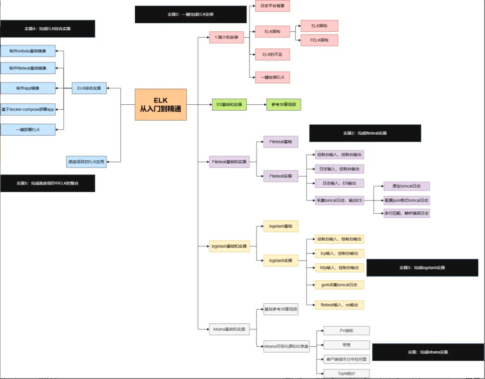

# ELK

日志收集与分析

**ELK Stack（Elasticsearch + Logstash + Kibana）**： 

+ **特点**：Logstash 收集日志，Elasticsearch 存储和搜索，Kibana 可视化。
+ **Java 集成**：通过 Logback 的 LogstashTcpSocketAppender 输出到 Logstash。
+ **场景**：分布式系统日志分析

学习文档：[ELK 圣经：Elasticsearch、Logstash、Kibana 从入门到精通-阿里云开发者社区](https://developer.aliyun.com/article/1639868)

此文档的学习路线：

