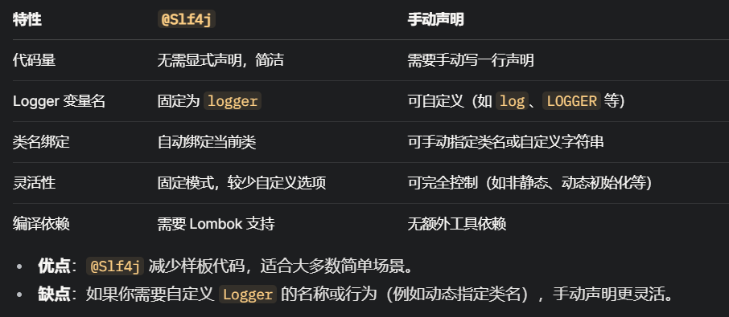

# 日志框架

# Slf4J
+ **全称**：Simple Logging Facade for Java（Java 简单日志门面）。
+ **定位**：SLF4J 是一个日志门面（Facade），提供了一组统一的日志接口，而不是具体的日志实现。它的目的是让开发者在代码中以标准化的方式记录日志，同时可以在运行时选择不同的日志实现（如 Logback、Log4j、java.util.logging 等），而不必修改代码。
+ **核心思想**：解耦日志接口与日志实现，类似 JDBC 对数据库驱动的抽象

功能：

+ 提供简单的 API（如 Logger 和 LoggerFactory）供开发者调用。
+ 支持占位符（{}）语法，避免字符串拼接，提高性能。
+ 通过绑定（Binding）机制适配不同的日志框架。

绑定机制：

+ SLF4J 本身不实现日志输出，而是依赖 classpath 中存在的具体日志框架（称为 backend 或 binding）。
+ 在运行时，LoggerFactory 会扫描类路径，寻找支持 SLF4J 的日志实现（如 slf4j-log4j12、logback-classic）。
+ 如果找到多个实现，会选择一个（通常是第一个加载的），否则会使用默认的 NOPLogger（空实现，不输出日志）。

占位符：

+ SLF4J 使用 {} 占位符，例如 logger.info("User {} logged in", username)，避免了传统日志（如 logger.info("User " + username + " logged in")）的字符串拼接开销。
+ 底层将占位符替换延迟到实际输出时，由具体的日志实现完成。

maven依赖，还不够，需要具体实现依赖，比如

```java
<dependency>
    <groupId>org.slf4j</groupId>
    <artifactId>slf4j-api</artifactId>
    <version>2.0.13</version> <!-- 截至 2025 年 3 月的最新版本 -->
</dependency>
```


# Logback
+ **全称**：Logback 是 SLF4J 的原生实现（Native Implementation），由 SLF4J 的作者 Ceki Gülcü 开发。
+ **定位**：Logback 是一个完整的日志框架，替代了老一代的 Log4j，提供更高的性能和更灵活的配置。它直接实现了 SLF4J 的接口，是 SLF4J 的默认推荐实现。
+ **特点**： 
+ 高性能（比 Log4j 1.x 快 10 倍以上）。
+ 支持丰富的配置（如 XML、Groovy）。
+ 原生支持 SLF4J，无需桥接层。
+ 提供高级功能，如条件日志、异步输出、自动重新加载配置。

功能：

+ **日志级别**：支持 TRACE、DEBUG、INFO、WARN、ERROR 等级别。
+ **输出目标**：支持控制台、文件、数据库、远程服务器等多种 Appender。
+ **格式化**：通过 PatternLayout 自定义日志格式。
+ **过滤**：支持按级别、内容过滤日志。

Logback 的实现基于模块化设计，分为三个核心模块：

1. **logback-core**： 
    - 提供日志系统的核心功能（如 Appender、Layout、LoggerContext），是其他模块的基础。
    - 不依赖 SLF4J，可独立使用。
2. **logback-classic**： 
    - 实现了 SLF4J 的接口（如 org.slf4j.Logger），将 SLF4J 的调用转换为 Logback 的日志处理逻辑。
    - 增强了功能，如支持 java.util.logging 的桥接。
3. **logback-access**： 
    - 用于 Web 应用的访问日志（如 Servlet 请求日志），与前两者独立。

启动流程：

+ **初始化**： 
    - 项目启动时，Logback 通过 LoggerContext 初始化配置（默认查找 logback.xml 或 logback-test.xml）。
    - 配置中定义了 Appender（输出目标）、Layout（格式化规则）和 Logger（日志级别）。
+ **日志记录**： 
    - 开发者调用 SLF4J 的 logger.info("Message")，由 logback-classic 捕获。
    - Logback 检查日志级别是否满足配置要求（如 INFO 是否启用）。
    - 如果满足，日志通过 Layout 格式化后，交给指定的 Appender 输出（例如 ConsoleAppender 或 FileAppender）。
+ **异步处理**： 
    - Logback 支持 AsyncAppender，将日志写入任务放入队列，由后台线程异步处理，提升性能。

maven：logback-classic 依赖 logback-core 和 slf4j-api，无需单独引入。

```java
<dependency>
    <groupId>ch.qos.logback</groupId>
    <artifactId>logback-classic</artifactId>
    <version>1.5.6</version> <!-- 截至 2025 年 3 月的最新版本可能更新 -->
</dependency>
```

**logback配置文件：**

**如果上述文件都不存在，Logback 会使用内置的默认配置（BasicConfigurator），将日志输出到控制台，级别为 DEBUG，格式为简单文本。**

如果你的配置文件名称不是默认的 logback.xml 或 logback-test.xml（例如命名为 mylogback.xml），Logback 不会自动加载。这时需要显式指定配置文件，有以下几种方法：

1. 通过系统属性指定：java -Dlogback.configurationFile=/path/to/mylogback.xml -jar myapp.jar
+ Logback 在初始化时会检查系统属性 logback.configurationFile。
+ 支持绝对路径（如 /opt/config/mylogback.xml）或类路径相对路径（如 classpath:mylogback.xml）。
2. 代码中手动自定义加载：

```java
import ch.qos.logback.classic.LoggerContext;
import ch.qos.logback.classic.joran.JoranConfigurator;
import org.slf4j.LoggerFactory;

public class LogbackConfigLoader {
    public static void main(String[] args) {
        LoggerContext context = (LoggerContext) LoggerFactory.getILoggerFactory();
        try {
            JoranConfigurator configurator = new JoranConfigurator();
            configurator.setContext(context);
            context.reset(); // 重置默认配置
            configurator.doConfigure("/path/to/mylogback.xml"); // 加载自定义文件
        } catch (Exception e) {
            e.printStackTrace();
        }

        // 测试日志
        org.slf4j.Logger logger = LoggerFactory.getLogger(LogbackConfigLoader.class);
        logger.info("Logback initialized with custom config");
    }
}
```

3. springboot配置文件：

```java
logging.config=classpath:mylogback.xml
```


logback配置文件内容：com.example 包下的日志级别为 DEBUG，输出到控制台。其他包默认级别为 INFO，输出到控制台和文件 logs/app.log。

```java
<configuration>
    <!-- 定义控制台输出 -->
    <appender name="CONSOLE" class="ch.qos.logback.core.ConsoleAppender">
        <encoder>
            <pattern>%d{yyyy-MM-dd HH:mm:ss} [%thread] %-5level %logger{36} - %msg%n</pattern>
        </encoder>
    </appender>

    <!-- 定义文件输出 -->
    <appender name="FILE" class="ch.qos.logback.core.FileAppender">
        <file>logs/app.log</file>
        <encoder>
            <pattern>%d{yyyy-MM-dd HH:mm:ss} %-5level %logger{36} - %msg%n</pattern>
        </encoder>
    </appender>

    <!-- 指定某个包的日志级别 -->
    <logger name="com.example" level="DEBUG">
        <appender-ref ref="CONSOLE" />
    </logger>

    <!-- 全局配置 -->
    <root level="INFO">
        <appender-ref ref="CONSOLE" />
        <appender-ref ref="FILE" />
    </root>
</configuration>
```

```java
1. <configuration> 根元素
    配置文件的最外层标签。
    可选属性：
        scan="true"：启用自动扫描配置文件变化（默认 false）。
        scanPeriod="30 seconds"：扫描间隔。
        debug="true"：打印 Logback 初始化时的调试信息。
2. <appender> 输出目标
    定义日志的输出位置（如控制台、文件、数据库）。
    属性：
        name：Appender 的唯一标识。
        class：具体实现类（如 ch.qos.logback.core.ConsoleAppender）。
    子元素：
        <encoder>：定义日志格式。
        <pattern>：输出格式，支持占位符（如 %d 表示日期，%msg 表示日志消息）。
        <file>：指定输出文件路径（仅对 FileAppender 等适用）。
3. <logger> 日志记录器
    定义特定包或类的日志行为。
    属性：
        name：包或类名（如 com.example）。
        level：日志级别（TRACE、DEBUG、INFO、WARN、ERROR）。
        additivity：是否将日志传递给父 Logger（默认 true）。
    子元素：
        <appender-ref>：引用某个 Appender。
4. <root> 根日志
    定义全局默认的日志行为。
    属性：
        level：默认日志级别。
    子元素：
        <appender-ref>：引用全局 Appender
```

日志级别：TRACE < DEBUG < INFO < WARN < ERROR

\<root\> 是 Logback 中的根日志记录器（Root Logger），它是所有日志记录器的默认父节点。

level="INFO" 表示根日志的最低输出级别是 INFO。这意味着，只有级别为 INFO 或更高（如 WARN、ERROR）的日志会被处理，而更低的级别（如 DEBUG、TRACE）会被过滤掉，除非被其他 \<logger\> 覆盖。

所以上面的配置，只有info内容会同时输出到文件和控制台，trace和debug内容只会输出到控制台


使用：

手动获取当前日志类：

```java
private static final Logger logger = LoggerFactory.getLogger(TestLog.class);
```


**lombok结合@slf4j简化开发：**

+ **@Slf4j*** 是 Lombok（一个 Java 代码生成工具）提供的一个注解，全称是 @lombok.extern.slf4j.Slf4j
+ **作用****：在编译期为类自动生成一个 SLF4J 的 ***Logger** 实例，变量名固定为 ***logger****，并绑定到当前类的全限定名
+ **效果：你在代码中无需手动写 Logger 的声明，就可以直接使用 logger.info()、logger.debug() 等方法。**

```java
@Slf4j
public class TestLog {
    public static void main(String[] args) {
        logger.debug("Debug message");
        logger.info("Info message");
        logger.error("Error message");
    }
}
```

要使用 @Slf4j，需要引入 Lombok 和 SLF4J 的依赖：下面兼容jdk8，如果再高版本的话需要jdk11以上

```java
    <!-- Lombok -->
    <dependency>
        <groupId>org.projectlombok</groupId>
        <artifactId>lombok</artifactId>
        <version>1.18.32</version> <!-- 截至 2025 年 3 月的最新版本可能更新 -->
        <scope>provided</scope>
    </dependency>
    <!-- SLF4J API -->
    <dependency>
        <groupId>org.slf4j</groupId>
        <artifactId>slf4j-api</artifactId>
        <version>1.7.36</version> <!-- 最新的 1.7.x 版本 -->
    </dependency>
    <dependency>
        <groupId>ch.qos.logback</groupId>
        <artifactId>logback-classic</artifactId>
        <version>1.2.13</version> <!-- 兼容 SLF4J 1.7.x -->
    </dependency>
```



**最佳实践：因为SpringBootStart中包含了SpringBootLoggin模块，模块里面包含了slf4j和logback，那么不需要再重复引入了，直接通过lombok引入就可以使用@slf4j**
