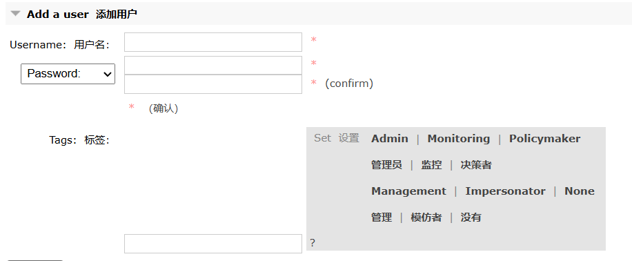
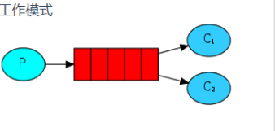

# RabbitMQ

# MQ相关概念
RabbitMQ 是一种分布式消息中间件，消息中间件也称消息队列MQ

## 基础概念（什么是MQ？为什么要使用MQ？）
**什么是MQ：MQ是一种先进先出的队列，有存储消息，发送、接收消息的功能**

**为什么要使用MQ？：**
1. **高并发的流量削峰：控制请求速率，保证所有的请求都能处理到，只不过是先后的问题，但是不会不处理。**

举个例子，假设某订单系统每秒最多能处理一万次订单，也就是最多承受的10000qps（每秒能够接收的查询次数），这个处理能力应付正常时段的下单时绰绰有余，正常时段我们下单一秒后就能返回结果。但是在高峰期，如果有两万次下单操作系统是处理不了的，只能限制订单超过一万后不允许用户下单。使用消息队列做缓冲，我们可以取消这个限制，把一秒内下的订单分散成一段时间来处理，这时有些用户可能在下单十几秒后才能收到下单成功的操作，但是比不能下单的体验要好。


2. 应用解耦：将用户的操作分开来，可以直接返回处理结果，保证系统内部子模块的各个调用。
以电商应用为例，应用中有订单系统、库存系统、物流系统、支付系统。用户创建订单后，如果耦合调用库存系统、物流系统、支付系统，任何一个子系统出了故障，都会造成下单操作异常。当转变成基于消息队列的方式后，系统间调用的问题会减少很多，比如物流系统因为发生故障，需要几分钟来修复。在这几分钟的时间里，物流系统要处理的内存被缓存在消息队列中，用户的下单操作可以正常完成。当物流系统恢复后，继续处理订单信息即可，中单用户感受不到物流系统的故障，提升系统的可用性。


3. 异步处理。服务调用不等待，被调用的服务结束后直接通知调用服务
有些服务间调用是异步的，例如 A 调用 B，B 需要花费很长时间执行，但是 A 需要知道 B 什么时候可以执行完，以前一般有两种方式，A 过一段时间去调用 B 的查询 api 查询。或者 A 提供一个 callback api， B 执行完之后调用 api 通知 A 服务。这两种方式都不是很优雅，使用消息队列，可以很方便解决这个问题，A 调用 B 服务后，只需要监听 B 处理完成的消息，当 B 处理完成后，会发送一条消息给 MQ，MQ 会将此消息转发给 A 服务。这样 A 服务既不用循环调用 B 的查询 api，也不用提供 callback api。同样B 服务也不用做这些操作。A 服务还能及时的得到异步处理成功的消息。


4. 分布式事务（解决微服务之间的事务问题）
以订单服务为例，传统的方式为单体应用，支付、修改订单状态、创建物流订单三个步骤集成在一个服务中，因此这三个步骤可以放在一个jdbc事务中，要么全成功，要么全失败。而在微服务的环境下，会将三个步骤拆分成三个服务，例如：支付服务，订单服务，物流服务。三者各司其职，相互之间进行服务间调用，但这会带来分布式事务的问题，因为三个步骤操作的不是同一个数据库，导致无法使用jdbc事务管理以达到一致性。而 MQ 能够很好的帮我们解决分布式事务的问题，有一个比较容易理解的方案，就是二次提交。基于MQ的特点，MQ作为二次提交的中间节点，负责存储请求数据，在失败的情况可以进行多次尝试，或者基于MQ中的队列数据进行回滚操作，是一个既能保证性能，又能保证业务一致性的方案，如下图所示：


5. 数据分发
MQ 具有发布订阅机制，不仅仅是简单的上游和下游一对一的关系，还有支持一对多或者广播的模式，并且都可以根据规则选择分发的对象。这样一份上游数据，众多下游系统中，可以根据规则选择是否接收这些数据，能达到很高的拓展性。


## 消息队列协议
协议：是在TCP/IP协议基础之上构建的种约定成的规范和机制，目的是让客户端进行沟通和通讯。并且这种协议下规范必须具有`持久性`，`高可用`，`高可靠`的性能。

协议三要素：
1. **语法**：语法是用户数据与控制信息的结构与格式，以及数据出现的顺序。
2. **语义**：语义是解控制信息每个部分的意义。它规定了需要发出何种控制信息以及完成的动作与做出什么样的响应。
3. **时序**：时序是对事件发生顺序的详细说明。

常见的消息中间件协议有：`OpenWire`、`AMQP`、`MQTT`、`Kafka`、`OpenMessage`协议


面试题：为什么消息队列不直接使用http协议？
**因为http请求报文头和响应报文头是比较复杂的，包含了cookie、数据的加密解密、状态码、晌应码等附加的功能，但是对于个消息而言，我们并不需要这么复杂，也没有这个必要性，它其实就是负责数据传递，存储，分发就够，要追求的是高性能。尽量简洁，快速。**
大部分情况下http大部分都是短链接，在实际的交互过程中，一个请求到响应很有可能会中断，中断以后就不会就行持久化，就会造成请求的丢失。这样就不利于消息中间件的业务场景，因为消息中间件可能是一个长期的获取消息的过程，出现问题和故障要对数据或消息就行持久化等，目的是为了保证消息和数据的高可靠和稳健的运行。


`AMQP`协议（Advanced Message Queuing Protocol—高级消息队列协议）
特性：分布式事务支持、消息的持久化支持、高性能和高可靠的消息处理优势
AMQP典型的实现者是`RabbitMQ`、`ACTIVEMQ`等，其中`RabbitMQ`由`Erlang`开发


## 消息持久化
持久化简单来说就是将数据存入磁盘，而不是存在内存中随服务器重启断开而消失，使数据能够永久保存。


## 消息的分发策略


MQ消息队列有如下几个角色：
1. `Producer`：消息生产者。负责产生和发送消息到 Broker
2. `Broker`：消息处理中心。负责消息存储、确认、重试等，一般其中会包含多个 queue
3. `Consumer`：消息消费者。负责从 Broker 中获取消息，并进行相应处理


各个MQ的消息分发策略机制和对比：


## 消息队列的高可用和高可靠
所谓高可用：**消息队列的处理能力高，一般通过集群的方式提高高可用**
当业务量增加时，请求也过大，一台消息中间件服务器的会触及硬件（CPU、内存、磁盘）的极限，一台消息服务器你已经无法满足业务的需求，所以消息中间件必须支持集群部署，来达到高可用的目的。

1️⃣ Master-slave主从共享数据的部署方式

将多个消息服务器Broker连接共享一块消息存储空间，其中Master节点负责消息的写入。客户端会将消息写入到Master节点，一旦Master挂掉，slave节点继续服务，从而形成高可用。


2️⃣ Master-slave主从同步部署方式

该模式写入消息同样在Master节点上，但是主结点会同步数据到slave节点形成副本，和zookeeper或者redis主从机制很类似。这样可以达到负载均衡的效果，如果消费者有多个，就可以到不同的节点进行消费，但是消息的拷贝和同步会占用很大的贷款和网络资源。在rabbitMQ中会有使用


3️⃣ 多主集群同步部署模式

和上述方式区别不大，但是该方式任意节点都可以进行写入

4️⃣ 多主集群转发部署模式

如果插入的数据是Broker1，元数据信息会存储数据的相关描述和记录存放的位置（队列），它会对描述信息，也就是元数据进行同步；
如果消费者在Broker2中进行消费，发现自己没有对应的消息，就会在自己的元数据信息中去查询，如果查询到了直接返回。如果没有查询到就会将该消息的信息携带在请求中转发到其他节点去询问，直到找到所需的信息为止。

场景：比如买火车票或者黄牛买演唱会门票，比如第一个黄牛没有顾客说要买的演唱会门票，但是他会去联系其他的黄牛询问，如果有就返回

5️⃣ Master-slave与Breoker-cluster组合的方案

实现多主多从的热备机制来完成消息的高可用以及数据的热备机制，在生产规模达到定的阶段的时候，这种使用的频率比较高。


这些集群模式最终目的都是为保证：消息服务器不会挂掉，出现了故障依然可以抱着消息服务继续使用。反正终归三句话：
1. 要么消息共享
2. 要么消息同步
3. 要么元数据共享


# 下载安装启动RabbitMQ
linux下载教程：[https://blog.csdn.net/qq_45173404/article/details/116429302?spm=1001.2014.3001.5501](https://blog.csdn.net/qq_45173404/article/details/116429302?spm=1001.2014.3001.5501)

windows下载教程：[https://blog.csdn.net/gloamer/article/details/120130836](https://blog.csdn.net/gloamer/article/details/120130836)

接口：5672

RabbitMQ自带可视化界面，可视化接口：15672

本机访问localhost:15672，用户名密码guest


# RabbitMQ的架构
RabbitMQ的核心包含生产者、连接池（包含通道）、Broker（Exchange和Queue）、Consumer

其中用到的组件解释：
1. VisualHost：虚拟主机，类似于命名空间，每个命名空间相互隔离，里面存在交换机和队列
2. Broker：RabbitMQ服务，处理所有的消息
3. Connection：连接，建立生产者/消费者与服务之间的连接
4. Channel：信道，如果每一次通信都需要一次连接，那么就消耗太多了，所以允许一次性创建多个信道，用于通讯
5. Message：传输的消息
6. Exchange：消息抵达的第一站，根据交换机的内部规则来决定如何处理消息
7. Bindings：交换机和队列之间的绑定关系
8. Routing key：路由绑定的key，区分不同的队列
9. queue：队列，保存消息，并将它们转发给消费者
10. 生产者：生产消息的应用程序
11. 消费者：监听消息队列的应用程序

核心就是生产者、消费者、交换机、队列

业务流程：生产消息绑定交换机和RoukingKey等发送到Broker中，消费者订阅并且接受消息。


# RabbitMQ中的角色

1. Admin：
	+ 最高权限
	+ 可以创建和删除 virtual hosts
	+ 可以查看，创建和删除users
	+ 查看创建permissions
	+ 关闭所有用户的connections
2. Monitoring：
	+ 包含management所有权限
	+ 罗列出所有的virtual hosts，包括不能登录的virtual hosts
	+ 查看其他用户的connections和channels信息
	+ 查看节点级别的数据如clustering和memory使用情况
	+ 查看所有的virtual hosts的全局统计信息。
3. PolicyMaker
	+ 包含management所有权跟
	+ 查看和创建和删除自己的virtual hosts所属的policies和parameters信息
4. Management
	+ 列出自己可以通过AMQP登入的虚拟机
	+ 查看自己的虚拟机节点virtual hosts的queues，exchanges和bindings信息
	+ 查看和关闭自己的channels和connections
	+ 查看有关自己的虚拟机节点virtual hosts的统计信息。包括其他用户在这个节点virtual hosts中的活动信息
5. none：不能访问 management plugin，没有任何管理权限


# RabbitMQ的发送消息模式
**RabbitMQ提供6种模式，分别是 Simple、Work Queues、Publish/Subscribe、Routing、Topics、RPC**

**简单模式：** 一个生产者，一个消费者，一个队列，采用的是默认交换机


**工作模式：** 一个生产者，多个消费者，一个队列，采用的是默认交换机


**发布订阅模式：** 一个生产者，一个fanout类型的交换机，多个队列，多个消费者。fanout类型就表示订阅发布交换机，只有订阅的消费者才能获取消息。


**路由模式：** 一个生产者，一个direct类型的交换机，多个队列，多个消费者。direct类型的交换机与队列之间通过routing-key绑定，然后消息根据routing-key进入队列消费


**主题模式：** 一个生产者，一个topic类型的交换机，多个队列，多个消费者，topic交换机和队列通过routing-key绑定，满足条件的队列都可以接受到消息，更通用。`#`：匹配一个或者多个词，`*`：只能匹配一个词


**RPC模式：RPC 模式** 是 RabbitMQ 提供的一种请求-响应模式，通过消息队列实现远程过程调用。
RPC 模式允许客户端通过消息队列向服务器发送请求，并等待服务器处理后返回结果。它模拟了传统编程中的函数调用，但通过消息队列实现跨进程或跨机器的通信。


参数模式：headers类型的交换机，根据参数进行过滤。


## 实现
五种消息模式的实现：简单模式、工作模式、发布订阅模式、路由模式、主题模式。

代码核心：
```java
ConnectionFactory类用于获取连接，再通过连接获取Channel信道
ConnectionFactory factory = new ConnectionFactory();
            factory.setHost("localhost");
            factory.setUsername("guest");
            factory.setPassword("guest");
            Connection connection = factory.newConnection();
            Channel channel = connection.createChannel();
            return channel;
```

```java
// 创建队列：
channel.queueDeclare("simple_queue", false, false, false, null);
channel.queueDeclare().getQueue();
```

```java
// 创建交换机：
channel.exchangeDeclare("fanout_exchange", BuiltinExchangeType.FANOUT);
channel.exchangeDeclare("direct_exchange", BuiltinExchangeType.DIRECT);
channel.exchangeDeclare("topic_exchange", BuiltinExchangeType.TOPIC);
```

```java
// 绑定关系
channel.queueBind(queue, "fanout_exchange", "");

channel.queueBind(queue, "direct_exchange", "red");
channel.queueBind(queue, "direct_exchange", "yellow");

channel.queueBind(queue, "topic_exchange", "*.red.*");
channel.queueBind(queue, "topic_exchange", "#.blue");
```

```java
//发送消息
//参数：交换机、队列、路由键、消息
channel.basicPublish("", "simple_queue", null, msg.getBytes());

channel.basicPublish("direct_exchange", routingKey, null, msg.getBytes());

channel.basicPublish("fanout_exchange", "", null, msg.getBytes());

channel.basicPublish("topic_exchange", routingKey, null, msg.getBytes());
```

```java
//接收消息
DeliverCallback callback = (consumerTag, message) -> {
    System.out.println("消费者2：" + new String(message.getBody()));
};
CancelCallback cancelCallback = s -> System.out.println("消费者2取消消费");
// 参数：队列名称、是否自动确认、消息接收到后回调
channel.basicConsume("simple_queue", true, deliverCallback, cancelCallback);
```


# 机制
## 消息应答
消息应答分为自动应答和手动应答，自动应答就是消息发送给消费者后，默认就代表消息已经发送成功给了消费者，可以删除消息了；
手动应答就是必须要消费者返回一个消费成功的应答给Broker，才能确认消费成功，队列中删除消息，如果没有返回，那么代表消息丢失，只能重新将消息入队。

代码：
```java
设置channel信道：
// 肯定确认
void basicAck(long deliveryTag, boolean multiple)

// 否定确认
void basicNack(long deliveryTag, boolean multiple, boolean requeue)
void basicReject(long deliveryTag, boolean requeue)

deliveryTag表示消息的标志，multiple表示是否为批量应答（批量应答指的是应答该消息之前包含的所有未应答的消息）
```

自动应答没有对消息传递做限制，可能导致消费者来不及处理消息，导致消息积压，使得内存耗尽。这种模式仅适用在消费者可以高效并以某种速率能够处理这些消息的情况下使用。另外如果消费者没有成功消费，会导致消息丢失。
手动应答，就算发送消息给消费者，然后通道和连接都关闭了，因为队列没有收到ACK确认，那么还是会将消息重发。

实现手动应答主要是注意两个地方：
```java
//消息发送的回调函数里面发送手动确认
DeliverCallback deliverCallback = (consumerTag, message) -> {
    try {
        Thread.sleep(1000);
    } catch (InterruptedException e) {
        throw new RuntimeException(e);
    }

    System.out.println("消费消息： " + new String(message.getBody()));
    channel.basicAck(message.getEnvelope().getDeliveryTag(), false);
};

//设置消费的时候将第二个参数的自动确认true改为手动确认false
channel.basicConsume("auto_ack_queue", false, deliverCallback, cancelCallback);
```

## 持久化
默认下如果RabbitMQ服务停掉或者崩溃都会导致清空队列和消息，如果对它们做持久化，那么重新启动也不会丢失。

队列持久化：
```java
channel.queueDeclare("auto_ack_queue", true, false, false, null);
```

消息持久化：
```java
channel.basicPublish("", "auto_ack_queue", MessageProperties.PERSISTENT_TEXT_PLAIN, msg.getBytes());
```


## 不公平的分发
默认情况下是采用的是轮询策略，但是如果一个消费者速度快，一个消费者慢，那么就会产生消息积压。实现不公平的分发，可以让消费者处理完当前的事儿可以继续消费，慢的没消费完就不给。只有当前消费完的消费者才能继续消费。
```java
//设置不公平的分发：
channel.basicQos(1)
```


## 预取值
因为发送消息和手动应答给Broker是异步的，存在一定的时间间隔，那么就会存在一个缓冲的未确认的消息队列，那么可以通过预取值来规定这个缓冲区的大小，如果这个缓冲区中的消息达到了预取值上限，那么就不能继续发送消息。
```java
//设置预取值
channel.basicQos(1)
```


## 发布确认
发布消息也存在问题，就是发布者不知道消息是否发送成功，所以引入了发布确认的机制，发布成功后告诉发布者成功。发布确认机制分为三种：
1. 单条的发布确认：一条一条的发布确认成功后再发送下一条：
```java
public static void main(String[] args) throws IOException {
    Channel channel = RabbitMQUtil.getChannel();

    //开启发布确认
    channel.confirmSelect();
    channel.queueDeclare("confirm_queue", true, false, false, null);
    //发送十条消息
    for (int i = 0; i < 10; i++) {
        String msg = "hello confirm message" + i;
        System.out.println("发送消息：" + msg);
        //得到发布确认发来的确认
        try {
            //获取发布确认的消息是否成功
            boolean flag = channel.waitForConfirms();
            if (flag) {
                System.out.println("发送确认成功");
            }
        } catch (InterruptedException e) {
            throw new RuntimeException(e);
        }
        channel.basicPublish("", "confirm_queue", null, msg.getBytes());
    }

}
```

2. 批量发布确认：一批一批的检查是否发送成功
```java
public class ConfirmProducer2 {
    public static void main(String[] args) throws IOException, InterruptedException {
        Channel channel = RabbitMQUtil.getChannel();

        //开启
        channel.confirmSelect();
        channel.queueDeclare("confirm_queue", true, false, false, null);
        //发送十条消息
        int MESSAGE_COUNT = 5;
        int count = 0;
        for (int i = 0; i < 10; i++) {
            String msg = "hello confirm message" + i;
            System.out.println("发送消息：" + msg);
            count++;
            //得到发布确认发来的确认
            try {
                if (count == 5) {
                    boolean flag = channel.waitForConfirms();
                    if (flag) {
                        System.out.println("发送确认成功");
                    } else {
                        System.out.println("重新发布");
                    }
                    count = 0;
                }
            } catch (InterruptedException e) {
                throw new RuntimeException(e);
            }
            channel.basicPublish("", "confirm_queue", null, msg.getBytes());
        }
        if (count > 0) {
            boolean flag = channel.waitForConfirms();
            if (flag)
            System.out.println("重新发布");
        }

    }
}
```

3. 异步的发布确认：通过回调函数来控制是否发布确认成功，每个投入的消息记录其消息唯一id和消息内容，成功的回调，删除情况哈希表中已经被确认的消息，失败的回调，获取哈希表中失败的消息。批量确认就是确认未应答的所有消息。比如消息10要应答成功，那么就表示未应答的6,7,8,9一块应答成功。
```java
public static void main(String[] args) throws IOException, InterruptedException {
    Channel channel = RabbitMQUtil.getChannel();

    //开启
    channel.confirmSelect();
    channel.queueDeclare("confirm_queue", true, false, false, null);
    //准备一个线程安全的哈希表，用于存储消息的序号和内容
    ConcurrentSkipListMap<Long, String> concurrentSkipListMap = new ConcurrentSkipListMap<>();
    //一个发送确认成功的回调
    ConfirmCallback confirmCallback = (long deliveryTag, boolean multiple) -> {
        //删除已经确认的消息，剩下都是未被确认的消息
        if (multiple) {
            concurrentSkipListMap.headMap(deliveryTag).clear();
        } else {
            concurrentSkipListMap.remove(deliveryTag);
        }
        System.out.println(deliveryTag + "已确认发布");
    };
    //发布确认失败的回调
    ConfirmCallback nackCallback = (long deliveryTag, boolean multiple) -> {
        String message = concurrentSkipListMap.get(deliveryTag);
        System.out.println("未确认的消息为:" + message);
    };
    //添加发布确认的监听器
    channel.addConfirmListener(confirmCallback, nackCallback);

    //发送消息
    for (int i = 0; i < 10; i++) {
        String msg = "hello confirm" + i;
        channel.basicPublish("", "confirm_queue", null, msg.getBytes());
        //记录消息
        concurrentSkipListMap.put(channel.getNextPublishSeqNo(), msg);
    }
}
```
+ 单独发布消息：同步等待确认，简单，但吞吐量非常有限。
+ 批量发布消息：批量同步等待确认，简单，合理的吞吐量，一旦出现问题但很难推断出是那条消息出现了问题。
+ 异步处理：最佳性能和资源使用，在出现错误的情况下可以很好地控制，但是实现起来稍微难些

特别极端的环境下如何可靠的传递消息，可以使用缓存，缓存没有发送成功的消息，然后配置一个定时任务，将发送失败的任务重新投递。

这里的实现是通过回调，一个是发送成功到交换机的回调，和消息退回的回调：如果有下面结构，发送到交换机执行回调，但是找不到队列就执行消息退回回调


```java
# 发送消息成功到交换机会触发回调
spring:
  rabbitmq:
    publisher-confirm-type: correlated
    publisher-returns: true
```

```java
@Configuration
public class Confirm {
    public static final String CONFIRM_EXCHANGE_NAME = "confirm.exchange";
    public static final String CONFIRM_QUEUE_NAME = "confirm.queue";
    public static final String CONFIRM_ROUTING_KEY = "key1";

    // 声明Exchange
    @Bean("confirmExchange")
    public DirectExchange confirmExchange() {
        return new DirectExchange(CONFIRM_EXCHANGE_NAME);
    }

    // 声明确认队列
    @Bean("confirmQueue")
    public Queue confirmQueue() {
        return QueueBuilder.durable(CONFIRM_QUEUE_NAME).build();
    }

    // 声明确认队列与交换机的绑定关系
    @Bean
    public Binding queueBinding(@Qualifier("confirmQueue") Queue queue,
                                @Qualifier("confirmExchange") DirectExchange exchange) {
        return BindingBuilder.bind(queue).to(exchange).with(CONFIRM_ROUTING_KEY);
    }
}
```

添加两个回调函数：
```java
@Slf4j
@Component
public class MyCallBack implements RabbitTemplate.ConfirmCallback, RabbitTemplate.ReturnsCallback {
    @Autowired
    private RabbitTemplate rabbitTemplate;

    // 将我们实现的MyCallBack接口注入到RabbitTemplate中
    @PostConstruct
    public void init() {
        rabbitTemplate.setConfirmCallback(this);
        rabbitTemplate.setReturnsCallback(this);
    }

    /**
     * 交换机确认回调方法
     *
     * @param correlationData 保存回调消息的ID以及相关信息
     * @param ack             表示交换机是否收到消息(true表示收到)
     * @param cause           表示消息接收失败的原因(收到消息为null)
     */
    @Override
    public void confirm(CorrelationData correlationData, boolean ack, String cause) {
        String id = correlationData != null ? correlationData.getId() : "";
        if (ack) {
            log.info("交换机已经收到ID为:{}的消息", id);
        } else {
            log.info("交换机还未收到ID为:{}的消息,原因为:{}", id, cause);
        }
    }

    /**
     * 路由出现问题的消息回退方法
     *
     * @param returned 返回消息及其元数据
     */
    @Override
    public void returnedMessage(ReturnedMessage returned) {
        log.info("消息{}:,被交换机{}退回,退回原因:{},路由key:{}",
                new String(returned.getMessage().getBody()),
                returned.getExchange(),
                returned.getReplyText(),
                returned.getRoutingKey());
    }
}
```

```java
@Autowired
private RabbitTemplate rabbitTemplate;
@GetMapping("/confirm/sendMes/{message}")
public void sendConfirmMessage(@PathVariable String message) {
    // 指定消息的id为1
    CorrelationData correlationData1 = new CorrelationData("1");
//        rabbitTemplate.convertAndSend(Confirm.CONFIRM_EXCHANGE_NAME, Confirm.CONFIRM_ROUTING_KEY, message, correlationData1);
    rabbitTemplate.convertAndSend(Confirm.CONFIRM_EXCHANGE_NAME, "unkown", message, correlationData1);
    log.info("发送消息内容为:{}", message);
}
```

测试，现在发送找不到交换机或者队列都会退回消息，让生产者重新发送消息。

还有一种方案是使用备用交换机，类似下面的结构，让消息不再次退回，而是传递给备用交换机，备用交换机中的消费者消费：


```java
package com.zsr.springbootrabbitmq.init;

import org.springframework.amqp.core.*;
import org.springframework.beans.factory.annotation.Qualifier;
import org.springframework.context.annotation.Bean;
import org.springframework.context.annotation.Configuration;

@Configuration
public class Confirm {
    public static final String CONFIRM_EXCHANGE_NAME = "confirm.exchange";
    public static final String CONFIRM_QUEUE_NAME = "confirm.queue";
    public static final String CONFIRM_ROUTING_KEY = "key1";
    public static final String BACKUP_EXCHANGE_NAME = "backup.exchange";
    public static final String BACKUP_QUEUE_NAME = "backup.queue";
    public static final String WARNING_QUEUE_NAME = "warning.queue";

    // 声明确认交换机,并绑定备份交换机
    @Bean("confirmExchange")
    public DirectExchange confirmExchange() {
        ExchangeBuilder exchangeBuilder = ExchangeBuilder.directExchange(CONFIRM_EXCHANGE_NAME).
                durable(true).withArgument("alternate-exchange", BACKUP_EXCHANGE_NAME);
        return exchangeBuilder.build();
    }

    // 声明备份交换机
    @Bean("backupExchange")
    public FanoutExchange backupExchange() {
        return new FanoutExchange(BACKUP_EXCHANGE_NAME);
    }

    // 声明备份队列
    @Bean("backQueue")
    public Queue backQueue() {
        return QueueBuilder.durable(BACKUP_QUEUE_NAME).build();
    }

    // 声明确认队列
    @Bean("confirmQueue")
    public Queue confirmQueue() {
        return QueueBuilder.durable(CONFIRM_QUEUE_NAME).build();
    }

    // 声明警告队列
    @Bean("warningQueue")
    public Queue warningQueue() {
        return QueueBuilder.durable(WARNING_QUEUE_NAME).build();
    }

    // 声明确认队列绑定关系
    @Bean
    public Binding queueBinding(@Qualifier("confirmQueue") Queue queue,
                                @Qualifier("confirmExchange") DirectExchange exchange) {
        return BindingBuilder.bind(queue).to(exchange).with("key1");
    }

    // 声明备份队列绑定关系
    @Bean
    public Binding backupBinding(@Qualifier("backQueue") Queue queue,
                                 @Qualifier("backupExchange") FanoutExchange backupExchange) {
        return BindingBuilder.bind(queue).to(backupExchange);
    }

    // 声明报警队列绑定关系
    @Bean
    public Binding warningBinding(@Qualifier("warningQueue") Queue queue,
                                  @Qualifier("backupExchange") FanoutExchange
                                          backupExchange) {
        return BindingBuilder.bind(queue).to(backupExchange);
    }
}
```

```java
@RabbitListener(queues = Confirm.WARNING_QUEUE_NAME)
public void receiveWarningMsg(Message message) {
    String msg = new String(message.getBody());
    log.error("报警发现不可路由消息：{}", msg);
}
```
消息发送找不到指定的队列，这传递到备用交换机，这里被监听，直接报警

## 死信队列
死信队列就是存放一些无法处理的消息，主要分三种情况，消息超过了TTL（存活时间）、消息超过了队列的最大值，多余的消息放入死信队列中、被拒绝的消息。
1. 超过TTL时间：在发送的时候配置TTL，如果时间消息再普通队列呆的时间超过了TTL规定的时间，那么消息进入死信队列
```java
// 设置消息到TTL（Time To Live生存时间）时间为10s=10000ms
AMQP.BasicProperties properties = new AMQP.BasicProperties().builder().expiration("10000").build();
channel.basicPublish(NORMAL_EXCHANGE, "zhangsan", properties, message.getBytes());
```

2. 消息超过队列的最大值：arguments.put("x-max-length", 6)设置了绑定的死信队列的最大值，如果队列中的消息积压到了最大值，那么其余的消息都到死信队列中
```java
// 声明普通和死信交换机(类型都为DIRECT)
channel.exchangeDeclare(NORMAL_EXCHANGE, BuiltinExchangeType.DIRECT);
channel.exchangeDeclare(DEAD_EXCHANGE, BuiltinExchangeType.DIRECT);
// 声明普通和死信队列(普通队列需要传递参数设置死信交换机及其对应的路由key)
Map<String, Object> arguments = new HashMap<>();
arguments.put("x-dead-letter-exchange", DEAD_EXCHANGE); // 设置死信交互机
arguments.put("x-dead-letter-routing-key", "lisi"); // 设置与死信交换机间的routing-key
arguments.put("x-max-length", 6);   // 设置正常队列长度为6
channel.queueDeclare(NORMAL_QUEUE, false, false, false, arguments);
channel.queueDeclare(DEAD_QUEUE, false, false, false, null);
// 绑定队列与交换机,设置其间的路由key
channel.queueBind(NORMAL_QUEUE, NORMAL_EXCHANGE, "zhangsan");
channel.queueBind(DEAD_QUEUE, DEAD_EXCHANGE, "lisi");
```

3. 消息被拒绝：消息被消费者手动拒绝，那么直接进入死信队列中, channel.basicReject拒绝消息。记住前提消息改为手动确认：channel.basicConsume(NORMAL_QUEUE, false, deliverCallback, cancelCallback);
```java
DeliverCallback deliverCallback = (consumerTag, message) -> {
    String mes = new String(message.getBody(), "UTF-8");
    if (mes.equals("5")) {
        System.out.println("拒绝消息入队：" + mes);
        // 第二个参数requeue设置为false,代表拒绝重新入队,也就是该队列如果配置了死信交换机将发送到死信队列中
        channel.basicReject(message.getEnvelope().getDeliveryTag(), false);
    } else {
        System.out.println("Consumer01接收到普通队列的消息:" + mes);
        channel.basicAck(message.getEnvelope().getDeliveryTag(), false);
    }
};
```


## 延迟队列
存放指定时间到了之后或者之前要处理的消息。

使用场景：
1. 订单在十分钟之内未支付则自动取消。
2. 新创建的店铺，如果在十天内都没有上传过商品，则自动发送消息提醒。
3. 用户注册成功后，如果三天内没有登陆则进行短信提醒。
4. 用户发起退款，如果三天内没有得到处理则通知相关运营人员。
5. 预定会议后，需要在预定的时间点前十分钟通知各个与会人员参加会议
RabbitMQ中使用死信队列+TTL特性（队列TTL或者消息TTL）实现延迟队列：
搭建结构：普通交换机X和死信交换机Y，普通交换机绑定了两个队列QA、QB，QA通过key（YD）和死信交换机Y连接，死信交换机Y通过YD与死信队列QD绑定，消费者C获取死信队列，这里是通过设置队列TTL让消息成为死信，然后消费者从死信队列中获取数据，打到延迟队列的效果


```java
package com.zsr.springbootrabbitmq.init;

import org.springframework.amqp.core.*;
import org.springframework.beans.factory.annotation.Qualifier;
import org.springframework.context.annotation.Bean;
import org.springframework.context.annotation.Configuration;

import java.util.HashMap;
import java.util.Map;

@Configuration
public class QueueTTLDelay {
    public static final String X_EXCHANGE = "X";
    public static final String QUEUE_A = "QA";
    public static final String QUEUE_B = "QB";
    public static final String Y_DEAD_LETTER_EXCHANGE = "Y";
    public static final String DEAD_LETTER_QUEUE = "QD";

    // 声明交换机X
    @Bean("xExchange")
    public DirectExchange xExchange() {
        return new DirectExchange(X_EXCHANGE);
    }

    // 声明死信交换机Y
    @Bean("yExchange")
    public DirectExchange yExchange() {
        return new DirectExchange(Y_DEAD_LETTER_EXCHANGE);
    }

    // 声明队列QA,设置队列的ttl为10s并绑定死信交换机
    @Bean("queueA")
    public Queue queueA() {
        Map<String, Object> arguments = new HashMap<>();
        // 声明当前队列绑定的死信交换机
        arguments.put("x-dead-letter-exchange", Y_DEAD_LETTER_EXCHANGE);
        // 声明当前队列的死信routing-key
        arguments.put("x-dead-letter-routing-key", "YD");
        // 声明队列的 TTL
        arguments.put("x-message-ttl", 10000);
        return QueueBuilder.durable(QUEUE_A).withArguments(arguments).build();
    }

    // 声明队列QB,设置队列的ttl为40s并绑定死信交换机
    @Bean("queueB")
    public Queue queueB() {
        Map<String, Object> arguments = new HashMap<>();
        // 声明当前队列绑定的死信交换机
        arguments.put("x-dead-letter-exchange", Y_DEAD_LETTER_EXCHANGE);
        // 声明当前队列的死信routing-key
        arguments.put("x-dead-letter-routing-key", "YD");
        // 声明队列的 TTL
        arguments.put("x-message-ttl", 40000);
        return QueueBuilder.durable(QUEUE_B).withArguments(arguments).build();
    }

    // 声明死信队列QD
    @Bean("queueD")
    public Queue queueD() {
        return new Queue(DEAD_LETTER_QUEUE);
    }

    // 死信队列QD绑定死信交换机Y
    @Bean
    public Binding deadLetterBindingQAD(@Qualifier("queueD") Queue queueD, @Qualifier("yExchange") DirectExchange yExchange) {
        return BindingBuilder.bind(queueD).to(yExchange).with("YD");
    }

    // 队列A绑定X交换机
    @Bean
    public Binding queueABindExchangeX(@Qualifier("queueA") Queue queueA, @Qualifier("xExchange") DirectExchange xExchange) {
        return BindingBuilder.bind(queueA).to(xExchange).with("XA");
    }

    // 队列B绑定X交换机
    @Bean
    public Binding queueBBindExchangeX(@Qualifier("queueB") Queue queueB, @Qualifier("xExchange") DirectExchange xExchange) {
        return BindingBuilder.bind(queueB).to(xExchange).with("XB");
    }
}

```

```java
@Autowired
private RabbitTemplate rabbitTemplate;

@GetMapping("sendMsg/{message}")
public void sendMsg(@PathVariable String message) {
    log.info("当前时间:{},发送一条信息给两个TTL队列:{}", new Date(), message);
    rabbitTemplate.convertAndSend("X", "XA", "消息来自ttl=10s的队列" + message);
    rabbitTemplate.convertAndSend("X", "XB", "消息来自ttl=40s的队列" + message);
}
```

```java
@Slf4j
@Component
public class MessageConsumer {
    @RabbitListener(queues = "QD")
    public void receiveD(Message message, Channel channel) throws IOException {
        String msg = new String(message.getBody());
        log.info("当前时间:{},收到死信队列信息{}", new Date().toString(), msg);
    }
}
```

测试：消费者从死信队列中取出超过了队列TTL的消息，比如我希望延迟1min执行一个任务，那么就可以将队列设置TTL为1min，然后1min过后消息自动进入死信队列，然后就可以消费了。但是问题是如果我这个延迟时间要改动，那么每次都需要创建一个队列，然后设置一个TTL，很麻烦。

解决方法是将队列TTL改为消息TTL：

新建一个队列不设置TTL，

```java
@Configuration
public class MessageTTLDelay {
    public static final String Y_DEAD_LETTER_EXCHANGE = "Y";
    public static final String QUEUE_C = "QC";

    // 声明队列C,绑定死信交换机
    @Bean("queueC")
    public Queue queueB() {
        Map<String, Object> args = new HashMap<>(3);
        // 声明当前队列绑定的死信交换机
        args.put("x-dead-letter-exchange", Y_DEAD_LETTER_EXCHANGE);
        // 声明当前队列的死信路由 key
        args.put("x-dead-letter-routing-key", "YD");
        // 没有声明TTL属性
        return QueueBuilder.durable(QUEUE_C).withArguments(args).build();
    }

    // 绑定队列B和X交换机
    @Bean
    public Binding queueCBindingX(@Qualifier("queueC") Queue queueC, @Qualifier("xExchange") DirectExchange xExchange) {
        return BindingBuilder.bind(queueC).to(xExchange).with("XC");
    }
}
```

设置消息的TTL，如果消息超过了时间，那么就直接进入死信队列，这里的消息时间就可以随便指定， 通过传入的参数。

```java
@GetMapping("sendExpirationMsg/{message}/{ttlTime}")
public void sendMsg(@PathVariable String message, @PathVariable String ttlTime) {
    rabbitTemplate.convertAndSend("X", "XC", message, correlationData -> {
        correlationData.getMessageProperties().setExpiration(ttlTime);
        return correlationData;
    });
    log.info("当前时间:{},发送一条时长{}毫秒TTL信息给队列C:{}", new Date(), ttlTime, message);
}
```


现在可以通过TTL+死信队列实现延迟队列，但是存在一个问题，就是因为消息是有序的，如果一个消息要等待10s执行，一个消息要等待4s执行，那么4s的消息不能先执行，因为有序性。


通过 Rabbitmq 自带的延时队列插件解决这个问题。

下载地址：[https://www.rabbitmq.com/community-plugins.html](https://www.rabbitmq.com/community-plugins.html)

启用：放入plugins目录下面，执行命令rabbitmq-plugins enable rabbitmq_delayed_message_exchange

成功后创建交换机增加了一种延迟队列的类型。

下面代码实现延迟队列：


```java
@Configuration
public class PluginsDelay {
    public static final String DELAYED_QUEUE_NAME = "delayed.queue";
    public static final String DELAYED_EXCHANGE_NAME = "delayed.exchange";
    public static final String DELAYED_ROUTING_KEY = "delayed.routingkey";

    // 声明延迟队列
    @Bean
    public Queue delayedQueue() {
        return new Queue(DELAYED_QUEUE_NAME);
    }

    // 自定义交换机（这里定义的是一个延迟交换机）
    @Bean
    public CustomExchange delayedExchange() {
        Map<String, Object> args = new HashMap<>();
        args.put("x-delayed-type", "direct");   // 自定义交换机的类型
        return new CustomExchange(DELAYED_EXCHANGE_NAME, "x-delayed-message", true, false, args);
    }

    // 绑定延迟队列与延迟交换机
    @Bean
    public Binding bindingDelayedQueue(@Qualifier("delayedQueue") Queue queue,
                                       @Qualifier("delayedExchange") CustomExchange delayedExchange) {
        return BindingBuilder.bind(queue).to(delayedExchange).with(DELAYED_ROUTING_KEY).noargs();
    }
}
```

该类型消息支持延迟投递机制 消息传递后并不会立即投递到目标队列中，而是存储在 mnesia(一个分布式数据系统)表中，当达到投递时间时，才投递到目标队列中。

```java
@GetMapping("sendDelayMsg/{message}/{delayTime}")
public void sendMsg(@PathVariable String message, @PathVariable Integer delayTime) {
    rabbitTemplate.convertAndSend("delayed.exchange", "delayed.routingkey", message, correlationData -> {
        correlationData.getMessageProperties().setDelay(delayTime);
        return correlationData;
    });
    log.info("当前时间:{},发送一条延迟{}毫秒的信息给队列delayed.queue:{}", new Date(), delayTime, message);
}
```

```java
@RabbitListener(queues = "delayed.queue")
public void receiveDelayedQueue(Message message) {
    String msg = new String(message.getBody());
    log.info("当前时间：{},收到延时队列的消息：{}", new Date().toString(), msg);
}
```


## 幂等性（消息重复问题）
幂等性是指用户对于同一操作发起的一次请求或者多次请求的结果是一致的，不会因为多次点击而产生了副作用。

如果一个消息发生给消费者，消费者还没有返回给Broker确认，则服务断开连接了，那么Broker默认消费者没有消费，又重新发送了一次，这样就造成了重复消费。

解决幂等性的方法是生成唯一的全局ID，可以通过时间戳、UUID等生成唯一的ID。每次发送消息通过唯一标识判断消息是否被消费过。
业界主流的两种幂等性解决方案：
1. 指纹码机制：通过指纹码（生成的唯一ID）判断数据库中是否存在，存在即重复。优势实现简单；劣势是高并发的场景下会出现写入瓶颈
2. 使用redis执行setnx命令，天然具有幂等性。


## 优先级队列
RabbitMQ policy：我们在实际使用中，随着业务的变化，经常会出现需要调整message-ttl`、x-max-length`等参数来改变Queue行为的场景，那这个时候怎么办呢，总不能暂停上下游的生产者和消费者来等Queue的删除重建吧？这个时候就需要使用到RabbitMQ的Policy机制了。

[RabbitMQ Policy的使用 - zbs666 - 博客园](https://www.cnblogs.com/lovezbs/p/13849450.html)

优先级队列就是将消息按照优先级划分，优先级高的先进行消费
1. 声明队列优先级：需要通过参数 x-max-priority 指定队列支持的最大优先级。RabbitMQ 会根据这个值对消息进行排序。x-max-priority：队列支持的最大优先级，取值范围为 0 到 255（建议使用 1 到 10，避免过高的值导致性能问题）。

```java
// 声明优先级队列，设置最大优先级为 10
Map<String, Object> args = new HashMap<>();
args.put("x-max-priority", 10); // 支持优先级 0-10
channel.queueDeclare("priority_queue", true, false, false, args);
```

2. 设置消息优先级：
```java
// 发送消息，设置不同的优先级
for (int i = 0; i < 5; i++) {
    String message = "Message with priority " + i;
    AMQP.BasicProperties properties = new AMQP.BasicProperties.Builder()
        .priority(i) // 设置优先级（0-10）
        .build();
    channel.basicPublish("", "priority_queue", properties, message.getBytes());
    System.out.println("Sent: " + message);
}
```

可以添加：basicQos(1)：确保消费者一次只处理一条消息，避免低优先级消息阻塞高优先级消息。确保 basicQos 设置合理，避免低优先级消息阻塞。

message.getProperties().getPriority()：可以获取消息的优先级，用于日志或调试。


## 惰性队列
将消息尽可能的放入到磁盘中，只有消费的时候才从磁盘加载到内存中，平时都是将消息直接存储到内存中，如果消息过多的话，会造成消息积压，非常占用内存。
配置惰性队列的方式：
1. 直接在声明队列的时候，指定：
```java
Map<String, Object> args = new HashMap<String, Object>();
args.put("x-queue-mode", "lazy");
channel.queueDeclare("myqueue", false, false, false, args);
```
2. 使用policy更改队列状态。


# 集群


# 文档
其他资源学习文档：[https://blog.csdn.net/qq_45173404/article/details/121687489](https://blog.csdn.net/qq_45173404/article/details/121687489)

上面笔记来源自尚硅谷文档：[尚硅谷_消息中间件RabbitMQ_课件.pdf](https://www.yuque.com/attachments/yuque/0/2025/pdf/25358670/1736930730404-c7c6011d-dcbc-4025-9e6c-786c5036a131.pdf)


# 八股

八股来自黑马、b站收集
## 为什么消息队列不直接使用http协议？
因为**http请求报文头和响应报文头是比较复杂的**，包含了cookie、数据的加密解密、状态码、晌应码等附加的功能，但是对于消息而言，我们并不需要这么复杂，也没有这个必要性，它其实就是负责数据传递，存储，分发就够，要追求的是高性能。尽量简洁，快速。

大部分情况下**http大部分都是短链接**，在实际的交互过程中，一个请求到响应很有可能会中断，中断以后就不会就行持久化，就会造成请求数据的丢失。这样就不利于消息中间件的业务场景，因为消息中间件可能是一个长期的获取消息的过程，出现问题和故障要对数据或消息就行持久化等，目的是为了保证消息和数据的高可靠和稳健的运行。


## RabbitMQ架构

RocketMQ的核心组件：
1. Produce生产者：负责发送消息，发送到指定的交换机，并且指定路由键
2. Connection连接：生产者/消费者与Broker的TCP连接
3. Channel通道：Connection逻辑通道，复用TCP减少资源开销
4. Broker：RabbitMQ服务器
5. vitual host虚拟主机：用于隔离资源，包含交换机和队列
6. exchange交换机：接收生产者发送的消息，并根据路由键和绑定规则将消息路由到对应的队列
   交换机类型：
	- **Direct**：基于路由键精确匹配。
	- **Topic**：基于路由键的模式匹配（支持通配符，如 *.info）。
	- **Fanout**：广播到所有绑定队列，无需路由键。
	- **Headers**：基于消息头匹配（较少使用）。
7. queue队列：存储消息的容器，消费者从中拉取消息。
8. binding绑定：交换机和队列之间的关联，定义路由规则（通常基于路由键）。
9. consumer消费者：消费消息，轮询消费

工作流程：
1. 生产者通过Channel将消息发送到交换机，并附带路由键和属性
2. 交换机根据路由键和配置队列绑定规则，将消息分发给匹配的队列
3. 消息存储在队列中，持久化队列会写入磁盘，如果是镜像队列，消息同步给从节点
4. 消费者通过 Channel 订阅队列，Broker 推送（Push 模式）或消费者拉取（Pull 模式）消息
5. 节点故障时，镜像队列的从节点提升为主节点，客户端自动重连到可用节点。


## RabbitMQ如何保证消息不丢失？

RabbitMQ保证消息不丢失，可以从生产阶段、存储阶段和消费阶段方面说明
生产阶段：确保消息发送到Broker中
1. 可以通过**发布确认机制**保证Broker返回确认ACK，如果未返回重新发送（同步消息需要等待ACK，异步消息回调处理ACK）
2. 通过事务机制保证事务成功后，消息才对消费者可见
3. 自定义发送重试逻辑，发送失败，客户端自动重新发送消息到Broker
4. 将消息标记为持久化，确保消息到达Broker中存储到磁盘中，而不是在内存中

存储阶段：确保消息在存储过程不丢失
1. 使用**持久化队列**，持久化队列在Broker重启后，队列仍不会丢失，持久化队列中的持久化消息会持久化磁盘中，也不会丢失
2. **消息持久化**
3. 使用镜像队列，镜像队列可以将队列和消息复制到多个结点，提高可用性
4. 使用顺序追加写入日志文件，减少磁盘 I/O 开销。
5. 集群模式允许多个 Broker 节点协作，消息和队列元数据可以通过镜像队列复制到其他节点。

消费阶段：确保消息正确处理不丢失
1. **手动确认，确保消息消费完，手动发送ACK确认**
2. 消费者重试，消费失败的可以拒绝消息并选择重新消费
3. 死信队列，多次消费失败的消息进入死信队列，防止无限重试和阻塞
4. 消费偏移量管理：RabbitMQ 的队列模型基于队列中的消息顺序，消费者通过队列的偏移量（逻辑上类似 Offset）跟踪消费进度。
5. 集群部署消费者，多个消费者订阅同一个队列，如果有的消费者宕机，确保消息一定会被其他消费者消费
## RabbitMQ的重复消费问题如何解决？（幂等性问题）

消息重复消费的通常原因：
1. 消费者未及时确认：Broker认为消费失败，重新发送
2. 消费者拒绝消息：Broker重新发送
3. ACK丢失

我们遇到过消息重复消费的问题，处理方法是：
- 通过消息唯一标识或者业务唯一标识检查数据库中数据是否存在，检查唯一标识，若不存在则处理消息，若存在则忽略，避免重复消费。
- 使用Redis分布式锁或数据库锁来确保操作的幂等性，分布式锁存储唯一标识，也是确保消息是否存放，key存唯一标识，value存消费状态（消费中、消费成功、消费失败）

## RabbitMQ中的死信交换机了解吗？

死信是指没有消费成功的消息，死信交换机用于后续根据死信进行分析、处理、重试。

死信产生的场景：
1. 消息被拒绝且不重新入队
2. 消息过期
3. 队列达到了最大长度

死信交换机的引用场景：
1. 处理重复多次的消息
2. 处理失败消息
3. 实现延迟消息：RabbitMQ 本身不支持原生延时消息，但可以通过 TTL 和死信队列实现。例如，设置队列的 TTL，过期消息路由到死信队列，由另一个消费者处理，变相实现延时效果。

## 如果100万条消息堆积在MQ中，怎么办？(消息积压问题)

消息堆积的原因：
1. 生产者发送消息的速率超过消费者的处理效率
2. 队列设置有问题，比如队列无限制，未设置ttl
3. Broker性能问题
4. 网络或连接导致消息延迟
5. 消费者宕机或者不足 

若出现消息堆积，可采取以下措施
1. 提高消费者消费能力，如使用多线程。
2. 优化消费者处理逻辑，优化慢查询、IO 操作或外部服务调用。例如，批量插入数据库、缓存热点数据。
3. 部署更多的消费者实例（水平扩展），分担消息消费任务。
4. 扩大队列容量，使用RabbitMQ的惰性队列，支持数百万条消息存储，直接存盘而非内存。
5. 创建临时队列，将原队列中的消息分流到新队列，分配新的消费者处理

彻底解决防止再次发生：
1. 增加Broker节点，提高系统的吞吐量
2. 生产者限流，控制消息发送速率
3. 配置优先级队列或者延时队列削峰，降低处理效率
4. 优化消费者逻辑

## RabbitMQ的高可用机制？

RabbitMQ 的高可用机制（High Availability, HA）旨在确保消息队列系统在面对节点故障、宕机或网络问题时仍能正常运行，防止消息丢失并提供持续服务。
RabbitMQ 主要通过集群和**镜像队列（Mirrored Queues）** 实现高可用，同时结合其他机制（如持久化、客户端重试等）增强可靠性。

RabbitMQ集群：多个Broker节点组成集群，提高高可用，共同提高消息服务
集群提供的功能：
1. 元数据同步：队列、交换机等元数据信息在集群间同步
2. 负载分担：生产者消费者可以路由到任意节点
3. 故障转移：某一个节点故障，仍然可以发送消息
局限性：默认情况下，队列中的消息只存储在创建队列的节点上（主节点），其他节点仅存储队列元数据。如果主节点宕机，队列中的消息可能不可用，除非启用镜像队列。

镜像队列：镜像队列是 RabbitMQ 高可用的核心机制，通过将队列（包括消息和元数据）复制到集群中的多个节点，确保即使主节点故障，消息仍可从其他节点访问。
工作原理：
- 每个镜像队列有一个主节点（Master）和多个从节点（Slave）。
- 消息写入主节点后，同步复制到所有从节点。
- 如果主节点故障，RabbitMQ 会自动将一个从节点提升为主节点（故障转移），确保队列可用。
**同步方式**：
- **同步复制**：默认情况下，消息写入主节点后，必须同步到所有从节点（或配置的镜像节点）才返回确认（ACK）。
- **异步复制**（可选）：通过配置（如 ha-sync-mode=manual），允许部分异步复制以提升性能，但可能有数据丢失风险。

持久化机制：
- **持久化队列**：通过设置队列的 durable=true，确保队列元数据在 Broker 重启后不会丢失。
- **持久化消息**：通过设置消息的 delivery_mode=2，确保消息写入磁盘，防止 Broker 宕机或重启导致消息丢失。
- **作用**：持久化是高可用的基础，结合镜像队列，确保消息在故障场景下不丢失。


