# RocketMQ的应用场景、优缺点

1. 应用解耦：将业务系统解耦，系统之间的调用通过MQ进行
比如下图：通过MQ将订单系统与其他业务系统解耦，订单系统进行下单等操作去调用其他系统的功能的时候，就像是一个系统一样
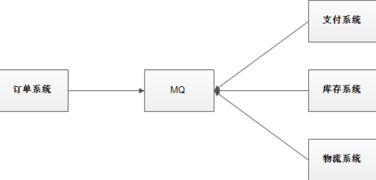
2. 流量削峰：控制请求的速率，比如大量的请求过来，系统无法抗住这么多的请求，那么可以通过MQ控制最大的请求量，然后后面的请求慢一点儿处理
3. 数据分发：只需要将消息发送到MQ中，需要消费这个消息的业务系统直接监听得到就可以，方便多个业务系统之间的合作

缺点：
1. 一旦MQ宕机，就会造成系统的功能瘫痪，如果保证高可用？
2. 如何处理重复消费问题？
3. 如何处理消息丢失问题？
4. 如何保证消息消费的顺序性？
5. 如何保证消息的一致性，也就是事务性？


# 下载安装
原生linux部署：
[RocketMQ 在Linux上的安装_linux安装rocketmq-CSDN博客](https://blog.csdn.net/xhmico/article/details/122938904)

docker部署：  
[Docker 部署 RocketMQ (图文并茂超详细)_docker部署rocketmq-CSDN博客](https://blog.csdn.net/apple_74262176/article/details/141886930)

# 架构
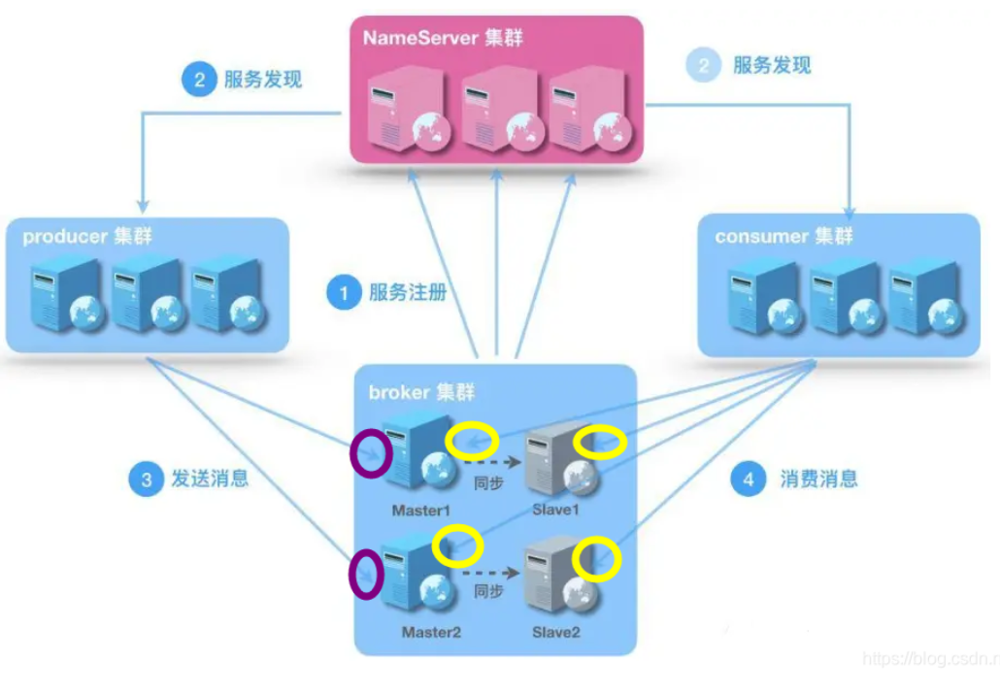
核心组件：
1. Producer：生产者，负责发送消息到Broker，生产者可以是单机、集群方式部署，支持同步、异步、单向发送消息
2. Consumer：消费者，从Broker订阅并消费消息，支持Push（服务器主动推送给消息给消费者）、Pull（消费者主动拉取消息，分为集群或者广播模式）两种模式
3. Broker（消息代理）：负责存储、转发和投递消息。分为Master（负责消息的写入和读取）和Slaver（从Master同步数据，提供读服务）两种。
4. Nameserver：一个轻量级的服务发现和路由组件，负责管理 Broker 的元数据（如 Topic 和 Broker 的映射关系）。NameServer 是无状态的，多个 NameServer 之间互不通信，客户端通过轮询多个 NameServer 获取最新的路由信息。
5. Topic（主题）：逻辑的划分单位，生产者将消息发送到特定的 Topic，消费者从 Topic 订阅消息。每个 Topic 可以分布在多个 Broker 上
6. Message Queue（消息队列）：Topic 的物理分区单位，一个 Topic 包含多个 Queue，Queue 分布在不同的 Broker 上，用于实现负载均衡和高并发处理。
7. 消费者/生产者组：消费者组是共同消费同一个Topic的消费者，协同消费消息；生产者组表示发送同一类消息的生产者们。
8. tag：topic下更细分的类型，可以指定tag生产或者消费某topic下某一类tag的消息

交互过程：
1. 生产者组与Broker的交换：生产者组在NameServer轮询通过Topic找关联的Broker，然后将消息直接发送给对应的Broker中的消息队列，一个Topic会关联多个消息队列，这些消息队列可能存储在不同的Broker中
2. 消费者组与Broker的交换：消费者组也是通过Topic知道关联的Broker，订阅这些Broker，并从Broker中拉取消息
3. NameServer维护Topic和Broker之间的映射关系，管理Broker状态


# RocketMQ集群
## 1 集群特点
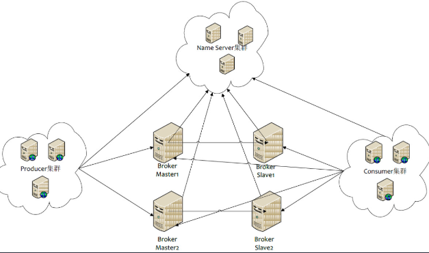
四大角色：
1. NameServer：RocketMQ的命名服务，负责管理元数据和路由信息维护，之间是不连接的，无状态，重要的作用是存储和管理 Topic 的路由信息（包括 Topic 与 Broker 的映射关系），并提供服务发现功能，给Producer和Consumer提供Topic信息
2. Broker：负责消息的接收、存储、转发和拉取，存储部分Topic的消息数据，处理Producer和Consumer的请求，分为Master和Slaver，Master负责读写，Slaver负责只读提高可用性
3. Producer：消息生产者，查询NameServer获取Topic正确对应的Broker发送消息，有多种发送消息的形式
4. Consumer：消息消费者，负责从Broker中拉取消息消费

## 2 集群模式，根据Broker的特征划分
### 1）单Master模式，只有一个Broker节点，而且是Master角色 
这种方式风险较大，一旦Broker重启或者宕机时，会导致整个服务不可用。不建议线上环境使用,可以用于本地测试。

### 2）多Master模式
集群都是由多个Master Broker组成，没有Slave
适用场景：对写入性能比较高的场景

### 3）主从模式（异步）
集群由一个或多个 Master Broker 和其对应的 Slave Broker 组成。
特点：Master 写入消息后立即返回，异步将数据同步到 Slave，延迟较低但可能丢失少量数据。
适用场景：
- 对数据可靠性有一定要求，但可以接受手动故障转移的场景（如订单处理、消息通知）。
- 读负载较重的场景，利用 Slave 分担读压力。
### 4）主从模式（同步）
集群由一个或多个 Master Broker 和其对应的 Slave Broker 组成。
特点：Master 写入消息后需等待 Slave 确认，延迟较高但数据一致性更强。
适用场景和上面异步模式的多主多从一样

### 5) 多主多从
集群由多个 Master Broker 和每个 Master 对应的多个 Slave Broker 组成。

适用场景：
- 大规模、高并发场景，需要兼顾吞吐量和可靠性的系统（如电商平台、实时数据处理）。
- 有足够运维能力管理复杂集群的场景。

## 3. 部署多Master多Slaver模式

参考部署单个NameServer、Broker：[docker部署RocketMQ](https://blog.csdn.net/apple_74262176/article/details/141886930)

1. 拉取rocketmq镜像：
```shell
docker pull apache/rocketmq:5.1.0
```
2. **创建容器共享网络 rocketmq**， 我使用过默认网络会导致后面的可视化找不到集群
```shell
docker network create rocketmq
```
3. 获取runserver.sh文件：
```shell
# 创建目录
mkdir -p /data/rocketmq/nameserver/{bin,logs}

# 授权文件
chmod 777 -R /data/rocketmq/nameserver/*

# 创建容器
docker run -d \
--privileged=true --name rmqnamesrv \
apache/rocketmq:5.1.0 sh mqnamesrv

# 拷贝启动脚本
docker cp rmqnamesrv:/home/rocketmq/rocketmq-5.1.0/bin/runserver.sh /data/rocketmq/nameserver/bin/

# 删除容器 NameServer
docker rm -f rmqnamesrv
```
4. 启动NameServer：
```shell
# 启动容器 NameServer
docker run -d --network rocketmq \
--privileged=true --restart=always \
--name rmqnamesrv -p 9876:9876 \
-v /data/rocketmq/nameserver/logs:/home/rocketmq/logs \
-v /data/rocketmq/nameserver/bin/runserver.sh:/home/rocketmq/rocketmq-5.1.0/bin/runserver.sh \
apache/rocketmq:5.1.0 sh mqnamesrv

# 部分命令解释 : 
1. -e "MAX_HEAP_SIZE=256M" 设置最大堆内存和堆内存初始大小
2. -e "HEAP_NEWSIZE=128M"  设置新生代内存大小

# 查看启动日志
docker logs -f rmqnamesrv
```
5. 创建broker.cnf文件：broker.cnf文件是关键点，可以创建不同类型的broker，创建多关联起来就代表着不同的集群模式
```shell
mkdir -p /data/rocketmq/broker/{store,logs,conf,bin}
chmod 777 -R /data/rocketmq/broker/*


vim /data/rocketmq/broker/conf/broker.conf

# nameServer 地址多个用;隔开 默认值null
# 例：127.0.0.1:6666;127.0.0.1:8888 
namesrvAddr = 192.168.100.100:9876
# 集群名称
brokerClusterName = DefaultCluster
# 节点名称
brokerName = broker-a
# broker id节点ID， 0 表示 master, 其他的正整数表示 slave，不能小于0 
brokerId = 0
# Broker服务地址	String	内部使用填内网ip，如果是需要给外部使用填公网ip
brokerIP1 = 192.168.100.100
# Broker角色
brokerRole = ASYNC_MASTER
# 刷盘方式
flushDiskType = ASYNC_FLUSH
# 在每天的什么时间删除已经超过文件保留时间的 commit log，默认值04
deleteWhen = 04
# 以小时计算的文件保留时间 默认值72小时
fileReservedTime = 72
# 是否允许Broker 自动创建Topic，建议线下开启，线上关闭
autoCreateTopicEnable=true
# 是否允许Broker自动创建订阅组，建议线下开启，线上关闭
autoCreateSubscriptionGroup=true
# 禁用 tsl
tlsTestModeEnable = false

# 下面是没有注释的版本, 记得修改"namesrvAddr", "brokerIP1"的地址
namesrvAddr = 192.168.100.233:9876
brokerClusterName = DefaultCluster
brokerName = broker-a
brokerId = 0
brokerIP1 = 192.168.100.233
brokerRole = ASYNC_MASTER
flushDiskType = ASYNC_FLUSH
deleteWhen = 04
fileReservedTime = 72
autoCreateTopicEnable=true
autoCreateSubscriptionGroup=true
tlsTestModeEnable = false

```
6. 拷贝启动命令：
```shell
# 启动 Broker 容器
docker run -d \
--name rmqbroker --privileged=true \
apache/rocketmq:5.1.0 sh mqbroker

# 拷贝脚本文件
docker cp rmqbroker:/home/rocketmq/rocketmq-5.1.0/bin/runbroker.sh /data/rocketmq/broker/bin
```
7. 启动Broker：
```shell
# 删除容器 Broker
docker rm -f rmqbroker

# 启动容器 Broker，这里可以启动多个啊，换配置文件就行
docker run -d --network rocketmq \
--restart=always --name rmqbroker --privileged=true \
-p 10911:10911 -p 10909:10909 \
-v /data/rocketmq/broker/logs:/root/logs \
-v /data/rocketmq/broker/store:/root/store \
-v /data/rocketmq/broker/conf/broker.conf:/home/rocketmq/broker.conf \
-v /data/rocketmq/broker/bin/runbroker.sh:/home/rocketmq/rocketmq-5.1.0/bin/runbroker.sh \
-e "NAMESRV_ADDR=rmqnamesrv:9876" \
apache/rocketmq:5.1.0 sh mqbroker --enable-proxy -c /home/rocketmq/broker.conf

docker run -d --network rocketmq \
--restart=always --name rmqbroker-b-slaver --privileged=true \
-p 10944:10911 -p 10939:10909 \
-v /data/rocketmq/broker/logs:/root/logs \
-v /data/rocketmq/broker/store:/root/store \
-v /data/rocketmq/broker/conf/broker-b-slaver.conf:/home/rocketmq/broker.conf \
-v /data/rocketmq/broker/bin/runbroker.sh:/home/rocketmq/rocketmq-5.1.0/bin/runbroker.sh \
-e "NAMESRV_ADDR=rmqnamesrv:9876" \
apache/rocketmq:5.1.0 sh mqbroker --enable-proxy -c /home/rocketmq/broker.conf

# 查看启动日志
docker logs -f rmqbroker
```
8. 部署控制台：
```shell
docker pull apacherocketmq/rocketmq-dashboard:latest

docker run -d \
--restart=always --name rmq-dashboard \
-p 8080:8080 --network rocketmq \
-e "JAVA_OPTS=-Xmx256M -Xms256M -Xmn128M -Drocketmq.namesrv.addr=rmqnamesrv:9876 -Dcom.rocketmq.sendMessageWithVIPChannel=false" \
apacherocketmq/rocketmq-dashboard
```


# 三种发送模式实现
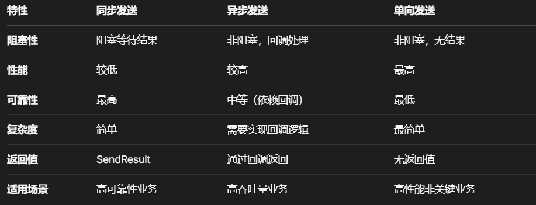


同步发送：适合对消息可靠性高的场景，允许一定的延迟
```java
public static void main(String[] args) throws Exception {
	// 实例化消息生产者Producer  
	DefaultMQProducer producer = new DefaultMQProducer("please_rename_unique_group_name");  
	// 设置NameServer的地址  
	producer.setNamesrvAddr("192.168.101.130:9876");  
	// 启动Producer实例  
	producer.start();  
	for (int i = 0; i < 100; i++) {  
	    // 创建消息，并指定Topic，Tag和消息体  
	    Message msg = new Message("TopicTest" /* Topic */,  
	    "TagA" /* Tag */,  
	    ("Hello RocketMQ " + i).getBytes(RemotingHelper.DEFAULT_CHARSET) /* Message body */  
	    );  
	    // 发送消息到一个Broker  
	    SendResult sendResult = producer.send(msg);  
	    // 通过sendResult返回消息是否成功送达  
	    System.out.printf("%s%n", sendResult);  
	}  
	// 如果不再发送消息，关闭Producer实例。  
	producer.shutdown();
}
```
发送成功后可以在可视化见面看到发送的100条消息在broker-a这个Master中，还有对应的队列id
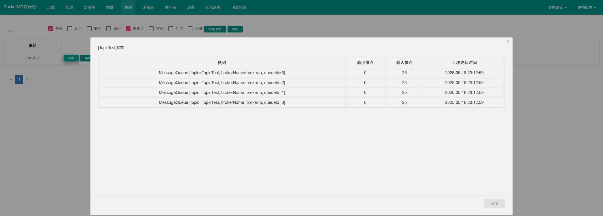

异步发送：下面这个异步发送的代码失败了啊。异步发送适合高吞吐量的场景，允许异步处理结果
```java
public static void main(String[] args) throws Exception {
    // 实例化消息生产者Producer
    DefaultMQProducer producer = new DefaultMQProducer("AsyncProducer");
    // 设置NameServer的地址
    producer.setNamesrvAddr("192.168.101.130:9876");
    producer.setRetryTimesWhenSendAsyncFailed(2);
    // 启动Producer实例
    producer.start();
    
    int messageCount = 100;
    CountDownLatch latch = new CountDownLatch(messageCount);
    for (int i = 0; i < 100; i++) {
            final int index = i;
            // 创建消息，并指定Topic，Tag和消息体
            Message msg = new Message("TopicTest2",
                "TagA",
//                    "OrderID188",
                "Hello world".getBytes(RemotingHelper.DEFAULT_CHARSET));
            // SendCallback接收异步返回结果的回调
            producer.send(msg, new SendCallback() {
                @Override
                public void onSuccess(SendResult sendResult) {
                    System.out.printf("%-10d OK %s %n", index,
                        sendResult.getMsgId());
                    latch.countDown();
                }
                @Override
                public void onException(Throwable e) {
                    System.out.printf("%-10d Exception %s %n", index, e);
                    e.printStackTrace();
                    latch.countDown();
                }
            });
    }
    latch.await(); // 等待所有消息发送完成
    // 如果不再发送消息，关闭Producer实例。
    producer.shutdown();
}
```
报错：
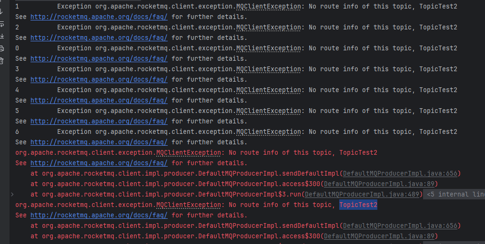

单向发送：同样报错，和上面一样报没有Topic的异常。单向发送适合非核心业务，允许消息丢失的场景（如心跳监控、实时指标采集），极高吞吐量需求，性能优先于可靠性。
```java
public class OnewayProducer {
    public static void main(String[] args) throws Exception{
        // 实例化消息生产者Producer
        DefaultMQProducer producer = new DefaultMQProducer("OnewayProducer");
        // 设置NameServer的地址
        producer.setNamesrvAddr("192.168.101.130:9876");
        // 启动Producer实例
        producer.start();
        for (int i = 0; i < 100; i++) {
            // 创建消息，并指定Topic，Tag和消息体
            Message msg = new Message("TopicTest3" /* Topic */,
                "TagA" /* Tag */,
                ("Hello RocketMQ " + i).getBytes(RemotingHelper.DEFAULT_CHARSET) /* Message body */
            );
            // 发送单向消息，没有任何返回结果
            producer.sendOneway(msg);

        }
        // 如果不再发送消息，关闭Producer实例。
        producer.shutdown();
    }
}
```


# 两种消费模式
推模式（push），消费者通过监听Broker，Broker主动推消息给消费者
拉模式（pull），消费者主动从 Broker 拉取消息，可以根据自身处理能力控制拉取频率和消息量。

无论推拉模式，都支持集群消费和广播消费：
1. 集群消费：同一个 Consumer Group 中的多个消费者共同分担消费一个 Topic 的所有消息，每个消息只会被一个消费者消费。
2. 广播消费：同一个 Consumer Group 中的每个消费者都会消费 Topic 的所有消息，消息会被广播到所有消费者。

消息处理方式：
1. 并发消息：并发处理消息，不保证消息的顺序
2. 顺序消息：消费者按照消息发送的顺序依次处理消息，保证局部或全局顺序。

适用场景：
+ **推模式 + 集群消费 + 并发消息**：高吞吐量、分布式消费场景。
+ **推模式 + 广播消费 + 并发消息**：所有消费者都需要处理消息的场景。
+ **推模式 + 集群消费 + 顺序消息**：需要保证消息顺序的业务。
+ **拉模式**：需要精确控制消费节奏的场景。


推+集群+并发：
```java
public static void main(String[] args) throws Exception {
    // 实例化消费者
    DefaultMQPushConsumer consumer = new DefaultMQPushConsumer("PushConsumerGroup");
    // 设置NameServer地址
    consumer.setNamesrvAddr("192.168.101.130:9876");
    // 订阅Topic
    consumer.subscribe("TopicTest", "*");
    // 注册并发消息监听器
    consumer.registerMessageListener(new MessageListenerConcurrently() {
        @Override
        public ConsumeConcurrentlyStatus consumeMessage(List<MessageExt> msgs, ConsumeConcurrentlyContext context) {
            for (MessageExt msg : msgs) {
                System.out.printf("Receive message: %s%n", new String(msg.getBody()));
            }
            return ConsumeConcurrentlyStatus.CONSUME_SUCCESS; // 消费成功
        }
    });
    // 启动消费者
    consumer.start();
    System.out.println("Consumer Started.");
}
```

推+集群+顺序：
```java
public static void main(String[] args) throws Exception {
    DefaultMQPushConsumer consumer = new DefaultMQPushConsumer("PushConsumerGroup");
    consumer.setNamesrvAddr("192.168.101.130:9876");
    consumer.subscribe("TopicTest2", "*");
    // 注册顺序消息监听器
    consumer.registerMessageListener(new MessageListenerOrderly() {
        @Override
        public ConsumeOrderlyStatus consumeMessage(List<MessageExt> msgs, ConsumeOrderlyContext context) {
            for (MessageExt msg : msgs) {
                System.out.printf("Receive message: %s, QueueId: %d%n", new String(msg.getBody()), msg.getQueueId());
            }
            return ConsumeOrderlyStatus.SUCCESS; // 消费成功
        }
    });
    consumer.start();
    System.out.println("Consumer Started.");
}
```

推+广播+并发：
```java
public static void main(String[] args) throws Exception {
    DefaultMQPushConsumer consumer = new DefaultMQPushConsumer("PushConsumerGroup");
    consumer.setNamesrvAddr("192.168.101.130:9876");
    consumer.setMessageModel(MessageModel.BROADCASTING); // 设置为广播模式
    consumer.subscribe("TopicTest3", "*");
    consumer.registerMessageListener(new MessageListenerConcurrently() {
        @Override
        public ConsumeConcurrentlyStatus consumeMessage(List<MessageExt> msgs, ConsumeConcurrentlyContext context) {
            for (MessageExt msg : msgs) {
                System.out.printf("Receive message: %s%n", new String(msg.getBody()));
            }
            return ConsumeConcurrentlyStatus.CONSUME_SUCCESS;
        }
    });
    consumer.start();
    System.out.println("Consumer Started.");
}
```

拉取：
```java
public static void main(String[] args) throws Exception {
    DefaultMQPullConsumer consumer = new DefaultMQPullConsumer("PullConsumerGroup");
    consumer.setNamesrvAddr("192.168.101.130:9876");
    consumer.start();

    // 获取Topic的队列
    Set<MessageQueue> mqs = consumer.fetchSubscribeMessageQueues("TopicTest");
    for (MessageQueue mq : mqs) {
        long offset = OFFSET_TABLE.getOrDefault(mq, 0L);
        while (true) {
            PullResult pullResult = consumer.pull(mq, "*", offset, 32); // 每次拉取32条
            System.out.printf("Pull from queue %s, result: %s%n", mq, pullResult.getPullStatus());
            for (MessageExt msg : pullResult.getMsgFoundList()) {
                System.out.printf("Receive message: %s%n", new String(msg.getBody()));
            }
            offset = pullResult.getNextBeginOffset();
            OFFSET_TABLE.put(mq, offset); // 更新偏移量
            if (pullResult.getPullStatus() == PullStatus.NO_NEW_MSG) {
                break;
            }
        }
    }
    consumer.shutdown();
}
```

# 顺序消息
消息有序指的是可以按照消息的发送顺序来消费(FIFO)。RocketMQ可以严格的保证消息有序，可以分为分区有序或者全局有序。

顺序消费的原理解析，在默认的情况下消息发送会采取Round Robin轮询方式把消息发送到不同的queue(分区队列)；而消费消息的时候从多个queue上拉取消息，这种情况发送和消费是不能保证顺序。但是如果控制发送的顺序消息只依次发送到同一个queue中，消费的时候只从这个queue上依次拉取，则就保证了顺序。当发送和消费参与的queue只有一个，则是全局有序；
如果多个queue参与，则为分区有序，即相对每个queue，消息都是有序的。

下面用订单进行分区有序的示例。一个订单的顺序流程是：创建、付款、推送、完成。订单号相同的消息会被先后发送到同一个队列中，消费时，同一个OrderId获取到的肯定是同一个队列。
消息发送：根据订单id区分发送队列，将订单id相同的消息都发送到同一个队列中
```java
public static void main(String[] args) throws Exception {
    DefaultMQProducer producer = new DefaultMQProducer("ProducerInOrder");
    
    producer.setNamesrvAddr("192.168.101.130:9876");
    
    producer.start();
    
    String[] tags = new String[]{"TagA", "TagC", "TagD"};
    
    // 订单列表
    List<OrderStep> orderList = new Producer().buildOrders();
    
    Date date = new Date();
    SimpleDateFormat sdf = new SimpleDateFormat("yyyy-MM-dd HH:mm:ss");
    String dateStr = sdf.format(date);
    for (int i = 0; i < 10; i++) {
       // 加个时间前缀
       String body = dateStr + " Hello RocketMQ " + orderList.get(i);
       Message msg = new Message("TopicTest", tags[i % tags.length], "KEY" + i, body.getBytes());
    
       SendResult sendResult = producer.send(msg, new MessageQueueSelector() {
           @Override
           public MessageQueue select(List<MessageQueue> mqs, Message msg, Object arg) {
               Long id = (Long) arg;  //根据订单id选择发送queue
               long index = id % mqs.size();
               return mqs.get((int) index);
           }
       }, orderList.get(i).getOrderId());//订单id
    
       System.out.println(String.format("SendResult status:%s, queueId:%d, body:%s",
           sendResult.getSendStatus(),
           sendResult.getMessageQueue().getQueueId(),
           body));
    }
    
    producer.shutdown();
}


/**
* 订单的步骤
*/
private static class OrderStep {
   private long orderId;
   private String desc;

   public long getOrderId() {
       return orderId;
   }

   public void setOrderId(long orderId) {
       this.orderId = orderId;
   }

   public String getDesc() {
       return desc;
   }

   public void setDesc(String desc) {
       this.desc = desc;
   }

   @Override
   public String toString() {
       return "OrderStep{" +
           "orderId=" + orderId +
           ", desc='" + desc + '\'' +
           '}';
   }
}

/**
* 生成模拟订单数据
*/
private List<OrderStep> buildOrders() {
   List<OrderStep> orderList = new ArrayList<OrderStep>();

   OrderStep orderDemo = new OrderStep();
   orderDemo.setOrderId(15103111039L);
   orderDemo.setDesc("创建");
   orderList.add(orderDemo);

   orderDemo = new OrderStep();
   orderDemo.setOrderId(15103111065L);
   orderDemo.setDesc("创建");
   orderList.add(orderDemo);

   orderDemo = new OrderStep();
   orderDemo.setOrderId(15103111039L);
   orderDemo.setDesc("付款");
   orderList.add(orderDemo);

   orderDemo = new OrderStep();
   orderDemo.setOrderId(15103117235L);
   orderDemo.setDesc("创建");
   orderList.add(orderDemo);

   orderDemo = new OrderStep();
   orderDemo.setOrderId(15103111065L);
   orderDemo.setDesc("付款");
   orderList.add(orderDemo);

   orderDemo = new OrderStep();
   orderDemo.setOrderId(15103117235L);
   orderDemo.setDesc("付款");
   orderList.add(orderDemo);

   orderDemo = new OrderStep();
   orderDemo.setOrderId(15103111065L);
   orderDemo.setDesc("完成");
   orderList.add(orderDemo);

   orderDemo = new OrderStep();
   orderDemo.setOrderId(15103111039L);
   orderDemo.setDesc("推送");
   orderList.add(orderDemo);

   orderDemo = new OrderStep();
   orderDemo.setOrderId(15103117235L);
   orderDemo.setDesc("完成");
   orderList.add(orderDemo);

   orderDemo = new OrderStep();
   orderDemo.setOrderId(15103111039L);
   orderDemo.setDesc("完成");
   orderList.add(orderDemo);

   return orderList;
}
```

消费者：消费消息，测试过运行失败
```java
public static void main(String[] args) throws Exception {
   DefaultMQPushConsumer consumer = new
       DefaultMQPushConsumer("ConsumerInOrder");
   consumer.setNamesrvAddr("192.168.101.130:9876");
   /**
    * 设置Consumer第一次启动是从队列头部开始消费还是队列尾部开始消费<br>
    * 如果非第一次启动，那么按照上次消费的位置继续消费
    */
   consumer.setConsumeFromWhere(ConsumeFromWhere.CONSUME_FROM_FIRST_OFFSET);

   consumer.subscribe("TopicTest", "TagA || TagC || TagD");

   consumer.registerMessageListener(new MessageListenerOrderly() {

       Random random = new Random();

       @Override
       public ConsumeOrderlyStatus consumeMessage(List<MessageExt> msgs, ConsumeOrderlyContext context) {
           context.setAutoCommit(true);
           for (MessageExt msg : msgs) {
               // 可以看到每个queue有唯一的consume线程来消费, 订单对每个queue(分区)有序
               System.out.println("consumeThread=" + Thread.currentThread().getName() + "queueId=" + msg.getQueueId() + ", content:" + new String(msg.getBody()));
           }

           try {
               //模拟业务逻辑处理中...
               TimeUnit.SECONDS.sleep(random.nextInt(10));
           } catch (Exception e) {
               e.printStackTrace();
           }
           return ConsumeOrderlyStatus.SUCCESS;
       }
   });

   consumer.start();

   System.out.println("Consumer Started.");
}
```


# 延迟消息
延迟消息有专门的配置延迟级别，根据延迟级别选择延迟消息的时间
消费者是正常的监听
```java
public static void main(String[] args) throws Exception {
  // 实例化消费者
  DefaultMQPushConsumer consumer = new DefaultMQPushConsumer("ScheduledMessageConsumer");
  consumer.setNamesrvAddr("192.168.101.130:9876");
  // 订阅Topics
  consumer.subscribe("TestTopic5", "*");
  // 注册消息监听者
  consumer.registerMessageListener(new MessageListenerConcurrently() {
      @Override
      public ConsumeConcurrentlyStatus consumeMessage(List<MessageExt> messages, ConsumeConcurrentlyContext context) {
          for (MessageExt message : messages) {
              // Print approximate delay time period
              System.out.println("Receive message[msgId=" + message.getMsgId() + "] " + (System.currentTimeMillis() - message.getStoreTimestamp()) + "ms later");
          }
          return ConsumeConcurrentlyStatus.CONSUME_SUCCESS;
      }
  });
  // 启动消费者
  consumer.start();
}
```

发送者设置发送延时消息：message.setDelayTimeLevel(3);关键代码
```java
public static void main(String[] args) throws Exception {
  // 实例化一个生产者来产生延时消息
  DefaultMQProducer producer = new DefaultMQProducer("ScheduledMessageProducer");
  producer.setNamesrvAddr("192.168.101.130:9876");
  // 启动生产者
  producer.start();
  int totalMessagesToSend = 100;
  for (int i = 0; i < totalMessagesToSend; i++) {
      Message message = new Message("TestTopic5", ("Hello scheduled message " + i).getBytes());
      // 设置延时等级3,这个消息将在10s之后发送(现在只支持固定的几个时间,详看delayTimeLevel)
      message.setDelayTimeLevel(3);
      // 发送消息
      producer.send(message);
  }
   // 关闭生产者
  producer.shutdown();
}
```

支持的延迟时间：
```java
// org/apache/rocketmq/store/config/MessageStoreConfig.java
private String messageDelayLevel = "1s 5s 10s 30s 1m 2m 3m 4m 5m 6m 7m 8m 9m 10m 20m 30m 1h 2h";
```

# 批量消息
批量发送消息能显著提高传递小消息的性能。限制是这些批量消息应该有相同的topic，相同的waitStoreMsgOK，而且不能是延时消息。此外，这一批消息的总大小不应超过4MB。

不超过4mb
```java
String topic = "BatchTest";
List<Message> messages = new ArrayList<>();
messages.add(new Message(topic, "TagA", "OrderID001", "Hello world 0".getBytes()));
messages.add(new Message(topic, "TagA", "OrderID002", "Hello world 1".getBytes()));
messages.add(new Message(topic, "TagA", "OrderID003", "Hello world 2".getBytes()));
try {
   producer.send(messages);
} catch (Exception e) {
   e.printStackTrace();
   //处理error
}
```

超过4mb，对消息进行分割：
```java
public class ListSplitter implements Iterator<List<Message>> {
   private final int SIZE_LIMIT = 1024 * 1024 * 4;
   private final List<Message> messages;
   private int currIndex;
   public ListSplitter(List<Message> messages) {
           this.messages = messages;
   }
    @Override 
    public boolean hasNext() {
       return currIndex < messages.size();
   }
       @Override 
    public List<Message> next() {
       int nextIndex = currIndex;
       int totalSize = 0;
       for (; nextIndex < messages.size(); nextIndex++) {
           Message message = messages.get(nextIndex);
           int tmpSize = message.getTopic().length() + message.getBody().length;
           Map<String, String> properties = message.getProperties();
           for (Map.Entry<String, String> entry : properties.entrySet()) {
               tmpSize += entry.getKey().length() + entry.getValue().length();
           }
           tmpSize = tmpSize + 20; // 增加日志的开销20字节
           if (tmpSize > SIZE_LIMIT) {
               //单个消息超过了最大的限制
               //忽略,否则会阻塞分裂的进程
               if (nextIndex - currIndex == 0) {
                  //假如下一个子列表没有元素,则添加这个子列表然后退出循环,否则只是退出循环
                  nextIndex++;
               }
               break;
           }
           if (tmpSize + totalSize > SIZE_LIMIT) {
               break;
           } else {
               totalSize += tmpSize;
           }

       }
       List<Message> subList = messages.subList(currIndex, nextIndex);
       currIndex = nextIndex;
       return subList;
   }
}
//把大的消息分裂成若干个小的消息
ListSplitter splitter = new ListSplitter(messages);
while (splitter.hasNext()) {
  try {
      List<Message>  listItem = splitter.next();
      producer.send(listItem);
  } catch (Exception e) {
      e.printStackTrace();
      //处理error
  }
}
```


# 过滤消息
前面的Tag也可以过滤消息，但是一个消息只能有一个tag，对于复杂的场景可能存在不适用的情况，也可以使用sql来进行过滤。

RocketMQ只定义了一些基本语法来支持这个特性。你也可以很容易地扩展它。
+ 数值比较，比如：**>，>=，<，<=，BETWEEN，=；**
+ 字符比较，比如：**=，<>，IN；**
+ **IS NULL** 或者 **IS NOT NULL；**
+ 逻辑符号 **AND，OR，NOT；**

常量支持类型为：
+ 数值，比如：**123，3.1415；**
+ 字符，比如：**'abc'，必须用单引号包裹起来；**
+ **NULL**，特殊的常量
+ 布尔值，**TRUE** 或 **FALSE**

只有使用push模式的消费者才能用使用SQL92标准的sql语句，接口如下：
```java
public void subscribe(finalString topic, final MessageSelector messageSelector)
```

实现：
消息生产者通过类似`msg.putUserProperty("a", String.valueOf(i));`设置属性
```java
DefaultMQProducer producer = new DefaultMQProducer("please_rename_unique_group_name");
producer.start();
Message msg = new Message("TopicTest",
   tag,
   ("Hello RocketMQ " + i).getBytes(RemotingHelper.DEFAULT_CHARSET)
);
// 设置一些属性
msg.putUserProperty("a", String.valueOf(i));
SendResult sendResult = producer.send(msg);

producer.shutdown();
```

消息消费者通过`consumer.subscribe("TopicTest", MessageSelector.bySql("a between 0 and 3");`过滤
```java
DefaultMQPushConsumer consumer = new DefaultMQPushConsumer("please_rename_unique_group_name_4");
// 只有订阅的消息有这个属性a, a >=0 and a <= 3
consumer.subscribe("TopicTest", MessageSelector.bySql("a between 0 and 3");
consumer.registerMessageListener(new MessageListenerConcurrently() {
   @Override
   public ConsumeConcurrentlyStatus consumeMessage(List<MessageExt> msgs, ConsumeConcurrentlyContext context) {
       return ConsumeConcurrentlyStatus.CONSUME_SUCCESS;
   }
});
consumer.start();
```


# 事务消息
流程：
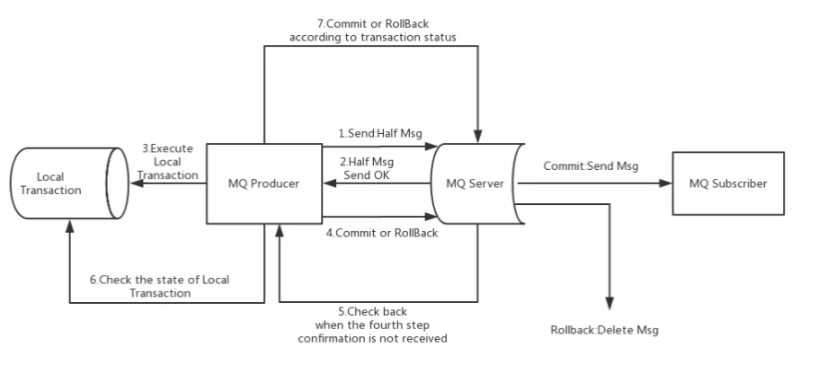
**事务消息**是一种特殊的分布式消息机制，用于解决分布式系统中的数据一致性问题。它特别适用于需要保证消息发送和本地事务执行原子性的场景，例如订单支付、库存扣减等业务。RocketMQ 的事务消息基于**两阶段提交（Two-Phase Commit, 2PC）** 的思想，并通过半消息（Half Message）和事务状态回查机制实现。

事务消息：保证本地事务和消息发送是原子性的。
事务消息的关键特性：
+ **半消息（Half Message）**：消息先以“待确认”状态发送到 Broker，消费者无法看到。
+ **事务状态回查**：Producer 负责执行本地事务并通知 Broker 提交或回滚消息。
+ **最终一致性**：通过回查机制保证事务的最终一致性。

事务消息的工作流程分为三个阶段：
1. 发送半消息：Producer发送一条“半消息”到Broker，Broker不会被立马消费，而是存储在特殊队列中，等待后续确认
2. 执行本地事务：根据执行本地事务后的状态来确认是提交还是回滚消息
3. 如果执行成功，通知半消息成为正常消息，消费者可以消费；如果执行失败，通知回滚，半消息丢弃；如果 Producer 未及时通知（例如宕机），Broker 会主动回查 Producer，询问事务状态。

Broker 在一定时间后（默认 60 秒，可配置）未收到提交/回滚指令，会主动调用 Producer 的事务状态检查接口。
Producer 需实现回查逻辑，返回事务的最终状态（Commit 或 Rollback）。

以下是一个完整的 RocketMQ 事务消息实现示例，模拟订单创建场景：
```java
// 模拟数据库，存储事务状态
private static final Map<String, LocalTransactionState> TRANSACTION_STATE = new HashMap<>();

public static void main(String[] args) throws Exception {
    // 创建事务消息生产者
    TransactionMQProducer producer = new TransactionMQProducer("TransactionProducerGroup");
    producer.setNamesrvAddr("192.168.101.130:9876");

    // 设置事务监听器
    producer.setTransactionListener(new TransactionListener() {
        @Override
        public LocalTransactionState executeLocalTransaction(Message msg, Object arg) {
            String orderId = new String(msg.getBody());
            System.out.println("Executing local transaction for order: " + orderId);

            // 模拟本地事务（例如数据库操作）
            try {
                // 假设事务成功
                if (orderId.contains("1")) { // 假设订单号含 "1" 表示成功
                    TRANSACTION_STATE.put(msg.getTransactionId(), LocalTransactionState.COMMIT_MESSAGE);
                    return LocalTransactionState.COMMIT_MESSAGE;
                } else { // 其他情况失败
                    TRANSACTION_STATE.put(msg.getTransactionId(), LocalTransactionState.ROLLBACK_MESSAGE);
                    return LocalTransactionState.ROLLBACK_MESSAGE;
                }
            } catch (Exception e) {
                // 异常情况未知状态，等待回查
                TRANSACTION_STATE.put(msg.getTransactionId(), LocalTransactionState.UNKNOW);
                return LocalTransactionState.UNKNOW;
            }
        }

        @Override
        public LocalTransactionState checkLocalTransaction(MessageExt msg) {
            String transactionId = msg.getTransactionId();
            System.out.println("Checking transaction state for: " + transactionId);

            // 从数据库或状态表中查询事务状态
            LocalTransactionState state = TRANSACTION_STATE.getOrDefault(transactionId, LocalTransactionState.UNKNOW);
            System.out.println("Transaction state: " + state);
            return state;
        }
    });

    // 启动生产者
    producer.start();

    // 发送事务消息
    for (int i = 0; i < 5; i++) {
        String orderId = "Order" + i;
        Message msg = new Message("TransactionTopic", "TagA", orderId.getBytes(RemotingHelper.DEFAULT_CHARSET));
        TransactionSendResult sendResult = producer.sendMessageInTransaction(msg, null);
        System.out.println("Send result: " + sendResult);
    }

    // 保持程序运行以观察回查
    Thread.sleep(60000);
    producer.shutdown();
}
```

消费者正常消费：
```java
public static void main(String[] args) throws Exception {
    DefaultMQPushConsumer consumer = new DefaultMQPushConsumer("TransactionConsumerGroup");
    consumer.setNamesrvAddr("192.168.101.130:9876");
    consumer.subscribe("TransactionTopic", "*");
    consumer.registerMessageListener((MessageListenerConcurrently) (msgs, context) -> {
        for (MessageExt msg : msgs) {
            System.out.println("Consumed message: " + new String(msg.getBody()));
        }
        return ConsumeConcurrentlyStatus.CONSUME_SUCCESS;
    });
    consumer.start();
    System.out.println("Consumer Started.");
}
```

运行结果：
+ 发送 5 条消息：Order0, Order1, Order2, Order3, Order4。
+ Order1 包含 "1"，本地事务成功，消息被提交。
+ 其他订单失败，消息被回滚。


使用限制：
1. 事务消息不支持延迟消息和批量消息。
2. 为了避免单个消息被检查太多次而导致半队列消息累积，我们默认将单个消息的检查次数限制为 15 次，但是用户可以通过 Broker 配置文件的 `transactionCheckMax`参数来修改此限制。如果已经检查某条消息超过 N 次的话（ N = `transactionCheckMax` ） 则 Broker 将丢弃此消息，并在默认情况下同时打印错误日志。用户可以通过重写 `AbstractTransactionCheckListener` 类来修改这个行为。
3. 事务消息将在 Broker 配置文件中的参数 transactionMsgTimeout 这样的特定时间长度之后被检查。当发送事务消息时，用户还可以通过设置用户属性 CHECK_IMMUNITY_TIME_IN_SECONDS 来改变这个限制，该参数优先于 `transactionMsgTimeout` 参数。
4. 事务性消息可能不止一次被检查或消费。
5. 提交给用户的目标主题消息可能会失败，目前这依日志的记录而定。它的高可用性通过 RocketMQ 本身的高可用性机制来保证，如果希望确保事务消息不丢失、并且事务完整性得到保证，建议使用同步的双重写入机制。
6. 事务消息的生产者 ID 不能与其他类型消息的生产者 ID 共享。与其他类型的消息不同，事务消息允许反向查询、MQ服务器能通过它们的生产者 ID 查询到消费者。


# 业务场景使用
模拟电商网站购物场景中的【下单】和【支付】业务，体会使用RocketMQ
下单业务：
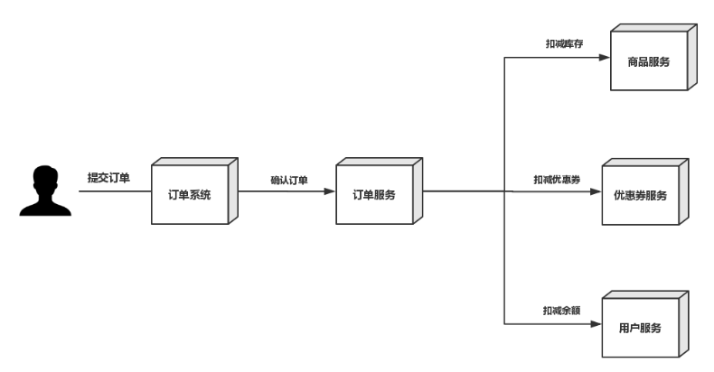
问题：用户提交订单后，扣减库存成功、扣减优惠券成功、使用余额成功，但是在确认订单操作失败，需要对库存、库存、余额进行回退。如何保证数据的完整性？
解决方法：使用MQ保证数据的完整性

支付业务：用户通过第三方支付平台（支付宝、微信）支付成功后，第三方支付平台要通过回调API异步通知商家支付系统用户支付结果，支付系统根据支付结果修改订单状态、记录支付日志和给用户增加积分。
商家支付系统如何保证在收到第三方支付平台的异步通知时，如何快速给第三方支付凭条做出回应？
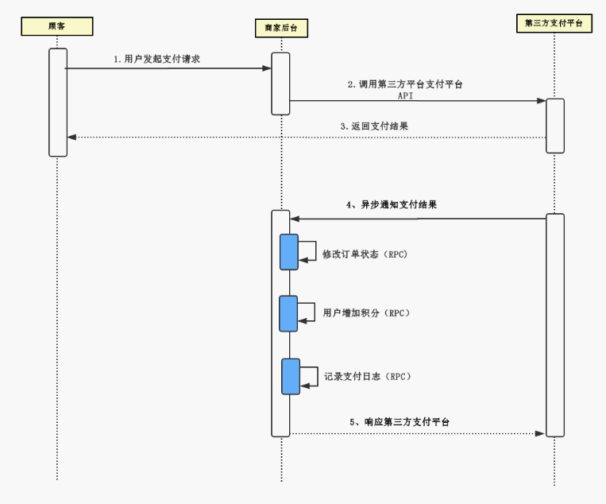


## SpringBoot整合RocketMQ

rockermq依赖：
```xml
<dependency>  
    <groupId>org.apache.rocketmq</groupId>  
    <artifactId>rocketmq-spring-boot-starter</artifactId>  
    <version>2.0.3</version>  
</dependency>
```
生产者：
- 配置文件：
```yaml
rocketmq:  
  name-server: 192.168.101.130:9876  
  producer:  
    group: producer-group1
```
- 发送消息：
```java
@RunWith(SpringRunner.class)
@SpringBootTest(classes = {MQSpringBootApplication.class})
public class ProducerTest {

    @Autowired
    private RocketMQTemplate rocketMQTemplate;

    @Test
    public void test1(){
        rocketMQTemplate.convertAndSend("springboot-mq","hello springboot rocketmq");
    }
}
```

消费者：
- 监听：
```java
@Slf4j
@Component
@RocketMQMessageListener(topic = "springboot-mq",consumerGroup = "springboot-mq-consumer-1")
public class Consumer implements RocketMQListener<String> {

    @Override
    public void onMessage(String message) {
        log.info("Receive message："+message);
    }
}
```

### 三种消息的发送
1. 同步消息：`convertAndSend`或者`send`
2. 异步消息：`asyncSend`
3. 单向消息：`sendOneWay`

### 消费模式的实现

推模式：通过`@RocketMQMessageListener`注册消息监听器：
示例：
```java
@RocketMQMessageListener( topic = "springboot-mq", consumerGroup = "my-consumer-group", selectorExpression = "*" // 订阅所有 Tag )
```
拉模式：通过`RocketMQTemplate`或者`DefaultMQPullConsumer`
```java
DefaultMQPullConsumer consumer = new DefaultMQPullConsumer("my-consumer-group"); consumer.setNamesrvAddr("localhost:9876"); consumer.start();

// 获取指定 Topic 的消息队列 
Set queues = consumer.fetchSubscribeMessageQueues("springboot-mq"); for (MessageQueue queue : queues) { 
// 拉取消息 
PullResult pullResult = consumer.pull(queue, "*", consumer.fetchMessageQueuesOffset(queue, false), 32); System.out.println("Pulled messages: " + pullResult.getMsgFoundList()); 
// 更新偏移量
consumer.updateConsumeOffset(queue, pullResult.getNextBeginOffset()); 
}

consumer.shutdown();
```

集群消费或者广播消费通过监听器`RocketMQMessageListener`的属性设定：
```java
consumeMode = ConsumeMode.CONCURRENTLY // 默认集群消费
messageModel = MessageModel.BROADCASTING // 设置为广播消费
```

### 顺序消息的实现
顺序消息的发送主要依赖 `RocketMQTemplate` 的 `syncSendOrderly` 方法，并结合 `MessageQueueSelector` 实现队列选择逻辑。
分区有序性：根据业务id相同的数据发往同一个队列，队列默认有序
全局有序性：所有的消息发往同一个队列，整个Topic只有一个队列

发送者示例：订单id相同的使用同一个队列
```java

@Component
public class OrderlyMessageProducer {

    @Autowired
    private RocketMQTemplate rocketMQTemplate;

    public void sendOrderlyMessage(String topic, String message, String orderId) {
        // 发送顺序消息，指定队列选择器
        rocketMQTemplate.syncSendOrderly(topic, message, orderId, new MessageQueueSelector() {
            @Override
            public MessageQueue select(List<MessageQueue> mqs, Message msg, Object arg) {
                // 根据 orderId 选择队列，保证相同 orderId 的消息进入同一队列
                String orderIdStr = (String) arg;
                int index = Math.abs(orderIdStr.hashCode()) % mqs.size();
                return mqs.get(index);
            }
        });
    }
}
```
消费者示例，设置顺序消费模式：
```java

@Component
@RocketMQMessageListener(
    topic = "orderly-topic",
    consumerGroup = "my-orderly-consumer-group",
    selectorExpression = "*",
    consumeMode = ConsumeMode.ORDERLY // 设置为顺序消费
)
public class OrderlyMessageConsumer implements RocketMQListener<String> {
    @Override
    public void onMessage(String message) {
        System.out.println("Received orderly message: " + message);
    }
}
```

### 延迟消息的实现

通过设置`message`对象属性，然后发送
```java
@Component
public class DelayMessageProducer {

    @Autowired
    private RocketMQTemplate rocketMQTemplate;

    public void sendDelayMessage(String topic, String message, int delayLevel) {
        // 创建 RocketMQ 消息对象
        Message msg = new Message(topic, message.getBytes());
        // 设置延迟级别，例如 3 表示延迟 10 秒
        msg.setDelayTimeLevel(delayLevel);

        // 发送延迟消息
        rocketMQTemplate.getProducer().send(msg);
        System.out.println("Sent delay message: " + message + ", delay level: " + delayLevel);
    }
}
```

通过`RocketMQTemplate.convertAndSend()`方法发送延迟消息：
```java

@Component
public class DelayMessageProducer {

    @Autowired
    private RocketMQTemplate rocketMQTemplate;

    public void sendDelayMessage(String topic, String message, int delayLevel) {
        // 使用 MessageBuilder 设置延迟级别
        rocketMQTemplate.convertAndSend(topic, 
            MessageBuilder.withPayload(message)
                          .setHeader("DELAY", delayLevel)
                          .build());
        System.out.println("Sent delay message: " + message + ", delay level: " + delayLevel);
    }
}
```

### 批量消息的实现

使用 `RocketMQTemplate` 的 `send` 方法，传入 `List`
```java
@Component
public class BatchMessageProducer {

    @Autowired
    private RocketMQTemplate rocketMQTemplate;

    public void sendBatchMessages(String topic, List<String> messages) {
        // 创建消息列表
        List<Message> messageList = new ArrayList<>();
        for (String msg : messages) {
            // 每条消息必须指定相同的 Topic
            messageList.add(new Message(topic, msg.getBytes()));
        }

        // 发送批量消息
        rocketMQTemplate.getProducer().send(messageList);
        System.out.println("Sent batch messages: " + messages.size());
    }
}
```

使用 `convertAndSend`，传入 `Collection`（`Spring` `Messaging` 风格）。
```java

@Component
public class BatchMessageProducer {

    @Autowired
    private RocketMQTemplate rocketMQTemplate;

    public void sendBatchMessages(String topic, List<String> messages) {
        // 创建消息集合
        List<org.springframework.messaging.Message<?>> messageList = new ArrayList<>();
        for (String msg : messages) {
            messageList.add(MessageBuilder.withPayload(msg).build());
        }

        // 发送批量消息
        rocketMQTemplate.convertAndSend(topic, messageList);
        System.out.println("Sent batch messages: " + messages.size());
    }
}
```


### 过滤消息的实现
RocketMQ 支持两种主要的过滤方式：
- **Tag 过滤**：基于消息的 Tag 进行过滤，消费者订阅特定 Tag 的消息。Tag 是一种简单的字符串标记，适合轻量级过滤。
- **SQL 过滤**：基于消息的自定义属性（Properties）使用 SQL92 表达式进行过滤，支持更复杂的条件逻辑。
- **过滤位置**：
    - **Broker 端过滤**：Broker 根据消费者的过滤条件筛选消息，只将符合条件的消息发送给消费者，减少网络传输。
    - **Consumer 端过滤**：Broker 发送所有消息，消费者在本地过滤（较少使用，效率较低）。
示例：发送带有tag和sql的消息：
```java
@Component
public class FilterMessageProducer {

    @Autowired
    private RocketMQTemplate rocketMQTemplate;

    public void sendMessageWithTagAndProperties(String topic, String message, String tag, String key, String value) {
        // 创建消息并设置 Tag 和自定义属性
        Message msg = new Message(topic, tag, message.getBytes());
        msg.putUserProperty(key, value); // 设置自定义属性

        // 发送消息
        rocketMQTemplate.getProducer().send(msg);
        System.out.println("Sent message: " + message + ", tag: " + tag + ", property: " + key + "=" + value);
    }
}
```
实现tag过滤和sql过滤都是在`@RocketMQMessageListner`注解的属性中进行配置的：
```java
//使用tag过滤
@Component
@RocketMQMessageListener(
    topic = "filter-topic",
    consumerGroup = "my-tag-consumer-group",
    selectorExpression = "tag1 || tag2" // 订阅 tag1 或 tag2 的消息
)
public class TagFilterConsumer implements RocketMQListener<String> {
    @Override
    public void onMessage(String message) {
        System.out.println("Received message with tag filter: " + message);
    }
}

// 使用sql过滤
@Component
@RocketMQMessageListener(
    topic = "filter-topic",
    consumerGroup = "my-sql-consumer-group",
    selectorType = SelectorType.SQL92, // 使用 SQL92 过滤
    selectorExpression = "userType = 'VIP' and level > 5" // SQL 过滤条件
)
public class SqlFilterConsumer implements RocketMQListener<String> {
    @Override
    public void onMessage(String message) {
        System.out.println("Received message with SQL filter: " + message);
    }
}
```

### 事务消息的实现

事务消息通过 `RocketMQTemplate` 的 `sendMessageInTransaction` 方法实现，配合 `RocketMQTransactionListener` 处理本地事务和回查逻辑。

发送事务消息示例代码：
```java
@Component
public class TransactionMessageProducer {

    @Autowired
    private RocketMQTemplate rocketMQTemplate;

    public void sendTransactionMessage(String topic, String message, String transactionId) {
        // 构造事务消息
        Message<String> msg = MessageBuilder.withPayload(message)
                .setHeader(RocketMQHeaders.TRANSACTION_ID, transactionId)
                .build();

        // 发送事务消息
        rocketMQTemplate.sendMessageInTransaction(topic, msg, transactionId);
        System.out.println("Sent transaction message: " + message + ", transactionId: " + transactionId);
    }

    // 定义事务监听器
    @RocketMQTransactionListener
    static class TransactionListenerImpl implements org.apache.rocketmq.spring.core.RocketMQTransactionListener {

        @Override
        public LocalTransactionState executeLocalTransaction(org.apache.rocketmq.common.message.Message msg, Object arg) {
            // 获取事务 ID
            String transactionId = (String) arg;
            System.out.println("Executing local transaction for transactionId: " + transactionId);

            // 模拟本地事务逻辑（如数据库操作）
            try {
                // 假设事务成功
                System.out.println("Local transaction executed successfully for: " + new String(msg.getBody()));
                return LocalTransactionState.COMMIT_MESSAGE; // 提交消息
            } catch (Exception e) {
                System.err.println("Local transaction failed: " + e.getMessage());
                return LocalTransactionState.ROLLBACK_MESSAGE; // 回滚消息
            }
        }

        @Override
        public LocalTransactionState checkLocalTransaction(org.apache.rocketmq.common.message.Message msg) {
            // 获取事务 ID
            String transactionId = msg.getTransactionId();
            System.out.println("Checking transaction state for transactionId: " + transactionId);

            // 模拟回查逻辑（如查询数据库事务状态）
            // 假设事务状态为已提交
            boolean isCommitted = checkTransactionStatus(transactionId);
            return isCommitted ? LocalTransactionState.COMMIT_MESSAGE : LocalTransactionState.ROLLBACK_MESSAGE;
        }

        private boolean checkTransactionStatus(String transactionId) {
            // 模拟查询事务状态（实际应查询数据库或外部系统）
            System.out.println("Checking transaction status for: " + transactionId);
            return true; // 假设事务已提交
        }
    }
}
```

消息事务成功后，消费消息的逻辑和普通消息一样


## SpringBoot整合Dubbo

docker部署ZooKeeper单机：[https://blog.csdn.net/qq_58221659/article/details/131795005](https://blog.csdn.net/qq_58221659/article/details/131795005

docker部署ZooKeeper集群：[https://cloud.tencent.com/developer/article/1680299](https://cloud.tencent.com/developer/article/1680299)

docker-compose部署ZooKeeper集群：[https://blog.csdn.net/qq_37960603/article/details/122909811](https://blog.csdn.net/qq_37960603/article/details/122909811)


RPC服务接口：
```java
public interface IUserService {
    public String sayHello(String name);
}
```

服务提供者和服务消费者的依赖：
```xml
 <properties>  
        <java.version>1.8</java.version>  
        <project.build.sourceEncoding>UTF-8</project.build.sourceEncoding>  
        <project.reporting.outputEncoding>UTF-8</project.reporting.outputEncoding>  
        <rocketmq-spring-boot-starter-version>2.0.3</rocketmq-spring-boot-starter-version>  
    </properties>    <dependencies>        <!--dubbo-->  
        <dependency>  
            <groupId>com.alibaba.spring.boot</groupId>  
            <artifactId>dubbo-spring-boot-starter</artifactId>  
            <version>2.0.0</version>  
        </dependency>        <!--spring-boot-stater-->  
        <dependency>  
            <groupId>org.springframework.boot</groupId>  
            <artifactId>spring-boot-starter</artifactId>  
            <exclusions>                <exclusion>                    <artifactId>log4j-to-slf4j</artifactId>  
                    <groupId>org.apache.logging.log4j</groupId>  
                </exclusion>            </exclusions>        </dependency>  
        <!--zookeeper-->  
        <dependency>  
            <groupId>org.apache.zookeeper</groupId>  
            <artifactId>zookeeper</artifactId>  
            <version>3.4.10</version>  
            <exclusions>                <exclusion>                    <groupId>org.slf4j</groupId>  
                    <artifactId>slf4j-log4j12</artifactId>  
                </exclusion>                <exclusion>                    <groupId>log4j</groupId>  
                    <artifactId>log4j</artifactId>  
                </exclusion>            </exclusions>        </dependency>  
        <dependency>            <groupId>com.101tec</groupId>  
            <artifactId>zkclient</artifactId>  
            <version>0.9</version>  
            <exclusions>                <exclusion>                    <artifactId>slf4j-log4j12</artifactId>  
                    <groupId>org.slf4j</groupId>  
                </exclusion>            </exclusions>        </dependency>  
        <!--API-->  
<!--        <dependency>-->  
<!--            <groupId>com.itheima.demo</groupId>-->  
<!--            <artifactId>dubbo-api</artifactId>-->  
<!--            <version>1.0-SNAPSHOT</version>-->  
<!--        </dependency>-->  
        <dependency>  
            <groupId>org.apache.rocketmq</groupId>  
            <artifactId>rocketmq-spring-boot-starter</artifactId>  
            <version>${rocketmq-spring-boot-starter-version}</version>  
        </dependency>        <dependency>            <groupId>org.projectlombok</groupId>  
            <artifactId>lombok</artifactId>  
            <version>1.18.6</version>  
        </dependency>        <dependency>            <groupId>org.springframework.boot</groupId>  
            <artifactId>spring-boot-starter-test</artifactId>  
            <scope>test</scope>  
        </dependency>  
        <dependency>            <groupId>org.junit.jupiter</groupId>  
            <artifactId>junit-jupiter</artifactId>  
            <version>5.11.4</version>  
            <scope>test</scope>  
        </dependency>  
        <dependency>            <groupId>org.example</groupId>  
            <artifactId>dubbo-interface</artifactId>  
            <version>0.0.1-SNAPSHOT</version>  
        </dependency>    </dependencies>
```


服务提供者：
- 配置文件：
```yaml
spring:  
  application:  
    name: dubbo-demo-provider  
  dubbo:  
    application:  
      id: dubbo-demo-provider  
      name: dubbo-demo-provider  
    registry:  
      address: zookeeper://192.168.101.131:9001;zookeeper://192.168.101.131:9002;zookeeper://192.168.101.131:9003  
    server: true  
    protocol:  
      name: dubbo  
      port: 20880
```

- 启动类添加`@EnableDubboConfiguration`注解
- 服务实现：
```java
@Component  
@Service(interfaceClass = IUserService.class)  
public class UserServiceImpl implements IUserService{  
    @Override  
    public String sayHello(String name) {  
        return "hello:"+name;  
    }  
}
```

服务消费者：
- 配置文件：
```java
spring:  
  application:  
    name: dubbo-demo-consumer  
  dubbo:  
    application:  
      id: dubbo-demo-consumer  
      name: dubbo-demo-consumer  
    registry:  
      address: zookeeper://192.168.101.131:9001;zookeeper://192.168.101.131:9002;zookeeper://192.168.101.131:9003
```
- 启动类添加`@EnableDubboConfiguration`注解
- 消费者提供接口：
```java
@RestController  
@RequestMapping("/user")  
public class UserController {  
  
    @Reference  
    private IUserService userService;  
  
    @RequestMapping("/sayHello")  
    public String sayHello(String name){  
        return userService.sayHello(name);  
    }  
  
}
```


##  下单业务的关键

用户提交订单后，扣减库存成功、扣减优惠券成功、使用余额成功，但是在确认订单操作失败，需要对库存、库存、余额进行回退。通过MQ发送订单失败的消息，进行回退

关键代码：订单失败，发送订单消息
```java
@Override
public Result confirmOrder(TradeOrder order) {
    //1.校验订单
    //2.生成预订
    try {
        //3.扣减库存
        //4.扣减优惠券
        //5.使用余额
        //6.确认订单
    } catch (Exception e) {
        //确认订单失败,发送消息
        CancelOrderMQ cancelOrderMQ = new CancelOrderMQ();
        cancelOrderMQ.setOrderId(order.getOrderId());
        cancelOrderMQ.setCouponId(order.getCouponId());
        cancelOrderMQ.setGoodsId(order.getGoodsId());
        cancelOrderMQ.setGoodsNumber(order.getGoodsNumber());
        cancelOrderMQ.setUserId(order.getUserId());
        cancelOrderMQ.setUserMoney(order.getMoneyPaid());
        try {
            sendMessage(topic, 
                        cancelTag, 
                        cancelOrderMQ.getOrderId().toString(), 
                    JSON.toJSONString(cancelOrderMQ));
    } catch (Exception e1) {
        e1.printStackTrace();
            CastException.cast(ShopCode.SHOP_MQ_SEND_MESSAGE_FAIL);
        }
        return new Result(ShopCode.SHOP_FAIL.getSuccess(), ShopCode.SHOP_FAIL.getMessage());
    }
}
```

消费者监听消息，获取解析消息，完成退单等操作：
```java
@Slf4j
@Component
@RocketMQMessageListener(topic = "${mq.order.topic}", 
                         consumerGroup = "${mq.order.consumer.group.name}",
                         messageModel = MessageModel.BROADCASTING)
public class CancelOrderConsumer implements RocketMQListener<MessageExt>{

    @Override
    public void onMessage(MessageExt messageExt) {
        ...
    }
}
```


## 支付业务的关键

支付回调成功后，对业务表进行更新，比如订单状态等

关键代码：支付成功发送消息
```java
public Result callbackPayment(TradePay tradePay) {

    if (tradePay.getIsPaid().equals(ShopCode.SHOP_ORDER_PAY_STATUS_IS_PAY.getCode())) {
        tradePay = tradePayMapper.selectByPrimaryKey(tradePay.getPayId());
        if (tradePay == null) {
            CastException.cast(ShopCode.SHOP_PAYMENT_NOT_FOUND);
        }
        tradePay.setIsPaid(ShopCode.SHOP_ORDER_PAY_STATUS_IS_PAY.getCode());
        int i = tradePayMapper.updateByPrimaryKeySelective(tradePay);
        //更新成功代表支付成功
        if (i == 1) {
            TradeMqProducerTemp mqProducerTemp = new TradeMqProducerTemp();
            mqProducerTemp.setId(String.valueOf(idWorker.nextId()));
            mqProducerTemp.setGroupName("payProducerGroup");
            mqProducerTemp.setMsgKey(String.valueOf(tradePay.getPayId()));
            mqProducerTemp.setMsgTag(topic);
            mqProducerTemp.setMsgBody(JSON.toJSONString(tradePay));
            mqProducerTemp.setCreateTime(new Date());
            mqProducerTempMapper.insert(mqProducerTemp);
            TradePay finalTradePay = tradePay;
            executorService.submit(new Runnable() {
                @Override
                public void run() {
                    try {
                        SendResult sendResult = sendMessage(topic, 
                                                            tag, 
                                                            finalTradePay.getPayId(), 
                                                            JSON.toJSONString(finalTradePay));
                        log.info(JSON.toJSONString(sendResult));
                        if (SendStatus.SEND_OK.equals(sendResult.getSendStatus())) {
                            mqProducerTempMapper.deleteByPrimaryKey(mqProducerTemp.getId());
                            System.out.println("删除消息表成功");
                        }
                    } catch (Exception e) {
                        e.printStackTrace();
                    }
                }
            });
        } else {
            CastException.cast(ShopCode.SHOP_PAYMENT_IS_PAID);
        }
    }
    return new Result(ShopCode.SHOP_SUCCESS.getSuccess(), ShopCode.SHOP_SUCCESS.getMessage());
}
```

消费者接受消息，判断消息状态，处理业务信息：
```java
@Slf4j
@Component
@RocketMQMessageListener(topic = "${mq.pay.topic}", 
                         consumerGroup = "${mq.pay.consumer.group.name}")
public class PayConsumer extends BaseConsumer implements RocketMQListener<MessageExt> {

    @Autowired
    private IOrderService orderService;

    @Override
    public void onMessage(MessageExt messageExt) {
        try {
            log.info("CancelOrderProcessor receive message:"+messageExt);
            TradeOrder order = handleMessage(orderService, 
                                             messageExt, 
                                             ShopCode.SHOP_ORDER_MESSAGE_STATUS_ISPAID.getCode());
            log.info("订单:["+order.getOrderId()+"]支付成功");
        } catch (Exception e) {
            e.printStackTrace();
            log.error("订单支付失败");
        }
    }
}
```


# 高级功能

## 消息存储机制

分布式队列有可靠性的要求，所以要进行数据持久化，持久化存储的介质就是磁盘，也就是当下`MQ`部署机器上的文件系统。
消息存储：`RocketMQ`使用顺序写，磁盘顺序写的速度和随机写的速度差别很大。
消息发送：服务器要把文件数据发送到客户端要经过内核态和用户态

消息具体的存储是通过`ConsumerQueue`和`CommitLog`实现的。`CommitLog`存储消息的元数据，`ConsumerQueue`存储在`CommitLog`上的索引，每个`Topic`下的每个`Message Queue`都有一个对应的`ConsumeQueue`文件。

消息刷盘机制：
- 同步刷盘：消息成功写入磁盘才表示成功
- 异步刷盘：消息写入内存的PAGECACHE页缓存就表示写入成功，还没有写入具体的磁盘

配置：**同步刷盘还是异步刷盘，都是通过Broker配置文件里的flushDiskType 参数设置的，这个参数被配置成SYNC_FLUSH、ASYNC_FLUSH中的 一个。**

## 高可用机制
高可用机制通过Broker集群实现。
Broker分为：
- Master：brokerId为0表示Master，大于0表示Slave，同时可以使用brokerRole说明角色
- Slave：只支持读

消费者高可用：消费者可以选择从Master和Slave中读，如果Master不可用，那么自动地切换到Slave进行读
生产者高可用：消息发送指定Topic，Topic关联多个Queue，这些Queue会发往不同的Broker中，如果发送失败，那么重新发送不会再选择失败Queue对应的Broker了
高可用消费机制示意图：
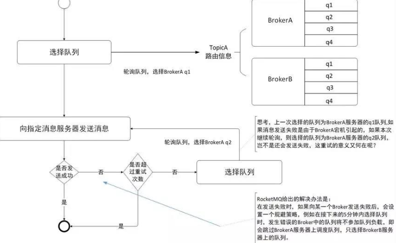


消息主从复制：
- 同步复制需要等到Slave完全写入才能返回成功，缺陷就是写入延迟
- 异步复制，只要Master写入成功，不用等到Slave写入成功就返回成功，风险就是Master宕机，那么数据丢失
同步复制和异步复制是通过Broker配置文件里的brokerRole参数进行设置的，这个参数可以被设置成ASYNC_MASTER、 SYNC_MASTER、SLAVE三个值中的一个。

实际应用中要结合业务场景，合理设置刷盘方式和主从复制方式， 尤其是SYNC_FLUSH方式，由于频繁地触发磁盘写动作，会明显降低性能。通常情况下，应该把Master和Slaver配置成ASYNC_FLUSH的刷盘方式，主从之间配置成SYNC_MASTER的复制方式，这样即使有一台机器出故障，仍然能保证数据不丢，是个不错的选择。


## 负载均衡

生产者的负载均衡：生产者发送消息到Topic关联的队列中，队列的顺序是采用轮询的方式，也就是消息一部分在queue0，下一部分在queue1上

消费者的负载均衡：
- 集群：消费组划分队列，每个消费者分得相同数量的队列，一个队列只允许一个消费者分配，防止重复消费
- 广播：消费者组中每个消费者都分得所有的消费队列


## 消息重试
顺序消息重试：消费失败不断的自动重试，应用会出现消息消费被阻塞的情况。因此，在使用顺序消息时，务必保证应用能够及时监控并处理消费失败的情况，避免阻塞现象的发生。

无序消息（普通、定时、延时、事务消息）的重试只针对集群消费方式生效；广播方式不提供失败重试特性，即消费失败后，失败消息不再重试，继续消费新的消息。
RocketMQ 默认允许每条消息最多重试 16 次，超过16次不再投递，重试发的消息id还是不会变的
- 下面操作都导致消费失败，默认重试
```java
public class MessageListenerImpl implements MessageListener {
    @Override
    public Action consume(Message message, ConsumeContext context) {
        //处理消息
        doConsumeMessage(message);
        //方式1：返回 Action.ReconsumeLater，消息将重试
        return Action.ReconsumeLater;
        //方式2：返回 null，消息将重试
        return null;
        //方式3：直接抛出异常， 消息将重试
        throw new RuntimeException("Consumer Message exceotion");
    }
}
```
- 消费失败，不重新发送消息配置：
```java
public class MessageListenerImpl implements MessageListener {
    @Override
    public Action consume(Message message, ConsumeContext context) {
        try {
            doConsumeMessage(message);
        } catch (Throwable e) {
            //捕获消费逻辑中的所有异常，并返回 Action.CommitMessage;
            return Action.CommitMessage;
        }
        //消息处理正常，直接返回 Action.CommitMessage;
        return Action.CommitMessage;
    }
}
```
- 自定义消费重试次数：
```java
rocketmq.consumer.max-retry-times=3
```
- 获取消费重试次数：
```java
public class MessageListenerImpl implements MessageListener {
    @Override
    public Action consume(Message message, ConsumeContext context) {
        //获取消息的重试次数
        System.out.println(message.getReconsumeTimes());
        return Action.CommitMessage;
    }
}
```


## 死信队列
存储无法被消费的消息的队列。

死信消息特性：
- 不会被正常消费
- 死信消息存3天，3天后删除

死信队列特性：
- 一个死信队列对应一个消费者组， 而不是对应单个消费者实例。
- 如果一个消费者组未产生死信消息，消息队列 RocketMQ 不会为其创建相应的死信队列。
+ 一个死信队列包含了对应消费者组产生的所有死信消息，不论该消息属于哪个 Topic。

示例：消费者故意抛出异常，默认重试16次，失败后发送给死信队列`%DLQ%my-consumer-group`
```java
@Component
@RocketMQMessageListener(
    topic = "normal-topic",
    consumerGroup = "my-consumer-group",
    selectorExpression = "*"
)
public class NormalMessageConsumer implements RocketMQListener<String> {
    @Override
    public void onMessage(String message) {
        // 模拟消费失败，抛出异常触发重试
        System.out.println("Received message: " + message);
        throw new RuntimeException("Simulated consumption failure for: " + message);
    }
}
```
监听死信队列，消费死信消息：
```java
@Component
@RocketMQMessageListener(
    topic = "%DLQ%my-consumer-group", // 订阅死信主题
    consumerGroup = "my-dlq-consumer-group",
    selectorExpression = "*"
)
public class DeadLetterQueueConsumer implements RocketMQListener<String> {
    @Override
    public void onMessage(String message) {
        System.out.println("Received dead letter message: " + message);
        // 记录日志、发送告警或手动处理
    }
}
```


## 消息幂等
消息的重复消费问题

在互联网应用中，尤其在网络不稳定的情况下，消息队列 RocketMQ 的消息有可能会出现重复，这个重复简单可以概括为以下情况：
+ 发送时消息重复当一条消息已被成功发送到服务端并完成持久化，此时出现了网络闪断或者客户端宕机，导致服务端对客户端应答失败。 如果此时生产者意识到消息发送失败并尝试再次发送消息，消费者后续会收到两条内容相同并且 Message ID 也相同的消息。
+ 投递时消息重复消息消费的场景下，消息已投递到消费者并完成业务处理，当客户端给服务端反馈应答的时候网络闪断。 为了保证消息至少被消费一次，消息队列 RocketMQ 的服务端将在网络恢复后再次尝试投递之前已被处理过的消息，消费者后续会收到两条内容相同并且 Message ID 也相同的消息。
+ 负载均衡时消息重复（包括但不限于网络抖动、Broker 重启以及订阅方应用重启）当消息队列 RocketMQ 的 Broker 或客户端重启、扩容或缩容时，会触发 Rebalance，此时消费者可能会收到重复消息。

因为 Message ID 有可能出现冲突（重复）的情况，所以真正安全的幂等处理，不建议以 Message ID 作为处理依据。 最好的方式是以业务唯一标识作为幂等处理的关键依据，而业务的唯一标识可以通过消息 Key 进行设置：
```java
Message message = new Message();
message.setKey("ORDERID_100");
SendResult sendResult = producer.send(message);
```
消费者根据消息的业务表示判断：
```java
consumer.subscribe("ons_test", "*", new MessageListener() {
    public Action consume(Message message, ConsumeContext context) {
        String key = message.getKey()
        // 根据业务唯一标识的 key 做幂等处理
    }
});
```


# 八股

来源1：[二哥Java的RocketMQ23道](https://javabetter.cn/sidebar/sanfene/rocketmq.html#_1-%E4%B8%BA%E4%BB%80%E4%B9%88%E8%A6%81%E4%BD%BF%E7%94%A8%E6%B6%88%E6%81%AF%E9%98%9F%E5%88%97%E5%91%A2)
来源2：[精选RocketMQ面试题33道](https://cloud.tencent.com/developer/article/1973687)
## 1. 为什么要使用消息队列？

消息队列常用于分布式系统中，提供服务解耦、异步处理、削峰填谷
1. 服务解耦：针对于一个耦合度比较高的系统，可以分为多个服务，使用消息队列中间的通信手段，降低服务的耦合度，生产者服务只需要负责发送消息，消费者服务只需要监听消息，这样就完成了解耦。
2. 异步处理：生产者将消息发送到消息队列中就响应成功，后续消费者只管从队列中取出消息，完成业务，提高系统的响应能力
3. 削峰填谷：降低系统的处理压力，如果系统请求量过大，将用户请求按照顺序发送到消息队列中，队列作为缓冲区，削减请求对后端的压力，消费者按照一定的速率消费消息并完成业务处理，达到效果
4. 分布式事务处理：发送端通过半消息机制可以保证本地事务和消息发送的一致性，消费端通过死信队列和消息重试机制保证消费消息事务的一致性。
5. 延迟消息：通过延迟队列执行延迟任务

## 2. 为什么选择RocketMQ？
根据项目和RocketMQ的特性回答：
我们系统主要面向客户端用户，有一定的并发量，对性能也有比较高的要求，所以选择了**低延迟、吞吐量**比较高，可用性比较好的 RocketMQ
`吞吐量是指系统在单位时间内处理或者传输的数据量`

## 3. RocketMQ优缺点
RocketMQ 优点：
- 单机吞吐量：十万级
- 可用性：非常高，分布式架构
- 消息可靠性：经过参数优化配置，消息可以做到 0 丢失
- 功能支持：MQ 功能较为完善，还是分布式的，扩展性好
- 支持 10 亿级别的消息堆积，不会因为堆积导致性能下降
- 源码是 Java，方便结合公司自己的业务二次开发
- 天生为金融互联网领域而生，对于可靠性要求很高的场景，尤其是电商里面的订单扣款，以及业务削峰，在大量交易涌入时，后端可能无法及时处理的情况
- **RoketMQ**在稳定性上可能更值得信赖，这些业务场景在阿里双 11 已经经历了多次市场考验，如果你的业务有上述并发场景，建议可以选择**RocketMQ**

RocketMQ 缺点：
- 支持的客户端语言不多，目前是 Java 及 c++，其中 c++不成熟
- 没有在 MQ 核心中去实现**JMS**等接口，有些系统要迁移需要修改大量代码

RocketMQ 是阿里巴巴开源的一款分布式消息中间件，具有高吞吐量、低延迟和高可用性。其主要组件包括生产者、消费者、Broker、Topic 和队列。消息由生产者发送到 Broker，再根据路由规则存储到队列中，消费者从队列中拉取消息进行处理。适用于异步解耦和流量削峰等场景。


## 4. 消息队列的消息模型
消息队列有两种模型：队列模型和发布/订阅模型

- 队列模型：
这是最初的一种消息队列模型，对应着消息队列“发-存-收”的模型。生产者往某个队列里面发送消息，一个队列可以存储多个生产者的消息，一个队列也可以有多个消费者，但是消费者之间是竞争关系，也就是说每条消息只能被一个消费者消费。
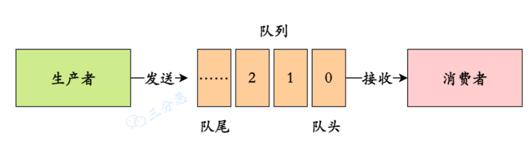
- 发布订阅模式
消息发送到主题中，只要是订阅到Topic的消费者都可以消费，消费者之间不再有竞争关系
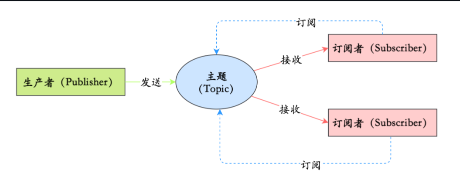

## 5. RocketMQ的消费模型
RocketMQ的消费模型基于发布/订阅模型，支持集群消费和广播消费，默认使用集群消费。

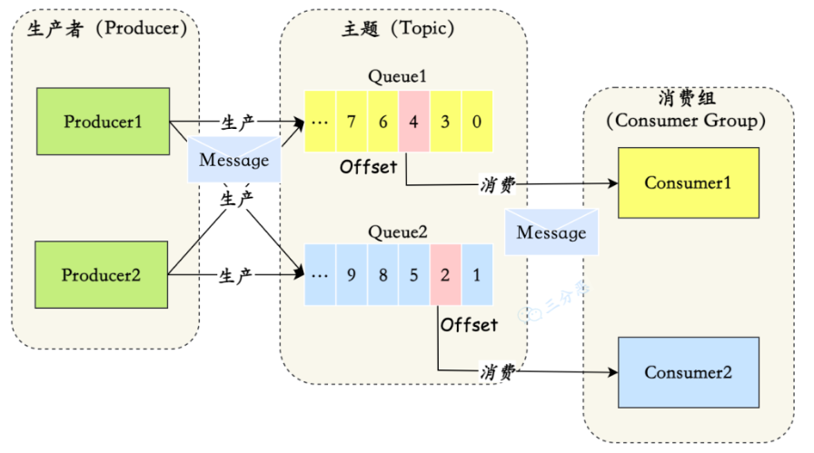
- Message：传输的消息
- Topic：一个Topic对应着多条消息，Topic相当于消息的分组
- Tag：标识不同类型的消息
- Group：消费者组的消费者如果是处于竞争关系，那么一条消息只允许一个消费者消费，组相当于对消费者的划分
- Message Queue：一个Topic可以有多个Message Queue进行存储
- Offset：记录消费组在Queue上的消费位置


## 6. 消息的消费模式？
消息的消费模式分为集群模式和广播模式
- 集群模式：消费组内的所有消费者共同消费同一个Topic，一个消息被消费不允许被其他消费者消费
- 广播模式：消费组内的所有消费者都可以消费订阅Topic中的所有消息，同一个消息多个消费者都可以消费


## 7. RocketMQ架构

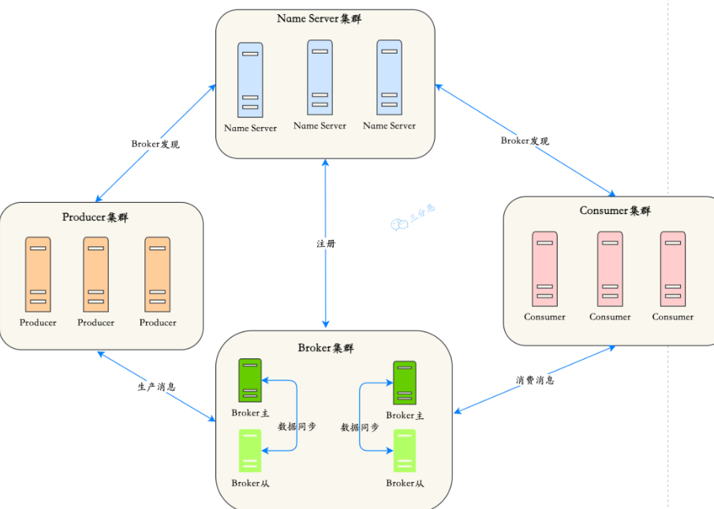
包含Name Server、Broker、Producer、Consumer，每个部分都可以用集群部署，流程包含发送消息、存储消息、推送消息/拉取消息


## 8. 介绍RocketMQ架构中的核心四部分

- Name Server主要作用是维护Topic和Broker之间的关系，并且管理Broker的状态，Broker需要定时发送心跳来告诉Name Server自己的运行状态。
- Broker作为消息存储的位置，有Master和Slave两种角色，Broker中有多个Queue，Queue存储消息的具体位置，Queue是个无限长的数组，使用offset标识消费位置
- Producer作为生产者，从Name Server获取Topic关联的Broker信息，将消息发送给这些Broker，Producer有三种发送消息模式，分别为同步发送（必须等待上一条消息发送成功才能继续发送）、异步发送（不需要等待上一个消息发放成功继续发送）、单向发送（不需要知道回调结果，直接发送立即返回成功）
- Consumer作为消费者，支持集群消费和广播消费，有推和拉两种消费模式，推表示Broker主动将消息发送给消费者消费，消费者只需要监听Topic对应的Broker；拉表示消费者主动从Topic对应的Broker中消费消息

## 9. 如何保证消息的可用性/可靠性/不丢失？

从整个工作流程中的三个阶段分别保证：
- 生产阶段：生产端因为网络的不稳定等原因可能会发生消息的丢失，通过请求确认机制，保证消息传递的可靠性
同步消息发送，发送成功才会返回，发送失败应该重新发送
异步消息发送，应该根据回调方法的可以重新发送
单向消息发送，无法知道消息发送的情况，只能根据查询日志的API，检查是否发送到Broker
- 存储阶段：存储阶段如果消息没有持久化磁盘，就发生了宕机，也会造成消息丢失。配置同步复制来保证可用性
只要消息持久化到了CommitLog日志中，即使Broker宕机，也可以保证未消费的消息可以再消费
Broker刷盘机制分为同步刷盘和异步刷盘，同步刷盘更可靠，等到数据持久化到磁盘才返回，异步刷盘保证消息存储到内存中就返回，后续持久化到磁盘的操作作为线程慢慢执行
Broker中Master和Slave有同步复制和异步复制。同步复制保证Slave能够有Master的备份，所以更可靠
- 消费阶段：保证消费在执行完消费逻辑再发送确认，而不是还没有消费完就发送确认，采取消息确认机制+消息重试+幂等性+死信补偿来解决
`消息确认机制是消息发送成功给Broker发送ack，如果未发送给Broker，Broker会知道消息未正确消费。`
`消息重试是Broker默认会对失败消息进行延迟重试`
`幂等性处理消息重复问题`
`死信补偿是将多次失败的消息放入死信队列中，可以监听死信队列再进行处理消息`
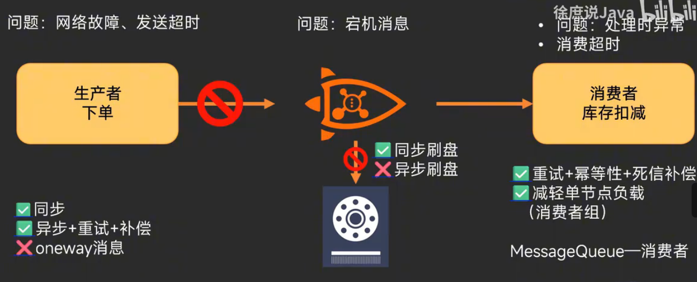
## 10. 如何处理消息重复问题？(消息幂等性)

幂等性是指一个操作可以执行多次而不会产生副作用，即无论执行多少次，结果都是相同的。可以在业务逻辑中加入检查逻辑，确保同一消息多次消费不会产生副作用。

1. 通过使用唯一业务字段
处理消息的幂等可以**通过业务字段来存储已经处理过的消息**，重复处理的时候通过判断消息id来鉴别是否已经处理过了，因为重复发送的消息具有相同的消息id。通过设置消息的key为唯一的业务标识，判断重复消息的业务标识是否已经处理过，来处理消息重复问题。可以使用Message ID，但是会存在重复问题，最安全的方式就是使用业务唯一id作为消息key。
还可以使用其他的业务字段（比如订单id等）来判断是否重复消费。
可以通过雪花算法生成唯一标识也可以处理幂等性。


2. 通过Redis+唯一的消息id
消息队列推送消息给消费者
- 如果消费者采取的是自动的ACK确认，那么消息消费失败，消息队列也不会重新发送消息过来
- 如果消费者采取的是手动的ACK，那么消息消费失败，消息队列会重新发送消息
所以需要消息重新推送就需要手动的ACK确认
如果消息的业务操作采用多线程，是无法知道在手动确认前，业务操作是否成功还是失败，但是Broker认为消费成功了
另外如果操作超时了，Broker也认为消费成功了，也无法保证消息的幂等性
解决消息幂等性的方式是使用Redis存储唯一的消息id，另外设置redis的超时时间要小于消费者消费时间，确保Redis能成功设置状态，另外设置Redis消费状态为消费中，只有等待业务完成之后设置为消费成功

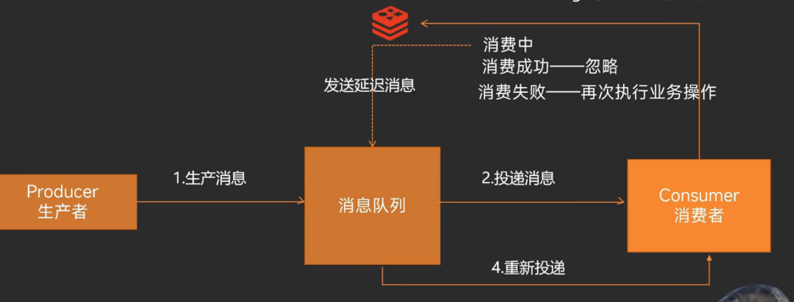


## 11. 如何处理消息积压？

消息积压就是消息大量出现在Broker的Queue上，等待被消费者消费，那么就需要快速的提高消费能力：
- 消费者扩容：如果Topic的Queue大于消费者数量，可以增加消费者数量提高消费能力
- 消费者能力优化：优化消费业务，比如慢SQL优化等等
- 消息迁移Queue扩容：如果Topic的Queue小于或者等于消费者数量，上面方法就不行，可以使用多个临时的Topic，Topic的queue尽可能的多，然后将堵塞的部分消息迁移到这个Topic上面，然后用尽可能多的消费者消费这个新的Topic，消费完成后，清理原始的Topic

## 12. 顺序消息如何实现？

顺序消息是指消息按照规定的消息顺序生产，规定的消息顺序消费

生产端的消息顺序性：可以根据分布式锁将并行转为串行发送，或者使用单一的消费者发送

消息队列的消息顺序性：根据局部顺序或者全局顺序
顺序消息分为：
- 局部顺序消息：可以按照业务逻辑，业务标识相同的消息发往同一个队列
- 全局顺序消息：全局保证消息按照生产者顺序消费，这种方式可以使用一个单独队列实现

消费端的消息顺序性：根据MessageListenerOrderly监听器保证并行转串行消费

## 13. 如何实现消息过滤

消息过滤的方式有三种：
- 根据Tag过滤：
```java
DefaultMQPushConsumer consumer = new DefaultMQPushConsumer("CID_EXAMPLE");
consumer.subscribe("TOPIC", "TAGA || TAGB || TAGC");
```
- 根据SQL过滤：
```java
DefaultMQPushConsumer consumer = new DefaultMQPushConsumer("please_rename_unique_group_name_4");
// 只有订阅的消息有这个属性a, a >=0 and a <= 3
consumer.subscribe("TopicTest", MessageSelector.bySql("a between 0 and 3");
consumer.registerMessageListener(new MessageListenerConcurrently() {
   @Override
   public ConsumeConcurrentlyStatus consumeMessage(List<MessageExt> msgs, ConsumeConcurrentlyContext context) {
       return ConsumeConcurrentlyStatus.CONSUME_SUCCESS;
   }
});
consumer.start();
```
- 根据Filter Server过滤，允许用户自定义函数

## 14. 延时消息

延时消息是指在未来的某个时间点要消费的消息，也就是未来的某个时间点要执行的操作
RocketMQ只需要设置延时级别：
```java
// 实例化一个生产者来产生延时消息
DefaultMQProducer producer = new DefaultMQProducer("ExampleProducerGroup");
// 启动生产者
producer.start();
int totalMessagesToSend = 100;
for (int i = 0; i < totalMessagesToSend; i++) {
    Message message = new Message("TestTopic", ("Hello scheduled message " + i).getBytes());
    // 设置延时等级3,这个消息将在10s之后发送(现在只支持固定的几个时间,详看delayTimeLevel)
    message.setDelayTimeLevel(3);
    // 发送消息
    producer.send(message);
}
```
延时级别有十六种：
```java
private String messageDelayLevel = "1s 5s 10s 30s 1m 2m 3m 4m 5m 6m 7m 8m 9m 10m 20m 30m 1h 2h";
```

延时消息的实现：
Broker 收到延时消息了，会先发送到主题（SCHEDULE_TOPIC_XXXX）的相应时间段的 Message Queue 中，然后通过一个定时任务轮询这些队列，到期后，把消息投递到目标 Topic 的队列中，然后消费者就可以正常消费这些消息。


## 15. 如何实现分布式消息事务？半消息？

依赖半消息，可以实现分布式消息事务：
`半消息是指生产者发送给Broker的消息，但是这个消息还不能被消费，需要等待生产者本地事务确认完成，才能表示半消息允许被消费。`
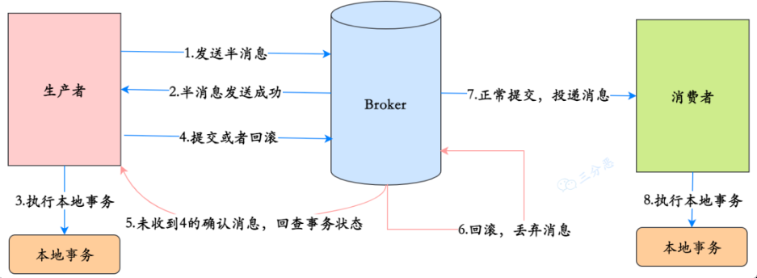
- 1、Producer 向 broker 发送半消息
- 2、Producer 端收到响应，消息发送成功，此时消息是半消息，标记为 “不可投递” 状态，Consumer 消费不了。
- 3、Producer 端执行本地事务。
- 4、正常情况本地事务执行完成，Producer 向 Broker 发送 Commit/Rollback，如果是 Commit，Broker 端将半消息标记为正常消息，Consumer 可以消费，如果是 Rollback，Broker 丢弃此消息。
- 5、异常情况，Broker 端迟迟等不到二次确认。在一定时间后，会查询所有的半消息，然后到 Producer 端查询半消息的执行情况。
- 6、Producer 端查询本地事务的状态
- 7、根据事务的状态提交 commit/rollback 到 broker 端。（5，6，7 是消息回查）
- 8、消费者段消费到消息之后，执行本地事务。


## 16. 死信队列
死信队列用于存储那些无法被正常处理的消息，这些消息被称为死信（Dead Letter）。

产生死信的主要原因是，消费者在处理消息时发生异常，且达到了最大重试次数。
当进入死信队列后，消费者可以监听死信队列，消费死信消息；
如果暂时无法处理，为避免到期后死信消息被删除，可以先将死信消息导出并进行保存。


## 17. 如何保证RocketMQ的高可用？

提高Name Server集群部署可用

Broker配置集群和主从模式。

消费端，如果Master Broker宕机，会自动切换Master到Slave进行消费
生产端，可以将相同BrokerId组成Broker组，发送消息，只要Broker组中其他Broker没有宕机，那么就可以保证消息发送成功。

## 18. RocketMQ的工作流程？

RocketMQ的四大角色分别是Name Server、Broker、Producer、Consumer
1. Broker注册信息到Name Server中，Name Server维护Topic和Broker的关系
2. Producer发送消息，根据负载均衡算法从Name Server，选择Broker投放消息
3. Consumer消费消息，从Name Server中获取Topic对应的Broker，从Broker中消费消息

## 19. 为什么RocketMQ不使用ZooKeeper作为注册中心？
1. 基于可用性的考虑，根据 CAP 理论，同时最多只能满足两个点，而 Zookeeper 满足的是 CP，也就是说 Zookeeper 并不能保证服务的可用性，Zookeeper 在进行选举的时候，整个选举的时间太长，期间整个集群都处于不可用的状态，而这对于一个注册中心来说肯定是不能接受的，作为服务发现来说就应该是为可用性而设计。
2. 基于性能的考虑，NameServer 本身的实现非常轻量，而且可以通过增加机器的方式水平扩展，增加集群的抗压能力，而 Zookeeper 的写是不可扩展的，Zookeeper 要解决这个问题只能通过划分领域，划分多个 Zookeeper 集群来解决，首先操作起来太复杂，其次这样还是又违反了 CAP 中的 A 的设计，导致服务之间是不连通的。
3. 持久化的机制的问题，ZooKeeper 的 ZAB 协议对每一个写请求，会在每个 ZooKeeper 节点上保持写一个事务日志，同时再加上定期的将内存数据镜像（Snapshot）到磁盘来保证数据的一致性和持久性，而对于一个简单的服务发现的场景来说，这其实没有太大的必要，这个实现方案太重了。而且本身存储的数据应该是高度定制化的。
4. 消息发送应该弱依赖注册中心，而 RocketMQ 的设计理念也正是基于此，生产者在第一次发送消息的时候从 NameServer 获取到 Broker 地址后缓存到本地，如果 NameServer 整个集群不可用，短时间内对于生产者和消费者并不会产生太大影响。

## 20. RocketMQ如何保存数据？

数据持久化通过CommitLog文件、ConsumerQueue文件、IndexFile文件实现。
- CommitLog存储 Producer 端顺序写入的消息主体内容，只要写入成功，就代表持久化成功。消息以二进制格式存储，包含消息内容、元数据（如 Topic、Queue ID、时间戳等）和校验信息。
- ConsumerQueue文件记录队列上待消费消息在CommitLog中的索引
- IndexFile（索引文件，可选的）提供了一种可以通过 消息key 或时间范围来快速查询消息的方法。

## 21. RocketMQ怎么对文件进行读写？
RocketMQ 对文件的读写巧妙地利用了操作系统的一些高效文件读写方式——`PageCache`、`顺序读写：RocketMQ 的 CommitLog 采用顺序写入方式，最大化磁盘 I/O 效率。`、`零拷贝:RocketMQ 在消息传输时使用零拷贝技术（如 mmap 或 sendfile），减少数据在内核态和用户态之间的拷贝。`。


完整回答：
`RocketMQ 通过 顺序读写、PageCache 和 零拷贝 等技术高效地对文件进行读写。消息首先顺序追加写入 CommitLog 文件（通过 mmap 映射到内存，写入 PageCache），支持同步刷盘（立即落盘）和异步刷盘（定期落盘）以平衡可靠性和性能。同时，Broker 更新 ConsumerQueue 文件，记录消息在 CommitLog 的偏移量，同样通过 mmap 和 PageCache 实现高效写入。消费者通过 ConsumerQueue 定位消息偏移量，从 CommitLog 读取消息内容，利用零拷贝技术（如 sendfile）直接传输数据，减少拷贝开销。RocketMQ 还支持批量读写、文件预分配和多副本机制，进一步提升性能和可靠性。`
## 22. 消息刷盘如何实现？

RocketMQ 提供了两种刷盘策略：同步刷盘和异步刷盘
- 同步刷盘：在消息达到 Broker 的内存之后，必须刷到 commitLog 日志文件中才算成功，然后响应Producer 发送成功。
- 异步刷盘：异步刷盘是指消息达到 Broker 内存后就返回 Producer 数据已经发送成功，会唤醒一个线程去将数据持久化到 CommitLog 日志文件中。


## 23. RocketMQ的负载均衡？

生产者的负载均衡是经历队列的轮询，按照Broker中队列的顺序，依次存储生产消息

消费者的负载均衡是区分消费者组，如果一个组中集群消费所有消息，那么每个队列分得一个消息，消费者存在竞争关系

## 24. 消息的长轮询？
长轮询是一种消息拉取方式，消费者向 Broker 发起拉取消息的请求，如果 Broker 当前没有可消费的消息，连接不会立即返回，而是保持挂起（Hold）一段时间，等待新消息到达。一旦有新消息或等待超时，Broker 才会返回响应。
短轮询不管有没有消息都直接返回

RocketMQ 默认使用长轮询作为消费者拉取消息的机制，结合推模式（Push Mode）对外呈现

在 Spring Boot 整合 RocketMQ 中，长轮询通常由 @RocketMQMessageListener 自动处理，消费者无需显式配置长轮询逻辑。
```java

@Component
@RocketMQMessageListener(
    topic = "normal-topic",
    consumerGroup = "my-consumer-group",
    selectorExpression = "*"
)

```

如果需要显式控制长轮询，可以使用 DefaultMQPullConsumer 手动拉取消息。
```java

public class PullConsumer {
    public static void main(String[] args) throws Exception {
        DefaultMQPullConsumer consumer = new DefaultMQPullConsumer("my-consumer-group");
        consumer.setNamesrvAddr("localhost:9876");
        consumer.start();

        // 获取消息队列
        Set<MessageQueue> queues = consumer.fetchSubscribeMessageQueues("normal-topic");
        for (MessageQueue queue : queues) {
            // 拉取消息（长轮询）15000设置长轮询时间
            PullResult pullResult = consumer.pull(queue, "*", consumer.fetchMessageQueuesOffset(queue, false), 32, 15000);
            System.out.println("Pulled messages: " + pullResult.getMsgFoundList());
            // 更新偏移量
            consumer.updateConsumeOffset(queue, pullResult.getNextBeginOffset());
        }

        consumer.shutdown();
    }
}
```


## 如果自己设计一个消息队列，应该如何设计

针对Name Server、Broker、生产者、消费者四大部分进行设计


