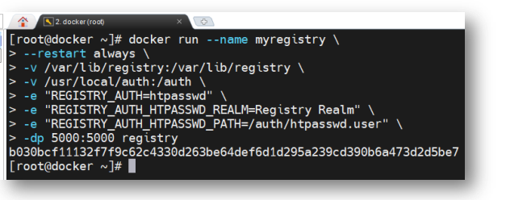
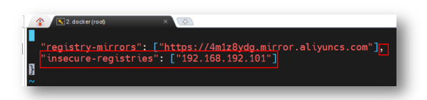

# Docker

# Docker概述


## Docker基础知识
先解释DevOps是什么意思？

**DevOps 是一系列**`**实践**`**、**`**工具**`**和一个融合开发及 IT 团队的**`**文化理念**`**。DevOps 强调赋能团队、跨团队沟通与协作以及技术自动化**。DevOps 模式下开发和运维不再是独立的“筒仓”，而是几乎被整合成一个团队，这个团队的工程师技术栈会覆盖开发、测试、运维等。同时 DevOps 团队会利用一系列的 DevOps 工具链来实现诸如**持续集成、持续发布、流程自动化、高效协作等等**目的。


**Docker** 是一个开源的应用容器 Container 引擎， 其可以让开发者将应用及应用运行的环境打包到一个轻量级、可移植的镜像中，然后发布到任何流行的 Linux、Windows 机器上。

Docker 原本是由一个 PaaS 提供商 dotCloud 公司的创始人 Solomon Hykes 发起的一个内部项目，是基于其多年云服务技术的一次革新，使用 Go 语言开发。2013 年 3 月开源，并在 GitHub 上进行维护。后由于 Docker 项目的火爆，2013 年底，dotCloud 公司更名为 Docker，

Docker官网：[https://www.docker.com/](https://www.docker.com/)

云计算中的服务包括三个层次：IaaS、PaaS、SaaS。代表着不同的服务模型，应用于不同的服务场景。

+ IaaS：基础设施即服务，云计算的服务商提供资源，比如服务器、虚拟机等，用户可以直接使用云计算提供的资源来构建软件环境然后开发
+ PaaS：平台即服务，在IaaS上面一层提供了一层平台，用户只需要在上面开发软件就行了，关于一些软件、资源这些，该层都给你提供好了，用户可以直接开发
+ Saas：软件即服务，直接提供功能给用户，用户只需要订阅，就可以使用服务


**容器和虚拟机的区别：**

传统的虚拟技术是在物理机的操作系统之上安装一个虚拟机管理程序，例如 VMware、VirtualBox 等。在其管理下可以创建很多个虚拟机。每个虚拟机需要安装自己独立的操作系统，而应用就是安装在虚拟机操作系统之上的程序，应用程序通过调用各种命令或库函数来使用其需要的各种系统资源。

对于完全相同的两个应用，其若需要运行在两个虚拟机中，则就需要两套完全相同的虚拟机操作系统与bins/libs，存在大量的资源占用冗余。形成资源浪费。

Docker 容器运行在 Docker 引擎之上，所有 Docker 容器共享同一个 Docker 引擎，但它们的运行又是相互隔离、互不干扰的。由于 Docker 容器不需要进行虚拟硬件及操作系统，而是共享的宿主机的硬件与操作系统，所以 Docker 容器对系统资源的占用很少，其仅包含运行时必须的一些资源。所有 Docker 容器对于系统资源的使用都是由 Docker 引擎统一进行管理，所以对系统资源的利用率很高。无论是应用执行速度、内存损耗或者文件存储速度，都要比传统虚拟机技术更高效。


## Docker系统架构
**Docker Daemon**，即 Dockerd，Docker 守护进程，其监听着 Docker API 请求并管理 Docker对象，例如镜像、容器、网络和卷。守护进程还可以与其他守护进程通信以管理 Docker 服务。

**Docker 镜像**是用于创建 Docker 容器的模板。

**Docker 容器**是镜像运行时的实体。每个处于运行状态的容器中都包含着一个或多个相关的应用，且它的运行不会干扰到其它容器。因为它们之间是相互隔离的。

**Docker 镜像仓库**用来保存相关的一组镜像，这组镜像具有相同的镜像名称，都与镜像仓库名称相同。仓库根据其中的镜像是否可以被公开共享，可以分为公开库与私有库。

**Docker 的镜像中心**中存放着很多由官方、其他机构或个人创建的 Docker 仓库，Docker用户可以直接从这些仓库中 pull 需要的镜像，也可以将自己制作的镜像 push 到 Docker 镜像中心相应的仓库中。最常用的镜像中心是Docker官方的Docker Hub（[https://hub.docker.com）](https://hub.docker.com）)


# Docker引擎
**Docker 引擎是用来运行和管理容器的核心软件，其现代架构由四部分主要组件构成：Docker Client，Dockerd、Containerd 与 Runc。**

+ Docker Client：Docker 客户端，Docker 引擎提供的 CLI 工具，用于用户向 Docker 提交命令请求。
+ Dockerd：Dockerd，即 Docker Daemon。在现代 Dockerd 中的主要包含的功能有镜像构建、镜像管理、REST API、核心网络及编排等。其通过 gRPC 与 Containerd 进行通信。
+ Containerd：Containerd，即 Container Daemon，该项目的主要功能是管理容器的生命周期。
+ Runc：Runc 只有一个作用就是创建容器，其本质是一个独立的容器运行时 CLI 工具。其在 fork出一个容器子进程后会启动该容器进程。在容器进程启动完毕后，Runc 会自动退出。
+ Shim：Shim（垫片）是实现“Daemonless Container（无 Docker Daemon 与 Container Daemon容器）”不可或缺的工具，使容器与 Docker Daemon 解耦，使得 Docker Daemon 的维护与升级不会影响到运行中的容器。


## Docker引擎的分类
Docker引擎分为大版本和小版本。

大版本分为三类：Moby、**社区版 Docker-CE**（Community Edition）和企业版 Docker-EE（Enterprise Edition）。

小版本：从 v1.13.1 之后，Docker 的发布计划发生了变更，每个大版本下都出现了两个小版本 Edge 月版与 Stable 季版。不过，现在的官网中一般只能看到 Stable 版本。

## Docker引擎的安装
Docker 可以安装在 Windows、Linux、Mac 等系统中，但生产环境下，服务器使用 Linux中的 CentOS 居多，所以下面就以 Docker 在 CentOS7 中的安装为例来学习 Docker 的安装。

下面使用rpm存储库的方式安装。下面命令CentOS7及以下使用yum代替dnf

官网 [https://docs.docker.com/engine/install/centos/](https://docs.docker.com/engine/install/centos/)

1. 检查是否安装docker：

```properties
rpm -qa | grep docker
```

2. 在安装Docker Engine之前，您需要卸载任何冲突的软件包。卸载Docker时，存储在`/var/lib/docker/`中的镜像、容器、卷和网络不会自动删除。

```properties
sudo yum remove docker \
                  docker-client \
                  docker-client-latest \
                  docker-common \
                  docker-latest \
                  docker-latest-logrotate \
                  docker-logrotate \
                  docker-engine
```

3. 设置Docker存储库，之后可以从存储库中安装或者更新Docker
4. 设置存储库：

```properties
sudo yum -y install dnf-plugins-core
sudo yum config-manager --add-repo https://download.docker.com/linux/centos/docker-ce.repo

yum config-manager 是一个独立的工具，属于 yum-utils 包。它不是 yum 的内置功能，需要额外安装。
在 CentOS 7 上，如果你没有安装 yum-utils，就会出现这个错误。
  
# 先安装 yum-utils
sudo yum install -y yum-utils
# 添加 Docker CE 仓库
sudo yum-config-manager --add-repo https://download.docker.com/linux/centos/docker-ce.repo
这个命令可能因为网络问题多次失败，多试几次
```

4. 安装新版本的docker引擎：

```properties
sudo yum install docker-ce docker-ce-cli containerd.io docker-buildx-plugin docker-compose-plugin
```

5. 设置自启动或者启动docker：

```properties
sudo systemctl enable --now docker

sudo systemctl start docker
```

6. 通过运行Hellowold来判断是否成功：打印一条确认消息并退出

```properties
sudo docker run hello-world
```


**问题yum无法下载：centos7需要更新yum源：**
```shell
sudo mv /etc/yum.repos.d/CentOS-Base.repo /etc/yum.repos.d/CentOS-Base.repo.bak

sudo wget -O /etc/yum.repos.d/CentOS-Base.repo http://mirrors.aliyun.com/repo/Centos-7.repo

sudo yum clean all
sudo yum makecache

yum repolist
```
## Docker引擎的启停
启动：systemctl start docker

测试是否成功：

1. docker version
2. 运行hello-world镜像   docker run hello-world

重启：systemctl restart docker

查看状态：systemctl status docker 

开机自启：systemctl enable docker

停止：systemctl stop docker

关闭开机自启：systemctl disable docker

## 配置国内加速器
国内镜像中心常用的为阿里云与网易云。在本地 Docker 中指定要使用的国内加速器地址后，就可以直接从国内镜像中心下载镜像了。

根据阿里云提供的镜像配置：[https://cr.console.aliyun.com/cn-hangzhou/instances/mirrors](https://cr.console.aliyun.com/cn-hangzhou/instances/mirrors)

```properties
sudo mkdir -p /etc/docker
sudo tee /etc/docker/daemon.json <<-'EOF'
{
  "registry-mirrors": ["https://aiewziuh.mirror.aliyuncs.com"]
}
EOF
sudo systemctl daemon-reload
sudo systemctl restart docker
```

推荐的几个加速器地址：

```properties
{
  "registry-mirrors": [
        "https://aiewziuh.mirror.aliyuncs.com",
        "https://docker.1ms.run",
        "https://docker.xuanyuan.me",
        "https://registry.docker-cn.com",
        "https://docker.mirrors.ustc.edu.cn",
        "https://docker-0.unsee.tech",
        "https://docker-cf.registry.cyou",
        "https://docker.1panel.live"
  ],
  "insecure-registries": ["192.168.101.130:5000"]
}
```

## Docker引擎卸载（可以查看安装之前的步骤）
1. yum移除：yum remove docker-ce docker-ce-cli containerd.io docker-compose-plugin
2. 通过 rm –rf 删除/var/lib 下的 docker 与 containerd 两个目录。这两个目录中存放着镜像、容器、数据卷，它们在前面删除时不能被自动删除，需要手动删除。
3. 还有一些自己编辑、定义的配置文件，需要自己手工删除

# Docker镜像
镜像是一种轻量级、可执行的独立软件包。镜像中包含应用软件及应用软件的运行环境。具体来说镜像包含运行某个软件所需的所有内容，包括代码、库、环境变量和配置文件等。几乎所有应用，直接打包为 Docker 镜像后就可以运行。

由于镜像的运行时是容器，容器的设计初衷就是快速和小巧，所以镜像通常都比较小，镜像中不包含内核，其共享宿主机的内核；镜像中只包含简单的 Shell，或没有 Shell。

镜像分类：

1. Docker 官方镜像仓库。官方镜像仓库的名称一般直接为该类软件的名称。
2. 已验证发布者仓库。非官方镜像仓库名称一般由发布者用户名与软件名称两部分构成。
3. 由 Docker 公司赞助开发的镜像仓库。
4. 没有以上任何标识的仓库。

## 镜像相关命令
```properties
拉取镜像： docker pull xxx
简化日志输出： docker pull -q xxx
通过digest(镜像内容的hash值)拉取镜像：docker pull @xxx
查看镜像：docker images
查看镜像完整的id：docker images --no-trunc
查看镜像的digest信息：docker images --digests
查看本地镜像的imageid: docker images -q
搜索镜像：docker search xxxx
删除镜像：docker rmi xxxx
对于已经运行了容器的镜像是不能删除的，必须要先停止并删除了相关容器然后才能删除其对应的镜像。不过，也可以通过添加-f 选项进行强制删除。

删除所有的镜像：docker rmi $(docker images -q)

导出镜像（可以一次到处多个镜像）：docker save -o [存储的位置，例如: my.tar] [镜像1] [镜像2]
导入进项：docker load -i [类似上面的tar包] 
```

## 镜像分层
**Docker 镜像由一些松耦合的只读镜像层组成，Docker Daemon 负责堆叠这些镜像层，并将它们关联为一个统一的整体，即对外表现出的是一个独立的对象。**

通过 docker pull 命令拉取指定的镜像时，每个 Pull complete 结尾的行就代表下载完毕了一个镜像层。

每个镜像层由两部分构成：**镜像文件系统与镜像 json 文件**。这两部分具有相同的 ImageID。镜像文件系统就是对镜像占有的磁盘空间进行管理的文件系统，拥有该镜像所有镜像层的数据内容。而镜像 json 文件则是用于描述镜像的相关属性的集合，通过 **docker inspect [镜像]**可以直观的看到。

## 镜像摘要
每个镜像都有一个长度为 64 位的 16 进制字符串作为其摘要 digest。

摘要，即 digest，是镜像内容的一个 Hash 值，即所谓的 Content Hash（内容散列）。只要镜像内容发生了变更，其内容散列值就一定会发生改变。也就是说，一个镜像一旦创建完毕，其 digest 就不会发生改变了，因为镜像是只读的。

通过 **docker inspect 命令可以查看指定镜像的详细信息。其中就包含该镜像的摘要信息。RepoDigests**

通过 docker images --digests 命令也可以查看到镜像的摘要信息

**摘要的主要作用是区分相同:的不同镜像。**

# Docker容器
Docker run可以运行一个容器，首先会到本地去找对应的镜像，如果本地不存在，会在docker hub去找对应的镜像。

## 容器的创建与启动命令
交互模式启动，以ubuntu镜像举例：

```properties
docker run --name myubuntu -it ubuntu:lastest /bin/bash
# 命令解释
docker run 	启动容器
--name xxx	指定启动容器的名字
-it	使用交换模式启动，并且给容器分配一个伪终端
ubuntu:lastest		镜像的版本
/bin/bash	于指定容器启动后需要运行的命令为/bin 下的 bash 命令，而该命令会启动一个 bash 终端
```

以交互模式运行tomcat：（-it）

```properties
docker run --name mytomcat8 -it	tomcat:8.5.32 /bin/bash		#这种方式可以输入命令
docker run --name mytomcat8081 -it -p 8081:8080 tomcat:8.5.32		#这种方式就直接启动tomcat，界面停止在终端
# 命令解释
-p 用于指定端口映射，格式：暴露给宿主机的端口:容器中应用的端口
```

以分离的模式运行tomcat：（-d）

```properties
docker run --name mytomcat01 -dp 8081:8080 tomcat:8.5.32
docker run --name mytomcat02 -dp 8082:8080 tomcat:8.5.32
docker run --name mytomcat03 -dp 8083:8080 tomcat:8.5.32
# 命令解释
-d表示以分离模式（detached mode）运行容器，即命令在后台运行，命令的运行与宿主机的运行分离开来

为什么使用端口映射？
为了使相同的客户端主机可以访问同一宿主机上相同端口号的不同容器
```

查看容器：

```properties
docker ps可以看到已经运行的容器，状态是up的容器
docker ps -a 可以已经启动的容器，包括失败的

docker ps -q # 查看所有与运行容器的id
docker ps -qa # 查看所有已经创建容器的id
```

创建容器不启动：

```properties
docker create	创建容器但是不启动
docker create --name mytomcat04 -p 8083:8080 tomcat:8.5.32
```

容器内命令：

```properties
# 退出容器指的是在交互方式下退出容器
1. exit		退出并且停止容器
2. ctrl + p + Q	退出但是不停止容器
```

容器启动日志查看命令：

```properties
docker top tomcat8	# 容器内进程的查看
docker logs tomcat8	# 查看指定容器中应用的运行日志
# 日志内容由 docker run 命令的[command]决定（如果没有则由 Dockerfile 中的 CMD指令决定）。
docker logs -t tomcat8	# 添加时间戳，可以看到日志产生的时间

docker logs -f xxx
```

操作容器命令：

```properties
docker start mytomcat8(或者是容器id)		#启动已经停止的容器
docker restart mytomcat8(或者是容器id)	#重启正在运行的容器
docker stop mytomcat8(或者是容器id)  	#优雅的停止容器，会等其他进程访问完
docker kill mytomcat8(或者是容器id)		# 强制停止
docker kill $(docker ps -qa)			#停止所有的容器
docker pause mytomcat8(或者是容器id)		# 暂停容器，暂时不提供服务
docker unpause mytomcat8(或者是容器id)		# 恢复容器

docker rm 容器
#删除容器，必须是停止的
docker rm -f 容器
#强制删除容器
```

容器文件操作：

```properties
docker cp mytomcat8:/usr/local/tomcat/webapps ./
docker cp  ./ mytomcat8:/usr/local/`/webapps
#docker cp 命令可以完成容器与宿主机中文件/目录的相互复制
```

docker run的所有参数：

```java
1. 基本参数
    -d 或 --detach: 后台运行容器（detached 模式）。
    
    --name: 为容器指定一个名称。
    
    -it: 以交互模式运行容器，通常与 -t 一起使用，分配一个伪终端。
    
    --rm: 容器退出后自动删除容器。

2. 网络配置
    -p 或 --publish: 将容器的端口映射到主机的端口，格式为 主机端口:容器端口。
    
    --network: 指定容器使用的网络模式（如 bridge, host, none 等）。
    
    --dns: 指定 DNS 服务器。
3. 资源限制：
    -m 或 --memory: 限制容器使用的内存。
    
    --cpus: 限制容器使用的 CPU 数量。
    
    --cpu-shares: 设置 CPU 份额（相对权重）。

4. 卷和文件系统
    -v 或 --volume: 挂载主机目录或卷到容器中，格式为 主机路径:容器路径。
    
    --mount: 更灵活的挂载方式，支持更多选项。
    
    --tmpfs: 挂载一个临时文件系统到容器中。

5. 环境变量
    -e 或 --env: 设置环境变量，格式为 KEY=VALUE。
    
    --env-file: 从文件中读取环境变量。

6. 容器配置
    --entrypoint: 覆盖容器的默认入口点。
    
    --user: 指定运行容器的用户。
    
    --workdir: 设置容器的工作目录。
    
    --restart: 设置容器的重启策略（如 no, on-failure, always 等）。

7. 日志和输出
    --log-driver: 指定日志驱动（如 json-file, syslog 等）。
    
    --log-opt: 设置日志驱动的选项。
    
    --attach: 附加到容器的标准输入、输出或错误流。

8. 安全配置
    --cap-add: 添加 Linux 能力。
    
    --cap-drop: 删除 Linux 能力。
    
    --security-opt: 设置安全选项

9. 其他常用参数
    --help: 显示帮助信息。
    
    --version: 显示 Docker 版本信息。


实例：docker run -d --name mycontainer -p 8080:80 -v /my/data:/app/data -e MY_ENV=value myimage
这个命令会：
在后台运行一个名为 mycontainer 的容器。
将主机的 8080 端口映射到容器的 80 端口。
将主机的 /my/data 目录挂载到容器的 /app/data 目录。
设置环境变量 MY_ENV 的值为 value。
使用镜像 myimage 来创建容器。
```

  
  


## 提交容器为镜像命令
保存某一个阶段的容器为镜像，这样下次可以直接启动镜像。

```properties
docker commit [CONTAINER_ID 或 NAME] [新镜像名称]:[标签]
启动：
docker run -d --name my-new-container my-custom-image:latest
```

## 导入导出容器命令
```properties
docker export -o tomcat8.tar tomcat
# 将tomcat容器导出为当前目录的tomcat8.tar
docker import tomcat8.tar mytomcat:1.0
# 通过当前目录的tomcat8.tar包生成mytomcat:1.0镜像
```

## System系统指令
```properties
docker system df 		#用于查看 docker 各部分占用情况。
docker system events	#查看docker发生过的事件
docker system info
docker system prune		#删除 docker 中的无用数据，这些无用数据包含已经停止的容器、没有任何连接容器的网络、悬空镜像，及悬空镜像的构建缓存。
```

# DockerFile
Dockerfile 是用于构建 Docker 镜像的脚本文件，由一系列指令构成。通过 docker build命令构建镜像时，Dockerfile 中的指令会由上到下依次执行，每条指令都将会构建出一个镜像。这就是镜像的分层。因此，指令越多，层次就越多，创建的镜像就越多，效率就越低。

所以在定义 Dockerfile 时，能在一个指令完成的动作就不要分为两条。

## 指令简介
`Dockerfile` 中常用的指令及其含义：

```java
1. 基础指令
    FROM: 指定基础镜像。所有 Dockerfile 都必须以 FROM 开头，用于指定构建新镜像所基于的镜像。 
    LABEL: 为镜像添加元数据（键值对），例如作者、版本等信息。
       
2. 构建指令
    RUN: 在镜像构建过程中执行命令。通常用于安装软件包或运行脚本。
    COPY: 将文件或目录从主机复制到镜像中。
    ADD: 类似于 COPY，但功能更强大，支持自动解压 tar 文件和从 URL 下载文件。
    WORKDIR: 设置工作目录。后续的 RUN、CMD、ENTRYPOINT 等指令都会在这个目录下执行。
    ENV: 设置环境变量。这些变量可以在容器运行时使用。
    ARG: 定义构建时的变量。与 ENV 不同，ARG 只在构建过程中有效，不会在容器运行时保留。

3. 运行时指令
    CMD: 指定容器启动时默认执行的命令。一个 Dockerfile 中只能有一个 CMD，如果有多个，只有最后一个生效。
    ENTRYPOINT: 指定容器启动时的主要命令。与 CMD 不同的是，ENTRYPOINT 的参数不会被覆盖，而是作为固定命令。
    EXPOSE: 声明容器运行时监听的端口。这只是一个声明，实际映射端口需要在 docker run 时通过 -p 参数指定。
        
4. 用户与权限、挂载文件
    USER: 指定运行容器时的用户。可以是用户名或 UID。
    VOLUME: 创建一个挂载点，用于持久化数据或与主机共享数据。
   
5. 其他指令
    ONBUILD: 定义一个触发器，当该镜像被用作其他镜像的基础镜像时，触发器中的指令会被执行。
    HEALTHCHECK: 定义容器的健康检查命令，用于检测容器是否正常运行。
    SHELL: 指定 RUN、CMD 和 ENTRYPOINT 使用的默认 shell。

6. 多阶段构建
    FROM ... AS <stage>: 用于多阶段构建，允许在一个 Dockerfile 中使用多个 FROM 指令，每个阶段可以独立构建。
    
7. 注释
    #: 用于添加注释，注释内容不会被执行。

示例：
    # 基础镜像
    FROM ubuntu:20.04
    # 设置元数据
    LABEL maintainer="yourname@example.com"
    # 安装依赖，运行命令
    RUN apt-get update && apt-get install -y curl
    # 设置工作目录
    WORKDIR /app
    # 复制文件
    COPY . .
    # 设置环境变量
    ENV MY_ENV=value
    # 暴露端口
    EXPOSE 80
    # 启动命令
    CMD ["python", "app.py"]
```

## 应用发布
开发出的应用程序如何通过 Dockerfile 部署到 Docker 容器中？下面就通过将一个 Spring Boot 应用部署到 Docker 为例来说明这个部署过程。（每个项目所需的环境不一样）

1. 新建一个springboot项目，可以正常访问的项目
2. pom文件中必须制定打包方式为jar
3. 打包成功发送给服务器
4. 在jar包所在目录新建Dockerfile文件，输入内容：

```dockerfile
FROM openjdk:8u102				# 从基础镜像开始，jdk
MAINTAINER zhangsan zs@163.com			# 指定镜像的维护者和联系方式（已经过时）
LABEL version="1.0" description="my own app"		# 镜像的元数据标签，包括版本号和描述
COPY hello-docker-0.0.1-SNAPSHOT.jar hd.jar		#将当前目录的.jar文件拷贝到容器中，并且命令改了
ENTRYPOINT ["java", "-jar", "hd.jar"]			#这是容器启动时默认是执行的命令
EXPOSE 9000								# 容器运行时会监听的端口，外部网络可以请求这个接口来访问
```

5. 创建镜像

```dockerfile
docker build -t docker-hello:1.0 .
```

6. 创建容器

```dockerfile
docker run --name dh	--dp 9000:8080	hello-docker:1.0
```

7. 访问测试，访问9000接口


镜像的生成过程：大量应用镜像间的父子关系，将下层镜像作为父镜像，作为上层镜像的输入。

**build Cache：通过 Dockerfile 构建镜像时，当发现即将新构建出的镜像(层)与本地已存在的某镜像(层)重复时，默认会复用已存在镜像(层)而不是重新构建新的镜像(层)，这种机制称为 docker build cache 机制。**该机制不仅加快了镜像的构建过程，同时也大量节省了Docker 宿主机的空间。

**build cache失效：**

1. 如果Dockerfile中某一个命令失效了，那么从这个命令的所有的镜像层全部失效
2. ADD或者COPY变化，该命令的后面所有镜像层失效
3. RUN指令的外部源发生变化，之后的所有镜像层失效
4. 指定不使用build cache ，docker build后面加上**--no-cache**

清除无法使用的build cache：docker system prune


# 数据持久化
在容器层的 UnionFS（联合文件系统）中对文件/目录的任何修改，无论是手工修改还是容器在运行过程中的修改，在该容器丢失或被删除后这些修改将全部丢失。即这些修改是无法保存下来的。若要保存下来这些修改，通常有两种方式：

 **定制镜像持久化**：将这个修改过的容器生成一个新的镜像，让这些修改变为只读的镜像

 **数据卷持久化**：将这些修改通过数据卷同步到宿主机（常用）

## 定制镜像持久化
1. 创建容器

```dockerfile
docker run --name tomcat10	-dp 8081:8080 tomcat:10.0
```

2. 此时无法通过ip地址:8081访问到首页
3. 修改容器数据，删除webapps，修改webapps.dist为webapps
4. 再次访问可以
5. 为此时的容器创建新的镜像

```dockerfile
docker commit -m="modify tomcat" -a="yangkai" tomcat10 tomcat10:2.0
```

6. 测试新镜像

## 数据卷持久化
Docker 提供了三种实时同步（宿主机与容器 FS 间数据的同步）：

1. 数据卷
2. Bind mounts（绑定挂载）
3. tmpfs（临时文件系统）

**数据卷的介绍：**数据卷是宿主机中的一个特殊的文件/目录，这个文件/目录与容器中的另一个文件/目录进行了直接关联，在任何一端对文件/目录的写操作，在另一端都会同时发生相应变化。在宿主中的这个文件/目录就称为数据卷，而容器中的这个关联文件/目录则称为该数据卷在该容器中的挂载点。

数据卷的设计目的就是为了实现数据持久化，其完全独立于容器的生命周期，属于宿主机文件系统，但不属于 UnionFS。因此，容器被删除时，不会删除其挂载的数据卷。

**数据卷的特性：**

 数据卷在容器启动时初始化，如果容器启动后容器本身已经包含了数据，那么，这些数据会在容器启动后直接出现在数据卷中，反之亦然

 可以对数据卷或挂载点中的内容直接修改，修改后对方立即可看到

 数据卷会一直存在，即使挂载数据卷的容器已经被删除

 数据卷可以在容器之间共享和重用

**创建数据卷：**（容器对挂载点可以读写）

```properties
# 创建数据卷是在启动容器的时候指定的
docker run –it –v /宿主机目录绝对路径:/容器内目录绝对路径 镜像 #可读写
docker run –it –v /宿主机目录绝对路径:/容器内目录绝对路径rw  镜像		#创建只读数据卷
# 如果目录不存在，就会创建
```

```properties
# 查看数据卷详情
docker inspect 容器名		
# 在Mounts下
```

**数据卷共享：**如果一个容器需要使用另外一个容器相同的数据卷，可以采取数据卷共享。

只需在 docker run 启动时通过**--volumes-from [容器 C]**  选项

## Dockerfile中数据持久化
**通过使用 Dockerfile 的 VOLUME 指令指定数据卷方式实现的持久化。**

**VOLUME指令：**可以在容器中创建可以挂载数据卷的挂载点。其参数可以是字符串数组，也可以是使用空格隔开的多个纯字符串。例如，VOLUME ["/var/www", "/etc/apache"] 或VOLUME /var/www /etc/apache

# Docker网络
## Network Namespace
Docker网络的底层是Linux的Network Namespace。Network Namespace是Linux提供的实现网络虚拟化的功能，能模拟一个独立的防火墙、网卡、路由表、协议栈等网络空间，当运行独立的命名空间，就像是运行一台独立的主机。

通过这个需求来理解Network Namespace：创建两个Network Namespace，并最终让它们连通。

```properties
1. 创建网络命名空间：
  ip netns add ns1
  ip netns add ns2
2. 查看所有的网络命名空间
  ip netns list
3. 每个netns都有一个回环地址：
  回环地址定义：通过虚拟接口 lo 实现的本地通信机制，绑定 127.0.0.1，用于同一设备内的自我通信。
  ip netns exec ns1 ip a
  ip netns exec ns2 ip a
  ip a表示ip addr，显示当前网络命名空间的网络接口和配置信息
4. 用虚拟设备接口技术veth pair创建一对网络接口：
  ip link add veth-ns1 type veth peer name veth-ns2
5. ip link查看地址情况，可以看到新增的网路接口
6. 绑定命名空间和网络接口
  ip link set veth-ns1 netns ns1
  ip link set veth-ns2 netns ns2
7. 检查是否分配成功，看命名空间是否添加了网络接口
  ip netns exec ns1 ip link
  ip netns exec ns2 ip link
8. ip link再查看，网络接口会发现消失了
9. 为上面分配的网络接口添加ip
  ip netns exec ns1 ip addr add 192.168.1.1/24 dev veth-ns1
  ip netns exec ns2 ip addr add 192.168.1.2/24 dev veth-ns2
10. 启动网络接口
  ip netns exec ns1 ip link set dev veth-ns1 up
  ip netns exec ns2 ip link set dev veth-ns2 up
11. 测试连通
  ip netns exec ns1 ping 192.168.1.2
  ip netns exec ns2 ping 192.168.1.1
```


## Docker 网络架构


Docker网络架构由CNM（容器网络模型）、Libnetwork（实现CNM和一些其他功能）、Driver

CNM规定了三个元素：

+ 沙盒：独立的网络栈，例如上面所说的Network Namespace就像沙盒
+ 终端：虚拟网络接口，将沙盒连接到网络上。一个终端只能接入一个网络。
+ 网络：可以连接终端的网络集合。

 Libnetwork 除了实现了 CNM 的三个组件，还实现了本地服务发现、容器负载均衡，以 及网络控制层与管理层功能。  

每种网络有不同的Driver，这些Driver真正提供了网络功能。


## Bridge网络
通过docker network ls可以查看当前主机所连接的网络及网络类型。

Bridge网络，单机桥接网络，Docker默认的网络模式。


bridge网络模式中有一个默认的虚拟网桥docker0，通过ip a可以查看到：


也可以通过docker network inspect bridge查看：


Docker0网桥的工作原理：


Docker的bridge网络是由Bridge驱动创建的，默认会创建一个docker0网桥。网桥和容器是通过veth pair技术实现的，网桥和外网是通过网络地址转换NAT技术通信的，将网桥中的地址转换为外网地址。

查看网络连接的详情命令：

```properties
查看当前整个bridge网络的连接状态：docker network inspect bridge

查看宿主机的网络接口情况：ip a 

查看容器中的网络接口：docker exec [容器名|容器digest] ip a

查看网桥连接：下载一个网桥工具包bridge-utils
  yum -y install bridge-utils

brctl show：查看本机所有网桥及其连接情况

docker inspect: 查看容器详情，其中gateway地址就是网桥地址

创建网络：docker network create -d bridge bridge2
-d 表示创建网络所使用的驱动

创建容器的时候指定网络：例如通过--network bridge2指定

容器连接到指定网络：docker network connect bridge2 bb2
  bridge2是要指定的网络，bb2是要指定的容器
  假如bb2已经有了一个网络，那么再指定网络，不会替换网络，而是拥有两个网络了

默认创建的bridge网络是无法ping 容器名ping成功的，但是自定义创建的网络都是可以的，除非在创建容器的时候使用--link选项指定
例如：docker run -d --name bb4 --link bb1 busybox /bin/sh
    docker exec bb4 ping bb1   ping通
    但是bb1无法ping通bb4，除非创建的时候bb1也指定了bb4

共享网络命名空间，前提是bridge网络，例如创建：
  docker run -d --name bb1-1 --network container:bb1 busybox /bin/sh
  可以查看docker exec bb1-1 ip a的输出和bb1一样
  docker inspect bb1-1可以看到没有自身的网络设置
```


## none网络
none表示没有网络，就是一个独立的Network Namespace，没有ip。

常用命令：

```properties
--network none：指定创建没有网络的容器

docker inspect xxx：查看容器内部网络什么都没有

docker exec xxx ip a：查看网络情况，发现只有回环地址
```

## Host网络
host表示与宿主机同一个Network Namespace，没有独立的网络空间和ip，全部是共有宿主机的。

常用命令：

```properties
--network host：创建指定host网络模式的容器

docker inspect xxx: 和host输出一样

```

关于端口映射：由于宿主机和容器共有一个Network Namespace，因为端口也都是一样的，那么就不存在端口映射，例如：

```properties
docker run --name mytomcat -dp 8081:8080 --network host tomcat:8.5.32
会提示警告，警告的意思就是端口失效
```

  


# 常用服务器应用安装
## 安装单机MySQL（5.7）：

安装mysql8.0版本以上：[docker部署mysql](https://blog.csdn.net/donkor_/article/details/139879575)
1. 拉取镜像，例如：docker pull mysql:5.7
2. 运行镜像，创建容器，挂载文件

```java
> docker run --name mysql -e MYSQL_ROOT_PASSWORD=yangkai \
> -v /root/mysql/data:/var/lib/mysql \
> -v /root/mysql/log:/var/log/mysql \
> -v /root/mysql/conf:/etc/mysql/conf.d \
> -dp 3306:3306 \
> mysql:5.7
```

3. 上面上个数据卷分别左右是存储mysql的数据、日志、配置mysql中的编码
4. 在/root/mysql/conf下创建配置文件conf.d，输入以下内容，为了解决mysql中的字符编码问题，输入中文能够识别。

```properties
[client]
default_character_set=utf8
[mysql]
default_character_set=utf8
[mysqld]
character_set_server=utf8
```

4. 修改了mysql的配置文件，重启容器docker restart mysql，使配置生效（如果是先前不是通过没挂载启动，那么需要删除容器重新启动容器）
5. 进入容器，进入mysql，创建数据库和表

```plain
docker exec -it mysql /bin/bash
```

6. 客户端连接服务器的数据库，查看字符编码：

```properties
show variables like 'character%'
```

## mysql集群安装
使用Docker-compose搭建一个一主一从的MySQL读写分离集群。

创建docker-compose文件：

```properties
services:
  mysql-master:
    image: mysql:8.0
    container_name: mysql-master
    environment:
      MYSQL_ROOT_PASSWORD: yangkai
      MYSQL_DATABASE: test_db # 初始化数据库
    ports:
      - "3316:3306"
    volumes:
      - master-data:/var/lib/mysql
      - ./master.conf:/etc/mysql/conf.d/master.conf
    networks:
      - mysql-net

  mysql-slave:
    image: mysql:8.0
    container_name: mysql-slave
    environment:
      MYSQL_ROOT_PASSWORD: yangkai
      MYSQL_DATABASE: test_db
    ports:
      - "3326:3306"  # 主机端口 3307 映射到容器 3306，避免冲突
    volumes:
      - slave-data:/var/lib/mysql
      - ./slave.conf:/etc/mysql/conf.d/slave.conf
    command: --server-id=2 --read-only=1 --relay-log=mysql-relay
    depends_on:
      - mysql-master
    networks:
      - mysql-net

networks:
  mysql-net:
    driver: bridge

volumes:
  master-data:
  slave-data:
```

挂载的配置文件：master.conf

```properties
[mysqld]
server-id=1              # 唯一标识，主节点设为 1
log-bin=mysql-bin        # 启用二进制日志
binlog-format=ROW        # 日志格式为行模式 
```

slave.conf：

```properties
[mysqld]
server-id=2              # 唯一标识，从节点设为 2
read-only=1              # 从节点只读
relay-log=mysql-relay    # 中继日志
```

执行下面命令查看server-id是否正确配置：

```properties
docker exec -it mysql-master mysql -uroot -pyangkai -e "SHOW VARIABLES LIKE 'server_id';"
docker exec -it mysql-slave mysql -uroot -pyangkai -e "SHOW VARIABLES LIKE 'server_id';"
```

主节点配置复制用户：

```properties
CREATE USER 'slave'@'%' IDENTIFIED WITH 'mysql_native_password' BY 'yangkai';
GRANT REPLICATION SLAVE ON *.* TO 'slave'@'%';
FLUSH PRIVILEGES;
```

查看主节点的状态：

```properties
SHOW MASTER STATUS;
```

从节点配置master节点：

```properties
CHANGE MASTER TO
    MASTER_HOST='mysql-master',  -- 主节点服务名
    MASTER_USER='slave',          -- 复制用户
    MASTER_PASSWORD='yangkai',   -- 复制用户密码
    MASTER_LOG_FILE='binlog.000005',  -- 主节点日志文件
    MASTER_LOG_POS=1573;          -- 主节点日志位置
# 开始主从复制
START SLAVE;
# 查看状态
SHOW SLAVE STATUS\G
```

有问题试一下重置从节点的状态，有可能是上次主从复制配置了，直接关停容器，导致现在又配置了一遍报错。

```properties
stop slave;

reset slave all;

下面重新配置master节点，重新开始主从复制，然后查看状态：
             Slave_IO_Running: Yes
            Slave_SQL_Running: Yes
这两个为yes成功！
```

存在的问题：这里还是会出现莫名其妙的问题！

## redis单机安装：
1. 拉取redis镜像：docker pull redis:7.0
2. 选择一个目录存放redis.conf文件。例如：在/root下新建redis目录，redis目录中新建redis.conf
3. redis.conf的内容可以从Windows中复制一份过来
4. 修改内容

```java
1. #bind 127.0.0.1 -::1			注释这个内容，以解除 Redis 对访问者 IP 的绑定
2. protected-mode no			关闭保护模式，否则只能本机访问自己
3. daemonize	no				由于 docker 本身就是以分离模式运行的，如果 Redis 再以该模式运行，则 Redis 无法启动。
4. dir  /data					这里要指定 RDB 或 AOF 的持久化目录为/data，这样无论是哪种持久化文件，均会保存到该目录。后面会指定容器中的/data 目录为数据卷挂载点目录。
```

5. 启动容器：

```java
docker run --name redis -v /root/redis/redis.conf:/etc/redis/redis.conf -v /root/redis/data:/data -dp 6379:6379 redis:7.0 redis-server /etc/redis/redis.conf
```

6. 测试客户端连接

## redis集群（一主两从）
使用docker-compose方式：

```properties
version: '3.8'

services:
  redis-master:
    image: redis:6.2
    container_name: redis-master
    ports:
      - "6379:6379"
    volumes:
      - master-data:/data
      - ./redis-master.conf:/usr/local/etc/redis/redis.conf
    command: redis-server /usr/local/etc/redis/redis.conf
    networks:
      - redis-net

  redis-slave1:
    image: redis:6.2
    container_name: redis-slave1
    ports:
      - "6380:6379"
    volumes:
      - slave1-data:/data
      - ./redis-slave1.conf:/usr/local/etc/redis/redis.conf
    command: redis-server /usr/local/etc/redis/redis.conf
    depends_on:
      - redis-master
    networks:
      - redis-net

  redis-slave2:
    image: redis:6.2
    container_name: redis-slave2
    ports:
      - "6381:6379"
    volumes:
      - slave2-data:/data
      - ./redis-slave2.conf:/usr/local/etc/redis/redis.conf
    command: redis-server /usr/local/etc/redis/redis.conf
    depends_on:
      - redis-master
    networks:
      - redis-net

networks:
  redis-net:
    driver: bridge

volumes:
  master-data:
  slave1-data:
  slave2-data:
```

配置redis-master.conf：

```properties
# 主节点配置
bind 0.0.0.0
 # 监听所有接口
port 6379
 # 监听端口
dir /data
 # 数据目录
appendonly yes
 # 启用 AOF 持久化（可选）
```

配置redis-slave1.conf

```properties
# 从节点 1 配置
bind 0.0.0.0
port 6379
dir /data
slaveof redis-master 6379
 # 指定主节点
appendonly yes
 # 启用 AOF 持久化（可选）
slave-read-only yes
  # 从节点只读
```

配置redis-slave2.conf

```properties
bind 0.0.0.0
port 6379
dir /data
slaveof redis-master 6379
 # 指定主节点
appendonly yes
 # 启用 AOF 持久化（可选）
slave-read-only yes
 # 从节点只读
```

启动：docker-compose up -d


# Docker Compose
对于微服务部署，使用Docker Compose是个不错的选择！

简介：**Docker Compose 是一个需要在 Docker 主机上进行安装的 Docker 容器编排外部工具。其并不是通过脚本或各种冗长的 Docker 命令来将应用组件组织起来，而是通过一个声明式的配置文件描述整个应用，然后通过一条命令完成应用部署。**部署成功后，还可通过一系列简单命令实现对其完整生命周期的管理。

Docker Compose 的前身是 Fig（无花果）。

## Docker Compose文件
Docker Compose 使用 YAML 文件来定义服务。官方推荐的默认文件名为 compose.yml ，但同时也支持 docker-compose.yml。

由于**一个 compose 文件中定义的为一个项目的所有服务**，所以一般为在创建 compose文件之前先新建一个目录，目录名称一般为项目名称，然后再将项目所需的所有镜像、微服务的 Dockerfile 放入该目录，并在该目录中新建 compose 文件。

compose 文件中包含 6 个顶级属性：version、services、networks、volumes、configs 与secrets，及很多的它们下面所包含的属性。下面简单介绍一下常用的属性。

基本结构：

```java
version: '3'  # 指定 Docker Compose 文件的版本
services:     # 定义服务
  service1:   # 服务名称
    # 服务配置
  service2:
    # 服务配置
networks:     # 定义网络（可选）
  mynetwork:
    # 网络配置
volumes:      # 定义卷（可选）
  myvolume:
    # 卷配置
```

详解：

```java
1. Service配置：每个服务代表一个容器，以下是常见的服务配置项：
    image: 指定使用的 Docker 镜像。
        image: nginx:latest
    build: 通过 Dockerfile 构建镜像。
        build: ./dir  # 指定 Dockerfile 所在目录
        build:
          context: ./dir  # 指定构建上下文
          dockerfile: Dockerfile-dev  # 指定 Dockerfile 文件名
          args:  # 构建参数
            - MY_ARG=value
    ports: 映射主机端口到容器端口。
        ports:
          - "80:80"         # 主机端口:容器端口
          - "8080:80"       # 多个端口映射
          - "9000-9100:9000-9100"  # 端口范围映射
    environment: 设置环境变量。
        environment:
          - MY_ENV=value
          - ANOTHER_ENV=another_value
    env_file: 从文件加载环境变量。
        env_file:
          - ./envfile1
          - ./envfile2
    volumes: 挂载主机目录或命名卷到容器。
        volumes:
          - /host/path:/container/path  # 主机目录挂载
          - myvolume:/container/path    # 命名卷挂载
    depends_on: 定义服务启动顺序。
        depends_on:
          - db
          - redis
    networks: 将服务连接到指定网络。
        networks:
          - mynetwork
    container_name: 指定容器名称。
        container_name: my_container	
    restart: 定义容器重启策略
        restart: always  # 可选值：no, always, on-failure, unless-stopped
    command: 覆盖容器启动时的默认命令。
        command: ["python", "app.py"]
    entrypoint: 覆盖容器的默认入口点。
        entrypoint: /app/start.sh
    deploy: 定义资源限制（仅适用于 Docker Swarm 模式）。
        deploy:
          resources:
            limits:
              cpus: '0.5'
              memory: 512M
    healthcheck: 定义容器健康检查。
        healthcheck:
          test: ["CMD", "curl", "-f", "http://localhost"]
          interval: 30s
          timeout: 10s
          retries: 3
2.networks配置：定义自定义网络，支持桥接、覆盖等网络模式。
    networks:
      mynetwork:
        driver: bridge  # 网络驱动（默认 bridge）
        driver_opts:    # 驱动选项
          foo: bar
        ipam:          # IP 地址管理
          config:
            - subnet: 172.28.0.0/16
3. volumes 配置：定义命名卷或配置卷驱动。
    volumes:
      myvolume:
        driver: local  # 卷驱动
        driver_opts:   # 驱动选项
          type: nfs
          o: addr=192.168.1.1,rw
```

实例：

```java
# 指定 Docker Compose 文件的版本
version: '3'

# 定义服务（容器）
services:
  # web 服务（Nginx）
  web:
    # 使用 nginx 镜像，标签为 latest
    image: nginx:latest

    # 端口映射：将主机的 80 端口映射到容器的 80 端口
    ports:
      - "80:80"

    # 挂载卷：将主机当前目录下的 html 目录挂载到容器的 /usr/share/nginx/html 目录
    volumes:
      - ./html:/usr/share/nginx/html

    # 连接到自定义网络 mynetwork
    networks:
      - mynetwork

    # 依赖 db 服务，确保 db 服务先启动
    depends_on:
      - db

  # db 服务（PostgreSQL）
  db:
    # 使用 postgres 镜像，标签为 13
    image: postgres:13

    # 设置环境变量：PostgreSQL 的超级用户密码
    environment:
      POSTGRES_PASSWORD: example

    # 挂载卷：将命名卷 dbdata 挂载到容器的 /var/lib/postgresql/data 目录
    volumes:
      - dbdata:/var/lib/postgresql/data

    # 连接到自定义网络 mynetwork
    networks:
      - mynetwork

# 定义网络
networks:
  # 自定义网络 mynetwork
  mynetwork:
    # 使用桥接网络驱动（默认）
    driver: bridge

# 定义卷
volumes:
  # 定义命名卷 dbdata，用于持久化 PostgreSQL 数据
  dbdata:
```

## docker-compose常用命令
Docker Compose通过docker-compose系列命令查看和控制compose中的所有服务容器。

```properties
1. docker-compose pull
# 拉取 compose 中服务依赖的全部镜像或指定镜像。通过在命令后添加服务名称来指定。
2. docker-compose config
# 检查 compose 文件是否正确。可添加选项-q，表示只有存在问题时才有输出。
3. docker-compose up  (重要)
# 启动 compose 中的所有容器。-d 选项表示后台启动
4. docker-compose logs （重要）
# 查看 comopse 中所有服务或指定服务的运行日志。通过在命令后添加服务名称来指定。
5. docker-compose ps （重要）
# 列出 compose 中所有服务或指定服务。通过在命令后添加服务名称来指定。
6. docker-compose top
# 列出 compose 中当前正在运行的所有服务或指定服务。
7. docker-compose images
# 列出 compose 中所有服务或指定服务对应的镜像
8. docker-compose port
# 列出指定服务容器的指定端口所映射的宿主机端口。
9. docker-compose run
# 在指定服务上执行一条命令。
10. docker-compose exec
# 进入指定服务容器。通过在命令后添加服务名称来指定。
11. docker-compose pause
# 暂停 compose 中所有服务容器或指定服务容器。
12. docker-compose uppause
# 恢复 compose 中处于暂停状态的所有服务容器或指定服务容器。
13. docker-compose stop
# 停止 compose 中所有服务容器或指定服务容器。
14. docker-compose start （重要）
# 启动 compose 中所有服务容器或指定服务容器。
15. docker-compose restart
#　重启 compose 中所有服务容器或指定服务容器。
16. docker-compose kill
# 通过发送 SIGKILL 信号停止指定服务的容器
17. docker-compose rm
# 删除 compose 中的、处于停止状态的所有服务容器或指定服务容器
18. docker-compose down
# 停止并删除 compose 中的所有服务容器、网络、镜像、数据卷
```

## 安装docker-compose
1. 下载

```plain
curl -SL https://github.com/docker/compose/releases/download/v2.12.2/docker-compose-linux-x86_64 -o /usr/local/bin/docker-compose
```

2. 添加可执行权限

```plain
chmod +x /usr/local/bin/docker-compose
```

3. 测试安装

```plain
docker-compose version
```


## 实例1：使用Docker Compose部署后端项目
项目使用原有的部署方式，需要先启动redis和mysql，才能正确的启动项目，非常的繁琐，重要的是，项目中的mysql和redis的地址写死了，这里固定位当前服务器的地址。

**使用Docker Compose方式：**

1. 创建后端Dockerfile文件

```dockerfile
FROM openjdk:8u102
COPY docker-compose-1.0-SNAPSHOT.jar ssrm.jar
ENTRYPOINT ["java", "-jar", "ssrm.jar"]
EXPOSE 8080
```

2. 创建compose.yml文件

```yaml
services:
  app:
    build: ./
    container_name: myapp2				# 可以指定容器名称，下面mysql、redis一样
    image: myapp2			# 可以指定镜像的名字，不指定就是默认，下面mysql，redis一样
    ports:
      - 9000:8080
#    networks:				# 生成并加入的bridge网络，下面mysql、redis一样
 #     - ab
    volumes:
      - ./logs:/var/applogs
    depends_on:
      - mysql
      - redis
  mysql:
    image: mysql:5.7
    environment:
      MYSQL_ROOT_PASSWORD: 111
    ports:
      - 3306:3306
    volumes:
      - /root/mysql/log:/var/log/mysql
      - /root/mysql/data:/var/log/mysql
      - /root/mysql/conf:/etc/mysql/conf.d

  redis:
    image: redis:7.0
    ports:
      - 6379:6379
    volumes:
      - /root/redis/redis.conf:/etc/redis/redis.conf
      - /root/redis/data:/data
    command: redis-server /etc/redis/redis.conf
```

3. 修改程序中固定的地址为这里的服务名（这里是mysql，redis），重新打包上传到这个目录下面（也可以使用环境变量）
4. 启动所有的容器

```plain
docker-compose up  -d
# 加上-f可以指定compose.yml文件,也可以加上--build命令
```

5. 重新给数据库中添加数据
6. 访问项目

```plain
#查看网络，生成的网络名称等于“当前compose.yml文件的目录名+_networks下的第一级属性”
docker network ls
# 查看网络详情，可以看到其中的三个容器都在该网络里面
docker network inspect xxxxxx
```

##   实例2：使用docker-compose部署前后端项目
我这个例子是部署的毕设项目，前端已经构建了：dist；后端打成jar包，后端使用redis、mysql。

将这些都上传到虚拟机或者服务器上面，目录结构如下

项目结构：

```dockerfile
[root@localhost deploy]# tree -L 2
.
├── backend
│   ├── back-0.0.1-SNAPSHOT.jar
│   └── Dockerfile
├── docker-compose.yml
├── frontend
│   ├── dist
│   ├── Dockerfile
│   ├── nginx.conf
│   └── nginx.conf.bak
└── redis.conf  # 这个没用啊

4 directories, 6 files
```

docker-compose.yml文件：

```yaml
services:
  mysql:
    image: mysql:8.0
    container_name: mysql
    restart: always
    environment:
      MYSQL_ROOT_PASSWORD: yangkai
      MYSQL_DATABASE: ball
    ports:
      - "3306:3306"
    volumes:
      - mysql_data:/var/lib/mysql
    networks:
      - app-network

  redis:
    image: redis:6.2       # 更换为 Redis 6.2 版本
    container_name: redis
    ports:
      - "6379:6379"
    command: ["redis-server"]  # 使用自定义的配置文件启动 Redis

    networks:
      - app-network

  backend:
    build:
      context: ./backend     # 后端项目目录
    container_name: backend
    ports:
      - "9090:9090"          # 后端暴露9090端口
    environment:
      SPRING_REDIS_HOST: redis
      SPRINT_REDIS_PORT: 6379
      SPRING_APPLICATION_NAME: ball
      SPRING_DATASOURCE_DRIVER_CLASS_NAME: com.mysql.cj.jdbc.Driver
      SPRING_DATASOURCE_URL: jdbc:mysql://mysql:3306/ball?useUnicode=true&characterEncoding=utf-8&useSSL=false&serverTimezone=UTC
      SPRING_DATASOURCE_USERNAME: root
      SPRING_DATASOURCE_PASSWORD: yangkai
    networks:
      - app-network
    depends_on:
      - mysql
      - redis

  frontend:
    build:
      context: ./frontend    # 前端项目目录
    container_name: frontend
    ports:
      - "80:80"              # 前端暴露80端口
    depends_on:
     - backend
        networks:
          - app-network

networks:
  app-network:
    driver: bridge

volumes:
  mysql_data:

```

其中通过直接在docker-compose中配置环境来替换application.yml文件中的配置，不再需要更改配置再去重新打包，除非更新代码需要重新打包

前端dockerfile文件：

```properties
# frontend/Dockerfile
FROM nginx:alpine
COPY ./dist /usr/share/nginx/html
COPY ./nginx.conf /etc/nginx/conf.d/default.conf
EXPOSE 80
CMD ["nginx", "-g", "daemon off;"]
```

前端nginx文件：

```properties
server {
    listen 80;
    server_name localhost;

    location / {
        root   /usr/share/nginx/html;
        index  index.html index.htm;
        try_files $uri $uri/ /index.html;
    }

   # 代理后端 API 请求
    location /user/ {
        proxy_pass http://backend:9090/user/;
        proxy_set_header Host $host;
        proxy_set_header X-Real-IP $remote_addr;
        proxy_set_header X-Forwarded-For $proxy_add_x_forwarded_for;
    }
}

```

后端dockerfile文件：

```properties
# java 版本
FROM openjdk:8-jdk-alpine
# 安装验证码的字体
RUN apk add --no-cache fontconfig ttf-dejavu


# 定义一个可挂载的目录，通常用于临时存储
VOLUME /tmp

# 定义构建时变量，默认为 app.jar
ARG JAR_FILE=back-0.0.1-SNAPSHOT.jar

# 复制目标 JAR 文件到容器中的 /app.jar
COPY ./${JAR_FILE} /app.jar

# 暴露后端服务的端口
EXPOSE 9090

# 指定容器启动时运行的命令
ENTRYPOINT ["java", "-jar", "/app.jar"]

```

启动容器命令：

```properties
docker-compose down
docker-compose up -d
# 如果更新docker-compose文件中的信息，是不需要重新构建镜像的，直接重新创建容器就行了
# 如果更新了代码，那么重新打成jar包上传，那么就需要执行下面命令重新构建镜像
docker-compose build --no-cache xxxx
# 清除无效的镜像
docker image prune
```

验证服务：自己访问接口

# Docker监控平台
## Docker UI
简介：DockerUI 是一个开源的基于 Docker API 的 web 应用程序，提供等同 Docker 命令行的大部分功能，支持 container 管理，image 管理。它最值得称道的是它华丽的设计和用来运行和管理 docker 的简洁的操作界面。

其支持容器的批量操作，支持镜像管理。但不支持多集群管理。

**安装：**

1. 拉取镜像

```properties
docker pull uifd/ui-for-docker
```

2. 创建容器

```plain
docker run -dp 9000:9000 --name docker-ui -v /var/run/docker.sock:/var/run/docker.sock uifd/ui-for-docker
```

3. 访问：xxxx:9000

## Portainer
Portainer 是一个可视化的容器镜像的图形管理工具，利用 Portainer 可以轻松构建，管理和维护 Docker 环境。 

而且完全免费，基于容器化的安装方式，方便高效部署。其官网为：

[https://www.portainer.io/。](https://www.portainer.io/。)

**安装：**

1. 拉取镜像：

```plain
docker pull portainer/portainer-ce
```

2. 创建数据卷

```plain
docker volume create portainer_data
```

3. 创建容器

```plain
docker run -d -p 8000:8000 -p 9443:9443 -p 8082:9000 --name potainer --restart=always -v /var/run/docker.sock:/var/run/docker.sock -v pointer_data:/data portainer/portainer-ce:latest
```


## Shipyard
 shipyard 是 docker 的 web 可视化界面管理工具，是建立在 docker 集群管理工具 Citadel 之上，可以管理镜像、容器、主机等资源的 web 图形化工具，包括 core 和 extension 两个版 本，core 即 shipyard 主要是把多个 Docker host 上的 containers 统一管理（支持跨越多个 host），extension 即 shipyard-extensions 添加了应用路由和负载均衡、集中化日志、部署等。 Shipyard 是在 Docker Swarm 实现对容器、镜像、docker 集群、仓库、节点进行管理的 web 系统。其官网为： [https://shipyard-project.com](about:blank)。  


## CIG监控系统
可以通过docker stats查看docker容器占用的情况，但是不是实时性的，可以安装这个工具来详细的查看数据。

CIG被称为Docker监控的三剑客，分别是：CAdvisor、InfluxDB和Grafana。CAdvisor负责监控数据的收集，InfluxDB用户数据存储、Grafana负责展示数据

创建docker-compose.yml文件：

```properties
version: '3'

services:
  influxdb:
    image: tutum/influxdb
    container_name: mydb
    restart: always
    environment:
      - PRE_CREATE_DB=cadvisor
    ports:
      - 8083:8083
      - 8086:8086
    volumes:
      - ./data/influxdb:/data

  cadvisor:
    image: google/cadvisor
    container_name: mycollector
    links:
      - influxdb:influxsrv
    command: --storage_driver=influxdb --storage_driver_db=cadvisor --storage_driver_host=influxsrv:8086
    restart: always
     ports:
          - 8080:8080
        volumes:
          - /:/rootfs:ro
          - /var/run:/var/run:ro
          - /sys:/sys:ro
          - /var/lib/docker/:/var/lib/docker:ro
    
    grafana:
      image: grafana/grafana
      container_name: myui
      restart: always
      links:
        - influxdb:influxsrv
      ports:
        - 3000:3000
      volumes:
        - grafana_data:/var/lib/grafana
      environment:
        - HTTP_USER=admin
        - HTTP_PASS=admin
        - INFLUXDB_HOST=influxsrv
        - INFLUXDB_PORT=8086
        - INFLUXDB_NAME=cadvisor
        - INFLUXDB_USER=root
        - INFLUXDB_PASS=root
    
  volumes:
    grafana_data: {}

```

启动：docker-compose up -d

访问：ip:对应的端口


# 镜像中心
镜像中心就是存储镜像的仓库。

## 发布镜像到Docker hub


登录到docker hub：

```properties
docker login --username=xxxx
输入用户名密码登录自己的docker hub账号，如果没有需要注册
```

上传镜像：

```properties
docker tag hello-my-world xxxxx/hello-my-world:1.0
复制镜像，hello-my-world是本地的镜像，xxxxx是用户名,hello-my-world:1.0是推送的

docker push xxxxx/hello-my-world:1.0
```

退出docker hub：

```properties
docker logout
```

## 发布镜像到阿里云


登录到阿里云的容器镜像服务，创建命名空间，就可以看到对应的命令去教你怎么提交镜像到仓库中。


## 私有镜像的基础知识
**http和https：**http使用的是明文传输协议，80端口，https使用了SSL/TLS加密，443端口


**SSL/TLS：**安全套接字协议/传输层安全协议，用来保证数据的安全性和完整性

**对称加密验证：**加密的秘钥和解密的秘钥使用的是同一把

非对称加密验证：加密的秘钥和解密的秘钥不同

公钥：可以公开的秘钥

私钥：非公开，只有加密者自己保存的秘钥

公钥和私钥都可以用于加密解密

数字证书，也称为SSL/TLS证书，由CA颁发，用于表示用户身份的证明

数字签名，只有信息的发送者才能产生的别人无法伪造的一段数字串


htpasswd命令，用户实现用户认证， 用于创建、更新 HTTP 基本认证的密码文件。  

安装：

```properties
yum install -y httpd-tools
```

创建用户认证文件的命令：

```properties
htpasswd -Bbc htpasswd.user zhangsan 123
```


## 容器退出状态码
0 正常退出

 [1,128]范围内的状态码，非正常退出状态，表示容器内部运行错误引发的容器无法启动， 或应用运行出错。

 [129,255]范围内的状态码，非正常退出状态，表示容器接收到终止信号而退出。  

可以通过docker ps -a 或者docker inspect xxx命令查看状态码


## 容器重启策略
通过--restart 选项设置

no 默认策略，退出容器时不重启容器

on-failure[:n] 非正常退出重启，重启的次数:n表示

always 只要容器退出就重启

unless-stopped 只要容器退出就重启，除非是通过docker stop或者docker kill命令


## distribution私有镜像中心
通过构建distribution可以构建私有的镜像中心。docker-distribution是作为服务出现的。

安装启动:

```properties
yum install -y docker-distribuiton
systemctl start docker-distribution
```

Docker客户端连接docker-distribution管理镜像。但是私有镜像中心不支持https,docker默认支持https执行各种请求，所有需要更改docker配置文件：

```properties
vim /etc/docker/daemon.json

添加一行配置：
"insecure-registries": ["192.168.192.101:5000"]

其中ip是启动docker-distribution所在服务的服务器ip

systemctl docker restart
```

docker连接私人镜像中心推送、拉取、删除镜像

```properties
docker login 192.168.192.101:5000
# ip地址是启动服务的所在的地址

# 复制并重命名镜像：
docker tag hello-my-world 192.168.192.101:5000/myhw:1.0
# hello-my-world是镜像名称，可以是镜像的唯一值或者镜像名加版本号
# 后面是私人镜像中心的ip地址+存储的位置

docker push 192.168.192.101:5000/myhw.1.0

docker pull ...

# 查看镜像
http://192.168.192.101:5000/v2/_catalog
 http://<私有镜像中心 IP>:5000/v2/<repository>/tags/list

# 退出
docker logout  192.168.192.101:5000

# 删除镜像
# 默认不支持删除，需要到/etc/docker-distribution/registry/config.yml配置文件中添加可删除
# 在 storage 节点下加入 delete: enabled: true 。
curl -I -XDELETE http://192.168.192.101:5000/v2/hmyw/manifests/sha256:xxxxx
# hmyw是镜像仓库的地址，sha256:xxx是镜像的digest值，可以通过先拉取镜像下来，然后通过docker images --digests查看


# 删除镜像并不干净，还需要：
registry garbage-collect /etc/docker-distribution/registry/config.yml
```


## registry私有镜像中心
registry是一个运行中的容器，也是一个私有镜像中心。

为了保证registry的安全，使用htpasswd生成指定的用户信息，启动容器指定这个用户信息，只能通过该用户才能管理私人镜像。创建方式上面有啊。

安装启动registry：

```properties
docker pull registry
```



注意这里的/auth挂载的位置是用户信息文件存放的位置，然后下面的环境配置-e就不用动了。

查看镜像中心仓库的命令和distribution一样。还需要修改docker配置文件解除传输的安全性。

管理：

```properties
# 登录
docker login -u zhangsan 192.168.192.101:5000
# zhangsan是登录的用户名
# 会提示输入密码

docker tag hello-my-world 192.168.192.101:5000/zhangsan/hw:1.0

docker push 192.168.192.101:5000/zhangsan/hw:1.0

docker pull 192.168.192.101:5000/zhangsan/hw:1.0

# 删除镜像和distribution一样，需要进入容器更改配置文件
curl -u zhangsan:123 -I -DELETE http://<私有镜像中心 IP>:5000/v2/<repository>/manifests/<digest>

# 垃圾清理一样
```


下面通过https模式管理镜像中心

配置信息：

```properties
# 在阿里云申请 SSL 证书需要申请者具有自己的域名，对于初学习者来说可能不是所有人
# 都具备的。在学习阶段，使用 OpenSSL 也可以自己生成 SSL 证书。
yum install -y openssl-devel

# 创建证书中心CA，就是创建CA的私钥和证书
openssl genrsa -out ca.key 4096

openssl req -x509 -new -nodes -sha512 -days 3650 \
-subj "/C=CN/ST=Beijing/L=Beijing/O=CA/OU=CAUnit/CN=cacn.com" \
-key ca.key \
-out ca.crt

# 创建申请者证书：
## 生成私钥
openssl genrsa -out xxx.com.key 4096
## 生成包含个人信息的请求文件
openssl req -sha512 –new -key xxx.com.key -out xxx.com.csr
## 生成v3.ext文件，其中ip改为当前主机的ip
cat > v3.ext <<-EOF
authorityKeyIdentifier=keyid,issuer
basicConstraints=CA:FALSE
keyUsage = digitalSignature, nonRepudiation, keyEncipherment,
dataEncipherment
extendedKeyUsage = serverAuth
subjectAltName = IP: 192.168.192.111
[alt_names]
DNS.1=xxx.com
www.bjpowernode.com 328 / 566 Copyright© 动力节点
DNS.2=xxx.cn
EOF
## 生成申请者证书
openssl x509 -req -sha512 -days 3650 \
www.bjpowernode.com 329 / 566 Copyright© 动力节点
 -extfile v3.ext \
 -CA ca.crt -CAkey ca.key -CAcreateserial \
 -in xxx.com.csr \
 -out xxx.com.crt
## 重命名证书，将 crt 文件重命名为 cert
openssl x509 -inform PEM -in xxx.com.crt -out xxx.com.cert

# 主机配置
## 将服务器上的证书及私钥复制到/etc/docker/certs.d/<域名>
cp ca.crt /etc/docker/certs.d/xxx.com
## CA的证书也复制并重命名/etc/pki/tls/certs/ca-bundle.crt。因为docker 默认会查看/etc/pki/tls/certs/ca-bundle.crt 证书中心的证书
cp ca.crt /etc/pki/tls/certs/ca-bundle.crt
```

配置完上面的各种私钥证书，启动容器：

```properties
# 除了要指定生成的证书与私钥外，还需要将存放证书与私钥的目录
# 设置为数据卷，以方便容器启动时读取。
docker run --name myregistry \
--restart always \
-v /etc/docker/certs.d/xxx.com:/cert \
-v /var/lib/registry:/var/lib/registry \
-v /root/auth:/auth \
-e "REGISTRY_HTTP_TLS_CERTIFICATE=/cert/xxx.com.cert" \
-e "REGISTRY_HTTP_TLS_KEY=/cert/xxx.com.key" \
-e "REGISTRY_AUTH=htpasswd" \
-e "REGISTRY_AUTH_HTPASSWD_REALM=Registry Realm" \
-e "REGISTRY_AUTH_HTPASSWD_PATH=/auth/htpasswd.user" \
-dp 5000:5000 \
registry

```

操作管理镜像的命令和上面http方式类似，只是将http改为https。


## Harbor
Harbor 是由 VMware 公司中国团队使用 Go 语言开发的一款 Registry server 开源项目， 其是在 Docker Registry 的基础之上进行了二次封装。作为一个企业级私有 Registry 服务器， Harbor 提供了更好的性能与安全，同时也提供了一个非常方便、漂亮的 Web 管理界面。

Harbor 的官网为 [https://goharbor.io/](https://goharbor.io/)。 

Harbor 在 github 上的官网为 [https://github.com/goharbor/harbor](https://github.com/goharbor/harbor) 。  

下载安装启动harbor：

```properties
wget github地址
tar -zxvf 解压

复制一份 harbor 解压包中的 harbor.yml.tmpl，并重命名为 harbor.yml。修改 harbor.yml 配置文件。共修改三处：
 将 hostname 指定为当前主机的 IP
 注释掉所有 https 相关配置
 记住（或修改）admin 用户的登录密码

运行提供的prepare命令，拉取prepare镜像
./prepare

运行install.sh命令，启动容器
./install.sh

端口默认是80

由于 Harbor 是由 10 个容器同时运行完成的，且是通过 docker-compose 完成的容器编
排。Harbor 安装完成后会在 harbor 解压目录中生成 docker-compose.yml 文件，所以 Harbor
的启停命令，都是由 docker-compose 完成的，且需要在 harbor 的解压目录中完成。
docker-compose stop 
docker-compose up -d
```

需要配置docker解除对ip的安全访问：

管理私人镜像中心：

```properties
docker login 192.168.192.101

docker tag 
docker push
docker pull
```


# Docker swarm
## 理论
Docker swarm是用于管理Docker客户端集群的系统，Docker engine已经内置了Docker swarm。 Docker Swarm 在 Docker 官网的地址为：[https://docs.docker.com/engine/swarm/ ](https://docs.docker.com/engine/swarm/ ) 

架构图：


swarm node是集群中的节点，可以是管理节点Manager或者工作Worker节点，节点对应着Docker客户端，但是一个客户端并不一定就是一个node。Manager节点负责管理服务，维护集群状态，worker节点负责运行task任务，对外提供service服务。其中manager和worker是可以互换转换的。

服务架构：


其中service是服务，是多个需要运行起来的容器。task是单独的任务，是service中可分割出来的一个容器。其中编排器负责管理副本task任务的创建和停止。分发器负责管理对task任务的监听、调度等操作。

服务部署模式分为replicated模式和global模式，replicated模式需要指定task数量，给每个节点分配一个或者多个task，global模式不需要，每个节点运行一个task。

## swarm
搭建Swarm集群：

假设有如下docker客户端：


1. docker机器上执行：docker swarm init创建并初始化一个swarm
2. 添加worker节点的命令根据输入docker swarm init命令后得到的命令可以看到，然后去docker4、docker5执行：


3. 添加manager节点，	docker主机执行docker swarm join-token manager获取添加manager节点的命令，然后在docker2、docker3上执行
4. 查看当前swarm集群的各节点情况：docker node ls


集群维护：

```properties
# worker节点退群
docker swarm leave

# 重新加入，就再执行上面加入的命令就行了
# 但是新加入的结点会分配到新的位置，之前退群并不会直接移除节点，而是会出现状态为down
docker node ls  # 查看id
docker node rm [node的id]

# manager不推荐退群，执意退群
docker swarm leave -f 
```

Swarm的自动锁定：swarm通过raft日志方式来维护集群manager节点的数据一致性，但是这样会受到攻击，swarm开启了集群自动锁定的功能，为通信开启了TSL加密。

设置manager节点的自动锁定：docker swarm update --autolock=true。设置为docker自动锁定，如果该docker客户端宕机，如果再重新启动，那么会要求输入秘钥才能重新运行进入集群。


Swarm节点维护：

```properties
# 角色互换
docker node promote [节点id]  升级
docker node demote [节点id]   降级
docker node update --role [manager|worker] [node]
```

```properties
# 节点添加标签
docker node update --label-add key=value --label-add key=value ..
docker node inspect [docker主机的名称]
docker node update --label-rm key ...
```

```properties
# 节点删除
docker node rm [节点id]
docker node rm -f
```


Swarm安全：

 	Docker 内置了 PKI（public key infrastructure，公钥基础设施），使得保障发布容器化的业 务流程系统的安全性变得很简单。  


manager集群容灾：

manager集群中只有一个处于Leader状态，用于完成swarm节点的管理。Leader节点的选举通过Raft算法得出来的。

可以通过停止docker engine来观察Leader变化。


## service
```properties
# 创建service
# 现在要在 swarm 中创建一个运行 tomcat:8.5.49 镜像的 service，服务名称为 toms，包含
#3 个副本 task，对外映射端口号为 9000
docker servcie create --name toms --replicas 3 -p 9000:8080 tocat:8.5.49

# 查看服务列表
docker service ls

# 查看服务详情
docker service inspect [服务id|服务名]
```

```properties
# 查看task节点，指定服务分配的task都在哪儿
docker service ps [服务id|服务名]

# 查看指定docker引擎运行的task
docker node ps [docker引擎所在的主机名称]

# 查看服务或者任务的日志
docker service logs [服务名|服务ID|任务ID]

docker ps 也可以查看当前节点正在运行的容器，其中如果有任务那么就会出现
```

访问service是通过轮询策略来转发给多个task进行处理的，且无法进行service属性进行变更，但是由于 该负载均衡为三层负载均衡，所以其可以通过第三方实现负载均衡策略的变更，例如 通过 Nginx、HAProxy 等。  

```properties
# task任务的扩缩容
docker service update --replicas [数量] [服务名称]
docker service scale 服务名称=属相

# 暂停节点进行task分配
 docker node update --availability pause 节点的主机名

 # 清空指定节点的所有task，但是其实task数量不会变少，只是这台机器没了，重新分发到其他机器
 docker node update –availability drain 节点的主机名

 # 服务剔除，剔除服务其所有的任务也会消失
 docker service rm [service name|service ID]

 # 滚动更新service
 # 下面命令实现重新创建了服务
 docker service create \
--name toms \
--replicas 10 \
--update-parallelism 2 \
--update-delay 3s \
--update-max-failure-ratio 0.2 \
--update-failure-action rollback \
--rollback-parallelism 2 \
--rollback-delay 3s \
--rollback-max-failure-ratio 0.2 \
--rollback-failure-action continue \
-p 9000:8080 \
tomcat:8.5.39
# 更新
docker service updatge --image tomcadt:8.5.39 toms
```

```properties
通过--mode 选项可以指定要使用的 service 部署模式，默认为 replicated 模式
也可以通过 --mode global指定为全局模式，这种模式下一个service的task数量就是节点的数量，
只能通过节点的增加减少来控制task的数量
```


## overlay网络
Docker swarm中使用的是overlay网络。


## Raft算法


# CI/CD和Jenkins
## CI/CD和DevOps
**简介：**CI，持续集成，将不断更新的代码经过构建、测试后持续不断的集成到项目的主干分支上。CD，有两层意思，持续交付：持续频繁的将软件的新版本交付到类生产环境上，供测试、API测试等验收。持续部署：将持续交付的产物部署在生产环境中。

DevOps（Development Operations）是一组过程、方法与系统的统称。是为了协调开发、运维之间的协作方式，是一种思想、管理方式。 重视“软件开发人员（Dev）”和“IT 运维技术人员（Ops）”之间沟通合作的 文化、运动或惯例。透过自动化“软件交付”和“架构变更”的流程，来使得构建、测试、 发布软件能够更加地快捷、频繁和可靠。  

CICD是目标，DevOps是为了目标的实现提供前提和保障。


最终要搭建的架构图：


实现见文件夹中Docker笔记附件。

[CICD.pdf](https://www.yuque.com/attachments/yuque/0/2025/pdf/25358670/1741489280259-ba73c5af-8cb1-4e94-b58b-273f07389f7c.pdf)


# 番外篇
## 部署博客网站（这里使用的是dockerfile，可以改用docker-compose）
博客网站my-blog是一个springboot项目，前后端不分离，SpringBoot + Mybatis + thymeleaf。

项目地址：[zhisheng17/blog: SpringBoot + Mybatis + thymeleaf 搭建的个人博客 http://www.54tianzhisheng.cn/ (github.com)](https://github.com/zhisheng17/blog)

现在本地测试跑通，这里他使用的是war包，但是部署war包非常的麻烦，所以这里改为jar包。

本地测试java -jar  xxx.jar没问题后开始部署。

1. 新建一个目录，存放Dockerfile文件和jar包
2. 编辑Dockerfile内容：

```dockerfile
FROM openjdk:8u102
COPY my-blog.jar my-blog.jar
ENTRYPOINT ["java", "-jar", "my-blog.jar"]
EXPOSE 8081
```

3. 构成镜像

```plain
docker build -t my-blog:1.0 .
```

4. 先不启动容器，这个项目的运行还需要数据库的支持，数据库的地址需要改为服务器的地址，如果没有改，需要改了再重新打包重新上传
5. 拉取数据库的镜像

```plain
docker pull mysql:5.7
```

6. 运行mysql镜像

```plain
docker run --name mysql -e MYSQL_ROOT_PASSWORD=yangkai \
-v /root/mysql/data:/var/lib/mysql \
-v /root/mysql/log:/var/log/mysql \
-v /root/mysql/conf:/etc/mysql/conf.d \ 
-dp 3306:3306 \
mysql:5.7
```

7. 在/root/mysql/conf中添加conf.d文件，添加以下内容，为了识别中文：

```plain
[client]
default_character_set=utf8
[mysql]
default_character_set=utf8
[mysqld]
character_set_server=utf8
```

8. 客户端连接服务器的mysql，新建数据库，运行sql
9. 创建项目容器

```plain
docker run --name my-blog -dp 8081:8081 my-blog:1.0
```

10. 查看项目运行的日志

```plain
docker logs -f my-blog
```

11. 测试项目：[http://47.113.145.89:8081/](http://47.113.145.89:8081/)


## 部署前后端毕设项目(这里使用的是dockerfile，可以改用docker-compose）
**部署前端：**

1. 拉取nginx

```plain
docker pull nginx
```

2. 创建目录挂载nginx配置文件

```dockerfile
# 创建挂载目录
mkdir -p /home/nginx/conf
mkdir -p /home/nginx/log
mkdir -p /home/nginx/html
```

3. 创建容器，复制文件到挂载目录下

```dockerfile
# 生成容器
docker run --name nginx -p 9002:80 -d nginx
# 将容器nginx.conf文件复制到宿主机
docker cp nginx:/etc/nginx/nginx.conf /home/nginx/conf/nginx.conf
# 将容器conf.d文件夹下内容复制到宿主机
docker cp nginx:/etc/nginx/conf.d /home/nginx/conf/conf.d
# 将容器中的html文件夹复制到宿主机
docker cp nginx:/usr/share/nginx/html /home/nginx/
```

4. 删除容器，重新创建容器

```dockerfile
docker rm -f nginx
docker run \
-p 9002:8080 \
--name nginx \
-v /home/nginx/conf/nginx.conf:/etc/nginx/nginx.conf \
-v /home/nginx/conf/conf.d:/etc/nginx/conf.d \
-v /home/nginx/log:/var/log/nginx \
-v /home/nginx/html:/usr/share/nginx/html \
-d nginx:latest
```

5. 修改前端项目的访问地址：


6. 打包，部署在nginx中

```plain
打包命令：npm run build
将打包后的dist目录放在挂载的/home/nginx/html目录下面，我这里的路径是/hone/nginx/html/web/dist
```

7. 修改nginx.conf的配置，因为这里的nginx.conf配置默认引入conf.d/default.conf文件，所以我们修改default.conf文件：

```nginx
upstream kcdy {					# 负载均衡
        server 47.113.145.89:9090;
}	
server {
    listen       8080;			# 前端的端口

    location / {				# 配置前端的资源路径，对应上面放入的路径
        root   /usr/share/nginx/html/web/dist;		
        try_files $uri $uri/ /index.html;
        index  index.html index.htm;
    }

    location ~/api/(.*) {				# 配置反向代理
        proxy_pass http://kcdy;
    }


}
```

8. 重启nginx容器

```nginx
docker restart nginx
```

**部署后端项目：**

1. 修改项目中的数据库和其他组件的地址为服务器的地址
2. 对于多模块的项目，需要在启动模块的项目的pom.xml中配置程序的入口：

```xml
<build>
        <plugins>
            <plugin>
                <groupId>org.springframework.boot</groupId>

                <artifactId>spring-boot-maven-plugin</artifactId>

                <executions>
                    <execution>
                        <goals>
                            <goal>repackage</goal><!--可以把依赖的包都打包到生成的Jar包中-->
                        </goals>

                    </execution>

                </executions>

                <!-- 用于打jar包 部署时添加的 2019.05.06 -->
                <configuration>
                    <executable>true</executable>

                    <!-- 指定该Main Class为全局的唯一入口 -->
                    <mainClass>com.yang.kcdy.system.OraApplication</mainClass>

                    <layout>ZIP</layout>

                </configuration>

            </plugin>

        </plugins>

    </build>

```

3. 多模块打包，父工程打包方式为pom，其他的都为jar包
4. 启动程序所在的项目需要使用spring-boot-maven-plugin插件，其他的模块不需要使用
5. 打包java -jar xxxxx.jar试一下，确保数据库已经启动

**数据库配置：**

1. 安装数据库按照上面操作
2. 本地连接服务器的数据库
3. 运行sql


> 更新: 2025-03-26 17:55:51  
> 原文: <https://www.yuque.com/u25002409/zhab2g/docker>