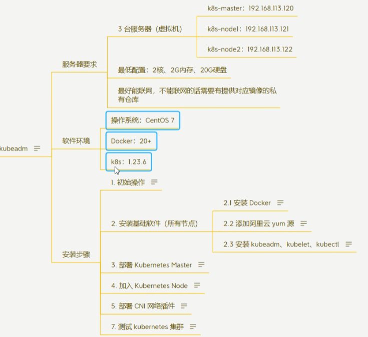
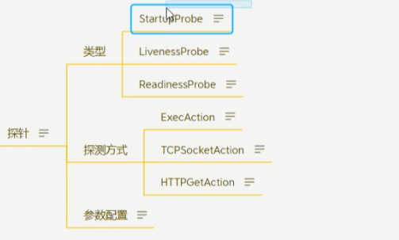
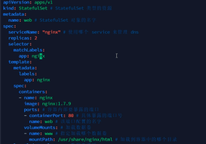
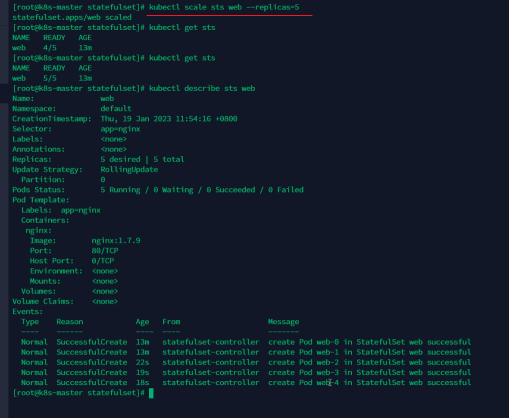
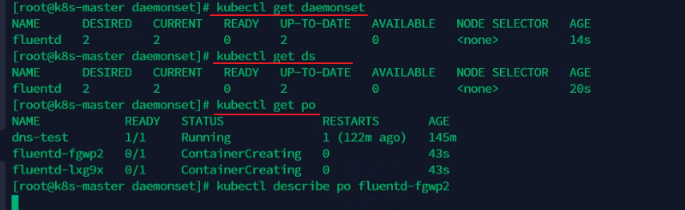
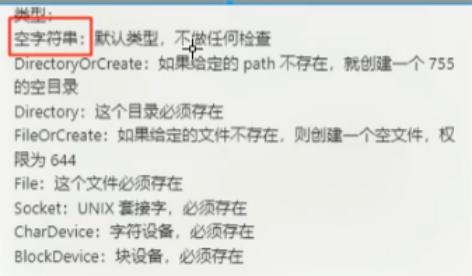

# 理论
## 应用部署的三大阶段
1. 传统部署：应用直接部署在服务器上，如果存在部署多份，会造成资源冲突，该阶段的主要问题是环境没有得到隔离，所用的应用共有一个环境

2. 虚拟化部署：服务器可以划分多个虚拟机，虚拟机肯定是会进行资源隔离的，应用部署在各自的虚拟机上面，但是虚拟机所需要的资源是非常庞大的，所以这种方式的最大的问题就是占用资源大。虚拟机的分割很大，可以做到完全的隔离，但是为了一个软件隔离而单独做虚拟机隔离，不合理。

3. 容器化部署：服务器也叫宿主机，可以创建多个容器，容器类似于虚拟机，但是相较于虚拟机占用很小的资源，因为容器和宿主机共同一个操作系统、网络、内存、磁盘、进程等内容，但是不像虚拟机分割那样复杂化，所以这种方式是当下最好的部署方式。


## K8s的特点
1. 自我修复，可以根据规定的命令去自我修复失败的容器
2. 弹性伸缩，可以根据规定的容器数量去复制或者删除容器
3. 自动部署或回退，编写好命令，容器自动部署，回退就是容器改错了，自动回退到之前的版本
4. 服务发现和负载均衡，服务发现就是注册的服务立即检测到，负载均衡根据服务的能力不同分配请求数量，K8s默认提供一些方案
5. 机密和配置管理，可以将容器的密码等敏感数据统一的存储起来
6. 存储编排，将容器的存储资源抽象为一个个的文件系统
7. 批处理


## Brog架构和K8s架构的对比
Brog架构：K8s的前身

K8s架构：


## K8s组件及其各组件之间的关系
分为控制组件和节点组件，其他的还有一些可选的组件，下面是集群必须的控制组件和节点组件：


## K8s核心概念
有状态和无状态的服务：
1. 无状态，不存储数据等，可以随便重新开启一个新的容器替代，照样可以运行，不会对本地环境产生依赖
2. 有状态，需要存储容器相关的数据，如果没有这些状态，那么就相当于一个原始的容器，对本地环境有依赖

对象规约：对象的期望状态
对象状态：对象的实际状态

资源的分类：

上面图片中的元空间看做元数据。

元数据型和集群级别对象的介绍：


**Pod：** 可以看做是容器的集合，里面通过pause来共享文件系统、网络等公共内容，容器之间可以很容易的访问。
**Pod控制器：** 
下面是适用于无状态的服务：
1. RC：可以复制多个Pod副本
2. RS：针对RC进行升级，使用Selector，也可以复制多个副本
3. Deployment：最常用的，特点就是创建RS/Pod、能进行滚动升级/回滚Pod，能平滑的扩容和缩容，在升级或者回滚的过程中暂停与恢复Deployment

有状态服务：StatefulSet：

守护服务：daemonSet，给每一个匹配的Node都部署一个守护服务

任务/定时任务：job表示创建一个只运行一次的Pod，运行完成后销毁，cronJob在job的基础上添加了定时的功能。

Service和Ingress：Service可以看做是为了Pod间能够相互通信的一种机制，Ingress可以看做是K8s集群与用户之间能够相互通信的一种机制。


**配置与存储：**
1. volume：数据卷，共享Pod中的文件系统，类似Docker中的数据卷
2. CSI：数据存储接口，提供接口可以采用其他方式实现的数据存储接口，多样化

**特殊类型配置：**
1. configMap：存储Pod中一些信息的配置，可以通过这个不再需要手动的修改代码层面配置
2. Secret：存储Pod中的一些敏感信息
3. DownwardAPI：通过文件挂载的方式可以实现上面的功能

**其他：**
1. Role
2. RoleBinding


# 实战

## kubeadm搭建k8s集群

搭建方案有：minikube、Kubeadm、二进制安装、命令行工具
kubeadm安装的一个教程：[k8s集群搭建教程](https://www.cnblogs.com/engeng/p/18082073)
kubeadm安装：

1. 初始操作：
```shell
# 关闭防火墙
systemctl stop firewalld
systemctl disable firewalld 

# 关闭selinux
sed -i 's/enforcing/disabled/' /etc/selinux/config # 永久
setenforce 0 # 临时

# 关闭swap
swapoff -a # 临时
sed -ri 's/.*swap.*/#&/' /etc/fstab #永久

# 关闭壳swap后，一定要重启一下虚拟机
# 根据规划设置主机名
hostnamectl set-hostname <hostname>

# 在master节点上添加hosts
cat >> /etc/hosts << EOF
ip <hostname>
ip <hostname>
ip <hostname>
EOF

# 将桥接的IPV4流量传递到iptables的链
cat > /etc/sysctl.d/k8s.conf << EOF
net.bridge.bridge-nf-call-iptables = 1 
net.bridge.bridge-nf-call-ip6tables = 1
EOF
sysctl --system # 生效

# 时间同步
yum install ntpdate -y 
ntpdate time.windows.com
```
2. 安装docker
3. 配置yum阿里源
```shell
cat > /etc/yum.repos.d/kubernetes.repo << EOF
[kubernetes]
name=Kubernetes
baseurl=https://mirrors.aliyun.com/kubernetes/yum/repos/kubernetes-el7-x86_64
enabled=1
gpgcheck=0
repo_gpgcheck=0

gpgkey=https://mirrors.aliyun.com/kubernetes/yum/doc/yum-key.gpg https://mirrors.aliyun.com/kubernetes/yum/doc/rpm-package-key.gpg
EOF
```
3. 安装kubelet、kubeadm、kubectl：
```shell
yum install -y kubelet-1.23.6 kubeadm-1.23.6 kubectl-1.23.6
systemctl enable kubelet
```
4. 部署master节点：
```shell
 kubeadm init \
   --apiserver-advertise-address=192.168.101.130 \
   --image-repository registry.aliyuncs.com/google_containers \
   --kubernetes-version v1.23.6 \
   --service-cidr=10.96.0.0/12 \
   --pod-network-cidr=10.244.0.0/16
  
  mkdir -p $HOME/.kube
  sudo cp -i /etc/kubernetes/admin.conf $HOME/.kube/config
  sudo chown $(id -u):$(id -g) $HOME/.kube/config

kubectl get nodes

```
master成功：


问题yum下载不了：yum换源：
```shell
# 备份旧的
mv /etc/yum.repos.d/CentOS-Base.repo /etc/yum.repos.d/CentOS-Base.repo.bak
# 下载新的
wget -O /etc/yum.repos.d/CentOS-Base.repo http://mirrors.aliyun.com/repo/Centos-7.repo
# 生成缓存
yum makecache
```

报错：之前存在的kubelet、kubeadm、kubectl不兼容，

解决方法就是重新安装
```
yum remove -y kubelet-1.28.2 kubeadm-1.28.2 kubectl-1.28.2

yum install -y kubelet-1.23.6 kubeadm-1.23.6 kubectl-1.23.6
systemctl enable kubelet
```

报错：使用journalctl -xefu kubelet查看报错详情，初始化启动失败，kubelet缺少"Failed to run kubelet" err="failed to run Kubelet: misconfiguration: kubelet cgroup driver: \"systemd\" is different from docker cgroup driver: \"cgroupfs\"


解决方法：将cgroupfs改为

执行命令加载配置、重启容器、重启kubelet
```shell
sudo systemctl daemon-reload
systemctl restart docker
```
完成后还有一个这个错误，暂时不管了：这个是标识没有认证

执行完上面，重新初始化：
```shell
kubeadm reset
 kubeadm init \
   --apiserver-advertise-address=192.168.101.130 \
   --image-repository registry.aliyuncs.com/google_containers \
   --kubernetes-version v1.23.6 \
   --service-cidr=10.96.0.0/12 \
   --pod-network-cidr=10.244.0.0/16
     
  mkdir -p $HOME/.kube
  sudo cp -i /etc/kubernetes/admin.conf $HOME/.kube/config
  sudo chown $(id -u):$(id -g) $HOME/.kube/config
```

如果报错：docker版本和kubelet不兼容；解决方法：降级docker版本

5. 加入slaver节点
```shell
kubeadm join 192.168.101.130:6443 --token h0qcqc.naiprldu64cw6iwn --discovery-token-ca-cert-hash sha256:1b51d80f7adafddb604746ae5e5cea8e17e1af7e4db4b1316bebc2df74bdca87

# token获取：
kubeadm token list  # 没有过期
kubeadm token create # 创建新的

# 获取hash值，前面要拼接上sha256:
openssl x509 -pubkey -in /etc/kubernetes/pki/ca.crt | openssl rsa -pubin -outform der 2>/dev/null | \
openssl dgst -sha256 -hex | sed 's/^.* //'
```
如果不小心在slaver节点执行过master初始化的命令，可以：
```shell
kubeadm reset

systemctl restart kubelet
```
6. 配置calico网络：
```shell
# master节点执行下载网络配置文件
curl https://docs.projectcalico.org/manifests/calico.yaml -O
curl https://calico-v3-25.netlify.app/archive/v3.25/manifests/calico.yaml -O
# 修改文件中的CALICO_IPV4POOL_CIDR配置，修改为初始化设置的cidr一致

# 修改IP_AUTODETECTION_METHOD的网卡名称

# 删除镜像docker.io前缀，避免下载太慢
grep image calico.yaml 

sed -i 's#docker.io/##g' calico.yaml

#运行
kubectl apply -f calico.yaml

# 查看详情
kubectl get pods -n kube-system
kubectl describe pod <名称> -n kube-system
```
7. 测试
```shell
kubectl create deployment nginx --image=nginx
kubectl expose deployment nginx --port=80 --type=NodePort

kubectl get pod,svc
```

常用的一些kubectl命令：
```shell
# 获取calico-system的信息
kubectl get pods -n calico-system

#  删除calico-system xxxx 的信息，让其重新加载
kubectl delete pod -n calico-system xxx

# 查看docker镜像的digest
docker images --digests | grep calico

# 查看calico-system中xxx的详细信息
kubectl describe pod -n calico-system xxx
```

slaver节点配置kubectl命令行工具：因为kubectl本质是给api-server发请求的，所以还是需要配置端口，所以需要将kubectl的配置文件传递给其他的结点：
```shell
scp /etc/kubernetes/admin.conf root@k8s-nodes-01:/etc/kubernetes

echo "export KUBECONFIG=/etc/kubernetes/admin.conf" >> ~/.bash_profile
source ~/.bash_profile
```


## Kubectl命令
官网命令手册：[kubectl命令](https://kubernetes.io/docs/reference/generated/kubectl/kubectl-commands)

```shell
# 查看pod
kubectl get pod
kubectl get pod -o wide
# 查看命名空间
kubectl get ns

# 查看部署的
kubectl get depoly
kubectl get depoly <服务>
kubectl get depoly <服务> -o yaml
# 扩容缩容
kubectl scale deploy --replicas=3 nginx

```
API版本分为：Alpha、Beta、Stable
已经启用API查询：[已弃用API](https://kubernetes.io/zh-cn/docs/reference/using-api/deprecation-guide/)
API发起是通过RestAPI调用的，控制是基于RBAC进行认证和授权的。

删除pod、deploy、service
```shell
kubectl delete deploy nginx

kubectl get services
kubectl delete svc nginx

# 此时pod消失
```


## 深入Pod
pod配置文件参数讲解：


配置例子：

执行创建命令：
```shell
kubectl create -f nginx-demo.yaml

```
如果存在下面类似的报错，就看一下是否符合yaml的风格配置：

使用route来观察这个pod请求暴露在哪儿？
```shell
# 看一下ip地址
kubectl get pods -o wide

# 查看路由，看上面ip对应的网关在哪儿？再去slaver节点看看是不是路由了pod的ip地址
route
route -n
```


**pod探针：** 用于检测pod的执行状态
startupProbe是启动状态监测的探针
LivenessProbe是pod退出策略的探针，退出根据配置的restartPolicy决定是否重启
ReadinessProbe是pod初始化策略的探针，决定多久初始化完才能访问pod
探测方式是上面探针去监测的策略，有exec、tcp、http

其他参数配置：


StartupProbe探针：帮助初始化监测是否成功
下面使用了了三种探测方式都实现了监测startup是否启动成功，如果失败，就是超过了规定的失败次数，那么就completed，使用kubectl describe.... 去查看具体的失败情况

livenessProbe：存活的探测指针

readinessProbe：请求的探测指针。配置方式和上面都是一样的

## Pod生命周期

下面是使用postStart和preStop两个钩子函数，去测试创建后和销毁前做的一些操作：terminateion....表示规定的销毁最大时间，可以通过time kubectl ...命令查看执行命令所用的时间：


## 资源调度

### lable和selector
lable就是deploy和pod配置的一些信息，selector就是deploy去根据条件去匹配对应的pod

下面是通过命令行kubectl去实时的更改pod内的一些lable信息，或者添加新的lable：

下面是selector通过条件去选择对应的pod信息：


### deployment
**创建与配置deployment文件：**
直接通过命令创建deployment，可以查看创建的deploy，RS，pod

获取deploy的配置文件，复制配置文件信息，根据给的配置文件我们创建出自己的配置文件：


**滚动更新：** 通过配置replica的数量来实现RS的pod数量，实时的更新RS
可以通过直接编辑deploy配置文件来进行滚动更新

查看滚动更新的状态

直接修改pod的镜像信息，让deploy去滚动更新，会创建一组新的RS来替换旧的RS


**回滚：** 因为上面的滚动更新可能存在多个RS，如果失败，那就需要回滚到之前运行正常的RS


回滚到指定的RS版本：

注意：RS的保留期限控制：


**扩容与缩容：** 通过配置replica来设置pod的数量，可以直接通过配置文件的的replication数量控制，或者使用scale命令来进行自动的扩容缩容：


**暂停与恢复：** 因为每次更新完deploy配置文件，都会自动的创建出新的RS，然后进行更新，但是实际上就不需要多次更新，生成这么多的一个RS，可以通过暂停与恢复来实现


### StatefulSet
有状态应用的服务

**创建一个Stateful应用：**



创建应用，查看所有stateful应用：

查看持久化卷：

替换stateful配置文件：这里好像有问题，那就删除应用，重新创建

进入pod容器，查看容器的网络：


**扩容缩容：**




**滚动更新：**

普通的滚动更新：


灰度发布/金丝雀发布：只更新部分，将服务的损失降低到最小


OnDelete：删除时更新

**级联删除和非级联删除：**


### DaemonSet
为每一个匹配的Node节点都创建一个守护进程。

应用场景：在下面日志场景中，如果每个微服务都有自己的日志，那么收集起来很不容易，如果使用收集日志的pod单独的部署在每个node上面，也很麻烦，如果创建一个DaemonSet，存在一个标识lable，那么只要node的select匹配daemonSet的lable，node就自动的创建出来日志收集的一个daemonset


搭建fluentd：

查看ds状态

设置标签选择：

观察只有标签正确的node才有fluentd日志收集器：


### HPA
根据CPU使用率或者自定义指标自动对Pod进行扩容缩容


开启指标服务：

kubectl top pods：获取pod的资源占比：


## 服务发现
### Service
#### Service、endpoint、pod之间的关系：

获取service、endpoint，观察pod删除后新创建的pod的ip规则，都是由endpoint进行管理的


####  Service的基础操作
service配置文件：

应用：


#### Service访问外部服务
访问模式：内部服务通过service，service通过endpoint去访问外部服务

实现方式：
1. 编写service配置文件时，不指定selector属性
2. 自己创建endpoint
测试发现访问nginx-ep-external服务，请求的是外部的ip地址


**通过域名的方式访问外部服务：**


**关于type：**
- ClusterIP：只能在集群内部使用，不配置类型默认就是ClusterIP
- ExternalName：返回定义的CNAME别名，可以配置为域名
- NodePort：可以理解为暴露端口访问的一种方式，但是不推荐。会给所有安装了kube-proxy的 节点都绑定一个端口，此端口代理至对应的pod，集群外部可以使用任意节点IP+NodePort的端口号访问到集群中对应的pod中的服务。如果不指定端口会随机分配端口，指定端口也要在30000-32767范围之间，端口的范围可以配置，在/usr/lib/systemd/system/kube-apiserver.service文件中
- LoadBalancer：类似NodePort方式，但是使用云服务商（阿里云、腾讯云等）提供的负载均衡服务
### Ingress
可以看做是nginx的一个抽象，一个接口，ingress可以连接所有的service


#### 安装ingress-nginx
**安装helm：**

解压ingress-nginx，修改默认的value.yaml配置文件：


#### 使用ingress-nginx
创建yaml文件：


这里很麻烦，特别注意路径重写问题，更多细节就是看官网


## 配置与存储
### config
config的存储是存储明文数据。

**config创建：** 使用kubectl create configmap -h查看示例，构建configmap对象，通过下面命令查看configmap：
```shell
kubectl get cm
kubectl describe cm <configmap名称>
```
**pod的日志打印命令和进入pod命令：**
```shell
kubectl logs -f <pod名称>
kubectl exec -it <pod名称> -- sh
```
configMap：挂载key-value的方式

configMap直接挂载目录的方式：


### secret
secret与configmap类似，但是存储的是密文，密文就是通过编码方式生成的
```shell
kubectl create secret generic <secret名称> --from-literal=<key>=<value> --from-literal=<key>=<value>....

# 查看secret创建的帮助
kubectl create secret -h
kubectl create secret docker-registry -h
```

secret的主要应用场景就是对于私有镜像仓库的拉取，身份认证信息可以存储在secret中，下面pod配置拉取的secret位置为harbor-secret(自己创建的)：


### SubPath
configMap的问题是会覆盖原来的目录，如果目录不存在创建目录，如果存在则覆盖原来的目录，SubPath就是用来解决这个问题
使用：
1. 定义volumes时需要增加items属性，配置key和path，且path的值不能冲/开始
2. 在容器内的volumeMounts中增加SubPath属性，该值与volumes中的items.path的值相同


### configMap热更新

更新的两种方式：
1. 通过edit命令直接修改configmap
2. 通过replace替换


### 配置信息不可变
对于一些敏感服务的配置文件，在线上有时候是不允许修改的，此时在配置configmap时候可以配置immutable: true来禁止修改


### HostPath
将节点上的文件或者目录挂载到Pod上面，此时该目录会变成持久化存储目录，即使Pod被删除后重启，也可以重新加载到该目录，该目录下的文件不会丢失
创建一个pod，pod将/data目录与pod内的/test-pd进行挂载

关于hostPath.type类型：



### EmptyDir
Empty主要用于一个Pod中的不同的Container共享数据使用的，由于只是在Pod内部使用，因此与其他volumn比较大的区别是，当pod如果被删除了，那么empty也会被删除
存储介质可以是任意类型，如SSD、磁盘或者网络存储。可以将emptyDir.medium设置为Memory让k8s使用tmpfs（内存支持文件系统），速度比较快，但是重启tmpfs节点时，数据会被清除，且设置的大小会计入到Container的内存限制中。
创建一个pod里面定义了两个容器，容器挂载的目录分别是/cache和/opt，共享同一个数据卷cache-volume


### NFS
nfs卷能够将NFS（网络文件系统）挂载到你的Pod中，不像emptyDir那样会在删除Pod的同时也会被删除，nfs卷的内存在删除pod时候也会被保存，卷只是被卸载，这以为着nfs卷可以被预先填充数据，并且这些数据可以在pod之间共享。


将nfs目录与pod目录进行挂载：


