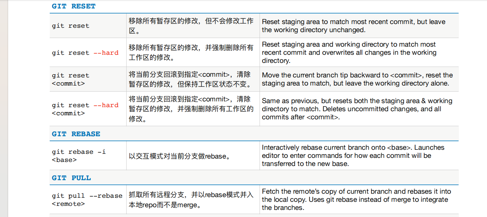

# Git

教程：[https://liaoxuefeng.com/books/git/introduction/index.html](https://liaoxuefeng.com/books/git/introduction/index.html)

git命令：

## Gogs
Gogs 是一款类似GitHub的开源文件/代码管理系统（基于Git），Gogs 的目标是打造一个最简单、最快速和最轻松的方式搭建自助 Git 服务。使用 Go 语言开发使得 Gogs 能够通过独立的二进制分发，并且支持 Go 语言支持的 所有平台，包括 Linux、Mac OS X、Windows 以及 ARM 平台。

安装及配置说明查看博客：[https://blog.csdn.net/bbj12345678/article/details/122713883](https://blog.csdn.net/bbj12345678/article/details/122713883)

