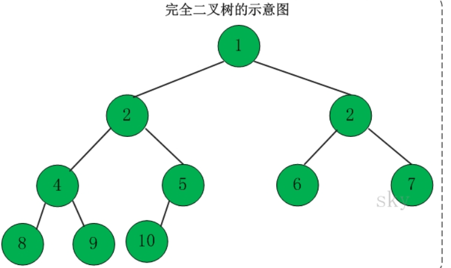
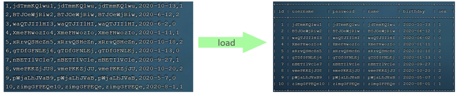
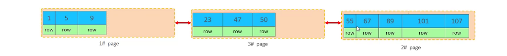
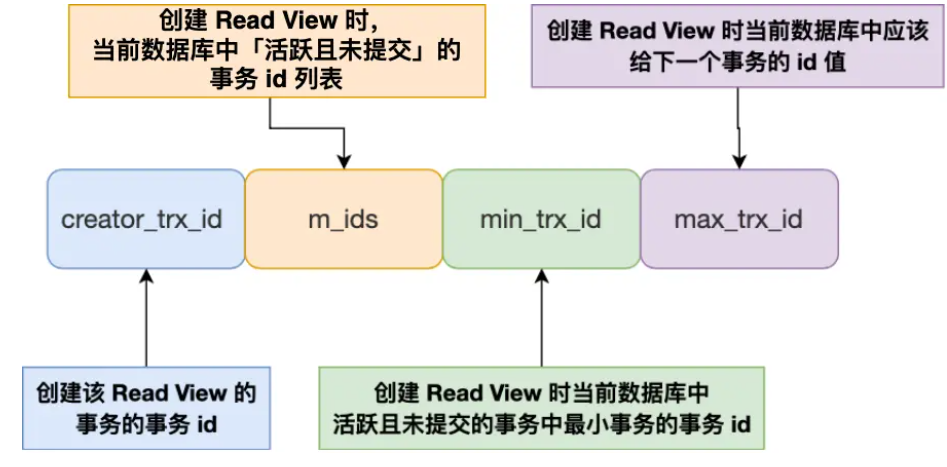
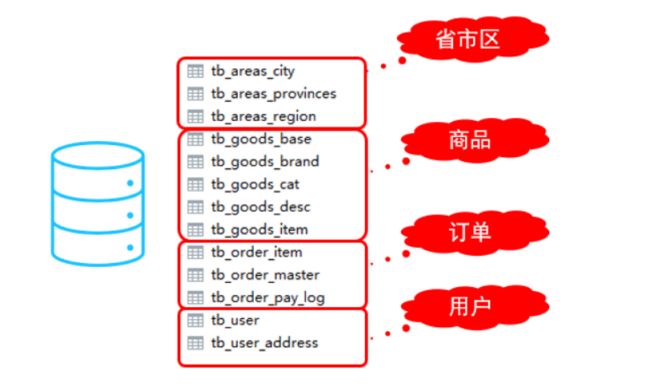
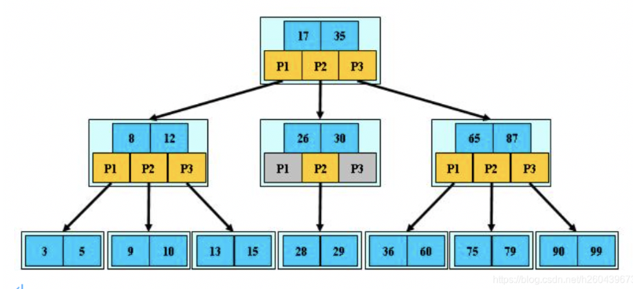

笔记根据黑马的《10天精通mysql》和《高级教程Mysql》两个课程所做

# 一、基础篇
## 基本概念
**数据库**：存储数据的集合，有组织的存储数据。

**数据库管理系统**：管理数据库的软件。

**SQL**：操作数据库的语句，定义了一套操作关系型数据库的统一标准。

MySQL官方提供了两种不同的版本： 
1. 社区版本（MySQL Community Server） 
免费， MySQL不提供任何技术支持 
2. 商业版本（MySQL Enterprise Edition） 
收费，可以使用30天，官方提供技术支持
**关系型数据库**：采用二维表存储数据，通过关系相互连接的二维表组成的数据库。

## SQL基础
1. SQL语句可以单行或多行书写，以分号结尾。 
2. SQL语句可以使用空格/缩进来增强语句的可读性。 
3. MySQL数据库的SQL语句不区分大小写，关键字建议使用大写。 
4. 注释： 
单行注释：-- 注释内容或 # 注释内容 
多行注释：/* 注释内容 */
5. SQL分类：
    1. **DDL（Data Definition Language）数据定义语言，定义数据库、表、字段。**
    2. **DML（Data Manipulation Language）数据操作语言，对数据库表中的数据进行操作**
    3. **DQL（Data Query Language） 数据查询语言，用来查询数据库表中的记录**
    4. **DCL（Data Control Language）数据控制语言，用来创建数据库用户，控制数据库的访问权限**

```sql
-- DDL
1. show databases; -- 展示所有的数据库  
2. select database();  -- 不知道
3. create database [if not exists] 数据库名 [default charset 字符集] [collate 排序规则]; -- 创建数据库，charset使用utf8mb4 collate使用utf8mb4_general_ci或者utf8mb4_bin，两者的区别是？一个不区分大小写，一个区分
4. drop database [if exists] 数据库名; -- 删除数据库
5. use 数据库名;  -- 切换数据库
6. show tables; -- 显示数据库中的所有表
7. desc 表名;  -- 查看表结构
8. show create table 表名; -- 查看创建表语句
9. CREATE TABLE 表名( -- 创建表
    字段1 字段1类型 [ COMMENT 字段1注释 ],
    字段2 字段2类型 [COMMENT 字段2注释 ],
    字段3 字段3类型 [COMMENT 字段3注释 ],
    ......
    字段n 字段n类型 [COMMENT 字段n注释 ]
    ) [ COMMENT 表注释 ] ;
10. ALTER TABLE 表名 ADD 字段名 类型 (长度) [ COMMENT 注释 ] [ 约束 ]; -- 修改表给表增加字段
11. ALTER TABLE 表名 MODIFY 字段名 新数据类型 (长度); -- 修改表修改字段
12. ALTER TABLE 表名 CHANGE 旧字段名 新字段名 类型 (长度) [ COMMENT 注释 ] [ 约束 ]; -- 修改表 修改表字段
13. alter table 表明 drop 字段名; -- 修改表-删除字段
14. ALTER TABLE 表名 RENAME TO 新表名; -- 修改表名
15. DROP TABLE [ IF EXISTS ] 表名; -- 删除表
16. TRUNCATE TABLE 表名;  -- 清空表数据

```

Mysql的数据类型分为三种：**数值类型、字符串类型、日期时间类型。**
1. 数值型：tinyint、smallint、mediumint、int/integer、bigint、float、double、decimal


2. 字符串类型：char、varchar、tinyblob、tinytext、blob、text、mediumblob、mediumtext、longblob、longtext


3. 日期时间类型：date、time、year、datetime、timestamp


下面开始介绍DML的SQL语句：
```plsql
-- DML
-- 插入数据
1. INSERT INTO 表名 (字段名1, 字段名2, ...) VALUES (值1, 值2, ...); 
2. INSERT INTO 表名 VALUES (值1, 值2, ...);
3. INSERT INTO 表名 (字段名1, 字段名2, ...) VALUES (值1, 值2, ...), (值1, 值2, ...), (值1,值2, ...) ;
-- 更新数据
4. UPDATE 表名 SET 字段名1 = 值1 , 字段名2 = 值2 , .... [ WHERE 条件 ] ;
-- 删除数据
5. DELETE FROM 表名 [ WHERE 条件 ] ;
```

DQL的SQL语句：
```plsql
1. SELECT 字段1, 字段2, 字段3 ... FROM 表名 ;
2. SELECT * FROM　表名
3. SELECT 字段1 [ AS 别名1 ] , 字段2 [ AS 别名2 ] ... FROM 表名;
4. SELECT 字段1 [ 别名1 ] , 字段2 [ 别名2 ] ... FROM 表名; 
5. SELECT DISTINCT 字段列表 FROM 表名;


-- 条件查询
6. SELECT 字段列表 FROM 表名 WHERE 条件列表 ;
-- 聚合函数
7. SELECT 聚合函数（字段） FROM 表名
-- 分组
8. SELECT 字段列表 FROM 表名 [ WHERE 条件 ] GROUP BY 分组字段名 [ HAVING 分组后过滤条件 ];
-- 排序
9. SELECT 字段列表 FROM 表名 ORDER BY 字段1 排序方式1 , 字段2 排序方式2 ;
-- 分页
10. SELECT 字段列表 FROM 表名 LIMIT 起始索引, 查询记录数 ; 


```
-- DQL的执行顺序


**DCL（数据控制语言），管理数据库的用户，控制数据库的访问权限：**
```sql
select * from mysql.user		-- 查询数据库用户
CREATE USER '用户名'@'主机名' IDENTIFIED BY '密码';  -- 创建用户
ALTER USER 'root'@'%' IDENTIFIED WITH mysql_native_password BY '123456' ; -- 修改用户密码
DROP USER '用户名'@'主机名' ; -- 删除用户

show grants for '用户名'@'主机名'    -- 查询用户权限
GRANT 权限列表 ON 数据库名.表名 TO '用户名'@'主机名';		-- 授权表权限，多个表通过,分割；可以使
例如：grant *.* on *.* to 'root'@'%';
-- 用*表示所有表
REVOKE 权限列表 ON 数据库名.表名 FROM '用户名'@'主机名';		-- 撤销权限
```

权限列表：

## 内置函数
**Mysql中函数分为字符串函数、数值函数、日期函数、流程函数**

1. 字符串函数


2. 数值函数


3. 日期函数


4. 流程函数


## 约束
**定义限制数据库字段的规则**


案例：有如下表结构，sql怎么写？


```sql
-- 对应的Sql语句，id有主键约束，name有非空约束，唯一约束，age有检查约束，status有默认约束
create table tb (
  id int auto_increment primary key,
  name varvchar(10) not null unique,
  age int check (age > 0 && age <= 120),
  statuc char(1) default '1',
  gender char(1)
)character set utf8 collate utf8mb4_generic_ci;
```

**添加外键约束：**
```sql
-- 定义表的时候确认外键
CREATE TABLE 表名(
  字段名 数据类型,
  ...
  [CONSTRAINT] [外键名称] FOREIGN KEY (外键字段名) REFERENCES 主表 (主表列名)
);
-- 添加外键
ALTER TABLE 表名 ADD CONSTRAINT 外键名称 FOREIGN KEY (外键字段名)
REFERENCES 主表 (主表列名) ;
```
**删除外键约束：**
```sql
ALTER TABLE 表名 DROP FOREIGN KEY 外键名称; 
```

**删除的更新行为：添加了外键之后，如果对父表数据进行删除，成为删除更新行为，有如下规则：**（真实场景不使用外键，因为影响性能又有约束行为，约束行为一般在代码层面解决）

添加外键的同时指定删除有外键的更新行为：
```sql
-- 定义语法
ALTER TABLE 表名 ADD CONSTRAINT 外键名称 FOREIGN KEY (外键字段) REFERENCES
主表名 (主表字段名) ON UPDATE CASCADE ON DELETE CASCADE;
```

## 多表查询
表之间的关联有：一对一、多对一、多对多。

**如果直接通过select * from 表1，表2...查询，这样的结果其实是表1数据和表2数据的组合结果，比如表1中11条数据，表2中10条数据，那么就是11 * 10=110条数据，这个就是笛卡尔积。**
所以进行**多表查询其实就是通过条件去掉一些无关的数据**。

分类：
1. 内连接


```sql
SELECT 字段列表 FROM 表1 , 表2 WHERE 条件 ... ; 
SELECT 字段列表 FROM 表1 [ INNER ] JOIN 表2 ON 连接条件 ... ; 
```

2. 左/右外连接

```sql
SELECT 字段列表 FROM 表1 LEFT [ OUTER ] JOIN 表2 ON 条件 ... ;
-- 左连接取交集部分和左边的全部数据
SELECT 字段列表 FROM 表1 RIGHT [ OUTER ] JOIN 表2 ON 条件 ... ;
-- 右连接取交集部分和右边的全部数据
```

3. 自连接
```sql
SELECT 字段列表 FROM 表A 别名A JOIN 表A 别名B ON 条件 ... ;


-- 合并查询结果，对于联合查询的多张表的列数必须保持一致，字段类型也需要保持一致
-- all会将所有的数据连接一起，不加会去重,union会去重 union all不会去重。
SELECT 字段列表 FROM 表A ...
UNION [ ALL ]
SELECT 字段列表 FROM 表B ....;
```


## 子查询
作为整体出现在SQL中（有可能在Select之后、FROM之后，WHERE之后）

根据子查询的结果分类：

1. 标量子查询（单个值）
```sql
select * from emp where dept_id = (select id from dept where name = '销售部');
```

2. 列子查询（单列，这里的子查询返回的是name为销售部或者市场部的id列）
```sql
select * from emp where dept_id in (select id from dept where name = '销售部' or name = '市场部');
```

3. 行子查询（返回了多个列数据，一行数据但是有多个列）
```sql
select * from emp where (salary,managerid) = (select salary, managerid from emp where name = '张无忌');
```

4. 表子查询（返回表数据，多行多列）
```sql
select * from emp where (job,salary) in ( select job, salary from emp where name = '鹿杖客' or name = '宋远桥' );
```

## 事务
一组操作的集合。
```sql
-- 查看事务的提交方式
SELECT @@autocommit ;
-- 设置事务提交方式：0手动提交；1自动提交
SET @@autocommit = 0 ;  -- 手动提交了
-- 提交事务
commit;
-- 回滚事务，事务结束
rollback;

-- 开始事务
START TRANSACTION 或 BEGIN ;
```

事务的四大特性：ACID
+ 原子性（Atomicity）：事务是不可分割的最小操作单元，要么全部成功，要么全部失败。 
+ 一致性（Consistency）：事务完成时，必须使所有的数据都保持一致状态。 
+ 隔离性（Isolation）：数据库系统提供的隔离机制，保证事务在不受外部并发操作影响的独立环境下运行。 
+ 持久性（Durability）：事务一旦提交或回滚，它对数据库中的数据的改变就是永久的。

并发事务问题：
1. **脏读：** 一个事务读到了另外一个事务还没有提交的数据
2. **不可重复读：** 一个事务先后读取的同一条数据的结果不一致
3. **幻读：** 它发生在一个事务正在读取数据的过程中，另一个事务插入、更新或删除了数据，导致前一个事务在再次读取数据时，所看到的数据结果与之前不同。

事务隔离级别，为了解决并发事务问题，MySQL提供了四种隔离级别（读未提交、读已提交、可重复读、序列化）：


```sql
SELECT @@TRANSACTION_ISOLATION; -- 查看事务隔离级别

SET [ SESSION | GLOBAL ] TRANSACTION ISOLATION LEVEL { READ UNCOMMITTED |
READ COMMITTED | REPEATABLE READ | SERIALIZABLE }
-- 设置隔离级别
```

注意：事务隔离级别越高，性能就越低。


# 二、进阶
## MySQL的架构


1. 连接层：  
**最上层是一些客户端和链接服务，包含本地sock 通信和大多数基于客户端/服务端工具实现的类似于TCP/IP的通信**主要完成一些类似于连接处理、授权认证、及相关的安全方案。在该层上引入了线程池的概念，为通过认证安全接入的客户端提供线程。同样在该层上可以实现基于SSL的安全链接。服务器也会为安全接入的每个客户端验证它所具有的操作权限
2. 服务层：
**第二层架构主要完成大多数的核心服务功能，如SQL接口，并完成缓存的查询，SQL的分析和优化，部**分内置函数的执行。所有跨存储引擎的功能也在这一层实现，如 过程、函数等。在该层，服务器会解析查询并创建相应的内部解析树，并对其完成相应的优化如确定表的查询的顺序，是否利用索引等， 最后生成相应的执行操作。如果是select语句，服务器还会查询内部的缓存，如果缓存空间足够大， 这样在解决大量读操作的环境中能够很好的提升系统的性能。
3. 存储引擎层
**存储引擎层， 存储引擎真正的负责了MySQL中数据的存储和提取**，服务器通过API和存储引擎进行通信。不同的存储引擎具有不同的功能，这样我们可以根据自己的需要，来选取合适的存储引擎。数据库中的索引是在存储引擎层实现的
4. 数据存储层
**数据存储层， 主要是将数据(如: redolog、undolog、数据、索引、二进制日志、错误日志、查询日志、慢查询日志等)存储在文件系统之上，并完成与存储引擎的交互。**


## 执行一条SQL语句，期间发生了什么？
具体来自：[执行一条SQL语句，期间发生了什么？](https://xiaolincoding.com/mysql/base/how_select.html#mysql-%E6%89%A7%E8%A1%8C%E6%B5%81%E7%A8%8B%E6%98%AF%E6%80%8E%E6%A0%B7%E7%9A%84)
先看一下MySQL的内部结构：

如图，MySQL分为Server层和存储引擎两层。
- Server层负责建立连接，分析和执行SQL。大多数的核心模块都在这里，主要包括连接器、查询缓存、解析器、预处理器、优化器、执行器等。另外还有所有的内置函数（日期、时间、数学等）和所有的跨存储引擎的功能（如视图、存储过程等）
- 存储引擎层负责数据的存储与提取。支持InnoDB、MyISAM、Memory等多个存储引擎，但是公用一个Server层，其中InnoDB是最常用的存储引擎，不同的存储引擎支持的索引结构也不一样，InnoDB就是支持B+树索引结构。

执行过程：
1. 第一步连接器：连接器就是连接客户端和Server进行通信，连接的过程基于TCP三次握手，因为MySQL是基于TCP协议进行传输的。连接成功后会将用户的权限保存起来，期间就算管理员修改了该用户的权限，也不会影响执行，除非重新连接。
可以通过`show processList`命令查看mysql服务有多少个客户端进行连接。默认的连接时长通过`wait_timeout控制`，可以通过`show variables like 'wait_timeout';`。也可以强制关闭客户端连接`kill connection +id`的方式删除。客户端的连接数量通过命令`show variables like 'max_connections';`进行查看。
MySQL连接有长连接和短连接。长连接的好处就是减少建立连接和断开连接的过程和次数，一般推荐使用长连接。但是长连接面临着内存增多的问题，因为MySQL在执行过程中临时使用内存管理对象，只有在连接断开才会释放内存。有两种解决方法：第一种定期断开连接，释放内存；第二种客户端主动重置连接，mysql5.7版本实现了`mysql_reset_connection()`接口，代码中调用函数来回将连接重置到初始化状态。；
2. 第二步查询缓存。Server接收到SQL语句后，第一步就是先获取SQL的第一个关键词，判断是否是查询语句，如果是查询语句会选择走查询缓存，查询缓存是key-value形式存储的，其中key是sql语句，value是查询结果。如果缓存存在就走缓存返回。但是缓存的命中率其实很低，比如我直接存储了一个查询很大数据量的缓存在里面，但是只要更新了一下表，缓存就没有了，那么缓存真正被执行到的概率很低，只要中间有操作就清除了缓存。在MySQL8.0中查询缓存中去除掉了，不再考虑走查询缓存。
3. 第三步解释SQL，使用解析器。这一步的主要任务是词法分析和语法分析。词法分析取出里面的关键词和非关键词。语法分析根据语法树规则，判断是否符合语法规则。但是像字段不存在、表不存在这种不是这一步所做的任务。
4. 第四步执行SQL，这一步分为预处理、优化、执行。预处理阶段就做两件事情：判断表和字段是否存在；将select中的\* 扩展为所有列。优化阶段的任务是决定SQL的执行方案，比如表中有多个索引，优化器会基于成本的考虑来决定选择哪个索引，可以通过explain关键字查看。执行器就是真正执行SQL的过程了，执行器与存储引擎层的是以记录为单位的。
执行器与存储引擎的交互方式有三种：
- 主键索引查询，例如SQL：`select * from produce where id = 1;`执行器会将条件`id = 1`交给存储引擎，存储引擎通过B+树索引会找第一条符合条件的记录，如果找到返回给执行器，如果没有则上报找不到的错误。
- 全表扫描。例如SQL：`select * from product where name = 'iphone';`这条语句没有使用索引，所以会进行全表扫描，将条件发送给存储引擎层，存储引擎层一直循环找符合条件的记录，存在就发送给执行器，执行器返回给客户端，不存在就下一条，直至遍历完成。
- 索引下推，减少二级索引回表的操作，提高查询的效率，这本是Server负责的事情，交给存储引擎层了。比如SQL：`select * from t_user where age > 20 and reward = 100000;`如果age和reward建立了联合索引，按照索引原则，碰到了>、<符合索引停止，所以age能用到联合索引，reward没有用到联合索引。通过explaint关键字得到的策略，如果extra中显示`using index condition`，表示使用了索引下推。
	- 如果没有索引下推，存储引擎层判断记录条件age>20是否成立，如果成立直接回表将记录返回给执行器，执行器去判断reward是否成立；如果不成立直接循环。所以这种方式大大的增加了回表的次数，而且判断还发生在了Server端
	- 如果有索引下推，存储引擎层判断记录条件age>20是否成立，如果成立再判断reward是否成立，都成立了再回表返回给执行器，如果不成立接着下一条记录。


## 存储引擎
**存储引擎就是存储数据、建立索引、更新/查询数据等技术的实现方式 。存储引擎是基于表的，而不是基于库的，所以存储引擎也可被称为表类型。我们可以在创建表的时候，来指定选择的存储引擎，如果没有指定将自动选择默认的存储引擎InnoDB。**

```sql
-- 建表时指定存储引擎为innodb
CREATE TABLE 表名(
  字段1 字段1类型 [ COMMENT 字段1注释 ] ,
  ......
  字段n 字段n类型 [COMMENT 字段n注释 ]
) ENGINE = INNODB [ COMMENT 表注释 ] ;
-- 查询当前数据库的存储引擎
show engines;
```

分析主要的三种存储引擎：
1. InnoDB：InnoDB是一种兼顾高可靠性和高性能的通用存储引擎，**在 MySQL 5.5 之后，InnoDB是默认的 MySQL 存储引擎。**
特点：
+ DML操作遵循ACID模型，支持事务
+ 行级锁，提供并发访问能力
+ 支持外键约束，保证数据的完整性和正确性

**InnoDB存储会使用xxx.ibd格式的文件**，使用Mysql提供的命令ibd2sdi可以打开这个文件。


innodb的逻辑存储结构如下：


上面是InnoDB的逻辑存储结构：
1. 表空间：一个ibd文件就是一个表空间，里面包含多个段segment
2. 段：**常见的段分为数据段、索引段等等，段中包含多个区**
3. 区：**区是表空间的存储单元结构，区大小是1M，里面包含多个页，每个页的大小是16k，所以一个区有64个连续的页**
4. 页：页是存储引擎磁盘管理的最小单位。为了保证页的连续性，InnoDB每次从存储引擎申请4-5个区。
5. 行：InnoDB引擎是将数据按照行进行存储的，每一个行除了定义的字段外，还有两个隐藏的字段。DB_TRX_ID（事务id）记录插入或者更新改行的最后一个事务id，DB_ROLL_PTR（回滚指针）指向该行数据的回滚段（undo log）中的记录。

--- 
2. MyISAM：早期的存储引擎
特点：不支持事务、不支持外键、不支持行锁，支持表锁、访问速度快
分三个文件存储：xxx.sdi（表结构信息）、xxx.MYD（存储数据）、xxx.MYI（存储索引）

--- 
3. Memory：表中的数据存储在内存中，断电会消失，更多的当临时表或者缓存使用
特点：内存存放、hash索引


## MySQL一行记录是如何存储的？
来源：[MySQL一行记录是如何存储的？](https://xiaolincoding.com/mysql/base/row_format.html#mysql-%E7%9A%84%E6%95%B0%E6%8D%AE%E5%AD%98%E6%94%BE%E5%9C%A8%E5%93%AA%E4%B8%AA%E6%96%87%E4%BB%B6)

### MySQL的数据存放在哪个文件？
以默认的存储引擎InnoDB为例，使用`show variables like 'datadir';`查看数据存储的目录，如果创建一个数据库database，那么就会存在一个database文件夹，文件夹中存在三个文件：.opt文件、.frm、.ibd文件
- opt扩展名文件存放当前数据库的默认字符集和字符校验规则
- frm保存对应的表结构
- ibd存放表数据。
表空间文件的结构：

表空间由段segment、区extent、页page、行row组成。
- 行：记录是按照行进行存储的，不同的行格式存储的结构不一样
- 页：InnoDB的数据都是按照页进行读取的，因为按照行的效率会很低，默认页的大小为16kb，页的类型有很多，常见的有数据库、undo日志页、溢出页等等。
- 区：为了解决B+树链表中的页位置是连续的，所以都是按照区来分配位置的，确保通过顺序IO读取，效率高，区的默认大小是1MB，分为64区，这样相邻的页物理位置也相邻。
- 段：段一般分为数据库、索引段和回滚段等。数据段存储B+树叶子节点的集合，索引段存储非叶子节点集合，回滚段存储回滚数据区集合。

### InnoDB行格式
InnoDB提供四种行格式：Redundant、Compact、Dynamic和Compressed。
默认使用Dynamic格式，也是基于Compact格式上来的，都是紧凑格式。
Compact格式分为记录额外信息和记录真实数据。

记录额外信息分为：
1. 变长字段长度列表：逆序存放该列真实存放数据的字节数
2. null值列表，逆序存放null值列表，1代表是null，0代表不是。
3. 记录头信息很多，例如：delete_mask标识此条数据是否被删除；next_record记录下一条位置；record_type标识当前记录类型。
记录真实部分：
- row_id：如果表没有设置主键索引或者唯一索引，这会有一个row_id出现。
- trx_id：记录事务id，表示数据属于哪个事务
- roll_ptr：记录回滚指针，记录上一个版本的指针

### varchar(n) 中的n最大取值多少？

MySQL规定，除了text、blobs这种大对象类型之外，其他所有列（不包括隐藏列和记录头）加起来的字节长度不能超过65535个字节。
所以varchar(100)的最大长度就是100字节数据。

真实的存储字节数还要减去变长字段长度列表和null值列表。
单个字段情况的表是65532个字节。
多字段情况就是：所有字段长度+变长字段列表+null值列表长度 <= 65535

### 行溢出，MySQL怎么处理？
上面知道一行最多65535字节，但是一个页16kb，也就是16384字节，这个时候肯定会发生行溢出的，行溢出的数据就会存放在溢出页上面。
Compact行模式发生行溢出，真实数据区域只会存储一部分数据，再通过20字节指向溢出页，溢出页存放另外部分的数据。
Dynamic和Compressed模式采用完全行溢出，真实数据区域只会存放20字节指向溢出页，溢出页存放全部数据。


## 索引
索引（index）是帮助MySQL高效获取数据的数据结构。

优点：
1. 提高数据检索的效率
2. 通过索引对数据进行排序，降低CPU排序的消耗
缺点：
3. 索引列占用空间
4. 降低了更新表的效率

MySQL的索引是在存储引擎层实现的，不同的存储引擎层支持不同的索引结构。
1. B+Tree
2. Hash：底层数据结构是用哈希表实现的, 只有精确匹配索引列的查询才有效, 不支持范围查询
3. R-Tree：空间索引是MyISAM引擎的一个特殊索引类型，主要用于地理空间数据类 型，通常使用较少
4. Full-text：是一种通过建立倒排索引,快速匹配文档的方式。

### 索引中的数据结构
先介绍树：有限节点组成的一个具有层次的集合。


二叉树：节点最多只有两个子树的树结构。


根据子树不同，二叉树分为很多种类：
1. 满二叉树：高度为h，又2h-1个节点组成的二叉树，每一个节点都有两个子节点（除开叶子结点）：

2. 完全二叉树：一颗二叉树中，只有最下面两层节点的度可以小于2，并且最下层的叶节点集中在靠左的若干位置上

3. 二叉查找树（又称为二叉搜索树）：设x为二叉树中的一个节点，x节点包含关键字Key，节点x的Key值记为Key[x]。如果y是x的左子树中的一个节点，则Key[y]<=Key[x]；如果y是x的有子树的一个节点，则Key[y]>=Key[x]。就是右子树肯定比它大，左子树肯定都比它小

4. 平衡二叉搜索树（AVL树）：它是一颗空树或者它的左右两个子树的**高度差的绝对值不超过1，** 并且左右两个子树都是一颗平衡二叉树。


5. 红黑树：上面的AVL树插入和删除都会造成绝对值可能大于1，那么需要进行旋转处理，非常印象效率。所以就出现红黑树，是一颗自平衡的二叉查找树，能解决非平衡树问题，红黑树是一种接近平衡的二叉树（说它是接近平衡因为它并没有像AVL树的平衡因子的概念，它只是靠着满足红黑节点的5条性质来维持一种接近平衡的结构，进而提升整体的性能，并没有严格的卡定某个平衡因子来维持绝对平衡），
    1. **节点是黑色或者红色**
    2. **根节点是黑色的**
    3. **叶子节点（外部节点，空节点）都是****黑色，****这里的叶子节点指的是最底层的空节点（外部节点）**
    4. **红色节点的子节点和父节点都是黑色，从根节点到叶子节点不能超过两个红色节点**
    5. **从任一节点到叶子节点的所有路径都包含数量相同的黑色节点**


6. B树（B-树）：多路平衡查找树，描述一颗B树需要指定它的阶数，阶数表示最多有多少个孩子节点。**每个节点包含多个元素（键值）和指向子节点的指针**

一颗m阶的B树定义：
+  B树的每个节点至少有 `⌈m / 2⌉` 个子节点  
+ 根节点最少有一个关键字
+  最多有 `m` 个子节点  
+ 每个结点中的关键字都按照从小到大的顺序排列，每个关键字的左子树中的所有关键字都小于它，而右子树中的所有关键字都大于它。
+ 所有叶子结点都位于同一层，或者说根结点到每个叶子结点的长度都相同。
+  内部节点和叶子节点存储数据，查询时可以通过内部节点直接定位到所需数据  

 假设 B树的阶为 3，即每个节点最多有 2 个键和 3 个子节点，至少有 1 个键和 2 个子节点。  
 假设插入以下键值序列：`10, 20, 5, 6, 12, 30, 15, 25, 35`，得到一个B树如下所示：  
```sql
              [10 | 20]
             /    |    \
          [5, 6] [12]  [15, 25, 30, 35]
```

7. B+树，是B树的变种， 主要用于数据库索引和文件系统 ， 在B+树中，所有的实际数据都存储在叶子节点中，而非内部节点。内部节点仅存储键（用于索引），并且所有叶子节点之间有链表连接，以便于范围查询。  主要的不同是：
+  所有数据都存储在叶子节点，叶子节点通过链表连接。  
+ 非叶子节点只存储索引数据，叶子节点存储具体数据
+  B+树的查询效率较B树更高，尤其是在范围查询和顺序访问时。  

 假设 B+树的阶为 3，即每个节点最多有 2 个键和 3 个子节点，至少有 1 个键和 2 个子节点。  

 假设插入以下键值序列：`10, 20, 5, 6, 12, 30, 15, 25, 35`，得到一个B+树如下所示：  

```sql
                 [10 | 20]
                /     |     \
           [5, 6]   [12]   [15, 25, 30, 35]
               |
             [5, 6]
```

  
 
**MySql索引数据结构对经典的B+Tree进行了优化。在原B+Tree的基础上，增加一个指向相邻叶子节点的链表指针，就形成了带有顺序指针的B+Tree，提高区间访问的性能。**


知道了二叉树后，我们如果使用二叉树来进行存储数据，那么会造成大数据量存储，层数很深，而且数据可能偏向一侧：


如果使用红黑树来存储，那么也会造成层数太深的问题。

MySQL索引数据结构对经典的B+Tree进行了优化。在原B+Tree的基础上，增加一个指向相邻叶子节点的链表指针，就形成了带有顺序指针的B+Tree，提高区间访问的性能，利于排序。 


### 索引分类
参考：[索引常见面试题](https://xiaolincoding.com/mysql/index/index_interview.html#%E6%8C%89%E5%AD%97%E6%AE%B5%E4%B8%AA%E6%95%B0%E5%88%86%E7%B1%BB)
**索引按照数据结构分类：**
1. B+Tree索引
2. Hash索引
3. Full-Text索引
B+Tree索引是一种多叉树，叶子节点存放数据，非叶子节点存放索引，每个节点按照主键顺序放，每一个父索引节点都会在下面叶子节点存在，每个叶子节点都有指向上一个叶子节点和下一个叶子节点的指针，形成双向链表。下面的图叶子节点脑补成双指针。

B+Tree千万级的数据也只使用三四层高度，这意味着从最多使用三四次IO磁盘，所以B+Tree就是比B树和二叉树更有优势，查询效率很高。


InnoDB存储引擎中，根据叶子节点数据的物理存储形式分为：聚簇索引和二级索引。
**聚集（聚簇）索引可以查到完整数据，二级索引（非聚簇索引）只能查询部分数据，但是二级索引会携带主键，再将主键拿到聚集索引中去查找，也可以得到完整数据，但是这个过程需要回表。**


按照字段特征划分索引：
1. 主键索引：建立在主键上的索引，创建表的时候指定，只能存在一个
```java
create table table_name(
	...
	primary key (index_column_1) using btree
)
```
2. 唯一索引：建立在唯一字段的索引，可以有多个，允许有空值
```java
create table table_name(
	...
	unique key (index_column_1, ...)
)
```
3. 普通索引：建立在普通字段上，不要求字段为主键和唯一
```java
create table table_name(
	...
	index (index_column_1, ...)
)

create index index_name on table_name(index_1, ...)
```
4. 前缀索引：对字符串字段的前几个字符建立索引，目的是减少索引的存储空间，提高查询效率
```java
create table table_name(
	...
	index (index_column_1(length))
)

create index index_name on table_name(index_1(length))
```

按照字段的个数分类：
1. 单列索引：主键索引等
2. 联合索引：多个列组合的索引，B+Tree的结点就存储多个列的值了，使用联合索引需要满足最左匹配原则。
注意：并不是查询过程中使用了联合索引，就代表联合索引中的所有字段都使用了联合索引。联合索引原则在遇到<、>的时候会停止匹配，也就是后面的字段无法使用联合查询，对于>=、<=、Between、like前缀匹配(例如：yang%)的范围查询都不会停止匹配
索引区分度：联合索引建议将区分度大的字段排在前面，对索引效率影响更大。区分度就是不同的数量在整个数量的比例。


**聚集索引的选取规则：**
+ 如果存在主键，主键索引就是聚集索引。
+ 如果不存在主键，将使用第一个唯一（UNIQUE）索引作为聚集索引。 
+ 如果表没有主键，并且没有合适的唯一索引，则InnoDB会自动生成一个rowid作为隐藏的聚集索引（表没有定义主键且没有唯一的非空索引时，InnoDB 会生成一个 6 字节的 DB_ROW_ID 作为隐式主键。如果表已有主键或唯一非空索引，则不会生成 DB_ROW_ID。）

**回表查询**： 这种先到二级索引中查找数据，找到主键值，然后再到聚集索引中根据主键值，获取需要的数据方式，就称之为**回表查询**
```sql
select * from table where name like '张三'
-- 这种方式会先在二级索引中查找，找到后，会得到主键id，然后去聚集索引中去查找整条数据
```

使用索引语法：
```sql
-- 创建索引
CREATE [ UNIQUE | FULLTEXT ] INDEX index_name ON table_name (index_col_name,... ) ;
-- 查看索引
show index from table_name;
-- 删除索引
drop index index_name on table_name;
```

默认就有主键索引（聚集索引）


### SQL性能分析
```sql
-- 通过命令可以查看服务器状态信息：
show global status;
```
通过上述指令，我们可以查看到当前数据库到底是以查询为主，还是以增删改为主，从而为数据库优化提供参考依据。 如果是以增删改为主，我们可以考虑不对其进行索引的优化。**如果是以查询为主，那么就要考虑对数据库的索引进行优化了。**

那假如说是以查询为主，我们又该如何定位针对于那些查询语句进行优化呢？ 次数我们可以借助于慢查询日志

#### 慢查询优化
慢查询日志记录了所有执行时间超过指定参数（long_query_time，单位：秒，默认10秒）的所有SQL语句的日志

需要手动开启，开启慢查询：
1. 在配置文件my.ini或者my.cnf中配置：开启慢查询，配置慢查询时间
```sql
# 开启MySQL慢日志查询开关
slow_query_log=1
# 设置慢日志的时间为2秒，SQL语句执行时间超过2秒，就会视为慢查询，记录慢查询日志
long_query_time=2
```
2. 配置文件中有配置的日志输出文件路径
3. 重启Mysql服务
4. 查看是否开启了慢查询
```sql
show variables like 'slow_query_log';
```
5. 类似下面结果，会记录超过指定时间的语句


#### profile详情
profile可以查看语句的执行详情。

```sql
-- 查看是否支持profile
SELECT @@have_profiling ;
-- 查看是否开启profile
select @@profiling;
-- 如果没有开启设置开启
set profiling = 1;
-- 查看语句的profile
show profiles;
-- 查看指定语句的profile
show profile for query 【query-id】
-- 查看指定语句的占用CPU
show profile cpu for query query_id;
```

#### explain或者desc（explain命令常用）
**EXPLAIN** 或者 DESC命令获取 MySQL 如何执行 SELECT 语句的信息，包括在 SELECT 语句执行过程中表如何连接和连接的顺序。

执行结果示例：


结果的各个字段含义：  

还有extra：
- using filesort：当查询语句中包含group by操作，无法使用索引进行排序操作，这个时候会使用效率低的算法，比如文件排序，应该避免这种方式
- using temporary：使用临时表保存中间结果，在对查询结果排序时使用临时表，常用于order by和group by。效率低，应避免
- using index：所需数据在索引就可以全部获得，不需回表，也就是使用了覆盖索引，应使用这种。

例子：`explain select * from xm_start where id = '1864936202766761985';`
如图使用了聚簇索引


### 建议sql去使用自己规定的索引、防止索引失效（索引优化）
使用索引正确，对于查询的效率会明显提升。

**最左前缀法则：** 如果索引了多列，那么会存在最左前缀匹配法则的问题，例如：给profile、age、status三个字段建立了联合索引，那么如果查询的条件中先后没有profile，那么后面的age、status失效，如果有profile、status这样顺序不对，没有age，那么后面的status不会走索引。

可以使用上面的explain命令查看语句是否走了索引。
**使用范围查询可能会影响索引失效：** 如果age使用的是<或者>，那么后面的status索引字段不会走范围查询，如果使用的是<=或者>=，那么整个都会走索引，后面不会受影响。

**影响索引失效的情况：**
1. **索引列运算：** 如果对索引列进行运算操作，索引失效，下面对索引name进行运算
```sql
例如name添加了索引，下面语句的索引失效
select * from table where substring(name, 0, 10) like 'hotel';
```
2. 字符串不加引号
```sql
例如在查询的时候不给字符串加上引号：
select * from table where name = 'skdfjlskjfd'
```
3. 模糊查询：左和左右模糊会失效，右模糊不会失效
```sql
左头模糊查询会造成索引失效，右尾不会
select * from table where name like '%zhangsan'
```
4. or连接条件，如果前面是有索引，后面没索引，索引都失效
```sql
or条件两个中有一个没有索引，那么两个索引都失效，例如下面两个索引失效
select * from table where name like '张三' and age >= 10
```
5. MySQL评估使用索引比全表还要慢，就会不采用索引
6. 联合索引遵循最左前缀匹配原则。


**SQL提示：** 建议该条SQL语句使用我们指定的索引，只是建议，MySQL内部还是会评估的

```sql
-- use index  建议使用哪个索引
explain select * from tb_user use index(idx_user_pro) where profession = '软件工程';
-- ignore index		忽略哪个索引
explain select * from tb_user ignore index(idx_user_pro) where profession = '软件工程';
-- force index()	强制使用这个索引
explain select * from tb_user force index(idx_user_pro_age_sta) where profession = '软件工程';
```

****

### 覆盖索引（索引优化方法）
**尽量使用覆盖索引（SQL优化的手段）：** 假设我们给字段age、status、name建立了联合索引，那么在查询这三个字段和和id字段的时候，是不需要回表的，例如：select id,age, status, name from table where age >= 1。如果select * 或者 select了其他字段，这个时候需要回表的。减少回表次数，减少IO的次数，提高效率。
**覆盖索引是指查询的结果列就在索引列中，不需要回表**

### 前缀索引（索引优化方法）
好处：使用前缀索引减少索引的大小，可以增加一个索引页中存储的索引值，有效提高查询速度。
**避免字符串索引建立会产生庞大的空间，所以使用前缀来建立索引，更好的匹配字符串。**

语法：
```sql
-- idx_email_5 索引名称
-- email(5) 在哪个列取前5个
-- 表示给tb_user这张表的email字段的前5个字符建立索引
create index idx_email_5 on tb_user(email(5));
```

**前缀长度的取值：**
可以根据索引的选择性来决定，而选择性是指不重复的索引值（基数）和数据表的记录总数的比值， 索引选择性越高则查询效率越高， 唯一索引的选择性是1，这是最好的索引选择性，性能也是最好的。

```sql
select count(distinct substring(email,1,5)) / count(*) from tb_user ;
```

前缀索引的局限性：
1. order by无法使用前缀索引
2. 无法把前缀索引用作覆盖索引

### 主键索引最好是自增的（索引优化）
主键索引默认是聚簇索引，叶子节点是按照主键的顺序存放的，如果是自增的，那么每次插入一条记录，都是追加操作，不需要移动数据。如果不是自增的，那么就可能插入到中间位置，不得不移动数据，甚至需要从一个页面复制数据到另一个页面，这种情况成为页分裂。页分裂还有可能造成大量的内存碎片，导致索引结构不紧凑，从而影响查询效率。
所以没有特殊的业务要求，建议使用自增主键。
另外，主键不要太大，如果太多，那么二级索引的叶子节点也有太大，因为二级索引是肯定要带一个主键的。

### 索引最好使用not null（索引优化）
1. 索引存在null会导致优化器在做索引选择的时候更加复杂，因为可为null的列会使索引、索引统计和值比较复杂
2. null值还会占用空间，如果行存在null值，那么至少会用一个字节去表示null值列表。


### 单列索引和联合索引
单列索引：一个列上的索引

联合索引：多个列的联合索引

**注意：**
1. 如果两个列都是单列索引，查询的话还是需要回表的
```sql
-- 比如name和age都是单列索引，执行下面语句，只会选择一个单列索引
select name, age from table where name like 'sdf%' ane age >= 10;
```
2. 如果将上面的两个单列索引列建立一个联合索引，那么就不会回表了

### 索引设计原则

[什么时候需要/不需要索引？](https://xiaolincoding.com/mysql/index/index_interview.html#%E4%BB%80%E4%B9%88%E6%97%B6%E5%80%99%E9%9C%80%E8%A6%81-%E4%B8%8D%E9%9C%80%E8%A6%81%E5%88%9B%E5%BB%BA%E7%B4%A2%E5%BC%95)


## SQL优化
### 插入优化
1. 批量插入使用分隔符,来写多个插入：
```sql
Insert into tb_test values(1,'Tom'),(2,'Cat'),(3,'Jerry'); 
```

2. 手动控制事务然后多个插入：

```sql
start transaction;
insert into tb_test values(1,'Tom'),(2,'Cat'),(3,'Jerry');
insert into tb_test values(4,'Tom'),(5,'Cat'),(6,'Jerry');
insert into tb_test values(7,'Tom'),(8,'Cat'),(9,'Jerry');
commit;
```

3. 按照主键顺序插入
**大数据量的插入：** 如果一次性需要插入大批量数据(比如: 几百万的记录)，使用insert语句插入性能较低，此时可以使用MySQL数据库提供的load指令进行插入。

```sql
-- 客户端连接服务端时，加上参数 -–local-infile
mysql –-local-infile -u root -p
-- 设置全局参数local_infile为1，开启从本地加载文件导入数据的开关
set global local_infile = 1;
-- 执行load指令将准备好的数据，加载到表结构中
load data local infile '/root/sql1.log' into table tb_user fields
terminated by ',' lines terminated by '\n' ;
```
文件的里面的内容：


### 主键优化
表数据是**按照主键的顺序组织**进行排放的，如下图：


数据行是存储在Page页中的，但是页的大小是有限的，16kb，所有Page页之间是使用指针进行联系的。
**页分裂：** 如果是乱序插入，我们现在要在中间插入一个数值，那么这个时候需要将页后的数值要插入的数值放到一个Page中，然后重新排列指针


**页合并：** 当删除一个Page中的数据后，这个空间被标记为flaged可以使用，那么当后一个页的数据可以占用前一个Page中的空间，那么可以进行合并。
**优化原则：**
1. 满足业务需求的情况下，尽量降低主键的长度。
2. 插入数据时，尽量选择顺序插入，选择使用AUTO_INCREMENT自增主键。
3. 尽量不要使用UUID做主键或者是其他自然主键，如身份证号
4. 业务操作时，避免对主键的修改。


### order by优化
MySQL的排序，有两种方式： 

+ **Using filesort** : 通过表的索引或全表扫描，读取满足条件的数据行，然后在排序缓冲区sort buffer中完成排序操作，所有不是通过索引直接返回排序结果的排序都叫 FileSort 排序。 
+ **Using index** : 通过有序索引顺序扫描直接返回有序数据，这种情况即为 using index，不需要额外排序，操作效率高。 

对于以上的两种排序方式，Using index的性能高，而Using filesort的性能低，我们在优化排序操作时，尽量要优化为 **Using index。**


优化原则：
A.**根据排序字段建立合适的索引，多字段排序时，也遵循最左前缀法则**。 
B. 尽量使用覆盖索引（查询的字段能够在索引中找到，不需要回表）。 
C. 多字段排序, 一个升序一个降序，此时需要注意联合索引在创建时的规则（ASC/DESC）。 
D. 如果不可避免的出现filesort，大数据量排序时，可以适当增大排序缓冲区大小sort_buffer_size(默认256k)。


### group by优化
所以，在分组操作中，我们需要通过以下两点进行优化，以提升性能： 
A. **在分组操作时，可以通过索引来提高效率。**
B. **分组操作时，索引的使用也是满足最左前缀法则的**
没使用索引是using temporary
使用索引是using index


### limit优化
在使用limit查询的时候，越往后面时间越长，例如：limit 1000000, 10，要跑到1000000条数据取10条，效率极低

优化思路: 一般分页查询时，通过创建 覆盖索引 能够比较好地提高性能，可以通过覆盖索引加子查询形式进行优化。
例如下面，子查询查询出2000000的后10条数据，因为走的是id，肯定是走了索引（主键索引或者唯一索引）的
```sql
explain select * from tb_sku t , (select id from tb_sku order by id limit 2000000,10) a where t.id = a.id;
```


### count()优化


MyISAM 引擎把一个表的总行数存在了磁盘上，因此执行 count(\*) 的时候会直接返回这个数，效率很高； 但是如果是带条件的count，MyISAM也慢。 

InnoDB 引擎就麻烦了，它执行 count(\*) 的时候，需要把数据一行一行地从引擎里面读出来，然后累积计数
按照效率排序的话，count(字段) < count(主键 id) < count(1) ≈ count(\*)，所以尽量使用 count(\*)。


### update优化
```sql
update course set name = 'javaEE' where id = 1 ;
```
执行上面的sql，会锁定id=1这条记录，事务提交之后，行锁释放
```sql
update course set name = 'SpringBoot' where name = 'PHP' ;
```
执行上面的语句，会锁住整个表，事务提交之后，表锁释放

因为InnoDB的行锁是针对索引加的锁，不是针对记录加的锁 ,并且该索引不能失效，否则会从行锁升级为表锁 。

**所以上面的原因是id是主键索引，锁的是行锁，name没有索引，锁的是整张表。**
所以update优化查询条件使用带有索引的字段进行判断。


## 视图、存储过程、触发器
### 视图
视图作用：
1). 简单 
视图不仅可以简化用户对数据的理解，也可以简化他们的操作。那些被经常使用的查询可以被定义为视图，从而使得用户不必为以后的操作每次指定全部的条件。 

2). 安全 
数据库可以授权，但不能授权到数据库特定行和特定的列上。通过视图用户只能查询和修改他们所能见到的数据 

3). 数据独立 
视图可帮助用户屏蔽真实表结构变化带来的影响。

语法：
```sql
-- 创建
CREATE [OR REPLACE] VIEW 视图名称[(列名列表)] AS SELECT语句 [ WITH [CASCADED | LOCAL ] CHECK OPTION ]

查看创建视图语句：SHOW CREATE VIEW 视图名称;
查看视图数据：SELECT * FROM 视图名称 ...... ;

-- 修改
方式一：CREATE [OR REPLACE] VIEW 视图名称[(列名列表)] AS SELECT语句 [ WITH
[ CASCADED | LOCAL ] CHECK OPTION ]
方式二：ALTER VIEW 视图名称[(列名列表)] AS SELECT语句 [ WITH [ CASCADED |
LOCAL ] CHECK OPTION ]

-- 删除
DROP VIEW [IF EXISTS] 视图名称 [,视图名称] ...
```

检查选项：帮助插入或者修改基表数据的时候进行检查是否可以进行
1. CASCADED：级联，比如，v2视图是基于v1视图的，如果在v2视图创建的时候指定了检查选项为 cascaded，但是v1视图 创建时未指定检查选项。 则在执行检查时，不仅会检查v2，还会级联检查v2的关联视图v1。
2. LOCAL：本地，比如，v2视图是基于v1视图的，如果在v2视图创建的时候指定了检查选项为 local ，但是v1视图创 建时未指定检查选项。 则在执行检查时，只会检查v2，不会检查v2的关联视图v1

**视图更新必要条件：如果使用了下面关键字创建的视图，更新操作不会生效**
A. 聚合函数或窗口函数（SUM()、 MIN()、 MAX()、 COUNT()等） 
B. DISTINCT 
C. GROUP BY 
D. HAVING 
E. UNION 或者 UNION ALL
****


### 存储过程
**存储过程是事先经过编译并存储在数据库中的一段 SQL 语句的集合**，调用存储过程可以简化应用开发人员的很多工作，减少数据在数据库和应用服务器之间的传输，对于提高数据处理的效率是有好处的。 

**语法：**
```sql
-- 创建
CREATE PROCEDURE 存储过程名称 ([ 参数列表 ])
BEGIN
-- SQL语句
END ;

-- 调用
call 名称（参数）

-- 查看
SELECT * FROM INFORMATION_SCHEMA.ROUTINES WHERE ROUTINE_SCHEMA = 'xxx'; -- 查询指定数据库的存储过程及状态信息
SHOW CREATE PROCEDURE 存储过程名称 ; -- 查询某个存储过程的定义

-- 删除
DROP PROCEDURE [ IF EXISTS ] 存储过程名称 ； 
```

**变量：MySQL中的变量存在三种（系统变量、用户自定义变量、局部变量）**
1. 系统变量 是MySQL服务器提供，不是用户定义的，属于服务器层面。分为全局变量（GLOBAL，针对于所有的会话）、会话变量（SESSION，只针对当前会话）。
```sql
-- 查询系统变量
SHOW [ SESSION | GLOBAL ] VARIABLES ; -- 查看所有系统变量
SHOW [ SESSION | GLOBAL ] VARIABLES LIKE '......'; -- 可以通过LIKE模糊匹配方式查找变量
SELECT @@[SESSION | GLOBAL] 系统变量名; -- 查看指定变量的值

-- 设置系统变量
SET [ SESSION | GLOBAL ] 系统变量名 = 值 ;
SET @@[SESSION | GLOBAL]系统变量名 = 值 ;
```

2. 用户定义变量 是用户根据需要自己定义的变量，用户变量不用提前声明，在用的时候直接用 "@变量名" 使用就可以。其作用域为当前连接

```sql
-- 查询
-- 方式一
SET @var_name = expr [, @var_name = expr] ... ;
SET @var_name := expr [, @var_name := expr] ... ;
-- 方式二
SELECT @var_name := expr [, @var_name := expr] ... ;
SELECT 字段名 INTO @var_name FROM 表名;

-- 使用
SELECT @var_name ;
```

3. 局部变量 是根据需要定义的在局部生效的变量，访问之前，需要DECLARE声明。可用作存储过程内的局部变量和输入参数，局部变量的范围是在其内声明的BEGIN ... END块。
```sql
-- 声明
DECLARE 变量名 变量类型 [DEFAULT ... ] ; 
-- 赋值
SET 变量名 = 值 ;
SET 变量名 := 值 ;
SELECT 字段名 INTO 变量名 FROM 表名 ... ;
```


**语法：**

1. if语法：
```sql
IF 条件1 THEN
.....
ELSEIF 条件2 THEN -- 可选
.....
ELSE -- 可选
.....
END IF;
```

2. 参数：参数分为三类：in（输入）、out（输出）、inout（既输入也输出）
```sql
-- 用法
CREATE PROCEDURE 存储过程名称 ([ IN/OUT/INOUT 参数名 参数类型 ])
BEGIN
-- SQL语句
END ;
```

案例：
```sql
-- 题目要求
根据传入参数score，判定当前分数对应的分数等级，并返回。
score >= 85分，等级为优秀。
score >= 60分 且 score < 85分，等级为及格。
score < 60分，等级为不及格。

create procedure p4(in score int, out result varchar(10))
begin
  if score >= 85 then
    set result := '优秀';
  elseif score >= 60 then
    set result := '及格';
  else
    set result := '不及格';
  end if;
end;
-- 定义用户变量 @result来接收返回的数据, 用户变量可以不用声明
call p4(18, @result);
select @result;
```

3. case语法
```sql
-- 语法一
-- 含义： 当case_value的值为 when_value1时，执行statement_list1，当值为 when_value2时，
执行statement_list2， 否则就执行 statement_list
CASE case_value
  WHEN when_value1 THEN statement_list1
  [ WHEN when_value2 THEN statement_list2] ...
  [ ELSE statement_list ]
END CASE;
-- 语法二
-- 含义： 当条件search_condition1成立时，执行statement_list1，当条件search_condition2成立时，执行statement_list2， 否则就执行 statement_list
CASE
  WHEN search_condition1 THEN statement_list1
  [WHEN search_condition2 THEN statement_list2] ...
  [ELSE statement_list]
END CASE;
```

4. while循环
```sql
-- 先判定条件，如果条件为true，则执行逻辑，否则，不执行逻辑
WHILE 条件 DO
  SQL逻辑...
END WHILE;
```

5. repeat，有条件的循环
```sql
-- 先执行一次逻辑，然后判定UNTIL条件是否满足，如果满足，则退出。如果不满足，则继续下一次循环
REPEAT
  SQL逻辑...
  UNTIL 条件
END REPEAT;
```

6. loop：LOOP 实现简单的循环，如果不在SQL逻辑中增加退出循环的条件，可以用其来实现简单的死循环。
```sql
[begin_label:] LOOP
  SQL逻辑...
END LOOP [end_label];

LEAVE label; -- 退出指定标记的循环体
ITERATE label; -- 直接进入下一次循环
```

案例：计算从1到n之间的偶数累加的值，n为传入的参数值。

```sql
-- A. 定义局部变量, 记录累加之后的值;
-- B. 每循环一次, 就会对n进行-1 , 如果n减到0, 则退出循环 ----> leave xx
-- C. 如果当次累加的数据是奇数, 则直接进入下一次循环. --------> iterate xx
create procedure p10(in n int)
begin
  declare total int default 0;
  sum:loop
    if n<=0 then
      leave sum;
    end if;
    if n%2 = 1 then
      set n := n - 1;
      iterate sum;
    end if;
    set total := total + n;
    set n := n - 1;
  end loop sum;
  select total;
end;
call p10(100);
```


### 游标
**游标（CURSOR）是用来存储查询结果集的数据类型 , 在存储过程和函数中可以使用游标对结果集进行循环的处理。** 游标的使用包括游标的声明、OPEN、FETCH 和 CLOSE，其语法分别如下。

```sql
-- 声明游标
DECLARE 游标名称 CURSOR FOR 查询语句 ;
-- 打开游标
OPEN 游标名称 ;
-- 获取游标记录
FETCH 游标名称 INTO 变量 [, 变量 ] ;
-- 关闭游标
close 游标名称
```

案例：根据传入的参数uage，来查询用户表tb_user中，所有的用户年龄小于等于uage的用户姓（name）和专业（profession），并将用户的姓名和专业插入到所创建的一张新表(id,name,profession)中。

```sql
-- 逻辑:
-- A. 声明游标, 存储查询结果集
-- B. 准备: 创建表结构
-- C. 开启游标
-- D. 获取游标中的记录
-- E. 插入数据到新表中
-- F. 关闭游标
create procedure p11(in uage int)
begin
  declare uname varchar(100);
  declare upro varchar(100);
  declare u_cursor cursor for select name,profession from tb_user where age <=
  uage;
  drop table if exists tb_user_pro;
  create table if not exists tb_user_pro(
    id int primary key auto_increment,
    name varchar(100),
    profession varchar(100)
  );
  open u_cursor;
  while true do
    fetch u_cursor into uname,upro;
    insert into tb_user_pro values (null, uname, upro);
  end while;
  close u_cursor;
end;
call p11(30);
```

上述的存储过程，最终我们在调用的过程中，会报错，之所以报错是因为上面的while循环中，并没有退出条件。当游标的数据集获取完毕之后，再次获取数据，就会报错，从而终止了程序的执行。 

但是此时，tb_user_pro表结构及其数据都已经插入成功了，我们可以直接刷新表结构，检查表结构中的数据


解决方法是使用下面的条件处理程序Handler:

Handler：条件处理程序（Handler）可以用来定义在流程控制结构执行过程中遇到问题时相应的处理步骤。

```sql
-- 语法
DECLARE handler_action HANDLER FOR condition_value [, condition_value]
... statement ;
handler_action 的取值：
  CONTINUE: 继续执行当前程序
  EXIT: 终止执行当前程序
condition_value 的取值：
  SQLSTATE sqlstate_value: 状态码，如 02000
  SQLWARNING: 所有以01开头的SQLSTATE代码的简写
  NOT FOUND: 所有以02开头的SQLSTATE代码的简写
  SQLEXCEPTION: 所有没有被SQLWARNING 或 NOT FOUND捕获的SQLSTATE代码的简写
```

上面代码中插入：

```sql
-- 声明条件处理程序 ： 当SQL语句执行抛出的状态码为02000时，将关闭游标u_cursor，并退出
declare exit handler for SQLSTATE '02000' close u_cursor；

方式二：
-- 声明条件处理程序 ： 当SQL语句执行抛出的状态码为02开头时，将关闭游标u_cursor，并退出
declare exit handler for not found close u_cursor;
```

具体的错误状态码，可以参考官方文档： 

https://dev.mysql.com/doc/refman/8.0/en/declare-handler.html **

https://dev.mysql.com/doc/mysql-errors/8.0/en/server-error-reference.html**


### 存储函数
**存储函数是有返回值的存储过程，存储函数的参数只能是IN类型的。**

语法：

```sql
CREATE FUNCTION 存储函数名称 ([ 参数列表 ])
RETURNS type [characteristic ...]
BEGIN
  -- SQL语句
  RETURN ...;
END ;

characteristic说明：
  DETERMINISTIC：相同的输入参数总是产生相同的结果
  NO SQL ：不包含 SQL 语句。
  READS SQL DATA：包含读取数据的语句，但不包含写入数据的语句。
```


### 触发器
**触发器是与表有关的数据库对象，指在insert/update/delete之前(BEFORE)或之后(AFTER)，触发并执行触发器中定义的SQL语句集合。** 触发器的这种特性可以协助应用在数据库端确保数据的完整性, 日志记录 , 数据校验等操作 。

使用别名OLD和NEW来引用触发器中发生变化的记录内容，这与其他的数据库是相似的。现在触发器还只支持行级触发，不支持语句级触发。 


**语法：**
```sql
-- 创建
CREATE TRIGGER trigger_name
BEFORE/AFTER INSERT/UPDATE/DELETE
ON tbl_name FOR EACH ROW -- 行级触发器
BEGIN
  trigger_stmt ;
END;

-- 查看
SHOW TRIGGERS ;

-- 删除
DROP TRIGGER [schema_name.]trigger_name ; -- 如果没有指定 schema_name，默认为当前数据库 。
```

案例：
通过触发器记录 tb_user 表的数据变更日志，将变更日志插入到日志表user_logs中, 包含增加,修改 , 删除 ;
```sql
-- 表结构准备
create table user_logs(
  id int(11) not null auto_increment,
  operation varchar(20) not null comment '操作类型, insert/update/delete',
  operate_time datetime not null comment '操作时间',
  operate_id int(11) not null comment '操作的ID',
  operate_params varchar(500) comment '操作参数',
  primary key(`id`)
)engine=innodb default charset=utf8;

-- 插入数据触发器
create trigger tb_user_insert_trigger
after insert on tb_user for each row
begin
insert into user_logs(id, operation, operate_time, operate_id, operate_params)
VALUES
(null, 'insert', now(), new.id, concat('插入的数据内容为:
id=',new.id,',name=',new.name, ', phone=', NEW.phone, ', email=', NEW.email, ',
profession=', NEW.profession));
end;

-- 查看
show triggers ;
-- 插入数据到tb_user
insert into tb_user(id, name, phone, email, profession, age, gender, status,createtime) VALUES (26,'三皇子','18809091212','erhuangzi@163.com','软件工程',23,'1','1',now());

-- 修改数据触发器
create trigger tb_user_update_trigger
  after update on tb_user for each row
begin
  insert into user_logs(id, operation, operate_time, operate_id, operate_params)
VALUES
  (null, 'update', now(), new.id,
  concat('更新之前的数据: id=',old.id,',name=',old.name, ', phone=',
  old.phone, ', email=', old.email, ', profession=', old.profession,
  ' | 更新之后的数据: id=',new.id,',name=',new.name, ', phone=',
  NEW.phone, ', email=', NEW.email, ', profession=', NEW.profession));
end;

-- 查看
show triggers ;
-- 更新
update tb_user set profession = '会计' where id = 23;
update tb_user set profession = '会计' where id <= 5;

-- 删除数据触发器
create trigger tb_user_delete_trigger
  after delete on tb_user for each row
begin
  insert into user_logs(id, operation, operate_time, operate_id, operate_params)
  VALUES
  (null, 'delete', now(), old.id,
  concat('删除之前的数据: id=',old.id,',name=',old.name, ', phone=',
  old.phone, ', email=', old.email, ', profession=', old.profession));
end;

-- 查看
show triggers ;
-- 删除数据
delete from tb_user where id = 26;
```


## 锁
锁是计算机协调多个进程或线程并发访问某一资源的机制。在数据库中，除传统的计算资源（CPU、RAM、I/O）的争用以外，数据也是一种供许多用户共享的资源。如何保证数据并发访问的一致性、有效性是所有数据库必须解决的一个问题，锁冲突也是影响数据库并发访问性能的一个重要因素。从这个角度来说，锁对数据库而言显得尤其重要，也更加复杂。 

MySQL中的锁，按照锁的粒度分，分为以下三类： 
+ **全局锁：锁定数据库中的所有表。**
+ **表级锁：每次操作锁住整张表。**
+ **行级锁：每次操作锁住对应的行数据。**

### 全局锁
全局锁就是对**整个数据库实例**加锁，加锁后整个实例就处于只读状态，后续的DML的写语句，DDL语句，已经更新操作的事务提交语句都将被阻塞。 

**其典型的使用场景是做全库的逻辑备份，对所有的表进行锁定，从而获取一致性视图，保证数据的完整性。**

做全库的逻辑备份：
+ 如果不加全局锁，备份的过程中对数据进行了更改，此时备份的数据是不一致的
+ 如果加了全局锁，**所有的DML、DDL语句都会阻塞，但是可以执行DQL，也就是处于只读状态，这样可以保证数据的一致性和完整性**

**语法：**
```sql
-- 加全局锁
flush tables with read lock
-- 数据备份
mysqldump -uroot –p1234 itcast > itcast.sql
-- 释放锁
unlock tables ;
```

数据库中加全局锁，是一个比较重的操作，存在以下问题： 
+ 如果在主库上备份，那么在备份期间都不能执行更新，业务基本上就得停摆。 
+ 如果在从库上备份，那么在备份期间从库不能执行主库同步过来的二进制日志（binlog），会导致主从延迟。
由于数据库备份可能会导致数据的不一致性，所以可以添加`--single-transaction`参数来使用MVCC机制控制数据的一致性，因为在备份事务的开启的时候生成Read View，就算期间更新了数据，也不会影响备份数据
```sql
-- 可以添加参数来维持不加锁的一致性备份
mysqldump --single-transaction -uroot –p123456 itcast > itcast.sql
```

### 表级锁
表级锁，每次操作锁住整张表。锁定粒度大，发生锁冲突的概率最高，并发度最低。应用在MyISAM、 InnoDB、BDB等存储引擎中。
**表级锁分为三类：表锁、元数据锁（Meta Data Lock）、意向锁**
#### 表锁
1. 表锁分为两类：**表共享读锁（read lock）、表独占写锁（write lock）**
语法：
```sql
-- 加读/写锁
lock tables 表名... read/write
-- 释放锁
unlock tables;
```
加上读锁不会影响其他客户端的读，但是会阻塞其他客户端的写。读写互斥。另外在释放表锁之前，本线程不允许读其他表。
加上写锁会阻塞其他客户端的读和写。读读、读写都互斥

#### 元数据锁
2. 元数据锁（MDL）
元数据，可以理解为一张表的结构。
MDL加锁过程是系统自动控制，无需显式使用，在访问一张表的时候会自动加上。**MDL锁主要作用是维护表元数据的数据一致性，在表上有活动事务的时候，不可以对元数据进行写入操作。** 为了避免DML与DDL冲突，保证读写的正确性。
也就是说，某一张表涉及到未提交的事务时，是不能够修改这张表的表结构的。
在MySQL5.5中引入了MDL，当对一张表进行增删改查的时候，加MDL读锁(共享，允许读)；当对表结构进行变更操作的时候，加MDL写锁(排他，不允许读写)。事务执行期间，MDL锁是一直存在的。
注意，如果我加了MDL读锁，那么写操作会堵塞，但是其他的读操作也会被堵塞，因为写锁的获取优先级高，所以在获取MDL写锁，修改表结构的时候，确保没有MDL读锁存在。


#### 意向锁
**为了避免DML在执行时，加的行锁与表锁的冲突，在InnoDB中引入了意向锁，使得表锁不用检查每行数据是否加锁，使用意向锁来减少表锁的检查。 如果事务对表加了行锁，而另一个事务想要对整个表加表锁，这时就会发生冲突，导致死锁或等待，影响并发性能。因此，为了解决这个问题，意向锁被引入作为一种协调机制。**

**意向锁的主要作用是在更高层次（如表层级）上预先表明事务对某个资源的锁定意图，让其他事务能够快速了解当前事务对数据资源的锁定情况**
+ 没加意向锁，其他客户端如果想要加表锁，只能通过一行行的看是否有加了行锁，效率很低
+ 加了意向锁，通过意向锁判断是否可以加了行锁，然后去加表锁
分为：
+ 意向共享锁(IS): 由语句`select ... lock in share mode`添加 。 与表锁共享锁 (read)兼容，与表锁排他锁(write)互斥。  表示事务打算对某个表中的某一行加**共享锁**（即允许多个事务读取该行数据）。  
+ 意向排他锁(IX): 由`insert、update、delete、select...for update`添加 。与表锁共享锁(read)及排他锁(write)都互斥，意向锁之间不会互斥。  表示事务打算对某个表中的某一行加**排它锁**（即独占该行数据，其他事务既不能读也不能写该行数据）。  

注意：一旦事务提交了，那么意向锁都会释放
**冲突避免：**
+ 如果事务A已经对某些行加了锁，而事务B试图对整个表加排它锁时，意向锁会保证事务B知道行锁的存在，从而避免直接加表锁。
+ 如果事务A对表加了意向排它锁（IX），那么事务B就不能在同一时刻对整个表加共享锁（S），从而避免了不兼容的锁定。

可以通过以下SQL，查看意向锁及行锁的加锁情况：

```sql
select object_schema,object_name,index_name,lock_type,lock_mode,lock_data from performance_schema.data_locks;
```

#### Auto-Inc自增锁
主键如果加了`auto_increment`属性，那么就默认会开始表锁来完成主键自增。
InnoDB提供了`innodb_autoinc_lock_mode`变量来控制锁的级别：
1. 等于0，表示必须等到语句结束，比如插入语句结束，才会释放锁
2. 等于2，采用轻量级锁，申请自增主键就释放锁，不需要等待语句结束
3. 等于1，普通的insert语句，申请主键就结束，但是批量的插入语句，还是得等到语句结束
如果两个Session会话同时执行insert sql，会导致主库binlog记录的id不是连续的，但是备库记录的id是连续的，导致主从不一致，binlog的日志格式是statement。解决方法是设置binlog的格式为row，这样主库的id是怎么样，备库的id就是这么样。


### 行级锁
**行级锁，每次操作锁住对应的行数据。锁定粒度最小，发生锁冲突的概率最低，并发度最高。应用InnoDB存储引擎中。**

#### 记录锁、间隙锁、临界锁
InnoDB的数据是基于索引组织的，行锁是通过对索引上的索引项加锁来实现的，而不是对记录加的锁。
对于行级锁，主要分为以下三类：
1. **行锁（也叫记录锁，record lock）：锁定单个记录的锁，防止其他事务对此行进行update和delete。** 在RC、RR隔离级别下都支持。
2. **间隙锁（Gap Lock）：锁定索引记录间隙（不含该记录），确保索引记录间隙不变，防止其他事务在这个间隙进行insert，产生幻读。** 在RR隔离级别下都支持。
3. **临键锁（Next-key Lock）：行锁和间隙锁的组合，同时锁住数据，并锁住数据的间隙。**

InnoDB实现了两种锁：
+ 共享锁（S）：允许一个事务去读一行，阻止其他事务能获得相同数据集的排它锁。共享锁只和共享锁兼容，和排它锁会冲突（ 共享锁是一种允许多个事务**并行读取**同一资源（如数据库表或行）的锁，但在锁持有期间，不允许其他事务对该资源进行修改（更新、删除等）。  ）
+ 排他锁（X）：允许获取排他锁的事务更新数据，阻止其他事务能获得相同数据集的共享锁和排他锁（ 排它锁是一种**独占性锁**，它确保**只有一个事务**可以修改某一资源。在持有排它锁期间，其他事务**不能读取**或**修改**该资源，直到排它锁被释放。  ）


常见的SQL语句，在执行时候，所加的行锁：增删改的时候加排它锁，正常查询不加锁，也可以加共享锁。


#### 插入意向锁
一个事务如果要插入insert数据，那么会先判断当前记录是否加了临界锁，如果有，那么会等待其他事务提交，生成插入意向锁，锁的状态为等待。
插入意向锁的名字虽然是意向锁，但是不是意向锁，是一种特殊的间隙锁，属于行级锁。

### MySQL如何加锁？
**什么情况下会加锁？**
1. 普通的sql不加锁
2. `select ... in share mode;`会加共享锁
3. `select ... for update;`会加独占锁
4. 默认的update、delete会加独占锁

**加锁的对象是索引，加锁的单位是next-key锁**，在能使用记录锁或者间隙锁解决幻读的情况下，next-key会退化为记录锁或者间隙锁

唯一索引等值查询：
- 当查询的记录是「存在」的，在索引树上定位到这一条记录后，将该记录的索引中的 next-key lock 会退化为记录锁
- 当查询的记录是「不存在」的，在索引树找到第一条大于该查询记录的记录后，将该记录的索引中的 next-key lock 会间隙锁
非唯一索引等值查询
- 当查询的记录「存在」时，由于不是唯一索引，所以肯定存在索引值相同的记录，于是非唯一索引等值查询的过程是一个扫描的过程，直到扫描到第一个不符合条件的二级索引记录就停止扫描，然后在扫描的过程中，对扫描到的二级索引记录加的是 next-key 锁，而对于第一个不符合条件的二级索引记录，该二级索引的 next-key 锁会退化成间隙锁。同时，在符合查询条件的记录的主键索引上加记录锁
- 当查询的记录「不存在」时，扫描到第一条不符合条件的二级索引记录，该二级索引的 next-key 锁会退化成间隙锁。因为不存在满足查询条件的记录，所以不会对主键索引加锁
非唯一索引和主键索引的范围查询的加锁规则不同之处在于：
- 唯一索引在满足一些条件的时候，索引的 next-key lock 退化为间隙锁或者记录锁。
- 非唯一索引范围查询，索引的 next-key lock 不会退化为间隙锁和记录锁。

注意：还有一件很重要的事情，在线上在执行 update、delete、select ... for update 等具有加锁性质的语句，一定要检查语句是否走了索引，如果是全表扫描的话，会对每一个索引加 next-key 锁，相当于把整个表锁住了
如果锁定读查询语句，没有使用索引列作为查询条件，或者查询语句没有走索引查询，导致扫描是全表扫描。那么，每一条记录的索引上都会加 next-key 锁，这样就相当于锁住的全表，这时如果其他事务对该表进行增、删、改操作的时候，都会被阻塞

`select * from performance_schema.data_locks\G;`查询事务执行过程中加了什么锁。

### update没加索引会锁全表吗？
update没加索引会锁住全表，会走全表扫描，给表中所有记录加上记录锁和间隙锁，但是阻塞其他线程执行sql，等待事务提交。
避免：设置`sql_safe_updates`为1时。
update必须满足如下条件之一：
1. 使用where，where列必须带有索引
2. 使用limit
3. 使用where+limit，此时where列可以不加索引
delete必须满足：使用where+limit，此时where列可以不加索引
如果where列都加上索引了，但是还是走的全表，可以使用`force index(index_name)`告诉优化器使用哪个索引。

### MySQL死锁
死锁的产生：
如果有数据：

这里事务A执行当前读，会加next-key锁和插入意向锁，锁范围是(1006, 正无穷),事务B执行当前度，也会加上next-key锁和插入意向锁，锁范围一样，于是造成循环等待，形成死锁。

隐式锁是insert过程是不加锁的，只有在特殊场景下会加锁的，比如下面场景：
- 如果记录之间有间隙锁，此时不能插入记录
- 如果insert的记录与已经存在的记录存在主键冲突，不能插入

死锁的四个条件：互斥、占有且等待、不可强占用、循环等待。发生死锁，四个条件必然成立，只要破坏一个条件死锁就不成立
数据库层面，打破循环等待条件：
	1. 设置事务等待锁的超时时间：`innodb_lock_wait_timeout`
	2. 开启主动检测死锁：死锁产生后，主动回滚死锁链条中的某一个事务。


## InnoDB引擎
### 逻辑存储结构
InnoDB的逻辑存储结构：

1. 表空间：如果用户启用了参数 innodb_file_per_table(在8.0版本中默认开启) ，每张表都会有一个表空间（文件系统中的文件名称xxxx.ibd），一个Mysql实例可以对应多个表空间，用于存储数据、索引等数据。一张表对应一个表空间
2. 段：分为数据段、索引段、回滚段。段用来管理多个Extent（区）
3. 区：**表空间的单元结构**，每个区大小1M，区存储固定大小为16k的页，所以有64个page。
4. 页：为了保证页的连续性，所以为一次性的申请4~5个区。
5. 行：存储数据是按照行进行存放的。**行中有两个隐藏字段：Trx_id（每次对记录进行改动时，会将对应的事务id存进来）、Roll_pointer（每次对记录改动时，会把旧版本写进undo日志中，这个隐藏列就相当于一个指针，记录修改前的信息位置）**

[MySQL一行记录是如何存储的？](####MySQL一行记录是如何存储的？)
### 架构
InnoDB架构图：


#### 内存结构
1. Buffer Pool
为了弥补物理硬盘和内存之间速度的差异，引入了Buffer Pool来弥补I/O之间的差异。在InnoDB的缓冲池中不仅缓存了索引页和数据页，还包含了undo页、插入缓存、自适应哈希索引以及InnoDB的锁信息等等。

**缓冲池 Buffer Pool**，是主内存中的一个区域，里面可以缓存磁盘上经常操作的真实数据，在执行增删改查操作时，先操作缓冲池中的数据（若缓冲池没有数据，则从磁盘加载并缓存），然后再以一定频率刷新到磁盘，从而减少磁盘IO，加快处理速度

缓冲池以Page为单位，根据状态，将page分为三类：
+ free page：空闲page，未被使用。 
+ clean page：被使用page，数据没有被修改过。 
+ dirty page：脏页，被使用page，数据被修改过，也中数据与磁盘的数据产生了不一致
查看缓冲池的大小：how variables like 'innodb_buffer_pool_size';

2. Change Buffer（更改缓冲区）
**Change Buffer，更改缓冲区（针对于非唯一二级索引页），在执行DML语句时，如果这些数据Page没有在Buffer Pool中，不会直接操作磁盘，而会将数据变更存在更改缓冲区 Change Buffer中**，在未来数据被读取时，再将数据合并恢复到Buffer Pool中，再将合并后的数据刷新到磁盘中。 
为什么需要Change Buffer呢？
与聚集索引不同，二级索引通常是非唯一的，并且以相对随机的顺序插入二级索引。同样，删除和更新可能会影响索引树中不相邻的二级索引页，如果每一次都操作磁盘，会造成大量的磁盘IO。有ChangeBuffer之后，我们可以在缓冲池中进行合并处理，减少磁盘IO。

3. 自适应hash索引（Adaptive Hash Index）
无需人工生成，自动生成索引，根据观察索引页生成hash索引。
参数：adaptive_hash_index

4. Log Buffer（日志缓冲区）
**保存写入到磁盘中的日志信息（redo log、undo log）**，默认大小16MB，定期刷新到磁盘中。
参数：
+ innodb_log_buffer_size：缓冲区大小 
+ innodb_flush_log_at_trx_commit：日志刷新到磁盘时机，取值主要包含以下三个： 
    - 1: 日志在每次事务提交时写入并刷新到磁盘，默认值。 
    - 0: 每秒将日志写入并刷新到磁盘一次。
    - 2: 日志在每次事务提交后写入，并每秒刷新到磁盘一次。


#### 磁盘结构


1. System Tablespace 系统表空间
系统表空间是更改缓冲区的存储区域。如果表是在系统表空间而不是每个表文件或通用表空间中创建的，它也可能包含表和索引数据。
参数：innodb_data_file_path
2. File-Per-Table TableSpaces
如果开启了innodb_file_per_table开关 ，则每个表的文件表空间包含单个InnoDB表的数据和索引 ，并存储在文件系统上的单个数据文件中。 
开关参数：innodb_file_per_table ，该参数默认开启
也就是说每个表都会产生一个表空间文件。
3. General Tablespaces
通用表空间，需要通过 CREATE TABLESPACE 语法创建通用表空间，在创建表时，可以指定该表空间。
```sql
-- 创建表空间
CREATE TABLESPACE ts_name ADD DATAFILE 'file_name' ENGINE = engine_name;
-- 创建表时指定表空间
CREATE TABLE xxx ... TABLESPACE ts_name;
```
4. Undo Tablespaces
撤销表空间，MySQL实例在初始化时会自动创建两个默认的undo表空间（初始大小16M），用于存储undo log日志。
5. Temporary Tablespaces
InnoDB 使用会话临时表空间和全局临时表空间。存储用户创建的临时表等数据
6. Doublewrite Buffer files
双写缓冲区，innoDB引擎将数据页从Buffer Pool刷新到磁盘前，先将数据页写入双写缓冲区文件中，便于系统异常时恢复数据


7. Redo log
**重做日志，是用来实现事务的持久性。该日志文件由两部分组成：重做日志缓冲（redo log buffer）以及重做日志文件（redo log）,前者是在内存中，后者在磁盘中。当事务提交之后会把所有修改信息都会存到该日志中, 用于在刷新脏页到磁盘时,发生错误时, 进行数据恢复使用。**

#### 后台线程
InnoDB中是如何将内存数据缓存到硬盘中的，涉及到了一组后台线程。

后台线程分为四类：Master Thread、IO Thread、Purge Thread、Page Cleaner Thread

1. Master Thread：核心后台线程，负责调度其他线程，还负责将缓冲池中的数据异步刷新到磁盘中, 保持数据的一致性，还包括脏页的刷新、合并插入缓存、undo页的回收 
2. IO Thread：在InnoDB存储引擎中大量使用了AIO来处理IO请求, 这样可以极大地提高数据库的性能，而IO Thread主要负责这些IO请求的回调。

3. Purge Thread：主要用于回收事务已经提交了的undo log，在事务提交之后，undo log可能不用了，就用它来回收。
4. Page Cleaner Thread：协助 Master Thread 刷新脏页到磁盘的线程，它可以减轻 Master Thread 的工作压力，减少阻塞


### 事务原理

####  事务特性
事务：事务 是一组操作的集合，它是一个不可分割的工作单位，事务会把所有的操作作为一个整体一起向系统提交或撤销操作请求，即这些操作要么同时成功，要么同时失败。
特性：ACID
1. Atomicity原子性：事务要么一起成功，要么一起失败
2. Consistency一致性：事务完成后，所有的数据保持一致
3. Isolation隔离性：事务不收其他事务的影响
4. Durability持久性：事务一旦提交或者回滚，对数据库的操作是永久的。
事务的原理就是研究ACID，可以分为两部分：原子性、一致性、持久性都是通过undo log、redo log日志来保证的，隔离性是根据数据库的锁加上MVCC来保证的。

#### 并行事务带来的问题？
MySQL允许多个客户端同时运行，那么就会存在多个事务执行存在的问题。
脏读：一个事务读到了另一个事务还没有提交的数据
不可重复读：一个事务读取到的数据不一致，比如第一次读和第二次读的数据不一致。
幻读：一个事务多次按照某个条件进行查询，但是后面的查询结果和前面的查询结果不一致。

#### 事务隔离级别
为了解决上面的三个问题。
设置四种隔离级别：
1. 读未提交：可以读到另外一个事务还没有提交的数据。
2. 读已提交：只有事务提交的变更才能看到。可能发生不可重复读和幻读。
3. 可重复读：数据在事务执行过程是不会改变的。可能发生幻读
4. 串行化：对记录加上读写锁，多个事务对记录进行读写操作，后一个必须等待前一个操作完。
MySQL在可重复读的情况下很大程度避免发生幻读，不使用串行化的原因是影响效率。
可重复读解决幻读的方案：
- 针对快照读（普通的select），通过MVCC方式解决，因为可重复读下，执行过程中看到的数据一直都是一致的，就算中间有事务改变了数据，但是当前事务还是看到的还是不变的
- 针对当前读（select ... for update），是通过next-key lock（记录锁+间隙锁）方式解决了幻读，因为执行这样的语句的时候会加入间隙锁，其他事务无法插入，就解决了幻读。

四种隔离级别的实现：
1. 读未提交没什么实现，直接取最新的数据
2. 串行化使用加读写锁避免并行访问
3. 读已提交和可重复读都是通过Read View实现。读提交在每个语句执行前都生成一个Read View，可重复读在整个事务只使用一个Read View

#### Read View在MVCC如何工作？
Read View中的四个重要字段：

数据行的两个核心隐藏字段：
- trx_id：如果事务对某条聚簇索引记录进行改动，会把该事务的id存放到这个列中
- roll_pointer：对某条聚簇索引进行改动的时候，会把旧版本写入到undo日志中，这个是个指针，指向旧版本记录。
创建Read View后，一个事务去访问记录的时候：
- 如果记录的trx_id小于Read View的min_trx_id，那么就代表这是事务开启前就已经提交的数据，那么就对当前事务可见
- 如果记录的trx_id大于max_trx_id，代表这个版本的记录是创建Read View后才启动的事务，对当前事务不可见。
- 如果在min_trx_id和max_trx_id之间，如果是trx_id在这m_ids列表里面，那么就代表当前记录还在活跃未提交，对当前事务不可见；如果trx_id不在m_ids列表里面，表示已经提交，当前事务可以访问。


#### 可重复读如何工作？
启动事务的时候生成一个Read View，整个事务期间都使用这个Read View。

#### 读已提交如何工作？
每次读取，都生成一个Read View。

#### 可重复读完全解决了幻读吗？
幻读：同一条SQL在不同的时间段执行返回不同的结果。
快照读（普通查询语句）通过MVCC机制解决幻读，会在第一个查询语句的时候形成ReadView，后续不管其他事务怎么改，都会使用这一个ReadView，保证事务的一致性。
当前读（select ... for update）通过记录锁+临界锁的方式解决幻读。例如开始事务，执行`select name from table where id > 2 for update;`如果其他事务加了一条id为5的数据，因为事务A加了临界锁，所以事务B会生成一个意向锁，进行等待状态，之后等到事务A提交了，事务B才插入成功。所以事务A的过程中不会因为事务B中途添加而产生幻读。
产生幻读的场景一：

产生幻读的场景二：
事务A先执行了一个快照读`select * from table where id > 100;`等到3条数据
事务B新增一条id为200的数据
事务A执行当前读`select * from table where id > 100 for update;`等到了4条数据
避免这种情况，应该在事务开启的时候就使用当前读。


#### undo log
存储引擎层的undo log。
**记录数据被修改前的信息，作用是提供事务回滚和实现MVCC（多版本并发控制）关键因素**
undo log保证了事务的原子性。
记录增删改的记录：
- 如果是增操作，则把这条记录的主键记录下来，会滚的时候删除记录
- 如果是删操作，则把整条记录记下来，回滚的时候insert记录
- 如果是更新操作，则把对应的更新列的旧值记录下来，回滚的时候恢复

#### buffer pool
MySQL的数据是存在磁盘上的，如果我们更新一条数据的时候，需要先从磁盘上取出在内存中更新，更新完了再存入磁盘，这个时候应该InnoDB存储引擎增加了一个缓冲池提高读写性能。
- 当读数据的时候，如果数据在缓冲池中Buffer pool，客户端直接读取缓冲池中的数据，不用再去磁盘中
- 当修改数据，会查找缓冲池中的数据，将缓冲池中的数据修改，然后标记为脏页，开启一个线程让脏页自己去写到磁盘中。
InnoDB会给Buffer pool申请一片连续的缓冲页
Buffer Pool 除了缓存「索引页」和「数据页」，还包括了 Undo 页，插入缓存、自适应哈希索引、锁信息等等。


#### redo log 
存储引擎层的redo log。
使用Buffer pool提升读写效率有一个问题，就是如果脏页没有写入到磁盘中，MySQL断电了怎么办？这个时候就需要redo log，redo log是记录修改，如果断电了，存在于磁盘中redo log也会知道需要恢复哪些数据。所以更新操作，一般操作写入到日志中，就代表更新完成了。这种技术就是WAL。
redo log是物理日志，记录着对XXX表空间中的YYY数据库页ZZZ偏移量做了AAA更新。
**redo log和undo log的区别：**
- undo log用于保证事务的原子性，记录数据被修改前的数据，用户事务回滚
- redo log用于保证事务的持久性，记录数据被修改后的数据，用于故障恢复

**redo log要写到磁盘上，数据也要写入到磁盘上，不是多此一举吗？**
redo log的写入数据是使用追加的方式，利用了顺序写，而数据写入到磁盘上，还有找到对应数据的位置，利用了随机写。明显顺序写比随机写的效率高很多。

产生的redo log也不是立即写入到磁盘上的，会有一个redo log buffer，产生一条redo log，会先写入到buffer中， 后续会写入到redo log磁盘上，这个带下可以根据变量`innodb_log_Buffer_size`动态调整大小，默认16MB

**redo log是先记录在redo log buffer中的**，那肯定有刷盘到磁盘的策略：
- MySQL正常关闭时
- 到redo log buffer写入量到达了一半
- InnoDB线程每隔一秒自动刷盘
- 每次事务提交都讲缓存在redo log  buffer中的数据刷盘（由innodb_flush_log_at_trx_commit参数控制）
innodb_flush_log_at_trx_commit：
- 0表示，事务提交还在 redo log buffer中
- 1表示，事务提交立即刷盘
- 2表示，事务提交，redo log buffer中的数据给到操作系统的buffer
数据安全性：1>2>0
写入性能：0>2>1

**默认情况下，InnoDB有一个重做日志文件组，由两个redo log文件组成。** 这两个日志文件为ib_logfile0和ib_logfile1
重做日志采用循环写的方式记录redo log，使用write pos表示当前记录写的位置，使用checkpoint表示当前要擦除的位置，如果write pos追上了checkpoint，以为这两个文件都满了，这个时候需要增大文件的大小或者将脏页刷盘，更新checkpoint的值。


#### MVCC
MVCC（Mutiplay Version Concurrent Control）：多版本并发控制，指维护一个数据多个版本，使得读写没有冲突，快照读为MYSQL提供了一个非阻塞读功能。这种通过版本链来控制并发事务访问同一个记录的行为称为MVCC。
 
[Read View在MVCC如何工作？](####Read View在MVCC如何工作？)


## MySQL管理
### 自带的四个数据库

### 常用工具命令
```sql
-- mysql命令
语法 ：
mysql [options] [database]
选项 ：
-u, --user=name #指定用户名
-p, --password[=name] #指定密码
-h, --host=name #指定服务器IP或域名
-P, --port=port #指定连接端口
-e, --execute=name #执行SQL语句并退出

-- mysqladmin，mysqladmin 是一个执行管理操作的客户端程序。可以用它来检查服务器的配置和当前状态、创建并删除数据库等
语法:
mysqladmin [options] command ...
选项:
-u, --user=name #指定用户名
-p, --password[=name] #指定密码
-h, --host=name #指定服务器IP或域名
-P, --port=port #指定连接端口

-- 由于服务器生成的二进制日志文件以二进制格式保存，所以如果想要检查这些文本的文本格式，就会使用到mysqlbinlog 日志管理工具。
语法 ：
mysqlbinlog [options] log-files1 log-files2 ...
选项 ：
-d, --database=name 指定数据库名称，只列出指定的数据库相关操作。
-o, --offset=# 忽略掉日志中的前n行命令。
-r,--result-file=name 将输出的文本格式日志输出到指定文件。
-s, --short-form 显示简单格式， 省略掉一些信息。
--start-datatime=date1 --stop-datetime=date2 指定日期间隔内的所有日志。
--start-position=pos1 --stop-position=pos2 指定位置间隔内的所有日志。

-- mysqlshow 客户端对象查找工具，用来很快地查找存在哪些数据库、数据库中的表、表中的列或者索引。
语法 ：
mysqlshow [options] [db_name [table_name [col_name]]]
选项 ：
--count 显示数据库及表的统计信息（数据库，表 均可以不指定）
-i 显示指定数据库或者指定表的状态信息
示例：
#查询test库中每个表中的字段书，及行数
mysqlshow -uroot -p2143 test --count
#查询test库中book表的详细情况
mysqlshow -uroot -p2143 test book --count

-- mysqldump 客户端工具用来备份数据库或在不同数据库之间进行数据迁移。备份内容包含创建表，及插入表的SQL语句。
语法 ：
mysqldump [options] db_name [tables]
mysqldump [options] --database/-B db1 [db2 db3...]
mysqldump [options] --all-databases/-A	
连接选项 ：
-u, --user=name 指定用户名
-p, --password[=name] 指定密码
-h, --host=name 指定服务器ip或域名
-P, --port=# 指定连接端口
输出选项：
--add-drop-database 在每个数据库创建语句前加上 drop database 语句
--add-drop-table 在每个表创建语句前加上 drop table 语句 , 默认开启 ; 不开启 (--skip-add-drop-table)
-n, --no-create-db 不包含数据库的创建语句
-t, --no-create-info 不包含数据表的创建语句
-d --no-data 不包含数据
-T, --tab=name 自动生成两个文件：一个.sql文件，创建表结构的语句；一个.txt文件，数据文件

实例：mysqldump -uroot -p1234 db01 > db01.sql
备份出来的数据包含：
  删除表的语句
  创建表的语句
  数据插入语句
如果我们在数据备份时，不需要创建表，或者不需要备份数据，只需要备份表结构，都可以通过对应的参数来实现

-- mysqlimport 是客户端数据导入工具，用来导入mysqldump 加 -T 参数后导出的文本文件。
语法 ：
mysqlimport [options] db_name textfile1 [textfile2...]
示例 ：
mysqlimport -uroot -p2143 test /tmp/city.txt

-- 如果需要导入sql文件,可以使用mysql中的source 指令 :
语法 ：
source /root/xxxxx.sql
```

# 三、运维
## 日志
### 错误日志
错误日志是 MySQL 中最重要的日志之一，它记录了当 mysqld 启动和停止时，以及服务器在运行过程中发生任何严重错误时的相关信息。当数据库出现任何故障导致无法正常使用时，建议首先查看此日志。 
该日志是默认开启的，默认存放目录 /var/log/，默认的日志文件名为 mysqld.log 。查看日志位置：
```sql
show variables like '%log_error%';
```
### binlog
MySQL在完成一条更新操作后，还会生成一条binlog，等到事务提交后，会将事务执行过程中的所有binlog统一写入binlog中。
binlog记录所有DML和DDL语句，但是不包含查询之类的语句。
作用：
1. 灾难时的数据恢复
2. MySQL的主从复制，MySQL8默认开启

**binlog和redo log的区别：**
1. 适用对象不同：
binlog是Server层提供的，redo log是InnoDB存储引擎提供的
2. 文件格式不同：
binlog支持三种格式：Statement支持每一条修改数据的SQL都记录到binlog中，这种日志叫做逻辑日志，但是SQL中如果用了带有uuid或者now这些函数，则SQL执行结果在从库上重做的结果不一致；row记录行最终修改的样子，不会出现statement格式存在的问题，但是row会记录每一行的修改记录，不管修改多少次，都要记录下来，增加了binlog的大小；mixed包含了statement和row格式，根据情况自动切换。
redo log是物理日志，记录的是在某个数据页做了什么操作
3. 写入方式不同：
binlog采用的是追加写，写满一个文件创建一个新文件继续，不会覆盖以前的
redo log采用的是循环写，会覆盖以前的数据
4. 用途不同：
binlog用于备份恢复、主从赋值
redo log用于掉电等故障恢复

**如果数据库的数据都被删除了，只能通过binlog进行恢复**。因为redo log中只会记录未被刷盘的脏页数据，可能存在数据库中的数据以及刷盘过了，所以被覆盖，只能通过binlog恢复，因为binlog记录全量数据。

**主从复制的实现就是依赖binlog日志。**
主库在事务提交之前先写入binlog日志，然后提交事务，再开启线程将binlog日志复制到所有的从库上，从库将binlog日志写入到relay log中就代表复制成功，返回响应，从库会重放日志达到数据的一致性。
从库并不是越多越好，主库需要对应的线程去完成主从复制，建议就是2~3个从库最好。
主从复制的模型有三种：
- 同步复制：需等到所有的从库都复制binlog日志成功
- 异步复制：并不需要等到binlog同步到各从库
- 半同步复制：只要有一个从库复制成功即返回

**binlog的刷盘：** 事务执行过程中，会先将日志写到binlog cache（Server层）中，事务提交，再把binlog Cache提交到binlog中。事务提交的时候，会将binlog cache中的内容都写入到binlog中，并清空binlog cache
如下图：图中write会将日志写入到page cache中，但是还没有写入到binlog中，只有等到操作系统执行fsync才会真正的持久化，关于什么时候执行fsync由sync_binlog控制，为0表示由操作系统自由执行，为1表示立即执行，为n表示到达了n个事务才执行。


redo log和binlog都需要持久化到磁盘，但是会存在半成功的情况，如果任意一方写入成功，但是服务宕机，另一方没有记录，造成数据的不一致。所以MySQL使用两阶段提交解决这个问题。详细：[两阶段提交](https://xiaolincoding.com/mysql/log/how_update.html#%E4%B8%BA%E4%BB%80%E4%B9%88%E9%9C%80%E8%A6%81%E4%B8%A4%E9%98%B6%E6%AE%B5%E6%8F%90%E4%BA%A4)

MySQL磁盘IO太高，怎么优化？[MySQL磁盘写入优化](https://xiaolincoding.com/mysql/log/how_update.html#mysql-%E7%A3%81%E7%9B%98-i-o-%E5%BE%88%E9%AB%98-%E6%9C%89%E4%BB%80%E4%B9%88%E4%BC%98%E5%8C%96%E7%9A%84%E6%96%B9%E6%B3%95)

binlog位置：
```sql
show variables like '%log_bin%';
查询出来的参数说明：
log_bin_basename：当前数据库服务器的binlog日志的基础名称(前缀)，具体的binlog文件名需要再该basename的基础上加上编号(编号从000001开始)。
log_bin_index：binlog的索引文件，里面记录了当前服务器关联的binlog文件有哪些
```

MySQL中记录二进制日志的格式：

查看采用的格式：show variables like '%binlog_format%';
修改的话在/etc/my.cnf 中配置 binlog_format 参数
```sql
-- 查看二进制日志的话使用mysqlbinlog命令
mysqlbinlog [ 参数选项 ] logfilename
参数选项：
-d 指定数据库名称，只列出指定的数据库相关操作。
-o 忽略掉日志中的前n行命令。
-v 将行事件(数据变更)重构为SQL语句
-vv 将行事件(数据变更)重构为SQL语句，并输出注释信息
```

binlog长时间不清理占用很大的存储空间，删除的方法：


也可以配置binlog的过期时间，过期时间一到，自动清理：
```sql
 show variables like '%binlog_expire_logs_seconds%';
```
	
### 查询日志
默认情况下的二进制是不会包含查询日志的。查询日志默认不开启的。

如果需要开启查询日志，可以修改MySQL的配置文件 /etc/my.cnf 文件，添加如下内容：

```sql
#该选项用来开启查询日志 ， 可选值 ： 0 或者 1 ； 0 代表关闭， 1 代表开启
general_log=1
#设置日志的文件名 ， 如果没有指定， 默认的文件名为 host_name.log
general_log_file=mysql_query.log	
```


### 慢查询日志
慢查询日志记录了所有执行时间超过参数 long_query_time 设置值并且扫描记录数不小于min_examined_row_limit 的所有的SQL语句的日志，默认未开启。long_query_time 默认为10 秒，最小为 0， 精度可以到微秒
开启慢查询，要在/etc/my.cnf中配置：
```sql
#慢查询日志
slow_query_log=1
#执行时间参数
long_query_time=2

默认情况下，不会记录管理语句，也不会记录不使用索引进行查找的查询。可以使用
log_slow_admin_statements和 更改此行为 log_queries_not_using_indexes
#记录执行较慢的管理语句
log_slow_admin_statements =1
#记录执行较慢的未使用索引的语句
log_queries_not_using_indexes = 1
```

**注意：** **上述所有的参数配置完成之后，都需要重新启动MySQL服务器才可以生效。**


## 主从复制
**主从复制是指将主数据库的 DDL 和 DML 操作通过二进制日志binlog传到从库服务器中，然后在从库上对这些日志重新执行（也叫重做），从而使得从库和主库的数据保持同步。**

MySQL支持一台主库向多台从库进行主从复制，一台从库也可以作为其他服务器的主库。
优点：
+ 主库出现问题，可以快速切换到从库提供服务。 
+ 实现读写分离，降低主库的访问压力。 
+ 可以在从库中执行备份，以避免备份期间影响主库服务

原理：
1. Master将数据变更记录在binlog二进制日志中
2. 从库读取主库的二进制日志binlog，写入到从库的relay log中，主库就认为复制成功
3. slave重做中继日志relay log，保持数据与主库一致


模拟主从复制：
192.168.101.130 作为主服务器master 
192.168.101.131 作为从服务器slave
1. 主库配置：
```sql
-- 修改配置文件/etc/my.cnf
[mysqld]
#mysql 服务ID，保证整个集群环境中唯一，取值范围：1 – 232，默认为1
server-id=1
#是否只读,1 代表只读, 0 代表读写，只限制普通用户的权限，但是超级用户还是可以写入数据
read-only=0
#忽略的数据, 指不需要同步的数据库
#binlog-ignore-db=mysql
#指定同步的数据库
#binlog-do-db=db01

-- 重启服务
systemctl restart mysqld

-- 创建远程连接的账号，并赋予主从复制的权限
-- 创建itcast用户，并设置密码，该用户可在任意主机连接该MySQL服务
CREATE USER 'itcast'@'%' IDENTIFIED WITH mysql_native_password BY 'Root@123456';
-- 为 'itcast'@'%' 用户分配主从复制权限
GRANT REPLICATION SLAVE ON *.* TO 'itcast'@'%';

-- 查看二进制日志记录的坐标
show master status;
结果字段含义：
   file : 从哪个日志文件开始推送日志文件
   position ： 从哪个位置开始推送日志
   binlog_ignore_db : 指定不需要同步的数据库
```

2. 从库配置：
```sql
-- 修改配置文件/etc/my.cnf
-- mysql 服务ID，保证整个集群环境中唯一，取值范围：1 – 2^32-1，和主库不一样即可
server-id=2
#是否只读,1 代表只读, 0 代表读写
read-only=1

-- 重启
systemctl restart mysqld

-- 设置主库配置
CHANGE REPLICATION SOURCE TO SOURCE_HOST='192.168.101.130', SOURCE_USER='root',SOURCE_PASSWORD='123456', SOURCE_LOG_FILE='binlog.000007',SOURCE_LOG_POS=158;

-- 如果之前开启过
stop replica;  -- 停止之前的线程

上面是8.0.23中的语法。如果mysql是 8.0.23 之前的版本，执行如下SQL：
CHANGE MASTER TO MASTER_HOST='192.168.101.130', MASTER_USER='itcast',MASTER_PASSWORD='Root@123456', MASTER_LOG_FILE='binlog.000004',MASTER_LOG_POS=663;

-- 开始同步
start replica ; #8.0.22之后
start slave ; #8.0.22之前

-- 查看主从同步状态
show replica status ; #8.0.22之后
show slave status ; #8.0.22之前
```

从库设置主库配置的sql意思：

3. 验证：在主库上创建插入数据，在从库上查询


## 分库分表

### 分库分表概述
随着互联网及移动互联网的发展，应用系统的数据量也是成指数式增长，若采用单数据库进行数据存储，存在以下性能瓶颈： 
+ 1. IO瓶颈：热点数据太多，数据库缓存不足，产生大量磁盘IO，效率较低。 请求数据太多，带宽不够，网络IO瓶颈。 
+ 2. CPU瓶颈：排序、分组、连接查询、聚合统计等SQL会耗费大量的CPU资源，请求数太多，CPU出现瓶颈
分库分表的中心思想都是将数据分散存储，使得单一数据库/表的数据量变小来缓解单一数据库的性能问题，从而达到提升数据库性能的目的。
**拆分的策略：分为两种垂直拆分和水平拆分；拆分的粒度有分库分表**
+ 垂直分库：以表为依据，根据不同的业务将表划分到不同的库中。
    - 特点：
        * 每个库中的表的结构都不一样
        * 每个库中的数据也不一样
        * 所有库的并集是全部数据
+ 垂直分表：以字段为依据，划分不同的字段到不同的表中，通过主外键进行连接
    - 特点：
        * 每个表的结构不一样
        * 每个表的数据也不一样，通过主外键进行连接
        * 所有表的并集是全部数据
垂直分库是依据业务划分表到不同的库，垂直分表是根据字段，将字段分到不同的表


+ 水平分库：以字段为依据，将一个库中的数据拆分到多个库中。
    - 特点：
        * 每个库中的表结构是一样的
        * 每个库中的表数据不一样
        * 所有库中数据的并集是全部数据
+ 水平分表：以字段为依据，按照一定策略拆分到多个表中。
    - 特点：
        * 每个表的结构是一样的
        * 每个表中的数据是不一样的
        * 所有表的并集是全部数据
水平分库按照数据划分多个库，表按照数据也是划分多个表


具体是垂直拆分还是水平拆分，需要根据具体的业务进行分析。（一般是使用水平分库水平分表）
**实现技术：**
+ shardingJDBC：基于AOP原理，在应用程序中对本地执行的SQL进行拦截，解析、改写、路由处理。需要自行编码配置实现，只支持java语言，性能较高。 官网：              [ShardingSphere](https://shardingsphere.apache.org/document/legacy/4.x/document/cn/overview/)
+ MyCat：数据库分库分表中间件，不用调整代码即可实现分库分表，支持多种语言，性能不及前者。


### MyCat

#### MyCat概述
Mycat是开源的、活跃的、基于Java语言编写的MySQL数据库中间件。可以像使用mysql一样来使用mycat，对于开发人员来说根本感觉不到mycat的存在。
应用程序不再直接访问数据库，而是访问Mycat，由Mycat与数据库交互，数据库数据返回给Mycat，Mycat再返回给应用程序。
开发人员只需要连接MyCat即可，而具体底层用到几台数据库，每一台数据库服务器里面存储了什么数据，都无需关心。 具体的分库分表的策略，只需要在MyCat中配置即可。
下载地址：[http://dl.mycat.org.cn/](http://dl.mycat.org.cn)
MyCat的整体结构分为逻辑结构和物理结构：
分为逻辑库、逻辑表、分片规则、分片节点、节点主机


####  MyCat入门
参考：[docker下安装mycat](https://blog.csdn.net/weixin_52938172/article/details/124737727)

**需求：由于 tb_order 表中数据量很大，磁盘IO及容量都到达了瓶颈，现在需要对 tb_order表进行数据分片，分为两个物理数据节点主机，每一个节点主机位于不同的服务器上**
环境搭建：
准备2台服务器： 
192.168.101.130：MyCat中间件服务器，同时也是第一个分片服务器。 
192.168.101.131：第二个分片服务器。 
配置：
schema.xml配置逻辑库、逻辑表、分片规则、分片节点、连接规则：
下面定义了一个逻辑库DB01，一个逻辑表TB_ORDER，按照分片规则auto-sharding-long分到dn1和dn2两个节点上。
```xml
<?xml version="1.0"?>
<!DOCTYPE mycat:schema SYSTEM "schema.dtd">
<mycat:schema xmlns:mycat="http://io.mycat/">
  <!-- 配置逻辑库，配置数据节点，规则-->
  <!-- checkSQLschema会验证SQL中的库名是否匹配逻辑库
     sqlMaxLimit设置默认查询的最大返回行数为 100 行，防止返回过多数据
      TB_ORDER逻辑表名，dataNode指示该表的数据分布在两个数据节点上dn1，dn2，
      使用名为 auto-sharding-long 的分片规则-->
  <schema name="DB01" checkSQLschema="true" sqlMaxLimit="100">		
    <table name="TB_ORDER" dataNode="dn1,dn2" rule="auto-sharding-long"/>
  </schema>
  <!-- 分别配置数据节点和数据库 dataHost指定物理主机 database指定物理数据库名-->
  <dataNode name="dn1" dataHost="dhost1" database="db01" />
  <dataNode name="dn2" dataHost="dhost2" database="db01" />
  <!--  配置每一个节点的连接 
  balance="0"负载均衡类型，0 表示不启用读写分离，读写都走主库
  writeType="0": 写操作类型，0 表示只写主库。
  switchType="1": 主从切换类型，1 表示自动切换到备库（如果主库故障）。
  slaveThreshold="100": 主从延迟阈值，单位为秒，超过此值认为从库不可用。
  <heartbeat>: 心跳检测 SQL，select user() 用于检查数据库连接是否正常。
     -->
  <dataHost name="dhost1" maxCon="1000" minCon="10" balance="0"
    writeType="0" dbType="mysql" dbDriver="jdbc" switchType="1"
    slaveThreshold="100">
    <heartbeat>select user()</heartbeat>
    <writeHost host="master" url="jdbc:mysql://192.168.101.130:3306?
useSSL=false&amp;serverTimezone=Asia/Shanghai&amp;characterEncoding=utf8"
      user="root" password="123456" />
  </dataHost>
  
  <dataHost name="dhost2" maxCon="1000" minCon="10" balance="0"
    writeType="0" dbType="mysql" dbDriver="jdbc" switchType="1"
    slaveThreshold="100">
    <heartbeat>select user()</heartbeat>
    <writeHost host="master" url="jdbc:mysql://192.168.101.131:3306?      useSSL=false&amp;serverTimezone=Asia/Shanghai&amp;characterEncoding=utf8"
      user="root" password="123456" />
  </dataHost>

</mycat:schema>
```

在server.xml中配置用户名密码和用户的权限：定义了两个用户 root 和 user ，这两个用户都可以访问 DB01 这个逻辑库，访问密码都是123456，但是root用户访问DB01逻辑库，既可以读，又可以写，但是 user用户访问DB01逻辑库是只读的。
```xml
<user name="root" defaultAccount="true">
  <property name="password">123456</property>
  <property name="schemas">DB01</property>
  <!-- 表级 DML 权限设置 -->
  <!--
  <privileges check="true">
  <schema name="DB01" dml="0110" >
  <table name="TB_ORDER" dml="1110"></table>
</schema>
</privileges>
  -->
</user>
<user name="user">
  <property name="password">123456</property>
  <property name="schemas">DB01</property>
  <property name="readOnly">true</property>
</user>
```

rule.xml：配置分片规则
```xml
<?xml version="1.0" encoding="UTF-8"?>
<!DOCTYPE mycat:rule SYSTEM "rule.dtd">
<mycat:rule xmlns:mycat="http://io.mycat/">
    <tableRule name="auto-sharding-long">
      <rule>
        <columns>id</columns>
        <algorithm>rang-long</algorithm>
      </rule>
    </tableRule>
    <function name="rang-long" class="io.mycat.route.function.AutoPartitionByLong">
        <property name="mapFile">autopartition-long.txt</property>
    </function>
</mycat:rule>
```
autopartition-long.txt：因为默认的需要三个节点，但是我这里有两个，所以我自定义了这个文件用于配置规则(0-100的数据到节点1,100-200的数据到节点2)
```txt
0-100=0
100-200=1
```

docker启动Mycat：
注意：三个上个文件要存在，包含配置的分片规则文件，和driver类，放在lib下进行挂载
```shell
docker run --name mycat0108   
-v /usr/local/mycat/schema.xml:/usr/local/mycat/conf/schema.xml   
-v /usr/local/mycat/rule.xml:/usr/local/mycat/conf/rule.xml   
-v /usr/local/mycat/server.xml:/usr/local/mycat/conf/server.xml   
-v /usr/local/mycat/autopartition-long.txt:/usr/local/mycat/conf/autopartition-long.txt   
-v /usr/local/mycat/lib/mysql-connector-java-5.1.47.jar:/usr/local/mycat/lib/mysql-connector-java-5.1.47.jar   
--privileged=true   
-p 8066:8066 
-p 9066:9066   
-d longhronshens/mycat-docker
```

测试：
```plsql
-- 使用mycat连接，登录mycat
mysql -h 192.168.200.210 -P 8066 -uroot -p123456 

-- 数据插入：
CREATE TABLE TB_ORDER (
id BIGINT(20) NOT NULL,
title VARCHAR(100) NOT NULL ,
PRIMARY KEY (id)
) ENGINE=INNODB DEFAULT CHARSET=utf8 ;
INSERT INTO TB_ORDER(id,title) VALUES(1,'goods1');
INSERT INTO TB_ORDER(id,title) VALUES(2,'goods2');
INSERT INTO TB_ORDER(id,title) VALUES(3,'goods3');
INSERT INTO TB_ORDER(id,title) VALUES(100,'goods1');
INSERT INTO TB_ORDER(id,title) VALUES(101,'goods2');
INSERT INTO TB_ORDER(id,title) VALUES(102,'goods3');


1，2,3,100这四条数据在节点1的数据库中
101、102这两个数据在节点2的数据库中
```
测试发现数据水平拆分。

#### 配置文件
**schema.xml**

schema.xml最重要的三个标签：schema、datanode、datahost

1. schema 标签用于定义 MyCat实例中的逻辑库 , 一个MyCat实例中, 可以有多个逻辑库 , 可以通过 schema 标签来划分不同的逻辑库。MyCat中的逻辑库的概念，等同于MySQL中的database概念, 需要操作某个逻辑库下的表时, 也需要切换逻辑库(use xxx)。
table 标签定义了MyCat中逻辑库schema下的逻辑表 , 所有需要拆分的表都需要在table标签中定 义 。
```xml
<schema name="DB01" checkSQLschema="true" sqlMaxLimit="100">		
  <table name="TB_ORDER" dataNode="dn1,dn2,dn3" rule="auto-sharding-long"/>
</schema>
name 指定自定义的逻辑库的名称
checkSQLschema  在SQL语句操作时指定了数据库名称，执行时是否自动去除；true：自动去除，false：不自动去除
sqlMaxLimit 如果没有指定limit查询，列表查询模式查询多少条记录

-- table子标签的参数
name 自定义逻辑表表名，逻辑库中唯一
dataNode	对应下面定义的datanode结点的name
rule 分片规则的名字 在rule.xml中定义
primaryKey  逻辑表对应真实表的主键
type  逻辑表的类型：配置global全局表，未配置为普通表
```

2. dataNode标签：

```xml
<dataNode name="dn1" dataHost="dhost1" database="db01" />
name 定义数据节点的名称
dataHost 对应下面定义的实例主机的名称
database 对应分片所属的数据库，真是数据库
```

3. dataHost标签：

```xml
<dataHost name="dhost3" maxCon="1000" minCon="10" balance="0"
  writeType="0" dbType="mysql" dbDriver="jdbc" switchType="1"
  slaveThreshold="100">
  <heartbeat>select user()</heartbeat>
  <writeHost host="master" url="jdbc:mysql://192.168.200.214:3306?
    useSSL=false&amp;serverTimezone=Asia/Shanghai&amp;characterEncoding=utf8"
    user="root" password="1234" />
</dataHost>
name  唯一标识
maxCon/minCon		最大最小连接数
balance  负载均衡
writeType 写操作分发方式：0表示写操作转发到一个writeHost，挂了换下一个；1表示随机分配到writeHost 0表示写入到主库
dbDriver 数据库驱动方式，支持native、jdbc
switchType 表示主备切换策略，1表示自动切换
slaveThreshold  从库的负载阀值，这里表示超过100个切换到其他从库

heartbeat元素：
配置 Mycat 的心跳检测语句，用于监控数据库连接的健康状态。这里设置为 select user()，即通过该语句检测数据库连接状态。

writehost主数据库的连接信息：
host主机标识名
url：JDBC连接URL
user：数据库用户名
password：数据库密码
```


**rule.xml**

rule.xml中定义所有拆分表的规则, 在使用过程中可以灵活的使用分片算法, 或者对同一个分片算法使用不同的参数, 它让分片过程可配置化。主要包含两类标签：tableRule、Function。下面定义的一个auto-sharding-long分片规则


**server.xml**

server.xml配置了包含mycat的系统配置信息，主要两个标签system和user


System的配置参数信息如下：


user配置用户名密码，以及用户的访问权限信息：
```xml
<user name="root" defaultAccount="true">		-- 用户名
  <property name="password">123456</property>	-- 密码
  <property name="schemas">DB01</property>	-- 可以访问的逻辑库
  <!-- 表级 DML 权限设置 -->
  <!--
  <privileges check="true">				-- 是否开启DML权限检查，默认就是false
  <schema name="DB01" dml="0110" >		-- 配置指定逻辑库的权限
    <table name="TB_ORDER" dml="1110"></table>		-- 配置指定逻辑表的权限，就近原则
  </schema>				-- dml对应的IUSD（增改查删）
</privileges>
  -->
</user>
<user name="user">
  <property name="password">123456</property>
  <property name="schemas">DB01</property>
  <property name="readOnly">true</property>		-- 是否已读
</user>
```

#### 垂直分片
**垂直分片是根据业务进行拆分的。**
需求：现在想把商品有关的表拆分到一个数据库，订单相关的拆分到一个数据库，用户及省市区有关的拆分到一个数据库。


准备三台服务器，配置mycat的schema.xml文件，配置如下：
下面的意思是定义一个逻辑库SHOPPING，三台节点机器，不同的业务表在不同的节点机器上，节点机器都有个shopping数据库，这个库存储的表肯定是其他两台机器没有的。
```xml
<schema name="SHOPPING" checkSQLschema="true" sqlMaxLimit="100">
  <table name="tb_goods_base" dataNode="dn1" primaryKey="id" />
  <table name="tb_goods_brand" dataNode="dn1" primaryKey="id" />
  <table name="tb_goods_cat" dataNode="dn1" primaryKey="id" />
  <table name="tb_goods_desc" dataNode="dn1" primaryKey="goods_id" />
  <table name="tb_goods_item" dataNode="dn1" primaryKey="id" />
  <table name="tb_order_item" dataNode="dn2" primaryKey="id" />
  <table name="tb_order_master" dataNode="dn2" primaryKey="order_id" />
  <table name="tb_order_pay_log" dataNode="dn2" primaryKey="out_trade_no" />
  <table name="tb_user" dataNode="dn3" primaryKey="id" />
  <table name="tb_user_address" dataNode="dn3" primaryKey="id" />
  <table name="tb_areas_provinces" dataNode="dn3" primaryKey="id"/>
  <table name="tb_areas_city" dataNode="dn3" primaryKey="id"/>
  <table name="tb_areas_region" dataNode="dn3" primaryKey="id"/>
</schema>
<dataNode name="dn1" dataHost="dhost1" database="shopping" />
<dataNode name="dn2" dataHost="dhost2" database="shopping" />
<dataNode name="dn3" dataHost="dhost3" database="shopping" />
<dataHost name="dhost1" maxCon="1000" minCon="10" balance="0"
  writeType="0" dbType="mysql" dbDriver="jdbc" switchType="1"
  slaveThreshold="100">
  <heartbeat>select user()</heartbeat>
  <writeHost host="master" url="jdbc:mysql://192.168.200.210:3306?
useSSL=false&amp;serverTimezone=Asia/Shanghai&amp;characterEncoding=utf8"
    user="root" password="1234" />
</dataHost>
<dataHost name="dhost2" maxCon="1000" minCon="10" balance="0"
  writeType="0" dbType="mysql" dbDriver="jdbc" switchType="1"
  slaveThreshold="100">
  <heartbeat>select user()</heartbeat>
  <writeHost host="master" url="jdbc:mysql://192.168.200.213:3306?
    useSSL=false&amp;serverTimezone=Asia/Shanghai&amp;characterEncoding=utf8"
    user="root" password="1234" />
</dataHost>
<dataHost name="dhost3" maxCon="1000" minCon="10" balance="0"
  writeType="0" dbType="mysql" dbDriver="jdbc" switchType="1"
  slaveThreshold="100">
  <heartbeat>select user()</heartbeat>
  <writeHost host="master" url="jdbc:mysql://192.168.200.214:3306?
    useSSL=false&amp;serverTimezone=Asia/Shanghai&amp;characterEncoding=utf8"
    user="root" password="1234" />
</dataHost>
```

配置server.xml文件：配置两个用户，root可对逻辑库进行读写，user只对逻辑库读
```xml
<user name="root" defaultAccount="true">
  <property name="password">123456</property>
  <property name="schemas">SHOPPING</property>
  <!-- 表级 DML 权限设置 -->
  <!--
  <privileges check="true">
  <schema name="DB01" dml="0110" >
  <table name="TB_ORDER" dml="1110"></table>
</schema>
</privileges>
  -->
</user>
<user name="user">
  <property name="password">123456</property>
  <property name="schemas">SHOPPING</property>
  <property name="readOnly">true</property>
</user>
```

测试：导入数据发现正常
但是查询有问题：比如我要查询订单的收件地址（包含了省市区），这个表在另外一个数据库下面，报错。
原因就是因为MyCat在执行该SQL语句涉及多张表，需要往具体的数据库服务器中路由，而当前没有一个数据库服务器完全包含了订单以及省市区的表结构，造成SQL语句失败，报错。
解决方法：给省市区表配置为全局表，添加type="global"
```xml
<table name="tb_areas_provinces" dataNode="dn1,dn2,dn3" primaryKey="id" type="global"/>
```
全局表的变化也是一致的。

#### 水平拆分
**水平拆分根据数据进行划分。**

环境准备：三台服务器
配置schema.xml：下面的逻辑表，定义了三个数据节点，代表每个数据节点都有，这就是水平划分，不是垂直划分那样，一张表只有一个数据节点才有。
```xml
<schema name="ITCAST" checkSQLschema="true" sqlMaxLimit="100">
  <table name="tb_log" dataNode="dn4,dn5,dn6" primaryKey="id" rule="mod-long" />
</schema>
<dataNode name="dn4" dataHost="dhost1" database="itcast" />
<dataNode name="dn5" dataHost="dhost2" database="itcast" />
<dataNode name="dn6" dataHost="dhost3" database="itcast" />
```

配置server.xml：
```xml
<user name="root" defaultAccount="true">
  <property name="password">123456</property>
  <property name="schemas">SHOPPING,ITCAST</property>
  <!-- 表级 DML 权限设置 -->
  <!--
  <privileges check="true">
  <schema name="DB01" dml="0110" >
  <table name="TB_ORDER" dml="1110"></table>
</schema>
</privileges>
  -->
</user>
```

#### 分片规则
##### 范围分片（auto-sharding-long）
根据配置的范围进行划分，来决定属于那一块分片。
配置：
schema.xml:
```xml
<table name="TB_ORDER" dataNode="dn1,dn2,dn3" rule="auto-sharding-long" />
```
rule.xml规则：
```xml
<tableRule name="auto-sharding-long">
  <rule>
    <columns>id</columns>
    <algorithm>rang-long</algorithm>
  </rule>
</tableRule>
<function name="rang-long" class="io.mycat.route.function.AutoPartitionByLong">
  <property name="mapFile">autopartition-long.txt</property>
  <property name="defaultNode">0</property>
</function>
columns标识要分片的字段
algorithm标识分片函数与function的对应
class指定类
mapFile指定外部配置文件
type	0标识Integer 1标识String
defaultNode 默认结点的作用：枚举分片的时候，如果遇到不识别的枚举值，就到默认结点中，如果没有默认结点，碰到不识别就报错了
```

autopartition-long.txt文件配置：
```xml
# range start-end ,data node index
# K=1000,M=10000.
0-500M=0
500M-1000M=1
1000M-1500M=2
```

##### 取模分片（mod-long）
字段值与结点数量求模来决定在哪儿块分片上？这种规则主要针对于数字类型适用
schema.xml：
```xml
<table name="tb_log" dataNode="dn4,dn5,dn6" primaryKey="id" rule="mod-long" />
```

rule.xml：
```xml
<tableRule name="mod-long">
  <rule>
    <columns>id</columns>
    <algorithm>mod-long</algorithm>
  </rule>
</tableRule>
<function name="mod-long" class="io.mycat.route.function.PartitionByMod">
  <property name="count">3</property>
</function>
count定义数据节点的数量
```

##### 一致性hash分片（sharding-by-murmur）
一致性哈希：相同的哈希因子计算值总是被划分到相同的分区表中，不会因为分区节点的增加而改变原来数据的分区位置，有效的解决了分布式数据的拓容问题。

直接看rule.xml：
```xml
<tableRule name="sharding-by-murmur">
  <rule>
    <columns>id</columns>
    <algorithm>murmur</algorithm>
  </rule>
</tableRule>
<function name="murmur" class="io.mycat.route.function.PartitionByMurmurHash">
  <property name="seed">0</property><!-- 默认是0 -->
  <property name="count">3</property>
  <property name="virtualBucketTimes">160</property>
</function>
seed 创建murmur的种子
count  节点的数量，必须制定
virtualBucketTimes  一个实际的数据库节点被映射为多少倍的虚拟节点
weightMapFile   节点的权重，没有指定权重的节点默认是1。以properties文件的格式填写，以从0开始到count-1的整数值也就是节点索引为key，以节点权重值为值。所有权重值必须是正整数，否则以1代替
bucketMapFile   用于测试时观察各物理节点与虚拟节点的分布情况，如果指定了这个属性，会把虚拟节点的murmur hash值与物理节点的映射按行输出到这个文件，没有默认值，如果不指定，就不会输出任何东西
```

##### 枚举分片（sharding-by-intfile）
通过在配置文件中配置可能的枚举值, 指定数据分布到不同数据节点上, 本规则适用于按照省份、性别、状态拆分数据等业务 。

rule.xml
```xml
<tableRule name="sharding-by-intfile">
  <rule>
    <columns>sharding_id</columns>
    <algorithm>hash-int</algorithm>
  </rule>
</tableRule>
<!-- 自己增加 tableRule -->
<tableRule name="sharding-by-intfile-enumstatus">
  <rule>
    <columns>status</columns>
    <algorithm>hash-int</algorithm>
  </rule>
</tableRule>
<function name="hash-int" class="io.mycat.route.function.PartitionByFileMap">
  <property name="defaultNode">2</property>
  <property name="mapFile">partition-hash-int.txt</property>
</function>
```

partition-hash-int.txt：1放到0节点，2放到1节点...
```xml
1=0
2=1
3=2
```

##### 应用指定算法（sharding-by-substring）
运行阶段由应用自主决定路由到那个分片 , 直接根据字符子串（必须是数字）计算分片号。


rule.xml
```xml
<tableRule name="sharding-by-substring">
  <rule>
    <columns>id</columns>
    <algorithm>sharding-by-substring</algorithm>
  </rule>
</tableRule>
<function name="sharding-by-substring"
  class="io.mycat.route.function.PartitionDirectBySubString">
  <property name="startIndex">0</property> <!-- zero-based -->
  <property name="size">2</property>
  <property name="partitionCount">3</property>
  <property name="defaultPartition">0</property>
</function>

startIndex 字符串开始下标
size   长度
partitionCount  分片数量
defaultPartition  默认分片
```

##### 固定分片hash算法（sharding-by-long-hash）
该算法类似于十进制的求模运算，但是为二进制的操作，例如，取 id 的二进制低 10 位 与 1111111111 进行位 & 运算，位与运算最小值为 0000000000，最大值为1111111111，转换为十进制，也就是位于0-1023之间。


特点： 
+ 如果是求模，连续的值，分别分配到各个不同的分片；但是此算法会将连续的值可能分配到相同的分片，降低事务处理的难度。 
+ 可以均匀分配，也可以非均匀分配。 
+ 分片字段必须为数字类型
```xml
<tableRule name="sharding-by-long-hash">
  <rule>
    <columns>id</columns>
    <algorithm>sharding-by-long-hash</algorithm>
  </rule>
</tableRule>
<!-- 分片总长度为1024，count与length数组长度必须一致； -->
<function name="sharding-by-long-hash"
  class="io.mycat.route.function.PartitionByLong">
  <property name="partitionCount">2,1</property>
  <property name="partitionLength">256,512</property>
</function>

partitionCount  分片个数列表
partitionLength   分片范围列表
```

##### 字符串hash解析算法（sharding-by-stringhash）
截取字符串中的指定位置的子字符串, 进行hash算法， 算出分片


rule.xml：
```xml
<tableRule name="sharding-by-stringhash">
  <rule>
    <columns>name</columns>
    <algorithm>sharding-by-stringhash</algorithm>
  </rule>
</tableRule>
<function name="sharding-by-stringhash"
  class="io.mycat.route.function.PartitionByString">
  <property name="partitionLength">512</property> <!-- zero-based -->
  <property name="partitionCount">2</property>
  <property name="hashSlice">0:2</property>
</function>

partitionLength：hash求模基数 ; length*count=1024 (出于性能考虑)
partitionCount：分区数
hashSlice：hash运算位 , 根据子字符串的hash运算 ; 0 代表 str.length(), -1 代表 str.length()-1 , 大于0只代表数字自身 ; 可以理解为substring（start，end），start为0则只表示0
```


##### 按天分片算法（sharding-by-date）
按照日期及对应的时间周期分片：


rule.xml
```xml
<tableRule name="sharding-by-date">
  <rule>
    <columns>create_time</columns>
    <algorithm>sharding-by-date</algorithm>
  </rule>
</tableRule>
<function name="sharding-by-date"
  class="io.mycat.route.function.PartitionByDate">
  <property name="dateFormat">yyyy-MM-dd</property>
  <property name="sBeginDate">2022-01-01</property>
  <property name="sEndDate">2022-01-30</property>
  <property name="sPartionDay">10</property>
</function>
<!--
从开始时间开始，每10天为一个分片，到达结束时间之后，会重复开始分片插入
配置表的 dataNode 的分片，必须和分片规则数量一致，例如 2022-01-01 到 2022-12-31 ，每
10天一个分片，一共需要37个分片。
-->
sBeginDate		开始日期
sEndDate		结束日期，配置了结束日期，到了这个日期的分片之后，会重复从开始分片插入
sPartionDay  分区天数，默认值是10，从开始日期开始，10天一个分区
```


##### 自然月分片（sharding-by-month）
按照月份分片
rule.xml
```xml
<tableRule name="sharding-by-month">
  <rule>
    <columns>create_time</columns>
    <algorithm>partbymonth</algorithm>
  </rule>
</tableRule>
<function name="partbymonth" class="io.mycat.route.function.PartitionByMonth">
  <property name="dateFormat">yyyy-MM-dd</property>
  <property name="sBeginDate">2022-01-01</property>
  <property name="sEndDate">2022-03-31</property>
</function>
<!--
从开始时间开始，一个月为一个分片，到达结束时间之后，会重复开始分片插入
配置表的 dataNode 的分片，必须和分片规则数量一致，例如 2022-01-01 到 2022-12-31 ，一
共需要12个分片。
-->
```

#### MyCat的管理和监控
**MyCat原理：**

在MyCat的使用过程中，MyCat官方也提供了一个管理监控平台MyCat-Web（MyCat-eye）。 Mycat-web 是 Mycat 可视化运维的管理和监控平台，弥补了 Mycat 在监控上的空白。帮 Mycat 分担统计任务和配置管理任务。Mycat-web 引入了 ZooKeeper 作为配置中心，可以管理多个节点。Mycat-web 主要管理和监控 Mycat 的流量、连接、活动线程和内存等，具备 IP 白名单、邮件告警等模块，还可以统计 SQL 并分析慢 SQL 和高频 SQL 等。为优化 SQL 提供依据。 

**MyCat管理：**
Mycat默认开通2个端口，可以在server.xml中进行修改。 
+ 8066 数据访问端口，即进行 DML 和 DDL 操作。 
+ 9066 数据库管理端口，即 mycat 服务管理控制功能，用于管理mycat的整个集群状态
控制台命令：


**MyCat-Web（MyCat-eye）提供对mycat-server的监控服务，还监控服务器的cpu、内存、磁盘、网络。**
安装mycat-web必须要zookeeper，具体百度查看zookeeper安装和mycat-web安装。
配置：
1. 开启MyCat的实时统计功能：
```xml
<property name="useSqlStat">1</property> <!-- 1为开启实时统计、0为关闭 -->
```
2. 为MyCat监控界面配置服务地址

参考部署mycat-web：[mycat-web部署](https://www.cnblogs.com/Se7eN-HOU/p/17920305.html)


#### MyCat代码层面的操作
MyCat代码层面就是将连接改为ip+8066，也就是Mycat的连接信息，不再是物理节点的地址，还有操作数据库层面全部改为操作逻辑表，会自动解析到物理节点进行存储。


### 读写分离实现（使用mycat实现）
读写分离,简单地说是把对数据库的读和写操作分开,以对应不同的数据库服务器。主数据库提供写操作，从数据库提供读操作，这样能有效地减轻单台数据库的压力。 
通过MyCat即可轻易实现上述功能，不仅可以支持MySQL，也可以支持Oracle和SQL Server
#### 一主一从
主从复制根据binlog完成复制
参考前面主从复制[主从复制](####主从复制)

#### 一主一从读写分离
还是需要配置主从复制，主从复制根据mysql集群，配置主库和从库的一致性，还可以在mysql配置文件中配置主库负责读写，从库只负责读

MyCat控制后台数据库的读写分离和负载均衡由schema.xml文件datahost标签的balance属性控制。
schema.xml:
```xml
<!-- 配置逻辑库 -->
<schema name="ITCAST_RW" checkSQLschema="true" sqlMaxLimit="100" dataNode="dn7">
</schema>
<dataNode name="dn7" dataHost="dhost7" database="itcast" />
<dataHost name="dhost7" maxCon="1000" minCon="10" balance="1" writeType="0"
  dbType="mysql" dbDriver="jdbc" switchType="1" slaveThreshold="100">
  <heartbeat>select user()</heartbeat>
	  <writeHost host="master1" url="jdbc:mysql://192.168.101.130:3306?useSSL=false&amp;serverTimezone=Asia/Shanghai&amp;characterEncoding=utf8"
    user="root" password="1234" >
    <readHost host="slave1" url="jdbc:mysql://192.168.101.131:3306?useSSL=false&amp;serverTimezone=Asia/Shanghai&amp;characterEncoding=utf8"
      user="root" password="1234" />
  </writeHost>
</dataHost>

writeHost代表的是写操作对应的数据库，readHost代表的是读操作对应的数据库。 所以我们要想实现读写分离，就得配置writeHost关联的是主库，readHost关联的是从库。

```
还有一个重要的是datahost上面的参数balance：

在一主一从的读写分离中，balance的取值只能是1或者3
测试发现：确保从库和主库的一致性非常重要，如果不一致，查询请求给从库，可能导致不是最新数据。

当master宕机后，slave无法进行写操作，只能读，下面方式可以解决：
#### 双主双从
两台主机作为主机，如果一台宕机了，那么另一台作为master，两台主机互为备机。


**搭建：**

1. 准备服务器：


2. 主库192.168.200.211配置文件my.cnf配置：
```xml
#mysql 服务ID，保证整个集群环境中唯一，取值范围：1 – 2^32-1，默认为1
server-id=1
#指定同步的数据库
binlog-do-db=db01
binlog-do-db=db02
binlog-do-db=db03
# 在作为从数据库的时候，有写入操作也要更新二进制日志文件
log-slave-updates
```

重启服务
创建账户并授权：
```xml
#创建itcast用户，并设置密码，该用户可在任意主机连接该MySQL服务
CREATE USER 'itcast'@'%' IDENTIFIED WITH mysql_native_password BY 'Root@123456';
#为 'itcast'@'%' 用户分配主从复制权限
GRANT REPLICATION SLAVE ON *.* TO 'itcast'@'%';
```

3. 主库192.168.200.213配置文件my.cnf配置：
```xml
#mysql 服务ID，保证整个集群环境中唯一，取值范围：1 – 2^32-1，默认为1
server-id=3
#指定同步的数据库
binlog-do-db=db01
binlog-do-db=db02
binlog-do-db=db03
# 在作为从数据库的时候，有写入操作也要更新二进制日志文件
log-slave-updates
```

重启服务
创建账户并且授权：

```xml
#创建itcast用户，并设置密码，该用户可在任意主机连接该MySQL服务
CREATE USER 'itcast'@'%' IDENTIFIED WITH mysql_native_password BY 'Root@123456';
#为 'itcast'@'%' 用户分配主从复制权限
GRANT REPLICATION SLAVE ON *.* TO 'itcast'@'%';
```

4. 从库192.168.200.212从库配置
```xml
#mysql 服务ID，保证整个集群环境中唯一，取值范围：1 – 232-1，默认为1
server-id=2
```
重启服务

5. 从库192.168.200.214从库配置
```xml
#mysql 服务ID，保证整个集群环境中唯一，取值范围：1 – 232-1，默认为1
server-id=4
```

6. 配置从库关联主库
192.168.200.212从库1配置：
```xml
CHANGE MASTER TO MASTER_HOST='192.168.200.211', MASTER_USER='itcast',
MASTER_PASSWORD='Root@123456', MASTER_LOG_FILE='binlog.000002',
MASTER_LOG_POS=663;
```
192.168.200.214从库2配置：
```xml
CHANGE MASTER TO MASTER_HOST='192.168.200.213', MASTER_USER='itcast',
MASTER_PASSWORD='Root@123456', MASTER_LOG_FILE='binlog.000002',
MASTER_LOG_POS=663;
```

7. 启动从库主从复制，查看主从状态：
```xml
start slave;
show slave status \G;
```


8. 绑定两台主库的主从复制
192.168.200.211   Master1执行：
```xml
CHANGE MASTER TO MASTER_HOST='192.168.200.213', MASTER_USER='itcast',
MASTER_PASSWORD='Root@123456', MASTER_LOG_FILE='binlog.000002',
MASTER_LOG_POS=663;
```

192.168.200.211   Master2执行：

```xml
CHANGE MASTER TO MASTER_HOST='192.168.200.211', MASTER_USER='itcast',
MASTER_PASSWORD='Root@123456', MASTER_LOG_FILE='binlog.000002',
MASTER_LOG_POS=663;
```

9. 启动主从复制，查看状态：

```xml
start slave;
show slave status \G;
```

#### 双主双从读写分离
MyCat控制后台数据库的读写分离和负载均衡由schema.xml文件datahost标签的balance属性控制，通过writeType及switchType来完成失败自动切换的

直接看schema.xml重的datahost节点：

```xml
<dataHost name="dhost7" maxCon="1000" minCon="10" balance="1" writeType="0"
  dbType="mysql" dbDriver="jdbc" switchType="1" slaveThreshold="100">
  <heartbeat>select user()</heartbeat>
  <writeHost host="master1" url="jdbc:mysql://192.168.200.211:3306?
    useSSL=false&amp;serverTimezone=Asia/Shanghai&amp;characterEncoding=utf8"
    user="root" password="1234" >
    <readHost host="slave1" url="jdbc:mysql://192.168.200.212:3306?
      useSSL=false&amp;serverTimezone=Asia/Shanghai&amp;characterEncoding=utf8"
      user="root" password="1234" />
  </writeHost>
  <writeHost host="master2" url="jdbc:mysql://192.168.200.213:3306?
    useSSL=false&amp;serverTimezone=Asia/Shanghai&amp;characterEncoding=utf8"
    user="root" password="1234" >
    <readHost host="slave2" url="jdbc:mysql://192.168.200.214:3306?
      useSSL=false&amp;serverTimezone=Asia/Shanghai&amp;characterEncoding=utf8"
      user="root" password="1234" />
  </writeHost>
</dataHost>

balance="1"
代表全部的 readHost 与 stand by writeHost 参与 select 语句的负载均衡，简单的说，当双主双从模式(M1->S1，M2->S2，并且 M1 与 M2 互为主备)，正常情况下，M2,S1,S2 都参与 select 语句的负载均衡 ;
writeType
0 : 写操作都转发到第1台writeHost, writeHost1挂了, 会切换到writeHost2上;
1 : 所有的写操作都随机地发送到配置的writeHost上 ;
switchType
-1 : 不自动切换
1 : 自动切换
```


### ShardingSphere

[尚硅谷_ShardingSphere5](尚硅谷_ShardingSphere5)

# 八股文

## MySQL架构

### MySQL架构

这张图是MySQL5.7之前的逻辑架构，分为连接层、服务层、存储引擎层。
连接层：缓存连接池，分配连接server的连接
服务层：解析优化SQL，确定执行方案
存储引擎层：执行SQL，存储数据

### SQL执行的过程
MySQL架构主要分为Server层和存储引擎层

客户端通过Server层的连接器接入客户端的连接，先去查询缓存信息，如果有SQL的记录直接返回，没有进入解析器，解析器会对SQL进行词法分析（SQL中关键字是否正确）、语法分析（SQL语句是否符合规范），建立语法树，然后交给预处理器，针对SQL进行优化，比如 * 扩展为全部列，优化器优化执行方案，采取索引，执行器按照执行方案执行SQL，与存储引擎进行API接口交互，存储引擎层执行SQL，存储数据

### 什么是索引下推
索引下推是一种执行优化机制，允许存储引擎在索引扫描就过滤掉不满足条件的记录，减少传输给Server的开销

比如：col1和col2建立了联合索引
```sql
SELECT * FROM table_name WHERE col1 = 'value1' AND col2 > 10;
```
- 传统方式：存储引擎只根据 col1 = 'value1' 查找记录，然后将所有匹配的记录返回服务器层，服务器层再过滤 col2 > 10。
- 使用 ICP：存储引擎在索引扫描时直接应用 col2 > 10，只返回满足条件的记录。

## MySQL锁的理解

### MySQL锁的分类
- 按照锁粒度分：表锁、行锁和页锁
- 按照类型分为读锁和写锁（都是悲观锁）
- 按照性能分为乐观锁、悲观锁和意向锁
其中，MyISAM和Memory存储引擎采用的是表级锁，InnoDB支持行级锁和表级锁

### 表锁、行锁、页锁
表锁：指的是每次操作锁住整张表。开销小，加锁快，发生死锁的概率更小，锁的粒度大，发生锁冲突的概率最高，并发度最低；一般用在整表数据进行迁移的情况。

行锁：对表中一行或者多行记录进行加锁。开销大，加锁慢，会出现死锁，锁的粒度最小，发生锁的概率最大，并发度最高。在MySQL中，行锁是基于索引加载的，即行锁是要加在索引响应的行上的。索引失效时会升级为表锁。

页锁：只有BDB存储引擎支持页锁，锁住的资源比行锁要多，因为一个页中可以有多个行记录。页锁开销介于表锁和行锁之间，会出现死锁，锁定粒度介于表锁和行锁之间，并发度一般。

### 读锁、写锁、意向锁
读锁（共享锁，S锁），因为读操作不会改变数据内容，多个读操作可以同时进行不会影响，多个事务的读可以并行执行，不会影响并发效率

写锁（排它锁，X锁），排它锁指一个事务在修改数据的时候会加上排它锁，另外一个事务要想加任意类型的锁，必须等待排它锁释放。事务不是并行执行的。

意向锁（I锁）是为了解决表锁和行锁的粒度问题出现的，就是事务添加行锁的时候，会给表添加一个标识表明该表已经存在共享锁或者排它锁，其他事务如果要加锁直接读取该标识判断是否已经存在锁。
意向锁分为：
- 意向共享锁（IS）：一个事务需要给表中的某些行添加共享锁（S锁），事务需要首先获取表的IS
- 意向排它锁（IX）：一个事务需要给表中的某些行添加排它锁（X锁），事务需要首先获取表的IX

### 间隙锁（Gap-Lock）
间隙锁是指在两个值的空隙之间加锁，其他事务无法针对空隙进行修改、插入数据，是InnoDB在可重复读的隔离级别下引入的一种锁机制。

### 临键锁（Next-Key Locks）
临键锁是行锁和间隙锁的组合，引入的主要目的是解决幻读，能够封锁相邻两个键之间的空白区域，包括该记录

## 慢查询
### MySQL中，如何定位慢查询？
慢查询就是指查找 查询效率特别慢的 SQL语句，找出来进行优化。
1. 运维系统提供记录慢查询SQL分析日志
嗯，我们当时在做压力测试时发现有些接口响应时间非常慢，超过了2秒。因为我们的系统部署了运维监控系统Skywalking，在它的报表展示中可以看到哪个接口慢，并且能分析出接口中哪部分耗时较多，包括具体的SQL执行时间，这样就能定位到出现问题的SQL。
2. MySQL默认提供慢查询日志
如果没有这种监控系统，MySQL本身也提供了慢查询日志功能。可以在MySQL的系统配置文件中开启慢查询日志，并设置SQL执行时间超过多少就记录到日志文件，比如我们之前项目设置的是2秒，超过这个时间的SQL就会记录在日志文件中，我们就可以在那里找到执行慢的SQL。
show variables like "long_query_time";    查询慢查询是否开启、慢查询日志保存位置
set global slow_query_log=on;    开启慢查询

参考：[如何开启MySQL的慢查询？](https://blog.csdn.net/miles067/article/details/132503515)

### 那这个SQl执行很慢，如何分析？
如果一条SQL执行很慢，我们通常会使用MySQL的`EXPLAIN`命令来分析这条SQL的执行情况。
通过`key`和`key_len`可以检查是否命中了索引和索引的长度，如果已经添加了索引，也可以判断索引是否有效。
通过`type`字段可以查看SQL是否有优化空间，比如是否存在全索引扫描或全表扫描的话可以进一步优化
通过`extra`建议可以判断是否出现回表情况，如果出现，可以尝试添加索引或修改返回字段来优化。

关于explain分析SQL：


explain分析下面SQL：type表示根据主键查询，key表示实际用到的索引是主键，key_len是索引的长度，extra表示优化建议

extra可选值：
Using where; Using Index :  使用到了索引, 无需回表
Using index condition:       使用到了索引, 但仍然回表查询


参考：[SQL优化，Explain详解](https://blog.csdn.net/bugNoneNull/article/details/107489256)

## 索引
### 了解索引吗？什么是索引？
嗯，索引在项目中非常常见，**它是一种帮助MySQL高效获取数据的数据结构，主要用来提高数据检索效率，降低数据库的I/O成本。** 同时，索引列可以对数据进行排序，降低数据排序的成本，也能减少CPU的消耗。

索引是一种特殊的数据结构，它会对表中的某些列的值进行排序，并建立一个指向实际数据行的引用。当执行查询时，数据库首先在索引中查找满足条件的值，然后通过索引中的引用快速定位到实际的数据行，从而减少了扫描的数据量，提高了查询效率。


### 索引的底层数据结构了解吗？
MySQL的默认存储引擎InnoDB使用的是**改进的B+树**作为索引的存储结构。
选择B+树的原因包括：节点可以有更多子节点，路径更短；因为层级少，磁盘读写代价更低，**IO操作少**，**非叶子节点只存储索引指针，叶子节点存储数据**；B+树**适合范围查询**和扫描，原本的B+树使用的单向链表改为了双向链表，更符合范围查询。

二叉树的弊端：会退化为链表，查找效率太低
红黑树的弊端：节点一多，树高还是高，且每个节点只存储一个数据，节点之间还是不连续的
B树的弊端：针对范围查询还是要进行多次查询，多次查找


参考：[索引的底层原理](https://blog.csdn.net/h2604396739/article/details/84991771)


### MySQL中的底层B+树叶子节点为什么会用到双向链表？

1. B+树叶子节点存储数据，叶子节点按照键值进行排序，并且使用双向链表进行连接，**可以快速地进行顺序扫描或者范围查询**。比如：`SELECT * FROM table WHERE id BETWEEN 10 AND 20`，MySQL可以快速定位到范围的起点，然后通过双向链表快速地向后遍历。
2. **便于插入和删除操作**，比如所插入和删除操作，只需要修改前后节点的指针，不需要修改整个树的结构


### B树和B+树的区别是什么？
B树和B+树的主要区别在于：
1. B树的非叶子节点和叶子节点都存放数据，而B+树的所有数据只出现在叶子节点，非叶子节点只存储索引，查询时可减少I/O次数，B树查找又要数据和索引，B+树查找只要索引
2. **B+树在进行范围查询时效率更高**，因为所有数据都在叶子节点，并且叶子节点之间形成了双向链表。
3. 因为B+树的每次查询过程中，都需要遍历从根节点到叶子节点的某条路径。所有关键字的查询路径长度相同，导致每一次查询的效率相当。所以B+树的查询效率更加稳定。
4. 因为B+树的叶子节点包含所有数据的引用，并且通过链表进行连接，所以全索引扫描更加高效


B树示意图：

B+树示例图：


### 什么是聚簇索引？什么是非聚簇索引？
聚簇索引是指数据与索引放在一起，B+树的叶子节点保存了整行数据，通常只有一个聚簇索引，一般是由主键构成。
非聚簇索引则是数据与索引分开存储，B+树的叶子节点保存的是主键值，可以有多个非聚簇索引，通常我们自定义的索引都是非聚簇索引。

聚簇索引的选取规则：
- 如果存在主键，那么主键索引就是聚簇索引
- 如果不存在主键，将使用第一个唯一索引作为聚簇索引
- 如果没有主键，也没有合适的唯一索引，InnoDB自动生成一个rowid作为隐藏的聚簇索引

### 什么叫覆盖索引？
覆盖索引是指在SELECT查询中，需要的数据全部能在索引中的叶子节点找到，只使用二级索引就行了，避免了回表查询，提高了性能。使用覆盖索引可以减少对主键索引的查询次数，提高查询效率。

在 MySQL 中，覆盖索引（Covering Index） 是一种优化查询性能的技术。它指的是一个查询能够完全通过索引来获取所需的数据，而不需要访问表中的实际数据行（即不需要回表）。换句话说，当索引中包含了查询所需要的所有列时，这个索引就被称为“覆盖索引”


### 索引在存储引擎的底层实现

**MyISAM数据存储文件和索引文件是分开的，使用B+Tree作为索引结构，叶子节点的data域存放的是数据记录的地址。**
MyISAM中索引检索的算法为首先按照B+Tree搜索算法搜索索引，如果指定的Key存在，则取出其data域的值，然后以data域的值为地址，读取相应数据记录。 MyISAM的索引方式也叫做“非聚集”的，之所以这么称呼是为了与InnoDB的聚集索引区分。

InnoDB中，表数据文件本身就是按B+Tree组织的一个索引结构，这棵树的叶子节点data域保存了完整的数据记录。InnoDB的数据文件本身就是索引文件

InnoDB索引和MyISAM索引的区别：
- 主索引的区别，InnoDB的数据文件本身就是索引文件，而MyISAM的索引和数据是分开的。
- 辅助索引的区别，InnoDB的辅助索引data域存储相应记录主键的值而不是地址。而MyISAM的辅助索引和主索引没有多大区别，都是记录的地址

参考：[MyISAM和InnoDB两类存储引擎的索引实现](https://blog.csdn.net/fuzhongmin05/article/details/94396340)
### 什么是回表查询？
回表查询是指通过二级索引（也可以叫非聚簇索引）找到对应的主键值，然后再通过主键值查询聚簇索引中对应的整行数据的过程。


### 索引创建的原则包括哪些？
创建索引的原则包括：
- 表中的数据量超过10万以上时考虑创建索引。
- 选择查询频繁、排序、分组的字段作为索引，如查询条件、排序字段或分组字段。
- 尽量选择区分度高的列作为索引，尽量建立唯一索引，区分度越高，使用索引效率越高
- 尽量使用覆盖索引，覆盖SQL的返回值，减少回表次数
- 如果字段区分度不高，可以将其放在组合索引的后面，因为组合索引的匹配是按照最左原则的。
- 对于内容较长的字符串，考虑使用前缀索引。
- 控制索引数量，因为索引虽然可以提高查询速度，索引太多也会影响插入、更新的速度，维护索引的代价也大，一般建议索引不超过5个
- 索引列不能存储Null值，使用not null约束它，当优化器知道每一列知道是否包含Null值时，可以更好确定使用哪个索引


### 索引的最左匹配原则

最左匹配原则是发生在联合索引中的，联合索引是多个字段联合建立的索引，那么匹配索引就会按照联合索引的顺序一致，比如有a，b，c的联合索引，那么如何匹配是where a = 1 and b =1 and c =1就可以成功使用索引
注意：
- mysql会**一直向右匹配**直到遇到**范围查询**（>、<、between、like）就**停止匹配**，使用>= 或者 <=不会失效
- 比如a=3 and b=4 and c>5 and d=6如果建立（a，b，c，d）顺序的索引，d是用不到索引的，如果建立（a，b，d，c）的索引则都可以用到，a，b，d的顺序可以任意调整。
- **=和in可以乱序**，比如a=1 and b=2 and c=3建立（a，b，c）索引可以**任意顺序**，mysql的**查询优化器**会帮你**优化**成索引可以识别的形式

参考：[MySQL数据库索引的最左匹配原则（（a）,(a,b)，(a,b,c)都能用到索引，(a,c)呢？）_最左匹配原则abc-CSDN博客](https://blog.csdn.net/weixin_44397907/article/details/107526660)


### 什么情况下索引会失效？

索引可能在以下情况下失效：
- 联合索引没有遵循最左匹配原则。
- 使用了like模糊查询且`%`号在前面。例如：where name like '%张'
- 在索引字段上进行了运算或类型转换。例如：where price * 2 = 100
- 使用了联合索引但在中间使用了范围查询，导致右边的条件索引失效。例如：where name like '张%' and age > 10 and price = 100
- 避免在索引列上使用内置函数，会导致索引失效
- 避免在where中使用!=和<>，会造成索引失效


### 使用索引的时候如何优化？
1. 确保创建索引的字段是经常查询的字段，where条件的字段和order by排序字段
2. 使用覆盖索引
3. 使用联合索引，遵循最左匹配原则
4. 避免在索引字段进行运算
5. 避免索引列使用内置函数
6. 控制索引数量

### 添加索引的时候会锁表吗？（修改表结构的时候会锁表吗？）
会
MySQL5.6之后提供Online DDL，支持DDL和DML操作同时执行，降低DDL对业务的延迟
实际执行注意：
- DDL操作时尽量在业务的低峰期
- 操作之前确认有没有未提交事务
- 设置超时时间


## SQL
### 你平时对SQL做了哪些优化？
1. **查询SQL尽量不要使用select * ，应该使用具体字段，节省资源（重点）**
2. where子句中不要使用or连接，or可能会造成索引失效，然后走全表扫描，可以使用union all连接结果
3. 使用varchar替代char，变长比定长在场景中更节省空间
4. 尽量使用数值代替字符串类型，可以在场景中使用数值代表具体含义的词语
5. **避免返回大量数据，在大部分场景中返回大量数据是没有意义的，可以使用limit分页优化（重点）**
6. 使用explain分析SQL执行计划，进行优化
7. 使用索引
8. 创建name字段的索引，一般是前缀索引
9. like语句使用后缀匹配，不要使用前缀匹配，前缀匹配会造成索引失效
10. 索引数量不要太多，控制在5个以内最好
11. 索引不应该建立在重复率高的字段上，比如性别字段不建议建立索引
12. 避免在索引列上使用内置函数，会导致索引失效
13. 避免在where中对字段进行表达式运算
14. 避免在where中使用!=和<>，会造成索引失效
15. distinct过滤的列要少，distinct * 远远比 distinct name要高多了
16. where中使用默认值代替null
17. **使用批量插入代替单独插入（重点）**
18. 避免同时修改或删除过多数据，因为会造成cpu利用率过高，会造成锁表操作，从而影响别人对数据库的访问。
19. 使用伪删除设计
20. 应该遵循先过滤再分组的顺序
21. 创建复合索引，where中按照复合索引的顺序，可以优化查询
22. 给经常排序字段和条件过滤的字段创建索引
23. 删除冗余和重复的索引
24. **表连接不要太多，建议三个就够了（重点）**
25. **优先使用内连接代替外连接，小表驱动大表，左表的数据量应该是较小的（重点）**
26. **用连接查询代替子查询，因为可以使用数据库索引（重点）**
27. **尽量使用union all代替union，因为union要做数据集之间的去重，效率低（重点）**
28. 建表使用合适的字段
 29.  采用主从复制和读写分离提高性能。
30. 在数据量大时考虑分库分表。

参考：[SQL优化总结](https://blog.csdn.net/weixin_53601359/article/details/115553449)

### MySQL超大分页怎么处理？（深分页优化）
超大分页通常发生在数据量大的情况下，使用`LIMIT`分页查询且需要排序时效率较低。可以通过覆盖索引和子查询来解决。首先查询数据的ID字段进行分页，然后根据ID列表用子查询来过滤只查询这些ID的数据，因为查询ID时使用的是覆盖索引，所以效率可以提升。


子查询中利用覆盖索引迅速找到分页的id，再利用id列表查询完整的数据
-- 第一步：用覆盖索引快速获取分页的ID（耗时0.1秒）
SELECT id FROM orders
ORDER BY create_time DESC
LIMIT 1000000, 10;
-- 第二步：根据ID列表查询完整数据（耗时0.01秒）
SELECT * FROM orders
WHERE id IN (1000001, 1000002, ..., 1000010); -- 假设上一步返回的ID列表

参考：[MySQL中Limit超大分页解决方法](https://juejin.cn/post/6844903981970358286)


### SQL执行顺序
**书写顺序**：SELECT -> FROM -> JOIN -> ON -> WHERE -> GROUP BY -> HAVING -> UNION -> ORDER BY ->LIMIT

**执行顺序**：FROM -> ON -> JOIN -> WHERE -> GROUP BY -> HAVING -> SELECT -> UNION -> ORDER BY ->LIMIT

参考：[SQL顺序](https://zhuanlan.zhihu.com/p/531723523)
### 七种SQL的进阶用法

- Order by field 自定义排序

- order by if (isnull)) 空值null排序处理，防止影响排序结果

- case when ... then  ... 替代if - else

- 分组连接函数（group-concat），针对分组后的数据进行自定义字符串连接

- with rollup 分组统计数据再进行统计汇总

- 子查询提取：with... as...


- 优雅处理数据插入
使用ignore，在插入的时候有重复主键，忽略，插入成功
使用replace，有重复主键，删除记录重新插入
使用on duplicate key update，有重复主键，更新数据


### not in会导致索引失效

在使用not in的时候，如果数据中存在null，会导致整个数据变为未知，所以整个数据返回就会错误，应该使用is null来代替
例如：
```sql
select name from table where name not in ('zhangsan', null)

优化为：
select name from table where name not in ('zhangsan') or name is null
```

另外在使用not in的时候如果存在多次回表，优化器会将执行计改为全表查询，那么索引失效了

建议索引列使用not null进行约束
### mysql的自增主键一定是连续的吗？

导致不连续的原因：
1. 唯一键冲突，冲突的唯一键，此时会报错，并且导致自增主键+1
2. 事务回滚，插入一个数据回滚，自增主键还是要+1
3. 批量插入数据，批量插入数据会分批次的批量申请id


### order_by底层原理

order_by底层使用sorted_buff缓冲空间存储要排序的数据，超过这个空间会使用磁盘进行排序。
还有底层会使用rowid和排序字段存储在sorted_buff进行排序，排序完后再回表通过rowid获取整行数据。


## 表设计

表设计规范：
1. 数据库名、表名、索引名等都要设计的见名思意
2. 选择合适的字段类型，比如：有些业务场景用定长char就可以了
3. 主键设计要合理，不要和业务关联，使用自增的id最好
4. 选择合适的字段长度
5. 优先考虑逻辑删除，而不是物理删除
6. 每个表加上通用字段：id、create_time、creator、update_time、update_by、remark
7. 一张表的字段不要太多，最多不超过20个字段
8. 定义字段尽量使用 not null
9. 合理添加索引，比如：给查询字段、区别度高的字段添加索引，使用覆盖索引，使用联合索引，不要建立过多的索引
10. 不需要严格遵守3NF，通过业务字段冗余来减少表关联
11. 避免使用MySQL保留字
12. 不使用外键关联，一般在代码维护
13. 使用字段注释
14. 时间类型选择，优先选择datetime


## 事务
### 事务特性是什么？可以详细说说吗？

事务的特性是ACID：
- 原子性（Atomicity）A向B转账500元，这个操作要么都成功，要么都失败，体现了原子性，转账过程中数据要保持一致，A扣除了500元，B必须增加500元
- 一致性（Consistency）事务操作后的数据对的上
- 隔离性（Isolation）隔离性指事务不会干扰其他事务
- 持久性（Durability）持久性体现在事务提交后，数据要被持久化存储。


### 并发事务带来了什么问题？
并发事务可能导致脏读、不可重复读和幻读。
- 脏读是指一个事务读到了另一个事务未提交的“脏数据”。
- 不可重复读是指在一个事务内多次读取同一数据，由于其他事务的修改导致数据不一致。
- 幻读是指一个事务读取到了其他事务插入的“幻行”。
幻读：它发生在一个事务正在读取数据的过程中，另一个事务插入、更新或删除了数据，导致前一个事务在再次读取数据时，所看到的数据结果与之前不同。

参考：[数据库隔离级别](https://blog.csdn.net/baidu_37107022/article/details/77481670)
### 怎么解决这些并发问题的？Mysql的默认隔离级别是什么？
解决这些问题的方法是使用事务隔离。MySQL支持四种隔离级别：
1. 未提交读（READ UNCOMMITTED）：解决不了所有问题。
2. 读已提交（READ COMMITTED）：能解决脏读，但不能解决不可重复读和幻读。
3. 可重复读（REPEATABLE READ）：能解决脏读和不可重复读，但不能解决幻读，这也是MySQL的默认隔离级别。
4. 串行化（SERIALIZABLE）：可以解决所有问题，但性能较低。

解决并发问题可参考下面MVCC实现


### 事务中的隔离性是如何保证的（解释一下MVCC）

事务的隔离性通过锁和多版本并发控制（MVCC）来保证。MVCC通过维护数据的多个版本来避免读写冲突。
底层实现包括隐藏字段、`undo log`和`read view`。隐藏字段包括`row_trx_id`和`roll_pointer`。trx_id表示数据行对应的事务id，roll_pointer指向前一个undo log版本，上一个版本记录的是旧数据，trx_id肯定也较小
`undo log`记录了不同版本的数据，通过`roll_pointer`形成版本链。
`read view`定义了不同隔离级别下的快照读，决定了事务访问哪个版本的数据。Read View信息：
1. `create_trx_id`: 当前事务的id
2. `m_idx`: 当前正在活跃的所有事务id（id数组），没有提交的事务的id
3. `min_trx_id`: 当前系统中活跃的事务的id最小值
4. `max_trx_id`: 当前系统中已经创建过的最新事务（id最大）的id+1的值

读取undo log版本的规则：
1. 如果当前记录行的row_trx_id小于min_trx_id，表示该版本的记录在当前事务开启之前创建，因此可以访问到
2. 如果当前记录行的row_trx_id大于等于max_trx_id，表示该版本的记录创建晚于当前活跃的事务，因此不能访问到
3. 如果当前记录行的row_trx_id大于等于min_trx_id且小于max_trx_id，则要分两种情况：
    - 当前记录行的row_trx_id在ReadView的m_idx数组中，则当前事务无法访问到这个版本的记录 **（除非这个版本的row_trx_id等于当前事务本身的trx_id，本事务当然能访问自己修改的记录）** ，在m_idx数组中又不是当前事务自己创建的undo版本，表示是并发访问的其他事务对这条记录的修改的结果，则不能访问到。
    - 当前记录行的row_trx_id不在m_idx数组中，则表示这个版本是当前事务开启之前，其他事务已经提交了的undo版本，当前事务可访问到。


读已提交的实现：读已提交只能解决脏读
- 读已提交是每次执行SQL都重新生成一个ReadView
- 加入两个并发事务，第一个事务第一次查询生成一个read view，第二个事务查询并修改其中a的值，然后提交，那么第一个事务第二次查询仍然会生成一个read view，并且依靠read view和undo log判断，可以读取到undo log最新的数据行记录
- 但是如果上面第二个事务没有提交，则无法读到其中的数据，所以是解决了脏读，但是不能解决重复读，是因为第一次和第二次的查询是不一致的，中间事务二是有更改的

可重复读的实现：可解决不可重复读和脏读
- 可重复读，会在事务开始的时候生成一个ReadView，事务全过程使用这一个Read View
- 假设有并发事务A和事务B，事务A第一次查询是a=1，事务B修改a=2并且提交事务
- 因为事务A一开始就记录上了ReadView，其中m_idx肯定是事务A和事务B的id，查询undo版本链发现row_trx_id在m_idx中，所以不能访问，通过undo版本链回溯可以访问的旧记录，索引事务A再查询还是a=1


详解：[详解事务隔离性](https://www.cnblogs.com/YLTFY1998/p/16129299.html)

## 日志
### undo log和redo log的区别？

`redo log`记录的是数据页的物理变化，用于服务宕机后的恢复，**保证事务的持久性**，支持事务的持久性
`undo log`记录的是逻辑日志，用于事务回滚时恢复原始数据，保证事务的原子性和一致性。
1. UNDO LOG（回滚日志）
- 作用：UNDO LOG 主要用于回滚事务，保证数据库的原子性和一致性。如果事务在执行过程中发生错误，或者用户主动撤销事务，UNDO LOG 会记录事务的修改前的数据，以便事务回滚时可以恢复到修改前的状态。
- 记录内容：UNDO LOG 记录的是逻辑操作，例如某个字段从 100 改为 200，UNDO LOG 会记录“字段值从 200 恢复为 100”。
- 用途：当事务需要回滚时，数据库会根据 UNDO LOG 来恢复修改前的数据。
- 示例：假设事务A对一条记录进行更新，更新操作是将余额从 1000 修改为 500。如果事务A发生错误并需要回滚，UNDO LOG 会记录余额从 500 恢复到 1000。

2. REDO LOG（重做日志）
- 作用：REDO LOG 主要用于恢复已提交事务的操作，保证数据库的持久性。如果数据库发生崩溃（例如断电或系统宕机），事务已提交的修改可能未写入磁盘。REDO LOG 用于在数据库恢复时重做这些事务，确保已提交的数据不会丢失。
- 记录内容：REDO LOG 记录的是物理操作，即记录数据块的实际修改（例如将 1000 改为 500）。
- 用途：当数据库崩溃后，修改还没有写入到数据库中，数据库可以会根据 REDO LOG 重做已提交的事务，确保数据不会丢失。
- 示例：假设事务B将账户余额从 1000 改为 500 并提交，但此时数据库发生宕机。重启后，REDO LOG 会确保事务B的修改被重做，使余额从 1000 恢复为 500。

总结：
UNDO LOG：记录事务的逻辑变化，用于回滚事务，保证原子性和一致性。
REDO LOG：记录事务的物理变化，用于事务提交后的恢复，保证持久性。


参考：[undo log和redo log](https://www.cnblogs.com/irobotzz/p/18758855)

### binlog
binlog是记录sql执行的日志文件。

binlog的记录格式有三种：Statement、Row、Mixed
- Statement：记录SQL语句，在某些情况下，会导致相同的SQL在从库执行会不一致
- Row：记录每一行的变化，更占用空间
- Mixed：结合上面两种，大多数情况下选择Statement，会自动切换到Row


## MySQL的主从同步原理是什么？

MySQL的主从同步是指一种数据库复制技术，实现主库和多从库的数据保持一致。
MySQL主从同步的关键有：主、从服务器、二进制日志binlog，中继日志relay log
主从同步的应用场景：
1. 数据备份
2. 高可用性
3. 负载均衡
4. 等等......

主从同步有几种方式：
1. 基于二进制日志复制binlog，默认的实现，主服务器利用二进制日志记录所有执行的数据变更操作，从库连接主库获取二进制日志，从库重新应用，实现数据同步
2. 半同步复制，一种改进的同步方式，要求至少有一个服务器已经收到并且已经应用了变更，才会给客户端提交完成的消息
3. 组复制，组中多台服务器，主机和从机根据通信协议可以高效同步

二进制日志主从同步过程：
1. 主库将所有的操作记录在二进制日志中
2. 从库连接主库
3. 主库发送二进制日志给从库
4. 从库接收二进制日志并且写入到中继日志中
5. 从库重做中继日志，将变更应用到从库数据库中
6. 从库执行完数据变更，利用事件记录从接收到应用的日志，发送给主库
7. 主库和从库定期做心跳检查，如果从库连接不上主库，会重新尝试连接主库，连接成功后，继续同步过程

二进制日志存储内容的三类：
1. 基于语句的复制，存储操作的sql语句，从库重做SQL，操作数据库
2. 基于行的复制，直接存储插入或者更新的数据行，从库直接应用
3. 混合模式的复制，结合上面两种，在不能通过SQL复现的场景中，自动切换为基于行的赋值

参考：[主从同步详解](https://blog.csdn.net/qq_39208536/article/details/127057991)
## 谈谈分库分表是什么？
分库分表是一种为了解决数据库中的数据量太大，解决单库单表的性能瓶颈问题的一种解决方案。
分库分表分为：
1. 垂直分库：按照业务将表划分到业务不同的数据库中
2. 水平分库：按照一定的规则将表划分到不同的数据库中，比如id取模，数据分布在不同的数据库中
3. 垂直分表：按照列划分，比如一个表原有id，name，age，现在按照垂直分表，id、name一张表，id、age一张表
4. 水平分表：按照一定规则对表进行分割，表结构还是一样

实现分库分表有两种最好实现方案：
1. MyCat（通过配置文件的方式配置分库分表信息）
2. Sharding Sphere（中间件）


参考：[对分库分表的理解](https://www.cnblogs.com/vipstone/p/18323683)
## 你们项目中用过MySQl的分库分表吗？
我们采用微服务架构，每个微服务对应一个数据库，是根据业务进行拆分的，这个其实就是垂直拆分，所以没有具体做分库分表，每个微服务的数据量提供的数据库足够了。


## 那你之前用过水平分库吗？
使用过。当时业务发展迅速，某个表数据量超过1000万，单库优化后性能仍然很慢，因此采用了水平分库。我们首先部署了3台服务器和3个数据库，使用mycat进行数据分片。旧数据按照ID取模规则迁移到了各个数据库中，这样各个数据库可以分摊存储和读取压力，解决了性能问题。


