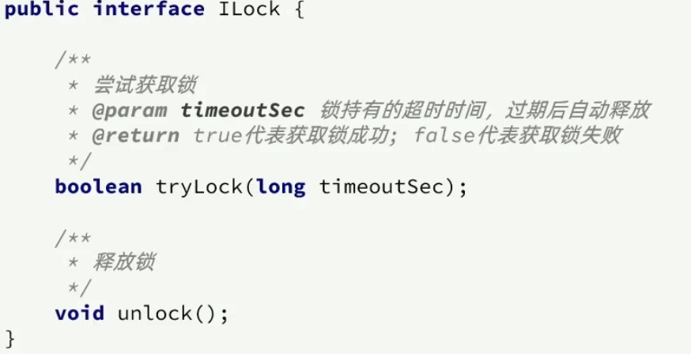
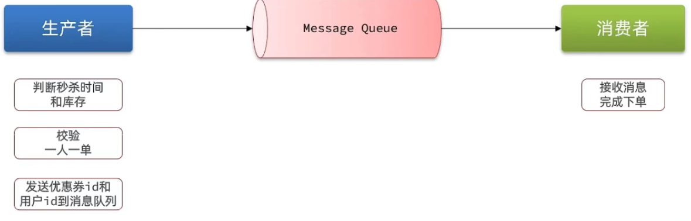
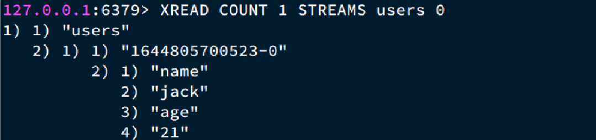
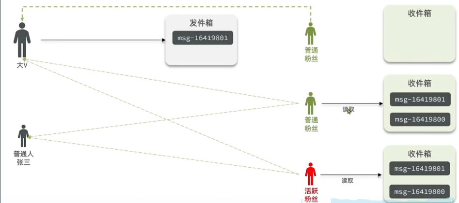
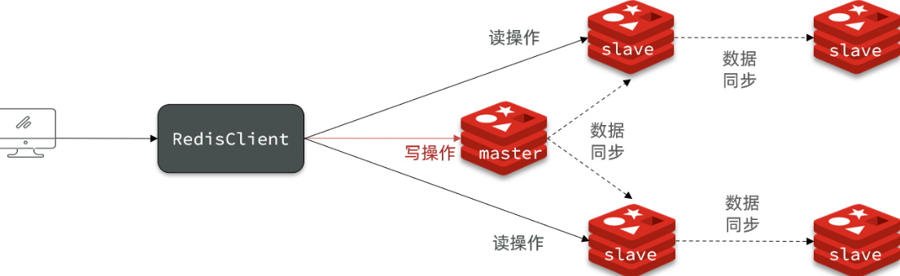

# Redis

Redis是一种键值型（key-value）的NoSql数据库。


# 基础
## Redis初识
### NoSQL是什么？
NoSql可以翻译做Not Only Sql（不仅仅是SQL），或者是No Sql（非Sql的）数据库。是相对于传统关系型数据库而言，有很大差异的一种特殊的数据库，因此也称之为非关系型数据库。

数据库分为：
**结构化：** 传统关系型数据库是结构化数据，每一张表都有严格的约束信息
**非结构化：** 没有严格约束，往往形式松散，自由

根据数据库表之间的关系可分为：
**关联：** 传统的数据库之间表与表之间存在关联
**不关联：** 非传统的数据库之间不存在关联，要么靠业务逻辑，要么靠数据之间的耦合


**查询方式：传统数据库会基于SQL查询，有统一标准。非传统数据库有查询语法差异很大，各有各的。**

**事务：传统的数据库支持事务，满足ACID特性。非传统数据库不支持事务。**

**存储方式：关系型数据库一般存储在磁盘上；非关系型数据库一般存储在内存上。**

**扩展性：关系型数据库一般是主从模式，由于表与表之间有关联，所以一般做垂直扩展。非关系型数据库一般将数据拆分，存储在不同机器上，一般采用水平拆分。**

### Redis简介
Redis诞生于2009年全称是**Re**mote  **D**ictionary **S**erver 远程词典服务器，是一个基于内存的键值型NoSQL数据库。

特征：

+ 键值（key-value）型，value支持多种不同数据结构，功能丰富
+ 单线程，每个命令具备原子性
+ 低延迟，速度快（基于内存.IO多路复用.良好的编码）。
+ 支持数据持久化
+ 支持主从集群.分片集群
+ 支持多语言客户端

Redis的官方网站地址：[https://redis.io/](https://redis.io/)

****

### Redis安装
Redis安装分Linux、Win上两种：

单机redis安装：

1. 准备redis安装包
2. 准备所需要的依赖：

```java
yum install -y gcc tcl
```

3. 解压

```java
tar -xzf redis-6.2.4.tar.gz
```

4. 切换到主目录中，编译

```java
make && make install 
```

5. 修改配置：

```java
# 绑定地址，默认是127.0.0.1，会导致只能在本地访问。修改为0.0.0.0则可以在任意IP访问
bind 0.0.0.0
# 保护模式，关闭保护模式
protected-mode no
# 数据库数量，设置为1
databases 1
```

6. 启动redis：

```java
redis-server redis.conf
```

7. 停止redis：

```java
redis-cli shutdown
```

### Redis桌面客户端


1. 自带的命令行：redis-cli [options] [commonds]工具
2. [https://github.com/uglide/RedisDesktopManager](https://github.com/uglide/RedisDesktopManager)    


## Redis常用命令
### Redis中数据结构
Redis的key一般是String类型，但是Value有很多类型：


### 通用命令
```plsql
- KEYS：查看符合模板的所有key
keys *
keys a*
- DEL：删除一个指定的key
del name #删除单个
- EXISTS：判断key是否存在
exists age
- EXPIRE：给一个key设置有效期，有效期到期时该key会被自动删除
expire age 10
- TTL：查看一个KEY的剩余有效期
ttl age
```


### String命令
Value为String类型，根据类型不同，还可以分为3种：String、int、float


```plsql
* SET：添加或者修改已经存在的一个String类型的键值对
set name Rose
* GET：根据key获取String类型的value
get name 
* MSET：批量添加多个String类型的键值对
MSET k1 v1 k2 v2 k3 v3
* MGET：根据多个key获取多个String类型的value
MGET name age k1 k2 k3
* INCR：让一个整型的key自增1
incr age
* INCRBY:让一个整型的key自增并指定步长，例如：incrby num 2 让num值自增2
incrby age 2
* INCRBYFLOAT：让一个浮点类型的数字自增并指定步长
* SETNX：添加一个String类型的键值对，前提是这个key不存在，否则不执行
setnx name lisi 
* SETEX：添加一个String类型的键值对，并且指定有效期
setex name 10 jack
```


### key的层次结构
为了避免key的重复/冲突，

Redis的key允许有多个单词形成层级结构，多个单词之间用':'隔开，格式如下：


### Hash命令
String结构是将对象序列化为JSON字符串后存储，当需要修改对象某个字段时很不方便。

Hash结构可以将对象中的每个字段独立存储，可以针对单个字段做CRUD。


```plsql
- HSET key field value：添加或者修改hash类型key的field的值
HSET heima:user:3 name Lucy
- HGET key field：获取一个hash类型key的field的值
HGET heima:user:3 name 
- HMSET：批量添加多个hash类型key的field的值
HMSET heima:user:4 name LiLei age 20 sex man
- HMGET：批量获取多个hash类型key的field的值
HMGET heima:user:4 name age sex
- HGETALL：获取一个hash类型的key中的所有的field和value
HGETALL heima:user:4	
- HKEYS：获取一个hash类型的key中的所有的field
HKEYS heima:user:4
HVALS heima:user:4
- HINCRBY:让一个hash类型key的字段值自增并指定步长
HINCRBY  heima:user:4 age 2
- HSETNX：添加一个hash类型的key的field值，前提是这个field不存在，否则不执行
HSETNX heima:user4 sex woman
```


### List命令
Redis中的List类型与Java中的LinkedList类似，可以看做是一个双向链表结构。既可以支持正向检索和也可以支持反向检索。

特征也与LinkedList类似：

+ 有序
+ 元素可以重复
+ 插入和删除快
+ 查询速度一般

常用来存储一个有序数据，例如：朋友圈点赞列表，评论列表等。

```plsql
- LPUSH key element ... ：向列表左侧插入一个或多个元素
LPUSH users 1 2 3
- LPOP key：移除并返回列表左侧的第一个元素，没有则返回nil
LPOP users
- RPUSH key element ... ：向列表右侧插入一个或多个元素
RPUSH users 4 5 6
- RPOP key：移除并返回列表右侧的第一个元素
RPOP users
- LRANGE key star end：返回一段角标范围内的所有元素
LRANGE users 1 2
- BLPOP和BRPOP：与LPOP和RPOP类似，只不过在没有元素时等待指定时间，而不是直接返回nil
```


### Set命令
Redis的Set结构与Java中的HashSet类似，可以看做是一个value为null的HashMap。因为也是一个hash表，因此具备与HashSet类似的特征：

+ 无序
+ 元素不可重复
+ 查找快
+ 支持交集.并集.差集等功能

```plsql
* SADD key member ... ：向set中添加一个或多个元素
sadd s1 a b c
* SREM key member ... : 移除set中的指定元素

* SCARD key： 返回set中元素的个数
SCARD s1
* SISMEMBER key member：判断一个元素是否存在于set中
SISMEMBER s1 a
* SMEMBERS：获取set中的所有元素
smembers s1
* SINTER key1 key2 ... ：求key1与key2的交集

* SDIFF key1 key2 ... ：求key1与key2的差集

* SUNION key1 key2 ..：求key1和key2的并集

```

### SortedSet命令
Redis的SortedSet是一个可排序的set集合，与Java中的TreeSet有些类似，但底层数据结构却差别很大。SortedSet中的每一个元素都带有一个score属性，可以基于score属性对元素排序，底层的实现是一个跳表（SkipList）加 hash表。

SortedSet具备下列特性：

+ 可排序
+ 元素不重复
+ 查询速度快

因为SortedSet的可排序特性，经常被用来实现排行榜这样的功能。

```plsql
- ZADD key score member：添加一个或多个元素到sorted set ，如果已经存在则更新其score值
- ZREM key member：删除sorted set中的一个指定元素
- ZSCORE key member : 获取sorted set中的指定元素的score值
- ZRANK key member：获取sorted set 中的指定元素的排名
- ZCARD key：获取sorted set中的元素个数
- ZCOUNT key min max：统计score值在给定范围内的所有元素的个数
- ZINCRBY key increment member：让sorted set中的指定元素自增，步长为指定的increment值
- ZRANGE key min max：按照score排序后，获取指定排名范围内的元素
- ZRANGEBYSCORE key min max：按照score排序后，获取指定score范围内的元素
- ZDIFF.ZINTER.ZUNION：求差集.交集.并集
```

注意：所有的排名默认都是升序，如果要降序则在命令的Z后面添加REV即可，例如：

+ **升序**获取sorted set 中的指定元素的排名：ZRANK key member
+ **降序**获取sorted set 中的指定元素的排名：ZREVRANK key memeber


## Redis的客户端Jedis
Jedis和Lettuce和SpringDataRedis之间的区别：Jedis 是一个单一的客户端，它支持同步和多线程访问 Redis。 Spring Data Redis 支持多种 Redis 客户端，包括 `Jedis`、`Lettuce`（异步）等。默认使用 `Lettuce` 作为底层客户端，但也可以配置使用 `Jedis`。  

作用：将 Java 应用程序连接到 Redis 数据库

Jedis 是 Redis 的同步 Java 客户端。如果您需要还支持异步和反应式连接的更高级的 Java 客户端，请使用 Lettuce。以下部分介绍如何安装 `Jedis` 并将您的应用程序连接到 Redis 数据库。

`Jedis` 需要正在运行的 Redis 服务器	


连接：通过maven引入依赖

```xml
<dependency>
  <groupId>redis.clients</groupId>
  <artifactId>jedis</artifactId>
  <version>5.2.0</version>
</dependency>
```

测试：打开与redis之间的连接并操作redis

```java
public class JedisTest {
    public static void main(String[] args) {
        UnifiedJedis jedis = new UnifiedJedis("redis://localhost:6379");
        String res1 = jedis.set("bike:1", "Deimos");
        System.out.println(res1); // OK

        String res2 = jedis.get("bike:1");
        System.out.println(res2); // Deimos

        jedis.close();
    }
}
```


Redis集群连接：

```java
import redis.clients.jedis.JedisCluster;
import redis.clients.jedis.HostAndPort;

//...

Set<HostAndPort> jedisClusterNodes = new HashSet<HostAndPort>();
jedisClusterNodes.add(new HostAndPort("127.0.0.1", 7379));
jedisClusterNodes.add(new HostAndPort("127.0.0.1", 7380));
JedisCluster jedis = new JedisCluster(jedisClusterNodes);
```


更多查看官方文档：[https://redis.io/docs/latest/develop/clients/jedis/](https://redis.io/docs/latest/develop/clients/jedis/)


## Redis客户端SpringDataRedis
Spring Data Redis 是更大的 Spring Data 产品组合的一部分，提供从 Spring 应用程序轻松配置和访问 Redis。它提供低级和高级抽象来与 store 交互，使用户无需担心基础设施问题。

特征：

1. 连接包作为跨多个 Redis 驱动程序（Lettuce 和 Jedis）的低级抽象。
2. 将异常转换为 Spring 的可移植数据访问异常层次结构，用于 Redis 驱动程序异常。
3. RedisTemplate，它为执行各种 Redis 操作、异常转换和序列化支持提供了高级抽象。
4. 使用 Lettuce 驱动程序的反应式 API。
5. Redis Sentinel 和 Redis Cluster 支持。
6. JDK、String、JSON 和 Spring Object/XML 映射序列化器。


官方文档地址：[https://docs.spring.io/spring-data/redis/reference/](https://docs.spring.io/spring-data/redis/reference/)

Spring Data Redis 为 Redis 数据库提供 Redis 连接和存储库支持。它简化了具有一致编程模型且需要访问 Redis 数据源的应用程序的开发。

SpringDataRedis中提供了RedisTemplate工具类，其中封装了各种对Redis的操作。并且将不同数据类型的操作API封装到了不同的类型中：


使用RedisTemplate和StringRedisTemplate：

1. 基础环境：

```xml
<?xml version="1.0" encoding="UTF-8"?>
<project xmlns="http://maven.apache.org/POM/4.0.0"
  xmlns:xsi="http://www.w3.org/2001/XMLSchema-instance"
  xsi:schemaLocation="http://maven.apache.org/POM/4.0.0 http://maven.apache.org/xsd/maven-4.0.0.xsd">
  <modelVersion>4.0.0</modelVersion>

  <parent>
    <groupId>org.springframework.boot</groupId>
    <artifactId>spring-boot-starter-parent</artifactId>
    <version>3.4.1</version>
    <relativePath></relativePath>
  </parent>

  <groupId>com.redis</groupId>
  <artifactId>redis-demo</artifactId>
  <version>1.0-SNAPSHOT</version>

  <properties>
    <java.version>17</java.version>
  </properties>

  <dependencies>
    <dependency>
      <groupId>org.springframework.boot</groupId>
      <artifactId>spring-boot-starter-data-redis</artifactId>
    </dependency>
    <dependency>
      <groupId>org.springframework.boot</groupId>
      <artifactId>spring-boot-starter-test</artifactId>
      <scope>test</scope>
    </dependency>

    <dependency>
      <groupId>org.projectlombok</groupId>
      <artifactId>lombok</artifactId>
    </dependency>

    <!--        序列化器，-->
    <dependency>
      <groupId>com.fasterxml.jackson.core</groupId>
      <artifactId>jackson-databind</artifactId>
    </dependency>

    <!--        <dependency>-->
    <!--            <groupId>io.lettuce</groupId>-->
    <!--            <artifactId>lettuce-core</artifactId>-->
    <!--            <version>6.4.1.RELEASE</version>-->
    <!--        </dependency>-->

    <!--        <dependency>-->
    <!--            <groupId>redis.clients</groupId>-->
    <!--            <artifactId>jedis</artifactId>-->
    <!--            <version>5.2.0</version>-->
    <!--        </dependency>-->
  </dependencies>


  <build>
    <plugins>
      <plugin>
        <groupId>org.springframework.boot</groupId>
        <artifactId>spring-boot-maven-plugin</artifactId>
      </plugin>
    </plugins>
  </build>

</project>

```

2. 配置redis连接信息：

```yaml
spring:
  data:
    redis:
      host: localhost
#      password:
      port: 6379
      lettuce:
        pool:
          max-active: 8 #最大连接
          max-idle: 8  # 最大空闲时间
          min-idle: 0
          max-wait: 100ms
```

3. 注册RedisTemplate：

```java
@Resource
private RedisTemplate<String, Object> redisTemplate;

@Test
public void testRedisTemplate() {
    Student student = new Student();
    student.setName("张三");
    student.setAge(11);
    redisTemplate.opsForValue().set("zhangsan", student);
    LOG.info("value: " + redisTemplate.opsForValue().get("zhangsan"));
}
```

3. 原始的RedisTemplate不会自动字符串初始化，我们这里自定义一个自己的RedisTemplate：

```java
@Configuration
public class RedisTemplateConfig {

    @Bean
    public RedisTemplate<String, String> redisTemplate(RedisConnectionFactory connectionFactory) {
        RedisTemplate<String, String> redisTemplate = new RedisTemplate<>();
        redisTemplate.setConnectionFactory(connectionFactory);

        GenericJackson2JsonRedisSerializer jsonRedisSerializer = new GenericJackson2JsonRedisSerializer();

        redisTemplate.setKeySerializer(RedisSerializer.string());
        redisTemplate.setHashKeySerializer(RedisSerializer.string());
        redisTemplate.setValueSerializer(jsonRedisSerializer);
        redisTemplate.setHashValueSerializer(jsonRedisSerializer);

        return redisTemplate;
    }
}
```

4. 方便经常字符串序列化，可以使用依赖中自带的StringRedisTemplate：

```java
@Resource
private StringRedisTemplate stringRedisTemplate;

private static final ObjectMapper objectMapper = new ObjectMapper();

@Test
public void testStringRedisTemplate() throws JsonProcessingException {
    Student student = new Student();
    student.setName("李四");
    student.setAge(22);
    String json = objectMapper.writeValueAsString(student);
    stringRedisTemplate.opsForValue().set("lisi", json);

    json = stringRedisTemplate.opsForValue().get("lisi");
    Student reObject = objectMapper.readValue(json, Student.class);
    System.out.println("返回对象：" + reObject);

}

@Test
public void testHash() {
    stringRedisTemplate.opsForHash().put("zhangsan:100", "name", "zhangsan");
    stringRedisTemplate.opsForHash().put("zhangsan:100", "name", "张三");
    stringRedisTemplate.opsForHash().put("zhangsan:100", "name", "zs");
    stringRedisTemplate.opsForHash().put("zhangsan:100", "age", "111");


}
```

  
 


# 实战（黑马点评）
## 项目结构：
手机或者app端发起请求，请求我们的nginx服务器，nginx基于七层模型走的是HTTP协议，可以实现基于Lua直接绕开tomcat访问redis，也可以作为静态资源服务器，轻松扛下上万并发， 负载均衡到下游tomcat服务器，打散流量，我们都知道一台4核8G的tomcat，在优化和处理简单业务的加持下，大不了就处理1000左右的并发， 经过nginx的负载均衡分流后，利用集群支撑起整个项目，同时nginx在部署了前端项目后，更是可以做到动静分离，进一步降低tomcat服务的压力，这些功能都得靠nginx起作用，所以nginx是整个项目中重要的一环。


在tomcat支撑起并发流量后，我们如果让tomcat直接去访问Mysql，根据经验Mysql企业级服务器只要上点并发，一般是16或32 核心cpu，32 或64G内存，像企业级mysql加上固态硬盘能够支撑的并发，大概就是4000起~7000左右，上万并发， 瞬间就会让Mysql服务器的cpu，硬盘全部打满，容易崩溃，所以我们在高并发场景下，会选择使用mysql集群，同时为了进一步降低Mysql的压力，同时增加访问的性能，我们也会加入Redis，同时使用Redis集群使得Redis对外提供更好的服务。


项目后端的依赖：
```xml
<?xml version="1.0" encoding="UTF-8"?>
<project xmlns="http://maven.apache.org/POM/4.0.0" xmlns:xsi="http://www.w3.org/2001/XMLSchema-instance"
  xsi:schemaLocation="http://maven.apache.org/POM/4.0.0 https://maven.apache.org/xsd/maven-4.0.0.xsd">
  <modelVersion>4.0.0</modelVersion>
  <parent>
    <groupId>org.springframework.boot</groupId>
    <artifactId>spring-boot-starter-parent</artifactId>
    <version>2.3.12.RELEASE</version>
    <relativePath/> <!-- lookup parent from repository -->
  </parent>
  <groupId>com.hmdp</groupId>
  <artifactId>hm-dianping</artifactId>
  <version>0.0.1-SNAPSHOT</version>
  <name>hm-dianping</name>
  <description>Demo project for Spring Boot</description>
  <properties>
    <java.version>1.8</java.version>
  </properties>
  <dependencies>
    <dependency>
      <groupId>org.springframework.boot</groupId>
      <artifactId>spring-boot-starter-data-redis</artifactId>
    </dependency>
    <dependency>
      <groupId>org.apache.commons</groupId>
      <artifactId>commons-pool2</artifactId>
    </dependency>
    <dependency>
      <groupId>org.springframework.boot</groupId>
      <artifactId>spring-boot-starter-web</artifactId>
    </dependency>

    <dependency>
      <groupId>mysql</groupId>
      <artifactId>mysql-connector-java</artifactId>
      <scope>runtime</scope>
      <version>5.1.47</version>
    </dependency>
    <dependency>
      <groupId>org.projectlombok</groupId>
      <artifactId>lombok</artifactId>
      <optional>true</optional>
    </dependency>
    <dependency>
      <groupId>org.springframework.boot</groupId>
      <artifactId>spring-boot-starter-test</artifactId>
      <scope>test</scope>
    </dependency>
    <dependency>
      <groupId>com.baomidou</groupId>
      <artifactId>mybatis-plus-boot-starter</artifactId>
      <version>3.4.3</version>
    </dependency>
    <!--hutool-->
    <dependency>
      <groupId>cn.hutool</groupId>
      <artifactId>hutool-all</artifactId>
      <version>5.7.17</version>
    </dependency>
  </dependencies>

  <build>
    <plugins>
      <plugin>
        <groupId>org.springframework.boot</groupId>
        <artifactId>spring-boot-maven-plugin</artifactId>
        <configuration>
          <excludes>
            <exclude>
              <groupId>org.projectlombok</groupId>
              <artifactId>lombok</artifactId>
            </exclude>
          </excludes>
        </configuration>
      </plugin>
    </plugins>
  </build>

</project>
```

配置了一个分页插件和一个异常捕获类：
```java
@Configuration
public class MybatisConfig {
    @Bean
    public MybatisPlusInterceptor mybatisPlusInterceptor() {
        MybatisPlusInterceptor interceptor = new MybatisPlusInterceptor();
        interceptor.addInnerInterceptor(new PaginationInnerInterceptor(DbType.MYSQL));
        return interceptor;
    }
}
```

```java
@Slf4j
@RestControllerAdvice
public class WebExceptionAdvice {

    @ExceptionHandler(RuntimeException.class)
    public Result handleRuntimeException(RuntimeException e) {
        log.error(e.toString(), e);
        return Result.fail("服务器异常");
    }
}
```

配置文件：

```yaml
server:
  port: 9000
spring:
  application:
    name: hmdp
  datasource:
    driver-class-name: com.mysql.jdbc.Driver
    url: jdbc:mysql://127.0.0.1:3306/hmdp?useSSL=false&serverTimezone=UTC
    username: root
    password: 123456
  redis:
    host: localhost
    port: 6379
    password:
    lettuce:
      pool:
        max-active: 10
        max-idle: 10
        min-idle: 1
        time-between-eviction-runs: 10s
  jackson:
    default-property-inclusion: non_null # JSON处理时忽略非空字段
mybatis-plus:
  type-aliases-package: com.hmdp.entity # 别名扫描包
logging:
  level:
    com.hmdp: debug
```

## 短信登录（使用Redis缓存替换原始Session存储短信验证码）

先看看原始使用Session来缓存短信和用户信息实现用户登录：


分析：

1. 验证码发送是存储在session中的，登录接口校验session中的验证码，实现验证码登录
2. 生成对象信息也是存在session中。
3. 拦截器根据session将用户信息存放到ThreadLocal中。

**使用Session来存储的问题：** 因为每个Tomcat都有自己的session，如果第一次在其中一个Tomcat存放了session，第二次在另外一个Tomcat中登录就发现没有session，这个时候需要session同步来解决问题，但是session同步也有很多弊端：Tomcat都要维护一个列表，延时的问题等等。


下面就使用Redis来代替Session来存储登录状态：

1. 实现验证码接口：将验证码存入到redis中（之前是将验证码放入到session中的）：

```java
@PostMapping("code")
public Result sendCode(@RequestParam("phone") String phone, HttpSession session) {
    //校验手机号
    if (RegexUtils.isPhoneInvalid(phone)) {
        return Result.fail("手机号格式错误！");
    }
    //生成验证码
    String code = RandomUtil.randomNumbers(6);
    //保证验证码到Session中
    //        session.setAttribute("code", code);
    //改进：验证码存放到redis中
    stringRedisTemplate.opsForValue().set(RedisKeyConstant.LOGIN_CODE_KEY + phone, code);
    log.info("发送验证码成功，验证码为：{}", code);
    //验证码发送过去
    return Result.ok();
}
```

2. 实现登录接口：将验证码从redis中取出比对，然后将登录用户信息存入到Redis中，返回对应的token（token是一段随机的字符串，为了后续请求发送过来找到对应的redis，redis中存放了用户信息）

```java
@PostMapping("/login")
public Result login(@RequestBody LoginFormDTO loginForm, HttpSession session) throws JsonProcessingException {
    //校验手机号
    if (RegexUtils.isPhoneInvalid(loginForm.getPhone())) {
        return Result.fail("手机号格式错误");
    }
    //验证验证码
//        Object cacheCode = session.getAttribute("code");
    String cacheCode = stringRedisTemplate.opsForValue().get(RedisKeyConstant.LOGIN_CODE_KEY + loginForm.getPhone());
    if (cacheCode == null || !loginForm.getCode().equals(cacheCode)) {
        return Result.fail("验证码错误");
    }
    //根据手机号查询用户
    User user = userService.getOne(new QueryWrapper<User>().eq("phone", loginForm.getPhone()));
//        UserDTO userDTO = new UserDTO();
    if (user == null) {
        user = new User();
        user.setPhone(loginForm.getPhone());
        user.setNickName("默认名字");
        user.setPassword("123456");
        userService.save(user);
        //保存用户到Session中
//            BeanUtils.copyProperties(saveUser, userDTO);
//            session.setAttribute("user", userDTO);
    }
    String token = UUID.randomUUID().toString(true);
    UserDTO userDTO = BeanUtil.copyProperties(user, UserDTO.class);
    Map<String, Object> map = BeanUtil.beanToMap(userDTO,
            new HashMap<>(),
            CopyOptions.create().setIgnoreNullValue(true).setFieldValueEditor((field, value) -> value.toString()));
    stringRedisTemplate.opsForHash().putAll(RedisKeyConstant.LOGIN_USER_KEY + token, map);
    stringRedisTemplate.expire(RedisKeyConstant.LOGIN_USER_KEY + token, RedisKeyConstant.TIME_OUT, TimeUnit.MINUTES);
    return Result.ok(token);
}
```

**登录拦截器的实现**：为了能在访问所有的路径都能刷新token令牌时间，我们定义了两个拦截器，第一个拦截器负责取出token校验登录，取出redis中的用户信息，存入ThreadLocal，刷新redis中登录用户信息时间。第二个拦截器负责拦截指定的必须要是系统用户才能访问的一些路径。

登录拦截器：校验登录用户是否是存在的，拦截那些需要权限的接口

```java
public class LoginInterceptor implements HandlerInterceptor {
    @Override
    public boolean preHandle(HttpServletRequest request, HttpServletResponse response, Object handler) throws Exception {
        //判断用户是否存在？
        if (UserHolder.getUser() == null) {
            response.setStatus(401);
            return false;
        }
        return true;
    }

    @Override
    public void postHandle(HttpServletRequest request, HttpServletResponse response, Object handler, ModelAndView modelAndView) throws Exception {
        HandlerInterceptor.super.postHandle(request, response, handler, modelAndView);
    }

    @Override
    public void afterCompletion(HttpServletRequest request, HttpServletResponse response, Object handler, Exception ex) throws Exception {
        HandlerInterceptor.super.afterCompletion(request, response, handler, ex);
    }
}
```

刷新redis拦截器：拦截所有的请求，只要是用户还在操作，那么就刷新令牌的时间

```java
public class RefreshRedisKeyInterceptor implements HandlerInterceptor {

    @Resource
    private StringRedisTemplate stringRedisTemplate;
    @Override
    public boolean preHandle(HttpServletRequest request, HttpServletResponse response, Object handler) throws Exception {
        //获取请求头中的token
        String token = request.getHeader("authorization");
        if (token != null) {
            return true;
        }
        //基于token获得redis中的用户
        Map<Object, Object> map = stringRedisTemplate.opsForHash().entries(RedisKeyConstant.LOGIN_USER_KEY + token);
        //判断用户是否存在
        if (map.isEmpty()) {
            return true;
        }
        //存入ThreadLocal
        UserHolder.saveUser(BeanUtil.fillBeanWithMap(map, new UserDTO(), false));
        //刷新redis有效期
        stringRedisTemplate.expire(RedisKeyConstant.LOGIN_USER_KEY + token, RedisKeyConstant.TIME_OUT, TimeUnit.MINUTES);
        //放行
        return true;
    }
}
```

配置类：配置拦截器

```java
@Configuration
public class MvcConfig implements WebMvcConfigurer {

    @Resource
    private StringRedisTemplate stringRedisTemplate;

    @Override
    public void addInterceptors(InterceptorRegistry registry) {
        registry.addInterceptor(new LoginInterceptor())
                .excludePathPatterns(
                        "/shop/**",
                        "/voucher/**",
                        "/shop-type/**",
                        "/upload/**",
                        "/blog/hot",
                        "/user/code",
                        "/user/login"
                ).order(1);
        // token刷新的拦截器
        registry.addInterceptor(new RefreshRedisKeyInterceptor ()).addPathPatterns("/**").order(0);
    }
}
```


## 商户查询缓存
**缓存(Cache)**,就是数据交换的缓冲区,俗称的缓存就是缓冲区内的数据,一般从数据库中获取,存储于本地代码

例如：

```java
例1:Static final ConcurrentHashMap<K,V> map = new ConcurrentHashMap<>(); 本地用于高并发

例2:static final Cache<K,V> USER_CACHE = CacheBuilder.newBuilder().build(); 用于redis等缓存

例3:Static final Map<K,V> map =  new HashMap(); 本地缓存
```

由于其被Static修饰,所以随着类的加载而被加载到内存之中,作为本地缓存,由于其又被final修饰,所以其引用(例3:map)和对象(例3:new HashMap())之间的关系是固定的,不能改变,因此不用担心赋值(=)导致缓存失效;

缓存数据存储于代码中,而代码运行在内存中,内存的读写性能远高于磁盘,缓存可以大大降低用户访问并发量带来的服务器读写压力

### 添加商户缓存

利用redis作为存储数据的中间件，如果商铺存在那么就存入redis一份，返回商铺数据


代码实现：JSONUtil是hutool中的一个对象（提示）
```java
/**
 * 查询商店信息
 * @param id
 * @return
 */
@Override
public Result queryShopById(Long id) {
    //商铺缓存
    String jsonResult = stringRedisTemplate.opsForValue().get(RedisKeyConstant.SHOP_KEY + id);
    //走缓存
    if (jsonResult != null) {
        Shop shop = JSONUtil.toBean(jsonResult, Shop.class);
        return Result.ok(shop);
    }
    //没有缓存，查询数据库，将数据库的信息查出来返回，并且写入缓存
    Shop shop = getById(id);
    if (shop == null) {
        return Result.fail("店铺不存在");
    }
    try {
        stringRedisTemplate.opsForValue().set(RedisKeyConstant.SHOP_KEY + id,JSONUtil.toJsonStr(shop));
    } catch (Exception e) {
        throw new RuntimeException("写入缓存失败");
    }
    return Result.ok(shop);
}
```

### 缓存更新策略（先操作数据库，在操作缓存）
缓存更新是redis为了节约内存而设计出来的一个东西，主要是因为内存数据宝贵，当我们向redis插入太多数据，此时就可能会导致缓存中的数据过多，**所以redis会对部分数据进行更新，或者把他叫为淘汰更合适**。

1. **内存淘汰：** redis自动进行，当redis内存达到咱们设定的max-memery的时候，会自动触发淘汰机制，淘汰掉一些不重要的数据(可以自己设置策略方式，[redis的数据淘汰策略](#Redis数据淘汰策略有哪些？))
2. **超时剔除：** 当我们给redis设置了过期时间ttl之后，redis会将超时的数据进行删除，方便咱们继续使用缓存（[Redis数据过期策略有哪些？](#Redis数据过期策略有哪些？)）
3. 主**动更新：** 我们可以手动调用方法把缓存删掉，通常用于解决缓存和数据库不一致问题

用户使用缓存中的过时数据,就会产生类似多线程数据安全问题,从而影响业务,产品口碑等;怎么解决呢？有如下几种方案：
[如何保证Redis与Mysql双写一致性？](https://www.cnblogs.com/coderacademy/p/18137480)
1. Cache Aside Pattern 人工编码方式：缓存调用者在更新完数据库后再去更新缓存，也称之为双写方案
2. Read/Write Through Pattern : 由系统本身完成，数据库与缓存的问题交由系统本身去处理
3. Write Behind Caching Pattern ：调用者只操作缓存，其他线程去异步处理数据库，实现最终一致


综合考虑使用方案一，但是方案一调用者如何处理呢？这里有几个问题：
如果采用第一个方案，那么假设我们每次操作数据库后，都操作缓存，但是中间如果没有人查询，那么这个更新动作实际上只有最后一次生效，中间的更新动作意义并不大，我们可以把缓存删除，等待再次查询时，将缓存中的数据加载出来
+ 删除缓存还是更新缓存？
    - 更新缓存：每次更新数据库都更新缓存，无效写操作较多
    - 删除缓存：更新数据库时让缓存失效，查询时再更新缓存（推荐）
+ 如何保证缓存与数据库的操作的同时成功或失败？
    - 单体系统，将缓存与数据库操作放在一个事务
    - 分布式系统，利用TCC等分布式事务方案
+ 先操作缓存还是先操作数据库？
    - 先删除缓存，再操作数据库
    - 先操作数据库，再删除缓存（推荐）

应该具体操作缓存还是操作数据库，我们应当是先操作数据库，再删除缓存，原因在于，如果你选择第一种方案，在两个线程并发来访问时，假设线程1（删除缓存更新数据库操作）先来，他先把缓存删了，此时线程2（查询）过来，他查询缓存数据并不存在，此时他写入缓存，当他写入缓存后，线程1再执行更新动作时，实际上写入的就是旧的数据，新的数据被旧数据覆盖了。


代码改造：

1. 查询商铺信息，缓存存在直接走缓存，缓存不存在，查数据库重新写入缓存并设置时间

```java
public Result queryShopById(Long id) {
    //商铺缓存
    String jsonResult = stringRedisTemplate.opsForValue().get(RedisKeyConstant.SHOP_KEY + id);
    //走缓存
    if (jsonResult != null) {
        Shop shop = JSONUtil.toBean(jsonResult, Shop.class);
        return Result.ok(shop);
    }
    //没有缓存，查询数据库，将数据库的信息查出来返回，并且写入缓存
    Shop shop = getById(id);
    if (shop == null) {
        return Result.fail("店铺不存在");
    }
    try {
        //查询数据库写入缓存
        stringRedisTemplate.opsForValue().set(RedisKeyConstant.SHOP_KEY + id,JSONUtil.toJsonStr(shop), 30L, TimeUnit.MINUTES);
    } catch (Exception e) {
        throw new RuntimeException("写入缓存失败");
    }
    return Result.ok(shop);
}
```

2. 更新商铺信息，更新数据库和删除缓存应该是同一事务操作：

```java
@Override
@Transactional
public Result updateShop(Shop shop) {
    Long id = shop.getId();
    if (id == null) {
        return Result.fail("店铺id不能为空");
    }
    //更新数据库
    updateById(shop);
    //缓存失效
    stringRedisTemplate.delete(RedisKeyConstant.SHOP_KEY + id);
    return Result.ok();
}
```


### 缓存穿透（缓存空对象或者使用布隆过滤）
**缓存穿透：用户请求访问一个不存在的对象，就会永远去请求数据库，造成资源的浪费。**

解决

+ 缓存空对象
    - 优点：实现简单，维护方便
    - 缺点：
        * 额外的内存消耗
        * 可能造成短期的不一致
+ 布隆过滤
    - 优点：内存占用较少，没有多余key
    - 缺点：
        * 实现复杂
        * 存在误判可能

**缓存空对象思路分析：** 当我们客户端访问不存在的数据时，先请求redis，但是此时redis中没有数据，此时会访问到数据库，但是数据库中也没有数据，这个数据穿透了缓存，直击数据库，我们都知道数据库能够承载的并发不如redis这么高，如果大量的请求同时过来访问这种不存在的数据，这些请求就都会访问到数据库，简单的解决方案就是哪怕这个数据在数据库中也不存在，我们也把这个数据存入到redis中去，这样，下次用户过来访问这个不存在的数据，那么在redis中也能找到这个数据就不会进入到缓存了

**布隆过滤：** 布隆过滤器其实采用的是哈希思想来解决这个问题，通过一个庞大的二进制数组，走哈希思想去判断当前这个要查询的这个数据是否存在，如果布隆过滤器判断存在，则放行，这个请求会去访问redis，哪怕此时redis中的数据过期了，但是数据库中一定存在这个数据，在数据库中查询出来这个数据后，再将其放入到redis中，假设布隆过滤器判断这个数据不存在，则直接返回

这种方式优点在于节约内存空间，存在误判，误判原因在于：布隆过滤器走的是哈希思想，只要哈希思想，就可能存在哈希冲突，但是可以控制误判的比率


**解决缓存穿透问题：（使用空对象解决）**

在原来的逻辑中，我们如果发现这个数据在mysql中不存在，直接就返回404了，这样是会存在缓存穿透问题的

现在的逻辑中：如果这个数据不存在，我们不会返回404 ，还是会把这个数据写入到Redis中，并且将value设置为空，而当再次发起查询时，我们如果发现命中之后，判断这个value是否是null，如果是null，则是之前写入的数据，证明是缓存穿透数据，如果不是，则直接返回数据


**代码实现：这里在不存在店铺数据的时候存了一个null字符串，在查询的时候通过判断null来表示店铺数据的不存在，防止缓存穿透。**

```java
@Override
public Result queryShopById(Long id) {
    //商铺缓存
    String jsonResult = stringRedisTemplate.opsForValue().get(RedisKeyConstant.SHOP_KEY + id);
    //走缓存
    if (jsonResult != null) {
        if (jsonResult.equals("null")) {
            //店铺不存在的情况，走了缓存，不走数据库了
            return Result.ok(null);
        }
        Shop shop = JSONUtil.toBean(jsonResult, Shop.class);
        return Result.ok(shop);
    }
    //没有缓存，查询数据库，将数据库的信息查出来返回，并且写入缓存
    Shop shop = getById(id);
    if (shop == null) {
        //商铺数据不存在，我们存入一个null值，防止缓存穿透
        stringRedisTemplate.opsForValue().set(RedisKeyConstant.SHOP_KEY + id, "null", 30L, TimeUnit.MINUTES);
        return Result.ok(null);
    }
    try {
        //查询数据库写入缓存
        stringRedisTemplate.opsForValue().set(RedisKeyConstant.SHOP_KEY + id,JSONUtil.toJsonStr(shop), 30L, TimeUnit.MINUTES);
    } catch (Exception e) {
        throw new RuntimeException("写入缓存失败");
    }
    return Result.ok(shop);
}
```

### 缓存雪崩（防止key在同一时段大量失效）
缓存雪崩是指在**同一时段大量的缓存key同时失效或者Redis服务宕机，导致大量请求到达数据库，带来巨大压力。**

解决方案：

+ 给不同的Key的TTL添加随机值，是key的失效时间分散
+ 利用Redis集群提高服务的可用性
+ 给缓存业务添加降级限流策略
+ 给业务添加多级缓存


### 缓存击穿（互斥锁或逻辑过期解决）
**缓存击穿问题也叫热点Key问题，就是一个被高并发访问并且缓存重建业务较复杂的key突然失效了，无数的请求访问会在瞬间给数据库带来巨大的冲击。**

常见的解决方案有两种：
+ 互斥锁
+ 逻辑过期

问题分析：假设线程1在查询缓存之后，本来应该去查询数据库，然后把这个数据重新加载到缓存的，此时只要线程1走完这个逻辑，其他线程就都能从缓存中加载这些数据了，但是假设在线程1没有走完的时候，后续的线程2，线程3，线程4同时过来访问当前这个方法， 那么这些线程都不能从缓存中查询到数据，那么他们就会同一时刻来访问查询缓存，都没查到，接着同一时间去访问数据库，同时的去执行数据库代码，对数据库访问压力过大


1. 使用互斥锁来解决：
因为锁能实现互斥性。假设线程过来，只能一个人一个人的来访问数据库，从而避免对于数据库访问压力过大，但这也会影响查询的性能，因为此时会让查询的性能从并行变成了串行，我们可以采用tryLock方法 + double check来解决这样的问题。

假设现在线程1过来访问，他查询缓存没有命中，但是此时他获得到了锁的资源，那么线程1就会一个人去执行逻辑，假设现在线程2过来，线程2在执行过程中，并没有获得到锁，那么线程2就可以进行到休眠，直到线程1把锁释放后，线程2获得到锁，然后再来执行逻辑，此时就能够从缓存中拿到数据了。

哪个线程先进行构建缓存的代码里面就先获得锁。


2. 使用逻辑过期

方案分析：**我们之所以会出现这个缓存击穿问题，主要原因是在于我们对key设置了过期时间，假设我们不设置过期时间，其实就不会有缓存击穿的问题，但是不设置过期时间，这样数据不就一直占用我们内存了吗，我们可以采用逻辑过期方案。**

我们把过期时间设置在 redis的value中，注意：这个过期时间并不会直接作用于redis，而是我们后续通过逻辑去处理。假设线程1去查询缓存，然后从value中判断出来当前的数据已经过期了，此时线程1去获得互斥锁，那么其他线程会进行阻塞，获得了锁的线程他会开启一个 线程去进行 以前的重构数据的逻辑，直到新开的线程完成这个逻辑后，才释放锁， 而线程1直接进行返回，假设现在线程3过来访问，由于线程线程2持有着锁，所以线程3无法获得锁，线程3也直接返回数据，只有等到新开的线程2把重建数据构建完后，其他线程才能走返回正确的数据。

这种方案巧妙在于，异步的构建缓存，缺点在于在构建完缓存之前，返回的都是脏数据。

线程1开启线程2来完成缓存重构，线程1是直接返回了。


**互斥锁方案：** 由于保证了互斥性，所以数据强一致，且实现简单，因为仅仅只需要加一把锁而已，也没其他的事情需要操心，所以没有额外的内存消耗，缺点在于有锁就有死锁问题的发生，且只能串行执行性能肯定受到影响

**逻辑过期方案：** 线程读取过程中不需要等待，性能好，有一个额外的线程持有锁去进行重构数据，但是在重构数据完成前，其他的线程只能返回之前的旧数据，且实现起来麻烦

综合考虑，如果需要强一致性但是不在意性能差异可以使用互斥锁方案，如果在意性能而不在意一致性可以使用逻辑过期方案。


### 利用互斥锁解决缓存击穿
核心思路：相较于原来从缓存中查询不到数据后直接查询数据库而言，现在的方案是 进行查询之后，如果从缓存没有查询到数据，则进行互斥锁的获取，获取互斥锁后，判断是否获得到了锁，如果没有获得到，则休眠，过一会再进行尝试，直到获取到锁为止，才能进行查询

如果获取到了锁的线程，再去进行查询，查询后将数据写入redis，再释放锁，返回数据，利用互斥锁就能保证只有一个线程去执行操作数据库的逻辑，防止缓存击穿


核心思路就是利用redis的setnx方法来表示获取锁，该方法含义是redis中如果没有这个key，则插入成功，返回1，在stringRedisTemplate中返回true， 如果有这个key则插入失败，则返回0，在stringRedisTemplate返回false，我们可以通过true，或者是false，来表示是否有线程成功插入key，成功插入的key的线程我们认为他就是获得到锁的线程。重点就在于这个加锁和解锁

代码实现：

```java
@Override
public Result queryShopById(Long id) {
    //商铺缓存
    String jsonResult = stringRedisTemplate.opsForValue().get(RedisKeyConstant.SHOP_KEY + id);
    //走缓存的逻辑
    if (jsonResult != null) {
        if (jsonResult.equals("null")) {
            //店铺不存在的情况，走了缓存，不走数据库了
            return Result.ok(null);
        }
        Shop shop = JSONUtil.toBean(jsonResult, Shop.class);
        return Result.ok(shop);
    }
    //没有缓存，查询数据库，将数据库的信息查出来返回，并且写入缓存
    //现在为了解决缓存击穿的问题，要先获得互斥锁才能查询数据库重建缓存
    Shop shop = null;
    try {
        boolean lock = tryLock(RedisKeyConstant.SHOP_LOCK_KEY + id);
        if (!lock) {
            //没拿到锁
            try {
                //休息0.5秒，重新操作
                Thread.sleep(500);
                return queryShopById(id);
            } catch (InterruptedException e) {
                throw new RuntimeException(e);
            }
        }
        shop = getById(id);
        if (shop == null) {
            //商铺数据不存在，我们存入一个null值，防止缓存穿透
            stringRedisTemplate.opsForValue().set(RedisKeyConstant.SHOP_KEY + id, "null", 30L, TimeUnit.MINUTES);
            return Result.ok(null);
        }
        try {
            //查询数据库写入缓存
            stringRedisTemplate.opsForValue().set(RedisKeyConstant.SHOP_KEY + id,JSONUtil.toJsonStr(shop), 30L, TimeUnit.MINUTES);
        } catch (Exception e) {
            throw new RuntimeException("写入缓存失败");
        }
    } catch (Exception e) {
        throw new RuntimeException("异常");
    } finally {
        //解锁
        unLock(RedisKeyConstant.SHOP_LOCK_KEY + id);
    }
    return Result.ok(shop);
}

    public boolean tryLock(String key) {
        //redis.setnx()，锁设置了超时时间的啊
        Boolean flag = stringRedisTemplate.opsForValue().setIfAbsent(key, "1", 10, TimeUnit.SECONDS);
        return BooleanUtil.isTrue(flag);
    }
    public void unLock(String key) {
        stringRedisTemplate.delete(key);
    }
```


### 利用逻辑过期解决缓存击穿
**需求：** 修改根据id查询商铺的业务，基于逻辑过期方式来解决缓存击穿问题

**思路分析：** 当用户开始查询redis时，判断是否命中，如果没有命中则直接返回空数据，不查询数据库，而一旦命中后，将value取出，判断value中的过期时间是否满足，如果没有过期，则直接返回redis中的数据，如果过期，则在开启独立线程后直接返回之前的数据，独立线程去重构数据，重构完成后释放互斥锁。


特点就是在缓存过期的时候重新开启一个新的线程去重建缓存，只是部分时候会造成旧数据的问题。

```java
private static final ExecutorService CACHE_REBUILD_EXECUTOR = Executors.newFixedThreadPool(10);

public Result queryShopById2(Long id) {
    //1. 查询缓存
    String json = stringRedisTemplate.opsForValue().get(RedisKeyConstant.SHOP_KEY + id);
    //2. 缓存不存在，查询数据库，重建缓存，返回结果
    if (StrUtil.isBlank(json)) {
        Shop shop = getById(id);
        if (shop == null) {
            //商铺数据不存在，我们存入一个null值，防止缓存穿透
            stringRedisTemplate.opsForValue().set(RedisKeyConstant.SHOP_KEY + id, "null", 30L, TimeUnit.MINUTES);
            return Result.ok(null);
        }
        //查询数据库写入缓存
        RedisData redisData = new RedisData();
        redisData.setData(shop);
        redisData.setExpireTime(LocalDateTime.now().plusMinutes(20));
        stringRedisTemplate.opsForValue().set(RedisKeyConstant.SHOP_KEY + id,JSONUtil.toJsonStr(redisData), 30L, TimeUnit.MINUTES);
        return Result.ok(shop);
    }
    if (json.equals("null")) {
        //店铺不存在的情况，走了缓存，不走数据库了
        return Result.ok(null);
    }
    //3. 缓存存在，还要判断是否过期
    RedisData redisData = BeanUtil.toBean(json, RedisData.class);
    Shop shop = BeanUtil.toBean(redisData.getData(), Shop.class);
    //逻辑过期时间
    LocalDateTime expireTime = redisData.getExpireTime();
    //4. 没有过期直接返回
    if (expireTime.isAfter(LocalDateTime.now())) {
        return Result.ok(shop);
    }
    //5. 过期了，加锁，开启新的线程查询数据库，重建缓存
    boolean lock = tryLock(RedisKeyConstant.SHOP_LOCK_KEY + id);
    if (lock) {
        CACHE_REBUILD_EXECUTOR.execute(() -> {
            //重建缓存
            try {
                //查询数据库
                Shop newShop = getById(id);
                //构建RedisData
                RedisData redisData1 = new RedisData();
                redisData1.setData(newShop);
                //20分钟吧
                redisData1.setExpireTime(LocalDateTime.now().plusMinutes(20));
                stringRedisTemplate.opsForValue().set(RedisKeyConstant.SHOP_KEY + id, JSONUtil.toJsonStr(redisData1));
            } catch (Exception e) {
                throw new RuntimeException();
            } finally {
                unLock(RedisKeyConstant.SHOP_LOCK_KEY + id);
            }
        });
    }
    // 6.4.返回过期的商铺信息
    return Result.ok(shop);
}
```


## 优惠券秒杀
每个店铺都可以发布如下的优惠券：

### 全局id
当用户抢购时，就会生成订单并保存到tb_voucher_order这张表中，**而订单表如果使用数据库自增ID就存在一些问题：**

+ id的规律性太明显
+ 受单表数据量的限制

场景分析：如果我们的id具有太明显的规则，用户或者说商业对手很容易猜测出来我们的一些敏感信息，比如商城在一天时间内，卖出了多少单，这明显不合适。

场景分析二：随着我们商城规模越来越大，mysql的单表的容量不宜超过500W，数据量过大之后，我们要进行拆库拆表，但拆分表了之后，他们从逻辑上讲他们是同一张表，所以他们的id是不能一样的， 于是乎我们需要保证id的唯一性。

**全局ID生成器，是一种在分布式系统下用来生成全局唯一ID的工具，一般要满足下列特性：**

为了增加ID的安全性，我们可以不直接使用Redis自增的数值，而是拼接一些其它信息：


ID的组成部分：符号位：1bit，永远为0

时间戳：31bit，以秒为单位，可以使用69年

序列号：32bit，秒内的计数器，支持每秒产生2^32个不同ID

```java
@Component
public class RedisIdWorker {
    /**
     * 开始时间戳
     */
    private static final long BEGIN_TIMESTAMP = 1640995200L;
    /**
     * 序列号的位数
     */
    private static final int COUNT_BITS = 32;

    private StringRedisTemplate stringRedisTemplate;

    public RedisIdWorker(StringRedisTemplate stringRedisTemplate) {
        this.stringRedisTemplate = stringRedisTemplate;
    }

    public long nextId(String keyPrefix) {
        // 1.生成时间戳
        LocalDateTime now = LocalDateTime.now();
        long nowSecond = now.toEpochSecond(ZoneOffset.UTC);
        long timestamp = nowSecond - BEGIN_TIMESTAMP;

        // 2.生成序列号
        // 2.1.获取当前日期，精确到天
        String date = now.format(DateTimeFormatter.ofPattern("yyyy:MM:dd"));
        // 2.2.自增长
        long count = stringRedisTemplate.opsForValue().increment("icr:" + keyPrefix + ":" + date);

        // 3.拼接并返回
        return timestamp << COUNT_BITS | count;
    }
}
```


### 实现优惠券秒杀
思路就是：用户抢购优惠券，判断秒杀是否开始，再判断库存是否充足，两者都满足，扣减库存，创建订单，返回订单id


代码思路：判断优惠券存在的条件，扣减创建订单，保存订单。
```java
@Override
@Transactional
public Result seckillVoucher(Long voucherId) {
    //获取秒杀优惠券信息
    SeckillVoucher voucher = seckillVoucherService.getById(voucherId);
    // 2.判断秒杀是否开始
    if (voucher.getBeginTime().isAfter(LocalDateTime.now())) {
        // 尚未开始
        return Result.fail("秒杀尚未开始！");
    }
    // 3.判断秒杀是否已经结束
    if (voucher.getEndTime().isBefore(LocalDateTime.now())) {
        // 尚未开始
        return Result.fail("秒杀已经结束！");
    }
    // 4.判断库存是否充足
    if (voucher.getStock() < 1) {
        // 库存不足
        return Result.fail("库存不足！");
    }
    //5，扣减库存
    boolean success = seckillVoucherService.update()
            .setSql("stock= stock -1")
            .eq("voucher_id", voucherId).update();
    if (!success) {
        //扣减库存
        return Result.fail("失败！");
    }
    //6.创建订单保存订单
    VoucherOrder voucherOrder = new VoucherOrder();
    // 6.1.订单id
    long orderId = redisIdWorker.nextId("order");
    voucherOrder.setId(orderId);
    // 6.2.用户id
    Long userId = UserHolder.getUser().getId();
    voucherOrder.setUserId(userId);
    // 6.3.代金券id
    voucherOrder.setVoucherId(voucherId);
    save(voucherOrder);

    return Result.ok(orderId);
}
```


### 库存超卖问题

假设线程1过来查询库存，判断出来库存大于1，正准备去扣减库存，但是还没有来得及去扣减，此时线程2过来，线程2也去查询库存，发现这个数量一定也大于1，那么这两个线程都会去扣减库存，最终多个线程相当于一起去扣减库存，此时就会出现库存的超卖问题。


**超卖问题是典型的多线程安全问题，针对这一问题的常见解决方案就是加锁：而对于加锁，我们通常有两种解决方案：见下图：**


悲观锁：悲观锁可以实现对于数据的串行化执行，比如syn，和lock都是悲观锁的代表，同时，悲观锁中又可以再细分为公平锁，非公平锁，可重入锁，等等

乐观锁：会有一个版本号，每次操作数据会对版本号+1，再提交回数据时，会去校验是否比之前的版本大1 ，如果大1 ，则进行操作成功，这套机制的核心逻辑在于，如果在操作过程中，版本号只比原来大1 ，那么就意味着操作过程中没有人对他进行过修改，他的操作就是安全的，如果不大1，则数据被修改过，当然乐观锁还有一些变种的处理方式比如cas

课程中使用乐观锁解决超卖问题：
两个线程同时出发，都准备扣减，此时version都是1，stock准备-1，如果有一个线程成功了，那么version+1成为了2，另外一个因为执行条件version == 1不成立就会导致更新失败，解决了超卖问题。

### 使用乐观锁解决超卖问题
第一种方案：
```java
boolean success = seckillVoucherService.update()
            .setSql("stock= stock -1") //set stock = stock -1
            .eq("voucher_id", voucherId).eq("stock",voucher.getStock()).update(); //where id = ？ and stock = ?
```

以上逻辑的核心含义是：**只要我扣减库存时的库存和之前我查询到的库存是一样的，就意味着没有人在中间修改过库存，那么此时就是安全的，但是以上这种方式通过测试发现会有很多失败的情况**，失败的原因在于：在使用乐观锁过程中假设100个线程同时都拿到了100的库存，然后大家一起去进行扣减，但是100个人中只有1个人能扣减成功，其他的人在处理时，他们在扣减时，库存已经被修改过了，所以此时其他线程都会失败

第二种方案：在扣减的时候判断库存是否大于0

```java
boolean success = seckillVoucherService.update()
            .setSql("stock= stock -1")
            .eq("voucher_id", voucherId).update().gt("stock",0); //where id = ? and stock > 0
```

之前的方式要修改前后都保持一致，但是这样我们分析过，成功的概率太低，所以我们的乐观锁需要变一下，改成stock大于0 即可


### 实现一人一单
**需求：** 修改秒杀业务，要求同一个优惠券，一个用户只能下一单

**思路：** 具体操作逻辑如下：比如时间是否充足，如果时间充足，则进一步判断库存是否足够，然后再**根据优惠卷id和用户id查询是否已经下过这个订单**，如果下过这个订单，则不再下单，否则扣减库存进行下单


初步实现：int count = query().eq("user_id", userId).eq("voucher_id", voucherId).count();重点根据用户di和优惠券id查询是否购买了优惠券

```java

@Override
public Result seckillVoucher(Long voucherId) {
    // 1.查询优惠券
    SeckillVoucher voucher = seckillVoucherService.getById(voucherId);
    // 2.判断秒杀是否开始
    if (voucher.getBeginTime().isAfter(LocalDateTime.now())) {
        // 尚未开始
        return Result.fail("秒杀尚未开始！");
    }
    // 3.判断秒杀是否已经结束
    if (voucher.getEndTime().isBefore(LocalDateTime.now())) {
        // 尚未开始
        return Result.fail("秒杀已经结束！");
    }
    // 4.判断库存是否充足
    if (voucher.getStock() < 1) {
        // 库存不足
        return Result.fail("库存不足！");
    }
    // 5.一人一单逻辑
    // 5.1.用户id
    Long userId = UserHolder.getUser().getId();
    int count = query().eq("user_id", userId).eq("voucher_id", voucherId).count();
    // 5.2.判断是否存在
    if (count > 0) {
        // 用户已经购买过了
        return Result.fail("用户已经购买过一次！");
    }

    //6，扣减库存
    boolean success = seckillVoucherService.update()
            .setSql("stock= stock -1")
            .eq("voucher_id", voucherId).update();
    if (!success) {
        //扣减库存
        return Result.fail("库存不足！");
    }
    //7.创建订单
    VoucherOrder voucherOrder = new VoucherOrder();
    // 7.1.订单id
    long orderId = redisIdWorker.nextId("order");
    voucherOrder.setId(orderId);

    voucherOrder.setUserId(userId);
    // 7.3.代金券id
    voucherOrder.setVoucherId(voucherId);
    save(voucherOrder);

    return Result.ok(orderId);

}
```

**存在问题：** 现在的问题还是和之前一样，并发过来，查询数据库，都不存在订单的购买，那么就会都去创建订单减库存。所以我们还是需要加锁，但是乐观锁比较适合更新数据，而现在是插入数据，所以我们需要使用悲观锁操作

**注意：** 在这里提到了非常多的问题，我们需要慢慢的来思考，首先我们的初始方案是封装了一个createVoucherOrder方法，同时为了确保他线程安全，在方法上添加了一把synchronized 锁（对象锁）

这个方法的意义是：一人一单、扣减库存、创建订单变成一个原子操作

```java
@Transactional
public synchronized Result createVoucherOrder(Long voucherId) {

	Long userId = UserHolder.getUser().getId();
     // 5.1.查询订单
    int count = query().eq("user_id", userId).eq("voucher_id", voucherId).count();
    // 5.2.判断是否存在
    if (count > 0) {
        // 用户已经购买过了
        return Result.fail("用户已经购买过一次！");
    }

    // 6.扣减库存
    boolean success = seckillVoucherService.update()
            .setSql("stock = stock - 1") // set stock = stock - 1
            .eq("voucher_id", voucherId).gt("stock", 0) // where id = ? and stock > 0
            .update();
    if (!success) {
        // 扣减失败
        return Result.fail("库存不足！");
    }

    // 7.创建订单
    VoucherOrder voucherOrder = new VoucherOrder();
    // 7.1.订单id
    long orderId = redisIdWorker.nextId("order");
    voucherOrder.setId(orderId);
    // 7.2.用户id
    voucherOrder.setUserId(userId);
    // 7.3.代金券id
    voucherOrder.setVoucherId(voucherId);
    save(voucherOrder);

    // 7.返回订单id
    return Result.ok(orderId);
}
```

但是以上代码还是存在问题，问题的原因在于**当前方法被spring的事务控制，如果你在方法内部加锁，可能会导致当前方法事务还没有提交，但是锁已经释放**也会导致问题，所以我们选择将当前方法整体包裹起来，确保事务不会出现问题：如下：

在seckillVoucher 方法中，添加以下逻辑，这样就能保证事务的特性，同时也控制了锁的粒度


但是以上做法依然有问题，因为你调用的方法，其实是this.的方式调用的，事务想要生效，还得利用代理来生效，所以这个地方，我们需要获得原始的事务对象， 来操作事务


**事务代理机制：** Spring 使用代理来管理事务。事务的创建和提交/回滚是由 Spring 的 AOP 代理来控制的。当你在一个事务方法中直接调用其他方法时，Spring 无法拦截该调用，因此无法为这个方法提供事务管理。

**具体来说，当你在一个类内部调用同一个类的另一个方法（例如  `this.m1()`），该调用不会通过 Spring 的代理类。Spring 事务管理器是通过代理来控制方法调用的，但当调用发生在同一个类的实例内时，代理对象无法发挥作用。**

**代理工作原理：**
+ **代理对象：Spring 会为带有事务注解的方法创建一个代理对象，代理对象会在方法执行前后插入事务管理的逻辑（开启事务、提交/回滚事务）。**
+ **直接调用：当你调用 `this.m1()` 时，调用的是类本身的方法，而不是代理类的方法，因此事务控制逻辑不会被触发。**


### 集群环境下的一人一单的并发问题
通过加锁可以解决在单机情况下的一人一单安全问题，但是在集群模式下就不行了。

我们将服务启动两份，端口分别为8081和8082：

然后修改nginx的conf目录下的nginx.conf文件，配置反向代理和负载均衡：


**锁失效原因：** 由于现在我们部署了多个tomcat，每个tomcat都有一个属于自己的jvm，那么假设在服务器A的tomcat内部，有两个线程，这两个线程由于使用的是同一份代码，那么他们的锁对象是同一个，是可以实现互斥的，但是如果现在是服务器B的tomcat内部，又有两个线程，但是他们的锁对象写的虽然和服务器A一样，但是锁对象却不是同一个，所以线程3和线程4可以实现互斥，但是却无法和线程1和线程2实现互斥，这就是 集群环境下，syn锁失效的原因，在这种情况下，我们就需要使用分布式锁来解决这个问题。

上面的互斥锁是类对象，如果是一个tomcat那么就可以锁住，但是多个tomcat中对象虽然一样，但是各有各的。


## 分布式锁（确保使用同一把锁）
### 基本原理和实现对比
**分布式锁：** 满足分布式系统或集群模式下多进程可见并且互斥的锁。

**分布式锁的核心思想**就是让大家都使用同一把锁，只要大家使用的是同一把锁，那么我们就能锁住线程，不让线程进行，让程序串行执行，这就是分布式锁的核心思路


分布式锁的特性：
+ 可见性：多个线程都能看到相同的结果，注意：这个地方说的可见性并不是并发编程中指的内存可见性，只是说多个进程之间都能感知到变化的意思
+ 互斥：互斥是分布式锁的最基本的条件，使得程序串行执行
+ 高可用：程序不易崩溃，时时刻刻都保证较高的可用性
+ 高性能：由于加锁本身就让性能降低，所有对于分布式锁本身需要他就较高的加锁性能和释放锁性能
+ 安全性：安全也是程序中必不可少的一环

常见的分布式锁实现：
+ Mysql：mysql本身就带有锁机制，但是由于mysql性能本身一般，所以采用分布式锁的情况下，其实使用mysql作为分布式锁比较少见
+ **Redis：redis作为分布式锁是非常常见的一种使用方式，现在企业级开发中基本都使用redis或者zookeeper作为分布式锁，利用setnx这个方法，如果插入key成功，则表示获得到了锁，如果有人插入成功，其他人插入失败则表示无法获得到锁，利用这套逻辑来实现分布式锁**
+ Zookeeper：zookeeper也是企业级开发中较好的一个实现分布式锁的方案，由于本套视频并不讲解zookeeper的原理和分布式锁的实现，所以不过多阐述

### 分布式锁的核心思想
实现分布式锁时需要实现的两个基本方法：
+ 获取锁：
    - 互斥：确保只能有一个线程获取锁
    - 非阻塞：尝试一次，成功返回true，失败返回false
+ 释放锁：
    - 手动释放
    - 超时释放：获取锁时添加一个超时时间

思想：我们利用redis 的setNx 方法，当有多个线程进入时，我们就利用该方法，第一个线程进入时，redis 中就有这个key 了，返回了1，如果结果是1，则表示他抢到了锁，那么他去执行业务，然后再删除锁，退出锁逻辑，没有抢到锁的哥们，等待一定时间后重试即可


### 简单实现分布式锁
锁通用接口：



实现：SimpleRedisLock是实现锁接口一个通用类

```java
  @Override
    public Result seckillVoucher(Long voucherId) {
        // 1.查询优惠券
        SeckillVoucher voucher = seckillVoucherService.getById(voucherId);
        // 2.判断秒杀是否开始
        if (voucher.getBeginTime().isAfter(LocalDateTime.now())) {
            // 尚未开始
            return Result.fail("秒杀尚未开始！");
        }
        // 3.判断秒杀是否已经结束
        if (voucher.getEndTime().isBefore(LocalDateTime.now())) {
            // 尚未开始
            return Result.fail("秒杀已经结束！");
        }
        // 4.判断库存是否充足
        if (voucher.getStock() < 1) {
            // 库存不足
            return Result.fail("库存不足！");
        }
        Long userId = UserHolder.getUser().getId();
        //创建锁对象(新增代码)
        SimpleRedisLock lock = new SimpleRedisLock("order:" + userId, stringRedisTemplate);
        //获取锁对象
        boolean isLock = lock.tryLock(1200);
		//加锁失败，直接返回
        if (!isLock) {
            return Result.fail("不允许重复下单");
        }
        try {
            //执行下面的逻辑是：一人一单、扣减库存、创建订单
            //获取代理对象(事务)
            IVoucherOrderService proxy = (IVoucherOrderService) AopContext.currentProxy();
            return proxy.createVoucherOrder(voucherId);
        } finally {
            //释放锁
            lock.unlock();
        }
    }
```

SimpleRedisLock实现：

```java
public class SimpleRedisLock implements ILock {

    private StringRedisTemplate stringRedisTemplate;

    private String key;

    public SimpleRedisLock(String key,StringRedisTemplate stringRedisTemplate) {
        this.key = key;
        this.stringRedisTemplate = stringRedisTemplate;
    }

    /**
     * 获取锁，使用setnx方法来创建redis
     * @param timeoutSec
     * @return
     */
    @Override
    public boolean tryLock(long timeoutSec) {
        return stringRedisTemplate.opsForValue().setIfAbsent(key, "1", timeoutSec, TimeUnit.SECONDS);
    }

    /**
    *	删除锁
    */
    @Override
    public void unLock() {
        stringRedisTemplate.delete(key);
    }
}
```


### 线程锁被误删的情况
**逻辑说明：**

持有锁的线程在锁的内部出现了阻塞，导致他的锁自动释放，这时其他线程，线程2来尝试获得锁，就拿到了这把锁，然后线程2在持有锁执行过程中，线程1反应过来，继续执行，而线程1执行过程中，**走到了删除锁逻辑，此时就会把本应该属于线程2的锁进行删除，这就是误删别人锁**的情况说明

**解决方案：** 解决方案就是在每个线程释放锁的时候，去判断一下当前这把锁是否属于自己，如果不属于自己，则不进行锁的删除，假设还是上边的情况，线程1卡顿，锁自动释放，线程2进入到锁的内部执行逻辑，此时线程1反应过来，然后删除锁，但是线程1，一看当前这把锁不是属于自己，于是不进行删除锁逻辑，当线程2走到删除锁逻辑时，如果没有卡过自动释放锁的时间点，则判断当前这把锁是属于自己的，于是删除这把锁。


### 解决误删问题（绑定线程标识）
需求：修改之前的分布式锁实现，解决分布式锁误删的问题，满足：在获取锁时存入线程标示（可以用UUID表示）  
在释放锁时先获取锁中的线程标示，判断是否与当前线程标示一致

+ 如果一致则释放锁
+ 如果不一致则不释放锁

核心逻辑：在存入锁时，放入自己线程的标识，在删除锁时，判断当前这把锁的标识是不是自己存入的，如果是，则进行删除，如果不是，则不进行删除。

加锁逻辑修改：
```java
private static final String ID_PREFIX = UUID.randomUUID().toString(true) + "-";
@Override
public boolean tryLock(long timeoutSec) {
   // 获取线程标示
   String threadId = ID_PREFIX + Thread.currentThread().getId();
   // 获取锁
   Boolean success = stringRedisTemplate.opsForValue()
                .setIfAbsent(KEY_PREFIX + name, threadId, timeoutSec, TimeUnit.SECONDS);
   return Boolean.TRUE.equals(success);
}
```

释放锁逻辑修改：

```java
public void unlock() {
    // 获取线程标示
    String threadId = ID_PREFIX + Thread.currentThread().getId();
    // 获取锁中的标示
    String id = stringRedisTemplate.opsForValue().get(KEY_PREFIX + name);
    // 判断标示是否一致
    if(threadId.equals(id)) {
        // 释放锁
        stringRedisTemplate.delete(KEY_PREFIX + name);
    }
}
```

在我们修改完此处代码后，我们重启工程，然后启动两个线程，第一个线程持有锁后，手动释放锁，第二个线程 此时进入到锁内部，再放行第一个线程，此时第一个线程由于锁的value值并非是自己，所以不能释放锁，也就无法删除别人的锁，此时第二个线程能够正确释放锁，通过这个案例初步说明我们解决了锁误删的问题。

**根据线程标识来判断需要释放的锁是不是刚开始获取的那把锁。**


### 分布式锁的原子性问题
更为极端的误删逻辑说明：根据上面删除锁的逻辑说明的啊

线程1现在持有锁之后，在执行业务逻辑过程中，他正准备删除锁，而且已经走到了条件判断的过程中，比如他已经拿到了当前这把锁确实是属于他自己的，正准备删除锁，但是此时他的锁到期了，那么此时线程2进来，但是线程1他会接着往后执行，当他卡顿结束后，他直接就会执行删除锁那行代码，相当于条件判断并没有起到作用，这就是删锁时的原子性问题，之所以有这个问题，是因为线程1的拿锁，比锁，删锁，实际上并不是原子性的，我们要防止刚才的情况发生，


### 使用Lua脚本解决原子性问题
Redis提供了Lua脚本功能，在一个脚本中编写多条Redis命令，确保多条命令执行时的原子性。Lua是一种编程语言，它的基本语法大家可以参考网站：[lua教程](https://www.runoob.com/lua/lua-tutorial.html)，这里重点介绍Redis提供的调用函数，我们可以使用lua去操作redis，又能保证他的原子性，这样就可以实现拿锁比锁删锁是一个原子性动作了，作为Java程序员这一块并不作一个简单要求，并不需要大家过于精通，只需要知道他有什么作用即可。

简单介绍一下lua脚本的调用语句：

```java
redis.call('命令名称', 'key', '其它参数', ...)

# 执行 set name jack
redis.call('set', 'name', 'jack')

# 先执行 set name jack
redis.call('set', 'name', 'Rose')
# 再执行 get name
local name = redis.call('get', 'name')
# 返回
return name
```

调用lua脚本的常见命令如下：


```java
例如，我们要执行 redis.call('set', 'name', 'jack') 这个脚本，语法如下：
```


如果脚本中的key、value不想写死，可以作为参数传递。key类型参数会放入KEYS数组，其它参数会放入ARGV数组，在脚本中可以从KEYS和ARGV数组获取这些参数：


接下来将上面的比锁和释放锁写成一个lua脚本：

```java
-- 这里的 KEYS[1] 就是锁的key，这里的ARGV[1] 就是当前线程标示
-- 获取锁中的标示，判断是否与当前线程标示一致
if (redis.call('GET', KEYS[1]) == ARGV[1]) then
  -- 一致，则删除锁
  return redis.call('DEL', KEYS[1])
end
-- 不一致，则直接返回
return 0
```


**Java代码调用lua脚本：**

我们的RedisTemplate中，可以利用execute方法去执行lua脚本，参数对应关系就如下图：


使用lua脚本解决删除锁的时候的极端情况：拿锁比锁没问题，要删除锁的时候阻塞了，然后回来又误删了其他线程的锁

```java
private static final DefaultRedisScript<Long> UNLOCK_SCRIPT;
static {
    UNLOCK_SCRIPT = new DefaultRedisScript<>();
    UNLOCK_SCRIPT.setLocation(new ClassPathResource("unlock.lua"));
    UNLOCK_SCRIPT.setResultType(Long.class);
}

public SimpleRedisLock(String key,StringRedisTemplate stringRedisTemplate) {
    this.key = key;
    this.stringRedisTemplate = stringRedisTemplate;
}

@Override
public void unLock() {
//        String value = stringRedisTemplate.opsForValue().get(key);
//        if (value.equals(ID_PREFIX + Thread.currentThread().getId())) {
//            stringRedisTemplate.delete(key);
//        }
    stringRedisTemplate.execute(
            UNLOCK_SCRIPT,
            Collections.singletonList(key),
            ID_PREFIX + Thread.currentThread().getId()
    );
}
```


我们一路走来，利用添加过期时间，防止死锁问题的发生，但是有了过期时间之后，可能出现误删别人锁的问题，这个问题我们开始是利用删之前通过拿锁，比锁，删锁这个逻辑来解决的，也就是删之前判断一下当前这把锁是否是属于自己的，但是现在还有原子性问题，也就是我们没法保证拿锁比锁删锁是一个原子性的动作，最后通过lua表达式来解决这个问题


但是目前还剩下一个问题锁不住，什么是锁不住呢，你想一想，如果当过期时间到了之后，我们可以给他续期一下，比如续个30s，就好像是网吧上网， 网费到了之后，然后说，来，网管，再给我来10块的，是不是后边的问题都不会发生了，那么续期问题怎么解决呢，可以依赖于我们接下来要学习redission啦


## Redission分布式锁
基于setnx实现的分布式锁存在下面的问题：
1. **重入问题：** 重入问题是指 获得锁的线程可以再次进入到相同的锁的代码块中，可重入锁的意义在于防止死锁，比如HashTable这样的代码中，他的方法都是使用synchronized修饰的，假如他在一个方法内，调用另一个方法，那么此时如果是不可重入的，不就死锁了吗？所以可重入锁他的主要意义是防止死锁，我们的synchronized和Lock锁都是可重入的。
2. **不可重试：** 是指目前的分布式只能尝试一次，我们认为合理的情况是：当线程在获得锁失败后，他应该能再次尝试获得锁。
3. **超时释放：** 我们在加锁时增加了过期时间，这样的我们可以防止死锁，但是如果卡顿的时间超长，虽然我们采用了lua表达式防止删锁的时候，误删别人的锁，但是毕竟没有锁住，有安全隐患
4. **主从一致性：** 如果Redis提供了主从集群，当我们向集群写数据时，主机需要异步的将数据同步给从机，而万一在同步过去之前，主机宕机了，就会出现死锁问题。

Redisson是一个在Redis的基础上实现的Java驻内存数据网格（In-Memory Data Grid）。它不仅提供了一系列的分布式的Java常用对象，还提供了许多分布式服务，其中就包含了各种分布式锁的实现。

Redission提供了分布式锁的多种多样的功能：
- 可重入锁
- 公平锁
- 联锁
- 红锁
- 读写锁
- 信号量
- 可过期性信号量
- 闭锁

参考：[Redisson详解](https://www.cnblogs.com/jingzh/p/17473137.html)
### 快速入门Redission
1. 引入依赖
```java
<dependency>
	<groupId>org.redisson</groupId>
	<artifactId>redisson</artifactId>
	<version>3.13.6</version>
</dependency>
```

2. 配置客户端
```java
@Configuration
public class RedissonConfig {

    @Bean
    public RedissonClient redissonClient(){
        // 配置
        Config config = new Config();
        config.useSingleServer().setAddress("redis://192.168.150.101:6379")
            .setPassword("123321");
        // 创建RedissonClient对象
        return Redisson.create(config);
    }
}
```

3. 使用Redission分布式锁：
```java
@Resource
private RedissionClient redissonClient;

@Test
void testRedisson() throws Exception{
    //获取锁(可重入)，指定锁的名称
    RLock lock = redissonClient.getLock("anyLock");
    //尝试获取锁，参数分别是：获取锁的最大等待时间(期间会重试)，锁自动释放时间，时间单位
    boolean isLock = lock.tryLock(1,10,TimeUnit.SECONDS);
    //判断获取锁成功
    if(isLock){
        try{
            System.out.println("执行业务");          
        }finally{
            //释放锁
            lock.unlock();
        }  
    }
}
```

业务中使用RedissonClient：用redissonClient替代自定义实现的simpleLock
```java
@Resource
private RedissonClient redissonClient;

@Override
public Result seckillVoucher(Long voucherId) {
        // 1.查询优惠券
        SeckillVoucher voucher = seckillVoucherService.getById(voucherId);
        // 2.判断秒杀是否开始
        if (voucher.getBeginTime().isAfter(LocalDateTime.now())) {
            // 尚未开始
            return Result.fail("秒杀尚未开始！");
        }
        // 3.判断秒杀是否已经结束
        if (voucher.getEndTime().isBefore(LocalDateTime.now())) {
            // 尚未开始
            return Result.fail("秒杀已经结束！");
        }
        // 4.判断库存是否充足
        if (voucher.getStock() < 1) {
            // 库存不足
            return Result.fail("库存不足！");
        }
        Long userId = UserHolder.getUser().getId();
        //创建锁对象 这个代码不用了，因为我们现在要使用分布式锁
        //SimpleRedisLock lock = new SimpleRedisLock("order:" + userId, stringRedisTemplate);
        RLock lock = redissonClient.getLock("lock:order:" + userId);
        //获取锁对象
        boolean isLock = lock.tryLock();
       
		//加锁失败
        if (!isLock) {
            return Result.fail("不允许重复下单");
        }
        try {
            //获取代理对象(事务)
            IVoucherOrderService proxy = (IVoucherOrderService) AopContext.currentProxy();
            return proxy.createVoucherOrder(voucherId);
        } finally {
            //释放锁
            lock.unlock();
        }
 }
```

注意上面不再使用Synchronized对象锁了
### Redission可重入原理
在Lock锁中，他是借助于底层的一个voaltile的一个state变量来记录重入的状态的，比如当前没有人持有这把锁，那么state=0，假如有人持有这把锁，那么state=1，如果持有这把锁的人再次持有这把锁，那么state就会+1 ，如果是对于synchronized而言，他在c语言代码中会有一个count，原理和state类似，也是重入一次就加一，释放一次就-1 ，直到减少成0 时，表示当前这把锁没有被人持有。 

在redission中，我们的也支持支持可重入锁

在分布式锁中，他采用hash结构用来存储锁，其中大key表示这把锁是否存在，用小key表示当前这把锁被哪个线程持有


### Redission锁重试和WatchDog机制


### Redission锁的MutiLock原理
为了提高redis的可用性，我们会搭建集群或者主从，现在以主从为例

此时我们去写命令，写在主机上， 主机会将数据同步给从机，但是假设在主机还没有来得及把数据写入到从机去的时候，此时主机宕机，哨兵会发现主机宕机，并且选举一个slave变成master，而此时新的master中实际上并没有锁信息，此时锁信息就已经丢掉了。

为了解决这个问题，redission提出来了**MutiLock锁**，使用这把锁咱们就不使用主从了，每个节点的地位都是一样的， 这把锁加锁的逻辑需要写入到每一个主从节点上，只有所有的服务器都写入成功，此时才是加锁成功，假设现在某个节点挂了，那么他去获得锁的时候，只要有一个节点拿不到，都不能算是加锁成功，就保证了加锁的可靠性。

那么MutiLock 加锁原理是什么呢？
当我们去设置了多个锁时，redission会将多个锁添加到一个集合中，然后用while循环去不停去尝试拿锁，但是会有一个总共的加锁时间，这个时间是用需要加锁的个数 * 1500ms ，假设有3个锁，那么时间就是4500ms，假设在这4500ms内，所有的锁都加锁成功， 那么此时才算是加锁成功，如果在4500ms有线程加锁失败，则会再次去进行重试.


## 秒杀优化


### 秒杀思路分析
我们来回顾一下下单流程

当用户发起请求，此时会请求nginx，nginx会访问到tomcat，而tomcat中的程序，会进行串行操作，分成如下几个步骤

1、查询优惠卷

2、判断秒杀库存是否足够

3、查询订单

4、校验是否是一人一单

5、扣减库存

6、创建订单

**优化方案：** 我们**将耗时比较短的逻辑判断放入到redis中**，比如是否库存足够，比如是否一人一单，这样的操作，只要这种逻辑可以完成，就意味着我们是一定可以下单完成的，我们只需要进行快速的逻辑判断，根本就不用等下单逻辑走完，我们直接给用户返回成功， 再**在后台开一个线程，后台线程慢慢的去执行queue里边的消息**，这样程序不就超级快了吗？而且也不用担心线程池消耗殆尽的问题，因为这里我们的程序中并没有手动使用任何线程池，当然这里边有两个难点

1. 怎么在redis中去快速校验一人一单，还有库存判断
2. 由于我们校验和tomcat下单是两个线程，那么我们如何知道到底哪个单他最后是否成功，或者是下单完成，为了完成这件事我们在redis操作完之后，我们会将一些信息返回给前端，同时也会把这些信息丢到异步queue中去，后续操作中，可以通过这个id来查询我们tomcat中的下单逻辑是否完成了。

我们现在来看看整体思路：当用户下单之后，判断库存是否充足只需要**到redis中去根据key找对应的value是否大于0即可**，如果不充足，则直接结束，如果充足，继续**在redis中判断用户是否可以下单**，如果set集合中没有这条数据，说明他可以下单，如果set集合中没有这条记录，则将userId和优惠卷存入到redis中，并且返回0，整个过程需要保证是原子性的，我们可以使用lua来操作

当以上判断逻辑走完之后，我们可以判断当前redis中返回的结果是否是0 ，如果是0，则表示可以下单，则将之前说的信息存入到到queue中去，然后返回，然后再来个线程异步的下单，前端可以通过返回的订单id来判断是否下单成功。


### 完成秒杀优化中Redis快速判断（lua脚本）
需求：

+ 新增秒杀优惠券的同时，将优惠券信息保存到Redis中
+ 基于Lua脚本，判断秒杀库存是否够、一人一单，决定用户是否抢购成功
+ 如果抢购成功，将优惠券id和用户id封装后存入阻塞队列
+ 开启线程任务，不断从阻塞队列中获取信息，实现异步下单功能


实现新增秒杀优惠券，将优惠券库存放入redis中：

```java
@Override
@Transactional
public void addSeckillVoucher(Voucher voucher) {
    // 保存优惠券
    save(voucher);
    // 保存秒杀信息
    SeckillVoucher seckillVoucher = new SeckillVoucher();
    seckillVoucher.setVoucherId(voucher.getId());
    seckillVoucher.setStock(voucher.getStock());
    seckillVoucher.setBeginTime(voucher.getBeginTime());
    seckillVoucher.setEndTime(voucher.getEndTime());
    seckillVoucherService.save(seckillVoucher);
    // 保存秒杀库存到Redis中
    //SECKILL_STOCK_KEY 这个变量定义在RedisConstans中
    //private static final String SECKILL_STOCK_KEY ="seckill:stock:"
    stringRedisTemplate.opsForValue().set(SECKILL_STOCK_KEY + voucher.getId(), voucher.getStock().toString());
}
```

lua表达式原子操作判断库存是否充足和一人一单，将用户id、优惠券id、订单id放入队列中：

```java
-- 1.参数列表
-- 1.1.优惠券id
local voucherId = ARGV[1]
-- 1.2.用户id
local userId = ARGV[2]
-- 1.3.订单id
local orderId = ARGV[3]

-- 2.数据key
-- 2.1.库存key
local stockKey = 'seckill:stock:' .. voucherId
-- 2.2.订单key
local orderKey = 'seckill:order:' .. voucherId

-- 3.脚本业务
-- 3.1.判断库存是否充足 get stockKey
if(tonumber(redis.call('get', stockKey)) <= 0) then
    -- 3.2.库存不足，返回1
    return 1
end
-- 3.2.判断用户是否下单 SISMEMBER orderKey userId
if(redis.call('sismember', orderKey, userId) == 1) then
    -- 3.3.存在，说明是重复下单，返回2
    return 2
end
-- 3.4.扣库存 incrby stockKey -1
redis.call('incrby', stockKey, -1)
-- 3.5.下单（保存用户）sadd orderKey userId
redis.call('sadd', orderKey, userId)
-- 3.6.发送消息到队列中， XADD stream.orders * k1 v1 k2 v2 ...
redis.call('xadd', 'stream.orders', '*', 'userId', userId, 'voucherId', voucherId, 'id', orderId)
return 0
```

集成到业务中：

```java
@Override
public Result seckillVoucher(Long voucherId) {
    //获取用户
    Long userId = UserHolder.getUser().getId();
    long orderId = redisIdWorker.nextId("order");
    // 1.执行lua脚本
    Long result = stringRedisTemplate.execute(
            SECKILL_SCRIPT,
            Collections.emptyList(),
            voucherId.toString(), userId.toString(), String.valueOf(orderId)
    );
    int r = result.intValue();
    // 2.判断结果是否为0
    if (r != 0) {
        // 2.1.不为0 ，代表没有购买资格
        return Result.fail(r == 1 ? "库存不足" : "不能重复下单");
    }
    //TODO 保存阻塞队列
    // 3.返回订单id
    return Result.ok(orderId);
}
```

### 完成秒杀优化中异步线程（基于阻塞队列实现）
```java
//异步处理线程池
private static final ExecutorService SECKILL_ORDER_EXECUTOR = Executors.newSingleThreadExecutor();

//在类初始化之后执行，因为当这个类初始化好了之后，随时都是有可能要执行的
@PostConstruct
private void init() {
SECKILL_ORDER_EXECUTOR.submit(new VoucherOrderHandler());
}
// 用于线程池处理的任务
// 当初始化完毕后，就会去从对列中去拿信息
private class VoucherOrderHandler implements Runnable{

    @Override
    public void run() {
        while (true){
            try {
                // 1.获取队列中的订单信息
                VoucherOrder voucherOrder = orderTasks.take();
                // 2.创建订单
                handleVoucherOrder(voucherOrder);
            } catch (Exception e) {
                log.error("处理订单异常", e);
            }
         }
    }
 
   private void handleVoucherOrder(VoucherOrder voucherOrder) {
        //1.获取用户
        Long userId = voucherOrder.getUserId();
        // 2.创建锁对象
        RLock redisLock = redissonClient.getLock("lock:order:" + userId);
        // 3.尝试获取锁
        boolean isLock = redisLock.lock();
        // 4.判断是否获得锁成功
        if (!isLock) {
            // 获取锁失败，直接返回失败或者重试
            log.error("不允许重复下单！");
            return;
        }
        try {
            //注意：由于是spring的事务是放在threadLocal中，此时的是多线程，事务会失效
            proxy.createVoucherOrder(voucherOrder);
        } finally {
            // 释放锁
            redisLock.unlock();
        }
}
 //a
private BlockingQueue<VoucherOrder> orderTasks =new  ArrayBlockingQueue<>(1024 * 1024);

@Override
public Result seckillVoucher(Long voucherId) {
    Long userId = UserHolder.getUser().getId();
    long orderId = redisIdWorker.nextId("order");
    // 1.执行lua脚本
    Long result = stringRedisTemplate.execute(
            SECKILL_SCRIPT,
            Collections.emptyList(),
            voucherId.toString(), userId.toString(), String.valueOf(orderId)
    );
    int r = result.intValue();
    // 2.判断结果是否为0
    if (r != 0) {
        // 2.1.不为0 ，代表没有购买资格
        return Result.fail(r == 1 ? "库存不足" : "不能重复下单");
    }
    VoucherOrder voucherOrder = new VoucherOrder();
    // 2.3.订单id
    long orderId = redisIdWorker.nextId("order");
    voucherOrder.setId(orderId);
    // 2.4.用户id
    voucherOrder.setUserId(userId);
    // 2.5.代金券id
    voucherOrder.setVoucherId(voucherId);
    // 2.6.放入阻塞队列
    orderTasks.add(voucherOrder);
    //3.获取代理对象
     proxy = (IVoucherOrderService)AopContext.currentProxy();
    //4.返回订单id
    return Result.ok(orderId);
}
 
  @Transactional
public  void createVoucherOrder(VoucherOrder voucherOrder) {
    Long userId = voucherOrder.getUserId();
    // 5.1.查询订单
    int count = query().eq("user_id", userId).eq("voucher_id", voucherOrder.getVoucherId()).count();
    // 5.2.判断是否存在
    if (count > 0) {
        // 用户已经购买过了
       log.error("用户已经购买过了");
       return ;
    }

    // 6.扣减库存
    boolean success = seckillVoucherService.update()
            .setSql("stock = stock - 1") // set stock = stock - 1
            .eq("voucher_id", voucherOrder.getVoucherId()).gt("stock", 0) // where id = ? and stock > 0
            .update();
    if (!success) {
        // 扣减失败
        log.error("库存不足");
        return ;
    }
    save(voucherOrder);

}
```

注意lua脚本中使用redis流，这个流只有redis5.0版本以上才支持。

基于阻塞队列实现的异步秒杀存在问题：

1. 内存限制
2. 数据安全


## Redis消息队列
### 什么是消息队列？
什么是消息队列：字面意思就是存放消息的队列。最简单的消息队列模型包括3个角色：

+ 消息队列：存储和管理消息，也被称为消息代理（Message Broker）
+ 生产者：发送消息到消息队列
+ 消费者：从消息队列获取消息并处理消息



使用队列的好处在于**解耦**：所谓解耦，举一个生活中的例子就是：快递员(生产者)把快递放到快递柜里边(Message Queue)去，我们(消费者)从快递柜里边去拿东西，这就是一个异步，如果耦合，那么这个快递员相当于直接把快递交给你，这事固然好，但是万一你不在家，那么快递员就会一直等你，这就浪费了快递员的时间，所以这种思想在我们日常开发中，是非常有必要的。

这种场景在我们秒杀中就变成了：我们下单之后，利用redis去进行校验下单条件，再通过队列把消息发送出去，然后再启动一个线程去消费这个消息，完成解耦，同时也加快我们的响应速度。

这里我们可以使用一些现成的mq，比如kafka，rabbitmq等等，但是呢，如果没有安装mq，我们也可以直接使用redis提供的mq方案，降低我们的部署和学习成本。


### 基于List结构的消息队列
消息队列（Message Queue），字面意思就是存放消息的队列。而Redis的list数据结构是一个双向链表，很容易模拟出队列效果。

队列是入口和出口不在一边，因此我们可以利用：LPUSH 结合 RPOP、或者 RPUSH 结合 LPOP来实现。不过要注意的是，当队列中没有消息时RPOP或LPOP操作会返回null，并不像JVM的阻塞队列那样会阻塞并等待消息。因此这里应该使用BRPOP或者BLPOP来实现阻塞效果。 

基于List的消息队列有哪些优缺点？  
优点：

+ 利用Redis存储，不受限于JVM内存上限
+ 基于Redis的持久化机制，数据安全性有保证
+ 可以满足消息有序性

缺点：

+ 无法避免消息丢失
+ 只支持单消费者


### 基于PubSub的消息队列
PubSub（发布订阅）是Redis2.0版本引入的消息传递模型。顾名思义，消费者可以订阅一个或多个channel，生产者向对应channel发送消息后，所有订阅者都能收到相关消息。

SUBSCRIBE channel [channel] ：订阅一个或多个频道 PUBLISH channel msg ：向一个频道发送消息 PSUBSCRIBE pattern[pattern] ：订阅与pattern格式匹配的所有频道


基于PubSub的消息队列有哪些优缺点？  
优点：

+ 采用发布订阅模型，支持多生产、多消费

缺点：

+ 不支持数据持久化
+ 无法避免消息丢失
+ 消息堆积有上限，超出时数据丢失


### 基于Stream实现的消息队列
Stream 是 Redis 5.0 引入的一种新数据类型，可以实现一个功能非常完善的消息队列。

例如：


读取消息命令XREAD：



阻塞方式读取：


注意：当我们指定起始ID为$时，代表读取最新的消息，如果我们处理一条消息的过程中，又有超过1条以上的消息到达队列，则下次获取时也只能获取到最新的一条，会出现漏读消息的问题

STREAM类型消息队列的XREAD命令特点：

+ 消息可回溯
+ 一个消息可以被多个消费者读取
+ 可以阻塞读取
+ 有消息漏读的风险


### 基于Redis的消息队列-消费者组
消费者组（Consumer Group）：将多个消费者划分到一个组中，监听同一个队列。具备下列特点：


key：stream名称

groupName：消费者组名称

ID：起始ID标示，$代表队列中最后一个消息，0则代表队列中第一个消息

MKSTREAM：队列不存在时自动创建队列其它常见命令：

其他常用命令：

```java
 **删除指定的消费者组**
XGROUP DESTORY key groupName

 **给指定的消费者组添加消费者**
XGROUP CREATECONSUMER key groupname consumername

 **删除消费者组中的指定消费者**
XGROUP DELCONSUMER key groupname consumername

从消费者组读取消息：
XREADGROUP GROUP group consumer [COUNT count] [BLOCK milliseconds] [NOACK] STREAMS key [key ...] ID [ID ...]

* group：消费组名称
* consumer：消费者名称，如果消费者不存在，会自动创建一个消费者
* count：本次查询的最大数量
* BLOCK milliseconds：当没有消息时最长等待时间
* NOACK：无需手动ACK，获取到消息后自动确认
* STREAMS key：指定队列名称
* ID：获取消息的起始ID
```

">"：从下一个未消费的消息开始其它：根据指定id从pending-list中获取已消费但未确认的消息，例如0，是从pending-list中的第一个消息开始

列的XREADGROUP命令特点：

+ 消息可回溯
+ 可以多消费者争抢消息，加快消费速度
+ 可以阻塞读取
+ 没有消息漏读的风险
+ 有消息确认机制，保证消息至少被消费一次

监听思路：


最后我们来个小对比：


### 基于Stream结构作为消息队列，实现异步秒杀下单
需求：

+ 创建一个Stream类型的消息队列，名为stream.orders
+ 修改之前的秒杀下单Lua脚本，在认定有抢购资格后，直接向stream.orders中添加消息，内容包含voucherId、userId、orderId
+ 项目启动时，开启一个线程任务，尝试获取stream.orders中的消息，完成下单

修改lua表达式,新增3.6


实现代码：这里因为消费者组不存在，线程会失败，这里的要确保流存在，还要确保组存在

```java
private class VoucherOrderHandler implements Runnable {

    @Override
    public void run() {
        while (true) {
            try {
                // 1.获取消息队列中的订单信息 XREADGROUP GROUP g1 c1 COUNT 1 BLOCK 2000 STREAMS s1 >
                List<MapRecord<String, Object, Object>> list = stringRedisTemplate.opsForStream().read(
                    Consumer.from("g1", "c1"),
                    StreamReadOptions.empty().count(1).block(Duration.ofSeconds(2)),
                    StreamOffset.create("stream.orders", ReadOffset.lastConsumed())
                );
                // 2.判断订单信息是否为空
                if (list == null || list.isEmpty()) {
                    // 如果为null，说明没有消息，继续下一次循环
                    continue;
                }
                // 解析数据
                MapRecord<String, Object, Object> record = list.get(0);
                Map<Object, Object> value = record.getValue();
                VoucherOrder voucherOrder = BeanUtil.fillBeanWithMap(value, new VoucherOrder(), true);
                // 3.创建订单
                createVoucherOrder(voucherOrder);
                // 4.确认消息 XACK
                stringRedisTemplate.opsForStream().acknowledge("s1", "g1", record.getId());
            } catch (Exception e) {
                log.error("处理订单异常", e);
                //处理异常消息
                handlePendingList();
            }
        }
    }

    private void handlePendingList() {
        while (true) {
            try {
                // 1.获取pending-list中的订单信息 XREADGROUP GROUP g1 c1 COUNT 1 BLOCK 2000 STREAMS s1 0
                List<MapRecord<String, Object, Object>> list = stringRedisTemplate.opsForStream().read(
                    Consumer.from("g1", "c1"),
                    StreamReadOptions.empty().count(1),
                    StreamOffset.create("stream.orders", ReadOffset.from("0"))
                );
                // 2.判断订单信息是否为空
                if (list == null || list.isEmpty()) {
                    // 如果为null，说明没有异常消息，结束循环
                    break;
                }
                // 解析数据
                MapRecord<String, Object, Object> record = list.get(0);
                Map<Object, Object> value = record.getValue();
                VoucherOrder voucherOrder = BeanUtil.fillBeanWithMap(value, new VoucherOrder(), true);
                // 3.创建订单
                createVoucherOrder(voucherOrder);
                // 4.确认消息 XACK
                stringRedisTemplate.opsForStream().acknowledge("s1", "g1", record.getId());
            } catch (Exception e) {
                log.error("处理pendding订单异常", e);
                try{
                    Thread.sleep(20);
                }catch(Exception e){
                    e.printStackTrace();
                }
            }
        }
    }
}
```


这里梳理一下最终的代码：
1. 主代码：执行lua脚本，脚本中去判断库存和一人一单，扣库存，创建订单，创建stream流推送到消费者组中，消费者组g1已经提前在redis中已经关联上了：XGROUP CREATE stream.orders g1 $ MKSTREAM

```java
private static final DefaultRedisScript<Long> SECKILL_SCRIPT;
static {
    SECKILL_SCRIPT = new DefaultRedisScript<>();
    SECKILL_SCRIPT.setLocation(new ClassPathResource("seckill.lua"));
    SECKILL_SCRIPT.setResultType(Long.class);
}

@Override
public Result seckillVoucher(Long voucherId) {
    //获取用户
    Long userId = UserHolder.getUser().getId();
    //分布式id
    long orderId = redisIdWorker.nextId("order");
    // 1.执行lua脚本
    Long result = stringRedisTemplate.execute(
            SECKILL_SCRIPT,
            Collections.emptyList(),
            voucherId.toString(), userId.toString(), String.valueOf(orderId)
    );
    int r = result.intValue();
    // 2.判断结果是否为0
    if (r != 0) {
        // 2.1.不为0 ，代表没有购买资格
        return Result.fail(r == 1 ? "库存不足" : "不能重复下单");
    }
    //TODO 保存阻塞队列
    // 3.返回订单id
    return Result.ok(orderId);
}
```

2. 异步线程：一直监听消费者组，获取到消息去执行业务逻辑：获取锁，扣减库存，创建保存订单

```java
//异步处理线程池
private static final ExecutorService SECKILL_ORDER_EXECUTOR = Executors.newSingleThreadExecutor();

@PostConstruct
private void init() {
    SECKILL_ORDER_EXECUTOR.submit(new VoucherOrderHandler());
}


private class VoucherOrderHandler implements Runnable{

    @Override
    public void run() {
        while (true){
            try {
                // 1.获取消息队列中的订单信息 XREADGROUP GROUP g1 c1 COUNT 1 BLOCK 2000 STREAMS s1 >
                List<MapRecord<String, Object, Object>> list = stringRedisTemplate.opsForStream().read(
                        Consumer.from("g1", "c1"),
                        StreamReadOptions.empty().count(1).block(Duration.ofSeconds(2)),
                        StreamOffset.create("stream.orders", ReadOffset.lastConsumed())
                );
                // 2.判断订单信息是否为空
                if (list == null || list.isEmpty()) {
                    // 如果为null，说明没有消息，继续下一次循环
                    continue;
                }
                // 解析数据
                MapRecord<String, Object, Object> record = list.get(0);
                Map<Object, Object> value = record.getValue();
                VoucherOrder voucherOrder = BeanUtil.fillBeanWithMap(value, new VoucherOrder(), true);
//                     1.获取队列中的订单信息
//                    VoucherOrder voucherOrder = orderTasks.take();
                // 2.创建订单
                handleVoucherOrder(voucherOrder);
                // 4.确认消息 XACK
                stringRedisTemplate.opsForStream().acknowledge("s1", "g1", record.getId());
            } catch (Exception e) {
                log.error("处理订单异常", e);
                //处理异常消息
                handlePendingList();
            }
        }
    }

    private void handlePendingList() {
        while (true) {
            try {
                // 1.获取pending-list中的订单信息 XREADGROUP GROUP g1 c1 COUNT 1 BLOCK 2000 STREAMS s1 0
                List<MapRecord<String, Object, Object>> list = stringRedisTemplate.opsForStream().read(
                        Consumer.from("g1", "c1"),
                        StreamReadOptions.empty().count(1),
                        StreamOffset.create("stream.orders", ReadOffset.from("0"))
                );
                // 2.判断订单信息是否为空
                if (list == null || list.isEmpty()) {
                    // 如果为null，说明没有异常消息，结束循环
                    break;
                }
                // 解析数据
                MapRecord<String, Object, Object> record = list.get(0);
                Map<Object, Object> value = record.getValue();
                VoucherOrder voucherOrder = BeanUtil.fillBeanWithMap(value, new VoucherOrder(), true);
                // 3.创建订单
                createVoucherOrder(voucherOrder);
                // 4.确认消息 XACK
                stringRedisTemplate.opsForStream().acknowledge("s1", "g1", record.getId());
            } catch (Exception e) {
                log.error("处理pendding订单异常", e);
                try{
                    Thread.sleep(20);
                }catch(Exception ex){
                    ex.printStackTrace();
                }
            }
        }
    }

    private void handleVoucherOrder(VoucherOrder voucherOrder) {
        //1.获取用户
        Long userId = voucherOrder.getUserId();
        // 2.创建锁对象
        RLock redisLock = redissonClient.getLock("lock:order:" + userId);
        // 3.尝试获取锁
        boolean isLock = redisLock.tryLock();
        // 4.判断是否获得锁成功
        if (!isLock) {
            // 获取锁失败，直接返回失败或者重试
            log.error("不允许重复下单！");
            return;
        }
        try {
            //注意：由于是spring的事务是放在threadLocal中，此时的是多线程，事务会失效
            proxy.createVoucherOrder(voucherOrder);
        } finally {
            // 释放锁
            redisLock.unlock();
        }
    }
}

@Override
public synchronized Result createVoucherOrder(VoucherOrder voucherOrder) {
    //为了解决一人一单的问题，查询当前用户是否已经购买了优惠券
    //这一块不能使用线程了，因为是异步线程，这里是获取不到数据的
    Long userId = voucherOrder.getUserId();
    Integer count = query().eq("user_id", userId).eq("voucher_id", voucherOrder.getVoucherId()).count();
    if (count > 0) {
        return Result.fail("已经购买过了");
    }
    //5，扣减库存
    //这里为了解决库存超卖问题，要使用乐观锁来进行解决
    boolean success = seckillVoucherService.update()
            .setSql("stock= stock -1")
            .eq("voucher_id", voucherOrder.getVoucherId()).gt("stock", 0).update();
    if (!success) {
        //扣减库存
        return Result.fail("失败！");
    }
    //模拟一个异常，看看事务控制了吗
//        int i = 1 / 0;
    //6.创建订单
    VoucherOrder VoucherOrder1 = new VoucherOrder();
    // 6.1.订单id
    long orderId = redisIdWorker.nextId("order");
    VoucherOrder1.setId(orderId);
    // 6.2.用户id
    userId = voucherOrder.getUserId();
    VoucherOrder1.setUserId(userId);
    // 6.3.代金券id
    VoucherOrder1.setVoucherId(voucherOrder.getVoucherId());
    save(VoucherOrder1);

    return Result.ok(orderId);

}
```


## 达人探店
### 发布探店笔记
探店笔记类似点评网站的评价，往往是图文结合。

对应的表有两个：
+ tb_blog：探店笔记表，包含笔记中的标题、文字、图片等
+ tb_blog_comments：其他用户对探店笔记的评价


### 查看探店笔记
实现查看发布探店笔记的接口


实现代码：

```java
@Override
public Result queryBlogById(Long id) {
    // 1.查询blog
    Blog blog = getById(id);
    if (blog == null) {
        return Result.fail("笔记不存在！");
    }
    // 2.查询blog有关的用户
    queryBlogUser(blog);
  
    return Result.ok(blog);
}
```


### 点赞笔记（利用Set集合去重）
问题分析：这种方式会导致一个用户无限点赞，明显是不合理的
造成这个问题的原因是，我们现在的逻辑，发起请求只是给数据库+1，所以才会出现这个问题


完善点赞功能

需求：
+ 同一个用户只能点赞一次，再次点击则取消点赞
+ 如果当前用户已经点赞，则点赞按钮高亮显示（前端已实现，判断字段Blog类的isLike属性）

实现步骤：

+ 给Blog类中添加一个isLike字段，标示是否被当前用户点赞
+ 修改点赞功能，利用Redis的set集合判断是否点赞过，未点赞过则点赞数+1，已点赞过则点赞数-1
+ 修改根据id查询Blog的业务，判断当前登录用户是否点赞过，赋值给isLike字段
+ 修改分页查询Blog业务，判断当前登录用户是否点赞过，赋值给isLike字段

为什么采用set集合：
因为我们的数据是不能重复的，当用户操作过之后，无论他怎么操作，都是一样的结果
具体步骤：
1. 在blog中添加一个字段
```java
@TableField(exist = false)
private Boolean isLike;
```

2. 实现代码：set结构是key是blog的id，value是用户id，点赞成功了value加上用户id，点赞失败了value去除用户id

```java
@PutMapping("/like/{id}")
public Result likeBlog(@PathVariable("id") Long id) {
    UserDTO userDTO = UserHolder.getUser();
    //从redis中查询用户点赞的用户id
    String key = RedisKeyConstant.LIKE_BOLG_KEY + id;
//        Boolean member = stringRedisTemplate.opsForSet().isMember(key, userDTO.getId());
    Double score = stringRedisTemplate.opsForZSet().score(key, userDTO.getId().toString());
    if (score == null) {
        //点赞不存在
        //修改点赞数量
        boolean success = blogService.update().setSql("liked = liked +1 ").eq("id", id).update();
        if (success) {
//                stringRedisTemplate.opsForSet().add(key, userDTO.getId().toString());
            stringRedisTemplate.opsForZSet().add(key, userDTO.getId().toString(), System.currentTimeMillis());
        }
    } else {
        boolean success = blogService.update().setSql("liked = liked  - 1 ").eq("id", id).update();
        if (success) {
//                stringRedisTemplate.opsForSet().remove(key, userDTO.getId().toString());
            stringRedisTemplate.opsForZSet().remove(key, userDTO.getId().toString());
        }
    }
    return Result.ok();
}
```


### 点赞排行榜（利用SortedSet排序）
在探店笔记的详情页面，应该把给该笔记点赞的人显示出来，比如最早点赞的TOP5，形成点赞排行榜：

之前的点赞是放到set集合，但是set集合是不能排序的，所以这个时候，咱们可以采用一个可以排序的set集合，就是咱们的sortedSet


我们接下来来对比一下这些集合的区别是什么

所有点赞的人，需要是唯一的，所以我们应当使用set或者是sortedSet

其次我们需要排序，就可以直接锁定使用sortedSet啦


点赞代码修改：

```java
@PutMapping("/like/{id}")
public Result likeBlog(@PathVariable("id") Long id) {
    UserDTO userDTO = UserHolder.getUser();
    //从redis中查询用户点赞的用户id
    String key = RedisKeyConstant.LIKE_BOLG_KEY + id;
//        Boolean member = stringRedisTemplate.opsForSet().isMember(key, userDTO.getId());
    Double score = stringRedisTemplate.opsForZSet().score(key, userDTO.getId().toString());
    if (score == null) {
        //点赞不存在
        //修改点赞数量
        boolean success = blogService.update().setSql("liked = liked +1 ").eq("id", id).update();
        if (success) {
//                stringRedisTemplate.opsForSet().add(key, userDTO.getId().toString());
            stringRedisTemplate.opsForZSet().add(key, userDTO.getId().toString(), System.currentTimeMillis());
        }
    } else {
        boolean success = blogService.update().setSql("liked = liked  - 1 ").eq("id", id).update();
        if (success) {
//                stringRedisTemplate.opsForSet().remove(key, userDTO.getId().toString());
            stringRedisTemplate.opsForZSet().remove(key, userDTO.getId().toString());
        }
    }
    return Result.ok();
}
/**
* 是否点赞
*/
private void isBlogLiked(Blog blog) {
    // 1.获取登录用户
    UserDTO user = UserHolder.getUser();
    if (user == null) {
        // 用户未登录，无需查询是否点赞
        return;
    }
    Long userId = user.getId();
    // 2.判断当前登录用户是否已经点赞
    String key = "blog:liked:" + blog.getId();
    Double score = stringRedisTemplate.opsForZSet().score(key, userId.toString());
    blog.setIsLike(score != null);
}
```

点赞列表查询实现：

1. 接口：

```java
@GetMapping("/likes/{id}")
public Result queryBlogLikes(@PathVariable("id") Long id) {

    return blogService.queryBlogLikes(id);
}
```

2. 查询blog喜欢列表：

```java
@Autowired
private StringRedisTemplate stringRedisTemplate;

@Autowired
private IUserService userService;
@Override
public Result queryBlogLikes(Long id) {
    String key = RedisKeyConstant.LIKE_BOLG_KEY + id;
    // 1.查询top5的点赞用户 zrange key 0 4
    Set<String> top5 = stringRedisTemplate.opsForZSet().range(key, 0, 4);
    if (top5 == null || top5.isEmpty()) {
        return Result.ok(Collections.emptyList());
    }
    // 2.解析出其中的用户id
    List<Long> ids = top5.stream().map(Long::valueOf).collect(Collectors.toList());
    String idStr = StrUtil.join(",", ids);
    // 3.根据用户id查询用户 WHERE id IN ( 5 , 1 ) ORDER BY FIELD(id, 5, 1)
    List<UserDTO> userDTOS = userService.query()
            .in("id", ids).last("ORDER BY FIELD(id," + idStr + ")").list()
            .stream()
            .map(user -> BeanUtil.copyProperties(user, UserDTO.class))
            .collect(Collectors.toList());
    // 4.返回
    return Result.ok(userDTOS);
}
```


## 好友关注


### 关注和取消关注
可以对用户进行关注和取消关注功能。


需求：基于该表数据结构，实现两个接口：

+ 关注和取关接口
+ 判断是否关注的接口

关注是User之间的关系，是博主与粉丝的关系，数据库中有一张tb_follow表来标示：


实现关注和是否关注：

```java
@Override
public Result follow(Long followUserId, Boolean isFollow) {
    // 1.获取登录用户
    Long userId = UserHolder.getUser().getId();
    String key = "follows:" + userId;
    // 1.判断到底是关注还是取关
    if (isFollow) {
        // 2.关注，新增数据
        Follow follow = new Follow();
        follow.setUserId(userId);
        follow.setFollowUserId(followUserId);
        boolean isSuccess = save(follow);

    } else {
        // 3.取关，删除 delete from tb_follow where user_id = ? and follow_user_id = ?
        remove(new QueryWrapper<Follow>()
                .eq("user_id", userId).eq("follow_user_id", followUserId));

    }
    return Result.ok();
}

@Override
public Result isFollow(Long followUserId) {
    // 1.获取登录用户
    Long userId = UserHolder.getUser().getId();
    // 2.查询是否关注 select count(*) from tb_follow where user_id = ? and follow_user_id = ?
    Integer count = query().eq("user_id", userId).eq("follow_user_id", followUserId).count();
    // 3.判断
    return Result.ok(count > 0);
}
```


### 共同关注（使用Set集合）
想要去看共同关注的好友，需要首先进入到这个页面，这个页面会发起两个请求

1、去查询用户的详情

2、去查询用户的笔记

以上两个功能和共同关注没有什么关系，大家可以自行将笔记中的代码拷贝到idea中就可以实现这两个功能了，我们的重点在于共同关注功能。


```java
@GetMapping("/{id}")
public Result queryUserById(@PathVariable("id") Long userId){
    // 查询详情
    User user = userService.getById(userId);
    if (user == null) {
        return Result.ok();
    }
    UserDTO userDTO = BeanUtil.copyProperties(user, UserDTO.class);
    // 返回
    return Result.ok(userDTO);
}


@Autowired
private IBlogService blogService;

@GetMapping("/of/user")
public Result queryBlogByUserId(
        @RequestParam(value = "current", defaultValue = "1") Integer current,
        @RequestParam("id") Long id) {
    // 根据用户查询
    Page<Blog> page = blogService.query()
            .eq("user_id", id).page(new Page<>(current, SystemConstants.MAX_PAGE_SIZE));
    // 获取当前页数据
    List<Blog> records = page.getRecords();
    return Result.ok(records);
}
```


需求：利用Redis中恰当的数据结构，实现共同关注功能。在博主个人页面展示出当前用户与博主的共同关注呢。

当然是使用我们之前学习过的set集合咯，在set集合中，有交集并集补集的api，我们可以把两人的关注的人分别放入到一个set集合中，然后再通过api去查看这两个set集合中的交集数据。


我们先来改造当前的关注列表

改造原因是因为我们需要在用户关注了某位用户后，需要将数据放入到set集合中，方便后续进行共同关注，同时当取消关注时，也需要从set集合中进行删除

```java
@Override
public Result follow(Long followUserId, Boolean isFollow) {
    // 1.获取登录用户
    Long userId = UserHolder.getUser().getId();
    String key = "follows:" + userId;
    // 1.判断到底是关注还是取关
    if (isFollow) {
        // 2.关注，新增数据
        Follow follow = new Follow();
        follow.setUserId(userId);
        follow.setFollowUserId(followUserId);
        boolean isSuccess = save(follow);
        if (isSuccess) {
            // 把关注用户的id，放入redis的set集合 sadd userId followerUserId
            stringRedisTemplate.opsForSet().add(key, followUserId.toString());
        }
    } else {
        // 3.取关，删除 delete from tb_follow where user_id = ? and follow_user_id = ?
        boolean isSuccess = remove(new QueryWrapper<Follow>()
                .eq("user_id", userId).eq("follow_user_id", followUserId));
        if (isSuccess) {
            // 把关注用户的id从Redis集合中移除
            stringRedisTemplate.opsForSet().remove(key, followUserId.toString());
        }
    }
    return Result.ok();
}
```

实现共同好友的业务：

```java
@Autowired
private IUserService userService;
@Override
public Result followCommons(Long id) {
    // 1.获取当前用户
    Long userId = UserHolder.getUser().getId();
    String key = "follows:" + userId;
    // 2.求交集
    String key2 = "follows:" + id;
    //当前用户和选择的用户的交集
    Set<String> intersect = stringRedisTemplate.opsForSet().intersect(key, key2);
    if (intersect == null || intersect.isEmpty()) {
        // 无交集
        return Result.ok(Collections.emptyList());
    }
    // 3.解析id集合
    List<Long> ids = intersect.stream().map(Long::valueOf).collect(Collectors.toList());
    // 4.查询用户
    List<UserDTO> users = userService.listByIds(ids)
            .stream()
            .map(user -> BeanUtil.copyProperties(user, UserDTO.class))
            .collect(Collectors.toList());
    return Result.ok(users);
}
```

### Feed流实现
**当我们关注了用户后，这个用户发了动态，那么我们应该把这些数据推送给用户，这个需求，其实我们又把他叫做Feed流，关注推送也叫做Feed流，直译为投喂。** 为用户持续的提供“沉浸式”的体验，通过无限下拉刷新获取新的信息。

对于新型的Feed流的的效果：不需要我们用户再去推送信息，而是系统分析用户到底想要什么，然后直接把内容推送给用户，从而使用户能够更加的节约时间，不用主动去寻找。


Feed流产品有两种常见模式：  
1 Timeline：不做内容筛选，简单的按照内容发布时间排序，常用于好友或关注。例如朋友圈

+ 优点：信息全面，不会有缺失。并且实现也相对简单
+ 缺点：信息噪音较多，用户不一定感兴趣，内容获取效率低

2 智能排序：利用智能算法屏蔽掉违规的、用户不感兴趣的内容。推送用户感兴趣信息来吸引用户

+ 优点：投喂用户感兴趣信息，用户粘度很高，容易沉迷
+ 缺点：如果算法不精准，可能起到反作用


本例中的个人页面，是基于关注的好友来做Feed流，因此采用Timeline的模式。该模式的实现方案有三种：

+ 拉模式
+ 推模式
+ 推拉结合

**拉模式：** 也叫做读扩散

该模式的核心含义就是：当张三和李四和王五发了消息后，都会保存在自己的邮箱中，假设赵六要读取信息，那么他会从读取他自己的收件箱，此时系统会从他关注的人群中，把他关注人的信息全部都进行拉取，然后在进行排序

优点：比较节约空间，因为赵六在读信息时，并没有重复读取，而且读取完之后可以把他的收件箱进行清楚。

缺点：比较延迟，当用户读取数据时才去关注的人里边去读取数据，假设用户关注了大量的用户，那么此时就会拉取海量的内容，对服务器压力巨大


**推模式：** 也叫做写扩散。

推模式是没有写邮箱的，当张三写了一个内容，此时会主动的把张三写的内容发送到他的粉丝收件箱中去，假设此时李四再来读取，就不用再去临时拉取了

优点：时效快，不用临时拉取

缺点：内存压力大，假设一个大V写信息，很多人关注他， 就会写很多分数据到粉丝那边去


**推拉结合模式：** 也叫做读写混合，兼具推和拉两种模式的优点。

推拉模式是一个折中的方案，站在发件人这一段，如果是个普通的人，那么我们采用写扩散的方式，直接把数据写入到他的粉丝中去，因为普通的人他的粉丝关注量比较小，所以这样做没有压力，如果是大V，那么他是直接将数据先写入到一份到发件箱里边去，然后再直接写一份到活跃粉丝收件箱里边去，现在站在收件人这端来看，如果是活跃粉丝，那么大V和普通的人发的都会直接写入到自己收件箱里边来，而如果是普通的粉丝，由于他们上线不是很频繁，所以等他们上线时，再从发件箱里边去拉信息。



### 推送到粉丝邮箱
需求：

+ 修改新增探店笔记的业务，在保存blog到数据库的同时，推送到粉丝的收件箱
+ 收件箱满足可以根据时间戳排序，必须用Redis的数据结构实现
+ 查询收件箱数据时，可以实现分页查询

Feed流中的数据会不断更新，所以数据的角标也在变化，因此不能采用传统的分页模式。

传统的分页在feed流是不适用的，因为我们的数据会随时发生变化

假设在t1 时刻，我们去读取第一页，此时page = 1 ，size = 5 ，那么我们拿到的就是10~6 这几条记录，假设现在t2时候又发布了一条记录，此时t3 时刻，我们来读取第二页，读取第二页传入的参数是page=2 ，size=5 ，那么此时读取到的第二页实际上是从6 开始，然后是6~2 ，那么我们就读取到了重复的数据，所以feed流的分页，不能采用原始方案来做。


Feed流的滚动分页

我们需要记录每次操作的最后一条，然后从这个位置开始去读取数据

举个例子：我们从t1时刻开始，拿第一页数据，拿到了10~6，然后记录下当前最后一次拿取的记录，就是6，t2时刻发布了新的记录，此时这个11放到最顶上，但是不会影响我们之前记录的6，此时t3时刻来拿第二页，第二页这个时候拿数据，还是从6后一点的5去拿，就拿到了5-1的记录。我们这个地方可以采用sortedSet来做，可以进行范围查询，并且还可以记录当前获取数据时间戳最小值，就可以实现滚动分页了


核心的意思：就是我们在保存完探店笔记后，获得到当前笔记的粉丝，然后把数据推送到粉丝的redis中去。

```java
@PostMapping
public Result saveBlog(@RequestBody Blog blog) {
    // 获取登录用户
    UserDTO user = UserHolder.getUser();
    blog.setUserId(user.getId());
    // 保存探店博文
    boolean isSuccess = blogService.save(blog);
    if(!isSuccess){
        return Result.fail("新增笔记失败!");
    }
    // 3.查询笔记作者的所有粉丝 select * from tb_follow where follow_user_id = ?
    //查询当前用户的粉丝列表
    List<Follow> follows = followService.query().eq("follow_user_id", user.getId()).list();
    // 4.推送笔记id给所有粉丝
    for (Follow follow : follows) {
        // 4.1.获取粉丝id
        Long userId = follow.getUserId();
        // 4.2.推送
        String key = RedisKeyConstant.FEED_KEY + userId;
        stringRedisTemplate.opsForZSet().add(key, blog.getId().toString(), System.currentTimeMillis());
    }
    // 返回id
    return Result.ok(blog.getId());
}
```


### 分页查询收邮箱
需求：在个人主页的“关注”卡片中，查询并展示推送的Blog信息：

具体操作如下：

1、每次查询完成后，我们要分析出查询出数据的最小时间戳，这个值会作为下一次查询的条件

2、我们需要找到与上一次查询相同的查询个数作为偏移量，下次查询时，跳过这些查询过的数据，拿到我们需要的数据

综上：我们的请求参数中就需要携带 lastId：上一次查询的最小时间戳 和偏移量这两个参数。

这两个参数第一次会由前端来指定，以后的查询就根据后台结果作为条件，再次传递到后台。


1. 具体的返回实体类：

```java
@Data
public class ScrollResult {
    private List<?> list;
    private Long minTime;
    private Integer offset;
}
```

2. 接口：

```java
@GetMapping("/of/follow")
public Result queryBlogOfFollow(
    @RequestParam("lastId") Long max, @RequestParam(value = "offset", defaultValue = "0") Integer offset){
    return blogService.queryBlogOfFollow(max, offset);
}
```

3. 业务：

```java
@Override
public Result queryBlogOfFollow(Long max, Integer offset) {
    // 1.获取当前用户
    Long userId = UserHolder.getUser().getId();
    // 2.查询收件箱 ZREVRANGEBYSCORE key Max Min LIMIT offset count
    String key = RedisKeyConstant.FEED_KEY + userId;
    Set<ZSetOperations.TypedTuple<String>> typedTuples = stringRedisTemplate.opsForZSet()
            .reverseRangeByScoreWithScores(key, 0, max, offset, 2);
    // 3.非空判断
    if (typedTuples == null || typedTuples.isEmpty()) {
        return Result.ok();
    }
    // 4.解析数据：blogId、minTime（时间戳）、offset
    List<Long> ids = new ArrayList<>(typedTuples.size());
    long minTime = 0; // 2
    int os = 1; // 2
    for (ZSetOperations.TypedTuple<String> tuple : typedTuples) { // 5 4 4 2 2
        // 4.1.获取id
        ids.add(Long.valueOf(tuple.getValue()));
        // 4.2.获取分数(时间戳）
        long time = tuple.getScore().longValue();
        if(time == minTime){
            os++;
        }else{
            minTime = time;
            os = 1;
        }
    }
    os = minTime == max ? os : os + offset;
    // 5.根据id查询blog
    String idStr = StrUtil.join(",", ids);
    List<Blog> blogs = query().in("id", ids).last("ORDER BY FIELD(id," + idStr + ")").list();

    for (Blog blog : blogs) {
        // 5.1.查询blog有关的用户
//            queryBlogUser(blog);
        // 5.2.查询blog是否被点赞
        isBlogLiked(blog);
    }

    // 6.封装并返回
    ScrollResult r = new ScrollResult();
    r.setList(blogs);
    r.setOffset(os);
    r.setMinTime(minTime);

    return Result.ok(r);
}

private void isBlogLiked(Blog blog) {
    // 1.获取登录用户
    UserDTO user = UserHolder.getUser();
    if (user == null) {
        // 用户未登录，无需查询是否点赞
        return;
    }
    Long userId = user.getId();
    // 2.判断当前登录用户是否已经点赞
    String key = "blog:liked:" + blog.getId();
    Double score = stringRedisTemplate.opsForZSet().score(key, userId.toString());
    blog.setIsLike(score != null);
}
```


## 附近商户
### GEO数据结构的基本用法
GEO就是Geolocation的简写形式，代表地理坐标。Redis在3.2版本中加入了对GEO的支持，允许存储地理坐标信息，帮助我们根据经纬度来检索数据。常见的命令有：

+ GEOADD：添加一个地理空间信息，包含：经度（longitude）、纬度（latitude）、值（member）
+ GEODIST：计算指定的两个点之间的距离并返回
+ GEOHASH：将指定member的坐标转为hash字符串形式并返回
+ GEOPOS：返回指定member的坐标
+ GEORADIUS：指定圆心、半径，找到该圆内包含的所有member，并按照与圆心之间的距离排序后返回。6.以后已废弃
+ GEOSEARCH：在指定范围内搜索member，并按照与指定点之间的距离排序后返回。范围可以是圆形或矩形。6.2.新功能
+ GEOSEARCHSTORE：与GEOSEARCH功能一致，不过可以把结果存储到一个指定的key。 6.2.新功能


### 导入店铺数据到GEO


当我们点击美食之后，会出现一系列的商家，商家中可以按照多种排序方式，我们此时关注的是距离，这个地方就需要使用到我们的GEO，向后台传入当前app收集的地址(我们此处是写死的) ，以当前坐标作为圆心，同时绑定相同的店家类型type，以及分页信息，把这几个条件传入后台，后台查询出对应的数据再返回。


我们要做的事情是：将数据库表中的数据导入到redis中去，redis中的GEO，GEO在redis中就一个menber和一个经纬度，我们把x和y轴传入到redis做的经纬度位置去，但我们不能把所有的数据都放入到menber中去，毕竟作为redis是一个内存级数据库，如果存海量数据，redis还是力不从心，所以我们在这个地方存储他的id即可。

但是这个时候还有一个问题，就是在redis中并没有存储type，所以我们无法根据type来对数据进行筛选，所以我们可以按照商户类型做分组，类型相同的商户作为同一组，以typeId为key存入同一个GEO集合中即可

```java
@Test
void loadShopData() {
    // 1.查询店铺信息
    List<Shop> list = shopService.list();
    // 2.把店铺分组，按照typeId分组，typeId一致的放到一个集合
    Map<Long, List<Shop>> map = list.stream().collect(Collectors.groupingBy(Shop::getTypeId));
    // 3.分批完成写入Redis
    for (Map.Entry<Long, List<Shop>> entry : map.entrySet()) {
        // 3.1.获取类型id
        Long typeId = entry.getKey();
        String key = SHOP_GEO_KEY + typeId;
        // 3.2.获取同类型的店铺的集合
        List<Shop> value = entry.getValue();
        List<RedisGeoCommands.GeoLocation<String>> locations = new ArrayList<>(value.size());
        // 3.3.写入redis GEOADD key 经度 纬度 member
        for (Shop shop : value) {
            // stringRedisTemplate.opsForGeo().add(key, new Point(shop.getX(), shop.getY()), shop.getId().toString());
            locations.add(new RedisGeoCommands.GeoLocation<>(
                    shop.getId().toString(),
                    new Point(shop.getX(), shop.getY())
            ));
        }
        stringRedisTemplate.opsForGeo().add(key, locations);
    }
}
```


### 实现附近商户功能
SpringDataRedis的2.3.9版本并不支持Redis 6.2提供的GEOSEARCH命令，因此我们需要提示其版本，修改自己的POM

```xml
<dependency>
  <groupId>org.springframework.boot</groupId>
  <artifactId>spring-boot-starter-data-redis</artifactId>
  <exclusions>
    <exclusion>
      <artifactId>spring-data-redis</artifactId>
      <groupId>org.springframework.data</groupId>
    </exclusion>
    <exclusion>
      <artifactId>lettuce-core</artifactId>
      <groupId>io.lettuce</groupId>
    </exclusion>
  </exclusions>
</dependency>
<dependency>
  <groupId>org.springframework.data</groupId>
  <artifactId>spring-data-redis</artifactId>
  <version>2.6.2</version>
</dependency>
<dependency>
  <groupId>io.lettuce</groupId>
  <artifactId>lettuce-core</artifactId>
  <version>6.1.6.RELEASE</version>
</dependency>
```

接口：

```java
@GetMapping("/of/type")
public Result queryShopByType(
    @RequestParam("typeId") Integer typeId,
    @RequestParam(value = "current", defaultValue = "1") Integer current,
    @RequestParam(value = "x", required = false) Double x,
    @RequestParam(value = "y", required = false) Double y
) {
    return shopService.queryShopByType(typeId, current, x, y);
}
```

业务实现：

```java
@Override
public Result queryShopByType(Integer typeId, Integer current, Double x, Double y) {
    // 1.判断是否需要根据坐标查询
    if (x == null || y == null) {
        // 不需要坐标查询，按数据库查询
        Page<Shop> page = query()
                .eq("type_id", typeId)
                .page(new Page<>(current, SystemConstants.DEFAULT_PAGE_SIZE));
        // 返回数据
        return Result.ok(page.getRecords());
    }

    // 2.计算分页参数
    int from = (current - 1) * SystemConstants.DEFAULT_PAGE_SIZE;
    int end = current * SystemConstants.DEFAULT_PAGE_SIZE;

    // 3.查询redis、按照距离排序、分页。结果：shopId、distance
    String key = SHOP_GEO_KEY + typeId;
    GeoResults<RedisGeoCommands.GeoLocation<String>> results = stringRedisTemplate.opsForGeo() // GEOSEARCH key BYLONLAT x y BYRADIUS 10 WITHDISTANCE
            .search(
                    key,
                    GeoReference.fromCoordinate(x, y),
                    new Distance(5000),
                    RedisGeoCommands.GeoSearchCommandArgs.newGeoSearchArgs().includeDistance().limit(end)
            );
    // 4.解析出id
    if (results == null) {
        return Result.ok(Collections.emptyList());
    }
    List<GeoResult<RedisGeoCommands.GeoLocation<String>>> list = results.getContent();
    if (list.size() <= from) {
        // 没有下一页了，结束
        return Result.ok(Collections.emptyList());
    }
    // 4.1.截取 from ~ end的部分
    List<Long> ids = new ArrayList<>(list.size());
    Map<String, Distance> distanceMap = new HashMap<>(list.size());
    list.stream().skip(from).forEach(result -> {
        // 4.2.获取店铺id
        String shopIdStr = result.getContent().getName();
        ids.add(Long.valueOf(shopIdStr));
        // 4.3.获取距离
        Distance distance = result.getDistance();
        distanceMap.put(shopIdStr, distance);
    });
    // 5.根据id查询Shop
    String idStr = StrUtil.join(",", ids);
    List<Shop> shops = query().in("id", ids).last("ORDER BY FIELD(id," + idStr + ")").list();
    for (Shop shop : shops) {
        shop.setDistance(distanceMap.get(shop.getId().toString()).getValue());
    }
    // 6.返回
    return Result.ok(shops);
}
```


## 用户签到
### bitmap功能演示


用户一次签到，就是一条记录，假如有1000万用户，平均每人每年签到次数为10次，则这张表一年的数据量为 1亿条

每签到一次需要使用（8 + 8 + 1 + 1 + 3 + 1）共22 字节的内存，一个月则最多需要600多字节

我们如何能够简化一点呢？其实可以考虑小时候一个挺常见的方案，就是小时候，咱们准备一张小小的卡片，你只要签到就打上一个勾，我最后判断你是否签到，其实只需要到小卡片上看一看就知道了

我们可以采用类似这样的方案来实现我们的签到需求。

我们按月来统计用户签到信息，签到记录为1，未签到则记录为0.

把每一个bit位对应当月的每一天，形成了映射关系。用0和1标示业务状态，这种思路就称为位图（BitMap）。这样我们就用极小的空间，来实现了大量数据的表示

Redis中是利用string类型数据结构实现BitMap，因此最大上限是512M，转换为bit则是 2^32个bit位。


BitMap的操作命令有：

+ SETBIT：向指定位置（offset）存入一个0或1
+ GETBIT ：获取指定位置（offset）的bit值
+ BITCOUNT ：统计BitMap中值为1的bit位的数量
+ BITFIELD ：操作（查询、修改、自增）BitMap中bit数组中的指定位置（offset）的值
+ BITFIELD_RO ：获取BitMap中bit数组，并以十进制形式返回
+ BITOP ：将多个BitMap的结果做位运算（与 、或、异或）
+ BITPOS ：查找bit数组中指定范围内第一个0或1出现的位置


### 实现签到功能
需求：实现签到接口，将当前用户当天签到信息保存到Redis中

思路：我们可以把年和月作为bitMap的key，然后保存到一个bitMap中，每次签到就到对应的位上把数字从0变成1，只要对应是1，就表明说明这一天已经签到了，反之则没有签到。

我们通过接口文档发现，此接口并没有传递任何的参数，没有参数怎么确实是哪一天签到呢？这个很容易，可以通过后台代码直接获取即可，然后到对应的地址上去修改bitMap。


接口：

```java
 @PostMapping("/sign")
 public Result sign(){
    return userService.sign();
 }
```

业务实现：

```java
@Override
public Result sign() {
    // 1.获取当前登录用户
    Long userId = UserHolder.getUser().getId();
    // 2.获取日期
    LocalDateTime now = LocalDateTime.now();
    // 3.拼接key
    String keySuffix = now.format(DateTimeFormatter.ofPattern(":yyyyMM"));
    String key = USER_SIGN_KEY + userId + keySuffix;
    // 4.获取今天是本月的第几天
    int dayOfMonth = now.getDayOfMonth();
    // 5.写入Redis SETBIT key offset 1
    stringRedisTemplate.opsForValue().setBit(key, dayOfMonth - 1, true);
    return Result.ok();
}
```


### 签到统计
**问题1：** 什么叫做连续签到天数？从最后一次签到开始向前统计，直到遇到第一次未签到为止，计算总的签到次数，就是连续签到天数。


Java逻辑代码：获得当前这个月的最后一次签到数据，定义一个计数器，然后不停的向前统计，直到获得第一个非0的数字即可，每得到一个非0的数字计数器+1，直到遍历完所有的数据，就可以获得当前月的签到总天数了

**问题2：**如何得到本月到今天为止的所有签到数据？

BITFIELD key GET u[dayOfMonth] 0

假设今天是10号，那么我们就可以从当前月的第一天开始，获得到当前这一天的位数，是10号，那么就是10位，去拿这段时间的数据，就能拿到所有的数据了，那么这10天里边签到了多少次呢？统计有多少个1即可。

**问题3：**如何从后向前遍历每个bit位？

注意：bitMap返回的数据是10进制，哪假如说返回一个数字8，那么我哪儿知道到底哪些是0，哪些是1呢？我们只需要让得到的10进制数字和1做与运算就可以了，因为1只有遇见1 才是1，其他数字都是0 ，我们把签到结果和1进行与操作，每与一次，就把签到结果向右移动一位，依次内推，我们就能完成逐个遍历的效果了。


需求：实现下面接口，统计当前用户截止当前时间在本月的连续签到天数

有用户有时间我们就可以组织出对应的key，此时就能找到这个用户截止这天的所有签到记录，再根据这套算法，就能统计出来他连续签到的次数了


接口：

```java
@GetMapping("/sign/count")
public Result signCount(){
    return userService.signCount();
}
```

业务实现：

```java
@Override
public Result signCount() {
    // 1.获取当前登录用户
    Long userId = UserHolder.getUser().getId();
    // 2.获取日期
    LocalDateTime now = LocalDateTime.now();
    // 3.拼接key
    String keySuffix = now.format(DateTimeFormatter.ofPattern(":yyyyMM"));
    String key = USER_SIGN_KEY + userId + keySuffix;
    // 4.获取今天是本月的第几天
    int dayOfMonth = now.getDayOfMonth();
    // 5.获取本月截止今天为止的所有的签到记录，返回的是一个十进制的数字 BITFIELD sign:5:202203 GET u14 0
    List<Long> result = stringRedisTemplate.opsForValue().bitField(
            key,
            BitFieldSubCommands.create()
                    .get(BitFieldSubCommands.BitFieldType.unsigned(dayOfMonth)).valueAt(0)
    );
    if (result == null || result.isEmpty()) {
        // 没有任何签到结果
        return Result.ok(0);
    }
    Long num = result.get(0);
    if (num == null || num == 0) {
        return Result.ok(0);
    }
    // 6.循环遍历
    int count = 0;
    while (true) {
        // 6.1.让这个数字与1做与运算，得到数字的最后一个bit位  // 判断这个bit位是否为0
        if ((num & 1) == 0) {
            // 如果为0，说明未签到，结束
            break;
        }else {
            // 如果不为0，说明已签到，计数器+1
            count++;
        }
        // 把数字右移一位，抛弃最后一个bit位，继续下一个bit位
        num >>>= 1;
    }
    return Result.ok(count);
}
```

### 使用bitmap来解决缓存穿透
回顾**缓存穿透**：就是一直发送缓存中不存在的key，就会一直打到数据库中。发起了一个数据库不存在的，redis里边也不存在的数据，通常你可以把他看成一个攻击
其实就是布隆过滤器思想
解决方案：

+ 判断id<0
+ 如果数据库是空，那么就可以直接往redis里边把这个空数据缓存起来

第一种解决方案：遇到的问题是如果用户访问的是id不存在的数据，则此时就无法生效

第二种解决方案：遇到的问题是：如果是不同的id那就可以防止下次过来直击数据


所以我们如何解决呢？

我们可以将数据库的数据，所对应的id写入到一个list集合中，当用户过来访问的时候，我们直接去判断list中是否包含当前的要查询的数据，如果说用户要查询的id数据并不在list集合中，则直接返回，如果list中包含对应查询的id数据，则说明不是一次缓存穿透数据，则直接放行


现在的问题是这个主键其实并没有那么短，而是很长的一个 主键

哪怕你单独去提取这个主键，但是在11年左右，淘宝的商品总量就已经超过10亿个

所以如果采用以上方案，这个list也会很大，所以我们可以使用bitmap来减少list的存储空间

我们可以把list数据抽象成一个非常大的bitmap，我们不再使用list，而是将db中的id数据利用哈希思想，比如：

id % bitmap.size = 算出当前这个id对应应该落在bitmap的哪个索引上，然后将这个值从0变成1，然后当用户来查询数据时，此时已经没有了list，让用户用他查询的id去用相同的哈希算法， 算出来当前这个id应当落在bitmap的哪一位，然后判断这一位是0，还是1，如果是0则表明这一位上的数据一定不存在， 采用这种方式来处理，需要重点考虑一个事情，就是误差率，所谓的误差率就是指当发生哈希冲突的时候，产生的误差。


## UV统计
### HyperLogLog
首先我们搞懂两个概念：

+ UV：全称Unique Visitor，也叫独立访客量，是指通过互联网访问、浏览这个网页的自然人。1天内同一个用户多次访问该网站，只记录1次。
+ PV：全称Page View，也叫页面访问量或点击量，用户每访问网站的一个页面，记录1次PV，用户多次打开页面，则记录多次PV。往往用来衡量网站的流量。

通常来说UV会比PV大很多，所以衡量同一个网站的访问量，我们需要综合考虑很多因素，所以我们只是单纯的把这两个值作为一个参考值

UV统计在服务端做会比较麻烦，因为要判断该用户是否已经统计过了，需要将统计过的用户信息保存。但是如果每个访问的用户都保存到Redis中，数据量会非常恐怖，那怎么处理呢？

Hyperloglog(HLL)是从Loglog算法派生的概率算法，用于确定非常大的集合的基数，而不需要存储其所有值。相关算法原理大家可以参考：[https://juejin.cn/post/6844903785744056333#heading-0](https://juejin.cn/post/6844903785744056333#heading-0)  

Redis中的HLL是基于string结构实现的，单个HLL的内存永远小于16kb，内存占用低的令人发指！作为代价，其测量结果是概率性的，有小于0.81％的误差。不过对于UV统计来说，这完全可以忽略。


### 测试百万数据的统计
测试思路：我们直接利用单元测试，向HyperLogLog中添加100万条数据，看看内存占用和统计效果如何


经过测试：我们会发生他的误差是在允许范围内，并且内存占用极小


# 分布式缓存
单机Redis存在的四大问题：


## Redis持久化
Redis持久化有两种方案：RDB持久化、AOF持久化


### RDB持久化
RDB全称Redis Database Backup file（Redis数据备份文件），也被叫做Redis数据快照。简单来说就是把内存中的所有数据都记录到磁盘中。当Redis实例故障重启后，从磁盘读取快照文件，恢复数据。快照文件称为RDB文件，默认是保存在当前运行目录。

RDB持久化的执行时机：
+ 执行save命令
+ 执行bgsave命令
+ Redis停机时
+ 触发RDB条件时


1. save命令


save命令会导致主进程执行RDB，这个过程中其它所有命令都会被阻塞。只有在数据迁移时可能用到。


2. bgsave：这个命令执行后会开启独立进程完成RDB，主进程可以持续处理用户请求，不受影响。

3. 停机时：Redis停机时会执行一次save命令，实现RDB持久化。
4. 触发RDB条件：Redis内部有触发RDB的机制，可以在redis.conf文件中找到

```java
# 900秒内，如果至少有1个key被修改，则执行bgsave ， 如果是save "" 则表示禁用RDB
save 900 1  
save 300 10  
save 60 10000 


# 是否压缩 ,建议不开启，压缩也会消耗cpu，磁盘的话不值钱
rdbcompression yes

# RDB文件名称
dbfilename dump.rdb  

# 文件保存的路径目录
dir ./ 
```

bgsave开始时会fork主进程得到子进程，子进程共享主进程的内存数据。完成fork后读取内存数据并写入 RDB 文件。

fork采用的是copy-on-write技术：
+ 当主进程执行读操作时，访问共享内存；
+ 当主进程执行写操作时，则会拷贝一份数据，执行写操作。


RDB的缺点？
+ RDB执行间隔时间长，两次RDB之间写入数据有丢失的风险
+ fork子进程、压缩、写出RDB文件都比较耗时


### AOF持久化
AOF全称为Append Only File（追加文件）。Redis处理的每一个写命令都会记录在AOF文件，可以看做是命令日志文件。


AOF默认是关闭的，需要修改redis.conf来配置AOF：
```java
# 是否开启AOF功能，默认是no
appendonly yes
# AOF文件的名称
appendfilename "appendonly.aof"

# 表示每执行一次写命令，立即记录到AOF文件
appendfsync always 
# 写命令执行完先放入AOF缓冲区，然后表示每隔1秒将缓冲区数据写到AOF文件，是默认方案
appendfsync everysec 
# 写命令执行完先放入AOF缓冲区，由操作系统决定何时将缓冲区内容写回磁盘
appendfsync no

# AOF文件比上次文件 增长超过多少百分比则触发重写
auto-aof-rewrite-percentage 100
# AOF文件体积最小多大以上才触发重写 
auto-aof-rewrite-min-size 64mb 
```


因为是记录命令，AOF文件会比RDB文件大的多。**而且AOF会记录对同一个key的多次写操作，但只有最后一次写操作才有意义。** 通过执行bgrewriteaof命令，可以让AOF文件执行重写功能，用最少的命令达到相同效果。

如图，AOF原本有三个命令，但是`set num 123 和 set num 666`都是对num的操作，第二次会覆盖第一次的值，因此第一个命令记录下来没有意义。
所以重写命令后，AOF文件内容就是：`mset name jack num 666`


### RDB和AOF对比
RDB和AOF各有自己的优缺点，如果对数据安全性要求较高，在实际开发中往往会结合两者来使用。


## 主从模式


### 搭建主从模式
单节点Redis的并发能力是有上限的，要进一步提高Redis的并发能力，就需要搭建主从集群，实现读写分离。


搭建上面的主从模式：
1. 我们创建三个文件夹，名字分别叫7001、7002、7003：
```java
# 进入/tmp目录
cd /tmp
# 创建目录
mkdir 7001 7002 7003
```
2. 恢复原始设置：修改redis-6.2.4/redis.conf文件，将其中的持久化模式改为默认的RDB模式，AOF保持关闭状态。
```java
# 开启RDB
# save ""
save 3600 1
save 300 100
save 60 10000

# 关闭AOF
appendonly no
```

3. 配置文件拷贝到7001、7002、7003
```java
# 方式一：逐个拷贝
cp redis-6.2.4/redis.conf 7001
cp redis-6.2.4/redis.conf 7002
cp redis-6.2.4/redis.conf 7003

# 方式二：管道组合命令，一键拷贝
echo 7001 7002 7003 | xargs -t -n 1 cp redis-6.2.4/redis.conf
```

 4. 修改每个文件夹内的配置文件，将端口分别修改为7001、7002、7003，将rdb文件保存位置都修改为自己所在目录（在/tmp目录执行下列命令）
```java
sed -i -e 's/6379/7001/g' -e 's/dir .\//dir \/tmp\/7001\//g' 7001/redis.conf
sed -i -e 's/6379/7002/g' -e 's/dir .\//dir \/tmp\/7002\//g' 7002/redis.conf
sed -i -e 's/6379/7003/g' -e 's/dir .\//dir \/tmp\/7003\//g' 7003/redis.conf
```
5.   虚拟机本身有多个IP，为了避免将来混乱，我们需要在redis.conf文件中指定每一个实例的绑定ip信息。每个目录都要改，我们一键完成修改（在/tmp目录执行下列命令
```java
# 逐一执行
sed -i '1a replica-announce-ip 192.168.101.65' 7001/redis.conf
sed -i '1a replica-announce-ip 192.168.101.65' 7002/redis.conf
sed -i '1a replica-announce-ip 192.168.101.65' 7003/redis.conf

# 或者一键修改
printf '%s\n' 7001 7002 7003 | xargs -I{} -t sed -i '1a replica-announce-ip 192.168.150.101' {}/redis.conf
```
6. 启动：
```java
# 第1个
redis-server 7001/redis.conf
# 第2个
redis-server 7002/redis.conf
# 第3个
redis-server 7003/redis.conf
```
7. 一键停止：
```java
printf '%s\n' 7001 7002 7003 | xargs -I{} -t redis-cli -p {} shutdown
```


**开启主从模式：**

现在三个实例还没有任何关系，要配置主从可以使用replicaof 或者slaveof（5.0以前）命令。

有临时和永久两种模式：
+ 修改配置文件（永久生效）
    - 在redis.conf中添加一行配置：```slaveof <masterip> <masterport>```
+ 使用redis-cli客户端连接到redis服务，执行slaveof命令（重启后失效）：
```java
slaveof <masterip> <masterport>
```
测试只有主才能写数据，从机数据只能读数据。
redis-cli -p port命令连接指定的redis实例，通过slaveof命令建立主从关系


### 使用docker搭建
准备配置文件：
```shell
1. #bind 127.0.0.1 -::1			注释这个内容，以解除 Redis 对访问者 IP 的绑定
2. protected-mode no			关闭保护模式，否则只能本机访问自己
3. daemonize	no				由于 docker 本身就是以分离模式运行的，如果 Redis 再以该模式运行，则 Redis 无法启动。
4. dir  /data					这里要指定 RDB 或 AOF 的持久化目录为/data，这样无论是哪种持久化文件，均会保存到该目录。后面会指定容器中的/data 目录为数据卷挂载点目录。
```
从节点加上这一行：
```shell
slaveof redis-master 6379
```
启动命令：这里将配置文件挂载陈宫，数据目录挂载成功就行了
```shell
docker run --name slave01 
-v /home/redis/redis-slave01.conf:/etc/redis/redis.conf 
-v /home/redis/data/slave01:/data 
-dp 7000:6379 
redis:7.0 redis-server /etc/redis/
```

测试发现：第一次集群搭建成功，如果master有数据，slave也能立即获得到
### 主从同步原理

**全量同步：** 主从第一次建立连接时，会执行全量同步，将master节点的所有数据都拷贝给slave节点，流程：

这里有一个问题，master如何得知salve是第一次来连接呢？？
有几个概念，可以作为判断依据：
+ **Replication Id**：简称replid，是数据集的标记，id一致则说明是同一数据集。每一个master都有唯一的replid，slave则会继承master节点的replid
+ **offset**：偏移量，随着记录在repl_baklog中的数据增多而逐渐增大。slave完成同步时也会记录当前同步的offset。如果slave的offset小于master的offset，说明slave数据落后于master，需要更新。
因此slave做数据同步，必须向master声明自己的replication id 和offset，master才可以判断到底需要同步哪些数据。


因为slave原本也是一个master，有自己的replid和offset，当第一次变成slave，与master建立连接时，发送的replid和offset是自己的replid和offset。
master判断发现slave发送来的replid与自己的不一致，说明这是一个全新的slave，就知道要做全量同步了。
master会将自己的replid和offset都发送给这个slave，slave保存这些信息。以后slave的replid就与master一致了。
因此，master判断一个节点是否是第一次同步的依据，就是看replid是否一致。


完整流程描述：
+ slave节点请求增量同步
+ master节点判断replid，发现不一致，拒绝增量同步
+ master将完整内存数据生成RDB，发送RDB到slave
+ slave清空本地数据，加载master的RDB
+ master将RDB期间的命令记录在repl_baklog，并持续将log中的命令发送给slave
+ slave执行接收到的命令，保持与master之间的同步


**增量同步：** 全量同步需要先做RDB，然后将RDB文件通过网络传输个slave，成本太高了。因此除了第一次做全量同步，其它大多数时候slave与master都是做增量同步。
什么是增量同步？就是只更新slave与master存在差异的部分数据。如图：


那么master怎么知道slave与自己的数据差异在哪里呢?

**repl_backlog原理：**
master怎么知道slave与自己的数据差异在哪里呢?
这就要说到全量同步时的repl_baklog文件了。
**这个文件是一个固定大小的数组，只不过数组是环形，也就是说角标到达数组末尾后，会再次从0开始读写，这样数组头部的数据就会被覆盖。**
repl_baklog中会记录Redis处理过的命令日志及offset，包括master当前的offset，和slave已经拷贝到的offset：图中红色代表着未同步，绿色代表着已经同步的数据

slave与master的offset之间的差异，就是salve需要增量拷贝的数据了。
随着不断有数据写入，master的offset逐渐变大，slave也不断的拷贝，追赶master的offset：


直到数组被填满：

此时，如果有新的数据写入，就会覆盖数组中的旧数据。不过，旧的数据只要是绿色的，说明是已经被同步到slave的数据，即便被覆盖了也没什么影响。因为未同步的仅仅是红色部分。

但是，如果slave出现网络阻塞，导致master的offset远远超过了slave的offset：如图马上要覆盖slave中的已经同步的数据了 


如果master继续写入新数据，其offset就会覆盖未同步的数据，直到将slave现在的offset也覆盖：


**棕色框中的红色部分，就是尚未同步，但是却已经被覆盖的数据。此时如果slave恢复，需要同步，却发现自己的offset都没有了，无法完成增量同步了。只能做全量同步。未同步的数据太多了。**


### 主从同步优化
可以从以下几个方面来优化Redis主从就集群：
+ 在master中配置repl-diskless-sync yes启用无磁盘复制，避免全量同步时的磁盘IO。
+ Redis单节点上的内存占用不要太大，减少RDB导致的过多磁盘IO
+ **适当提高repl_baklog的大小，发现slave宕机时尽快实现故障恢复，尽可能避免全量同步**
+ **限制一个master上的slave节点数量，如果实在是太多slave，则可以采用主-从-从链式结构，减少master压力**

主从从架构图：



## Redis哨兵
### 哨兵原理
哨兵结构：


哨兵的作用如下：
+ **监控：** Sentinel 会不断检查您的master和slave是否按预期工作
+ **自动故障恢复：** 如果master故障，Sentinel会将一个slave提升为master。当故障实例恢复后也以新的master为主
+ **通知：** Sentinel充当Redis客户端的服务发现来源，当集群发生故障转移时，会将最新信息推送给Redis的客户端


**监控原理：**
Sentinel基于心跳机制监测服务状态，每隔1秒向集群的每个实例发送ping命令：
+ 主观下线：如果某sentinel节点发现某实例未在规定时间响应，则认为该实例主观下线。
+ 客观下线：若超过指定数量（quorum）的sentinel都认为该实例主观下线，则该实例客观下线。quorum值最好超过Sentinel实例数量的一半。


**集群故障恢复：**
一旦发现master故障，sentinel需要在salve中选择一个作为新的master，选择依据是这样的：
+ 首先会判断slave节点与master节点断开时间长短，如果超过指定值（down-after-milliseconds * 10）则会排除该slave节点
+ 然后判断slave节点的slave-priority值，越小优先级越高，如果是0则永不参与选举
+ 如果slave-prority一样，则判断slave节点的offset值，越大说明数据越新，优先级越高
+ 最后是判断slave节点的运行id大小，越小优先级越高。


新的Master建立：
+ sentinel给备选的slave1节点发送slaveof no one命令，让该节点成为master
+ sentinel给所有其它slave发送slaveof 192.168.150.101 7002 命令，让这些slave成为新master的从节点，开始从新的master上同步数据。
+ 最后，sentinel将故障节点标记为slave，当故障节点恢复后会自动成为新的master的slave节点


### 搭建哨兵集群
和前面搭建集群一样，这里是搭建Sentinel集群：

1. 主要的是sentinel.conf配置文件：可以根据端口、ip、目录创建多个

```java
port 27001
sentinel announce-ip 192.168.150.101
sentinel monitor mymaster 192.168.150.101 7001 2
sentinel down-after-milliseconds mymaster 5000
sentinel failover-timeout mymaster 60000
dir "/tmp/s1"


解释：
- `port 27001`：是当前sentinel实例的端口
- `sentinel monitor mymaster 192.168.150.101 7001 2`：指定主节点信息
  - `mymaster`：主节点名称，自定义，任意写
  - `192.168.150.101 7001`：主节点的ip和端口
  - `2`：选举master时的quorum值
```

2. 启动命令：redis-sentinel sentinel.conf


### RedisTemplate绑定哨兵
在Sentinel集群监管下的Redis主从集群，其节点会因为自动故障转移而发生变化，Redis的客户端必须感知这种变化，及时更新连接信息。Spring的RedisTemplate底层利用lettuce实现了节点的感知和自动切换。

下面，我们通过一个测试来实现RedisTemplate集成哨兵机制。

引入依赖：
```java
<dependency>
    <groupId>org.springframework.boot</groupId>
    <artifactId>spring-boot-starter-data-redis</artifactId>
</dependency>
```

配置：
```java
spring:
  redis:
    sentinel:
      master: mymaster2     # 这个值要和sentinel配置文件中配置的值一样
      nodes:
        - 192.168.101.65:27001
        - 192.168.101.65:27002
        - 192.168.101.65:27003
```

配置读写分离：
```java
@Bean
public LettuceClientConfigurationBuilderCustomizer clientConfigurationBuilderCustomizer(){
    return clientConfigurationBuilder -> clientConfigurationBuilder.readFrom(ReadFrom.REPLICA_PREFERRED);
}
```
这个bean中配置的就是读写策略，包括四种：
+ MASTER：从主节点读取
+ MASTER_PREFERRED：优先从master节点读取，master不可用才读取replica
+ REPLICA：从slave（replica）节点读取
+ REPLICA _PREFERRED：优先从slave（replica）节点读取，所有的slave都不可用才读取master


## Redis分片集群
主从和哨兵可以解决高可用、高并发读的问题。但是依然有两个问题没有解决：
+ 海量数据存储问题
+ 高并发写的问题
使用分片集群可以解决上述问题，如图:


分片集群特征：
+ 集群中有多个master，每个master保存不同数据
+ 每个master都可以有多个slave节点
+ master之间通过ping监测彼此健康状态
+ 客户端请求可以访问集群任意节点，最终都会被转发到正确节点

### 搭建分片集群
以这个架构为例：


1. 准备一个redis.conf文件：
```java
port 6379
# 开启集群功能
cluster-enabled yes
# 集群的配置文件名称，不需要我们创建，由redis自己维护
cluster-config-file /tmp/6379/nodes.conf
# 节点心跳失败的超时时间
cluster-node-timeout 5000
# 持久化文件存放目录
dir /tmp/6379
# 绑定地址
bind 0.0.0.0
# 让redis后台运行
daemonize yes
# 注册的实例ip
replica-announce-ip 192.168.101.65
# 保护模式
protected-mode no
# 数据库数量
databases 1
# 日志
logfile /tmp/6379/run.log
```

2. 将这个文件拷贝到每个目录下面：

```java
echo 7001 7002 7003 8001 8002 8003 | xargs -t -n 1 cp redis.conf
```
3. 统一修改每个文件中的信息：
```java
printf '%s\n' 7001 7002 7003 8001 8002 8003 | xargs -I{} -t sed -i 's/6379/{}/g' {}/redis.conf
```
4. 启动服务：
```java
# 一键启动所有服务
printf '%s\n' 7001 7002 7003 8001 8002 8003 | xargs -I{} -t redis-server {}/redis.conf
```
5. 查看：
```java
ps -ef | grep redis

关闭所有：
ps -ef | grep redis | awk '{print $2}' | xargs kill
```

6. 创建集群关系：
7. Redis5.0之前集群命令都是用redis安装包下的src/redis-trib.rb来实现的。

```java
因为redis-trib.rb是有ruby语言编写的所以需要安装ruby环境。
# 安装依赖
yum -y install zlib ruby rubygems
gem install redis

# 进入redis的src目录
cd /tmp/redis-6.2.4/src
# 创建集群
./redis-trib.rb create --replicas 1 192.168.150.101:7001 192.168.150.101:7002 192.168.150.101:7003 192.168.150.101:8001 192.168.150.101:8002 192.168.150.101:8003
```

8. redis5.0以后：

```java
redis-cli --cluster create --cluster-replicas 1 192.168.101.65:7001 192.168.101.65:7002 192.168.101.65:7003 192.168.101.65:8001 192.168.101.65:8002 192.168.101.65:8003

- `redis-cli --cluster`或者`./redis-trib.rb`：代表集群操作命令
- `create`：代表是创建集群
- `--replicas 1`或者`--cluster-replicas 1` ：指定集群中每个master的副本个数为1，此时`节点总数 ÷ (replicas + 1)` 得到的就是master的数量。因此节点列表中的前n个就是master，其它节点都是slave节点，随机分配到不同master
```

9. 查看集群状态：

```java
redis-cli -p 7001 cluster nodes
```

10. 给redis-cli命令加上-c就可以操作集群了：

```java
redis-cli -c -p 7001
```


### 散列插槽原理
Redis会把每一个master节点映射到0~16383共16384个插槽（hash slot）上，查看集群信息时就能看到：


数据key不是与节点绑定，而是与插槽绑定。redis会根据key的有效部分计算插槽值，分两种情况：
+ key中包含"{}"，且“{}”中至少包含1个字符，“{}”中的部分是有效部分
+ key中不包含“{}”，整个key都是有效部分

例如：key是num，那么就根据num计算，如果是{itcast}num，则根据itcast计算。计算方式是利用CRC16算法得到一个hash值，然后对16384取余，得到的结果就是slot值。

如图，在7001这个节点执行set a 1时，对a做hash运算，对16384取余，得到的结果是15495，因此要存储到7003节点。
到了7003后，执行`get num`时，对num做hash运算，对16384取余，得到的结果是2765，因此需要切换到7001节点


### 集群伸缩
redis-cli --cluster提供了很多操作集群的命令，可以通过下面方式查看：


需求：向集群中添加一个新的master节点，并向其中存储 num = 10
+ 启动一个新的redis实例，端口为7004（这个简单直接创建redis启动redis就好了）
+ 添加7004到之前的集群，并作为一个master节点（命令redis-cli --cluster add-node  192.168.101.65:7004 192.168.101.65:7001）
+ 给7004节点分配插槽，使得num这个key可以存储到7004实例

分配插槽：

会询问分配多少个？接收的节点的id？来源的节点id？

### 故障转移
自动故障转移：如果其中的一个master掉了，那么自动确定一个slaver作为master
手动故障转移：cluster failover命令


这种failover命令可以指定三种模式：
+ 缺省：默认的流程，如图1~6歩
+ force：省略了对offset的一致性校验
+ takeover：直接执行第5歩，忽略数据一致性、忽略master状态和其它master的意见


### RedisTemplate访问分片集群
RedisTemplate底层同样基于lettuce实现了分片集群的支持，而使用的步骤与哨兵模式基本一致：

1）引入redis的starter依赖
2）配置分片集群地址
3）配置读写分离
与哨兵模式相比，其中只有分片集群的配置方式略有差异，如下：
```java
spring:
  redis:
    cluster:
      nodes:
        - 192.168.150.101:7001
        - 192.168.150.101:7002
        - 192.168.150.101:7003
        - 192.168.150.101:8001
        - 192.168.150.101:8002
        - 192.168.150.101:8003
```


# 多级缓存
架构：考虑Redis缓存

[多级缓存.md](./attachments/redis/多级缓存)


# Redis的最佳实践
分片环境下redis批量处理如何解决所有命令分发到对应的slot的方法：	

[Redis高级篇之最佳实践.md](./attachments/redis/Redis高级篇之最佳实践)


# 原理
[原理篇.md](./attachments/redis/原理篇)


# 八股


## Redis数据类型

基本5种数据类型：String、List、Hash、Set、Sorted Set
还包含另外四种高级数据类型：
1. bitmap：位数组，可以用于实现布隆过滤器，只存储0，1
2. GeoHash：存储坐标
3. HyperLogLog：统计不重复数据
4. Streams：内存版的Kafka，用于消息队列的发布订阅

## 缓存穿透是什么？怎么解决？

缓存穿透是指**一直访问一个不存在的数据，这样会导致一直不走redis，直接访问DB，这样就会导致DB的压力，缓存没有作用，直至挂掉。** 解决方法有**缓存空对象和布隆过滤器**两种方法解决，推荐使用布隆过滤器解决缓存穿透问题。

## 你能介绍一下布隆过滤器吗？

布隆过滤器采用的是一个大的位数组和一系列的哈希函数来设置。
大数组里面只能存放0和1，1表示存在，0表示不存在，当一个key来的时候，通过哈希函数计算出数组的下标，获取当前下标的值来判断是否存在。
布隆过滤器存在一定的误判，但是可以通过增加位数组大小或者调整哈希函数来减少误判，大概率不会超过5%，5%以内的误判普遍项目都是能够接受的，不至于高并发下压倒数据库。布隆过滤器如果说不存在那么一定不存在，如果说存在还可能是误判
一般使用Redisson实现布隆过滤器。


Java代码实现布隆过滤器教程：[布隆过滤器实现](https://blog.csdn.net/o0way0o/article/details/135589867)

## SETNX命令
setnx命令是Redis提供的一个互斥命令，设置一个值，如果key存在，则返回0，不重新设置，如果不存在则返回1，设置值，值是什么无所谓。这是一个原子操作，常用于获取锁，设置成功表示获取锁，设置失败表示获取锁失败。

可以设置过期时间防止长期占用锁。

关于锁误删的问题：
1. 线程1获取锁之后进入休息时间，在休息完后会自动开锁，但是过程中线程二获取了锁，当线程1醒来后开锁，开的是线程二的锁，解决方法是开锁的时候应该判断线程标识，线程1开锁的时候应该判断此时锁的线程是否是自己的
2. 设置了线程标识，但是如果判断线程标识和开锁不是一个原子操作，也会造成误删锁，解决方法就是使用原子操作

Redis多条命令的原子性：
1. 使用Redis提供的call命令
2. 使用lua脚本


参考：[分布式锁](https://blog.csdn.net/qq_47288175/article/details/127441620)

## 缓存击穿是什么？怎么解决？

当缓存中的数据突然过期了，如果这个数据还没有从DB中回传到redis中去建立缓存，这个时候如果有大量的并发请求过来，这些请求都会去请求数据库，瞬间吧DB压垮。
所以缓存击穿就是缓存失效的时候，大量的请求突然发送过来，由于缓存没有，所以都打到数据库上，造成数据库压力

解决方法有两个，
- 一种是使用**setnx来设置互斥锁**，当redis中的数据失效，会先通过setnx设置一个互斥锁，在重建redis数据之前的其他请求都只能通过get重试，重建redis数据成功后解锁。
- 第二种方法是使用逻辑过期，存储redis数据的时候设置一个逻辑过期时间，取出数据的时候判断这个逻辑过期是否到达了过期时间，过期时间到了开启一个新线程去重建redis数据，这个时候其他请求仍然可以去访问redis数据，但是是以前的旧数据。

两种方式都可以解决缓存击穿，如果希望数据的强一致性，那么就使用setnx设置互斥锁，但是性能上没有那么高，而且会产生死锁的问题。如果希望数据的高可用性，那么就使用逻辑过期，性能比较高，但是数据一致性不强。


## 什么是缓存雪崩？怎么解决？

缓存雪崩的意思是，设置缓存时采用了相同的过期时间，但是在某一时刻这些缓存都同时失效了，那么这些请求全部会打到DB，造成DB的压力，DB瞬间压力过重而雪崩。与缓存击穿的区别是，雪崩是多个key失效，击穿是单个key失效。

解决方法是不给key设置相同的过期时间，可以给key在原有的失效时间上面设置一个随机值，比如1-5分钟随机，这个时候就很难出现集体key失效的事件。


## redis做缓存，mysql数据如何与redis进行同步？（双写一致性）

嗯！就说我最近做的这个项目，里面有xxxx（根据自己的简历上写）的功能，需要让数据库与redis高度保持一致，因为要求时效性比较高。我们当时采用的读写锁保证的强一致性。我们使用的是Redisson实现的读写锁。在读的时候添加共享锁，可以保证读读不互斥、读写互斥。当我们更新数据的时候，添加排他锁。它是读写、读读都互斥，这样就能保证在写数据的同时，是不会让其他线程读数据的，避免了脏数据。这里面需要注意的是，读方法和写方法上需要使用同一把锁才行。

嗯！就说我最近做的这个项目，里面有xxxx（根据自己的简历上写）的功能。数据同步可以有一定的延时（这符合大部分业务需求）。我们当时采用的阿里的Canal组件实现数据同步：不需要更改业务代码，只需部署一个Canal服务。Canal服务把自己伪装成mysql的一个从节点。当mysql数据更新以后，Canal会读取binlog数据，然后再通过Canal的客户端获取到数据，并更新缓存即可。

**所谓双写一致性**，是指当数据在数据库中发生变更时，能够及时且准确地反映在Redis缓存中，反之亦然，以避免出现因缓存与数据库数据不一致导致的业务逻辑错误或用户体验下降。尤其在高并发场景下，由于网络延迟、并发控制等因素，保证双写一致性变得更加复杂。
解决双写一致性的策略：
1. 旁路缓存策略，写操作，先更新数据库，再删除缓存。读操作，判断缓存是否命中，不命中查询数据库建立缓存，命中返回缓存数据。旁路缓存策略存在短暂的不一致，返回旧数据。
2. 读写穿透，读穿透，如果缓存不存在，从DB中获取缓存返回数据，建立缓存；写穿透，更新缓存，并且更新数据库，都更新完算写成功
3. 异步缓存写入，更新缓存会将更新数据库的操作缓存起来放入队列，随后单独开启一个线程根据队列内容去更新数据库

解决双写一致性的方案：
1. 延时双删，因为更新数据库和删除缓存存在时间窗口，读操作会导致可能读取的不是最新的数据，所以设定一段时间内，再删除一次缓存，第二次删除操作可以消除缓存中可能存在的旧数据，从而提高数据一致性。
2. 删除缓存重试机制，删除缓存失败规定重试次数，知道缓存成功或者达到重试次数，保证缓存失效
3. 监听binlog日志异步删除缓存，使用专门的服务监听binlog的变化，如果有数据更新，通过监听器监听到变更，异步删除缓存或者更新缓存


关于一致性的讲解：
[如何保证Redis与Mysql双写一致性？](https://www.cnblogs.com/coderacademy/p/18137480)

## 排他锁是如何保证读读、读写互斥的？

排他锁的底层是使用setnx来保证同时只有一个线程操作锁。


## 你听说过延时双删吗？为什么不使用它？

延时双删策略主要用于解决在高并发场景下，由于网络延迟、并发控制等原因造成的数据库与缓存数据不一致的问题。
当更新数据库时，首先删除对应的缓存项，以确保后续的读请求会从数据库加载最新数据。  但是由于网络延迟或其他不确定性因素，删除缓存与数据库更新之间可能存在时间窗口，导致在这段时间内的读请求从数据库读取数据后写回缓存，新写入的缓存数据可能还未反映出数据库的最新变更。
所以为了解决这个问题，延时双删策略在第一次删除缓存后，设定一段短暂的延迟时间，如几百毫秒，然后在这段延迟时间结束后再次尝试删除缓存。这样做的目的是确保在数据库更新传播到所有节点，并且在缓存中的旧数据彻底过期失效之前，第二次删除操作可以消除缓存中可能存在的旧数据，从而提高数据一致性。
其中，这个延时多久不太好确定。在延时的过程中，可能会出现脏数据，并不能保证强一致性，所以没有采用它。


## Redis做缓存，持久化是怎么做的？

Redis持久化有三种：RDB、AOF、RDB和AOF的混合

RDB会对内存创建快照，创建快照之后，从库可以根据快照执行，得到相同的内存数据。
RDB是默认的持久化方式，RDB提供两个命令生成快照文件：save和bgsave

AOF持久化记录每一条更改数据的命令，命令会先到缓冲区，再到内核缓冲区，此时就是AOF文件，但是还没有持久化到磁盘，最后持久化到磁盘上。
关于内核缓冲区持久化到磁盘的策略有三种：
1. appendfsync always，主线程会等到持久化磁盘完成
2. appendfsync everysec，主线程写到内核缓冲区就返回，持久的操作交给后台线程
3. appendfsync no，主线程写到内核缓冲区返回，持久操作交给操作系统
AOF是执行完命令之后才写日志的，这样会造成数据的丢失，但是效率高。
AOF重写是指AOF文件会将原本大的AOF文件重写一个AOF文件，新的AOF文件体积更小，因为对命令进行了压缩。


详解：[Redis持久化](https://javaguide.cn/database/redis/redis-persistence.html)

## 两种持久化的区别？

- RDB是备份数据文件，把redis内存的数据写入到磁盘上，redis恢复数据可以从RDB快照文件中恢复数据。
- AOF追加文件，到redis执行命令都会存储到这个文件中，当redis恢复数据会从这个文件中再次执行一遍命令来恢复数据。
- RDB比AOF的存储文件更小，RDB存储的是二进制数据，针对某一时间点的内存快找，AOF存储执行的命令集合。RDB的恢复只需要解析二进制数据，AOF恢复数据需要一条条执行命令
- AOF比RDB数据安全性高，虽然RDB有bgsave不会堵塞主线程，但是还是会造成较大的浪费，AOF取决于持久化策略，效率比RDB高。RDB是二进制文件，如果是Redis版本迭代，会存在不兼容的问题。AOF保存的是操作命令，更适合导出分析。

## 两种方式持久化哪种恢复的快？

RDB因为是二进制文件，保存时体积也比较小，所以它恢复得比较快。但它有可能会丢数据。我们通常在项目中也会使用AOF来恢复数据。
虽然AOF恢复的速度慢一些，但它丢数据的风险要小很多。在AOF文件中可以设置刷盘策略fsync。我们当时设置的就是每秒批量写入一次命令。

总结就是RDB恢复的快，但是其有丢失数据的风险，AOF恢复慢，但是丢失数据风险小。
## Redis数据过期策略有哪些？

过期策略是指Redis数据达到了过期时间后清理策略。
Redis中提供了两种数据过期策略。
第一种是采用**惰性删除**，redis中的数据尽管达到了过期时间也不会被删除，只有在操作键的时候才去检查过期时间，如果过期删除它，反之返回它

第二种**定期删除**，就是每隔一段时间检查key是否过期，删除过期的key，定期频率由hz控制，抽出一部分判断是否过期，再删除过期的键。
hz：控制定期删除的频率，默认 10（每秒 10 次），增大可加快过期键清理，但增加 CPU 开销。
maxmemory-samples：每次定期删除的抽样键数，默认 20，增大可提高清理效率，但耗时更多。

redis过期策略是：惰性删除+定期删除结合使用清理过期键


## Redis数据淘汰策略有哪些？
Redis的淘汰是指Redis的内存不够用，此时在向Redis添加新的key，那么redis一定会按照某一种规则将内存的一些数据删除掉，为了腾出空间，那么淘汰哪些数据呢，这就是数据淘汰策略所规定的。
1. noeviction：不淘汰任何，内存满不允许写入。默认策略
2. volatile-ttl：对设置了ttl的key进行比较，删除小的ttl的key
3. allkeys-random：随机淘汰
4. volatile-random：对设置了ttl的key随机淘汰
5. allkeys-lru：对全体key，根据LRU算法淘汰
6. volatile-lru：对全体ttl的key，根据LRU算法淘汰
7. allkeys-lfu：对全体key，根据LFU算法淘汰
8. volatile-lfu：对设置了TTL的key，根据LFU算法淘汰


里面有两个非常重要的概念：一个是LRU，另外一个是LFU。
- LRU的意思就是最近最少使用，找最长时间没用的。它会用当前时间减去最后一次访问时间。这个值越大，则淘汰优先级越高。
- LFU的意思是最少频率使用。它会统计每个key的访问频率。值越小，淘汰优先级越高。
 
我们在项目中设置的是allkeys-lru，它会挑选最近最少使用的数据进行淘汰，把一些经常访问的key留在redis中。


## 如何数据库有1000万数据，Redis只能缓存20w数据。如何保证redis中都是热点数据？
可以使用allkeys-lru（挑选最近最少使用的数据淘汰）淘汰策略。那留下来的都是经常访问的热点数据。
还可以进行数据预热：在系统初始化阶段，通过分析历史数据或业务逻辑，预先将可能成为热点的数据加载到 Redis 中。例如，对于电商系统，可以在每日促销活动前，将热门商品的信息提前加载到 Redis 缓存中。

## redis内存用完了会发生什么？

如果是默认的配置，内存用来了就不允许再添加其他数据了，直接报错。
我们当时使用的是allkeys-lru策略，把最近最常访问的数据留在缓存中，给存入数据空间，如果内存用完了删除使用频率较少的key


## Redis中的分布式锁如何实现？
redis中提供了一个setnx命令（set if not exists），由于redis是单线程的，这个命令只允许一个线程去操作key，其他线程只能等待，这种方式正好可以实现分布式锁。
Redisson作为实现分布式锁的最好方案。


## 那如何控制分布式锁的有效时长？
redis的`SETNX`指令不好控制这个问题。我们当时采用的是redis的一个框架Redisson实现的。在Redisson中需要手动加锁，并且可以控制锁的失效时间和等待时间。当锁住的一个业务还没有执行完成的时候，Redisson会引入一个**看门狗机制**。就是说，每隔一段时间就检查当前业务是否还持有锁。如果持有，就增加加锁的持有时间。当业务执行完成之后，需要使用释放锁就可以了。还有一个好处就是，在高并发下，一个业务有可能会执行很快。客户1持有锁的时候，客户2来了以后并不会马上被拒绝。它会自旋不断尝试获取锁。如果客户1释放之后，客户2就可以马上持有锁，性能也得到了提升。

有效时长：有效时长是一个关键参数，它决定了锁的自动释放时间。如果锁的有效时长设置不合理，可能会导致以下问题：
1. 锁过早释放：任务未完成时锁被释放，导致并发问题。
2. 锁未释放：任务完成后锁未释放，导致资源浪费。


## Redisson实现的分布式锁是可重入的吗？
嗯，是可以重入的。这样做是为了避免死锁的产生。这个重入其实在内部就是判断是否是当前线程持有的锁，如果是当前线程持有的锁就会计数，如果释放锁就会在计数上减一。在存储数据的时候采用的hash结构，大key可以按照自己的业务进行定制，其中小key是当前线程的唯一标识，value是当前线程重入的次数。

## Redisson实现的分布式锁能解决主从一致性问题吗？
这个是不能的。比如，当线程1加锁成功后，master节点数据会异步复制到slave节点，此时如果当前持有Redis锁的master节点宕机，slave节点被提升为新的master节点，假如现在来了一个线程2，再次加锁，会在新的master节点上加锁成功，这个时候就会出现两个节点同时持有一把锁的问题。

我们可以利用Redisson提供的红锁来解决这个问题，它的主要作用是，不能只在一个Redis实例上创建锁，应该是在多个Redis实例上创建锁，并且要求在大多数Redis节点上都成功创建锁，红锁中要求是Redis的节点数量要过半。这样就能避免线程1加锁成功后master节点宕机导致线程2成功加锁到新的master节点上的问题了。

但是，如果使用了红锁，因为需要同时在多个节点上都添加锁，性能就变得非常低，并且运维维护成本也非常高，所以，我们一般在项目中也不会直接使用红锁，并且官方也暂时废弃了这个红锁。如果非要保证数据的强一致性，**建议采用ZooKeeper实现的分布式锁**。


## 如果非要保证数据的强一致性，这个怎么实现？
Redis本身就是支持高可用的，要做到强一致性，就非常影响性能，所以，如果有强一致性要求高的业务，建议使用ZooKeeper实现的分布式锁，它是可以保证强一致性的。

CP思想：各个子事务执行后不要提交，而是等待彼此结果，然后同时提交或回滚。在这个过程中锁定资源，不允许其它人访问，数据处于不可用状态，但能保证一致性。例如XA模式


## Redis集群方案有哪些？

Redis提供三种集群方案：
1. 主从复制：实现数据备份与读写分离的基础机制。一个主节点负责写操作，多个从节点负责从主节点复制数据。
   优点：提高系统的读性能；提供数据冗余，增强容错能力
   缺点：主节点宕机会导致写操作不可用，**不支持自动故障转移**，需要人工干预
2. 哨兵模式：在主从模式的基础上引入Sentinel来实现高可用，当Sentinel发现主节点宕机了，会重新选举一个主节点，并通知slave和客户端完成主从切换。
   优点：支持自动故障恢复；客户端通过Sentinel获取新的主节点地址，保持可用性
   缺点：部署复杂度提升；不支持数据分片（仍然是一主多从）
3. Redis分片集群（Redis Cluster）：Redis Cluster 实现了分布式部署 + 数据分片 + 高可用。它将所有 key 分配到 16384 个槽位，通过哈希算法映射，每个节点负责一部分槽。每个主节点也可以配置从节点，提供故障转移能力。
   优点：支持大规模数据和高并发访问自动分片、自动故障转移，支持横向扩展
   缺点：不支持多 key 的事务，操作客户端必须支持 Cluster 协议，构建和维护相对复杂

在实际项目中，如果对性能要求不高、数据量不大，可以用主从或哨兵模式；而在分布式高并发环境下，一般会选择 Redis Cluster，实现更高的可用性和可扩展性。


## 介绍一下主从同步
嗯，是这样的，单节点Redis的并发能力是有上限的，要进一步提高Redis的并发能力，可以搭建主从集群，实现读写分离。主从同步是指一主多从模式，只有主节点存在写操作，其他的都是从节点负责读数据，主节点写完之后，需要将数据同步到从节点。


## 能说一下主从同步的流程吗？

主从同步分为了两个阶段，一个是全量同步，一个是增量同步。

全量同步是指从节点第一次与主节点建立连接的时候使用全量同步，流程是这样的：
1. 第一：从节点请求主节点同步数据，其中从节点会携带自己的replication id（复制id）和offset偏移量。
2. 第二：主节点判断是否是第一次请求，主要判断的依据就是，**主节点与从节点是否是同一个replication id**，如果不是，就说明是第一次同步，那主节点就会把自己的replication id和offset发送给从节点，让从节点与主节点的信息保持一致。
3. 第三：在同时主节点会执行`BGSAVE`，生成RDB文件后，发送给从节点去执行，从节点先把自己的数据清空，然后执行主节点发送过来的RDB文件，这样就保持了一致。
当然，如果在RDB生成执行期间，依然有请求到了主节点，而主节点会以命令的方式记录到缓冲区，缓冲区是一个日志文件，最后把这个日志文件发送给从节点，这样就能保证主节点与从节点完全一致了，后期再同步数据的时候，都是依赖于这个日志文件，这个就是全量同步。

增量同步指的是，当从节点服务重启之后，数据就不一致了，所以这个时候，从节点会请求主节点同步数据，主节点还是判断不是第一次请求，不是第一次就获取从节点的offset值，然后主节点从命令日志中获取offset值之后的数据，发送给从节点进行数据同步。


## 怎么保证Redis的高并发高可用？
首先可以搭建主从集群，再加上使用Redis中的哨兵模式，哨兵模式可以实现主从集群的自动故障恢复，里面就包含了对主从服务的监控、自动故障恢复、通知；如果master故障，Sentinel会将一个slave提升为master。当故障实例恢复后也以新的master为主；同时Sentinel也充当Redis客户端的服务发现来源，当集群发生故障转移时，会将最新信息推送给Redis的客户端，所以一般项目都会采用哨兵的模式来保证Redis的高并发高可用。


## 你们使用Redis是单点还是集群？
我们当时使用的是主从（1主1从）加哨兵。一般单节点不超过10G内存，如果Redis内存不足则可以给不同服务分配独立的Redis主从节点。尽量不做分片集群。因为集群维护起来比较麻烦，并且集群之间的心跳检测和数据通信会消耗大量的网络带宽，也没有办法使用Lua脚本和事务。


## Redis集群脑裂怎么解决？
这个在项目中很少见，不过脑裂的问题是这样的，我们现在用的是Redis的哨兵模式集群的。
**有的时候由于网络等原因可能会出现脑裂的情况，就是说，由于Redis master节点和Redis slave节点和Sentinel处于不同的网络分区，使得Sentinel没有能够心跳感知到master**，所以通过选举的方式提升了一个slave为master，这样就存在了两个master，就像大脑分裂了一样，这样会导致客户端还在old master那里写入数据，新节点无法同步数据，当网络恢复后，Sentinel会将old master降为slave，这时再从新master同步数据，这会导致old master中的大量数据丢失。
关于解决的话，我记得在Redis的配置中可以设置：第一可以设置最少的slave节点个数，比如设置至少要有一个从节点才能同步数据，第二个可以设置主从数据复制和同步的延迟时间，达不到要求就拒绝请求，就可以避免大量的数据丢失。


## Redis分片集群的作用？
**分片集群主要解决的是海量数据存储的问题，集群中有多个master，每个master保存不同数据，并且还可以给每个master设置多个slave节点，就可以继续增大集群的高并发能力。** 同时每个master之间通过ping监测彼此健康状态，就类似于哨兵模式了。当客户端请求可以访问集群任意节点，最终都会被转发到正确节点。


## Redis分片集群中的数据是怎么存储和读取的？
Redis 集群引入了哈希槽的概念，有 16384 个哈希槽，集群中每个主节点绑定了一定范围的哈希槽范围，key通过CRC16校验后对16384取模来决定放置哪个槽，通过槽找到对应的节点进行存储。
取值的逻辑是一样的。


## Redis是单线程，为什么这么快？
1. 完全基于内存的，C语言编写。
2. 采用单线程，避免不必要的上下文切换和竞争条件。
3. 使用多路I/O复用模型，非阻塞IO。
例如：`BGSAVE`和`BGREWRITEAOF`都是在后台执行操作，不影响主线程的正常使用，不会产生阻塞。


## 解释一下IO多路复用模型？
**I/O多路复用是指利用单个线程来同时监听多个Socket，并且在某个Socket可读、可写时得到通知，从而避免无效的等待，充分利用CPU资源。** 目前的I/O多路复用都是采用的epoll模式实现，它会在通知用户进程Socket就绪的同时，把已就绪的Socket写入用户空间，不需要挨个遍历Socket来判断是否就绪，提升了性能。

其中Redis的网络模型就是使用I/O多路复用结合事件的处理器来应对多个Socket请求，比如，提供了连接应答处理器、命令回复处理器，命令请求处理器；

在Redis6.0之后，为了提升更好的性能，在命令回复处理器使用了多线程来处理回复事件，在命令请求处理器中，将命令的转换使用了多线程，增加命令转换速度，在命令执行的时候，依然是单线程


