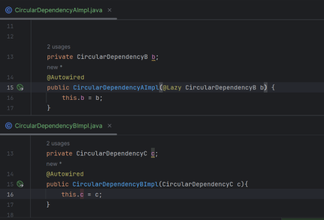
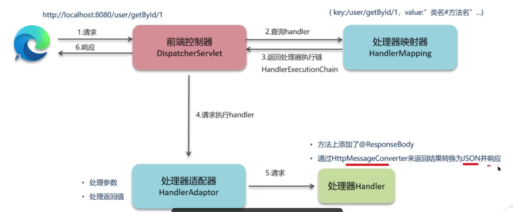
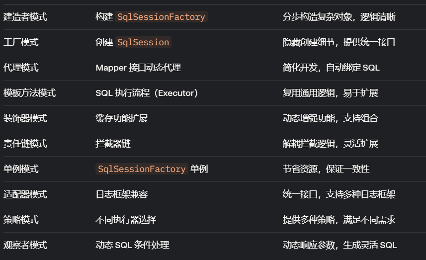
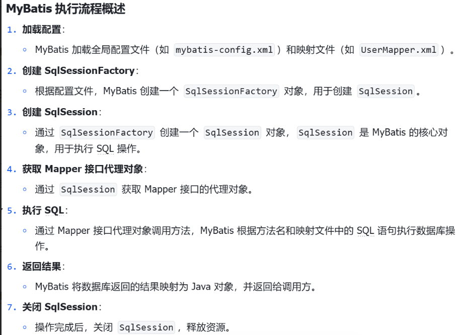

# SSM、SpringBoot框架八股
## Spring框架中的单例Bean是线程安全的吗？
不是线程安全的。当多用户同时请求一个服务时，容器会给每个请求分配一个线程，这些线程会并发执行业务逻辑。**如果处理逻辑中包含对单例Bean中的状态修改**，比如修改单例的成员属性，就必须考虑线程同步问题。Spring框架本身并不对单例bean进行线程安全封装，线程安全和并发问题需要开发者自行处理。

通常在项目中使用的Spring bean是不可变状态（如Service类和DAO类），因此在某种程度上可以说Spring的单例bean是线程安全的。如果bean有多种状态（如ViewModel对象），就需要自行保证线程安全。

最简单的解决办法是将单例bean的作用域由“singleton”变更为“prototype”，这样每次请求bean对象就相当于是创建新的对象来保证线程安全。

- 有状态是指有数据存储的功能。
- 无状态就是不会存储数据，例如Controller、service、dao本身并不是线程安全的，只是调用里面的方法，而且多线程调用一个实例的方法，会在内存中复制遍历，这是自己线程的工作内存，是最安全的。
因此在进行使用的时候，不要在bean中声明任何有状态的实例变量或者类变量，如果必须如此，推荐使用Threadlocal把变量变成线程私有，如果bean的实例变量或者类变量需要在多个线程共享，那么就只能使用synchronized、lock、cas等这些实现线程同步的方法了。

Spring框架有个@Scope注解，默认的值就是singleton，单例的。
## Spring Bean的作用域有哪些？
Spring 框架中，Bean 的作用域（Scope）定义了 Bean 实例的生命周期和可见性。Spring 支持以下几种主要的作用域：
1. Singleton（单例作用域）：默认作用域。一个 Spring 容器中只存在一个 Bean 实例，所有的请求都返回同一个实例。适合无状态的 Bean（如服务层、DAO 层）
2. Prototype（原型作用域）：每次请求都会创建一个新的 Bean 实例。适用于有状态的Bean
3. request（请求作用域）：每个 HTTP 请求都会创建一个新的 Bean 实例，该实例在请求处理期间有效。
4. session（会话作用域）：每个 HTTP 会话（Session）都会创建一个新的 Bean 实例，该实例在会话期间有效。
5. globalSession（全局会话作用域）：类似于 session，但用于 Portlet 环境中的全局会话。
6. application（应用作用域）：整个 Web 应用的生命周期中只存在一个 Bean 实例，类似于 singleton，但作用于 ServletContext 级别。
7. websocket（websocket作用域）：每个 WebSocket 会话创建一个 Bean 实例，生命周期与 WebSocket 会话绑定。
通过注解 @Scope 或 XML 配置 来指定作用域。


## 什么是AOP？（Spring AOP理解）
AOP，即面向切面编程，在Spring中用于将那些与业务无关但是对多个对象产生影响的公共行为和逻辑抽取出来，实现公共模块复用，降低耦合。常见的应用场景包括公共日志保存和事务处理。
简单说，就是把一些业务逻辑中的相同的代码抽取到一个独立的模块中，让业务逻辑更加清爽。

Spring的AOP底层是基于动态代理技术来实现的，也就是说在程序运行的时候，会自动的基于动态代理技术为目标对象生成一个对应的代理对象。在代理对象当中就会对目标对象当中的原始方法进行功能的增强。

在我们的项目中我们自己写AOP的场景其实很少 , 但是我们使用的很多框架的功能底层都是AOP , 例如 : 权限认证、日志、事务处理等
## Spring AOP和Aspectj AOP的区别？
实现方式上：
- SpringAOP基于动态代理实现（JDK 动态代理或 CGLIB 代理），仅支持方法级别的切面，通过代理在运行时动态增强目标对象
- AspectJ AOP基于字节码操作，支持更细粒度的切点，支持编译时织入
功能强大程度：
- SpringAOP功能相对简单，专注于 Spring 容器管理的 Bean
- AspectJ AOP功能更强大，支持复杂的切面逻辑和更广泛的切点类型
性能：
- SpringAOP运行时代理会导致一定性能开销
- AspectJ编译时织入直接修改字节码，运行时无代理开销，性能更高。
使用场景：
- SpringAOP适用于 Spring 生态系统内的简单 AOP 需求，如声明式事务管理、日志记录、方法缓存等。
- AspectJAOP适用于复杂的跨切面需求，如性能监控、字段级别的拦截、或非 Spring 管理的对象。
与Spring集成：
- SpringAOP与 Spring 深度集成，Bean 管理、依赖注入等无缝协作。
- AspectJAOP本身独立于 Spring，但 Spring 提供支持（如通过 @Aspect 注解结合 AspectJ 语法）。
易用性：
- SpringAOP配置简单，开发者只需关注 Spring 提供的注解（如 @Aspect、@Pointcut），学习曲线较低。
- AspectJAOP配置复杂，需要理解 AspectJ 专有语法和工具（如 ajc 编译器）。


## Spring IOC理解？
IOC控制反转是一种设计思想，旨在降低代码之间的耦合度。Spring IOC 是 Spring 框架的核心机制，通过将对象的创建、初始化和管理交给 Spring 容器，实现了对象生命周期的集中管理和依赖关系的解耦。
核心思想：将控制权从代码逻辑本身转移到框架，程序员专注于业务逻辑而非对象管理。
Spring 通过 IOC 容器（也称为 ApplicationContext 或 BeanFactory）实现控制反转，主要包括以下几个方面：
1. Bean对象的定义：Bean 是 Spring 容器管理的对象，通常通过 XML 配置、Java 注解（如 @Component、@Service）或 Java 配置类（@Configuration）定义。
2. 依赖注入DI：DI 是 IOC 的一种实现方式，Spring 通过构造函数注入、Setter 注入或字段注入（@Autowired）将 Bean 的依赖关系自动注入。
3. 容器管理：Spring 容器负责 Bean 的实例化、配置、初始化、销毁等生命周期管理。容器会根据配置（如 @Scope）决定 Bean 的作用域（如 singleton、prototype）
SpringIOC的工作流程：
- **加载配置**：Spring 容器读取配置文件（XML、注解或 Java 配置），解析 Bean 定义。
- **创建 Bean**：容器根据 Bean 定义实例化对象，通常通过反射机制。
- **依赖注入**：容器根据配置将依赖关系注入到 Bean 中。
- **生命周期管理**：容器管理 Bean 的初始化（如 @PostConstruct）、使用和销毁（如 @PreDestroy）
## 如何实现一个IOC容器？
要实现一个简单的 IOC 容器，需要模拟 Spring 的核心功能：Bean 的管理和依赖注入。主要步骤包括：
- **定义 Bean**：通过配置文件（如 JSON、XML）或注解定义 Bean 及其依赖关系。
- **容器初始化**：加载 Bean 定义，创建 Bean 实例。
- **依赖注入**：解析 Bean 之间的依赖关系，自动注入依赖。
- **Bean 管理**：提供获取 Bean 的接口，管理 Bean 的生命周期。
为了简化，我们将实现一个基于注解的 IOC 容器，支持：
- 通过自定义注解（如 @MyComponent）标记 Bean。
- 通过字段注解（如 @MyAutowired）实现依赖注入。
- 单例作用域的 Bean 管理。

1. 自定义注解：我们需要两个注解来模拟 Spring 的 @Component 和 @Autowired
```java
import java.lang.annotation.ElementType;
import java.lang.annotation.Retention;
import java.lang.annotation.RetentionPolicy;
import java.lang.annotation.Target;

@Target(ElementType.TYPE)
@Retention(RetentionPolicy.RUNTIME)
public @interface MyComponent {
}

@Target(ElementType.FIELD)
@Retention(RetentionPolicy.RUNTIME)
public @interface MyAutowired {
}
```
2. 创建Bean定义：定义一个 BeanDefinition 类，用于存储 Bean 的元信息：
```java
public class BeanDefinition {
    private Class<?> beanClass; // Bean 的类
    private String beanName;   // Bean 的名称

    public BeanDefinition(Class<?> beanClass, String beanName) {
        this.beanClass = beanClass;
        this.beanName = beanName;
    }

    public Class<?> getBeanClass() {
        return beanClass;
    }

    public String getBeanName() {
        return beanName;
    }
}
```
3. 实现IOC容器：
创建一个 MyIoCContainer 类，负责：
- 扫描指定包下的 @MyComponent 注解类。
- 注册 Bean 定义。
- 创建 Bean 实例并进行依赖注入。
- 提供获取 Bean 的接口。
```java
import java.lang.reflect.Field;
import java.util.HashMap;
import java.util.Map;
import java.util.Set;

public class MyIoCContainer {
    // 存储 Bean 定义
    private Map<String, BeanDefinition> beanDefinitions = new HashMap<>();
    // 存储 Bean 实例（单例）
    private Map<String, Object> beans = new HashMap<>();

    // 初始化容器，扫描包下的注解
    public void start(String basePackage) {
        try {
            // 模拟包扫描，获取所有类（这里简化处理）
            Set<Class<?>> classes = ClassScanner.scan(basePackage); // 假设有工具类扫描包
            registerBeanDefinitions(classes);
            createBeans();
        } catch (Exception e) {
            throw new RuntimeException("Failed to start IoC container", e);
        }
    }

    // 注册 Bean 定义
    private void registerBeanDefinitions(Set<Class<?>> classes) {
        for (Class<?> clazz : classes) {
            if (clazz.isAnnotationPresent(MyComponent.class)) {
                String beanName = clazz.getSimpleName().toLowerCase();
                beanDefinitions.put(beanName, new BeanDefinition(clazz, beanName));
            }
        }
    }

    // 创建所有 Bean 实例并注入依赖
    private void createBeans() throws Exception {
        for (BeanDefinition definition : beanDefinitions.values()) {
            if (!beans.containsKey(definition.getBeanName())) {
                createBean(definition);
            }
        }
    }

    // 创建单个 Bean 并处理依赖注入
    private Object createBean(BeanDefinition definition) throws Exception {
        String beanName = definition.getBeanName();
        Class<?> beanClass = definition.getBeanClass();

        // 如果已存在，直接返回
        if (beans.containsKey(beanName)) {
            return beans.get(beanName);
        }

        // 创建 Bean 实例
        Object bean = beanClass.getDeclaredConstructor().newInstance();
        beans.put(beanName, bean);

        // 处理依赖注入
        for (Field field : beanClass.getDeclaredFields()) {
            if (field.isAnnotationPresent(MyAutowired.class)) {
                String depBeanName = field.getType().getSimpleName().toLowerCase();
                Object depBean = getBean(depBeanName);
                if (depBean == null) {
                    throw new RuntimeException("No bean found for " + depBeanName);
                }
                field.setAccessible(true);
                field.set(bean, depBean);
            }
        }

        return bean;
    }

    // 获取 Bean
    public Object getBean(String beanName) {
        return beans.get(beanName);
    }

    // 获取 Bean（按类型）
    @SuppressWarnings("unchecked")
    public <T> T getBean(Class<T> clazz) {
        String beanName = clazz.getSimpleName().toLowerCase();
        return (T) beans.get(beanName);
    }
}
```
4. 模拟包扫描器：为了简化，我们假设有一个 ClassScanner 工具类，用于扫描指定包下的类（实际项目中可用 Reflections 库或手动实现）：
```java
import java.util.HashSet;
import java.util.Set;

public class ClassScanner {
    public static Set<Class<?>> scan(String basePackage) {
        // 模拟扫描，返回指定包下的类
        Set<Class<?>> classes = new HashSet<>();
        // 这里手动添加示例类，实际应扫描包
        classes.add(UserService.class);
        classes.add(UserRepository.class);
        return classes;
    }
}
```
5. 测试IOC容器：创建两个示例类，模拟 Service 和 Repository：
```java
@MyComponent
public class UserRepository {
    public void save() {
        System.out.println("Saving user...");
    }
}

@MyComponent
public class UserService {
    @MyAutowired
    private UserRepository userRepository;

    public void performSave() {
        userRepository.save();
    }
}
```

测试代码：
```java
public class Main {
    public static void main(String[] args) {
        MyIoCContainer container = new MyIoCContainer();
        container.start("com.example"); // 假设包名为 com.example
        UserService userService = container.getBean(UserService.class);
        userService.performSave(); // 输出: Saving user...
    }
}
```


## Spring的理解？
Spring 是一个开源的、轻量级的 Java 企业级开发框架，旨在简化 Java 开发的复杂性，提高代码的可维护性和可扩展性。它通过提供全面的基础设施支持，让开发者专注于业务逻辑，而不是底层技术细节。Spring 的核心理念是 “约定优于配置” 和 “面向切面编程（AOP）”，并围绕 控制反转（IOC） 和 依赖注入（DI） 构建。
Spring的核心主要是两个机制支撑：
- 控制反转IOC和依赖注入DI
- 面向切面编程AOP
Spring有多个模块组成，构成一个完整的生态系统，包括核心容器（SpringCore，提供IOC容器和DI功能）、AOP模块、数据访问（简化数据库操作）、Web模块、消息模块、测试模块、其他模块（SpringSecurity安全认证、SpringCloud微服务支持等等）。

## Spring核心是什么？
Spring 框架的核心是 控制反转IOC 和 面向切面编程AOP。这两个机制共同构成了 Spring 的基础，支撑了其模块化和低耦合的设计理念。
IOC 是 Spring 的“心脏”，通过容器管理所有组件，提供了统一的依赖管理和配置方式。
AOP 是 Spring 的“骨架”，通过切面编程支持横切逻辑，增强了功能扩展性。

## Spring优势？
1. 高内聚低耦合：通过 控制反转（IOC） 和 依赖注入（DI），Spring 将对象的创建和依赖管理交给容器，减少组件间的直接依赖。
2. 模块化设计：Spring 采用模块化架构（如 spring-core、spring-web、spring-orm），开发者可按需引入模块，保持项目轻量。
3. 简化企业级开发：Spring 提供了开箱即用的功能，封装了底层复杂性，如事务管理（@Transactional）、缓存（@Cacheable）、安全（Spring Security）
4. 无缝集成第三方框架：Spring 支持与众多框架和工具集成，如 Hibernate、MyBatis、Redis、Kafka 等。
5. 强大的AOP支持：通过 面向切面编程（AOP），Spring 将横切关注点（如日志、事务、权限）与业务逻辑分离。
6. 易于测试：Spring 的 IOC 机制支持依赖注入，便于注入 mock 对象；Spring Test 模块提供测试工具（如 MockMvc）。
7. 丰富的生态系统：Spring 生态（如 Spring Boot、Spring Cloud）提供了从快速开发到微服务治理的全面解决方案。
8. 声明式编程：通过注解和配置（如 @Transactional、@RestController），Spring 支持声明式编程，减少手动编码。
9. 强大的社区支持：Spring 拥有活跃的社区、丰富的官方文档和广泛的第三方资源，更新频繁
10. 跨平台与高适应性：Spring 支持多种运行环境（嵌入式服务器、传统应用服务器、云平台）和开发场景（Web、批处理、响应式编程）

## BeanFactory和ApplicationContext的区别？
BeanFactory 和 ApplicationContext 都是 Spring IOC 容器的核心接口，负责管理 Bean 的创建、依赖注入和生命周期。但它们在功能、用途和特性上有显著区别。以下是从多个维度进行的对比：
功能范围：
- BeanFactory提供最基本的 Bean 管理和依赖注入功能
- ApplicationContext扩展了 BeanFactory，是更高级的容器接口，增加了许多企业级功能。
Bean实例化的时机：
- BeanFactory采用 延迟加载（Lazy Loading），即 Bean 在首次被请求（如 getBean()）时才实例化和初始化。
- ApplicationContext采用 立即加载（Eager Loading），容器启动时会预先实例化和初始化所有单例 Bean。
使用场景：
- BeanFactory适用于资源受限的场景（如移动设备、嵌入式系统），或只需要基础 IOC 功能的轻量级应用。
- ApplicationContext适用于大多数企业级应用，特别是 Web 应用、微服务或需要复杂功能的场景。

## BeanFactory和FactoryBean的区别？
定义：BeanFactory是一个IOC容器接口，管理所有Bean，FactoryBean是特殊的Bean接口，自定义Bean创建的逻辑。
功能：BeanFactory功能是Bean创建、依赖注入、声明周期管理，FactoryBean生产特定Bean
使用场景：BeanFactory管理整个容器，获取Bean。FactoryBean创建复杂Bean，集成第三方库。


## 缓存的放置时间与删除时间？
Spring 本身并不直接提供缓存的存储和删除功能，而是通过集成缓存抽象（Spring Cache）和第三方缓存实现（如 Ehcache、Redis、Caffeine）来管理缓存。
Spring Cache 是 Spring 框架提供的缓存抽象，通过注解（如 @Cacheable、@CachePut、@CacheEvict）简化缓存操作。
缓存的放置时间指的是数据被放入缓存的时机，通常由 Spring Cache 的注解触发。通过 @Cacheable（缓存命中时不执行，存入结果）或 @CachePut（总是存入结果）触发。
缓存的删除时间指的是缓存数据失效或被移除的时机，通常由缓存的过期策略或显式删除触发。通过 @CacheEvict 显式移除（单个键或整个缓存）。

## Spring如何简化开发？

[Spring优势？](#Spring优势？)


## 你们项目中有使用到AOP吗？
我们之前在后台管理系统中使用AOP来记录系统操作日志。主
要思路是使用AOP的环绕通知和切点表达式，找到需要记录日志的方法，然后通过环绕通知的参数获取请求方法的参数，例如类信息、方法信息、注解、请求方式等，并将这些参数保存到数据库。


## Spring事务是如何实现的？（Spring事务的实现原理）
Spring 的事务管理基于 AOP（面向切面编程） 和 数据库事务，通过动态代理（JDK 动态代理或 CGLIB）在目标方法周围织入事务逻辑。核心是借助 Spring 的 IOC 容器和 AOP 机制，结合底层的数据库连接管理（通常通过 DataSourceTransactionManager）实现事务的开启、提交和回滚。

- **声明式事务**：通过 @Transactional 和代理实现，简洁高效，基于 AOP 织入事务逻辑。
- **编程式事务**：通过 TransactionTemplate 或 PlatformTransactionManager 手动控制，适合复杂场景。

## Spring事务失效的场景？
事务失效的场景：
1. 如果方法内部捕获了异常，但是没有将异常抛出，那么这个时候事务会失效，因为事务需要知道抛出的异常才能进行回滚，所以需要在异常捕获的时候使用throw抛出
2. 如果方法抛出检查性异常（检查性异常是编译时强制处理的异常，比如IOException、ClassNotFoundException），并且没有在@Transactional注解上设置rollbackFor属性为Exception，那么异常也可能不会回滚。因为Spring默认只会回滚非检查异常
3. 如果事务注解的方法不是公开（public）修饰的，也可能导致事务失效。


检查异常和非检查异常：
- 检查异常：编译器会强制程序员需要处理这些异常，要么在try-catch中捕获，要么在方法签名中throws抛出。例如：IOException、SQLException、ClassNotFoundException
- 非检查异常：不强制处理的异常，可以选择忽略。例如：NullPointerException、ArrayIndexOutOfBoundsException、OutOfMemoryException。

## Spring事务的隔离级别？
事务隔离级别 定义了事务在并发执行时如何处理数据一致性问题，避免脏读、不可重复读和幻读等并发问题。Spring 的事务隔离级别直接映射到底层数据库（如 MySQL、PostgreSQL）的隔离级别
Spring 支持五种隔离级别（DEFAULT、READ_UNCOMMITTED、READ_COMMITTED、REPEATABLE_READ、SERIALIZABLE），映射到数据库隔离级别。
Spring 的事务隔离级别通过 @Transactional 注解的 isolation 属性配置，值来自 Isolation 枚举。默认值为 Isolation.DEFAULT。

## Spring事务传播机制？
事务传播行为 定义了当一个方法（标注了 @Transactional）调用另一个方法（也可能有 @Transactional）时，事务的处理方式。
Spring支持的七种事务传播行为：
1. REQUIRED（默认）：如果当前存在事务，则加入该事务；如果没有事务，则新建一个事务。
2. SUPPORTS：如果当前存在事务，则加入该事务；如果没有事务，则以非事务方式运行。
3. MANDATORY：要求当前必须存在事务，否则抛出 IllegalTransactionStateException 异常。
4. REQUIRES_NEW：总是新建一个事务，如果当前存在事务，则挂起当前事务。
5. NOT_SUPPORTED：以非事务方式运行，如果当前存在事务，则挂起该事务。
6. NEVER：要求以非事务方式运行，如果当前存在事务，则抛出IllegalTransactionStateException 异常。
7. NESTED：如果当前存在事务，则在嵌套事务中运行（使用数据库的保存点 Savepoint）；如果没有事务，则新建一个事务
传播行为通过 @Transactional 注解的 propagation 属性配置，默认值为 Propagation.REQUIRED。

传播行为导致事务失效的场景：
1. 非代理调用：直接调用类内部的 @Transactional 方法，事务不生效（AOP 代理未触发）
```java
public class UserService {
    public void outerMethod() {
        saveUser(); // 直接调用，事务失效
    }

    @Transactional(propagation = Propagation.REQUIRES_NEW)
    public void saveUser() {
        userRepository.save(user);
    }
}
```
解决：通过注入自身或使用 AopContext.currentProxy() 调用。

## Spring事务是如何回滚的？
事务回滚的核心是通过代理拦截目标方法，捕获异常并调用底层事务管理器执行回滚操作。
Spring 事务回滚通常在以下情况下发生：
- **异常抛出**：目标方法抛出异常（默认捕获 RuntimeException 和 Error）。
- **手动标记回滚**：在代码中显式调用 TransactionStatus.setRollbackOnly()。
- **事务超时**：如果事务执行时间超过 @Transactional 的 timeout 设置，触发回滚。
Spring 事务回滚基于 AOP 和 PlatformTransactionManager平台事务管理器。Spring 事务回滚通过 AOP 代理（TransactionInterceptor）捕获异常，调用 PlatformTransactionManager.rollback() 执行。

使用 @Transactional 的 rollbackFor 和 noRollbackFor 属性指定回滚或不回滚的异常类型。


## Spring框架中使用哪些设计模式及应用场景？
1. 单例设计模式：Spring 的默认 Bean 作用域是 singleton，容器中每个 Bean 只有一个实例，存储在 IOC 容器（ApplicationContext）的单例缓存中。
2. 工厂模式：BeanFactory 和 ApplicationContext 是工厂模式的典型实现，负责创建和管理 Bean。
3. 代理模式：Spring AOP 使用动态代理（JDK 动态代理或 CGLIB）为目标 Bean 创建代理对象，织入切面逻辑
4. 模板方法模式：JdbcTemplate、RedisTemplate 等封装了数据库操作的通用流程（如获取连接、执行查询、释放资源），子类或回调函数实现具体逻辑。
5. 观察者模式：Spring 的事件机制基于观察者模式，通过 ApplicationEvent 和 ApplicationListener 实现事件发布和监听。
6. 适配器模式：HandlerAdapter 在 Spring MVC 中适配不同的 Handler（如 @Controller），统一处理 HTTP 请求。
7. 装饰器模式：Spring 的 AOP 代理可以看作装饰器模式，通过代理对象为目标方法添加额外功能（如日志、事务）。
8. 策略模式：CacheManager 支持多种缓存策略（如 RedisCacheManager、ConcurrentMapCacheManager）。
9. 责任链模式：Spring MVC 的拦截器（HandlerInterceptor）按顺序处理 HTTP 请求。
10. 建造者模式：Spring Boot 的自动配置 使用建造者模式，如 SpringApplicationBuilder 构建 SpringApplication。


## Spring Bean的生命周期？
Spring中bean的生命周期包括以下步骤：
1. 通过`BeanDefinition`获取bean的定义信息。
2. 调用构造函数实例化bean。
3. 进行bean的依赖注入，例如通过setter方法或`@Autowired`注解。
4. 处理实现了`Aware`接口的bean。
5. 执行`BeanPostProcessor`的前置处理器。
6. 调用初始化方法，如实现了`InitializingBean`接口或自定义的`init-method`。
7. 执行`BeanPostProcessor`的后置处理器，可能在这里产生代理对象。
8. 最后是销毁bean。

BeanDefinition：BeanDefinition 是 Spring 框架中用于描述 bean 定义的核心元数据接口。它包含了创建和管理 bean 所需的配置信息，充当 bean 的“蓝图”。Spring 容器通过 BeanDefinition 来了解如何实例化、配置和管理 bean。

Aware接口：Aware 接口是 Spring 提供的一组标记接口，用于让 bean 感知（aware）容器中的某些资源或上下文信息。如果一个 bean 实现了某个 Aware 接口，Spring 会在 bean 生命周期的特定阶段（依赖注入之后、初始化之前）调用相应的方法，将容器中的资源注入到 bean 中。

BeanPostProcessor：BeanPostProcessor 是 Spring 提供的一个扩展点接口，允许在 bean 初始化前后对 bean 进行自定义处理。它是 Spring 生命周期中非常重要的一部分，常用于修改 bean 的属性、生成代理对象（如 AOP 代理）或添加自定义逻辑。


另一种回答：[SpringBean的生命周期](https://www.cnblogs.com/vipstone/p/16659553.html)
Spring 中 Bean 的生命周期主要包含以下 5 部分：
1. 实例化：为 Bean 分配内存空间；
2. 设置属性：将当前类依赖的 Bean 属性，进行注入和装配；
3. 初始化：
    1. 执行各种通知；
    2. 执行初始化的前置方法；
    3. 执行初始化方法；
    4. 执行初始化的后置方法。
4. 使用 Bean：在程序中使用 Bean 对象；
5. 销毁 Bean：将 Bean 对象进行销毁操作。


## Spring中的循环引用？
循环依赖发生在两个或两个以上的bean互相持有对方，形成闭环，**最终可能导致栈溢出（StackOverflowError）或其他运行时错误**。Spring框架允许循环依赖存在，并通过三级缓存解决大部分循环依赖问题：
1. 一级缓存：这个缓存用于存储已经完全初始化完成的单例Bean。一旦一个Bean被初始化并且所有的生命周期回调都已完成，它就会被放入这个缓存中。之后，任何对该Bean的请求都将直接从这个缓存中获取，而不需要再次初始化。
2. 二级缓存：这个缓存用于存储那些尚未完全初始化但已经实例化完成的单例Bean。它主要用于解决循环依赖的问题。当Spring检测到两个单例Bean之间存在循环依赖时，它会在初始化过程中将这些Bean暂时存储在这个缓存中，以便其他Bean可以访问到一个尚未完全初始化的版本。
3. 三级缓存：这个缓存用于存储单例Bean的工厂函数。当Spring开始创建一个单例Bean时，它会首先创建一个工厂函数，并将该工厂函数存储在这个缓存中。这样做是为了在初始化过程中，如果其他Bean请求这个尚未完全初始化的Bean，Spring可以通过这个工厂函数返回一个临时的、部分初始化的Bean实例。


Bean循环依赖出现情况主要有：
1. 构造器参数循环依赖：当两个Bean通过构造器参数互相依赖时，Spring无法解决这种依赖。这是因为在创建任何一个Bean之前都需要另一个Bean已经创建完毕，这会导致创建过程陷入死锁状态。在这种情况下，Spring将会抛出`BeanCurrentlyInCreationException`异常。
2. setter方式单例循环依赖：如果两个单例（singleton）模式的Bean通过setter方法互相依赖，Spring可以通过在Bean创建过程中提前暴露一个还未完全初始化的Bean实例来解决循环依赖。具体来说，当一个Bean的构造器执行完毕后，它会被暂时放入一个称为"singleton cache"的缓存中。如果此时另一个正在创建的Bean请求依赖于这个Bean，那么Spring就会提供这个部分创建好的Bean实例。
3. setter方式原型循环依赖：对于原型（prototype）模式的Bean，Spring同样不能解决循环依赖问题。因为原型模式下的Bean每次获取都会创建一个新的实例，所以提前暴露部分创建好的实例策略并不适用。因此，对于原型模式的Bean，应该避免出现循环依赖的情况。 
使用`@Lazy`注解来延迟加载Bean，但这通常用于解决某些特定情况下的循环依赖，而不是通用解决方案。


参考：[SpringBoot中的循环依赖](https://blog.csdn.net/qq_49841284/article/details/142105843)


## 解决循环依赖的流程？
解决循环依赖的流程如下：
1. 实例化A对象，并创建`ObjectFactory`存入三级缓存。
2. A在初始化时需要B对象，开始B的创建逻辑。
3. B实例化完成，也创建`ObjectFactory`存入三级缓存。
4. B需要注入A，通过三级缓存获取`ObjectFactory`生成A对象，存入二级缓存。
5. B通过二级缓存获得A对象后，B创建成功，存入一级缓存。
6. A对象初始化时，由于B已创建完成，可以直接注入B，A创建成功存入一级缓存。
7. 清除二级缓存中的临时对象A。


## 构造方法中出现了循坏依赖怎么解决？
由于构造函数是bean生命周期中最先执行的，Spring框架无法解决构造方法的循环依赖问题。
可以使用`@Lazy`懒加载注解，延迟bean的创建直到实际需要时。



## Spring的常用注解？
Spring的常见注解包括：
1. 声明Bean的注解：`@Component`、`@Service`、`@Repository`、`@Controller`。
2. 依赖注入相关注解：`@Autowired`、`@Qualifier`、`@Resource`。
3. 设置作用域的注解：`@Scope`。
4. 配置相关注解：`@Configuration`、`@ComponentScan`、`@Bean`。
5. AOP相关注解：`@Aspect`、`@Before`、`@After`、`@Around`、`@Pointcut`。

## 项目中为什么会使用Spring框架？

[Spring优势？](#Spring优势？)

## Autowired和Resource区别？
来源：
-  Autowired由Spring框架提供的注解
- Resource由JDK提供的标准提供的注解
注入方式：
- Autowired默认根据类型注入，如果找到多个，则需要Qualifier根据名称匹配
- Resource默认按照名称匹配，未找到按照类型匹配

@Autowired 是 Spring 原生注解，与 Spring IOC 容器深度集成，支持构造函数注入，灵活性更高，适合 Spring 主导的项目。@Resource 更适合需要 Java EE 标准兼容的场景。


## 什么是Bean的自动装配，它有哪些方式？
Bean 的自动装配 是指通过注解（如 @Autowired）或 XML 配置实现，简化了 Bean 的依赖管理。
Spring提供五种自动装配：
1. no（默认）：不启用自动装配，依赖必须通过显式配置（如 XML 的 或 ）注入。不使用 @Autowired 或 @Resource，依赖通过 Setter 或构造函数手动注入。
```xml
<bean id="userService" class="com.example.UserService">
    <property name="userRepository" ref="userRepository"/>
</bean>
<bean id="userRepository" class="com.example.UserRepository"/>
```
2. 按照名称装配：根据 Bean 的属性名（或 Setter 方法对应的属性名）查找容器中同名的 Bean 进行注入。
3. 按照类型装配：根据 Bean 的属性类型查找容器中匹配类型的 Bean 进行注入。
4. 根据构造函数装配：根据构造函数参数的类型查找容器中匹配的 Bean 进行注入，类似于 byType 但针对构造函数。
5. 自动检测装配：Spring 2.5 及以下版本支持，结合 byType 和 constructor，首先尝试通过构造函数装配（constructor），如果失败则按类型装配（byType）。在 Spring 3.0 及以上已废弃，现代 Spring 项目不再使用

示例：
```java
@Configuration
@ComponentScan("com.example")
public class AppConfig {
    @Bean
    public UserRepository userRepository() {
        return new UserRepository();
    }
}

@Service
public class UserService {
    private final UserRepository userRepository;

    @Autowired // 构造函数注入（byType）
    public UserService(UserRepository userRepository) {
        this.userRepository = userRepository;
    }

    @Autowired
    @Qualifier("specificRepository") // 解决多重匹配
    private UserRepository specificRepository;

    @Resource(name = "userRepository") // 按名称注入
    private UserRepository namedRepository;
}
```

## 依赖注入的方式有几种？各是什么？
依赖注入的三种方式：
1. 构造器注入：通过构造方法将依赖注入到目标 Bean，Spring 容器根据构造方法的参数类型或名称查找匹配的 Bean 进行注入。
2. Setter注入：通过 Setter 方法将依赖注入到目标 Bean，Spring 容器调用 Setter 方法设置依赖。
3. 字段注入：直接通过字段（成员变量）注入依赖，Spring 容器通过反射直接设置字段值。
示例：
```java
@Configuration
@ComponentScan("com.example")
public class AppConfig {
    @Bean
    public UserRepository userRepository() {
        return new UserRepository();
    }
}

@Service
public class UserService {
    private final UserRepository constructorInjected; // 构造器注入
    private UserRepository setterInjected; // Setter 注入
    @Autowired
    private UserRepository fieldInjected; // 字段注入

    // 构造器注入
    @Autowired
    public UserService(UserRepository constructorInjected) {
        this.constructorInjected = constructorInjected;
    }

    // Setter 注入
    @Autowired
    public void setSetterInjected(UserRepository setterInjected) {
        this.setterInjected = setterInjected;
    }

    public void saveUser(User user) {
        constructorInjected.save(user);
        setterInjected.save(user);
        fieldInjected.save(user);
    }
}
```

## Spring核心模块的理解？

[Spring核心是什么？](#Spring核心是什么？)

## 说说你对SpringMVC的理解？
Spring MVC 是一个基于 Java 的 Web 框架，集成在 Spring 生态系统中，用于处理 HTTP 请求和响应。它通过松耦合的组件设计，简化了 Web 开发的复杂性，支持 RESTful 服务、动态页面渲染等多种 Web 应用场景。Spring MVC 充分利用 Spring 的 IoC（控制反转）和 AOP（面向切面编程）特性，提供了强大的配置和扩展能力。

**可进一步说明SpringMVC的执行流程、常用组件、常用组件的功能、和Spring/SpringBoot的区别**

## SpringMVC的执行流程？
**什么是SpringMVC：**
`SpringMVC是一种web层mvc框架；是spring的一个模块，拥有spring的特性，通过策略接口，Spring框架是高度可配置的，而且包含多种视图技术，例如 JavaServer Pages(JSP)技术、Velocity、Tiles、iText 和 POI。Spring MVC 框架并不知道使用的视图，所以不会强迫您只使用 JSP 技术。Spring的MVC框架主要由DispatcherServlet、处理器映射、处理器(控制器)、视图解析器、视图组成。
**MVC是什么？**
MVC是三层架构
- **M ： 表示mode，** 翻译成中文叫做模型，对应数据库；
- **V ： 表示View，** 翻译为中文叫做视图，对应前端的页面，比如jsp
- **C ： 表示 Controller，** 翻译是控制层，对应着servlet的请求映射

SpringMVC的执行流程包括以下步骤：
1. 服务器接收到请求，会将请求转发到前端控制器`DispatcherServlet`处理。
2. 前端控制器`DispatcherServlet`调用处理器映射器`HandlerMapping`，处理器映射器根据请求URL查找控制器（handler），返回一个处理器链（`HandlerExecutionChain`），处理器链除了控制器之外，还有拦截器。
3. `HandlerMapping`返回控制器及拦截器（如果有）给`DispatcherServlet`前端控制器。
4. `DispatcherServlet`调用`HandlerAdapter`适配器之前会执行前置拦截器的代码，接着会调用适配器执行控制器的内容，也就是@Controller里面的代码，返回一个ModelAndView（逻辑视图）对象，然后再一次执行后置拦截器的代码
5. `HandlerAdapter`将`ModelAndView`返回给`DispatcherServlet`。
6. `DispatcherServlet`传给`ViewResolver`视图解析器对逻辑视图对象解析，得到一个View对象，然后将页面返回给前端之前再执行一次拦截器
7. `DispatcherServlet`渲染视图并响应用户。

**DispatcherServlet：**
`DispatcherServlet 的中文叫做前端控制器 ，也就叫中央调度器，用户发送的所有请求都会经过这个接口，由Servlet调用，是用来拦截所有请求的url的入口，并根据url地址分发到不同的controller ；在web.xml中配置后即可使用

**HandlerMapping：** 
`HandlerMapping的作用就是解析请求链接，然后根据请求链接找到执行这个请求的类（HandlerMapping所说的handler，也就是我们写的Controller或是Action），也叫做控制器映射器，如果未匹配到控制器，则返回404错误；

**HandlerExecutionChain：**
`HandlerExecutionChain 是Handler的执行链，我叫它控制器执行链，包含控制器对象handler、拦截器 interceptor。所以HandlerExecutionChain 提供了getHandler、getInterceptors方法，配置文件中配置的interceptor都会加入到HandlerExecutionChain；需要注意的是，拦截器的列表里面除了我们配置的拦截器之外，还有一个springmvc自己维护的拦截器；

**HandlerInterceptor：**
`HandlerExecutionChain 是Handler的执行链，我叫它控制器执行链，包含控制器对象handler、拦截器 interceptor。所以HandlerExecutionChain 提供了getHandler、getInterceptors方法，配置文件中配置的interceptor都会加入到HandlerExecutionChain；需要注意的是，拦截器的列表里面除了我们配置的拦截器之外，还有一个springmvc自己维护的拦截器；

**HandlerAdapter：**
`HandlerAdapter字面上的意思就是处理适配器，它的作用用一句话概括就是调用具体的方法对用户发来的请求来进行处理。当handlerMapping获取到执行请求的controller时，DispatcherServlte会根据controller对应的controller类型来调用相应的HandlerAdapter来进行处理。

**ModelAndView：**
`从名字上看ModelAndView中的Model代表模型，View代表视图，这里的模型就是在controller层中ModelMap中添加的值；

**ViewResolver：**
`视图解析器，ViewResolver的主要作用是把一个逻辑上的视图 ModelAndView 解析为一个真正的view视图；


**View：**
`视图的作用是渲染模型数据，将模型里的数据以某种形式呈现给客户端。视图对象可以是常见的JSP，还可以是Excel或PDF等形式不一的媒体。为了实现视图模型和具体实现技术的解耦；


参考：[SpringMVC执行流程](https://zhuanlan.zhihu.com/p/641728250)
## SpringMVC常用注解？
SpringMVC的常见注解有：
- `@RequestMapping`：映射请求路径，出现在类上表示下面所有请求的前缀，用在方法上表示方法对应的请求路径
- `@RequestBody`：接收HTTP请求的JSON数据，封装成对象
- `@RequestParam`：指定请求参数名称
- `@PathVariable`：从请求路径中获取参数
- `@ResponseBody`：将Controller方法返回的对象转化为JSON。
- `@RequestHeader`：获取请求头数据。
- `@PostMapping`、`@GetMapping`等，对应不同请求方式的请求路径

## SpringMVC的九大内置组件？
1. HandlerMapping（处理器映射）：HandlerMapping 负责根据 HTTP 请求（如 URL、HTTP 方法）查找对应的处理器（Handler，通常是控制器方法）及其拦截器。
2. HandlerAdapter（处理器适配器）：HandlerAdapter 负责调用处理器（Handler）的方法，适配不同类型的处理器
3. HandlerExceptionResolver（异常处理器）：HandlerExceptionResolver 负责处理控制器执行过程中抛出的异常，将其转换为适当的响应。
4. ViewResolver（视图解析器）：ViewResolver 将逻辑视图名称解析为具体的 View 对象，用于渲染响应。
5. RequestToViewNameTranslator（请求到视图名转换器）：RequestToViewNameTranslator 根据请求信息推断逻辑视图名称，当控制器未明确指定视图名时使用
6. LocaleResolver（区域解析器）：LocaleResolver 确定请求的语言环境（Locale），用于国际化（i18n）支持。
7. ThemeResolver（主题解析器）：ThemeResolver 用于解析和管理 Web 应用的主题（如 CSS 样式、图片）。
8. MultipartResolver（文件上传解析器）：MultipartResolver 处理文件上传请求（multipart/form-data）。
9. FlashMapManager（Flash属性管理器）：FlashMapManager 管理 Flash 属性，用于在重定向时传递临时数据。
重点组件：
- HandlerMapping 和 HandlerAdapter：核心映射和执行逻辑。
- HandlerExceptionResolver 和 ViewResolver：异常处理和视图解析。
- MultipartResolver 和 FlashMapManager：文件上传和重定向支持。

## Spring、SpringMVC、SpringBoot的区别？

Spring 是一个全面的 Java 框架，核心是 IoC 和 AOP，提供依赖注入、事务管理等功能，适合企业级应用，但配置复杂。
Spring MVC 是 Spring 的 Web 模块，基于 MVC 模式，通过 DispatcherServlet 处理 HTTP 请求，支持 RESTful 和动态页面，需手动配置 Servlet 和视图解析器。
Spring Boot 基于 Spring 和 Spring MVC，强调快速开发，通过自动配置、起步依赖和嵌入式服务器简化搭建，适合微服务和现代化应用。
区分总结：
- **定位**：Spring 是基础框架，Spring MVC 专注 Web 层，Spring Boot 简化开发。
- **配置**：Spring 和 Spring MVC 配置复杂，Spring Boot 自动配置。
- **使用场景**：Spring 适合定制化项目，Spring MVC 适合 Web 应用，Spring Boot 适合快速开发和微服务。
- **部署**：Spring 和 Spring MVC 需外部容器，Spring Boot 自带服务器。


## SpringBoot常用注解
Spring Boot的常见注解包括：
- `@SpringBootApplication`：由`@SpringBootConfiguration`、`@EnableAutoConfiguration`和`@ComponentScan`组成，启用自动配置和扫描
- 其他注解如`@RestController`（定义Restful控制器）、`@GetMapping`、`@PostMapping`等，用于简化Spring MVC的配置。
- @ConfigurationProperties 简化配置绑定。
- @ConditionalOn... 实现动态配置。
- @ControllerAdvice 和 @ExceptionHandler 统一异常处理。
- @Transactional 确保数据一致性。
- 异步任务用@Async 和 定时任务用@Scheduled 提升性能。

## SpringBoot自动配置的原理
Spring Boot的自动配置原理基于`@SpringBootApplication`注解，它封装了`@SpringBootConfiguration`、`@EnableAutoConfiguration`和`@ComponentScan`。

`@EnableAutoConfiguration`是核心，它通过`@Import`导入配置选择器，读取`META-INF/spring.factories`文件中的类全限定名，根据条件注解决定是否将配置类中的Bean导入到Spring容器中
条件判断会有像`@ConditionalOnClass`这样的注解，判断是否有对应的class文件，如果有加载类，把这个配置类的所有Bean放入到Spring容器中使用。


参考：[SpringBoot自动配置原理](https://javaguide.cn/system-design/framework/spring/spring-boot-auto-assembly-principles.html#%E5%A6%82%E4%BD%95%E5%AE%9E%E7%8E%B0%E4%B8%80%E4%B8%AA-starter)

## 什么是Mybatis？
MyBatis是一个持久层框架，用于简化数据库操作，通过XML或者注解配置，将SQL语句与Java对象映射，提供了灵活的ORM（对象关系映射）功能。MyBatis支持动态SQL、存储过程与复杂查询，适合高度自定义SQL场景。
主要特点：
- SQL映射：通过XML或者注解定义SQL，绑定Java方法
- 动态SQL：支持条件拼接，灵活生成SQL语句
- 轻量级：与Hibernate相比更轻量
- 缓存机制：提供一级缓存和二级缓存，优化查询

## Mybatis工作原理？
MyBatis 的工作原理可以概括为通过配置和注解，将 Java 方法与 SQL 语句关联，执行数据库操作并将结果映射到 Java 对象。
其工作流程：
1. 配置加载：
	- 通过读取全局配置文件，通常是mybatis-config.xml初始化，里面包含数据库连接信息、数据管理、数据源等内容
	- 加载映射文件，映射文件一般是xml或者注解，其中定义SQL语句和Java接口方法之间的映射关系
2. SqlSessionFactory创建
	- MyBatis 使用 SqlSessionFactoryBuilder 解析配置文件，构建 SqlSessionFactory
	- SqlSessionFactory 是线程安全的，用于创建 SqlSession
3. SqlSession操作
	- 通过 SqlSessionFactory 创建 SqlSession，它是 MyBatis 的核心接口，负责与数据库交互
	- SqlSession 提供方法执行 SQL（如 selectOne、insert 等），并管理事务
4. Mapper映射：
	- MyBatis 使用 Mapper 接口（Java 接口）或 XML 文件定义 SQL 语句。
	- MyBatis 动态代理生成实现类，映射到对应的 SQL 语句。SQL 语句通过命名空间和方法名（如 namespace.id）定位。
5. SQL执行：
	- MyBatis 将 Mapper 方法的调用转换为 SQL 执行，通过 JDBC 连接数据库
	- 支持动态 SQL，根据传入参数拼接 SQL
6. 结果映射：
	- 查询结果通过映射规则（XML 或注解）转换为 Java 对象
	- 支持一对一、一对多的复杂映射
7. 缓存与事务
	- MyBatis 提供一级缓存（SqlSession 级别，自动开启）和二级缓存（全局级别，需配置）
	- 事务通过sqlsession管理，开发者可以手动提交或回滚
MyBatis 的工作原理是通过 SqlSessionFactory 创建 SqlSession，利用动态代理调用 Mapper 接口方法，执行映射的 SQL 语句，并将结果映射为 Java 对象。

## Mybatis缓存的理解？
MyBatis提供一级缓存和二级缓存优化查询性能。

一级缓存的作用域是SqlSession，如果是同一个SqlSession查询多次，可以从查询中获取数据优化性能，一级缓存默认开启。
一级缓存的清除时机：
- SqlSession关闭或者提交事务时，清空缓存
- 执行增删改操作，清空缓存
- 手动调用SqlSession.clearCache()清空缓存

二级缓存是 Mapper 级别的缓存，跨 SqlSession，默认关闭，需手动启用。在不同 SqlSession 中，执行相同的 SQL 查询时，MyBatis 可从二级缓存获取结果，减少数据库访问。
二级缓存的清除时机：
- Mapper 命名空间内的增删改操作会清空该 Mapper 的二级缓存。
- 可通过 <cache eviction="LRU" flushInterval="60000" size="512" readOnly="true"/> 配置缓存策略（如 LRU 淘汰、刷新间隔等）。

MyBatis自定义集成第三方缓存：
- MyBatis 支持通过 集成 Ehcache、Redis 等第三方缓存框架，提升分布式环境下的缓存能力。

## Mybatis中如何实现缓存的扩展？
MyBatis 缓存扩展通过实现 Cache 接口或集成第三方框架（如 Ehcache、Redis）实现。
1. 自定义缓存实现：通过实现 Cache 接口，创建自定义缓存逻辑（如基于内存、文件或其他存储）。启用二级缓存。在 Mapper 的 XML 文件中指定自定义缓存类。
2. 集成Redis框架：引入Redis依赖。配置Redis信息。启用二级缓存。xml文件中指定Redis缓存。


## Mybatis和Hibernate的区别？
1. 设计理念上：
	- MyBatis是半自动化的ORM框架，开发者可以手动编写SQL语句，通过XML或者注解配置映射关系
	- Hibernate是全自动化的ORM框架，注重对象与关系的映射
2. 性能：
	- MyBatis性能较高，因开发者可直接优化 SQL，减少不必要的查询
	- Hibernate性能相对较低，因自动生成 SQL 可能不够高效。
3. 缓存机制：
	- 提供一级缓存（SqlSession 级别，默认开启）和二级缓存（Mapper 级别，需手动开启）二级缓存支持扩展（如 Ehcache、Redis），但默认实现简单。缓存粒度较粗，需手动管理。
	- 提供一级缓存（Session 级别，默认开启）和二级缓存（SessionFactory 级别，需配置）。支持更复杂的缓存策略（如查询缓存、对象缓存），集成 Ehcache 等更成熟。缓存管理更自动化，但配置复杂。
4. 对象关系映射：
	- 简单映射，POJO 与数据库表字段通过 XML/注解关联。
	- 强大的对象关系映射，支持一对一、一对多、多对多、继承等复杂关系
5. 事务管理：
	- 事务管理较简单，通常通过 SqlSession 控制提交或回滚。需手动配置事务管理器（如 Spring 集成）
	- 提供更完善的事务管理，支持声明式事务（通过 Spring）。自动处理对象状态（持久态、游离态等），简化事务操作。
6. 数据库移植性：
	- SQL 语句与数据库强相关，移植到不同数据库需修改 SQL。
	- 通过 HQL 和 Dialect 抽象数据库差异，跨数据库移植性好。
7. 开发效率
	- 初期开发效率较低，需手动编写 SQL 和映射配置。长期维护效率高，SQL 优化和调整灵活。
	- 初期开发效率高，自动映射和 HQL 减少代码量。复杂场景下调优困难，维护成本可能增加。
8. 选择建议：
	- 如果项目需要高度优化的 SQL 或复杂动态查询。数据库操作逻辑复杂，性能要求高。开发团队熟悉 SQL 和数据库调优。
	- 如果项目有复杂的对象关系模型（如多表关联）。需要快速开发或支持多种数据库。优先考虑开发效率而非极致性能。

## \#和$的区别？

\#和 $ 是用于参数占位符的两种不同方式，主要用于 SQL 语句中的参数传递。
\#{}生成的 SQL 使用 ? 占位符，参数在执行时由 JDBC 驱动绑定。由数据库处理参数类型和值，安全性高。
例如：SELECT * FROM user WHERE id = #{id}
- 实际执行：SELECT * FROM user WHERE id = ?，参数 id 通过 PreparedStatement 绑定。
${}参数值直接拼接到 SQL 字符串中，生成最终的 SQL 语句。SQL 是动态拼接的，数据库直接解析最终 SQL。
例如：SELECT * FROM user WHERE id = ${id}
- 如果 id=123，实际执行：SELECT * FROM user WHERE id = 123。

安全性方面上：
- \#{}通过预编译，参数值不会直接拼接到 SQL 中，防止SQL注入
- ${}参数值直接嵌入 SQL，可能被恶意构造，存在SQL注入风险，仅在特定场景（如动态表名、列名）使用

使用场景上：
- \#{}适合大多数 CRUD 操作。
- ${}适用于动态SQL结构，比如动态表名、动态列名、排序字段、复杂动态SQL

类型处理上：
- 自动处理参数类型，MyBatis 根据参数的 Java 类型映射到 JDBC 类型。支持复杂类型（如对象属性：#{user.name}）。可通过 jdbcType 指定类型，如 #{name,jdbcType=VARCHAR}
- 不处理类型，直接将参数值的字符串形式嵌入 SQL。通常用于字符串或简单类型，不支持复杂对象属性。

建议：
- 默认使用 #{}
- 仅在动态 SQL 结构（如表名、列名）无法用 #{}
- 使用 ${} 时，必须通过白名单或校验确保输入安全，以避免 SQL 注入风险。
## 属性名和字段名不一致的情况？
在 MyBatis 中，当 Java 实体类的属性名与数据库表的字段名不一致时，会导致查询结果无法正确映射到实体类对象。MyBatis 提供了多种方式来解决这一问题

问题背景：假设数据库表 user 有字段 user_id, user_name，而 Java 实体类 User 的属性为 id, name。
```java
public class User {
    private Integer id;    // 对应 user_id
    private String name;   // 对应 user_name
}
```
解决方案：
1. 使用ResultMap解决：通过在 Mapper XML 文件中定义 ，显式指定属性名与字段名的映射关系。这是推荐的解决方案，适合复杂映射场景。
```xml
<resultMap id="userResultMap" type="com.example.User">
    <id property="id" column="user_id" />        <!-- 主键映射 -->
    <result property="name" column="user_name" /> <!-- 普通字段映射 -->
</resultMap>

<!- select中使用resultMap -->
<select id="selectUserById" resultMap="userResultMap">
    SELECT user_id, user_name FROM user WHERE user_id = #{id}
</select>
```
2. 使用AS定义字段别名：在 SQL 查询中通过 AS 关键字为字段指定别名，使其与实体类属性名一致。
```xml
<select id="selectUserById" resultType="com.example.User">
    SELECT user_id AS id, user_name AS name FROM user WHERE user_id = #{id}
</select>
```
3. 启动驼峰命名转换：如果数据库字段名采用下划线命名（如 user_id），而 Java 属性名采用驼峰命名（如 id），可以启用 MyBatis 的驼峰命名转换功能，自动映射。
```xml
<configuration>
    <settings>
        <setting name="mapUnderscoreToCamelCase" value="true"/>
    </settings>
</configuration>

<select id="selectUserById" resultType="com.example.User">
    SELECT user_id, user_name FROM user WHERE user_id = #{id}
</select>
```
4. 如果使用注解配置的SQL，如果不使用 XML，而是通过注解配置 Mapper 接口，可以使用 @Results 和 @Result 指定映射关系。
```java
public interface UserMapper {
    @Select("SELECT user_id, user_name FROM user WHERE user_id = #{id}")
    @Results({
        @Result(property = "id", column = "user_id"),
        @Result(property = "name", column = "user_name")
    })
    User selectUserById(@Param("id") Integer id);
}
```


## 如何获取自动增长的主键？
1. 使用useGeneratedKeys和KeyProperty
需要配置insert标签：
- 设置 useGeneratedKeys="true"：启用自增主键获取。
- 设置 keyProperty：指定实体类中接收主键值的属性名。
- 可选设置 keyColumn：指定数据库中的主键列名（通常不需要）。
例如：
```xml
<insert id="insertUser" parameterType="com.example.User" useGeneratedKeys="true" keyProperty="id">
    INSERT INTO user (name) VALUES (#{name})
</insert>
```

2. 在select标签内部使用selectKey标签：
	- keyProperty：指定实体类中接收主键值的属性名。
	- resultType：主键的 Java 类型。
	- order：指定获取主键的时机：
	    - BEFORE：插入前执行 \<selectKey\> 的 SQL。
	    - AFTER：插入后执行 \<selectKey\> 的 SQL。
	- 内部定义 SQL 语句，用于获取主键值。
示例：
```xml
<insert id="insertUser" parameterType="com.example.User">
    <selectKey keyProperty="id" resultType="java.lang.Integer" order="AFTER">
        SELECT LAST_INSERT_ID()
    </selectKey>
    INSERT INTO user (name) VALUES (#{name})
</insert>

LAST_INSERT_ID() 是 MySQL 的函数，用于获取最近插入的自增主键。
```


## Mybatis中的设计模式？



## Mybatis映射文件和配置文件？
映射文件（Mapper XML 文件）用于定义 SQL 语句与 Java 实体类或接口的映射关系，是 MyBatis 的核心功能之一。
- 映射文件通常是以 XML 格式编写的文件，文件名一般与 Mapper 接口对应（如 UserMapper.xml 对应 UserMapper.java）。
- 它定义了 SQL 语句、参数映射、结果映射等内容。


配置文件（全局配置文件，通常命名为 mybatis-config.xml）用于定义 MyBatis 的全局行为和运行时环境。
- 全局配置文件是一个 XML 文件，通常位于项目的资源目录下。
- 它配置了数据库连接、事务管理、映射文件加载等全局设置。


## Mybatis如何实现分页？
MyBatis 本身不直接提供分页功能，但可以通过以下几种方式实现分页，包括 SQL 原生分页、MyBatis 插件（如 PageHelper）、自定义拦截器或手动处理。
1. 使用SQL原生分页：通过在 SQL 查询中使用数据库支持的分页语法（如 MySQL 的 LIMIT 和 OFFSET、Oracle 的 ROWNUM 或 FETCH FIRST）实现分页。
```xml
<select id="selectUsers" resultType="com.example.User">
    SELECT * FROM user
    ORDER BY id
    LIMIT #{pageSize} OFFSET #{pageNum}
</select>
```
2. 使用PageHelper插件：PageHelper 是 MyBatis 生态中最流行的分页插件，通过拦截 SQL 查询自动添加分页逻辑，支持多种数据库（如 MySQL、Oracle、PostgreSQL 等）。
3. 通过 MyBatis 的拦截器（Interceptor）机制，拦截 Executor 或 StatementHandler，动态修改 SQL 实现分页。
MyBatis 实现分页的常见方式包括 SQL 原生分页、PageHelper 插件、自定义拦截器和手动处理：
- **PageHelper** 是最推荐的方案，简单高效，支持多数据库，适合快速开发。
- **SQL 原生分页** 适合特定数据库和简单场景，但移植性差。
- **自定义拦截器** 提供最大灵活性，但实现复杂。

## MyBatis中的执行器？

执行器是 MyBatis 的一个核心接口（org.apache.ibatis.executor.Executor），定义了数据库操作的核心方法，如查询（query）、更新（update）、提交（commit）、回滚（rollback）等。
执行器类型：
1. SimpleExecutor（简单执行器）：MyBatis 的默认执行器，每次执行 SQL 都会创建一个新的 PreparedStatement。
2. ReuseExecutor（重用执行器）：重用 PreparedStatement，避免重复创建 Statement。
3. BatchExecutor（批量执行器）：支持批量执行 SQL，优化多条 SQL 的提交。
4. CachingExecutor（缓存执行器）：装饰器模式，包装其他执行器以支持二级缓存。

执行器工作流程：
1. 创建执行器：在 SqlSessionFactory 创建 SqlSession 时，根据配置选择执行器类型
2. SQL执行：SqlSession 调用执行器的方法
3. 缓存管理：一级缓存由 BaseExecutor 管理，存储在 SqlSession 中。二级缓存由 CachingExecutor 管理，存储在 Mapper 命名空间中。
4. 事务管理：执行器负责事务的提交（commit）、回滚（rollback）和关闭

工作原理：封装 JDBC 操作，管理 SQL 执行、缓存和事务。
适用场景：根据业务需求选择合适的执行器，结合缓存和批量操作优化性能。


## MyBatis中的Mapper接口的一致性问题？
Mapper 接口一致性问题指的是 Mapper 接口（Java 接口）与映射文件（XML 或注解）之间的定义不匹配，导致 MyBatis 无法正确绑定接口方法与 SQL 语句。
主要有以下几个方面：
- **命名空间（namespace）** 与接口全限定名不一致。
- **方法名**与映射文件中的 SQL 语句 ID 不一致。
- **参数类型**与映射文件中的 parameterType 不匹配。
- **返回类型**与映射文件中的 resultType 或 resultMap 不匹配。
- **注解与 XML 配置冲突**。

## MyBatis中的DefaultSqlSession的线程安全问题？
DefaultSqlSession 是 SqlSession 接口的默认实现，负责与数据库交互、执行 SQL 语句、管理事务和缓存等，它不适合在多个线程中共享使用，因其维护的内部状态（一级缓存、Executor、事务、连接）不适合多线程共享。并发访问可能导致数据不一致、事务异常、连接问题等。
解决方法：
- 每个线程独享 SqlSession，使用 try-with-resources 管理。
- Spring 集成，使用 SqlSessionTemplate 或 Mapper 注入。
- 非 Spring 环境，使用 ThreadLocal 隔离 SqlSession。
- 避免共享 SqlSession，合理管理事务。
适用场景：
- 单线程操作：直接使用 DefaultSqlSession。
- 多线程或企业级项目：依赖 Spring 或 ThreadLocal 确保线程安全。


## Mybatis执行流程
MyBatis的执行流程如下：
1. 读取MyBatis配置文件`mybatis-config.xml`和xml映射文件。
2. 构造会话工厂`SqlSessionFactory`。
3. 会话工厂创建`SqlSession`对象，sqlSession对象是Mybatis的核心对象，用于执行SQL操作
4. 通过sqlSession获取Mapper接口的代理对象
5. 通过Mapper接口的代理对象调用方法，根据方法名和映射文件中的SQL语句执行数据库操作
6. 将执行完的结果映射为Java对象，并返回给调用方
7. 关闭sqlSession对象，释放资源
下图也展示了MyBatis的执行流程：



## Mybatis是否支持延迟加载？
MyBatis支持延迟加载，延迟加载是指在查询对象时，只加载其基本属性，而将关联对象的数据暂不加载，等到真正需要使用关联对象时再去查询加载其数据的一种技术。

MyBatis通过在映射文件中配置lazyLoadingEnabled属性来开启延迟加载。
首先，在MyBatis配置文件中配置lazyLoadingEnabled属性：
```php
<configuration>
  <settings>
    <setting name="lazyLoadingEnabled" value="true"/>
  </settings>
</configuration>
```
　　然后，在对应的Mapper接口中，使用@Results注解配置延迟加载的关联对象：
```java
@Results({
  @Result(property = "id", column = "id"),
  @Result(property = "name", column = "name"),
  @Result(property = "orders", javaType = List.class, column = "id",
          many = @Many(select = "com.example.mapper.OrderMapper.findByCustomerId", fetchType = FetchType.LAZY))
})
Customer findCustomerById(int id);
```
在上述代码中，Customer对象包含orders属性，而orders属性需要延迟加载，因此在@Results注解中配置fetchType = FetchType.LAZY即可。
最后，在使用关联对象时，MyBatis会自动进行延迟加载：
```java
Customer customer = customerMapper.findCustomerById(1);
List<Order> orders = customer.getOrders(); // 延迟加载，此时才会查询加载订单数据
```
延迟加载有助于提高系统性能，因为它可以减少查询数据库的次数。但是，它也可能会带来一些潜在的问题：
1. 延迟加载会导致额外的查询操作，因此如果关联对象数量很多，延迟加载可能会导致系统性能下降。
2. 如果延迟加载的对象在外部环境中被修改或删除，那么在加载关联对象时可能会出现数据不一致的情况。因此，在使用延迟加载时，需要确保关联对象的数据是稳定不变的。
3. 在延迟加载时，MyBatis会创建代理对象来代替真正的关联对象，这可能会导致一些问题，如无法对代理对象进行序列化。
因此，在使用延迟加载时需要慎重考虑，权衡其带来的性能优势和潜在的问题。

参考：[延迟加载？延迟加载的原理？](https://www.itheima.com/news/20230424/104648.html)
## 延迟加载的底层原理？
原理是当查询对象时，只加载对象的基本属性，而对于延迟加载的关联对象，只在真正需要使用时，通过创建代理对象，再次向数据库查询加载其数据。


## Mybatis一级缓存二级缓存使用过吗？

Mybatis一级缓存和二级缓存：
1. 一级缓存是 SqlSession 级别的，是 MyBatis 自带的缓存功能，默认是开启的，并且无法关闭，所以当有两个 SqlSession 执行相同的 SQL 时，就没有用到一级缓存，而是查询了两次数据库。
2. 二级缓存是 Mapper 级别的，只要是同一个 Mapper，无论使用多少个 SqlSession 进行操作，数据都是共享的，所以多个 SqlSession 可以共享二级缓存。但是 MyBatis 的二级缓存默认是关闭的，需要时可以手动开启。此外，二级缓存还可以使用第三方的缓存，例如：Ehcache。

MyBatis 中开启二级缓存需要两步操作：
1. 在 mapper 对应的 xml 中添加 \<cache\> 标签；
2. 在 xml 中给需要缓存的标签设置 useCache="true"。
```xml
<?xml version="1.0" encoding="UTF-8"?>
<!DOCTYPE mapper PUBLIC "-//mybatis.org//DTD Mapper 3.0//EN" "http://mybatis.org/dtd/mybatis-3-mapper.dtd">
<mapper namespace="com.example.demo.mapper.UserMapper">
    <cache/>
    <select id="getAll" resultType="UserInfo" useCache="true">
        select count(*) from userinfo;
    </select>
</mapper>
```
测试：
```java
@SpringBootTest
class UserMapperTest {
 
    @Resource
    private UserMapper userMapper;
 
    @Test
    void getAll() {
        int ret1 = userMapper.getAll();
        System.out.println("查询结果：" + ret1);
        int ret2 = userMapper.getAll();
        System.out.println("查询结果：" + ret2);
    }
}
```
此处在外部方法，调用两次 getAll()  方法，它一定会使用两个 SqlSession，只有在一个 getAll() 方法里面执行两条相同的 SQL 时，才会使用同一个 SqlSession。
执行结果很显然，第二次查询走了缓存。虽然调用了两次 getAll() 方法，使用了两个 SqlSession，但是因为我前面开启了二级缓存，**二级缓存的作用域是整个 mapper**，所以不管是用了几个 SqlSession，第二次查询肯定会走缓存。

参考：[mybatis一级缓存、二级缓存、二级缓存什么时候会清理缓存数据？](https://blog.csdn.net/xaiobit_hl/article/details/132643784)
## Mybatis二级缓存什么时候会清理缓存的数据？
关于 MyBatis 二级缓存的一个补充：
- 使用二级缓存时，所有的 select 语句的结果将会被缓存；
- 所有的 update，insert，delete 语句将会刷新缓存；
- 缓存默认使用 LRU 最近最少使用算法来清除不需要的缓存； -- eviction
- 缓存不会定时刷新，没有刷新间隔； -- flushInterval
- 缓存默认最多保存 1024 个引用； -- size
- 缓存默认被视为读写缓存（prototype），对象不共享，更安全。 -- readOnly

MyBatis 缓存的清除策略有 4 种可以设置：
- **LRU：** 最近最少使用；
- **FIFO：** 先进先出，按照对象的缓存顺序来清除缓存；
- **SOFT：** 软引用，普通 GC 不回收，触发 Full GC 才回收。
- **WEAK：** 弱引用，触发任何 GC 都会回收，例如：Young GC，Full GC。
- 
上面的特性都可以在cache标签中设置：
```xml
<cache eviction="FIFO" flushInterval="60000" size="512" readOnly="true"/>
```
  这行设置的意思是缓存使用 FIFO 的清除策略，刷新间隔为 60s，缓存能保存的最大引用数为 512，并且设置只读缓存（单例）


