# 数据结构与算法

常见的 8 种数据结构，数组、链表、栈、队列、树、堆、图、哈希表

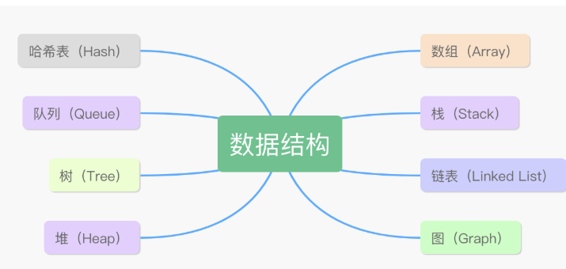

# 数组
优点：

+ 按照索引查询元素的速度很快；
+ 按照索引遍历数组也很方便。

缺点：

+ 数组的大小在创建后就确定了，无法扩容；
+ 数组只能存储一种类型的数据；
+ 添加、删除元素的操作很耗时间，因为要移动其他元素。

# 链表
链表是一种递归的数据结构，它或者为空（null），或者是指向一个结点（node）的引用，该节点还有一个元素和一个指向另一条链表的引用。

Java 的 LinkedList 类可以很形象地通过代码的形式来表示一个链表的结构：

```java
public class LinkedList<E> {
    transient Node<E> first;
    transient Node<E> last;

    private static class Node<E> {
        E item;
        Node<E> next;
        Node<E> prev;

        Node(Node<E> prev, E element, Node<E> next) {
            this.item = element;
            this.next = next;
            this.prev = prev;
        }
    }
}
```

这是一种双向链表，当前元素 item 既有 prev 又有 next，不过 first 的 prev 为 null，last 的 next 为 null。如果是单向链表的话，就只有 next，没有 prev。

单向链表的缺点是只能从头到尾依次遍历，而双向链表可进可退，既能找到下一个，也能找到上一个——每个节点上都需要多分配一个存储空间。

优点：

+ 不需要初始化容量；
+ 可以添加任意元素；
+ 插入和删除的时候只需要更新引用。

缺点：

+ 含有大量的引用，占用的内存空间大；
+ 查找元素需要遍历整个链表，耗时。


# 栈
栈就好像水桶一样，底部是密封的，顶部是开口，水可以进可以出。用过水桶的小伙伴应该明白这样一个道理：先进去的水在桶的底部，后进去的水在桶的顶部；后进去的水先被倒出来，先进去的水后被倒出来。

同理，栈按照“后进先出”、“先进后出”的原则来存储数据，先插入的数据被压入栈底，后插入的数据在栈顶，读出数据的时候，从栈顶开始依次读出。

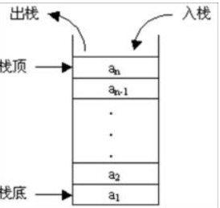

# 队列
队列就好像一段水管一样，两端都是开口的，水从一端进去，然后从另外一端出来。先进去的水先出来，后进去的水后出来。

和水管有些不同的是，队列会对两端进行定义，一端叫队头，另外一端就叫队尾。队头只允许删除操作（出队），队尾只允许插入操作（入队）

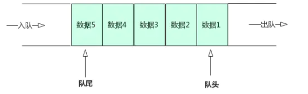

# 树
树是一种典型的非线性结构，它是由 n（n>0）个有限节点组成的一个具有层次关系的集合。

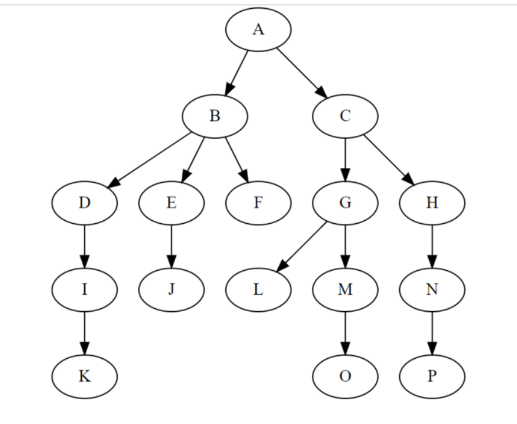

之所以叫“树”，是因为这种数据结构看起来就像是一个倒挂的树，只不过根在上，叶在下。树形数据结构有以下这些特点：

+ 每个节点都只有有限个子节点或无子节点；
+ 没有父节点的节点称为根节点；
+ 每一个非根节点有且只有一个父节点；
+ 除了根节点外，每个子节点可以分为多个不相交的子树。

根节点是第 0 层，它的子节点是第 1 层，子节点的子节点为第 2 层，以此类推。

+ 深度：对于任意节点 n，n 的深度为从根到 n 的唯一路径长，根的深度为 0。
+ 高度：对于任意节点 n，n 的高度为从 n 到一片树叶的最长路径长，所有树叶的高度为 0。

树的种类：

1. 无序树：树中任意节点的子节点之间没有顺序关系。下面就是无序树：

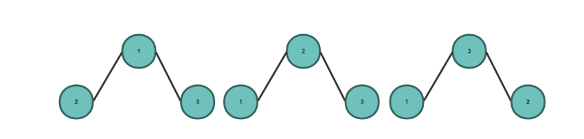

2. 二叉树：每个节点最多含有两个子树。二叉树按照不同的表现形式又可以分为多种。
3. 完全二叉树：对于一颗二叉树，假设其深度为 d（d > 1）。除了第 d 层，其它各层的节点数目均已达最大值，且第 d 层所有节点从左向右连续地紧密排列，这样的二叉树被称为完全二叉树。

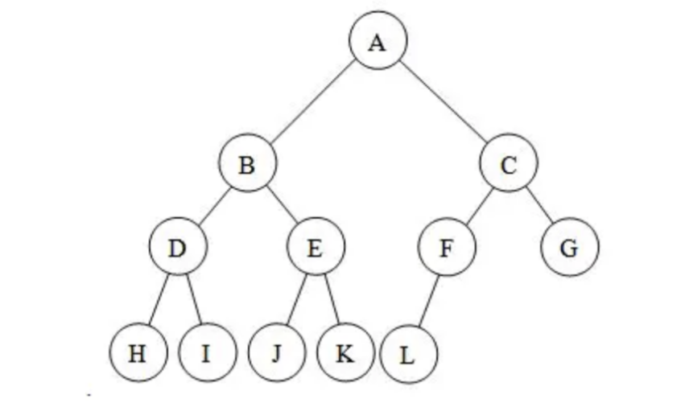

拿上图来说，d 为 3，除了第 3 层，第 1 层、第 2 层 都达到了最大值（2 个子节点），并且第 3 层的所有节点从左向右联系地紧密排列（H、I、J、K、L），符合完全二叉树的要求。

4. 满二叉树：一颗每一层的节点数都达到了最大值的二叉树。有两种表现形式，第一种，像下图这样（每一层都是满的），满足每一层的节点数都达到了最大值 2。

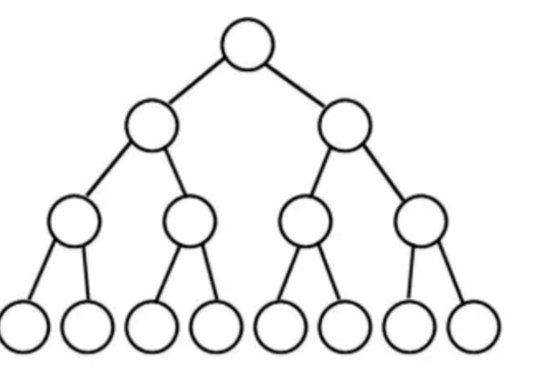

第二种，像下图这样（每一层虽然不满），但每一层的节点数仍然达到了最大值 2。

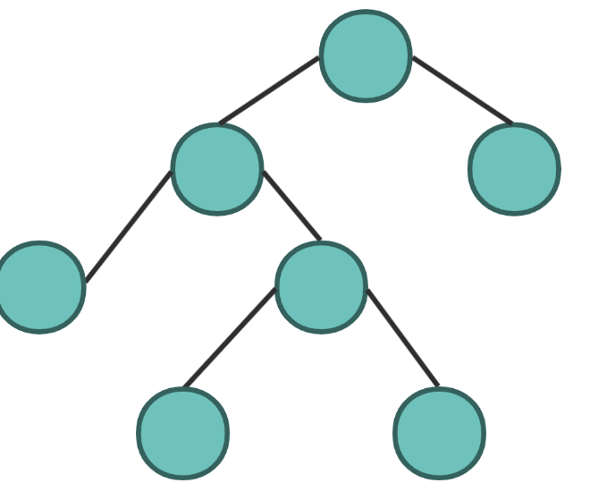

5. 二叉查找树：英文名叫 Binary Search Tree，即 BST，需要满足以下条件：
+ 任意节点的左子树不空，左子树上所有节点的值均小于它的根节点的值；
+ 任意节点的右子树不空，右子树上所有节点的值均大于它的根节点的值；
+ 任意节点的左、右子树也分别为二叉查找树。

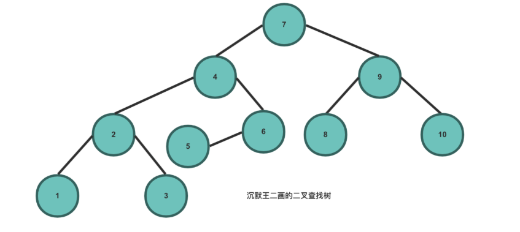

基于二叉查找树的特点，它相比较于其他数据结构的优势就在于查找、插入的时间复杂度较低，为 O(logn)。假如我们要从上图中查找 5 个元素，先从根节点 7 开始找，5 必定在 7 的左侧，找到 4，那 5 必定在 4 的右侧，找到 6，那 5 必定在 6 的左侧，找到了。

理想情况下，通过 BST 查找节点，所需要检查的节点数可以减半。

6. 平衡二叉树：当且仅当任何节点的两棵子树的高度差不大于 1 的二叉树。由前苏联的数学家 Adelse-Velskil 和 Landis 在 1962 年提出的高度平衡的二叉树，根据科学家的英文名也称为 AVL 树。

平衡二叉树本质上也是一颗二叉查找树，不过为了限制左右子树的高度差，避免出现倾斜树等偏向于线性结构演化的情况，所以对二叉搜索树中每个节点的左右子树作了限制，**左右子树的高度差称之为平衡因子**，树中每个节点的平衡因子绝对值不大于 1。

平衡二叉树的难点在于，当删除或者增加节点的情况下，如何通过左旋或者右旋的方式来保持左右平衡。

Java 中最常见的平衡二叉树就是**红黑树**，节点是红色或者黑色，通过颜色的约束来维持着二叉树的平衡：

1）每个节点都只能是红色或者黑色

2）根节点是黑色

3）每个叶节点（NIL 节点，空节点）是黑色的。

4）如果一个节点是红色的，则它两个子节点都是黑色的。也就是说在一条路径上不能出现相邻的两个红色节点。

5）从任一节点到其每个叶子的所有路径都包含相同数目的黑色节点。

7. B树：一种对读写操作进行优化的自平衡的二叉查找树，能够保持数据有序，拥有多于两个的子树。数据库的索引技术里就用到了 B 树。

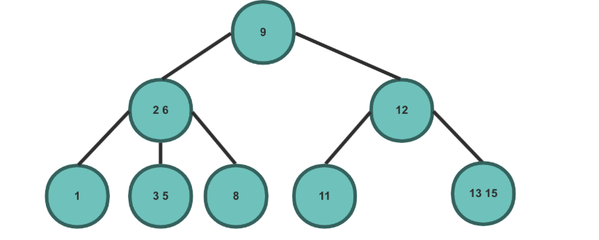


# 堆
堆可以被看做是一棵树的数组对象，具有以下特点：

+ 堆中某个节点的值总是不大于或不小于其父节点的值；
+ 堆总是一棵完全二叉树。

将根节点最大的堆叫做最大堆或大根堆，根节点最小的堆叫做最小堆或小根堆

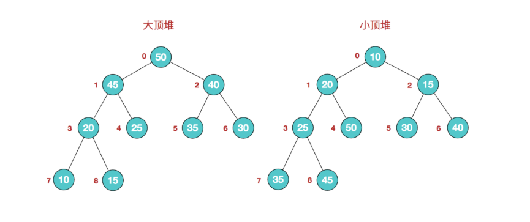


# 图
图是一种复杂的非线性结构，由顶点的有穷非空集合和顶点之间边的集合组成，通常表示为：G（V，E），其中，G 表示一个图，V 是图 G 中顶点的集合，E 是图 G 中边的集合。

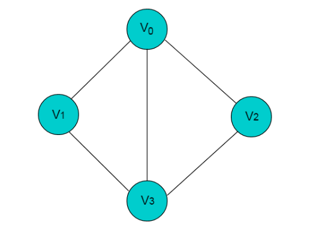

上图共有 V0，V1，V2，V3 这 4 个顶点，4 个顶点之间共有 5 条边。

在线性结构中，数据元素之间满足唯一的线性关系，每个数据元素（除第一个和最后一个外）均有唯一的“前驱”和“后继”；

在树形结构中，数据元素之间有着明显的层次关系，并且每个数据元素只与上一层中的一个元素（父节点）及下一层的多个元素（子节点）相关；

而在图形结构中，节点之间的关系是任意的，图中任意两个数据元素之间都有可能相关。


## 深度优先遍历
**深度优先遍历是一种优先走到底、无路可走再回头的遍历方式**。如图 9-11 所示，从左上角顶点出发，访问当前顶点的某个邻接顶点，直到走到尽头时返回，再继续走到尽头并返回，以此类推，直至所有顶点遍历完成。
![[深度优先遍历图.png]]
# 哈希表
哈希表（Hash Table），也叫散列表，是一种可以通过关键码值（key-value）直接访问的数据结构，它最大的特点就是可以快速实现查找、插入和删除。

数组的最大特点就是查找容易，插入和删除困难；而链表正好相反，查找困难，而插入和删除容易。哈希表很完美地结合了两者的优点， Java 的 HashMap 在此基础上还加入了树的优点

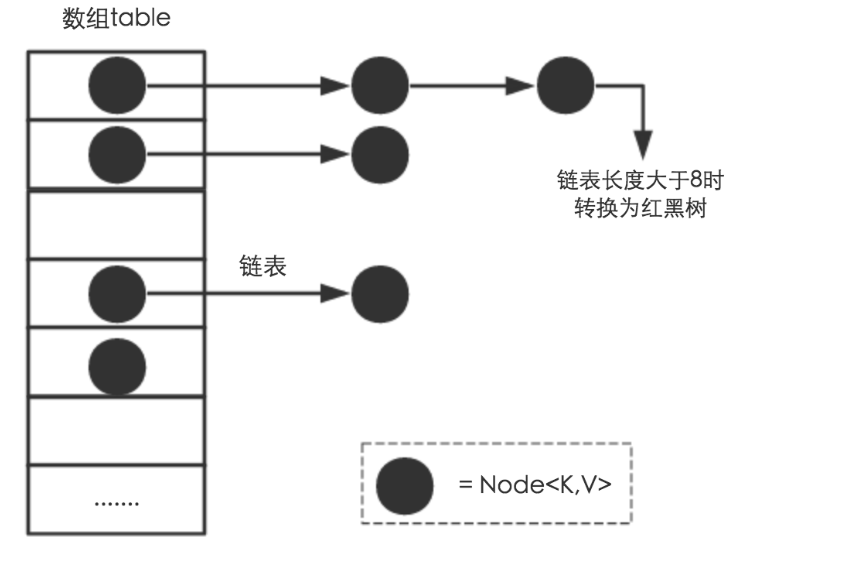

哈希函数在哈希表中起着⾮常关键的作⽤，它可以把任意长度的输入变换成固定长度的输出，该输出就是哈希值。哈希函数使得一个数据序列的访问过程变得更加迅速有效，通过哈希函数，数据元素能够被很快的进行定位


# 递归
递归，在计算机科学中是指一种通过重复将问题分解为同类的子问题而解决问题的方法。简单来说，递归表现为函数调用函数本身。在知乎看到一个比喻递归的例子，个人觉得非常形象，大家看一下：

+ 递归最恰当的比喻，就是查词典。我们使用的词典，本身就是递归，为了解释一个词，需要使用更多的词。当你查一个词，发现这个词的解释中某个词仍然不懂，于是你开始查这第二个词，可惜，第二个词里仍然有不懂的词，于是查第三个词，这样查下去，直到有一个词的解释是你完全能看懂的，那么递归走到了尽头，然后你开始后退，逐个明白之前查过的每一个词，最终，你明白了最开始那个词的意思。

递归例子：

```java
public int sum(int n) {
    if (n <= 1) {
        return 1;
    } 
    return sum(n - 1) + n; 
}
```

递归特点：

+ 自身调用：原问题可以分解为子问题，子问题和原问题的求解方法是一致的，即都是调用自身的同一个函数。
+ 终止条件：递归必须有一个终止的条件，即不能无限循环地调用本身。

递归与栈的关系：

递归的过程，可以理解为出入栈的过程的

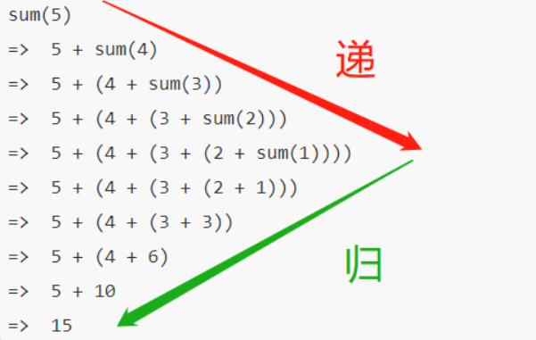

**递归的应用场景：**

+ 阶乘问题
+ 二叉树深度
+ 汉诺塔问题
+ 斐波那契数列
+ 快速排序、归并排序（分治算法也使用递归实现）
+ 遍历文件，解析xml文件

**递归解题思路：**

+ 第一步，定义函数功能
+ 第二步，寻找递归终止条件
+ 第二步，递推函数的等价关系式(**原问题和子问题都可以用同一个函数关系表示。**)

不是所有递推函数的等价关系都像阶乘这么简单，一下子就能推导出来。需要我们多接触，多积累，多思考，多练习递归题目滴~

经典递归题目：[https://leetcode-cn.com/problems/invert-binary-tree/](https://leetcode-cn.com/problems/invert-binary-tree/)（反转二叉树）

题目思路：这个题目是要反转一个二叉树，那么反转，可以先反转左子树、右子树，然后左子树也可以先反转它的左子树、右子树，最后将左右子树互换一个位置。可以发现一个问题可以被分解为子问题来解决，应用到了递归的思想。


**递归会存在的问题：**

+ 递归调用层级太多，导致栈溢出问题
+ 递归重复计算，导致效率低下

题目：经典的青蛙跳阶问题：一只青蛙一次可以跳上1级台阶，也可以跳上2级台阶。求该青蛙跳上一个 n 级的台阶总共有多少种跳法。

思路：跳上一个一级台阶一种跳法，跳上一个两级台阶有两种，跳上一个三级台阶有3种，跳上四级台阶有5种，

发现每一种的方案都是子方案的相加，f(n) = f(n-1) + f(n-2)

如果直接写：

```java
class Solution {
    public int numWays(int n) {
    if (n == 0){
       return 1;
     }
    if(n <= 2){
        return n;
    }
    return numWays(n-1) + numWays(n-2);
    }
}
```

超出时间限制了

+ 要计算原问题 f(10)，就需要先计算出子问题 f(9) 和 f(8)
+ 然后要计算 f(9)，又要先算出子问题 f(8) 和 f(7)，以此类推。
+ 一直到 f(2) 和 f(1），递归树才终止。

我们先来看看这个递归的时间复杂度吧，**「递归时间复杂度 = 解决一个子问题时间*子问题个数」**

+ 一个子问题时间 = f（n-1）+f（n-2），也就是一个加法的操作，所以复杂度是 **「****O(1)****」**；
+ 问题个数 = 递归树节点的总数，递归树的总结点 = 2^n-1，所以是复杂度**「O(2^n)」**。

青蛙跳阶，递归解法的时间复杂度 = O(1) * O(2^n) = O(2^n)，就是指数级别的，爆炸增长的，**「如果n比较大的话，超时很正常的了」**。

你仔细观察这颗递归树，你会发现存在**「大量重复计算」**，比如f（8）被计算了两次，f（7）被重复计算了3次...所以这个递归算法低效的原因，就是存在大量的重复计算！

解决方案：把计算好的答案存下来，即造一个备忘录，等到下次需要的话，先去**「备忘录」**查一下，如果有，就直接取就好了

实现：

```java
public class Solution {
    //使用哈希map，充当备忘录的作用
    Map<Integer, Integer> tempMap = new HashMap();
    public int numWays(int n) {
        // n = 0 也算1种
        if (n == 0) {
            return 1;
        }
        if (n <= 2) {
            return n;
        }
        //先判断有没计算过，即看看备忘录有没有
        if (tempMap.containsKey(n)) {
            //备忘录有，即计算过，直接返回
            return tempMap.get(n);
        } else {
            // 备忘录没有，即没有计算过，执行递归计算,并且把结果保存到备忘录map中，对1000000007取余（这个是leetcode题目规定的）
            tempMap.put(n, (numWays(n - 1) + numWays(n - 2)) % 1000000007);
            return tempMap.get(n);
        }
    }
}
```


# 排序
## 排序介绍
排序算法可以分为内部排序和外部排序。
内部排序是数据记录在内存中进行排序。
而外部排序是因排序的数据很大，一次不能容纳全部的排序记录，在排序过程中需要访问外存。
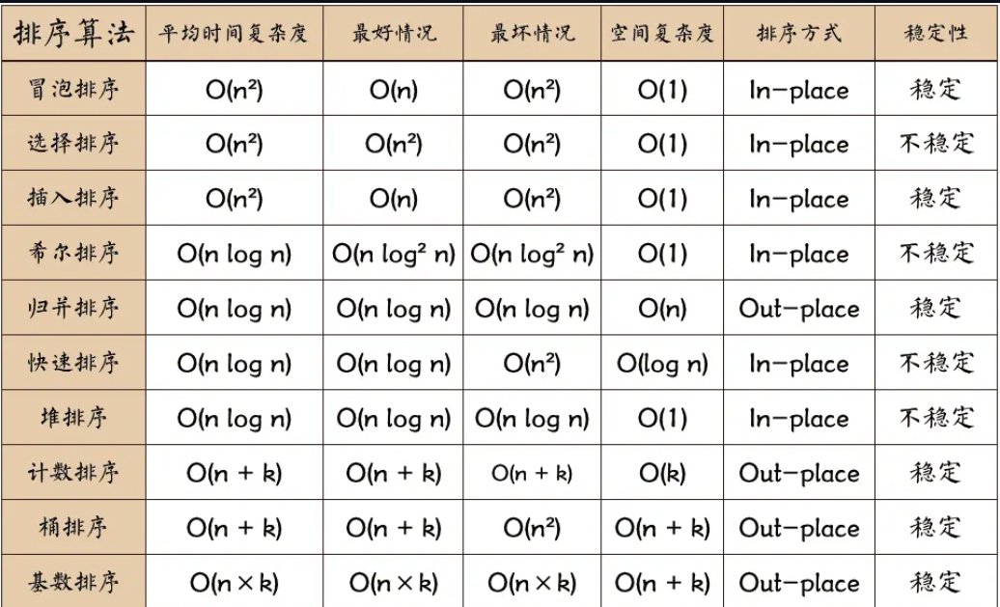

关于时间复杂度：
1. 平方阶 (O(n2)) 排序 各类简单排序：直接插入、直接选择和冒泡排序。
2. 线性对数阶 (O(nlog2n)) 排序 快速排序、堆排序和归并排序；
3. O(n1+§)) 排序，§ 是介于 0 和 1 之间的常数。 希尔排序
4. 线性阶 (O(n)) 排序 基数排序，此外还有桶、箱排序。


## 稳定排序和非稳定排序
稳定排序是指在排序过程中，如果数组中存在值相等的元素，排序后这些元素的相对顺序保持不变。即，排序前后的相同元素的顺序一致。
- 示例：假设有数组 [(A, 3), (B, 3), (C, 1)]，按值排序（升序）。稳定排序后，结果为 [(C, 1), (A, 3), (B, 3)]，其中值相同的 (A, 3) 和 (B, 3) 保持原有顺序。
- 常见稳定排序算法：**插入排序**、**归并排序**、**冒泡排序**。

非稳定排序是指在排序过程中，值相等的元素的相对顺序可能会改变。即，排序后相同元素的顺序可能与排序前不同。
- 示例：同样以上述数组为例，非稳定排序可能得到 [(C, 1), (B, 3), (A, 3)]，其中 (A, 3) 和 (B, 3) 的顺序可能颠倒。
- 常见非稳定排序算法：**快速排序**、**堆排序**、**选择排序**。
## 冒泡排序
按照升序来说：
+ 比较相邻的元素。如果第一个比第二个大，就交换他们两个。
+ 对每一对相邻元素作同样的工作，从开始第一对到结尾的最后一对。这步做完后，最后的元素会是最大的数。
+ 针对所有的元素重复以上的步骤，除了最后一个。
+ 持续每次对越来越少的元素重复上面的步骤，直到没有任何一对数字需要比较。
例子：
```java
public void t1() {
    int[] arr = new int[]{2, 3, 1, 4, 6, 5, 7, 9, 8, 10};
    //外层控制循环次数，每次循环需要把最小的放到最前面，这里只需要遍历元素个数-1次
    for (int i = 0; i < arr.length - 1; i++) {
        //内层控制遍历的元素，
        for (int j = i+1; j < arr.length  - i; j++) {
            if (arr[i] > arr[j]) {
                int temp = arr[i];
                arr[i] = arr[j];
                arr[j] = temp;
            }
        }
    }
    Arrays.stream(arr).forEach(item -> {
        System.out.println(item);
    });
}
```

优化点：
1. 每经过一次冒泡，内层循坏都会减少一次
2. 如果一轮冒泡没有发生交换，则表示排序成功了，退出外循环
## 选择排序
+ 首先在未排序序列中找到最小（大）元素，存放到排序序列的起始位置
+ 再从剩余未排序元素中继续寻找最小（大）元素，然后交换放到已排序序列的末尾。
+ 重复第二步，直到所有元素均排序完毕。

```java
@Test
public void t2() {
    int[] arr = new int[]{2, 3, 1, 4, 6, 5, 7, 9, 8, 10};
    //外层控制循环次数
    int min = 0;
    for (int i = 0; i < arr.length -1; i++) {
        min = i;
        //遍历查找最小元素的下标
        for (int j = i + 1; j < arr.length; j++) {
            if (arr[min] > arr[j]) {
                min = j;
            }
        }
        if (min != i) {
            int temp = arr[min];
            arr[min] = arr[i];
            arr[i] = temp;
        }
    }
    Arrays.stream(arr).forEach(item -> {
        System.out.println(item);
    });
}
```

冒泡排序和选择排序的区别：
1. 两种平均时间复杂度都是$O(n^2)$
2. 选择排序一般要快于冒泡，因为其交换次数少
3. 但如果集合有序度高，冒泡优于选择
4. 冒泡属于稳定排序，选择排序属于非稳定排序，因为其会改变相同元素的相对位置

## 插入排序
+ 将第一待排序序列第一个元素看做一个有序序列，把第二个元素到最后一个元素当成是未排序序列。
+ 从头到尾依次扫描未排序序列，将扫描到的每个元素插入有序序列的适当位置。（如果待插入的元素与有序序列中的某个元素相等，则将待插入元素插入到相等元素的后面。）

```java
@Test
public void t3() {
    int[] arr = new int[]{2, 3, 1, 4, 6, 5, 7, 9, 8, 10};

    //第一个元素为已排序的序列，第二个开始都是未排序的
    for (int i = 1; i < arr.length; i++) {
        //要插入的数
        int num = arr[i];
        int j = i;
        //遍历找插入的位置，如果这个值更小，那插入的位置还在前面
        while (j > 0 && num < arr[j-1]) {
            arr[j] = arr[j - 1];
            j--;
        }
        //找到插入的位置
        if (j != i) {
            arr[j] = num;
        }
    }
    Arrays.stream(arr).forEach(item -> System.out.println(item));
}
```
插入排序和选择排序的区别：
1. 二者平均时间复杂度都是 $O(n^2)$
2. 大部分情况下，插入都略优于选择
3. 有序集合插入的时间复杂度为 $O(n)$
4. 插入属于稳定排序算法，而选择属于不稳定排序


## 希尔排序
理解希尔排序首先要理解插入排序。希尔排序本身就是对插入排序的一个改进，**因为当一个数组的大部分元素是从大到小排列，用插入排序来从小到大排序的话，效率会被降低（需要做很多次swap）**，这种情况用希尔排序就会提升排序效率。

希尔排序就是按照一定的gap值，**不断地对数组进行插入排序**。不一样的希尔排序算法可能采用不一样的gap值。经典希尔算法的gap值为N/2, N/4, ...... **直到gap值为1**，这里的N为数组的长度。

看希尔排序工作的过程：  
`[61, 109, 149, 111, 34, 2, 24, 119, 122, 27]`  
首先，数组一共有10个元素（size = 10）。

**第一轮**，先用size/2做为间隔（gap），我们可以理解成是把原数组，按照间隔来分成了小数组，并对小数组进行插入排序。  
这里gap = 5，小数组为[61, 2]、[109, 24]、[149, 119]、[111, 122]、[34, 27]。**对小数组进行插入排序**：[2, 61]、[24, 109]、[119, 149]、[111, 122]、[27, 34]。  
我们并不改变原数组，所以排序后的原数组为`[2, 24, 119, 111, 27, 61, 109, 149, 122, 34]`。

**第二轮**，gap = gap/2 = 2。继续将原数组分为小数组，并对小数组进行插入排序。  
`[2, 119, 27, 109, 122]`、`[24, 111, 61, 149, 34]`  
两个小数组排序后为  
`[2, 27, 109, 119, 122]`、`[24, 34, 61, 111, 149]`  
因为不改变原数组，所以原数组这时为`[2, 24, 27, 34, 109, 61, 119, 111, 122, 149]`

**第三轮**，gap = gap/2 = 1。**这是最后一轮，其实就是将第二轮排序后的数组，进行插入排序**。

```java
@Test
public void t4() {
    int[] arr = new int[]{2, 3, 1, 4, 6, 5, 7, 9, 8, 10};
    //设置gap间距，表示每组gap个值，每个值间隔gap
    int gap = arr.length / 2;
    for (; gap > 0; gap /= 2) {
       //对每一个gap进行插入排序
        for (int i = gap; i < arr.length; i++) {
            int temp = arr[i];
            int j = i;
            while (j >= gap && arr[j - gap] > temp) {
                arr[j] = arr[j - gap];
                j -= gap;
            }
            //最后就是把待插入元素放到
            arr[j] = temp;
        }
    }
    Arrays.stream(arr).forEach(item -> System.out.println(item));

}
```

## 归并排序
+ 申请空间，使其大小为两个已经排序序列之和，该空间用来存放合并后的序列；
+ 设定两个指针，最初位置分别为两个已经排序序列的起始位置；
+ 比较两个指针所指向的元素，选择相对小的元素放入到合并空间，并移动指针到下一位置；
+ 重复步骤 3 直到某一指针达到序列尾；
+ 将另一序列剩下的所有元素直接复制到合并序列尾。
1. **分解**：将待排序数组分为两半，分别对这两半递归排序。
2. **合并**：将已排序的两半数组合并成一个有序的数组。

归并排序是稳定的排序算法，时间复杂度始终为 O(n log n)，无论最坏、最好或平均情况。因此，它在处理大规模数据时通常具有较好的性能。

```java
@Test
public void t5() {
    int[] arr = new int[]{2, 3, 1, 4, 6, 5, 7, 9, 8, 10};
    int left = 0;       //左边数组起始位置
    int right = arr.length - 1;
     mergeSort(arr, left, right);
    Arrays.stream(arr).forEach(item -> {
        System.out.println(item);
    });
}

private void mergeSort(int[] arr, int left, int right) {
    if (left < right) {
        int mid = (left + right) / 2;
        //左排序
        mergeSort(arr, left, mid);
        //右排序
        mergeSort(arr, mid + 1, right);
        //合并排序
        sortArr(arr, left, mid, right);
    }
}


private void sortArr(int[] arr, int left, int mid, int right) {
    int[] temp = new int[right - left + 1];
    int k = 0;
    int i = left;  //左数组的起始位置
    int j = mid + 1;    //右数组的起始位置
    while (i <= mid && j <= right) {
        if (arr[i] <= arr[j]) {
            temp[k++] = arr[i++];
        }else {
            temp[k++] = arr[j++];
        }
    }

    while (i <= mid) {
        temp[k++] = arr[i++];
    }

    while (j <= right) {
        temp[k++] = arr[j++];
    }

    //赋值
    for (i = 0; i < temp.length; i++) {
        arr[left++] = temp[i];
    }
}
```

## 快速排序
+ 从数列中挑出一个元素，称为 “基准”（pivot）;
+ 重新排序数列，所有元素比基准值小的摆放在基准前面，所有元素比基准值大的摆在基准的后面（相同的数可以到任一边）。在这个分区退出之后，该基准就处于数列的中间位置。这个称为分区（partition）操作；
+ 递归地（recursive）把小于基准值元素的子数列和大于基准值元素的子数列排序；

```java
@Test
public void t6() {
    int[] arr = new int[]{2, 3, 1, 4, 6, 5, 7, 9, 8, 10};
    myQuickSort(arr, 0, arr.length - 1);
    Arrays.stream(arr).forEach(item -> {
        System.out.println(item);
    });
}

private void myQuickSort(int[] arr, int left, int right) {
    //
    if (left < right) {
        int pivotIndex = partitions(arr, left, right);
        //左半分区快排
        myQuickSort(arr, left, pivotIndex - 1);
        //右
        myQuickSort(arr, pivotIndex + 1, right);
    }

}

/*
2, 3, 1, 4, 6, 5, 7, 9, 8, 10
 */
private int partitions(int[] arr, int left, int right) {
    //基准值
    int pivot = arr[right];
    int i = left - 1;       //指向最小值序列的末尾

    for (int j = left; j < right; j++) {
        //比基准小的全部放到左边
        if (arr[j] <= pivot) {
            i++;
            int temp = arr[j];
            arr[j] = arr[i];
            arr[i] = temp;
        }
    }

    int temp = arr[i + 1];
    arr[i + 1] = arr[right];
    arr[right] = temp;

    return i + 1;
}
```


## 堆排序
堆排序（Heap Sort）是一种基于**堆**（Heap）数据结构的排序算法，堆是一种完全二叉树，它可以用数组来实现。堆排序的基本思想是通过构建一个最大堆或最小堆，逐步将堆顶元素（最大或最小元素）交换到数组末端，然后调整堆结构，再继续排序，直到数组完全有序。

堆排序的基本思想：

1. **构建堆**：首先将待排序数组构建成一个堆，通常是一个最大堆或最小堆。最大堆是一个完全二叉树，其中每个节点的值都大于或等于其子节点的值，根节点是最大的元素。
2. **交换元素**：将堆顶元素（最大元素）与堆的最后一个元素交换，然后将堆的大小减一，并调整堆以恢复堆的性质。
3. **重复过程**：重复步骤 2，直到堆的大小为1，整个数组就排序完成。

```java
@Test
public void t7() {
    int[] arr = new int[]{2, 3, 1, 4, 6, 5, 7, 9, 8, 10};
    heapSort(arr);
    Arrays.stream(arr).forEach(item -> System.out.println(item));
}


// 调整堆，使得以 i 为根的子树符合堆的性质
public static void heapify(int[] arr, int n, int i) {
    int largest = i;  // 初始化 largest 为根节点
    int left = 2 * i + 1;  // 左子节点索引
    int right = 2 * i + 2;  // 右子节点索引

    // 如果左子节点比根节点大，更新 largest
    if (left < n && arr[left] > arr[largest]) {
        largest = left;
    }

    // 如果右子节点比当前最大值大，更新 largest
    if (right < n && arr[right] > arr[largest]) {
        largest = right;
    }

    // 如果 largest 发生变化，交换根节点和最大的子节点，并递归调整堆
    if (largest != i) {
        int temp = arr[i];
        arr[i] = arr[largest];
        arr[largest] = temp;

        // 递归地调整受影响的子树
        heapify(arr, n, largest);
    }
}

// 堆排序函数
public static void heapSort(int[] arr) {
    int n = arr.length;

    // 1. 构建最大堆
    for (int i = n / 2 - 1; i >= 0; i--) {
        heapify(arr, n, i);
    }

    // 2. 逐步将堆顶元素（最大元素）交换到数组末尾，并调整堆
    for (int i = n - 1; i > 0; i--) {
        // 将当前堆顶元素（最大元素）与堆的最后一个元素交换
        int temp = arr[0];
        arr[0] = arr[i];
        arr[i] = temp;

        // 调整堆，使得剩余的元素保持堆的性质
        heapify(arr, i, 0);
    }
}
```


## 计数排序
+ 花O(n)的时间扫描一下整个序列 A，获取最小值 min 和最大值 max
+ 开辟一块新的空间创建新的数组 B，长度为 ( max - min + 1)
+ 数组 B 中 index 的元素记录的值是 A 中某元素出现的次数
+ 最后输出目标整数序列，具体的逻辑是遍历数组 B，输出相应元素以及对应的个数


计数排序是一种非比较排序算法，它通过统计输入数据中每个元素的出现次数来排序。计数排序适用于范围较小的整数值或者离散值的排序问题。它的主要优势在于时间复杂度为 O(n + k)，其中 `n` 是数组的大小，`k` 是数组中最大元素的范围。

计数排序的基本思想：

1. **统计出现次数**：对于给定的输入数组，创建一个计数数组 `count`，其中 `count[i]` 存储的是元素 `i` 在输入数组中出现的次数。
2. **计算累计次数**：对计数数组进行累加，从而确定每个元素的最终位置。
3. **排序输出**：通过计数数组将每个元素放到其正确的排序位置。

```java
// 计数排序函数
public static void countingSort(int[] arr) {
    if (arr == null || arr.length == 0) {
        return;
    }

    // 找到数组中的最大值和最小值
    int max = arr[0];
    int min = arr[0];
    for (int i = 1; i < arr.length; i++) {
        if (arr[i] > max) {
            max = arr[i];
        }
        if (arr[i] < min) {
            min = arr[i];
        }
    }

    // 创建计数数组，数组大小为 (max - min + 1)
    int[] count = new int[max - min + 1];

    // 统计每个元素出现的次数
    for (int num : arr) {
        count[num - min]++;
    }

    // 计算累计次数
    for (int i = 1; i < count.length; i++) {
        count[i] += count[i - 1];
    }

    // 输出排序结果
    int[] output = new int[arr.length];
    for (int i = arr.length - 1; i >= 0; i--) {
        output[count[arr[i] - min] - 1] = arr[i];
        count[arr[i] - min]--;
    }

    // 将排序结果复制回原数组
    System.arraycopy(output, 0, arr, 0, arr.length);
}

@Test
public void t8() {
    int[] arr = new int[]{2, 3, 1, 4, 6, 5, 7, 9, 8, 10};
    countingSort(arr);
    Arrays.stream(arr).forEach(item -> System.out.println(item));
}
```


## 桶排序
+ 设置固定数量的空桶。
+ 把数据放到对应的桶中。
+ 对每个不为空的桶中数据进行排序。
+ 拼接不为空的桶中数据，得到结果

桶排序是一种分治法排序算法，它将元素分到有限数量的桶中，每个桶再分别排序。桶排序适用于数据分布比较均匀的情况。桶排序的核心思想是通过将数据分到不同的桶中，降低每个桶内元素的数量，再对每个桶内的元素进行排序，最后再合并桶中的元素。

基本思想：

1. **划分桶**：根据待排序数据的范围，将数据分到不同的桶中。每个桶的范围可以通过简单的数学公式计算得到。
2. **桶内排序**：对每个桶内的元素进行排序。通常使用其他排序算法（如插入排序、快速排序等）来排序每个桶中的元素。
3. **合并桶**：将排序后的所有桶中的元素按顺序合并，得到最终排序的结果。

```java
@Test
public void t9() {
    float[] arr = {0.42f, 0.32f, 0.54f, 0.24f, 0.10f, 0.25f, 0.48f};
    bucketSort(arr);
    for (int i = 0; i < arr.length; i++) {
        System.out.println(arr[i]);
    }
}
// 桶排序函数
public static void bucketSort(float[] arr) {
    if (arr == null || arr.length <= 1) {
        return;
    }

    // 1. 创建桶
    int n = arr.length;
    @SuppressWarnings("unchecked")
    List<Float>[] buckets = new List[n];

    // 初始化桶
    for (int i = 0; i < n; i++) {
        buckets[i] = new ArrayList<>();
    }

    // 2. 将元素分配到桶中
    for (float num : arr) {
        int index = (int) (num * n);  // 通过元素的大小映射到桶的索引
        buckets[index].add(num);
    }

    // 3. 对每个桶内的元素进行排序
    for (List<Float> bucket : buckets) {
        Collections.sort(bucket);  // 使用 Java 自带的排序
    }

    // 4. 合并桶中的元素
    int index = 0;
    for (List<Float> bucket : buckets) {
        for (float num : bucket) {
            arr[index++] = num;
        }
    }
}
```


## 基数排序
+ 将所有待比较数值（正整数）统一为同样的数位长度，数位较短的数前面补零
+ 从最低位开始，依次进行一次排序
+ 从最低位排序一直到最高位排序完成以后, 数列就变成一个有序序列


 基数排序是一种非比较型的整数排序算法，使用数字的各个位进行排序。基数排序通过逐位比较排序的方式，按照数字的每一位进行多次排序，最终完成对整个数据集的排序。它适用于整数或字符串排序，尤其在数值较小、位数较少的情况下表现非常高效。  

基数排序的基本思想：

1. **按位排序**：从最低位（个位）开始，对所有数据按照该位的值进行排序，然后再对次低位排序，直到排序到最高位。
2. **稳定排序**：每一位排序都使用稳定的排序算法（如计数排序或桶排序），确保每一轮排序后相同位数的元素之间保持原有的顺序。
3. **逐位排序**：每轮排序后，数据会逐渐有序，直到所有位数都排序完为止。

```java
//    / 获取数字的指定位（从1开始，个位是1）
private static int getDigit(int num, int d) {
    return (num / (int) Math.pow(10, d - 1)) % 10;
}

// 基数排序函数
public static void radixSort(int[] arr) {
    if (arr == null || arr.length <= 1) {
        return;
    }

    // 1. 找到最大值，确定排序的最大位数
    int max = Arrays.stream(arr).max().getAsInt();
    int maxDigits = (int) Math.log10(max) + 1;  // 获取最大位数

    // 2. 按位进行排序（从最低位开始）
    for (int d = 1; d <= maxDigits; d++) {
        countingSortByDigit(arr, d);
    }
}

// 基于某一位的计数排序
private static void countingSortByDigit(int[] arr, int d) {
    int[] output = new int[arr.length];
    int[] count = new int[10];  // 计数数组，数字0-9

    // 1. 统计每一位数字出现的次数
    for (int num : arr) {
        int digit = getDigit(num, d);
        count[digit]++;
    }

    // 2. 计算计数数组的累计和
    for (int i = 1; i < count.length; i++) {
        count[i] += count[i - 1];
    }

    // 3. 按照当前位数字的顺序将元素放到输出数组中
    for (int i = arr.length - 1; i >= 0; i--) {
        int num = arr[i];
        int digit = getDigit(num, d);
        output[count[digit] - 1] = num;
        count[digit]--;
    }

    // 4. 将排序后的元素复制回原数组
    System.arraycopy(output, 0, arr, 0, arr.length);
}

@Test
public void test10() {
    int[] arr = new int[]{2, 3, 1, 4, 6, 5, 7, 9, 8, 10};
    radixSort(arr);
    Arrays.stream(arr).forEach(item -> System.out.println(item));
}
```


# 二分查找
二分查找是一种基于分治策略的高效搜索算法。它利用**数据的有序性**，每轮缩小一半搜索范围，直至找到目标元素或搜索区间为空为止。
二分查找区间表示范围尤为重要：
1. 如果是\[left, right\]双闭区间，这种方法的循环条件是left <= right，因此left == right还可能是查找值
2. 如果是\[left, right)左闭右开区间，这种的循环条件是left < right，因此left == right肯定是已经失效的了

二分查找不仅可用于搜索目标元素，还可用于解决许多变种问题，比如搜索目标元素的插入位置。
1. 如果是数组是无重复元素的情况，那么二分查找返回的是插入元素位置的索引，如果找到与插入元素相同的元素，那么这个位置就是插入元素的位置；如果没有找到插入元素相同元素，因为区间是越来越小的，i始终向右找比目标元素大的，j始终向左找比目标元素小的，所以循环结束，i的位置就是要插入的位置
```java
/* 二分查找插入点（无重复元素） */
int binarySearchInsertionSimple(int[] nums, int target) {
    int i = 0, j = nums.length - 1; // 初始化双闭区间 [0, n-1]
    while (i <= j) {
        int m = i + (j - i) / 2; // 计算中点索引 m
        if (nums[m] < target) {
            i = m + 1; // target 在区间 [m+1, j] 中
        } else if (nums[m] > target) {
            j = m - 1; // target 在区间 [i, m-1] 中
        } else {
            return m; // 找到 target ，返回插入点 m
        }
    }
    // 未找到 target ，返回插入点 i
    return i;
}
```
2. 如果数组存在重复元素，那必须找到目标元素中正好小于的元素位置，优化方法是如果目标元素 > 中间元素或者 < 中间元素，正常的查找，如果等于中间元素，那么说明正好小于目标元素的元素在中间元素的左侧，也就是m-1
```java
int binarySearchInsertion(int[] nums, int target) {  
    int i = 0, j = nums.length - 1; // 初始化双闭区间 [0, n-1]    
    while (i <= j) {  
        int m = i + (j - i) / 2; // 计算中点索引 m        
        if (nums[m] < target) {  
            i = m + 1; // target 在区间 [m+1, j] 中  
        } else if (nums[m] > target) {  
            j = m - 1; // target 在区间 [i, m-1] 中  
        } else {  
            //找到相同的元素，但是不是目的，目的是找到比相同元素要小的元素位置，  
            // 这里一写，缩小空间，后面只能执行i = m + 1，去缩小左侧，直到i > j  
            //j是可能是等于元素的位置，锁死了  
            j = m - 1; // 首个小于 target 的元素在区间 [i, m-1] 中  
        }  
    }  
    // 返回插入点 i    
    return i;  
}
```


二分查找元素边界：
1. 查找目标元素左边界：回忆二分查找插入点的方法，搜索完成后 i 指向最左一个 `target` ，**因此查找插入点本质上是在查找最左一个 `target` 的索引**。
考虑通过查找插入点的函数实现查找左边界。请注意，数组中可能不包含 `target` ，这种情况可能导致以下两种结果。
- 插入点的索引 i 越界。
- 元素 `nums[i]` 与 `target` 不相等。
```java
/* 二分查找最左一个 target */
int binarySearchLeftEdge(int[] nums, int target) {
    // 等价于查找 target 的插入点
    int i = binary_search_insertion.binarySearchInsertion(nums, target);
    // 未找到 target ，返回 -1
    if (i == nums.length || nums[i] != target) {
        return -1;
    }
    // 找到 target ，返回索引 i
    return i;
}
```
2. 查找目标元素右边界，实际上，我们可以利用查找最左元素的函数来查找最右元素，具体方法为：**将查找最右一个 `target` 转化为查找最左一个 `target + 1`**。
```java
/* 二分查找最右一个 target */
int binarySearchRightEdge(int[] nums, int target) {
    // 转化为查找最左一个 target + 1
    int i = binary_search_insertion.binarySearchInsertion(nums, target + 1);
    // j 指向最右一个 target ，i 指向首个大于 target 的元素
    int j = i - 1;
    // 未找到 target ，返回 -1
    if (j == -1 || nums[j] != target) {
        return -1;
    }
    // 找到 target ，返回索引 j
    return j;
}
```

关于二分查找的其他考法：
1. 有一个有序表为 1,5,8,11,19,22,31,35,40,45,48,49,50 当二分查找值为 48 的结点时，查找成功需要比较的次数
2. 使用二分法在序列 1,4,6,7,15,33,39,50,64,78,75,81,89,96 中查找元素 81 时，需要经过（ ）次比较
3. 在拥有128个元素的数组中二分查找一个数，需要比较的次数最多不超过多少次
对于前两个题目，记得一个简要判断口诀：奇数二分取中间，偶数二分取中间靠左。对于后一道题目，需要知道公式：

$$n = log_2N = log_{10}N/log_{10}2$$

其中 n 为查找次数，N 为元素个数
# 搜索


# 哈希算法


# 贪心算法


# 分治算法


# 回溯算法


# 动态规范


# 字符串匹配算法


> 更新: 2025-03-11 15:32:07  
> 原文: <https://www.yuque.com/u25002409/zhab2g/np66fpm41pf4kfp7>