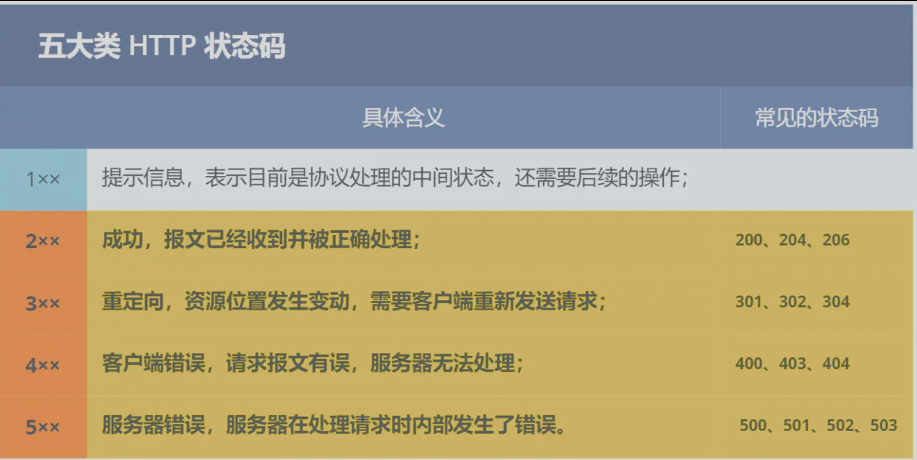
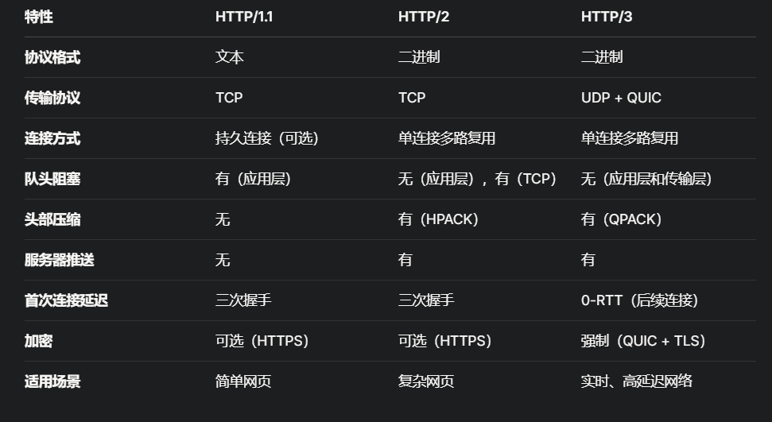
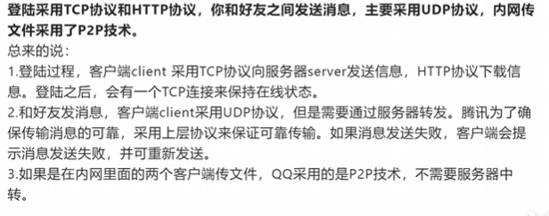

# 计算机网络

## TCP/IP网络模型
TCP/IP网络模型是计算机网络实际使用的通信框架，一组协议的集合，规定了如何在网络中进行通信。作用就是让不同的网络设备都能通过网络进行通信，交换数据。

分为应用层、传输层、网络层、网络接口层。

1. 网络层：提供用户与网络的接口，方便用户使用网络。
2. 传输层：负责数据的端到端传输，确保数据的完整。
3. 网络层：负责数据的寻址和路由。
4. 网络接口层：负责数据的物理传输。


## 从输入网址到显示内容，中间发生了什么？
假如输入一个地址为[www.baidu.com](https://www.baidu.com)

1. 对URL进行解析，确定资源的服务器地址和服务器上的位置，生成对应的请求消息。
2. 需要知道域名对应的ip地址的位置，DNS服务可以解析出域名对应的ip
3. TCP需要处理http消息，最重要的是加上源端口号和目标端口号等等信息，并且将http消息（如果太大）分为TCP报文。TCP还要建立连接，通过三次握手。
4. IP处理TCP传过来的数据包，加上源IP地址信息和目标IP地址等组成IP报文。
5. MAC层再将IP报文中添加源地址的mac地址和目的地址的mac地址。目的地址的mac通过ARP协议可以得出。
6. 网卡将数据信息转换为电信号发送出去，控制网卡还需要用到网卡驱动程序。
7. 经历的交换机存储mac地址和交换机所在端口号，目的是将数据转发到目标地址网络设备。
8. 路由器根据数据的ip和mac地址，通过路由表找到目的路由地址，再通过里面的交换机等设备，找到目标地址。
9. 服务器终于接收到数据，然后将数据内容进行“扒皮”，只要要获取的是什么，将内容封装成响应报文，再传回给客户端。
10. 数据又经历一遍返回到客户端，客户端将数据交给浏览器渲染。
11. TCP四次挥手，断开连接。


## HTTP
### HTTP是什么？
HTTP翻译就是超文本传输协议，协议就是一种规定，规定了超文本（文本、视频、音频等等）之间在网络中传输的一种规则。


### HTTP的状态码？



### HTTP常用字段有哪些？
Host指定服务器的域名。

Content-length表示内容数据的长度，单位是字节。

Connection规定连接状态，默认是keep-Alive持续连接，特点是只要任意一端没有明确提出断开连接，则保	持TCP 连接状态。

Content-type标识内容类型。

Content-Encoding标识内容的压缩方式。


### GET请求和POST请求
get请求是用于获取资源的，不携带请求体，是安全且幂等的，不会修改服务器中的数据，且每次获得数据都一样。

post请求是用户保存或者修改资源的，可修改请求体，请求体中的数据用户是无法看到的，但是还是可能会被抓包，是不安全且不幂等的，会修改服务器中的数据，且每次保存或者修改数据的行为都可能会产生不同的效果。


### HTTP缓存
对于一些重复性的请求，是可以从缓存中直接获取的。缓存分为强制性缓存和协商缓存，强制性缓存是直接使用浏览器的缓存；协商缓存是发送请求给服务器，服务器告知可以使用浏览器中的缓存。


### HTTP和HTTPS的区别
+ HTTP是采用的明文传输，HTTPS加入了SSL/TLS加密传输，更安全了。
+ HTTP经过TCP三次握手后就可以进行连接，HTTPS增加了SSL/TLS的握手过程，才可进入加密传输。
+ 端口不同， http80，https443
+ HTTPS需要向CA（证书权威机构）申请数字证书，保证服务器是可靠的。


HTTPS一定安全吗？会存在中间人的攻击，但是前提是用户信任了不安全的证书。


### HTTP/1.1、HTTP/2、HTTP/3的演变
http1.1：明文传输，持久连接，队头阻塞（请求需要排队处理）

http2：二进制传输，多路复用（支持一次发送多个请求）

http3：基于UDP+QUIC传输，超低延迟，尤其适合移动设备和不稳定网络。实时应用（视频流、游戏）体验更好。



http1.1像排队买奶茶，每人只能点完再轮到下一个。如果前面的人选得很慢，后面的人只能干等。

http2像奶茶店升级了：一个窗口能同时处理多个订单，大家不用排队等，但如果送奶茶的车（TCP）堵了，所有订单还是得停。

http3奶茶店直接开了多条独立通道，每个订单有专用快递员（QUIC 流），就算一条路堵了，其他订单照送不误。


## TCP


## IP


## 八股

### 什么是TCP网络分层？以及每层的作用？
TCP/IP协议包含四层模型，从上层往下分别是：应用层、传输层、网络层、数据链路层。有些资料说是五层，还有一层是物理层，但是我们不太关心物理层面上的。
1. 应用层的作用是负责应用程序间的数据通信的。不同的应用采用的不同的应用层协议。常见的两个应用层协议分别是DNS协议和HTTP协议
2. 传输层的主要作用是负责两台主机间的数据传输。常见的两个协议是TCP协议和UDP协议。
3. 网络层的作用是负责网络上的地址管理和路由选择。常见的协议是IP协议
4. 数据链路层负责设备间的数据帧的传送和识别的。
5. 可选的物理层：是将数据转换为信号在物理传输介质上进行传输


### TCP协议为什么是三次握手？不是两次、四次
TCP是面向连接的可靠协议，需要在数据传输前确保客户端和服务器都能正常发送和接收数据
三次握手的具体过程如下：
1. **第一次握手**：客户端发送SYN（同步）包，包含客户端的初始序列号（Seq=x），表示客户端请求建立连接。
2. **第二次握手**：服务器收到SYN后，回复SYN+ACK包，包含服务器的初始序列号（Seq=y）和对客户端序列号的确认（Ack=x+1），表示服务器同意连接并确认已收到客户端的请求。
3. **第三次握手**：客户端收到SYN+ACK后，发送ACK包（Ack=y+1），确认已收到服务器的响应，连接正式建立。
通过这三次交互：
- 客户端确认了服务器的接收能力和发送能力。
- 服务器确认了客户端的发送能力和接收能力。
- 双方同步了初始序列号，为后续数据传输奠定了基础。

两次握手无法保证连接的可靠性，主要原因如下：
1. **无法确认客户端的接收能力**：如果只有两次握手（客户端发送SYN，服务器回复SYN+ACK），服务器无法确认客户端是否正确接收了SYN+ACK包。如果客户端未收到SYN+ACK，服务器会认为连接已建立，而客户端没有，造成状态不一致。
2. **无法应对延迟的旧连接请求**：网络中可能存在延迟的SYN包（例如旧连接的请求）。如果只有两次握手，服务器收到延迟的SYN后会立即建立连接，而客户端可能并未发起此连接，导致服务器浪费资源。第三次握手的ACK可以让客户端明确是否为当前连接请求，从而避免误连接。
例如：
- 客户端发送SYN，服务器回复SYN+ACK。如果网络延迟，客户端未收到SYN+ACK，服务器认为连接已建立，而客户端没有，通信无法继续。
- 三次握手通过客户端的ACK确认，确保双方状态一致。


四次握手（例如额外增加一次客户端或服务器的确认）是多余的，原因如下：
1. **三次已足够**：三次握手已经完成了双方的发送能力、接收能力和序列号同步的确认，额外增加一次交互不会显著提升可靠性。
2. **增加不必要的延迟**：四次握手会增加一次往返时间（RTT），降低连接建立的效率，特别是在高延迟网络中。
3. **复杂化协议**：额外的握手会增加协议实现的复杂性，而三次握手已在理论和实践中被证明是可靠且高效的。
例如，假设增加第四次握手（服务器再次发送确认），这只是重复确认客户端的ACK，并未提供新的可靠性保证，反而增加了网络开销。


总结：
- **三次握手是必要且足够的**：它确保了双向通信的可靠性和序列号同步，同时避免了旧连接干扰。
- **两次握手不可靠**：无法确认客户端的接收能力，容易导致状态不一致和旧连接问题。
- **四次握手多余**：增加了延迟和复杂性，没有显著提升可靠性。
三次握手是TCP协议在可靠性和效率之间的最佳平衡，广泛应用于实际网络通信中。


### TCP的四次挥手为什么是四次？不能是三次？

TCP协议采用四次挥手（Four-Way Handshake）来关闭连接，目的是确保双方都能可靠地终止数据传输，并确认所有数据已被正确接收。

TCP是全双工协议，允许双方同时发送和接收数据。因此，关闭连接时需要分别关闭两个方向的数据流（客户端到服务器，服务器到客户端）。每个方向的关闭需要通过一次请求（FIN）和一次确认（ACK）完成，因此总共需要四次交互。
四次挥手的过程如下：
- **第一次挥手**：主动关闭方（假设是客户端）发送FIN包（Seq=x），表示客户端已完成数据发送，请求关闭客户端到服务器方向的连接。
- **第二次挥手**：服务器收到FIN后，发送ACK包（Ack=x+1），确认已收到客户端的关闭请求。此时，客户端到服务器的方向进入半关闭状态（客户端不再发送数据，但服务器仍可发送数据）。
- **第三次挥手**：服务器在完成数据发送后，发送FIN包（Seq=y），表示服务器也请求关闭服务器到客户端方向的连接。
- **第四次挥手**：客户端收到服务器的FIN后，发送ACK包（Ack=y+1），确认服务器的关闭请求。之后，双方进入TIME_WAIT状态（确保服务器收到ACK），最终完全关闭连接

**为什么是四次：**
- **全双工通信**：TCP连接的两个方向（客户端到服务器，服务器到客户端）是独立管理的，每个方向的关闭需要单独的FIN和ACK。
- **异步关闭**：服务器在收到客户端的FIN后，可能仍有数据需要发送（例如未发送完的响应）。因此，服务器先发送ACK确认客户端的FIN，待数据发送完成后再发送自己的FIN。这种异步性导致关闭过程分为四个步骤。
- **可靠终止**：四次挥手确保双方都明确对方已无数据发送，且所有数据已被接收，避免数据丢失


**为什么不是三次：**
三次无法满足TCP关闭连接的可靠性和全双工特性：
- **无法处理服务器的剩余数据**：如果将服务器的ACK和FIN合并为一次交互（例如，服务器收到客户端FIN后直接回复FIN+ACK），服务器可能尚未发送完数据。强制关闭服务器到客户端的方向可能导致数据丢失。
- **无法保证状态同步**：三次挥手可能导致客户端和服务器对连接状态的理解不一致。例如，客户端发送FIN，服务器回复FIN+ACK，客户端再回复ACK。如果服务器还有数据未发送，客户端可能过早关闭连接，造成服务器数据无法送达。
- **半关闭状态的需求**：TCP支持半关闭状态（一方关闭发送，但仍可接收数据）。四次挥手允许服务器在收到客户端FIN后继续发送数据，直到准备好关闭为止。三次挥手无法实现这种灵活性。
例如：
- 客户端发送FIN，服务器有未发送的数据。如果服务器直接回复FIN+ACK（三次挥手），客户端可能认为连接已完全关闭，忽略后续数据。
- 四次挥手中，服务器的ACK和FIN分开发送，允许服务器在ACK后继续发送数据，直到完成后再发送FIN，确保数据完整性。

总结
- **四次挥手是必要的**：由于TCP的全双工特性和异步关闭需求，每个方向的关闭需要独立的FIN和ACK，确保数据完整性和状态同步。
- **三次挥手不可靠**：无法处理服务器的剩余数据，可能导致数据丢失或状态不一致，也无法支持半关闭状态。
- **四次挥手是最佳设计**：它在可靠性和灵活性之间取得了平衡，适应了TCP连接的复杂场景。
四次挥手是TCP协议关闭连接的标准流程，确保了通信的可靠终止


### 为什么SYN/FIN不包含数据却要消耗一个序列号？
凡是需要对端进行确认，一定要消耗TCP报文序列号。

在TCP协议中，SYN（同步）和FIN（结束）报文段虽然不携带实际的应用层数据，但仍然需要消耗一个序列号（Sequence Number）。这是由TCP协议的设计和可靠性需求决定的。
**为什么需要消耗序列号：**
1. TCP序列号本质：TCP序列号用来标识每个字节在数据流中的位置，也用于标识TCP报文段的逻辑位置。
2. SYN序列号作用：SYN报文用于建立连接，SYN本身不包含数据，但是它标识数据流的第一个位置
3. FIN序列号作用：FIN报文表示一方的数据发送结束，标记数据流的终点。虽然FIN不含数据，但它占用数据流中的一个逻辑位置，表示“此序列号之后无数据”。
4. 确保可靠性和一致性：TCP的可靠性依赖于序列号和确认号（ACK）来跟踪发送和接收的报文段。如果SYN或FIN不消耗序列号，可能导致序列号不连续，破坏数据流的逻辑顺序。
5. 应对重传和网络异常：SYN和FIN可能因网络问题需要重传。分配序列号便于对端识别和确认重传的报文段，确保连接建立或关闭的可靠性。例如，若SYN丢失，客户端重传SYN（Seq=x），服务器通过序列号x识别这是相同的连接请求，避免重复建立连接

**为什么不设计为不消耗序列号：**
1. 确认机制的复杂化：TCP的ACK机制基于序列号的连续性。如果SYN/FIN不占序列号，ACK的确认号需要特殊处理（例如，跳过SYN/FIN的序列号），增加协议的复杂性和出错概率。
2. 无法区别重传和重复报文：没有序列号的SYN/FIN难以区分是重传还是旧连接的延迟报文，可能导致错误地建立或关闭连接。例如，延迟的SYN可能被误认为是新连接请求。

**为什么消耗一个序列号而不是更多：**
- SYN和FIN只占用一个序列号，因为它们本身不携带数据，仅代表数据流的一个逻辑控制点。TCP设计中，每个报文段（包括控制报文）占用一个序列号是最简单且一致的方式。
- 分配一个序列号足以标记SYN/FIN的位置，并与后续数据或ACK机制保持一致，无需更多序列号。

 总结
- **SYN和FIN消耗序列号的原因**：它们在数据流中占用逻辑位置，用于同步连接（SYN）或标记结束（FIN），确保序列号连续性和可靠传输。
- **不消耗序列号的后果**：会导致序列号不连续、确认机制复杂化、无法有效处理重传或延迟报文。
- **一个序列号的合理性**：SYN和FIN作为控制报文，仅需一个序列号标记其位置，与TCP的序列号机制保持一致。
这种设计是TCP协议在可靠性和简洁性之间的平衡，确保了连接建立和关闭的正确性与一致性。


### 什么是半连接队列？什么是SYN Flood攻击？

半连接队列（也称为SYN队列）是TCP服务器在处理连接请求时用于存储处于半连接状态的TCP连接的队列。半连接状态是指服务器已接收到客户端的SYN包（第一次握手），并回复了SYN+ACK包（第二次握手），但尚未收到客户端的ACK包（第三次握手）以完成连接建立

SYN Flood攻击是一种常见的拒绝服务攻击（DoS），通过向目标服务器发送大量伪造的TCP SYN包，耗尽服务器的半连接队列和系统资源，使其无法处理合法连接请求。
防御措施：包括启用SYN Cookies、增加队列容量、缩短超时时间、过滤伪造IP和使用DDoS防护服务等。


### 说说TCP快速打开（TFO）的原理

TCP快速打开（TCP Fast Open, TFO） 是一种优化TCP连接建立的机制，旨在减少三次握手的延迟，特别是在频繁建立短连接的场景下（如网页加载、移动应用）。TFO允许客户端在三次握手的SYN报文中携带应用数据，从而在连接建立的同时传输数据，缩短首次数据传输的往返时间（RTT）

TFO的关键思想是：在首次连接时，客户端和服务器通过标准三次握手交换一个加密的TFO Cookie，后续连接中客户端使用该Cookie证明其身份，允许在SYN报文中附带数据，服务器在验证Cookie后直接处理数据。


### TCP报文中的时间戳有什么作用？
- **TCP时间戳的作用**：
    1. 精确计算RTT，优化RTO和拥塞控制。
    2. 防止序列号回绕（PAWS），支持高速网络。
    3. 提高重传效率，区分新旧报文。
    4. 支持窗口扩展，提升高带宽网络性能。
- **工作原理**：通过TSval和TSecr在报文中交换时间信息，协商启用，单调递增确保顺序。
- **优势**：提高性能、适应现代网络、向下兼容。
- **局限性**：增加开销、依赖双方支持、精度受限。


### TCP超时重传时间是怎么计算的？

在TCP协议中，超时重传时间（Retransmission Timeout, RTO）是TCP发送方在发送数据后等待ACK（确认）的最长时间。如果超过RTO仍未收到ACK，发送方会认为数据丢失并触发重传。RTO的计算需要平衡可靠性（避免过早重传）和效率（避免过长等待），因此TCP采用动态算法基于网络的**往返时间（RTT）** 进行计算。

- **RTO计算方法**：基于Jacobson/Karels算法，使用平滑RTT（SRTT）和RTT方差（RTTVAR）计算：RTO = SRTT + 4 * RTTVAR。
- **核心步骤**：测量RTT → 平滑SRTT → 计算RTTVAR → 得出RTO → 指数退避（重传失败时）。

### 能不能说一下TCP的流量控制？


TCP的**流量控制（Flow Control）是TCP协议的重要机制，用于防止发送方发送数据过快而导致接收方缓冲区溢出，确保数据传输的可靠性和效率。流量控制通过滑动窗口（Sliding Window）** 机制实现，动态调整发送方的发送速率以匹配接收方的处理能力。

原理：
- 接收方在ACK报文中通告其接收窗口大小（Window Size），发送方根据该窗口大小控制发送的数据量。


### 如何理解TCP的keep-alive的原理

TCP Keep-Alive 是TCP协议提供的一种机制，用于检测连接的存活性，确保长时间空闲的TCP连接仍然有效。它通过周期性地发送探测报文（Keep-Alive Probe）来确认对端是否仍然在线，防止因网络中断、设备故障或超时而导致的“僵尸连接”。

原理：在连接空闲一段时间后，发送方发送一个特殊的TCP报文（Keep-Alive探针），检查对端是否响应。如果对端无响应且多次探测失败，连接被认为已断开。

**工作流程**：
- 空闲时间（tcp_keepalive_time）后发送探针。
- 每隔探测间隔（tcp_keepalive_intvl）重试，达到探测次数（tcp_keepalive_probes）后关闭。


### 聊一聊TCP中的端口号？

在TCP协议中，端口号是传输层的重要组成部分，用于标识主机上运行的应用程序或服务，配合IP地址实现端到端的通信。
端口号是一个16位的无符号整数（范围0-65535），用于标识主机上的特定进程或服务。
根据IANA（Internet Assigned Numbers Authority）的规定，端口号分为三类：
1. 知名端口（0-1023）：分配给标准协议和常用服务
	- HTTP：80
	- HTTPS：443
	- FTP：21
	- SSH：22
	- SMTP：25
2. 注册端口（1024-49151）：分配给用户应用程序或非标准服务
	- MySQL：3306
	- Redis：6379
	- MongoDB：27017
3. 动态/临时端口（49152-65535）：由操作系统动态分配给客户端程序，作为临时端口。


### TCP场景题目

1. A、B两个主机之间建立了一个TCP连接，A主机给B主机发送了两个TCP报文，大小分别是500和300，第一个报文的序列号是200，那么B主机接收到两个报文后，返回的确认号是多少？

TCP序列号标记每个字节，确认号表示期望的下一个字节。累积确认确保连续数据的确认。
计算
- **第一个报文**：
    - 大小：500字节。
    - 序列号：200（表示数据从字节200开始）。
    - 覆盖的字节范围：200到699（200 + 500 - 1 = 699）。
    - 如果B主机成功接收，期望的下一个字节是700。
- **第二个报文**：
    - 大小：300字节。
    - 序列号：由于TCP数据流连续，第二个报文的序列号是第一个报文最后一个字节的序列号加1，即700（200 + 500 = 700）。
    - 覆盖的字节范围：700到999（700 + 300 - 1 = 999）。
    - 如果B主机成功接收，期望的下一个字节是1000。
- **B主机的确认号**：
    - 假设B主机按顺序接收到两个报文（字节200-699和700-999），数据连续无丢失。
    - B主机返回的ACK报文将确认所有接收到的数据，期望接收的下一个字节是1000。
    - 因此，确认号为**1000**。
所以返回的确认号是1000


2. TCP提供了一种字节流服务，而收发双方都不保持记录的边界，应用程序应该如何提供他们自己的记录标识呢？
TCP协议提供了一种面向字节流的可靠传输服务，这意味着它将数据视为连续的字节序列，而不保留应用程序定义的记录（record）或消息边界。发送方将数据写入TCP发送缓冲区，接收方从TCP接收缓冲区读取字节流，数据的分段和重组由TCP协议栈管理，应用程序无法直接感知这些边界。因此，应用程序需要在应用层设计机制来标识和划分记录（或消息）边界。
应用程序使用自己约定的规则来表示消息的边界，比如有一些使用回车+换行，比如Redis的通信协


3. 收到IP数据包解析以后，它怎么知道这个分组应该投递到上层的哪一个协议（UDP或者TCP）？
在网络通信中，当主机收到一个IP数据包后，需要确定该数据包应投递到上层的哪一个传输层协议（如TCP或UDP）。这一过程依赖于IP数据包头部中的协议字段（Protocol Field）。用于指示数据包的上层协议类型（如TCP、UDP、ICMP等）

### 讲一下telnet用法
Telnet 是一个客户端工具，用于通过Telnet协议或直接基于TCP连接测试远程主机的服务（如HTTP、SMTP）。它常用于调试网络连接或手动与服务交互。
用法：
```shell
telnet <host> <port>

telnet example.com 80
连接成功后，手动输入HTTP请求：
GET / HTTP/1.1
Host: example.com
<Enter><Enter>


按Ctrl+]进入telnet命令模式，输入quit退出。
```


### 讲一下netstat用法
Netstat（Network Statistics）是一个命令行工具，用于显示网络连接、路由表、接口统计和监听端口等信息。它在Linux、Windows等系统中广泛使用，常用于监控网络状态。
```shell
netstat [options]

 -a：显示所有连接（包括监听和非监听）。
 -t：显示TCP连接。
 -u：显示UDP连接。
 -l：显示监听端口。
 -n：以数字格式显示地址和端口（不解析为域名）。
 -p：显示关联的进程ID和程序名（需root权限）。
 -r：显示路由表。
 -i：显示网络接口统计。

# 查看所有TCP监听端口
netstat -tuln

# 查看所有TCP连接及其进程：
netstat -tunap

# 显示路由表
netstat -r


# windows上面不同：
Windows下常用选项：
 -a：显示所有连接。
 -n：数字格式。
 -o：显示进程ID。
 -b：显示可执行程序名
netstat -ano
```


### 讲一下tcpdump用法
Tcpdump 是一个强大的命令行抓包工具，用于捕获和分析网络流量。它直接操作链路层或网络层数据包，常用于调试网络问题。
```shell
tcpdump [options] [filter]


- -i <interface>：指定抓包网卡（如eth0、any）。
- -n：不解析IP/端口为域名/服务名，显示数字格式。
- -c <count>：捕获指定数量的数据包后退出。
- -w <file>：将抓包数据保存到文件。
- -r <file>：读取保存的抓包文件。
- -v：显示详细输出，-vv更详细。
- -S：显示绝对序列号（而非相对序列号）。

- host <ip>：捕获指定主机的流量。
- port <port>：捕获指定端口的流量。
- tcp/udp：捕获特定协议的流量。
- src <ip>/dst <ip>：捕获源/目的IP的流量。
- 逻辑运算：and、or、not。


# 捕获80端口的TCP流量：
tcpdump -i eth0 -n tcp port 80

# 捕获指定主机的流量并保存
tcpdump -i any -n host 192.168.1.100 -w capture.pcap

# 读取保存的抓包文件
tcpdump -r capture.pcap

# 捕获10个TCP SYN包
tcpdump -i eth0 -n 'tcp[tcpflags] & tcp-syn != 0' -c 10

```
注意：
- 需root权限运行（访问网卡）。
- 过滤器需符合BPF（Berkeley Packet Filter）语法。
- 抓包数据量大时，建议保存到文件（-w）后用Wireshark分析。
- 抓包可能影响性能，建议限制范围（如-c、特定端口）。


### 讲一下wireshark用法
Wireshark 是一个功能强大的图形化网络协议分析工具，用于捕获、分析和可视化网络流量。它支持详细的协议解析，广泛用于网络调试、性能分析和安全审计。


### TCP和UDP的区别？
**TCP**：面向连接、可靠、字节流，有流量/拥塞控制，适合高可靠性场景（如Web、文件传输）。
**UDP**：无连接、不可靠、数据报，无控制机制，适合实时性场景（如视频流、DNS）。
核心差异：
- 连接性：TCP需握手，UDP直接发送。
- 可靠性：TCP确保数据完整，UDP不保证。
- 性能：UDP更快但不可靠，TCP可靠但延迟高。
- 开销：TCP头部大，UDP头部小。

### 如果你设计一个QQ，你在网络协议上如何考虑？



### http是基于哪个协议？http和https的区别
**HTTP（HyperText Transfer Protocol）** 是应用层协议，用于在Web浏览器和服务器之间传输超文本数据（如HTML、JSON）
HTTP直接基于TCP（传输层），间接依赖IP（网络层）和DNS（应用层辅助）。TCP的可靠性是HTTP选择其作为底层协议的关键。

**HTTPS（HyperText Transfer Protocol Secure）** 是HTTP的安全版本，通过引入加密和身份验证机制增强安全性。
- **安全性**：HTTP明文，HTTPS使用TLS加密，提供保密性、完整性和身份验证。
- **端口**：HTTP用80，HTTPS用443。
- **性能**：HTTP开销低，HTTPS因加密和TLS握手略高（现代优化缩小差距）。
- **用户体验**：HTTPS更安全，SEO友好，符合现代Web标准。
- **协议栈**：HTTPS在HTTP和TCP间增加TLS层。


### 你平常有碰到网络故障的经历吗，会怎么解决？比如一个网址打不开，你会怎么解决？
在实际工作中，我遇到过多种网络故障，例如：
- **网站访问失败**：如客户端无法打开网页，提示“无法连接”或超时。
- **服务端口不可达**：服务器进程未监听端口或防火墙拦截。
- **高延迟或丢包**：网络拥塞、路由问题或服务器性能瓶颈。
- **DNS解析失败**：域名无法解析为IP地址。
- **HTTPS证书错误**：证书过期或域名不匹配。

**通用排查思路**（分层诊断，基于OSI模型）：
1. **物理层/链路层**：检查物理连接（如网线、Wi-Fi）和网卡状态。
2. **网络层**：验证IP连通性（如ping、traceroute）。
3. **传输层**：检查TCP/UDP端口是否开放（如telnet、netcat）。
4. **应用层**：分析协议（如HTTP状态码、DNS解析、证书）。
5. **工具支持**：
    - **ping**：测试IP连通性。
    - **traceroute/tracert**：追踪路由路径。
    - **telnet/nc**：测试端口。
    - **dig/nslookup**：检查DNS解析。
    - **tcpdump/Wireshark**：抓包分析协议。
    - **curl**：测试HTTP请求。
6. **分段定位**：
    - 客户端问题：浏览器配置、DNS缓存、代理。
    - 网络问题：路由、防火墙、ISP。
    - 服务器问题：服务未运行、端口未监听、负载过高。


当一个网址（如https://example.com）打不开时，可能的原因包括客户端配置错误、网络连接问题、DNS解析失败、服务器故障等。以下是系统化的排查和解决步骤：
- 检查客户端：网络、代理、浏览器。
- 验证DNS：nslookup、切换DNS、清除缓存。
- 测试连通性：ping、traceroute、防火墙。
- 检查端口/服务：telnet、curl、服务器状态。
- 抓包分析：tcpdump、Wireshark。
- 联系相关方：ISP、域名或服务器管理员。


### 有使用过网络排查的命令吗

1. ping：检查网络连通性和主机响应时间。显示响应时间、丢包率等。可以加参数如 -c 4（发送4次请求）或 -t（持续ping直到手动停止）。
2. tracert/traceroute：跟踪数据包到目标主机的路径，定位网络瓶颈。显示每一跳的 IP 和延迟。
3. nslookup/dig：查询 DNS 解析，检查域名是否正确解析到 IP。返回域名对应的 IP 地址和 DNS 服务器信息。dig 提供更详细的输出，常用于 Linux。
4. netstat：查看网络连接状态、监听端口、路由表等。netstat -an（显示所有连接和端口）或 netstat -r（显示路由表）。Windows 和 Linux 均支持，Linux 上可以用 ss 替代，性能更优。
5. ipconfig/ifconfig：查看本地网络配置（如 IP 地址、网关、DNS）。Windows 用 ipconfig，Linux 用 ifconfig 或 ip addr。ipconfig /all 查看详细配置，ipconfig /release 和 /renew 释放/续租 IP。
6. telnet：测试特定端口是否开放。如果连接成功，说明目标端口可访问。
7. curl/wget：测试 HTTP 请求，检查网页或 API 响应。常用于检查服务器状态码或下载文件。
8. arp：查看或管理 IP 与 MAC 地址的映射表。
9. route：查看或修改路由表。
10. nmap：网络扫描，检查开放端口和服务。


