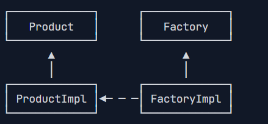
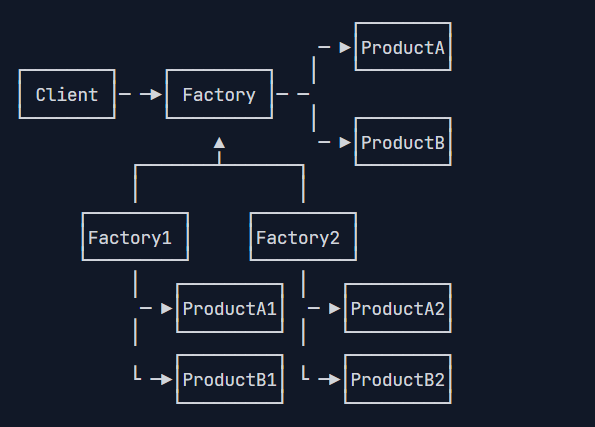
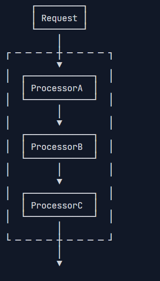
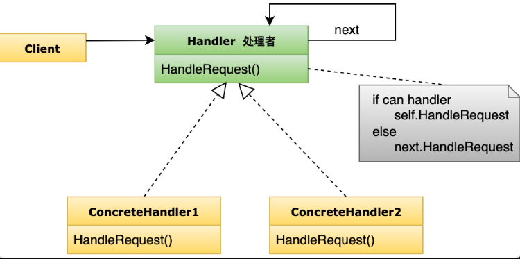
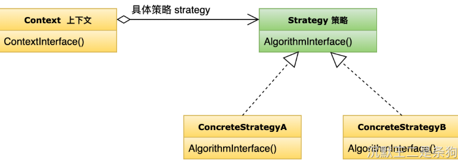

# 设计模式

**使用设计模式的目的是为了可重用性代码，提高代码的扩展性和可维护性。** 设计模式是基于OOP编程提炼出来的，基于几个原则：

1. 开闭原则：软件应该对扩展开放，对修改关闭，软件修改尽量不要修改代码
2. 里氏替换原则：如果我们调用一个父类的方法成功，那么就可以调用子类的方法也成功。

## 1. 工厂方法（创建型）
工厂方法是一种对象创建性模式，将对象的创建和对象的使用分开。定义一个用于创建对象的接口（模板），让子类来决定实例化哪一个类，**将创建对象的行为延迟到子类中实现**。


如上图简单实现是：定义一个抽象工厂Factory，抽象的产品类Product，具体工厂继承抽象工厂实现内部通用的创建方法，来创建具体的产品类，具体的产品类调用业务方法。然后有具体的工厂创建具体的产品

优化实现（基本实现）：在Factory中定义**静态方法**，静态方法中创建具体的产品对象，静态方法的返回参数可以是抽象产品或者是具体产品类。**这种方法的区别在于创建对象的行为可以发生在产品类本身。**
静态工厂方法是一种常见的编程实现，不是一种设计模式。
![[Pasted image 20250414153813.png]]

举例：Integer.valueOf()就是一个典型的静态工厂方法
```java
public final class Integer {
    public static Integer valueOf(int i) {
        if (i >= IntegerCache.low && i <= IntegerCache.high)
            return IntegerCache.cache[i + (-IntegerCache.low)];
        return new Integer(i);
    }
    ...
}
```
还有比如：List\<String\> list = List.of("A", "B", "C");


练习：使用静态工厂方法实现一个类似`20200202`的整数转换为`LocalDate`
1. 创建工厂类和静态工厂方法：
```java
/**
 * 静态工厂方法，这里直接在产品类或者抽象工厂中可以创建具体的产品，不在是一个抽象工厂对应着多个具体工厂
 */
public abstract class LocalDateFactory {
    public static LocalDate toLocalDate(int date) {
//        String format = LocalDate.now().format(DateTimeFormatter.ofPattern("yyyy-MM-dd"));
        return LocalDate.parse("2020-02-02");
    }
}

```
2. 使用
```java
    public static void main(String[] args) {
        LocalDate localDate = LocalDateFactory.toLocalDate(20200202);
        System.out.println(localDate);
    }
```


**适用场景：**
- **对象类型在运行时决定**：当需要根据条件（如用户输入、配置文件）动态创建不同类型的对象时。例如，根据数据库类型创建对应的连接对象（MySQL、PostgreSQL）。
- **隔离对象创建与使用**：客户端只关心产品的接口，不需要知道具体实现。例如，日志框架中客户端通过工厂获取日志记录器，无需关心是文件日志还是控制台日志。
- **支持系统扩展**：当系统可能需要添加新产品类型时，工厂方法通过子类扩展实现新产品创建，符合开闭原则。例如，新增一种车辆类型（如电动车）只需添加新工厂类。
- **框架或库开发**：提供工厂方法让用户自定义实现。例如，GUI框架允许用户定义特定平台的按钮创建逻辑。
**实际案例**：
- 日志框架（如 LoggerFactory 创建不同类型的日志记录器）。
- 数据库连接（如 ConnectionFactory 创建特定数据库的连接）。
- 插件系统（动态加载不同插件实现）。
**优点：**
- **解耦**：客户端与具体产品类解耦，只依赖抽象产品和工厂接口，降低耦合度。
- **扩展性强**：新增产品只需添加具体产品类和具体工厂类，无需修改现有代码，符合**开闭原则**。
- **封装创建逻辑**：将复杂的对象创建过程集中到工厂中，简化客户端代码。
- **支持多态性**：通过抽象接口操作，客户端可以无缝处理不同类型的对象。
**缺点：**
- **类数量增加**：每新增一种产品，都需要对应的具体产品类和具体工厂类，导致类数量较多。
- **复杂度提升**：对于简单场景，工厂方法模式可能显得过于复杂，增加设计和维护成本。
- **抽象层依赖**：需要定义抽象产品和工厂接口，可能会增加前期设计工作量。

## 2. 抽象工厂（创建型）
提供一个创建一系列相关或相互依赖对象的接口，而无需指定它们具体的类。定义一个抽象工厂接口，包含多个创建产品的方法；具体工厂实现这些方法，生成一组相关的产品对象；客户端只依赖抽象接口，不关心具体实现。

下图：提供了一个抽象工厂接口Factory，提供创建产品的抽象方法，具体工厂实现这个抽象工厂接口，实现创建产品的方法


实现：创建一个抽象工厂和抽象产品工厂，可以根据抽象工厂创建多个具体工厂和对应的具体产品：
1. 创建抽象工厂，其中定义抽象工厂创建产品的方法：
```java
/**
 * 抽象工厂，定义公共创建方法
 */
public abstract class MyAbstractFactory {
	//创建产品的抽象方法
    public abstract MyAbstractProduct create();
}
```

2. 创建抽象产品工厂，统一的产品类，其中定义通用的业务方法名（抽象业务方法）
```java
/**
 * 抽象产品工厂，提供通用的方法
 */
public abstract class MyAbstractProduct {
    public abstract void show();
}
```

3. 创建具体工厂，这里可以有很多个，根据产品的不同可以有不同个工厂实现，具体工厂根据实现抽象工厂提供的方法创建出自己的具体产品：
```java
public class MyAbstractFactoryImpl1 extends MyAbstractFactory {

    @Override
    public MyAbstractProduct create() {
        return new MyProductImpl1();
    }
}
```

4. 创建具体产品，这里可以有很多个
```java
public class MyProductImpl1 extends MyAbstractProduct{
    @Override
    public void show() {
        System.out.println("具体产品1111");
    }
}
```

5. 使用：创建具体工厂再调用方法创建具体产品，再执行产品逻辑
```java
        new MyAbstractFactoryImpl1().create().show();
        new MyAbstractFactoryImpl2().create().show();
```

6. 优化：在抽象工厂中根据类型或者名称创建具体工厂，那么在使用的时候就不需要再创建很多类了：
```java
public abstract class MyAbstractFactory {
    public abstract MyAbstractProduct create();

    public static MyAbstractProduct createProduct(String name) {
        if ("product1".equals(name)) {
            return new MyAbstractFactoryImpl1().create();
        } else if ("product2".equals(name)) {
            return new MyAbstractFactoryImpl2().create();
        } else {
            new RuntimeException("错误");
            return null;
        }
    }
}

//使用
MyAbstractFactory.createProduct("product1").show();
MyAbstractFactory.createProduct("product2").show();
MyAbstractFactory.createProduct("product").show();
```

**适用场景：**
- **需要创建一组相关对象（产品家族）**：当系统需要创建一组功能上相关或风格一致的对象，确保它们兼容。例如，跨平台UI库为Windows和Mac创建按钮、对话框等。
- **隐藏具体实现**：客户端只通过抽象接口操作，不需要知道具体产品类。例如，数据库驱动为不同数据库创建连接、查询对象。
- **产品之间有依赖关系**：确保同一工厂生产的产品能够协同工作。例如，Windows按钮必须与Windows对话框搭配。
- **支持多种配置**：需要在运行时切换不同产品家族（如从生产环境切换到测试环境）。例如，游戏中切换不同主题（奇幻、科幻）的资源。
- **系统可能扩展新产品家族**：通过新增具体工厂支持新配置。例如，新增Linux UI风格。
**实际案例：**
- GUI框架（如为不同操作系统创建UI组件：按钮、窗口）。
- 数据库驱动（如为MySQL、PostgreSQL创建相关对象）。
- 游戏开发（如为不同主题创建角色、武器）。
- 汽车制造（如为不同车型创建引擎、车身）。
**优点：**
- **封装产品家族**：将相关产品组织成家族，保证功能和风格一致性（如Windows按钮与Windows对话框匹配）。
- **解耦客户端代码**：客户端只依赖抽象工厂和产品接口，降低耦合。
- **易于扩展家族**：新增产品家族（如Linux UI）只需实现新具体工厂，符合**开闭原则**。
- **保证一致性**：同一工厂生产的产品天然兼容，适合需要协同工作的场景。
- **便于切换配置**：通过更换工厂实例即可切换整个产品家族（如从Windows切换到Mac）。
**缺点：**
- **代码复杂度增加**：引入多个接口和类（抽象工厂、具体工厂、抽象产品、具体产品），可能使系统复杂化。
- **新增产品类型困难**：如果需要添加新产品类型（如新增一个 Menu），必须修改抽象工厂接口和所有具体工厂，违反开闭原则（对产品类型扩展不友好）。
- **类数量较多**：每个产品家族和产品类型都会增加新类，导致代码量增大。
- **适用范围有限**：如果产品之间没有强关联或只需要单一产品，抽象工厂可能显得多余。


## 3. 生成器模式/建造者模式（创建型）
**将一个复杂对象的构建与它的表示分离，使得同样的构建过程可以创建不同的表示。建造者模式特别适合需要通过多个步骤配置一个复杂对象的情况。**

生成器模式（Builder）是使用多个“小型”工厂来最终创建出一个完整对象。Java中的builder创建对象就是这种方式。

当我们使用Builder的时候，一般来说，是因为创建这个对象的步骤比较多，每个步骤都需要一个零部件，最终组合成一个完整的对象。

实例：我们模拟实现一个URLBuilder

1. 重写了set方法，让它完成赋值后返回对象，不影响下一个set

```java
public class MyURLBuilder {
    private String domain;
    private String schema;
    private String path;
    private String query;

    public static MyURLBuilder builder() {
        return new MyURLBuilder();
    }

    public String build() {
        return schema + "://" + domain + path + query;
    }

    public MyURLBuilder setDomain(String domain) {
        this.domain = domain;
        return this;
    }

    public MyURLBuilder setSchema(String schema) {
        this.schema = schema;
        return this;
    }

    public MyURLBuilder setPath(String path) {
        this.path = path;
        return this;
    }

    public MyURLBuilder setQuery(String query) {
        this.query = query;
        return this;
    }
}

```

2. 使用：

```java
String result = MyURLBuilder.builder()
        .setDomain("www.baidu.com")
        .setPath("/list")
        .setSchema("https")
        .setQuery("?id=100")
        .build();
System.out.println(result);
```

**建造者模式的适用场景：**
1. **对象构造复杂**：对象有多个属性或需要多步初始化（如房屋、汽车）。
2. **需要不同配置**：相同的构造过程需要生成不同表示（如不同风格的UI组件）。
3. **构造函数参数过多**：避免“望远镜构造函数”，提高代码可读性。
4. **需要控制构造顺序**：构造过程有特定逻辑或依赖关系。
5. **不可变对象**：建造者模式常用于创建不可变对象（如Java的 StringBuilder）。
- **Java标准库**：
    - StringBuilder：通过链式调用追加字符，最终构建字符串。
    - DocumentBuilder：用于构建XML文档。
- **框架**：
    - OkHttpClient.Builder：配置HTTP客户端的连接参数。
    - AlertDialog.Builder（Android）：分步构建对话框。
- **现实场景**：
    - 汽车制造：分步组装引擎、车身、轮胎。
    - 餐饮系统：定制汉堡（选择面包、肉、蔬菜等）。
**建造者的优点：**
1. **分步构造**：将复杂对象的创建过程分解为多个步骤，代码更清晰。
2. **灵活性**：支持不同的构造顺序或配置，创建多种表示（例如，木屋、砖屋）。
3. **解耦**：客户端无需直接操作产品类，降低耦合。
4. **可读性强**：相比长参数的构造函数，建造者方法的命名更直观。
5. **控制构造过程**：可以验证参数或添加构造逻辑，确保对象状态一致。
**建造者的缺点：**
6. **代码量增加**：需要定义建造者接口和具体建造者类，增加了类数量。
7. **复杂度提升**：对于简单对象，建造者模式可能显得过于复杂。
8. **重复代码**：多个具体建造者可能有相似的逻辑，需小心设计以减少重复。
9. **必须完整构造**：通常需要调用所有构建步骤才能获取产品，可能不适合部分构造场景。

## 4. 原型模式（创建型）
用原型实例指定创建对象的种类，并且通过拷贝这些原型创建新的对象。

**原型模式，即Prototype，是指创建新对象的时候，根据现有的一个原型来创建。**

举例：我们在student类中提供一个copy方法根据原型创建一模一样的出来：

```java
public class MyStudent {
    private String name;
    private Integer age;

    public String getName() {
        return name;
    }

    public void setName(String name) {
        this.name = name;
    }

    public void setAge(Integer age) {
        this.age = age;
    }

    public Integer getAge() {
        return age;
    }

    @Override
    public String toString() {
        return "MyStudent{" +
                "name='" + name + '\'' +
                ", age=" + age +
                '}';
    }

    public MyStudent(String name, Integer age) {
        this.name = name;
        this.age = age;
    }

    public MyStudent() {
    }

    public static MyStudent copy(MyStudent myStudent) {
        MyStudent myStudent1 = new MyStudent();
        myStudent1.setName(myStudent.getName());
        myStudent1.setAge(myStudent.getAge());
        return myStudent1;
    }
}

//使用
    MyStudent stu1 = new MyStudent("张三", 100);
    System.out.println(stu1);
    MyStudent stu2 = MyStudent.copy(stu1);
    System.out.println(stu2);
```

**原型模式适用于以下场景：**
1. **对象构造复杂或成本高**：如需要加载大量资源、执行复杂计算的对象（例如，游戏中的角色模型）。
2. **需要创建相似对象**：基于模板对象生成多个相似但略有不同的对象（例如，文档模板复制）。
3. **动态类型创建**：运行时根据已有对象创建新对象，无需知道具体类（例如，原型注册表）。
4. **对象状态复用**：希望基于现有对象状态快速生成新对象（例如，图形编辑器中复制形状）。
5. **避免子类爆炸**：当工厂方法模式导致子类过多时，原型模式可通过克隆替代子类创建。
**实际案例**
- **图形编辑器**：复制形状（如圆形、矩形）以快速创建新图形。
- **游戏开发**：克隆敌人、道具模型，修改位置或属性。
- **文档系统**：复制文档模板（如Word文档），调整内容。
- **Java标准库**：Object.clone() 方法提供了原型模式的基础支持。
- **原型管理器**：维护一个原型注册表（如Spring中的原型作用域Bean）。
**优点：**
1. **高效创建**：通过复制已有对象，避免了复杂的初始化过程，适合构造成本高的对象。
2. **动态扩展**：运行时可以基于不同原型创建对象，无需提前知道具体类。
3. **简化创建**：客户端无需关心对象的构造细节，只需克隆并修改状态。
4. **支持状态复用**：新对象可以继承原型的状态，减少重复配置。
5. **灵活性**：可以克隆后修改部分属性，生成相似但不同的对象。
**缺点：**
6. **实现复杂性**：需要正确实现克隆逻辑，尤其是深拷贝可能涉及递归复制复杂对象。
7. **浅拷贝风险**：默认克隆（如 Java 的 clone()）是浅拷贝，引用类型的字段可能导致新旧对象共享状态。
8. **克隆支持需求**：对象必须支持克隆（如 Java 需要实现 Cloneable），否则无法使用。
9. **状态管理复杂**：如果原型对象状态复杂，克隆后可能需要额外的状态调整逻辑。
10. **不适合简单对象**：对于构造成本低的对象，原型模式可能增加不必要的复杂性。

## 5. 单例模式（创建性）
保证一个类仅有一个实例，并提供一个访问它的全局访问点。
**单例模式（Singleton）的目的是为了保证在一个进程中，某个类有且仅有一个实例。**
实现形式：一种是通过类的私有化构造器实现，一种是通过Enum实现
1. 这个实现有两种：一种私有化static创建完只能通过唯一的public方法获取实例；另一种利用public static；
上面是在类加载就创建好了，如果需要延迟加载可以通过调用getSingleton再去加载
```java
public class MySingletonClass {

//    public static final MySingletonClass mySingletonClass = new MySingletonClass();
    private static final MySingletonClass mySingletonClass = new MySingletonClass();

    private MySingletonClass() {
    }

    /*
    这个是在调用的方法的时候才会去创建类，在并发的情况下会出现问题
     */
//    public MySingletonClass getSingleton() {
//            if (mySingletonClass != null) {
   //               return new MySingletonClass();          
//              }
//    }

    public MySingletonClass getSingleton() {
        return mySingletonClass;
    }

    public void send() {
        System.out.println("调用成功");
    }
}
```
2. 枚举类实现：枚举类天生就是只有一个
```java
public enum MySingletonEnum {
    SingletonTemp, SINGLETON_ENUM;

    private String name = "singleton";

    public String getName() {
        return name;
    }

    public void setName(String name) {
        this.name = name;
    }
}

```
还可以划分为饿汉式和懒汉式两种模式：
1. 饿汉式：实例在类加载时候创建，线程安全但是可能存在资源浪费：
```java
// 饿汉式单例
public class Logger {
    // 静态实例，类加载时初始化
    private static final Logger instance = new Logger();

    // 私有构造函数，防止外部实例化
    private Logger() {
        // 防止反射破坏单例
        if (instance != null) {
            throw new RuntimeException("Use getInstance() to get the singleton instance");
        }
    }

    // 全局访问点
    public static Logger getInstance() {
        return instance;
    }

    public void log(String message) {
        System.out.println("Log: " + message);
    }
}
```
2. 懒汉式：实例在第一次使用时创建，节省资源但非线程安全。
```java
// 懒汉式单例（线程不安全）
public class Logger {
    private static Logger instance;

    private Logger() {
        if (instance != null) {
            throw new RuntimeException("Use getInstance() to get the singleton instance");
        }
    }

    public static Logger getInstance() {
        if (instance == null) {
            instance = new Logger();
        }
        return instance;
    }

    public void log(String message) {
        System.out.println("Log: " + message);
    }
}
```


所有总共有五种实现方案：
1. 普通饿汉式：就是上面通过私有化构造器，然后`private static final Logger instance = new Logger();`构建唯一的对象实例
2. 枚举饿汉式：利用枚举的特性天然防止反射，反序列化破坏单例：
```java
public enum Singleton2 {
    INSTANCE;

    private Singleton2() {
        System.out.println("private Singleton2()");
    }

    @Override
    public String toString() {
        return getClass().getName() + "@" + Integer.toHexString(hashCode());
    }

    public static Singleton2 getInstance() {
        return INSTANCE;
    }

    public static void otherMethod() {
        System.out.println("otherMethod()");
    }
}
```
3. 普通懒汉式：上面的实现，实例在第一次使用时创建，节省资源但非线程安全。但是出现问题就是创建对象的时机
4. 双检锁懒汉式：通过synchronized和volatile关键字来确保创建对象的唯一性
```java
public class Singleton4 implements Serializable {
    private Singleton4() {
        System.out.println("private Singleton4()");
    }

    private static volatile Singleton4 INSTANCE = null; // 可见性，有序性

    public static Singleton4 getInstance() {
        if (INSTANCE == null) {
            synchronized (Singleton4.class) {
                if (INSTANCE == null) {
                    INSTANCE = new Singleton4();
                }
            }
        }
        return INSTANCE;
    }

    public static void otherMethod() {
        System.out.println("otherMethod()");
    }
}
```
volatile作用：因为new SingleTon4()这个动作分为3步：创建对象，调用构造，给静态变量赋值，volatile防止指令重排序
5. 内部类懒汉式：静态内部类只有在首次访问的时候才会被加载和初始化
```java
public class Singleton5 implements Serializable {
    private Singleton5() {
        System.out.println("private Singleton5()");
    }

    private static class Holder {
        static Singleton5 INSTANCE = new Singleton5();
    }

    public static Singleton5 getInstance() {
        return Holder.INSTANCE;
    }

    public static void otherMethod() {
        System.out.println("otherMethod()");
    }
}
```

**优点：**
1. **唯一实例**：保证系统中只有一个实例，避免资源浪费和状态不一致。
2. **全局访问**：提供统一的访问点，方便模块间共享。
3. **延迟加载（部分实现）**：如懒汉式和静态内部类，实例在需要时创建，节省资源。
4. **简单实现**：相比其他设计模式，单例模式结构简单，易于理解。
5. **控制资源访问**：集中管理资源（如连接池、线程池），提高效率。

**缺点：**
1. **线程安全复杂**：懒汉式需要额外处理线程安全，双检锁实现较为复杂。
2. **测试困难**：单例的全局状态可能导致单元测试中状态污染，难以隔离。
3. **扩展性差**：单例类无法继承，无法动态替换实例（除非通过注册表等变通方法）。
4. **滥用风险**：过度使用单例可能导致全局状态依赖，增加耦合，违背模块化原则。
5. **反射和序列化问题**：
    - 反射可能绕过私有构造函数创建新实例。
    - 序列化/反序列化可能生成新实例，需特殊处理（如实现 readResolve()）。
6. **资源释放困难**：单例实例常驻内存，可能导致内存泄漏

**单例模式适用于以下场景：**
1. **全局唯一资源**：如数据库连接池、线程池、缓存管理器。
2. **全局状态管理**：如日志记录器、配置管理器。
3. **协调系统行为**：如任务调度器、计数器。
4. **共享服务**：如应用程序上下文（如Spring的ApplicationContext）。
5. **控制访问**：如打印机驱动程序，限制并发访问。

**实际案例**
- **Java标准库**：
    - Runtime.getRuntime()：JVM运行时环境。
    - Desktop.getDesktop()：桌面环境。
- **框架**：
    - Spring的单例Bean（默认作用域）。
    - Log4j/SLF4J的日志记录器。
- **现实场景**：
    - 数据库连接池（如HikariCP）。
    - 全局配置管理（如读取配置文件）。
    - 打印机管理（单一打印任务队列）。

## 6. 适配器模式（结构型）
**将一个类的接口转换成客户希望的另外一个接口，使得原本由于接口不兼容而不能一起工作的那些类可以一起工作。**

适配器模式是Adapter，也称Wrapper，是指如果一个接口需要B接口，但是待传入的对象却是A接口，怎么办？可以通过适配器模式将A接口转为B接口，然后传入需要接收的接口。

案例：现在准备启动一个线程，但是线程是要实现Runnable接口的，自定义类实现了Callable接口，必须定义一个适配器让Callable接口能够转换为Runnable，然后运行正常：
```java
//适配器，接收一个callable接口，内部直接调用callable的方法，相当于直接转换
public class RunnableAdapter implements Runnable{
    private Callable<?> callable;

    public RunnableAdapter(Callable<?> callable) {
        this.callable = callable;
    }

    @Override
    public void run() {
        try {
            callable.call();
        } catch (Exception e) {
            throw new RuntimeException(e);
        }
    }
}
//Callable接口的实现类
public class MyTask implements Callable<Long> {
    private long num;

    public MyTask(long num) {
        this.num = num;
    }

    @Override
    public Long call() throws Exception {
        long r = 0;
        for (long n = 1; n <= this.num; n++) {
            r = r + n;
        }
        System.out.println("Result: " + r);
        return r;
    }
}

public static void main(String[] args) {
    MyTask myTask = new MyTask(100);
    //调用callable中的call方法
    Thread thread = new Thread(new RunnableAdapter(myTask));
    thread.start();
}
```

**优点：**
1. **接口兼容**：使不兼容的接口能够协同工作，增强系统灵活性。
2. **代码复用**：无需修改现有类（被适配者），即可复用其功能。
3. **解耦**：客户端只依赖目标接口，与被适配者隔离，降低耦合。
4. **扩展性**：易于添加新适配器，支持更多接口转换。
5. **透明性**：客户端无需知道适配器内部如何转换，调用方式统一。

**缺点：**
1. **复杂性增加**：引入适配器类，可能增加系统复杂度和维护成本。
2. **性能开销**：适配器作为中间层，可能带来少量性能损耗（通常可忽略）。
3. **类适配器局限**：在单继承语言（如Java）中，类适配器难以实现，因为无法同时继承目标和被适配者。
4. **过度使用风险**：若大量使用适配器，可能导致系统设计混乱，难以追踪接口转换逻辑。

**适用场景：**
1. **集成遗留系统**：适配旧系统的接口，使其与新系统协作。
2. **使用第三方库**：将库的接口转换为项目需要的接口。
3. **接口标准化**：为不同实现提供统一的接口，简化客户端代码。
4. **复用现有功能**：现有类功能满足需求，但接口不匹配。
5. **版本兼容**：在新版本中提供旧接口的适配，保持向后兼容。

**实际场景：**
- **Java标准库**：
    - Arrays.asList()：将数组适配为 List 接口。
    - InputStreamReader：将字节流适配为字符流。
- **框架**：
    - Spring MVC 的 HandlerAdapter：适配不同类型的控制器。
    - JDBC驱动：将数据库接口适配为标准JDBC接口。
- **现实场景**：
    - 电源适配器：将220V电源转换为设备需要的电压。
    - 多媒体播放器：适配不同格式的音频/视频解码器。
## 7. 桥接模式（结构型）
**将抽象部分与它的实现部分分离，使它们都可以独立地变化。**

桥接模式实现比较复杂，实际应用也非常少，但它提供的设计思想值得借鉴，**即不要过度使用继承，而是优先拆分某些部件，使用组合的方式来扩展功能。**
桥接模式包含以下核心角色：
1. **抽象类（Abstraction）**：
    - 定义抽象接口，包含业务方法，通常持有一个实现接口的引用。
    - 例如：Abstraction 类，声明抽象方法并持有 Implementor。
2. **扩展抽象类（Refined Abstraction）**：
    - 继承抽象类，扩展或实现具体业务逻辑。
    - 例如：RefinedAbstraction，实现具体功能。
3. **实现接口（Implementor）**：
    - 定义实现部分的接口，提供具体实现所需的方法。
    - 例如：Implementor 接口，声明 operationImpl()。
4. **具体实现类（Concrete Implementor）**：
    - 实现实现接口，提供具体的实现逻辑。
    - 例如：ConcreteImplementorA 和 ConcreteImplementorB。
5. **客户端（Client）**：
    - 使用抽象类接口，间接调用实现类的功能。


假设某个汽车厂商生产三种品牌的汽车：Big、Tiny和Boss，每种品牌又可以选择燃油、纯电和混合动力。如果用传统的继承来表示各个最终车型，一共有3个抽象类加9个最终子类

使用桥接模式的好处在于，如果要增加一种引擎，只需要针对`Engine`派生一个新的子类，如果要增加一个品牌，只需要针对`RefinedCar`派生一个子类，任何`RefinedCar`的子类都可以和任何一种`Engine`自由组合，即一辆汽车的两个维度：品牌和引擎都可以独立地变化。

举例：

1. 抽象车系：定义了一个抽象的引擎接口，为了整合车辆适配所有的引擎：

```java
/**
 * 抽象车，聚合类，这里包含了油箱和车牌
 */
public abstract class Car {
    protected Engine engine;

    public Car(Engine engine) {
        this.engine = engine;
    }

    /**
     * 汽车启动
     */
    public abstract void drive();
}
```

2. 抽象引擎：

```java
public abstract class  Engine {
    /*
     * 引擎名称
     */
    private String name;

    public Engine(String name) {
        this.name = name;
    }

    public String getName() {
        return name;
    }

    public void setName(String name) {
        this.name = name;
    }
}
```

3. 抽象车：车的品牌

```java
public abstract class DefinedCar extends Car{
    protected String brand;
    public DefinedCar(String brand, Engine engine) {
        super(engine);
        this.brand = brand;
    }

    @Override
    public void drive() {
        System.out.println("车牌：" + this.brand + ", 引擎：" + this.engine.getName());
    }

    public String getBrand() {
        return brand;
    }

    public void setBrand(String brand) {
        this.brand = brand;
    }
}
```

4. 添加具体的车品牌和引擎，只需要继承上面的那两个类：

```java
public class BridgeTest {
    public static void main(String[] args) {
        BrandA brand1 = new BrandA("品牌A", new EngineA("品牌A"));
        brand1.drive();

        BrandB brand2 = new BrandB("品牌B", new EngineB("品牌B"));
        brand2.drive();
    }
}
```

**桥接模式适用于以下场景：**
1. **抽象和实现需要独立扩展**：如支持多种平台的设备驱动程序（设备为抽象，平台为实现）。
2. **避免继承导致的类爆炸**：当功能和实现组合较多时，桥接通过组合减少子类。
3. **需要运行时切换实现**：如图形系统支持不同绘图API（OpenGL、DirectX）。
4. **跨平台或多主题系统**：如UI框架支持不同操作系统或主题（Windows、Mac）。
5. **复用实现逻辑**：多个抽象类需要共享同一实现（如不同设备共享驱动逻辑）。

 **实际案例**
- **JDBC驱动**：Driver（抽象）与具体数据库实现（如MySQL、Oracle）分离，DriverManager 桥接两者。
- **GUI框架**：控件（如按钮、窗口）为抽象，渲染方式（如Windows、Mac风格）为实现。
- **绘图系统**：形状（如圆形、矩形）与绘图API（如OpenGL、Vulkan）分离。
- **设备驱动**：设备（如打印机、显示器）与平台（Linux、Windows）解耦。
- **消息系统**：消息类型（SMS、Email）与发送方式（HTTP、SMTP）分离。

**优点：**
1. **解耦抽象与实现**：抽象和实现分离，两者可独立变化，符合**开闭原则**。
2. **扩展性强**：新增抽象（如新形状）或实现（如新颜色）无需修改现有代码。
3. **避免类爆炸**：通过组合而非继承，避免功能和实现组合导致的子类激增。
4. **提高复用性**：实现部分可被多个抽象复用（如不同形状共享同一颜色）。
5. **灵活性高**：运行时可动态切换实现（如切换颜色或驱动）。

**缺点：**
1. **复杂性增加**：引入抽象和实现两个层次，设计和理解成本可能提高。
2. **适用范围有限**：仅当抽象和实现有明确分离需求时适用，否则可能显得多余。
3. **初期设计成本**：需要提前规划好抽象和实现接口，增加前期工作量。
4. **运行时开销**：通过组合调用实现，可能带来微小的性能损耗（通常可忽略）。

## 8. 组合模式（结构型）
**用于将对象组织成树形结构，以表示“部分-整体”的层次关系。它允许客户端统一处理单个对象和对象集合，无需区分它们是单一对象还是复合对象。**
通过统一的接口，将单个对象（叶节点）和组合对象（容器节点）视为同一类型，使客户端可以一致地操作树形结构中的所有对象。
组合模式包含以下核心角色：
1. **抽象组件（Component）**：
    - 定义所有节点的公共接口，声明操作方法（如添加、删除、显示）。
    - 例如：Component 接口，声明 operation() 和子节点管理方法。
2. **叶节点（Leaf）**：
    - 表示树形结构中的基本元素，无子节点，实现组件接口。
    - 例如：Leaf 类，实现 operation() 但不实现子节点管理。
3. **组合节点（Composite）**：
    - 表示包含子节点的容器节点，实现组件接口，并管理子节点（如添加、删除）。
    - 例如：Composite 类，维护子节点列表并实现递归操作。
4. **客户端（Client）**：
    - 通过组件接口操作树形结构，无需区分叶节点还是组合节点。

案例：假设我们要模拟一个文件系统，包含文件（File）和文件夹（Folder）。文件夹可以包含文件或其他文件夹，客户端需要统一操作文件和文件夹（如显示大小）。

```java
import java.util.ArrayList;
import java.util.List;

// 抽象组件：文件系统项
interface FileSystemItem {
    void showDetails(); // 显示详细信息
    int getSize();     // 获取大小
}

// 叶节点：文件
class File implements FileSystemItem {
    private String name;
    private int size;

    public File(String name, int size) {
        this.name = name;
        this.size = size;
    }

    @Override
    public void showDetails() {
        System.out.println("File: " + name + ", Size: " + size + " KB");
    }

    @Override
    public int getSize() {
        return size;
    }
}

// 组合节点：文件夹
class Folder implements FileSystemItem {
    private String name;
    private List<FileSystemItem> children;

    public Folder(String name) {
        this.name = name;
        this.children = new ArrayList<>();
    }

    public void add(FileSystemItem item) {
        children.add(item);
    }

    public void remove(FileSystemItem item) {
        children.remove(item);
    }

    @Override
    public void showDetails() {
        System.out.println("Folder: " + name + ", Size: " + getSize() + " KB");
        for (FileSystemItem item : children) {
            item.showDetails();
        }
    }

    @Override
    public int getSize() {
        int totalSize = 0;
        for (FileSystemItem item : children) {
            totalSize += item.getSize();
        }
        return totalSize;
    }
}

// 客户端代码
public class CompositeDemo {
    public static void main(String[] args) {
        // 创建文件
        FileSystemItem file1 = new File("document.txt", 100);
        FileSystemItem file2 = new File("image.png", 200);
        FileSystemItem file3 = new File("video.mp4", 500);

        // 创建文件夹
        Folder documents = new Folder("Documents");
        Folder media = new Folder("Media");
        Folder root = new Folder("Root");

        // 构建树形结构
        documents.add(file1);
        media.add(file2);
        media.add(file3);
        root.add(documents);
        root.add(media);

        // 显示详细信息
        root.showDetails();
    }
}
```

**优点：**
1. **统一接口**：客户端通过单一接口操作叶节点和组合节点，简化代码。
2. **递归处理**：天然支持树形结构的递归操作（如遍历、计算），逻辑清晰。
3. **扩展性强**：新增叶节点或组合节点只需实现组件接口，符合**开闭原则**。
4. **层次结构清晰**：将部分-整体关系组织为树形结构，易于理解和维护。
5. **灵活性高**：支持动态构建复杂树形结构，适用于多种场景。

**缺点：**
1. **设计复杂性**：需要定义统一的组件接口，可能增加初期设计成本。
2. **叶节点冗余方法**：叶节点可能需要实现不适用的方法（如 add()），导致空实现或异常抛出。
3. **运行时开销**：递归操作可能影响性能，尤其在树形结构很深时。
4. **约束困难**：难以限制组合节点的子节点类型（如只允许特定类型的文件），可能需要额外验证。
5. **状态管理复杂**：树形结构中节点状态的变化可能需要协调一致，增加维护难度。

组合模式适用于以下场景：
1. **表示部分-整体层次结构**：如文件系统、组织架构、菜单系统。
2. **统一操作单个对象和集合**：希望客户端无需区分叶节点和组合节点。
3. **树形结构处理**：需要递归遍历或操作树形数据（如图形编辑器中的复合形状）。
4. **动态构建复杂结构**：如UI组件树、XML/JSON解析树。
5. **扩展性需求**：系统可能新增节点类型或操作。

 **实际案例**
- **文件系统**：文件夹和文件组成树形结构，支持统一操作。
- **GUI框架**：控件（如按钮、面板）组成界面树，统一处理事件或渲染。
- **组织架构**：公司、部门、员工形成层次结构，统一管理。
- **图形编辑器**：复合形状（如组）包含基本形状（如线、圆）。
- **XML/JSON解析**：解析树中节点和子树统一操作。


## 9. 装饰器模式（结构型）
**动态地给一个对象添加一些额外的职责。就增加功能来说，相比生成子类更为灵活。**
装饰器（Decorator）模式，是一种在运行期动态给某个对象的实例增加功能的方法。
装饰器模式包含以下核心角色：
1. **抽象组件（Component）**：
    - 定义对象的公共接口，声明核心功能方法。
    - 例如：Component 接口，声明 operation() 方法。
2. **具体组件（Concrete Component）**：
    - 实现抽象组件接口，是被装饰的核心对象。
    - 例如：ConcreteComponent，实现基本功能。
3. **装饰器（Decorator）**：
    - 实现抽象组件接口，并持有一个组件对象的引用，负责转发调用并添加额外功能。
    - 例如：Decorator 抽象类，包含 Component 引用。
4. **具体装饰器（Concrete Decorator）**：
    - 继承装饰器类，添加具体功能（如日志、验证）。
    - 例如：ConcreteDecoratorA 和 ConcreteDecoratorB。
5. **客户端（Client）**：
    - 使用组件接口，操作装饰后的对象


实现：假设我们要开发一个咖啡店系统，客户可以点基本咖啡（如Espresso），并添加额外配料（如奶、糖），每种配料增加价格和描述。我们希望动态组合配料，同时保持接口一致。
```java
// 抽象组件：咖啡
interface Coffee {
    String getDescription();
    double getCost();
}

// 具体组件：基础咖啡
class Espresso implements Coffee {
    @Override
    public String getDescription() {
        return "Espresso";
    }

    @Override
    public double getCost() {
        return 2.0;
    }
}

// 装饰器：抽象装饰器
abstract class CoffeeDecorator implements Coffee {
    protected Coffee coffee;

    public CoffeeDecorator(Coffee coffee) {
        this.coffee = coffee;
    }

    @Override
    public String getDescription() {
        return coffee.getDescription();
    }

    @Override
    public double getCost() {
        return coffee.getCost();
    }
}

// 具体装饰器：加奶
class Milk extends CoffeeDecorator {
    public Milk(Coffee coffee) {
        super(coffee);
    }

    @Override
    public String getDescription() {
        return coffee.getDescription() + ", Milk";
    }

    @Override
    public double getCost() {
        return coffee.getCost() + 0.5;
    }
}

// 具体装饰器：加糖
class Sugar extends CoffeeDecorator {
    public Sugar(Coffee coffee) {
        super(coffee);
    }

    @Override
    public String getDescription() {
        return coffee.getDescription() + ", Sugar";
    }

    @Override
    public double getCost() {
        return coffee.getCost() + 0.3;
    }
}

// 客户端代码
public class DecoratorDemo {
    public static void main(String[] args) {
        // 点一杯基础Espresso
        Coffee espresso = new Espresso();
        System.out.println(espresso.getDescription() + " $" + espresso.getCost());

        // 加奶
        Coffee milkEspresso = new Milk(espresso);
        System.out.println(milkEspresso.getDescription() + " $" + milkEspresso.getCost());

        // 加奶和糖
        Coffee milkSugarEspresso = new Sugar(new Milk(espresso));
        System.out.println(milkSugarEspresso.getDescription() + " $" + milkSugarEspresso.getCost());
    }
}
```

IO的[Filter模式](https://liaoxuefeng.com/books/java/io/filter/index.html)一节中其实已经讲过装饰器模式了。在Java标准库中，`InputStream`是抽象类，`FileInputStream`、`ServletInputStream`、`Socket.getInputStream()`这些`InputStream`都是最终数据源。

例如：给`FileInputStream`增加缓冲和解压缩功能，用Decorator模式写出来如下：

```java
// 创建原始的数据源:
InputStream fis = new FileInputStream("test.gz");
// 增加缓冲功能:
InputStream bis = new BufferedInputStream(fis);
// 增加解压缩功能:
InputStream gis = new GZIPInputStream(bis);
```

**装饰器优点：**
1. **动态扩展**：运行时灵活添加或移除功能，无需修改原有类，符合**开闭原则**。
2. **接口一致**：装饰器与组件共享同一接口，客户端调用方式不变。
3. **组合灵活**：支持多种功能组合（如奶+糖），避免继承导致的类爆炸。
4. **复用性强**：装饰器可独立复用，适用于不同对象。
5. **解耦**：功能扩展与核心逻辑分离，降低耦合。


**装饰器缺点：**
1. **复杂性增加**：多层装饰器可能导致代码复杂，调试困难。
2. **类数量增多**：每个新功能需要一个装饰器类，增加代码量。
3. **性能开销**：多层包装可能带来轻微性能损耗（通常可忽略）。
4. **顺序敏感**：装饰器组合顺序可能影响结果，需小心设计。
5. **难以追踪**：复杂装饰链可能使行为难以预测，需清晰文档。

装饰器模式适用于以下场景：
6. **动态添加职责**：需要运行时为对象添加功能（如日志、加密）。
7. **功能组合**：支持多种功能灵活组合（如咖啡配料、文本格式化）。
8. **避免继承爆炸**：功能扩展通过组合而非子类实现。
9. **保持接口一致**：扩展功能后仍需兼容原有接口。
10. **临时增强**：功能仅在特定场景需要，适合动态附加。

**实际案例**
- **Java标准库**：
    - InputStream 和其装饰器（如 BufferedInputStream、DataInputStream）。
    - java.util.Collections 的 synchronizedList() 和 unmodifiableList()。
- **框架**：
    - Servlet的 HttpServletRequestWrapper，包装请求以添加功能。
    - Spring Security的过滤器链，动态添加认证/授权。
- **现实场景**：
    - 咖啡店配料系统（加奶、糖、焦糖）。
    - UI组件（如为按钮添加边框、阴影）。
    - 文本处理器（添加格式化、拼写检查）。


## 10. 外观模式（结构型）
为子系统中的一组接口提供一个一致的界面。Facade模式定义了一个高层接口，这个接口使得这一子系统更加容易使用。
外观模式，即Facade，是一个比较简单的模式。它的基本思想如下：
如果客户端要跟许多子系统打交道，那么客户端需要了解各个子系统的接口，比较麻烦。如果有一个统一的“中介”，让客户端只跟中介打交道，中介再去跟各个子系统打交道，对客户端来说就比较简单。所以Facade就相当于搞了一个中介。
很多Web程序，内部有多个子系统提供服务，经常使用一个统一的Facade入口，例如一个`RestApiController`，使得外部用户调用的时候，只关心Facade提供的接口，不用管内部到底是哪个子系统处理的。
更复杂的Web程序，会有多个Web服务，这个时候，经常会使用一个统一的网关入口来自动转发到不同的Web服务，这种提供统一入口的网关就是Gateway，它本质上也是一个Facade，但可以附加一些用户认证、限流限速的额外服务。
外观模式包含以下核心角色：
1. **外观（Facade）**：
    - 提供简化的接口，封装子系统的复杂操作，客户端通过外观调用。
    - 例如：Facade 类，包含 operation() 方法。
2. **子系统（Subsystem）**：
    - 一组类或模块，包含实现具体功能的复杂逻辑。
    - 例如：SubsystemA、SubsystemB，各自提供特定功能。
3. **客户端（Client）**：
    - 使用外观接口与子系统交互，无需直接访问子系统类。
实现：假设我们要控制一个家庭影院系统，包含多个子系统（如投影仪、音响、灯光）。直接操作这些子系统需要调用多个方法，繁琐且易出错。我们用外观模式提供一个简单的接口来控制影院。
```java
// 子系统：投影仪
class Projector {
    public void on() {
        System.out.println("Projector is ON");
    }

    public void off() {
        System.out.println("Projector is OFF");
    }

    public void setInput(String input) {
        System.out.println("Projector input set to " + input);
    }
}

// 子系统：音响
class SoundSystem {
    public void on() {
        System.out.println("Sound system is ON");
    }

    public void off() {
        System.out.println("Sound system is OFF");
    }

    public void setVolume(int level) {
        System.out.println("Sound system volume set to " + level);
    }
}

// 子系统：灯光
class Lights {
    public void dim(int level) {
        System.out.println("Lights dimmed to " + level + "%");
    }

    public void on() {
        System.out.println("Lights are ON");
    }
}

// 外观：家庭影院控制器
class HomeTheaterFacade {
    private Projector projector;
    private SoundSystem soundSystem;
    private Lights lights;

    public HomeTheaterFacade(Projector projector, SoundSystem soundSystem, Lights lights) {
        this.projector = projector;
        this.soundSystem = soundSystem;
        this.lights = lights;
    }

    // 简化的接口：开始观影
    public void watchMovie(String input) {
        System.out.println("Preparing to watch movie...");
        lights.dim(10);
        projector.on();
        projector.setInput(input);
        soundSystem.on();
        soundSystem.setVolume(50);
        System.out.println("Movie is ready to play!");
    }

    // 简化的接口：结束观影
    public void endMovie() {
        System.out.println("Shutting down movie...");
        projector.off();
        soundSystem.off();
        lights.on();
        System.out.println("Movie session ended.");
    }
}

// 客户端代码
public class FacadeDemo {
    public static void main(String[] args) {
        // 创建子系统
        Projector projector = new Projector();
        SoundSystem soundSystem = new SoundSystem();
        Lights lights = new Lights();

        // 创建外观
        HomeTheaterFacade homeTheater = new HomeTheaterFacade(projector, soundSystem, lights);

        // 使用外观接口
        homeTheater.watchMovie("HDMI");
        System.out.println("---");
        homeTheater.endMovie();
    }
}
```

**优点：**
1. **简化接口**：为复杂子系统提供简单统一的访问入口，降低客户端学习成本。
2. **解耦**：客户端与子系统解耦，减少直接依赖，子系统变化不影响客户端。
3. **提高可读性**：封装复杂操作逻辑，客户端代码更清晰。
4. **易于维护**：子系统逻辑集中于外观类，修改时只需调整外观实现。
5. **支持分层设计**：外观可作为系统分层的边界，分离高层逻辑和底层实现。

**缺点：**
1. **单一入口局限**：外观可能无法满足所有客户端需求，复杂场景下可能需要多个外观。
2. **隐藏细节过度**：客户端可能难以了解子系统细节，调试或定制时需要绕过外观。
3. **外观膨胀风险**：如果外观方法过多，可能变成“上帝类”，增加维护难度。
4. **性能开销**：外观作为中间层，可能会引入微小开销（通常可忽略）。
5. **不强制约束**：客户端仍可直接访问子系统，可能导致绕过外观的非预期行为。

外观模式适用于以下场景：
1. **简化复杂子系统**：为第三方库、遗留系统或复杂模块提供简单接口。
2. **解耦客户端与子系统**：减少客户端对子系统实现的直接依赖。
3. **分层架构**：在多层系统中，外观作为层间接口（如表示层与业务层）。
4. **封装操作流程**：将多步骤操作整合为单一调用（如启动/关闭系统）。
5. **提高可维护性**：集中管理子系统交互逻辑，方便调整。

 实际案例
- **Java标准库**：
    - javax.faces.context.FacesContext：封装JSF框架的复杂上下文操作。
    - java.util.logging.Logger：简化日志系统的使用。
- **框架**：
    - Spring的 JdbcTemplate：封装JDBC操作，提供简单接口。
    - Hibernate的 SessionFactory：简化数据库交互。
- **现实场景**：
    - 家庭影院遥控器：一键控制多个设备。
    - 编译器前端：封装词法分析、语法分析等复杂步骤。
    - API网关：为后端服务提供统一入口。


## 11. 享元模式（结构型）
运用共享技术有效地支持大量细粒度的对象。
享元（Flyweight）的核心思想很简单：**如果一个对象实例一经创建就不可变，那么反复创建相同的实例就没有必要，直接向调用方返回一个共享的实例就行，这样即节省内存，又可以减少创建对象的过程，提高运行速度。**
核心角色：
1. **抽象享元（Flyweight）**：
    - 定义享元对象的接口，声明操作方法，接受外在状态。
    - 例如：Flyweight 接口，声明 operation(extrinsicState)。
2. **具体享元（Concrete Flyweight）**：
    - 实现享元接口，存储内在状态，提供共享逻辑。
    - 例如：ConcreteFlyweight，保存共享的内在状态。
3. **非共享具体享元（Unshared Concrete Flyweight，可选）**：
    - 不需要共享的享元对象，通常包含复杂状态或不常复用。
    - 例如：UnsharedConcreteFlyweight，独立管理状态。
4. **享元工厂（Flyweight Factory）**：
    - 管理享元对象的创建和共享，维护共享池（如Map），根据内在状态返回已有对象或创建新对象。
    - 例如：FlyweightFactory，提供 getFlyweight(key) 方法。
5. **客户端（Client）**：
    - 使用享元对象，维护外在状态并传递给享元。

享元模式在Java标准库中有很多应用。我们知道，包装类型如`Byte`、`Integer`都是不变类，因此，反复创建同一个值相同的包装类型是没有必要的。以`Integer`为例，如果我们通过`Integer.valueOf()`这个静态工厂方法创建`Integer`实例，当传入的`int`范围在`-128`~`+127`之间时，会直接返回缓存的`Integer`实例。
在实际应用中，享元模式主要应用于缓存，即客户端如果重复请求某些对象，不必每次查询数据库或者读取文件，而是直接返回内存中缓存的数据。

**案例：** 假设我们要开发一个文本编辑器，每个字符需要渲染字体和颜色（内在状态），但字符的位置（外在状态）因上下文不同。我们使用享元模式共享相同字体和颜色的字符对象，减少内存占用。
```java
import java.util.HashMap;
import java.util.Map;

// 抽象享元：字符
interface CharacterFlyweight {
    void render(int x, int y); // 外在状态：位置
}

// 具体享元：共享字符
class ConcreteCharacter implements CharacterFlyweight {
    private char symbol; // 内在状态：字符
    private String font; // 内在状态：字体
    private String color; // 内在状态：颜色

    public ConcreteCharacter(char symbol, String font, String color) {
        this.symbol = symbol;
        this.font = font;
        this.color = color;
    }

    @Override
    public void render(int x, int y) {
        System.out.println("Rendering '" + symbol + "' at (" + x + ", " + y + ") with font " + font + ", color " + color);
    }
}

// 享元工厂
class CharacterFactory {
    private Map<String, CharacterFlyweight> flyweights = new HashMap<>();

    public CharacterFlyweight getCharacter(char symbol, String font, String color) {
        String key = symbol + "_" + font + "_" + color;
        if (!flyweights.containsKey(key)) {
            flyweights.put(key, new ConcreteCharacter(symbol, font, color));
            System.out.println("Created new flyweight for: " + key);
        }
        return flyweights.get(key);
    }

    public int getFlyweightCount() {
        return flyweights.size();
    }
}

// 客户端代码
public class FlyweightDemo {
    public static void main(String[] args) {
        CharacterFactory factory = new CharacterFactory();

        // 渲染字符，复用相同的内在状态
        CharacterFlyweight char1 = factory.getCharacter('A', "Arial", "Black");
        char1.render(10, 20);

        CharacterFlyweight char2 = factory.getCharacter('A', "Arial", "Black");
        char2.render(30, 40);

        CharacterFlyweight char3 = factory.getCharacter('B', "Arial", "Black");
        char3.render(50, 60);

        CharacterFlyweight char4 = factory.getCharacter('A', "Times", "Red");
        char4.render(70, 80);

        // 显示享元对象数量
        System.out.println("Total flyweight objects created: " + factory.getFlyweightCount());
    }
}
```
**优点：**
1. **减少内存占用**：通过共享内在状态，显著降低对象数量，优化内存使用。
2. **提高性能**：减少对象创建和垃圾回收，提升运行效率。
3. **分离状态**：内在状态和外在状态分离，逻辑清晰，易于维护。
4. **支持大量对象**：适合处理大量细粒度对象（如字符、图形元素）。
5. **灵活扩展**：新增内在状态只需更新工厂逻辑，符合**开闭原则**。

**缺点：**
1. **复杂性增加**：需要分离内在和外在状态，设计和实现成本较高。
2. **外在状态管理**：客户端需维护外在状态，可能增加代码复杂性。
3. **线程安全问题**：共享对象在多线程环境中需同步或确保不可变。
4. **适用范围有限**：仅适合大量相似对象的场景，简单系统可能无需享元。
5. **状态一致性风险**：共享对象若被意外修改，可能影响所有使用者。

享元模式适用于以下场景：
1. **大量相似对象**：系统需要创建大量内在状态相同的对象（如文本编辑器中的字符）。
2. **内存优化需求**：对象数量多，内存占用高（如游戏中的树木、粒子效果）。
3. **状态可分离**：对象状态可分为共享的内在状态和动态的外在状态。
4. **对象共享安全**：共享对象不会因修改而影响其他上下文。
5. **性能关键场景**：需要减少对象创建和销毁的开销。

实际案例
- **文本编辑器**：共享字符对象的字体和样式，位置作为外在状态。
- **游戏开发**：复用树木、草地等模型，位置和旋转为外在状态。
- **Java标准库**：
    - Integer.valueOf(int)：缓存 -128 到 127 的整数对象。
    - String 常量池：共享相同的字符串字面量。
- **图形系统**：共享点、线等基本图形元素，位置和变换为外在状态。
- **数据库连接池**：复用连接对象，动态设置会话状态。


## 12. 代理模式（结构型）
通过为另一个对象（目标对象）提供一个代理对象来控制对其的访问。代理对象充当客户端与目标对象之间的中介，可以在不修改目标对象的情况下添加额外的功能，如访问控制、延迟加载或日志记录。
代理模式包含以下核心角色：
1. **抽象主题（Subject）**：
    - 定义目标对象和代理对象的公共接口，确保代理可以替代目标使用。
    - 例如：Subject 接口，声明 request() 方法。
2. **真实主题（Real Subject）**：
    - 实现抽象主题接口，是客户端最终访问的目标对象。
    - 例如：RealSubject，实现核心功能。
3. **代理（Proxy）**：
    - 实现抽象主题接口，持有真实主题的引用，控制对其访问并添加额外逻辑。
    - 例如：Proxy，在调用 request() 前后执行附加操作。
4. **客户端（Client）**：
    - 通过抽象主题接口与代理交互，无需直接访问真实主题。

**案例：** 假设我们要开发一个图片查看器，加载大图片（Image）需要高成本（如从磁盘读取）。我们使用虚拟代理延迟图片加载，仅在实际显示时加载。
```java
// 抽象主题：图片
interface Image {
    void display();
}

// 真实主题：真实图片
class RealImage implements Image {
    private String filename;

    public RealImage(String filename) {
        this.filename = filename;
        loadImageFromDisk();
    }

    private void loadImageFromDisk() {
        System.out.println("Loading image from disk: " + filename);
    }

    @Override
    public void display() {
        System.out.println("Displaying image: " + filename);
    }
}

// 代理：虚拟代理
class ImageProxy implements Image {
    private RealImage realImage;
    private String filename;

    public ImageProxy(String filename) {
        this.filename = filename;
    }

    @Override
    public void display() {
        if (realImage == null) {
            realImage = new RealImage(filename); // 延迟加载
        }
        realImage.display();
    }
}

// 客户端代码
public class ProxyDemo {
    public static void main(String[] args) {
        // 创建代理对象
        Image image1 = new ImageProxy("photo1.jpg");
        Image image2 = new ImageProxy("photo2.jpg");

        // 首次显示：触发加载
        System.out.println("First display:");
        image1.display();

        // 再次显示：复用已加载的对象
        System.out.println("\nSecond display:");
        image1.display();

        // 另一图片显示
        System.out.println("\nDisplay another image:");
        image2.display();
    }
}

- **抽象主题**：Image 接口定义 display() 方法。
- **真实主题**：RealImage 模拟高成本加载（loadImageFromDisk），实现图片显示。
- **代理**：ImageProxy 实现虚拟代理，延迟创建 RealImage，仅在首次 display() 时加载。
- **客户端**：通过 Image 接口调用代理，透明访问图片，代理控制加载时机。
- **虚拟代理效果**：RealImage 仅在需要时创建，重复调用复用同一对象，优化性能。
```


**优点：**
1. **访问控制**：代理可以限制对目标对象的访问（如权限检查）。
2. **延迟加载**：虚拟代理推迟高成本对象的创建，优化资源使用。
3. **功能增强**：代理可在不修改目标的情况下添加日志、缓存等逻辑。
4. **解耦**：客户端与目标对象解耦，通过接口交互，符合**开闭原则**。
5. **透明性**：代理与目标共享接口，客户端无需调整调用方式。

**缺点：**
1. **复杂性增加**：引入代理类可能增加系统复杂度和维护成本。
2. **性能开销**：代理作为中间层，可能带来轻微延迟（通常可忽略）。
3. **实现难度**：某些代理（如远程代理）需要处理复杂逻辑，如网络通信。
4. **潜在冗余**：简单场景下，代理可能显得多余，增加不必要的设计。
5. **调试困难**：代理隐藏目标行为，可能使问题定位更复杂。

代理模式适用于以下场景：
1. **虚拟代理**：延迟加载高成本对象（如大文件、数据库连接）。
2. **保护代理**：控制访问权限（如限制某些用户操作）。
3. **远程代理**：封装远程对象访问（如分布式系统的代理）。
4. **智能代理**：添加额外逻辑（如日志、计数、缓存）。
5. **简化复杂交互**：为客户端屏蔽目标对象的复杂调用。

实际案例
- **Java标准库**：
    - java.lang.reflect.Proxy：动态代理，支持运行时生成代理。
    - RMI（远程方法调用）：远程对象的本地代理。
- **框架**：
    - Spring AOP：使用代理实现切面（如日志、事务）。
    - Hibernate：延迟加载实体对象的代理。
- **现实场景**：
    - 图片加载器：延迟加载大图片。
    - 权限系统：限制对敏感资源的访问。
    - 网络代理：封装远程服务调用。


## 13. 责任链设计模式（行为型）

**使多个对象都有机会处理请求，从而避免请求的发送者和接收者之间的耦合关系。将这些对象连成一条链，并沿着这条链传递该请求，直到有一个对象处理它为止。**

责任链模式（Chain of Responsibility）是一种处理请求的模式，它让多个处理器都有机会处理该请求，直到其中某个处理成功为止。责任链模式把多个处理器串成链，然后让请求在链上传递：例如下面的请求，会经过多个处理器，总会有一个处理器来进行处理它

责任链模式包含以下核心角色：
1. **抽象处理者（Handler）**：
    - 定义处理请求的接口，通常包含处理方法和设置后继者的方法。
    - 例如：Handler 接口，声明 handleRequest() 和 setNext()。

2. **具体处理者（Concrete Handler）**：
    - 实现抽象处理者接口，处理符合条件的请求，或将请求传递给后继者。
    - 例如：ConcreteHandlerA 和 ConcreteHandlerB。

3. **客户端（Client）**：
    - 创建处理链并发送请求，请求沿着链传递直到被处理。
**注意**：链的结构可以动态构建，处理者可以决定是否终止请求传递。

**实现：** 假设我们要开发一个日志系统，日志按级别（INFO、DEBUG、ERROR）由不同处理器处理。每个处理器检查日志级别，若能处理则输出，否则传递给下一个处理器。
```java
//抽象处理者定义处理请求的接口和设置后继者
// 抽象处理者：日志处理器
abstract class Logger {
    protected Logger nextLogger; // 后继者
    protected int level;

    public static final int INFO = 1;
    public static final int DEBUG = 2;
    public static final int ERROR = 3;

    public void setNext(Logger nextLogger) {
        this.nextLogger = nextLogger;
    }

    public void logMessage(int level, String message) {
        //如果当前日志级别小于等于传过来的级别，处理请求
        if (this.level <= level) {
            write(message);
        }
        //如果后继者不等于空，接着处理，不停止，除非停止了才停止
        if (nextLogger != null) {
            nextLogger.logMessage(level, message); // 传递给下一个
        }
    }

    protected abstract void write(String message);
}

// 具体处理者：控制台日志
class ConsoleLogger extends Logger {
    public ConsoleLogger(int level) {
        this.level = level;
    }

    @Override
    protected void write(String message) {
        System.out.println("Console Logger: " + message);
    }
}

// 具体处理者：文件日志
class FileLogger extends Logger {
    public FileLogger(int level) {
        this.level = level;
    }

    @Override
    protected void write(String message) {
        System.out.println("File Logger: " + message);
    }
}

// 具体处理者：错误日志
class ErrorLogger extends Logger {
    public ErrorLogger(int level) {
        this.level = level;
    }

    @Override
    protected void write(String message) {
        System.out.println("Error Logger: " + message);
    }
}

// 客户端代码
public class ChainOfResponsibilityDemo {
    public static void main(String[] args) {
        // 创建三个处理者
        Logger errorLogger = new ErrorLogger(Logger.ERROR);
        Logger fileLogger = new FileLogger(Logger.DEBUG);
        Logger consoleLogger = new ConsoleLogger(Logger.INFO);

        // 构建责任链，INFO-》debug-》error
        consoleLogger.setNext(fileLogger);
        fileLogger.setNext(errorLogger);

        // 测试不同级别日志
        System.out.println("Logging INFO message:");
        consoleLogger.logMessage(Logger.INFO, "This is an info message");

        System.out.println("\nLogging DEBUG message:");
        consoleLogger.logMessage(Logger.DEBUG, "This is a debug message");

        System.out.println("\nLogging ERROR message:");
        consoleLogger.logMessage(Logger.ERROR, "This is an error message");
    }
}

- **抽象处理者**：Logger 定义 logMessage() 和 setNext()，包含级别检查和请求传递逻辑。
- **具体处理者**：ConsoleLogger、FileLogger 和 ErrorLogger 根据级别处理日志，输出到不同目标。
- **客户端**：构建链（console -> file -> error），发送不同级别的日志请求。
- **责任链效果**：请求按链顺序传递，符合条件的处理器输出日志，未处理的请求继续传递。
```

**优点：**
1. **解耦**：请求发送者和处理者解耦，客户端无需知道具体处理者。
2. **灵活性**：可动态调整链的结构或顺序，添加/移除处理者不影响客户端。
3. **职责分离**：每个处理者专注单一职责，逻辑清晰，符合**单一职责原则**。
4. **扩展性**：新增处理者只需实现接口，符合**开闭原则**。
5. **动态处理**：支持运行时决定是否处理或传递请求。

**缺点：**
1. **请求可能无人处理**：如果链配置不当，请求可能到达链尾仍未处理。
2. **性能开销**：请求需逐个传递，链过长可能影响性能。
3. **调试困难**：复杂链可能使请求路径难以追踪。
4. **配置复杂**：链的初始化和维护需要额外代码，可能增加复杂性。
5. **重复处理风险**：未正确终止请求可能导致多次处理，需小心设计。

责任链模式适用于以下场景：
1. **多对象处理请求**：多个对象可能处理同一请求，但具体处理者不确定（如事件处理）。
2. **动态处理流程**：需要运行时调整处理顺序或处理者（如审批流程）。
3. **解耦发送与接收**：发送者无需知道请求由谁处理（如日志系统）。
4. **分级处理**：请求按优先级或条件分级处理（如过滤器链）。
5. **扩展性需求**：处理逻辑可能频繁新增或修改。

实际案例
- **Java标准库**：
    - javax.servlet.FilterChain：Servlet过滤器链，依次处理HTTP请求。
    - java.util.logging.Logger：日志按级别传递。
- **框架**：
    - Spring Security：认证和授权过滤器链。
    - Netty：Pipeline处理网络事件。
- **现实场景**：
    - 审批流程：员工请假依次由主管、经理审批，处理者按照链依次处理
    - 客服系统：问题按优先级分配给不同级别支持。
    - 游戏事件：输入事件由多个处理器（如UI、角色）处理。

## 14. 命令模式（行为型）
**它将请求封装成一个对象（命令对象），从而允许将请求的发送者与接收者解耦，支持请求的延迟执行、撤销、排队等操作。命令对象包含执行请求所需的所有信息，通常与接收者绑定。**
命令模式包含以下核心角色：
1. **抽象命令（Command）**：
    - 定义命令的接口，通常包含执行方法（如 execute()）。
    - 例如：Command 接口，声明 execute()。
2. **具体命令（Concrete Command）**：
    - 实现抽象命令接口，绑定接收者并定义执行逻辑。
    - 例如：ConcreteCommand，调用接收者的方法。
3. **接收者（Receiver）**：
    - 包含具体业务逻辑，执行命令请求的操作。
    - 例如：Receiver，实现 action()。
4. **调用者（Invoker）**：
    - 持有命令对象，负责调用命令的执行方法。
    - 例如：Invoker，调用 command.execute()。
5. **客户端（Client）**：
    - 创建命令对象，设置接收者并将其传递给调用者。

**案例：** 假设我们要开发一个遥控器系统，控制电灯（Light）的开关。遥控器可以执行开灯、关灯操作，并支持撤销功能。
```java
// 接收者：电灯
class Light {
    private String name;

    public Light(String name) {
        this.name = name;
    }

    public void on() {
        System.out.println(name + " light is ON");
    }

    public void off() {
        System.out.println(name + " light is OFF");
    }
}

// 抽象命令
interface Command {
    void execute();
    void undo();
}

// 具体命令：开灯
class LightOnCommand implements Command {
    private Light light;

    public LightOnCommand(Light light) {
        this.light = light;
    }

    @Override
    public void execute() {
        light.on();
    }

    @Override
    public void undo() {
        light.off();
    }
}

// 具体命令：关灯
class LightOffCommand implements Command {
    private Light light;

    public LightOffCommand(Light light) {
        this.light = light;
    }

    @Override
    public void execute() {
        light.off();
    }

    @Override
    public void undo() {
        light.on();
    }
}

// 调用者：遥控器
class RemoteControl {
    private Command command;

    public void setCommand(Command command) {
        this.command = command;
    }

    public void pressButton() {
        command.execute();
    }

    public void pressUndo() {
        command.undo();
    }
}

// 客户端代码
public class CommandDemo {
    public static void main(String[] args) {
        // 创建接收者
        Light livingRoomLight = new Light("Living Room");

        // 创建命令
        Command lightOn = new LightOnCommand(livingRoomLight);
        Command lightOff = new LightOffCommand(livingRoomLight);

        // 创建调用者
        RemoteControl remote = new RemoteControl();

        // 测试开灯
        System.out.println("Testing light ON:");
        remote.setCommand(lightOn);
        remote.pressButton();
        remote.pressUndo();

        System.out.println("\nTesting light OFF:");
        remote.setCommand(lightOff);
        remote.pressButton();
        remote.pressUndo();
    }
}

- **接收者**：Light 提供开灯（on）和关灯（off）操作。
- **抽象命令**：Command 接口定义 execute() 和 undo() 方法。
- **具体命令**：LightOnCommand 和 LightOffCommand 绑定 Light，实现开关逻辑和撤销。
- **调用者**：RemoteControl 持有命令，调用 execute() 或 undo()。
- **客户端**：创建命令和接收者，配置遥控器，测试开关和撤销。
- **命令效果**：请求（开关灯）封装为对象，遥控器与电灯解耦，支持撤销操作。
```

**优点：**
1. **解耦**：发送者（调用者）与接收者解耦，客户端无需知道具体实现。
2. **灵活性**：支持动态设置命令，运行时切换操作。
3. **扩展性**：新增命令只需实现 Command 接口，符合**开闭原则**。
4. **支持高级功能**：
    - **撤销/重做**：通过 undo() 方法实现。
    - **请求排队**：将命令存储在队列中，延迟执行。
    - **日志记录**：保存命令历史，支持回溯。
5. **组合命令**：支持宏命令（组合多个命令为一个操作）。

**缺点：**
1. **类数量增加**：每个操作需要一个具体命令类，可能导致类爆炸。
2. **复杂性提升**：简单场景下，命令模式可能显得过于复杂。
3. **内存开销**：大量命令对象可能占用内存，尤其是存储历史记录时。
4. **间接性**：请求通过命令对象转发，可能增加轻微性能开销。
5. **撤销局限**：并非所有操作都支持撤销，需额外设计。


命令模式适用于以下场景：
1. **解耦请求与实现**：发送者无需知道接收者细节（如GUI按钮与逻辑分离）。
2. **支持撤销/重做**：如文本编辑器（撤销输入、格式化）。
3. **请求排队/延迟执行**：如任务调度、线程池。
4. **日志记录**：记录操作历史以支持回溯或审计。
5. **宏命令**：组合多个操作作为一个命令（如批量文件处理）。

实际案例
- **Java标准库**：
    - java.lang.Runnable：封装任务，线程池执行。
    - Swing的 Action：GUI事件处理。
- **框架**：
    - Spring Batch：封装批量任务为命令。
    - Hibernate：封装数据库操作。
- **现实场景**：
    - 遥控器：控制家电的开关。
    - 文本编辑器：实现撤销/重做。
    - 游戏输入：将玩家操作封装为命令

## 15. 解释器模式（行为型）
**给定一个语言，定义它的文法的一种表示，并定义一个解释器，这个解释器使用该表示来解释语言中的句子。**
解释器模式（Interpreter）是一种针对特定问题设计的一种解决方案。例如，匹配字符串的时候，由于匹配条件非常灵活，使得通过代码来实现非常不灵活。举个例子，针对以下的匹配条件：
+ 以`+`开头的数字表示的区号和电话号码，如`+861012345678`；
+ 以英文开头，后接英文和数字，并以.分隔的域名，如`www.liaoxuefeng.com`；
+ 以`/`开头的文件路径，如`/path/to/file.txt`；
+ ...
因此，需要一种通用的表示方法——正则表达式来进行匹配。正则表达式就是一个字符串，但要把正则表达式解析为语法树，然后再匹配指定的字符串，就需要一个解释器。
实现一个完整的正则表达式的解释器非常复杂，但是使用解释器模式却很简单：
```java
String s = "+861012345678";
System.out.println(s.matches("^\\+\\d+$"));
```
类似的，当我们使用JDBC时，执行的SQL语句虽然是字符串，但最终需要数据库服务器的SQL解释器来把SQL“翻译”成数据库服务器能执行的代码，这个执行引擎也非常复杂，但对于使用者来说，仅仅需要写出SQL字符串即可。

解释器模式包含以下核心角色：
1. **抽象表达式（Abstract Expression）**：
    - 定义解释方法的接口，所有表达式节点实现该接口。
    - 例如：Expression 接口，声明 interpret() 方法。
2. **终结符表达式（Terminal Expression）**：
    - 表示语法中的基本元素，直接执行具体操作。
    - 例如：NumberExpression，解析数值。
3. **非终结符表达式（Nonterminal Expression）**：
    - 表示语法中的复合规则，包含子表达式，递归调用子节点的解释方法。
    - 例如：AddExpression，解析加法操作。
4. **上下文（Context）**：
    - 包含解释器所需的全局信息（如输入字符串、变量映射），由表达式使用。
    - 例如：Context，存储解析状态。
5. **客户端（Client）**：
    - 构建抽象语法树（AST），调用解释器执行
**实例：** 假设我们要解析简单的算术表达式（如 3 + 5 - 2），支持加法和减法操作。解释器将表达式解析为抽象语法树，并计算结果。
```java
// 上下文：存储解析环境
class Context {
    private String input;
    private int output;

    public Context(String input) {
        this.input = input;
    }

    public String getInput() {
        return input;
    }

    public void setInput(String input) {
        this.input = input;
    }

    public int getOutput() {
        return output;
    }

    public void setOutput(int output) {
        this.output = output;
    }
}

// 抽象表达式
interface Expression {
    void interpret(Context context);
}

// 终结符表达式：数字
class NumberExpression implements Expression {
    private int number;

    public NumberExpression(int number) {
        this.number = number;
    }

    @Override
    public void interpret(Context context) {
        context.setOutput(number);
    }
}

// 非终结符表达式：加法
class PlusExpression implements Expression {
    private Expression left;
    private Expression right;

    public PlusExpression(Expression left, Expression right) {
        this.left = left;
        this.right = right;
    }

    @Override
    public void interpret(Context context) {
        left.interpret(context);
        int leftResult = context.getOutput();
        right.interpret(context);
        int rightResult = context.getOutput();
        context.setOutput(leftResult + rightResult);
    }
}

// 非终结符表达式：减法
class MinusExpression implements Expression {
    private Expression left;
    private Expression right;

    public MinusExpression(Expression left, Expression right) {
        this.left = left;
        this.right = right;
    }

    @Override
    public void interpret(Context context) {
        left.interpret(context);
        int leftResult = context.getOutput();
        right.interpret(context);
        int rightResult = context.getOutput();
        context.setOutput(leftResult - rightResult);
    }
}

// 客户端代码
public class InterpreterDemo {
    public static void main(String[] args) {
        // 解析表达式：3 + 5 - 2
        Context context = new Context("3 + 5 - 2");

        // 手动构建抽象语法树（实际中可通过解析器生成）
        Expression three = new NumberExpression(3);
        Expression five = new NumberExpression(5);
        Expression two = new NumberExpression(2);

        Expression add = new PlusExpression(three, five);
        Expression subtract = new MinusExpression(add, two);

        // 执行解释
        subtract.interpret(context);
        System.out.println("Expression: 3 + 5 - 2 = " + context.getOutput());
    }
}

- **上下文**：Context 存储输入和计算结果，模拟解析环境。
- **抽象表达式**：Expression 接口定义 interpret() 方法。
- **终结符表达式**：NumberExpression 处理数字，直接设置结果。
- **非终结符表达式**：PlusExpression 和 MinusExpression 递归解析子表达式，执行加减法。
- **客户端**：手动构建语法树（3 + 5 - 2），调用解释器计算结果。
- **解释效果**：语法树按层次解析，逐步计算 (3 + 5) - 2 = 6。
```

**优点：**
1. **清晰的语法表示**：每个语法规则对应一个类，结构清晰，易于理解。
2. **扩展性**：新增语法规则只需添加新表达式类，符合**开闭原则**。
3. **模块化**：语法解析逻辑分散到各个表达式类，职责分离。
4. **灵活组合**：支持复杂表达式的嵌套和组合。
5. **可重用**：表达式类可复用于不同上下文。

**缺点：**
1. **复杂性高**：为每条语法规则定义类，导致类数量激增，维护成本高。
2. **性能开销**：递归解析语法树可能效率较低，尤其对于复杂表达式。
3. **适用范围有限**：适合简单语言，复杂语言（如完整编程语言）需要专用解析器（如ANTLR）。
4. **调试困难**：语法树错误可能难以定位，需额外日志支持。
5. **初始化成本**：构建语法树可能需要复杂的前期解析逻辑。

解释器模式适用于以下场景：
1. **简单语言解析**：处理特定领域的迷你语言（如正则表达式、数学表达式）。
2. **规则引擎**：解析业务规则（如促销条件、权限规则）。
3. **脚本执行**：实现简单的脚本语言或命令解释器。
4. **语法明确**：语言的文法规则固定且易于建模。
5. **扩展性需求**：需要频繁添加新语法规则。

实际案例
- **Java标准库**：
    - java.util.regex.Pattern：正则表达式解析。
    - java.text.Format：格式化规则解释。
- **框架**：
    - SQL解析器：解释SQL查询语句。
    - Spring Expression Language（SpEL）：解析表达式。
- **现实场景**：
    - 数学计算器：解析 2 + 3 * 4。
    - 配置文件解析：解释简单的DSL配置。
    - 游戏脚本：解析NPC行为规则。

## 16. 迭代器模式（行为型）
**提供一种方法顺序访问一个聚合对象中的各个元素，而又不需要暴露该对象的内部表示。** 迭代器模式将遍历逻辑与聚合对象分离，增强了代码的灵活性和可复用性。
迭代器模式（Iterator）实际上在Java的集合类中已经广泛使用了。我们以`List`为例，要遍历`ArrayList`，即使我们知道它的内部存储了一个`Object[]`数组，也不应该直接使用数组索引去遍历，因为这样需要了解集合内部的存储结构。如果使用`Iterator`遍历，那么，`ArrayList`和`LinkedList`都可以以一种统一的接口来遍历。
迭代器模式包含以下核心角色：
1. **抽象迭代器（Iterator）**：
    - 定义遍历所需的接口，通常包括 hasNext()（检查是否有下一个元素）和 next()（获取下一个元素）。
    - 例如：Iterator 接口，声明 hasNext() 和 next()。
2. **具体迭代器（Concrete Iterator）**：
    - 实现抽象迭代器接口，记录遍历位置，执行具体遍历逻辑。
    - 例如：ConcreteIterator，管理集合的索引或指针。
3. **抽象聚合（Aggregate）**：
    - 定义创建迭代器的方法，声明集合的接口。
    - 例如：Aggregate 接口，声明 createIterator()。
4. **具体聚合（Concrete Aggregate）**：
    - 实现抽象聚合接口，存储数据并返回对应的迭代器。
    - 例如：ConcreteAggregate，管理元素并创建 ConcreteIterator。
5. **客户端（Client）**：
    - 使用迭代器遍历聚合对象，无需关心底层实现。

**案例：** 假设我们要开发一个书架系统（BookShelf），存储书籍（Book），客户端需要遍历书籍名称，而无需知道书架是使用数组、列表还是其他结构存储。
```java
// 抽象聚合：书架
interface Aggregate {
    Iterator createIterator();
}

// 抽象迭代器
interface Iterator {
    boolean hasNext();
    Object next();
}

// 具体聚合：书架
class BookShelf implements Aggregate {
    private Book[] books;
    private int last = 0;

    public BookShelf(int maxSize) {
        this.books = new Book[maxSize];
    }

    public void addBook(Book book) {
        if (last < books.length) {
            books[last++] = book;
        }
    }

    public int getLength() {
        return last;
    }

    @Override
    public Iterator createIterator() {
        return new BookShelfIterator(this);
    }

    public Book getBookAt(int index) {
        return books[index];
    }
}

// 具体迭代器
class BookShelfIterator implements Iterator {
    private BookShelf bookShelf;
    private int index;

    public BookShelfIterator(BookShelf bookShelf) {
        this.bookShelf = bookShelf;
        this.index = 0;
    }

    @Override
    public boolean hasNext() {
        return index < bookShelf.getLength();
    }

    @Override
    public Object next() {
        Book book = bookShelf.getBookAt(index);
        index++;
        return book;
    }
}

// 书籍类
class Book {
    private String name;

    public Book(String name) {
        this.name = name;
    }

    public String getName() {
        return name;
    }
}

// 客户端代码
public class IteratorDemo {
    public static void main(String[] args) {
        // 创建书架
        BookShelf bookShelf = new BookShelf(4);
        bookShelf.addBook(new Book("Design Patterns"));
        bookShelf.addBook(new Book("Clean Code"));
        bookShelf.addBook(new Book("Refactoring"));
        bookShelf.addBook(new Book("Effective Java"));

        // 获取迭代器
        Iterator iterator = bookShelf.createIterator();

        // 遍历书籍
        System.out.println("Books on the shelf:");
        while (iterator.hasNext()) {
            Book book = (Book) iterator.next();
            System.out.println(book.getName());
        }
    }
}
- **抽象聚合**：Aggregate 接口定义 createIterator()。
- **具体聚合**：BookShelf 存储书籍数组，返回 BookShelfIterator。
- **抽象迭代器**：Iterator 接口定义 hasNext() 和 next()。
- **具体迭代器**：BookShelfIterator 跟踪遍历位置，返回书籍。
- **客户端**：通过迭代器遍历书架，无需知道书籍存储方式。
- **迭代效果**：客户端使用标准接口（hasNext、next）访问书籍，书架结构对客户端透明。
```

**优点：**
1. **封装遍历**：隐藏聚合对象的内部结构，降低耦合度。
2. **统一接口**：为不同集合提供标准遍历方式，客户端代码简洁。
3. **灵活性**：支持多种遍历方式（如正序、倒序），只需更换迭代器。
4. **扩展性**：新增聚合或迭代器无需修改客户端，符合**开闭原则**。
5. **职责分离**：遍历逻辑与集合逻辑分离，符合**单一职责原则**。

**缺点：**
1. **复杂性增加**：为简单集合引入迭代器可能显得多余，增加设计成本。
2. **性能开销**：迭代器对象创建和方法调用可能带来轻微开销。
3. **单向遍历局限**：基本迭代器通常只支持顺序访问，复杂遍历需额外实现。
4. **状态管理**：迭代器需维护遍历状态，多线程环境下可能需同步。
5. **适用范围有限**：仅适合顺序访问集合的场景，非集合操作无需迭代器。

迭代器模式适用于以下场景：

1. **访问集合元素**：需要遍历集合（如列表、树、图），但不暴露内部结构。
2. **统一遍历接口**：为不同集合提供一致的访问方式。
3. **支持多种遍历**：需要正序、倒序或过滤遍历等。
4. **简化客户端**：客户端只关心元素内容，不关心存储方式。
5. **集合扩展**：系统可能新增集合类型，需保持遍历一致性。

实际案例

- **Java标准库**：
    - java.util.Iterator：用于 List、Set 等集合。
    - java.util.Enumeration：早期迭代器（如 Vector）。
- **框架**：
    - Hibernate：遍历查询结果集。
    - Spring：迭代容器中的Bean。
- **现实场景**：
    - 文件浏览器：遍历文件夹内容。
    - 数据库游标：顺序访问查询结果。
    - 播放列表：按顺序播放歌曲。
## 17. 中介模式（行为型）
**用一个中介对象来封装一系列的对象交互。中介者使各个对象不需要显式地相互引用，从而使其耦合松散，而且可以独立地改变它们之间的交互。所有对象通过中介者通信，而不是直接相互调用，从而简化复杂的关系网。**
中介模式（Mediator）又称调停者模式，它的目的是把多方会谈变成双方会谈，从而实现多方的松耦合。
中介者模式包含以下核心角色：

1. **抽象中介者（Mediator）**：
    - 定义中介者的接口，声明与同事对象通信的方法。
    - 例如：Mediator 接口，声明 sendMessage()。
2. **具体中介者（Concrete Mediator）**：
    - 实现中介者接口，协调同事对象间的交互，维护同事对象的引用。
    - 例如：ConcreteMediator，实现具体通信逻辑。
3. **抽象同事（Colleague）**：
    - 定义同事对象的接口，通常包含与中介者交互的方法。
    - 例如：Colleague 接口，声明 send() 和 receive()。
4. **具体同事（Concrete Colleague）**：
    - 实现同事接口，与中介者通信，处理自身业务逻辑。
    - 例如：ConcreteColleagueA 和 ConcreteColleagueB。
5. **客户端（Client）**：
    - 创建中介者和同事对象，设置它们之间的关系。
**案例：** 假设我们要开发一个聊天室系统，用户（User）通过聊天室（ChatRoom）发送和接收消息。用户不直接通信，所有消息由聊天室协调。
```java
// 抽象中介者：聊天室
interface ChatMediator {
    void sendMessage(String message, User user);
    void addUser(User user);
}

// 具体中介者：聊天室实现
class ChatRoom implements ChatMediator {
    private List<User> users = new ArrayList<>();

    @Override
    public void addUser(User user) {
        users.add(user);
    }

    @Override
    public void sendMessage(String message, User sender) {
        for (User user : users) {
            if (user != sender) { // 不发给自己
                user.receive(message);
            }
        }
    }
}

// 抽象同事：用户
abstract class User {
    protected ChatMediator mediator;
    protected String name;

    public User(ChatMediator mediator, String name) {
        this.mediator = mediator;
        this.name = name;
    }

    public abstract void send(String message);
    public abstract void receive(String message);
}

// 具体同事：聊天用户
class ChatUser extends User {
    public ChatUser(ChatMediator mediator, String name) {
        super(mediator, name);
    }

    @Override
    public void send(String message) {
        System.out.println(name + " sends: " + message);
        mediator.sendMessage(message, this);
    }

    @Override
    public void receive(String message) {
        System.out.println(name + " receives: " + message);
    }
}

// 客户端代码
public class MediatorDemo {
    public static void main(String[] args) {
        // 创建中介者
        ChatMediator chatRoom = new ChatRoom();

        // 创建用户
        User alice = new ChatUser(chatRoom, "Alice");
        User bob = new ChatUser(chatRoom, "Bob");
        User charlie = new ChatUser(chatRoom, "Charlie");

        // 加入聊天室
        chatRoom.addUser(alice);
        chatRoom.addUser(bob);
        chatRoom.addUser(charlie);

        // 用户发送消息
        alice.send("Hello, everyone!");
        System.out.println("---");
        bob.send("Hi, Alice!");
    }
}
- **抽象中介者**：ChatMediator 接口定义 sendMessage() 和 addUser()。
- **具体中介者**：ChatRoom 管理用户列表，广播消息给其他用户。
- **抽象同事**：User 定义 send() 和 receive() 方法。
- **具体同事**：ChatUser 实现用户行为，通过中介者发送消息。
- **客户端**：创建聊天室和用户，模拟消息发送。
- **中介效果**：用户不直接交互，ChatRoom 协调消息分发，解耦用户关系。
```
**优点：**
1. **解耦**：将多对多交互转为一对多，降低对象间耦合。
2. **集中控制**：交互逻辑集中于中介者，易于管理和修改。
3. **扩展性**：新增同事对象只需与中介者交互，符合**开闭原则**。
4. **简化通信**：对象无需维护复杂的关系网，代码更清晰。
5. **复用性**：中介者可复用于不同场景的协调。

**缺点：**
1. **中介者膨胀**：中介者可能因承载过多逻辑变成“上帝类”，增加复杂性。
2. **性能开销**：所有通信经过中介者，可能引入轻微延迟。
3. **维护成本**：复杂交互逻辑集中于中介者，调试和更新需谨慎。
4. **适用范围有限**：仅适合对象间交互复杂的场景，简单通信无需中介者。
5. **单点风险**：中介者故障可能影响整个系统。


中介者模式适用于以下场景：
1. **多对象交互**：多个对象存在复杂依赖关系（如GUI组件）。
2. **集中协调**：需要统一管理对象通信（如聊天系统）。
3. **解耦需求**：希望减少对象间的直接引用。
4. **动态交互**：对象关系可能运行时变化（如任务调度）。
5. **扩展性要求**：系统可能新增交互对象。

实际案例
- **Java标准库**：
    - java.util.Timer：协调定时任务。
    - AWT/Swing：事件分发机制。
- **框架**：
    - Spring MVC：控制器协调视图和模型。
    - Redux：状态管理中间件。
- **现实场景**：
    - 聊天室：用户通过服务器通信。
    - 机场塔台：协调飞机起降。
    - MVC框架：控制器作为模型和视图的中介。


## 18. 备忘录模式（行为型）
**在不破坏封装性的前提下，捕获一个对象的内部状态，并在该对象之外保存这个状态。**
**备忘录模式（Memento），主要用于捕获一个对象的内部状态，以便在将来的某个时候恢复此状态。**


其实我们使用的几乎所有软件都用到了备忘录模式。最简单的备忘录模式就是保存到文件，打开文件。对于文本编辑器来说，保存就是把`TextEditor`类的字符串存储到文件，打开就是恢复`TextEditor`类的状态。对于图像编辑器来说，原理是一样的，只是保存和恢复的数据格式比较复杂而已。Java的序列化也可以看作是备忘录模式。
在使用文本编辑器的时候，我们还经常使用Undo（撤销）、Redo（恢复）这些功能。这些其实也可以用备忘录模式实现，即不定期地把`TextEditor`类的字符串复制一份存起来，这样就可以Undo或Redo。

备忘录模式包含以下核心角色：
1. **发起人（Originator）**：
    - 需要保存和恢复状态的对象，负责创建备忘录（保存状态）并使用备忘录恢复状态。
    - 例如：Originator，实现 createMemento() 和 setMemento()。
2. **备忘录（Memento）**：
    - 存储发起人状态的快照，仅允许发起人访问其内容。
    - 例如：Memento，包含状态字段和访问方法。
3. **管理者（Caretaker）**：
    - 负责存储备忘录，但不操作或检查其内容，通常维护一个历史列表。
    - 例如：Caretaker，保存 Memento 列表。
4. **客户端（Client）**：
    - 创建发起人和管理者，触发状态保存和恢复。

**注意**：备忘录通常对发起人开放（通过宽接口），对其他对象隐藏（通过窄接口），以保护状态。
**案例：**
假设我们要开发一个文本编辑器，支持编辑文本内容并允许撤销到之前的状态。编辑器（TextEditor）保存每次编辑的状态，撤销时恢复到历史状态。
```java
// 备忘录：存储文本状态
class Memento {
    private String content;

    public Memento(String content) {
        this.content = content;
    }

    public String getContent() {
        return content;
    }
}

// 发起人：文本编辑器
class TextEditor {
    private String content;

    public TextEditor() {
        this.content = "";
    }

    public void write(String text) {
        this.content += text;
    }

    public String getContent() {
        return content;
    }

    // 创建备忘录
    public Memento save() {
        return new Memento(content);
    }

    // 恢复状态
    public void restore(Memento memento) {
        this.content = memento.getContent();
    }
}

// 管理者：历史记录
class History {
    private List<Memento> mementos = new ArrayList<>();

    public void saveMemento(Memento memento) {
        mementos.add(memento);
    }

    public Memento getMemento(int index) {
        if (index >= 0 && index < mementos.size()) {
            return mementos.get(index);
        }
        return null;
    }
}

// 客户端代码
public class MementoDemo {
    public static void main(String[] args) {
        // 创建编辑器和管理者
        TextEditor editor = new TextEditor();
        History history = new History();

        // 编辑文本并保存状态
        editor.write("Hello, ");
        history.saveMemento(editor.save());
        System.out.println("Current content: " + editor.getContent());

        editor.write("World!");
        history.saveMemento(editor.save());
        System.out.println("Current content: " + editor.getContent());

        editor.write(" How are you?");
        System.out.println("Current content: " + editor.getContent());

        // 撤销到上一个状态
        System.out.println("\nRestoring to previous state:");
        editor.restore(history.getMemento(1));
        System.out.println("Current content: " + editor.getContent());

        // 撤销到最初状态
        System.out.println("\nRestoring to initial state:");
        editor.restore(history.getMemento(0));
        System.out.println("Current content: " + editor.getContent());
    }
}

- **备忘录**：Memento 存储文本内容，仅提供给发起人访问的 getContent()。
- **发起人**：TextEditor 管理文本，创建备忘录（save）和恢复状态（restore）。
- **管理者**：History 保存备忘录列表，提供索引访问。
- **客户端**：模拟编辑、保存和撤销，展示状态恢复。
- **备忘录效果**：编辑器状态被安全保存，撤销操作恢复到历史快照，外部无法直接修改备忘录。
```
**优点：**
1. **封装性**：备忘录隐藏发起人状态，保护内部数据。
2. **撤销支持**：轻松实现撤销/重做功能，适合历史记录场景。
3. **职责分离**：状态管理与业务逻辑分离，符合**单一职责原则**。
4. **灵活性**：支持多级状态存储，管理者可维护复杂历史。
5. **扩展性**：新增状态类型只需调整备忘录，符合**开闭原则**。

**缺点：**
1. **内存开销**：保存大量状态快照可能占用较多内存。
2. **复杂性增加**：为简单场景引入备忘录可能显得多余。
3. **性能影响**：频繁创建和恢复状态可能带来开销。
4. **状态管理**：管理者需妥善维护历史列表，避免索引错误。
5. **适用范围有限**：仅适合需要状态恢复的场景。

备忘录模式适用于以下场景：
1. **撤销/重做**：需要保存对象状态以支持回滚（如文本编辑器）。
2. **状态快照**：希望捕获对象某一时刻的状态（如游戏存档）。
3. **事务回滚**：数据库或事务系统需恢复到先前状态。
4. **历史记录**：记录对象状态变化以便追溯。
5. **封装性要求**：状态需保存但不能被外部直接修改。

实际案例
- **Java标准库**：
    - java.util.Date：早期版本可看作状态快照（现已改进）。
    - Serialization：序列化对象状态。
- **框架**：
    - Hibernate：事务回滚支持。
    - Spring：状态管理事务。
- **现实场景**：
    - 文本编辑器：撤销输入或格式化。
    - 游戏：存档和读档。
    - 浏览器：后退/前进页面状态。

## 19. 观察者模式（行为型）
**定义对象间的一种一对多的依赖关系，当一个对象的状态发生改变时，所有依赖于它的对象都得到通知并被自动更新。**
观察者模式（Observer）又称发布-订阅模式（Publish-Subscribe：Pub/Sub）。它是一种通知机制，让发送通知的一方（被观察方）和接收通知的一方（观察者）能彼此分离，互不影响。
观察者模式包含以下核心角色：
1. **抽象主题（Subject）**：
    - 维护观察者列表，提供添加、移除和通知观察者的方法。
    - 例如：Subject 接口，声明 attach()、detach() 和 notify()。
2. **具体主题（Concrete Subject）**：
    - 实现抽象主题，存储状态并在状态变化时通知观察者。
    - 例如：ConcreteSubject，管理状态和观察者。
3. **抽象观察者（Observer）**：
    - 定义响应通知的接口，通常包含更新方法。
    - 例如：Observer 接口，声明 update()。
4. **具体观察者（Concrete Observer）**：
    - 实现抽象观察者接口，定义状态变化后的具体行为。
    - 例如：ConcreteObserverA 和 ConcreteObserverB。
5. **客户端（Client）**：
    - 创建主题和观察者，设置依赖关系。
**案例：** 假设我们要开发一个新闻发布系统，新闻机构（NewsAgency）发布新闻，订阅者（Subscriber）收到更新通知并显示新闻内容。
```java
import java.util.ArrayList;
import java.util.List;

// 抽象观察者
interface Observer {
    void update(String news);
}

// 具体观察者：订阅者
class Subscriber implements Observer {
    private String name;

    public Subscriber(String name) {
        this.name = name;
    }

    @Override
    public void update(String news) {
        System.out.println(name + " received news: " + news);
    }
}

// 抽象主题
interface Subject {
    void attach(Observer observer);
    void detach(Observer observer);
    void notifyObservers();
}

// 具体主题：新闻机构
class NewsAgency implements Subject {
    private List<Observer> observers = new ArrayList<>();
    private String news;

    @Override
    public void attach(Observer observer) {
        observers.add(observer);
    }

    @Override
    public void detach(Observer observer) {
        observers.remove(observer);
    }

    @Override
    public void notifyObservers() {
        for (Observer observer : observers) {
            observer.update(news);
        }
    }

    public void setNews(String news) {
        this.news = news;
        notifyObservers();
    }
}

// 客户端代码
public class ObserverDemo {
    public static void main(String[] args) {
        // 创建主题
        NewsAgency agency = new NewsAgency();

        // 创建观察者
        Observer alice = new Subscriber("Alice");
        Observer bob = new Subscriber("Bob");
        Observer charlie = new Subscriber("Charlie");

        // 订阅
        agency.attach(alice);
        agency.attach(bob);

        // 发布新闻
        System.out.println("Publishing first news:");
        agency.setNews("Breaking: New discovery in AI!");

        // 添加新订阅者，移除一个
        System.out.println("\nAdding Charlie, removing Bob:");
        agency.attach(charlie);
        agency.detach(bob);

        // 发布第二条新闻
        System.out.println("Publishing second news:");
        agency.setNews("Weather: Sunny tomorrow!");
    }
}
- **抽象观察者**：Observer 接口定义 update() 方法。
- **具体观察者**：Subscriber 实现 update()，打印收到的新闻。
- **抽象主题**：Subject 接口定义 attach()、detach() 和 notify()。
- **具体主题**：NewsAgency 维护观察者列表，状态（news）变化时通知所有观察者。
- **客户端**：创建新闻机构和订阅者，模拟订阅、发布和取消订阅。
- **观察者效果**：订阅者动态接收新闻更新，主题与观察者解耦，支持运行时调整。
```

**优点：**
1. **解耦**：主题和观察者松耦合，互不依赖具体实现。
2. **动态性**：支持运行时添加或移除观察者，灵活性高。
3. **扩展性**：新增观察者无需修改主题，符合**开闭原则**。
4. **一对多支持**：一个状态变化可通知多个对象。
5. **复用性**：观察者可复用于不同主题。

**缺点：**
1. **通知开销**：观察者数量多时，通知可能影响性能。
2. **内存泄漏**：未及时移除观察者可能导致引用残留。
3. **通知复杂**：观察者逻辑复杂时，可能难以调试。
4. **依赖隐含**：观察者依赖主题状态，需确保状态一致性。
5. **适用范围有限**：适合状态变化通知场景，简单交互无需观察者。

观察者模式适用于以下场景：
1. **状态变化通知**：一个对象变化需通知多个依赖对象（如数据更新）。
2. **事件处理**：GUI组件响应用户操作（如按钮点击）。
3. **发布-订阅**：实现消息广播（如新闻订阅、消息队列）。
4. **动态关系**：对象关系需运行时调整（如添加订阅者）。
5. **分布式系统**：跨模块或服务的事件通知。

实际案例
- **Java标准库**：
    - java.util.Observable 和 java.util.Observer（已废弃，但经典）。
    - java.beans.PropertyChangeListener：属性变化通知。
- **框架**：
    - Spring：事件机制（如 ApplicationListener）。
    - RxJava：响应式编程的观察者模型。
- **现实场景**：
    - 新闻订阅：用户接收实时新闻。
    - 股票监控：价格变化通知投资者。
    - GUI框架：控件响应用户输入。

## 20. 状态模式（行为型）
允许一个对象在其内部状态改变时改变它的行为。对象看起来似乎修改了它的类。
状态模式（State）经常用在带有状态的对象中。状态模式通过将状态相关的行为封装到独立的类中，并将请求委托给当前状态对象来实现。
什么是状态？我们以QQ聊天为例，一个用户的QQ有几种状态：
+ 离线状态（尚未登录）；
+ 正在登录状态；
+ 在线状态；
+ 忙状态（暂时离开）。
状态模式包含以下核心角色：
1. **状态接口（State）**：
    - 定义状态相关的行为接口，所有具体状态实现该接口。
    - 例如：State 接口，声明 handle() 方法。
2. **具体状态（Concrete State）**：
    - 实现状态接口，定义特定状态下的行为，可能包含状态转换逻辑。
    - 例如：ConcreteStateA 和 ConcreteStateB。
3. **上下文（Context）**：
    - 持有当前状态对象，委托行为给状态，并提供状态切换方法。
    - 例如：Context，包含 setState() 和 request()。
4. **客户端（Client）**：
    - 创建上下文，触发行为，间接影响状态变化。
**案例：** 假设我们要开发一个订单系统，订单（Order）有多种状态（如待支付、已支付、已发货、已完成），每个状态下订单的行为（如取消订单）不同。
```java
// 状态接口
interface OrderState {
    void handleCancel(Order context);
}

// 具体状态：待支付
class PendingPaymentState implements OrderState {
    @Override
    public void handleCancel(Order context) {
        System.out.println("Order is in Pending Payment state. Cancelling order...");
        context.setState(new CancelledState());
    }
}

// 具体状态：已支付
class PaidState implements OrderState {
    @Override
    public void handleCancel(Order context) {
        System.out.println("Order is in Paid state. Processing refund and cancelling...");
        context.setState(new CancelledState());
    }
}

// 具体状态：已发货
class ShippedState implements OrderState {
    @Override
    public void handleCancel(Order context) {
        System.out.println("Order is in Shipped state. Cannot cancel directly, please return goods.");
    }
}

// 具体状态：已完成
class CompletedState implements OrderState {
    @Override
    public void handleCancel(Order context) {
        System.out.println("Order is in Completed state. Cannot cancel.");
    }
}

// 具体状态：已取消
class CancelledState implements OrderState {
    @Override
    public void handleCancel(Order context) {
        System.out.println("Order is already Cancelled.");
    }
}

// 上下文：订单
class Order {
    private OrderState state;

    public Order() {
        this.state = new PendingPaymentState(); // 初始状态
    }

    public void setState(OrderState state) {
        this.state = state;
    }

    public void cancel() {
        state.handleCancel(this);
    }
}

// 客户端代码
public class StateDemo {
    public static void main(String[] args) {
        // 创建订单
        Order order = new Order();

        // 测试不同状态下的取消行为
        System.out.println("Attempting to cancel in Pending Payment state:");
        order.cancel();

        // 切换状态
        order.setState(new PaidState());
        System.out.println("\nAttempting to cancel in Paid state:");
        order.cancel();

        // 切换状态
        order.setState(new ShippedState());
        System.out.println("\nAttempting to cancel in Shipped state:");
        order.cancel();

        // 切换状态
        order.setState(new CompletedState());
        System.out.println("\nAttempting to cancel in Completed state:");
        order.cancel();
    }
}

- **状态接口**：OrderState 定义 handleCancel() 方法。
- **具体状态**：PendingPaymentState、PaidState 等实现取消行为，部分状态触发转换。
- **上下文**：Order 持有当前状态，委托取消操作给状态对象。
- **客户端**：创建订单，测试不同状态下的取消行为。
- **状态效果**：订单行为随状态动态变化，逻辑清晰，避免复杂条件分支。
```

**优点：**
1. **简化逻辑**：消除大量条件分支，状态行为封装在独立类中。
2. **职责清晰**：每个状态类专注单一状态逻辑，符合**单一职责原则**。
3. **扩展性**：新增状态只需添加新类，符合**开闭原则**。
4. **动态切换**：支持运行时状态转换，行为灵活。
5. **可维护性**：状态逻辑集中，易于调试和修改。

**缺点：**
1. **类数量增加**：每个状态需要一个类，可能导致类爆炸。
2. **复杂性提升**：简单场景下，状态模式可能显得过于复杂。
3. **状态转换管理**：转换逻辑可能分散在状态类或上下文中，需统一设计。
4. **内存开销**：多个状态对象可能增加轻微内存负担。
5. **适用范围有限**：仅适合状态变化频繁且行为差异大的场景。

状态模式适用于以下场景：

1. **状态机实现**：对象行为随状态变化（如订单、TCP连接）。
2. **行为差异**：同一操作在不同状态下有不同实现。
3. **条件分支复杂**：可用状态类替换大量 if-else 或 switch。
4. **状态转换**：需要明确管理状态之间的切换。
5. **动态行为**：运行时调整对象行为。

实际案例

- **Java标准库**：
    - java.nio.channels.SelectionKey：管理网络连接状态。
    - AWT/Swing：UI组件状态（如启用/禁用）。
- **框架**：
    - Spring State Machine：实现复杂状态机。
    - Hibernate：实体生命周期管理。
- **现实场景**：
    - 订单系统：待支付、已发货等状态。
    - 游戏角色：站立、行走、攻击等状态。
    - 电梯：开门、运行、停止等状态。
## 21. 策略模式（行为型）
**定义一系列的算法，把它们一个个封装起来，并且使它们可相互替换。本模式使得算法（策略）可独立于使用它的客户而变化。**

策略模式：Strategy，是指，定义一组算法，并把其封装到一个对象中。然后在运行时，可以灵活的使用其中的一个算法。
策略模式在Java标准库中应用非常广泛，我们以排序为例，看看如何通过`Arrays.sort()`实现忽略大小写排序。

策略模式包含以下核心角色：
1. **策略接口（Strategy）**：
    - 定义算法的公共接口，所有具体策略实现该接口。
    - 例如：Strategy 接口，声明 execute() 方法。
2. **具体策略（Concrete Strategy）**：
    - 实现策略接口，封装具体的算法或行为。
    - 例如：ConcreteStrategyA 和 ConcreteStrategyB。
3. **上下文（Context）**：
    - 持有策略对象的引用，调用策略执行算法，提供设置策略的方法。
    - 例如：Context，包含 setStrategy() 和 executeStrategy()。
4. **客户端（Client）**：
    - 创建上下文和策略对象，动态配置策略

**案例：** 假设我们要开发一个支付系统，支持多种支付方式（如信用卡、PayPal、微信支付）。客户端可以动态选择支付方式，系统根据选择执行相应支付逻辑。
```java
// 策略接口
interface PaymentStrategy {
    void pay(double amount);
}

// 具体策略：信用卡支付
class CreditCardPayment implements PaymentStrategy {
    private String cardNumber;

    public CreditCardPayment(String cardNumber) {
        this.cardNumber = cardNumber;
    }

    @Override
    public void pay(double amount) {
        System.out.println("Paid " + amount + " using Credit Card ending in " + cardNumber.substring(cardNumber.length() - 4));
    }
}

// 具体策略：PayPal支付
class PayPalPayment implements PaymentStrategy {
    private String email;

    public PayPalPayment(String email) {
        this.email = email;
    }

    @Override
    public void pay(double amount) {
        System.out.println("Paid " + amount + " using PayPal account " + email);
    }
}

// 具体策略：微信支付
class WeChatPayment implements PaymentStrategy {
    private String userId;

    public WeChatPayment(String userId) {
        this.userId = userId;
    }

    @Override
    public void pay(double amount) {
        System.out.println("Paid " + amount + " using WeChat ID " + userId);
    }
}

// 上下文：支付系统
class PaymentContext {
    private PaymentStrategy strategy;

    public void setStrategy(PaymentStrategy strategy) {
        this.strategy = strategy;
    }

	//不同策略进行处理，根据set函数创建不同的具体策略
    public void pay(double amount) {
        if (strategy == null) {
            System.out.println("No payment strategy selected.");
        } else {
            strategy.pay(amount);
        }
    }
}

// 客户端代码
public class StrategyDemo {
    public static void main(String[] args) {
        // 创建上下文
        PaymentContext context = new PaymentContext();

        // 测试信用卡支付
        System.out.println("Testing Credit Card Payment:");
        context.setStrategy(new CreditCardPayment("1234-5678-9012-3456"));
        context.pay(100.50);

        // 测试PayPal支付
        System.out.println("\nTesting PayPal Payment:");
        context.setStrategy(new PayPalPayment("user@example.com"));
        context.pay(75.25);

        // 测试微信支付
        System.out.println("\nTesting WeChat Payment:");
        context.setStrategy(new WeChatPayment("wx_user123"));
        context.pay(200.00);
    }
}
- **策略接口**：PaymentStrategy 定义 pay() 方法。
- **具体策略**：CreditCardPayment、PayPalPayment 和 WeChatPayment 实现不同支付逻辑。
- **上下文**：PaymentContext 持有策略，委托支付操作。
- **客户端**：创建上下文，动态切换策略，测试支付。
- **策略效果**：支付行为动态变化，上下文无需修改，新增支付方式只需添加新策略类。
```
**优点：**
1. **解耦**：算法与上下文分离，降低耦合度。
2. **扩展性**：新增策略只需实现接口，符合**开闭原则**。
3. **职责清晰**：每个策略类专注单一算法，符合**单一职责原则**。
4. **动态切换**：运行时更换策略，灵活性高。
5. **复用性**：策略可独立测试或复用于其他上下文。

**缺点：**
1. **类数量增加**：每个算法需要一个类，可能导致类爆炸。
2. **客户端复杂**：客户端需了解所有策略，决定使用哪个。
3. **适用范围有限**：仅适合算法可替换的场景，固定行为无需策略。
4. **初始化开销**：创建多个策略对象可能增加轻微内存负担。
5. **策略选择**：客户端需正确配置策略，错误选择可能引发问题。

策略模式适用于以下场景：
1. **算法替换**：需要动态选择算法或行为（如排序、支付）。
2. **行为隔离**：希望将可变行为与核心逻辑分离。
3. **条件分支复杂**：可用策略替换大量 if-else 或 switch。
4. **扩展需求**：系统可能新增算法或行为。
5. **复用要求**：算法需在多个上下文中使用。

实际案例
- **Java标准库**：
    - java.util.Comparator：动态定义排序策略。
    - java.text.Format：格式化策略。
- **框架**：
    - Spring：AuthenticationProvider 切换认证策略。
    - Hibernate：缓存策略选择。
- **现实场景**：
    - 支付系统：选择信用卡、PayPal等。
    - 导航系统：选择最短路径、最快路径。
    - 游戏AI：切换攻击、防御策略。


## 22. 模板方法模式（行为型）
**定义一个操作中的算法的骨架，而将一些步骤延迟到子类中，使得子类可以不改变一个算法的结构即可重定义该算法的某些特定步骤。**
模板方法（Template Method）是一个比较简单的模式。它的主要思想是，定义一个操作的一系列步骤，对于一些暂时确定不下来的步骤，就留给子类去实现好了，这样不同的子类就可以定义出不同的步骤。但是执行的顺序模板已经定义好了。
模板方法模式包含以下核心角色：

1. **抽象类（Abstract Class）**：
    - 定义算法骨架（模板方法）和抽象步骤（由子类实现），可能包含默认实现或钩子方法。
    - 例如：AbstractClass，包含 templateMethod() 和抽象方法 step1()、step2()。
2. **具体类（Concrete Class）**：
    - 继承抽象类，实现抽象步骤，定制具体行为。
    - 例如：ConcreteClassA 和 ConcreteClassB。
3. **客户端（Client）**：
    - 创建具体类实例，调用模板方法执行算法。

**模板方法**：通常声明为 final，防止子类修改算法结构。
**钩子方法**：提供默认实现，子类可选择性覆盖，增加灵活性。

**案例：** 假设我们要开发一个饮料制作系统，支持咖啡（Coffee）和茶（Tea）。制作流程相同（煮水、冲泡、添加调料、装杯），但具体步骤因饮料类型不同。
```java
// 抽象类：饮料制作
abstract class Beverage {
    // 模板方法，固定流程
    public final void prepareRecipe() {
        boilWater();
        brew();
        pourInCup();
        if (customerWantsCondiments()) {
            addCondiments();
        }
    }

    // 固定步骤
    private void boilWater() {
        System.out.println("Boiling water");
    }

    private void pourInCup() {
        System.out.println("Pouring into cup");
    }

    // 抽象步骤，由子类实现
    protected abstract void brew();
    protected abstract void addCondiments();

    // 钩子方法，子类可覆盖
    protected boolean customerWantsCondiments() {
        return true;
    }
}

// 具体类：咖啡
class Coffee extends Beverage {
    @Override
    protected void brew() {
        System.out.println("Dripping coffee through filter");
    }

    @Override
    protected void addCondiments() {
        System.out.println("Adding sugar and milk");
    }
}

// 具体类：茶
class Tea extends Beverage {
    @Override
    protected void brew() {
        System.out.println("Steeping the tea");
    }

    @Override
    protected void addCondiments() {
        System.out.println("Adding lemon");
    }

    @Override
    protected boolean customerWantsCondiments() {
        return false; // 茶默认不加调料
    }
}

// 客户端代码
public class TemplateMethodDemo {
    public static void main(String[] args) {
        System.out.println("Making Coffee:");
        Beverage coffee = new Coffee();
        coffee.prepareRecipe();

        System.out.println("\nMaking Tea:");
        Beverage tea = new Tea();
        tea.prepareRecipe();
    }
}

- **抽象类**：Beverage 定义模板方法 prepareRecipe()，包含固定步骤（boilWater、pourInCup）、抽象步骤（brew、addCondiments）和钩子方法（customerWantsCondiments）。
- **具体类**：Coffee 和 Tea 实现冲泡和调料步骤，Tea 覆盖钩子方法跳过调料。
- **客户端**：创建饮料实例，调用模板方法执行流程。
- **模板效果**：流程统一（煮水、冲泡、装杯、调料），细节由子类定制，代码复用且清晰。
```
**优点：**
1. **代码复用**：算法骨架定义在抽象类中，子类共享通用逻辑。
2. **职责清晰**：固定流程与可变步骤分离，符合**单一职责原则**。
3. **扩展性**：新增具体类只需实现抽象步骤，符合**开闭原则**。
4. **流程控制**：抽象类统一算法结构，防止子类破坏流程。
5. **灵活性**：钩子方法提供可选定制点。

**缺点：**
1. **类数量增加**：每个变体需要一个子类，可能导致类爆炸。
2. **继承限制**：依赖继承实现，子类受抽象类约束，灵活性不如组合。
3. **维护复杂**：算法骨架修改可能影响所有子类。
4. **适用范围有限**：仅适合流程固定但细节不同的场景。
5. **调试困难**：分散在基类和子类的逻辑可能不易追踪。

模板方法模式适用于以下场景：
1. **固定流程**：算法整体步骤一致，细节因类型不同（如数据处理流程）。
2. **代码复用**：需要共享通用逻辑，避免重复实现。
3. **扩展需求**：系统可能新增变体，需保持流程一致。
4. **行为控制**：希望基类控制算法结构，子类只实现细节。
5. **框架设计**：提供可扩展的模板供子类实现。

实际案例
- **Java标准库**：
    - java.util.AbstractList：定义列表操作骨架，子类实现细节。
    - javax.servlet.http.HttpServlet：doGet()、doPost() 等由子类实现。
- **框架**：
    - Spring：JdbcTemplate 提供数据库操作模板。
    - JUnit：TestCase 定义测试流程。
- **现实场景**：
    - 烹饪系统：不同菜品的制作流程。
    - 报表生成：固定格式，数据源不同。
    - 游戏关卡：统一流程，关卡细节不同。


## 23. 访问者模式（行为型）
它将作用于对象结构中各元素的操作与对象结构本身分离，使得可以在不修改对象结构的情况下为对象添加新操作。访问者模式通过双重分派（Double Dispatch）实现动态行为分配
访问者模式包含以下核心角色：
1. **访问者接口（Visitor）**：
    - 声明对每种元素类型的访问方法（visit 方法）。
    - 例如：Visitor 接口，声明 visit(ElementA) 和 visit(ElementB)。
2. **具体访问者（Concrete Visitor）**：
    - 实现访问者接口，为每种元素定义具体操作。
    - 例如：ConcreteVisitorA 和 ConcreteVisitorB。
3. **元素接口（Element）**：
    - 定义接受访问者的方法（accept 方法），通常传入访问者对象。
    - 例如：Element 接口，声明 accept(Visitor)。
4. **具体元素（Concrete Element）**：
    - 实现元素接口，调用访问者的对应方法，传递自身。
    - 例如：ConcreteElementA 和 ConcreteElementB。
5. **对象结构（Object Structure）**：
    - 包含一组元素，提供遍历方法，允许访问者操作所有元素。
    - 例如：ObjectStructure，管理元素列表。
6. **客户端（Client）**：
    - 创建对象结构、元素和访问者，调用访问操作。
**案例：** 假设我们要开发一个文件系统，包含文件（File）和目录（Directory），需要支持不同操作，如计算大小和打印结构。我们希望在不修改文件和目录类的情况下添加新操作。
```java
import java.util.ArrayList;
import java.util.List;

// 元素接口
interface FileSystemElement {
    void accept(Visitor visitor);
}

// 具体元素：文件
class File implements FileSystemElement {
    private String name;
    private int size;

    public File(String name, int size) {
        this.name = name;
        this.size = size;
    }

    public String getName() {
        return name;
    }

    public int getSize() {
        return size;
    }

    @Override
    public void accept(Visitor visitor) {
        visitor.visit(this);
    }
}

// 具体元素：目录
class Directory implements FileSystemElement {
    private String name;
    private List<FileSystemElement> elements = new ArrayList<>();

    public Directory(String name) {
        this.name = name;
    }

    public void addElement(FileSystemElement element) {
        elements.add(element);
    }

    public List<FileSystemElement> getElements() {
        return elements;
    }

    public String getName() {
        return name;
    }

    @Override
    public void accept(Visitor visitor) {
        visitor.visit(this);
    }
}

// 访问者接口
interface Visitor {
    void visit(File file);
    void visit(Directory directory);
}

// 具体访问者：计算大小
class SizeVisitor implements Visitor {
    private int totalSize = 0;

    @Override
    public void visit(File file) {
        totalSize += file.getSize();
    }

    @Override
    public void visit(Directory directory) {
        for (FileSystemElement element : directory.getElements()) {
            element.accept(this);
        }
    }

    public int getTotalSize() {
        return totalSize;
    }
}

// 具体访问者：打印结构
class PrintVisitor implements Visitor {
    private String indent = "";

    @Override
    public void visit(File file) {
        System.out.println(indent + "File: " + file.getName() + " (" + file.getSize() + " bytes)");
    }

    @Override
    public void visit(Directory directory) {
        System.out.println(indent + "Directory: " + directory.getName());
        String oldIndent = indent;
        indent += "  ";
        for (FileSystemElement element : directory.getElements()) {
            element.accept(this);
        }
        indent = oldIndent;
    }
}

// 对象结构
class FileSystem {
    private List<FileSystemElement> elements = new ArrayList<>();

    public void addElement(FileSystemElement element) {
        elements.add(element);
    }

    public void accept(Visitor visitor) {
        for (FileSystemElement element : elements) {
            element.accept(visitor);
        }
    }
}

// 客户端代码
public class VisitorDemo {
    public static void main(String[] args) {
        // 创建文件系统结构
        FileSystem fileSystem = new FileSystem();
        Directory root = new Directory("root");
        Directory home = new Directory("home");
        File doc1 = new File("doc1.txt", 100);
        File doc2 = new File("doc2.pdf", 200);
        File image = new File("image.jpg", 300);

        root.addElement(home);
        root.addElement(doc1);
        home.addElement(doc2);
        home.addElement(image);
        fileSystem.addElement(root);

        // 使用打印访问者
        System.out.println("Printing file system structure:");
        PrintVisitor printVisitor = new PrintVisitor();
        fileSystem.accept(printVisitor);

        // 使用大小计算访问者
        System.out.println("\nCalculating total size:");
        SizeVisitor sizeVisitor = new SizeVisitor();
        fileSystem.accept(sizeVisitor);
        System.out.println("Total size: " + sizeVisitor.getTotalSize() + " bytes");
    }
}

- **元素接口**：FileSystemElement 定义 accept() 方法。
- **具体元素**：File 和 Directory 实现 accept()，调用访问者的对应 visit 方法。
- **访问者接口**：Visitor 声明 visit(File) 和 visit(Directory)。
- **具体访问者**：SizeVisitor 计算总大小，PrintVisitor 打印结构。
- **对象结构**：FileSystem 管理元素，触发访问者操作。
- **客户端**：构建文件系统，应用不同访问者。
- **访问者效果**：新操作（打印、大小计算）无需修改元素类，动态扩展行为。
```

**优点：**
1. **扩展性**：新增操作只需添加新访问者，符合**开闭原则**。
2. **职责分离**：操作逻辑集中于访问者，元素类保持简单，符合**单一职责原则**。
3. **动态行为**：通过双重分派为不同元素分配特定操作。
4. **复用性**：访问者可复用于不同对象结构。
5. **集中逻辑**：相关操作集中在一个访问者类，便于维护。

**缺点：**
1. **复杂性高**：双重分派和访问者设计增加代码复杂度。
2. **元素修改困难**：新增元素类型需修改所有访问者，违背开闭原则。
3. **封装性降低**：元素需暴露数据给访问者，可能破坏封装。
4. **适用范围有限**：适合对象结构稳定、操作频繁变化的场景。
5. **调试挑战**：操作分布在访问者和元素间，问题定位可能困难。

访问者模式适用于以下场景：
1. **稳定对象结构**：对象结构固定（如文件系统、AST），但操作常变。
2. **多种操作**：需要为元素添加多种独立操作（如统计、格式化）。
3. **职责分离**：希望将操作逻辑与元素结构解耦。
4. **复杂元素类型**：不同元素需要不同处理逻辑。
5. **扩展需求**：频繁添加新操作，但元素类不易修改。

实际案例
- **Java标准库**：
    - java.nio.file.FileVisitor：遍历文件系统。
    - Annotation Processing：访问注解元素。
- **框架**：
    - ANTLR：解析抽象语法树。
    - Spring：表达式语言处理。
- **现实场景**：
    - 编译器：分析、优化语法树。
    - 报表系统：多种格式导出数据。
    - 图形编辑器：渲染、导出不同元素。


# 八股

## 什么是责任链设计模式？

责任链设计模式是一种行为型设计模式，它使多个对象都有机会处理请求，从而避免了请求的发送者和接收者之间的耦合关系。
请求会沿着一条链传递，直到有一个对象处理它为止。这种模式常用于处理不同类型的请求以及在不确定具体接收者的情况下将请求传递给多个对象中的一个。

责任链模式主要包括以下几个角色：
- **Handler（抽象处理者）**：定义了一个处理请求的接口或抽象类，其中通常会包含一个指向链中下一个处理者的引用。
- **ConcreteHandler（具体处理者）**：实现抽象处理者的处理方法，如果它能处理请求，则处理；否则将请求转发给链中的下一个处理者。
- **Client（客户端）**：创建处理链，并向链的第一个处理者对象提交请求。
责任链模式适用于以下场景：
- 有多个对象可以处理同一请求，但具体由哪个对象处理则在运行时动态决定。
- 在不明确指定接收者的情况下，向多个对象中的一个提交请求。
- 需要动态组织和管理处理者时。

**优点**：
- 降低耦合度：它将请求的发送者和接收者解耦。
- 增加了给对象指派职责的灵活性：可以在运行时动态改变链中的成员或调整它们的次序。
- 可以方便地增加新的处理类，在不影响现有代码的情况下扩展功能。
**缺点**：
- 请求可能不会被处理：如果没有任何处理者处理请求，它可能会达到链的末端并被丢弃。
- 性能问题：一个请求可能会在链上进行较长的遍历，影响性能。
- 调试困难：特别是在链较长时，调试可能会比较麻烦


## 什么是工厂模式？

工厂模式（Factory Pattern）属于创建型设计模式，主要用于创建对象，而不暴露创建对象的逻辑给客户端。
其在父类中提供一个创建对象的方法， 允许子类决定实例化对象的类型。
工厂模式的主要类型：
1. **简单工厂模式**（Simple Factory）：它引入了创建者的概念，将实例化的代码从应用程序的业务逻辑中分离出来。简单工厂模式包括一个工厂类，它提供一个方法用于创建对象。
2. 工厂方法模式（Factory Method）：定义一个创建对象的接口，但由子类决定要实例化的类是哪一个。工厂方法让类的实例化推迟到子类进行。

应用场景：
1. **数据库访问层（DAL）组件**：工厂方法模式适用于数据库访问层，其中需要根据不同的数据库（如MySQL、PostgreSQL、Oracle）创建不同的数据库连接。工厂方法可以隐藏这些实例化逻辑，只提供一个统一的接口来获取数据库连接。
2. **日志记录**：当应用程序需要实现多种日志记录方式（如向文件记录、数据库记录或远程服务记录）时，可以使用工厂模式来设计一个灵活的日志系统，根据配置或环境动态决定具体使用哪种日志记录方式。


## 单例设计模式

单例模式（Singleton Pattern）是一种创建型设计模式，它确保一个类只有一个实例，并提供一个全局访问点来获取该实例。单例模式主要用于控制对某些共享资源的访问，例如配置管理器、连接池、线程池、日志对象等。
关键点：
1. **私有构造方法**：确保外部代码不能通过构造器创建类的实例。
2. **私有静态实例变量**：持有类的唯一实例。
3. **公有静态方法**：提供全局访问点以获取实例，如果实例不存在，则在内部创建

单例模式有 5 种实现方式，常见的有饿汉式、懒汉式、双重检查锁定、静态内部类和枚举。
具体见上面[5. 单例模式（创建性）](#5.%20单例模式（创建性）)


## 了解哪些设计模式？
单例模式、策略模式和工厂模式。
在需要控制资源访问，如配置管理、连接池管理时经常使用单例模式。它确保了全局只有一个实例，并提供了一个全局访问点。

在有多种算法或策略可以切换使用的情况下，我会使用策略模式。
策略模式的好处是，不用在代码中写 if/else 判断，而是将不同的服务封装成不同的策略类，通过工厂模式创建不同的服务实例，从而实现服务的动态切换。


## 什么是策略模式？

策略模式是一种行为型设计模式，它定义了一系列的算法，将每个算法封装起来，使得它们可以相互替换。这种模式通常用于实现不同的业务规则，其中每种策略封装了特定的行为或算法。
下图：定义了策略，里面有不同的实现，根据需要可以使用不同的策略实现。

特别适合优化程序中的复杂条件分支语句（if-else）。

在策略模式中，有三个角色：上下文、策略接口和具体策略。
- **策略接口**：定义所有支持算法的公共接口。
- **具体策略**：实现策略接口的类，提供具体的算法实现。
- **上下文**：使用策略的类。通常包含一个引用指向策略接口，可以在运行时改变其具体策略。

参考：[21. 策略模式（行为型）](#21.%20策略模式（行为型）)


上面五道题的参考：[王二的五道设计模式面试题](https://javabetter.cn/sidebar/sanfene/shejimoshi.html#_01%E3%80%81%E4%BB%80%E4%B9%88%E6%98%AF%E8%B4%A3%E4%BB%BB%E9%93%BE%E6%A8%A1%E5%BC%8F)


