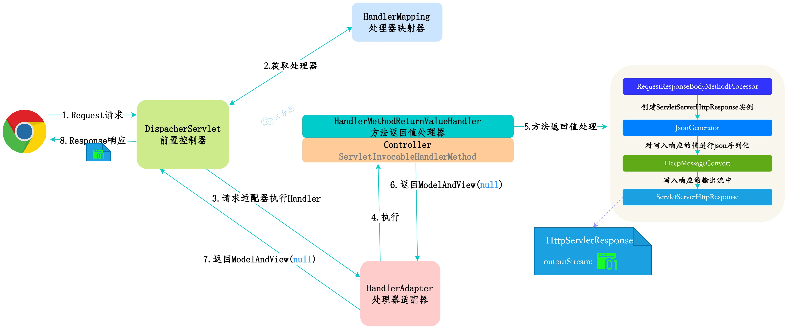
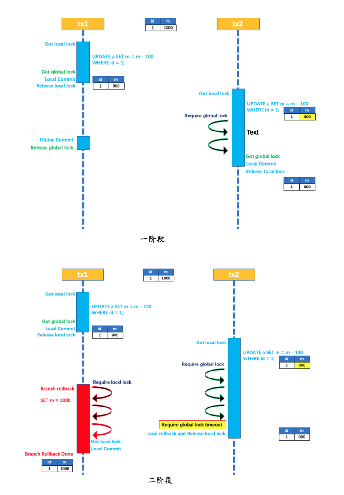
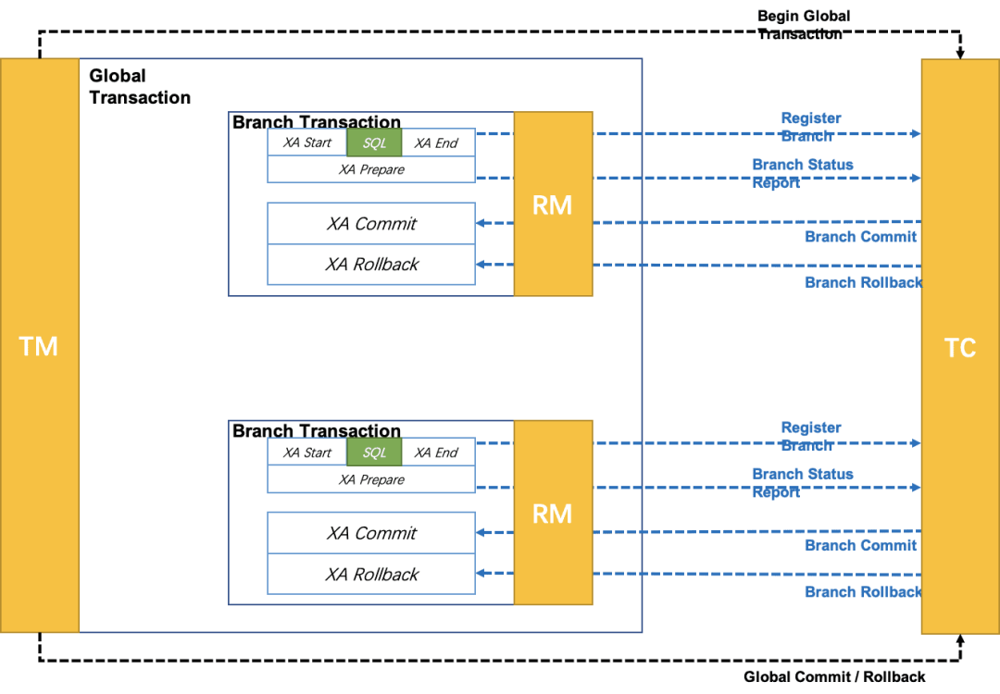

# 网络
## 1. 计算机网络基础
### 1.1 网络分层模型
OSI国际标准化组织将网络分为了七层，每一层都专注于自己的事情，上层只需要调用下层的接口就行了。


OSI七层模型概念清楚，理论完整，但是比较复杂且不实用，另外多个层重复出现。

TCP/IP模型是目前广泛实用的网络模型，可以看做是OSI模型的精简版本。下面是与OSI模型对应关系：


为什么选择使用了TCP/IP模型，而没有选择OSI模型：

1. OSI专家缺乏实际经验，完成OSI标准缺乏商业驱动力
2. OSI标准过于复杂，运行效率很低
3. OSI制定标准的时间过于长，按照OSI标准制定的设备还没有投入市场
4. 层次划分不太合理，有些功能多个层次重复出现

TCP/IP模型各层的功能：

1. 应用层：传输层之上，将传输的报文交给传输层进行传输，提供两个终端设备上的应用程序之间信息交换的服务，定义了消息交换的格式。应用层协议定义了网络通信规则，不同的网络应用有不同的协议。


应用层的常见协议：

1. HTTP（超文本传输协议），是一种传输超文本和多媒体的一种协议，主要是为了Web浏览器和Web服务器之间的通信设计的。HTTP基于客户端-服务器模型，客户端发送HTTP请求，服务端返回HTTP响应。HTTP协议基于TCP协议，发送HTTP请求之前要基于TCP连接也就是要经历三次握手，现在HTTP大部分是1.1，默认是Keep-Alive，可以在多次请求中复用。HTTP是无状态的，无法记录用户的状态，一般通过session记录客户端的状态。
2. WebSocket（全双工通信协议），基于TCP连接的全双工通信协议，客户端和服务器可以同时发送和接收数据。客户端和服务器只需要握手一次，就可以创建持久性的连接，并进行双向通信。

WebSocket的工作过程：

1. 客户端向服务器发送一个 HTTP 请求，请求头中包含 `Upgrade: websocket` 和 `Sec-WebSocket-Key` 等字段，表示要求升级协议为 WebSocket；
2.  服务器收到这个请求后，会进行升级协议的操作，如果支持 WebSocket，它将回复一个 HTTP 101 状态码，响应头中包含 ，`Connection: Upgrade`和 `Sec-WebSocket-Accept: xxx` 等字段、表示成功升级到 WebSocket 协议。
3. 数据以帧（frame）进行传送，每条消息可以划分为多个数据帧，发送端将消息划分为多个帧发送给接收端，接收端收到帧组装成消息。
4. 客户端或者服务器发送一个关闭帧，表示要断开连接。另一方接收后，也返回一个关闭帧，这样就关闭了TCP连接。
5. 建立了WebSocket之后，会通过心跳机制保持稳定性和活跃性


3. SMTP（简单邮件传输协议）。基于TCP协议，是一种发送邮件的协议。

电子邮件的发送过程：比如“durant202401@163.com”向"1977337091@qq.com"发送邮件

1. 通过SMTP协议，将我的邮件发送给163邮箱服务器
2. 163邮箱服务器发现我发送的是qq邮箱，然后使用SMTP将我的邮件转发给qq邮箱服务器
3. qq邮箱服务器通知“1977337091@qq.com”的用户来接收邮件，然后用户通过POP3/IMAP服务将邮件取出。

如何判断邮箱是否存在？

1. 查找邮箱域名对应的SMTP服务器地址
2. 尝试与服务器建立连接
3. 连接成功尝试向需要验证的邮箱发送邮件
4. 根据返回结果判断邮箱地址的真实性


4. POP3/IMAP协议（邮件接收协议）

POP3是比IMAP更新的邮件接收协议。

5. FTP（文件传输协议），基于TCP协议，用于文件传输的协议，可以屏蔽操作系统和文件存储方式。

FTP 是基于客户—服务器（C/S）模型而设计的，在客户端与 FTP 服务器之间建立两个连接。

FTP在两台通信的主机之间使用了两条TCP连接：

+ 控制连接：用于传送控制信息（命令和响应）
+ 数据连接：用于数据传送

 FTP 是一种不安全的协议，因为它在传输过程中不会对数据进行加密。因此，FTP 传输的文件可能会被窃听或篡改。建议在传输敏感数据时使用更安全的协议，如 SFTP（SSH File Transfer Protocol，一种基于 SSH 协议的安全文件传输协议，用于在网络上安全地传输文件）。

6. Telnet远程连接协议，

**Telnet 协议** 基于 TCP 协议，用于通过一个终端登陆到其他服务器。Telnet 协议的最大缺点之一是所有数据（包括用户名和密码）均以明文形式发送，这有潜在的安全风险。这就是为什么如今很少使用 Telnet，而是使用一种称为 SSH 的非常安全的网络传输协议的主要原因。

7. SSH（安全的网络传输协议）

SSH（Secure Shell） 基于 TCP 协议，通过加密和认证机制实现安全的访问和文件传输等业务。

 SSH 的经典用途是登录到远程电脑中执行命令。除此之外，SSH 也支持隧道协议、端口映射和 X11 连接（允许用户在本地运行远程服务器上的图形应用程序）。借助 SFTP（SSH File Transfer Protocol） 或 SCP（Secure Copy Protocol） 协议，SSH 还可以安全传输文件。

SSH 使用客户端-服务器模型，默认端口是 22。SSH 是一个守护进程，负责实时监听客户端请求，并进行处理。大多数现代操作系统都提供了 SSH。

8. RTP实时传输协议

 RTP（Real-time Transport Protocol，实时传输协议）通常基于 UDP 协议，但也支持 TCP 协议。它提供了端到端的实时传输数据的功能，但不包含资源预留存、不保证实时传输质量，这些功能由 WebRTC 实现。

RTP 协议分为两种子协议：

+ **RTP（Real-time Transport Protocol，实时传输协议）**：传输具有实时特性的数据。
+ **RTCP（RTP Control Protocol，RTP 控制协议）**：提供实时传输过程中的统计信息（如网络延迟、丢包率等），WebRTC 正是根据这些信息处理丢包
9. DNS（域名服务器）基于UDP协议，用于解决域名到IP地址的映射问题。


2. 传输层：负责两台终端设备进程之间的通信提供通用的数据传输服务。应用进程利该服务传送应用报文。

传输层的常用协议：

+ TCP（传输控制协议），提供面向连接的，可靠的数据传输
+ UDP（用户数据协议），提供无连接的，尽最大努力的数据传输（不保证可靠性）


3. 网络层：负责为分组交换网的不同主机提供通信服务。将传送层的报文段或者用户数据报封装成分组和包传送出去，因为网络层使用IP协议，所以分组也叫IP数据报，简称数据报。

网络层还需要选择合适的路由，通过网络层中的路由器找到目的主机传送数据报。

网络层的常用协议：

+ IP协议（网际协议）：主要作用定义数据报的格式，对数据报进行路由和寻址，以便可以跨网络传播并达到正确的目的地。目前的IP协议分为IPV4和IPV6两种。
+ ARP（地址解析协议）：解决网络层地址和链路层地址之间转换的问题。IP数据报在物理上传输，需要知道下一个物理地在哪儿，IP地址属于逻辑地址，MAC地址才是物理地址，所以需要使用ARP进行地址解析。
+ ICMP（互联网控制报文协议）：传输网络状态和错误消息的协议，用于网络诊断和故障排除。PING命令就是使用的这种协议。
+ NAT（网络地址转换协议）：应用于内部网到外部网的地址转换。
+ OSPF（开放式最短路径优先）：一种内部网关协议，考虑链路的带宽、延迟等因素选择最短路径。
+ RIP（路由信息协议）：一种内部网关协议，根据固定的跳数作为度量标准，选择跳数最少的路径作为最短路径。
+ BGP（边界网关协议）：用来在路由选择域之间交换网络层可达性信息的路由选择协议。


4. 网络接口层
+ 数据链路层(data link layer)通常简称为链路层（ 两台主机之间的数据传输，总是在一段一段的链路上传送的）。**数据链路层的作用是将网络层交下来的 IP 数据报组装成帧，在两个相邻节点间的链路上传送帧。每一帧包括数据和必要的控制信息（如同步信息，地址信息，差错控制等）。**
+ **物理层的作用是实现相邻计算机节点之间比特流的透明传送，尽可能屏蔽掉具体传输介质和物理设备的差异**


**网络分层的原因？**

复杂的系统需要分层，因为每一层都需要专注于一类事情。网络分层的原因也是一样，每一层只专注于做一类事情。

1. 各层之间相互独立，上层不需要关注下层怎么实现，只需要知道下层如何调用就行了
2. 每一层使用最适合的技术实现，确保你提供的功能以及暴露的接口规则没有改变。
3. 分层可以将复杂的问题分解成一个个清晰的小问题来处理和解决。

## 2. HTTP
### 2.1. 从输入URL到页面展示发生了什么？


上图有一个错误需要注意：是 OSPF 不是 OPSF。 

总体来说分为以下几个步骤:

1. 在浏览器中输入指定网页的 URL。
2. 浏览器通过 DNS 协议，获取域名对应的 IP 地址。
3. 浏览器根据 IP 地址和端口号，向目标服务器发起一个 TCP 连接请求。
4. 浏览器在 TCP 连接上，向服务器发送一个 HTTP 请求报文，请求获取网页的内容。
5. 服务器收到 HTTP 请求报文后，处理请求，并返回 HTTP 响应报文给浏览器。
6. 浏览器收到 HTTP 响应报文后，解析响应体中的 HTML 代码，渲染网页的结构和样式，同时根据 HTML 中的其他资源的 URL（如图片、CSS、JS 等），再次发起 HTTP 请求，获取这些资源的内容，直到网页完全加载显示。
7. 浏览器在不需要和服务器通信时，可以主动关闭 TCP 连接，或者等待服务器的关闭请求。

**URL：**

统一资源定位器。网络上的所有资源都靠 URL 来定位，每一个文件就对应着一个 URL，就像是路径地址。

**URL的组织结构：**


1. 协议：URL 的前缀通常表示了该网址采用了何种应用层协议，通常有两种——HTTP 和 HTTPS。当然也有一些不太常见的前缀头，比如文件传输时用到的`ftp:`
2. 域名：域名便是访问网址的通用名，这里也有可能是网址的 IP 地址
3. 端口：访问网址的端口
4. 资源路径：域名（端口）后紧跟的就是资源路径，从第一个`/`开始，表示从服务器上根目录开始进行索引到的文件路径
5. 参数：参数是浏览器在向服务器提交请求时，在 URL 中附带的参数。
6. 锚点： 锚点顾名思义，是在要访问的页面上的一个锚。要访问的页面大部分都多于一页，如果指定了锚点，那么在客户端显示该网页是就会定位到锚点处，相当于一个小书签。值得一提的是，在 URL 中，锚点以`#`开头，并且**不会**作为请求的一部分发送给服务端。

**DNS：**

 键入了 URL 之后，第一个重头戏登场——DNS 服务器解析。DNS（Domain Name System）域名系统，要解决的是 域名和 IP 地址的映射问题 。毕竟，域名只是一个网址便于记住的名字，而网址真正存在的地址其实是 IP 地址。

在实际使用中，本地的浏览器维护一个host列表，会优先访问host列表获取对应域名的ip地址，如果没有就是用DNS。

目前 DNS 的设计采用的是分布式、层次数据库结构，DNS 是应用层协议，基于 UDP 协议之上，端口为 53 。

DNS服务器自底向上分为了几个层级：

+ 根 DNS 服务器。根 DNS 服务器提供 TLD 服务器的 IP 地址。目前世界上只有 13 组根服务器，我国境内目前仍没有根服务器。
+ 顶级域 DNS 服务器（TLD 服务器）。顶级域是指域名的后缀，如`com`、`org`、`net`和`edu`等。国家也有自己的顶级域，如`uk`、`fr`和`ca`。TLD 服务器提供了权威 DNS 服务器的 IP 地址。
+ 权威 DNS 服务器。在因特网上具有公共可访问主机的每个组织机构必须提供公共可访问的 DNS 记录
+  本地 DNS 服务器。每个 ISP（互联网服务提供商）都有一个自己的本地 DNS 服务器。当主机发出 DNS 请求时，该请求被发往本地 DNS 服务器，它起着代理的作用，并将该请求转发到 DNS 层次结构中。

**DNS的工作流程：**

DNS的查询解析过程分为迭代和递归。


现在，主机`cis.poly.edu`想知道`gaia.cs.umass.edu`的 IP 地址。假设主机`cis.poly.edu`的本地 DNS 服务器为`dns.poly.edu`，并且`gaia.cs.umass.edu`的权威 DNS 服务器为`dns.cs.umass.edu`。

1. 首先，主机`cis.poly.edu`向本地 DNS 服务器`dns.poly.edu`发送一个 DNS 请求，该查询报文包含被转换的域名`gaia.cs.umass.edu`。
2. 本地 DNS 服务器`dns.poly.edu`检查本机缓存，发现并无记录，也不知道`gaia.cs.umass.edu`的 IP 地址该在何处，不得不向根服务器发送请求。
3. 根服务器注意到请求报文中含有`edu`顶级域，因此告诉本地 DNS，你可以向`edu`的 TLD DNS 发送请求，因为目标域名的 IP 地址很可能在那里。
4. 本地 DNS 获取到了`edu`的 TLD DNS 服务器地址，向其发送请求，询问`gaia.cs.umass.edu`的 IP 地址。
5. `edu`的 TLD DNS 服务器仍不清楚请求域名的 IP 地址，但是它注意到该域名有`umass.edu`前缀，因此返回告知本地 DNS，`umass.edu`的权威服务器可能记录了目标域名的 IP 地址。
6. 这一次，本地 DNS 将请求发送给权威 DNS 服务器`dns.cs.umass.edu`。
7. 终于，由于`gaia.cs.umass.edu`向权威 DNS 服务器备案过，在这里有它的 IP 地址记录，权威 DNS 成功地将 IP 地址返回给本地 DNS。
8. 最后，本地 DNS 获取到了目标域名的 IP 地址，将其返回给请求主机。

递归的方式和迭代差不多：


 DNS 的缓存位于本地 DNS 服务器。由于全世界的根服务器甚少，只有 600 多台，分为 13 组，且顶级域的数量也在一个可数的范围内，因此本地 DNS 通常已经缓存了很多 TLD DNS 服务器，所以在实际查找过程中，无需访问根服务器。根服务器通常是被跳过的，不请求的。这样可以提高 DNS 查询的效率和速度，减少对根服务器和 TLD 服务器的负担。

**DNS报文格式：**


+ 标识符。16 比特，用于标识该查询。这个标识符会被复制到对查询的回答报文中，以便让客户用它来匹配发送的请求和接收到的回答。
+ 标志。1 比特的”查询/回答“标识位，`0`表示查询报文，`1`表示回答报文；1 比特的”权威的“标志位（当某 DNS 服务器是所请求名字的权威 DNS 服务器时，且是回答报文，使用”权威的“标志）；1 比特的”希望递归“标志位，显式地要求执行递归查询；1 比特的”递归可用“标志位，用于回答报文中，表示 DNS 服务器支持递归查询。
+ 问题数、回答 RR 数、权威 RR 数、附加 RR 数。分别指示了后面 4 类数据区域出现的数量。
+ 问题区域。包含正在被查询的主机名字，以及正被询问的问题类型。
+ 回答区域。包含了对最初请求的名字的资源记录。**在回答报文的回答区域中可以包含多条 RR，因此一个主机名能够有多个 IP 地址。**
+ 权威区域。包含了其他权威服务器的记录。
+ 附加区域。包含了其他有帮助的记录。

**DNS记录：**

 DNS 服务器在响应查询时，需要查询自己的数据库，数据库中的条目被称为 **资源记录(Resource Record，RR)** 。RR 提供了主机名到 IP 地址的映射。RR 是一个包含了`Name`, `Value`, `Type`, `TTL`四个字段的四元组。


通过DNS拿到域名对应的IP地址之后，浏览器向目标的IP地址发送HTTP报文，请求报文可能是HTTP协议或者HTTPS协议。

**HTTP协议的通信过程：**

HTTP 是应用层协议，它以 TCP（传输层）作为底层协议，默认端口为 80. 通信过程主要如下：

1. 服务器在 80 端口等待客户的请求。
2. 浏览器发起到服务器的 TCP 连接（创建套接字 Socket）。
3. 服务器接收来自浏览器的 TCP 连接。
4. 浏览器（HTTP 客户端）与 Web 服务器（HTTP 服务器）交换 HTTP 消息。
5. 关闭 TCP 连接。

HTTPS 协议（Hyper Text Transfer Protocol Secure），是 HTTP 的加强安全版本。HTTPS 是基于 HTTP 的，也是用 TCP 作为底层协议，并额外使用 SSL/TLS 协议用作加密和安全认证。默认端口号是 443.

HTTPS 协议中，SSL 通道通常使用基于密钥的加密算法，密钥长度通常是 40 比特或 128 比特。

**SSL/TLS工作原理：**

SSL/TLS 的核心要素是非对称加密。非对称加密采用两个密钥——一个公钥，一个私钥。在通信时，私钥仅由解密者保存，公钥由任何一个想与解密者通信的发送者（加密者）所知。

 使用 SSL/TLS 进行通信的双方需要使用非对称加密方案来通信，但是非对称加密设计了较为复杂的数学算法，在实际通信过程中，计算的代价较高，效率太低，因此，SSL/TLS 实际对消息的加密使用的是对称加密。


对称加密的密钥生成代价比公私钥对的生成代价低得多，那么有的人会问了，为什么 SSL/TLS 还需要使用非对称加密呢？

 	因为对称加密的保密性完全依赖于密钥的保密性。在双方通信之前，需要商量一个用于对称加密的密钥。我们知道网络通信的信道是不安全的，传输报文对任何人是可见的，密钥的交换肯定不能直接在网络信道中传输。因此，使用非对称加密，对对称加密的密钥进行加密，保护该密钥不在网络信道中被窃听。这样，通信双方只需要一次非对称加密，交换对称加密的密钥，在之后的信息通信中，使用绝对安全的密钥，对信息进行对称加密，即可保证传输消息的保密性。

公钥传输会存在被窃取的风险，所以需要证书颁发机构CA给各个服务器颁发证书，证书存放在服务器上，并附有CA的数字签名。


 当客户端（浏览器）向服务器发送 HTTPS 请求时，一定要先获取目标服务器的证书，并根据证书上的信息，检验证书的合法性。一旦客户端检测到证书非法，就会发生错误。客户端获取了服务器的证书后，由于证书的信任性是由第三方信赖机构认证的，而证书上又包含着服务器的公钥信息，客户端就可以放心的信任证书上的公钥就是目标服务器的公钥。

数字签名，是 CA 在给服务器颁发证书时，使用散列+加密的组合技术，在证书上盖个章，以此来提供验伪的功能。

总结来说，带有证书的公钥传输机制如下：

1. 设有服务器 S，客户端 C，和第三方信赖机构 CA。
2. S 信任 CA，CA 是知道 S 公钥的，CA 向 S 颁发证书。并附上 CA 私钥对消息摘要的加密签名。
3. S 获得 CA 颁发的证书，将该证书传递给 C。
4. C 获得 S 的证书，信任 CA 并知晓 CA 公钥，使用 CA 公钥对 S 证书上的签名解密，同时对消息进行散列处理，得到摘要。比较摘要，验证 S 证书的真实性。
5. 如果 C 验证 S 证书是真实的，则信任 S 的公钥（在 S 证书中）。

**HTTP1.0和HTTP1.1比较：**

+ 响应码：HTTP/1.0 仅定义了 16 种状态码。HTTP/1.1 中新加入了大量的状态码
+ 缓存处理：缓存技术通过避免用户与源服务器的频繁交互，节约了大量的网络带宽，降低了用户接收信息的延迟

HTTP/1.0 提供的缓存机制非常简单。服务器端使用`Expires`标签来标志（时间）一个响应体，在`Expires`标志时间内的请求，都会获得该响应体缓存。服务器端在初次返回给客户端的响应体中，有一个`Last-Modified`标签，该标签标记了被请求资源在服务器端的最后一次修改。在请求头中，使用`If-Modified-Since`标签，该标签标志一个时间，意为客户端向服务器进行问询：“该时间之后，我要请求的资源是否有被修改过？”通常情况下，请求头中的`If-Modified-Since`的值即为上一次获得该资源时，响应体中的`Last-Modified`的值。

如果服务器接收到了请求头，并判断`If-Modified-Since`时间后，资源确实没有修改过，则返回给客户端一个`304 not modified`响应头，表示”缓冲可用，你从浏览器里拿吧！”。

如果服务器判断`If-Modified-Since`时间后，资源被修改过，则返回给客户端一个`200 OK`的响应体，并附带全新的资源内容，表示”你要的我已经改过的，给你一份新的”。

 HTTP/1.1 的缓存机制在 HTTP/1.0 的基础上，大大增加了灵活性和扩展性。基本工作原理和 HTTP/1.0 保持不变，而是增加了更多细致的特性。其中，请求头中最常见的特性就是`Cache-Control`

+ 连接方式：

HTTP/1.0 默认使用短连接 ，也就是说，客户端和服务器每进行一次 HTTP 操作，就建立一次连接，任务结束就中断连接。当客户端浏览器访问的某个 HTML 或其他类型的 Web 页中包含有其他的 Web 资源（如 JavaScript 文件、图像文件、CSS 文件等），每遇到这样一个 Web 资源，浏览器就会重新建立一个 TCP 连接，这样就会导致有大量的“握手报文”和“挥手报文”占用了带宽。

HTTP/1.1 优化为默认长连接模式 **。** 采用长连接模式的请求报文会通知服务端：“我向你请求连接，并且连接成功建立后，请不要关闭”。因此，该 TCP 连接将持续打开，为后续的客户端-服务端的数据交互服务。也就是说在使用长连接的情况下，当一个网页打开完成后，客户端和服务器之间用于传输 HTTP 数据的 TCP 连接不会关闭

HTTP 协议的长连接和短连接，实质上是 TCP 协议的长连接和短连接。

+ Host头处理

 域名系统（DNS）允许多个主机名绑定到同一个 IP 地址上，但是 HTTP/1.0 并没有考虑这个问题，假设我们有一个资源 URL 是[http://example1.org/home.html，HTTP/1.0open in new window](http://example1.org/home.html%EF%BC%8CHTTP/1.0) 的请求报文中，将会请求的是`GET /home.html HTTP/1.0`.也就是不会加入主机名。这样的报文送到服务器端，服务器是理解不了客户端想请求的真正网址。因此请求头中加入了Host字段。

+ 带宽优化

HTTP/1.1 引入了范围请求（range request）机制，以避免带宽的浪费。当客户端想请求一个文件的一部分，或者需要继续下载一个已经下载了部分但被终止的文件，HTTP/1.1 可以在请求中加入`Range`头部，以请求（并只能请求字节型数据）数据的一部分。服务器端可以忽略`Range`头部，也可以返回若干`Range`响应。

`206 (Partial Content)` 状态码的主要作用是确保客户端和代理服务器能正确识别部分内容响应，避免将其误认为完整资源并错误地缓存。这对于正确处理范围请求和缓存管理非常重要。


**HTTP常见的状态码总结：**


1. 1XX Informational（信息性状态码）大概率不会碰到
2. 2XX Success（成功状态码）
    1. 200 OK，请求被成功处理
    2. 201 Created，请求被成功处理，并且在服务端创建了一个新的资源
    3. 202 Accepted，服务端接收请求，但是还没有处理
    4. 204 No Content，服务端成功处理请求，但是没有返回任何内容
3. 3XX Redirection（重定向状态码）
    1. 301 Moved Permanently 资源能永久重定向了。可能网站的网址更换了
    2. 302 Found 资源被临时重定向了。网站的某些资源被暂时转移到另一个网址了
4. 4XX Client Error（客户端错误状态码）
    1. 400 Bad Request，发送的请求存在问题，可能是参数不合法，方法错误等。
    2. 401 Unauthorized，未认证的请求，需要认证
    3. 403 Forbidden，直接拒绝非法请求
    4. 404 Not Found，没有找到资源
    5. 409 ConFlict，请求的资源与服务器当前状态存在冲突，无法处理
5. 5XX Server Error（服务端错误码）
    1. 501 Internet Server Error：服务端出现Bug
    2. 502 Bad Gateway：网关将请求转发到服务端，服务端返回错误响应


传输层：HTTP协议是基于TCP协议的，应用层将数据封装好以后交给传输层传输。TCP协议保证了数据传输的可靠性，是数据报传输的主力协议。

为了将数据进行可靠传输，建立连接，TCP采用了三次握手：  


+ **一次握手**:客户端发送带有 SYN（SEQ=x） 标志的数据包 -> 服务端，然后客户端进入 **SYN_SEND** 状态，等待服务端的确认；
+ **二次握手**:服务端发送带有 SYN+ACK(SEQ=y,ACK=x+1) 标志的数据包 –> 客户端,然后服务端进入 **SYN_RECV** 状态；
+ **三次握手**:客户端发送带有 ACK(ACK=y+1) 标志的数据包 –> 服务端，然后客户端和服务端都进入**ESTABLISHED** 状态，完成 TCP 三次握手。

TCP三次握手的过程中，Linux内核会维护两个队列来管理连接请求：

+ 半连接队列（SYN Queue）：服务端收到客户端的SYN请求时，会将半连接请求放入半连接队列中
+ 全连接队列（Accept Queue）：服务端接收到ACK之后，将完成握手的请求从半连接移动到全连接队列中，如果没有收到ACK，会进行重传，如果重传次数过多，会从半连接队列移除。

**为什么需要三次握手：**

三次握手的目的是建立可靠的通信信道，说到通讯，简单来说就是数据的发送与接收，而三次握手最主要的目的就是双方确认自己与对方的发送与接收是正常的。

1. 第一次握手：Client 什么都不能确认；Server 确认了对方发送正常，自己接收正常
2. 第二次握手：Client 确认了：自己发送、接收正常，对方发送、接收正常；Server 确认了：对方发送正常，自己接收正常
3. 第三次握手：Client 确认了：自己发送、接收正常，对方发送、接收正常；Server 确认了：自己发送、接收正常，对方发送、接收正常

三次握手就能确认双方收发功能都正常，缺一不可。

二次握手回传Syn是为了让客户端知道自己能够正确的接收你发送的信息。

第三次握手是可以携带数据的，如果ack丢失，在后面的数据传输过程中数据包含了ack，那么也认为建立了可靠的通信信道。

**断开连接-TCP四次握手：**


断开一个 TCP 连接则需要“四次挥手”，缺一不可：

1. 第一次挥手：客户端发送一个 FIN（SEQ=x） 标志的数据包->服务端，用来关闭客户端到服务端的数据传送。然后客户端进入 FIN-WAIT-1 状态。
2. 第二次挥手：服务端收到这个 FIN（SEQ=X） 标志的数据包，它发送一个 ACK （ACK=x+1）标志的数据包->客户端 。然后服务端进入 CLOSE-WAIT 状态，客户端进入 FIN-WAIT-2 状态。
3. 第三次挥手：服务端发送一个 FIN (SEQ=y)标志的数据包->客户端，请求关闭连接，然后服务端进入 LAST-ACK 状态。
4. 第四次挥手：客户端发送 ACK (ACK=y+1)标志的数据包->服务端，然后客户端进入TIME-WAIT状态，服务端在收到 ACK (ACK=y+1)标志的数据包后进入 CLOSE 状态。此时如果客户端等待 2MSL 后依然没有收到回复，就证明服务端已正常关闭，随后客户端也可以关闭连接了。

只要四次握手没有结束，那么就可以继续传输数据。

为什么要四次握手？

TCP是全双工通信，双向传输数据，任何一方都可以在数据传送结束后发出连接释放的通知，待对方确认后进入半关闭状态。当另一方再没有数据再发送的时候，则发出连接释放通知，对方确认后就完全关闭TCP连接。

为什么不把ACK和FIN一起发送呢？

服务端接收到关闭连接的通知后，可能服务端还没有数据发完，所以先发送一个ACK给客户端表示自己受到了关闭连接的通知，等到没有消息再发送了，就发送FIN给客户端，断开连接。

如果第二次挥手，客户端没有收到ACK呢？

那么客户端会重新发送FIN，重新握手。

第四次握手为什么需要等待2*MSL（报文段最大寿命）时间后才进入CLOSED状态？

 第四次挥手时，客户端发送给服务端的 ACK 有可能丢失，如果服务端因为某些原因而没有收到 ACK 的话，服务端就会重发 FIN，如果客户端在 2*MSL 的时间内收到了 FIN，就会重新发送 ACK 并再次等待 2MSL，防止 Server 没有收到 ACK 而不断重发 FIN。如果2*MSL之后还没有收到FIN，那么就断开连接。

**TCP如何保证传输的可靠性？**

+ 基于数据块的传输，应用数据被分割成数据块，在传输给网络层，数据块也叫报文段或者段。
+ 对失序数据包进行重排和去重，每个数据包都有一个序列号，保证数据报的正确
+ 校验和，保持它首部和数据的校验和正确，如果错误，丢弃这个数据包。
+ 重传机制，数据包延迟或者丢失的情况下，重新发送数据包
+ 流量控制，TCP接收端只允许发送端发送接收端缓冲区能够接收的数据
+ 拥塞控制，当网络拥塞时，减少数据的发送。

TCP如何实现流量控制？

TCP利用滑动窗口控制流量控制，流量控制是为了控制发送的速率，让接收方来得及接收。

TCP如何实现拥塞控制？

如果某个资源的需求超过了该资源提供的可用部分，网络性能就会变坏，这种情况就叫拥塞。拥塞控制就是为了防止过多的数据注入到网络中，这样就可以使网络中的路由器或链路不致过载。TCP发送方维护一个拥塞窗口的状态变量，拒绝于网络的拥塞程度。


网络层：网络层的核心功能就是路由和转发。

+ 转发：将分组从路由器的输入端口转移到合适的输出端口
+ 路由：确定分组从源到目的经过的路径


### 2.2. HTTP的状态码
上面详述了


### 2.3. HTTP和HTTPS的区别
+ 端口号：一个80，一个443
+ 前缀不同：http://、https://
+ 安全性和资源消耗：http基于Tcp，传输内容都是明文，无法验证对方身法。https基于SSL/TSL，对称加密，再配合CA进行非对称加密，安全性高。
+ SEO（搜索引擎优化）：SEO会优先显示HTTPS的网站

详述见上面

### 2.4. HTTP1.0 和 HTTP1.1的区别
详述看上面


### 2.5. HTTP是无状态的，如何保证用户状态？
HTTP使用Session记录用户的状态，服务端保存session的方式有很多，最常用的是通过内存和数据库。Session保存在服务器端，客户端使用Cookie中附加一个Session Id来跟踪。

如果Cookie被禁用了，那么可以将Session id附加到URL的后面


### 2.6. URL和URI的区别？
+ URI(Uniform Resource Identifier) 是统一资源标志符，可以唯一标识一个资源。
+ URL(Uniform Resource Locator) 是统一资源定位符，可以提供该资源的路径。

URL是具体的URI地址，包含了URI。


### 2.7. GET和POST的区别？
+ 语义：GET是获取或查询资源，POST是创建或修改资源
+ 幂等：GET的多个请求都是同一个结果，是幂等的，但是POST不是
+ 格式：GET请求放到URL中，POST请求放在Body中，有多种格式。
+ 缓存：由于GET是幂等的，所以结果可以被缓存，POST不会
+ 安全性：GET请求相比于POST请求更容易泄露敏感数据


## 3. WebSocket
### 3.1 什么是WebSocket？
基于TCP的全双工的通信协议，客户端和服务端可以同时的发送和接收消息。只需要一次握手，就可以创建持久性的连接。


### 3.2 WebSocket 和 HTTP的区别？
+ WebSocket是双向通信，HTTP是单向通信，HTTP是由客户端主动发起，服务端不能主动的发起请求
+ WebSocket使用ws://或者wss://（使用SSL/TLS加密），HTTP使用http://或者https://前缀
+ WebSocket支持扩展，可以自定义扩展协议
+ WebSocket通信数据格式携带的数据包头相对较小，网络开销小，HTTP每次需要携带完整的头部，网络开销大


### 3.3 WebSocket的工作过程？
1. 客户端发送一个HTTP请求，请求头中包含Upgrade:websocket和Sec-WebSocket-key等字段，表示要升级协议为WebSocket
2. 收到请求，返回一个状态码为101的响应，响应头中包含Connection:Upgrade和Sec-WebSocket-Accept:xxx等字段，表示成功升级
3. 客户端和服务器建立双向数据传输，数据以帧的形式进行传送
4. 客户端或者服务器发送一个关闭帧，表示关闭连接，另一方接收了回复一个关闭帧，确认关闭


### 3.4 SSE和WebSocket 有什么区别？
SSE可以建立服务器到浏览器之间的通信

+ SSE基于HTTP协议，不需要特殊的协议和特殊的服务器来实现，WebSocke需要单独的服务器来处理
+ SSE单向通信，只能服务端向浏览器推送消息，WebSocket全双工通信
+ SSE实现简单成本低，WebSocket传输数据需要做二次解析
+ SSE支持断线重连，WebSocket需要自己实现
+ SSE只能传送文本数据，二进制需要进行编码，WebSocket默认支持二进制传送


## 4. PING
### 4.1 PING命令的作用
PING 命令是一种常用的网络诊断工具，经常用来测试网络中主机之间的连通性和网络延迟

### 4.2 PING命令的工作原理
PING命令基于ICMP（互联网控制报文协议）实现的，通过在互联网发送和接收ICMP报文来检测。

ICMP包含了类型字段，标识ICMP报文：

+ 查询报文类型：向目标主机发送请求并期望得到响应
+ 差错报文类型：向源主机发送错误信息，报告错误情况


## 5. DNS
### 5.1 DNS的作用
解决域名到IP地址之间的映射。端口号是53。


### 5.2 DNS服务器的类型
详述见上面


### 5.3 DNS的工作流程
详述见上面


### 5.4 DNS挟持
 DNS 劫持是一种网络攻击，它通过修改 DNS 服务器的解析结果，使用户访问的域名指向错误的 IP 地址，从而导致用户无法访问正常的网站，或者被引导到恶意的网站。DNS 劫持有时也被称为 DNS 重定向、DNS 欺骗或 DNS 污染。


## 6. TCP/UDP
### 6.1 TCP和UDP的区别
+ 面向连接：TCP面向连接，UDP不面向连接
+ 可靠传输：TCP通过三次握手建立可靠地传输通道，UDP尽可能的发送报文，不保证数据不丢失
+ 是否有状态：TCP发送消息过后需要记录消息的各种状态信息，UDP不会管
+ 传输效率：因为TCP为了可靠性需要很多机制平衡，所以效率不如UDP
+ 传输形式：TCP面向字节流，UDP面向报文
+ 首部开销：TCP首部开销在20~60字节之间，UDP在8字节
+ 是否提供广播或多播服务：TCP只支持点对点通信，UDP支持多种形式。

......

### 6.2 TCP、UDP的应用场景？
+ UDP一般适用在准确性不高的场景，一般用于实时通信，比如视频、直播等，因为缺了一两帧，其实也是看不出来的
+ TCP适用于准确性要求高的场景，比如文件传输、远程登录等等

### 6.3 HTTP基于TCP还是UDP？
HTTP/3.0 之前是基于 TCP 协议的，而 HTTP/3.0 将弃用 TCP，改用 基于 UDP 的 QUIC 协议 。

### 6.4 使用TCP、UDP的协议有哪些？
运行在TCP协议之上的协议有：HTTP协议（HTTP3.0之前）、HTTPS协议、FTP协议、SMAP协议、POP3/IMAP协议、Telnet协议、SSH协议。

运行在UDP协议之上的协议有：HTTP协议（HTTP3.0）、DHCP协议、DNS协议


## 7. IP
### 7.1 IP协议的作用？
IP协议（网际协议）是TCP/IP协议中最重要的协议之一，主要作用是定义数据包的格式，对数据包进行路由和寻址，以便跨网络传输到达正确的目的地。

IP协议目前分为IPV4和IPV6两种。

### 7.2 什么是IP地址？IP寻址如何工作？
每个连入互联网的设备或者域都有独立的IP地址作为唯一的标识符，每个IP地址都是一个字符序列。

网络设备发送IP数据包，数据包包括源目标地址和目的地址。网络设备根据目的IP地址判断数据包的目的地址。

 这种基于 IP 地址的寻址方式是互联网通信的基础，它允许数据包在不同的网络之间传递，从而实现了全球范围内的网络互联互通。IP 地址的唯一性和全局性保证了网络中的每个设备都可以通过其独特的 IP 地址进行标识和寻址。

### 7.3 什么是IP地址过滤？
IP地址过滤就是限制某个IP地址或者某个范围的IP进行访问。

### 7.4 IPV4和IPV6的区别？
最大的区别：IPV4使用32位表示，IPV6使用128位表示

### 7.5 如何获取真实的IP地址？
获取客户端真实IP的方法很多，分为应用层、传输层、网络层。

应用层方法：

 	通过 [X-Forwarded-Foropen in new window](https://en.wikipedia.org/wiki/X-Forwarded-For) 请求头获取，简单方便。不过，这种方法无法保证获取到的是真实 IP，这是因为 X-Forwarded-For 字段可能会被伪造。如果经过多个代理服务器，X-Forwarded-For 字段可能会有多个值（附带了整个请求链中的所有代理服务器 IP 地址）。并且，这种方法只适用于 HTTP 和 SMTP 协议。

传输层方法：

利用 TCP Options 字段承载真实源 IP 信息。这种方法适用于任何基于 TCP 的协议，不受应用层的限制。不过，这并非是 TCP 标准所支持的，所以需要通信双方都进行改造。

网络层方法：

隧道 +DSR 模式。这种方法可以适用于任何协议，就是实施起来会比较麻烦，也存在一定限制，实际应用中一般不会使用这种方法。

### 7.6 NAT的作用是什么？
**NAT（Network Address Translation，网络地址转换）** 主要用于在不同网络之间转换 IP 地址。它允许将私有 IP 地址（如在局域网中使用的 IP 地址）映射为公有 IP 地址（在互联网中使用的 IP 地址）或者反向映射，从而实现局域网内的多个设备通过单一公有 IP 地址访问互联网。

 具体地说，在一个小的子网（局域网，Local Area Network，LAN）内，各主机使用的是同一个 LAN 下的 IP 地址，但在该 LAN 以外，在广域网（Wide Area Network，WAN）中，需要一个统一的 IP 地址来标识该 LAN 在整个 Internet 上的位置。


如果有以下请求发生：

+  主机`10.0.0.1`向 IP 地址为`128.119.40.186`的 Web 服务器（端口 80）发送了 HTTP 请求（如请求页面）。此时，主机`10.0.0.1`将随机指派一个端口，如`3345`，作为本次请求的源端口号，将该请求发送到路由器中（目的地址将是`128.119.40.186`，但会先到达`10.0.0.4`）
+ `10.0.0.4`即路由器的 LAN 接口收到`10.0.0.1`的请求。路由器将为该请求指派一个新的源端口号，如`5001`，并将请求报文发送给 WAN 接口`138.76.29.7`。同时，在 NAT 转换表中记录一条转换记录**138.76.29.7:5001——10.0.0.1:3345**。
+ 请求报文到达 WAN 接口，继续向目的主机`128.119.40.186`发送

总结NAT的特点：

1. NAT 协议通过对 WAN 屏蔽 LAN，有效地缓解了 IPv4 地址分配压力。
2. LAN主机IP地址的变更，不需要告诉WAN
3. WAN的ISP变更接口地址时，无需通告LAN内主机
4. LAN主机对WAN不可见，不可直接寻址，可以保证一定程度的安全性


## 8. ARP
### 8.1 什么是MAC地址
 MAC 地址的全称是 **媒体访问控制地址（Media Access Control Address）**。如果说，互联网中每一个资源都由 IP 地址唯一标识（IP 协议内容），那么一切网络设备都由 MAC 地址唯一标识。

MAD地址48位，一个网络设备中的网卡MAC地址是永久的。

### 8.2 ARP协议解决了什么问题？
ARP协议也叫地址解析协议，解决的问题时IP地址转换为MAC地址，因为IP数据报在物理上传输，需要知道下一跳的地址，也就是下一个目标的物理地址。

### 8.3 ARP协议的工作原理？
 在一个局域网内，每个网络设备都自己维护了一个 ARP 表，ARP 表记录了某些其他网络设备的 IP 地址-MAC 地址映射关系，该映射关系以 `<IP, MAC, TTL>` 三元组的形式存储。其中，TTL 为该映射关系的生存周期，典型值为 20 分钟，超过该时间，该条目将被丢弃。

同一个局域网下的MAC寻址：

发送广播获取IP-MAC列表

不同局域网下的MAC寻址：

广播问询，单播响应


# JavaSE
### Java概念
#### Java语言有哪些特点？
1. 面向对象编程，万物皆对象
2. 平台无关性，一次编译，可以在多个平台执行，(支持无关性是因为它的字节码可以在任何平台上面执行，只要这个平台安装了虚拟机)
3. 支持多线程，天然的支持多线程开发
4. JIT编程，即时编译，JIT将常用的代码，不改动的代码编译成字节码，下次编译直接使用字节码，不需要重新编译

#### JVM、JRE、JDK区别
JVM是java虚拟机，包含栈、堆、常量池等。

JRE包含JVM和核心的类库，有了JRE就可以运行任何的java程序

JDK包含JRE和Java开发工具，可以执行、开发任何的java程序

#### 什么是跨平台性？
Java语言支持跨平台性，因为编译后生成的字节码文件可以运行在任何的操作系统上面，JVM会屏蔽掉平台的差异。

#### 什么是字节码？
字节码是Java代码编译后生成的文件，只需要安装虚拟机，就可以运行字节码文件，实现平台无关性。

#### 编译和解释并存？
Java语言的编译是将Java代码编译成字节码文件，得到字节码文件后，JVM会解释字节码文件生成机器码，所以编译和解释并存。

### 基础语法
#### 什么是自动类型转换？什么是强制类型转换？
将一个范围小的数据类型赋给一个范围大的数据类型的时候会自动进行类型转换，例如：long a = 1;这里1是int类型，a是long类型，1会自动转换为long类型

相反则要进行强制类型转换，例如：int a = (int) 1L;

#### 什么是自动拆箱、装箱？
装箱是将基本数据类型转为对应的包装类型。比如：Integer a = 1;   1的数据类型是int，直接被包装为了Integer包装类，底层调用的是Integer.valueOf(1)方法转换的，Integer的自动装箱可能还会走缓存。

拆箱是将包装类型转为基本类型。int b = a.intValue(); 

### 面向对象
#### 面向对象和面向过程的区别？
面向对象是将解决问题的方式变为调用一个个对象的方法。目的是写出通用的代码，屏蔽差异性

面向过程是通过一个个的方法来解决问题。

#### 面向对象的特性
封装：将对象的属性和操作属性的行为封装在一起，属性只能通过公开的行为进行访问。

继承：通过继承父类的方式获取父类的属性和行为，继承可以提高代码的重用性。

多态：父类的引用指向子类，可以有多种形态，运行时根据对象类型不同做出不同的响应。提高代码的灵活性和可扩展性。

#### 一文搞懂什么是重载和重写？
重载：重载发生在一个类的内部，在同一个类中的方法有多个实现就叫重载，这个方法是什么样子的呢？满足这几个要求：**只要求方法名必须是相同的，对于参数个数、参数顺序、参数类型不同都可以视为重载，返回值也可以相同不相同，但是不会通过返回值判断是否是重载。**

****

重写：重写发生在父子类之间，是子类对于父类方法的重写。这个子类的方法有什么要求呢？满足这几个要求：**方法名、参数列表、参数个数、参数顺序都必须相同，对于方法的访问修饰符和返回类型可以不同。**

****

**注意：**子类重写的方法的访问修饰符权限必须是大于或者等于父类的访问权限，比如父类是protected，那么子类可以是protected、默认、public；重写的方法返回类型必须是小于父类的返回类型的，比如父类的返回类型是Father，那么子类的返回类型是Son。并且抛出的异常不能比父类的异常要大。

**最大的区别：**重载发生在一个类中，重写发生在父子类中。

#### 四种访问修饰符有什么区别？
public：所有的类可见，可以修饰类、接口、变量、方法

protected：对同一个包中的类和所有的子类可见。可以修饰变量、方法，但是不能修饰类和接口

默认：对同一个包中的类可见。可以修饰类、接口、变量、方法

private：对同一个类中可见，可以修饰变量、方法，不能修饰类和接口。


#### this的关键字作用
this代表本对象，最重要的作用：

1. 形参和变量名重复，使用this指向变量名，这个是在构造方法的时候经常使用
2. 调用本地的构造方法，例如：this(a,b)


#### 接口和抽象类的区别
抽象类：abstract修饰的类，一个方法无法给出明确的，该方法可以声明为抽象方法，拥有这种抽象方法的类就必须是抽象类。

抽象类的特点：

1. 继承了抽象类的子类，要么是对父类抽象类的抽象方法重写，要么也是抽象类
2. 抽象类也可以有普通方法
3. 抽象类不能创建对象
4. 抽象类可以有构造方法，但是是为了子类创建对象使用的

抽象类的价值：抽象类既可以有普通方法也可以有抽象的方法，可以为子类提供无限的可能，又可以自身完成一些功能提供给子类。


接口：Interface修饰。

接口的特点：

1. 不能实例化
2. 没有构造方法
3. 方法默认是public abstract修饰，所以是抽象的方法
4. 变量默认public static final修饰，必须赋初值


抽象类和接口的不同：

1. 接口注重强调的是该类具有什么功能，是对行为的抽象，相当于赋予什么什么功能，给类增加一个接口就有一个功能，是like a的关系；  
抽象类强调的父子类之间的继承，是对类的抽象，子类拥有父类一样的功能。
2. 接口没有构造方法，但是抽象类有构造方法，抽象类的构造方法是为了提供给子类进行实例化
3. 接口只有定义，不能有方法的实现，Java1.8中可以定义方法，抽象类可以定义和实现
4. 一个类可以实现多个接口，但是只能继承一个抽象类。
5. 接口的变量只能是public final static类型，必须赋初值，不能被修改，抽象类的变量默认是default，可以是任意类型，子类还可以重新声明，重新赋值。
6. 接口的所有方法是public abstract的；抽象类抽象方法被abstract修饰，不能被private、static、synchronized和native等修饰，必须以分号结尾，不带花括号。 


注：JDK1.8中对接口增加了新的特性：

（1）默认方法（default method）：JDK 1.8允许给接口添加非抽象的方法实现，但必须使用default关键字修饰；定义了default的方法可以不被实现子类所实现，但只能被实现子类的对象调用；如果子类实现了多个接口，并且这些接口包含一样的默认方法，则子类必须重写默认方法；（2）静态方法（static method）：JDK 1.8中允许使用static关键字修饰一个方法，并提供实现，称为接口静态方法。接口静态方法只能通过接口调用（接口名.静态方法名）。

#### 成员变量和局部变量的区别
1. 成员变量属于类，局部变量属于方法中的定义或者方法参数
2. 成员变量可以用访问修饰符和static修饰，局部变量不行
3. 成员变量是存在堆中，局部变量是存于栈中
4. 成员变量是对象的一部分，随着对象的存在而存在，而局部变量是随着方法的存在而存在
5. 成员变量会默认的赋初值，而局部变量不会自动赋初值

#### final关键字的作用
1. 修饰类，表示类不能被继承
2. 修饰方法，表示方法不能被重写
3. 修饰变量，表示变量的值不能重新被赋值

#### == 与equals()的区别
==比较的是变量的值，针对于普通类型的变量，比较的就是数据的值，针对于对象类型，那么比较的就是对象的引用地址。即使对象的属性值一样，new出来的对象都不一定是相等的。

所以对象的比较需要用到equals()，重写这个方法的作用：只要是对象中属性的值一样，那么我们就认为这两个对象相等。

#### Java是如何进行参数传递的？
Java的方法参数是形参，调用方法使用的参数是实参。

Java传递的参数是采用值拷贝的方式传递的，对于基本数据类型传递的是拷贝的值，比如传递是i = 1，那么方法拿到的数据就是1，然后方法不管怎么改，调用方法中的i是不会变的。

对于引用数据类型同样传递的是值，这个值是引用的地址，传递给形参的引用后，方法中可以去改变引用类型的值，但是调用方法中的引用地址是不会变的。

所以Java的参数传递是值传递。

#### 为什么重写equals()方法就需要重写hashCode()方法
hashCode()方法是用于获取对象的哈希码，哈希码是通过对象地址计算出来的。

只要是equals()方法的值相同我们就认为这两个对象相同，这个结果可以通过这个equals()方法判断到，但是其中hashCode()方法的值可能是不相等的，对于一些集合类型，不如hashSet、hashMap就会出现问题，因为其中的对象的存储，会先判断hashCode()值，如果这两个对象的值不相等，那么就不会被散列到同一个位置，更不会去判断equals()。所以我们在重写equals()方法的时候最好重写hashCode()方法。

最好是当两个对象的属性相等重写equals()和hashCode()

#### 深拷贝？浅拷贝？
浅拷贝是将对象中的基本数据类型按照赋值的方式传递，引用类型传递的是地址，共有一个对象。

浅拷贝的实现方式：重写Cloneable接口中的clone方法

深拷贝复制所有的对象，新对象和原对象完全独立。

实现方式：手动赋值所有的引用对象、序列化和反序列化

1. 手动拷贝：

```java
class Person {
    String name;
    int age;
    Address address;

    public Person(String name, int age, Address address) {
        this.name = name;
        this.age = age;
        this.address = address;
    }

    public Person(Person person) {
        this.name = person.name;
        this.age = person.age;
        this.address = new Address(person.address.city);
    }
}

class Address {
    String city;

    public Address(String city) {
        this.city = city;
    }
}

public class Main {
    public static void main(String[] args) {
        Address address = new Address("河南省洛阳市");
        Person person1 = new Person("沉默王二", 18, address);
        Person person2 = new Person(person1);

        System.out.println(person1.address == person2.address); // false
    }
}
```

2. 序列化和反序列化：

```java
import java.io.*;

class Person implements Serializable {
    String name;
    int age;
    Address address;

    public Person(String name, int age, Address address) {
        this.name = name;
        this.age = age;
        this.address = address;
    }

    public Person deepClone() throws IOException, ClassNotFoundException {
        ByteArrayOutputStream bos = new ByteArrayOutputStream();
        ObjectOutputStream oos = new ObjectOutputStream(bos);
        oos.writeObject(this);

        ByteArrayInputStream bis = new ByteArrayInputStream(bos.toByteArray());
        ObjectInputStream ois = new ObjectInputStream(bis);
        return (Person) ois.readObject();
    }
}

class Address implements Serializable {
    String city;

    public Address(String city) {
        this.city = city;
    }
}

public class Main {
    public static void main(String[] args) throws IOException, ClassNotFoundException {
        Address address = new Address("河南省洛阳市");
        Person person1 = new Person("沉默王二", 18, address);
        Person person2 = person1.deepClone();

        System.out.println(person1.address == person2.address); // false
    }
}
```

#### Java创建对象的几种方式
1. new关键字创建：A a = new A();
2. 反射机制创建：

```java
Class clazz = Class.forName("Person");
Person person = (Person) clazz.newInstance();
```

3. clone 拷贝创建，通过 clone 方法创建对象，需要实现 Cloneable 接口并重写 clone 方法。

```java
Person person = new Person();
Person person2 = (Person) person.clone();
```

4. 序列化机制创建，通过序列化将对象转换为字节流，再通过反序列化从字节流中恢复对象。需要实现 Serializable 接口。

```java
Person person = new Person();
ObjectOutputStream oos = new ObjectOutputStream(new FileOutputStream("person.txt"));
oos.writeObject(person);
ObjectInputStream ois = new ObjectInputStream(new FileInputStream("person.txt"));
Person person2 = (Person) ois.readObject();
```


#### 构造方法可以被重写吗？
构造方法不能被继承，所以不能被重写，但是可以重载

### String
#### String、StringBuilder、StringBuffer有什么区别？
String是不可变的，StringBuilder是单线程，连接多个字符串就使用StringBuilder，StringBuffer是多线程的，线程安全的，每个方法都加了Synchronized关键字。

+ String的特点：不可变，每次修改字符串都会创建一个新的String
+ StringBuilder：每次修改字符串都是调用的api更改内容，不会创建新的对象，但是不适用与多线程的环境，速度快
+ StringBuffer：和StringBuilder类似，只是每个方法都加了Synchronized，安全但是速度慢

#### new String("abc")和String s = "abc"的区别？
直接的双引号赋值String s =  "abc"，会去常量池找，如果有就直接赋值，如果没有则创建一个赋值给它

使用 `new String("abc")` 的方式创建字符串时候，直接在堆上创建一个临时对象，将s指向堆上的对象地址，然后堆上的对象去指向常量池中的对象（如果有直接指向，没有创建一个指向）。


#### 说出5个String方法
equals()，比较

indexOf()，查找

subString()，截取

length()，计算长度

toUpperCase()，转换大写

### Integer
#### Integer缓存
Integer缓存池范围是-128——127，自动装箱如果是这个范围的值，那么直接返回的都是相同对象的引用。需要调用Integer.valueOf()这个方法才会走缓存

#### String转Integer
1. Integer.parseInt(String s)
2. Integer.valueOf(String s)

### Object
#### Object常见方法
Object11个方法，分为6类：


1. hashCode()，返回对象的哈希码，根据对象的内存地址得出来的
2. equals()，默认是比较两个对象的地址，可以重写
3. clone()，拷贝方法，默认浅拷贝
4. toString()，返回对象的字符串表示，默认：类名@哈希码的十六机制
5. wait、notify，多线程的等待通知机制
6. getClass()用户获取类的信息
7. finalize()，Java进行垃圾回收会自动调用这个方法


### 异常处理
#### Java中的异常体系


Throwable有两个分支，Error代表的是错误，Exception就是异常。

错误是无法解决的，重点是异常，异常又分为编译时异常（Checked Exception）和运行时异常（Runtime Exception），编译时异常是必须要显式进行处理。

#### 异常处理的方式


1. 遇到异常不用处理，而是抛出给调用者，方法中使用throw抛出异常，方法外使用throws抛出异常
2. try-catch捕获异常并进行处理

#### 三道经典的异常处理题
```java
public class TryDemo {
    public static void main(String[] args) {
        System.out.println(test());
    }
    public static int test() {
        try {
            return 1;
        } catch (Exception e) {
            return 2;
        } finally {
            System.out.print("3");
        }
    }
}
```

题目一：输出结果是什么？

答案：输出结果：31

因为finally块最终都会执行，会先于try块中的return执行，所以执行完finally中的代码，再返回return的值。

```java
public class TryDemo {
    public static void main(String[] args) {
        System.out.println(test1());
    }
    public static int test1() {
        try {
            return 2;
        } finally {
            return 3;
        }
    }
}
```

题目二：输出结果是什么？

答案：输出结果：3

因为try中return之前会执行finally，finally就直接返回了，try块就没机会return了。

```java
public class TryDemo {
    public static void main(String[] args) {
        System.out.println(test1());
    }
    public static int test1() {
        int i = 0;
        try {
            i = 2;
            return i;
        } finally {
            i = 3;
        }
    }
}
```

题目三：输出结果是什么？

答案：2

因为fianlly之前，会将i的值存储起来，即使i已经被修改为了3，最终还是返回的是暂存的结果2

#### 如何使用一个自定义异常类
首先先自定义一个异常类，这个类需要继承Exception类，然后重写构造方法，可以提供一个message属性来描述异常的信息。

然后再需要使用的地方，利用throws抛出这个自定义异常类。

```java
/**
 * 自定义异常类
 */
public class MyException extends Exception{
    private String message;

    public MyException(String message) {
        super(message);
        this.message = message;
    }
}

```

#### 请说出5个异常类型
ArrayIndexOutOfBoundsException **数组下标越界**  
NullPointerException **空指针异常**  
ClassCastException **类转换异常**  
SQLException **SQL异常**  
IllegalArgumentException **方法传参错误**

#### final、finally、finalize的区别：
final是修饰类、变量、方法的，表示不可变，修饰类类不能继承，修饰变量变量不能重新赋值，修饰方法方法不能重写

finally是try-catch异常捕获的额外一环，可以在finally中写关闭资源的操作

finalize是Object提供的垃圾回收处理的方法

### I/O流


#### Java IO流分为几种?
1. 按照流的方向来分：输入流、输出流
2. 按照处理数据单位来划分：字节流、字符流
3. 按照功能划分：节点流（直接与数据源或者目的地进行连接）、处理流（对一个已存在的流进行包装）、管道流（线程之间的数据传输）

#### 既然有了字节流，为什么需要字符流？
字节流可以处理任意类型的数据，字符类只处理文本类的。

如果通过字节流转字符，那么不知道编码很麻烦，所以直接提供一个字符流指定编码，很方便的进行转换。

#### BIO、NIO、AIO之间的区别
Java提供了多种IO模型进行输入输出操作，包括传统的阻塞IO、非阻塞IO和异步IO

BIO（Blocking I/O）：同步并阻塞，采用阻塞式 I/O 模型，线程在执行 I/O 操作时被阻塞，无法处理其他任务，适用于连接数较少的场景。对于每个连接，都需要创建一个独立的线程来处理读写操作。可以使用线程池改善。

核心类库：java.io 包（如 InputStream、OutputStream、ServerSocket、Socket）。

NIO（New I/O 或 Non-blocking I/O）：同步非阻塞，采用非阻塞 I/O 模型，线程在等待 I/O 时可执行其他任务，通过 Selector 监控多个 Channel 上的事件，适用于连接数多但连接时间短的场景。服务器可以用一个线程处理多个客户端连接，通过 Selector 监听多个 Channel 来实现多路复用，极大地提高了网络编程的性能。

核心类库：java.nio 包（如 Selector、Channel、Buffer）。

AIO（Asynchronous I/O）：异步非阻塞，服务器实现模式为一个有效请求一个线程。使用异步 I/O 模型，线程发起 I/O 请求后立即返回，当 I/O 操作完成时通过回调函数通知线程，适用于连接数多且连接时间长的场景。

核心类库：java.nio.channels 包（如 AsynchronousServerSocketChannel、AsynchronousSocketChannel）

BIO适用于连接数较少，且每个连接的数据交互频繁的情况，但不适用于高并发环境。  
NIO适用于需要处理大量连接，但每个连接的数据交互相对较少的情况，具有更好的性能和资源利用率。  
AIO适用于需要处理大量连接，且每个连接的数据交互较少，同时希望充分利用CPU多核性能的情况


#### 怎么理解同步IO和异步IO？
1. 同步I/O（Synchronous I/O）：

阻塞模式： 在同步I/O中，当一个I/O操作被发起时，**调用线程将被阻塞，直到操作完成或出错为止**。这意味着线程会一直等待，无法执行其他任务。

顺序执行： 同步I/O操作通常是按照它们的发起顺序依次执行的。每个操作必须等待前一个操作完成才能继续执行。

资源占用： 同步I/O需要分配一个线程来处理每个I/O操作，如果有大量并发连接，将消耗大量线程资源。


2. 异步I/O（Asynchronous I/O）：

非阻塞模式： 在异步I/O中，当一个I/O操作被发起后，**调用线程不会被阻塞，可以继续执行其他任务，不必等待操作完成**。通过**回调（CompletionHandler）或Future**通知应用程序操作完成。

并发性： 异步I/O允许同时发起多个I/O操作，并在后台进行处理，因此具有更高的并发性。

回调机制： 异步I/O通常使用回调函数来处理I/O操作完成的通知。当I/O操作完成时，系统会调用预先注册的回调函数，而不是等待线程。

复杂性： 异步I/O编程相对更复杂，因为它需要处理回调函数、状态管理等复杂性问题。

#### 怎么理解阻塞IO和非阻塞IO
阻塞IO：当一个线程执行I/O操作时，它将一直阻塞该线程被一直占用，直到操作完成。  
非阻塞IO：调用线程不会被阻塞，可以继续执行其他任务，不必等待操作完成。允许一个线程管理多个通道（连接）

#### 怎么将一个字节流转换为字符流？
InputStreamReader 这种结构函数可以实现并传输 InputStream（字节输入流） 对象。

```java
@Test
public void test4() {
    InputStreamReader inputStreamReader = null;
    FileInputStream fileInputStream = null;
    try {
        fileInputStream = new FileInputStream("F:\\work-deploy\\部署北师测试服务器.txt");
        //转换为字符流
        inputStreamReader = new InputStreamReader(fileInputStream, "UTF-8");
        char[] buff = new char[1024];
        int length;
        StringBuilder sb = new StringBuilder();
        while ((length = inputStreamReader.read(buff)) != -1) {
            sb.append(buff, 0, length);
        }
        System.out.println(sb);

    } catch (Exception e) {
        throw new RuntimeException(e);
    } finally {
        try {
            inputStreamReader.close();
            fileInputStream.close();
        } catch (IOException e) {
            throw new RuntimeException(e);
        }
    }
}
```

 OutputStreamWriter 这种结构函数可以实现并传输 OutputStream （字节输出流）对象。

```java
@Test
public void test5() {
    FileOutputStream outputStream = null;
    OutputStreamWriter writer = null;
    try {
        outputStream = new FileOutputStream("F:\\work-deploy\\a.txt");
        writer = new OutputStreamWriter(outputStream, "UTF-8");

        writer.write("你好，输出文件数据！");
        writer.flush();

    } catch (Exception e) {
        throw new RuntimeException(e);
    } finally {
        try {
            writer.close();
            outputStream.close();
        } catch (IOException e) {
            throw new RuntimeException(e);
        }
    }

}
```

#### Java IO中使用到的设计模式有哪些？
单一职责原则（Single Responsibility Principle）： 这是一个重要的面向对象设计原则，它要求一个类应该只有一个责任。在Java IO中，不同的类负责不同的I/O操作，如InputStream负责读取字节，OutputStream负责写入字节，这符合单一职责原则。

装饰器模式，在JavaIO中的缓冲流（比如BufferedReader和BufferedWriter）以及过滤流（GZIPInputStream和GZIPOutputStream）采用了装饰器模式，这些类都是通过组合来增加IO流的功能，而不是通过继承。

```java
BufferedReader br = new BufferedReader(new FileReader("file.txt"));
这里，BufferedReader装饰了FileReader，以提供缓冲读取的功能。
```

策略模式：Java IO库中的Charset和CharsetEncoder/CharsetDecoder类采用了策略模式。它们允许你根据不同的字符编码策略来进行字符编码和解码。

```java
Charset utf8 = Charset.forName("UTF-8");
CharsetEncoder encoder = utf8.newEncoder();
这里，Charset对象充当策略对象，CharsetEncoder则根据不同的策略来执行编码操作。
```

观察者模式：Java IO库中的File和DirectoryStream等类可用于监视文件系统中的文件和目录。这些类允许你注册观察者来监听文件系统事件，符合观察者模式。

```java
Path directory = Paths.get("my_directory");
WatchService watchService = FileSystems.getDefault().newWatchService();
directory.register(watchService, StandardWatchEventKinds.ENTRY_CREATE);
这里，WatchService充当观察者，监视文件系统中文件的创建事件。
```

#### 如何将一个Java对象序列化文件中？
在 java 能够序列化的类必须先实现 Serializable 接口，没有抽象的方法，只是起到了标记作用。

通过ObjectOutputStream实现对象序列化保存

```java
import lombok.Data;
import lombok.ToString;
import java.io.*;

@Data
@ToString
public class User implements Serializable {
    private static final long SERIAL_VERSION_UID = 1L;

    private String name;
    private Integer age;

    @Test
    public void test6() {
        // 使用 try-with-resources 自动关闭资源
        try (ObjectOutputStream obj = new ObjectOutputStream(new FileOutputStream("F:\\work-deploy\\a"));
             ObjectInputStream reader = new ObjectInputStream(new FileInputStream("F:\\work-deploy\\a"))) {
            // 序列化
            User user = new User();
            user.setName("张三");
            user.setAge(20);
            obj.writeObject(user);
            obj.flush();

            // 反序列化
            User deserializedUser = (User) reader.readObject();
            System.out.println(deserializedUser);

        } catch (FileNotFoundException e) {
            throw new RuntimeException("文件未找到: " + e.getMessage(), e);
        } catch (IOException e) {
            throw new RuntimeException("IO操作失败: " + e.getMessage(), e);
        } catch (ClassNotFoundException e) {
            throw new RuntimeException("类未找到: " + e.getMessage(), e);
        }
    }
}
```

#### Filter流是什么？
Filter Stream是IO流的主要功能，通过包装为存在的流类增加一些额外的功能。这些流通常继承自 FilterInputStream 或 FilterOutputStream，**作用是对底层流的数据进行加工、转换或增强**，而不直接与数据源（如文件、网络）交互。

常用的Filter流类及其功能：

1. BufferedInputStream：通过缓冲减少对底层流的直接访问，提高读取效率
2. BufferedOutputStream：通过缓冲减少对底层流的直接写入，提高效率。
3. DataInputStream：将字节流转换为基本数据类型（如 int、double）或字符串
4. DataOutputStream：将基本数据类型或字符串写入字节流。
5. PrintStream：提供方便的打印方法（如 println），常用于格式化输出

#### 从数据操作上理解JavaIO流？


JavaIO流可以从两个维度进行划分：

+ 字节流、字符流
+ 节点流（直接与数据源交互）、处理流（包装其他流，增强功能）

文件操作（文件）：

+ FileInputStream和FileOutputStream用于从文件读取或者写入字节数据，适合处理任何文件类型
+ FileReader和FileWriter用于从文件读取或者写入字符数据，适合文本类型
+ 都是直接与文件系统交互，属于节点流

数组操作（内存）：

+ ByteArrayInputStream 和 ByteArrayOutputStream 在内存中操作字节数组
+ CharArrayReader 和 CharArrayWriter 在内存中操作字符数组。
+ 属于**节点流**，数据源是内存中的数组。

管道操作（线程）：

+ PipedInputStream 和 PipedOutputStream 用于线程间传递字节数据
+ PipedReader 和 PipedWriter 用于线程间传递字符数据。
+ 属于**节点流**，用于线程间通信。

基本数据类型（数据转换）：

+ 将字节流转换为基本数据类型（如 int、double）或字符串。示例：DataOutputStream 写入 writeInt(42)，DataInputStream 读取 readInt()。
+ 属于**处理流**，包装其他字节流。

缓冲（性能优化）

+ BufferedInputStream 和 BufferedOutputStream 通过缓冲减少对底层流的直接访问。
+ BufferedReader 和 BufferedWriter 提供缓冲和便捷方法（如 readLine()）
+ 属于**处理流**，提升IO效率

打印（格式化输出）

+ PrintStream 提供格式化输出方法（如 println）。System.out 就是 PrintStream 的实例。
+ PrintWriter 提供字符级别的格式化输出。
+ 属于**处理流**，适合格式化输出。

对象序列化（对象操作）

+ ObjectInputStream、ObjectOutputStream将Java对象序列化为字节流，或从字节流反序列化为对象。
+ 属于**处理流**，依赖底层字节流。

转换（字节流和字符流的桥梁）

+ InputStreamReader 将字节流转换为字符流。
+ OutputStreamWriter 将字符流转换为字节流
+ 属于**处理流**，解决字节流与字符流之间的转换。

### 序列化
#### 什么是序列化和反序列化？为什么要使用serialVesionUID?
序列化是将数据或者对象转为二进制流的形式在网络等通道中传输。

反序列化是将序列化的二进制流恢复成指定的数据或者对象。

java默认的序列化是使用JDK自带序列化方式，实现Serializable接口即可。


使用SerialVersionUID是为了在序列化和反序列化的过程中，保证序列化之前对象的版本和序列化之后对象的版本保持一致。例如使用：private static final long serialVersionUID = 123456789L;

#### Java序列化的方式
+ Java 对象序列化 ：Java 原生序列化方法即通过 Java 原生流(InputStream 和 OutputStream 之间的转化)的方式进行转化，一般是对象输出流 `ObjectOutputStream`和对象输入流`ObjectInputStream`。
+ Json 序列化：这个可能是我们最常用的序列化方式，Json 序列化的选择很多，一般会使用 jackson 包，通过 ObjectMapper 类来进行一些操作，比如将对象转化为 byte 数组或者将 json 串转化为对象。
+ ProtoBuff 序列化：ProtocolBuffer 是一种轻便高效的结构化数据存储格式，ProtoBuff 序列化对象可以很大程度上将其压缩，可以大大减少数据传输大小，提高系统性能。

使用jackson序列化：

```java
<dependency>
    <groupId>com.fasterxml.jackson.core</groupId>
    <artifactId>jackson-databind</artifactId>
    <version>2.15.2</version>
</dependency>


public class JsonSerialization {
    public static void main(String[] args) {
        ObjectMapper mapper = new ObjectMapper();
        Person person = new Person("David", 40);

        // 序列化到文件
        try {
            mapper.writeValue(new File("person.json"), person);
            System.out.println("对象已序列化为JSON");
        } catch (Exception e) {
            e.printStackTrace();
        }

        // 反序列化
        try {
            Person deserializedPerson = mapper.readValue(new File("person.json"), Person.class);
            System.out.println("反序列化结果: " + deserializedPerson);
        } catch (Exception e) {
            e.printStackTrace();
        }
    }
}
```


### 泛型
#### 什么是泛型？什么是类型擦除？常用的通配符？
泛型提供了编译时类型安全检测，该机制在编译时检测非法的类型。

常见的通配符：T、E、K、V、？

+ ？ 表示不确定的 java 类型
+ T (type) 表示具体的一个 java 类型
+ K V (key value) 分别代表 java 键值中的 Key Value
+ E (element) 代表 Element

类型擦除是指在编译的时候将所有的类型信息都会被擦掉，也就是说在运行的时候是没有泛型的。

#### 泛型的使用有哪几种？如何使用？
泛型有泛型类、泛型普通方法、泛型的静态方法、泛型接口。

```java
public class GenericClass<T> {
    private T message;

    public GenericClass(T message) {
        this.message = message;
    }

    /**
     * 泛型方法
     * @return
     */
    public T getMessage() {
        return message;
    }
    /**
     * 泛型的静态方法
     */
    public static  <T> T getMessage(T message) {
        return message;
    }
}
```

### 注解
#### 说说对注解的理解？
注解本身就是一个标记，可以标记在类、方法、属性上面，注解的本身还有值，用于区分。

注解的生命周期分类：

+ RetentionPolicy.SOURCE：仅在源码级别保留，编译后丢弃（如@Override）
+ RetentionPolicy.CLASS：字节码保留，但是运行时不可用
+ RetentionPolicy.RUNTIME：运行时可通过反射读取（如 @Autowired）

注解按照来源分类：

+ 内置注解：
    - @Override：标记方法重写。
    - @Deprecated：标记已废弃的元素。
    - @SuppressWarnings：抑制编译器警告
+ 元注解：标记注解的注解
    - @Target：指定注解的使用范围（如类、方法、字段）。
    - @Retention：指定注解的生命周期（SOURCE、CLASS、RUNTIME）。
    - @Documented：注解信息包含在Javadoc中。
    - @Inherited：注解可被子类继承。
    - @Repeatable：允许注解重复使用（Java 8+）
+ 自定义注解

#### 注解的作用？
+ 提供元数据：注解为代码添加元数据，描述类、方法、字段等的额外信息。**示例**：@Override 告诉编译器该方法是重写父类方法，编译器会验证是否符合重写规则。
+ 编译的时候检查或者生成代码：注解可以在编译时被处理，用于检查代码或生成额外的代码。例如：@Deprecated 标记方法已废弃，编译器会警告使用该方法的代码。Lombok的 @Data 注解在编译时生成 getter、setter、toString 等方法。
+ 注解可以在运行时通过反射机制读取，动态改变程序行为。例如：Spring的 @Autowired 注解在运行时自动注入依赖。
+ 注解可以为代码提供文档化信息，供工具或开发者使用。**示例**：@author、@version（Javadoc注解）用于生成API文档。
+ 注解可以定义规则，验证代码是否符合要求。Hibernate Validator的 @NotNull 注解验证字段是否为空。


#### 自定义注解的作用和实现
注解通过 @interface 定义，本质上是一个接口，继承自 java.lang.annotation.Annotation

实现例子：

+ 日志记录： 定义 @Log 注解，标记需要记录日志的方法，运行时通过反射记录执行时间或参数
+ 权限控制：定义 @Permission 注解，标记需要权限的方法，运行时检查用户权限。
+ 代码生成：定义 @Builder 注解，编译时生成建造者模式代码。
+ 参数验证：定义 @NotNull 或 @Range 注解，验证字段值。
+ 框架扩展：自定义注解与Spring结合，实现自定义功能（如事务管理、缓存）


### 反射
#### 什么是反射？应用？原理？
反射就是在运行时获取类的信息， 创建类的实例，调用类的方法。

反射的应用场景：

1. Spring框架通过大量的反射动态的加载和管理Bean
2. Java 的动态代理（Dynamic Proxy）机制就使用了反射来创建代理类。代理类可以在运行时动态处理方法调用，这在实现 AOP 和拦截器时非常有用。
3. JUnit 和 TestNG 等测试框架使用反射机制来发现和执行测试方法。反射允许框架扫描类，查找带有特定注解（如 `@Test`）的方法，并在运行时调用它们。

原理：我们都知道 Java 程序的执行分为编译和运行两步，编译之后会生成字节码(.class)文件，JVM 进行类加载的时候，会加载字节码文件，将类型相关的所有信息加载进方法区，反射就是去获取这些信息，然后进行各种操作。

#### 如何理解代理模式？静态代理和动态代理有什么区别？
代理模式是保证在原有的功能基础上，扩展原有的功能，代替目标对象成为代理对象，负责接收数据。

静态代理：一个接口一个目标对象一个代理对象，目标对象实现接口，代理对象中注入目标对象，同样也要实现接口，代理方法中使用加强的代码，并且调用原有的目标对象的方法。接口的作用就是抽象出公共的接口。

动态代理在java中有jdk动态代理和cglib动态代理两种，

jdk动态代理主要是通过Proxy类的newProxy方法来创建代理对象，增强的代理会写在实现了InvocationHandle接口的方法中。

cglib动态代理主要是通过Enhancer的类来创建代理对象，增强的代码写在实现了MethodInterceptor接口中。jdk动态代理必须传入实现了接口的目标对象，而cglib更灵活，可以代理没有实现接口的对象。

### JDK8的新特性
#### 哪些新特性？
JDK 1.8 新增了不少新的特性，如 Lambda 表达式、接口默认方法、Stream API、日期时间 API、Optional 类等。

1. 接口允许添加默认方法和静态方法
2. Lambda表达式
3. stream API
4. Optional减少空指针异常
5. 方法引用
6. Date-Time API
7. Base64


#### Lambda表达式
Lambda 表达式主要用于提供一种简洁的方式来表示匿名方法，使 Java 具备了函数式编程的特性。

 在JDK8之前，Java是不支持函数式编程的，所谓的函数编程，即可理解是将一个函数（也称为“行为”）作为一个参数进行传递。通常我们提及得更多的是面向对象编程，面向对象编程是对数据的抽象（各种各样的POJO类），而函数式编程则是对行为的抽象（将行为作为一个参数进行传递）。在JavaScript中这是很常见的一个语法特性，但在Java中将一个函数作为参数传递这却行不通，好在JDK8的出现打破了Java的这一限制。

所谓的函数式编程，就是把函数作为参数传递给方法，或者作为方法的结果返回。比如说我们可以配合 Stream 流进行数据过滤：

```java
List<Integer> numbers = Arrays.asList(1, 2, 3, 4, 5, 6);
List<Integer> evenNumbers = numbers.stream()
    .filter(n -> n % 2 == 0)
    .collect(Collectors.toList());
```

其中 `n -> n % 2 == 0` 就是一个 Lambda 表达式。表示传入一个参数 n，返回 `n % 2 == 0` 的结果。

再举一个常见的例子：

```java
new Thread(new Runnable() {
    @Override
    public void run() {
        System.out.println("1111111111");
    }
}).start();
//使用lambda表达式替换
new Thread(() -> {System.out.println("11111111111111")}).start();
```

**什么场景下应该使用Lambda表达式？**

那些只包含一个方法的接口作为参数传递的时候，我们可以使用Lambda表达式进行替换，这种接口也叫作函数接口。

**比如自定义一个Lambda转换：**

```java
public interface FunctionalInterface {
    void test();
}

public class FunctionalInterfaceTest {
    public static void main(String[] args) {
        FunctionalInterfaceTest.fun(new FunctionalInterface() {
            @Override
            public void test() {
                System.out.println("张三");
            }
        });
        FunctionalInterfaceTest.fun(() -> {
            System.out.println("张三");
        });
    }

    public static void fun(FunctionalInterface functionalInterface) {
        functionalInterface.test();
    }
}
```

Lambda表达式基本的语法规则：

无参数，无返回值；

有参数，无返回值；

有参数，有返回值。

#### Optional
`Optional`是用于防范`NullPointerException`。

例如：下面的每次方法的get都可能存在null异常，如果每次都判断，会存在冗余

```java
String isocode = user.getAddress().getCountry().getIsocode().toUpperCase();
```

可以将 `Optional` 看做是包装对象（可能是 `null`, 也有可能非 `null`）的容器。当我们定义了 一个方法，这个方法返回的对象可能是空，也有可能非空的时候，我们就可以考虑用 `Optional` 来包装它，这也是在 Java 8 被推荐使用的做法。

使用Optional要具有两个特点：

1. 对象可能为null
2. 简化if else代码，判断为null的if else

```java
Optional<String> optional = Optional.of("bam");

optional.isPresent();           // true
optional.get();                 // "bam"
optional.orElse("fallback");    // "bam"

optional.ifPresent((s) -> System.out.println(s.charAt(0)));     // "b"
```

**创建Optional：**

1. Optional.empty()： 创建一个空的 Optional 实例
2. Optional.of(T t)： 创建一个 Optional 实例，当 t为null时抛出异常

```java
//of 方法的值不能为空否则会抛出异常
Optional<String> optional1 = Optional.of("hello");
```

3. Optional.ofNullable(T t)： 创建一个 Optional 实例，但当 t为null时不会抛出异常，而是返回一个空的实例

```java
//ofNullable 传入null不会异常
String str = null;
Optional<String> optional2 = Optional.ofNullable(str); 
```

**获取Optional中的对象：**

1. get()： 获取optional实例中的对象，当optional 容器为空时报错

**判断Optional中的对象：**

1. isPresent()： 判断optional是否为空，如果空则返回false，否则返回true
2. orElse(T other)： 如果optional不为空，则返回optional中的对象；如果为null，则返回 other 这个默认值
3. orElseGet(Supplier other)： 如果optional不为空，则返回optional中的对象；如果为null，则使用Supplier函数生成默认值other
4. orElseThrow(Supplier exception)： 如果optional不为空，则返回optional中的对象；如果为null，则抛出Supplier函数生成的异常

**过滤：**

filter(Predicate p)： 如果optional不为空，则执行断言函数p，如果p的结果为true，则返回原本的optional，否则返回空的optional

**映射：**

map(Function<T, U> mapper)： 如果optional不为空，则将optional中的对象 t 映射成另外一个对象 u，并将 u 存放到一个新的optional容器中。

flatMap(Function< T,Optional> mapper)： 跟上面一样，在optional不为空的情况下，将对象t映射成另外一个optional

区别： map会自动将u放到optional中，而flatMap则需要手动给u创建一个optional

#### Stream
`Stream` 流，简单来说，使用 `java.util.Stream` 方便对一个包含一个或多个元素的集合做各种操作。这些操作可能是 中间操作 亦或是 终端操作。 终端操作会返回一个结果，而中间操作会返回一个 `Stream` 流。无需迭代集合中的元素，即可直接提取和操作元素，并进行查找、过滤、分组、排序等一系列操作

Stream流特点：

1. 流是一种声明式编程风格，它声明要做什么，而不指明怎么做
2. 流本身不会存储元素，也不会改变元素，会返回一个带有结果的新流
3. 流是懒加载的，它会等到需要的时候才执行

Stream流一般用于集合，对集合使用，例如：

```java
new Random(47)	// 创建 Random 对象，并给一个种子
            .ints(5, 20)	// 产生一个限定了边界的随机整数流
            .distinct()	// 使流中的整数不重复
            .limit(7)	// 取前7个元素
            .sorted()	// 排序
            .forEach(System.out::println);	// 根据传递给它的函数对流中每个对象执行操作
```

**Stream流创建：**

1. Stream.of()：将一组元素转化为流

```java
Stream.of(new Bubble(1), new Bubble(2), new Bubble(3)).forEach(System.out::println);
Stream.of("a", "b", "c", "d", "e", "f").forEach(System.out::print);
Stream.of(3.14159, 2.718, 1.618).forEach(System.out::println);
```

2. stream()：每个集合可以调用stream来生成一个流。最常用的方法

```java
List<Bubble> list = Arrays.asList(new Bubble(1), new Bubble(2), new Bubble(3));
list.stream().forEach(System.out::print);
Set<String> set = new HashSet<>(Arrays.asList("a", "b", "c", "d", "e", "f"));
set.stream().forEach(System.out::print);
```

3. Stream.generator()：搭配 `**<font style="color:rgb(216, 59, 100);background-color:rgb(249, 242, 244);">Supplier<T>**` 生成 T 类型的流

```java
Stream.generate(Math::random).limit(10).forEach(System.out::print);
```

4. Stream.interate()：产生的流的第一个元素是种子，然后把种子传递给方法，方法的运行结果被添加到流，并作为下次调用 `**<font style="color:rgb(216, 59, 100);background-color:rgb(249, 242, 244);">iterate()**` 的第一个参数

```java
Stream.iterate(0, n -> n + 1).limit(10).forEach(System.out::print)
```

使用 `**<font style="color:rgb(216, 59, 100);background-color:rgb(249, 242, 244);">Stream.generate()**` 和 `**<font style="color:rgb(216, 59, 100);background-color:rgb(249, 242, 244);">Stream.iterate()**` 生成的无限流一定要用 `**<font style="color:rgb(216, 59, 100);background-color:rgb(249, 242, 244);">limit()**` 截断

5. Stream.builder()：使用建造者模式创建一个 `**<font style="color:rgb(216, 59, 100);background-color:rgb(249, 242, 244);">builder**` 对象，然后将创建流所需的多个信息传递给它，最后 `**<font style="color:rgb(216, 59, 100);background-color:rgb(249, 242, 244);">builder**` 对象执行创建流的操作

```java
Stream.Builder<String> builder = Stream.builder();
builder.add("a");
builder.add("b");
...
builder.build();	// 创建流
// builder.add("c")	// 调用 build() 方法后继续添加元素会产生异常
```

6. Arrays.stream()：Arrays 类中有一个名为 `**<font style="color:rgb(216, 59, 100);background-color:rgb(249, 242, 244);">stream()**` 的静态方法用于把数组转换成流

```java
Arrays.stream(new double[] {3.14159, 2.718, 1.618}).forEach(System.out::print);
Arrays.stream(new int[] {1, 3, 5}).forEach(System.out::print);
Arrays.stream(new long[] {11, 22, 44, 66}).forEach(System.out::print);
// 选择一个子域
Arrays.stream(new int[] {1, 3, 5, 7, 15, 28, 37}, 3, 6).forEach(System.out::print);
```

7. IntStream.range()：`**<font style="color:rgb(216, 59, 100);background-color:rgb(249, 242, 244);">IntStream**` 类提供 `**<font style="color:rgb(216, 59, 100);background-color:rgb(249, 242, 244);">range()**` 方法用于生成整型序列的流，编写循环时，这个方法会更加便利

```java
IntStream.range(10, 20).sum();	// 求得 10 - 20 的序列和
IntStream.range(10, 20).forEach(System.out::print);	// 循环输出 10 - 20
```

8. 随机数流：Random 类被一组生成流的方式增强了，可以生成一组随机数流

```java
Random rand = new Random(47);
// 产生一个随机流
rand.ints().boxed();
// 控制上限和下限
rand.ints(10, 20).boxed();
// 控制流的大小
rand.ints(2).boxed();
// 控制流的大小和界限
rand.ints(3, 3, 9).boxed();
```

9. 正则表达式：Java8 在 `**<font style="color:rgb(216, 59, 100);background-color:rgb(249, 242, 244);">java.util.regex.Pattern**` 中新增了一个方法 `**<font style="color:rgb(216, 59, 100);background-color:rgb(249, 242, 244);">splitAsStream()**`，这个方法可以根据传入的公式将字符序列转化为流

```java
Pattern.compile("[.,?]+").splitAsStream("a,b,c,d,e").forEach(System.out::print);
```

**Stream流中间操作：**

1. Filter：元素传递给filter，如果结果为true，保留元素

```java
stringCollection
    .stream()
    .filter((s) -> s.startsWith("a"))
    .forEach(System.out::println);

// "aaa2", "aaa1"
```

2. sorted：实现对流元素的排序，如果不使用默认的自然排序，则需要传入一个比较器，也可以把 Lambda 函数作为参数传递

```java
stringCollection
    .stream()
    .sorted()
    .filter((s) -> s.startsWith("a"))
    .forEach(System.out::println);

// "aaa1", "aaa2"
```

3. map：将函数操作应用到输入流的元素，并将返回值传递到输出流。另外还有 `**<font style="color:rgb(216, 59, 100);background-color:rgb(249, 242, 244);">mapToInt(ToIntFunction)**`、`**<font style="color:rgb(216, 59, 100);background-color:rgb(249, 242, 244);">mapToLong(ToLongFunction)**`、`**<font style="color:rgb(216, 59, 100);background-color:rgb(249, 242, 244);">mapToDouble(ToDoubleFunction)**`，操作和 `**<font style="color:rgb(216, 59, 100);background-color:rgb(249, 242, 244);">map(Function)**` 相似，只是结果流为各自对应的基本类型

```java
stringCollection
    .stream()
    .map(String::toUpperCase)
    .sorted((a, b) -> b.compareTo(a))
    .forEach(System.out::println);

// "DDD2", "DDD1", "CCC", "BBB3", "BBB2", "AAA2", "AAA1"
```

4. peek：提供一个消费函数，对流中的所有元素进行操作，返回一个新流。

```java
Stream.of("a b c d e".split(" ")).map(w -> w + " ").peek(System.out::print);
```

5. distinct：消除流中的重复元素，如果对对象去重，需要重写 hashcode() 和 equals() 方法

```java
new Random(47).ints(5, 20).distinct().limit(7).forEach(System.out::println);
```

6. flagMap：将产生流的函数应用在每个元素上，最终把所有生成的流合并为一个流。另外还有 `**<font style="color:rgb(216, 59, 100);background-color:rgb(249, 242, 244);">flatMapToInt(Function)**`、`**<font style="color:rgb(216, 59, 100);background-color:rgb(249, 242, 244);">flatMapToLong(Function)**`、`**<font style="color:rgb(216, 59, 100);background-color:rgb(249, 242, 244);">flatMapToDouble(Function)**`，操作和 `**<font style="color:rgb(216, 59, 100);background-color:rgb(249, 242, 244);">flatMap()**` 相似，只是结果元素为各自对应的基本类型

```java
Stream.of(1, 2, 3).flatMap(i -> Stream.of("hello" + i)).forEach(System.out::println);
```

**Stream流的终端操作：**

1. Match匹配

`**<font style="color:rgb(216, 59, 100);background-color:rgb(249, 242, 244);">allMatch(Predicate)**`

如果流的每个元素提供给 Predicate 函数都返回 true ，结果返回为 true，否则返回 false

`**<font style="color:rgb(216, 59, 100);background-color:rgb(249, 242, 244);">anyMatch(Predicate)**`

如果流的任意一个元素提供给 Predicate 返回 true ，结果返回为 true，否则返回 false

`**<font style="color:rgb(216, 59, 100);background-color:rgb(249, 242, 244);">noneMatch(Predicate)**`

如果流的每个元素提供给 Predicate 都返回 false 时，结果返回为 true，否则返回 false

```java
// 验证 list 中 string 是否有以 a 开头的, 匹配到第一个，即返回 true
boolean anyStartsWithA =
    stringCollection
        .stream()
        .anyMatch((s) -> s.startsWith("a"));

System.out.println(anyStartsWithA);      // true

// 验证 list 中 string 是否都是以 a 开头的
boolean allStartsWithA =
    stringCollection
        .stream()
        .allMatch((s) -> s.startsWith("a"));

System.out.println(allStartsWithA);      // false

// 验证 list 中 string 是否都不是以 z 开头的,
boolean noneStartsWithZ =
    stringCollection
        .stream()
        .noneMatch((s) -> s.startsWith("z"));

System.out.println(noneStartsWithZ);      // true
```

2. count()计数

```java
// 先对 list 中字符串开头为 b 进行过滤，让后统计数量
long startsWithB =
    stringCollection
        .stream()
        .filter((s) -> s.startsWith("b"))
        .count();

System.out.println(startsWithB);    // 3
```

3. reduce()，`Reduce` 中文翻译为：减少、缩小。通过入参的 `Function`，我们能够将 `list` 归约成一个值。它的返回类型是 `Optional` 类型。

组合意味着将流中所有元素以某种方式组合为一个元素

+ `**<font style="color:rgb(216, 59, 100);background-color:rgb(249, 242, 244);">reduce(BinaryOperator)**`

使用 BinaryOperator 来组合所有流中的元素。因为流可能为空，其返回值为 Optional

+ `**<font style="color:rgb(216, 59, 100);background-color:rgb(249, 242, 244);">reduce(identity, BinaryOperator)**`

功能同上，但是使用 identity 作为其组合的初始值。因此如果流为空，identity 就是结果

```java
Optional<String> reduced =
    stringCollection
        .stream()
        .sorted()
        .reduce((s1, s2) -> s1 + "#" + s2);

reduced.ifPresent(System.out::println);
// "aaa1#aaa2#bbb1#bbb2#bbb3#ccc#ddd1#ddd2"
```

4. toArray()：返回一个Object数组

```java
Object[] objArray = Stream.of("A", "B", "C", "D").toArray();
String[] strArray = Stream.of("A", "B", "C", "D").toArray(String[]::new);
```

5. foreach()：遍历

```java
Stream.of("A", "B", "C", "D").foreach(System.out::println);
```

6. collect：collect 方法需要传入一个 Collector 类型的参数，将 stream 转换成集合，Java 提供了 Collectors 工具类帮助我们快捷构建 Collector

```java
List<String> list = Arrays.asList("a", "b", "c", "d");

// 将 stream 转换为 list
List<String> listResult = list.stream().collect(Collectors.toList());

// 将 stream 转换为 set
Set<String> setResult = list.stream().collect(Collectors.toSet());

// 自定义转换类型，这里指定为 LinkedList
LinkedList<String> custListResult = list.stream().collect(Collectors.toCollection(LinkedList::new));

// 将 stream 转换为 map
// User 的 id 属性为 key，User 本身为 value
Map<Long, User> map1 = users.stream().collect(Collectors.toMap(User::getId, o -> o));
// User 的 id 属性为 key，User 的 name 为 value
Map<Long, String> map2 = users.stream().collect(Collectors.toMap(User::getId, o -> o.getName()));
// map 中的 key 不能重复，如果出现重复，可以选择忽略重复值或者直接覆盖
// 忽略后面的重复值，o1 是旧值，o2 是新值
Map<Long, User> map3 = users.stream().collect(Collectors.toMap(User::getId, o -> o, (o1, o2) -> o1));
// 直接覆盖旧值，o1 是旧值，o2 是新值
Map<Long, User> map4 = users.stream().collect(Collectors.toMap(User::getId, o -> o, (o1, o2) -> o2));

// 连接 stream 中的元素
// abcd
String joinResult1 = list.stream().collect(Collectors.joining());
// a-b-c-d
String joinResult2 = list.stream().collect(Collectors.joining("-"));
// [a-b-c-d]
String joinResult3 = list.stream().collect(Collectors.joining("-", "[", "]"));

// 根据指定属性分组，并返回一个 Map
// 按照年龄对用户分组
Map<Integer, List<User>> gmap1 = users.stream().collect(Collectors.groupingBy(User::getAge));
// 按照年龄对用户分组，统计每个年龄分组的用户数量
Map<Integer, Long> gmap2 = users.stream().collect(Collectors.groupingBy(User::getAge, Collectors.counting()));
```

7. find：`**<font style="color:rgb(216, 59, 100);background-color:rgb(249, 242, 244);">findFirst()**`

返回第一个流元素的 Optional，如果流为空返回 Optional.empty

`**<font style="color:rgb(216, 59, 100);background-color:rgb(249, 242, 244);">findAny(**`

返回含有任意流元素的 Optional，如果流为空返回 Optional.empty

8. info

```java
count()

// 流中的元素个数

max(Comparator)

// 根据所传入的 Comparator 所决定的最大元素

min(Comparator)

// 根据所传入的 Comparator 所决定的最小元素

average()

// 求取流元素平均值

max() 和 min()

// 数值流操作无需 Comparator

sum()

// 对所有流元素进行求和
```

#### 方法引用
应用场景：如果Lambda表达式所要实现的接口，已经有了其他方法的相同实现，那么就可以使用方法引用。

符号：::

常见的引用方式：

1、instanceName::methodName 对象::方法名

当一个类中已经存在成员方法，我们需要时，可以使用方法引用的方式：

```java
 //对象名引用成员方法  对象名::方法名
    @Test
    public  void testObject(){
        Date date = new Date();
        //使用Lambda表达式方式
        Supplier<Long> sup  = ()->{
            return  date.getTime();
        };
        System.out.println("时间 :"+sup.get());
 
        //使用方法引用 简写上述Lambda表达式
        Supplier<Long> supp = date::getTime;
        System.out.println("supp : "+supp.get());
    }
```

2、ClassName::staticMethodName 类名::静态方法

当某个类中已经存在我们需要使用的静态方法时，就可以直接使用方法引用的方式

```java
//方法引用之类名调用静态方法  类名::静态方法
@Test
public void test2(){
    Supplier<Long> sup = System::currentTimeMillis;
    System.out.println("sup : "+sup.get());
}
```

3、ClassName::MethodName 类名::普通方法

java面向对象中，类名只能调用静态方法，而类名引用实例方法，需要使用第一个参数作为方法的调用者

```java
//方法引用之实例方法引用  实际上是拿第一个参数作为方法的调用者  类名::方法名
@Test
public void test3(){
    Function<String,Integer> fun = (s)->{
        return s.length();
    };
    System.out.println("fun : "+fun.apply("hello"));
    //使用类名::方法名  进行方法引用操作
    Function<String,Integer> fun2 = String::length;
    System.out.println("fun2 : "+fun2.apply("dongdong"));
    BiFunction<String,Integer,String> bi = String::substring;
    System.out.println("bi :"+bi.apply("hello",2));
}
```

4、ClassName::new 类名::new 调用的构造器

构造器名称和类名完全一致，所以调用构造器时使用  类名称::new 的格式。先造个类Person

```java
public class Person {
    private String name;
    private Integer age;
 
    public Person() {
    }
 
    public Person(String name) {
        this.name = name;
    }
 
    public Person(String name, Integer age) {
        this.name = name;
        this.age = age;
    }
 
    public String getName() {
        return name;
    }
 
    public void setName(String name) {
        this.name = name;
    }
 
    public Integer getAge() {
        return age;
    }
 
    public void setAge(Integer age) {
        this.age = age;
    }
 
    @Override
    public String toString() {
        return "Person{" +
                "name='" + name + '\'' +
                ", age=" + age +
                '}';
    }
}

//方法引用之构造方法引用  类名::new
@Test
public void test4(){
    Supplier<Person> sup = ()->{
       return new Person();
    };
    System.out.println("sup : "+sup.get());
    //方法引用调用构造器
    Supplier<Person> supp = Person::new;
    System.out.println("supp : "+supp.get());
    //方法引用调用带参构造器
    BiFunction<String,Integer,Person> bi = Person::new;
    System.out.println("bi : "+bi.apply("张三",18));
}
```

5、TypeName[]::new String[]::new 调用数组构造器

数组也是Object的子类对象，所以同样具有构造器，只是语法不一样罢了。

```java
//方法引用之数组构造方法引用  String[]::new 调用数组构造器  String[]可以是其他类型的构造器
@Test
public void test5(){
    Function<Integer,String[]> fun = (len)->{
        return new String[len];
    };
    System.out.println("fun : "+fun.apply(10));
    
    //方法引用  数组构造器 
    Function<Integer,String[]> fun2 = String[]::new;
    String[] arr = fun2.apply(10);
    System.out.println("arr ："+arr.length);
}
```

方法引用实际是对Lambda表达式复合特定情况下的一种缩写形式，使Lambda表达式更加简洁，但需要注意的是方法引用的方法是必须要存在的方法才行。


#### Date-Time API
Java全新API位于java.time路径下面

Java 8以前， java.util.Date 、java.util.Calendar 、java.util.GregoiranCalendar 和 java.text.SimpleDateFormat 这四大类非常熟悉，它们分别用于处理日期、日历、公历、日期时间格式化。四大类存在的问题：

+ 非线程安全：这四大类都不是线程安全的。开发者在使用这些类时必须自己处理多线程并发问题。
+ 设计不佳 ：一方面日期和日期格式化分布在多个包中；另一方面，java.util.Date 的默认日期为 1970年1月1日，没有统一性。而且 Date 类也缺少直接操作日期的相关方法。
+ 时区处理困难：因为设计不佳，开发人员不得不编写大量代码来处理时区问题。
+ 还有其它一些问题，如Calendar类月份从零开始计算等。

**LocalDate/LocalTime/LocalDateTime**

分别表示本地日期/本地时间/本地日期时间，并且都不承载时区信息。`LocalDate` 实例与 `LocalTime` 实例能够共同构建 `LocalDateTime` 实例，由 `LocalDateTime` 实例能够获取 `LocalDate` 实例与 `LocalTime` 实例。

获取对象的方法：

1. now()获取的系统当前时间
2. of()指定时间

对象相关方法：

```java
getYear()：获取年
getHour()：获取小时
getMinute()：获取分钟
getSecond()：获取秒值
getDayOfMonth()：获得月份天数(1-31)
getDayOfYear()：获得年份天数(1-366)
getDayOfWeek()：获得星期几(返回一个 DayOfWeek枚举值)
getMonth()：获得月份(返回一个 Month 枚举值)
getMonthValue()：获得月份(1-12)
getYear()：获得年份

toLocalDate()：将LocalDateTime转换为相应的LocalDate对象
toLocalTime()：将LocalDateTime转换为相应的LocalTime对象

isAfter()：判断一个日期是否在指定日期之后
isBefore()：判断一个日期是否在指定日期之前
isEqual()：判断两个日期是否相同
isLeapYear()：判断是否是闰年（注意是LocalDate类 和 LocalDateTime类特有的方法）

plusYears(long years)：增加指定年份
plusMonths(long months)：增加指定月份
plusWeeks(long weeks)：增加指定周
plusDays(long days)：增加指定日
plusHours(long hours)：增加指定时
plusMinutes(long minutes)：增加指定分
plusSeconds(long seconds)：增加指定秒
plusNanos(long nanos)：增加指定纳秒

minusYears(long years)：减少指定年
minusMonths(long months)：减少指定月
minusWeeks(long weeks)：减少指定周
minusDays(long days)：减少指定日
minusHours(long hours)：减少指定时
minusMinutes(long minutes)：减少指定分
minusSeconds(long seconds)：减少指定秒
minusNanos(long nanos)：减少指定纳秒

/**
 * with(TemporalAdjuster adjuster)：指定特殊时间
 * withYear(int year)：指定年份
 * withMonth(int month)：指定当前年的某月
 * withDayOfYear(int dayOfYear)：指定当前年的某日
 * withDayOfMonth(int dayOfMonth)：指定当前月的某日
 */

日期格式化为字符串：
   //获取当前日期时分秒
    LocalDateTime now = LocalDateTime.now();

    //默认格式 年-月-日T时:分:秒
    System.out.println(now);

    //指定格式
    DateTimeFormatter dtf = DateTimeFormatter.ofPattern("yyyy-MM-dd HH:mm:ss");
    //传入格式
    String dateStr = now.format(dtf);

字符串转为日期：
    /**
     * paser(String str)：将一个日期字符串解析成日期对象，注意字符串日期的写法的格式要正确,否则解析失败
     * paser(String str, DateTimeFormatter formatter)：将字符串按照参数传入的格式进行解析
     */

//计算两个日期的间隔
Period between = Period.between(now, of);
```

#### Base64
Java 8 内置了 Base64 编码的编码器和解码器，Base64编码已经成为Java类库的标准。

Base64工具类提供了一套静态方法获取下面三种BASE64编解码器：

+ 基本：输出被映射到一组字符A-Za-z0-9+/，编码不添加任何行标，输出的解码仅支持A-Za-z0-9+/。
+ URL：输出映射到一组字符A-Za-z0-9+_，输出是URL和文件。
+ MIME：输出隐射到MIME友好格式。输出每行不超过76字符，并且使用“\n’作为分割。编码输出最后没有行分割。

内嵌类：

1. Base64.Decoder 该类实现一个解码器用于，使用Base64编码来解码字节数据。
2. Base64.Encoder 该类实现一个编码器，使用Base64编码来编码字节数据。


# Java集合
## List
### ArrayList和LinkedList有哪些共同点和不同点？
ArrayList：

1. 底层维护一个动态数组，默认容量为10，超过了会自动扩容
2. 基于动态数组，就支持索引动态访问，随机访问，访问效率O(1)
3. 在中间删除/添加元素，需要移动元素，访问效率O(n)
4. 适合随机访问

LinkedList：

1. 底层基于双向链表，每个节点包括节点数据和指向前后节点的指针
2. 在任意位置插入/删除，只需要移动前后节点的指针
3. 不支持随机访问，需要慢慢的遍历
4. 适合频繁插入和删除的场景

共同点：

1. 数据有序、可重复、可有多个null值
2. 都实现了List接口
3. 都不是线程安全的，线程安全使用Collections

```java
List<String> synchronizedList = Collections.synchronizedList(new ArrayList<>());
```

不同点：

1. **ArrayList底层是数组，LinkedList底层是双向链表**
2. 数据结构的不同，所以ArrayList查询、修改场景效率高、LinkedList删除、新增场景效率高
3. ArrayList一般用for循环遍历，LinkedList一般用迭代器遍历，因为ArrayList用for循环遍历比iterator迭代器遍历快，LinkedList用iterator迭代器遍历比for循环遍历快
4. ArrayList默认容量10，扩容按照1.5倍增长。LinkedList没有默认容量和扩容的概念，按照需要添加节点。

### 说说ArrayList的扩容机制？
ArrayList有三种构造方法：

1. 无参的构造方法
2. 传容量构造
3. 传列表构造

扩容可分为两种情况：

第一种情况，当ArrayList的容量为0时，此时添加元素的话，需要扩容，三种构造方法创建的ArrayList在扩容时略有不同：

1. 无参构造，创建ArrayList后容量为0，添加第一个元素后，容量变为10，此后若需要扩容，则正常1.5扩容。
2. 传容量构造，当参数为0时，创建ArrayList后容量为0，添加第一个元素后，容量为1，此时ArrayList是满的，下次添加元素时需正常扩容。
3. 传列表构造，当列表为空时，创建ArrayList后容量为0，添加第一个元素后，容量为1，此时ArrayList是满的，下次添加元素时需正常扩容。

第二种情况，当ArrayList的容量大于0，并且ArrayList是满的时，此时添加元素的话，进行正常扩容，每次扩容到原来的1.5倍。

**注意：扩容并不是严格的1.5倍，是扩容前的数组长度右移一位 + 扩容前的数组长度**

### ArrayList是怎么进行序列化的？为什么使用transient修饰数组？
ArrayList使用关键字transient修饰内部数组不被序列化。

因为出于效率的考虑，数组的长度可能是100，也可能是50，使用transient可以省略序列化和反序列化消耗，节省内存空间，提高效率

ArrayList怎么进行序列化呢？

ArrayList 通过两个方法readObject、writeObject自定义序列化和反序列化策略，实际直接使用两个流`ObjectOutputStream`和`ObjectInputStream`来进行序列化和反序列化。所以底层就是使用对象字节流进行序列化。

### list如何实现线程安全的方法？
可以使用 `Collections.synchronizedList()` 方法，它将返回一个线程安全的 List。

```java
SynchronizedList list = Collections.synchronizedList(new ArrayList());
```

内部是通过 synchronized 关键字加锁来实现的。

也可以直接使用 **CopyOnWriteArrayList**，它是线程安全的，遵循写入时复制的原则，它是一个List同步的替代，每当对列表进行修改（例如添加、删除或更改元素）时，都会创建列表的一个新副本，这个新副本会替换旧的列表，而对旧列表的所有读取操作仍然可以继续。

```java
CopyOnWriteArrayList list = new CopyOnWriteArrayList();
```

通俗的讲，CopyOnWrite 就是当我们往一个容器添加元素的时候，不直接往容器中添加，而是先复制出一个新的容器，然后在新的容器里添加元素，添加完之后，再将原容器的引用指向新的容器。多个线程在读的时候，不需要加锁，因为当前容器不会添加任何元素。这样就实现了线程安全

### ArrayList和Vector的区别？
Vector与ArrayList一样，也是通过数组实现的，**不同的是它支持线程的同步**，即某一时刻只有一个线程能够写Vector，避免多线程同时写而引起的不一致性，但实现同步需要很高的花费，因此，访问它比访问ArrayList慢。

如果集合中的元素的数目大于目前集合数组的长度时，vector增长率为目前数组长度的100%,而arraylist增长率为目前数组长度的50%

ArrayList 和Vector都是采用数组方式存储数据

ArrayList是JDK1.2时引入的，为了替代Vector为主要的非同步动态数组实现的。因为Vector中的所有的方法都是用Synchronized关键字修饰，单线程环境下效率极低。

### CopyOnWriteArrayList？
CopyOnWriteArrayList是线程安全版本的ArrayList。

CopyOnWriteArrayList 采用了一种读写分离的并发策略。CopyOnWriteArrayList 容器允许并发读，读操作是无锁的，性能较高。至于写操作，比如向容器中添加一个元素，则首先将当前容器复制一份，然后在新副本上执行写操作，结束之后再将原容器的引用指向新容器。


### 遍历一个 List 有哪些不同的方式？每种方法的实现原理是什么？Java 中 List遍历的最佳实践是什么？
遍历方式：

+ 普通for 循环遍历，基于list.size()和list.index()方法循环
+ 迭代器遍历，Iterator。Iterator 是面向对象的一个设计模式，目的是屏蔽不同数据集合的特点，统一遍历集合的接口。Java 在 Collections 中支持了 Iterator 模式。

```java
List<String> list = Arrays.asList("A", "B", "C");
Iterator<String> iterator = list.iterator();
while (iterator.hasNext()) {
    System.out.println(iterator.next());
}
```

+ foreach 循环遍历。增强版for

推荐的做法就是，推荐增强版for循环

## Map
### HashMap的底层数据结构？
JDK8的HashMap的数据结构是：数组+链表+红黑树


HashMap 的核心是一个动态数组（`Node[] table`），用于存储键值对。这个数组的每个元素称为一个“桶”（Bucket），**每个元素的索引是通过节点的key经过特定的hash函数获取到的，hashCode()**。

当多个键经哈希处理后得到相同的索引时，会发生**哈希冲突**。HashMap 通过链表来解决哈希冲突——即将具有相同索引的键值对通过链表连接起来。这里已经用到了数组+链表了。当向 HashMap 中添加元素时，如果该位置已有元素（发生哈希冲突），则新元素将被添加到链表的末尾或红黑树中。如果value已经存在，其对应的值将被新值覆盖。

不过，链表过长时，查询效率会比较低，**于是当链表的长度超过 8 时且数组的长度大于 64，链表就会转换为红黑树。**红黑树的查询效率是 O(logn)，比链表的 O(n) 要快。数组的查询效率是 O(1)。引入红黑树的原因只是为了查找速度更高。


**HashMap 的初始容量是 16**，随着元素的不断添加，HashMap 的容量（也就是数组大小）可能不足，于是就需要进行扩容，**阈值是**`**capacity * loadFactor**`**，capacity 为容量，loadFactor 为负载因子，默认为 0.75**。也就是说默认情况下个数超过16*0.75=12，就会扩容。

**扩容后的数组大小是原来的 2 倍**，然后把原来的元素重新计算哈希值，放到新的数组中。非常消耗性能。扩容底层调用的是resize()方法，会重新计算节点在新数组的位置，因为与原来的哈希计算多了一个bit位，所以节点要么就在原来的位置，要么就被分配到"原位置+旧容量"这个位置。因此，我们在扩充HashMap的时候，不需要重新计算hash，只需要看看原来hash值新增的那个bit是1还是0就可以了，是0的话索引没变，是1的话索引变成“原索引+oldCap(原位置+旧容量)”。如果我们已经预知HashMap中元素的个数，那么预知元素的个数能够有效的提高HashMap的性能。

总的来说，HashMap 是一种通过哈希表实现的键值对集合，它通过将键哈希化成数组索引，并在冲突时使用链表或红黑树来存储元素，从而实现快速的查找、插入和删除操作。  


### 说说对红黑树的了解？为什么不使用二叉排序树/平衡树？
红黑树是一种自平衡的二叉查找树：

1. 每个节点要么是红色，要么是黑色；
2. 根节点永远是黑色；
3. 所有的叶子节点都是是黑色的（下图中的 NULL 节点）；
4. 红色节点的子节点一定是黑色的；
5. 从根到任意叶子节点的每条路径上，黑色节点数量相同（黑色高度平衡）。


二叉排序树是最基本的树结构，每个节点最多有两个子节点，但是二叉树容易出现极端情况，极端情况下就退化成了线性结构了。比如插入的数据是有序的，那么二叉树就会退化成链表，查询效率就会变成 O(n)。

AVL 树更严格的平衡导致插入/删除开销更高。红黑树在读写操作之间取得平衡，调整开销低，更适合 HashMap 和 TreeMap 的动态场景。

红黑树是一种折中的方案，它在保证了树平衡的同时，插入和删除操作的性能也得到了保证，查询效率是 O(logn)。

### 红黑树是怎么保持平衡的？
红黑树主要通过修改颜色（颜色反转）和旋转节点（左旋转、右旋转）来完成平衡。

旋转分为左旋和右旋：

左旋：逆时针旋转红黑树的两个结点，使得父结点被自己的右孩子取代，而自己成为自己的左孩子


右旋：**顺时针旋转**红黑树的两个结点，使得父结点被自己的左孩子取代，而自己成为自己的右孩子


染色：就是当前节点与父节点、叔叔节点同为红色，这种情况违反了红黑树的规则，需要将红色向祖辈上传， 父节点和叔叔节点红色变为黑色，爷爷节点从黑色变为红色（爷爷节点必为黑色，因为此前是符合红黑 树规则的）。这样每条叶子结点到根节点的黑色节点数量并未发生变化，因此都其他树结构不产生影响


### 只重写equals方法不重写hashCode方法，put会发生什么？
会发生两个equals()相同的元素不放在一个桶里面，这两个元素分别存放到不同的桶中，影响了Map的语义，Map确保Key保持唯一。

如果在Set集合中，如果两个equals相同的元素，如果没有重写hashCode()方法，不会去重，两个都会被查出来。

最佳实践是重写hashCode()和equals()方法

### 为什么HashMap的容量是2的倍数？
HashMap的默认大小是1<<4（16），

+ 通常将哈希值映射到数组索引的方法是取模：index = hash % table.length。
+ 但取模运算（%）在计算机中是比较慢的操作。

如果 table.length 是2的倍数（例如 16），则 table.length - 1 是一个二进制低位全为1的数（例如 15 是 1111）。那么&比%快多了

table.length - 1 的二进制形式不是低位全1，导致某些索引无法被映射到。2的倍数容量使哈希值分布更均匀，减少冲突。

因为HashMap的容量是2的倍数的原因是为了优化索引计算（位运算代替取模）、减少哈希冲突，数据分布均匀。

### 如果初始化HashMap，传一个17的容量，会怎么处理？
HashMap 会将这个值转换为大于或等于 17 的最小的 2 的幂，这里是32。这是因为 HashMap 的设计是让容量为2的次方大小，这样可以优化哈希值的计算，并减少哈希冲突。


### 为什么HashMap内部适合使用Integer、String这样的包装类作为key？
+ String、Integer等包装类的特性能够保证Hash值的不可更改性和计算准确性，能够有效的减少Hash碰撞的几率。
+ 都是final类型，即不可变性，保证key的不可更改性，不会存在获取hash值不同的情况。
+ 内部已重写了 equals() 、 hashCode() 等方法，遵守了HashMap内部的规范（不清楚可以去上面看看putValue的过程），不容易出现Hash值计算错误的情况；


### HashMap和HashTable的区别？
+ 线程安全： HashMap 是非线程安全的，HashTable 是线程安全的；
+ 效率： 因为线程安全的问题，HashMap 要比 HashTable 效率高一点。另外，HashTable 基本被淘汰，不要在代码中使用它；（如果你要保证线程安全的话就使用 ConcurrentHashMap ）；
+ 对Null key 和Null value的支持： HashMap 中，null 可以作为键，这样的键只有一个，可以有一个或多个键所对应的值为 null。但是在 HashTable 中 put 进的键值只要有一个 null，直接抛NullPointerException。
+ 创建时如果不指定容量初始值，Hashtable 默认的初始大小为11，之后每次扩充，容量变为原来的2n+1。HashMap 默认的初始化大小为16。之后每次扩充，容量变为原来的2倍。
+ 底层数据结构： JDK1.8 以后的 HashMap 在解决哈希冲突时有了较大的变化，当链表长度大于阈值（默认为8）时，将链表转化为红黑树，以减少搜索时间。Hashtable 没有这样的机制。

推荐使用：推荐在单线程环境下使用 HashMap 替代，如果需要多线程使用则用 ConcurrentHashMap 替代。

### 什么是TreeMap？
TreeMap 是一个有序的key-value集合，它是通过红黑树实现的。

+ 默认按照键的**自然顺序**排序（要求键实现 Comparable 接口）。
+ 或者通过构造方法提供一个 Comparator 自定义排序。

```java
// 创建 TreeMap（默认自然顺序）
Map<String, Integer> treeMap = new TreeMap<>();

// 自定义 Comparator（按键降序）
Comparator<String> descendingOrder = (s1, s2) -> s2.compareTo(s1);
Map<String, Integer> treeMap = new TreeMap<>(descendingOrder);
```

TreeMap基于红黑树（Red-Black tree）实现。该映射根据其键的自然顺序进行排序，或者根据创建映射时提供的 Comparator 进行排序，具体取决于使用的构造方法。

TreeMap是非线程安全的。


对于在Map中插入、删除和定位元素这类操作，HashMap是最好的选择。然而，假如你需要对一个有序的key集合进行遍历，TreeMap是更好的选择。

### HashMap和ConCurrentHashMap的区别？
ConcurrentHashMap对整个桶数组进行了分割分段(Segment)，然后在每一个分段上都用lock锁进行保护，相对于HashTable的synchronized锁的粒度更精细了一些，并发性能更好，而HashMap没有锁机制，不是线程安全的，适用于单线程环境。（JDK1.8之后ConcurrentHashMap启用了一种全新的方式实现,利用CAS算法。）

HashMap的键值对允许有null，但是ConCurrentHashMap都不允许。


## Set
### HashSet的底层原理
HashSet 其实是由 HashMap 实现的，内部维护了一个HashMap实例，只不过value值由一个固定的 Object 对象填充，而键用于操作。


实际开发中，HashSet 并不常用，比如，如果我们需要按照顺序存储一组元素，那么 ArrayList 和 LinkedList 可能更适合；如果我们需要存储键值对并根据键进行查找，那么 HashMap 可能更适合。

**HashSet 主要用于去重**，比如，我们需要统计一篇文章中有多少个不重复的单词，就可以使用 HashSet 来实现。

**HashSet 通过元素的哈希值来判断元素是否重复，如果重复了，会覆盖原来的值。**

**注意必须重写equals()和hashCode()**


## 集合
### 什么是集合？
+ 集合就是一个放数据的容器，准确的说是放数据对象引用的容器
+ **集合类存放的都是对象的引用，而不是对象的本身**
+ 集合类型主要有3种：set(集）、list(列表）和map(映射)。

### 集合的特点？
+ 集合用于存储对象的容器，对象是用来封装数据，对象多了也需要存储集中式管理。
+ 和数组对比对象的大小不确定。因为集合是可变长度的。数组需要提前定义大小

### 集合和数组的区别？
+ 数组是固定长度的；集合可变长度的。
+ 数组可以存储基本数据类型，也可以存储引用数据类型；集合只能存储引用数据类型。
+ 数组存储的元素必须是同一个数据类型；集合存储的对象可以是不同数据类型。

### 使用集合的好处？
1. 容量自增长；
2. 提供了高[性能](https://marketing.csdn.net/p/3127db09a98e0723b83b2914d9256174?pId=2782&utm_source=glcblog&spm=1001.2101.3001.7020)的数据结构和算法，使编码更轻松，提高了程序速度和质量；
3. 可以方便地扩展或改写集合，提高[代码复用](https://edu.csdn.net/cloud/sd_summit?utm_source=glcblog&spm=1001.2101.3001.7020)性和可操作性。
4. 通过使用JDK自带的集合类，可以降低代码维护和学习新API成本。

### 常用的集合类：
Map接口和Collection接口是所有集合框架的父接口：

+ Collection接口的子接口包括：Set接口和List接口
+ Map接口的实现类主要有：HashMap、TreeMap、Hashtable、ConcurrentHashMap以及Properties等
+ Set接口的实现类主要有：HashSet、TreeSet、LinkedHashSet等
+ List接口的实现类主要有：ArrayList、LinkedList、Stack以及Vector等


### List、Set、Map的区别？
List：一个有序（元素存入集合的顺序和取出的顺序一致）容器，元素可以重复，可以插入多个null元素，元素都有索引。常用的实现类有 ArrayList、LinkedList 和 Vector。

Set：一个无序（存入和取出顺序有可能不一致）容器，不可以存储重复元素，只允许存入一个null元素，必须保证元素唯一性。Set 接口常用实现类是 HashSet、LinkedHashSet 以及TreeSet。

Map是一个键值对集合，存储键、值和之间的映射。 Key无序，唯一；value 不要求有序，允许重复。Map没有继承于Collection接口，从Map集合中检索元素时，只要给出键对象，就会返回对应的值对象。Map 的常用实现类：HashMap、TreeMap、HashTable、LinkedHashMap、ConcurrentHashMap


### 怎么确保一个集合不被修改？
可以使用 **Collections. unmodifiableCollection(Collection c)** 方法来创建一个只读集合，这样改变集合的任何操作都会抛出 Java. lang. UnsupportedOperationException 异常。

```java
List<String> list = new ArrayList<>();
list. add("x");
Collection<String> clist = Collections. unmodifiableCollection(list);
clist. add("y"); // 运行时此行报错
System. out. println(list. size());
```


### 迭代器Iterator是什么？
Iterator 接口提供遍历任何 Collection 的接口。我们可以从一个 Collection 中使用迭代器方法来获取迭代器实例。迭代器取代了 Java 集合框架中的 Enumeration，迭代器允许调用者在迭代过程中移除元素。因为所有Collection接口继承了Iterator迭代器。

```java
List list = new ArrayList();

Iterator iterator = list.iterator();
while (iterator.hasNext()) {
    System.out.println(iterator.next());
}
```

### comparable 和 comparator的区别？
可以把comparable理解为内部比较器，comparator理解为外部比较器。

Comparable 是一个对象本身就已经支持自比较所需要实现的接口，如String、Integer自己就实现了Comparable接口，可完成比较大小操作。自定义类要在加入list容器中后能够排序，也可以实现Comparable接口，在用Collections类的sort方法排序时若不指定Comparator，那就以自然顺序排序。所谓自然顺序就是实现Comparable接口设定的排序方式。

例如Person类实现Comparable接口来定义自然排序。

```java
public class Person implements Comparable<Person> {
	String name;
	int age;
	
	public Person(String name, int age) {
		super();
		this.name = name;
		this.age = age;
	}
	
	public Person() {
		super();
	}
	
	@Override
	public int compareTo(Person o) {
		
		return this.age - o.age;
	}
}
```

Comparator被称为外部比较器，是因为如果我们需要对某个类（为了便于理解，我们这里称这个类为类A）进行排序（该类本身不支持排序），我们可以另外定义一个实现了Comparator接口的类（类B），来作为类A的“比较器”。这个“比较器”只需要实现Comparator接口即可。也就是说，我们可以通过“实现Comparator类来新建一个比较器”，然后通过该比较器对类进行排序。

```java
public class Person {
	String name;
	int age;
	
	public Person(String name, int age) {
		super();
		this.name = name;
		this.age = age;
	}
	
	public Person() {
		super();
	}
}

import java.util.Comparator;

public class PersonComparator implements Comparator<Person>{

	@Override
	public int compare(Person o1, Person o2) {
		return o1.age - o2.age;
	}
	
}

import java.util.Arrays;

public class Test {

	public static void main(String[] args) {
		Person p1 = new Person("zhangsan", 20);
		Person p2 = new Person("lisi", 18);
		Person p3 = new Person("wangwu", 25);
		
		Person[] persons = {p1, p2, p3};
		System.out.println("排序前");
		for (Person person : persons) {
			System.out.println(person.name + ":" + person.age);
		}
		
		Arrays.sort(persons, new PersonComparator());
		System.out.println("排序后");
		for (Person person : persons) {
			System.out.println(person.name + ":" + person.age);
		}
	}
}

```

### Collection和Collections的区别？
Collection是集合类的**父类接口**，定义了一些常见的操作，是List、Set接口的父接口。

Collections是**集合工具类**，里面定义一些很常用的方法，包含一些对集合的排序，搜索以及序列化的操作。

```java
sort(List<T> list)：			对列表排序。
shuffle(List<?> list)： 		随机打乱列表。
max(Collection<?> coll)：		返回最大元素。
synchronizedList(List<T> list)：返回线程安全的列表。
```


# JVM
## 什么是JVM？
从JVM的定义、作用、功能、组成来讲。

**定义：**JVM指的是Java虚拟机，本质上是一个运行在计算机上的程序，他的职责是运行Java字节码文件，Java虚拟机可以运行Java、Kotlin等语言。

可以通过jdk自带的jps命令查看当前正在运行java进程。

**作用：**为了实现编写一次，到处运行的跨平台特性。

只要将源代码编译成字节码后，交由各个平台的JVM，就可以直接解释运行。对于C/C++这类编程语言，不适用于跨平台特性，Java编译之后生成的字节码只需要交给JVM，就可以运行

**功能：**

+ 解释和运行，对字节码文件中的指令，实时的解释成机器码，让计算机执行。
+ 内存管理，自动为对象、方法等分配内存，自动的垃圾回收机制，回收不再使用的对象。
+ 即时编译，对热点代码进行优化，提升执行效率。

**组成：**


+ 类加载器， 加载字节码文件内容到内存中，解析字节码内容，其核心就是类加载器
+ 运行时数据区，JVM所用到的内存区域
+ 执行引擎：分为解释器，解释字节码为机器码，然后执行；即时编译器，优化代码执行；垃圾回收器，将不再使用的对象进行回收。
+ 本地接口：存放本地已经编译好的方法，是由C/C++编译的方法。

**常见的JVM：HotSpot、GrallVM、OpenVM**


**总结：**

1、JVM 指的是Java虚拟机，本质上是一个运行在计算机上的程序，他的职责是运行Java字节码文件，作用是为了支持跨平台特性。

2、JVM的功能有三项：第一是解释执行字节码指令；第二是管理内存中对象的分配，完成自动的垃圾回收；第三是优化热点代码提升执行效率。

3、JVM组成分为类加载子系统、运行时数据区、执行引擎、本地接口这四部分。

4、常用的JVM是Oracle提供的Hotspot虚拟机，也可以选择GraalVM、龙井、OpenJ9等虚拟机。

## 了解过字节码的组成吗？
+ 回答路径
    - 查看字节码文件常用工具
    - 字节码文件的组成
    - 应用场景：工作中一般不直接查看字节码文件，深入学习JVM的基础

字节码文件本质上是一个二进制的文件，无法直接用记事本等工具打开阅读其内容。需要通过专业的工具打开。

**基本信息：包括魔数、字节码对应的Java版本号、访问标识（public、final等等）、父类接口**

魔数前四个字节是固定的内容0xcafebabe，表示这是一个字节码文件

**常量池：常量池是一个数组，保存了字符串常量、类名、接口名、字段名，主要是在字节码文件中使用。**

**字段：当前类或者接口声明的字段信息，其中包括名字、字段类型、访问标识。其中名字和字段类型都指向常量池。**

**方法：当前类或者接口中定义的方法信息。包括方法名、标识符（返回值和参数）、访问标识。还有异常表和字节码指令。**

**属性：类的属性，比如源码的文件名、内部类的列表等。**

****

## 说一下运行时数据区
+ 回答路径
    - 程序计数器
    - 栈
    - 堆
    - 方法区
+   直接内存（可选）

  运行时数据区指的是JVM所管理的内存区域，其中分成两大类：

**  线程共享 – 方法区、堆**                 **线程不共享 – 本地方法栈、虚拟机栈、程序计数器**

  直接内存主要是NIO使用，由操作系统直接管理，不属于JVM内存。

**程序计数器：每一个线程都需要通过程序计数器记录下一条要执行的指令的地址。程序计数器可以控制程序的指令执行，包括分支、跳转、异常等逻辑。在多线程环境下，程序计数器可以记录CPU切换前解释执行到哪一条指令，然后继续执行。**

**栈-Java虚拟机栈，管理方法调用中的基本数据，每一个方法都用一个栈帧来进行存储，每一个线程都有自己独立的虚拟机栈，虚拟机栈的生命周期与线程的周期相同。**

栈帧中包含三个部分：

1. 局部变量表，存储方法执行中所用到的所有的局部变量
2. 操作数栈，执行指令时临时使用的存储数据的地方。里面存储的都是具体的值或者是对象的引用。
3. 帧数据，包括动态链接、方法出口、异常表等等。

动态链接：如果方法中要引用到其他类的属性或者方法，都是以编号的方式保存，在运行的过程中就需要转换为内存地址，这种编号到内存地址的映射就是保存在动态链接中。

方法出口：方法出口就是保存上一个方法的地址，为了让正常结束的方法返回之后，回到上一个方法接着执行。

异常表：存放代码中异常的基本信息，包括异常捕获的范围和异常发生后跳转的字节码地址。

**本地方法栈：存储本地方法的栈帧。**

**堆：存放所有创建的对象**

+ 一般Java程序中堆内存是空间最大的一块内存区域。创建出来的对象都存在于堆上。
+ 栈上的局部变量表中，可以存放堆上对象的引用。静态变量也可以存放堆对象的引用，通过静态变量就可以实现对象在线程之间共享。
+ 堆是垃圾回收最主要的部分，堆结构更详细的划分与垃圾回收器有关。

**方法区：Java虚拟机规范中提出来的一个虚拟机概念，在HotSpot不同版本中会用永久代或者元空间来实现。方法区存放的是基础信息。包含**

1. 每一个加载的类的元信息（基础信息）。
2. 运行时常量池，保存了字节码文件中的常量池内容，避免常量内容重复创建减少内存开销。
3. 字符串常量池，存储字符串的常量。

**直接内存：**直接内存并不在《Java虚拟机规范》中存在，所以并不属于Java运行时的内存区域。在 JDK 1.4 中引入了 NIO 机制，由操作系统直接管理这部分内容，主要为了提升读写数据的性能。在网络编程框架如Netty中被大量使用。

**要创建直接内存上的数据，可以使用ByteBuffer。**

**语法： ByteBuffer directBuffer = ByteBuffer.allocateDirect(size);**


**总结：**

运行时数据区指的是JVM所管理的内存区域，其中分成两大类：

+ **线程共享 方法区、堆 **

**方法区：存放每一个加载的类的元信息、运行时常量池、字符串常量池。**

**堆：存放创建出来的对象。**

+ **线程不共享 – 本地方法栈、虚拟机栈、程序计数器**

**本地方法栈和虚拟机栈都存放了线程中执行方法时需要使用的基础数据。**

**程序计数器存放了当前线程执行的字节码指令在内存中的地址。**

**直接内存主要是NIO使用，由操作系统直接管理，不属于JVM内存。**

****

****

****

## 哪些区域会出现内存溢出？会出现什么情况？
内存溢出指的是内存中某一块区域的使用量超过了允许使用的最大值，从而使用内存时因空间不足而失败，虚拟机一般会抛出指定的错误。

在Java虚拟机中，只有程序计数器不会出现内存溢出的情况，因为每个线程的程序计数器只保存一个固定长度的地址。

1. 堆内存的溢出：堆上分配的对象空间超过了堆的最大大小，从而导致的内存溢出。堆的最大大小使用-Xmx参数进行设置，如-Xmx10m代表最大堆内存大小为10m。溢出之后抛出OutOfMemoryError，并提示Java Heap Space。
2. 栈内存的溢出：所有栈帧空间的占用内存超过了最大值，最大值使用-Xss进行设置，比如-Xss256k代表所有栈帧占用内存大小加起来不能超过256k。溢出之后抛出StackOverflowError
3. 方法区溢出：方法区中存放的内容比如类的元信息超过了方法区内存的最大值，JDK7及之前版本方法区使用永久代（-XX:MaxPermSize=值）来实现，JDK8及之后使用元空间（-XX:MaxMetaspaceSize=值）来实现。溢出之后报OutOfMemoryError：Metaspace或者OutOfMemoryError：PermGen space
4. 直接内存溢出：申请的直接内存空间大小超过了最大值，使用 -XX:MaxDirectMemorySize=值 设置最大值。溢出之后报：OutOfMemoryError：direct buffer memory


## JVM在JDK6-8之间在内存区域有什么不同？
**方法区的实现上面：**

方法区是《Java虚拟机规范》中设计的虚拟概念，每款Java虚拟机在实现上都各不相同。Hotspot设计如下：

+ J**DK7及之前的版本将方法区存放在堆区域中的永久代空间，堆的大小由虚拟机参数来控制。**
+ J**DK8及之后的版本将方法区存放在元空间中，元空间位于操作系统维护的直接内存中，默认情况下只要不超过操作系统承受的上限，可以一直分配。也可以手动设置最大大小。**

使用元空间替换永久代的原因：

1、**提高内存上限**：元空间使用的是操作系统内存，而不是JVM内存。如果不设置上限，只要不超过操作系统内存上限，就可以持续分配。而永久代在堆中，可使用的内存上限是有限的。所以使用元空间可以有效减少OOM情况的出现。

2、**优化垃圾回收的策略**：永久代在堆上，垃圾回收机制一般使用老年代的垃圾回收方式，不够灵活。使用元空间之后单独设计了一套适合方法区的垃圾回收机制。

**字符串常量池的位置：**


字符串常量池从方法区移动到堆的原因：

1、垃圾回收优化：字符串常量池的回收逻辑和对象的回收逻辑类似，内存不足的情况下，如果字符串常量池中的常量不被使用就可以被回收；方法区中的类的元信息回收逻辑更复杂一些。移动到堆之后，就可以利用对象的垃圾回收器，对字符串常量池进行回收。

2、让方法区大小更可控：一般在项目中，类的元信息不会占用特别大的空间，所以会给方法区设置一个比较小的上限。如果字符串常量池在方法区中，会让方法区的空间大小变得不可控。

3、intern方法的优化：JDK6版本中intern () 方法会把第一次遇到的字符串实例复制到永久代的字符串常量池中。JDK7及之后版本中由于字符串常量池在堆上，就可以进行优化：字符串保存在堆上，把字符串的引用放入字符串常量池，减少了复制的操作。


## 类的生命周期
+ 回答路径
    - 加载
    - 连接（验证、准备、解析）
    - 初始化
    - 卸载

类的声明周期包括：加载、连接、初始化、使用、卸载

**加载阶段：**

1. **根据类的全限定名通过不同的渠道以二进制流的方式获取字节码信息。**
2. 类加载完后，将字节码的信息保存到内存中。在方法区生成一个InstanceKlass对象，保存类的所有信息。
3. 在堆中生成一份与方法区类似的数据对象Class，作用是获取类的信息。

**连接阶段：分验证、准备、解析**

1. 验证：目的是检测Java字节码文件是否遵守了《Java虚拟机规范》中的约束。这个阶段一般不需要程序员参与。

主要包含如下四部分，具体详见《Java虚拟机规范》：

1.文件格式验证，比如文件是否以0xCAFEBABE开头，主次版本号是否满足当前Java虚拟机版本要求。

2.元信息验证，例如类必须有父类（super不能为空）。

3.验证程序执行指令的语义，比如方法内的指令执行到一半强行跳转到其他方法中去。

4.符号引用验证，例如是否访问了其他类中private的方法等。

2. 准备：为静态变量分配内存并赋初值，如果是final修饰的静态变量则直接赋值，如果这个阶段已经赋全值后就不需要再初始化后赋值了
3. 解析：将常量池中的符号引用替换为直接引用。符号引用是使用符号来访问常量池中的内容，直接引用是指通过内存地址访问常量池中的内容。

**初始化阶段：**

初始化阶段为静态变量赋值，还执行静态代码块中的代码。静态变量和静态代码块谁先执行取决于它们的位置。

初始化阶段会执行字节码文件中clinit部分的字节码指令。

**卸载：**

判断一个类是否可以被卸载，需要满足三个条件：

1. 此类的所有的实例对象已经被回收，堆中不存在任何该类的实例对象和对象引用
2. 加载该类的类加载器已经被回收
3. 该类对应的Class对象没有在任何地方引用


**总结：**


## 什么是类加载器
+ 回答路径
    - 类加载器的作用
    - 启动类加载器
    - 扩展/平台类加载器
    - 应用程序类加载器
    - 自定义类加载器（加分项）

**类加载器是指在类的加载过程中将字节码信息以流的信息方式获取并加载到内存中。**

JDK8及之前如下：类加载器分为启动类加载器、扩展类加载器、应用程序类加载器、自定义类加载器


JDK9之后均由Java实现：类加载器分为启动类加载器、平台类加载器、应用程序类加载器、自定义类加载器


1. 启动类加载器

**启动类加载器（Bootstrap ClassLoader）是由Hotspot虚拟机提供的类加载器，JDK9之前使用C++编写的、JDK9之后使用Java编写。**

默认加载Java安装目录/jre/lib下的类文件，比如rt.jar，tools.jar，resources.jar等。

Java代码中是无法获取启动类加载器的：

```java
System.out.println(java.lang.String.class.getClassLoader());
//打印为null
```

2. 扩展类加载器

**扩展类加载器（Extension Class Loader）是JDK中提供的、使用Java编写的类加载器。JDK9之后由于采用了模块化，改名为Platform平台类加载器。**

默认加载Java安装目录/jre/lib/ext下的类文件。

3. **应用程序类加载器（Application Class Loader）是JDK中提供的、使用Java编写的类加载器。默认加载为应用程序classpath下的类。**
4. 自定义类加载器。自定义类加载器允许用户自行实现类加载的逻辑，可以从网络、数据库等来源加载类信息。自定义类加载器需要继承自ClassLoader抽象类，重写findClass方法。


## 什么是双亲委派机制？
+ 回答路径
    - 类加载器和父类加载器
    - 什么是双亲委派机制
    - 双亲委派机制的作用

双亲委派机制是类加载器采用的一种类加载的设计原则。

类加载器有层级关系，上一级加载器是下一级加载器的父类。


双亲委派机制：一个加载器接到一个加载的任务时，会先从下往上找是否加载过，再从上往下进行加载。

双亲委派机制的作用：

1. **保证类加载的安全性**，通过双亲委派机制避免恶意代码替换JDK中的核心类库，比如java.lang.String，确保核心类库的完整性和安全性。
2. 避免重复加载，双亲委派机制可以避免同一个类被多次加载。

## 如何打破双亲委派机制？
有一些特殊场景是需要打破双亲委派机制的。

双亲委派机制的原理是基于下面四个核心方法的：


调用关系：

ClassLoader中包含了4个核心方法，对Java程序员来说，**打破双亲委派机制的唯一方法就是实现自定义类加载器重写loadClass方法，将其中的双亲委派机制代码去掉**。	

双亲委派机制指的是：当一个类加载器接收到加载类的任务时，会自底向上交给父类加载器查找是否加载过，再由顶向下进行加载。

双亲委派机制的作用：保证类加载的安全性，避免重复加载。

打破双亲委派机制的方法：**实现自定义类加载器，重写loadClass方法，将双亲委派机制的代码去除。**

## Tomcat的自定义类加载器
Tomcat中，实现了一套自定义的类加载器。这一小节使用目前应用比较广泛的Tomcat9（9.0.84）源码进行分析。

Tomcat类加载器整体结构图如下：


1. common加载器

common类加载器主要加载tomcat自身使用以及应用使用的jar包，默认配置在catalina.properties文件中。

common.loader="${catalina.base}/lib","${catalina.base}/lib/*.jar"

2. catalina加载器

catalina类加载器主要加载tomcat自身使用的jar包，不让应用使用，默认配置在catalina.properties文件中。

server.loader= 默认配置为空，为空时catalina加载器和common加载器是同一个。

配置参数之前，catalina加载器其实就是common加载器。

3. shared类加载器

shared类加载器主要加载应用使用的jar包，不让tomcat使用，默认配置在catalina.properties文件中。

shared.loader= 默认配置为空，为空时shared加载器和common加载器是同一个。

4. ParallelWebappClassLoader加载器

ParallelWebappClassLoader类加载器可以多线程并行加载应用中使用到的类，每个应用都拥有一个自己的该类加载器。

**为什么每一个应用都有一个ParallelWebappClassLoader?**

同一个类加载器，只能加载一个同名的类。两个应用中相同名称的类都必须要加载。所以tomcat的做法是为每个应用创建一个web应用类加载器：


**ParallelWebappClassLoader**执行流程：

默认这里打破了双亲委派机制，应用中的类如果没有加载过。会先从当前类加载器加载，然后再交给父类加载器通过双亲委派机制加载。

5. JasperLoader类加载器

JasperLoader类加载器负责加载JSP文件编译出来的class字节码文件，为了实现热部署（不重启让修改的jsp生效），每一个jsp文件都由一个独立的JasperLoader负责加载。

每当你修改某个jsp文件，那么该jsp文件对应的JasperLoader就会被弃用掉，然后重新创建一个新的JasperLoader来加载修改后的jsp文件，这样就实现了热部署。


总结：


## 如何判断堆上的对象没有被引用？
+ 回答路径
    - 引用计数法
    - 可达性分析法
    - 使用可达性分析法原因

可以使用引用计数法和可达性分析法判断堆上的对象没有被引用。

**引用计数法：每个对象维护一个引用计数器，当对象被引用时加1，取消引用时减1。**

引用计数法的优点是实现简单，缺点有两点：

1.每次引用和取消引用都需要维护计数器，对系统性能会有一定的影响

2.存在循环引用问题，所谓循环引用就是当A引用B，B同时引用A时会出现对象无法回收的问题。


**可达性分析法：Java使用的是可达性分析算法来判断对象是否可以被回收。**

可达性分析将对象分为两类：垃圾回收的根对象（GC Root）和普通对象，对象与对象之间存在引用关系。如果某个对象到GC Root是可达的，对象就不可被回收。

哪些对象被称之为GC Root对象呢？

+ 线程Thread对象，引用线程栈帧中的方法参数、局部变量等。
+ 系统类加载器加载的java.lang.Class对象，引用类中的静态变量。
+ 监视器对象，用来保存同步锁synchronized关键字持有的对象。
+ 本地方法调用时使用的全局对象。


## JVM中都有哪些引用类型？
+ 回答路径
    - 强引用
    - 软引用
    - 弱引用
    - 虚引用
    - 终结器引用

这里的引用指的是对象之间的引用。

  强引用，JVM中默认引用关系就是强引用，即是对象被局部变量、静态变量等GC Root关联的对象引用，只要这层关系存在，普通对象就不会被回收。

  软引用，软引用相对于强引用是一种比较弱的引用关系，**如果一个对象只有软引用关联到它，当程序内存不足时，就会将软引用中的数据进行回收。**软引用主要在缓存框架中使用。

  弱引用，弱引用的整体机制和软引用基本一致，区别在于弱引用包含的对象在垃圾回收时，**不管内存够不够都会直接被回收，**弱引用主要在ThreadLocal中使用。

  虚引用（幽灵引用/幻影引用），不能通过虚引用对象获取到包含的对象。**虚引用唯一的用途是当对象被垃圾回收器回收时可以接收到对应的通知。**直接内存中为了及时知道直接内存对象不再使用，从而回收内存，使用了虚引用来实现。

  终结器引用，终结器引用指的是在对象需要被回收时，**终结器引用会关联对象并放置在Finalizer类中的引用队列中，在稍后由一条由FinalizerThread线程从队列中获取对象，然后执行对象的finalize方法，在对象第二次被回收时，该对象才真正的被回收。**


## ThreadLocal为什么要使用弱引用？


ThreadLocal可以在线程中存放线程的本地变量，保证数据的线程安全。

ThreadLocal保存对象的流程：

1. 在每个线程中，存放了一个ThreadLocalMap对象，本质上就是一个数组实现的哈希表，里边存放多个Entry对象。
2. 每个Entry对象继承自弱引用，内部存放ThreadLocal对象。同时用强引用，引用保存的ThreadLocal对应的value值。

3. Entry对象的key是ThreadLocal对象，value是该ThreadLocal对象对应的值（我们想放入ThreadLocal数据）。

4. ThreadLocalMap属于线程，其中保存的是一个个Entry对象，我们想要放入ThreadLocal的数据是作为Entry对象的value值，并不是保存在对应的ThreadLocal对象本身。

3.** Entry对象继承自弱引用，它本身是弱引用对象，它对ThreadLocal对象是弱引用，而对value值是强引用。**ThreadLocalMap对Entry对象是强引用。所以GC时只会回收ThreadLocal对象而不会回收Entry对象和Value值。


回收ThreadLocal对象后，**此时还有Entry对象和value对象没有能被回收**，所以在ThreadLocal类的set、get、remove方法中，在某些特定条件满足的情况下，会主动删除这两个对象。

如果一直不调用set、get、remove方法或者调用了没有满足条件，这部分对象就会出现内存泄漏。强烈建议在ThreadLocal不再使用时，调用remove方法回收将Entry对象的引用关系去掉，这样就可以回收这两个对象了。


## 有哪些垃圾回收算法？
+ 回答路径
    - 垃圾回收算法的机制、优缺点
    - 标记清除
    - 标记整理
    - 复制
    - 分代GC

**标记-清除算法：**

标记清除算法的核心思想分为两个阶段：

1. 标记阶段，将所有存活的对象进行标记。Java中使用可达性分析算法，从GC Root开始通过引用链遍历出所有存活对象。
2. 清除阶段，从内存中删除没有被标记也就是非存活对象。

优点：实现简单，只需要在第一阶段给每个对象维护标志位，第二阶段删除对象即可。

缺点：1.碎片化问题。由于内存是连续的，所以在对象被删除之后，内存中会出现很多细小的可用内存单元。如果我们需要的是一个比较大的空间，很有可能这些内存单元的大小过小无法进行分配。

2. 分配速度慢。由于内存碎片的存在，需要维护一个空闲链表，极有可能发生每次需要遍历到链表的最后才能获得合适的内存空间。

**复制算法：**

复制算法的核心：

1. 准备两块空间From空间和To空间，每次在对象分配阶段，只能使用其中一块空间（From空间）。
2. 在垃圾回收GC阶段，将From中存活对象复制到To空间。
3. 将两块空间的From和To名字互换。

优点：

+ 吞吐量高，复制算法只需要遍历一次存活对象复制到To空间即可，比标记-整理算法少了一次遍历的过程，因而性能较好，但是不如标记-清除算法，因为标记清除算法不需要进行对象的移动
+ 不会发生碎片化，复制算法在复制之后就会将对象按顺序放入To空间中，所以对象以外的区域都是可用空间，不存在碎片化内存空间。

缺点：

+ 内存使用效率低，每次只能让一半的内存空间来为创建对象使用

**标记-整理算法：**

标记整理算法也叫标记压缩算法，是对标记清理算法中容易产生内存碎片问题的一种解决方案。

核心思想分为两个阶段：

1. 标记阶段，将所有存活的对象进行标记。Java中使用可达性分析算法，从GC Root开始通过引用链遍历出所有存活对象。
2. 整理阶段，将存活对象移动到堆的一端。清理掉存活对象的内存空间。

优点：

+ 内存使用效率高，整个堆内存都可以使用，不会像复制算法只能使用半个堆内存
+ 不会发生碎片化，在整理阶段可以将对象往内存的一侧进行移动，剩下的空间都是可以分配对象的有效空间

缺点：

+ 整理阶段的效率不高，整理算法有很多种，比如Lisp2整理算法需要对整个堆中的对象搜索3次，整体性能不佳。可以通过Two-Finger、表格算法、ImmixGC等高效的整理算法优化此阶段的性能

**分代垃圾回收算法：**

会将上述描述的垃圾回收算法组合进行使用，其中应用最广的就是分代垃圾回收算法(Generational GC)。

分代垃圾回收将整个内存区域划分为年轻代和老年代。老年代存放存活时间比较久了的对象


分代回收时，创建出来的对象，首先会被放入Eden伊甸园区。

随着对象在Eden区越来越多，如果Eden区满，新创建的对象已经无法放入，就会触发年轻代的GC，称为Minor GC或者Young GC。

Minor GC会把需要eden中和From需要回收的对象回收，把没有回收的对象放入To区。


然后S0变成TO区，S1变成From区。

注意：每次Minor GC中都会为对象记录他的年龄，初始值为0，每次GC完加1。

如果Minor GC后对象的年龄达到阈值（最大15，默认值和垃圾回收器有关），对象就会被晋升至老年代。

**当老年代中空间不足，无法放入新的对象时，先尝试minor gc如果还是不足，就会触发Full GC，Full GC会对整个堆进行垃圾回收。**

如果Full GC依然无法回收掉老年代的对象，那么当对象继续放入老年代时，就会抛出Out Of Memory异常。

程序中大部分对象都是朝生夕死，在年轻代创建并且回收，只有少量对象会长期存活进入老年代。分代垃圾回收的优点有：

1、可以通过调整年轻代和老年代的比例来适应不同类型的应用程序，提高内存的利用率和性能。

2、新生代和老年代使用不同的垃圾回收算法，新生代一般选择复制算法效率高、不会产生内存碎片，老年代可以选择标记-清除和标记-整理算法，由程序员来选择灵活度较高。

3、分代的设计中允许只回收新生代（minor gc），如果能满足对象分配的要求就不需要对整个堆进行回收(full gc),STW（Stop The World）由垃圾回收引起的停顿时间就会减少。


**总结：**


## 有哪些常用的垃圾回收器？
+ 回答路径
    - Serial垃圾回收器 + SerialOld垃圾回收器
    - ParNew + CMS
    - PS + PO
    - G1
    - Shenandoah 和 ZGC

**垃圾回收器是垃圾回收算法的具体实现。**

由于垃圾回收器分为年轻代和老年代，除了G1之外其他垃圾回收器必须成对组合进行使用。

具体关系：


**Serial垃圾回收器+SerialOld垃圾回收器：**

Serial是一种单线程串行回收年轻代的垃圾回收器。

**-**XX:+UseSerialGC 新生代、老年代都使用串行回收器。

年轻代使用复制算法，老年代使用标记-整理算法。

优点：单CPU处理器下吞吐量非常出色。

缺点：多CPU下吞吐量不如其他垃圾回收器，堆如果偏大会让用户线程处于长时间的等待

**Parallel Scavenge垃圾回收器+Parallel Old垃圾回收器：**

PS+PO是JDK8默认的垃圾回收器，多线程并行回收，关注的是系统的吞吐量。具备自动调整堆内存大小的特点。

年轻代使用复制算法，老年代使用标记-整理算法。

优点：吞吐量高，而且手动可控。为了提高吞吐量，虚拟机会动态调整堆的参数

缺点：不能保证单次的停顿时间

**ParNew垃圾回收器：**

ParNew垃圾回收器本质上是对Serial在多CPU下的优化，使用多线程进行垃圾回收

-XX:+UseParNewGC 新生代使用ParNew回收器，老年代使用串行回收器

年代：年轻代；算法：复制算法。

优点：多CPU下停顿时间较短

缺点：吞吐量和停顿时间不如G1，所以在JDK9之后不建议使用

**CMS（Concurrent Mark Sweep）垃圾回收器：**

CMS垃圾回收器关注的是系统的暂停时间，允许用户线程和垃圾回收线程在某些步骤中同时执行，减少了用户线程的等待时间。

参数：-XX:+UseConcMarkSweepGC

年代：老年代；算法：标记-清除算法

优点：系统由于垃圾回收出现的停顿时间较短，用户体验好

缺点：1、内存碎片问题

2、退化问题

3、浮动垃圾问题

CMS存在的问题：

1、CMS使用了标记-清除算法，在垃圾收集结束之后会出现大量的内存碎片，CMS会在Full GC时进行碎片的整理。这样会导致用户线程暂停，可以使用-XX:CMSFullGCsBeforeCompaction=N 参数（默认0）调整N次Full GC之后再整理。

2.、无法处理在并发清理过程中产生的“浮动垃圾”，不能做到完全的垃圾回收。

3、如果老年代内存不足无法分配对象，CMS就会退化成Serial Old单线程回收老年代。

4、并发阶段会影响用户线程执行的性能

**G1：Garbage First垃圾回收器**

参数1： -XX:+UseG1GC 打开G1的开关，JDK9之后默认打开

参数2：-XX:MaxGCPauseMillis=毫秒值 ，最大暂停时间

有年轻代和老年代。使用算法：复制算法。

优点：

对比较大的堆如超过6G的堆回收时，延迟可控

不会产生内存碎片

并发标记的SATB算法效率高

缺点：

JDK8之前还不够成熟

**Shenandoah（最新）：**

Shenandoah 是由Red Hat开发的一款低延迟的垃圾收集器，Shenandoah 并发执行大部分 GC 工作，包括并发的整理，堆大小对STW的时间基本没有影响。

**ZGC（最新）：**

ZGC 是一种可扩展的低延迟垃圾回收器。ZGC 在垃圾回收过程中，STW的时间不会超过一毫秒，适合需要低延迟的应用。支持几百兆到16TB 的堆大小，堆大小对STW的时间基本没有影响。 


**总结：**

垃圾回收器的组合关系虽然很多，但是针对几个特定的版本，比较好的组合选择如下：

JDK8及之前：

ParNew + CMS（关注暂停时间）、Parallel Scavenge + Parallel Old (关注吞吐量)、 G1（JDK8之前不建议，较大堆并且关注暂停时间）

JDK9之后:

G1（默认）

从JDK9之后，由于G1日趋成熟，JDK默认的垃圾回收器已经修改为G1，所以强烈建议在生产环境上使用G1。

如果对低延迟有较高的要求，可以使用Shenandoah或者ZGC。


## 如何解决内存泄露问题？
+ 回答路径
    - 内存泄漏和内存溢出
    - 解决内存泄漏问题的思路
    - 常用的工具

  内存泄漏（memory leak）：在Java中如果不再使用一个对象，但是该对象依然在GC ROOT的引用链上，这个对象就不会被垃圾回收器回收，这种情况就称之为内存泄漏。

  少量的内存泄漏可以容忍，但是如果发生持续的内存泄漏，就像滚雪球雪球越滚越大，不管有多大的内存迟早会被消耗完，最终导致的结果就是**内存溢出**。

解决内存泄漏问题总共分为四个步骤，其中前两个步骤是最核心的：


**发现问题-堆内存状态的对比：**

生产环境通过运维提供的Prometheus + Grafana等监控平台查看

开发、测试环境通过visualvm查看

**诊断-生成内存快照：**

当堆内存溢出时，需要在堆内存溢出时将整个堆内存保存下来，生成内存快照(Heap Profile )文件。

生成方式有两种

1、内存溢出时自动生成，添加生成内存快照的Java虚拟机参数：

 -XX:+HeapDumpOnOutOfMemoryError：发生OutOfMemoryError错误时，自动生成hprof内存快照文件。

 -XX:HeapDumpPath=\<path\>：指定hprof文件的输出路径。

2、导出运行中系统的内存快照，比较简单的方式有两种，注意只需要导出标记为存活的对象：

通过JDK自带的jmap命令导出，格式为：

 jmap -dump:live,format=b,file=文件路径和文件名 进程ID

通过arthas的heapdump命令导出，格式为：

 heapdump --live 文件路径和文件名 

**诊断-MAT定位问题：**

使用MAT打开hprof文件，并选择内存泄漏检测功能，MAT会自行根据内存快照中保存的数据分析内存泄漏的根源。

**修复问题：**

修复内存溢出问题的要具体问题具体分析，问题总共可以分成三类：

+ 代码中的内存泄漏，由于代码的不合理写法存在隐患，导致内存泄漏
+ 并发引起内存溢出 - 参数不当,由于参数设置不当，比如堆内存设置过小，导致并发量增加之后超过堆内存的上限。解决方案：设置合理参数
+ 并发引起内存溢出 – 设计不当，系统的方案设计不当，比如：
    - 从数据库获取超大数据量的数据
    - 线程池设计不当
    - 生产者-消费者模型，消费者消费性能问题

 解决方案：优化设计方案

**常用的JVM工具：**

JDK自带的命令行工具：

**j**ps 查看java进程，打印main方法所在类名和进程id

jmap 1、生成堆内存快照

 	2、打印类的直方图 

第三方工具：

VisualVM 监控

Arthas 综合性工具

MAT 堆内存分析工具

监控工具：

Prometheus + grafana 


## 常见的JVM参数
**-Xms和-Xmx**

**  **-Xmx参数设置的是最大堆内存，但是由于程序是运行在服务器或者容器上，计算可用内存时，要将元空间、操作系统、其它软件占用的内存排除掉。

  建议将-Xms设置的和-Xmx一样大,运行过程中不再产生扩容的开销。

**-XX:MaxMetaspaceSize 和 -Xss**

-XX:MaxMetaspaceSize=值 参数指的是最大元空间大小，默认值比较大，如果出现元空间内存泄漏会让操作系统可用内存不可控，建议根据测试情况设置最大值，一般设置为256m。

-Xss256k 栈内存大小，如果我们不指定栈的大小，JVM 将创建一个具有默认大小的栈。大小取决于操作系统和计算机的体系结构。比如Linux x86 64位 ： 1MB，如果不需要用到这么大的栈内存，完全可以将此值调小节省内存空间，合理值为256k – 1m之间。

**-Xmn年轻代的大小**

默认值为整个堆的1/3，可以根据峰值流量计算最大的年轻代大小，尽量让对象只存放在年轻代，不进入老年代。但是实际的场景中，接口的响应时间、创建对象的大小、程序内部还会有一些定时任务等不确定因素都会导致这个值的大小并不能仅凭计算得出，如果设置该值要进行大量的测试。G1垃圾回收器尽量不要设置该值，G1会动态调整年轻代的大小。

**打印GC日志：**

JDK8及之前 ： -XX:+PrintGCDetails -XX:+PrintGCDateStamps -Xloggc:文件路径

JDK9及之后 ： -Xlog:gc*:file=文件路径

 -XX:+DisableExplicitGC

禁止在代码中使用System.gc()， System.gc()可能会引起FULLGC，在代码中尽量不要使用。使用DisableExplicitGC参数可以禁止使用System.gc()方法调用。

**-XX:+HeapDumpOnOutOfMemoryError：发生OutOfMemoryError错误时，自动生成hprof内存快照文件。**

 -XX:HeapDumpPath=\<path\>：指定hprof文件的输出路径。

**JVM参数模板：**

```java
-Xms1g-Xmx1g-Xss256k
-XX:MaxMetaspaceSize=512m 
-XX:+DisableExplicitGC
-XX:+HeapDumpOnOutOfMemoryError
-XX:HeapDumpPath=/opt/dumps/my-service.hprof
-XX:+PrintGCDetails 
-XX:+PrintGCDateStamps 
-Xloggc:文件路径
```


# JUC
## 线程
### 什么是线程和进程？
进程就是一个程序从运行到销毁的一次运行过程，启动Java程序就是相当于启动了一个JVM进程，而main函数就是相当于main线程。

线程是进程的执行单位，线程之间可以共享堆和方法区资源，但是每个线程都有自己的虚拟机栈、程序计数器和本地方法栈。线程的执行要比进程要负担的小的多，所有执行的单位都是以线程为标准的。Java天生支持多线程。

### Java线程和操作系统的线程有什么区别？
先介绍一下用户线程和内核线程的区别：

+ 用户线程：由用户空间程序管理和调度的线程，运行在用户空间（专门给应用程序使用）。
+ 内核线程：由操作系统内核管理和调度的线程，运行在内核空间（只有内核程序可以访问）。
+ 用户线程创建和切换成本低，但不可以利用多核。内核态线程，创建和切换成本高，可以利用多核。

**JDK1.2之前，Java线程是基于用户线程实现的，之后都是基于内核线程实现的。**

**所以现在Java线程本质上就是操作系统的线程。**

顺便提到一个线程模型的概念，就是用户线程和内核线程的关系：

+ 一对一（一个用户线程对应一个内核线程）
+ 多对一
+ 多对多


###  简要描述进程与线程的关系、区别和优缺点
 **线程是进程划分成的更小的运行单位。线程和进程最大的不同在于基本上各进程是独立的**，而各线程则不一定，因为同一进程中的线程极有可能会相互影响。线程执行开销小，但不利于资源的管理和保护；而进程正相反。

扩展：

+ 程序计数器为什么是私有的？

程序计数器为了存储线程执行指令的位置，方便线程切换能够恢复到正确的执行位置。所以必须一个线程一个程序计数器。

+ 虚拟机栈和本地方法栈为什么是私有的？

虚拟机栈为了服务方法调用服务，一个方法对应一个栈帧，本地方法栈服务Native对应的方法。其目的都是为了线程中的局部变量不被其他的线程所访问。

+ 什么是堆和方法区？

 堆和方法区是所有线程共享的资源，其中堆是进程中最大的一块内存，主要用于存放新创建的对象 (几乎所有对象都在这里分配内存)，方法区主要用于存放已被加载的类信息、常量、静态变量、即时编译器编译后的代码等数据。


### 如何创建线程？
一般来说，创建线程有很多种方式，例如继承`Thread`类、实现`Runnable`接口、实现`Callable`接口、使用线程池、使用`CompletableFuture`类等等。

严格来说，Java 就只有一种方式可以创建线程，那就是通过`new Thread().start()`创建。不管是哪种方式，最终还是依赖于`new Thread().start()`。


### 线程的生命周期？
Java 线程在运行的生命周期中的指定时刻只可能处于下面 6 种不同状态的其中一个状态：

+ NEW: 初始状态，线程被创建出来但没有被调用 `start()` 。
+ RUNNABLE: 运行状态，线程被调用了 `start()`等待运行的状态。
+ BLOCKED：阻塞状态，需要等待锁释放。
+ WAITING：等待状态，表示该线程需要等待其他线程做出一些特定动作（通知或中断）。
+ TIME_WAITING：超时等待状态，可以在指定的时间后自行返回而不是像 WAITING 那样一直等待。
+ TERMINATED：终止状态，表示该线程已经运行完毕。

线程在生命周期的状态并不是固定的，而是随着代码的执行，状态不断的切换。


### 什么是线程的上下文切换？
线程在运行的时候有自己的运行状态和条件，比如程序计数器、栈信息等，这些都称为线程的上下文。线程的上下文切换就是保存这些信息，待下一次该线程继续执行的时候，能恢复现场继续执行，切换其他线程的上下文，就是让其他线程来先执行。


### Thread.sleep()方法和object.wait()方法对比?
共同点：都可以暂停线程的执行。

不同点：

+ `**sleep()**`** 方法没有释放锁，而 **`**wait()**`** 方法释放了锁** 。
+ `wait()` 通常被用于线程间交互/通信，`sleep()`通常被用于暂停执行。
+ `wait()` 方法被调用后，线程不会自动苏醒，需要别的线程调用同一个对象上的 `notify()`或者 `notifyAll()` 方法。`sleep()`方法执行完成后，线程会自动苏醒，或者也可以使用 `wait(long timeout)` 超时后线程会自动苏醒。
+ `**sleep()**`** 是 **`**Thread**`** 类的静态本地方法，**`**wait()**`** 则是 **`**Object**`** 类的本地方法**。为什么这样设计呢？下一个问题就会聊到


### 为什么wait方法不定义在Thread中呢？
**wait方法是让获取对象锁的线程实现等待，并自动释放当前线程占有的对象锁。每个对象都拥有自己的对象锁，既然要释放当前线程占有的对象锁并且进入等待状态，那么操作的对象自然是Object，而不是Thread。**

那么为什么Sleep不定义在Object中呢？

**sleep方法是暂停当前线程的执行，所以不涉及到Object，自然用的是Thread**

****

### 可以直接调用Thread类的run方法启动多线程吗？
启动多线程是调用start方法，线程会进入就绪状态，当分配时间片就可以运行了。start方法会执行线程的一些准备工作，然后调用run方法的内容，这个就是多线程的工作。但是，**直接调用run方法，只会将run方法作为main现场的一个普通方法进行调用。**


## 多线程
### 并行并发的区别
并行可以看做多个线程在同一时间执行。

并发可以看做多个线程在同一个时间段内一起执行。


### 什么是同步、异步
同步是指在发出一个调用之后，如果这个调用结果还没有返回，那么就必须等待返回结果

异步是指发出一个调用之后，不需要等待结果返回


### 为什么要使用多线程？
现在的系统动不动就要求百万级甚至千万级的并发量，而多线程并发编程正是开发高并发系统的基础，利用好多线程机制可以大大提高系统整体的并发能力以及性能。

多核时代多线程主要是为了提高进程利用多核 CPU 的能力。**如果有多个线程任务，可以映射多多个CPU核心上同时执行，大大提高了程序的执行效率。**


### 单核CPU支持Java的多线程吗？
**单核CPU也是支持Java的多线程的，操作系统会采用时间片轮转的方式，将CPU的时间分配给不同的线程，尽管单核CPU一次只能执行一个任务，但是通过线程之间的切换，可以让用户感觉多个线程是同时进行的。**

 Java 使用的线程调度是抢占式的。也就是说，JVM 本身不负责线程的调度，而是将线程的调度委托给操作系统。操作系统通常会基于线程优先级和时间片来调度线程的执行，高优先级的线程通常获得 CPU 时间片的机会更多


### 单核CPU运行多个线程的效率一定会高吗？
取决于线程的类型和任务的性质。一般来说有两种类型的线程：

+ CPU密集型线程主要进行计算和逻辑处理，需要占用大量CPU资源
+ IO密集型主要进行输入输出操作，不太占用CPU资源

因此，对于单核 CPU 来说，如果任务是 CPU 密集型的，那么开很多线程会影响效率；如果任务是 IO 密集型的，那么开很多线程会提高效率。当然，这里的“很多”也要适度，不能超过系统能够承受的上限。


### 使用多线程会带来什么问题？
**使用多线程是为了让程序在并发编程在执行效率更快。但是使用不当会造成很多问题，比如死锁、内存泄露、线程不安全等等。**


### 如何理解线程安全、线程不安全？
线程安全和不安全是在多线程环境下对于同一份数据的访问是否能够保证其正确性和一致性的描述。

+ 线程安全就是在多线程环境下对于同一份数据的访问，能够保证其正确性和一致性。
+ 线程不安全就是在多线程环境下对于同一份数据的访问，会造成数据的混乱、丢失或者错误等等。


## 死锁
### 什么是线程死锁？
死锁是指多个线程同时被阻塞，它们中的一个或者全部都在等待资源释放，因为线程被无限期的阻塞，因此程序不可能正常终止。

产生的死锁四个必要条件：

+ 互斥条件：该资源任意一个时刻只由一个线程占用。
+ 请求与保持条件：一个线程因请求资源而阻塞时，对已获得的资源保持不放。
+ 不剥夺条件：线程已获得的资源在未使用完之前不能被其他线程强行剥夺，只有自己使用完毕后才释放资源。
+ 循环等待条件：若干线程之间形成一种头尾相接的循环等待资源关系


### 如何检测死锁
+ 使用`jmap`、`jstack`等命令查看 JVM 线程栈和堆内存的情况。
+ 采用 VisualVM、JConsole 等工具进行排查。


### 如何预防和避免死锁？
预防死锁，破坏死锁产生的的必要条件：

+ 破坏请求与保持条件：一次性的获取全部资源
+ 破坏不剥夺条件：占有资源的线程进一步申请资源时，如果申请不到，那么就需要释放手中资源。
+ 破坏循环等待条件：按顺序申请资源，按逆序释放资源。

如何避免死锁：避免死锁就是在资源分配时，借助于某种算法对资源进行计算评估，时期进入安全状态（避免死锁的安全序列）。


## 虚拟线程
Java21正式发布的一项新特性。

### 什么是虚拟线程
虚拟线程是由JDK实现的轻量级线程，由JVM调度。许多虚拟线程共享一个操作系统线程，虚拟线程的数量远大于操作系统线程的数量。

### 虚拟线程和平台线程有什么关系 ？
没有虚拟线程之前，一直使用的都是平台线程。 VM 调度程序通过平台线程（载体线程）来管理虚拟线程，一个平台线程可以在不同的时间执行不同的虚拟线程（多个虚拟线程挂载在一个平台线程上），当虚拟线程被阻塞或等待时，平台线程可以切换到执行另一个虚拟线程。

虚拟线程、平台线程、内核线程的对应关系：一对多


### 虚拟线程的优缺点？
优点

+ **非常轻量级**：可以在单个线程中创建成百上千个虚拟线程而不会导致过多的线程创建和上下文切换。
+ **简化异步编程**： 虚拟线程可以简化异步编程，使代码更易于理解和维护。它可以将异步代码编写得更像同步代码，避免了回调地狱（Callback Hell）。
+ **减少资源开销**： 由于虚拟线程是由 JVM 实现的，它能够更高效地利用底层资源，例如 CPU 和内存。虚拟线程的上下文切换比平台线程更轻量，因此能够更好地支持高并发场景。

缺点

+ **不适用于计算密集型任务**： 虚拟线程适用于 I/O 密集型任务，但不适用于计算密集型任务，因为密集型计算始终需要 CPU 资源作为支持。
+ **与某些第三方库不兼容**： 虽然虚拟线程设计时考虑了与现有代码的兼容性，但某些依赖平台线程特性的第三方库可能不完全兼容虚拟线程。


### 如何创建虚拟线程？
+ 使用 `Thread.startVirtualThread()` 创建
+ 使用 `Thread.ofVirtual()` 创建
+ 使用 `ThreadFactory` 创建
+ 使用 `Executors.newVirtualThreadPerTaskExecutor()`创建


## JMM
JMM(Java 内存模型)主要定义了对于一个共享变量，当另一个线程对这个共享变量执行写操作后，这个线程对这个共享变量的可见性。

要想理解透彻 JMM（Java 内存模型），我们先要从 **CPU 缓存模型和指令重排序** 说起

### CPU缓存模型
CPU缓存是为了解决CPU速度和内存速度不匹配的问题。现代的CPU缓存分为好几级。

CPU Cache的工作模式： 先复制一份数据到 CPU Cache 中，当 CPU 需要用到的时候就可以直接从 CPU Cache 中读取数据，当运算完成后，再将运算得到的数据写回 Main Memory 中。但是，这样存在 **内存缓存不一致性的问题** ！比如我执行一个 i++ 操作的话，如果两个线程同时执行的话，假设两个线程从 CPU Cache 中读取的 i=1，两个线程做了 i++ 运算完之后再写回 Main Memory 之后 i=2，而正确结果应该是 i=3。

CPU 为了解决内存缓存不一致性问题可以通过制定缓存一致协议（比如 [MESI 协议open in new window](https://zh.wikipedia.org/wiki/MESI%E5%8D%8F%E8%AE%AE)）或者其他手段来解决。

我们的程序运行在操作系统之上，操作系统屏蔽了底层硬件的操作细节，将各种硬件资源虚拟化。于是，操作系统也就同样需要解决内存缓存不一致性问题。

操作系统通过 **内存模型（Memory Model）** 定义一系列规范来解决这个问题。无论是 Windows 系统，还是 Linux 系统，它们都有特定的内存模型。

### 指令的重排序
**JIT（即时编译器）为了提升执行速度/性能，计算机在执行代码的时候，会对指令进行重排序。**

常见的指令重排的两种方式：

+ 编译器优化重排：编译器（包括 JVM、JIT 编译器等）在不改变单线程程序语义的前提下，重新安排语句的执行顺序。
+ 指令并行重排：现代处理器采用了指令级并行技术(Instruction-Level Parallelism，ILP)来将多条指令重叠执行。如果不存在数据依赖性，处理器可以改变语句对应机器指令的执行顺序。

Java 源代码会经历 编译器优化重排 —> 指令并行重排 —> 内存系统重排 的过程，最终才变成操作系统可执行的指令序列。

### JMM
#### 什么是JMM？为什么需要JMM？
一般来说，编程语言也可以直接复用操作系统层面的内存模型。不过，不同的操作系统内存模型不同。如果直接复用操作系统层面的内存模型，就可能会导致同样一套代码换了一个操作系统就无法执行了。Java 语言是跨平台的，它需要自己提供一套内存模型以屏蔽系统差异。

这只是 JMM 存在的其中一个原因。实际上，对于 Java 来说，你可以把 JMM 看作是 Java 定义的并发编程相关的一组规范，除了抽象了线程和主内存之间的关系之外，其还规定了从 Java 源代码到 CPU 可执行指令的这个转化过程要遵守哪些和并发相关的原则和规范，其主要目的是为了简化多线程编程，增强程序可移植性的。

**为什么要遵守这些并发相关的原则和规范呢？** 这是因为并发编程下，像 CPU 多级缓存和指令重排这类设计可能会导致程序运行出现一些问题。就比如说我们上面提到的指令重排序就可能会让多线程程序的执行出现问题，为此，JMM 抽象了 happens-before 原则（后文会详细介绍到）来解决这个指令重排序问题。

 JMM 说白了就是定义了一些规范来解决这些问题，开发者可以利用这些规范更方便地开发多线程程序。对于 Java 开发者说，你不需要了解底层原理，直接使用并发相关的一些关键字和类（比如 `volatile`、`synchronized`、各种 `Lock`）即可开发出并发安全的程序。

#### JMM如何抽象线程与主内存之间的关系？
**Java 内存模型（JMM）** 抽象了线程和主内存之间的关系，就比如说线程之间的共享变量必须存储在主内存中。

在 JDK1.2 之前，Java 的内存模型实现总是从 **主存** （即共享内存）读取变量，是不需要进行特别的注意的。而在当前的 Java 内存模型下，线程可以把变量保存 **本地内存** （比如机器的寄存器）中，而不是直接在主存中进行读写。这就可能造成一个线程在主存中修改了一个变量的值，而另外一个线程还继续使用它在寄存器中的变量值的拷贝，造成数据的不一致。

这和我们上面讲到的 CPU 缓存模型非常相似。

**什么是主内存？什么是本地内存？**

+ **主内存**：所有线程创建的实例对象都存放在主内存中，不管该实例对象是成员变量，还是局部变量，类信息、常量、静态变量都是放在主内存中。为了获取更好的运行速度，虚拟机及硬件系统可能会让工作内存优先存储于寄存器和高速缓存中。
+ **本地内存**：每个线程都有一个私有的本地内存，本地内存存储了该线程以读 / 写共享变量的副本。每个线程只能操作自己本地内存中的变量，无法直接访问其他线程的本地内存。如果线程间需要通信，必须通过主内存来进行。本地内存是 JMM 抽象出来的一个概念，并不真实存在，它涵盖了缓存、写缓冲区、寄存器以及其他的硬件和编译器优化。

Java内存模型的抽象示意图：


从上图来看，线程 1 与线程 2 之间如果要进行通信的话，必须要经历下面 2 个步骤：

1. 线程 1 把本地内存中修改过的共享变量副本的值同步到主内存中去。
2. 线程 2 到主存中读取对应的共享变量的值。

也就是说，JMM 为共享变量提供了可见性的保障。

不过，多线程下，对主内存中的一个共享变量进行操作有可能诱发线程安全问题。举个例子：

1. 线程 1 和线程 2 分别对同一个共享变量进行操作，一个执行修改，一个执行读取。
2. 线程 2 读取到的是线程 1 修改之前的值还是修改后的值并不确定，都有可能，因为线程 1 和线程 2 都是先将共享变量从主内存拷贝到对应线程的工作内存中。

关于主内存与工作内存直接的具体交互协议，即一个变量如何从主内存拷贝到工作内存，如何从工作内存同步到主内存之间的实现细节，Java 内存模型定义来以下八种同步操作（了解即可，无需死记硬背）：

+ **锁定（lock）**: 作用于主内存中的变量，将他标记为一个线程独享变量。
+ **解锁（unlock）**: 作用于主内存中的变量，解除变量的锁定状态，被解除锁定状态的变量才能被其他线程锁定。
+ **read（读取）**：作用于主内存的变量，它把一个变量的值从主内存传输到线程的工作内存中，以便随后的 load 动作使用。
+ **load(载入)**：把 read 操作从主内存中得到的变量值放入工作内存的变量的副本中。
+ **use(使用)**：把工作内存中的一个变量的值传给执行引擎，每当虚拟机遇到一个使用到变量的指令时都会使用该指令。
+ **assign（赋值）**：作用于工作内存的变量，它把一个从执行引擎接收到的值赋给工作内存的变量，每当虚拟机遇到一个给变量赋值的字节码指令时执行这个操作。
+ **store（存储）**：作用于工作内存的变量，它把工作内存中一个变量的值传送到主内存中，以便随后的 write 操作使用。
+ **write（写入）**：作用于主内存的变量，它把 store 操作从工作内存中得到的变量的值放入主内存的变量中。

除了这 8 种同步操作之外，还规定了下面这些同步规则来保证这些同步操作的正确执行（了解即可，无需死记硬背）：

+ 不允许一个线程无原因地（没有发生过任何 assign 操作）把数据从线程的工作内存同步回主内存中。
+ 一个新的变量只能在主内存中 “诞生”，不允许在工作内存中直接使用一个未被初始化（load 或 assign）的变量，换句话说就是对一个变量实施 use 和 store 操作之前，必须先执行过了 assign 和 load 操作。
+ 一个变量在同一个时刻只允许一条线程对其进行 lock 操作，但 lock 操作可以被同一条线程重复执行多次，多次执行 lock 后，只有执行相同次数的 unlock 操作，变量才会被解锁。
+ 如果对一个变量执行 lock 操作，将会清空工作内存中此变量的值，在执行引擎使用这个变量前，需要重新执行 load 或 assign 操作初始化变量的值。
+ 如果一个变量事先没有被 lock 操作锁定，则不允许对它执行 unlock 操作，也不允许去 unlock 一个被其他线程锁定住的变量。
+ ……


#### Java内存区域和JMM的区别？
+ JVM 内存结构和 Java 虚拟机的运行时区域相关，定义了 JVM 在运行时如何分区存储程序数据，就比如说堆主要用于存放对象实例。
+ Java 内存模型和 Java 的并发编程相关，抽象了线程和主内存之间的关系就比如说线程之间的共享变量必须存储在主内存中，规定了从 Java 源代码到 CPU 可执行指令的这个转化过程要遵守哪些和并发相关的原则和规范，其主要目的是为了简化多线程编程，增强程序可移植性的


#### 再看并发编程的三个特性？
+ **原子性：**一次操作或者多次操作，要么所有的操作全部都得到执行并且不会受到任何因素的干扰而中断，要么都不执行。可以借助synchronized、各种Lock以及各种原子类实现原子性
+ **可见性**：当一个线程对共享变量进行了修改，那么另外的线程都是立即可以看到修改后的最新值。在 Java 中，可以借助`synchronized`、`volatile` 以及各种 `Lock` 实现可见性。
+ **有序性：**由于指令重排序问题，代码的执行顺序未必就是编写代码时候的顺序。在 Java 中，`volatile` 关键字可以禁止指令进行重排序优化。


## volatile
### 如何保证变量的可见性？
Java中使用volatile修饰的变量，指示该变量是共享且不稳定的，每次使用都需要从直接内存中（不去工作内存中）进行读取。

volatile关键字保证了变量的可见性，但是不能保证变量的原子性。synchronized关键字两者都可以保证。

### 如何禁止指令的重排序
**最简单方便的方法就是使用volatile关键字修饰变量**，对volatile修饰的变量进行写操作的时候，会插入内存屏障来禁止指令的重排序。

面试中面试官经常会说：“单例模式了解吗？来给我手写一下！给我解释一下双重检验锁方式实现单例模式的原理呗！”

双重校验锁实现对象单例（线程安全）：

```java
public class Singleton {

    private volatile static Singleton uniqueInstance;

    private Singleton() {
    }

    public  static Singleton getUniqueInstance() {
        //先判断对象是否已经实例过，没有实例化过才进入加锁代码
        if (uniqueInstance == null) {
            //类对象加锁
            synchronized (Singleton.class) {
                if (uniqueInstance == null) {
                    uniqueInstance = new Singleton();
                }
            }
        }
        return uniqueInstance;
    }
}
```

`uniqueInstance` 采用 `volatile` 关键字修饰也是很有必要的， `uniqueInstance = new Singleton();` 这段代码其实是分为三步执行：

1. 为 `uniqueInstance` 分配内存空间
2. 初始化 `uniqueInstance`
3. 将 `uniqueInstance` 指向分配的内存地址

 但是由于 JVM 具有指令重排的特性，执行顺序有可能变成 1->3->2。指令重排在单线程环境下不会出现问题，但是在多线程环境下会导致一个线程获得还没有初始化的实例。例如，线程 T1 执行了 1 和 3，此时 T2 调用 `getUniqueInstance`() 后发现 `uniqueInstance` 不为空，因此返回 `uniqueInstance`，但此时 `uniqueInstance` 还未被初始化。


### volatile能保证原子性吗？
volatile不能保证原子性，只能保证可见性。

```java
/**
 * 微信搜 JavaGuide 回复"面试突击"即可免费领取个人原创的 Java 面试手册
 *
 * @author Guide哥
 * @date 2022/08/03 13:40
 **/
public class VolatileAtomicityDemo {
    public volatile static int inc = 0;

    public void increase() {
        inc++;
    }

    public static void main(String[] args) throws InterruptedException {
        ExecutorService threadPool = Executors.newFixedThreadPool(5);
        VolatileAtomicityDemo volatileAtomicityDemo = new VolatileAtomicityDemo();
        for (int i = 0; i < 5; i++) {
            threadPool.execute(() -> {
                for (int j = 0; j < 500; j++) {
                    volatileAtomicityDemo.increase();
                }
            });
        }
        // 等待1.5秒，保证上面程序执行完成
        Thread.sleep(1500);
        System.out.println(inc);
        threadPool.shutdown();
    }
}
```

正常情况下，运行上面的代码理应输出 `2500`。但你真正运行了上面的代码之后，你会发现每次输出结果都小于 `2500`。

为什么会出现这种情况呢？不是说好了，`volatile` 可以保证变量的可见性嘛！

也就是说，如果 `volatile` 能保证 `inc++` 操作的原子性的话。每个线程中对 `inc` 变量自增完之后，其他线程可以立即看到修改后的值。5 个线程分别进行了 500 次操作，那么最终 inc 的值应该是 5*500=2500。

很多人会误认为自增操作 `inc++` 是原子性的，实际上，`inc++` 其实是一个复合操作，包括三步：

1. 读取 inc 的值。
2. 对 inc 加 1。
3. 将 inc 的值写回内存。

`volatile` 是无法保证这三个操作是具有原子性的，有可能导致下面这种情况出现：

1. 线程 1 对 `inc` 进行读取操作之后，还未对其进行修改。线程 2 又读取了 `inc`的值并对其进行修改（+1），再将`inc` 的值写回内存。
2. 线程 2 操作完毕后，线程 1 对 `inc`的值进行修改（+1），再将`inc` 的值写回内存。

这也就导致两个线程分别对 `inc` 进行了一次自增操作后，`inc` 实际上只增加了 1。

可以用下面的方式来保证原子性：

1. synchronized关键字

```java
public synchronized void increase() {
    inc++;
}

```

2. AtomicInteger

```java
public AtomicInteger inc = new AtomicInteger();

public void increase() {
    inc.getAndIncrement();
}
```

3. ReentrantLock

```java
Lock lock = new ReentrantLock();
public void increase() {
    lock.lock();
    try {
        inc++;
    } finally {
        lock.unlock();
    }
}
```


## 乐观锁和悲观锁
### 什么是悲观锁和乐观锁？
**悲观锁是假设在运行的时候一定会出现线程安全的问题，所以每次对资源进行操作的时候都会上锁。具体的实现有synchronized关键字**

**乐观锁是假设在整个运行的时候一定不会出现线程安全的问题，无需加锁，只是在提交的时候去验证一下资源是否被修改了，具体的实现有version版本和CAS算法。**

version版本机制就是在数据库表中增加一个version字段，每次修改都需要与查出来的时候是否一致。

CAS的意思是比较与交换。在进行修改的时候，会将之前的值进行比较，如果没有修改，再替换新值，如果发生修改，不会进行交换。

理论上来说：

+ 悲观锁通常多用于写比较多的情况（多写场景，竞争激烈），这样可以避免频繁失败和重试影响性能，悲观锁的开销是固定的。不过，如果乐观锁解决了频繁失败和重试这个问题的话（比如`LongAdder`），也是可以考虑使用乐观锁的，要视实际情况而定。
+ 乐观锁通常多用于写比较少的情况（多读场景，竞争较少），这样可以避免频繁加锁影响性能。不过，乐观锁主要针对的对象是单个共享变量（参考`java.util.concurrent.atomic`包下面的原子变量类）


### 如何实现乐观锁？
乐观锁的实现主要有版本号机制和CAS算法。

+ 版本号机制是给数据添加一个版本属性，在本次修改的同时修改版本信息，这样就知道提交修改之前是否其他的线程对数据进行了修改。
+ CAS算法（比较与交换）就是将要更改的值与期望值进行比较，如果相同那么进行更改。CAS是一个原子操作。

`sun.misc`包下的`Unsafe`类提供了`compareAndSwapObject`、`compareAndSwapInt`、`compareAndSwapLong`方法来实现的对`Object`、`int`、`long`类型的 CAS 操作


### UnSafe类详解
`Unsafe` 是位于 `sun.misc` 包下的一个类，主要提供一些用于执行低级别、不安全操作的方法，如直接访问系统内存资源、自主管理内存资源等，这些方法在提升 Java 运行效率、增强 Java 语言底层资源操作能力方面起到了很大的作用。但由于 `Unsafe` 类使 Java 语言拥有了类似 C 语言指针一样操作内存空间的能力，这无疑也增加了程序发生相关指针问题的风险。在程序中过度、不正确使用 `Unsafe` 类会使得程序出错的概率变大，使得 Java 这种安全的语言变得不再“安全”，因此对 `Unsafe` 的使用一定要慎重。

另外，`Unsafe` 提供的这些功能的实现需要依赖本地方法（Native Method）。你可以将本地方法看作是 Java 中使用其他编程语言编写的方法。本地方法使用 `**native**` 关键字修饰，Java 代码中只是声明方法头，具体的实现则交给 **本地代码**。

#### UnSafe的创建
我们不能通过调用底层的getUnSafe()方法获取实例，会抛出SecurityException异常。

1. 利用反射获得 Unsafe 类中已经实例化完成的单例对象 `theUnsafe`

```java
private static Unsafe reflectGetUnsafe() {
    try {
      Field field = Unsafe.class.getDeclaredField("theUnsafe");
      field.setAccessible(true);
      return (Unsafe) field.get(null);
    } catch (Exception e) {
      log.error(e.getMessage(), e);
      return null;
    }
}
```

2.  从`getUnsafe`方法的使用限制条件出发，通过 Java 命令行命令`-Xbootclasspath/a`把调用 Unsafe 相关方法的类 A 所在 jar 包路径追加到默认的 bootstrap 路径中，使得 A 被引导类加载器加载，从而通过`Unsafe.getUnsafe`方法安全的获取 Unsafe 实例

#### UnSafe功能
内存操作：

```java
//分配新的本地空间
public native long allocateMemory(long bytes);
//重新调整内存空间的大小
public native long reallocateMemory(long address, long bytes);
//将内存设置为指定值
public native void setMemory(Object o, long offset, long bytes, byte value);
//内存拷贝
public native void copyMemory(Object srcBase, long srcOffset,Object destBase, long destOffset,long bytes);
//清除内存
public native void freeMemory(long address);
```

内存屏障：

```java
//内存屏障，禁止load操作重排序。屏障前的load操作不能被重排序到屏障后，屏障后的load操作不能被重排序到屏障前
public native void loadFence();
//内存屏障，禁止store操作重排序。屏障前的store操作不能被重排序到屏障后，屏障后的store操作不能被重排序到屏障前
public native void storeFence();
//内存屏障，禁止load、store操作重排序
public native void fullFence();
```

对象操作：

```java
//在对象的指定偏移地址处读取一个int值，支持volatile load语义
public native int getIntVolatile(Object o, long offset);
//在对象指定偏移地址处写入一个int，支持volatile store语义
public native void putIntVolatile(Object o, long offset, int x);
public native void putOrderedObject(Object o, long offset, Object x);
public native void putOrderedInt(Object o, long offset, int x);
public native void putOrderedLong(Object o, long offset, long x);
```

数组操作：

```java
//返回数组中第一个元素的偏移地址
public native int arrayBaseOffset(Class<?> arrayClass);
//返回数组中一个元素占用的大小
public native int arrayIndexScale(Class<?> arrayClass);
```

CAS操作：

```java
/**
  *  CAS
  * @param o         包含要修改field的对象
  * @param offset    对象中某field的偏移量
  * @param expected  期望值
  * @param update    更新值
  * @return          true | false
  */
public final native boolean compareAndSwapObject(Object o, long offset,  Object expected, Object update);

public final native boolean compareAndSwapInt(Object o, long offset, int expected,int update);

public final native boolean compareAndSwapLong(Object o, long offset, long expected, long update);
```

线程调度：

```java
//取消阻塞线程
public native void unpark(Object thread);
//阻塞线程
public native void park(boolean isAbsolute, long time);
//获得对象锁（可重入锁）
@Deprecated
public native void monitorEnter(Object o);
//释放对象锁
@Deprecated
public native void monitorExit(Object o);
//尝试获取对象锁
@Deprecated
public native boolean tryMonitorEnter(Object o);
```

Class操作：

```java
//获取静态属性的偏移量
public native long staticFieldOffset(Field f);
//获取静态属性的对象指针
public native Object staticFieldBase(Field f);
//判断类是否需要初始化（用于获取类的静态属性前进行检测）
public native boolean shouldBeInitialized(Class<?> c);
```

系统信息：

```java
//返回系统指针的大小。返回值为4（32位系统）或 8（64位系统）。
public native int addressSize();
//内存页的大小，此值为2的幂次方。
public native int pageSize();
```


### CAS算法怎么实现？
`sun.misc`包下的`Unsafe`类提供了`compareAndSwapObject`、`compareAndSwapInt`、`compareAndSwapLong`方法来实现的对`Object`、`int`、`long`类型的 CAS 操作。

`java.util.concurrent.atomic` 包提供了一些用于原子操作的类。这些类利用底层的原子指令，确保在多线程环境下的操作是线程安全的。`AtomicInteger`是 Java 的原子类之一，主要用于对 `int` 类型的变量进行原子操作，它利用`Unsafe`类提供的低级别原子操作方法实现无锁的线程安全性。


### 原子类Atomic详解
`Atomic` 指的是一个操作具有原子性，即该操作不可分割、不可中断。即使在多个线程同时执行时，该操作要么全部执行完成，要么不执行，不会被其他线程看到部分完成的状态。

原子类简单来说就是具有原子性操作特征的类。

`java.util.concurrent.atomic` 包中的 `Atomic` 原子类提供了一种线程安全的方式来操作单个变量。

Atomic的实现基于CAS算法，并不依赖于具体的锁。


### CAS算法存在哪些问题？
+ ABA问题是最常见的问题。

 如果一个变量 V 初次读取的时候是 A 值，并且在准备赋值的时候检查到它仍然是 A 值，那我们就能说明它的值没有被其他线程修改过了吗？很明显是不能的，因为在这段时间它的值可能被改为其他值，然后又改回 A，那 CAS 操作就会误认为它从来没有被修改过。这个问题被称为 CAS 操作的 **"ABA"问题。**

 ABA 问题的解决思路是在变量前面追加上**版本号或者时间戳**。JDK 1.5 以后的 `AtomicStampedReference` 类就是用来解决 ABA 问题的，其中的 `compareAndSet()` 方法就是首先检查当前引用是否等于预期引用，并且当前标志是否等于预期标志，如果全部相等，则以原子方式将该引用和该标志的值设置为给定的更新值。

+ 循环时间长开销大

CAS 经常会用到自旋操作来进行重试，也就是不成功就一直循环执行直到成功。如果长时间不成功，会给 CPU 带来非常大的执行开销。

+ 只能保证一个共享变量的原子操作

 CAS 操作仅能对单个共享变量有效。当需要操作多个共享变量时，CAS 就显得无能为力。不过，从 JDK 1.5 开始，Java 提供了`AtomicReference`类，这使得我们能够保证引用对象之间的原子性。通过将多个变量封装在一个对象中，我们可以使用`AtomicReference`来执行 CAS 操作。

### CAS算法详解
Java中的CAS实现通常是通过UnSafe类提供的一些方法实现的，其实现依赖于 C++ 内联汇编和 JNI 调用，因此 CAS 的具体实现与操作系统以及 CPU 密切相关。

由于 CAS 操作可能会因为并发冲突而失败，因此通常会与`while`循环搭配使用，在失败后不断重试，直到操作成功。这就是 自旋锁机制 。

CAS算法存在的问题：

+ ABA问题：在进行乐观锁比较数据被修改的时候，可能数据被修改过，然后又被修改成原来的样子，看似好像没有修改，但是中间有修改的操作。

ABA 问题的解决思路是在变量前面追加上版本号或者时间戳。

+ 循环时间长开销大，CAS 经常会用到自旋操作来进行重试，也就是不成功就一直循环执行直到成功。如果长时间不成功，会给 CPU 带来非常大的执行开销。
+ 只能保证一个共享变量进行原子操作。

## Synchronized
### Synchronized关键字的作用？
`**synchronized**`** 是 Java 中的一个关键字，翻译成中文是同步的意思，主要解决的是多个线程之间访问资源的同步性，可以保证被它修饰的方法或者代码块在任意时刻只能有一个线程执行。**

在 Java 早期版本中，`synchronized` 属于 **重量级锁**，效率低下。这是因为监视器锁（monitor）是依赖于底层的操作系统的 `Mutex Lock` 来实现的，Java 的线程是映射到操作系统的原生线程之上的。如果要挂起或者唤醒一个线程，都需要操作系统帮忙完成，而操作系统实现线程之间的切换时需要从用户态转换到内核态，这个状态之间的转换需要相对比较长的时间，时间成本相对较高。

不过，在 Java 6 之后， `synchronized` 引入了大量的优化如自旋锁、适应性自旋锁、锁消除、锁粗化、偏向锁、轻量级锁等技术来减少锁操作的开销，这些优化让 `synchronized` 锁的效率提升了很多。因此， `synchronized` 还是可以在实际项目中使用的，像 JDK 源码、很多开源框架都大量使用了 `synchronized` 。

### 如何使用Synchronized
使用方式：

+ 修饰实例方法，进入同步代码必须要获得对象锁
+ 修饰静态方法，进入同步代码必须获得类锁
+ 修饰代码块，进入同步代码必须获得对象锁或者类锁

```java
//修饰实例方法
public synchronized void m1() {
    
}
//类锁
public static synchronized void m2() {

}
//修饰代码块
synchronized(User.class) {
    ...
}
```

### 构造方法可以用Synchronized关键字修饰吗？
**构造方法不能使用 synchronized 关键字修饰。不过，可以在构造方法内部使用 synchronized 代码块。**

另外，构造方法本身是线程安全的，但如果在构造方法中涉及到共享资源的操作，就需要采取适当的同步措施来保证整个构造过程的线程安全。

### Synchronized底层原理？
`**synchronized**`** 同步语句块的实现使用的是 **`**monitorenter**`** 和 **`**monitorexit**`** 指令，其中 **`**monitorenter**`** 指令指向同步代码块的开始位置，**`**monitorexit**`** 指令则指明同步代码块的结束位置。**

`synchronized` 修饰的方法并没有 `monitorenter` 指令和 `monitorexit` 指令，取得代之的确实是 `ACC_SYNCHRONIZED` 标识，该标识指明了该方法是一个同步方法。

**不过两者的本质都是对对象监视器 monitor 的获取。**


### JDK1.6之后synchronized底层做了哪些优化？锁升级的原理？
在 Java 6 之后， `synchronized` 引入了大量的优化如自旋锁、适应性自旋锁、锁消除、锁粗化、偏向锁、轻量级锁等技术来减少锁操作的开销，这些优化让 `synchronized` 锁的效率提升了很多（JDK18 中，偏向锁已经被彻底废弃，前面已经提到过了）。

锁主要存在四种状态，依次是：无锁状态、偏向锁状态、轻量级锁状态、重量级锁状态，他们会随着竞争的激烈而逐渐升级。注意锁可以升级不可降级，这种策略是为了提高获得锁和释放锁的效率。

锁升级的原理太复杂了。

### volatile和synchronize的区别？
`synchronized` 关键字和 `volatile` 关键字是两个互补的存在，而不是对立的存在！

+ `volatile` 关键字是线程同步的轻量级实现，所以 `volatile`性能肯定比`synchronized`关键字要好 。但是 `volatile` 关键字只能用于变量而 `synchronized` 关键字可以修饰方法以及代码块 。
+ `volatile` 关键字能保证数据的可见性，但不能保证数据的原子性。`synchronized` 关键字两者都能保证。
+ `volatile`关键字主要用于解决变量在多个线程之间的可见性，而 `synchronized` 关键字解决的是多个线程之间访问资源的同步性

## ReentrantLock
### ReentrantLock是什么？
`ReentrantLock` 实现了 `Lock` 接口，是一个可重入且独占式的锁，和 `synchronized` 关键字类似。不过，`ReentrantLock` 更灵活、更强大，增加了轮询、超时、中断、公平锁和非公平锁等高级功能。

`ReentrantLock` 里面有一个内部类 `Sync`，`Sync` 继承 AQS（`AbstractQueuedSynchronizer`），添加锁和释放锁的大部分操作实际上都是在 `Sync` 中实现的。`Sync` 有公平锁 `FairSync` 和非公平锁 `NonfairSync` 两个子类。

ReentrantLock底层就是由AQS实现的。

### AQS详解
AQS 的全称为 `AbstractQueuedSynchronizer` ，翻译过来的意思就是抽象队列同步器。这个类在 `java.util.concurrent.locks` 包下面。

AQS是一个抽象类， AQS 为构建锁和同步器提供了一些通用功能的实现，因此，使用 AQS 能简单且高效地构造出应用广泛的大量的同步器，比如我们提到的 `ReentrantLock`，`Semaphore`，其他的诸如 `ReentrantReadWriteLock`，`SynchronousQueue`等等皆是基于 AQS 的。

**AQS原理：**

 AQS 核心思想是，如果被请求的共享资源空闲，则将当前请求资源的线程设置为有效的工作线程，并且将共享资源设置为锁定状态。如果被请求的共享资源被占用，那么就需要一套线程阻塞等待以及被唤醒时锁分配的机制，这个机制 AQS 是基于 CLH 锁 （Craig, Landin, and Hagersten locks） 实现的。

 CLH 锁是对自旋锁的一种改进，是一个虚拟的双向队列（虚拟的双向队列即不存在队列实例，仅存在结点之间的关联关系），暂时获取不到锁的线程将被加入到该队列中。AQS 将每条请求共享资源的线程封装成一个 CLH 队列锁的一个结点（Node）来实现锁的分配。在 CLH 队列锁中，一个节点表示一个线程，它保存着线程的引用（thread）、 当前节点在队列中的状态（waitStatus）、前驱节点（prev）、后继节点（next）


AQS 使用 int 成员变量 `state` 表示同步状态，通过内置的 FIFO 线程等待/等待队列 来完成获取资源线程的排队工作。

 以可重入的互斥锁 `ReentrantLock` 为例，它的内部维护了一个 `state` 变量，用来表示锁的占用状态。`state` 的初始值为 0，表示锁处于未锁定状态。当线程 A 调用 `lock()` 方法时，会尝试通过 `tryAcquire()` 方法独占该锁，并让 `state` 的值加 1。如果成功了，那么线程 A 就获取到了锁。如果失败了，那么线程 A 就会被加入到一个等待队列（CLH 队列）中，直到其他线程释放该锁。假设线程 A 获取锁成功了，释放锁之前，A 线程自己是可以重复获取此锁的（`state` 会累加）。这就是可重入性的体现：一个线程可以多次获取同一个锁而不会被阻塞。但是，这也意味着，一个线程必须释放与获取的次数相同的锁，才能让 `state` 的值回到 0，也就是让锁恢复到未锁定状态。只有这样，其他等待的线程才能有机会获取该锁。

**基于AQS实现的常见同步工具类：**

1. Semaphore（信号量）

`synchronized` 和 `ReentrantLock` 都是一次只允许一个线程访问某个资源，而`Semaphore`(信号量)可以用来控制同时访问特定资源的线程数量

`Semaphore` 的使用简单，我们这里假设有 `N(N>5)` 个线程来获取 `Semaphore` 中的共享资源，下面的代码表示同一时刻 N 个线程中只有 5 个线程能获取到共享资源，其他线程都会阻塞，只有获取到共享资源的线程才能执行。等到有线程释放了共享资源，其他阻塞的线程才能获取到。

`Semaphore` 有两种模式：。

+ 公平模式： 调用 `acquire()` 方法的顺序就是获取许可证的顺序，遵循 FIFO；
+ 非公平模式： 抢占式的。

`Semaphore` 通常用于那些资源有明确访问数量限制的场景比如限流（仅限于单机模式，实际项目中推荐使用 Redis +Lua 来做限流）

2. CountDownLatch（倒计时器）

`CountDownLatch` 允许 `count` 个线程阻塞在一个地方，直至所有线程的任务都执行完毕。

`CountDownLatch` 是一次性的，计数器的值只能在构造方法中初始化一次，之后没有任何机制再次对其设置值，当 `CountDownLatch` 使用完毕后，它不能再次被使用。

3. CyclicBarrier（循环栅栏）

`CyclicBarrier` 和 `CountDownLatch` 非常类似，它也可以实现线程间的技术等待，但是它的功能比 `CountDownLatch` 更加复杂和强大。主要应用场景和 `CountDownLatch` 类似。

`CyclicBarrier` 的字面意思是可循环使用（Cyclic）的屏障（Barrier）。它要做的事情是：让一组线程到达一个屏障（也可以叫同步点）时被阻塞，直到最后一个线程到达屏障时，屏障才会开门，所有被屏障拦截的线程才会继续干活。

### 公平锁和非公平锁的区别？
+ 公平锁 : **锁被释放之后，先申请的线程先得到锁**。性能较差一些，因为公平锁为了保证时间上的绝对顺序，上下文切换更频繁。
+ 非公平锁：**锁被释放之后，后申请的线程可能会先获取到锁，**是随机或者按照其他优先级排序的。性能更好，但可能会导致某些线程永远无法获取到锁

### ReentrantLock和Synchronized有什么区别？
+ 两者都是重入锁

**可重入锁** 也叫递归锁，指的是线程可以再次获取自己的内部锁。比如一个线程获得了某个对象的锁，此时这个对象锁还没有释放，当其再次想要获取这个对象的锁的时候还是可以获取的，如果是不可重入锁的话，就会造成死锁。

+ Synchronized依赖于JVM实现，ReentrantLock依赖于API实现
+ ReentrantLock比Synchronized增加了一些高级功能：
    - 等待可中断：`ReentrantLock`提供了一种能够中断等待锁的线程的机制，通过 `lock.lockInterruptibly()` 来实现这个机制。也就是说正在等待的线程可以选择放弃等待，改为处理其他事情。
    - 可实现公平锁：synchronized默认是非公平锁实现的，ReentrantLock可以指定实现。
    - 可实现选择性通知，锁可以绑定多个条件


### 可中断锁和不可中断锁？
+ **可中断锁**：获取锁的过程中可以被中断，不需要一直等到获取锁之后 才能进行其他逻辑处理。`ReentrantLock` 就属于是可中断锁。
+ **不可中断锁**：一旦线程申请了锁，就只能等到拿到锁以后才能进行其他的逻辑处理。 `synchronized` 就属于是不可中断锁


## ReentrantReadWriteLock
### ReentrantReadWriteLock是什么？
`ReentrantReadWriteLock` 实现了 `ReadWriteLock` ，是一个可重入的读写锁，既可以保证多个线程同时读的效率，同时又可以保证有写入操作时的线程安全。

+ 一般锁进行并发控制的规则：读读互斥、读写互斥、写写互斥。
+ 读写锁进行并发控制的规则：读读不互斥、读写互斥、写写互斥（只有读读不互斥）

`ReentrantReadWriteLock` 其实是两把锁，一把是 `WriteLock` (写锁)，一把是 `ReadLock`（读锁） 。读锁是共享锁，写锁是独占锁。读锁可以被同时读，可以同时被多个线程持有，而写锁最多只能同时被一个线程持有


### ReentrantReadWriteLock适合什么场景？
 由于 `ReentrantReadWriteLock` 既可以保证多个线程同时读的效率，同时又可以保证有写入操作时的线程安全。因此，在读多写少的情况下，使用 `ReentrantReadWriteLock` 能够明显提升系统性能。


### 共享锁和独占锁的区别？
+ 共享锁：一把锁可以由多个线程拥有
+ 独占锁：一把锁只能由一个线程拥有


### 线程持有读锁还能获取写锁吗？
+ 在线程持有读锁的情况下，该线程不能取得写锁(因为获取写锁的时候，如果发现当前的读锁被占用，就马上获取失败，不管读锁是不是被当前线程持有)。
+ 在线程持有写锁的情况下，该线程可以继续获取读锁（获取读锁时如果发现写锁被占用，只有写锁没有被当前线程占用的情况才会获取失败）。


### 为什么读锁不能升级为写锁？
写锁可以降级为读锁，但是读锁却不能升级为写锁。这是因为读锁升级为写锁会引起线程的争夺，毕竟写锁属于是独占锁，这样的话，会影响性能。


## StampedLock
### StampedLock是什么？
`StampedLock` 是 JDK 1.8 引入的性能更好的读写锁，不可重入且不支持条件变量 `Condition`。

不同于一般的 `Lock` 类，`StampedLock` 并不是直接实现 `Lock`或 `ReadWriteLock`接口，而是基于 **CLH 锁** 独立实现的（AQS 也是基于这玩意）。

`StampedLock` 提供了三种模式的读写控制模式：读锁、写锁和乐观读。

+ **写锁**：独占锁，一把锁只能被一个线程获得。当一个线程获取写锁后，其他请求读锁和写锁的线程必须等待。类似于 `ReentrantReadWriteLock` 的写锁，不过这里的写锁是不可重入的。
+ **读锁** （悲观读）：共享锁，没有线程获取写锁的情况下，多个线程可以同时持有读锁。如果己经有线程持有写锁，则其他线程请求获取该读锁会被阻塞。类似于 `ReentrantReadWriteLock` 的读锁，不过这里的读锁是不可重入的。
+ **乐观读**：允许多个线程获取乐观读以及读锁。同时允许一个写线程获取写锁

### StampedLock为什么性能更好？
 相比于传统读写锁多出来的乐观读是`StampedLock`比 `ReadWriteLock` 性能更好的关键原因。`StampedLock` 的乐观读允许一个写线程获取写锁，所以不会导致所有写线程阻塞，也就是当读多写少的时候，写线程有机会获取写锁，减少了线程饥饿的问题，吞吐量大大提高。


### StampedLock适用场景？
和 `ReentrantReadWriteLock` 一样，`StampedLock` 同样适合读多写少的业务场景，可以作为 `ReentrantReadWriteLock`的替代品，性能更好。

不过，需要注意的是`StampedLock`不可重入，不支持条件变量 `Condition`，对中断操作支持也不友好（使用不当容易导致 CPU 飙升）。如果你需要用到 `ReentrantLock` 的一些高级性能，就不太建议使用 `StampedLock` 了。


### StampedLock底层原理？
`StampedLock` 不是直接实现 `Lock`或 `ReadWriteLock`接口，而是基于 **CLH 锁** 实现的（AQS 也是基于这玩意），CLH 锁是对自旋锁的一种改良，是一种隐式的链表队列。`StampedLock` 通过 CLH 队列进行线程的管理，通过同步状态值 `state` 来表示锁的状态和类型。


## ThreadLocal
### ThreadLocal作用？
`**ThreadLocal**`**类主要解决的就是让每个线程绑定自己的值，可以将**`**ThreadLocal**`**类形象的比喻成存放数据的盒子，盒子中可以存储每个线程的私有数据。**


### ThreadLocal原理
 	从上面`Thread`类 源代码可以看出`Thread` 类中有一个 `threadLocals` 和 一个 `inheritableThreadLocals` 变量，它们都是 `ThreadLocalMap` 类型的变量,我们可以把 `ThreadLocalMap` 理解为`ThreadLocal` 类实现的定制化的 `HashMap`。默认情况下这两个变量都是 null，只有当前线程调用 `ThreadLocal` 类的 `set`或`get`方法时才创建它们，实际上调用这两个方法的时候，我们调用的是`ThreadLocalMap`类对应的 `get()`、`set()`方法。

每个`Thread`中都具备一个`ThreadLocalMap`，而`ThreadLocalMap`可以存储以`ThreadLocal`为 key ，Object 对象为 value 的键值对。


### ThreadLocal内存泄露问题？
`ThreadLocalMap` 中使用的 key 为 `ThreadLocal` 的弱引用，而 value 是强引用。所以，如果 `ThreadLocal` 没有被外部强引用的情况下，在垃圾回收的时候，key 会被清理掉，而 value 不会被清理掉。

这样一来，`ThreadLocalMap` 中就会出现 key 为 null 的 Entry。假如我们不做任何措施的话，value 永远无法被 GC 回收，这个时候就可能会产生内存泄露。`ThreadLocalMap` 实现中已经考虑了这种情况，在调用 `set()`、`get()`、`remove()` 方法的时候，会清理掉 key 为 null 的记录。**使用完 **`**ThreadLocal**`**方法后最好手动调用**`**remove()**`**方法**


## 线程池
### 什么是线程池？
顾名思义，线程池就是管理一系列线程的资源池。当有任务要处理时，直接从线程池中获取线程来处理，处理完之后线程并不会立即被销毁，而是等待下一个任务。

### 为什么需要线程池？
池化技术的思想主要是为了减少每次获取资源的消耗，提高对资源的利用率。

线程池提供了一种限制和管理资源（包括执行一个任务）的方式。 每个线程池还维护一些基本统计信息，例如已完成任务的数量

这里借用《Java 并发编程的艺术》提到的来说一下**使用线程池的好处**：

+ **降低资源消耗**。通过重复利用已创建的线程降低线程创建和销毁造成的消耗。
+ **提高响应速度**。当任务到达时，任务可以不需要等到线程创建就能立即执行。
+ **提高线程的可管理性**。线程是稀缺资源，如果无限制的创建，不仅会消耗系统资源，还会降低系统的稳定性，使用线程池可以进行统一的分配，调优和监控。

### 如何创建线程池？
1. 通过ThreadPoolExecutor构造函数实现
2. 通过Executors工具类实现


+ `FixedThreadPool`：固定线程数量的线程池。该线程池中的线程数量始终不变。当有一个新的任务提交时，线程池中若有空闲线程，则立即执行。若没有，则新的任务会被暂存在一个任务队列中，待有线程空闲时，便处理在任务队列中的任务。
+ `SingleThreadExecutor`： 只有一个线程的线程池。若多余一个任务被提交到该线程池，任务会被保存在一个任务队列中，待线程空闲，按先入先出的顺序执行队列中的任务。
+ `CachedThreadPool`： 可根据实际情况调整线程数量的线程池。线程池的线程数量不确定，但若有空闲线程可以复用，则会优先使用可复用的线程。若所有线程均在工作，又有新的任务提交，则会创建新的线程处理任务。所有线程在当前任务执行完毕后，将返回线程池进行复用。
+ `ScheduledThreadPool`：给定的延迟后运行任务或者定期执行任务的线程池。

### 为什么不推荐使用内置线程池？
使用线程池的好处是减少在创建和销毁线程上所消耗的时间以及系统资源开销，解决资源不足的问题。如果不使用线程池，有可能会造成系统创建大量同类线程而导致消耗完内存或者“过度切换”的问题。

### 线程池常见的参数？
```java
/**
     * 用给定的初始参数创建一个新的ThreadPoolExecutor。
     */
public ThreadPoolExecutor(int corePoolSize,//线程池的核心线程数量
                          int maximumPoolSize,//线程池的最大线程数
                          long keepAliveTime,//当线程数大于核心线程数时，多余的空闲线程存活的最长时间
                          TimeUnit unit,//时间单位
                          BlockingQueue<Runnable> workQueue,//任务队列，用来储存等待执行任务的队列
                          ThreadFactory threadFactory,//线程工厂，用来创建线程，一般默认即可
                          RejectedExecutionHandler handler//拒绝策略，当提交的任务过多而不能及时处理时，我们可以定制策略来处理任务
                         ) {
    if (corePoolSize < 0 ||
        maximumPoolSize <= 0 ||
        maximumPoolSize < corePoolSize ||
        keepAliveTime < 0)
        throw new IllegalArgumentException();
    if (workQueue == null || threadFactory == null || handler == null)
        throw new NullPointerException();
    this.corePoolSize = corePoolSize;
    this.maximumPoolSize = maximumPoolSize;
    this.workQueue = workQueue;
    this.keepAliveTime = unit.toNanos(keepAliveTime);
    this.threadFactory = threadFactory;
    this.handler = handler;
}
```

`ThreadPoolExecutor` 3 个最重要的参数：

+ `corePoolSize` : 任务队列未达到队列容量时，最大可以同时运行的线程数量。
+ `maximumPoolSize` : 任务队列中存放的任务达到队列容量的时候，当前可以同时运行的线程数量变为最大线程数。
+ `workQueue`: 新任务来的时候会先判断当前运行的线程数量是否达到核心线程数，如果达到的话，新任务就会被存放在队列中。

`ThreadPoolExecutor`其他常见参数 :

+ `keepAliveTime`:当线程池中的线程数量大于 `corePoolSize` ，即有非核心线程（线程池中核心线程以外的线程）时，这些非核心线程空闲后不会立即销毁，而是会等待，直到等待的时间超过了 `keepAliveTime`才会被回收销毁。
+ `unit` : `keepAliveTime` 参数的时间单位。
+ `threadFactory` :executor 创建新线程的时候会用到。
+ `handler` :拒绝策略（后面会单独详细介绍一下）。

### 核心线程会被回收吗？
`ThreadPoolExecutor` 默认不会回收核心线程，即使它们已经空闲了。这是为了减少创建线程的开销，因为核心线程通常是要长期保持活跃的。但是，如果线程池是被用于周期性使用的场景，且频率不高（周期之间有明显的空闲时间），可以考虑将 `allowCoreThreadTimeOut(boolean value)` 方法的参数设置为 `true`，这样就会回收空闲（时间间隔由 `keepAliveTime` 指定）的核心线程了。

### ThreadPoolExecutor拒绝策略？
如果当前同时运行的线程数量达到最大线程数量并且队列也已经被放满了任务时，`ThreadPoolExecutor` 定义一些策略:

+ `ThreadPoolExecutor.AbortPolicy`：抛出 `RejectedExecutionException`来拒绝新任务的处理。
+ `ThreadPoolExecutor.CallerRunsPolicy`：调用执行自己的线程运行任务，也就是直接在调用`execute`方法的线程中运行(`run`)被拒绝的任务，如果执行程序已关闭，则会丢弃该任务。因此这种策略会降低对于新任务提交速度，影响程序的整体性能。如果你的应用程序可以承受此延迟并且你要求任何一个任务请求都要被执行的话，你可以选择这个策略。
+ `ThreadPoolExecutor.DiscardPolicy`：不处理新任务，直接丢弃掉。
+ `ThreadPoolExecutor.DiscardOldestPolicy`：此策略将丢弃最早的未处理的任务请求。

### CallerRunsPolicy拒绝策略有什么风险？如何解决？
`CallerRunsPolicy`这个拒绝策略，导致耗时的任务用了主线程执行，导致线程池阻塞，进而导致后续任务无法及时执行，严重的情况下很可能导致 OOM。

 调用者采用`CallerRunsPolicy`是希望所有的任务都能够被执行，暂时无法处理的任务又被保存在阻塞队列`BlockingQueue`中。这样的话，在内存允许的情况下，我们可以增加阻塞队列`BlockingQueue`的大小并调整堆内存以容纳更多的任务，确保任务能够被准确执行。

这里提供的一种任务持久化的思路，这里所谓的任务持久化，包括但不限于:

1. 设计一张任务表将任务存储到 MySQL 数据库中。
2. Redis 缓存任务。
3. 将任务提交到消息队列中。

### 线程池处理任务的流程？


+ 如果当前运行的线程数小于核心线程数，那么就会新建一个线程来执行任务。
+ 如果当前运行的线程数等于或大于核心线程数，但是小于最大线程数，那么就把该任务放入到任务队列里等待执行。
+ 如果向任务队列投放任务失败（任务队列已经满了），但是当前运行的线程数是小于最大线程数的，就新建一个线程来执行任务。
+ 如果当前运行的线程数已经等同于最大线程数了，新建线程将会使当前运行的线程超出最大线程数，那么当前任务会被拒绝，拒绝策略会调用`RejectedExecutionHandler.rejectedExecution()`方法。

### 线程池出现异常，销毁还是复用？
+ **使用**`**execute()**`**提交任务**：当任务通过`execute()`提交到线程池并在执行过程中抛出异常时，如果这个异常没有在任务内被捕获，那么该异常会导致当前线程终止，并且异常会被打印到控制台或日志文件中。线程池会检测到这种线程终止，并创建一个新线程来替换它，从而保持配置的线程数不变。
+ **使用**`**submit()**`**提交任务**：对于通过`submit()`提交的任务，如果在任务执行中发生异常，这个异常不会直接打印出来。相反，异常会被封装在由`submit()`返回的`Future`对象中。当调用`Future.get()`方法时，可以捕获到一个`ExecutionException`。在这种情况下，线程不会因为异常而终止，它会继续存在于线程池中，准备执行后续的任务。

简单来说：使用`execute()`时，未捕获异常导致线程终止，线程池创建新线程替代；使用`submit()`时，异常被封装在`Future`中，线程继续复用。

这种设计允许`submit()`提供更灵活的错误处理机制，因为它允许调用者决定如何处理异常，而`execute()`则适用于那些不需要关注执行结果的场景。

### 如何给线程池命名
1. 使用ThreadFactoryBuilder

```java
ThreadFactory threadFactory = new ThreadFactoryBuilder()
                        .setNameFormat(threadNamePrefix + "-%d")
                        .setDaemon(true).build();
ExecutorService threadPool = new ThreadPoolExecutor(corePoolSize, maximumPoolSize, keepAliveTime, TimeUnit.MINUTES, workQueue, threadFactory);
```

2. 自己实现ThreadFactory

```java
import java.util.concurrent.ThreadFactory;
import java.util.concurrent.atomic.AtomicInteger;

/**
 * 线程工厂，它设置线程名称，有利于我们定位问题。
 */
public final class NamingThreadFactory implements ThreadFactory {

    private final AtomicInteger threadNum = new AtomicInteger();
    private final String name;

    /**
     * 创建一个带名字的线程池生产工厂
     */
    public NamingThreadFactory(String name) {
        this.name = name;
    }

    @Override
    public Thread newThread(Runnable r) {
        Thread t = new Thread(r);
        t.setName(name + " [#" + threadNum.incrementAndGet() + "]");
        return t;
    }
}
```


### 如何设定线程池的大小？
有一个简单并且适用面比较广的公式：

+ **CPU 密集型任务(N+1)：** 这种任务消耗的主要是 CPU 资源，可以将线程数设置为 N（CPU 核心数）+1。比 CPU 核心数多出来的一个线程是为了防止线程偶发的缺页中断，或者其它原因导致的任务暂停而带来的影响。一旦任务暂停，CPU 就会处于空闲状态，而在这种情况下多出来的一个线程就可以充分利用 CPU 的空闲时间。
+ **I/O 密集型任务(2N)：** 这种任务应用起来，系统会用大部分的时间来处理 I/O 交互，而线程在处理 I/O 的时间段内不会占用 CPU 来处理，这时就可以将 CPU 交出给其它线程使用。因此在 I/O 密集型任务的应用中，我们可以多配置一些线程，具体的计算方法是 2N。

### 线程池参数的动态修改？
如果我们的项目也想要实现这种效果的话，可以借助现成的开源项目：

+ [**Hippo4jopen in new window**](https://github.com/opengoofy/hippo4j)：异步线程池框架，支持线程池动态变更&监控&报警，无需修改代码轻松引入。支持多种使用模式，轻松引入，致力于提高系统运行保障能力。
+ [**Dynamic TPopen in new window**](https://github.com/dromara/dynamic-tp)：轻量级动态线程池，内置监控告警功能，集成三方中间件线程池管理，基于主流配置中心（已支持 Nacos、Apollo，Zookeeper、Consul、Etcd，可通过 SPI 自定义实现）


### 如何设计一个根据任务的优先级来执行的线程池？
 假如我们需要实现一个优先级任务线程池的话，那可以考虑使用 `PriorityBlockingQueue` （优先级阻塞队列）作为任务队列（`ThreadPoolExecutor` 的构造函数有一个 `workQueue` 参数可以传入任务队列）。

`PriorityBlockingQueue` 是一个支持优先级的无界阻塞队列，可以看作是线程安全的 `PriorityQueue`，两者底层都是使用小顶堆形式的二叉堆，即值最小的元素优先出队。不过，`PriorityQueue` 不支持阻塞操作。

要想让 `PriorityBlockingQueue` 实现对任务的排序，传入其中的任务必须是具备排序能力的，方式有两种：

1. 提交到线程池的任务实现 `Comparable` 接口，并重写 `compareTo` 方法来指定任务之间的优先级比较规则。
2. 创建 `PriorityBlockingQueue` 时传入一个 `Comparator` 对象来指定任务之间的排序规则(推荐)。


## Future
### Future类作用？
`**Future**`** 类是异步思想的典型运用，主要用在一些需要执行耗时任务的场景，避免程序一直原地等待耗时任务执行完成，执行效率太低。**具体来说是这样的：当我们执行某一耗时的任务时，可以将这个耗时任务交给一个子线程去异步执行，同时我们可以干点其他事情，不用傻傻等待耗时任务执行完成。等我们的事情干完后，我们再通过 `Future` 类获取到耗时任务的执行结果。这样一来，程序的执行效率就明显提高了。

### Callable和Future的关系？
`FutureTask` 提供了 `Future` 接口的基本实现，常用来封装 `Callable` 和 `Runnable`，具有取消任务、查看任务是否执行完成以及获取任务执行结果的方法。

`FutureTask` 有两个构造函数，可传入 `Callable` 或者 `Runnable` 对象。实际上，传入 `Runnable` 对象也会在方法内部转换为`Callable` 对象。

### completableFuture？
`Future` 在实际使用过程中存在一些局限性比如不支持异步任务的编排组合、获取计算结果的 `get()` 方法为阻塞调用。

Java 8 才被引入`CompletableFuture` 类可以解决`Future` 的这些缺陷。`CompletableFuture` 除了提供了更为好用和强大的 `Future` 特性之外，还提供了函数式编程、异步任务编排组合（可以将多个异步任务串联起来，组成一个完整的链式调用）等能力。


## Java常见的并发容器
JDK 提供的这些容器大部分在 `java.util.concurrent` 包中。

+ `**ConcurrentHashMap**` : 线程安全的 `HashMap`
+ `**CopyOnWriteArrayList**` : 线程安全的 `List`，在读多写少的场合性能非常好，远远好于 `Vector`。
+ `**ConcurrentLinkedQueue**` : 高效的并发队列，使用链表实现。可以看做一个线程安全的 `LinkedList`，这是一个非阻塞队列。
+ `**BlockingQueue**` : 这是一个接口，JDK 内部通过链表、数组等方式实现了这个接口。表示阻塞队列，非常适合用于作为数据共享的通道。
+ `**ConcurrentSkipListMap**` : 跳表的实现。这是一个 Map，使用跳表的数据结构进行快速查找。


# MySQL


## 什么是关系型数据库？


## MySql的执行流程?
MySql的内部执行流程图：

+ **Server 层负责建立连接、分析和执行 SQL**。MySQL 大多数的核心功能模块都在这实现，主要包括连接器，查询缓存、解析器、预处理器、优化器、执行器等。另外，所有的内置函数（如日期、时间、数学和加密函数等）和所有跨存储引擎的功能（如存储过程、触发器、视图等。）都在 Server 层实现。
+ **存储引擎层负责数据的存储和提取**。支持 InnoDB、MyISAM、Memory 等多个存储引擎，不同的存储引擎共用一个 Server 层。现在最常用的存储引擎是 InnoDB，从 MySQL 5.5 版本开始， InnoDB 成为了 MySQL 的默认存储引擎。我们常说的索引数据结构，就是由存储引擎层实现的，不同的存储引擎支持的索引类型也不相同，比如 InnoDB 支持索引类型是 B+树 ，且是默认使用，也就是说在数据表中创建的主键索引和二级索引默认使用的是 B+ 树索引。
+ 连接器：建立连接，管理连接、校验用户身份；
+ 查询缓存：查询语句如果命中查询缓存则直接返回，否则继续往下执行。MySQL 8.0 已删除该模块；
+ 解析 SQL，通过解析器对 SQL 查询语句进行词法分析、语法分析，然后构建语法树，方便后续模块读取表名、字段、语句类型；
+ 执行 SQL：执行 SQL 共有三个阶段：
    - 预处理阶段：检查表或字段是否存在；将 `select *` 中的 `*` 符号扩展为表上的所有列。
    - 优化阶段：基于查询成本的考虑， 选择查询成本最小的执行计划；
    - 执行阶段：根据执行计划执行 SQL 查询语句，从存储引擎读取记录，返回给客户端；

## MySql的一行记录是如何存储的？
```sql
查看MySql存放在哪个目录下面：
show variables like "datadir"
每一个数据库对应一个文件夹，文件夹有三类文件：
db.opt，用来存储当前数据库的默认字符集和字符校验规则。
t_order.frm ，t_order 的表结构会保存在这个文件。在 MySQL 中建立一张表都会生成一个.frm 文件，该文件是用来保存每个表的元数据信息的，主要包含表结构定义。
t_order.ibd，t_order 的表数据会保存在这个文件。表数据既可以存在共享表空间文件（文件名：ibdata1）里，也可以存放在独占表空间文件（文件名：表名字.ibd）。这个行为是由参数 innodb_file_per_table 控制的，若设置了参数 innodb_file_per_table 为 1，则会将存储的数据、索引等信息单独存储在一个独占表空间，从 MySQL 5.6.6 版本开始，它的默认值就是 1 了，因此从这个版本之后， MySQL 中每一张表的数据都存放在一个独立的 .ibd 文件。
```

表结构空间：


```sql
行：InnoDB 行格式从 MySQL5.7 版本之后，默认使用 Dynamic 行格式。Dynamic 和 Compressed 两个都是紧凑的行格式，它们的行格式都和 Compact 差不多，因为都是基于 Compact 改进一点东西。如图就是Compact的格式
变长字段长度列表：逆序存储变长字段占用的字节数
null值列表：逆序存储字段是否为null值
记录头信息：记录行数据的标志
row_id: 如果既没有指定主键，又没有唯一约束，那么 InnoDB 就会为记录添加 row_id 隐藏字段。row_id不是必需的，占用 6 个字节。
trx_id: 事务id，表示这个数据是由哪个事务生成的。 trx_id是必需的，占用 6 个字节。
roll_pointer: 这条记录上一个版本的指针。roll_pointer 是必需的，占用 7 个字节。

页：InnoDB 的数据是按「页」为单位来读写的，也就是说，当需要读一条记录的时候，并不是将这个行记录从磁盘读出来，而是以页为单位，将其整体读入内存。	
默认每个页的大小为 16KB，也就是最多能保证 16KB 的连续存储空间。
页的类型有很多，常见的有数据页、undo 日志页、溢出页等等。数据表中的行记录是用「数据页」来管理的，

区：B+ 树中每一层都是通过双向链表连接起来的，如果是以页为单位来分配存储空间，那么链表中相邻的两个页之间的物理位置并不是连续的，可能离得非常远，那么磁盘查询时就会有大量的随机I/O，随机 I/O 是非常慢的。
解决方法：在表中数据量大的时候，为某个索引分配空间的时候就不再按照页为单位分配了，而是按照区（extent）为单位分配。每个区的大小为 1MB，对于 16KB 的页来说，连续的 64 个页会被划为一个区，这样就使得链表中相邻的页的物理位置也相邻，就能使用顺序 I/O 了。

段：表空间是由各个段（segment）组成的，段是由多个区（extent）组成的。段一般分为数据段、索引段和回滚段等。
索引段：存放 B + 树的非叶子节点的区的集合；
数据段：存放 B + 树的叶子节点的区的集合；
回滚段：存放的是回滚数据的区的集合，之前讲事务隔离 (opens new window)的时候就介绍到了 MVCC 利用了回滚段实现了多版本查询数据。
```


**MySQL 规定除了 TEXT、BLOBs 这种大对象类型之外，其他所有的列（不包括隐藏列和记录头信息）占用的字节长度加起来不能超过 65535 个字节**。

**如果有多个字段的话，要保证所有字段的长度 + 变长字段字节数列表所占用的字节数 + NULL值列表所占用的字节数 <= 65535**。

## 索引的常见面试题
索引是帮助存储引擎快速获取数据的一种数据结构，可以说索引是数据的目录。

**索引的分类：**

+ 按「数据结构」分类：**B+tree索引、Hash索引、Full-text索引**。
+ 按「物理存储」分类：**聚簇索引（主键索引）、二级索引（辅助索引）**。
+ 按「字段特性」分类：**主键索引、唯一索引、普通索引、前缀索引**。
+ 按「字段个数」分类：**单列索引、联合索引**。

```sql
按照数据结构分类：
InnoDB 是在 MySQL 5.5 之后成为默认的 MySQL 存储引擎，B+Tree 索引类型也是 MySQL 存储引擎采用最多的索引类型。
在创建表时，InnoDB 存储引擎会根据不同的场景选择不同的列作为索引：
    如果有主键，默认会使用主键作为聚簇索引的索引键（key）；
    如果没有主键，就选择第一个不包含 NULL 值的唯一列作为聚簇索引的索引键（key）；
    在上面两个都没有的情况下，InnoDB 将自动生成一个隐式自增 id 列作为聚簇索引的索引键（key）；
其它索引都属于辅助索引（Secondary Index），也被称为二级索引或非聚簇索引。创建的主键索引和二级索引默认使用的是 B+Tree 索引。

B+Tree 是一种多叉树，叶子节点才存放数据，非叶子节点只存放索引，而且每个节点里的数据是按主键顺序存放的。每一层父节点的索引值都会出现在下层子节点的索引值中，因此在叶子节点中，包括了所有的索引值信息，并且每一个叶子节点都有两个指针，分别指向下一个叶子节点和上一个叶子节点，形成一个双向链表。

通过主键查询商品数据的过程：
    比如，我们执行了下面这条查询语句： select * from product where id = 5

    这条语句使用了主键索引查询 id 号为 5 的商品。查询过程是这样的，B+Tree 会自顶向下逐层进行查找：
    将 5 与根节点的索引数据 (1，10，20) 比较，5 在 1 和 10 之间，所以根据 B+Tree的搜索逻辑，找到第二层的索引数据 (1，4，7)；
    在第二层的索引数据 (1，4，7)中进行查找，因为 5 在 4 和 7 之间，所以找到第三层的索引数据（4，5，6）；
    在叶子节点的索引数据（4，5，6）中进行查找，然后我们找到了索引值为 5 的行数据。
    数据库的索引和数据都是存储在硬盘的，我们可以把读取一个节点当作一次磁盘 I/O 操作。那么上面的整个查询过程一共经历了 3 个节点，也就是进行了 3 次 I/O 操作。
    
B+Tree 存储千万级的数据只需要 3-4 层高度就可以满足，这意味着从千万级的表查询目标数据最多需要 3-4 次磁盘 I/O，所以B+Tree 相比于 B 树和二叉树来说，最大的优势在于查询效率很高，因为即使在数据量很大的情况，查询一个数据的磁盘 I/O 依然维持在 3-4次。

通过二级索引查询商品数据的过程：
主键索引的 B+Tree 和二级索引的 B+Tree 区别如下：
    主键索引的 B+Tree 的叶子节点存放的是实际数据，所有完整的用户记录都存放在主键索引的 B+Tree 的叶子节点里；
    二级索引的 B+Tree 的叶子节点存放的是主键值，而不是实际数据。

比如指向这条sql：select * from product where product_no = '0002';
    会先检二级索引中的 B+Tree 的索引值（商品编码，product_no），找到对应的叶子节点，然后获取主键值，然后再通过主键索引中的 B+Tree 树查询到对应的叶子节点，然后获取整行数据。这个过程叫「回表」，也就是说要查两个 B+Tree 才能查到数据。
不过，当查询的数据是能在二级索引的 B+Tree 的叶子节点里查询到，这时就不用再查主键索引查，比如下面这条查询语句：
    select id from product where product_no = '0002';
这种在二级索引的 B+Tree 就能查询到结果的过程就叫作「覆盖索引」，也就是只需要查一个 B+Tree 就能找到数据。
```

**为什么Mysql选择B+树作为索引：**

```sql
1. B+Tree vs B Tree
    B+Tree 只在叶子节点存储数据，而 B 树 的非叶子节点也要存储数据，所以 B+Tree 的单个节点的数据量更小，在相同的磁盘 I/O 次数下，就能查询更多的节点。
    另外，B+Tree 叶子节点采用的是双链表连接，适合 MySQL 中常见的基于范围的顺序查找，而 B 树无法做到这一点。
    
2. B+Tree vs 二叉树
    对于有 N 个叶子节点的 B+Tree，其搜索复杂度为O(logdN)，其中 d 表示节点允许的最大子节点个数为 d 个。
    在实际的应用当中， d 值是大于100的，这样就保证了，即使数据达到千万级别时，B+Tree 的高度依然维持在 3~4 层左右，也就是说一次数据查询操作只需要做 3~4 次的磁盘 I/O 操作就能查询到目标数据。
    而二叉树的每个父节点的儿子节点个数只能是 2 个，意味着其搜索复杂度为 O(logN)，这已经比 B+Tree 高出不少，因此二叉树检索到目标数据所经历的磁盘 I/O 次数要更多。
    
3. B+Tree vs hash索引
    Hash 在做等值查询的时候效率贼快，搜索复杂度为 O(1)。
    但是 Hash 表不适合做范围查询，它更适合做等值的查询，这也是 B+Tree 索引要比 Hash 表索引有着更广泛的适用场景的原因。
```

**按照物理存储分类：**

```sql
主键索引（聚簇索引）和二级索引（辅助索引）

主键索引查找就是通过B+Tree根据主键查找到对应的叶子节点，叶子节点就是实际的数据。
二级索引根据非主键的字段查找对应的叶子节点，叶子节点存储的是主键值，如果不需要额外的查找主键索引去获取完整的数据，就直接返回，这种情况叫做覆盖索引。如果需要获取更多的列信息，那么需要根据主键值查找主键索引，这个过程就叫做回表。
```

**按照字段特性分类：**

```sql
从字段特性的角度来看，索引分为主键索引、唯一索引、普通索引、前缀索引

主键索引建立在表的主键上，一张表只有一个，其值不为空。
CREATE TABLE table_name  (
  ....
  PRIMARY KEY (index_column_1) USING BTREE
);

唯一索引可以建立在多个字段上，其值可以为空，但是必须为空。要求字段为unique
CREATE TABLE table_name  (
  ....
  UNIQUE KEY(index_column_1,index_column_2,...) 
);
建表后创建唯一索引：
CREATE UNIQUE INDEX index_name
ON table_name(index_column_1,index_column_2,...); 

普通索引，可以建立多个，对字段没有unique和主键约束
CREATE TABLE table_name  (
  ....
  INDEX(index_column_1,index_column_2,...) 
)
建表后创建普通索引
CREATE INDEX index_name
ON table_name(index_column_1,index_column_2,...); 

前缀索引：前缀索引是指对字符类型字段的前几个字符建立的索引，而不是在整个字段上建立的索引，前缀索引可以建立在字段类型为 char、 varchar、binary、varbinary 的列上。
使用前缀索引的目的是为了减少索引占用的存储空间，提升查询效率。
CREATE TABLE table_name(
    column_list,
    INDEX(column_name(length))
);
建表后创建前缀索引：
CREATE INDEX index_name
ON table_name(column_name(length)); 
```

**按照字段个数分类：**

```sql
单列索引、联合索引。

重点说联合索引。
创建联合索引的方式：
    CREATE INDEX index_product_no_name ON product(product_no, name);
联合索引会使用多个字段作为B+Tree的key，例如上面的sql会使用product_no和name作为key，先按照product_no排序，在按照name排序
因此，使用联合索引时，存在最左匹配原则，也就是按照最左优先的方式进行索引的匹配。在使用联合索引进行查询的时候，如果不遵循「最左匹配原则」，联合索引会失效，这样就无法利用到索引快速查询的特性了
例如：
where b=2；
where c=3；
where b=2 and c=3；
因为b 和 c 是全局无序，局部相对有序的，这样在没有遵循最左匹配原则的情况下，是无法利用到索引的。

小技巧：可以通过explain关键字查看sql的执行，key_len表示用到了几个字段进行索引优化
参数：
    possible_keys 字段表示可能用到的索引；
    key 字段表示实际用的索引，如果这一项为 NULL，说明没有使用索引；
    key_len 表示索引的长度；
    rows 表示扫描的数据行数。
    type 表示数据扫描类型，我们需要重点看这个。
type类型有：
    All（全表扫描）；最坏的情况
    index（全索引扫描）；对索引表全扫描，开销依然大
    range（索引范围扫描）；只检索给定范围的行
    ref（非唯一索引扫描）；在目标值的小范围扫描
    eq_ref（唯一索引扫描）；主键和唯一索引
    const（结果只有一条的主键或唯一索引扫描）。主键或者唯一索引的等值查找
extra显示的结果：
    Using filesort ：当查询语句中包含 group by 操作，而且无法利用索引完成排序操作的时候， 这时不得不选择相应的排序算法进行，甚至可能会通过文件排序，效率是很低的，所以要避免这种问题的出现。
    Using temporary：使了用临时表保存中间结果，MySQL 在对查询结果排序时使用临时表，常见于排序 order by 和分组查询 group by。效率低，要避免这种问题的出现。
    Using index：所需数据只需在索引即可全部获得，不须要再到表中取数据，也就是使用了覆盖索引，避免了回表操作，效率不错。

联合索引的范围查询：
范围查询的字段可以用到联合索引，但是在范围查询字段的后面的字段无法用到联合索引。
例如：select * from t_table where a > 1 and b = 2
    只有a字段会用到联合索引查询
例如：select * from t_table where a >= 1 and b = 2
    虽然 a 字段使用了 >= 进行范围查询，但是联合索引的最左匹配原则并没有在遇到 a 字段的范围查询（ >=）后就停止匹配了，b 字段还是可以用到了联合索引的。会从a=1和b=2开始扫描，a和b都用到了联合索引的B+Tree。
例如：SELECT * FROM t_table WHERE a BETWEEN 2 AND 8 AND b = 2
    虽然 a 字段使用了 BETWEEN 进行范围查询，但是联合索引的最左匹配原则并没有在遇到 a 字段的范围查询（ BETWEEN）后就停止匹配了，b 字段还是可以用到了联合索引的。
例如：SELECT * FROM t_user WHERE name like 'j%' and age = 22
    通过 Q4 查询语句我们可以知道，虽然 name 字段使用了 like 前缀匹配进行范围查询，但是联合索引的最左匹配原则并没有在遇到 name 字段的范围查询（ like 'j%'）后就停止匹配了，age 字段还是可以用到了联合索引的。
    
索引下推：
现在我们知道，对于联合索引（a, b），在执行 select * from table where a > 1 and b = 2 语句的时候，只有 a 字段能用到索引，那在联合索引的 B+Tree 找到第一个满足条件的主键值（ID 为 2）后，还需要判断其他条件是否满足（看 b 是否等于 2），那是在联合索引里判断？还是回主键索引去判断呢？
    在 MySQL 5.6 之前，只能从 ID2 （主键值）开始一个个回表，到「主键索引」上找出数据行，再对比 b 字段值。
    而 MySQL 5.6 引入的索引下推优化（index condition pushdown)， 可以在联合索引遍历过程中，对联合索引中包含的字段先做判断，直接过滤掉不满足条件的记录，减少回表次数。
当你的查询语句的执行计划里，出现了 Extra 为 Using index condition，那么说明使用了索引下推的优化。

索引区分度：
区分度就是某个字段 column 不同值的个数「除以」表的总行数，计算公式如下：distinct(column) / count(*)
因为如果索引的区分度很小，假设字段的值分布均匀，那么无论搜索哪个值都可能得到一半的数据。在这些情况下，还不如不要索引，因为 MySQL 还有一个查询优化器，查询优化器发现某个值出现在表的数据行中的百分比（惯用的百分比界线是"30%"）很高的时候，它一般会忽略索引，进行全表扫描
```

**什么时候需要/不需要建立索引：**

```sql
索引的缺点：
    需要占用物理空间，数量越大，占用空间越大；
    创建索引和维护索引要耗费时间，这种时间随着数据量的增加而增大；
    会降低表的增删改的效率，因为每次增删改索引，B+ 树为了维护索引有序性，都需要进行动态维护。	
什么时候适用索引：
    字段有唯一性限制的，比如商品编码；
    经常用于 WHERE 查询条件的字段，这样能够提高整个表的查询速度，如果查询条件不是一个字段，可以建立联合索引。
    经常用于 GROUP BY 和 ORDER BY 的字段，这样在查询的时候就不需要再去做一次排序了，因为我们都已经知道了建立索引之后在 B+Tree 中的记录都是排序好的
    
什么时候不需要创建索引：
    where、group by和order by里不用到的字段
    分布均匀的字段，比如性别，因为mysql的优化器会检查字段的重复率，如果超过了30%，就不会用字段
    表数据太少的时候
    经常更新的字段，比如余额，经常更新还需要重新维护索引
```

**优化索引：**

```plain
前缀索引优化：
    使用前缀索引减少索引字段的大小，有效提高索引的查询速度。在一些大字符串的字段作为索引时，使用前缀索引可以帮助我们减小索引项的大小。

覆盖索引优化：
    覆盖索引是指 SQL 中 query 的所有字段，在索引 B+Tree 的叶子节点上都能找得到的那些索引，从二级索引中查询得到记录，而不需要通过聚簇索引查询获得，可以避免回表的操作。使用覆盖索引的好处就是，不需要查询出包含整行记录的所有信息，也就减少了大量的 I/O 操作。
    
主键索引最好是自增的：
    如果我们使用自增主键，那么每次插入的新数据就会按顺序添加到当前索引节点的位置，不需要移动已有的数据，当页面写满，就会自动开辟一个新页面。因为每次插入一条新记录，都是追加操作，不需要重新移动数据，因此这种插入数据的方法效率非常高。
    如果我们使用非自增主键，由于每次插入主键的索引值都是随机的，因此每次插入新的数据时，就可能会插入到现有数据页中间的某个位置，这将不得不移动其它数据来满足新数据的插入，甚至需要从一个页面复制数据到另外一个页面，我们通常将这种情况称为页分裂。页分裂还有可能会造成大量的内存碎片，导致索引结构不紧凑，从而影响查询效率。
    
索引最好设置为not null：
    索引列存在 NULL 就会导致优化器在做索引选择的时候更加复杂，更加难以优化，因为可为 NULL 的列会使索引、索引统计和值比较都更复杂。
    NULL 值是一个没意义的值，但是它会占用物理空间，所以会带来的存储空间的问题，因为 InnoDB 存储记录的时候，如果表中存在允许为 NULL 的字段，那么行格式 (opens new window)中至少会用 1 字节空间存储 NULL 值列表
    
防止索引失效：
    当我们使用左或者左右模糊匹配的时候，也就是 like %xx 或者 like %xx%这两种方式都会造成索引失效；
    当我们在查询条件中对索引列做了计算、函数、类型转换操作，这些情况下都会造成索引失效；
    联合索引要能正确使用需要遵循最左匹配原则，也就是按照最左优先的方式进行索引的匹配，否则就会导致索引失效。
    在 WHERE 子句中，如果在 OR 前的条件列是索引列，而在 OR 后的条件列不是索引列，那么索引会失效
```

## InnoDB是如何存储数据的？
**InnoDB 的数据是按「数据页」为单位来读写的**，数据库的 I/O 操作的最小单位是页，**InnoDB 数据页的默认大小是 16KB**，意味着数据库每次读写都是以 16KB 为单位的，一次最少从磁盘中读取 16K 的内容到内存中，一次最少把内存中的 16K 内容刷新到磁盘中。


**数据页中的记录按照「主键」顺序组成单向链表**，单向链表的特点就是插入、删除非常方便，但是检索效率不高，最差的情况下需要遍历链表上的所有节点才能完成检索。因此，数据页中有一个**页目录**，起到记录的索引作用。

**用户记录是如何存储的：**


从图可以看到，**页目录就是由多个槽组成的，槽相当于分组记录的索引**。然后，因为记录是按照「主键值」从小到大排序的，所以**我们通过槽查找记录时，可以使用二分法快速定位要查询的记录在哪个槽（哪个记录分组），定位到槽后，再遍历槽内的所有记录，找到对应的记录**，无需从最小记录开始遍历整个页中的记录链表。

InnoDB 对每个分组中的记录条数都是有规定的，槽内的记录就只有几条：

+ 第一个分组中的记录只能有 1 条记录；
+ 最后一个分组中的记录条数范围只能在 1-8 条之间；
+ 剩下的分组中记录条数范围只能在 4-8 条之间

## InnoDB是如何确定记录在哪个数据页的？
当我们需要存储大量的记录时，就需要多个数据页，这时我们就需要考虑如何建立合适的索引，才能方便定位记录所在的页。为了解决这个问题，**InnoDB 采用了 B+ 树作为索引**。


+ 只有叶子节点（最底层的节点）才存放了数据，非叶子节点（其他上层节）仅用来存放目录项作为索引。
+ 非叶子节点分为不同层次，通过分层来降低每一层的搜索量；
+ 所有节点按照索引键大小排序，构成一个双向链表，便于范围查询；


## 事务有哪些特性？
```sql
原子性：一个事务要么全部完成，要么全部不完成。

一致性：事务操作前和操作后，应该满足完整性约束，数据库保持一致性状态。


隔离性：数据库允许多个并发事务同时对其数据进行读写和修改的能力，隔离性可以防止多个事务并发执行时由于交叉执行而导致数据的不一致，因为多个事务同时使用相同的数据时，不会相互干扰，每个事务都有一个完整的数据空间，对其他并发事务是隔离的。

持久性：事务处理后，对数据库的操作是持久的，即使故障了也不会丢失。

InnoDB 引擎通过什么技术来保证事务的这四个特性的呢？
    持久性是通过 redo log （重做日志）来保证的；
    原子性是通过 undo log（回滚日志） 来保证的；
    隔离性是通过 MVCC（多版本并发控制） 或锁机制来保证的；
    一致性则是通过持久性+原子性+隔离性来保证；
```

## 脏读？不可重复读？幻读？
```sql
脏读：一个事务会读到另外一个事务还没有提交的数据。
不可重复读：一个事务读到的记录和下一次读到的记录不一致。
幻读：一个事务读到的满足记录的条数和下一次读到的记录条数不一致。
```

## 事务的隔离级别？
```sql
读未提交（read uncommitted），指一个事务还没提交时，它做的变更就能被其他事务看到；
读提交（read committed），指一个事务提交之后，它做的变更才能被其他事务看到；
可重复读（repeatable read），指一个事务执行过程中看到的数据，一直跟这个事务启动时看到的数据是一致的，MySQL InnoDB 引擎的默认隔离级别；
串行化（serializable ）；会对记录加上读写锁，在多个事务对这条记录进行读写操作时，如果发生了读写冲突的时候，后访问的事务必须等前一个事务执行完成，才能继续执行；
```

```sql
这四种隔离级别具体是如何实现的呢？
    对于「读未提交」隔离级别的事务来说，因为可以读到未提交事务修改的数据，所以直接读取最新的数据就好了；
    对于「串行化」隔离级别的事务来说，通过加读写锁的方式来避免并行访问；
    对于「读提交」和「可重复读」隔离级别的事务来说，它们是通过 Read View 来实现的，它们的区别在于创建 Read View 的时机不同，大家可以把 Read View 理解成一个数据快照，就像相机拍照那样，定格某一时刻的风景。「读提交」隔离级别是在「每个语句执行前」都会重新生成一个 Read View，而「可重复读」隔离级别是「启动事务时」生成一个 Read View，然后整个事务期间都在用这个 Read View。
```


```plain
m_ids ：指的是在创建 Read View 时，当前数据库中「活跃事务」的事务 id 列表，注意是一个列表，“活跃事务”指的就是，启动了但还没提交的事务。
min_trx_id ：指的是在创建 Read View 时，当前数据库中「活跃事务」中事务 id 最小的事务，也就是 m_ids 的最小值。
max_trx_id ：这个并不是 m_ids 的最大值，而是创建 Read View 时当前数据库中应该给下一个事务的 id 值，也就是全局事务中最大的事务 id 值 + 1；
creator_trx_id ：指的是创建该 Read View 的事务的事务 id。
```


```sql
对于使用 InnoDB 存储引擎的数据库表，它的聚簇索引记录中都包含下面两个隐藏列：
    trx_id，当一个事务对某条聚簇索引记录进行改动时，就会把该事务的事务 id 记录在 trx_id 隐藏列里；
    roll_pointer，每次对某条聚簇索引记录进行改动时，都会把旧版本的记录写入到 undo 日志中，然后这个隐藏列是个指针，指向每一个旧版本记录，于是就可以通过它找到修改前的记录。
```

在创建 Read View 后，我们可以将记录中的 trx_id 划分这三种情况：


```sql
一个事务去访问记录的时候，除了自己的更新记录总是可见之外，还有这几种情况：
    如果记录的 trx_id 值小于 Read View 中的 min_trx_id 值，表示这个版本的记录是在创建 Read View 前已经提交的事务生成的，所以该版本的记录对当前事务可见。
    如果记录的 trx_id 值大于等于 Read View 中的 max_trx_id 值，表示这个版本的记录是在创建 Read View 后才启动的事务生成的，所以该版本的记录对当前事务不可见。
    如果记录的 trx_id 值在 Read View 的 min_trx_id 和 max_trx_id 之间，需要判断 trx_id 是否在 m_ids 列表中：
    如果记录的 trx_id 在 m_ids 列表中，表示生成该版本记录的活跃事务依然活跃着（还没提交事务），所以该版本的记录对当前事务不可见。
    如果记录的 trx_id 不在 m_ids列表中，表示生成该版本记录的活跃事务已经被提交，所以该版本的记录对当前事务可见。
```

这种通过「版本链」来控制并发事务访问同一个记录时的行为就叫 MVCC（多版本并发控制）

```plain
可重复读是如何工作的？
    可重复读隔离级别是启动事务时生成一个 Read View，然后整个事务期间都在用这个 Read View。
    具体看小林coding。
读已提交是如何工作的？
    读提交隔离级别是在每次读取数据时，都会生成一个新的 Read View。
    
```

## MySQL可重复读隔离级别，完全解决了幻读吗？
**可重复读隔离级别下虽然很大程度上避免了幻读，但是还是没有能完全解决幻读**。

可重复读采取了两种方式来解决幻读：快照读和当前读。

```plain
可重复读隔离级是由 MVCC（多版本并发控制）实现的，实现的方式是开始事务后（执行 begin 语句后），在执行第一个查询语句后，会创建一个 Read View，后续的查询语句利用这个 Read View，通过这个 Read View 就可以在 undo log 版本链找到事务开始时的数据，所以事务过程中每次查询的数据都是一样的，即使中途有其他事务插入了新纪录，是查询不出来这条数据的，所以就很好了避免幻读问题。
```

```plain
MySQL 里除了普通查询是快照读，其他都是当前读，比如 update、insert、delete，这些语句执行前都会查询最新版本的数据，然后再做进一步的操作。
Innodb 引擎为了解决「可重复读」隔离级别使用「当前读」而造成的幻读问题，就引出了间隙锁。
对于指定范围的数据会加锁。
```

## MySQL有哪些锁？
根据加锁的范围，分为：全局锁、表级锁和行级锁三种。

```sql
全局锁：
    执行命令：flush tables with read lock
    执行后，这个数据库都只读。
    全局锁主要应用于做全库逻辑备份，这样在备份数据库期间，不会因为数据或表结构的更新，而出现备份文件的数据与预期的不一样。
    但是备份期间更改数据，就会造成备份的数据不完整。
    避免方法：如果数据库的引擎支持的事务支持可重复读的隔离级别，那么在备份数据库之前先开启事务，会先创建 Read View，然后整个事务执行期间都在用这个 Read View，而且由于 MVCC 的支持，备份期间业务依然可以对数据进行更新操作。
    备份数据库的工具是 mysqldump，在使用 mysqldump 时加上 –single-transaction 参数的时候，就会在备份数据库之前先开启事务。这种方法只适用于支持「可重复读隔离级别的事务」的存储引擎。
```

```sql
表级锁有下面几种：
    表锁；
    元数据锁（MDL）;
    意向锁；
    AUTO-INC 锁

表锁：
    //表级别的共享锁，也就是读锁；
    lock tables t_student read;
    //表级别的独占锁，也就是写锁；
    lock tables t_stuent write;
    //释放锁
    unlock tables
    
元数据锁（MDL）：
    我们不需要显示的使用 MDL，因为当我们对数据库表进行操作时，会自动给这个表加上 MDL：
    对一张表进行 CRUD 操作时，加的是 MDL 读锁；
    对一张表做结构变更操作的时候，加的是 MDL 写锁；
    MDL 是在事务提交后才会释放，这意味着事务执行期间，MDL 是一直持有的。
    但是如果有长事务一直占有MDL锁，会造成大量阻塞。
    
意向锁：
    在使用 InnoDB 引擎的表里对某些记录加上「共享锁」之前，需要先在表级别加上一个「意向共享锁」；
    在使用 InnoDB 引擎的表里对某些纪录加上「独占锁」之前，需要先在表级别加上一个「意向独占锁」；
    意向锁的目的是为了快速判断表里是否有记录被加锁

AUT-INC锁：
    主键字段添加AUTO_INCREMENT属性或者自动增长主键添加锁。
    InnoDB 存储引擎提供了个 innodb_autoinc_lock_mode 的系统变量，是用来控制选择用 AUTO-INC 锁，还是轻量级的锁。
    当 innodb_autoinc_lock_mode = 0，就采用 AUTO-INC 锁，语句执行结束后才释放锁；
    当 innodb_autoinc_lock_mode = 2，就采用轻量级锁，申请自增主键后就释放锁，并不需要等语句执行后才释放。
    当 innodb_autoinc_lock_mode = 1：
    普通 insert 语句，自增锁在申请之后就马上释放；
    类似 insert … select 这样的批量插入数据的语句，自增锁还是要等语句结束后才被释放；
    当 innodb_autoinc_lock_mode = 2 时，并且 binlog_format = row，既能提升并发性，又不会出现数据一致性问题
```

```sql
行级锁有以下几种：
Record Lock称为记录锁，锁住的是一条记录。而且记录锁是有 S 锁和 X 锁之分的（共享锁（S锁）满足读读共享，读写互斥。独占锁（X锁）满足写写互斥、读写互斥）

Gap Lock间隙锁，只存在于可重复读隔离级别，目的是为了解决可重复读隔离级别下幻读的现象。
    间隙锁虽然存在 X 型间隙锁和 S 型间隙锁，但是并没有什么区别，间隙锁之间是兼容的，即两个事务可以同时持有包含共同间隙范围的间隙锁，并不存在互斥关系，因为间隙锁的目的是防止插入幻影记录而提出的
    
Next-Key Lock 称为临键锁，是 Record Lock + Gap Lock 的组合，锁定一个范围，并且锁定记录本身。
    next-key lock 是包含间隙锁+记录锁的，如果一个事务获取了 X 型的 next-key lock，那么另外一个事务在获取相同范围的 X 型的 next-key lock 时，是会被阻塞的。
    
插入意向锁：一个事务在插入一条记录的时候，需要判断插入位置是否已被其他事务加了间隙锁
    如果有的话，插入操作就会发生阻塞，直到拥有间隙锁的那个事务提交为止（释放间隙锁的时刻），在此期间会生成一个插入意向锁，表明有事务想在某个区间插入新记录，但是现在处于等待状态。
```

## Update没加索引会锁全表吗？
会。会使用记录锁+间隙锁锁住全表，导致其他事务无法操作。


# Redis
## 什么是缓存击穿、缓存穿透、缓存雪崩？
缓存击穿是指某一个或少数几个数据被高频访问，当这些数据在缓存中过期的那一刻，大量请求就会直接到达数据库，导致数据库瞬间压力过大。

解决方案：

1. 加锁更新，⽐如请求查询 A，发现缓存中没有，对 A 这个 key 加锁，同时去数据库查询数据，写⼊缓存，再返回给⽤户，这样后⾯的请求就可以从缓存中拿到数据了。
2. 将过期时间组合写在 value 中，通过异步的⽅式不断的刷新过期时间，防⽌此类现象。


缓存穿透是指查询不存在的数据，由于缓存没有命中（因为数据根本就不存在），请求每次都会穿过缓存去查询数据库。如果这种查询非常频繁，就会给数据库造成很大的压力。

解决方案：

1. 缓存空值/默认值，在数据库无法命中之后，把一个空对象或者默认值保存到缓存，之后再访问这个数据，就会从缓存中获取，这样就保护了数据库。

缓存空值有两大问题：

    1. 空值做了缓存，意味着缓存层中存了更多的键，需要更多的内存空间（如果是攻击，问题更严重），比较有效的方法是针对这类数据设置一个较短的过期时间，让其自动剔除。
    2. 缓存层和存储层的数据会有一段时间窗口的不一致，可能会对业务有一定影响。

例如过期时间设置为 5 分钟，如果此时存储层添加了这个数据，那此段时间就会出现缓存层和存储层数据的不一致。

这时候可以利用消息队列或者其它异步方式清理缓存中的空对象。

2. 布隆过滤器：除了缓存空对象，我们还可以在存储和缓存之前，加一个布隆过滤器，做一层过滤。布隆过滤器里会保存数据是否存在，如果判断数据不存在，就不会访问存储。


缓存雪崩是指在某一个时间点，由于大量的缓存数据同时过期或缓存服务器突然宕机了，导致所有的请求都落到了数据库上（比如 MySQL），从而对数据库造成巨大压力，甚至导致数据库崩溃的现象。

解决方案：

1. 提高缓存的可用性：集群部署（采用分布式缓存而不是单一缓存服务器，可以降低单点故障的风险。即使某个缓存节点发生故障，其他节点仍然可以提供服务，从而避免对数据库的大量直接访问。）、备份缓存（对于关键数据，除了在主缓存中存储，还可以在备用缓存中保存一份。当主缓存不可用时，可以快速切换到备用缓存，确保系统的稳定性和可用性。）
2. 设置过期时间。对于缓存数据，设置不同的过期时间，避免大量缓存数据同时过期。可以通过在原有过期时间的基础上添加一个随机值来实现，这样可以分散缓存过期时间，减少同一时间对数据库的访问压力。
3. 通过设置合理的系统限流策略，如令牌桶或漏斗算法，来控制访问流量，防止在缓存失效时数据库被打垮。

此外，系统可以实现降级策略，在缓存雪崩或系统压力过大时，暂时关闭一些非核心服务，确保核心服务的正常运行。

## 说说布隆过滤器
布隆过滤器（Bloom Filter）是一种空间效率极高的概率型数据结构，用于快速检查一个元素是否存在于一个集合中。

布隆过滤器由一个长度为 m 的位数组和 k 个哈希函数组成。

+ 开始时，布隆过滤器的每个位都被设置为 0。
+ 当一个元素被添加到过滤器中时，它会被 k 个哈希函数分别计算得到 k 个位置，然后将位数组中对应的位设置为 1。
+ 当检查一个元素是否存在于过滤器中时，同样使用 k 个哈希函数计算位置，如果任一位置的位为 0，则该元素肯定不在过滤器中；如果所有位置的位都为 1，则该元素可能在过滤器中。

因为布隆过滤器占用的内存空间非常小，所以查询效率也非常高，所以在 Redis 缓存中，使用布隆过滤器可以快速判断请求的数据是否在缓存中。

但是布隆过滤器也有一定的缺点，因为是通过哈希函数计算的，所以存在哈希冲突的问题，可能会导致误判。

## 如何保证数据库与缓存的一致性
先更新数据库后删除缓存。因为更新数据库的速度比删除缓存的速度要慢得多。因为更新 MySQL 是磁盘 IO 操作，而 Redis 是内存操作。内存操作比磁盘 IO 快得多（这是硬件层面的天然差距）。

如果对一致性要求很高，可以使用下面的方案：

1. 引入消息队列。使用消息队列（如 Kafka、RabbitMQ）保证数据库更新和缓存更新之间的最终一致性。当数据库更新完成后，将更新事件发送到消息队列。有专门的服务监听这些事件并负责更新或删除缓存。
2. 数据库订阅+消息队列保证缓存删除。可以专门起一个服务（比如 Canal，阿里巴巴 MySQL binlog 增量订阅&消费组件）去监听 MySQL 的 binlog，获取需要操作的数据。然后用一个公共的服务获取订阅程序传来的信息，进行缓存删除。
3. 延时双删防止脏数据。简单说，就是在第一次删除缓存之后，过一段时间之后，再次删除缓存。

主要针对缓存不存在，但写入了脏数据的情况。在先删缓存，再写数据库的更新策略下发生的比较多。

4. 设置缓存过期时间。这是一个朴素但有用的兜底策略，给缓存设置一个合理的过期时间，即使发生了缓存和数据库的数据不一致问题，也不会永远不一致下去，缓存过期后，自然就一致了。


# 设计模式
设计模式是软件工程中常用的解决特定问题的模版或者蓝图，可以帮助我们开发者以一种更加清晰、高效和可重用的方式来编写代码。通常分为三类：

1. 创建型模式：涉及对象实例化，用于创建对象的模式，可以增加程序的灵活性和可重用性。常见的创建型模式有工厂方法、抽象工厂、单例、建造者、原型等。
2. 结构型模式：涉及类和对象的组合，用于设计类和对象的结构，以便更好地实现程序的功能。常见的结构型模式有适配器、桥接、组合、装饰、外观、享元、代理等。
3. 行为型模式：关注对象之间的通信，包括责任链、命令、解释器、迭代器、中介者、备忘录、观察者、状态、策略、模板方法、访问者等

## 责任链设计模式
责任链模式（Chain of Responsibility Pattern）是一种行为设计模式，它使多个对象都有机会处理请求，从而避免了请求的发送者和接收者之间的耦合关系。

请求会沿着一条链传递，直到有一个对象处理它为止。这种模式常用于处理不同类型的请求以及在不确定具体接收者的情况下将请求传递给多个对象中的一个。


### 基本概念
责任链模式主要包括以下几个角色：

+ Handler（抽象处理者）：定义了一个处理请求的接口或抽象类，其中通常会包含一个指向链中下一个处理者的引用。
+ ConcreteHandler（具体处理者）：实现抽象处理者的处理方法，如果它能处理请求，则处理；否则将请求转发给链中的下一个处理者。
+ Client（客户端）：创建处理链，并向链的第一个处理者对象提交请求。

### 工作流程
1. 客户端将请求发送给链上的第一个处理者对象。
2. 处理者接收到请求后，决定自己是否有能力进行处理。
    - 如果可以处理，就处理请求。
    - 如果不能处理，就将请求转发给链上的下一个处理者。
3. 过程重复，直到链上的某个处理者能处理该请求或者链上没有更多的处理者。

### 应用场景
责任链模式适用于以下场景：

+ 有多个对象可以处理同一请求，但具体由哪个对象处理则在运行时动态决定。
+ 在不明确指定接收者的情况下，向多个对象中的一个提交请求。
+ 需要动态组织和管理处理者时。

### 优缺点
优点：

+ 降低耦合度：它将请求的发送者和接收者解耦。
+ 增加了给对象指派职责的灵活性：可以在运行时动态改变链中的成员或调整它们的次序。
+ 可以方便地增加新的处理类，在不影响现有代码的情况下扩展功能。

缺点：

+ 请求可能不会被处理：如果没有任何处理者处理请求，它可能会达到链的末端并被丢弃。
+ 性能问题：一个请求可能会在链上进行较长的遍历，影响性能。
+ 调试困难：特别是在链较长时，调试可能会比较麻烦。

### 实现示例
假设有一个日志系统，根据日志的严重性级别（错误、警告、信息）将日志消息发送给不同的处理器处理。

```java
abstract class Logger {
    public static int INFO = 1;
    public static int DEBUG = 2;
    public static int ERROR = 3;

    protected int level;

    // 责任链中的下一个元素
    protected Logger nextLogger;

    public void setNextLogger(Logger nextLogger) {
        this.nextLogger = nextLogger;
    }

    public void logMessage(int level, String message) {
        if (this.level <= level) {
            write(message);
        }
        if (nextLogger != null) {
            nextLogger.logMessage(level, message);
        }
    }

    abstract protected void write(String message);
}

class ConsoleLogger extends Logger {
    public ConsoleLogger(int level) {
        this.level = level;
    }

    @Override
    protected void write(String message) {
        System.out.println("Standard Console::Logger: " + message);
    }
}

class ErrorLogger extends Logger {
    public ErrorLogger(int level) {
        this.level = level;
    }

    @Override
    protected void write(String message) {
        System.out.println("Error Console::Logger: " + message);
    }
}

class FileLogger extends Logger {
    public FileLogger(int level) {
        this.level = level;
    }

    @Override
    protected void write(String message) {
        System.out.println("File::Logger: " + message);
    }
}

public class ChainPatternDemo {
    private static Logger getChainOfLoggers() {
        Logger errorLogger = new ErrorLogger(Logger.ERROR);
        Logger fileLogger = new FileLogger(Logger.DEBUG);
        Logger consoleLogger = new ConsoleLogger(Logger.INFO);

        errorLogger.setNextLogger(fileLogger);
        fileLogger.setNextLogger(consoleLogger);

        return errorLogger;
    }

    public static void main(String[] args) {
        Logger loggerChain = getChainOfLoggers();

        loggerChain.logMessage(Logger.INFO, "INFO 级别");
        loggerChain.logMessage(Logger.DEBUG, " Debug 级别");
        loggerChain.logMessage(Logger.ERROR, "Error 级别");
    }
}
```

在这个示例中，创建了一个日志处理链。不同级别的日志将被相应级别的处理器处理。责任链模式让日志系统的扩展和维护变得更加灵活。

输出结果：

```java
Standard Console::Logger: INFO 级别
File::Logger:  Debug 级别
Standard Console::Logger:  Debug 级别
Error Console::Logger: Error 级别
File::Logger: Error 级别
Standard Console::Logger: Error 级别
```

## 工厂模式
工厂模式（Factory Pattern）属于创建型设计模式，主要用于创建对象，而不暴露创建对象的逻辑给客户端。

其在父类中提供一个创建对象的方法， 允许子类决定实例化对象的类型。

### 工厂模式的主要类型
①、简单工厂模式（Simple Factory）：它引入了创建者的概念，将实例化的代码从应用程序的业务逻辑中分离出来。简单工厂模式包括一个工厂类，它提供一个方法用于创建对象。

```java
class SimpleFactory {
    public static Transport createTransport(String type) {
        if ("truck".equalsIgnoreCase(type)) {
            return new Truck();
        } else if ("ship".equalsIgnoreCase(type)) {
            return new Ship();
        }
        return null;
    }

    public static void main(String[] args) {
        Transport truck = SimpleFactory.createTransport("truck");
        truck.deliver();

        Transport ship = SimpleFactory.createTransport("ship");
        ship.deliver();
    }
}
```

②、工厂方法模式（Factory Method）：定义一个创建对象的接口，但由子类决定要实例化的类是哪一个。工厂方法让类的实例化推迟到子类进行。

```java
interface Transport {
    void deliver();
}

class Truck implements Transport {
    @Override
    public void deliver() {
        System.out.println("在陆地上运输");
    }
}

class Ship implements Transport {
    @Override
    public void deliver() {
        System.out.println("在海上运输");
    }
}

interface TransportFactory {
    Transport createTransport();
}

class TruckFactory implements TransportFactory {
    @Override
    public Transport createTransport() {
        return new Truck();
    }
}

class ShipFactory implements TransportFactory {
    @Override
    public Transport createTransport() {
        return new Ship();
    }
}

public class FactoryMethodPatternDemo {
    public static void main(String[] args) {
        TransportFactory truckFactory = new TruckFactory();
        Transport truck = truckFactory.createTransport();
        truck.deliver();

        TransportFactory shipFactory = new ShipFactory();
        Transport ship = shipFactory.createTransport();
        ship.deliver();
    }
}
```

### 应用场景
1. 数据库访问层（DAL）组件：工厂方法模式适用于数据库访问层，其中需要根据不同的数据库（如MySQL、PostgreSQL、Oracle）创建不同的数据库连接。工厂方法可以隐藏这些实例化逻辑，只提供一个统一的接口来获取数据库连接。
2. 日志记录：当应用程序需要实现多种日志记录方式（如向文件记录、数据库记录或远程服务记录）时，可以使用工厂模式来设计一个灵活的日志系统，根据配置或环境动态决定具体使用哪种日志记录方式。

## 单例模式
单例模式（Singleton Pattern）是一种创建型设计模式，它确保一个类只有一个实例，并提供一个全局访问点来获取该实例。单例模式主要用于控制对某些共享资源的访问，例如配置管理器、连接池、线程池、日志对象等。

### 关键点
1. 私有构造方法：确保外部代码不能通过构造器创建类的实例。
2. 私有静态实例变量：持有类的唯一实例。
3. 公有静态方法：提供全局访问点以获取实例，如果实例不存在，则在内部创建

### 常见的单例模式实现
1. 饿汉式实现：饿汉式单例（Eager Initialization）在类加载时就急切地创建实例，不管你后续用不用得到，这也是饿汉式的来源，简单但不支持延迟加载实例。

```java
public class Singleton {
    private static final Singleton instance = new Singleton();

    private Singleton() {}

    public static Singleton getInstance() {
        return instance;
    }
}
```

2. 懒汉式实现：懒汉式单例（Lazy Initialization）在实际使用时才创建实例，“确实懒”（😂）。这种实现方式需要考虑线程安全问题，因此一般带上Synchronized关键字。

```java
public class Singleton {
    private static Singleton instance;

    private Singleton() {}

    public static synchronized Singleton getInstance() {
        if (instance == null) {
            instance = new Singleton();
        }
        return instance;
    }
}
```

3. 双重检查锁检查实现单例：双重检查锁定（Double-Checked Locking）结合了懒汉式的延迟加载和线程安全，同时又减少了同步的开销，主要是用 synchronized 同步代码块来替代同步方法。

```java
public class Singleton {
    private static volatile Singleton instance;

    private Singleton() {}

    public static Singleton getInstance() {
        if (instance == null) {
            synchronized (Singleton.class) {
                if (instance == null) {
                    instance = new Singleton();
                }
            }
        }
        return instance;
    }
}
```

当 instance 创建后，再次调用 getInstance 方法时，不会进入同步代码块，从而提高了性能。

在 instance 前加上 volatile 关键字，可以防止指令重排，因为 `instance = new Singleton()` 并不是一个原子操作，可能会被重排序，导致其他线程获取到未初始化完成的实例。

4. 静态内部类实现单例模式：

```java
public class Singleton {
    private Singleton() {}

    private static class SingletonHolder {
        private static final Singleton INSTANCE = new Singleton();
    }

    public static Singleton getInstance() {
        return SingletonHolder.INSTANCE;
    }
}
```

当第一次加载 Singleton 类时并不会初始化 SingletonHolder，只有在第一次调用 getInstance 方法时才会导致 SingletonHolder 被加载，从而实例化 instance

5. 枚举实现单例模式：使用枚举是最简单的方式，不仅不需要考虑线程同步问题，还能防止反射攻击和序列化问题。

```java
public enum Singleton {
    INSTANCE;
    // 可以添加实例方法
}
```

### 单例模式的好处
单例模式能确保一个类仅有一个实例，并提供一个全局访问点来访问这个实例。

这对于需要控制资源使用或需要共享资源的情况非常有用，比如数据库连接池，通过单例模式，可以避免对资源的重复创建和销毁，从而提高资源利用率和系统性能。

## 策略模式
策略模式（Strategy Pattern）是一种行为型设计模式，它定义了一系列的算法，将每个算法封装起来，使得它们可以相互替换。这种模式通常用于实现不同的业务规则或策略，其中每种策略封装了特定的行为或算法。

特别适合用于优化程序中的复杂条件分支语句（if-else），将不同的分支逻辑封装到不同的策略类中，然后通过上下文类来选择不同的策略。

在策略模式中，有三个角色：上下文（Context）、策略接口（Strategy Interface）和具体策略（Concrete Strategy）。

+ 策略接口：定义所有支持的算法的公共接口。策略模式的核心。
+ 具体策略：实现策略接口的类，提供具体的算法实现。
+ 上下文：使用策略的类。通常包含一个引用指向策略接口，可以在运行时改变其具体策略。


# Spring
## MVC
### SpringMVC的核心组件
1. DispatcherServlet：前置控制器，是整个流程控制的核心，控制其他组件的执行，进行统一调度，降低组件之间的耦合性，相当于总指挥。
2. Handler：处理器，完成具体的业务逻辑，相当于 Servlet 或 Action。
3. HandlerMapping：DispatcherServlet 接收到请求之后，通过 HandlerMapping 将不同的请求映射到不同的 Handler。
4. HandlerInterceptor：处理器拦截器，是一个接口，如果需要完成一些拦截处理，可以实现该接口。
5. HandlerExecutionChain：处理器执行链，包括两部分内容：Handler 和 HandlerInterceptor（系统会有一个默认的 HandlerInterceptor，如果需要额外设置拦截，可以添加拦截器）。
6. HandlerAdapter：处理器适配器，Handler 执行业务方法之前，需要进行一系列的操作，包括表单数据的验证、数据类型的转换、将表单数据封装到 JavaBean 等，这些操作都是由 HandlerApater 来完成，开发者只需将注意力集中业务逻辑的处理上，DispatcherServlet 通过 HandlerAdapter 执行不同的 Handler。
7. ModelAndView：装载了模型数据和视图信息，作为 Handler 的处理结果，返回给 DispatcherServlet。
8. ViewResolver：视图解析器，DispatcheServlet 通过它将逻辑视图解析为物理视图，最终将渲染结果响应给客户端。

### SpringMVC的工作流程？
SpringMVC主要是围绕模型-视图-控制器三个部分展开的。


①、发起请求：客户端通过 HTTP 协议向服务器发起请求。

②、前端控制器：这个请求会先到前端控制器 DispatcherServlet，它是整个流程的入口点，负责接收请求并将其分发给相应的处理器。

③、处理器映射：DispatcherServlet 调用 HandlerMapping 来确定哪个 Controller 应该处理这个请求。通常会根据请求的 URL 来确定。

④、处理器适配器：一旦找到目标 Controller，DispatcherServlet 会使用 HandlerAdapter 来调用 Controller 的处理方法。

⑤、执行处理器：Controller 处理请求，处理完后返回一个 ModelAndView 对象，其中包含模型数据和逻辑视图名。

⑥、视图解析器：DispatcherServlet 接收到 ModelAndView 后，会使用 ViewResolver 来解析视图名称，找到具体的视图页面。

⑦、渲染视图：视图使用模型数据渲染页面，生成最终的页面内容。

⑧、响应结果：DispatcherServlet 将视图结果返回给客户端。

### SpringMVC Restful风格的接口流程是怎样的？
在Restful风格的开发阶段，会使用@ResponseBody返回json数据。



1. 客户端向服务端发送一次请求，这个请求会先到前端控制器 DispatcherServlet
2. DispatcherServlet 接收到请求后会调用 HandlerMapping 处理器映射器。由此得知，该请求该由哪个 Controller 来处理
3. DispatcherServlet 调用 HandlerAdapter 处理器适配器，告诉处理器适配器应该要去执行哪个 Controller
4. Controller 被封装成了 ServletInvocableHandlerMethod，HandlerAdapter 处理器适配器去执行 invokeAndHandle 方法，完成对 Controller 的请求处理
5. HandlerAdapter 执行完对 Controller 的请求，会调用 HandlerMethodReturnValueHandler 去处理返回值，主要的过程：

5.1. 调用 RequestResponseBodyMethodProcessor，创建 ServletServerHttpResponse（Spring 对原生 ServerHttpResponse 的封装）实例

5.2.使用 HttpMessageConverter 的 write 方法，将返回值写入 ServletServerHttpResponse 的 OutputStream 输出流中

5.3.在写入的过程中，会使用 JsonGenerator（默认使用 Jackson 框架）对返回值进行 Json 序列化

6. 执行完请求后，返回的 ModealAndView 为 null，ServletServerHttpResponse 里也已经写入了响应，所以不用关心 View 的处理

## SpringBoot
### 自动装配原理
开启自动装配的注解是@EnableAutoConfiguration。

Spring Boot 为了进一步简化，直接通过 `@SpringBootApplication` 注解一步搞定，这个注解包含了 `@EnableAutoConfiguration` 注解。

Spring Boot 的自动装配原理依赖于 Spring 框架的依赖注入和条件注册，通过这种方式，Spring Boot 能够智能地配置 bean，并且只有当这些 bean 实际需要时才会被创建和配置。


# RocketMQ
## 基础
### 为什么要使用消息队列？
消息队列（Message Queue, MQ）是一种非常重要的中间件技术，广泛应用于分布式系统中，以提高系统的可用性、解耦能力和异步通信效率。

1. 解耦：生产者将消息放入队列，消费者从队列中取出消息，这样一来，生产者和消费者之间就不需要直接通信，生产者只管生产消息，消费者只管消费消息
2. 异步：系统可以将那些耗时的任务放在消息队列中异步处理，从而快速响应用户的请求。
3. 削峰：削峰填谷是一种常见的技术手段，用于应对系统高并发请求的瞬时流量高峰，通过消息队列，可以将瞬时的高峰流量转化为持续的低流量，从而保护系统不会因为瞬时的高流量而崩溃。

RocketMQ怎么做削峰填谷：

用户请求到达系统后，由生产者接收请求并将其转化为消息，发送到 RocketMQ 队列中。队列用来充当缓冲区，将大量请求按照顺序排队，这样就可以削减请求高峰时对后端服务的直接压力。

不仅如此，生产者通过异步方式发送消息，还可以快速响应用户请求。

消费者从 RocketMQ 队列中按照一定速率读取消息并进行处理。可以根据后端处理能力和当前负载情况动态调整消费者的消费速率，达到填谷的效果。

### 为什么要使用RocketMQ？
选择中间件的可以从这些维度来考虑：可靠性，性能，功能，可运维行，可拓展性，社区活跃度。目前常用的几个中间件，ActiveMQ 作为“老古董”，市面上用的已经不多，其它几种：

+ RabbitMQ：
+ 优点：轻量，迅捷，容易部署和使用，拥有灵活的路由配置
+ 缺点：性能和吞吐量不太理想，不易进行二次开发
+ RocketMQ：
+ 优点：性能好，高吞吐量，稳定可靠，有活跃的中文社区
+ 缺点：兼容性上不是太好
+ Kafka：
+ 优点：拥有强大的性能及吞吐量，兼容性很好
+ 缺点：由于“攒一波再处理”导致延迟比较高

我们的系统是面向用户的 C 端系统，具有一定的并发量，对性能也有比较高的要求，所以选择了低延迟、吞吐量比较高，可用性比较好的 RocketMQ。

## 进阶
### 2.1. 如何保证消息的可用性/可靠性/不丢失呢？
消息可能在哪些阶段丢失呢？可能会在这三个阶段发生丢失：生产阶段、存储阶段、消费阶段。


生产：

在生产阶段，主要通过请求确认机制，来保证消息的可靠传递。

+ 1、同步发送的时候，要注意处理响应结果和异常。如果返回响应 OK，表示消息成功发送到了 Broker，如果响应失败，或者发生其它异常，都应该重试。
+ 2、异步发送的时候，应该在回调方法里检查，如果发送失败或者异常，都应该进行重试。
+ 3、如果发生超时的情况，也可以通过查询日志的 API，来检查是否在 Broker 存储成功。

存储：

存储阶段，可以通过配置可靠性优先的 Broker 参数来避免因为宕机丢消息，简单说就是可靠性优先的场景都应该使用同步。

+ 1、消息只要持久化到 CommitLog（日志文件）中，即使 Broker 宕机，未消费的消息也能重新恢复再消费。
+ 2、Broker 的刷盘机制：同步刷盘和异步刷盘，不管哪种刷盘都可以保证消息一定存储在 pagecache 中（内存中），但是同步刷盘更可靠，它是 Producer 发送消息后等数据持久化到磁盘之后再返回响应给 Producer。
+ 3、Broker 通过主从模式来保证高可用，Broker 支持 Master 和 Slave 同步复制、Master 和 Slave 异步复制模式，生产者的消息都是发送给 Master，但是消费既可以从 Master 消费，也可以从 Slave 消费。同步复制模式可以保证即使 Master 宕机，消息肯定在 Slave 中有备份，保证了消息不会丢失。

消费：

从 Consumer 角度分析，如何保证消息被成功消费？

+ Consumer 保证消息成功消费的关键在于确认的时机，不要在收到消息后就立即发送消费确认，而是应该在执行完所有消费业务逻辑之后，再发送消费确认。因为消息队列维护了消费的位置，逻辑执行失败了，没有确认，再去队列拉取消息，就还是之前的一条


# 分布式
## 分布式理论
### CAP原则
CAP原则指的是一致性、可用性、分区容错性

1. 一致性指的是系统在多个副本之间严格的保持一致
2. 可用性指的是系统提供的服务一直保持可用的状态，每次请求都能获取非错的响应，但是不保证获取的数据为最新的数据
3. 分区容错性指的是分布式系统在遇到任何网络的分区故障的时候，任然能够满足一致性和可用性的要求，除非整个网络都故障

### 为什么CAP不能兼得
对于分布式系统，必须是要分区的，分区代表分布式系统可能存在字区域网络不通，成为孤立区域的情况。所以分区容错性必须要满足，因为要牺牲分区容错性，就必须将服务和资源都放到一个“篮子 ”里或者一个同生共死的集群，那么就违背了分布式的原则。

能不能同时保持一致性和可用性呢？

假如有两台机器，两台机器都有自己的服务和资源，如果第一个人访问第一台机器修改了资源，那么第二个人访问第二台机器怎么访问呢？

如果保持一致性：此时两台机器的资源不一致，如果要保持一致性，那么可用性就暂时得不到保障。

如果保持可用性：立即响应第二个人的请求，但是此时第二台机器的数据不一致，一致性得不到保障。

### CAP对应的模型和应用
CA without P

理论上放弃P（分区容错性），则C（强一致性）和A（可用性）是可以保证的。实际上分区是不可避免的，严格上CA指的是允许分区后各子系统依然保持CA。

CA模型的常见应用：

+ 集群数据库
+ xFS文件系统

CP without A

放弃A（可用），相当于每个请求都需要在Server之间强一致，而P（分区）会导致同步时间无限延长，如此CP也是可以保证的。很多传统的数据库分布式事务都属于这种模式。

CP模型的常见应用：

+ 分布式数据库
+ 分布式锁

AP wihtout C

要高可用并允许分区，则需放弃一致性。一旦分区发生，节点之间可能会失去联系，为了高可用，每个节点只能用本地数据提供服务，而这样会导致全局数据的不一致性。现在众多的NoSQL都属于此类。

AP模型常见应用：

+ Web缓存
+ DNS

举个大家更熟悉的例子，像我们熟悉的注册中心`ZooKeeper`、`Eureka`、`Nacos`中：

+ ZooKeeper 保证的是 CP
+ Eureka 保证的则是 AP
+ Nacos 不仅支持 CP 也支持 AP

### BASE理论
BASE（Basically Available、Soft state、Eventual consistency）是基于CAP理论逐步演化而来的，核心思想是即便不能达到强一致性（Strong consistency），也可以根据应用特点采用适当的方式来达到最终一致性（Eventual consistency）的效果。

BASE理论是基本可用、软状态、最终一致性的缩写。

1. 基本可用指的是就算系统发生了不可预知的故障，但是还是能用，只是相对于正常的系统来说，会有响应时间的损失，功能的降级。
2. 软状态的相反是硬状态，指的是保证数据副本都是一致的，那么软状态就是允许系统的数据存在中间状态，并认为该状态不会影响整体的可用性，就是运行系统在多个不同节点的数据副本存在数据延时。
3. 最终一致性指的是上面的软状态不应该一直没有保持数据的一致性，应该最终达到一个状态，保证所有的副本都是一致的，这个时间取决于网络延时、系统负载、数据复制设计方案等等因素。

### Gossip协议
Gossip 直译过来就是闲话、流言蜚语的意思。流言蜚语有什么特点呢？容易被传播且传播速度还快，你传我我传他，然后大家都知道了。

Gossip 协议是一种允许在分布式系统中共享状态的去中心化通信协议，通过这种通信协议，我们可以将信息传播给网络或集群中的所有成员。

**Gossip协议的应用：**

NoSQL 数据库 Redis 和 Apache Cassandra、服务网格解决方案 Consul 等知名项目都用到了 Gossip 协议，学习 Gossip 协议有助于我们搞清很多技术的底层原理。

我们这里以 Redis Cluster 为例说明 Gossip 协议的实际应用。

我们经常使用的Redis Cluster就是基于Gossip协议实现各个节点数据的一致性。

Redis Cluster 是一个典型的分布式系统，分布式系统中的各个节点需要互相通信。既然要相互通信就要遵循一致的通信协议，Redis Cluster 中的各个节点基于 Gossip 协议 来进行通信共享信息，每个 Redis 节点都维护了一份集群的状态信息。

Redis Cluster 的节点之间会相互发送多种 Gossip 消息：

+ MEET：在 Redis Cluster 中的某个 Redis 节点上执行 `CLUSTER MEET ip port` 命令，可以向指定的 Redis 节点发送一条 MEET 信息，用于将其添加进 Redis Cluster 成为新的 Redis 节点。
+ PING/PONG：Redis Cluster 中的节点都会定时地向其他节点发送 PING 消息，来交换各个节点状态信息，检查各个节点状态，包括在线状态、疑似下线状态 PFAIL 和已下线状态 FAIL。
+ FAIL：Redis Cluster 中的节点 A 发现 B 节点 PFAIL ，并且在下线报告的有效期限内集群中半数以上的节点将 B 节点标记为 PFAIL，节点 A 就会向集群广播一条 FAIL 消息，通知其他节点将故障节点 B 标记为 FAIL 。
+ ……

下图就是主从架构的 Redis Cluster 的示意图，图中的虚线代表的就是各个节点之间使用 Gossip 进行通信 ，实线表示主从复制：


 有了 Redis Cluster 之后，不需要专门部署 Sentinel 集群服务了。Redis Cluster 相当于是内置了 Sentinel 机制，Redis Cluster 内部的各个 Redis 节点通过 Gossip 协议互相探测健康状态，在故障时可以自动切换。

**Grossip协议消息传播模式**

Gossip 设计了两种可能的消息传播模式：反熵（Anti-Entropy） 和 传谣（Rumor-Mongering）

1. 反熵：消除不同节点中数据的差异，提升节点间数据的相似度，从而降低熵值。

具体的反熵是集群中的节点每隔一段时间随机选择几个节点，互相交换自己的信息来消除两者之间的差异，从而降低熵值。

在实现反熵的时候，主要有推、拉和推拉三种方式：

+ 推方式，就是将自己的所有副本数据，推给对方，修复对方副本中的熵。
+ 拉方式，就是拉取对方的所有副本数据，修复自己副本中的熵。
+ 推拉就是同时修复自己副本和对方副本中的熵。

虽然反熵很简单实用，但是，节点过多或者节点动态变化的话，反熵就不太适用了。这个时候，我们想要实现最终一致性就要靠 谣言传播(Rumor mongering) 。

2. 谣言传播

谣言传播指的是分布式系统中的一个节点一旦有了新数据之后，就会变为活跃节点，活跃节点会周期性地联系其他节点向其发送新数据，直到所有的节点都存储了该新数据。

谣言传播比较适合节点数量比较多的情况，不过，这种模式下要尽量避免传播的信息包不能太大，避免网络消耗太大

**优缺点：**

优势：

1、相比于其他分布式协议/算法来说，Gossip 协议理解起来非常简单。

2、能够容忍网络上节点的随意地增加或者减少，宕机或者重启，因为 Gossip 协议下这些节点都是平等的，去中心化的。新增加或者重启的节点在理想情况下最终是一定会和其他节点的状态达到一致。

3、速度相对较快。节点数量比较多的情况下，扩散速度比一个主节点向其他节点传播信息要更快（多播）。

缺陷 :

1、消息需要通过多个传播的轮次才能传播到整个网络中，因此，必然会出现各节点状态不一致的情况。毕竟，Gossip 协议强调的是最终一致，至于达到各个节点的状态一致需要多长时间，谁也无从得知。

2、由于拜占庭将军问题，不允许存在恶意节点。

3、可能会出现消息冗余的问题。由于消息传播的随机性，同一个节点可能会重复收到相同的消息

## 分布式锁
单体时代可以使用本地锁防止本地资源的竞争，分布式环境下就要使用分布式锁。

### 分布式锁的实现方案
常见的分布式锁方案有MYSQL分布式锁、Zookeeper分布式锁、Redis分布式锁。

1. MySQL分布式锁的实现就是创建一个锁表，加锁的时候添加一条记录，释放的锁的时候删除记录。并发请求到数据库的时候，只保证有一个请求能够得到锁。这种属于数据库IO操作，效率不高，而且会增大数据库的开销，因此在高并发、高性能的场景下不多。
2. Zookeeper实现分布式锁就是通过ZooKeeper的特性，Zookeeper的数据节点和文件目录类似，在节点下新建子节点是可以保持顺序的，所以可以通过ZooKeeper的特性实现，以某个资源为目录，然后这个目录下面的节点就是我们需要获取锁的客户端，每个服务在目录下创建节点，如果它的节点，序号在目录下最小，那么就获取到锁，否则等待。释放锁，就是删除服务创建的节点。但是ZK实际上是一个比较重的分布式组件，实际上应用没那么多了，所以用ZK实现分布式锁，其实相对也比较少
3. 通过Redis实现分布式锁是最常见的一种方式，因为Redis是单线程的，实现分布式锁的最简单的一个命令:

```java
setNx resourceName 	value   # 如果不存在就更新
```

加锁后如果机器宕机，那么这个锁就无法释放，所以会设置一个过期时间，并且过期时间的设置和setNx还必须是同一个原子操作，在Redis2.8之前可以使用lua脚本，2.8之后可以直接通过命令：

```java
set resourceName value ex 5 nx
```

Redisson

现在开发中一般使用Redisson客户端，很好的封装了分布式锁的api，而且支持RedLock。

## 分布式事务
### 什么是分布式事务？
相对于本地事务，本地事务可以通过数据库的事务机制，就可以完成事务的ACID特性（原子性、一致性、隔离性、持久性）

而在分布式系统中，会设计多个数据库，分布式事务其实就是将同一个库的事务扩展到了多个库的事务，目的就是保持数据的一致性。

分布式事务的关键：

1. 需要记录事务在任何节点所做的全部操作
2. 事务的所有操作要么全部完成，要么全部回滚

### 分布式事务的常见实现方案
分布式常见的实现方案有 2PC、3PC、TCC、本地消息表、MQ消息事务、最大努力通知、SAGA事务 等等

1. 2PC两阶段提交

先说一下分布式事务的XA协议，在这个协议里面，有三种角色：

+ AP（Application）：应用系统（服务）
+ TM（Transaction Manager）：事务管理器（全局事务管理）
+ RM（Resource Manager）：资源管理（数据库）


XA协议采用两阶段提交管理事务的，提供了资源管理器和事务管理器之间的接口。

两阶段提交的思路可以概括为：参与者将操作成败通知协调者，再由协调者根据所有参与者的反馈情况决定各参与者是否要提交操作还是回滚操作。

+ 准备阶段：事务管理器要求每个涉及到事务的数据库预提交此操作，并反映是否可以提交
+ 提交阶段：事务协调器要求每个数据库要么提交数据，要么回滚数据

优点：尽量保证了数据的强一致，实现成本较低，在各大主流数据库都有自己实现，对于MySQL是从5.5开始支持。

缺点:

+ 单点问题：事务管理器在整个流程中扮演的角色很关键，如果其宕机，比如在第一阶段已经完成，在第二阶段正准备提交的时候事务管理器宕机，资源管理器就会一直阻塞，导致数据库无法使用。
+ 同步阻塞：在准备就绪之后，资源管理器中的资源一直处于阻塞，直到提交完成，释放资源。
+ 数据不一致：两阶段提交协议虽然为分布式数据强一致性所设计，但仍然存在数据不一致性的可能，比如在第二阶段中，假设协调者发出了事务commit的通知，但是因为网络问题该通知仅被一部分参与者所收到并执行了commit操作，其余的参与者则因为没有收到通知一直处于阻塞状态，这时候就产生了数据的不一致性
2. 3PC提交

三阶段提交（3PC）是二阶段提交（2PC）的一个改进版本，为了解决2PC的单点问题和同步阻塞问题。

3PC有三个阶段：CanCommit准备阶段、PreCommit预提交阶段、DoCommit提交阶段

+ CanCommit准备阶段，事务协调器向参与者发送Commit请求，参与者如果可以提交返回Yes，否则返回No
+ PreCommit阶段，事务协调者根据在准备阶段的响应判断是否执行事务还是中断事务，参与者执行完后返回ACK响应，同时等待最终指令。
+ DoCommit阶段，事务协调者根据准备阶段的响应判断是否执行事务还是中断事务。如果所有的事务都返回ACK，则提交事务，否则中断事务。如果参与者在无法及时接收来自事务协调者的提交或者中断事务命令时，请求超时了，那么参与者仍然提交事务。

可以看出，三阶段提交解决的只是两阶段提交中单体故障和同步阻塞的问题，因为加入了超时机制，这里的超时的机制作用于 预提交阶段 和 提交阶段。如果等待 预提交请求 超时，参与者直接回到准备阶段之前。如果等到提交请求超时，那参与者就会提交事务了。

无论是2PC还是3PC都不能保证分布式系统中的数据100%一致

3. TCC

两阶段提交（2PC）的变种，针对每一个操作都有成功和失败，成功了执行成功的业务，失败了执行失败的业务，	所以这里的提交和回滚都是针对于业务的，所以基于TCC的分布式事务可以看做是对业务的一种补偿机制。


+ Try：尝试待执行的业务。订单系统将当前订单状态设置为支付中，库存系统校验当前剩余库存数量是否大于1，然后将可用库存数量设置为库存剩余数量-1，。
+ Confirm：确认执行业务，如果Try阶段执行成功，接着执行Confirm 阶段，将订单状态修改为支付成功，库存剩余数量修改为可用库存数量。
+ Cancel：取消待执行的业务，如果Try阶段执行失败，执行Cancel 阶段，将订单状态修改为支付失败，可用库存数量修改为库存剩余数量

TCC 是业务层面的分布式事务，保证最终一致性，不会一直持有资源的锁。

+ 优点： 把数据库层的二阶段提交交给应用层来实现，规避了数据库的 2PC 性能低下问题
+ 缺点：TCC 的 Try、Confirm 和 Cancel 操作功能需业务提供，开发成本高。TCC 对业务的侵入较大和业务紧耦合，需要根据特定的场景和业务逻辑来设计相应的操作
4. 本地消息表

本地消息表的核心就是将分布式事务拆分成本地事务进行处理。

例如，可以在订单库新增一个消息表，将新增订单和新增消息放到一个事务里完成，然后通过轮询的方式去查询消息表，将消息推送到MQ，库存服务去消费MQ  


执行流程：

1. 订单服务，添加一条订单和一条消息，在一个事务里提交
2. 订单服务，使用定时任务轮询查询状态为未同步的消息表，发送到MQ，如果发送失败，就重试发送
3. 库存服务，接收MQ消息，修改库存表，需要保证幂等操作
4. 如果修改成功，调用rpc接口修改订单系统消息表的状态为已完成或者直接删除这条消息
5. 如果修改失败，可以不做处理，等待重试

订单服务中的消息有可能由于业务问题会一直重复发送，所以为了避免这种情况可以记录一下发送次数，当达到次数限制之后报警，人工接入处理；库存服务需要保证幂等，避免同一条消息被多次消费造成数据不一致。

本地消息表这种方案实现了最终一致性，需要在业务系统里增加消息表，业务逻辑中多一次插入的DB操作，所以性能会有损耗，而且最终一致性的间隔主要有定时任务的间隔时间决定

5. MQ的消息事务

消息事务的原理是将两个事务通过消息中间件进行异步解耦。

订单服务执行自己的本地事务，并发送MQ消息，库存服务接收消息，执行自己的本地事务，乍一看，好像跟本地消息表的实现方案类似，只是省去 了对本地消息表的操作和轮询发送MQ的操作，但实际上两种方案的实现是不一样的。

消息事务一定要保证业务操作与消息发送的一致性，如果业务操作成功，这条消息也一定投递成功。


执行流程：

1. 发送prepare消息到消息中间件
2. 发送成功后，执行本地事务
3. 如果事务执行成功，则commit，消息中间件将消息下发至消费端
4. 如果事务执行失败，则回滚，消息中间件将这条prepare消息删除
5. 消费端接收到消息进行消费，如果消费失败，则不断重试

消息事务依赖于消息中间件的事务消息，例如我们熟悉的RocketMQ就支持事务消息（半消息），也就是只有收到发送方确定才会正常投递的消息。

这种方案也是实现了最终一致性，对比本地消息表实现方案，不需要再建消息表，对性能的损耗和业务的入侵更小。

6. 最大努力通知

最大努力通知相比实现会简单一些，适用于一些对最终一致性实时性要求没那么高的业务，比如支付通知，短信通知。

以支付通知为例，业务系统调用支付平台进行支付，支付平台进行支付，进行操作支付之后支付平台会去同步通知业务系统支付操作是否成功，如果不成功，会一直异步重试，但是会有一个最大通知次数，如果超过这个次数后还是通知失败，就不再通知，业务系统自行调用支付平台提供一个查询接口，供业务系统进行查询支付操作是否成功。


执行流程：

1. 业务系统调用支付平台支付接口， 并在本地进行记录，支付状态为支付中
2. 支付平台进行支付操作之后，无论成功还是失败，同步给业务系统一个结果通知
3. 如果通知一直失败则根据重试规则异步进行重试，达到最大通知次数后，不再通知
4. 支付平台提供查询订单支付操作结果接口
5. 业务系统根据一定业务规则去支付平台查询支付结果

### 你们用什么？说一下Seata
我们用比较常用的是Seata——自己去实现分布式事务调度还是比较麻烦的。

Seata 的设计目标是对业务无侵入，因此它是从业务无侵入的两阶段提交（全局事务）着手，在传统的两阶段上进行改进，他把一个分布式事务理解成一个包含了若干分支事务的全局事务。而全局事务的职责是协调它管理的分支事务达成一致性，要么一起成功提交，要么一起失败回滚。也就是一荣俱荣一损俱损~


Seata 中存在这么几种重要角色：

+ TC（Transaction Coordinator）：事务协调者。管理全局的分支事务的状态，用于全局性事务的提交和回滚。
+ TM（Transaction Manager）：事务管理者。用于开启、提交或回滚事务。
+ RM（Resource Manager）：资源管理器。用于分支事务上的资源管理，向 TC 注册分支事务，上报分支事务的状态，接收 TC 的命令来提交或者回滚分支事务。

Seata的整体执行流程：

1. 服务A中的 TM 向 TC 申请开启一个全局事务，TC 就会创建一个全局事务并返回一个唯一的 XID
2. 服务A中的 RM 向 TC 注册分支事务，然后将这个分支事务纳入 XID 对应的全局事务管辖中
3. 服务A开始执行分支事务
4. 服务A开始远程调用B服务，此时 XID 会根据调用链传播
5. 服务B中的 RM 也向 TC 注册分支事务，然后将这个分支事务纳入 XID 对应的全局事务管辖中
6. 服务B开始执行分支事务
7. 全局事务调用处理结束后，TM 会根据有误异常情况，向 TC 发起全局事务的提交或回滚
8. TC 协调其管辖之下的所有分支事务，决定是提交还是回滚

## 分布式一致性算法
### 分布式算法paxos
paxos算法是基于消息传递且具有高效容错特性的一致性算法，目前公认的解决分布式一致性问题的最有效的算法之一。

在paxos里面有三种角色：

+ Proposer（提议者）：提议者提出提案，用于投票表决
+ Acceceptor（接受者）：接受者投票表决，接收达成共识的提案
+ Learner（学习者）：被告知投票的结果，接收达成共识的提案

一个节点可以充当不同的角色。

提议者提出提案，提案=编号+value，可以表示为[M,V]，每个提案都有唯一编号，而且编号的大小是趋势递增的。

**算法的流程：**


paxos算法有两个阶段，分别是准备阶段和接收阶段。

准备阶段（Prepare）:

1. 提议者提议一个新的提案 P[Mn,?]，然后向接受者的某个超过半数的子集成员发送编号为Mn的准备请求
2. 如果一个接受者收到一个编号为Mn的准备请求，并且编号Mn大于它已经响应的所有准备请求的编号，那么它就会将它已经批准过的最大编号的提案作为响应反馈给提议者，同时该接受者会承诺不会再批准任何编号小于Mn的提案。

总结一下，接受者在收到提案后，会给与提议者两个承诺与一个应答：

+ 两个承诺：
+ 承诺不会再接受提案号小于或等于 Mn 的 Prepare 请求
+ 承诺不会再接受提案号小于Mn 的 Accept 请求
+ 一个应答：
+ 不违背以前作出的承诺的前提下，回复已经通过的提案中提案号最大的那个提案所设定的值和提案号Mmax，如果这个值从来没有被任何提案设定过，则返回空值。如果不满足已经做出的承诺，即收到的提案号并不是决策节点收到过的最大的，那允许直接对此 Prepare 请求不予理会。

接收阶段（Accept）

1. 如果提议者收到来自半数以上的接受者对于它发出的编号为Mn的准备请求的响应，那么它就会发送一个针对[Mn,Vn]的接受请求给接受者，注意Vn的值就是收到的响应中编号最大的提案的值，如果响应中不包含任何提案，那么它可以随意选定一个值。
2. 如果接受者收到这个针对[Mn,Vn]提案的接受请求，只要该接受者尚未对编号大于Mn的准备请求做出响应，它就可以通过这个提案。

当提议者收到了多数接受者的接受应答后，协商结束，共识决议形成，将形成的决议发送给所有学习节点进行学习

Paxos的整体流程：


Paxos算法的缺点：

前面描述的可以称之为Basic Paxos 算法，在单提议者的前提下是没有问题的，但是假如有多个提议者互不相让，那么就可能导致整个提议的过程进入了死循环

优化：

Lamport 提出了 Multi Paxos 的算法思想。

Multi Paxos算法思想，简单说就是在多个提议者的情况下，选出一个Leader（领导者），由领导者作为唯一的提议者，这样就可以解决提议者冲突的问题。

### 分布式算法Raft
`Raft` 也是一个 一致性算法，和 `Paxos` 目标相同。但它还有另一个名字 - 易于理解的一致性算法。`Paxos` 和 `Raft` 都是为了实现 一致性 产生的。这个过程如同选举一样，参选者 需要说服 大多数选民 (Server) 投票给他，一旦选定后就跟随其操作。`Paxos` 和 `Raft` 的区别在于选举的 具体过程 不同。

Raft算法中的角色：

+ 领导者（Leader）
+ 候选人（Candidate）
+ 跟随者（Follower）

就像一个民主社会，领导者由跟随者投票选出。刚开始没有 领导者，所有集群中的 参与者 都是 跟随者。

那么首先开启一轮大选。在大选期间 所有跟随者 都能参与竞选，这时所有跟随者的角色就变成了 候选人，民主投票选出领袖后就开始了这届领袖的任期，然后选举结束，所有除 领导者 的 候选人 又变回 跟随者 服从领导者领导。

三类角色的变迁图：


Leader的选举过程：

Raft 使用心跳（heartbeat）触发Leader选举。当Server启动时，初始化为Follower。Leader向所有Followers周期性发送heartbeat。如果Follower在选举超时时间内没有收到Leader的heartbeat，就会等待一段随机的时间后发起一次Leader选举。

Follower将其当前term加一然后转换为Candidate。它首先给自己投票并且给集群中的其他服务器发送 RequestVote RPC 。结果有以下三种情况：

+ 赢得了多数（超过1/2）的选票，成功选举为Leader；
+ 收到了Leader的消息，表示有其它服务器已经抢先当选了Leader；
+ 没有Server赢得多数的选票，Leader选举失败，等待选举时间超时（`Election Timeout`）后发起下一次选举。

选出 `Leader` 后，`Leader` 通过 定期 向所有 `Follower` 发送 心跳信息 维持其统治。若 `Follower` 一段时间未收到 `Leader` 的 心跳，则认为 `Leader` 可能已经挂了，然后再次发起 选举 过程。

## 分布式设计
### 什么是幂等性？
幂等性是一个数学概念，用在接口上表示同一个接口多次发送同一个请求，请求的结果是一致的。

幂等性的问题：

在系统的运行中，可能会出现这样的问题：

1. 用户在填写某些`form表单`时，保存按钮不小心快速点了两次，表中竟然产生了两条重复的数据，只是id不一样。
2. 开发人员在项目中为了解决`接口超时`问题，通常会引入了`重试机制`。第一次请求接口超时了，请求方没能及时获取返回结果（此时有可能已经成功了），于是会对该请求重试几次，这样也会产生重复的数据。
3. mq消费者在读取消息时，有时候会读取到`重复消息`，也会产生重复的数据。

这些都是常见的幂等性问题。

在分布式系统里，只要下游服务有写（保存、更新）的操作，都有可能会产生幂等性问题。

PS:幂等和防重有些不同，防重强调的防止数据重复，幂等强调的是多次调用如一次，防重包含幂等。

### 怎么保证接口的幂等性？


1. insert前先select，在保存数据的接口中，先通过id判断数据是否存在，存在直接返回，不存在再insert。
2. 加唯一索引是最简单且有效的方法。如果重复插入数据的话，就会抛出异常，为了保证幂等性，一般需要捕获这个异常。如果是`java`程序需要捕获：`DuplicateKeyException`异常，如果使用了`spring`框架还需要捕获：`MySQLIntegrityConstraintViolationException`异常。
3. 加悲观锁，比如更新某一行记录，那么就锁住这一行记录，只允许一个请求获取锁，其他请求则等待。这种方式的缺点是获取不到锁的请求一直报错误，很难保证返回相同值。
4. 加乐观锁，给表加上代表版本的字段，比如version，在更新的时候判断这个字段是否等于当前版本，更新成功后，版本更新，其他的请求就无法更新。比如下面的SQL：

```plsql
update user set amount=amount+100,version=version+1 where id=123 and version=1;
```

5. 建立防重表，有时候表中并非所有的场景都不允许产生重复的数据，只有某些特定场景才不允许。这时候，就可以使用防重表的方式。例如消息消费中，创建防重表，存储消息的唯一ID，消费时先去查询是否已经消费，已经消费直接返回成功。
6. 状态机。有些业务表是有状态的，比如订单表中有：1-下单、2-已支付、3-完成、4-撤销等状态，可以通过限制状态的流动来完成幂等。
7. 分布式锁，直接在数据库上加锁的做法不够友好，现在常见的添加分布式锁的做法是通过Redis，具体实现一般都是Redisson框架实现。
8. token机制，首次通过的请求获取token进行业务处理，后面重复的请求来判断是否携带了token，如果没有则视为重复。

## 分布式限流
### 常见的分布式限流算法
+ 计数器

计数器比较简单粗暴，比如我们要限制1s能够通过的请求数，实现的思路就是从第一个请求进来开始计时，在接下来的1s内，每个请求进来请求数就+1，超过最大请求数的请求会被拒绝，等到1s结束后计数清零，重新开始计数。

这种方式有个很大的弊端：比如前10ms已经通过了最大的请求数，那么后面的990ms的请求只能拒绝，这种现象叫做“突刺现象”

+ 漏桶算法

就是桶底出水的速度恒定，进水的速度可能快慢不一，但是当进水量大于出水量的时候，水会被装在桶里，不会直接被丢弃；但是桶也是有容量限制的，当桶装满水后溢出的部分还是会被丢弃的。

算法实现：可以准备一个队列来保存暂时处理不了的请求，然后通过一个线程池定期从队列中获取请求来执行。

+ 令牌桶算法

就是桶底出水的速度恒定，进水的速度可能快慢不一，但是当进水量大于出水量的时候，水会被装在桶里，不会直接被丢弃；但是桶也是有容量限制的，当桶装满水后溢出的部分还是会被丢弃的。

算法实现：可以准备一个队列来保存暂时处理不了的请求，然后通过一个线程池定期从队列中获取请求来执行。

# 微服务
## 概念
### 什么是微服务
微服务（Microservices）是一种软件架构风格，将一个大型应用程序划分为一组小型、自治且松耦合的服务。每个微服务负责执行特定的业务功能，并通过轻量级通信机制（如 HTTP）相互协作。每个微服务可以独立开发、部署和扩展，使得应用程序更加灵活、可伸缩和可维护。

在微服务的架构演进中，一般可能会存在这样的演进方向：单体式-->服务化-->微服务。

+ 单体服务是一种传统的软件架构方式，将整个应用程序作为一个单一的、紧耦合的单元进行开发和部署。单体服务通常由多个模块组成，这些模块共享同一个数据库和代码库。然而，随着应用程序规模的增长，单体服务可能变得庞大且难以维护，且部署和扩展困难。
+ SOA（Service-Oriented Architecture，面向服务的架构）是一种软件架构原则，强调将应用程序拆分为相互独立的服务，通过标准化接口进行通信。SOA关注服务的重用性和组合型，但是并没有关注服务的大小。
+ 微服务是在SOA的基础上进一步发展过来的，是一种特定模式下的服务拆分和部署模式。微服务架构强调将应用程序拆分为小型、自治且松耦合的服务，每个服务都专注于特定的业务功能。这种架构使得应用程序更加灵活、可伸缩和可维护。

**注意：微服务是一种特定的架构风格，而SOA是一种设计原则。所以可以将微服务看做是SOA的实现方式，但是并不等同于SOA。**


微服务与单体服务的区别在于规模和部署方式。微服务将应用程序拆分为更小的、自治的服务单元，每个服务都有自己的数据库和代码库，可以独立开发、测试、部署和扩展，带来了更大的灵活性、可维护性、可扩展性和容错性。

### 微服务带来的挑战
微服务架构不是万金油，尽它有很多优点，但是对于是否采用微服务架构，是否将原来的单体服务进行拆分，还是要考虑到服务拆分后可能带来的一些挑战和问题：


1. 系统复杂性增加：一个服务拆成了多个服务，整体系统的复杂性增加，需要处理服务之间的通信、部署、监控和维护等方面的复杂性。
2. 服务间通信开销：微服务之间通过网络进行通信，传递数据需要额外的网络开销和序列化开销，可能导致性能瓶颈和增加系统延迟。
3. 数据一致性和事务管理：每个微服务都有自己的数据存储，数据一致性和跨服务的事务管理变得更加复杂，需要额外解决分布式事务和数据同步的问题。
4. 部署和运维复杂性：微服务架构涉及多个独立部署的服务，对于部署、监控和容错机制的要求更高，需要建立适当的部署管道和自动化工具，以简化部署和运维过程。
5. 团队沟通和协作成本：每个微服务都由专门的团队负责，可能增加团队之间的沟通和协作成本。需要有效的沟通渠道和协作机制，确保服务之间的协调和一致性。
6. 服务治理和版本管理：随着微服务数量的增加，服务的治理和版本管理变得更加复杂。需要考虑服务的注册发现、负载均衡、监控和故障处理等方面，以确保整个系统的可靠性和稳定性。
7. 分布式系统的复杂性：微服务架构涉及构建和管理分布式系统，而分布式系统本身具有一些固有的挑战，如网络延迟、分布式一致性和容错性。

简单说，采用微服务需要权衡这些问题和挑战，根据实际的需求来选择对应的技术方案，很多时候单体能搞定的也可以用单体，不能为了微服务而微服务

### 现在流行的微服务的实现方案
1. Dubbo：


+ Dubbo 是一个高性能、轻量级的 Java 微服务框架，最初由阿里巴巴（Alibaba）开发并于 2011 年开源。它提供了服务注册与发现、负载均衡、容错、分布式调用等功能，后来一度停止维护，在近两年，又重新开始迭代，并推出了 Dubbo3。
+ Dubbo 使用基于 RPC（Remote Procedure Call）的通信模型，具有较高的性能和可扩展性。它支持多种传输协议（如 TCP、HTTP、Redis）和序列化方式（如 JSON、Hessian、Protobuf），可根据需求进行配置。
+ Dubbo 更多地被认为是一个高性能的 RPC（远程过程调用）框架，一些服务治理功能依赖于第三方组件实现，比如使用 ZooKeeper、Apollo 等等。
2. SpringCloud Netflix：
+ Spring Cloud Netflix 是 Spring Cloud 的一个子项目，结合了 Netflix 开源的多个组件，但是 Netflix 自 2018 年停止维护和更新 Netflix OSS 项目，包括 Eureka、Hystrix 等组件，所以 Spring Cloud Netflix 也逐渐进入了维护模式。
+ 该项目包含了许多流行的 Netflix 组件，如 Eureka（服务注册与发现）、Ribbon（客户端负载均衡）、Hystrix（断路器）、Zuul（API 网关）等。它们都是高度可扩展的、经过大规模实践验证的微服务组件
3. SpringCloud Alibaba

三种方案的区别：

| <font style="color:rgb(158, 158, 158);">特点 | <font style="color:rgb(158, 158, 158);">Dubbo | <font style="color:rgb(158, 158, 158);">Spring Cloud Netflix | <font style="color:rgb(158, 158, 158);">Spring Cloud Alibaba |
| --- | --- | --- | --- |
| <font style="color:rgb(158, 158, 158);">开发语言 | <font style="color:rgb(158, 158, 158);">Java | <font style="color:rgb(158, 158, 158);">Java | <font style="color:rgb(158, 158, 158);">Java |
| <font style="color:rgb(158, 158, 158);">服务治理 | <font style="color:rgb(158, 158, 158);">提供完整的服务治理功能 | <font style="color:rgb(158, 158, 158);">提供部分服务治理功能 | <font style="color:rgb(158, 158, 158);">提供完整的服务治理功能 |
| <font style="color:rgb(158, 158, 158);">服务注册与发现 | <font style="color:rgb(158, 158, 158);">ZooKeeper/Nacos | <font style="color:rgb(158, 158, 158);">Eureka/Consul | <font style="color:rgb(158, 158, 158);">Nacos |
| <font style="color:rgb(158, 158, 158);">负载均衡 | <font style="color:rgb(158, 158, 158);">自带负载均衡策略 | <font style="color:rgb(158, 158, 158);">Ribbon | <font style="color:rgb(158, 158, 158);">Ribbon\Dubbo 负载均衡策略 |
| <font style="color:rgb(158, 158, 158);">服务调用 | <font style="color:rgb(158, 158, 158);">RPC 方式 | <font style="color:rgb(158, 158, 158);">RestTemplate/Feign | <font style="color:rgb(158, 158, 158);">Feign/RestTemplate/Dubbo |
| <font style="color:rgb(158, 158, 158);">熔断器 | <font style="color:rgb(158, 158, 158);">Sentinel | <font style="color:rgb(158, 158, 158);">Hystrix | <font style="color:rgb(158, 158, 158);">Sentinel/Resilience4j |
| <font style="color:rgb(158, 158, 158);">配置中心 | <font style="color:rgb(158, 158, 158);">Apollo | <font style="color:rgb(158, 158, 158);">Spring Cloud Config | <font style="color:rgb(158, 158, 158);">Nacos Config |
| <font style="color:rgb(158, 158, 158);">API 网关 | <font style="color:rgb(158, 158, 158);">Higress/APISIX | <font style="color:rgb(158, 158, 158);">Zuul/Gateway | <font style="color:rgb(158, 158, 158);">Spring Cloud Gateway |
| <font style="color:rgb(158, 158, 158);">分布式事务 | <font style="color:rgb(158, 158, 158);">Seata | <font style="color:rgb(158, 158, 158);">不支持分布式事务 | <font style="color:rgb(158, 158, 158);">Seata |
| <font style="color:rgb(158, 158, 158);">限流和降级 | <font style="color:rgb(158, 158, 158);">Sentinel | <font style="color:rgb(158, 158, 158);">Hystrix | <font style="color:rgb(158, 158, 158);">Sentinel |
| <font style="color:rgb(158, 158, 158);">分布式追踪和监控 | <font style="color:rgb(158, 158, 158);">Skywalking | <font style="color:rgb(158, 158, 158);">Spring Cloud Sleuth + Zipkin | <font style="color:rgb(158, 158, 158);">SkyWalking 或 Sentinel Dashboard |
| <font style="color:rgb(158, 158, 158);">微服务网格 | <font style="color:rgb(158, 158, 158);">Dubbo Mesh | <font style="color:rgb(158, 158, 158);">不支持微服务网格 | <font style="color:rgb(158, 158, 158);">Service Mesh（Nacos+Dubbo Mesh） |
| <font style="color:rgb(158, 158, 158);">社区活跃度 | <font style="color:rgb(158, 158, 158);">相对较高 | <font style="color:rgb(158, 158, 158);">目前较低 | <font style="color:rgb(158, 158, 158);">相对较高 |
| <font style="color:rgb(158, 158, 158);">孵化和成熟度 | <font style="color:rgb(158, 158, 158);">孵化较早，成熟度较高 | <font style="color:rgb(158, 158, 158);">成熟度较高 | <font style="color:rgb(158, 158, 158);">孵化较新，但迅速发展 |


+ Spring Cloud Alibaba 是 Spring Cloud 的另一个子项目，与阿里巴巴的分布式应用开发框架相关。它提供了一整套与 Alibaba 生态系统集成的解决方案。
+ 该项目包括 Nacos（服务注册与发现、配置管理）、Sentinel（流量控制、熔断降级）、RocketMQ（消息队列）等组件，以及与 Alibaba Cloud（阿里云）的集成。它为构建基于 Spring Cloud 的微服务架构提供了丰富的选项。
+ 据说 SpringCloud Alibaba 项目的发起人已经跑路去了腾讯，并发起了 SpringCloud Tecent 项目，社区发展存在隐忧。

在面试中，微服务一般主要讨论的是 Spring Cloud Netflix，其次是 Spring Cloud Alibaba，Dubbo 更多的是作为一个 RPC 框架来问


### 微服务的组件
微服务给系统开发带来了一些问题和挑战，如服务调用的复杂性、分布式事务的处理、服务的动态管理等。为了更好地解决这些问题和挑战，各种微服务治理的组件应运而生，充当微服务架构的基石和支撑。


微服务的各个组件和常见实现：

1. 注册中心：用于服务的注册与发现，管理微服务的地址信息。常见的实现包括：
+ Spring Cloud Netflix：Eureka、Consul
+ Spring Cloud Alibaba：Nacos
2. 配置中心：用于集中管理微服务的配置信息，可以动态修改配置而不需要重启服务。常见的实现包括：
+ Spring Cloud Netflix：Spring Cloud Config
+ Spring Cloud Alibaba：Nacos Config
3. 远程调用：用于在不同的微服务之间进行通信和协作。常见的实现保包括：
+ RESTful API：如 RestTemplate、Feign
+ RPC（远程过程调用）：如 Dubbo、gRPC
4. API 网关：作为微服务架构的入口，统一暴露服务，并提供路由、负载均衡、安全认证等功能。常见的实现包括：
+ Spring Cloud Netflix：Zuul、Gateway
+ Spring Cloud Alibaba：Gateway、Apisix 等
5. 分布式事务：保证跨多个微服务的一致性和原子性操作。常见的实现包括：
+ Spring Cloud Alibaba：Seata
6. 熔断器：用于防止微服务之间的故障扩散，提高系统的容错能力。常见的实现包括：
+ Spring Cloud Netflix：Hystrix
+ Spring Cloud Alibaba：Sentinel、Resilience4j
7. 限流和降级：用于防止微服务过载，对请求进行限制和降级处理。常见的实现包括：
+ Spring Cloud Netflix：Hystrix
+ Spring Cloud Alibaba：Sentinel
8. 分布式追踪和监控：用于跟踪和监控微服务的请求流程和性能指标。常见的实现包括：
+ Spring Cloud Netflix：Spring Cloud Sleuth + Zipkin
+ Spring Cloud Alibaba：SkyWalking、Sentinel Dashboard

## 注册中心
### 注册中心的作用
注册中心是用来管理和维护分布式系统中各个服务的地址和元数据的组件。它主要用于实现`服务发现`和`服务注册`功能

1. 服务注册：各个服务在启动时向注册中心注册自己的网络地址、服务实例信息和其他相关元数据。这样，其他服务就可以通过注册中心获取到当前可用的服务列表。
2. 服务发现：客户端通过向注册中心查询特定服务的注册信息，获得可用的服务实例列表。这样客户端就可以根据需要选择合适的服务进行调用，实现了服务间的解耦。
3. 负载均衡：注册中心可以对同一服务的多个实例进行负载均衡，将请求分发到不同的实例上，提高整体的系统性能和可用性。
4. 故障恢复：注册中心能够监测和检测服务的状态，当服务实例发生故障或下线时，可以及时更新注册信息，从而保证服务能够正常工作。
5. 服务治理：通过注册中心可以进行服务的配置管理、动态扩缩容、服务路由、灰度发布等操作，实现对服务的动态管理和控制。

### SpringCloud可以选用哪些注册中心?
SpringCloud 可以与多种注册中心进行集成，常见的注册中心包括：

1. Eureka：Eureka 是 Netflix 开源的服务发现框架，具有高可用、弹性、可扩展等特点，并与 Spring Cloud 集成良好。
2. Consul：Consul 是一种分布式服务发现和配置管理系统，由 HashiCorp 开发。它提供了服务注册、服务发现、健康检查、键值存储等功能，并支持多数据中心部署。
3. ZooKeeper：ZooKeeper 是 Apache 基金会开源的分布式协调服务，可以用作服务注册中心。它具有高可用、一致性、可靠性等特点。
4. Nacos：Nacos 是阿里巴巴开源的一个动态服务发现、配置管理和服务管理平台。它提供了服务注册和发现、配置管理、动态 DNS 服务等功能。
5. etcd：etcd 是 CoreOS 开源的一种分布式键值存储系统，可以被用作服务注册中心。它具有高可用、强一致性、分布式复制等特性。

### Eureka、Nacos、ZooKeeper的区别？
| <font style="color:rgb(158, 158, 158);">特性 | <font style="color:rgb(158, 158, 158);">Eureka | <font style="color:rgb(158, 158, 158);">ZooKeeper | <font style="color:rgb(158, 158, 158);">Nacos |
| --- | --- | --- | --- |
| <font style="color:rgb(158, 158, 158);">开发公司 | <font style="color:rgb(158, 158, 158);">Netflix | <font style="color:rgb(158, 158, 158);">Apache 基金会 | <font style="color:rgb(158, 158, 158);">阿里巴巴 |
| <font style="color:rgb(158, 158, 158);">CAP | <font style="color:rgb(158, 158, 158);">AP（可用性和分区容忍性） | <font style="color:rgb(158, 158, 158);">CP（一致性和分区容忍性） | <font style="color:rgb(158, 158, 158);">既支持 AP，也支持 CP |
| <font style="color:rgb(158, 158, 158);">功能 | <font style="color:rgb(158, 158, 158);">服务注册与发现 | <font style="color:rgb(158, 158, 158);">分布式协调、配置管理、分布式锁 | <font style="color:rgb(158, 158, 158);">服务注册与发现、配置管理、服务管理 |
| <font style="color:rgb(158, 158, 158);">定位 | <font style="color:rgb(158, 158, 158);">适用于构建基于 HTTP 的微服务架构 | <font style="color:rgb(158, 158, 158);">通用的分布式协调服务框架 | <font style="color:rgb(158, 158, 158);">适用于微服务和云原生应用 |
| <font style="color:rgb(158, 158, 158);">访问协议 | <font style="color:rgb(158, 158, 158);">HTTP | <font style="color:rgb(158, 158, 158);">TCP | <font style="color:rgb(158, 158, 158);">HTTP/DNS |
| <font style="color:rgb(158, 158, 158);">自我保护 | <font style="color:rgb(158, 158, 158);">支持 | <font style="color:rgb(158, 158, 158);">- | <font style="color:rgb(158, 158, 158);">支持 |
| <font style="color:rgb(158, 158, 158);">数据存储 | <font style="color:rgb(158, 158, 158);">内嵌数据库、多个实例形成集群 | <font style="color:rgb(158, 158, 158);">ACID 特性的分布式文件系统 ZAB 协议 | <font style="color:rgb(158, 158, 158);">内嵌数据库、MySQL 等 |
| <font style="color:rgb(158, 158, 158);">健康检查 | <font style="color:rgb(158, 158, 158);">Client Beat | <font style="color:rgb(158, 158, 158);">Keep Alive | <font style="color:rgb(158, 158, 158);">TCP/HTTP/MYSQL/Client Beat |
| <font style="color:rgb(158, 158, 158);">特点 | <font style="color:rgb(158, 158, 158);">简单易用、自我保护机制 | <font style="color:rgb(158, 158, 158);">高性能、强一致性 | <font style="color:rgb(158, 158, 158);">动态配置管理、流量管理、灰度发布等 |


最大的区别就是ZK支持CP，Eureka支持AP，Nacos两者都支持。

### Eureka实现原理


Eureka 的实现原理，大概可以从这几个方面来看：

1. 服务注册与发现: 当一个服务实例启动时，它会向 Eureka Server 发送注册请求，将自己的信息注册到注册中心。Eureka Server 会将这些信息保存在内存中，并提供 REST 接口供其他服务查询。服务消费者可以通过查询服务实例列表来获取可用的服务提供者实例，从而实现服务的发现。
2. 服务健康检查: Eureka 通过心跳机制来检测服务实例的健康状态。服务实例会定期向 Eureka Server 发送心跳，也就是续约，以表明自己的存活状态。如果 Eureka Server 在一定时间内没有收到某个服务实例的心跳，则会将其标记为不可用，并从服务列表中移除，下线实例。
3. 服务负载均衡: Eureka 客户端在调用其他服务时，会从本地缓存中获取服务的注册信息。如果缓存中没有对应的信息，则会向 Eureka Server 发送查询请求。Eureka Server 会返回一个可用的服务实例列表给客户端，客户端可以使用负载均衡算法选择其中一个进行调用。

Nacos、Consul的实现原理和Eureka类似，大同小异。

### Eureka怎么保持高可用性


1. 多实例部署: 通过将多个 Eureka Server 实例部署在不同的节点上，可以实现高可用性。当其中一个实例发生故障时，其他实例仍然可以提供服务，并保持注册信息的一致性。
2. 服务注册信息的复制: 当一个服务实例向 Eureka Server 注册时，每个 Eureka Server 实例都会复制其他实例的注册信息，以保持数据的一致性。当某个 Eureka Server 实例发生故障时，其他实例可以接管其工作，保证整个系统的正常运行。
3. 自我保护机制: Eureka 还具有自我保护机制。当 Eureka Server 节点在一定时间内没有接收到心跳时，它会进入自我保护模式。在自我保护模式下，Eureka Server 不再剔除注册表中的服务实例，以保护现有的注册信息。这样可以防止由于网络抖动或其他原因导致的误剔除，进一步提高系统的稳定性。

## 配置中心
### 为什么需要配置中心
微服务架构中的每个服务通常都需要一些配置信息，例如数据库连接地址、服务端口、日志级别等。这些配置可能因为不同环境、不同部署实例或者动态运行时需要进行调整和管理。

微服务的实例一般非常多，如果每个实例都需要一个个地去做这些配置，那么运维成本将会非常大，这时候就需要一个集中化的配置中心，去管理这些配置。

### SpringCloud可以哪些作为配置中心？
和注册中心一样，SpringCloud 也支持对多种配置中心的集成。常见的配置中心选型包括：

1. Spring Cloud Config：官方推荐的配置中心，支持将配置文件存储在 Git、SVN 等版本控制系统中，并提供 RESTful API 进行访问和管理。
2. ZooKeeper：一个开源的分布式协调服务，可以用作配置中心。它具有高可用性、一致性和通知机制等特性。
3. Consul：另一个开源的分布式服务发现和配置管理工具，也可用作配置中心。支持多种配置文件格式，提供健康检查、故障转移和动态变更等功能。
4. Etcd：一个分布式键值存储系统，可用作配置中心。它使用基于 Raft 算法的一致性机制，提供分布式数据一致性保证。
5. Apollo：携程开源的配置中心，支持多种语言和框架。提供细粒度的配置权限管理、配置变更通知和灰度发布等高级特性，还有可视化的配置管理界面。
6. Nacos：阿里巴巴开源的服务发现、配置管理和服务管理平台，也可以作为配置中心使用。支持服务注册与发现、动态配置管理、服务健康监测和动态 DNS 服务等功能。

### Nacos配置中心的原理
配置中心说明了就是配置信息的CRUD


具体的实现大概可以分成这么几个部分：

1. 配置信息存储：Nacos 默认使用内嵌数据库 Derby 来存储配置信息，还可以采用 MySQL 等关系型数据库。
2. 注册配置信息：服务启动时，Nacos Client 会向 Nacos Server 注册自己的配置信息，这个注册过程就是把配置信息写入存储，并生成版本号。
3. 获取配置信息：服务运行期间，Nacos Client 通过 API 从 Nacos Server 获取配置信息。Server 根据键查找对应的配置信息，并返回给 Client。
4. 监听配置变化：Nacos Client 可以通过注册监听器的方式，实现对配置信息的监听。当配置信息发生变化时，Nacos Server 会通知已注册的监听器，并触发相应的回调方法。

### Nacos配置中心的长轮询机制
一般来说客户端和服务端的交互分为两种：`推（Push）`和`拉（Pull）`，Nacos 在`Pull`的基础上，采用了长轮询来进行配置的动态刷新。

在长轮询模式下，客户端定时向服务端发起请求，检查配置信息是否发生变更。如果没有变更，服务端会"hold"住这个请求，即暂时不返回结果，直到配置发生变化或达到一定的超时时间。

具体的实现过程如下：


1. 客户端发起 Pull 请求，服务端检查配置是否有变更。如果没有变更，则设置一个定时任务，在一段时间后执行，并将当前的客户端连接加入到等待队列中。
2. 在等待期间，如果配置发生变更，服务端会立即返回结果给客户端，完成一次"推送"操作。
3. 如果在等待期间没有配置变更，等待时间达到预设的超时时间后，服务端会自动返回结果给客户端，即使配置没有变更。
4. 如果在等待期间，通过 Nacos Dashboard 或 API 对配置进行了修改，会触发一个事件机制，服务端会遍历等待队列，找到发生变更的配置项对应的客户端连接，并将变更的数据通过连接返回，完成一次"推送"操作。

通过长轮询的方式，Nacos 客户端能够实时感知配置的变化，并及时获取最新的配置信息。同时，这种方式也降低了服务端的压力，避免了大量的长连接占用内存资源。

## 远程调用
### 说说HTTP和RPC的区别


HTTP 是应用层协议，用于传输超文本数据，基于请求-响应模型，常用于 Web 开发、API 调用等场景。

RPC 是远程过程调用协议，用于实现分布式系统中不同节点之间的通信，基于方法调用模型，常用于构建面向服务的微服务架构。它基于方法调用模型，允许客户端调用远程服务的方法，并等待结果返回。像 gRPC、Dubbo、Thrift 等都是 RPC 框架，它们提供了 IDL（接口定义语言）来定义服务接口，以及序列化协议来进行数据传输。

在微服务架构中，Feign 和 Dubbo 都是用于实现远程调用的框架，Feign 基于 HTTP 协议，Dubbo 基于 RPC 协议。

### Feign和Dubbo的区别
| <font style="color:rgb(158, 158, 158);">- | <font style="color:rgb(158, 158, 158);">Feign | <font style="color:rgb(158, 158, 158);">Dubbo |
| --- | --- | --- |
| <font style="color:rgb(158, 158, 158);">定义 | <font style="color:rgb(158, 158, 158);">Feign 是一个声明式的 Web 服务客户端，用于简化 HTTP API 的调用。 | <font style="color:rgb(158, 158, 158);">Dubbo 是一个分布式服务框架，用于构建面向服务的微服务架构。 |
| <font style="color:rgb(158, 158, 158);">通信方式 | <font style="color:rgb(158, 158, 158);">基于 HTTP 协议，使用 RESTful 风格的接口进行定义和调用。 | <font style="color:rgb(158, 158, 158);">基于 RPC 协议，支持多种序列化协议如 gRPC、Hessian 等。 |
| <font style="color:rgb(158, 158, 158);">服务发现 | <font style="color:rgb(158, 158, 158);">通常结合服务注册中心（如 Eureka、Consul）进行服务发现和负载均衡。 | <font style="color:rgb(158, 158, 158);">通过 ZooKeeper、Nacos 等进行服务注册和发现，并提供负载均衡功能。 |
| <font style="color:rgb(158, 158, 158);">服务治理 | <font style="color:rgb(158, 158, 158);">不直接提供服务治理功能，需要结合其他组件或框架进行服务治理。 | <font style="color:rgb(158, 158, 158);">提供服务注册与发现、负载均衡、容错机制、服务降级等服务治理功能。 |
| <font style="color:rgb(158, 158, 158);">跨语言性 | <font style="color:rgb(158, 158, 158);">支持跨语言通信，可以使用 HTTP 作为通信协议实现不同语言之间的通信。 | <font style="color:rgb(158, 158, 158);">支持跨语言通信，通过 Dubbo 的 IDL 生成不同语言的客户端和服务端代码。 |
| <font style="color:rgb(158, 158, 158);">生态系统 | <font style="color:rgb(158, 158, 158);">集成了 Spring Cloud 生态系统，与 Spring Boot 无缝集成。 | <font style="color:rgb(158, 158, 158);">拥有完整的生态系统，包括注册中心、配置中心、监控中心等组件。 |
| <font style="color:rgb(158, 158, 158);">适用场景 | <font style="color:rgb(158, 158, 158);">适用于构建 RESTful 风格的微服务架构，特别适合基于 HTTP 的微服务调用。 | <font style="color:rgb(158, 158, 158);">适用于构建面向服务的微服务架构，提供更全面的服务治理和容错机制。 |


需要注意的是，Feign 和 Dubbo 并不是互斥的关系。实际上，Dubbo 可以使用 HTTP 协议作为通信方式，而 Feign 也可以集成 RPC 协议进行远程调用。选择使用哪种远程调用方式取决于具体的业务需求和技术栈的选择

### 说一下Feign
Feign 是一个声明式的 Web 服务客户端，它简化了使用基于 HTTP 的远程服务的开发。

Feign 是在 RestTemplate 和 Ribbon 的基础上进一步封装，使用 RestTemplate 实现 Http 调用，使用 Ribbon 实现负载均衡


Feign 的主要特点和功能包括：

1. 声明式 API：Feign 允许开发者使用简单的注解来定义和描述对远程服务的访问。通过使用注解，开发者可以轻松地指定 URL、HTTP 方法、请求参数、请求头等信息，使得远程调用变得非常直观和易于理解。

```java
@FeignClient(name = "example", url = "https://api.example.com")
public interface ExampleService {
    @GetMapping("/endpoint")
    String getEndpointData();
}
```

2. 集成负载均衡：Feign 集成了 Ribbon 负载均衡器，可以自动实现客户端的负载均衡。它可以根据服务名和可用实例进行动态路由，并分发请求到不同的服务实例上，提高系统的可用性和可伸缩性。
3. 容错机制：Feign 支持集成 Hystrix 容错框架，可以在调用远程服务时提供容错和断路器功能。当远程服务不可用或响应时间过长时，Feign 可以快速失败并返回预设的响应结果，避免对整个系统造成级联故障

### 为什么Feign第一次调用的耗时很长
主要原因是由于 Ribbon 的懒加载机制，当第一次调用发生时，Feign 会触发 Ribbon 的加载过程，包括从服务注册中心获取服务列表、建立连接池等操作，这个加载过程会增加首次调用的耗时。

```yaml
ribbon:
   eager-load:
     enabled: true
       clients: service-1
```

那怎么解决这个问题呢？

可以在应用启动时预热 Feign 客户端，自动触发一次无关紧要的调用，来提前加载 Ribbon 和其他相关组件。这样，就相当于提前进行了第一次调用。

### Feign怎么实现认证传递
比较常见的一个做法是，`使用拦截器传递认证信息`。可以通过实现`RequestInterceptor`接口来定义拦截器，在拦截器里，把认证信息添加到请求头中，然后将其注册到 Feign 的配置中。  


```java
@Configuration
public class FeignClientConfig {

    @Bean
    public RequestInterceptor requestInterceptor() {
        return new RequestInterceptor() {
            @Override
            public void apply(RequestTemplate template) {
                // 添加认证信息到请求头中
                template.header("Authorization", "Bearer " + getToken());
            }
        };
    }

    private String getToken() {
        // 获取认证信息的逻辑，可以从SecurityContext或其他地方获取
        // 返回认证信息的字符串形式
        return "your_token";
    }
}
```

### Feign怎么做负载均衡？
在 Feign 中，负载均衡是通过集成 Ribbon 来实现的。

Ribbon 是 Netflix 开源的一个客户端负载均衡器，可以与 Feign 无缝集成，为 Feign 提供负载均衡的能力。

Ribbon 通过从服务注册中心获取可用服务列表，并通过负载均衡算法选择合适的服务实例进行请求转发，实现客户端的负载均衡。

### 说说常见的负载均衡算法
  
 

1. 轮询算法（Round Robin）：轮询算法是最简单的负载均衡算法之一。它按照顺序将请求依次分配给每个后端服务器，循环往复。当请求到达时，负载均衡器按照事先定义的顺序选择下一个服务器。轮询算法适用于后端服务器具有相同的处理能力和性能的场景。
2. 加权轮询算法（Weighted Round Robin）：加权轮询算法在轮询算法的基础上增加了权重的概念。每个后端服务器都被赋予一个权重值，权重值越高，被选中的概率就越大。这样可以根据服务器的处理能力和性能调整请求的分配比例，使得性能较高的服务器能够处理更多的请求。
3. 随机算法（Random）：随机算法将请求随机分配给后端服务器。每个后端服务器有相等的被选中概率，没有考虑服务器的实际负载情况。这种算法简单快速，适用于后端服务器性能相近且无需考虑请求处理能力的场景。
4. 加权随机算法（Weighted Random）：加权随机算法在随机算法的基础上引入了权重的概念。每个后端服务器被赋予一个权重值，权重值越高，被选中的概率就越大。这样可以根据服务器的处理能力和性能调整请求的分配比例。
5. 最少连接算法（Least Connection）：最少连接算法会根据后端服务器当前的连接数来决定请求的分配。负载均衡器会选择当前连接数最少的服务器进行请求分配，以保证后端服务器的负载均衡。这种算法适用于后端服务器的处理能力不同或者请求的处理时间不同的场景。
6. 哈希算法（Hash）：哈希算法会根据请求的某个特定属性（如客户端 IP 地址、请求 URL 等）计算哈希值，然后根据哈希值选择相应的后端服务器。

常见的负载均衡器，比如 Ribbion、Gateway 等等，基本都支持这些负载均衡算法。

## 服务网关
### 什么是API网关？
API 网关（API Gateway）是一种中间层服务器，用于集中管理、保护和路由对后端服务的访问。它充当了客户端与后端服务之间的入口点，提供了一组统一的接口来管理和控制 API 的访问。


API 网关的主要功能包括：

1. 路由转发：API 网关根据请求的 URL 路径或其他标识，将请求路由到相应的后端服务。通过配置路由规则，可以灵活地将请求分发给不同的后端服务。
2. 负载均衡：API 网关可以在后端服务之间实现负载均衡，将请求平均分发到多个实例上，提高系统的吞吐量和可扩展性。
3. 安全认证与授权：API 网关可以集中处理身份验证和授权，确保只有经过身份验证的客户端才能访问后端服务。它可以与身份提供者（如 OAuth、OpenID Connect）集成，进行用户认证和授权操作。
4. 缓存：API 网关可以缓存后端服务的响应，减少对后端服务的请求次数，提高系统性能和响应速度。
5. 监控与日志：API 网关可以收集和记录请求的指标和日志，提供实时监控和分析，帮助开发人员和运维人员进行故障排查和性能优化。
6. 数据转换与协议转换：API 网关可以在客户端和后端服务之间进行数据格式转换和协议转换，如将请求从 HTTP 转换为 WebSocket，或将请求的参数进行格式转换，以满足后端服务的需求。
7. API 版本管理：API 网关可以管理不同版本的 API，允许同时存在多个 API 版本，并通过路由规则将请求正确地路由到相应的 API 版本上。

……

通过使用 API 网关，可以简化前端与后端服务的交互，提供统一的接口和安全性保障，同时也方便了服务治理和监控。它是构建微服务架构和实现 API 管理的重要组件之一。

### SpringCloud可以选择哪些网关？
使用 SpringCloud 开发，可以采用以下的 API 网关选型：

1. Netflix Zuul（已停止更新）：Netflix Zuul 是 Spring Cloud 早期版本中提供的默认 API 网关。它基于 Servlet 技术栈，可以进行路由、过滤、负载均衡等功能。然而，自 2020 年 12 月起，Netflix 宣布停止对 Zuul 1 的维护，转而支持新的 API 网关项目。
2. Spring Cloud Gateway：Spring Cloud Gateway 是 Spring Cloud 官方推荐的 API 网关，取代了 Netflix Zuul。它基于非阻塞的 WebFlux 框架，充分利用了响应式编程的优势，并提供了路由、过滤、断路器、限流等特性。Spring Cloud Gateway 还支持与 Spring Cloud 的其他组件集成，如服务发现、负载均衡等。
3. Kong：Kong 是一个独立的、云原生的 API 网关和服务管理平台，可以与 Spring Cloud 集成。Kong 基于 Nginx，提供了强大的路由、认证、授权、监控和扩展能力。它支持多种插件和扩展，可满足不同的 API 管理需求。
4. APISIX：APISIX 基于 Nginx 和 Lua 开发，它具有强大的路由、流量控制、插件扩展等功能。APISIX 支持灵活的配置方式，可以根据需求进行动态路由、负载均衡和限流等操作。

……

### SpringCloud的核心概念


在 Spring Cloud Gateway 里，有三个关键组件：

+ Route（路由）：路由是 Spring Cloud Gateway 的基本构建块，它定义了请求的匹配规则和转发目标。通过配置路由，可以将请求映射到后端的服务实例或 URL 上。路由规则可以根据请求的路径、方法、请求头等条件进行匹配，并指定转发的目标 URI。
+ Predicate（断言）：断言用于匹配请求的条件，如果请求满足断言的条件，则会应用所配置的过滤器。Spring Cloud Gateway 提供了多种内置的断言，如 Path（路径匹配）、Method（请求方法匹配）、Header（请求头匹配）等，同时也支持自定义断言。
+ Filter（过滤器）：过滤器用于对请求进行处理和转换，可以修改请求、响应以及执行其他自定义逻辑。Spring Cloud Gateway 提供了多个内置的过滤器，如请求转发、请求重试、请求限流等。同时也支持自定义过滤器，可以根据需求编写自己的过滤器逻辑。

Spring Cloud Gateway的具体工作流程：


又有两个比较重要的概念：

+ Gateway Handler（网关处理器）：网关处理器是 Spring Cloud Gateway 的核心组件，负责将请求转发到匹配的路由上。它根据路由配置和断言条件进行路由匹配，选择合适的路由进行请求转发。网关处理器还会依次应用配置的过滤器链，对请求进行处理和转换。
+ Gateway Filter Chain（网关过滤器链）：网关过滤器链由一系列过滤器组成，按照配置的顺序依次执行。每个过滤器可以在请求前、请求后或请求发生错误时进行处理。过滤器链的执行过程可以修改请求、响应以及执行其他自定义逻辑。

## 分布式事务
### Seata支持哪些模式的分布式事务？
Seata 以下几种模式的分布式事务：

1. AT（Atomikos）模式：AT 模式是 Seata 默认支持的模式，也是最常用的模式之一。在 AT 模式下，Seata 通过在业务代码中嵌入事务上下文，实现对分布式事务的管理。Seata 会拦截并解析业务代码中的 SQL 语句，通过对数据库连接进行拦截和代理，实现事务的管理和协调。



2. TCC（Try-Confirm-Cancel）模式：TCC 模式是一种基于补偿机制的分布式事务模式。在 TCC 模式中，业务逻辑需要实现 Try、Confirm 和 Cancel 三个阶段的操作。Seata 通过调用业务代码中的 Try、Confirm 和 Cancel 方法，并在每个阶段记录相关的操作日志，来实现分布式事务的一致性。


3. SAGA 模式：SAGA 模式是一种基于事件驱动的分布式事务模式。在 SAGA 模式中，每个服务都可以发布和订阅事件，通过事件的传递和处理来实现分布式事务的一致性。Seata 提供了与 SAGA 模式兼容的 Saga 框架，用于管理和协调分布式事务的各个阶段。


4. XA 模式：XA 模式是一种基于两阶段提交（Two-Phase Commit）协议的分布式事务模式。在 XA 模式中，Seata 通过与数据库的 XA 事务协议进行交互，实现对分布式事务的管理和协调。XA 模式需要数据库本身支持 XA 事务，并且需要在应用程序中配置相应的 XA 数据源。



### Seata的实现原理
Seata 的实现原理主要包括三个核心组件：事务协调器（Transaction Coordinator）、事务管理器（Transaction Manager）和资源管理器（Resource Manager）。

+ 事务协调器（Transaction Coordinator）：事务协调器负责协调和管理分布式事务的整个过程。它接收事务的开始和结束请求，并根据事务的状态进行协调和处理。事务协调器还负责记录和管理事务的全局事务 ID（Global Transaction ID）和分支事务 ID（Branch Transaction ID）。
+ 事务管理器（Transaction Manager）：事务管理器负责全局事务的管理和控制。它协调各个分支事务的提交或回滚，并保证分布式事务的一致性和隔离性。事务管理器还负责与事务协调器进行通信，并将事务的状态变更进行持久化。
+ 资源管理器（Resource Manager）：资源管理器负责管理和控制各个参与者（Participant）的事务操作。它与事务管理器进行通信，并根据事务管理器的指令执行相应的事务操作，包括提交和回滚。


Seata 的实现原理基于两阶段提交（Two-Phase Commit）协议，具体的机制如下：

1. 一阶段：在事务提交的过程中，首先进行预提交阶段。事务协调器向各个资源管理器发送预提交请求，资源管理器执行相应的事务操作并返回执行结果。在此阶段，业务数据和回滚日志记录在同一个本地事务中提交，并释放本地锁和连接资源。
2. 二阶段：在预提交阶段成功后，进入真正的提交阶段。此阶段主要包括提交异步化和回滚反向补偿两个步骤：
+ 提交异步化：事务协调器发出真正的提交请求，各个资源管理器执行最终的提交操作。这个阶段的操作是非常快速的，以确保事务的提交效率。
+ 回滚反向补偿：如果在预提交阶段中有任何一个资源管理器返回失败结果，事务协调器发出回滚请求，各个资源管理器执行回滚操作，利用一阶段的回滚日志进行反向补偿

**Seata的事务执行流程：**

Seata 事务的执行流程可以简要概括为以下几个步骤：

1. 事务发起方（Transaction Starter）发起全局事务：事务发起方是指发起分布式事务的应用程序或服务。它向 Seata 的事务协调器发送全局事务的开始请求，生成全局事务 ID（Global Transaction ID）。
2. 事务协调器创建全局事务记录：事务协调器接收到全局事务的开始请求后，会为该事务创建相应的全局事务记录，并生成分支事务 ID（Branch Transaction ID）。
3. 分支事务注册：事务发起方将全局事务 ID 和分支事务 ID 发送给各个参与者（Participant），即资源管理器。参与者将分支事务 ID 注册到本地事务管理器，并将事务的执行结果反馈给事务协调器。
4. 执行业务逻辑：在分布式事务的上下文中，各个参与者执行各自的本地事务，即执行业务逻辑和数据库操作。
5. 预提交阶段：事务发起方向事务协调器发送预提交请求，事务协调器将预提交请求发送给各个参与者。
6. 执行本地事务确认：参与者接收到预提交请求后，执行本地事务的确认操作，并将本地事务的执行结果反馈给事务协调器。
7. 全局事务提交或回滚：事务协调器根据参与者反馈的结果进行判断，如果所有参与者的本地事务都执行成功，事务协调器发送真正的提交请求给参与者，参与者执行最终的提交操作；如果有任何一个参与者的本地事务执行失败，事务协调器发送回滚请求给参与者，参与者执行回滚操作。
8. 完成全局事务：事务协调器接收到参与者的提交或回滚结果后，根据结果更新全局事务的状态，并通知事务发起方全局事务的最终结果。

**全局事务ID和分支事务ID是怎么传递的？**

全局事务 ID 和分支事务 ID 在分布式事务中通过上下文传递的方式进行传递。常见的传递方式包括参数传递、线程上下文传递和消息中间件传递。具体的传递方式可以根据业务场景和技术选型进行选择和调整。

**Seata的事务回滚是怎么实现的？**


Seata 的事务回滚是通过回滚日志实现的。每个参与者在执行本地事务期间生成回滚日志，记录了对数据的修改操作。

当需要回滚事务时，事务协调器向参与者发送回滚请求，参与者根据回滚日志中的信息执行撤销操作，将数据恢复到事务开始前的状态。

回滚日志的管理和存储是 Seata 的核心机制，可以选择将日志存储在不同的介质中。通过回滚日志的持久化和恢复，Seata 确保了事务的一致性和恢复性。

## 服务容灾（服务的熔断、限流、降级）
### 服务雪崩？
在微服务中，假如一个或者多个服务出现故障，如果这时候，依赖的服务还在不断发起请求，或者重试，那么这些请求的压力会不断在下游堆积，导致下游服务的负载急剧增加。不断累计之下，可能会导致故障的进一步加剧，可能会导致级联式的失败，甚至导致整个系统崩溃，这就叫服务雪崩。

一般，为了防止服务雪崩，可以采用这些措施：

1. 服务高可用部署：确保各个服务都具备高可用性，通过冗余部署、故障转移等方式来减少单点故障的影响。
2. 限流和熔断：对服务之间的请求进行限流和熔断，以防止过多的请求涌入导致后端服务不可用。
3. 缓存和降级：合理使用缓存来减轻后端服务的负载压力，并在必要时进行服务降级，保证核心功能的可用性。

### 什么是服务熔断？什么是服务降级？
服务熔断是微服务架构中的容错机制，用于保护系统免受服务故障或异常的影响。当某个服务出现故障或异常时，服务熔断可以快速隔离该服务，确保系统稳定可用。

它通过监控服务的调用情况，当错误率或响应时间超过阈值时，触发熔断机制，后续请求将返回默认值或错误信息，避免资源浪费和系统崩溃。

服务熔断还支持自动恢复，重新尝试对故障服务的请求，确保服务恢复正常后继续使用。	

服务降级是也是一种微服务架构中的容错机制，用于在系统资源紧张或服务故障时保证核心功能的可用性。

当系统出现异常情况时，服务降级会主动屏蔽一些非核心或可选的功能，而只提供最基本的功能，以确保系统的稳定运行。通过减少对资源的依赖，服务降级可以保证系统的可用性和性能。

它可以根据业务需求和系统状况来制定策略，例如替换耗时操作、返回默认响应、返回静态错误页面等

目前常见的服务熔断降级的实现方案：

1. Hystrix，提供线程隔离、服务降级、请求缓存、请求合并等功能，可与 Spring Cloud 其他组件无缝集成
2. Resilience4j，提供类似于 Hystrix 的功能- 具有更好的性能和更简洁的 API
3. Sentinel，阿里巴巴开源的流量控制和熔断降级组件，提供实时监控、流量控制、熔断降级等功能
4. Dubbo，自带熔断降级的机制，与Dubbo的RPC框架紧密集成

### Hystrix是怎么实现服务容错的？


1. 服务熔断（Circuit Breaker）：Hystrix 通过设置阈值来监控服务的错误率或响应时间。当错误率或响应时间超过预设的阈值时，熔断器将会打开，后续的请求将不再发送到实际的服务提供方，而是返回预设的默认值或错误信息。这样可以快速隔离故障服务，防止故障扩散，提高系统的稳定性和可用性。
2. 服务降级（Fallback）：当服务熔断打开时，Hystrix 可以提供一个备用的降级方法或返回默认值，以保证系统继续正常运行。开发者可以定义降级逻辑，例如返回缓存数据、执行简化的逻辑或调用其他可靠的服务，以提供有限但可用的功能。

```java
import com.netflix.hystrix.contrib.javanica.annotation.HystrixCommand;

 /**

 * 服务降级示例

 **/
 @Service
 public class MyService {

     @HystrixCommand(fallbackMethod = "fallbackMethod")
     public String myServiceMethod() {
         // 实际的服务调用逻辑
         // ...
     }

     public String fallbackMethod() {
         // 降级方法的逻辑，当服务调用失败时会执行此方法
         // 可以返回默认值或执行其他备用逻辑
         // ...
     }
 }
```

3. 请求缓存（Request Caching）：Hystrix 可以缓存对同一请求的响应结果，当下次请求相同的数据时，直接从缓存中获取，避免重复的网络请求，提高系统的性能和响应速度。
4. 请求合并（Request Collapsing）：Hystrix 可以将多个并发的请求合并为一个批量请求，减少网络开销和资源占用。这对于一些高并发的场景可以有效地减少请求次数，提高系统的性能。
5. 实时监控和度量（Real-time Monitoring and Metrics）：Hystrix 提供了实时监控和度量功能，可以对服务的执行情况进行监控和统计，包括错误率、响应时间、并发量等指标。通过监控数据，可以及时发现和解决服务故障或性能问题。
6. 线程池隔离（Thread Pool Isolation）：Hystrix 将每个依赖服务的请求都放在独立的线程池中执行，避免因某个服务的故障导致整个系统的线程资源耗尽。通过线程池隔离，可以提高系统的稳定性和可用性

### Sentinel是怎么实现限流的？
Sentinel 通过动态管理限流规则，根据定义的规则对请求进行限流控制。具体实现步骤如下：

1. 定义资源：在 Sentinel 中，资源可以是 URL、方法等，用于标识需要进行限流的请求。

```java
// 原本的业务方法.
 @SentinelResource(blockHandler = "blockHandlerForGetUser")
 public User getUserById(String id) {
     throw new RuntimeException("getUserById command failed");
 }

 // blockHandler 函数，原方法调用被限流/降级/系统保护的时候调用
 public User blockHandlerForGetUser(String id, BlockException ex) {
     return new User("admin");
 }
```

2. 配置限流规则：在 Sentinel 的配置文件中定义资源的限流规则。规则可以包括资源名称、限流阈值、限流模式（令牌桶或漏桶）等。

```java
private static void initFlowQpsRule() {
     List<FlowRule> rules = new ArrayList<>();
     FlowRule rule1 = new FlowRule();
     rule1.setResource(resource);
     // Set max qps to 20
     rule1.setCount(20);
     rule1.setGrade(RuleConstant.FLOW_GRADE_QPS);
     rule1.setLimitApp("default");
     rules.add(rule1);
     FlowRuleManager.loadRules(rules);
 }
```

3. 监控流量：Sentinel 会监控每个资源的流量情况，包括请求的 QPS（每秒请求数）、线程数、响应时间等。
4. 限流控制：当请求到达时，Sentinel 会根据资源的限流规则判断是否需要进行限流控制。如果请求超过了限流阈值，则可以进行限制、拒绝或进行其他降级处理。

Sentinel采用的限流算法：

Sentinel 使用滑动窗口限流算法来实现限流。

滑动窗口限流算法是一种基于时间窗口的限流算法。它将一段时间划分为多个时间窗口，并在每个时间窗口内统计请求的数量。通过动态地调整时间窗口的大小和滑动步长，可以更精确地控制请求的通过速率。  
**Sentinel怎么实现集群限流：**

Sentinel 利用了 Token Server 和 Token Client 的机制来实现集群限流。

开启集群限流后，Client 向 Token Server 发送请求，Token Server 根据配置的规则决定是否限流。

## 链路追踪
### 为什么需要链路追踪
在微服务中，有的山下游可能有十几个服务，如果某一环出了问题，排查起来非常困难，所以，就需要进行链路追踪，来帮助排查问题


通过链路追踪，可以可视化地追踪请求从一个微服务到另一个微服务的调用情况。除了排查问题，链路追踪还可以帮助优化性能，可视化依赖关系、服务监控和告警。

### SpringCloud可以选择哪些微服务链路追踪方案？
1. Zipkin：Zipkin 是一个开源的分布式实时追踪系统，由 Twitter 开发并贡献给开源社区。Spring Cloud Sleuth 提供了与 Zipkin 的集成，可以通过在微服务中添加相应的依赖和配置，将追踪信息发送到 Zipkin 服务器，并通过 Zipkin UI 进行可视化展示和查询。
2. Jaeger：Jaeger 是 Uber 开源的分布式追踪系统，也被纳入了 CNCF（云原生计算基金会）的维护。通过使用 Spring Cloud Sleuth 和 Jaeger 客户端库，可以将追踪信息发送到 Jaeger 并进行可视化展示和查询。
3. SkyWalking：Apache SkyWalking 是一款开源的应用性能监控与分析系统，提供了对 Java、.NET 和 Node.js 等语言的支持。它可以与 Spring Cloud Sleuth 集成，将追踪数据发送到 SkyWalking 服务器进行可视化展示和分析。
4. Pinpoint：Pinpoint 是 Naver 开源的分布式应用性能监控系统，支持 Java 和 .NET。它提供了与 Spring Cloud Sleuth 的集成，可以将追踪数据发送到 Pinpoint 服务器，并通过其 UI 进行分析和监控。

这些方案都可以与 Spring Cloud Sleuth 进行集成，Spring Cloud Sleuth 是 Spring Cloud 中的一个组件，提供了在微服务调用时生成追踪信息的能力。

## 服务监控
### 服务怎么做监控和告警？
我们使用 Prometheus 和 Grafana 来实现整个微服务集群的监控和告警：

1. Prometheus：Prometheus 是一个开源的监控系统，具有灵活的数据模型和强大的查询语言，能够收集和存储时间序列数据。它可以通过 HTTP 协议定期拉取微服务的指标数据，并提供可扩展的存储和查询功能。
2. Grafana：Grafana 是一个开源的可视化仪表板工具，可以与 Prometheus 结合使用，创建实时和历史数据的仪表板。Grafana 提供了丰富的图表和可视化选项，可以帮助用户更好地理解和分析微服务的性能和状态。


### 服务怎么做日志收集？
日志收集有很多种方案，我们用的是`ELK`：

+ Elasticsearch：Elasticsearch 是一个分布式搜索和分析引擎，用于存储和索引大量的日志数据。它提供了快速的搜索和聚合功能，可以高效地处理大规模的日志数据。
+ Logstash：Logstash 是一个用于收集、过滤和转发日志数据的工具。它可以从各种来源（如文件、网络、消息队列等）收集日志数据，并对数据进行处理和转换，然后将其发送到 Elasticsearch 进行存储和索引。
+ Kibana：Kibana 是一个用于日志数据可视化和分析的工具。它提供了丰富的图表、仪表盘和搜索功能，可以帮助用户实时监控和分析日志数据，发现潜在的问题和趋势。

简单说，这三者里Elasticsearch提供数据存储和检索能力，Logstash负责将日志收集到 ES，Kibana负责日志数据的可视化分析。

使用 ELK 进行微服务日志收集的一般流程如下：


1. 在每个微服务中配置日志输出：将微服务的日志输出到标准输出（stdout）或日志文件。
2. 使用 Logstash 收集日志：配置 Logstash 收集器，通过配置输入插件（如文件输入、网络输入等）监听微服务的日志输出，并进行过滤和处理。
3. 将日志数据发送到 Elasticsearch：配置 Logstash 的输出插件，将经过处理的日志数据发送到 Elasticsearch 进行存储和索引。
4. 使用 Kibana 进行可视化和分析：通过 Kibana 连接到 Elasticsearch，创建仪表盘、图表和搜索查询，实时监控和分析微服务的日志数据。

除了应用最广泛的 ELK，还有一些其它的方案比如`Fluentd`、`Graylog`、`Loki`、`Filebeat`，一些云厂商也提供了付费方案，比如阿里云的`sls`。
