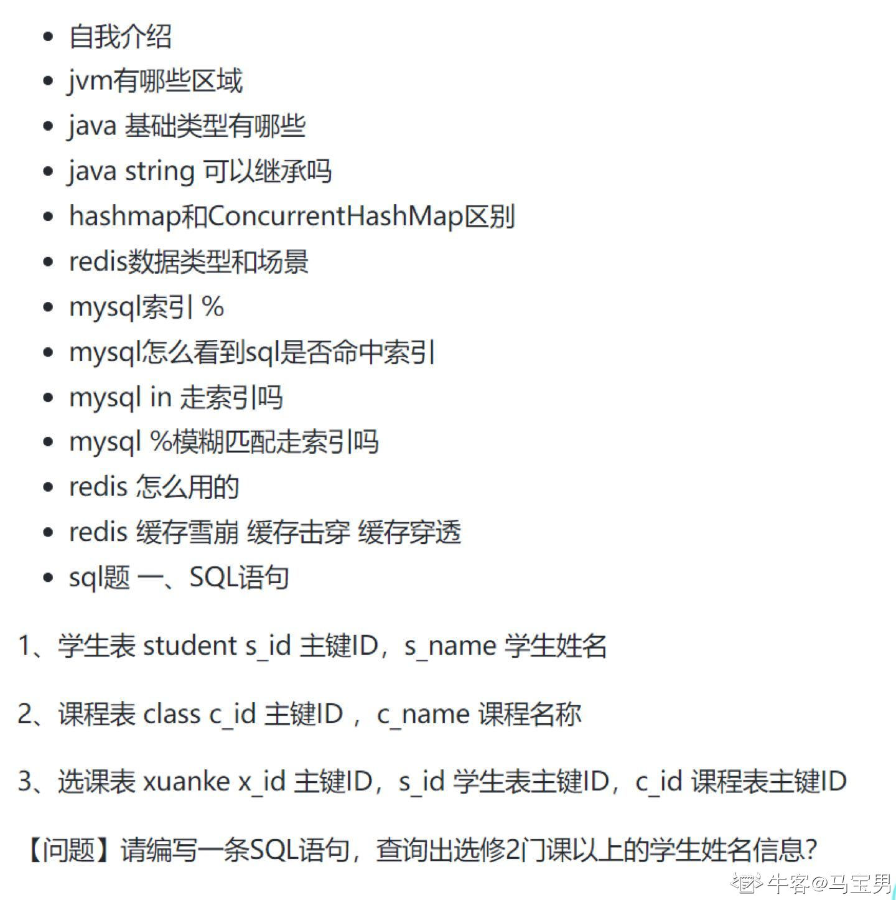

# 刷到的面试题



```java
11月25~27日 Java实习生 合思三面 面筋总结（已OC）
一面：

1.自我介绍

2.项目介绍

3.Java反射

4.方法重载和重写有什么区别

5.常见的数据类型和集合类型

6.ArrayList和LinkedList还有vector三种区别

7.垃圾回收器的垃圾回收算法

8.索引的作用

9.具体有哪些索引

10.Java里面的锁有哪些方式

11.分布式锁怎么加锁

12.反问

二面：

1.自我介绍

2.介绍一下自己Java是怎么自学的

3.设计模式用到的有哪些？

4.除了责任链模式还有其他的一些设计模式吗？

5.先更新缓存还是更新数据库

6.什么叫做缓存击穿

7.怎么避免缓存穿透

8.MySQL的索引结构

9.数据库的事务隔离级别

10.默认是哪一种

11.数据库锁有哪几种

12.实习期间能达到什么样的程度，对自己有什么期望。

13.技术和业务哪个更重要。

14.反问

hr面：

1.自我介绍

2.项目中遇到的难点，亮点

3.高考分数

4.为什么选择南昌

5.对我生活中最启发的人

6.数据结构考多少分

7.平常学习算法和数据结构吗

8.有什么其他的爱好吗？

9.是什么让你减肥呢

作者：今天会有奥佛吗
链接：https://www.nowcoder.com/discuss/698318444130820096?sourceSSR=users
来源：牛客网
```

```java
12.16-度小满后端日常实习一面
1. 自我介绍
2. 从实习经历里挑一个比较亮点和难点讲一下
3. 你对集群和分布式的理解
4. 讲一下redis分布式锁和集群有什么关系？
5. 在你的项目里有出现过消息重复消费和消息积压的情况吗？
6. 开源你有没有碰到什么难处？
7. 介绍一下你最熟悉的排序算法，有什么缺点？这些排序算法什么时候什么情况下会用到？
8. Hash了解吗？比如怎么解决Hash冲突和常见的结构，讲讲HashMap的结构
9. 你对于TCP和UDP的理解
10. http是基于哪个协议？http和https的区别
11. 你平常有碰到网络故障的经历吗，会怎么解决？比如一个网址打不开，你会怎么解决？
12. 有使用过网络排查的命令吗
13. TCP的流量控制怎么实现的
14. 并发和并行的区别
15. 用户态和内核态的区别，什么情况下会进入到内核态
16. 线程和进程的区别
17. 常用的linux命令举例，查看进程的话除了top还有什么命令
18. MySQL的隔离级别。怎么避免幻读的
19. 一个单机版的MySQL的存储量，性能已经达到了上限，你会采用什么措施进行改进？分库分表你有遇到什么真实的场景吗？简单介绍一下分库分表
20. MySQL索引的底层数据结构
21. 索引失效的情况
22. SQL调优有什么经历？或者有什么了解？
23. MySQL崩溃恢复机制你了解的有哪些？
24. undolog和binlog有什么区别
25. 常用的设计模式结合你的经历来讲
26. 算法：lc：92：反转链表2

作者：Asp1rin
链接：https://www.nowcoder.com/interview/center?entranceType=%E5%AF%BC%E8%88%AA%E6%A0%8F
来源：牛客网
```
