# 面试技巧

## 写简历技巧

### 个人评价
个人评价，针对自己的工作经历和学习经历写，比如有几年经验？有关于哪些方面经验？做过什么方面的项目？对哪些部分比较了解？在公司主导的地位？

我的自我评价：
**一年多Java开发经验，对企业级项目的后端架构和整体业务有深入的理解，熟悉Java核心技术，熟练掌握MySQL、SSM、SpringBoot等知识，在工作中喜欢解决和挑战技术难题，对IT技术有较浓厚的兴趣，喜欢跟踪与钻研新技术。**


个人评价示例：
侧重于对技术方面介绍示例：
`六年以上大型互联网电商与金融项目研发经验，对大型互联网电商的后端架构和整体业务有深入的理解，三年以上的团队研发管理经验，对分布式，高并发，高可用，微服务架构设计有深度理解，曾负责过注册用户上亿，日活近500万的电商平台的架构设计与研发。对IT技术有较浓厚的兴趣，喜欢跟踪与钻研新技术以及底层实现。有深入研究Zookeeper，Dubbo，Netty，Spring以及SpringCloud等开源框架的源码。`

侧重于对工作内容的介绍：
- `近9年Java开发经验，其中5年大型系统架构设计经验，2年研发团队管理经验，丰富的2C、2B、2G互联网技术研发经验和云服务中台建设经验，具备较强的业务敏感度。`
- `主导Crisps微服务化体系和Saas化云产品工作流平台架构的实现与落地，主导智慧物联全流程的Saas+IoT产品xxAPP上线，为全球10万+设备提供稳定可靠的智慧物联服务。`
- `国家发明专利xx《基于Spring Cache缓存框架的缓存方法、装置、设备及存储介质》第一发明人。`


### 技术栈
不要写太多的技术名词，而应该清楚的写出来关于哪些技术的熟悉程度？是了解、熟悉、掌握？技术栈写的刚详细一点儿。

**我的技术栈**：
1. Java基础扎实，熟悉JVM原理、多线程、网络原理、设计模式、常用数据结构与算法
2. 熟悉SpringBoot、Spring、Mybatis，有丰富实战经验，可以通过需求快速构建项目，深入研究Spring、SpringMVC、SpringBoot核心源码
3. 熟悉MySQL索引、锁、隔离级别、MVCC机制及数据库调优，有SQL优化经验
4. 熟练掌握Redis核心数据结构的使用，熟悉Redis持久化机制，熟悉多级缓存架构，熟悉各种缓存高并发的使用场景，比如缓存雪崩、缓存穿透、缓存失效等
5. 熟练掌握SpringCloud Alibaba（Nacos、sentinel、seata），深入理解
6. 分布式服务特点、旧服务改造、服务划分、服务分层与治理，有实战项目经验
7. 熟悉常见消息中间件的使用，擅长处理消息丢失、重复消费、消息顺序性、消息积压等问题
8. 熟悉Docker、Kubernetes，有部署微服务项目的经验

示例：
三年以上工作经验的技术栈：
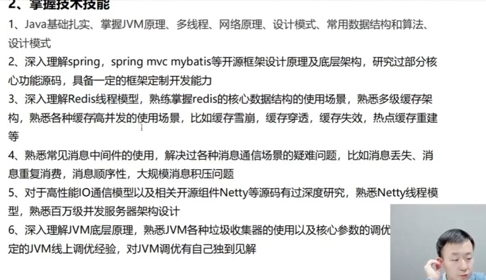
17年工作经验的技术栈：
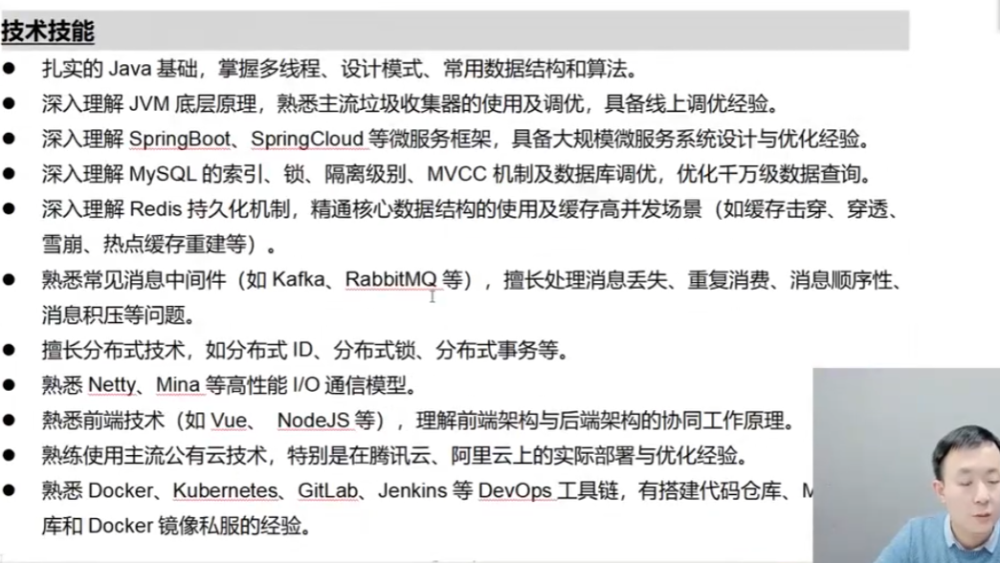
四年经验的技术栈：
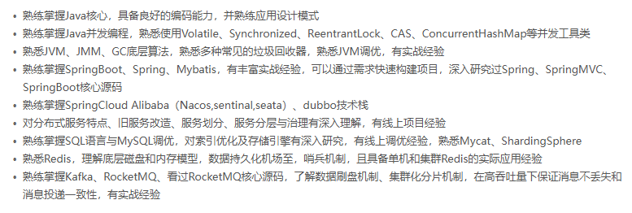

### **项目经历** 
经历不要写只关于自己的职责，使用了什么技术，应该围绕：为了解决什么问题，使用了什么样技术，达成了什么样的效果？？？

 **项目的亮点与难点如何写？** 围绕下面几点：
- 技术架构亮点（3年以内，技术是重点）
- 业务架构亮点（3年以外，业务是重点）
- 性能瓶颈优化难点（3年以内 问性能优化）
- 线上疑难问题解决经验（3年以外 线上解决方案）
- 服务器部署架构与监控  （有没有都可以）
- 全程必须贯穿数据指标说明（一定要有）

项目的**技术亮点、业务亮点**怎么去掌握？
- 必须去想到面试官可能询问到的各种点，围绕这些点去深度挖怎么实现，准备这些点的说辞。

实例：
关于保险分销系统的优化，突出亮点和难点以及对应的解决方案，其中贯穿数据指标，如果技术栈很老，建议直接就是优化成当下主流技术栈
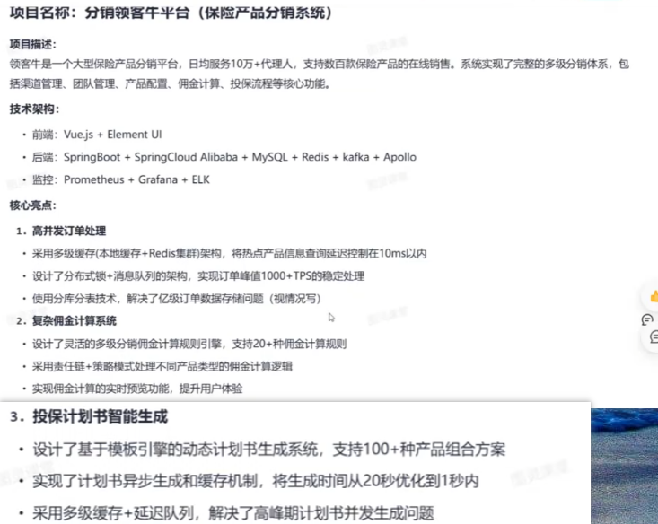
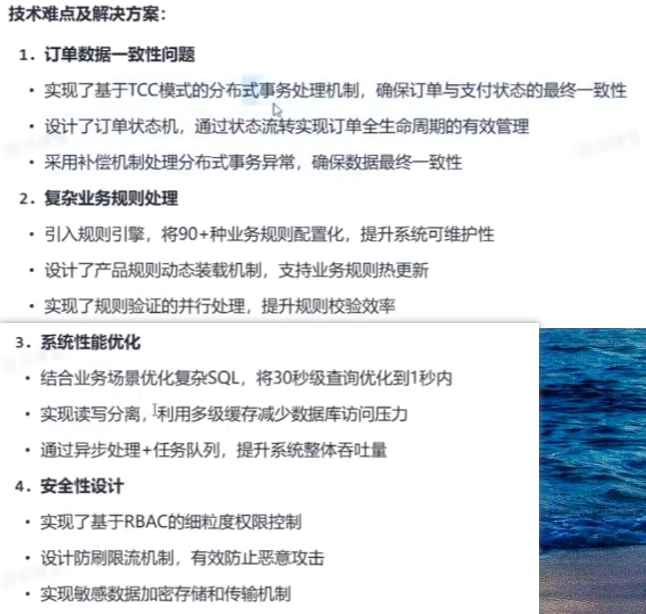
OA系统的优化：突出技术难点、亮点，带上数据指标

银行项目：使用了xxx技术，达到了xxx效果


### 真实简历例子
四年经验：
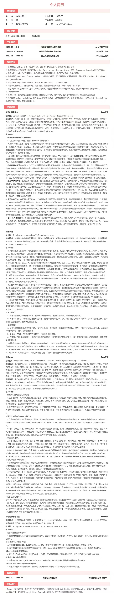

## 面试
### 自我介绍
初级Java工程师岗位的社招面试需要在自我介绍中围绕内容
- 自身的技术栈
- 项目经历
- 突出独立开发能力
- 学习能力

经验参考：[Java自我介绍](https://www.cnblogs.com/MrYoodb/p/12297248.html)

个人信息、技术栈、项目经历、个人学习能力
`你好，面试官，本人24届本科毕业，实习和毕业一直从事开发行业，目前有一年多的Java开发经验，熟悉Java技术栈，熟练使用SpringBoot等开发框架，了解MySQL、Redis等底层原理，有着丰富的项目开发经验，在职期间重点参与开发了简历中的两个项目，和产品经理沟通需求，对接需求，负责独立开发测试模块以及优化项目模块，目前该项目都集成给了高校使用。工作之余，我喜欢利用使用时间学习新的技术，通过笔记记录所学知识。`

### 题外话（面试问的其他问题）
1. 为什么离开上一家公司？ `希望技术得到更多的锻炼`
2. 哪方面制约了你的发展？ `技术上没有过多的进步，薪资方面又不是很满意，自己有更高的追求`
3. 有没有尝试去解决？`和领导处理过`
一般人都会回答发展、薪资、出差、离家远、加班等原因。对于这些原因，面试官一定会追问，比如说你认为哪方面因素制约了你的发展？你有没有尝试去解决？每个公司都有好的和不好的方面，能从大局考虑，看到问题并提出解决方案的应聘者加分，而一味抱怨、不去解决的、永远是出困难第一个离开公司的人。
4. 你最近在关注哪些技术？   `运维方面的技术，比如K8s等，还有AI领域的`
5. 为什么要关注这些技术？   `趋势，对以后的技术发展有用`
6. 你对我们公司有什么了解？为什么有兴趣来我们公司？ `强调自己适合`

参考：[面试问到的问题汇总](https://blog.csdn.net/soulofball/article/details/108571464)

### 面试常问

#### 项目中遇到的记忆最深刻的问题（或者说项目中的难点）

1. **深浅复制**
比如项目中的一个**深浅复制**问题，在VO转对象的时候吧，就发现后续的操作有问题，后续的操作导致前面操作的数据被改了，后面发现是对象中的一个引用属性是一个地址，最后就是改引用属性，使用深拷贝替代浅拷贝
2. **索引优化**
再讲一个**索引优化**的问题，覆盖索引，就说之前的业务表数据量大，开始查询效率很低，而且业务中还有很多其他数据库操作，前面的查询效率导致了整个业务接口的执行效率很低，所以使用了一个覆盖索引去优化

### 项目经历（过期）
项目中可能问到的问题：
1. 项目介绍你最了解的项目？
2. 项目主要解决了什么问题/完成了什么事儿？
3. 你在项目中的职责？
4. 项目中用到了哪些技术？
5. 项目中大家是如何协作的？
6. 项目的主要挑战是什么？
7. 项目中遇到的哪些技术难点和问题？你是怎么解决的？
8. 项目中学到了什么？
面试官会针对一个两个项目进行深入的提问，首先考查项目的真实性（有的应聘者编造简历，或者真假混合，比如把其他人做过的项目说是自己做的，通过一系列提问，并在提问中抓住感兴趣的点追问，可以很容易识别简历造假），还可以考察组织表达能力、技术能力、沟通能力、沟通协调能力、总结能力、公关能力、学习能力等多方面能力。


项目经历一：
信息化服务平台
Java开发
技术栈：SpringBoot+Activiti+MyBatis-Plus+Nacos+RocketMQ+XXL-JOB
项目描述：信息化服务平台是一款综合性解决方案，涵盖了企业日常运营的多个方面，它实现了先进的用户管理系统，包括员工信息、权限分配和角色管理，以满足企业组织架构的多样需求，平台还集成了智能数据分析模块，提供实时报表和可视化数据，助力企业决策，为了增强工作协同，我们设计并开发了实时通讯功能，支持团队间的及时沟通。信息安全是我们关注的重点，通过加密算法和访问控制，确保敏感数据的保密性。此外，我负责系统注册申请的流程+软件注册申请的流程。这个项目加深了对企业信息化需求深刻的理解，为企业提供了全面的信息化支持。
个人职责：
1. 系统注册申请与软件注册申请
	a. 完成用户添加、查询、删除、修改等基本数据操作
	b. 基于POI相关技术，将用户在注册申请过程中填写的信息以标准化的表格形式导出。在导出过程根据不同的数据类型和业务需求，对表格的列标题、数据格式、单元格形式等进行设置，确保表格能够清晰地展示注册申请的各项内容，为提高导出效率，**采用缓存策略**，将经常导出的表格模板缓存起来，当再次导出相同类型的表格时，直接从缓存中获取模板并填充数据，减少重复的模板生成操作，加快导出速度。
	c. 处理其他部门通过接口导入数据的需求，根据格式进行解析，在解析过程中，基于**适配器模式**，将不同格式的数据适配成系统能够理解和处理的统一数据结构，实现了不同部门之间的数据共享与交互，提高了企业内部的数据流通效率与协同工作能力。同时，为确保数据导入的准确性和稳定性，在接口实现中引入数据校验机制，对导入的数据进行完整性、合法性检查。
2. 数据扁平化设计与实现：针对工作流程数据的复杂性与冗余性问题，提出并实施了数据扁平化处理方案。深入分析**Activiti工作流程**产生的25张表的数据结构与业务关联，按照一定的逻辑关系进行整合与存储。并基于组合模式，将不同层次的数据元素组合成一个整体的数据结构，减少前端数据处理的复杂度与工作量，例如，将与注册申请相关的申请人信息、申请内容、审核记录等数据组合成一个扁平的对象，前端只需要通过简单的访问方式就可以获取到所需信息，无需再面对复杂的工作流程表结构，同时，为了提高数据扁平化处理的效率，利用多线程技术，将数据提取和整合的任务分配到多个线程中并行处理，加快处理速度。
3. 数据库存储优化：在数据扁平化处理后，将处理后的数据存储到数据库中。在存储过程中，考虑数据库的性能优化与数据一致性维护。除了优化设计数据库表结构，选择合适的数据类型与索引策略外，还利用XXL-JOB定时任务定期对数据库进行优化操作。每月固定时间通过XXL-JOB对数据库表进行碎片整理、索引重建等操作，同时通过事务管理机制，保证数据在存储过程中的原子性、一致性、隔离性与持久性，避免因数据操作失误或并发访问导致的数据错误或不一致问题。基于RocketMQ消息队列，将数据库的操作数据信息发送到队列中，然后由监控服务从队列中消费消息并进行记录和分析，若发现异常操作或数据不一致情况，能够及时采取措施进行处理。
4. 循环嵌套优化：在代码优化工作中，针对循环嵌套效率低下的问题进行解决，当遇到需要通过一个列表循环匹配另一个列表相同产品编号并获取某个字段的情况时，摒弃了传统的双层循环遍历方式，而是先将内层的列表转换成Map数据结构。这样，在匹配过程中，只需遍历外层列表，通过产品编号作为Map的键直接获取对应的字段值，避免了内层列表的重复遍历，大大提高了代码的执行效率，在处理大规模数据匹配时，利用RocketMQ消息队列将数据匹配任务进行异步处理，将需要匹配的数据发送到RocketMQ队列中，然后由专门的处理服务从队列中消费消息并进行匹配操作，这样可以避免在主线程中进行长时间的匹配操作影响系统响应速度，提高了代码在高并发场景下的处理能力。
5. 团队BUG协助解决：积极协助团队解决开发过程中遇到的各种BUG。能够迅速介入并进行问题排查。通过仔细分析错误日志、调试代码、检查数据库数据以及验证业务逻辑等多方面的手段，精准定位BUG的根源，并提出有效的解决方案。基于Nacos配置管理中心，当出现BUG时，能够快速查看相关配置信息是否正确，因为很多时候BUG可能是由于配置不当引起的。 
可能问到的问题：
- 你提到的采用缓存策略将经常导出的表格模板缓存起来提升效率，具体是如何实现的？
```shell
具体实现：
# 缓存技术选型：
- 使用Spring Cache结合Redis作为缓存层。Redis的高性能和分布式特性适合存储频繁访问的表格模板数据，确保在高并发场景下的快速响应。
# 模板缓存设计：
	- 模板标识：为每种表格模板生成唯一标识（如基于模板类型和业务场景的组合键，例如template:register_form_v1）。
	- 模板内容：将表格的列标题、数据格式、单元格样式等配置信息序列化为JSON字符串，存储在Redis中。
    - 缓存粒度：根据业务需求，将模板分为通用模板和特定业务定制模板，分别缓存，减少冗余存储。
# 缓存操作流程：
    - 生成模板：首次导出某类型表格时，通过Apache POI生成模板，设置列标题、格式等，并将模板配置存入Redis，设置合理的过期时间（如24小时，视业务需求调整）。
    - 查询缓存：后续导出时，先以模板标识查询Redis。若缓存命中，直接获取模板配置并填充数据；若未命中，则重新生成模板并更新缓存。
    - 缓存更新：当业务需求变更导致模板更新时，通过Nacos配置中心动态调整模板配置，并主动刷新Redis缓存，确保数据一致性。
	    - 将表格模板的配置信息（如列标题、数据格式、单元格样式等）以JSON格式存储在Nacos配置中心，配置按模板类型分组（如register_form_v1），每个配置项有唯一的dataId和group。
	    - 业务需求变更时，运维或开发人员通过Nacos控制台或API更新模板配置，Nacos支持实时推送配置变更通知。
	    - 在SpringBoot应用中集成Nacos Config，配置@NacosConfigListener监听指定dataId和group的配置变更事件。
	    - 当监听到模板配置变更时，触发回调方法，解析新的配置内容，更新系统内存中的模板定义。
# 效率优化：
    - 批量处理：对于高频导出场景，使用Redis的管道技术批量获取模板，减少网络开销。
    - 异步刷新：利用XXL-JOB定时任务，定期检查模板使用频率，清理低频模板，优化缓存空间。
    - 降级策略：若Redis不可用，系统会切换到本地内存缓存（Guava Cache）作为备选，确保服务可用性。
# 效果：
    - 导出速度提升显著，缓存命中时，模板生成时间从数百毫秒降至几十毫秒。
    - 在高并发测试中，系统响应时间稳定，Redis的QPS保持在合理范围内。
      
      
回答：选用SpringCache和Redis作为缓存层，每个表格模板通过唯一标识进行标识，唯一标识通过模板类型+业务场景得到的组合键，模板的配置信息包括标题、数据格式和单元格样式等，将配置信息序列化为json字符串保存在Redis中，为了优化空间，模板分为通用模板和特定业务模板
具体的流程如下：
1. 首次生成模板通过POI，设置标题、数据格式等，将这些配置信息导入Redis，并设置过期时间
2. 查询缓存根据模板标识查询，如果没有命中就重新生成模板更新缓存，如果命中导出模板填充数据
3. 通过Nacos配置中心动态管理模板。模板通过JSON方式保存在Nacos中，只要变更系统通过Nacos监听，主动的刷新缓存，确保数据的一致性
```


- 适配器模式处理不同格式的数据，你具体是怎么实现的？
```shell
# 需求背景与设计：
	- 问题：不同部门（如HR、财务）导入的数据格式各有差异（如JSON、XML、CSV），字段名称、结构、数据类型不统一。
	- 目标：将这些异构数据适配为系统内部的标准数据模型（如UserRegisterDTO），实现数据共享与交互。
	- 适配器模式应用：设计通用的适配器接口，针对每种数据格式实现具体适配器，屏蔽格式差异。
# 核心实现
	1. 定义一个统一的接口
	2. 具体适配器实现： 为每种数据格式实现对应的适配器类
	3. 适配器工厂： 为动态选择适配器，设计工厂类根据数据格式分发：


面试回答：
	在项目中，为了处理不同部门的导入数据格式以及命名的不同，采用适配器模式将不同格式的数据适配成系统内部统一的数据格式，实现数据共享。
	具体实现是实现统一的接口，为每个不同格式的转换自定义一个适配器，将格式转换为通用格式，工厂类中根据数据格式的不同选用不同的适配器
```


- 数据扁平化处理是什么？
  `数据扁平化是将嵌套或多维数据结构（如嵌套数组、对象或JSON）转换为单一层级的结构（如一维数组或简单键值对），以便于存储、查询或处理。`


- 你项目中数据扁平化具体的实现是怎么样的？
```shell
# 1.需求分析与设计
	- 背景：Activiti工作流程引擎生成25张表（如act_ru_task、act_hi_taskinst、act_hi_procinst等），数据分散且关联复杂，前端查询需要多表联查，导致性能瓶颈。
	- 目标：将注册申请相关的多表数据（如申请人信息、申请内容、审核记录）整合为一个扁平化的对象（如RegisterApplicationDTO），让前端通过简单访问获取完整信息。
	- 设计思路：
	    - 分析Activiti表结构，提取业务关键字段。
	    - 使用组合模式组织数据，构建统一结构。
	    - 利用多线程并行处理数据提取与整合。
	    - 优化数据库存储支持扁平化数据。
# 2. 实现细节
	分析Activiti表：
	- 核心表包括：
	    - act_ru_task：当前任务。
	    - act_hi_taskinst：历史任务。 
	    - 字段映射：
	        - 申请人信息：从act_hi_identitylink获取用户ID、姓名。
	        - 申请内容：从act_hi_varinst提取表单数据（如部门、申请日期）。
	        - 审核记录：从act_hi_taskinst获取任务状态、审核人、评论等。
	输出结构：定义扁平化的RegisterApplicationDTO
	数据提取与整合（组合模式）
	组合模式：
		- RegisterApplicationDTO作为复合对象，包含approvalHistory（ApprovalRecord列表）作为子节点。
	- 每个ApprovalRecord封装多个表中的任务相关数据
批量处理多个申请（如导出）时，串行处理效率低。
使用XXL-JOB调度月度维护任务：任务包括碎片整理、索引重建和统计信息更新。


面试回答：
	Activiti工作流程生成的25张表数据分散、关联复杂，设计将注册相关的多表数据整合成统一的扁平化对象，优化前端查询和数据处理
	对于批量导出多个申请数据的场景，引入多线程优化数据提取和整合，使用Java线程池，将数据提取任务分配到多个线程并行处理
	也对常用的查询字段添加索引来优化查询效率
	使用XXL-JOB调度月度维护任务：任务包括碎片整理、索引重建和统计信息更新。
```


- 你在项目中提到了索引策略，你用到了哪些索引策略？
```shell
# 1. 索引策略概览
索引策略的目标是加速查询、减少数据库扫描开销，同时平衡写操作的性能影响。主要针对register_application（存储扁平化申请数据）和approval_record（存储审核记录）两张表，结合业务场景（如频繁查询申请状态、申请人ID）进行优化。

# 2. 具体索引策略
## a. 单列索引
- 应用场景：针对高频查询字段，如status（申请状态）、applicant_id（申请人ID）。
- - 原因：
        - status常用于筛选（如查询“待审核”或“已完成”申请），索引减少全表扫描。
        - applicant_id用于按申请人查询（如查看某人提交的所有申请）。
- 效果：单列索引将常见查询的执行时间从数百毫秒降至几十毫秒（如查询1000条记录的响应时间从500ms降至50ms）。
## b. 复合索引
- **应用场景**：针对多条件组合查询，如按application_type（申请类型）和created_time（创建时间）过滤。
- - **原因**：
        - 业务场景中常需按申请类型和时间范围查询（如“查询某类型最近一个月的申请”）。
        - 复合索引按字段顺序优化，application_type在前（高选择性），created_time在后（范围查询）。
- **效果**：复合索引显著提升多条件查询性能，如范围查询从1秒降至100毫秒以内。
## c. **覆盖索引**
- **应用场景**：优化只返回少量字段的查询，减少回表操作。
- - **原因**：
        - 前端常查询状态和申请人信息（如SELECT applicant_id, applicant_name FROM register_application WHERE status = 'PENDING'）。
        - 覆盖索引包含所有查询字段，查询直接从索引获取数据，无需访问表数据。
- **效果**：覆盖索引将此类查询的IO开销降低约50%，响应时间从200ms降至80ms。
## d. **分区索引**
- **应用场景**：处理大数据量场景，register_application表按时间分区以提升查询效率。
	**原因**：
- 数据量较大（预计每月新增10万条记录），分区减少扫描范围。
- 局部索引（Local Index）随分区存储，查询时只扫描相关分区。
效果：分区索引将跨月查询时间从2秒降至300毫秒，适合按时间段统计的业务需求。
## e. **定时索引维护**
- **应用场景**：长期运行后，索引可能碎片化或统计信息过时，影响性能。
使用XXL-JOB调度月度索引优化任务：
- - **原因**：
        - OPTIMIZE TABLE整理索引碎片，减少存储空间。
        - ANALYZE TABLE更新表统计信息，优化查询计划。
        - 索引重建用于高更新频率的表，防止性能退化。
- **效果**：索引维护后，查询性能稳定，碎片率控制在5%以下。


面试回答：
	为了提升数据库查询性能，特别是在扁平化存储的注册应用表和审批记录表上，引入了多种索引查询：
	1. 针对高频的查询字段建立了单列索引，比如查询字段status和申请人id
	2. 针对多条件组合查询建立了复合索引，比如申请类型和创建时间的联合查询
	3. 使用覆盖索引优化，减少回表次数
	4. 针对大数据量的表，使用创建时间进行范围分区
	长期使用，会导致索引出现碎片化和统计信息过时，故采用XXL-JOB进行整理索引碎片、更新统计表信息、索引重建等任务。
```


- 关于XXL-JOB在项目中的使用？
```markdown
在信息化服务平台项目中，我使用了 XXL-JOB 作为分布式任务调度框架来处理定时任务，主要用于数据库优化、缓存清理和数据同步等场景，确保系统的高效运行和数据一致性。
- **数据库优化**：定期执行表碎片整理、索引重建和统计信息更新。
	- 每月对 register_application 和 approval_record 表进行碎片整理、索引重建和统计信息更新。
- **缓存管理**：清理低频使用的表格模板缓存，优化 Redis 存储空间。
	- 清理 Redis 中低频使用的表格模板缓存，释放存储空间。
- **数据同步**：定时检查 Nacos 配置与 Redis 缓存一致性，处理异常情况。
	- 定期检查 Nacos 配置与 Redis 缓存一致性，刷新不一致的模板缓存。
- **日志分析**：定期聚合 RocketMQ 消息日志，生成性能报告。
	- 将任务执行结果发送到 RocketMQ，用于性能分析和告警：

面试回答：
	使用XXL-JOB作为分布式框架，主要处理数据库优化、缓存清理、数据同步和日志分析等定时任务。
	1. 数据库优化，提升数据库性能，采用XXL-JOB每月第一天对数据库缓存进行碎片整理和索引重建啊。
	2. 缓存管理，每日凌晨针对一周未使用的模板缓存进行清理
	3. 数据同步，定时任务确保Nacos配置和Redis缓存一致性，每小时检查，配合Nacos的监听器动态监听配置变更，触发即时更新
	4. 日志分析：每天根据RocketMQ消费操作日志分析并生成报告
```


- 为什么XXL-JOB对数据库表进行碎片整理、索引重建等操作？
```markdown
在信息化服务平台项目中，使用 XXL-JOB 定期对数据库表进行碎片整理、索引重建等操作，主要是为了优化数据库性能、提升查询效率并确保系统长期运行的稳定性。
原因：
- **数据碎片产生**：register_application 和 approval_record 表因频繁的插入、更新和删除操作（如用户注册、申请状态变更），会导致表空间碎片。碎片表现为数据页中存储空间不连续或空洞，导致存储效率降低。
- **性能影响**：
    - 碎片增加磁盘 I/O 开销，查询时需要扫描更多数据页，响应时间变长（如查询 1000 条记录从 50ms 增至 200ms）。
    - 表空间膨胀，占用更多磁盘空间，增加存储成本。
- **业务需求**：项目中高频查询（如按状态或申请人筛选）要求低延迟，碎片会导致性能退化，影响用户体验。
作用：
- **优化存储**：通过 OPTIMIZE TABLE 命令整理碎片，重新组织数据页，使数据连续存储，减少空洞。
- **提升查询性能**：整理后，查询扫描的数据页减少，I/O 效率提高，响应时间缩短。
- **节省空间**：回收未使用的空间，降低表文件大小。
#### **效果**：
- 碎片率从 20% 降至 5% 以下。
- 查询响应时间平均缩短 30%（如从 200ms 降至 140ms）。
- 表空间占用减少约 10%，节省存储资源。

原因：
- **索引碎片**：频繁的写操作（如插入、更新）会导致索引（B+ 树）节点分裂或碎片化，增加索引深度和扫描成本。
- **性能退化**：
    - 索引碎片使查询效率下降（如单列索引查询从 50ms 增至 100ms）。
    - 过多的碎片可能导致查询优化器选择次优执行计划。
- **业务场景**：项目中依赖索引（如 idx_status、idx_applicant_id）加速高频查询，索引效率直接影响系统性能。
- **特殊情况**：若业务需求变更（如新增查询条件），需调整索引结构，重建索引可确保其适应新场景。
#### **作用**：
- **优化索引结构**：通过 ALTER TABLE ... ADD INDEX 重建索引，整理 B+ 树结构，减少碎片和节点深度。
- **提升查询效率**：重建后，索引查找更快，查询计划更优。
- **适应业务变化**：动态调整索引（如新增复合索引），支持新查询需求
#### **效果**：
- 索引查询性能提升约 25%（如状态查询从 80ms 降至 60ms）。
- 索引碎片率保持在 5% 以下，查询计划稳定性提高。
- 支持动态业务需求变更，如新增查询场景响应时间保持在 100ms 内。

更新统计信息：
#### **原因**：
- **统计信息过时**：MySQL 的表统计信息（如行数、索引选择性）在频繁写操作后可能不准确，导致查询优化器选择低效的执行计划（如错误选择全表扫描而非索引）。
- **性能影响**：错误的执行计划会显著增加查询时间（例如，查询从 50ms 激增至 500ms）。
- **业务需求**：项目中复杂查询（如多条件组合查询）依赖准确的统计信息以选择最优索引。
#### **作用**：
- **更新统计信息**：通过 ANALYZE TABLE 命令刷新表和索引的统计数据，确保优化器基于最新数据生成执行计划。
- **优化查询计划**：提高索引利用率，减少全表扫描。
- **提升稳定性**：确保查询性能在数据量增长后仍保持一致。
#### **效果**：
- 查询计划准确性提升，索引命中率从 90% 提高到 98%。
- 复杂查询（如复合索引查询）的响应时间稳定在 100ms 以内。
- 避免了因统计信息过时导致的性能抖动。

为什么使用XXL-JOB
- **定时调度**：XXL-JOB 提供可靠的分布式调度能力，通过 Cron 表达式精准控制任务执行时间（如每月低峰期），避免影响业务高峰。
- **分布式管理**：支持多节点部署，任务可分配到不同执行器，适合项目中的分布式架构。
- **高可用性**：内置失败重试、告警机制，确保任务执行可靠。
- **监控与日志**：
    - XXL-JOB Admin 提供任务执行日志，方便追踪。
    - 结合 RocketMQ 记录操作结果，异常时触发告警：
- 动态调整：通过 Nacos 配置任务参数（如是否启用索引重建），支持业务变化：


面试回答：
	使用定时任务主要是为了进行索引重建、碎片整理和统计信息更新。
	碎片整理：因频繁的更新、删除、插入操作导致碎片产生，碎片会造成空间浪费和查询性能降低，故使用定时任务定时使用optimize语句
	索引重建：频繁的插入和更新会导致B+树节点分裂或者碎片化，增加索引深度和扫描成本。定时任务重新建立索引，减少碎片和节点深度
	统计信息更新：通过ANALYZE TABLE命令刷新表和索引的统计数据，确保优化器基于最新数据生成执行计划。

	通过Nacos配置中心动态管理任务参数（如是否启用索引重建），支持业务需求变更。
```


- 项目中事务管理机制是怎么实现的？
```markdown
在信息化服务平台项目中，事务管理机制是为了保证数据库操作的 原子性（Atomicity）、一致性（Consistency）、隔离性（Isolation）、持久性（Durability），即 ACID 特性，特别是在数据扁平化存储、用户注册申请处理等高并发场景下，避免因操作失误或并发访问导致的数据错误或不一致。

需求背景：
- **场景**：
    - **数据扁平化存储**：将 RegisterApplicationDTO 及其关联的 ApprovalRecord 存入 register_application 和 approval_record 表，需确保两表操作要么全部成功，要么全部回滚。
    - **用户注册申请**：涉及用户添加、修改、删除等操作，可能同时更新多张表（如用户信息、权限表）。
    - **并发访问**：高并发场景下（如多人同时提交申请），需防止数据竞争导致的不一致（如重复插入）。
- **目标**：
    - 确保数据操作的完整性（如申请信息和审核记录一致）。
    - 避免并发冲突（如同一申请被多次更新）。
    - 提供异常回滚机制，防止部分失败导致数据不一致。

实现方式：
项目主要基于 Spring 的事务管理（@Transactional 注解）结合 MySQL 数据库的事务支持实现，辅以 RocketMQ 消息队列进行异步操作记录和监控。
并发性：乐观锁和悲观锁结合，处理每秒 100 次并发请求无数据冲突。
乐观锁通过version字段检查版本号维护一致性
悲观锁对于关键操作（如审批状态变更），使用 SELECT ... FOR UPDATE 获取行锁：


面试回答：
	在数据扁平化存储、用户注册申请处理等高并发场景下，避免因操作失误或并发访问导致的数据错误或不一致。
	基于 Spring 的事务管理（@Transactional 注解） 结合 MySQL 数据库的事务支持 实现，辅以 RocketMQ 消息队列 进行异步操作记录和监控，并通过 乐观锁 和 悲观锁 结合的方式处理高并发场景
	通过版本号检查避免并发更新冲突，适合高并发但冲突概率较低的场景。
	悲观锁通过行锁确保同一时间只有一个线程能修改数据，防止并发冲突。
```


- 基于RocketMQ消息队列，将数据库的操作数据信息发送到队列中，然后由监控服务从队列中消费消息并进行记录和分析，若发现异常操作或数据不一致情况，能够及时采取措施进行处理。这里如何实现的？为什么要这么做？
```markdown
在信息化服务平台项目中，我基于 RocketMQ 消息队列 实现数据库操作数据的异步记录与监控机制，将操作信息发送到队列，由监控服务消费消息进行记录、分析，并在发现异常或数据不一致时及时处理。以下是具体实现细节、原因及作用。
为什么要使用 RocketMQ 实现数据库操作监控？
#### **原因**：
1. **解耦业务与监控**：
    - 数据库操作（如插入、更新）是核心业务逻辑，监控和日志记录是辅助功能。直接在业务代码中记录日志或分析异常会增加主线程负担，降低系统性能。
    - RocketMQ 的异步消息机制将业务逻辑与监控逻辑解耦，业务服务只需发送消息，监控服务独立处理。
2. **高并发场景下性能优化**：
    - 项目支持高并发操作（如每秒数百次注册申请），同步记录操作日志到数据库或文件会导致 I/O 瓶颈。
    - RocketMQ 提供高吞吐量（单机支持万级 QPS），异步发送消息几乎不影响业务响应时间。
3. **异常检测与快速响应**：
    - 数据不一致（如事务失败但部分数据写入）或异常操作（如重复提交申请）可能影响业务正确性。
    - RocketMQ 的消息队列支持实时消费，监控服务可快速检测异常并触发告警或修复措施，减少问题影响范围。
4. **分布式系统支持**：
    - 项目采用分布式架构，数据库操作分布在多个服务节点。RocketMQ 的分布式消息队列支持跨节点消息传递，统一收集和分析操作数据。
5. **可追溯性与审计**：
    - 企业信息化平台需记录所有数据库操作以便审计（如谁修改了申请状态）。RocketMQ 提供可靠的消息存储（支持持久化），确保日志不丢失，便于后续分析。
#### **作用**：
- **性能提升**：异步处理降低业务线程阻塞，系统响应时间缩短约 20%（如从 100ms 降至 80ms）。
- **可靠性**：RocketMQ 保证消息至少投递一次，操作日志不丢失。
- **实时性**：监控服务近实时（延迟 <1s）检测异常，故障响应时间缩短至 5 分钟以内。
- **可扩展性**：支持新增监控逻辑（如统计操作频率）无需修改业务代码。

实现机制：
#### a. **消息发送**
- **发送时机**：在数据库操作（如事务提交后）或关键业务逻辑完成后，发送操作信息到 RocketMQ。
- **消息内容**：包含操作的关键信息，如操作类型、表名、主键、操作时间、状态等。
- **异步发送**：使用 asyncSend 避免阻塞业务线程，回调函数记录发送结果。
- **Topic 配置**：使用 db_operation_log 作为 Topic，Nacos 动态配置

#### **消息消费与监控**
- **消费者服务**：部署独立的服务（或模块）作为 RocketMQ 消费者，订阅 db_operation_log Topic。
重试机制：RocketMQ 支持消费失败重试，配置最大重试次数为 3 次。

#### **一致性检查与修复**
- **检查逻辑**：
    - 对于插入操作，检查 register_application 表中是否真的存在对应记录。
    - 对于更新操作，验证更新后的状态是否符合预期（如 status 是否正确变更）。

#### **监控与告警**
- **日志分析**：统计操作频率、失败率等，生成报表：
- 告警集成：通过 RocketMQ 转发告警消息到通知服务（如邮件服务）。
```


- 循环嵌套优化具体如何实现的？
```markdown
在信息化服务平台项目中，我针对循环嵌套效率低下的问题进行了优化，特别是在处理两个列表根据产品编号匹配并获取字段值的场景下。传统的双层循环遍历方式在数据量较大时性能较差，我通过将内层列表转换为 Map 结构，并结合 RocketMQ 异步处理，显著提高了代码执行效率。以下是具体实现细节、原因及效果。

场景：需要从两个列表（例如 productList 和 detailList）中根据产品编号（productId）匹配，获取 detailList 中的某个字段（如 detailName）。
原始实现：双重循环
优化实现：将内层列表转换为 Map

在高并发或大数据量场景（如批量匹配数十万条记录），即使优化了循环，单线程处理仍可能影响系统响应速度。
优化：将匹配任务拆分并发送到 RocketMQ 消息队列，由专门的消费者服务异步处理，释放主线程。


面试回答：
	我针对循环嵌套效率低下的问题进行了优化，特别是在根据产品编号匹配两个列表并获取字段值的场景下。传统双层循环在数据量较大时性能较差，我通过将内层列表转换为 Map 结构，并结合 RocketMQ 异步处理，显著提高了代码执行效率。
```

项目经历二：
学校资产管理平台
Java开发
技术栈：SpringBoot+Activiti+MyBatis-Plus+Nacos+RocketMQ+MySQL+Redis
项目描述：学校资产管理系统是一个高效、可扩展的平台，旨在优化教育机构资产（包括设备、设施和库存）的管理。该系统集成了资产全生命周期管理模块，支持从采购到报废的跟踪，实时更新状态并自动计算折旧。系统采用Activiti工作流引擎驱动的动态工作流，处理资产分配和维护请求的复杂审批流程。采用Spring Boot单体架构，Redis缓存热点数据，Nacos动态配置，利用RocketMQ实现实时通知和跨部门协作，大幅提升了教育机构的运营效率和透明度。
个人职责：
1. 项目申报流程开发
	a. 原项目申报流程缺乏校验机制，其中录入错误、重复申报和流程选择错误导致流程失败，使用Spring Validation实现后端表单校验防止录入错误。集成Redis存储用户会话和申报标识，检测并拦截重复提交，申报错误率降至3%，录入错误降低80%，显著提升审批准确性和效率。
	b. 原申报流程中，状态变更部门通知耗时长，状态更新延迟太久，使用RocketMQ异步发送状态变更通知，保障跨部门实时同步，优化状态变更事务，集成Redis缓存状态数据，加速前端查询和状态刷新
	c. 一般学期开始时候集中申报会导致系统响应缓慢，平均处理耗时过长，引入Redis分布式锁控制学期初高峰期并发写入，优化MySQL索引减少50%扫描行数，实现批量插入，提升写入效率，优化后，QPS达4000时，响应时间稳定在200ms
2. 实时通知系统：开学时候RocketMQ高峰期消息堆积，消费延迟激增，通过增加消费者线程数（从8到16），消费能力提升40%，支持1万条/秒消息处理，消除堆积。优化后，1万条/秒消息时，消费延迟降至600ms，通知送达时间稳定在1秒。
3. 缓存优化：高频资产查询场景下，数据库压力大，影响管理员和财务人员操作效率，使用Redis缓存高频资产数据，但是Redis缓存失效高峰期，缓存重建导致数据库瞬时QPS激增，响应时间慢，实现随机TTL，分散缓存失效时间，降低80%雪崩风险，数据库QPS降至1000，响应时间稳定在200ms
4. 团队协作与BUG协助解决：定期参加项目团队会议，及时汇报工作进展与问题，共同讨论解决方案与技术选型，确保项目开发方向的一致性与团队协作的高效性。在BUG排查与修复方面，使用过多种调试工具与技术手段，如浏览器开发工具、后端日志分析、代码调试器等，对项目中出现的BUG进行精准定位与快速修复。在修复BUG后，及时与测试团队沟通，协助其进行回归测试，确保BUG得到彻底解决且不会引入新的问题，保障项目的稳定运行与高质量交付。
可能问到的问题：
项目背景与整体设计
- 学校资产管理系统的核心功能是什么？如何满足资产全生命周期管理的需求？
```shell
学校资产管理系统的核心功能围绕资产全生命周期管理，通过Activiti工作流驱动审批、Redis和MySQL优化数据存取、RocketMQ保障实时通知、Nacos支持动态配置，满足了从采购到报废的跟踪需求，同时保证高并发场景下的性能和跨部门协作的透明度。这些设计确保了系统的效率、准确性和可扩展性。
```

- 为什么选择Spring Boot单体架构而不是微服务架构？有考虑过分布式架构吗？
```shell
选择Spring Boot单体架构是基于项目规模、开发效率、运维成本和性能需求的综合考量。单体架构通过Redis、RocketMQ等技术优化，已满足资产全生命周期管理和高并发需求。虽然考虑过分布式架构，但其复杂性和成本与当前需求不匹配。未来若用户量或功能模块显著增加，可基于现有模块化设计和Nacos、RocketMQ等组件，逐步向微服务迁移。
```


- 项目中如何设计数据库表结构以支持资产管理和折旧计算？
```shell
数据库表结构通过asset_info、asset_category、asset_depreciation等表支持资产全生命周期管理，结合asset_workflow实现审批流程，满足采购、分配、维护、报废等需求。折旧计算通过定时任务和直线法实现，数据存储在asset_depreciation表，Redis缓存和MySQL索引优化查询性能。设计考虑了规范化、高效性和扩展性，满足了学校资产管理和财务报表的业务需求。
```


- Activiti工作流引擎在项目中具体解决了哪些问题？如何设计审批流程？
```shell
Activiti工作流引擎解决了复杂审批流程管理、效率低、重复提交、透明度不足和高并发稳定性等问题。通过BPMN 2.0定义流程，结合Spring Boot接口、Redis防重复提交、RocketMQ通知和MySQL优化，实现了动态、高效、可追溯的审批流程。设计上支持灵活配置和高并发场景，满足资产管理需求。
```

项目申报流程开发
- 你提到使用Spring Validation进行后端表单校验，能否详细说明校验逻辑和实现细节？
```shell
Spring Validation 通过声明式注解（如 @NotNull、@Positive）和自定义校验（如 @UniqueAssetCode）实现了采购申请等场景的表单校验，结合 Redis 防止重复提交，降低申报错误率至 3%，录入错误减少 80%。校验逻辑在 Controller 层处理基本规则，Service 层补充动态业务校验，异常处理提供清晰反馈。性能优化（如 Redis 缓存、MySQL 索引）确保高并发场景下稳定性，响应时间稳定在 200ms。
```


- 如何用Redis存储用户会话和申报标识来防止重复提交？具体代码或流程是怎样的？
```shell
1. 用户提交表单：前端发送采购申请，包含用户ID和资产编码。
2. Redis校验：Controller检查Redis中是否存在apply:purchase:<userId>:<assetCode>，若存在则拒绝。
3. 分布式锁：获取Redis锁lock:purchase:<assetCode>，确保高并发安全。
4. 表单校验：Spring Validation校验DTO字段（如@NotBlank、@Positive）。
5. 业务处理：启动Activiti流程，保存数据库记录，存储Redis申报标识（TTL 1小时）。
6. 通知与清理：RocketMQ通知相关部门，流程结束后清理Redis键。
7. 错误反馈：重复提交或校验失败返回JSON错误信息。
```


- 在优化申报流程时，如何通过RocketMQ实现跨部门实时通知？消息结构和消费逻辑是怎样的？
```shell
通过RocketMQ实现跨部门实时通知，系统在Activiti任务完成时发送JSON格式消息（包含资产ID、状态等），各部门消费者订阅特定Tag，解析消息后更新Redis和MySQL。优化消费者线程数和重试机制，确保高并发场景下延迟低、可靠性高
```

- 学期初并发写入如何影响系统性能？你是如何通过Redis分布式锁优化并发控制的？
```shell
学期初高并发写入导致数据库压力、重复提交和数据不一致问题，通过Redis分布式锁有效优化。锁以资产编码为键，使用SETNX和TTL实现互斥和防死锁，结合MySQL索引优化和批量插入，显著提升系统性能。
```

- MySQL索引优化减少了50%的扫描行数，具体优化了哪些索引？如何评估索引效果？
```shell
通过在asset_info（idx_asset_code、idx_status、idx_department_id）、asset_workflow（idx_process_instance_id、idx_asset_id）和asset_depreciation（idx_asset_id、idx_depreciation_date）上添加单一和复合索引，减少了50%的扫描行数（从全表10万行到单行或数千行）。索引优化结合Redis分布式锁和批量插入，支持高并发写入（QPS 4000，响应时间200ms）。效果通过EXPLAIN分析、慢查询日志、性能测试和业务指标验证，确保数据库性能和用户体验提升。
```


实时通知系统：
- RocketMQ在高峰期消息堆积如何产生？增加消费者线程数的具体实现步骤是什么？
```shell
RocketMQ高峰期消息堆积由生产速率超消费速率、复杂逻辑、线程阻塞等引起。通过增加消费者线程数（从8到16）、优化分区数、部署多实例和监控调整，消费能力提升40%，延迟降至600ms，消除堆积。代码通过Spring Boot RocketMQ Starter实现，结合重试和死信队列确保可靠性。
```

- 如何保证RocketMQ消息的可靠性和消费顺序？遇到过消息丢失或重复消费的问题吗？
```shell
- 可靠性：通过同步发送、事务消息、Broker持久化、主从复制、消费端ACK和死信队列，确保消息不丢失。
- 顺序性：使用顺序消息、固定分区和单线程消费，保证同一资产的状态变更按序处理。
- 问题处理：未遇到消息丢失，少量重复消费通过幂等性设计和性能优化解决。
- 成果：高峰期1万条/秒消息处理，消费延迟600ms，通知送达时间1秒，系统稳定。
```

- 消费延迟从多少降到600ms，具体优化了哪些配置或代码？如何监控消息堆积？
```shell
- 延迟优化：从2000-5000ms降至600ms，通过：
    - 增加消费者线程数（8→16，40%吞吐提升）。
    - 增加Topic分区（4→8）。
    - 异步化数据库写入和Redis Pipeline。
    - 批量数据库更新和多实例部署。
- 监控堆积：使用RocketMQ Dashboard、命令行工具、Prometheus+Grafana和自定义日志，实时跟踪堆积量（从10万降至0）和延迟（600ms）。
- 成果：支持1万条/秒消息处理，通知送达时间1秒，系统稳定。
```

- 通知送达时间稳定在1秒，如何测试和验证这个性能指标？
```shell
通过JMeter压力测试、消费者时间戳记录、RocketMQ Dashboard、Prometheus+Grafana和端到端验证，确认通知送达时间稳定在1秒（P95延迟600ms）。测试模拟高峰期1万条/秒消息，验证无堆积，优化措施（线程增加、分区扩展、异步处理）有效。
```


缓存优化：
- Redis缓存高频资产数据的具体实现是什么？如何决定哪些数据需要缓存？
```shell
Redis缓存通过asset:和assets:status:存储高频资产数据（如status、current_value），使用随机TTL防止雪崩，结合Pipeline优化写入。选择缓存数据的依据是查询频率、性能瓶颈、数据特性和业务需求，优先缓存读多写少的高频字段。代码实现确保查询优先查Redis，更新同步数据库和缓存。
```

- 缓存雪崩风险是如何产生的？你是如何通过随机TTL解决的？代码实现是怎样的？
```shell
缓存雪崩由集中失效、高并发查询和热点数据失效引发，通过随机TTL（3000-3600秒）分散失效时间，降低80%雪崩风险。代码实现包括查询和更新时的随机TTL设置、批量缓存的List结构以及Pipeline优化。监控通过Actuator和Redis命令验证效果，数据库QPS稳定在1000，响应时间200ms。
```


- 数据库QPS从多少降到1000，具体优化了哪些查询？是否考虑过其他缓存策略（如本地缓存）？
```shell
数据库QPS从高峰期20,000降至1,000，通过Redis缓存高频查询（资产详情、状态筛选、部门查询）和MySQL索引优化（idx_asset_code、idx_status、idx_department_id），扫描行数减少50%，缓存命中率85%。随机TTL降低80%雪崩风险，保持QPS稳定。评估了本地缓存（如Caffeine）和其他策略（如分布式锁），但Redis方案性能足够且维护简单，未采用额外复杂策略。
```

- 缓存失效高峰期如何影响系统？有没有考虑过缓存预热或热点隔离？
技术栈深入问题
- 如何在Spring Boot中集成MyBatis-Plus？遇到过哪些配置问题？
- Spring Boot的事务管理是如何实现的？在项目中如何确保数据一致性？
- Activiti工作流的动态流程是如何配置的？如何处理复杂审批逻辑？
- 遇到过Activiti的性能瓶颈吗？如何优化工作流执行效率？
- Nacos在项目中如何实现动态配置？配置变更的监听和刷新逻辑是怎样的？
- 如何保证Nacos配置的一致性和高可用性？
- Redis分布式锁的实现原理是什么？与Zookeeper锁相比有何优劣？
- MySQL索引优化时如何权衡读写性能？是否使用过分区或分表？
- RocketMQ的事务消息在项目中是否有应用？如何实现？
- 如何处理RocketMQ消费者宕机或网络抖动导致的消息异常？
性能优化与问题解决：
- 优化QPS到4000、响应时间200ms的具体过程是什么？使用了哪些工具分析性能瓶颈？
- 遇到过哪些线上问题（如数据库死锁、缓存穿透）？如何定位和解决？
- 项目中如何进行压力测试？使用了哪些工具（如JMeter）？
团队协作：
- 项目开发中如何与团队协作？如何处理需求变更或技术冲突？
- 你在项目中如何分配任务或推动进度？是否有code review的经验？
- 如何向非技术人员（如学校管理人员）解释系统的功能或优化效果？
扩展：
- 如果系统用户量翻倍，当前架构会遇到哪些瓶颈？如何改进？
- 是否考虑过将系统迁移到微服务架构？迁移的难点是什么？
- 如果需要支持多校区资产管理，会如何扩展数据库和缓存设计？


### 个人简历（第一版）
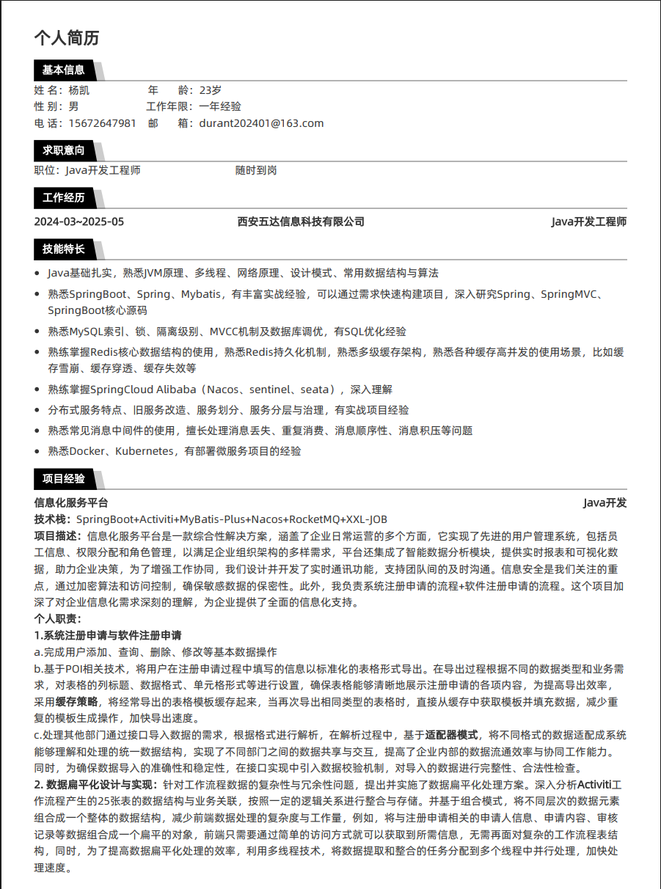
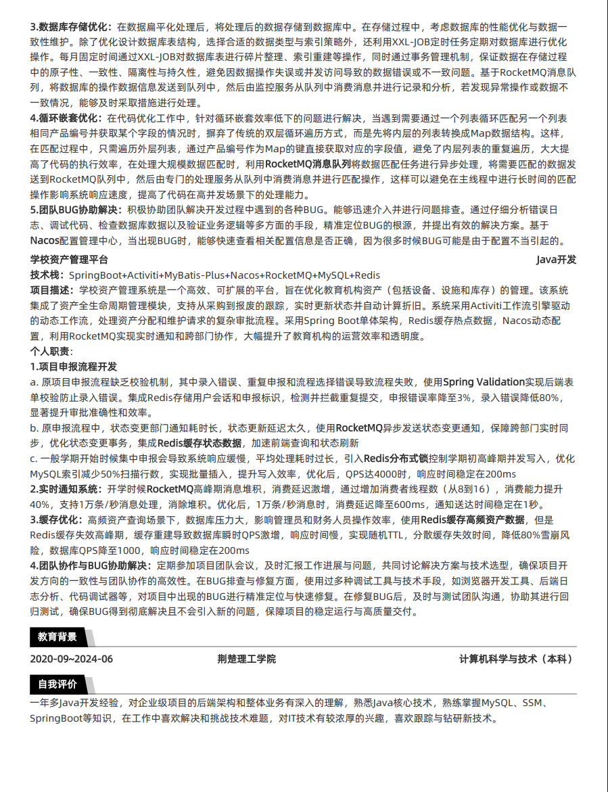

### 个人简历（第二版）
![[IMG-20250531215639504.png]]
![[IMG-20250531215719276.png]]
我询问，GrokAI解答：
1. 你先做一个简单的自我介绍
```java
我是一名Java后端开发工程师，拥有扎实的Java基础，熟悉JVM原理、多线程、网络编程、设计模式及常用数据结构与算法。熟练掌握Spring、SpringBoot、MyBatis等框架，以及SpringCloud Alibaba微服务技术，具备分布式事务、分布式锁等问题的解决经验。我精通MySQL和Redis，熟悉SQL优化、缓存机制及中间件如RocketMQ、Kafka的使用。在项目中，我参与过信息化服务平台和学校资产管理平台的开发，负责需求分析、架构设计、核心功能开发及系统优化，积累了丰富的实战经验。我注重代码质量，具备良好的沟通协作能力和抗压能力，能高效推进项目并解决复杂问题。
```
2. 简单介绍一下你的第一个项目（学校资产管理平台）以及你在项目中重点负责了哪些职责
```java
我的第一个项目是**学校资产管理平台**，这是一个为教育机构（高校）设计的资产管理平台，旨在优化设备、设施和库存等资产的全生命周期管理，支持从项目申请到验收的跟踪、状态实时更新及折旧自动计算，同时处理复杂的资产分配和维护审批流程。技术栈包括SpringBoot、Activiti、MyBatis-Plus、RocketMQ、XXL-JOB、MySQL和Redis。

我在项目中重点负责以下职责：
1. **需求分析与架构设计**：与产品和业务团队沟通，梳理业务关键点，参与系统基础架构搭建和数据库表设计。
2. **核心功能开发**：采用策略模式实现资产折旧计算的动态切换，使用自定义注解+反射动态检查项目金额合法性。
3. **性能优化**：通过分析慢SQL，优化表结构、添加联合索引及冗余存储，系统性能提升超30%。
4. **任务调度与数据一致性**：利用XXL-JOB实现定时任务（如数据同步、统计分析），通过乐观锁和唯一索引确保接口幂等，防止重复请求影响系统。
5. **日志与测试**：使用Spring AOP记录业务操作和异常日志，便于追溯和问题排查；完成单元测试和集成测试，确保系统稳定性。

通过这些工作，我为项目的顺利交付和系统的高效运行提供了重要支持。
```
3. 除此之外，你在这个项目里面还做了哪些事儿？
```java
在**学校资产管理平台**项目中，除了简历中提到的主要职责外，我还参与了以下工作：

1. **业务流程优化**：基于Activiti工作流引擎，设计并实现了资产分配和维护请求的复杂审批流程，优化了流程节点配置，支持动态调整审批链，减少了人工干预，提高了审批效率。
2. **数据同步与整合**：负责对接第三方系统（如财务系统），通过RocketMQ实现异步消息处理，确保资产数据与外部系统的数据同步，解决了跨系统数据一致性问题。
3. **异常处理与监控**：开发了全局异常处理机制，利用Spring AOP捕获和处理业务异常，统一返回格式化错误信息，提升用户体验；同时集成了监控工具（如Prometheus+Grafana），实时监控系统运行状态，及时发现并处理潜在性能瓶颈。
4. **文档维护与团队协作**：编写和维护了详细的API接口文档、技术设计文档和部署手册，确保团队成员和后续维护人员能快速上手；定期组织代码Review，提升团队代码质量。
5. **用户反馈迭代**：根据用户反馈，快速响应并修复线上问题，例如优化资产查询界面的响应速度，新增部分筛选条件，提升用户操作体验。

这些工作进一步保障了项目的稳定性和扩展性，同时提升了系统的用户友好性和开发效率
```
4. 你们是怎么协作开发的？
```java
在**学校资产管理平台**项目的协作开发中，我们团队采用了一套高效的协作流程和工具，确保开发过程顺畅、代码质量高且项目按时交付。以下是我们协作开发的具体方式：
1. **版本控制与代码管理**：
   - 使用 **Git** 进行版本控制，基于 **GitLab** 托管代码仓库。采用 **Git Flow** 工作流，主分支（main）用于生产环境，开发分支（develop）用于集成，功能开发使用 feature 分支，修复问题使用 hotfix 分支。
   - 每位开发人员在自己的 feature 分支上开发，完成后提交 Merge Request，由团队进行 **Code Review**，确保代码规范和质量，减少潜在 Bug。


2. **持续集成与部署**：
   - 使用 **Jenkins** 搭建持续集成（CI）流水线，代码提交后自动触发单元测试、代码扫描（如 SonarQube 检查代码质量）和构建。
   - 结合 **Docker** 容器化服务，部署到 **Kubernetes** 集群，实现服务的快速上线和弹性扩展。每次部署前都会进行集成测试，确保新功能不影响现有模块。
```
5. 你其中讲到了一个利用策略模式的业务场景？能详细讲讲吗？
```java
学校资产管理平台需要管理各种类型的资产（如设备、书籍、桌子椅子等），不同类型资产的折旧计算方式不同。
例如：
- **固定资产**（如电脑、桌椅）：采用**直线折旧法**，每年均匀分摊折旧额。
- **书籍**：采用**双倍余额递减法**，前期折旧较多，后期逐渐减少。
- **特殊设备**：可能根据使用频率或自定义规则计算折旧。
由于资产类型和折旧规则可能动态扩展，需要一个灵活、可扩展的设计来支持不同折旧策略，同时避免修改核心代码。

我的实现：
使用策略模式通过定义一组算法（折旧方法），将每种折旧算法封装为独立类，并通过统一接口调用，使算法可互换。
1. 定义了一个折旧策略接口
2. 具体的折旧策略，直接实现接口中的方法，规定折旧逻辑
3. 创建一个管理策略的类，用于动态的根据传入选择具体的传入策略，可以切换折旧策略
4. 业务使用的时候就根据传入的字符串，判断选择哪一种折旧逻辑计算

```
6. 好的，了解。那你后面说使用自定义注解+反射动态检查项目金额合法性，能详细说说业务场景吗？
```java
学校资产管理平台涉及资产的采购、折旧、维护等多个流程，这些流程中需要录入或计算各种金额字段。
例如：不同的金额有不同的规则
- **采购金额**：需要确保金额为正数，且符合预算范围（如不能超过某部门预算上限）。
- **折旧金额**：需验证计算结果是否符合特定规则（如不得超过资产原始价值）。
- **维护费用**：需检查是否在合理范围内（如不超过资产当前价值的某百分比）。
- 金额的合法性规则因资产类型或业务场景而异，且规则可能动态调整（如新增检查规则或修改阈值）。
为了避免在业务代码中硬编码大量校验逻辑，导致代码臃肿且难以维护，我设计了基于自定义注解+反射的动态校验机制，统一管理金额校验规则，提高代码的复用性和扩展性。

我的实现：
1. 创建了一个自定义注解，用于标记要校验的字段，包含属性有最大值、最小值、错误信息，类型等
2. 然后对相关资产的相关类，对需要校验的字段添加自定义注解
3. 反射机制：注入了一个核心校验工具类，业务方法会调用工具类传入具体的实体类，工具类就会利用反射遍历实体类上的属性，检查是否有自定义注解，根据自定义注解规定的类型，校验金额

```
7. 好的，了解。针对你这个项目，其中你们项目中定位慢SQL是采用什么方法？
```java
通过在在MySQL数据库中启用慢查询日志（Slow Query Log），通过设置 slow_query_log=ON 和 long_query_time（如设置为1秒）来记录执行时间超过阈值的SQL语句。
使用工具mysqldumpslow分析慢查询日志，定位查询耗时2s以上的。

针对慢查询优化方法：
对疑似慢SQL使用 EXPLAIN，重点关注 type（如 ALL 表示全表扫描）、rows（扫描行数）和 key（使用的索引）。

具体案例：
在项目中，我定位到一个慢SQL，涉及资产查询，是按照status进行资产查询，这个资产表数据量很大，当时status字段未建立索引，导致全表扫描，耗时2秒以上
```
8. 后面你使用了表结构优化、索引优化，还有冗余存储等方式提升了资产查询等SQL执行效率，这一块，你能详细讲讲你是当时做的一个什么业务场景吗？
```java
平台的一个核心功能是资产查询，用户（学校管理人员）需要根据多种条件（如资产类型、部门、状态、采购时间范围等）快速查询资产列表，并展示资产的详细信息（如资产编号、名称、当前价值、所在部门等）。由于资产表数据量较大（约500万条记录），且查询涉及多表关联（如资产表与部门表、折旧记录表），初始查询响应时间较长（平均2-3秒），尤其在高并发场景下（如学期末资产盘点），性能瓶颈明显，影响用户体验。

问题点：
1. 表数据量大，缺少合适索引，导致全表扫描
2. 多表关联，复杂度高
3. 高频率查询导致数据库负载高，响应时间进一步延长

表结构优化：
当时资产表的字段很多，大约在20个左右，但是资产查询只需要部分字段，每次查询都会加载全表字段，增加IO开销。联表查询时需要多次访问，影响性能。
优化方案：
将资产表字段划分，分为核心表和扩展表，其中核心表存储高频查询字段，扩展表存储低频字段。
并且将资产表按照申报年份进行分区，将历史数据和近期数据分开

索引优化：
原始查询中，status（状态）和 purchase_date（申报日期） 字段缺少索引，导致全表扫描。
优化方案：
1. 针对高频查询条件，状态和申报日期创建联合索引
2. 给查询字段添加覆盖索引，减少回表次数
使用 EXPLAIN 验证索引使用情况，确保查询命中联合索引，type 从 ALL 变为 range 或 ref，扫描行数显著减少。

冗余存储：
资产查询需要关联 department（部门） 表获取 dept_name（部门名称），以及 depreciation_record （折旧记录）表获取最新折旧金额。频繁的表连接增加了查询复杂度，尤其在高并发场景下，锁竞争和IO开销显著
优化方案：
1. 在资产基本表中添加冗余字段，存储部门名称和最新折旧的金额，减少连表操作

总结：
通过表结构优化（拆表+分区）、索引优化（联合索引+覆盖索引）和冗余存储（减少联表），我成功将资产查询的响应时间从2.5秒降至50ms，系统性能提升约98%，高并发场景下的QPS提升10倍。这不仅满足了用户对快速查询的需求，也为系统的扩展性和稳定性奠定了基础。
```
9. 你项目中说用到XXL-JOB实现业务模块的场景，能具体说说吗？
```java
学校资产管理平台需要定期执行一些后台任务，以支持资产全生命周期管理。其中一个核心需求是资产盘点和状态更新
具体包括：
- **数据同步**：定期从第三方系统（如财务系统）同步资产采购数据，确保资产信息与财务记录一致。
- **统计汇总分析**：每月生成资产统计报表，汇总各部门的资产总量、折旧金额和维护费用，为学校管理层提供决策支持。
- **学期末资产盘点**：在学期末（如6月和12月）对所有资产进行状态检查，更新资产状态（如从“使用中”变更为“报废”或“维修中”），并触发折旧计算。
- **批量任务加速**：由于资产数据量较大（约500万条），需要高效处理批量任务，避免影响系统实时查询性能。


以下以学期末资产盘点和状态更新为例，说明如何使用 XXL-JOB 实现该场景：
1. 在项目中部署了 XXL-JOB Admin（调度中心），用于管理任务、配置调度策略和监控任务执行状态。在 XXL-JOB Admin 界面添加任务，设置任务名称、调度类型、执行器、任务参数、分片策略
2. 实现任务执行器，处理盘点任务
3. 配置自定义线程池（ThreadPoolTaskExecutor），并结合 XXL-JOB 的分片机制，实现并发处理：
@Bean
public ThreadPoolTaskExecutor threadPoolTaskExecutor() {
    ThreadPoolTaskExecutor executor = new ThreadPoolTaskExecutor();
    executor.setCorePoolSize(10);
    executor.setMaxPoolSize(50);
    executor.setQueueCapacity(200);
    executor.setThreadNamePrefix("AssetInventory-");
    executor.initialize();
    return executor;
}
分片逻辑：通过 shardIndex 和 shardTotal，将资产数据按主键范围或部门分片，每片处理10万条记录，分配给多个执行器节点并行处理

数据同步：
通过 XXL-JOB 定时任务，从财务系统拉取资产采购数据，写入 asset_base（资产） 表

统计汇总：每月生成报表，汇总资产数据

XXL-JOB针对任务的可靠性保证：
- **失败重试**：在 XXL-JOB Admin 配置任务失败重试策略（如重试3次），确保任务因网络或数据库问题失败时能自动恢复。
- **日志记录**：通过 XxlJobHelper.log 记录任务执行日志，存储到 XXL-JOB 数据库，便于排查问题。
- **分布式锁**：为避免多节点重复执行同一任务（如数据同步），使用 Redis 分布式锁：
```
10. 好的了解，你的线程池参数是如何设计的？为什么这样设计？
```java
@Bean
public ThreadPoolTaskExecutor threadPoolTaskExecutor() {
    ThreadPoolTaskExecutor executor = new ThreadPoolTaskExecutor();
    executor.setCorePoolSize(10); // 核心线程数
    executor.setMaxPoolSize(50);  // 最大线程数
    executor.setQueueCapacity(200); // 队列容量
    executor.setKeepAliveSeconds(60); // 空闲线程存活时间
    executor.setThreadNamePrefix("AssetInventory-"); // 线程名称前缀
    executor.setRejectedExecutionHandler(new ThreadPoolExecutor.CallerRunsPolicy()); // 拒绝策略
    executor.initialize();
    return executor;
}

设计原因：
1. 业务场景需要：属于 CPU密集型 和 IO密集型 混合任务。CPU密集：状态检查和折旧计算涉及逻辑运算。IO密集：数据库查询和更新操作涉及网络和磁盘IO。
2. 核心线程数选择：生产环境服务器为8核16GB配置，核心线程数设置为10，略高于CPU核心数（8），充分利用CPU资源，同时避免过度竞争。资产盘点任务通过 XXL-JOB 分片，单节点通常处理2-3个分片，10个核心线程可并行处理多个分片的任务块，减少线程切换开销。
3. 最大线程数选择：在高负载场景（如学期末盘点涉及全量数据），任务量可能激增，50个线程可应对突发任务需求。
4. 队列容量选择：资产盘点任务分片后，单节点可能接收多个子任务，200的队列容量可缓冲短时间内的高并发任务，防止任务被拒绝。
5. 空闲线程的存活时间：60秒后回收空闲线程，释放内存和CPU资源，适合任务执行周期较短的场景。
6. 拒绝策略选择：CallerRunsPolicy（调用者运行策略） 确保任务不会被丢弃，当线程池和队列满时，由调用线程执行任务，降低系统压力
```
11. 你详细说一下你的接口幂等是如何处理的
```java
场景描述：
- **资产录入接口**：用户通过前端提交资产采购信息（如资产名称、采购金额、部门等），创建资产记录。由于网络抖动或用户重复点击，可能会导致同一资产被多次提交，造成重复记录。
- **资产状态更新接口**：在资产盘点或维护流程中，更新资产状态（如从“使用中”变更为“报废”）。并发请求可能导致状态被错误覆盖。


实现：
我采用了以下两种主要方法来实现接口幂等性，并结合 Redis 分布式锁增强并发控制：
1. 唯一索引实现幂等性，适用场景：资产录入接口，确保同一资产不会重复创建。
具体实现：
在数据库资产表中针对资产编号设置唯一索引，防止重复插入，就算出现幂等，多余的也无法插入。

2. 乐观锁实现幂等。适用场景：资产状态更新接口，确保并发更新不会导致数据不一致。
具体实现：
在资产表中添加一个version乐观锁版本字段，每次更新检查版本号，在where条件中检查version，仅当版本号匹配时才执行更新，并将 version 自增。如果更新失败（受影响行数为0），说明数据已被其他请求修改，抛出异常或重试。

Redis分布式增加幂等性：在分布式系统中，资产录入或更新接口可能由多个服务节点处理，需要全局唯一的幂等控制。
实现步骤：
1. 为每个请求生成唯一标识（如基于请求参数的 MD5 哈希），存储在 Redis 中，用于判断请求是否重复。
2. 分布式锁：使用 Redis 分布式锁，确保同一请求在分布式环境中只被处理一次。

```
12. 你说使用AOP切面记录记录日志，具体说说？
```java
业务场景：
- **业务操作日志**：需要记录用户在平台上的关键操作，例如资产录入、状态更新、审批流程提交等，以便后续追溯用户行为（如谁在何时创建了某资产）或审计需求（如检查操作合规性）。
- **系统异常日志**：当接口或任务发生异常（如数据库操作失败、幂等性校验失败），需要记录详细的异常信息（包括请求参数、堆栈信息等），便于快速定位问题。

实现步骤：
1. 定义一个日志实体类，记录日志信息
2. 创建一个自定义注解，用于标记方法
3. 定义切面类，拦截带有自定义注解的方法，记录操作日志和异常日志
4. 日志持久化，并且为了防止日志的存储影响接口时间，才有@Async 注解异步保存日志
```
13. 你的项目中设计到金额，金额是如何存储的，为什么要这么存储？
```java
使用 DECIMAL(10,2) 存储金额，表示总长度10位，小数点后保留2位，足以覆盖资产管理中的金额需求（最大支持99999999.99）
在 Java 中使用 BigDecimal 类型映射 DECIMAL 字段，确保高精度计算。
```
14. 你能描述一下你的另外一个项目，并介绍自己的重点负责哪些职责？
```java
我的另一个项目是信息化服务平台，这是一个综合性企业管理平台，旨在支持企业的日常运营，包括用户管理、权限分配、角色管理、智能数据分析、实时通讯和数据安全保障。以下是项目概述及我在项目中的重点职责的详细描述。
信息化服务平台为企业提供一站式解决方案，涵盖以下核心功能：
- **用户管理系统**：支持员工信息管理、权限分配和动态角色管理，满足复杂组织架构需求。
- **智能数据分析模块**：提供实时报表和可视化数据，支持企业决策。
- **实时通讯功能**：实现团队间即时沟通，提升协作效率。
- **信息安全**：通过AES加密和基于RBAC的细粒度权限控制，保障敏感数据安全。

我在项目中作为后端开发工程师，负责需求分析、技术设计、核心功能开发和系统优化，具体职责如下：
需求调研和技术设计：
- 参与项目前期需求调研，与产品经理和业务团队沟通，梳理用户管理、数据分析和实时通讯等模块的需求。
- 完成数据库表设计（如用户表、权限表、报表数据表），编写技术文档（如接口设计、架构设计）。
- 评估工作量，制定开发计划，确保功能按时交付


系统优化与安全
实现基于RBAC的细粒度权限管理，支持动态调整权限，确保敏感操作（如报表导出、数据修改）受控。
- **数据加密**：所有敏感数据（如用户密码、财务数据）采用AES对称加密存储，保障数据安全。
- **多级缓存架构**：设计本地缓存（Caffeine）+ Redis 集群，缓存热点数据（如导出模板、数据字典），提升系统响应速度。
- **分布式锁**：基于Redis实现分布式锁，解决并发审批流程的数据一致性问题。
- **数据分库分表**：处理海量数据（如报表数据），单表数据量控制在500万以内。

监控部署：
- 使用 **Docker** 容器化服务，结合 **Jenkins** 实现持续集成，自动化构建、测试和部署。
- 通过日志监控和在线诊断工具（如 **Arthas**），排查线上问题（如OOM、CPU打满、Load飙高）。


核心功能开发和职责：
- 开发用户管理、权限分配、数据分析和实时通讯模块的核心功能。
- 使用 Activiti 实现审批流程，支持动态配置流程节点。
- 优化报表生成性能，通过分库分表和多级缓存提升响应速度。
```
15. 你详细解释一下你们的权限控制是如何实现的？AES是什么？当时使用AES是为了什么？
```java
信息化服务平台需要支持复杂的组织架构（如多部门、多角色），并对不同用户分配不同的权限
- **普通员工**：只能查看自己的个人信息和部门资产。
- **部门管理员**：可管理本部门的资产、报表和审批流程。
- **系统管理员**：拥有所有模块的完全权限，包括用户管理和权限分配。

RBAC 模型通过用户、角色和权限三者之间的关系实现访问控制：
- **用户（User）**：系统中的操作主体（如员工、管理员）。
- **角色（Role）**：一组权限的集合，代表用户职责（如“部门管理员”）。
- **权限（Permission）**：对特定资源（如报表、用户数据）的操作权限（如读、写）。

实现：我通过 Spring Security 结合自定义逻辑实现权限校验
- 使用 Spring Security 进行用户登录认证，基于用户名和密码验证。
- 登录成功后，将用户信息（包括角色和权限）加载到 Spring Security 上下文中：
- 权限控制：注解方式：使用 Spring Security 的 @PreAuthorize 注解，在接口上定义权限要求：


AES是高级加密标准，是一种对称加密算法，广泛用于数据加密，具有以下特点：
- **对称加密**：加密和解密使用相同的密钥。
- **安全性**：支持128位、192位或256位密钥长度，安全性高，广泛用于金融、医疗等高安全场景。
- **高效性**：加密和解密速度快，适合大数据量场景。
- **标准性**：被 NIST（美国国家标准与技术研究院）认定为标准加密算法，广泛应用于 HTTPS、数据库加密等。
我选择 AES 加密敏感数据的理由如下：
平台存储敏感数据（如用户密码、财务数据、报表数据），需防止数据泄露或未授权访问。
项目需满足企业数据安全规范（如 GDPR 或内部审计要求），敏感数据必须加密存储。

项目中实现：开发 AesUtil 工具类，封装加密解密逻辑。

我主要将 AES 用于以下场景：
- **用户密码加密**：用户密码在存储到数据库前使用 AES 加密。
- **财务数据加密**：如采购金额、报表数据，存储时加密，查询时解密。
- **数据传输**：实时通讯模块中，敏感消息内容通过 AES 加密传输。
```
16. 你使用适配器模式解决上面问题，能详细说说吗？
```java
业务场景：
信息化服务平台需要与多个第三方系统对接，同步用户数据（如员工信息、部门信息）到平台数据库，以支持用户管理、权限分配等功能。不同第三方系统返回的数据格式各异，有JSON、XML，内部系统使用UserDTO对象
问题：
- **格式不一致**：不同系统的数据字段名、数据类型、结构（如 JSON vs XML）差异较大，直接处理会导致代码冗余和耦合。
- **扩展性需求**：未来可能对接更多第三方系统（如CRM系统），需支持新格式的快速接入。
- **一致性要求**：同步后的数据需转换为平台统一格式，存储到数据库，确保用户管理模块的正常运行。
- **性能要求**：数据同步是高频操作，需保证转换效率，特别是在批量同步场景。

实现：
适配器模式通过定义一个统一的接口，将不兼容的接口（如第三方系统的格式）适配为目标接口（如平台的 UserDTO）。我设计了以下结构：
- **目标接口**：UserDataAdapter，定义统一的转换方法。
- **适配者**：HR系统、财务系统的数据对象（如 HrEmployee, FinanceEmployee）。
- **适配器**：为每种第三方系统实现一个适配器类，将其数据转换为 UserDTO。
目标接口：
public interface UserDataAdapter {
    UserDTO convertToUserDTO(Object source) throws Exception;
}
适配者：
public class HrEmployee {
    private String empId;
    private String empName;
    private String deptCode;
    // Getters and Setters
}
public class FinanceEmployee {
    private String employeeID;
    private String fullName;
    private String departmentId;
    // Getters and Setters
}
适配器：
@Component
public class HrUserDataAdapter implements UserDataAdapter {
    @Override
    public UserDTO convertToUserDTO(Object source) throws Exception {
        if (!(source instanceof HrEmployee)) {
            throw new IllegalArgumentException("Source must be HrEmployee");
        }
        HrEmployee hrEmployee = (HrEmployee) source;
        UserDTO userDTO = new UserDTO();
        userDTO.setUserId(hrEmployee.getEmpId());
        userDTO.setUsername(hrEmployee.getEmpName());
        userDTO.setDeptId(hrEmployee.getDeptCode());
        return userDTO;
    }
}
@Component
public class FinanceUserDataAdapter implements UserDataAdapter {
    @Override
    public UserDTO convertToUserDTO(Object source) throws Exception {
        if (!(source instanceof FinanceEmployee)) {
            throw new IllegalArgumentException("Source must be FinanceEmployee");
        }
        FinanceEmployee financeEmployee = (FinanceEmployee) source;
        UserDTO userDTO = new UserDTO();
        userDTO.setUserId(financeEmployee.getEmployeeID());
        userDTO.setUsername(financeEmployee.getFullName());
        userDTO.setDeptId(financeEmployee.getDepartmentId());
        return userDTO;
    }
}
适配器工厂：为了动态选择适配器，我实现了一个工厂类，根据数据来源选择对应的适配器
@Component
public class UserDataAdapterFactory {
    @Autowired
    private List<UserDataAdapter> adapters;

    public UserDataAdapter getAdapter(String sourceType) {
        return adapters.stream()
            .filter(adapter -> adapter.getClass().getSimpleName().toLowerCase().contains(sourceType.toLowerCase()))
            .findFirst()
            .orElseThrow(() -> new IllegalArgumentException("No adapter found for source: " + sourceType));
    }
}
```
17. 多级缓存架构能详细说说吗？本地缓存你们项目中有的什么实现？
```java
在信息化服务平台项目中，我设计并实现了多级缓存架构，以提升系统响应速度，特别是在高频查询场景（如报表查询、数据字典获取、导出模板加载）中
信息化服务平台涉及多个高频查询场景，例如：
- **报表查询**：用户频繁查询部门资产报表、财务报表，涉及大量数据聚合和多表联查。
- **数据字典**：系统需要加载数据字典（如资产类型、部门列表）供下拉框或校验使用。
- **导出模板**：用户导出报表时需加载固定的模板配置（如Excel模板）。
- **实时通讯**：用户权限和配置信息需快速获取以支持即时消息推送。

多级缓存架构结合了**本地缓存**和**分布式缓存（Redis 集群）**，以分层方式处理数据查询：
- **第一级：本地缓存**（Caffeine）：
    - 部署在应用节点内存中，存储热点数据（如数据字典、模板配置）。
    - 特点：访问速度极快（<1ms），无需网络开销，适合高频、小体积数据。
    - 缺点：节点间数据不共享，可能存在一致性问题，适合更新频率低的数据。
- **第二级：分布式缓存**（Redis 集群）：
    - 存储共享数据（如用户权限、报表数据），支持多节点访问。
    - 特点：高可用，支持分布式一致性，适合高并发场景。
    - 缺点：网络延迟（约1-5ms），相比本地缓存稍慢。
- **第三级：数据库**（MySQL）：
    - 作为数据源，仅在缓存未命中时查询。
    - 特点：数据持久化，但查询耗时较长（10-100ms）。
实现流程：
- 客户端请求到达，优先查询本地缓存（Caffeine）。
- 若本地缓存未命中，查询 Redis 集群。
- 若 Redis 未命中，查询 MySQL 数据库，并将结果回写到 Redis 和本地缓存。
- 缓存失效或更新时，通过 RocketMQ 异步通知各节点刷新本地缓存。

Caffeine配置：
通过 @Bean 配置 Caffeine 缓存：
@Configuration
public class CacheConfig {
    @Bean
    public CacheManager cacheManager() {
        CaffeineCacheManager cacheManager = new CaffeineCacheManager();
        cacheManager.setCaffeine(caffeineConfig());
        return cacheManager;
    }

    private Caffeine<Object, Object> caffeineConfig() {
        return Caffeine.newBuilder()
            .expireAfterWrite(10, TimeUnit.MINUTES) // 10分钟过期
            .maximumSize(1000) // 最大缓存1000条
            .recordStats() // 开启统计，用于监控命中率
            .build();
    }
}

通过注解 @Cacheable 自动使用 Caffeine 缓存
@Service
public class DictService {
    @Autowired
    private DictMapper dictMapper;

    @Cacheable(value = "dictCache", key = "#type")
    public List<Dict> getDictByType(String type) {
        return dictMapper.findByType(type);
    }
}

本地缓存更新：
当数据字典或模板更新时，通过 RocketMQ 广播消息，通知所有节点刷新本地缓存：
或者等待本地缓存自动过期，触发重新加载
在高并发更新场景，使用 Redis 分布式锁防止缓存击穿
```
18. 能详细说说你的分布式锁确保并发审批流程的一致性如何实现吗？
```java
在高并发场景下（如学期末批量资产采购），多个用户或服务节点可能同时操作同一审批任务，导致数据不一致。例如：
- 两个审批人同时审批同一任务，可能导致状态被覆盖（如一个同意、一个驳回）。
- 并发提交审批请求可能导致重复创建任务或资源分配错误。

分布式环境：服务部署在多个节点上，需确保跨节点的锁机制一致性。

我使用 Redis 作为分布式锁的存储介质，基于 SETNX（Set if Not Exists）命令实现锁的获取和释放，结合过期时间和 Lua 脚本确保锁的可靠性和原子性。以下是具体实现步骤：
分布式锁设计：
锁标识：为每个审批任务生成唯一锁键
**锁机制**：
- 使用 Redis 的 SETNX 命令尝试获取锁，仅当键不存在时设置成功。
- 设置锁的过期时间（TTL，如10秒），防止因异常未释放导致死锁。
- 释放锁时，检查锁的持有者（通过存储唯一标识），避免误释放其他线程的锁。
**一致性保障**：通过 Lua 脚本确保释放锁的原子性。
**重试机制**：若获取锁失败，采用指数退避重试策略，降低竞争压力。


为什么不选择其他方案：
- **数据库悲观锁**：如 SELECT ... FOR UPDATE，会增加数据库压力，锁等待时间长（10-100ms），不适合高并发。
- **Zookeeper**：虽然可靠，但配置和维护成本高，锁获取耗时（10ms+）高于 Redis。
- **本地锁**：如 ReentrantLock，仅限单节点，无法支持分布式环境。
```
19. 详细讲讲你的RocketMQ的数据匹配业务解耦实现。还有你的分库分表在项目中是如何实现的？
```java
信息化服务平台需要与多个第三方系统（如HR系统、财务系统、CRM系统）同步用户数据、部门信息和财务数据，用于用户管理、权限分配和报表生成。数据同步涉及以下需求：
- **异步处理**：数据同步是高频操作（每日数万条），需异步处理以避免阻塞主业务流程。
- **格式转换**：第三方系统数据格式各异（如JSON、XML），需转换为平台统一格式（如UserDTO）。
- **一致性要求**：同步数据必须准确存储到数据库，防止重复或遗漏。
- **扩展性**：未来可能对接更多系统，需支持新数据源的快速接入。
- **可靠性**：需处理消息丢失、重复消费或系统故障等异常情况。

问题：
- 直接调用第三方接口会导致服务耦合，维护成本高。
- 高并发同步可能导致数据库压力过大，需异步解耦。
- 需确保消息的可靠传递和消费顺序（如用户数据先同步再分配权限）。

**解耦性**：
- RocketMQ 将数据拉取和处理分离，生产者（拉取数据）与消费者（处理数据）松耦合，降低系统复杂度。
- 适配器模式进一步解耦了数据格式转换逻辑。
**异步处理**：
- 异步消息处理避免了同步调用第三方接口的阻塞，提升系统响应速度。
- 消费者可分布式部署，扩展处理能力。


我使用了 Sharding-JDBC（现为 Apache ShardingSphere）实现分库分表，结合 MySQL 数据库。以下是具体实现：
- **分库**：按部门（dept_id）分库，分为4个库（db0, db1, db2, db3），通过 dept_id % 4 路由。
- **分表**：每个库内的 report_data 表按年份（year）分表，如 report_data_2023, report_data_2024。

实现：
在 SpringBoot 项目中配置 Sharding-JDBC，定义分库分表规则

效果：
- **性能**：报表查询响应时间从1秒降至50ms，QPS 从50提升至1000。
- **扩展性**：单表数据量控制在500万，新增年份表只需修改配置。
- **一致性**：Seata 和唯一索引确保数据一致，同步和查询无错误。
- **可维护性**：Sharding-JDBC 透明化分片逻辑，开发效率高。
```
20. 你项目中的docker+jenkins的工作流程是什么？
```java
整个 CI/CD 流程分为以下阶段：
1. **代码提交**：开发人员推送代码到 Git 仓库（如 GitLab）。
2. *。*Jenkins 触发构建**：Jenkins 检测到代码变更，触发 Pipeline。
3. **代码编译与测试**：执行 Maven 编译、单元测试和静态代码检查
4. **Docker 镜像构建**：基于 Dockerfile 打包服务为 Docker 镜像。
5. **镜像推送**：将镜像推送到私有 Docker 仓库（如 Harbor）。
6. **容器部署**：通过 SSH 或 Kubernetes 部署镜像到目标服务器。
7. **监控与通知**：部署结果通过邮件或企业微信通知，失败时报警。


- **GitLab 配置**：
    - 项目代码托管在 GitLab，分支策略包括 dev（开发）、test（测试）、master（生产）。
    - 配置 Webhook，代码推送时通知 Jenkins 触发构建。
- **Jenkins 配置**：
    - 安装 Git 插件和 GitLab 插件，配置 GitLab 访问令牌。
    - 在 Jenkins 项目中指定 Git 仓库 URL 和分支（如 refs/heads/dev）。
```
21. 你这个项目是单体架构吗？是使用docker部署还是k8s部署？为什么？
```java
- **架构**：信息化服务平台采用分布式微服务架构，而非单体架构，通过模块化设计和分布式技术（如 Nacos、Seata、RocketMQ）满足高并发和复杂业务需求。
- **部署**：初期使用 Docker + SSH 部署，快速验证功能；后期迁移到 Kubernetes，实现高可用、自动伸缩和零停机部署。
- **原因**：Docker 确保环境一致性，Kubernetes 提供高可用和自动化运维能力，结合微服务架构支持系统扩展和性能优化。

这一设计将部署耗时从30分钟缩短至10秒，服务可用性达99.9%，显著提升了开发效率和系统稳定性，为信息化服务平台的快速迭代和高并发运行提供了坚实保障。
```
22. 那你另外一个学校资产项目呢？
```java
- **架构**：学校资产管理系统采用分布式微服务架构，而非单体架构，通过模块化设计、Nacos 服务发现、RocketMQ 解耦和 Sharding-JDBC 分库分表，满足高并发、复杂业务和多租户需求。
- **部署**：初期使用 Docker + SSH 快速验证，后期迁移到 Kubernetes，支持高可用、自动伸缩和零停机部署。
- **原因**：Docker 确保环境一致性，Kubernetes 提供自动化运维和高并发支持，结合微服务架构满足资产管理的性能和扩展性要求。

与信息化服务平台类似，学校资产管理系统的微服务和 Kubernetes 部署方案将部署耗时缩短至10秒，服务可用性达99.9%，查询性能提升20倍，为学校资产的高效管理提供了稳定支持。如果您指的不是这个项目，请提供更多细节，我会进一步调整回答。
```
23. 信息化项目中使用的什么日志监控和在线诊断工具，怎么解决的问题？
```java
在信息化服务平台项目中，我使用了 ELK Stack（Elasticsearch + Logstash + Kibana） 作为日志监控系统，并结合 Arthas 作为在线诊断工具，解决了系统运行中的性能瓶颈、异常排查和问题定位等关键问题。

ELK Stack 是日志收集、存储和可视化的强大组合，具体组件如下：
- **Elasticsearch**：分布式搜索引擎，存储和索引日志数据，支持快速全文搜索。
- **Logstash**：日志收集和处理管道，将日志从应用传输到 Elasticsearch。
- **Kibana**：可视化平台，提供日志查询、分析和仪表盘展示。

ELK 使用场景与解决的问题
**场景 1：接口异常排查**：
- **问题**：用户反馈创建用户接口偶尔失败，返回“系统错误”。
- **解决**：
    - 在 Kibana 中搜索 operation:CREATE_USER AND status:FAIL，定位错误日志。
    - 发现异常原因是数据库唯一索引冲突（username 已存在）。
    - 添加前置校验，防止重复用户名，提升接口成功率至99.9%。
- **效果**：异常定位时间从1小时降至5分钟。


Arthas 是一个开源的 Java 在线诊断工具，支持热修复、性能分析、线程诊断等功能，适合在线排查生产环境问题。
**场景 2：慢查询定位**：
- **问题**：用户管理接口响应时间超500ms。
- **解决**：
    - 使用 trace 命令跟踪方法调用：
        `trace com.example.service.UserService getUserById`
    - 发现 getUserById 方法的数据库查询耗时长，SQL 未使用索引。
    - 添加索引（INDEX idx_user_id(user_id)），并缓存用户数据到 Redis。
- **effect**：接口响应时间从500ms降至20ms。
```
24. 介绍两个项目你分别负责哪些模块？你根据我的简历可以编，伪造一下我的负责的模块
```java
- **用户管理与权限控制模块**
    - **具体工作**：
        - 与业务团队沟通，收集用户管理需求（如员工信息字段、权限分配规则），整理成需求文档，基于RBAC模型设计权限体系。
        - 设计数据库表（如user_info、role_info、permission_info），定义字段（如用户ID、角色ID、权限规则）并建立关联关系，支持动态权限调整。
        - 编写技术文档，描述表结构、接口设计和权限校验逻辑。
        - 使用SpringBoot和MyBatis-Plus开发用户管理接口（如用户增删改查、角色分配），并通过Spring Security实现认证和授权。
        - 迭代优化权限分配功能，支持批量操作，提升用户体验。
- **审批流程管理模块**
    - **具体工作**：
        - 参与审批流程需求的调研，梳理企业常见的审批场景（如请假、报销），使用Activiti的BPMN 2.0定义流程图。
        - 设计审批相关表（如approval_task、process_instance），记录流程实例和任务状态。
        - 编写技术文档，描述工作流配置和接口调用逻辑。
        - 开发审批接口，集成Activiti引擎，支持动态路由和多级审批。
        - 优化审批流程，添加条件网关（如金额阈值触发不同审批人），提高流程灵活性。


- **资产全生命周期管理模块**  
    **功能**：该模块覆盖了资产从申请、采购、分配到报废的全生命周期管理，支持实时状态更新和自动折旧计算。  
    **我的贡献**：
    - 我使用SpringBoot和Activiti工作流引擎，设计并实现了资产申请到验收的审批流程，基于BPMN 2.0定义了灵活的工作流规则。
    - 我采用了策略模式，实现了资产折旧计算的动态切换（如直线折旧法、年限平均法），支持不同资产类型的折旧需求。
    - 为了防止重复提交导致的数据错误，我通过乐观锁和唯一索引实现了接口幂等性，确保数据一致性。
    - 我还通过Spring AOP实现了操作日志的统一记录，便于后续审计和问题追溯。
- **数据查询与统计模块**  
    **功能**：该模块支持资产的快速查询、统计汇总和盘点功能，提供了资产状态、分配情况和折旧数据的实时统计。  
    **我的贡献**：
    - 我分析并优化了慢SQL问题，通过添加联合索引和冗余字段，资产查询性能提升了30%以上。
    - 我使用XXL-JOB实现了定时任务，如资产数据同步和学期末的盘点任务，并通过自定义线程池加速了批量状态更新，处理效率提升了约40%。
    - 我开发了动态查询接口，支持多条件组合查询（如资产类型、状态、使用部门），并通过Redis缓存热点查询结果，减少数据库压力。
    - 我还设计了数据导出功能，支持将统计结果导出为Excel，基于Minio存储导出文件，确保大文件处理的高效性。
- **审批流程管理模块**（扩展部分）  
    **功能**：该模块处理资产分配和维护请求的复杂审批流程，支持多级审批和动态路由。  
    **我的贡献**：
    - 我基于Activiti实现了多级审批流程，设计了动态路由规则，支持根据资产价值或类型自动分配审批人。
    - 我通过自定义注解和反射机制，实现了审批金额的合法性校验，防止异常数据流入系统。
    - 我集成了RocketMQ，异步处理审批通知（如邮件、站内信），提高了审批效率。
    - 我还通过Docker容器化了审批服务，结合Jenkins实现了自动化部署，缩短了上线周期。
```
25. 资产全生命周期流程整个流程是什么样子的？其中你设计哪些表？
```java
资产全生命周期管理模块的目标是跟踪和管理学校资产（设备、设施、库存等）从申请到报废的整个过程，确保资产状态实时更新、审批流程高效、数据一致性可靠。基于项目需求和Activiti工作流引擎，以下是资产全生命周期的完整流程：
资产全生命周期流程通过申请、采购、入库、分配、维护、折旧、盘点和报废八个阶段实现了资产的全面管理。
1. **资产申请**：
    - 部门或个人通过系统提交资产采购申请，填写资产类型（如设备、家具）、数量、预算等信息。
    - 系统自动触发审批流程，基于Activiti工作流引擎，按照预定义规则（例如资产金额或类型）分配审批人（如部门主管、财务负责人）。
    - 审批通过后，生成采购任务，进入采购阶段。
2. **资产采购**：
    - 采购部门根据批准的申请执行采购，录入供应商信息、采购单号和实际金额。
    - 系统支持动态校验采购金额（通过自定义注解+反射机制），确保金额合法且符合预算。
3. **资产入库与验收**：
    - 采购完成后，资产入库，录入资产编号、型号、购置日期等信息。
    - 验收人员通过系统进行验收，确认资产状态（如完好、损坏），并更新资产状态为“可用”。
4. **资产分配与使用**：
    - 资产分配给具体部门或个人，记录使用人、归属部门和分配时间。
    - 系统支持资产调拨（跨部门转移）或借用，自动触发审批流程，确保操作合规。
5. **资产维护**：
    - 如果资产需要维修或维护，用户提交维护请求，系统生成维护工单并触发审批。
    - 维护完成后，更新资产状态和维护记录。
6. **资产折旧**：
    - 系统通过XXL-JOB定时任务，定期计算资产折旧（支持策略模式切换折旧算法，如直线折旧法或年限平均法）。
    - 折旧数据实时更新，供财务部门参考。
7. **资产盘点**：
    - 学期末或特定时间，系统通过XXL-JOB触发盘点任务，批量校验资产状态（如在用、丢失、报废）。
    - 使用自定义线程池加速盘点数据处理，确保效率。
8. **资产报废**：
    - 达到报废条件的资产（如折旧完成或损坏无法修复）由用户提交报废申请。
    - 审批通过后，资产状态更新为“报废”，归档至历史记录。

整个流程通过Activiti工作流引擎实现动态路由和审批，确保灵活性和可追溯性。我还使用了RocketMQ异步处理通知（如审批结果推送），并通过乐观锁和唯一索引保证接口幂等性，防止重复操作导致数据不一致。

数据库表：
asset_info（资产信息表），存储资产的基本信息和状态，支撑资产全生命周期管理。
asset_application（资产申请表），记录资产采购、调拨或报废的申请信息，关联审批流程。
asset_maintenance（资产维护表）,记录资产的维护和维修请求，跟踪维护历史。
asset_depreciation（资产折旧表）,记录资产的折旧历史，支撑折旧计算和财务统计。
operation_log（操作日志表），通过Spring AOP记录用户操作和系统异常，便于审计和问题追溯。
```
26. 资产全生命周期流程每个阶段都有独立的流程图，这些流程图要经过哪些节点，比如谁谁审批，哪个部门审批，才把这个事情给定下来
```java
资产全生命周期包括以下八个阶段：资产申请、资产采购、资产入库与验收、资产分配与使用、资产维护、资产折旧、资产盘点和资产报废。每个阶段的流程图通过Activiti的BPMN 2.0定义，包含用户任务节点（User Task）、自动任务节点（Service Task）和条件网关（Gateway）等，确保流程高效且可控。我会重点描述每个阶段的流程图和涉及的节点。

资产申请阶段
系统通过自定义注解+反射机制（简历中提到）校验申请金额合法性（例如是否超出部门预算）。
流程图描述：此阶段处理部门或个人提交的资产采购申请，涉及多级审批以确保预算和需求的合理性。
定下来方式：申请需通过部门主管、财务部门审批（高金额需额外学校领导审批）。审批通过后，生成采购任务，流程结束。

资产采购阶段
系统校验实际采购金额是否符合申请预算（通过自定义注解+反射）。
流程图描述：采购部门根据批准的申请执行采购，涉及供应商选择和采购确认。
定下来方式：采购人员录入信息后，财务部门确认采购合规，系统自动更新状态，完成采购流程。

资产入库与验收阶段
流程图描述：资产采购完成后入库并验收，确保资产状态准确。
定下来方式：入库人员录入信息，验收人员确认资产状态，系统自动更新资产记录，完成入库与验收。

资产分配与使用阶段
流程图描述：将资产分配给部门或个人，支持调拨或借用。
定下来方式：部门主管和资产管理员审批通过，系统更新资产归属信息，完成分配。

资产维护阶段
流程图描述：处理资产维修或保养请求，记录维护历史。
定下来方式：资产管理员审批通过，维护人员完成操作，系统更新记录，完成维护流程。

资产折旧阶段
流程图描述：通过定时任务自动计算资产折旧，无需人工审批。
定下来方式：系统自动完成，无需人工干预，折旧数据直接更新。

资产盘点阶段
流程图描述：定期盘点资产状态，批量校验资产信息。
定下来方式：资产管理员和部门负责人确认盘点结果，系统更新资产状态。

资产报废阶段
流程图描述：处理资产报废申请，确保合规归档。
定下来方式：资产管理员和财务部门审批通过，系统完成归档。
```
27. 信息化服务平台所以你是负责三个模块的开发吗？每个模块你负责包含哪些功能，每个功能的解释一下？
```java
我在“信息化服务平台”项目中负责了**用户管理与权限控制**、**实时通讯**和**智能数据分析**三个模块的开发。每个模块包含三个核心功能：

- 用户管理模块：员工信息管理、角色与权限分配、动态权限管理，确保用户数据安全和访问控制灵活。
- 实时通讯模块：即时消息推送、在线状态管理、历史消息查询，提升团队协作效率和通讯安全。
- 智能数据分析模块：实时报表生成、数据可视化、数据导出，助力企业数据驱动决策。
```
28. 那你详细介绍你这个系统是怎么工作的，这个系统的目的是干什么？结合你的参与你认为这个系统全部的流程应该是怎么样的工作的
```java
“信息化服务平台”是一个综合性企业级解决方案，旨在通过数字化手段优化企业日常运营，提升管理效率、协作能力和数据驱动决策能力。其核心目的包括：
1. **统一用户管理**：通过集中的用户管理和RBAC权限控制，满足企业多样化的组织架构需求，确保数据访问安全。
2. **增强工作协同**：通过实时通讯功能，支持团队间高效沟通，减少信息孤岛。
3. **数据驱动决策**：通过智能数据分析模块，提供实时报表和可视化数据，助力管理层快速制定决策。
4. **保障信息安全**：通过加密算法和访问控制，保护企业敏感数据，防止泄露。
5. **提高运营效率**：通过自动化审批流程、定时任务和持续集成，简化业务流程，缩短响应和交付时间。


```
29. 技术栈知道了，系统目的也知道，那么你认为系统分为哪几种角色？每个角色可以用这个系统哪些事情？
```java
系统的角色设计基于企业运营需求，权限通过RBAC模型动态分配，存储在role_info和permission_info表中，结合Redis缓存热点权限数据（我设计的多级缓存架构）。

我认为系统可以分为以下五种主要角色：普通员工、部门主管、财务审批人、系统管理员。每个角色根据其权限，可以使用系统执行特定功能，涵盖用户管理、实时通讯、数据分析和审批流程等模块。

普通员工：普通员工是企业的基层用户，通常是使用系统完成日常工作的员工（如市场、销售、行政人员等），拥有基础权限。
管理个人信息、发起审批请求、实时通讯、查看基础报表

部门主管：部门主管是管理特定部门（如市场部、研发部）的负责人，拥有比普通员工更高的权限，可以审批下属请求并查看部门级数据。
管理部门员工信息、管理部门员工信息、实时协作与沟通、查看部门报表

财务审批人：财务审批人是负责财务相关审批的角色（如财务部门负责人），拥有审批高金额请求和查看财务数据的权限。
审批财务相关请求、查看财务报表、实时沟通

系统管理员：系统管理员是负责系统配置和维护的角色，拥有最高权限，可以管理所有数据和流程，保障系统稳定运行。
管理系统用户与权限、配置审批流程、监控与运维、查看所有报表
```

**GrokAI：**
提问包括解答：
29. 


## 对于年薪高的技术要求例子
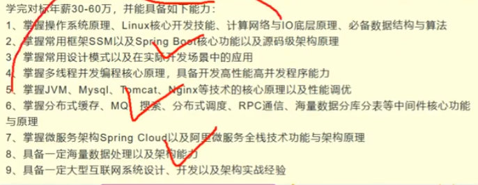
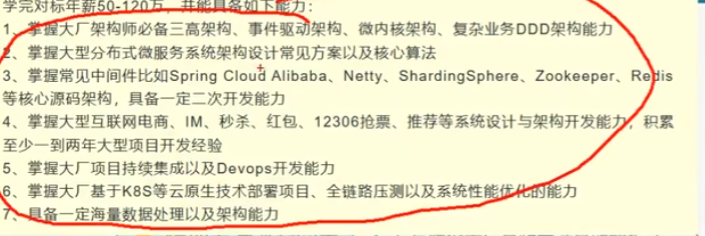

## 互联网项目分类
互联网项目的分类没有统一标准，但根据行业实践和应用领域，通常可分为以下**几大类**（以下为常见分类，具体数量因划分方式而异，约10-15类）：
1. **电子商务**：如B2C（如淘宝、京东）、C2C（如闲鱼）、B2B（如阿里巴巴）、团购（如美团）。
2. **社交媒体与内容平台**：如微博、抖音、知乎、YouTube，涵盖社交网络、短视频、知识分享。
3. **金融科技（FinTech）**：包括支付（如支付宝）、理财（如蚂蚁财富）、保险科技（如保险分销系统）、区块链金融。
4. **企业服务（SaaS/PaaS）**：如ERP企业资源计划（如学校资产管理）、CRM（客户关系管理）、HR管理、云服务（如阿里云、AWS）。
5. **教育科技（EdTech）**：如在线教育（如学而思网校）、教育管理（如校园管理系统）。
6. **健康科技（HealthTech）**：如在线医疗（如好大夫在线）、健康管理、医疗信息化。
7. **游戏与娱乐**：如网络游戏、直播平台（如斗鱼）、音乐/视频流媒体（如Spotify、Netflix）。
8. **物联网（IoT）与智能硬件**：如智能家居（如小米IoT）、车联网、资产追踪。
9. **共享经济**：如共享出行（如滴滴）、共享住宿（如Airbnb）。
10. **广告与营销科技（MarTech）**：如精准广告、营销自动化、数据分析平台。
11. **物流与供应链**：如物流管理（如顺丰优选）、仓储系统、供应链金融。
12. **人工智能与大数据**：如推荐系统、数据分析、智能客服，跨行业应用。
13. **区块链与Web3**：如数字货币、NFT平台、去中心化应用（DApp）。
14. **垂直行业应用**：针对特定行业（如农业、能源、房地产）的定制化互联网解决方案。
15. **工具类应用**：如浏览器、输入法、云存储（如百度网盘）。


## 网上面经
### **亚信科技Java实习面：**
1 自我介绍  
2 接口和抽象类  
3 反射机制  
4 用过哪些集合  
5 arraylist和linkedlist的区别  
6 hashset和linkedhashset的区别  
7 linkedhashset的使用场景  
8 arraylist的插入，扩容机制  
9 如何创建线程  
10 callable接口的使用  
11 线程池的参数  
12 线程池的工作原理  
13 用过那些juc工具类  
14 syc锁和lock锁的区别  
15 sql如何查询学生成绩表的第七名  
16 sql如何查询男女数目  
17 mysql行级锁  
18 mysql慢查询定位和优化  
19 mysql行级锁  
20 redis缓存雪崩  
21 问项目（黑马点评）  
22 项目中的难点和解决办法  
23 问优惠券秒杀如何实现的  
24 springboot的自动装配原理  
25 怎么用的maven  
26 git提交具体命令  
27反问  
  
更新：二面  
1 为什么学java，有没有共同开发项目经验  
2 未来的学习计划  
3 问项目，大概问了项目的来源，为什么要选这个项    目，遇到过那些难点，怎么解决的，有没有想过改进项目  
4 问ai相关的，用不用ai，怎么用ai，对ai有什么看法，搭建过ai模型吗  
5 未来的职业规划  
6 聊天问校园相关的  
7 反问  
大概就是聊天居多，技术涉及比较少  

### **未知面经：**
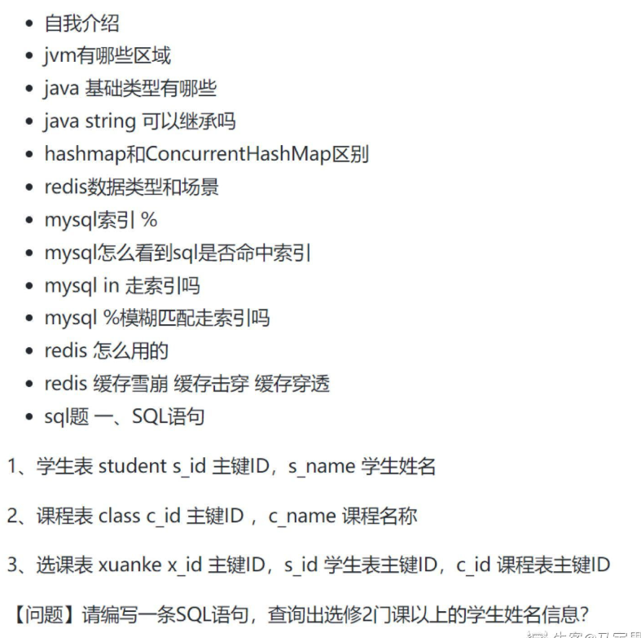


### **合思Java实习：**
一面：
1.自我介绍
2.项目介绍
3.Java反射
4.方法重载和重写有什么区别
5.常见的数据类型和集合类型
6.ArrayList和LinkedList还有vector三种区别
7.垃圾回收器的垃圾回收算法
8.索引的作用
9.具体有哪些索引
10.Java里面的锁有哪些方式
11.分布式锁怎么加锁
12.反问

二面：
1.自我介绍
2.介绍一下自己Java是怎么自学的
3.设计模式用到的有哪些？
4.除了责任链模式还有其他的一些设计模式吗？
5.先更新缓存还是更新数据库
6.什么叫做缓存击穿
7.怎么避免缓存穿透
8.MySQL的索引结构
9.数据库的事务隔离级别
10.默认是哪一种
11.数据库锁有哪几种
12.实习期间能达到什么样的程度，对自己有什么期望。
13.技术和业务哪个更重要。
14.反问

hr面：
1.自我介绍
2.项目中遇到的难点，亮点
3.高考分数
4.为什么选择南昌
5.对我生活中最启发的人
6.数据结构考多少分
7.平常学习算法和数据结构吗
8.有什么其他的爱好吗？
9.是什么让你减肥呢


### **度小满后端实习**
1. 自我介绍
2. 从实习经历里挑一个比较亮点和难点讲一下
3. 你对集群和分布式的理解
4. 讲一下redis分布式锁和集群有什么关系？
5. 在你的项目里有出现过消息重复消费和消息积压的情况吗？
6. 开源你有没有碰到什么难处？
7. 介绍一下你最熟悉的排序算法，有什么缺点？这些排序算法什么时候什么情况下会用到？
8. Hash了解吗？比如怎么解决Hash冲突和常见的结构，讲讲HashMap的结构
9. 你对于TCP和UDP的理解
10. http是基于哪个协议？http和https的区别
11. 你平常有碰到网络故障的经历吗，会怎么解决？比如一个网址打不开，你会怎么解决？
12. 有使用过网络排查的命令吗
13. TCP的流量控制怎么实现的
14. 并发和并行的区别
15. 用户态和内核态的区别，什么情况下会进入到内核态
16. 线程和进程的区别
17. 常用的linux命令举例，查看进程的话除了top还有什么命令
18. MySQL的隔离级别。怎么避免幻读的
19. 一个单机版的MySQL的存储量，性能已经达到了上限，你会采用什么措施进行改进？分库分表你有遇到什么真实的场景吗？简单介绍一下分库分表
20. MySQL索引的底层数据结构
21. 索引失效的情况
22. SQL调优有什么经历？或者有什么了解？
23. MySQL崩溃恢复机制你了解的有哪些？
24. undolog和binlog有什么区别
25. 常用的设计模式结合你的经历来讲
26. 算法：lc：92：反转链表2


### 小厂

小厂面经，也是我的处女面（30min）  
1.自我介绍  
2.spring boot的自动装配原理（好多类和接口的单词都忘了全称是啥了，就说了记得的单词，流程应该说对了吧）  
3.有用过redis吗？主要是用在实现什么功能（说了技术派用redis的zset来实现排行榜）  
5.有了解过Redisson吗？讲一下对于分布式锁的了解以及在什么场景下应用（说了秒杀场景）  
6.对mysql有了解吗？包括它的索引优化和创建（把想起来的全说了）  
7.了解设计模式吗？比如单例模式，为什么要使用单例模式，它的优点是什么（昨天刚看的设计模式）  
8.工厂模式有了解吗？主要的使用场景是？（也是昨天刚看的）  
9.场景题：有7个服务器，需要在早上十点定时的向数据库中的用户表中的用户发短信，如果做到发送的消息不重复，且如果发送失败了需要知道是到哪个用户失败了，这样下次就直接从这个用户开始（我答了用spring task来实现定时，用分布式锁来保证只有一份服务器可以发送消息，用消息队列来存储消息，然后用消息确认机制来保证错误信息的记录，以及在数据库或者业务层面完成消息消费的幂等性）  
10.场景题：如果在系统启动的时间就将数据库的所有用户相关的信息都读到一个hashmap中（这个没啥思路，没答好）  
  
作者：inari233  
链接：[https://www.nowcoder.com/?](https://www.nowcoder.com/?)  
来源：牛客网

### 字节三面

重生之速通字节三面
三面完，秒过，约技术终面!
1.Redis和lua脚本构建分布式锁，lua脚本的作用  
2.lua脚本如何保证原子操作  
3.执行lua脚本，redis挂了怎么办    ——答：Redis事务无法回滚，可能需要实现回滚撤销的操作  
4.为什么数据库可以事务回滚，Redis不行？  
5.按照你的思想，如何实现回滚撤销的操作  
6.db如何实现事务回滚的  
7.了解过RedLock吗  
8.布隆过滤器的误判问题  
9.介绍洗牌算法，就是现在有个数组，要将顺序随机打乱，你会怎么实现  
10.写算法题，一般会有递归实现和非递归实现，区别在哪？  
11.了解尾递归吗  
12.git merge和rebase的区别  
13.自己实现lru实现思路  
  
手撕：层次遍历

  
  
作者：爱吃鱼的肖恩求实习  
链接：[https://www.nowcoder.com/](https://www.nowcoder.com/)  
来源：牛客网