# 12306

# 一、项目启动
启动后端服务：

```plain
分布式启动：除去 aggregation-service 服务外，其他需要全部启动
rocketmq启动：
	bin目录下面键入命令：start mqnamesrv.cmd
	再键入命令：start mqbroker.cmd -n 127.0.0.1:9876 autoCreateTopicEnable = true
nacos启动：
	bin目录下面键入命令：startup.cmd
sentinel启动：java -jar  xxx.jar
```

启动前端服务：

```plain
前端项目放在D://迅雷下载里面了,启动nginx即可，访问端口5175
```

# 二、项目开发流程
## 2.1 项目的基础业务图
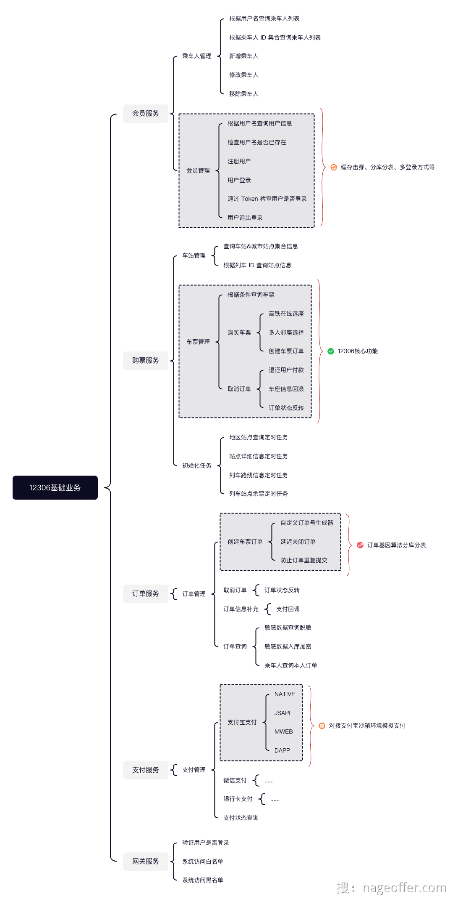

## 2.2 数据库的初始化和数据库表的分析
**初始化数据库：**

1. 使用Docker启动mysql，详情见docker笔记（可以选择用本机的mysql）
2. 聚合模式需要初始化的文件：

```plain
resources/db/12306-springboot.sql
resources/data/12306-springboot.sql
```

1. 分布式模式需要初始化的文件：

```plain
resources/db/12306-springcloud-ticket.sql
resources/data/12306-springcloud-ticket.sql

resources/db/12306-springcloud-user.sql
resources/data/12306-springcloud-user.sql

resources/db/12306-springcloud-pay.sql

resources/db/12306-springcloud-order.sql
```

1. 修改数据库名称和连接的用户名和密码
2. 启动模式：

```plain
聚合模式：
    aggregation-service
    gateway-service

分布式模式：
    除去 aggregation-service 服务外，其他需要全部启动，注意启动顺序，最后启动网关。
```

**数据库表的分析：**

1. 会员管理：

```plain
会员数据：
● t_user 会员数据表：存储会员账号、密码、证件号、邮箱、手机号等信息
● t_user_mail 会员邮箱数据表：存储会员邮箱和用户名的关系
● t_user_phone 会员手机号数据表：存储会员手机号和用户名的关系
● t_user_reuse 用户名可复用表：存储已被注销的可用用户名
● t_user_deletion：用户证件号注销表：存储被注销过得证件号记录数据
乘车人数据：
t_passenger：乘车人数据表
```

2. 列车管理：

```plain
t_train：列车表，存储每天生成的行驶列车数据。
t_carriage：列车车厢表，存储每趟列车对应的车厢数据，包括车厢类型。
t_train_station：列车站点表，存储列车行驶站点顺序表。
t_train_station_relation：列车站点关联表，存储列车行驶站点关联关系表。
t_train_station_price：列车站点价格表，存储列车站点关联关系不同座位价格表。

t_region 地区表，存储站点存在的地区
t_ticket 车票表，存储可选的车票
t_seat   座位表
t_station 站点表
```

3. 订单管理：

```plain
t_order：订单主表，用户购买的单次车票，就对应一个订单。
t_order_item：订单明细表
t_order_item_passenger：订单明细乘车人表
```

4. 支付管理：

```plain
t_pay：订单支付表，存储用户支付车票相关数据。
t_refund: 退款记录表，
```

## 2.3 用户体系建设概要
12306 铁路购票系统中，存在两类用户，分别是：会员（即当前账户登录用户）以及乘车人。

### 2.3.1 会员用户
会员支持在系统中自行注册，需要注册者提供用户名、密码、证件类型、证件号、真实姓名、手机号、邮箱以及旅客类型。

其中，用户名和证件号码全局唯一，不允许注册者重复使用。

会员登录系统时，支持用户名/邮箱/手机号码三种登录方式，搭配密码完成系统用户登录行为。

### 2.3.2. 乘车人
一个注册会员可以添加多个乘车人。添加乘车人时需要填写真实姓名、身份证、手机号等，新增乘车人需要通过实名认证审核，审核通过方可成功。

会员选择交通工具（火车、高铁等）进行买票时，可以选择多个乘车人进行购票。

会员可以通过已支付订单查看所有订单信息，乘车人也可通过订单标签页中本人车票查看自己或其他会员购买为自己购买的订单信息。

## 2.3 业务难点
1. 如何确定信息的真实性：当用户在 12306 网站注册新账号或者为自己的账号添加新的乘车人时，系统需要确保用户提交的各项信息是真实准确的，而不是虚假的。（身份证验证，提交的时候验证各项信息）
2. 数十亿级别的数据量（同时下单？同时发起各种不同的请求？）
3. 会员多种的登录方式，系统支持会员使用用户名、手机号以及邮箱等多种方式进行登录
4. 会员注册缓存穿透（会员注册会打到数据库中，请求数据库，怎么解决？）
5. 敏感信息泄露（对于会员的私人信息怎么隐藏？）

## 2.4 项目结构深度解析
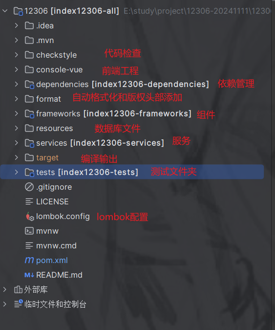

### 2.4.1 项目代码风格限制
使用checkstyle的目的：代码风格统一，防止在代码merge的时候出现冲突。


项目中选用了两个格式配置文件来定义项目中代码风格。下面看看如何实现的？

使用checkstyle需要定义maven-checkstyle-plugin插件，用于执行CheckStyle任务。这个插件里面要定义检查的代码风格文件，文件配置的格式查看官网：<font style="color:rgb(85, 86, 102);background-color:rgb(238, 240, 244);">http://checkstyle.sourceforge.net/config.html</font>

1. maven配置插件：

```xml
<plugin>
  <groupId>org.apache.maven.plugins</groupId>
  <artifactId>maven-checkstyle-plugin</artifactId>
  <version>${maven-common-plugin.version}</version>
  <configuration>
    <!-- ${maven.multiModuleProjectDirectory} 爆红属于正常，并不影响编译或者运行，忽略就好 -->
    <!-- configLocation配置checkstyle文件的地址，该文件定义了具体的规则 -->
    <!-- ${maven.multiModuleProjectDirectory} 是maven的常量 -->
    <configLocation>${maven.multiModuleProjectDirectory}/checkstyle/12306_checkstyle.xml
    </configLocation>
    <!-- ${maven.multiModuleProjectDirectory} 爆红属于正常，并不影响编译或者运行，忽略就好 -->
    <!-- suppressionsLocation抑制规则文件的路径，定义哪些文件或者规则不检查  -->
    <suppressionsLocation>
      ${maven.multiModuleProjectDirectory}/checkstyle/12306_checkstyle_suppression.xml
    </suppressionsLocation>
    <!-- includeTestSourceDirectory是否不扫描测试目录  -->
    <!-- Do not scan the test directory for now -->
    <includeTestSourceDirectory>false</includeTestSourceDirectory>
    <!-- 是否开启控制台输出  -->
    <consoleOutput>true</consoleOutput>
    <!-- 指定编码格式  -->
    <encoding>UTF-8</encoding>
    <!-- 是否跳过checkStyle检查，配置false会跳过这个插件进行检查  -->
    <skip>${skip.checkstyle.check}</skip>
    <!-- 表示检查到不符合规范的地方会报告为错误（error）  -->
    <violationSeverity>error</violationSeverity>
  </configuration>
  <executions>
    <!--  表示在validate阶段检查，检查的目标是checkStyle检查 -->
    <execution>
      <id>validate</id>
      <phase>validate</phase>
      <goals>
        <goal>checkstyle</goal>
      </goals>
    </execution>
  </executions>
</plugin>
```

2. 创建代码风格检查文件：checkstyle/12306_checkstyle.xml

```xml
<?xml version="1.0"?>
<!--
  ~ Licensed to the Apache Software Foundation (ASF) under one or more
  ~ contributor license agreements.  See the NOTICE file distributed with
  ~ this work for additional information regarding copyright ownership.
  ~ The ASF licenses this file to You under the Apache License, Version 2.0
  ~ (the "License"); you may not use this file except in compliance with
  ~ the License.  You may obtain a copy of the License at
  ~
  ~     http://www.apache.org/licenses/LICENSE-2.0
  ~
  ~ Unless required by applicable law or agreed to in writing, software
  ~ distributed under the License is distributed on an "AS IS" BASIS,
  ~ WITHOUT WARRANTIES OR CONDITIONS OF ANY KIND, either express or implied.
  ~ See the License for the specific language governing permissions and
  ~ limitations under the License.
  -->

<!DOCTYPE module PUBLIC
        "-//Puppy Crawl//DTD Check Configuration 1.3//EN"
        "http://www.puppycrawl.com/dtds/configuration_1_3.dtd">
<module name="Checker">
    <module name="NewlineAtEndOfFile"/>
    <module name="RegexpSingleline">
        <property name="format" value="printStackTrace"/>
        <property name="message" value="Prohibit invoking printStackTrace in source code !"/>
    </module>
    <module name="TreeWalker">
        <module name="AvoidStarImport">
            <property name="excludes" value="java.io,java.net,java.lang.Math"/>
            <property name="allowClassImports" value="false"/>
            <property name="allowStaticMemberImports" value="true"/>
        </module>
        <module name="IllegalImport"/>
        <module name="RedundantImport"/>
        <module name="UnusedImports"/>
        <module name="JavadocType">
            <property name="allowUnknownTags" value="true"/>
            <property name="allowMissingParamTags" value="true"/>
            <message key="javadoc.missing" value="Class Comments: Missing Javadoc Comments"/>
        </module>
        <module name="LocalFinalVariableName"/>
        <module name="LocalVariableName"/>
        <module name="PackageName">
            <property name="format" value="^[a-z]+(\.[a-z][a-z0-9]*)*$" />
        </module>
        <module name="StaticVariableName"/>
        <module name="TypeName"/>
        <module name="MemberName"/>
        <module name="MethodName"/>
        <module name="ParameterName "/>
        <module name="ConstantName"/>
        <module name="ArrayTypeStyle"/>
        <module name="UpperEll"/>
        <module name="LineLength">
            <property name="max" value="200"/>
        </module>
        <module name="MethodLength">
            <property name="tokens" value="METHOD_DEF"/>
            <property name="max" value="150"/>
        </module>
        <module name="ParameterNumber">
            <property name="max" value="5"/>
            <property name="ignoreOverriddenMethods" value="true"/>
            <property name="tokens" value="METHOD_DEF"/>
        </module>
        <module name="MethodParamPad"/>
        <module name="TypecastParenPad"/>
        <module name="NoWhitespaceAfter"/>
        <module name="NoWhitespaceBefore"/>
        <module name="OperatorWrap"/>
        <module name="ParenPad"/>
        <module name="WhitespaceAfter"/>
        <module name="WhitespaceAround"/>
        <module name="ModifierOrder"/>
        <module name="RedundantModifier"/>
        <module name="AvoidNestedBlocks"/>
        <module name="EmptyBlock"/>
        <module name="LeftCurly"/>
        <module name="NeedBraces"/>
        <module name="RightCurly"/>
        <module name="EmptyStatement"/>
        <module name="EqualsHashCode"/>
        <module name="IllegalInstantiation"/>
        <module name="InnerAssignment"/>
        <module name="MagicNumber">
            <property name="ignoreNumbers" value="0, 1, 2"/>
            <property name="ignoreAnnotation" value="true"/>
            <property name="ignoreHashCodeMethod" value="true"/>
            <property name="ignoreFieldDeclaration" value="true"/>
        </module>
        <module name="MissingSwitchDefault"/>
        <module name="SimplifyBooleanExpression"/>
        <module name="SimplifyBooleanReturn"/>
        <module name="FinalClass"/>
        <module name="InterfaceIsType"/>
        <module name="VisibilityModifier">
            <property name="packageAllowed" value="true"/>
            <property name="protectedAllowed" value="true"/>
        </module>
        <module name="StringLiteralEquality"/>
        <module name="NestedForDepth">
            <property name="max" value="3"/>
        </module>
        <module name="NestedIfDepth">
            <property name="max" value="4"/>
        </module>
        <module name="UncommentedMain">
            <property name="excludedClasses" value=".*Application$"/>
        </module>
        <module name="Regexp">
            <property name="format" value="System\.out\.println"/>
            <property name="illegalPattern" value="true"/>
        </module>
        <module name="ReturnCount">
            <property name="max" value="4"/>
        </module>
        <module name="NestedTryDepth ">
            <property name="max" value="4"/>
        </module>
        <module name="SuperFinalize"/>
        <module name="SuperClone"/>
    </module>
</module>
```

3. 创建忽略检查文件checkstyle/12306_checkstyle_suppression.xml

```xml
<?xml version="1.0"?>
<!--
  ~ Licensed to the Apache Software Foundation (ASF) under one or more
  ~ contributor license agreements.  See the NOTICE file distributed with
  ~ this work for additional information regarding copyright ownership.
  ~ The ASF licenses this file to You under the Apache License, Version 2.0
  ~ (the "License"); you may not use this file except in compliance with
  ~ the License.  You may obtain a copy of the License at
  ~
  ~     http://www.apache.org/licenses/LICENSE-2.0
  ~
  ~ Unless required by applicable law or agreed to in writing, software
  ~ distributed under the License is distributed on an "AS IS" BASIS,
  ~ WITHOUT WARRANTIES OR CONDITIONS OF ANY KIND, either express or implied.
  ~ See the License for the specific language governing permissions and
  ~ limitations under the License.
  -->

<!DOCTYPE suppressions PUBLIC
        "-//Puppy Crawl//DTD Suppressions 1.1//EN"
        "http://www.puppycrawl.com/dtds/suppressions_1_1.dtd">
<suppressions>
</suppressions>
```

### 2.4.2 项目依赖管理
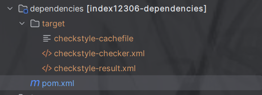

12306的项目依赖是单独定了一个模块，再xml中配置了所有的依赖，将dependencyManagerment放入了这个pom.xml中，然后项目根目录的直接导入这个模块。

下面看如何实现的：

1. dependencies模块中的pom文件配置所有的常量和依赖：

```xml
<?xml version="1.0" encoding="UTF-8"?>
<project xmlns="http://maven.apache.org/POM/4.0.0" xmlns:xsi="http://www.w3.org/2001/XMLSchema-instance"
         xsi:schemaLocation="http://maven.apache.org/POM/4.0.0 https://maven.apache.org/xsd/maven-4.0.0.xsd">
    <modelVersion>4.0.0</modelVersion>

    <groupId>org.opengoofy.index12306</groupId>
    <artifactId>index12306-dependencies</artifactId>
    <version>0.0.1-SNAPSHOT</version>
    <packaging>pom</packaging>

    <properties>
        <java.version>17</java.version>
        <spring-boot.version>3.0.7</spring-boot.version>
        <spring-cloud.version>2022.0.3</spring-cloud.version>
        <spring-cloud-alibaba.version>2022.0.0.0-RC2</spring-cloud-alibaba.version>
        <mybatis-spring-boot-starter.version>3.0.2</mybatis-spring-boot-starter.version>
        <shardingsphere.version>5.3.2</shardingsphere.version>
        <jjwt.version>0.9.1</jjwt.version>
        <fastjson2.version>2.0.36</fastjson2.version>
        <mybatis-plus.version>3.5.3.1</mybatis-plus.version>
        <dozer-core.version>6.5.2</dozer-core.version>
        <hutool-all.version>5.8.27</hutool-all.version>
        <redisson.version>3.21.3</redisson.version>
        <guava.version>30.0-jre</guava.version>
        <xxl-job.version>2.3.1</xxl-job.version>
        <alipay-sdk-java.version>4.38.10.ALL</alipay-sdk-java.version>
        <rocketmq-spring-boot-starter.version>2.2.3</rocketmq-spring-boot-starter.version>
        <transmittable-thread-local.version>2.14.2</transmittable-thread-local.version>
        <hippo4j-threadpool-config-mode.version>1.4.3</hippo4j-threadpool-config-mode.version>
        <micrometer-registry-prometheus.version>1.10.6</micrometer-registry-prometheus.version>
    </properties>

    <dependencyManagement>
        <dependencies>
            <dependency>
                <groupId>org.springframework.boot</groupId>
                <artifactId>spring-boot-dependencies</artifactId>
                <version>${spring-boot.version}</version>
                <type>pom</type>
                <scope>import</scope>
            </dependency>

            <dependency>
                <groupId>org.springframework.cloud</groupId>
                <artifactId>spring-cloud-dependencies</artifactId>
                <version>${spring-cloud.version}</version>
                <type>pom</type>
                <scope>import</scope>
            </dependency>

            <dependency>
                <groupId>com.alibaba.cloud</groupId>
                <artifactId>spring-cloud-alibaba-dependencies</artifactId>
                <version>${spring-cloud-alibaba.version}</version>
                <type>pom</type>
                <scope>import</scope>
            </dependency>

            <dependency>
                <groupId>org.mybatis.spring.boot</groupId>
                <artifactId>mybatis-spring-boot-starter</artifactId>
                <version>${mybatis-spring-boot-starter.version}</version>
            </dependency>

            <dependency>
                <groupId>com.baomidou</groupId>
                <artifactId>mybatis-plus-boot-starter</artifactId>
                <version>${mybatis-plus.version}</version>
            </dependency>

            <dependency>
                <groupId>org.apache.shardingsphere</groupId>
                <artifactId>shardingsphere-jdbc-core</artifactId>
                <version>${shardingsphere.version}</version>
            </dependency>

            <dependency>
                <groupId>io.jsonwebtoken</groupId>
                <artifactId>jjwt</artifactId>
                <version>${jjwt.version}</version>
            </dependency>

            <dependency>
                <groupId>com.alibaba.fastjson2</groupId>
                <artifactId>fastjson2</artifactId>
                <version>${fastjson2.version}</version>
            </dependency>

            <dependency>
                <groupId>com.github.dozermapper</groupId>
                <artifactId>dozer-core</artifactId>
                <version>${dozer-core.version}</version>
            </dependency>

            <dependency>
                <groupId>cn.hutool</groupId>
                <artifactId>hutool-all</artifactId>
                <version>${hutool-all.version}</version>
            </dependency>

            <dependency>
                <groupId>org.redisson</groupId>
                <artifactId>redisson-spring-boot-starter</artifactId>
                <version>${redisson.version}</version>
            </dependency>

            <dependency>
                <groupId>com.google.guava</groupId>
                <artifactId>guava</artifactId>
                <version>${guava.version}</version>
            </dependency>

            <dependency>
                <groupId>com.xuxueli</groupId>
                <artifactId>xxl-job-core</artifactId>
                <version>${xxl-job.version}</version>
            </dependency>

            <dependency>
                <groupId>com.alipay.sdk</groupId>
                <artifactId>alipay-sdk-java</artifactId>
                <version>${alipay-sdk-java.version}</version>
            </dependency>

            <dependency>
                <groupId>org.apache.rocketmq</groupId>
                <artifactId>rocketmq-spring-boot-starter</artifactId>
                <version>${rocketmq-spring-boot-starter.version}</version>
            </dependency>

            <dependency>
                <groupId>com.alibaba</groupId>
                <artifactId>transmittable-thread-local</artifactId>
                <version>${transmittable-thread-local.version}</version>
            </dependency>

            <dependency>
                <groupId>cn.hippo4j</groupId>
                <artifactId>hippo4j-config-spring-boot-starter</artifactId>
                <version>1.5.0</version>
            </dependency>

            <dependency>
                <groupId>io.micrometer</groupId>
                <artifactId>micrometer-registry-prometheus</artifactId>
                <version>${micrometer-registry-prometheus.version}</version>
            </dependency>
        </dependencies>
    </dependencyManagement>
</project>
```

2. 跟项目的pom文件引入：

```xml
    <dependencyManagement>
        <dependencies>
            <dependency>
                <groupId>org.opengoofy.index12306</groupId>
                <artifactId>index12306-dependencies</artifactId>
                <version>${project.version}</version>
                <type>pom</type>
                <scope>import</scope>
            </dependency>
        </dependencies>
    </dependencyManagement>
```

**dependencyManageMent：定义依赖项的版本和范围控制。**

**作用：**

+ **管理版本的一致性：集中管理依赖项的版本**
+ **仅定义不引入：其中定义的依赖项不会自动添加到项目中，子项目引入模块里声明的依赖项，不用定义版本，会自动引入依赖项**

**上面依赖的type表示引入依赖项的类型是pom，不是jar，pom通常是定义了一组相互关联的依赖项和版本**

**上面依赖中scope：**`**import**`** 作用域配合 **`**pom**`** 类型一起使用。它表示当前项目会将指定的 BOM 文件中定义的依赖管理信息（版本、范围等）引入到当前项目的 **`**dependencyManagement**`** 中。  **

**为什么正常的引入没有定义type和scope：因为默认的引入type是jar，如果要引入pom就需要type和scope配合使用。**

### 2.4.3 自动格式化代码
 

这个目录存储了自动格式化所需的文件。下面看如何实现代码再运行编译的时候去自动格式化：

1. maven配置：本项目是在根pom中配置的

```xml
<plugin>
    <groupId>com.diffplug.spotless</groupId>
    <artifactId>spotless-maven-plugin</artifactId>
    <version>${spotless-maven-plugin.version}</version>
    <configuration>
        <java>
            <!--<eclipse>
                <file>${maven.multiModuleProjectDirectory}/format/12306_spotless_formatter.xml</file>
            </eclipse>-->
            <licenseHeader>
                <!-- ${maven.multiModuleProjectDirectory} 爆红属于正常，并不影响编译或者运行，忽略就好 -->
                <file>${maven.multiModuleProjectDirectory}/format/copyright.txt</file>
            </licenseHeader>
        </java>
    </configuration>
    <executions>
        <execution>
            <goals>
                <goal>apply</goal>
            </goals>
            <phase>compile</phase>
        </execution>
    </executions>
</plugin>
```

**spotless-maven-plugin功能：自动格式化代码。根据指定的规则来清理和规范代码格式。**

**java配置块中的licenseHeader表示：会将指定文件中的内容插入到代码的头部**

**java配置块中的eclipse表示：指定在eclipse的格式化规则。**

**execution表示：在compile的时候执行apply应用，执行格式化**


### 2.4.4 项目的聚合
观察项目发现，一些父类的项目都是使用packing=pom的方式整合项目的，只有一些组件模块是使用默认的jar，分析packing的作用：

`<packaging>` 元素用于指定项目的打包类型。不同的打包类型会影响 Maven 构建过程的行为以及生成的构件（artifact）类型。  

1. pom： 用于表示一个父项目或聚合项目，通常没有实际的构件输出 ，不会生成jar或者war，仅仅用来作为模块的父级或者模块的聚合，pom类型的项目通常用于管理多个模块的依赖、插件、版本等配置。
2. jar：默认的类型，表示一个可执行的jar包，适用于java应用程序。会生成jar文件。
3. war： 表示生成一个 Web 应用程序的 WAR 文件。适用于 Servlet/JSP 等基于 Web 的 Java 应用程序。   会生成 `.war` 文件，可以部署到支持 Servlet 容器（如 Tomcat）的环境中。  

其他还有几种，但是主要就这三种够用。


### 2.4.5 Lombok配置
 可以不使用 `lombok.config` 文件。Lombok 在没有配置文件的情况下会使用 **默认配置** 来生成代码，因此项目可以正常使用 Lombok 的注解功能和代码生成，只是少了某些个性化的设置。  

如果没有Lombok.config配置，那么：

1. `**@Generated**`** 注解**：默认情况下，Lombok 不会在生成的代码上加上 `@Generated` 或 `@lombok.Generated` 注解。因此在使用 Jacoco 等代码覆盖率工具时，所有由 Lombok 生成的代码也会被纳入覆盖率统计。  
2. `equals` 和 `hashCode` 方法生成行为 ： Lombok 的 `@EqualsAndHashCode` 注解默认不会调用父类的 `equals` 和 `hashCode` 方法，除非你手动指定 `callSuper = true`， 这意味着，Lombok 生成的 `equals` 和 `hashCode` 方法会根据当前类的字段来进行比较和计算，不会自动包含父类字段的处理。  
3. 配置冒泡： 没有 `lombok.config` 文件时，不会有配置冒泡的行为，Lombok 只会在生成代码时采用其内置的默认设置。  

**什么时候需要lombok.config自定义配置：**

1. **希望生成的代码不被覆盖率工具统计**：通过添加 `@Generated` 注解来忽略 Lombok 生成的代码在覆盖率测试中的统计。  
2. **自定义 **`**equals**`** 和 **`**hashCode**`** 的父类调用行为**：例如需要 `@EqualsAndHashCode(callSuper = true)` 的默认行为而不想每次都手动设置。  
3. **模块化项目的配置管理**：对于大型项目或多模块项目，使用 `config.stopBubbling` 等配置项来管理不同模块的配置需求。  

**如果我配置了lombok.config配置文件，它是怎么生效的？如何使用它才会生效？**

1. 文件位置：`lombok.config` 文件应该放置在项目的 **根目录**，即与 `pom.xml` 或 `build.gradle` 同一层级，或者放在某个模块的根目录中。需要注意的是，Lombok 会在当前目录及其父目录中查找 `lombok.config` 文件，直到找到为止。只要配置文件位于正确的路径下，Lombok 会自动加载并生效。  
2. lombok支持：确保项目引入了依赖
3. 生效方式：**自动加载**：只要存在 `lombok.config` 文件，Lombok 会在编译时自动加载其中的配置，而不需要显式地通过其他方式引入它。  **生效范围**：Lombok 会在项目的构建和编译过程中加载并应用这些配置。这个配置不需要在 `pom.xml` 中单独声明，它会自动生效，影响 Lombok 注解的生成行为。  

**下面解释项目中lombok.config的配置信息：**

```properties
#
# Licensed to the Apache Software Foundation (ASF) under one or more
# contributor license agreements.  See the NOTICE file distributed with
# this work for additional information regarding copyright ownership.
# The ASF licenses this file to You under the Apache License, Version 2.0
# (the "License"); you may not use this file except in compliance with
# the License.  You may obtain a copy of the License at
#
#     http://www.apache.org/licenses/LICENSE-2.0
#
# Unless required by applicable law or agreed to in writing, software
# distributed under the License is distributed on an "AS IS" BASIS,
# WITHOUT WARRANTIES OR CONDITIONS OF ANY KIND, either express or implied.
# See the License for the specific language governing permissions and
# limitations under the License.
#

# this config is to ignore lombok code in jacoco
config.stopBubbling = true
lombok.addLombokGeneratedAnnotation = true

# fix @Data callSuper=false
lombok.equalsAndHashCode.callSuper = skip
```

 这个 `lombok.config` 配置文件用于配置 Lombok 插件的行为，具体来说，它定义了 Lombok 在项目中的一些默认行为，特别是与代码生成和测试覆盖率（Jacoco）相关的行为。以下是每个配置项的详细解释：  

1. config.stopBubbling = true。 告诉 Lombok 停止在父类或上级目录中查找配置文件。Lombok 会从当前目录向上查找配置文件（类似于 Git 或其他工具的配置文件查找方式）。默认情况下，Lombok 会在项目的根目录、子模块以及父目录中查找配置文件。如果设置为 `true`，它会停止向父目录查找 `lombok.config` 文件，只会使用当前目录中的配置文件 。 可以防止在多个模块或父子项目中产生配置文件的“冒泡”行为，从而确保每个模块或目录的 Lombok 配置是独立的。  
2.  lombok.addLombokGeneratedAnnotation = true 。 这个配置让 Lombok 在生成的代码中自动添加 `@lombok.Generated` 注解。这个注解表示该代码是由 Lombok 自动生成的，而不是手动编写的。`@Generated` 注解通常用于工具生成的代码，旨在区分人工编写的代码和自动生成的代码。 方便区分哪些代码是lombok生成的。
3.  lombok.equalsAndHashCode.callSuper = skip  。 这个配置指定了 Lombok 生成 `equals` 和 `hashCode` 方法时是否考虑父类。`callSuper` 设置为 `skip` 表示 Lombok 生成的 `equals` 和 `hashCode` 方法不会调用父类的实现。默认情况下，如果没有指定，Lombok 会生成的 `equals` 和 `hashCode` 方法会自动考虑父类  。 通常用于避免 `equals` 和 `hashCode` 方法过度依赖父类的字段，或者在某些情况下，父类的 `equals` 和 `hashCode` 方法并不符合当前类的需求。  


# 三、核心技术
## 3.1 如何生成分布式雪花算法ID
Snowflake 中文的意思是雪花，所以常被称为雪花算法，是 Twitter 开源的分布式 ID 生成算法。

Twitter 雪花算法生成后是一个 64bit 的 long 型的数值，组成部分引入了时间戳，基本保持了自增。

**SnowFlake 算法的优点：**

1. 高性能高可用：生成时不依赖于数据库，完全在内存中生成。
2. 高吞吐：每秒钟能生成数百万的自增 ID。
3. ID 自增：存入数据库中，索引效率高。

**SnowFlake 算法的缺点：**

依赖与系统时间的一致性，如果系统时间被回调，或者改变，可能会造成 ID 冲突或者重复。

**雪花算法的结构图：**

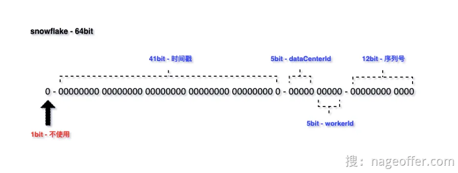

包含四个组成部分：

**不使用**：1bit，最高位是符号位，0 表示正，1 表示负，固定为 0。

**时间戳**：41bit，毫秒级的时间戳（41 位的长度可以使用 69 年）。

**标识位**：5bit 数据中心 ID，5bit 工作机器 ID，两个标识位组合起来最多可以支持部署 1024 个节点。

**适用场景：**因为雪花算法有序自增，保障了 MySQL 中 B+ Tree 索引结构插入高性能。

所以，日常业务使用中，雪花算法更多是被应用在数据库的主键 ID 和业务关联主键

**雪花ID出现重复的问题：**

通过上述假设场景，可以知道雪花算法生成 ID 冲突存在一定的前提条件：

1. 服务通过集群的方式部署，其中部分机器标识位一致。
2. 业务存在一定的并发量，没有并发量无法触发重复问题。
3. 生成 ID 的时机：同一毫秒下的序列号一致。

## 3.2 如何使用HuTool的Builder模式构建线程池
Builder模式应用场景：Builder 模式作用域：如果类的属性之间有一定的依赖关系或者约束条件（源自设计模式之美），那么就可以考虑使用 Builder 设计模式。

## 3.3 责任链设计模式重构复杂业务场景
**责任链的两种方式：**

责任链模式中多个处理器形成的处理器链在进行处理请求时，有两种处理方式：

1. 请求会被 **所有的处理器都处理一遍，不存在中途终止的情况**，这里参照 MyBatis 拦截器理解。
2. 处理器链执行请求中，某一处理器执行时，**如果不符合自制定规则的话，停止流程，并且剩下未执行处理器就不会被执行**，大家参照 SpringMvc 拦截器理解。

**业务场景：**

我们数据在进行处理之前，会进行多套验证规则：比如必填项校验，非法字符校验，长度校验等等。

模拟实现：

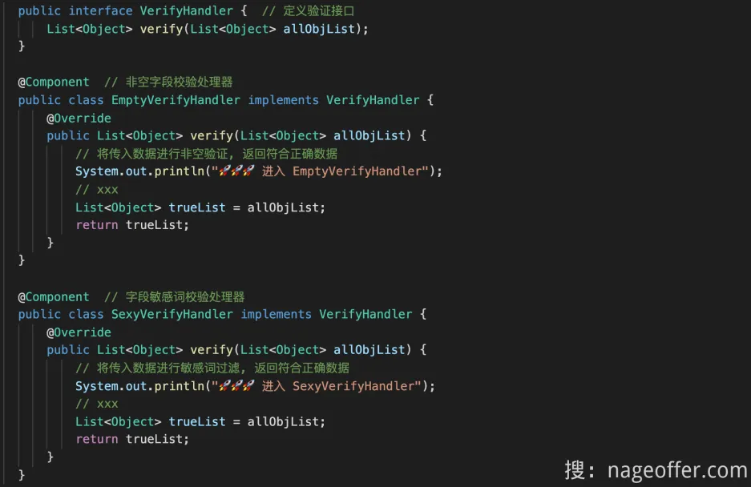

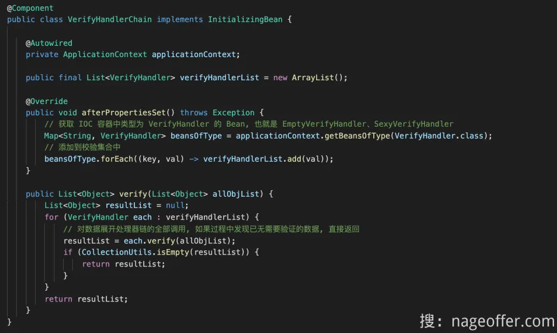**责任链模式的好处：**

1. 减少代码复杂性的要求
2. 满足开闭原则

## 3.4 抽象责任链设计模式
1. 定义抽象接口

```java
public interface AbstractChainHandler<T> extends Ordered {
    
    /**
     * 执行责任链逻辑
     *
     * @param requestParam 责任链执行入参
     */
    void handler(T requestParam);
    
    /**
     * @return 责任链组件标识
     */
    String mark();
}
```

2. 存储整个责任链的集合

```java
public final class AbstractChainContext<T> implements CommandLineRunner {
    
    private final Map<String, List<AbstractChainHandler>> abstractChainHandlerContainer = Maps.newHashMap();
    
    /**
     * 责任链组件执行
     *
     * @param requestParam 请求参数
     */
    public void handler(String mark, T requestParam) {
        abstractChainHandlerContainer.get(mark).stream()
                .sorted(Comparator.comparing(Ordered::getOrder)).forEach(each -> each.handler(requestParam));
    }
    
    @Override
    public void run(String... args) throws Exception {
        // 获取 Spring IOC 容器中所有 AbstractChainHandler 接口实现
        Map<String, AbstractChainHandler> chainFilterMap = ApplicationContextHolder.getBeansOfType(AbstractChainHandler.class);
        chainFilterMap.forEach((beanName, bean) -> {
            List<AbstractChainHandler> abstractChainHandlers = abstractChainHandlerContainer.get(bean.mark());
            if (abstractChainHandlers == null) {
                abstractChainHandlers = new ArrayList();
            }
            abstractChainHandlers.add(bean);
            // 根据 mark 标识将责任链模式分类，放入责任链容器上下文中
            abstractChainHandlerContainer.put(bean.mark(), abstractChainHandlers);
        });
    }
}
```

3. 抽象业务接口：

```java
// 订单创建责任链过滤器
public interface OrderCreateChainFilter<T extends OrderCreateCommand> extends AbstractChainHandler<OrderCreateCommand> {

    @Override
    default String mark() {
        return OrderChainMarkEnum.ORDER_CREATE_FILTER.name();
    }
}
```

4. 编写接口实现责任链接口

```java
// 订单创建参数必填检验
@Component
public final class OrderCreateParamNotNullChainHandler implements OrderCreateChainFilter<OrderCreateCommand> {
    
    @Override
    public void handler(OrderCreateCommand requestParam) {
        // 逻辑执行
    }
    
    @Override
    public int getOrder() {
        return 0;
    }
}

// 订单创建参数正确性检验
@Component
public final class OrderCreateParamVerificationChainHandler implements OrderCreateChainFilter<OrderCreateCommand> {
    
    @Override
    public void handler(OrderCreateCommand requestParam) {
        // 逻辑执行
    }
    
    @Override
    public int getOrder() {
        return 1;
    }
}

// 订单创建商品 SKU 库存验证
@Component
public final class OrderCreateProductSkuStockChainHandler implements OrderCreateChainFilter<OrderCreateCommand> {

    @Override
    public void handler(OrderCreateCommand requestParam) {
        // 逻辑执行
    }
    
    @Override
    public int getOrder() {
        return 2;
    }
}
```

5. 测试使用：

```java
@RequiredArgsConstructor
public class OrderServiceImpl implements OrderService {

    private final AbstractChainContext<OrderCreateCommand> abstractChainContext;
  
    public String createOrder(OrderCreateCommand requestParam) {
        // 责任链模式: 执行订单创建参数验证
        abstractChainContext.handler(OrderChainMarkEnum.ORDER_CREATE_FILTER.name(), requestParam);
    }
}
```

## 3.5 策略设计模式
**什么是策略设计模式：**

定义一组算法类，**将每个算法分别封装起来，让它们可以互相替换**。策略模式使这些算法在客户端调用它们的时候能够互不影响地变化，客户端代指使用算法的代码。

**项目中真实的应用场景：**

1. 定义策略模式接口和实现类：

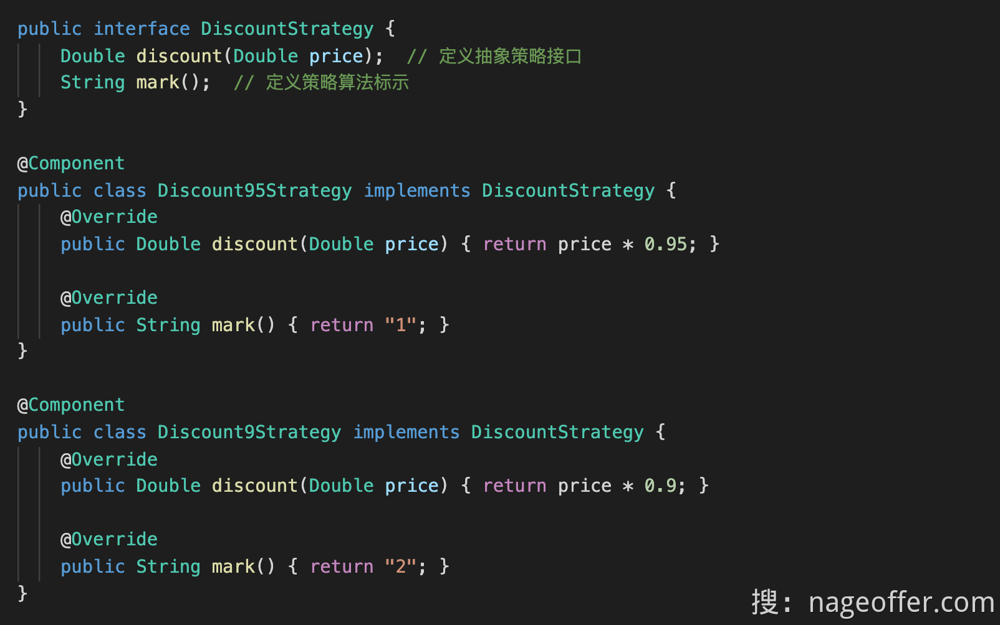

2. 定义策略设计模式工厂

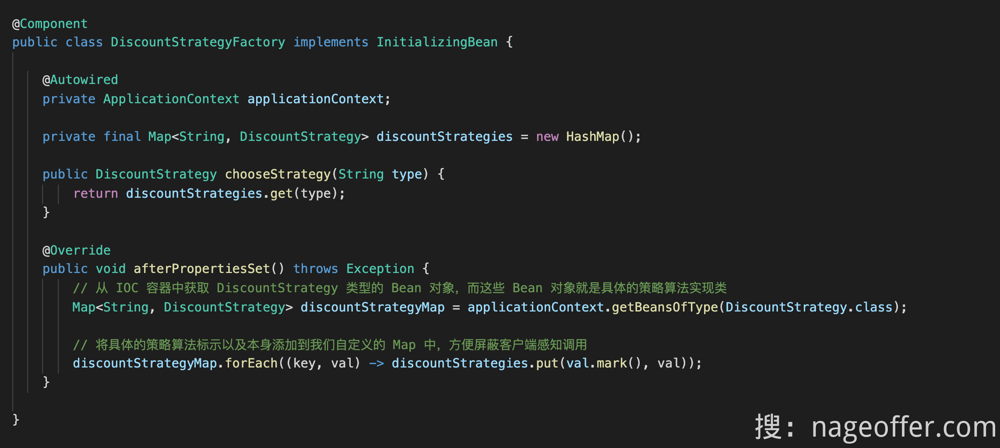

3. 调用


## 3.6 抽象策略模式
当业务使用越来越多的情况下，重复定义 `DiscountStrategy` 以及 `DiscountStrategyFactory` 会增加系统冗余代码量。

可以考虑将这两个基础类抽象出来，作为基础组件库中的通用组件，供所有系统下的业务使用，从而避免代码冗余。

定义抽象策略处理接口，添加有返回值和无返回值接口。

```java
package org.opengoofy.congomall.springboot.starter.designpattern.strategy;

/**
 * 策略执行抽象
 */
public interface AbstractExecuteStrategy<REQUEST, RESPONSE> {

    /**
     * 执行策略标识
     */
    String mark();

    /**
     * 执行策略
     *
     * @param requestParam 执行策略入参
     */
    default void execute(REQUEST requestParam) {

    }

    /**
     * 执行策略，带返回值
     *
     * @param requestParam 执行策略入参
     * @return 执行策略后返回值
     */
    default RESPONSE executeResp(REQUEST requestParam) {
        return null;
    }
}
```

添加策略选择器，通过订阅 Spring 初始化事件执行扫描所有策略模式接口执行器，并根据 mark 方法定义标识添加到 `abstractExecuteStrategyMap` 容器中。

客户端在实际业务中使用 `AbstractStrategyChoose#choose` 即可完成策略模式实现。

```java
package org.opengoofy.congomall.springboot.starter.designpattern.strategy;

import org.opengoofy.congomall.springboot.starter.base.ApplicationContextHolder;
import org.opengoofy.congomall.springboot.starter.base.init.ApplicationInitializingEvent;
import org.opengoofy.congomall.springboot.starter.convention.exception.ServiceException;
import org.springframework.context.ApplicationListener;

import java.util.HashMap;
import java.util.Map;
import java.util.Optional;

/**
 * 策略选择器
 */
public class AbstractStrategyChoose implements ApplicationListener<ApplicationInitializingEvent> {

    /**
     * 执行策略集合
     */
    private final Map<String, AbstractExecuteStrategy> abstractExecuteStrategyMap = new HashMap<>();

    /**
     * 根据 mark 查询具体策略
     *
     * @param mark 策略标识
     * @return 实际执行策略
     */
    public AbstractExecuteStrategy choose(String mark) {
        return Optional.ofNullable(abstractExecuteStrategyMap.get(mark)).orElseThrow(() -> new ServiceException(String.format("[%s] 策略未定义", mark)));
    }

    /**
     * 根据 mark 查询具体策略并执行
     *
     * @param mark         策略标识
     * @param requestParam 执行策略入参
     * @param <REQUEST>    执行策略入参范型
     */
    public <REQUEST> void chooseAndExecute(String mark, REQUEST requestParam) {
        AbstractExecuteStrategy executeStrategy = choose(mark);
        executeStrategy.execute(requestParam);
    }

    /**
     * 根据 mark 查询具体策略并执行，带返回结果
     *
     * @param mark         策略标识
     * @param requestParam 执行策略入参
     * @param <REQUEST>    执行策略入参范型
     * @param <RESPONSE>   执行策略出参范型
     * @return
     */
    public <REQUEST, RESPONSE> RESPONSE chooseAndExecuteResp(String mark, REQUEST requestParam) {
        AbstractExecuteStrategy executeStrategy = choose(mark);
        return (RESPONSE) executeStrategy.executeResp(requestParam);
    }

    @Override
    public void onApplicationEvent(ApplicationInitializingEvent event) {
        Map<String, AbstractExecuteStrategy> actual = ApplicationContextHolder.getBeansOfType(AbstractExecuteStrategy.class);
        actual.forEach((beanName, bean) -> {
            AbstractExecuteStrategy beanExist = abstractExecuteStrategyMap.get(bean.mark());
            if (beanExist != null) {
                throw new ServiceException(String.format("[%s] Duplicate execution policy", bean.mark()));
            }
            abstractExecuteStrategyMap.put(bean.mark(), bean);
        });
    }
}
```

## 3.7 实现缓存与数据库的同步
**业务背景：**

为了满足用户对一趟列车不同站点不同座位类型的余量查询需求，我们采取了一种优化方案。我们将这些余量信息存储在缓存中，以便用户可以快速查询。

然而，在用户创建订单并完成支付时，我们需要同时从数据库和缓存中扣减相应的列车站点余票。这种设计不仅提高了查询效率，也保证了数据的一致性，确保订单操作的准确性。

**技术方案：**

1. 先写缓存再写数据库，会出现的问题：高并发下，17为例，如果第一个请求先写缓存，第二个请求写完缓存再写数据库，那么缓存为15，数据库为16，出现不一致的情况
2. 先写数据库再写缓存，如果第一个请求更新数据库后，数据库为16，第二个请求过来更新数据库为15，缓存为15，第一个请求再更新缓存为16，出现不一致的请求
3. 先删除缓存再写数据库，这里以读写操作为例，先删除缓存，读操作去读取缓存，没有读到，然后获取数据库的数据为16，将数据库的16写入缓存，再更新数据库为15,，出现不一致的情况
4. 先删除缓存再写数据库，再写缓存（缓存双删）：在3的基础上，最后添加个删除缓存的操作
5. 先写数据库再删除缓存：更新数据库16，第一次查询删除缓存，第二次查询，更新缓存16
6. 先写数据库，通过BinLog异步更新缓存：写完数据，通过BinLog通知更新缓存

**技术总结：**

不推荐的做法：先写缓存再写数据库、先写数据库再写缓存、先删除缓存再写数据库

可以根据业务场景选择下述缓存一致性方案：

+ 缓存双删：如果公司现有消息队列中间件，可以考虑使用该方案，反之则不需要考虑。
+ 先写数据库再删缓存：这种方案从实时性以及技术实现复杂度来说都比较不错，推荐大家使用这种方案。
+ Binlog 异步更新缓存：如果希望实现最终一致性以及数据多中心模式，该方案无疑是最合适的。、

## 3.8 订单延时关闭功能技术选型
**定时任务：**

通过定时任务是一种常见的订单延迟关闭解决方案。

可以通过调度平台来实现定时任务的执行，具体任务是根据订单创建时间扫描所有到期的订单，并执行关闭订单的操作。

大家常用的定时任务调度平台有以下这些：

+ [https://github.com/xuxueli/xxl-job](https://github.com/xuxueli/xxl-job)
+ [https://github.com/PowerJob/PowerJob](https://github.com/PowerJob/PowerJob)
+ [https://github.com/apache/shardingsphere-elasticjob](https://github.com/apache/shardingsphere-elasticjob)

这种方案的优点在于简单易实现，但是，该方案也存在一些问题：

1. 延迟时间不精确：使用定时任务执行订单关闭逻辑，无法保证订单在十分钟后准确地关闭。如果任务执行器在关闭订单的具体时间点出现问题，可能导致订单关闭的时间延后。
2. 不适合高并发场景：定时任务执行的频率通常是固定的，无法根据实际订单的情况来灵活调整。在高并发场景下，可能导致大量的定时任务同时执行，造成系统负载过大。
3. 分库分表问题：拿 12306 来说，订单表按照用户标识和订单号进行了分库分表，那这样的话，和上面说的根据订单创建时间去扫描一批订单进行关闭，自然就行不通。因为根据创建时间查询没有携带分片键，存在读扩散问题。

通常最不推荐的方式是使用定时任务来实现订单关闭。

**RabbitMQ**

项目地址：[https://github.com/rabbitmq/rabbitmq-server](https://github.com/rabbitmq/rabbitmq-server)

RabbitMQ 是一个功能强大的消息中间件，通过使用 RabbitMQ 的延时消息特性，我们可以轻松实现订单十分钟延时关闭功能。首先，我们需要在 RabbitMQ 服务器上启用延时特性，通常通过安装 `rabbitmq_delayed_message_exchange` 插件来支持延时消息功能。

接下来，我们创建两个队列：订单队列和死信队列。订单队列用于存储需要延时关闭的订单消息，而死信队列则用于存储延时时间到达后的订单消息。在创建订单队列时，我们要为队列配置延时特性，指定订单消息的延时时间，比如十分钟。这样，当有新的订单需要延时关闭时，我们只需要将订单消息发送到订单队列，并设置消息的延时时间。

在订单队列中设置死信交换机和死信队列，当订单消息的延时时间到达后，消息会自动转发到死信队列，从而触发关闭订单的操作。在死信队列中，我们可以监听消息，并执行关闭订单的逻辑。为了确保消息的可靠性，可以在关闭订单操作前添加适当的幂等性措施，这样即使消息重复处理，也不会对系统产生影响。

通过以上步骤，我们就成功实现了订单的十分钟延时关闭功能。当有新的订单需要延时关闭时，将订单消息发送到订单队列，并设置延时时间。在延时时间到达后，订单消息会自动进入死信队列，从而触发关闭订单的操作。这种方式既简单又可靠，保证了系统的稳定性和可用性。

从整体来说 RabbitMQ 实现延时关闭订单功能是比较合适的，但也存在几个问题：

1. 延时精度：RabbitMQ 的延时消息特性是基于消息的 TTL（Time-To-Live）来实现的，因此消息的延时时间并不是完全准确的，可能会有一定的误差。在处理订单十分钟延时关闭时，可能会有一些订单的关闭时间略晚于预期时间。
2. 高并发问题：如果系统中有大量的订单需要延时关闭，而订单关闭操作非常复杂耗时，可能会导致消息队列中的消息堆积。这样就可能导致延时关闭操作无法及时处理，影响订单的实际关闭时间。
3. 重复消息问题：由于网络原因或其他不可预知的因素，可能会导致消息重复发送到订单队列。如果没有处理好消息的幂等性，可能会导致订单重复关闭的问题，从而造成数据不一致或其他异常情况。
4. 可靠性问题：RabbitMQ 是一个消息中间件，它是一个独立的系统。如果 RabbitMQ 本身出现故障或宕机，可能会导致订单延时关闭功能失效。因此，在使用 RabbitMQ 实现延时关闭功能时，需要考虑如何保证 RabbitMQ 的高可用性和稳定性。

延时精度和高并发属于一类问题，取决于客户端的消费能力。重复消费问题是所有消息中间件都需要解决，需要通过消息表等幂等解决方案解决。比较难搞定的是可用性问题，RabbitMQ 在可用性方面较弱，部分场景下会存在单点故障问题。

**Redis**

项目地址：[https://github.com/redis/redis](https://github.com/redis/redis)

可以借助 Redis 的过期消息监听机制实现延时关闭功能。

首先，在订单创建时，将订单信息存储到 Redis，并设置过期时间为十分钟。同时，在 Redis 中存储一个过期消息监听的键值对，键为订单号，值为待处理订单的标识。

其次，编写一个消息监听器，持续监听 Redis 的过期事件。监听器使用 Redis 的 `PSUBSCRIBE` 命令订阅过期事件，并在监听到过期事件时触发相应的处理逻辑。

当订单过期时间到达时，Redis 会自动触发过期事件，消息监听器捕获到该事件，并获取到过期的订单号。接着，监听器执行订单关闭的逻辑，如更新订单状态为关闭状态，释放相关资源等，实现订单的十分钟延时关闭功能。

需要注意的是，消息监听器应该是一个长期运行的任务，确保持续监听 Redis 的过期事件。为了保证系统的稳定性和可靠性，可以在实现订单关闭逻辑时添加容错机制，以应对 Redis 可能发生故障或重启的情况。

Redis 过期消息也存在几个问题：

1. 不够精确：Redis 的过期时间是通过定时器实现的，可能存在一定的误差，导致订单的关闭时间不是精确的十分钟。这对于某些对时间要求较高的场景可能不适用。
2. Redis 宕机：如果 Redis 宕机或重启，那些已经设置了过期时间但还未过期的订单信息将会丢失，导致这部分订单无法正确关闭。需要考虑如何处理这种异常情况。
3. 可靠性：依赖 Redis 的过期时间来实现订单关闭功能，需要确保 Redis 的高可用性和稳定性。如果 Redis 发生故障或网络问题，可能导致订单关闭功能失效。
4. 版本问题：Redis 5.0 之前是不保证延迟消息持久化的，如果客户端消费过程中宕机或者重启，这个消息不会重复投递。5.0 之后推出了 Stream 功能，有了持久化等比较完善的延迟消息功能。

**Redisson**

项目地址：[https://github.com/redisson/redisson](https://github.com/redisson/redisson)

通过 Redisson 的 RDelayedQueue 功能可以实现订单十分钟延时关闭的功能。

首先，我们需要创建一个 RDelayedQueue 对象，用于存放需要延时关闭的订单信息。当用户创建订单时，我们将订单信息添加到 RDelayedQueue 中，并设置订单的延时时间为十分钟。

Redisson 提供了监听功能，可以实现对 RDelayedQueue 中订单信息的监听。一旦订单到达设定的延时时间，Redisson 会触发监听事件。在监听到订单的延时事件后，我们可以编写相应的处理逻辑，即关闭对应的订单。

在处理订单关闭时，我们可以根据订单号或订单创建时间等信息，来找到对应的订单进行关闭操作。

不过这种方式也不推荐使用，基本上 Redis 过期监听消息存在的问题，RDelayedQueue 也都会有，因为 RDelayedQueue 本质上也是依赖 Redis 实现。

**RocketMQ**

项目地址：[https://github.com/apache/rocketmq](https://github.com/apache/rocketmq)

在订单生成时，我们将订单关闭消息发送到 RocketMQ，并设置消息的延迟时间为十分钟。RocketMQ 支持设置消息的延迟时间，可以通过设置消息的 delayLevel 来指定延迟级别，每个级别对应一种延迟时间。这样，订单关闭消息将在十分钟后自动被消费者接收到。

需要注意，RocketMQ 5.0 之后已经支持了自定义时间的延迟，而不仅是延迟级别范围内的时间。

为了处理订单关闭消息，我们需要在消费者端创建一个消息监听器。当消息监听器接收到订单关闭消息时，触发订单关闭操作，将订单状态设置为关闭状态。

需要注意的是，RocketMQ 的消息传递机制保证了消息的可靠性传递，因此消息可能会进行多次重试。为了确保订单关闭操作的幂等性，即多次执行不会产生副作用，我们需要在订单关闭逻辑中进行幂等性的处理。

因为 12306 系统中也使用到了 RocketMQ，所以这个解决方案将是咱们的不二选择。

关于 RocketMQ 4.x 版本和 5.x 版本的延时消息实现原理参考文章：[弥补延时消息的不足，RocketMQ 基于时间轮算法实现了定时消息！ (qq.com)](https://mp.weixin.qq.com/s/I91QRel-7CraP7zCRh0ISw)

# 四、组件开发
## 4.1 自定义Starter
什么是Starter：Spring Boot Starter 是一组 Maven 依赖的集合，旨在简化 Spring Boot 应用的配置。每个 Starter 通常包括所需的库、自动配置类、属性文件等，使得开发者只需简单地添加一个 Starter，就可以快速启动所需的功能。

**为什么要定义Starter：**

1. 复用性：常见的功能封装到Starter中，方便多个项目使用
2. 简化配置：将复杂的配置和依赖管理集中处理，减少每个项目中的重复配置。
3. 团队协作：不同团队可以将各自的功能封装成独立的 Starter，提升项目的模块化程度。

**命名：** 官方提供 Starter 通常命名为 spring-boot-starter-{name} 如：spring-boot-starter-web，spring-boot-starter-activemq 等，通常我们依赖引入就是这种。

Spring 官方建议非官方提供的 Starter 命名应遵守 {name}-spring-boot-starter 的格式。比如 MyBatis 出品的：mybatis-spring-boot-starter。

项目中实现自定义starter步骤：

**1. 创建SpringBoot项目**

**2. pom依赖配置**，只需要简单的配置，springboot配置（这里配置了dependencyManagement来引入SpringBoot依赖）和当前项目坐标。

```xml
<?xml version="1.0" encoding="UTF-8"?>
<project xmlns="http://maven.apache.org/POM/4.0.0"
         xmlns:xsi="http://www.w3.org/2001/XMLSchema-instance"
         xsi:schemaLocation="http://maven.apache.org/POM/4.0.0 http://maven.apache.org/xsd/maven-4.0.0.xsd">
    <modelVersion>4.0.0</modelVersion>

    <groupId>org.example</groupId>
    <artifactId>ssm-test</artifactId>
    <version>1.0-SNAPSHOT</version>
    <packaging>jar</packaging>

    <properties>
        <java.version>17</java.version>
        <spring.boot.version>2.7.5</spring.boot.version>
    </properties>

    <dependencyManagement>
        <dependencies>
            <dependency>
                <groupId>org.springframework.boot</groupId>
                <artifactId>spring-boot-dependencies</artifactId>
                <version>${spring.boot.version}</version>
                <type>pom</type>
                <scope>import</scope>
            </dependency>
        </dependencies>
    </dependencyManagement>

    <dependencies>
        <!-- Spring Boot 核心依赖 -->
        <dependency>
            <groupId>org.springframework.boot</groupId>
            <artifactId>spring-boot-starter</artifactId>
        </dependency>

        <dependency>
            <groupId>org.springframework.boot</groupId>
            <artifactId>spring-boot-autoconfigure</artifactId>
        </dependency>
    </dependencies>

  <!--打包  -->
    <build>
        <plugins>
            <plugin>
                <groupId>org.springframework.boot</groupId>
                <artifactId>spring-boot-maven-plugin</artifactId>
            </plugin>
        </plugins>
    </build>

</project>
```

**3. 定义自动配置类： 自定义配置类之前，先去写完自己的业务逻辑，然后在这里暴露接口或者工具类**

```java
@Configuration
public class MyConfiguration {

    @Bean
    public SSMController ssmController() {
        SSM ssm = new SSM();
        ssm.setMsg("hello, 测试starter");
        return new SSMController(ssm);
    }
}
```

**4. 新建spring.factories文件：这个文件的位置在resourses/META-INF下面，SpringBoot自动装配会加载到**

```xml
org.springframework.boot.autoconfigure.EnableAutoConfiguration=\
  org.example.ssm.config.MyConfiguration
```

**5. 使用install命令打包到本地仓库，这里会注册为jar包，然后到本地的仓库（测试发现一个根目录下面的不需要打包，直接引入坐标就可以使用到了）**

**6. 测试使用**（其他项目引入依赖就可以使用自动配置里面的bean）


扩展一：

**自定义可插拔方式的starter：**使用自定义注解+条件注解（`@ConditionalOnClass` 或 `@ConditionalOnProperty`）的方式实现可插拔的starter，在需要的时候加上注解开启。

实现方式：上面的步骤的基础上：

1. 添加一个自定义注解

```java
@Retention(RetentionPolicy.RUNTIME)
@Target(ElementType.TYPE)
@Import(MyConfiguration.class) // 引入配置类
public @interface EnableCustomFeature {
}
```

2. 修改自动配置类，改为通过条件注解的方式选择性的让其他项目来选择是否引入这个Starter

```java
/**
 * 条件注解的方式是否需要开启Starter
 * 在这个例子中，@ConditionalOnProperty 检查 application.properties 中是否有 custom.feature.enabled=true。如果有或缺省为 true，则会加载 CustomConfiguration 中的 CustomService Bean。
 */
@Configuration
@ConditionalOnProperty(name = "custom.feature.enabled", havingValue = "true", matchIfMissing = true)
public class MyConfiguration {

    @Bean
    public SSMController ssmController() {
        SSM ssm = new SSM();
        ssm.setMsg("hello, 测试starter");
        return new SSMController(ssm);
    }
}
```

3. 使用：其他使用的可以通过自定义注解来引入自定义配置类，控制加载。

```java
@SpringBootApplication
@EnableCustomFeature
public class ApplyApplication implements CommandLineRunner {

    @Autowired
    private SSMController ssmController;

    public static void main(String[] args) {
        SpringApplication.run(ApplyApplication.class, args);
    }


    @Override
    public void run(String... args) throws Exception {
        System.out.println(ssmController.getMsg());
    }
}
```

4. 通过在配置application.yml信息来选择性的是否开启Starter：

```java
custom:
  feature:
    enabled: false   # 不开启
```


扩展二：

**配置元数据：**针对于哪些在yml文件里面有默认值的配置信息，是基于META-INF/spring-configuration-metadata.json 文件和注解 @ConfigurationProperties 方式自动生成。这种可以实现 用户可以在 `application.yml` 中配置 Starter 的属性，IDE 会提供配置提示，显示默认值和详细说明，从而实现高度可配置的、可插拔的 Starter  

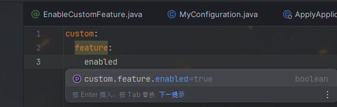

实现：

1.  使用 `@ConfigurationProperties` 注解创建一个配置属性类，定义 Starter 所需的配置项，并提供默认值。  

```java
@ConfigurationProperties(prefix = "custom.feature")
public class CustomFeatureProperties {

    private boolean enabled = true; // 默认启用

    private String name = "DefaultName"; // 默认名称

    public boolean isEnabled() {
        return enabled;
    }

    public void setEnabled(boolean enabled) {
        this.enabled = enabled;
    }

    public String getName() {
        return name;
    }

    public void setName(String name) {
        this.name = name;
    }
}
```

2. 在自动配置类上面通过@EnableConfigurationProperties注解启用： 这样，Spring Boot 会自动读取 `application.yml` 或 `application.properties` 中 `custom.feature` 前缀下的配置，并将它们映射到 `CustomFeatureProperties` 类的属性中。  

```java
@Configuration
@EnableConfigurationProperties(CustomFeatureProperties.class)
@ConditionalOnProperty(name = "custom.feature.enabled", havingValue = "true", matchIfMissing = true)
public class MyConfiguration {

    @Bean
    public SSMController ssmController() {
        SSM ssm = new SSM();
        ssm.setMsg("hello, 测试starter");
        return new SSMController(ssm);
    }
}
```

3.  在 `META-INF` 目录下创建 `spring-configuration-metadata.json` 文件，用于为 IDE 提供自动提示和文档说明。  

```java
{
  "groups": [
    {
      "name": "custom.feature",
      "type": "org.example.customstarter.config.CustomFeatureProperties",
      "sourceType": "org.example.customstarter.config.CustomFeatureProperties"
    }
  ],
  "properties": [
    {
      "name": "custom.feature.enabled",
      "type": "java.lang.Boolean",
      "description": "Enable or disable custom feature.",
      "defaultValue": true
    },
    {
      "name": "custom.feature.name",
      "type": "java.lang.String",
      "description": "The name for the custom feature.",
      "defaultValue": "DefaultName"
    }
  ]
}
```

4. 使用效果就是在其他项目键入会有提示。比如上面的我输入cu..就会有提示了

****

**为什么需要spring.factories?**：因为这个自动装配类SpringFactoriesLoader会去指定扫描**resources/META-INF**的指定spring.factories文件。

## 4.2 实现幂等组件库
**幂等问题：**幂等的意思是一个接口不管调用多少次，系统的结果应该都是保持一致的。幂等问题就是解决这个重复请求的问题。

幂等可能存在两种类型的问题：

+ 接口幂等：常说的接口防重复提交。
+ 消息队列幂等：如何保障消息队列客户端对相同的消息仅消费一次。

**解决幂等的方法：**

1. 分布式锁：第一次发送请求的时候会返回一个分布式锁，要执行业务逻辑的时候会判断这个锁是否已经被获取了，如果获取不了锁，不能创建新的业务请求。
2. Token令牌：第一次发送请求的时候会返回一个Token给客户端，客户端处理业务逻辑需要携带这个Token，处理完业务逻辑后会删除这个token。如果没有这个token这表示为重复请求。
3. 去重表：一般使用Redis，当客户端发送请求时，服务端会先查询 Redis 去重表来检查该请求是否已经被处理过。如果在存在对应的记录，表示请求已经执行过，服务端可以直接返回之，而不再执行重复操作。如果在不存在对应的记录，表示请求是新的，服务端会执行相应的业务逻辑，并在处理完成后将请求的唯一标识（如请求 ID 或标识）添加到 Redis 去重表中，以便后续的重复请求可以被正确识别和处理。

**项目中接口幂等-Spel表达式+redisson解决幂等问题：就是去判断是否有锁**

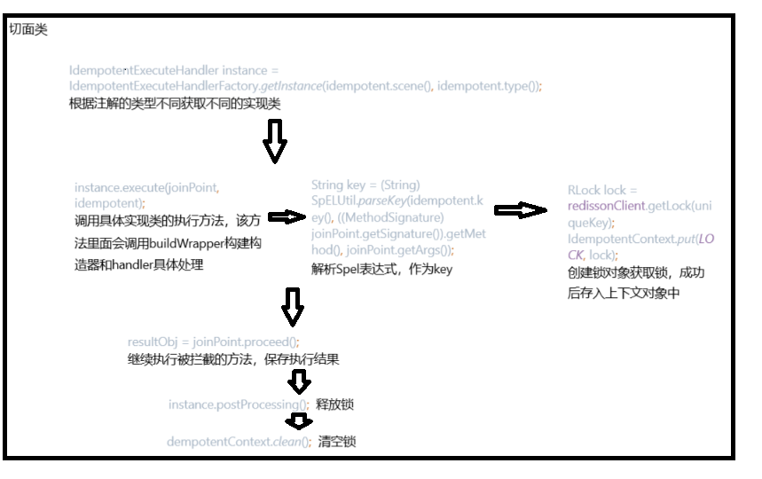


**消息中心防重复消费的实现：**

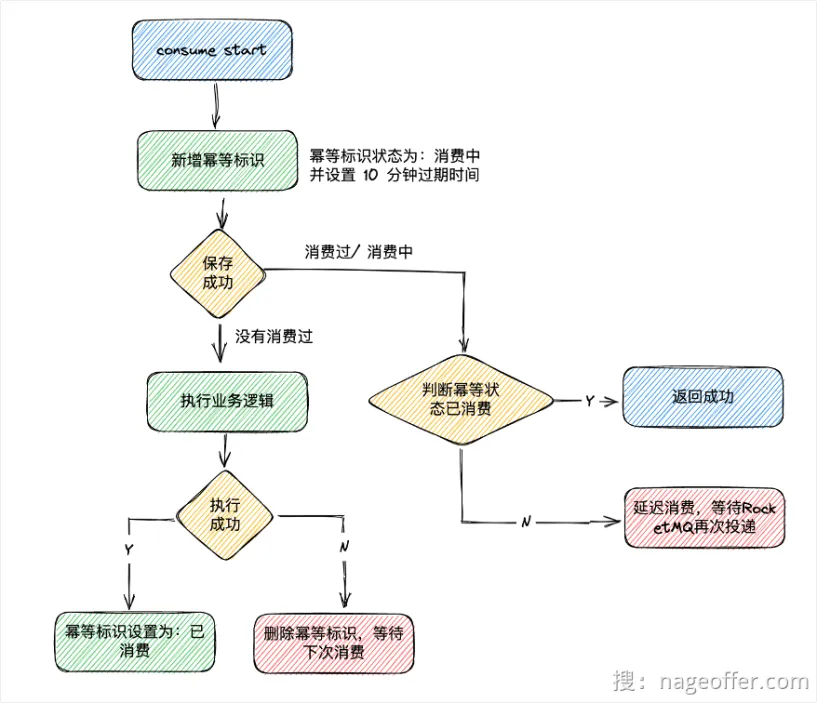

spel表达式：

```java
SpEL（Spring Expression Language）是 Spring 框架提供的一种表达式语言，用于在运行时评估表达式。它支持在 Spring 应用程序中进行动态求值和访问对象的属性、方法调用、运算符操作等。
SpEL表达式的语法类似于其他编程语言的表达式语言，具有以下特点：
1. 属性访问：可以使用点号（.）来访问对象的属性，例如 person.name。
2. 方法调用：可以通过在表达式中使用方法名和参数来调用对象的方法，例如 person.getName()。
3. 运算符操作：支持常见的算术运算符（如加减乘除）、逻辑运算符（如与、或、非）和比较运算符（如等于、大于、小于等）。
4. 条件表达式：支持条件表达式，例如三元运算符 condition ? value1 : value2。
5. ......

 key = "#message.getKeys()+'_'+#message.hashCode()"
 共分为三部分，第一部分，通过请求入参 message 对象，获取属性 keys 值，然后再获取 message 对象的 hashCode 值，通过 _ 的方式拼接在一起，就得到了本次请求的唯一幂等 Key。
```


**这里的技术点：使用切面AOP+SpringSpel表达式语言来实现动态的获取redis-key，再使用Redisson实现分布式锁。通过锁的机制防止出现幂等问题。然后还涉及到了各种设计模式，让代码更通用扩展性更强。**

## 4.3 实现日志组件
通过自定义注解+AOP实现类实现选择打印入参和出参。

1. 注解

```java
@Target({ElementType.TYPE, ElementType.METHOD})
@Retention(RetentionPolicy.RUNTIME)
public @interface ILog {

    /**
     * 入参打印
     *
     * @return 打印结果中是否包含入参，{@link Boolean#TRUE} 打印，{@link Boolean#FALSE} 不打印
     */
    boolean input() default true;

    /**
     * 出参打印
     *
     * @return 打印结果中是否包含出参，{@link Boolean#TRUE} 打印，{@link Boolean#FALSE} 不打印
     */
    boolean output() default true;
}
```

2. 打印的参数实体类：

```java
 @Data
public class ILogPrintDTO {

    /**
     * 开始时间
     */
    private String beginTime;

    /**
     * 请求入参
     */
    private Object[] inputParams;

    /**
     * 返回参数
     */
    private Object outputParams;
}

```

3. 切面类：

```java
@Aspect
public class ILogPrintAspect {

    /**
     * 打印类或方法上的 {@link ILog}
     */
    // @Around环绕通知，表示在方法的前后都会打印。@within表示这个注解放在类上，类下的所有方法都会被拦截。@annotation表示这个注解修饰方法，方法就会被拦截
    @Around("@within(org.opengoofy.index12306.framework.starter.log.annotation.ILog) || @annotation(org.opengoofy.index12306.framework.starter.log.annotation.ILog)")
    public Object printMLog(ProceedingJoinPoint joinPoint) throws Throwable {
        //这里使用SystemClock对高并发场景下System.currentTimeMillis()d的优化
        long startTime = SystemClock.now();
        //获取被拦截方法的签名
        MethodSignature methodSignature = (MethodSignature) joinPoint.getSignature();
        //这样创建日志器是为了动态地将日志的上下文绑定到目标类（即当前被拦截方法所属的类），从而实现灵活且准确的日志记录
        Logger log = LoggerFactory.getLogger(methodSignature.getDeclaringType());
        //DateUtil工具类，也是hutool提供
        String beginTime = DateUtil.now();
        Object result = null;
        try {
            //调用被拦截的方法
            result = joinPoint.proceed();
        } finally {
            //获取业务类的业务方法
            Method targetMethod = joinPoint.getTarget().getClass().getDeclaredMethod(methodSignature.getName(), methodSignature.getMethod().getParameterTypes());
            //获取业务方法上的ILog注解，或者业务方法上没有，获取业务类上的ILog注解
            ILog logAnnotation = Optional.ofNullable(targetMethod.getAnnotation(ILog.class)).orElse(joinPoint.getTarget().getClass().getAnnotation(ILog.class));
            if (logAnnotation != null) {
                ILogPrintDTO logPrint = new ILogPrintDTO();
                logPrint.setBeginTime(beginTime);
                if (logAnnotation.input()) {
                    logPrint.setInputParams(buildInput(joinPoint));
                }
                if (logAnnotation.output()) {
                    logPrint.setOutputParams(result);
                }
                String methodType = "", requestURI = "";
                try {
                    //RequestContextHolder是Spring的工具类，关联当前线程的请求上下文；getRequestAttributes获取方法的属性
                    //在 Web 环境下，返回的对象一般是 ServletRequestAttributes，它封装了对 HttpServletRequest 和 HttpServletResponse 的访问。
                    ServletRequestAttributes servletRequestAttributes = (ServletRequestAttributes) RequestContextHolder.getRequestAttributes();
                    assert servletRequestAttributes != null;
                    methodType = servletRequestAttributes.getRequest().getMethod();
                    requestURI = servletRequestAttributes.getRequest().getRequestURI();
                } catch (Exception ignored) {
                }
                log.info("[{}] {}, executeTime: {}ms, info: {}", methodType, requestURI, SystemClock.now() - startTime, JSON.toJSONString(logPrint));
            }
        }
        return result;
    }

    private Object[] buildInput(ProceedingJoinPoint joinPoint) {
        Object[] args = joinPoint.getArgs();
        Object[] printArgs = new Object[args.length];
        for (int i = 0; i < args.length; i++) {
            //过滤掉HttpServletRequest/HttpServletResponse类型的入参参数，避免暴露敏感信息
            if ((args[i] instanceof HttpServletRequest) || args[i] instanceof HttpServletResponse) {
                continue;
            }
            //二进制数组和文件信息也不能暴露
            if (args[i] instanceof byte[]) {
                printArgs[i] = "byte array";
            } else if (args[i] instanceof MultipartFile) {
                printArgs[i] = "file";
            } else {
                printArgs[i] = args[i];
            }
        }
        return printArgs;
    }
}
```

4. 自动配置；

```java
public class LogAutoConfiguration {

    /**
     * {@link ILog} 日志打印 AOP 切面
     */
    @Bean
    public ILogPrintAspect iLogPrintAspect() {
        return new ILogPrintAspect();
    }
}
```

5. 配置自动引入，因为这个是一个Starter，在resources/META-INF/spring新增org.springframework.boot.autoconfigure.AutoConfiguration.imports文件

```java
org.opengoofy.index12306.framework.starter.log.config.LogAutoConfiguration
```

```java
日志注解：
	可以在类上和方法上面。属性：input入参打印，output出参打印
	打印实体：beginTime开始时间、inputParams入参对象，outputParams出参对象
AOP切面类：
	执行完业务逻辑之后，打印请求方式、请求路径、执行时间、日志打印实体（开始时间、入参对象、出参对象）
```

# 五、核心业务
## 5.1 如何发起支付？
购买车票的时候会发起支付，这里可以为自己和他人购买车票，都必须要完成身份验证。

发起支付的流程：

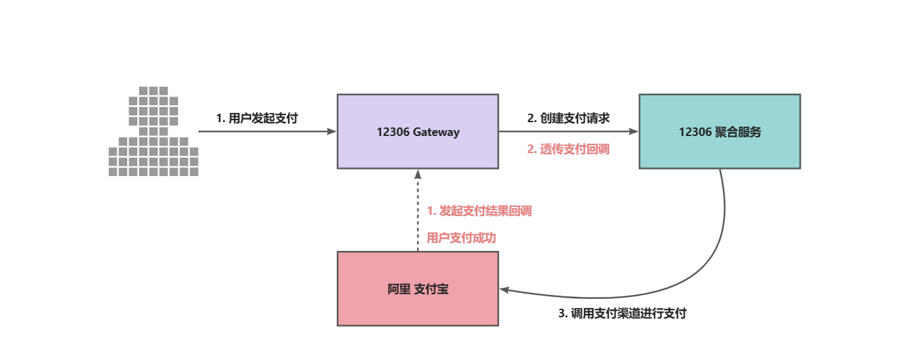

**所需内网穿透：**因为支付宝回调的结果必须是一个互联网上能够访问到的地址，所以这里需要进行内网穿透将内网的接口暴露出去，接收支付宝支付的结果回调。这里使用的是Natapp。[NATAPP1分钟快速新手图文教程 - NATAPP-内网穿透 基于ngrok的国内高速内网映射工具](https://natapp.cn/article/natapp_newbie)

内网穿透完之后替换pay服务里面的支付接口地址。

沙箱支付的账号密码：

支付账户名：ahlbks5547@sandbox.com

密码：111111

支付接口变化流程：

1.  下单接口：http://localhost:5175/api/ticket-service/ticket/purchase/v2
2. 下单后会进行一个查询订单的操作：http://localhost:5175/api/order-service/order/ticket/query?orderSn=501139943793536568576
3. 支付接口： http://localhost:5175/api/pay-service/pay/create
4. 支付订单检查接口：http://localhost:5175/api/pay-service/pay/query/order-sn?orderSn=501139943793536568576
5. 支付成功后的查询订单根据用户：   
http://localhost:5175/api/order-service/order/ticket/page?userId=1683025552364568576&current=1&size=10&statusType=0

[https://collect.alipay.com/yuyan/?biztype=yuyanmonitorl](https://collect.alipay.com/yuyan/?biztype=yuyanmonitorl)

[https://excashier-sandbox.dl.alipaydev.com/standard/queryQRStatus.json?payOrderId=4e6d67a12a024fbebabbb7bae8edd84d.00&_input_charset=utf-8&ctoken=1QHstnUG1128I7t-&_=1731807951873](https://excashier-sandbox.dl.alipaydev.com/standard/queryQRStatus.json?payOrderId=4e6d67a12a024fbebabbb7bae8edd84d.00&_input_charset=utf-8&ctoken=1QHstnUG1128I7t-&_=1731807951873)

[https://excashier-sandbox.dl.alipaydev.com/standard/renewQRCode.json?payOrderId=4e6d67a12a024fbebabbb7bae8edd84d.00&_input_charset=utf-8&ctoken=1QHstnUG1128I7t-&_=1731807970375](https://excashier-sandbox.dl.alipaydev.com/standard/renewQRCode.json?payOrderId=4e6d67a12a024fbebabbb7bae8edd84d.00&_input_charset=utf-8&ctoken=1QHstnUG1128I7t-&_=1731807970375)

**深入：**

```java
//提交订单接口：/api/ticket-service/ticket/purchase/v2
@ILog
@Idempotent(
        uniqueKeyPrefix = "index12306-ticket:lock_purchase-tickets:",
        key = "T(org.opengoofy.index12306.framework.starter.bases.ApplicationContextHolder).getBean('environment').getProperty('unique-name', '')"
                + "+'_'+"
                + "T(org.opengoofy.index12306.frameworks.starter.user.core.UserContext).getUsername()",
        message = "正在执行下单流程，请稍后...",
        scene = IdempotentSceneEnum.RESTAPI,
        type = IdempotentTypeEnum.SPEL
)
@PostMapping("/api/ticket-service/ticket/purchase/v2")
public Result<TicketPurchaseRespDTO> purchaseTicketsV2(@RequestBody PurchaseTicketReqDTO requestParam) {
    return Results.success(ticketService.purchaseTicketsV2(requestParam));
}
```


## 5.2 车票搜索为什么使用ES而不是Redis
12306列车数据搜索具有多个搜索条件，包括单程/往返、出发地、目的地、出发日期/返程日期、乘客类型、车次类型、出发车站、到达车站、车次席别、发车时间、显示积分兑换车次以及显示全部可预订车次等。这些条件使搜索功能变得复杂，但在实际使用中，大部分条件是前端筛选，而不是每个条件都会发起后端请求。

在这种情况下，Redis作为列车数据的缓存存储是有道理的，原因如下：

1. 实时性： Redis 以内存为基础，具有极低的读取延迟，可以快速响应实时查询请求，这对于需要即时更新的列车数据非常重要。单程或往返、出发日期等条件可以通过快速的 Redis 查询来满足。
2. 缓存： Redis 是一个出色的缓存数据库，可以用于缓存热门的列车路线和查询结果，从而减轻后端数据库的负载。对于需要被查询的路线，可以将其结果缓存在 Redis 中，以提高响应速度。
3. 简单性： Redis 的数据模型相对简单，适合存储简单的键值对或一些常规数据结构。这使得 Redis 适合存储一些搜索条件，如出发地、目的地、车次类型等，以便快速筛选结果。
4. 部署成本： Redis 是一款轻量级的数据库，易于部署和维护。它的内存占用相对较低，可以在相对较小的硬件配置上运行，从而减少了部署成本。
5. 只需后端查询一次： 在实际操作中，页面上的搜索条件大多是前端筛选，而只有在点击查询按钮时才会发起后端请求。因此，Redis 可以用于快速存储和检索列车数据，而 Elasticsearch 等搜索引擎可以在需要进行全文搜索或复杂查询时使用。

总的来说，Redis 作为列车数据的缓存存储在实时性、并发性和部署成本方面具有一些优势，尤其适用于快速检索和缓存常用路线数据。然而，对于复杂的全文搜索和高级查询需求，可以考虑将 Redis 与 Elasticsearch 等搜索引擎结合使用，以充分发挥它们各自的优势。

## 5.3 如何完成列车数据检索？
**验证数据是否正确：**

查询列车数据 Service 实现层接口第一行代码，就是通过责任链模式验证数据是否必填以及城市数据是否存在等执行逻辑。

通过责任链容器调用底层实现：

```java
ticketPageQueryAbstractChainContext.handler(TicketChainMarkEnum.TRAIN_QUERY_FILTER.name(), requestParam);
```

**加载城市的数据：**

12306 站点查询实际功能中，比如你搜索了北京南到杭州东的搜索条件，它会帮你列出北京到杭州所有的列车车次。这个很好实现，直接通过站点关联到城市，通过城市查询列车即可。

我们在缓存中，有一个 Hash 结构数据，专门负责保存列车站点 Code 值与城市之间的关联关系。

**查询列车站点信息：**

列车站点数据存入 Redis 中，结构如下：

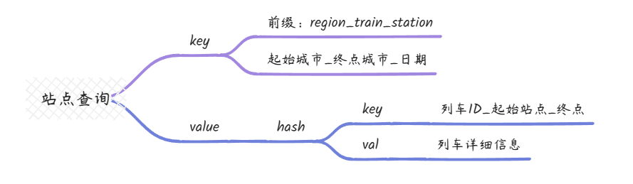

查询列车余票信息：

列车基本信息已经全部填充完毕了，接下来就是查询列车余票信息并填充到基本信息中。

上面讲过，列车余票数据是实时变更的，如果在存储到基本信息中，就没办法变更了，所以单独存储。

构建列车返回数据：

查看 12306 列车查询页可知，会存在不同的查询条件，这些查询条件都是通过本次查询所有列车数据构建出来的。大家可以尝试下，不同地区的不同查询列车数据，车次类型、出发车站、到达车站以及车次席别都不同。

## 5.4 注册用户如何防止缓存穿透
在高并发的会员注册场景下，可能会出现缓存穿透问题。主要原因可能是：

+ 用户注册时，需要验证用户名是否已存在，这通常需要查询数据库。
+ 如果缓存中没有该用户名，就会去数据库查询，如果数据库中也没有，就可以判断该用户名可用。
+ 在高并发的情况下，可能有大量的新用户同时注册，输入的用户名极有可能都不存在于数据库中。这将导致大量的缓存不存在，都去查询数据库，造成数据库压力剧增。
+ 且这些查询数据库的 Key 都不会被缓存，因为数据库中没有，不会写入缓存。那么这些 Key 对应的 Null 值也不会被缓存，造成每次请求都查不到缓存，直接查询数据库。
+ 这样就形成了缓存穿透情况。

而且极端情况下，注册的流程可能时恶意请求访问。注册请求缓存穿透流程图如下：

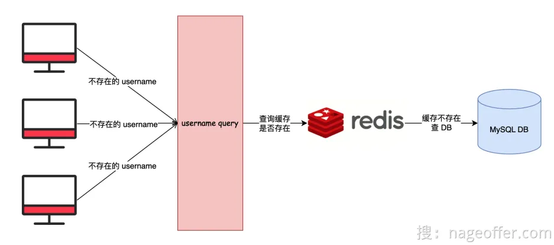**常见的解决方案：**

所以，在用户注册场景下，需要注意防止缓存穿透，常见的处理方式有下述这些：

1. 对不存在的 Key 进行缓存，值设为 Null，并设置短暂过期时间，如 60 秒。
2. 使用布隆过滤器，将所有已注册的用户名存入布隆过滤器，判断时先判断该用户名是否在布隆过滤器中，不在的一定不存在，避免直接查询数据库。
3. 使用确定的数据结构如 Redis 的 Set 集合来存储已注册用户名，判断时检查是否在集合内。
4. 针对高并发注册场景，可以先查询缓存，如果不命中则使用分布式锁来保证只有一个线程访问数据库，避免重复查询。

但是，从真实业务场景来看，上面这些解决方案都存在弊端，不能适用于真实场景。

接下来我带大家一一解析，这些解决思路到底为什么不能用。

### 1. 不存在的 Key 进行缓存值设为 Null
对不存在的 Key 进行缓存，值设为 Null，并设置短暂过期时间，如 60 秒。

+ 假设用户 A 注册 username 为 magestack，查询 DB 不存在，返回请求成功，并放入 Redis 缓存。但是用户 A 并没有使用该值作为 username。
+ 如果有另一个用户 B 注册 username 为 magestack，将返回失败。也就是说每尝试一次不存在的用户名，该值 60 秒内都不可被注册。

结论：对用户使用体验不友好。此外，如果有大量并发请求查询不存在的用户名，可能会导致数据库短时间内被打挂。

### 2. 布隆过滤器
使用布隆过滤器，将所有已注册的用户名存入布隆过滤器，判断时先判断该用户名是否在布隆过滤器中，不在的一定不存在，避免直接查询数据库。

+ 这种解决方案算是网上八股说的比较多的一个版本。但是依然不能解决实际场景问题。
+ 如果用户注销了账号，该用户名就可以再次被使用。然而，布隆过滤器由于无法删除元素，因此无法处理这种情况。

结论：布隆过滤器不能删除元素的限制，导致该方案无法正式使用生产。

### 3. Redis Set 存储已注册用户名
使用确定的数据结构如 Redis 的 Set 集合来存储已注册用户名，判断时检查是否在集合内。

+ 永久存储十几亿的用户信息到 Redis 缓存中显然不太现实，因为这会占用大量的内存资源。
+ 即使是临时存储，如果在缓存中查询不到数据，仍然无法避免查询数据库的场景。
+ 此外，对于这么多的用户信息，是否应该将其存储在一个 Key 中呢？显然是不可行的。即使进行分片，也会增加系统的复杂度。

结论：由于该方案占用内存较多且复杂度较高，因此不适合实际应用。

### 4. 分布式锁
针对高并发注册场景，可以先查询缓存，如果不命中则使用分布式锁来保证只有一个线程访问数据库，避免重复查询。

+ 相对于上述解决方案，该方案在一定程度上可以解决会员注册缓存穿透的问题。
+ 但是，如果在用户注册高峰期，只有一个线程访问数据库，这可能会导致大量用户的注册请求缓慢或超时。

结论：这对用户的使用体验来说并不友好，因此我们不建议使用该方案

### 12306是如何解决？
通过布隆过滤器+一层缓存实现。

解决方案流程图：

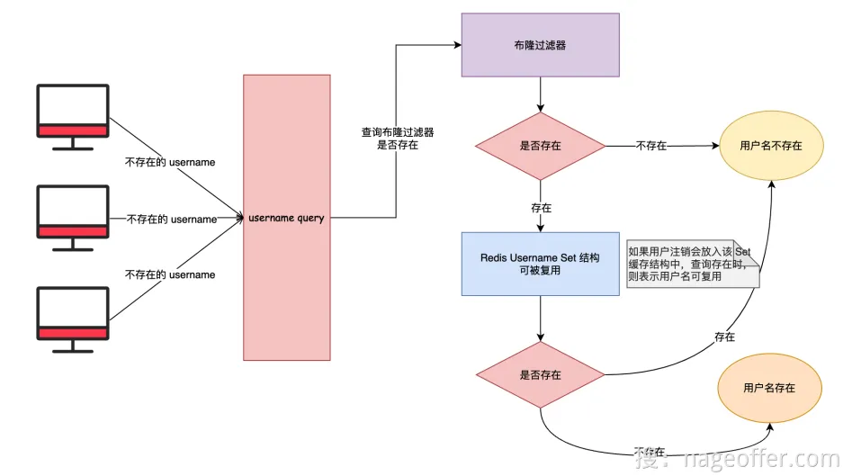假设我们有一条用户名为 "mading" 的数据，注册后是如何不被重复注册，以及注销后又是如何能被再次使用的。

1. 用户名 "mading" 成功注册后，将其添加至布隆过滤器。
2. 当其他用户查询"mading"是否已被使用时，首先检查布隆过滤器是否包含该用户名。
3. 如果布隆过滤器中不存在该用户名，根据布隆过滤器的特点，可以确认该用户名一定没有被使用过，因此返回成功，证明该用户名可用。
4. 如果布隆过滤器中存在该用户名，进一步检查Redis Set结构中是否包含该用户名。如果存在，表示该用户名已被注销，同样可被再次使用。
5. 如果布隆过滤器中存在该用户名，但 Redis Set 结构中不存在，说明该用户名已被使用且尚未被注销，因此不可用。

1）Redis Set 结构是什么？

当用户注销后，系统会将其用户名放入缓存结构中。如果其他用户想要使用该用户名，会检查缓存是否存在该用户名。如果缓存中存在该用户名，就表示该用户名已被注销，可以被再次使用。

2）使用这种方式后，会面临以下问题：

1. 查询性能消耗增加：由于采用了额外的 Redis Set 结构，查询过程需要进行两次查询，一次是查询布隆过滤器，另一次是查询Redis Set结构，这导致查询性能相比之前有所增加。
2. 存储损耗增加：相较于之前仅使用布隆过滤器的存储，现在需要额外存储 Redis Set 结构，这导致存储开销增加。

3）上面这种方式真的是没有问题的么？

有一个问题可能会出现：如果用户频繁申请账号再注销，可能导致用户注销可复用的 Username Redis Set 结构变得庞大，增加了存储和查询的负担。

为了防止这种情况，我采取了以下解决方案：

1. 异常行为限制：每次用户注销时，记录用户的证件号，并限制证件号仅可用于注销五次。超过这个限制的次数，将禁止该证件号再次用于注册账号。
2. 缓存分片处理：对 Username Redis Set 结构进行分片。即使我们对异常行为进行了限制，如果有大量用户注销账户，存储这些数据在一个 Redis Set 结构中可能成为一个灾难，可能出现 Redis 大 Key 问题。因此，我将 Set 结构进行分片，根据用户名的 HashCode 进行取模操作，将数据分散存储在 1024 个 Set 结构中，从而有效地解决了这个问题。

## 5.5 注册用户接口的实现逻辑
考虑到用户量过大，对t_user进行了分库分表。

[手摸手之用户如何实现分库分表 (yuque.com)](https://www.yuque.com/magestack/12306/pb98neetmww1rr9y)

**注册流程图：**

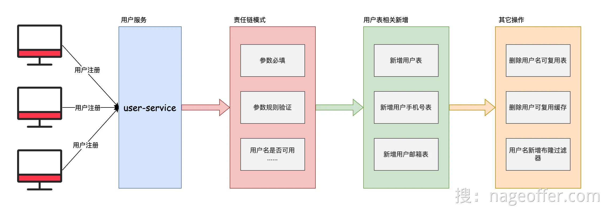

## 5.6 用户的分库分表
**什么是分库分表：**

从原理上说，分库是将原本的单库拆分为多个库，分表是将原来的单表拆分为多个表。

垂直拆分就是按照业务进行拆分，水平拆分按照某个字段或者某种规则将数据分散到多个库或者表中。

分库有两种模式：

+ 垂直拆库：电商库 MallDB，业务拆分后就是 UserDB、OrderDB、PayDB...
+ 分片拆库：用户库 UserDB，分片库后就是 UserDB_0、UserDB_1、UserDB_xx

分表也有两种模式：

+ 垂直拆分：订单表 OrderTable，拆分后就是 OrderTable 以及 OrderExtTable。
+ 水平拆分：订单表 OrderTable，拆分后就是 OrderTable_0、 OrderTable_xxx。

**什么场景下需要分库分表：**

1）什么场景下分表？数据量过大或者数据库表对应的磁盘文件过大。

Q：多少数据量进行分表？

A：单表 1000w 是否要分表？回答不够标准。

假设一个表里 15 个字段，没有特别大的值（不包含 text 或其它超长度的列）数据量超过 5000 万了，依然很丝滑，因为走索引。

真正需要考虑的是：业务的增长量以及历史数量。

Q：物理文件过大，会有什么问题？

A：会影响公司对数据库表的一个备份。数据库表文件过大，也间接证明表数据过大，增加或删除字段导致锁表的时间过长。 


2）什么场景下分库？

当数据库的连接不够客户端使用时，可以考虑分库或读写分离。

如果说当数据库的 QPS 越来越高以及数据量越来越大的时候，就需要考虑分库分表。

Q：为什么说连接不够用？

A：假设 MySQL Server 能支持 4000 个数据库连接。我们有 10 个服务，40 个节点，一个节点呢数据库连接池最多 10 个。这样就把一个 MySQL Server 的连接数压榨干净了。

当 MySQL 连接不够用时，可能会报错 "Too many connections" 或者类似的错误。这是因为 MySQL 服务器同时可以处理的连接数量是有限制的，当连接数达到这个限制时，服务器就会拒绝新的连接请求，并返回这个错误消息。


3）什么场景下分库又分表？

+ 高并发写入场景：当应用面临高并发的写入请求时，单一数据库可能无法满足写入压力，此时可以将数据按照一定规则拆分到多个数据库中，每个数据库处理部分数据的写入请求，从而提高写入性能。
+ 数据量巨大场景：随着数据量的不断增加，单一数据库的存储和查询性能可能逐渐下降。此时，可以将数据按照一定的规则拆分到多个表中，每个表存储部分数据，从而分散数据的存储压力，提高查询性能。

**分库分表组件：**

ShardingSphere-JDBC

```plain
定位为轻量级 Java 框架，在 Java 的 JDBC 层提供的额外服务。 它使用客户端直连数据库，以 jar 包形式提供服务，无需额外部署和依赖，可理解为增强版的 JDBC 驱动，完全兼容 JDBC 和各种 ORM 框架。
● 适用于任何基于 JDBC 的 ORM 框架，如：JPA, Hibernate, Mybatis, Spring JDBC Template 或直接使用 JDBC；
● 支持任何第三方的数据库连接池，如：DBCP, C3P0, BoneCP, HikariCP 等；
● 支持任意实现 JDBC 规范的数据库，目前支持 MySQL，PostgreSQL，Oracle，SQLServer 以及任何可使用 JDBC 访问的数据库。
```

ShardingSphere-Proxy

```plain
定位为透明化的数据库代理端，通过实现数据库二进制协议，对异构语言提供支持。 目前提供 MySQL 和 PostgreSQL 协议，透明化数据库操作，对 DBA 更加友好。
● 向应用程序完全透明，可直接当做 MySQL/PostgreSQL 使用；
● 兼容 MariaDB 等基于 MySQL 协议的数据库，以及 openGauss 等基于 PostgreSQL 协议的数据库；
● 适用于任何兼容 MySQL/PostgreSQL 协议的的客户端，如：MySQL Command Client, MySQL Workbench, Navicat 等。
```

JDBC和Proxy的优劣势：

```plain
● JDBC： 
  ○ 优点：性能较高，通过 JDBC 直接向 MySQL 发起请求调用。
  ○ 优点：使用较为简单，理论上无需修改代码，仅需使用 ShardingSphere 的配置即可。
  ○ 缺点：需要修改项目配置以及引入 Jar 包。
  ○ 缺点：对应用的内存有一定影响。
● Proxy： 
  ○ 优点：无需对现有项目做任何配置或代码变更，将数据库的地址改为 Proxy 的地址即可。
  ○ 优点：Proxy 对 Java 应用内存没有任何影响。
  ○ 优点：分片后无法知道一条数据记录到底在那张表，Proxy 是屏蔽了分片逻辑，可直接操作逻辑表。
  ○ 缺点：JDBC 操作 MySQL 是点对点的，但是 Proxy 多了一层链路。

为什么选择 ShardingSphere？
● 拥有活跃的社区，能够提供及时的技术支持和更新；
● 代码质量极高，经过严格测试和验证，稳定可靠；
● 提供丰富的功能，满足多样化的业务需求。
```

**用户分库分表策略：**

根据系统设计的假设，12306 的注册用户规模约为 10 亿，每年新增用户约 1000 万。

在用户数据分库或分表之前，我们需要先考虑拆分成多少个库或表才能达到最优性能。为了进行这样的决策，我们可以预估单个表的最大数据量。根据过去的经验，通常我们会选择 2000 万作为一个经验值。这个数据量既不会过小，同时又能保证增删改查等操作相对流畅。

根据当前用户表的数据量为 10 亿，并且每年新增 1000 万用户，预估未来系统的生命周期较长，数据量大概会达到 30 亿左右。基于这个数据量，我们预估单表的数据量在 2000 万左右，因此需要分大约 150 张表来容纳这些数据。

在进行分库分表容量评估时，我们通常会尽可能多地进行评估。这样做的好处是，即使每张表的数据量不多，也能及早发现拆分后是否存在数据问题，以便及时进行调整和优化。

此外，需要特别指出的是，我们对表数据量考虑的阈值相对较小，这是因为我们的系统具备良好的可扩展性，可以轻松应对大量的数据增长。因此，基于这种情况的分库分表策略，即使在几百年后，这个分库分表依然能够处理数据，并且不会出现性能问题。这为我们的系统提供了稳定可靠的性能保障。

**选择用户分片键：**

选择分库分表中的分片键（Sharding Key）是一个关键决策，它直接影响了分库分表的性能和可扩展性。以下是一些选择分片键的关键因素：

1. 访问频率：选择分片键应考虑数据的访问频率。将经常访问的数据放在同一个分片上，可以提高查询性能和降低跨分片查询的开销。
2. 数据均匀性：分片键应该保证数据的均匀分布在各个分片上，避免出现热点数据集中在某个分片上的情况。
3. 业务关联性：分片键应该与业务关联紧密，这样可以避免跨分片查询和跨库事务的复杂性。
4. 数据不可变：一旦选择了分片键，它应该是不可变的，不能随着业务的变化而频繁修改。

基于以上考虑，我们选择使用 username 作为分片键。

**使用JDBC进行分库分表：**

1. 引入ShardingSphere依赖：

```xml
<dependency>
    <groupId>org.apache.shardingsphere</groupId>

    <artifactId>shardingsphere-jdbc-core</artifactId>

    <version>5.3.2</version>

</dependency>

```

1. 在application.yml定义分片规则：

```yaml
spring:
  datasource:
      # ShardingSphere 对 Driver 自定义，实现分库分表等隐藏逻辑
    driver-class-name: org.apache.shardingsphere.driver.ShardingSphereDriver
    # ShardingSphere 配置文件路径
    url: jdbc:shardingsphere:classpath:shardingsphere-config.yaml
```

1. 分片配置：

```yaml
# 数据源集合
dataSources:
  ds_0:
    dataSourceClassName: com.zaxxer.hikari.HikariDataSource
    driverClassName: com.mysql.cj.jdbc.Driver
    jdbcUrl: jdbc:mysql://127.0.0.1:3306/12306_user_0?useUnicode=true&characterEncoding=UTF-8&rewriteBatchedStatements=true&allowMultiQueries=true&serverTimezone=Asia/Shanghai
    username: root
    password: root

  ds_1:
    dataSourceClassName: com.zaxxer.hikari.HikariDataSource
    driverClassName: com.mysql.cj.jdbc.Driver
    jdbcUrl: jdbc:mysql://127.0.0.1:3306/12306_user_1?useUnicode=true&characterEncoding=UTF-8&rewriteBatchedStatements=true&allowMultiQueries=true&serverTimezone=Asia/Shanghai
    username: root
    password: root

rules:
  - !SHARDING
    tables:
      t_user:
        # 真实数据节点，比如数据库源以及数据库在数据库中真实存在的
        actualDataNodes: ds_${0..1}.t_user_${0..15}
        # 分库策略
        databaseStrategy:
          # 用于单分片键的标准分片场景
          standard:
            # 分片键
            shardingColumn: username
            # 分片算法，对应 rules[0].shardingAlgorithms
            shardingAlgorithmName: user_database_hash_mod
        # 分表策略
        tableStrategy:
          # 用于单分片键的标准分片场景
          standard:
            # 分片键
            shardingColumn: username
            # 分片算法，对应 rules[0].shardingAlgorithms
            shardingAlgorithmName: user_table_hash_mod
    # 分片算法
    shardingAlgorithms:
      # 数据库分片算法
      user_database_hash_mod:
        # 根据分片键 Hash 分片
        type: HASH_MOD
        # 分片数量
        props:
          sharding-count: 2
      # 数据表分片算法
      user_table_hash_mod:
        # 根据分片键 Hash 分片
        type: HASH_MOD
        # 分片数量
        props:
          sharding-count: 16
# 展现逻辑 SQL & 真实 SQL
props:
  sql-show: true
```

## 5.7 乘车人**技术亮点：**
本章节通过乘车人查询和修改接口给大家带来 HTTP 接口防重复提交、SpEL以及缓存与数据一致性等核心技术点。

HTTP接口防重复提交可以使用幂等组件封装的注解。

**缓存一致性：**

通过直连数据库版本得知，咱们根据用户名查询乘车人都是全部直接调用数据库的。这种模式在高并发海量流量的场景下，数据库会秒挂。

为此，我们需要通过缓存来防止请求直接打到数据库。封装的缓存组件 safeGet 的作用就是，如果缓存中有，那么就从缓存中返回，如果缓存中没有，就查询数据库，并将查询数据库的结果，同步到缓存。

会涉及到一个缓存击穿的问题，底层原理具体可以看我们这篇文章：[缓存击穿之双重判定锁如何优化性能？ (yuque.com)](https://www.yuque.com/magestack/12306/xrtg5mibquardvvi)

思考一个问题，我们在抢票前，一般是不会查询乘车人数据的。拿着就会造成一个问题，抢票时会有大量请求去读读取数据库获取乘车人信息，进而造成数据库压力增加。这种问题如何解决？

是否能够在节假日前，把所有用户的乘车人数据加载到缓存？

不行。因为这种数据信息会非常大，对 Redis 内存的压力会变大，并且这些数据不够精准，因为大部分不会进行购票使用。

我想到一个方案，那就是当用户登录 12306 系统时，可以执行一个异步任务，让这个异步任务去读取数据库的乘车人数据并放入缓存。这样的话，既不影响登录操作，又可以减轻高并发情况下数据库的负载，完美。

乘车人数据变更了怎么办？

既然我们已经把乘车人数据放到了缓存里，而且用户还能修改乘车人的数据信息。那就不得不面对一个问题，缓存和数据库的数据一致性如何保证？

因为我们已经写了比较详细的缓存与数据库数据一致性文档，这里就不再赘述。直接说解决方案：先写数据库，后删除缓存。

具体缓存与数据库一致性方案查看文档：[缓存与数据库一致性如何解决？](https://www.yuque.com/magestack/12306/wocbrht50ctg14nv#KxkCP)

## 5.8 乘车人分库分表
**分库分表的逻辑：**

乘车人的数据严重依赖于用户数据。每个用户至少需要有一个对应的乘车人，即自己本人。当然，也有可能是其他人，因为允许用户注册账号后为他人购票的情况。这种关联确保了用户和乘车人之间的正确映射，使系统能够准确地处理购票和相关信息。

根据上述前提，让我们进行一些分析，来看看哪些因素会影响乘车人数据量：

1. 首先，每个用户至少会有一个对应的乘车人信息。因此，乘车人数据量至少等于用户数据量。
2. 对于情侣购票用户，有两种情况：一种是普通场景下只有一人购票，另一种是在极端情况下，双方都添加乘车人信息，以便更方便地抢票。
3. 家庭购票用户可能会在一次购票中为全家人购买车票。不过，也有可能其他家庭成员并没有注册 12306 账号。
4. 职场购票用户中，可能会有一人代表多名员工出差，购买所有人员的车票。

当然，上述因素并不能穷举所有情况。因此，在系统设计时，我们综合考虑各种情况得出一个经验值，即乘车人数据量约为用户数据量的 4 倍。虽然这个估算可能不是完全准确，但我们希望能在容量规划时考虑到一定的宽裕余量。

对于分库分表容量评估，我们通常会尽可能地进行全面的评估。这样做的好处是，即使每张表的数据量不大，也能及早发现拆分后是否存在数据问题，以便及时进行调整和优化。

需要特别指出的是，我们对表数据量的考虑阈值相对较小，这是因为我们的系统具备良好的可扩展性，能够轻松应对大量的数据增长。因此，基于这样的分库分表策略，即使在几百年后，这个分库分表仍能处理数据且不会出现性能问题。这为我们的系统提供了稳定可靠的性能保障。

**选择分片键：**

选择分库分表中的分片键（Sharding Key）是一个关键决策，它直接影响了分库分表的性能和可扩展性。以下是一些选择分片键的关键因素：

1. 访问频率：选择分片键应考虑数据的访问频率。将经常访问的数据放在同一个分片上，可以提高查询性能和降低跨分片查询的开销。
2. 数据均匀性：分片键应该保证数据的均匀分布在各个分片上，避免出现热点数据集中在某个分片上的情况。
3. 业务关联性：分片键应该与业务关联紧密，这样可以避免跨分片查询和跨库事务的复杂性。
4. 数据不可变：一旦选择了分片键，它应该是不可变的，不能随着业务的变化而频繁修改。

乘车人数据的查询必然会涉及到用户信息，而我们的用户表是按照 username 进行分片的。鉴于这些因素，我们决定将 username 作为乘车人表的分片键。

## 5.9 如何对敏感信息进行加密存储
需求背景：安全部门规定需将涉及用户敏感信息，例如银行、手机号码等进行加密后存储到数据库，在使用的时候再进行解密处理。

**实现：**

1. 引入ShardingSphere依赖

```plain
<dependency>
    <groupId>org.apache.shardingsphere</groupId>

    <artifactId>shardingsphere-jdbc-core</artifactId>

    <version>5.3.2</version>

</dependency>

```

1. `application.yaml` 配置文件修改配置，将数据库驱动变更为 ShardingSphere Driver

```yaml
spring:
  datasource:
    driver-class-name: org.apache.shardingsphere.driver.ShardingSphereDriver
    url: jdbc:shardingsphere:classpath:shardingsphere-config.yaml
```

1. 并配置 `shardingsphere-config.yaml` 相关配置。为了方便大家理解，我把分库分表的相关配置删除了，仅保留了加密相关的配置。

```yaml
# 配置数据源，底层被 ShardingSphere 进行了代理
dataSources:
  ds_0:
    dataSourceClassName: com.zaxxer.hikari.HikariDataSource
    driverClassName: com.mysql.cj.jdbc.Driver
    jdbcUrl: jdbc:mysql://127.0.0.1:3306/12306_user_0?useUnicode=true&characterEncoding=UTF-8&rewriteBatchedStatements=true&allowMultiQueries=true&serverTimezone=Asia/Shanghai
    username: root
    password: root

rules:
# 数据加密存储规则
  - !ENCRYPT
    # 需要加密的表集合
    tables:
      # 用户表
      t_user:
        # 用户表中哪些字段需要进行加密
        columns:
          # 身份证字段，逻辑字段，不一定是在数据库中真实存在
          id_card:
            # 身份证字段存储的密文字段，这个是数据库中真实存在的字段
            cipherColumn: id_card
            # 身份证字段加密算法
            encryptorName: common_encryptor
          phone:
            cipherColumn: phone
            encryptorName: common_encryptor
          mail:
            cipherColumn: mail
            encryptorName: common_encryptor
          address:
            cipherColumn: address
            encryptorName: common_encryptor
        # 是否按照密文字段查询
        queryWithCipherColumn: true
    # 加密算法
    encryptors:
      # 自定义加密算法名称
      common_encryptor:
        # 加密算法类型
        type: AES
        props:
          # AES 加密密钥
          aes-key-value: d6oadClrrb9A3GWo
props:
  sql-show: true
```

**实现原理：**加密模块将用户发起的 SQL 进行拦截，并通过 SQL 语法解析器进行解析、理解 SQL 行为，再依据用户传入的加密规则，找出需要加密的字段和所使用的加解密算法对目标字段进行加解密处理后，再与底层数据库进行交互。 

Apache ShardingSphere 会将用户请求的明文进行加密后存储到底层数据库；并在用户查询时，将密文从数据库中取出进行解密后返回给终端用户。 通过屏蔽对数据的加密处理，使用户无需感知解析 SQL、数据加密、数据解密的处理过程，就像在使用普通数据一样使用加密数据。

**加密功能的扩展：**

如果大家理解了上面说的加密逻辑，我们假设有个新上线的业务，使用这种模型是完全没有问题的。但是，我们再深度思考个问题，如果说数据库表中已经有这种明文的敏感信息了，如何解决？

首先需要对这个敏感信息清洗成密文的数据，其次为了保障业务可能，需要是不停机清洗的那种。

参考链接：[如何防止用户敏感数据泄露 (yuque.com)](https://www.yuque.com/magestack/12306/cd9zbuugg663qsu4)

[数据加密 :: ShardingSphere (apache.org)](https://shardingsphere.apache.org/document/current/cn/reference/encrypt/)

[数据加密 :: ShardingSphere (apache.org)](https://shardingsphere.apache.org/document/current/cn/features/encrypt/)

[数据加密 :: ShardingSphere (apache.org)](https://shardingsphere.apache.org/document/current/cn/user-manual/shardingsphere-jdbc/yaml-config/rules/encrypt/)

## 5.10 如何对敏感信息进行脱敏？
**业务需求：**

将用户敏感信息脱敏展示到前端是出于保护用户隐私和信息安全的考虑。

敏感信息包括但不限于手机号码、身份证号、银行卡号等，这些信息泄露可能导致用户个人信息的滥用、身份盗用等严重问题。脱敏是一种常用的保护用户隐私的方式，它的目的是减少潜在的风险，同时保持一定的用户信息可读性。

**实现：**

1. 技术选型：网上很多教程都是在说，通过 AOP、自定义注解和反射的方式完成字段脱敏功能。但是这种方式有点重量级且性能一般，遇到高并发场景存在性能瓶颈。	为此，我想是否存在一种更为轻量级的脱敏技术实现？在网上搜索后，找到了一种比较符合我预期的实现方案：Jackson
2. 思路：在 SpringMVC 返回数据时，通过默认的 Jackson 序列化器进行指定，替换为咱们已经包装后的序列化器，这样就能依赖现有解决方案，降低技术复杂度。
3. 实现：定义手机号和证件号的 Jackson 自定义序列化器，并在对应需要脱敏的敏感字段上指定自定义序列化器。

```java
package org.opengoofy.index12306.biz.userservice.serialize;

import cn.hutool.core.util.DesensitizedUtil;
import com.fasterxml.jackson.core.JsonGenerator;
import com.fasterxml.jackson.databind.JsonSerializer;
import com.fasterxml.jackson.databind.SerializerProvider;

import java.io.IOException;

/**
 * 身份证号脱敏反序列化
 *
 * @公众号：马丁玩编程，回复：加群，添加马哥微信（备注：12306）获取项目资料
 */
public class IdCardDesensitizationSerializer extends JsonSerializer<String> {

    @Override
    public void serialize(String idCard, JsonGenerator jsonGenerator, SerializerProvider serializerProvider) throws IOException {
        String phoneDesensitization = DesensitizedUtil.idCardNum(idCard, 4, 4);
        jsonGenerator.writeString(phoneDesensitization);
    }
}
```

```java
package org.opengoofy.index12306.biz.userservice.serialize;

import cn.hutool.core.util.DesensitizedUtil;
import com.fasterxml.jackson.core.JsonGenerator;
import com.fasterxml.jackson.databind.JsonSerializer;
import com.fasterxml.jackson.databind.SerializerProvider;

import java.io.IOException;

/**
 * 手机号脱敏反序列化
 *
 * @公众号：马丁玩编程，回复：加群，添加马哥微信（备注：12306）获取项目资料
 */
public class PhoneDesensitizationSerializer extends JsonSerializer<String> {

    @Override
    public void serialize(String phone, JsonGenerator jsonGenerator, SerializerProvider serializerProvider) throws IOException {
        String phoneDesensitization = DesensitizedUtil.mobilePhone(phone);
        jsonGenerator.writeString(phoneDesensitization);
    }
}
```

```java
package org.opengoofy.index12306.biz.userservice.dto.resp;

import com.fasterxml.jackson.annotation.JsonFormat;
import com.fasterxml.jackson.databind.annotation.JsonSerialize;
import lombok.experimental.Accessors;
import org.opengoofy.index12306.biz.userservice.serialize.IdCardDesensitizationSerializer;
import org.opengoofy.index12306.biz.userservice.serialize.PhoneDesensitizationSerializer;

import java.util.Date;

/**
 * 乘车人返回参数
 *
 * @公众号：马丁玩编程，回复：加群，添加马哥微信（备注：12306）获取项目资料
 */
@Data
@Accessors(chain = true)
public class PassengerRespDTO {

    /**
     * 证件号码
     */
    @JsonSerialize(using = IdCardDesensitizationSerializer.class)
    private String idCard;

    /**
     * 手机号
     */
    @JsonSerialize(using = PhoneDesensitizationSerializer.class)
    private String phone;
}
```

前端调用 HTTP 请求获取数据时，SpringMVC 通过 Jackson 进行序列化数据时，操作证件号码和手机号两个字段就会采用咱们自定义的序列化器，完成敏感信息脱敏功能。

## 5.11 用户购票的责任链验证实现
在实际购票业务场景中，用户发起一次购票请求后，购票接口在真正完成创建订单和扣减余票行为前，需要验证当前请求中的参数是否正常请求，或者说是否满足购票情况。

解决前置校验需求需要实现一堆逻辑，常常需要写上几百上千行代码。并且，上面的代码不具备开闭原则，以及代码扩展性，整体来说复杂且臃肿。

为了避免这种坏代码味道，我们可以运用责任链设计模式，对购票验证逻辑进行抽象。

责任链模式：在责任链模式中，多个处理器依次处理同一个请求。一个请求先经过 A 处理器处理，然后再把请求传递给 B 处理器，B 处理器处理完后再传递给 C 处理器，以此类推，形成一个链条，链条上的每个处理器各自承担各自的处理职责。

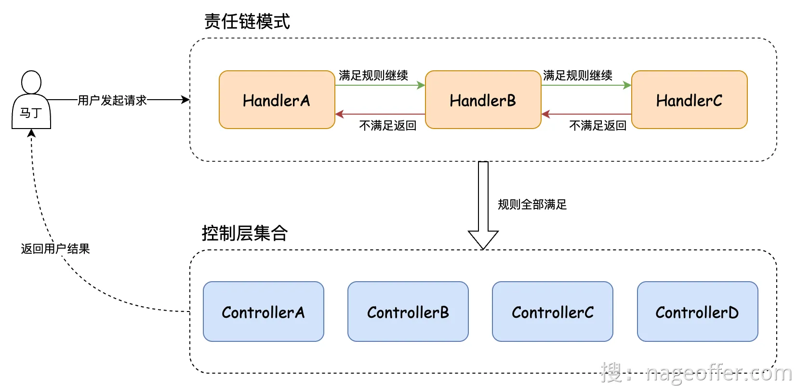


**责任链模式重构：**

1. 定义购票过滤接口：

```java
package org.opengoofy.index12306.biz.ticketservice.service.handler.ticket.filter.purchase;

import org.opengoofy.index12306.biz.ticketservice.common.enums.TicketChainMarkEnum;
import org.opengoofy.index12306.biz.ticketservice.dto.req.PurchaseTicketReqDTO;
import org.opengoofy.index12306.framework.starter.designpattern.chain.AbstractChainHandler;

/**
 * 列车购买车票过滤器
 *
 * @公众号：马丁玩编程，回复：加群，添加马哥微信（备注：12306）获取项目资料
 */
public interface TrainPurchaseTicketChainFilter<T extends PurchaseTicketReqDTO> extends AbstractChainHandler<PurchaseTicketReqDTO> {

    @Override
    default String mark() {
        return TicketChainMarkEnum.TRAIN_PURCHASE_TICKET_FILTER.name();
    }
}
```

2. 实现列车购买过滤器

```java
/**
 * 购票流程过滤器之验证参数必填
 *
 * @公众号：马丁玩编程，回复：加群，添加马哥微信（备注：12306）获取项目资料
 */
@Component
public class TrainPurchaseTicketParamNotNullChainHandler implements TrainPurchaseTicketChainFilter<PurchaseTicketReqDTO> {

    @Override
    public void handler(PurchaseTicketReqDTO requestParam) {
        // ......
    }

    @Override
    public int getOrder() {
        return 0;
    }
}

/**
 * 购票流程过滤器之验证参数是否有效
 * 验证参数有效这个流程会大量交互缓存，为了优化性能需要使用 Lua。为了方便大家理解流程，这里使用多次调用缓存
 *
 * @公众号：马丁玩编程，回复：加群，添加马哥微信（备注：12306）获取项目资料
 */
@Component
@RequiredArgsConstructor
public class TrainPurchaseTicketParamVerifyChainHandler implements TrainPurchaseTicketChainFilter<PurchaseTicketReqDTO> {

    private final TrainMapper trainMapper;
    private final TrainStationMapper trainStationMapper;
    private final DistributedCache distributedCache;

    @Override
    public void handler(PurchaseTicketReqDTO requestParam) {
        // ......
    }

    @Override
    public int getOrder() {
        return 10;
    }
}

/**
 * 购票流程过滤器之验证列车站点库存是否充足
 *
 * @公众号：马丁玩编程，回复：加群，添加马哥微信（备注：12306）获取项目资料
 */
@Component
@RequiredArgsConstructor
public class TrainPurchaseTicketParamStockChainHandler implements TrainPurchaseTicketChainFilter<PurchaseTicketReqDTO> {

    private final SeatMarginCacheLoader seatMarginCacheLoader;
    private final DistributedCache distributedCache;

    @Override
    public void handler(PurchaseTicketReqDTO requestParam) {
        // ......
    }

    @Override
    public int getOrder() {
        return 20;
    }
}

/**
 * 购票流程过滤器之验证乘客是否重复购买
 *
 * @公众号：马丁玩编程，回复：加群，添加马哥微信（备注：12306）获取项目资料
 */
@Component
@RequiredArgsConstructor
public class TrainPurchaseTicketRepeatChainHandler implements TrainPurchaseTicketChainFilter<PurchaseTicketReqDTO> {

    @Override
    public void handler(PurchaseTicketReqDTO requestParam) {
        // ......
    }

    @Override
    public int getOrder() {
        return 30;
    }
}
```

1. 购买流程使用过滤器：

```java
private final AbstractChainContext<PurchaseTicketReqDTO> purchaseTicketAbstractChainContext;

@Override
@Transactional(rollbackFor = Throwable.class)
public TicketPurchaseRespDTO purchaseTickets(PurchaseTicketReqDTO requestParam) {
    // 责任链模式，验证 0：参数必填 1：参数正确性 2：列车车次余量是否充足 3：乘客是否已买当前车次等
    purchaseTicketAbstractChainContext.handler(TicketChainMarkEnum.TRAIN_PURCHASE_TICKET_FILTER.name(), requestParam);
    // ......
}
```

**责任链实现原理：**

运行时获取责任链具体的实现类：

```java
private final Map<String, List<AbstractChainHandler>> abstractChainHandlerContainer = new HashMap<>();

/**
 * 责任链组件执行
 *
 * @param mark         责任链组件标识
 * @param requestParam 请求参数
 */
public void handler(String mark, T requestParam) {
    // 通过 mark 获取到本次需要执行的责任链组件
    List<AbstractChainHandler> abstractChainHandlers = abstractChainHandlerContainer.get(mark);
    // 获取为空抛出异常
    if (CollectionUtils.isEmpty(abstractChainHandlers)) {
        throw new RuntimeException(String.format("[%s] Chain of Responsibility ID is undefined.", mark));
    }
    // 获取到的责任链组件依次执行
    abstractChainHandlers.forEach(each -> each.handler(requestParam));
}
```

初始化责任链容器：

```plain
// CommandLineRunner：SpringBoot 启动完成后执行的回调函数
public final class AbstractChainContext<T> implements CommandLineRunner {

    // 存储责任链组件实现和责任链业务标识的容器
    // 比如：Key：购票验证过滤器 Val：HanlderA、HanlderB、HanlderC、......
    private final Map<String, List<AbstractChainHandler>> abstractChainHandlerContainer = new HashMap<>();

    @Override
    public void run(String... args) throws Exception {
        // 调用 SpirngIOC 工厂获取 AbstractChainHandler 接口类型的 Bean
        Map<String, AbstractChainHandler> chainFilterMap = ApplicationContextHolder
                .getBeansOfType(AbstractChainHandler.class);
        chainFilterMap.forEach((beanName, bean) -> {
            // 获取 mark（责任链业务标识）的处理器集合
            List<AbstractChainHandler> abstractChainHandlers = abstractChainHandlerContainer.get(bean.mark());
            // 如果不存在则创建一个集合
            if (CollectionUtils.isEmpty(abstractChainHandlers)) {
                abstractChainHandlers = new ArrayList();
            }
            // 添加到处理器集合中
            abstractChainHandlers.add(bean);
            // 对处理器集合执行顺序进行排序
            List<AbstractChainHandler> actualAbstractChainHandlers = abstractChainHandlers.stream()
                    .sorted(Comparator.comparing(Ordered::getOrder))
                    .collect(Collectors.toList());
            // 存入容器等待被运行时调用
            abstractChainHandlerContainer.put(bean.mark(), actualAbstractChainHandlers);
        });
    }
}
```

## 5.12 列车购票流程
购票接口拆分为两个版本，分别是 v1 分布式锁版本以及 v2 令牌限流算法+分布式锁版本。

最早的分布式锁版本存在一些系统稳定性以及性能较低的问题，所以才因此升级了 v2 版本。为了让大家能更清晰的掌握两者的区别，所以代码中拆分了两个接口。

虽然 v2 版本要比 v1 版本具备更高的性能和稳定性，但是两个版本的购票核心逻辑是不变的。下文中咱们以 v1 分布式锁版本进行讲述。

流程：

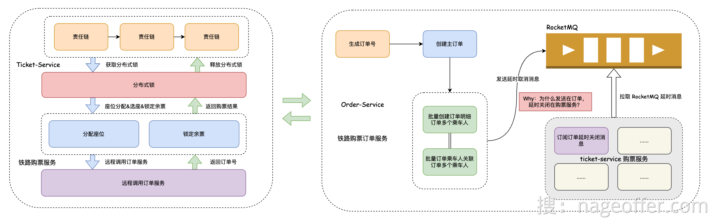**避免分配相同的座位：**

假设，当大量用户抢同一个列车商务座，如果不通过技术手段加以控制，是不是就会出现相同座位分配给多个人的情况？

为了避免这一情况，我们通过 Redisson 分布式锁来解决这个问题。同一列车在同一时间下仅有单个用户可以进行座位分配以及创建订单行为，再加上 Redisson 分布式锁的自动续期等功能，可以很好保障系统运行稳定和脏数据问题。

[从根上理解Redis分布式锁演进架构 (yuque.com)](https://www.yuque.com/magestack/12306/ag5pffwexihshe2s)

**座位分配的难点：**

座位如果要想分配的合理，需要考虑的情况比较多，比如：

+ 单个车厢可能容纳不下购票乘车人数；
+ 单排座位可能容纳不下购票乘车人，需要根据不同座位类型拆成多排分配；
+ 单个车厢可能容纳的下购票乘车人，但没有相邻座位；
+ 选中座位类型车厢余量加一起都容纳不下购票乘车人的情况。

**作为分配逻辑：**

考虑到种种情况，咱们的高铁座位分配算法流程如下，还是以商务座举例。

为了让咱们能更专注基本的座位分配算法，以下流程不包含购票人数大于等于三人（大于等于三人就要进行拆座位）以及在线选座等流程。

+ 如果购票人数为两人，购买同一车厢，座位优先检索两人相邻座位并排分配。
+ 假设当前正在检索的车厢不满足两人并排，就执行搜索全部满足两人并排的车厢。
+ 如果搜索了所有车厢还是没有两人并排做的座位，那么执行同车厢不相邻座位。
+ 如果所有车厢都是仅有一个座位，就开始执行最后降级操作，不同车厢分配。

这里生动形象的演示了几组用户购票对应的座位分配顺序，结合咱们流程查看理解更顺畅。

订单创建：通过OpenFeign调用远程服务

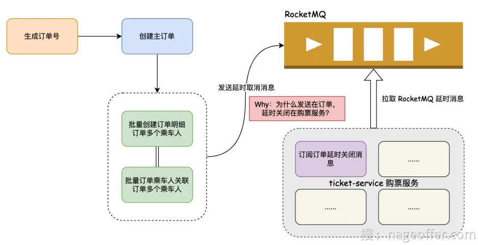


1. 订单号的生成：[手摸手之订单如何分库分表 (yuque.com)](https://www.yuque.com/magestack/12306/dyr1d4r3me19gg7l#CJRpF)
2. 订单相关记录需要插入数据库中，有三类订单数据，分别是：主订单表、订单明细表以及订单乘车人明细表。
    - 主订单：用户购买的本次订单相关信息。
    - 订单明细表：用户发起购票订单请求时，可能会为多名乘车人购票，每个乘车人会有对应的订单明细记录。
    - 订单乘车人明细表：[手摸手之乘车人本人车票订单查看 (yuque.com)](https://www.yuque.com/magestack/12306/uonb6m6pgx1okebs)
3. 用户发起订单后，如果长时间未支付，需要将订单关闭，也就是大家常说的延时关闭订单。铁路 12306 系统中，使用 RocketMQ 作为延时关闭订单的技术实现，从整体考虑，处理能力以及稳定性相对来说较为合适。

看到上面流程图中留了个疑问，为什么延迟关闭订单发送端在订单服务，消费延迟关闭订单消息却是在购票服务？

这是为了避免服务之间的循环依赖。大家都知道，咱们列车购票是从购票服务发起的，通过购票服务分配座位、锁定座位以及创建订单，已知购票服务调用了订单服务。而延迟关闭订单中，涉及到订单状态的变更和列车座位的变更等，这样就涉及到两个服务的调用。如果消息消费在订单服务，就涉及到远程循环依赖，这对于微服务涉及中是需要尽可能避免的。所以，最终将消费延迟关闭消息放在了购票服务


## 5.13 订单分库分表
分库分表的模型：

假设我们考虑 12306 单个假期的人流量为 2 亿人次，这一估算基于每年的三个主要假期：五一、国庆和春节。这些假期通常都有来回的流动，因此数据存储与计算的公式变为：2 * (3*2) = 12 亿，即每年的假期总人次达到了 12 亿。

考虑到假期订单数据以及日常购票数据的累积，随着多年的积累，数据量将会变得相当庞大。但我们需要再次审视一个关键问题：这些订单数据是否需要一直保留在数据库中呢？

经过详细分析 12306 车票订单购买查看逻辑，我们发现用户账号只能查看最近一个月内的订单购买记录。这一时间范围最多涵盖一个节假日周期，考虑往返车票等情况，大致数据量约为 4 亿。这样的数据规模相较之前大幅减少，有效降低了整体的存储压力。

上述的这种数据存储技术叫做冷热数据的架构方案，那什么叫做冷数据？什么又是热数据？

+ 热数据通常指经常被访问和使用的数据，如最近的交易记录或最新的新闻文章等。这些数据需要快速的读写速度和响应时间，因此通常存储在快速存储介质（如内存或快速固态硬盘）中，以便快速访问和处理。
+ 冷数据则指很少被访问和使用的数据，如过去的交易记录或旧的新闻文章等。这些数据访问频率较低，但需要长期保存，因此存储在较慢的存储介质（如磁盘或云存储）中，以便节省成本和存储空间。

如何实现这种冷热数据存储架构？比较简单的方案就是，我们每天有个定时任务，把一个月前的数据从当前的数据库迁移到冷数据库中。

这时需要注意一件事情，就是我们迁移到冷数据库不意味着不查询这些数据。如果遇到查询历史数据的需求，我们还是要能支持，比如支付宝的交易数据查询。

**分片键的选择：**

每每说到分库分表，最头疼的是莫过于如何选择分片键，用户名？订单号？还是创建时间？

先说我们的业务基本诉求，订单分库分表的基本查询条件是用户要能查看自己的订单，另外，也要支持订单号精准查询。

这样的话，我们就需要按照两个字段当做分片键，这也就意味着每次查询时需要带着用户和订单两个字段，非常的不方便。能不能通过一个字段分库分表，但是查询时两个字段任意传一个就能精准查询，而不导致读扩散问题？

1. 使用基因法：这就需要用到咱们项目中使用的基因算法。那什么是分库分表基因算法？说的通俗易懂点，就是我们通过把用户的后六位数据冗余到订单号里。这样的话，我们就可以按照用户 ID 后六位进行分库分表，并且将分片键定义为用户 ID 和订单号，只要查询中携带这两个字段，我们就取用户 ID 后六位进行查找分片表的位置。这样我们就可以很好支持分库分表需求了，同时能满足用户和订单号两种查询逻辑，这也是大家热衷于使用基因算法的原因。
2. 订单号的生成：为了保证订单号生成递增，我们参考雪花算法自定义了一个 `DistributedIdGenerator`，生成后的分布式 ID 再拼接上用户的后六位。

**实现：**

```yaml
# 数据源集合，也就是咱们刚才说的分两个库
dataSources:
  ds_0:
    dataSourceClassName: com.zaxxer.hikari.HikariDataSource
    driverClassName: com.mysql.cj.jdbc.Driver
    jdbcUrl: jdbc:mysql://127.0.0.1:3306/12306_order_0?useUnicode=true&characterEncoding=UTF-8&rewriteBatchedStatements=true&allowMultiQueries=true&serverTimezone=Asia/Shanghai
    username: root
    password: root

  ds_1:
    dataSourceClassName: com.zaxxer.hikari.HikariDataSource
    driverClassName: com.mysql.cj.jdbc.Driver
    jdbcUrl: jdbc:mysql://127.0.0.1:3306/12306_order_1?useUnicode=true&characterEncoding=UTF-8&rewriteBatchedStatements=true&allowMultiQueries=true&serverTimezone=Asia/Shanghai
    username: root
    password: root

rules:
      # 分片规则
    - !SHARDING
    # 分片表
    tables:
      # 订单表
      t_order:
        # 真实的数据节点，也对应着在数据库中存储的真实表
        actualDataNodes: ds_${0..1}.t_order_${0..15}
        # 分库策略
        databaseStrategy:
          # 复合分库策略（多个分片键）
          complex:
            # 用户 ID 和订单号
            shardingColumns: user_id,order_sn
            # 搜索 order_database_complex_mod 下方会有分库算法
            shardingAlgorithmName: order_database_complex_mod
        # 分表策略
        tableStrategy:
          # 复合分表策略（多个分片键）
          complex:
            # 用户 ID 和订单号
            shardingColumns: user_id,order_sn
            # 搜索 order_table_complex_mod 下方会有分表算法
            shardingAlgorithmName: order_table_complex_mod
      # 订单明细表，规则同订单表
      t_order_item:
        actualDataNodes: ds_${0..1}.t_order_item_${0..15}
        databaseStrategy:
          complex:
            shardingColumns: user_id,order_sn
            shardingAlgorithmName: order_item_database_complex_mod
        tableStrategy:
          complex:
            shardingColumns: user_id,order_sn
            shardingAlgorithmName: order_item_table_complex_mod
    # 分片算法
    shardingAlgorithms:
      # 订单分库算法
      order_database_complex_mod:
        # 通过加载全限定名类实现分片算法，相当于分片逻辑都在 algorithmClassName 对应的类中
        type: CLASS_BASED
        props:
          algorithmClassName: org.opengoofy.index12306.biz.orderservice.dao.algorithm.OrderCommonDataBaseComplexAlgorithm
          # 分库数量
          sharding-count: 2
          # 复合（多分片键）分库策略
          strategy: complex
      # 订单分表算法
      order_table_complex_mod:
        # 通过加载全限定名类实现分片算法，相当于分片逻辑都在 algorithmClassName 对应的类中
        type: CLASS_BASED
        props:
          algorithmClassName: org.opengoofy.index12306.biz.orderservice.dao.algorithm.OrderCommonTableComplexAlgorithm
          # 分表数量
          sharding-count: 16
          # 复合（多分片键）分表策略
          strategy: complex
      order_item_database_complex_mod:
        type: CLASS_BASED
        props:
          algorithmClassName: org.opengoofy.index12306.biz.orderservice.dao.algorithm.OrderCommonDataBaseComplexAlgorithm
          sharding-count: 2
          strategy: complex
      order_item_table_complex_mod:
        type: CLASS_BASED
        props:
          algorithmClassName: org.opengoofy.index12306.biz.orderservice.dao.algorithm.OrderCommonTableComplexAlgorithm
          sharding-count: 16
          strategy: complex
props:
  sql-show: true
```

##  5.14 乘车人本人车票查看
假设一家人出去玩，你在自己账号通过添加乘车人购买了车票，注意这个时候家里人还没有注册 12306。

购买票后，家里人注册了 12306 账号，这个时候要通过查看本人车票能看到出行的车票数据记录。

回顾一下，咱们订单和订单明细表是按照用户 ID 后六位进行分库分表的，如果是购票用户查看自己的本人车票，通过用户 ID 就能查询。但是，购票时乘车人可能是没有账号的，这个怎么解决？

**创建路由表：**

因为乘车人数据中唯一能起到标识作用的也就是证件号，而注册用户证件号也是必须的，通过证件号进行数据关联。如果要实现这个需求，只能在订单表中按照证件号和订单进行关联。

为了满足查看本人车票订单的功能，咱们可以通过添加路由表的方式完成这个查询。

路由表中通过证件号绑定订单号，再关联订单表和订单明细表，就能查看到乘车人购票的本人车票了。

**路由表的分库分表：**

订单明细乘车人表 `t_order_item_passenger`，也就是咱们证件号和订单号关联的这张表，数据量是等同于订单明细表 `t_order_item`，所以分库分表的数量直接同订单明细表即可。

但是咱们这张路由表的分库分表规则不能和订单明细表一致。订单明细表是通过用户 ID 后六位查询的，但是路由表是按照证件号查询，所以路由表的分库分表规则就按照证件号进行 HASH_MOD 方式分库分表即可。

```yaml
dataSources:
  ds_0:
    dataSourceClassName: com.zaxxer.hikari.HikariDataSource
    driverClassName: com.mysql.cj.jdbc.Driver
    jdbcUrl: jdbc:mysql://127.0.0.1:3306/12306_order_0?useUnicode=true&characterEncoding=UTF-8&rewriteBatchedStatements=true&allowMultiQueries=true&serverTimezone=Asia/Shanghai
    username: root
    password: root

  ds_1:
    dataSourceClassName: com.zaxxer.hikari.HikariDataSource
    driverClassName: com.mysql.cj.jdbc.Driver
    jdbcUrl: jdbc:mysql://127.0.0.1:3306/12306_order_1?useUnicode=true&characterEncoding=UTF-8&rewriteBatchedStatements=true&allowMultiQueries=true&serverTimezone=Asia/Shanghai
    username: root
    password: root

rules:
  - !SHARDING
    tables:
      t_order_item_passenger:
        actualDataNodes: ds_${0..1}.t_order_item_passenger_${0..15}
        databaseStrategy:
          standard:
            shardingColumn: id_card
            shardingAlgorithmName: order_passenger_relation_database_mod
        tableStrategy:
          standard:
            shardingColumn: id_card
            shardingAlgorithmName: order_passenger_relation_table_mod
    shardingAlgorithms:
      order_passenger_relation_database_mod:
        type: HASH_MOD
        props:
          sharding-count: 2
      order_passenger_relation_table_mod:
        type: HASH_MOD
        props:
          sharding-count: 16
props:
  sql-show: true
```

## 5.15 列车购票V2
V1版本存在的问题：

根据列车购票流程，也就是 v1 版本购票接口文档得知：为了保障列车座位不超卖以及一个座位不分配给多名用户，选择使用分布式锁来保障数据安全和一致性。

通过下图简单理解 v1 版本购票流程，我觉得存在几个较严重的问题。

 

1. 瞬时高并发压垮系统对于五一、国庆以及过年这些节日来说，一些热门列车的 TPS 少说有几十万 TPS。

```plain
TPS（Transactions Per Second）是一个衡量系统性能的指标，用于表示系统在单位时间内能够处理的事务数量。
在计算机领域中，TPS 通常用于度量一个系统或应用程序处理事务的能力和性能。一个事务可以是数据库的读写操作、网络请求、交易处理或其他类型的操作。
TPS 的值越高，表示系统能够在单位时间内处理更多的事务，即系统性能越好。通常，高性能的系统需要具备较高的 TPS 值，以满足对并发处理和快速响应的需求。

QPS（Queries Per Second）是一个衡量系统负载或性能的指标，用于表示系统在单位时间内处理的查询请求数量。
在计算机领域中，QPS 通常用于度量数据库、网络服务器或其他系统的查询处理能力和性能。一个查询可以是数据库查询、网络请求、API调用或其他类型的查询操作。
QPS 的值越高，表示系统能够在单位时间内处理更多的查询请求，即系统的查询处理能力越强。高吞吐量和低延迟的系统通常需要具备较高的 QPS 值，以满足大量请求的处理需求。
需要注意的是，QPS 仅仅表示每秒处理的查询请求数量，而不考虑每个查询的复杂性、资源消耗和响应时间。
```

按照 v1 架构的设计存在以下问题：大量请求会因为分布式锁的申请而发生阻塞，导致请求无法快速处理。这会导致后续请求长时间被阻塞，使系统陷入假死状态。无论请求的数量有多大，系统都无法返回响应。此外，随着请求的积累，还存在内存溢出的风险。更糟糕的是，如果 SpringBoot Tomcat 的线程池被分布式锁占用，查询请求也将无法得到响应。

2. 先买票不一定有票假设我有三个人购票，张三、李四和王五，他们网络请求到达服务端的时间是依次的，同名称排列顺序。正常来说，可能是张三先获取分布式锁，购票后李四再获取分布式锁，紧接着才是王五。但是实际情况有可能张三释放锁后，后来的王五会获取到锁。这种情况就是因为默认 Redisson 的获取锁是非公平锁，这个概念和 ReentrantLock 中的非公平锁概念是一致的。

```plain
非公平锁（Non-Fair Lock）是一种锁的获取策略，它允许在锁释放时，新的请求可以插队获取锁，而不必按照请求的顺序等待。相对而言，公平锁（Fair Lock）则按照请求的顺序分配锁，确保较早请求的线程先获得锁。
使用非公平锁可以带来一些性能上的优势，例如减少线程切换和提高吞吐量。然而，非公平锁也存在一些问题：
1. 饥饿问题（Starvation）：由于非公平锁允许新的请求插队获取锁，较早的请求可能会被后续请求一直抢占，导致某些线程长时间无法获取锁，导致饥饿问题。这可能会影响系统的公平性和可预测性。
2. 公平性问题：非公平锁的获取顺序不遵循请求的先后顺序，因此无法保证所有线程都能在合理的时间内获得锁，可能导致某些线程长时间等待。
为了避免这种情况，我们需要按照公平锁的方式请求和释放锁，使用后的场景就是释放锁后再获取锁要严格按照请求分布式锁的先后顺序执行。
```

3. 分布式锁压力通过上图得知，我们在真正进行作为分配和创建订单前，需要先获取到分布式锁，然后才能执行接下来的流程。问题来了，假如一趟列车有几十万人抢票，但是真正能购票的用户可能也就几千人。也就意味着哪怕几十万人都去请求这个分布式锁，最终也就几十万人中的几千人是有效的，其它都是无效获取分布式锁的行为。那这块的分布式锁逻辑是不是可以优化呢？比如不让所有抢购列车的用户去申请分布式锁，而是让少量用户去请求获取分布式锁。这样优化的话，可以极大情况节省 Redis 申请分布式锁的开销压力。
4. 用户购票响应慢咱们以高铁复兴号举例：一趟列车有三种座位，分别是商务座、一等座和二等座。v1 版本购票接口的分布式锁锁定规则是锁定整个列车，也就是列车的唯一键列车 ID。相当于同一时间一趟列车只允许单个用户进行分配座位、创建订单等流程。假设 A 用户购买二等座、B 用户购买一等座以及 C 用户购买商务座，按照现有流程这三个用户的请求是串行的，但从真实场景以及数据一致性分析，这三个用户是不是也能并行？三个用户对应三个不同的座位，互不影响，完全可以并行。这样可以极大提升系统出票的能力，个别场景下，系统的处理能力可以提升 300%。当然，事情往往不会进展的如此顺利。如果 A 用户购买了二等座和一等座，B 用户购买了一等座和商务座，这就涉及到一个锁重合互斥问题。


**令牌限流算法：**本章节解决了瞬时高并发压垮系统问题。

1. 什么是限流：限流（Rate Limiting）是一种应用程序或系统资源管理的策略，用于控制对某个服务、接口或功能的访问速率。它的主要目的是防止过度的请求或流量超过系统的处理能力，从而保护系统的稳定性、可靠性和安全性。通过限制访问速率，限流可以防止以下问题的发生：

上文也讲到过，一个列车可能就几百上千人能购买成功，但可能会有远超过这个量级的用户进行抢票，在真正执行抢票逻辑前，可以通过限流算法进行限制，只让少量用户操作购票流程。

    1. 过度使用资源：限流可以防止某个用户或客户端过度使用系统资源，从而保护服务器免受过载的影响。
    2. 防止垃圾请求：限流可以过滤掉恶意或无效的请求，例如恶意攻击、爬虫或垃圾邮件发送等。
    3. 维护服务质量：通过限制访问速率，可以确保每个请求都能够得到适当的处理和响应时间，从而提高服务质量和用户体验。
    4. 控制成本：限流可以帮助控制系统资源的使用，避免因为过多的请求而导致不必要的成本增加。
1. 常见的限流算法：限流可以通过多种算法方式实现，比如：

这些算法都有不同的特点和适用场景，选择适合的限流算法取决于应用程序的需求和预期的限流效果。在实际应用中，也可以根据具体情况结合多种算法来实现更复杂的限流策略。

这些算法网上介绍的较为完善，大家可以搜索相关文章详细了解，这里不过多赘述。而咱们 12306 使用的限流方案却不是上面说的这几种之一。

    1. 固定窗口算法（Fixed Window Algorithm）：该算法将时间划分为固定大小的窗口，例如每秒、每分钟或每小时。在每个窗口内，限制请求的数量不得超过预设的阈值。这种算法简单直观，但可能存在突发请求超过阈值的问题。
    2. 滑动窗口算法（Sliding Window Algorithm）：该算法将时间划分为连续的时间片段，例如每秒划分为多个小的时间片段。每个时间片段都有自己的请求计数器，记录在该时间片段内的请求数量。当请求到达时，会逐渐删除过时的时间片段，并根据当前时间片段内的请求数量判断是否超过阈值。这种算法可以更好地处理突发请求。
    3. 令牌桶算法（Token Bucket Algorithm）：该算法模拟了一个令牌桶，桶中以固定速率生成令牌。每个令牌代表一个请求的许可。当请求到达时，需要先从令牌桶中获取令牌，如果桶中没有足够的令牌，则请求被限制。这种算法可以平滑地控制请求的速率。
    4. 漏桶算法（Leaky Bucket Algorithm）：该算法类似于一个漏桶，请求以固定速率进入漏桶。如果漏桶已满，则多余的请求将被丢弃或延迟处理。这种算法可以稳定请求的处理速率，防止突发请求对系统造成压力。
1. 12306使用的限流策略：12306 中的限流算法类似于令牌桶，但是令牌通会以固定速率生成令牌，但是咱们这个不会，而是将没有出售的座位当作一个个令牌放到一个容器中。为了区分令牌桶，咱们下文称呼为令牌容器。如果用户来购票，根据所选择的乘车人数量以及座位类型去令牌容器中获取，获取成功则表示余票充足，可以进入接下来的选票以及下单流程，获取失败则直接返回。注意，令牌容器中的令牌是有限的，如果你获取到令牌后，令牌容器的数量会进行相应的减少，而这也是防止余票不超卖的原因之一。因为咱们的令牌数量和车票座位的余量是一一对应的。

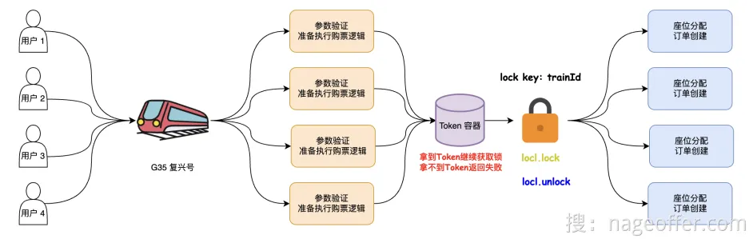

12306限流的实现原理：

主要就是做了三件事：

1. 如果令牌容器在缓存中失效需要重新读取并放入缓存；
2. 准备执行 Lua 脚本的数据；
3. 最终的执行 Lua 脚本获取令牌。

**分布式锁之公平锁：**

1. 什么是公平锁：公平锁（Fair Lock）是一种锁的获取策略，它按照请求的先后顺序分配锁资源，以实现公平性和可预测性。当多个线程竞争同一个公平锁时，如果锁当前是可用状态，那么锁将立即分配给等待时间最长的线程，即最先请求锁的线程。如果锁当前被其他线程持有，那么新的线程请求锁时会被放入一个等待队列中，按照请求顺序排队等待锁的释放。公平锁的主要特点是：

公平锁的实现需要维护一个等待队列，记录等待锁资源的线程，并按照请求顺序分配锁。这可能会增加一些开销，包括锁的管理和线程调度的开销。在高并发情况下，公平锁的性能可能相对较低，但可以提供公平性和可预测性的保证。

公平锁适用于对锁资源的分配有严格要求的场景，例如资源竞争激烈、对各个线程的公平性要求较高的情况。

上面已经说了，要解决买票严格按照顺序执行，就需要使用公平锁分配锁，确保较早请求的线程先获得锁。

    1. 公平性：公平锁确保锁的获取按照请求的先后顺序进行，即先到先得的原则。这样可以避免某些线程长时间等待锁资源而导致饥饿问题，公平地分配锁资源给所有等待的线程。
    2. 可预测性：由于按照请求的先后顺序分配锁资源，公平锁的行为是可预测的。每个线程都可以预期在其请求锁后的一段时间内获得锁，而不会受到其他线程的插队或优先级干扰。
1. 改造非公平锁：从默认的非公平锁切换到公平锁上，代码变更非常简单，只需要修改获取锁方法名为 getFairLock 即可。

```java
RLock lock = redissonClient.getFairLock(lockKey);
lock.lock();
try {
    return executePurchaseTickets(requestParam);
} finally {
    lock.unlock();
}
```

1. 相对于非公平锁，公平锁在某些方面可能存在以下缺点：

再额外提醒大家一句，技术设计中不存在“**银弹**”。选择技术选型往往会有得失，多方面权衡后选择出一个适合项目的使用即可。

    1. 性能降低：公平锁需要维护一个等待队列，按照请求的顺序分配锁资源。这会增加锁的管理开销和线程调度的开销，可能导致性能下降，尤其在高并发场景下。
    2. 竞争增加：由于公平锁要按照请求的顺序分配锁资源，当一个线程释放锁时，需要通知等待队列中的下一个线程获取锁。这会引起更多的竞争和上下文切换，从而降低系统的吞吐量。

**分布式锁进阶：**

## 5.16 如何保障缓存数据库一致性
理论：[缓存与数据库一致性如何解决？ (yuque.com)](https://www.yuque.com/magestack/12306/wocbrht50ctg14nv)

**业务背景：**

为了满足用户对一趟列车不同站点不同座位类型的余量查询需求，我们采取了一种优化方案。我们将这些余量信息存储在缓存中，以便用户可以快速查询。

然而，在用户创建订单并完成支付时，我们需要同时从数据库和缓存中扣减相应的列车站点余票。这种设计不仅提高了查询效率，也保证了数据的一致性，确保订单操作的准确性。

在这个业务场景中的缓存与数据库一致性如何保证？

**实现：**

1. 如何扣减车票余量？大家可能会比较疑惑，为什么要扣减北京南到南京南、北京南到宁波、北京南到杭州东以及北京南到宁波？这是因为中间车票被购买了，北京南作为始发站，只能购买北京南到济南西的车票。
2. 如何保持缓存的一致性？我们采用了一种确保缓存和数据库一致性的方案，使用 Canal 监听 Binlog 模式。该方案将数据库的数据变更通过 Canal 转发给消息队列的特定 Topic。客户端应用程序可以监听该消息队列的 Topic，以保持缓存与数据库的一致性。代码中有两种方式，一种是同步的操作缓存，一种是使用Binlog模式。方案具体体现在购票抽象方法 `AbstractTrainPurchaseTicketTemplate#executeResp` 中添加了条件判断，如果是非 binlog 模式，也就是 `ticket.availability.cache-update.type` 不等于 binlog，就按照同步更新缓存模式进行。
3. 如何开启Binlog缓存一致性？如果你启动的聚合模式，配置加在 aggregation-service 服务配置文件，分布式模式加在 ticket-service 服务配置文件。

```yaml
ticket:
  availability:
    cache-update:
      type: binlog
```

对于自建 MySQL , 需要先开启 Binlog 写入功能，my.cnf 中配置需要包含如下信息。

```properties
[mysqld]
log-bin=mysql-bin # 开启 binlog
binlog-format=ROW # 选择 ROW 模式
server_id=1 # 配置 MySQL replaction 需要定义，不要和 canal 的 slaveId 重复
```

配置修改成功后，重启一下 MySQL，确保所有的配置生效。然后执行 MySQL 执行命令查看是否修改 Binlog 成功。

```sql
# 查看 binlog 日志是否开启
show variables like 'log_%';
```

如果查询出的选型 log_bin 数据为 ON，Binlog 即为开启状态。最后，MySQL 执行 SQL 语句创建 canal 单独使用的账号，用来进行 Binlog 的同步和监听。

```sql
CREATE USER canal IDENTIFIED BY 'canal';  
GRANT SELECT, REPLICATION SLAVE, REPLICATION CLIENT ON *.* TO 'canal'@'%';
FLUSH PRIVILEGES;
```

注意：如果使用的是MySQL 8.0.3以上的版本，需要修改canal用户对应的身份验证插件为mysql_native_password。因为马哥提供的"canal.deployer-1.1.6"不支持新版身份验证插件caching_sha2_password

```plain
修改密码永不过期解决
ALTER USER 'canal'@'%' IDENTIFIED BY 'canal' PASSWORD EXPIRE NEVER;
ALTER USER 'canal'@'%' IDENTIFIED WITH mysql_native_password BY 'canal';
FLUSH PRIVILEGES;

https://github.com/alibaba/canal/issues/1700#issuecomment-553716102
```

接下来开始配置 Canal 中间件，下载 Canal 安装包，其中的一些配置都是我调试后的。链接: [https://pan.baidu.com/s/1_8mm3LHXpxb6oFPbDpzfGQ?pwd=yhxt](https://pan.baidu.com/s/1_8mm3LHXpxb6oFPbDpzfGQ?pwd=yhxt) 提取码: yhxt**注意，Canal 安装路径中不要有文件夹名称是中文。需要使用 JDK8 启动 Canal 服务，不要使用 JDK17。**如果你是自己本地启动的 RocketMQ，将 `canal.properties`文件中的 `rocketmq.namesrv.addr` 配置项变更为自己本地的 RocketMQ 配置，默认为公有云中间件地址。如果本地 MySQL 不是 `127.0.0.1:3306` 配置，需要将 `instance.properties` 配置文件中的 `canal.instance.master.address` 配置项替换为真实的 MySQL 地址和端口。另外，如果你正在使用公有云 RocketMQ，`instance.properties` 配置文件中的 `canal.mq.topic` 也需要变更，配置中默认为 `index12306_canal_ticket-service_common-sync_topic-mading`，`-mading` 需要大家变更为自己在项目启动 VM 参数里的值。各自检查并进行替换。

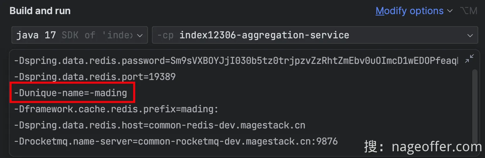

全部上述配置大家全都搞定后，开始启动 Canal 进行测试。如果是 Windows 系统，直接双击 Canal 文件夹下 bin 目录的 `startup.bat` 脚本即可，要停止 Canal 关闭脚本弹框。如果是 Linux 或者 Mac 系统，进入 bin 目录下执行 `sh startup.sh` 命令。如果是 Linux 或者 Mac 系统要停止执行 `sh stop.sh`。

启动完成后，打开 logs 文件夹目录下的 canal/canal.log 文件。

查看是否启动成功，如果输出打印如下 `the canal server is running now`，即为成功。

## 5.17 高并发扣减为什么需要令牌**技术实现：**
两种方案：

1. Redis缓存预先扣除库存将列车余票放到缓存中，充当限流作用，通过 LUA 脚本扣减余票后，扣减成功代表余票数量充足，才可以进入流程分配座位，并创建订单，扣减失败请求打回。因为扣减列车站点余票涉及到比较多的扣减关系，所以这里要使用 LUA 脚本。
2. 构建库存令牌容器，拆分开限流和库存相对于上一种方案，拆分了一个令牌容器，其中存放的令牌就是列车余票数据。如果用户购买车票，需要先扣减令牌容器，扣减成功代表余票数量充足，扣减失败请求打回。用户查询列表所看到的余票数量，通过余票缓存，而不是令牌容器。扣减令牌容器后，对余票缓存并没有影响，只有在修改了座位表后，才会通过 Canal 形式监听并减少余票缓存。

**为什么要拆分令牌容器？**

因为有个极端情况，比如说，扣减余票缓存容器成功后，然后应用宕机，导致余票缓存和余票数据库库存不一致。

如果有令牌容器，发现没有剩余可用令牌，那么我们可以进行兜底判断，也可以叫做二次检查。触发一个请求去比对数据库是否还有值，如果有的话，那么就把令牌容器缓存删除，下个用户再购票时，重新加载即可

# 六、面试
**<font style="color:rgb(31,30,30);">12306铁路购票系统 </font>**

**<font style="color:rgb(31,30,30);">项目简介：</font>**<font style="color:rgb(108,108,108);">项目基础架构采用JDK1 7 、SpringBoot3 和SpringCloud Alibaba构建，完成会员注册、车票查询、车票下单以 </font>

<font style="color:rgb(108,108,108);">及支付等业务。 </font>

**<font style="color:rgb(31,30,30);">技术架构：</font>**<font style="color:rgb(108,108,108);">SpringBoot + SpringCloudAlibaba + RocketMQ + ShardingSphere + Redis + MySQL + Sentinel + Hippo4 j </font>

1. <font style="color:rgb(108,108,108);">使用责任链模式重构请求数据准确性校验，比如：查询购票、购买车票下单以及支付结果回调等业务； </font>
2. <font style="color:rgb(108,108,108);">通过RocketMQ延时消息特性，完成用户购票10分钟后未支付情况下取消订单功能； </font>
3. <font style="color:rgb(108,108,108);">封装缓存组件库避免注册用户时，用户名全局唯一带来的缓存穿透问题，减轻数据库访问压力； </font>
4. <font style="color:rgb(108,108,108);">使用BinLog配合RocketMQ消息队列完成MySQL数据库与Redis缓存之间的数据最终一致性； </font>
5. <font style="color:rgb(108,108,108);">通过Redis Lua脚本原子特性，完成用户购票令牌分配，通过令牌限流以及应对海量用户购票请求 </font>
6. <font style="color:rgb(108,108,108);">创建订单明细与乘车人的关联表，分库分表，完成乘车人账号登录查询本人车票功能</font>

第一个问题：项目中在进行业务处理之前存在很多关于条件判断来检验请求数据的真实性，如果全部使用if-else，那么会造成代码的冗长和不可复用性，所以我这里是使用责任链模式来重构这些if-else代码，通过抽象出一个接口，让不同的接口实现类对应不同的条件判断。项目中的责任链抽象模式是定义一个通用的接口，接口中定义标识和处理的逻辑方法，根据传入不同的标识标识走哪套责任链进行校验。

第二个问题：在订单生成时，我们将订单关闭消息发送到 RocketMQ，并设置消息的延迟时间为十分钟。通过设置消息级别和RocketMQ的可靠性，只需要在消费中定义订单取消的业务逻辑即可

第三个问题：系统在注册用户时，如果大量的用户都是用的新用户名，那么都会去查询数据库，会造成数据库压力。采用的解决方案是增加布隆过滤器来判断用户名是否在数据库中，布隆过滤器通过位数组和哈希函数快速的进行查询。

<font style="color:rgb(108,108,108);">第四个问题：使用Canal监听Binlog模式，将数据库的数据变更通过Canal转发给消息队列的特定Topic。客户端应用程序监听消息队列的Topic，保证缓存和数据库的一致性。</font>

<font style="color:rgb(108,108,108);">第五个问题：通过Redis Lua脚本的原子性应对高并发的处理</font>

<font style="color:rgb(108,108,108);">第六个问题：创建订单明细和乘车人的关联表，让没有注册的乘车人通过身份证或者手机号查询到自己的车票</font>

<font style="color:rgb(108,108,108);"></font>

**<font style="color:rgb(31,30,30);">在线教育平台 </font>**

**<font style="color:rgb(31,30,30);">项目简介：</font>**<font style="color:rgb(108,108,108);">该项目是一个针对职业技能教育的网络课堂系统，提供职业技能培训的相关课程，基于B2 B2 C的业务模式。 </font>

**<font style="color:rgb(31,30,30);">技术架构：</font>**<font style="color:rgb(108,108,108);">SpringBoot + Mybatis Plus + Redis + MySQL + ElasticSearch + XXL-Job + SpringCloud Gateway + Nacos + RabbitMQ + OpenFeign + SpringSecurity </font>

1. <font style="color:rgb(108,108,108);">使用分布式事务进行课程发布，课程发布后向Redis、ElasticSearch、MinIO同步数据 </font>
2. <font style="color:rgb(108,108,108);">使用Freemarker实现页面静态化，将生成的静态文件上传到Minio </font>
3. <font style="color:rgb(108,108,108);">使用分布式调度组件XXL-JOB完成视频处理，完成课程发布后的数据同步、支付结果通知等任务 </font>
4. <font style="color:rgb(108,108,108);">使用Redisson实现分布式锁，避免课程查询等公开接口出现缓存击穿问题</font>

<font style="color:rgb(108,108,108);"></font>

<font style="color:rgb(108,108,108);"></font>

<font style="color:rgb(108,108,108);"></font>

<font style="color:rgb(108,108,108);"></font>

<font style="color:rgb(108,108,108);"></font>

<font style="color:rgb(108,108,108);"></font>

<font style="color:rgb(108,108,108);"></font>


> 更新: 2024-11-29 11:40:37  
> 原文: <https://www.yuque.com/u25002409/zhab2g/scckgc6uu25cirkm>