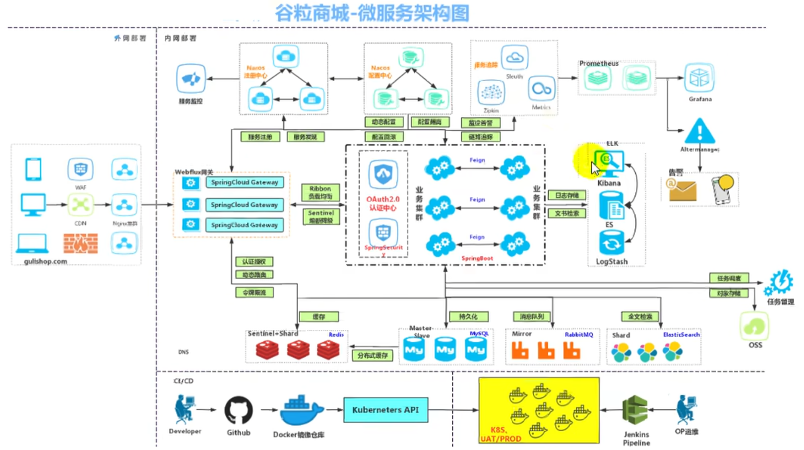
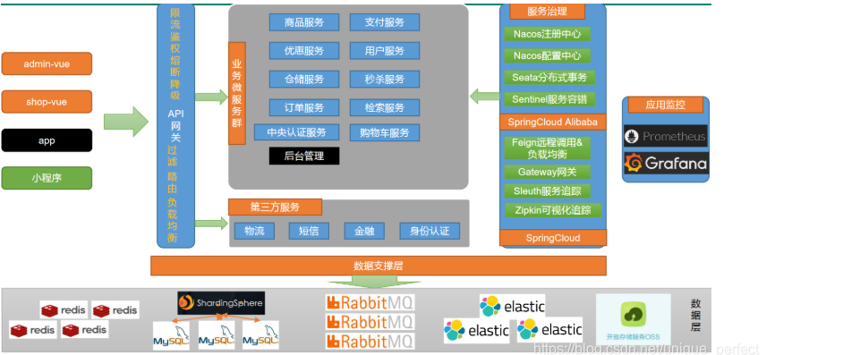
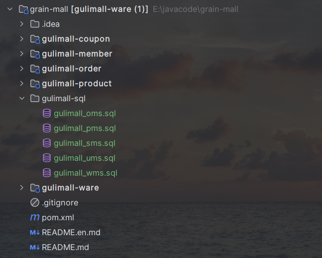

# 谷粒商城

参考的笔记链接：

[从前慢-谷粒商城篇章1-CSDN博客](https://blog.csdn.net/unique_perfect/article/details/111392634)

项目的微服务架构图：



微服务划分图：



# 项目简介
## 项目背景
项目谷粒商城是一种基于电商模式开发的系统。

市面上已经有五种电商模式：B2B、B2C、C2C、C2B、O2O（Online TO Offline线上线下结合）


## 分布式的基础概念


微服务：将一个大型的应用拆分为多个服务，服务和服务之间通过HTTP API进行调用


集群：许多机器共同实现同一个业务，为同一个业务提供服务

分布式：分散在不同地方的计算机提供不同的服务，分布式可以是集群的组合

节点：分布式的节点，每个节点都可以用来单独做集群


服务调用：服务是分布式系统的节点，可能是单个服务，也可能是集群，对外通过接口，服务之间调用时通过HTTP请求进行的


负载均衡：对于服务的调用，服务可能是集群实现的，那每个服务器都可以提供服务，那么应该选择哪台服务提供服务就取决于负载均衡，常见的负载均衡算法有：轮询、权重、hash散列


注册中心：为了感知每个服务的状态，可能存在这样的问题：调用了一台已经宕机的服务。所以需要注册中心建立服务的桥梁。

服务注册：将服务注册到注册中心中，注册中心通过一些机制来实时监测服务的状态

服务发现：当要进行服务调用的时候，可以向注册中心发送服务发现的请求，注册中心告知能够提供服务的机器。


配置中心：每个服务有各自的配置，配置还存在更新变化，我们将这些配置都统一的存在配置中心中，服务可以根据在配置中心的配置来实时变化


服务熔断：当服务之间进行调用的时候，达到了规定的一个熔断的阀值，比如：调用的时间过长，那么启动熔断服务，将服务的结果返回另一套业务逻辑（比如返回null）直接返回。

服务降级：当系统资源紧张，那么就某些服务进行降级，直接返回一些默认的结果。


API网关：抽象微服务的公共功能，比如：负载均衡、统一身份认证等等，都要通过网关进行过滤。保护服务资源。


## 环境搭建
这里视频教程中使用的是VisualBox和Vagrant

我这里就用本机的VMware


### 安装Docker
虚拟机yum无法使用问题：[https://www.cnblogs.com/kohler21/p/18331060](https://www.cnblogs.com/kohler21/p/18331060)

无网络问题：[https://blog.csdn.net/Anterior_condyle/article/details/105862905](https://blog.csdn.net/Anterior_condyle/article/details/105862905)

docker镜像加速：[https://blog.csdn.net/wenxuankeji/article/details/143783262](https://blog.csdn.net/wenxuankeji/article/details/143783262)


安装：

```java
1 卸载系统之前的docker 
sudo yum remove docker \
                  docker-client \
                  docker-client-latest \
                  docker-common \
                  docker-latest \
                  docker-latest-logrotate \
                  docker-logrotate \
                  docker-engine

2  设置存储库
sudo yum install -y yum-utils
sudo yum-config-manager \
    --add-repo \
    https://download.docker.com/linux/centos/docker-ce.repo

3  安装DOCKER引擎
sudo yum install docker-ce docker-ce-cli containerd.io

4  启动Docker.
sudo systemctl start docker

5 配置镜像加速
sudo mkdir -p /etc/docker
sudo tee /etc/docker/daemon.json <<-'EOF'
{
  "registry-mirrors": ["https://aiewziuh.mirror.aliyuncs.com"]
}
EOF
sudo systemctl daemon-reload
sudo systemctl restart docker
```


### 安装mysql
```java
docker pull mysql:5.7

docker run -dp 3306:3306 --name mysql 	
    -v /mydata/mysql/log:/var/log/mysql 
    -v /mydata/mysql/data:/var/lib/mysql 
    -v /mydata/mysql/conf:/etc/mysql 
    -e MYSQL_ROOT_PASSWORD=root 
    mysql:5.7

在/mydata/mysql/conf下新建配置文件my.cnf
[client]
default-character-set=utf8

[mysql]
default-character-set=utf8

[mysqld]
init_connect='set collation_connection = utf8_unicode_ci'
init_connect='set names utf8'
character-set-server=utf8
collation-server=utf8_unicode_ci
skip-character-set-client-handshake
skip-name-resolve
```

关于启动容器的报错：   创建mysql.conf.d目录

2025-01-19 05:19:00+00:00 [Note] [Entrypoint]: Entrypoint script for MySQL Server 5.7.44-1.el7 started.

2025-01-19 05:19:00+00:00 [ERROR] [Entrypoint]: mysqld failed while attempting to check config

        command was: mysqld --verbose --help --log-bin-index=/tmp/tmp.TFL7QA5fBs

        mysqld: Can't read dir of '/etc/mysql/mysql.conf.d/' (Errcode: 2 - No such file or directory)

mysqld: [ERROR] Fatal error in defaults handling. Program aborted!


### 安装redis
```java
docker pull redis:6.0.10

docker run --name redis  -v /mydata/redis/data:/data  -v /mydata/redis/redis.conf:/usr/local/etc/redis/redis.conf -p 6379:6379 -d redis:6.0.10  redis-server /usr/local/etc/redis/redis.conf


配置redis.conf
bind 0.0.0.0 开启远程权限
appendonly yes 开启aof持久化
protected-mode no
```


### 安装jdk1.8


### 安装maven
[https://blog.csdn.net/m0_52985087/article/details/136155283](https://blog.csdn.net/m0_52985087/article/details/136155283)

```java
在maven配置文件配置
配置阿里云镜像
<mirrors>
	<mirror>
		<id>nexus-aliyun</id>
		<mirrorOf>central</mirrorOf>
		<name>Nexus aliyun</name>
		<url>http://maven.aliyun.com/nexus/content/groups/public</url>
	</mirror>
</mirrors>

配置 jdk 1.8 编译项目
<profiles>
	<profile>
		<id>jdk-1.8</id>
		<activation>
			<activeByDefault>true</activeByDefault>
			<jdk>1.8</jdk>
		</activation>
		<properties>
			<maven.compiler.source>1.8</maven.compiler.source>
			<maven.compiler.target>1.8</maven.compiler.target>
			<maven.compiler.compilerVersion>1.8</maven.compiler.compilerVersion>
		</properties>
	</profile>
</profiles>

```


### 创建模块提交到gitee
分析模块规定名称：com.yang.mall.(模块：gulimall-coupon、gulimall-member、gulimall-order、gulimall-product、gulimall-ware)

聚合模块结构如下：




### 前端搭建
人人社区的一个开源项目：[https://gitee.com/renrenio](https://gitee.com/renrenio)


### 逆向工程生成
逆向工程生成代码：[https://gitee.com/renrenio/renren-generator.git](https://gitee.com/renrenio/renren-generator.git)


## SpringCloudAlibaba搭建
+ <font style="color:rgba(0, 0, 0, 0.75);">注册中心：nacos</font>
+ <font style="color:rgba(0, 0, 0, 0.75);">配置中心：nacos</font>
+ <font style="color:rgba(0, 0, 0, 0.75);">网关：gateway</font>
+ <font style="color:rgba(0, 0, 0, 0.75);">远程调用：netflix把feign闭源了，spring cloud开了个openFeign</font>

<font style="color:rgba(0, 0, 0, 0.75);"></font>

### <font style="color:rgba(0, 0, 0, 0.75);">Nacos</font>
一个更易于构建云原生应用的动态服务发现、配置管理和服务管理平台。

nacos作为我们的注册中心和配置中心。

注册中心文档：[https://github.com/alibaba/spring-cloud-alibaba/tree/master/spring-cloud-alibaba-examples/nacos-example/nacos-discovery-example](https://github.com/alibaba/spring-cloud-alibaba/tree/master/spring-cloud-alibaba-examples/nacos-example/nacos-discovery-example)

其他文档在该项目上层即可找到，下面读一读官网给的介绍就会用了。

安装启动nacos：下载–解压–双击bin/startup.cmd。[http://127.0.0.1:8848/nacos/](http://127.0.0.1:8848/nacos/) 账号密码nacos


使用：

1. 配置端口：<font style="color:rgb(199, 37, 78);background-color:rgb(249, 242, 244);">spring.cloud.nacos.discovery.server-addr=127.0.0.1:8848</font>
2. `<font style="color:rgb(199, 37, 78);background-color:rgb(249, 242, 244);">@EnableDiscoveryClient</font>`<font style="color:rgb(77, 77, 77);"> 注解开启服务注册与发现功能</font>

<font style="color:rgb(77, 77, 77);"></font>

<font style="color:rgb(77, 77, 77);"></font>

### <font style="color:rgb(77, 77, 77);">Feign</font>
<font style="color:rgb(77, 77, 77);">声明式远程调用</font>

<font style="color:rgb(77, 77, 77);">feign是一个声明式的HTTP客户端，他的目的就是让远程调用更加简单。给远程服务发的是HTTP请求。</font>

<font style="color:rgb(77, 77, 77);">会员服务想要远程调用优惠券服务，只需要给会员服务里引入openfeign依赖，他就有了远程调用其他服务的能力。</font>


项目地址：E:\javacode\build-framework

集成了nacos、nacos config、feign、sentinel、zipkin、gateway


> 更新: 2025-01-22 16:27:54  
> 原文: <https://www.yuque.com/u25002409/zhab2g/ut6ogahbbsa9wsv1>